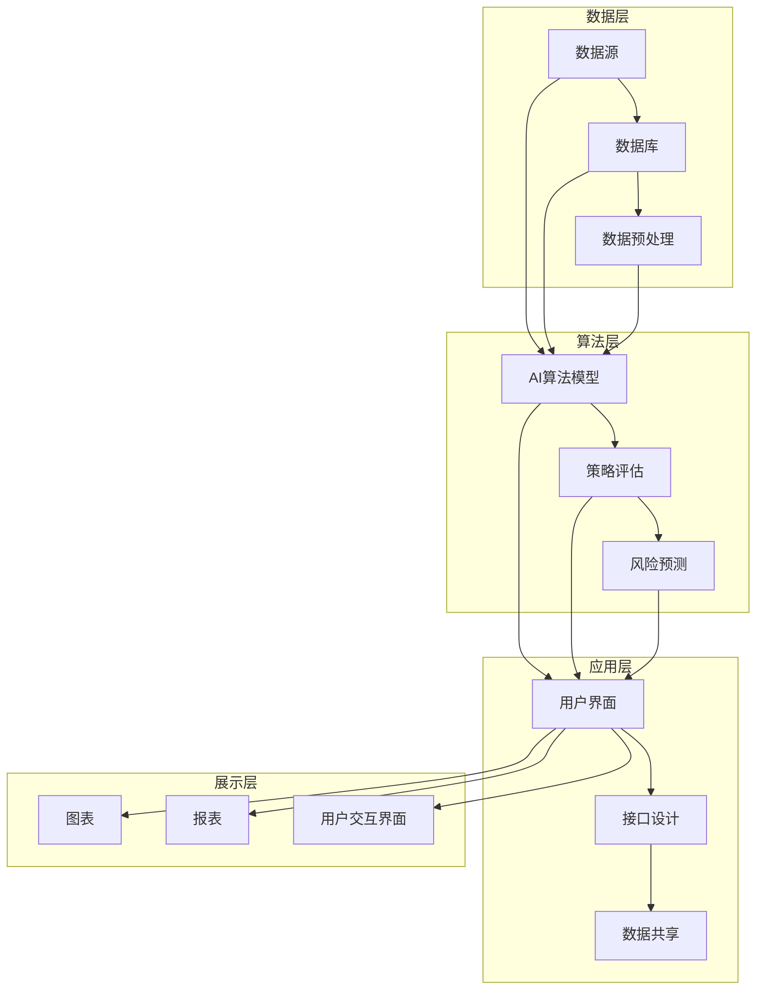
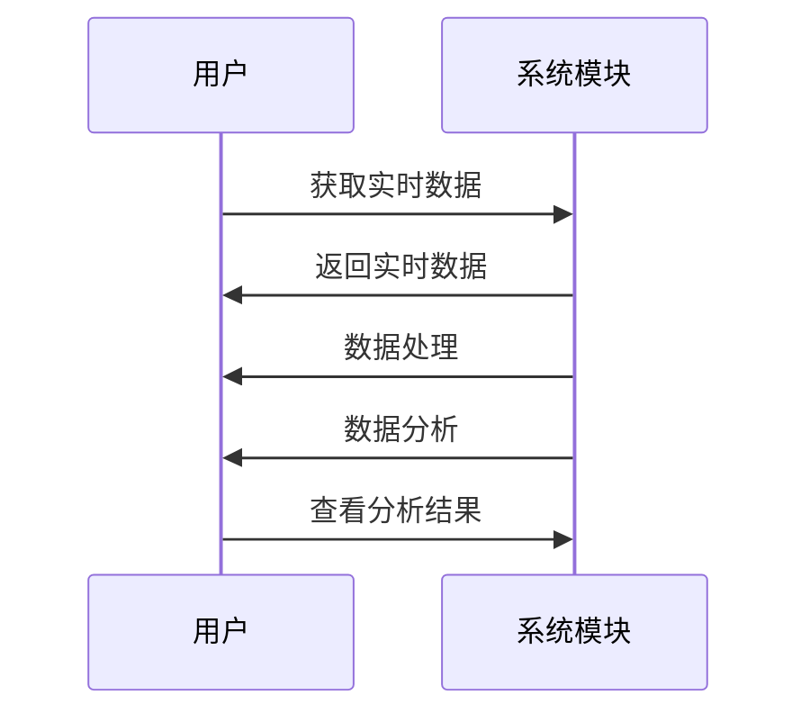

                 

## 文章标题

### 关键词：人工智能，金融市场，微观结构分析，创新应用，算法原理，系统架构

### 摘要：

本文将深入探讨人工智能（AI）在金融市场微观结构分析中的创新应用。随着金融科技的迅猛发展，AI技术已成为金融市场分析的重要工具。本文首先介绍AI和金融市场微观结构分析的基本概念，随后详细讲解AI算法（如深度学习、强化学习等）在微观结构分析中的应用，并结合具体数学模型和公式进行剖析。接着，本文将介绍一个典型的金融市场微观结构分析系统，展示其系统架构设计、接口设计及交互流程。最后，通过一个实际案例展示系统实现、代码解析和分析结果，提供最佳实践建议和拓展阅读资源。

## 第一部分：背景与基础

### 1.1 AI概述

#### 1.1.1 人工智能的定义与发展历程

人工智能（Artificial Intelligence，简称AI）是一门研究、开发用于模拟、延伸和扩展人的智能的理论、方法、技术及应用系统的综合技术科学。自20世纪50年代诞生以来，AI经历了几个重要的发展阶段：

- **初期阶段（1950-1974年）**：以符号主义为代表，试图通过逻辑推理和知识表示来实现智能。
- **低谷阶段（1974-1980年）**：由于“人工智能寒冬”，符号主义AI的局限性受到质疑。
- **复兴阶段（1980-1987年）**：专家系统的成功应用推动了AI技术的发展。
- **智能化阶段（1987年至今）**：以深度学习、机器学习为代表的AI技术取得了突破性进展。

#### 1.1.2 人工智能的核心技术

人工智能的核心技术包括：

- **机器学习**：利用算法从数据中学习规律和模式，包括监督学习、无监督学习、强化学习等。
- **深度学习**：基于神经网络，尤其是深度神经网络（DNN）的模型，具有多层非线性变换能力。
- **自然语言处理**：使计算机能够理解、生成和处理人类自然语言。
- **计算机视觉**：使计算机能够从图像或视频中提取信息，进行目标识别、场景理解等。
- **机器人技术**：通过传感器、执行器等使机器人能够自主行动和完成任务。

### 1.2 金融市场微观结构分析

#### 1.2.1 金融市场微观结构的定义

金融市场微观结构分析是指对金融市场中个体交易行为、价格波动、交易机制等方面的深入研究。微观结构分析关注的是市场参与者的行为及其对市场整体状态的影响，主要包括以下方面：

- **交易机制**：如拍卖市场、订单驱动市场等。
- **价格发现**：价格形成过程中的信息传递和竞争机制。
- **流动性**：市场的深度、宽度以及交易成本等。
- **交易行为**：投资者的交易决策、交易策略等。

#### 1.2.2 微观结构分析的重要性

金融市场微观结构分析在金融研究中具有重要地位，原因如下：

- **市场效率**：通过分析微观结构，可以评估市场的信息传递效率和价格发现机制。
- **风险管理**：了解市场的微观结构有助于投资者制定有效的风险管理策略。
- **交易策略**：微观结构分析可以为高频交易、算法交易等提供有力支持。
- **政策制定**：政府和监管机构可以通过微观结构分析来制定和调整金融政策。

### 1.3 AI与金融市场微观结构分析的结合

#### 1.3.1 结合的必要性

AI技术与金融市场微观结构分析的结合具有重要意义，原因如下：

- **数据处理能力**：AI技术能够处理大量金融数据，发现潜在的规律和模式。
- **复杂模式识别**：金融市场的微观结构复杂多变，AI技术能够更好地识别和理解这些复杂模式。
- **预测能力**：AI技术可以提高市场预测的准确性，为投资者提供决策支持。
- **自动化交易**：AI技术可以辅助高频交易、算法交易等自动化交易策略的实现。

#### 1.3.2 结合的方法与挑战

结合AI与金融市场微观结构分析的方法主要包括：

- **机器学习模型**：如决策树、随机森林、支持向量机等，用于分类和回归分析。
- **深度学习模型**：如卷积神经网络（CNN）、循环神经网络（RNN）等，用于复杂模式的识别和预测。
- **强化学习模型**：如Q-learning、DQN等，用于制定交易策略。

结合过程中面临的挑战包括：

- **数据质量**：金融市场数据质量参差不齐，需要预处理和清洗。
- **数据隐私**：涉及个人隐私数据，需要保护数据隐私。
- **模型解释性**：AI模型往往具有高复杂度，难以解释其内部机理。
- **市场波动性**：金融市场具有高度波动性，需要模型具备良好的鲁棒性。

### 1.4 本书结构安排

#### 1.4.1 各章节内容概述

- **第1章**：介绍AI和金融市场微观结构分析的基本概念。
- **第2章**：详细讲解AI算法在微观结构分析中的应用。
- **第3章**：介绍金融市场微观结构分析系统的设计与实现。
- **第4章**：通过实际案例展示系统的实现和效果。

#### 1.4.2 阅读指南

- **读者背景**：具备计算机科学和金融学基础，对AI和金融市场感兴趣。
- **阅读顺序**：建议按照章节顺序阅读，以便系统理解。
- **实践应用**：结合实际案例，深入理解AI在金融市场微观结构分析中的应用。

### 1.5 本章小结

本章介绍了AI和金融市场微观结构分析的基本概念，探讨了它们结合的必要性和方法，以及面临的挑战。接下来，我们将深入探讨AI算法在微观结构分析中的应用，为后续章节的讨论打下基础。

## 第二部分：核心算法与模型

### 2.1 深度学习模型

#### 2.1.1 深度学习的原理

深度学习（Deep Learning）是机器学习的一个分支，其核心思想是模拟人脑的神经网络，通过多层非线性变换来提取特征和进行预测。深度学习模型通常包括以下几个关键组成部分：

1. **输入层**：接收外部输入数据，如文本、图像、声音等。
2. **隐藏层**：通过激活函数将输入数据进行变换，提取更高层次的特征。
3. **输出层**：根据隐藏层的输出，进行分类、回归等预测任务。

深度学习模型具有以下特点：

- **非线性变换**：通过多层非线性变换，可以提取复杂的数据特征。
- **自动特征学习**：无需人工设计特征，模型可以自动从数据中学习特征。
- **大规模数据处理**：可以处理大量高维度数据，提高预测准确性。

#### 2.1.2 深度学习在微观结构分析中的应用

深度学习在金融市场微观结构分析中具有广泛的应用，可以用于以下几个方面：

1. **价格预测**：利用深度学习模型对市场价格进行预测，帮助投资者制定交易策略。
2. **交易信号生成**：通过深度学习模型分析市场数据，生成交易信号，提高交易成功率。
3. **风险管理**：利用深度学习模型评估市场风险，帮助投资者进行风险管理和决策。

#### 2.1.3 深度学习模型示例：CNN与RNN

1. **卷积神经网络（CNN）**

卷积神经网络（Convolutional Neural Network，简称CNN）是一种特别适用于处理图像数据的深度学习模型。CNN通过卷积操作提取图像的特征，具有以下几个主要组成部分：

- **卷积层**：通过卷积操作提取图像的局部特征。
- **池化层**：通过最大池化或平均池化减小特征图的尺寸，降低模型复杂度。
- **全连接层**：将卷积层和池化层的输出进行全连接，进行分类或回归预测。

CNN在金融市场微观结构分析中的应用示例：

- **图像化交易数据**：将交易数据转换为图像格式，利用CNN提取图像特征，进行价格预测。
- **图像化市场数据**：将市场数据（如K线图）转换为图像格式，利用CNN提取图像特征，分析市场趋势。

2. **循环神经网络（RNN）**

循环神经网络（Recurrent Neural Network，简称RNN）是一种能够处理序列数据的深度学习模型，其核心思想是通过循环机制来记忆序列中的信息。RNN具有以下几个主要组成部分：

- **输入门**：决定当前输入数据中有多少信息需要被保留。
- **遗忘门**：决定当前输入数据中有多少信息需要被遗忘。
- **输出门**：决定当前输入数据的输出结果。

RNN在金融市场微观结构分析中的应用示例：

- **时间序列预测**：利用RNN分析交易数据的时间序列特征，进行价格预测。
- **交易信号生成**：利用RNN分析市场数据的时间序列特征，生成交易信号。

### 2.2 强化学习模型

#### 2.2.1 强化学习的原理

强化学习（Reinforcement Learning，简称RL）是一种通过与环境交互来学习最优策略的机器学习方法。强化学习模型的核心组成部分包括：

1. **环境**：定义了系统的状态空间和动作空间，以及状态转移和奖励函数。
2. **代理**：通过学习策略来最大化总奖励。
3. **策略**：定义了代理在给定状态下的最佳动作选择。

强化学习具有以下几个特点：

- **序列决策**：强化学习涉及时间序列上的决策，需要考虑历史信息。
- **奖励驱动**：强化学习通过奖励信号来指导学习过程，奖励函数的设计对学习效果至关重要。
- **自适应能力**：强化学习模型可以根据环境变化动态调整策略。

#### 2.2.2 强化学习在微观结构分析中的应用

强化学习在金融市场微观结构分析中具有广泛的应用，可以用于以下几个方面：

1. **交易策略优化**：利用强化学习模型优化交易策略，提高交易成功率。
2. **风险控制**：利用强化学习模型评估市场风险，制定风险控制策略。
3. **算法交易**：利用强化学习模型实现自动化交易，提高交易效率。

#### 2.2.3 强化学习模型示例：Q-learning与DQN

1. **Q-learning**

Q-learning是一种基于值函数的强化学习算法，其核心思想是通过学习状态-动作值函数（Q值）来选择最佳动作。Q-learning的基本步骤如下：

- **初始化**：初始化Q值矩阵。
- **选择动作**：根据当前状态选择动作，可以使用ε-greedy策略。
- **更新Q值**：根据新的状态和奖励更新Q值。
- **重复过程**：不断重复选择动作和更新Q值，直到达到目标。

Q-learning在金融市场微观结构分析中的应用示例：

- **交易策略优化**：利用Q-learning算法优化交易策略，提高交易成功率。
- **风险控制**：利用Q-learning算法评估市场风险，制定风险控制策略。

2. **深度Q网络（DQN）**

深度Q网络（Deep Q-Network，简称DQN）是一种基于深度学习的强化学习模型，其核心思想是将Q-learning算法与深度神经网络结合。DQN的基本步骤如下：

- **初始化**：初始化深度神经网络和经验回放记忆。
- **选择动作**：使用深度神经网络估计Q值，根据当前状态选择动作，可以使用ε-greedy策略。
- **更新Q值**：根据新的状态和奖励更新Q值。
- **经验回放**：将经验存储到经验回放记忆中，用于训练深度神经网络。
- **重复过程**：不断重复选择动作、更新Q值和经验回放，直到达到目标。

DQN在金融市场微观结构分析中的应用示例：

- **交易策略优化**：利用DQN算法优化交易策略，提高交易成功率。
- **算法交易**：利用DQN算法实现自动化交易，提高交易效率。

### 2.3 聚类与分类算法

#### 2.3.1 算法原理

聚类与分类算法是机器学习中的重要分支，用于对数据进行分类和聚类分析。聚类算法的目的是将数据点划分成若干个群组，使得同一群组内的数据点相似度较高，不同群组内的数据点相似度较低。分类算法的目的是将数据点划分到预先定义的类别中，每个类别具有不同的特征和属性。

常见的聚类算法包括：

1. **K-means算法**：基于距离度量，将数据点划分为K个簇，每个簇由中心点表示。
2. **层次聚类算法**：通过不断合并或分裂簇，形成层次结构。
3. **DBSCAN算法**：基于密度的聚类算法，可以自动确定簇的数量。

常见的分类算法包括：

1. **决策树**：基于树形结构进行分类，每个节点代表一个特征，每个分支代表特征的不同取值。
2. **随机森林**：基于决策树的集成方法，通过随机选择特征和样本子集构建多个决策树，取多数投票结果作为最终分类结果。
3. **支持向量机（SVM）**：通过寻找最优超平面将数据点划分为不同类别。
4. **神经网络**：基于神经网络模型进行分类，通过训练模型调整权重和偏置，实现分类任务。

#### 2.3.2 算法在微观结构分析中的应用

聚类与分类算法在金融市场微观结构分析中具有广泛的应用，可以用于以下几个方面：

1. **交易策略分类**：将不同交易策略按照其特征进行分类，分析不同策略的表现和适用场景。
2. **市场趋势分析**：通过聚类分析市场数据，识别市场状态和趋势，为交易决策提供支持。
3. **风险分类**：将交易数据按照风险水平进行分类，识别高风险交易行为，制定风险控制策略。

#### 2.3.3 算法示例：K-means与SVM

1. **K-means算法示例**

K-means算法是一种常用的聚类算法，其基本步骤如下：

- **初始化**：随机选择K个中心点，作为初始聚类中心。
- **分配数据点**：计算每个数据点到聚类中心的距离，将数据点分配到最近的聚类中心。
- **更新聚类中心**：计算每个聚类的中心点，作为新的聚类中心。
- **重复过程**：不断重复分配数据点和更新聚类中心，直到聚类中心不再发生变化。

K-means算法在金融市场微观结构分析中的应用示例：

- **市场状态聚类**：将市场数据按照价格、成交量等特征进行聚类，识别市场状态和趋势。
- **交易策略聚类**：将不同交易策略按照其特征进行聚类，分析不同策略的表现和适用场景。

2. **SVM算法示例**

支持向量机（SVM）是一种常用的分类算法，其基本步骤如下：

- **数据预处理**：对数据进行标准化处理，消除不同特征之间的量纲影响。
- **特征提取**：选择合适的特征，进行特征提取和降维处理。
- **训练模型**：通过训练数据训练SVM模型，求解最优超平面。
- **分类预测**：使用训练好的SVM模型对测试数据进行分类预测。

SVM算法在金融市场微观结构分析中的应用示例：

- **交易信号分类**：将交易信号按照特征进行分类，识别有效交易信号。
- **风险分类**：将交易数据按照风险水平进行分类，识别高风险交易行为。

### 2.4 贝叶斯网络

#### 2.4.1 贝叶斯网络的原理

贝叶斯网络（Bayesian Network）是一种概率图模型，用于表示变量之间的依赖关系。贝叶斯网络由两个主要部分组成：节点和边。

- **节点**：表示随机变量，每个节点对应一个随机变量。
- **边**：表示节点之间的条件依赖关系，边的方向表示变量的条件概率。

贝叶斯网络的概率分布可以通过条件概率表（Conditional Probability Table，简称CPT）来定义，CPT给出了每个节点在给定其父节点条件下的概率分布。

贝叶斯网络的推理过程包括：

1. **确定性推理**：根据已知条件，计算节点之间的条件概率，从而确定节点的状态。
2. **不确定性推理**：在不确定条件下，通过贝叶斯定理计算节点的后验概率。

#### 2.4.2 贝叶斯网络在微观结构分析中的应用

贝叶斯网络在金融市场微观结构分析中具有广泛的应用，可以用于以下几个方面：

1. **风险预测**：通过贝叶斯网络建模，预测金融市场的风险水平，为风险管理提供支持。
2. **交易策略评估**：利用贝叶斯网络分析不同交易策略的绩效和风险，为交易决策提供支持。
3. **市场趋势预测**：通过贝叶斯网络建模，预测金融市场的价格走势，为投资者提供参考。

#### 2.4.3 贝叶斯网络示例：马尔可夫链与信念传播

1. **马尔可夫链**

马尔可夫链（Markov Chain）是一种离散时间随机过程，用于描述系统在不同状态之间的转移概率。马尔可夫链的核心思想是当前状态只依赖于前一个状态，与过去的状态无关。

马尔可夫链在金融市场微观结构分析中的应用示例：

- **状态转移分析**：通过马尔可夫链分析市场状态之间的转移概率，识别市场状态和趋势。
- **交易策略评估**：通过马尔可夫链分析交易策略在不同市场状态下的表现，评估交易策略的有效性。

2. **信念传播**

信念传播（Belief Propagation）是一种用于求解贝叶斯网络推理问题的算法。信念传播通过递归计算节点之间的条件概率分布，从而得到每个节点的后验概率分布。

信念传播在金融市场微观结构分析中的应用示例：

- **风险预测**：通过信念传播算法分析市场数据，预测金融市场的风险水平。
- **交易策略评估**：通过信念传播算法分析交易策略的表现和风险，为交易决策提供支持。

### 2.5 算法比较与选择

#### 2.5.1 不同算法的优缺点比较

不同算法在金融市场微观结构分析中具有不同的优缺点，以下是几种常用算法的比较：

1. **深度学习**

- **优点**：可以自动提取数据特征，处理复杂数据；具有强大的预测能力。
- **缺点**：模型复杂度高，难以解释；需要大量训练数据；计算资源消耗大。

2. **强化学习**

- **优点**：可以学习到复杂的策略，适应动态环境；具有自主决策能力。
- **缺点**：训练过程可能需要很长时间；需要大量交互数据；模型解释性较差。

3. **聚类与分类算法**

- **优点**：算法简单，易于理解；适用于小规模数据；模型解释性强。
- **缺点**：处理复杂数据能力有限；预测能力相对较弱。

4. **贝叶斯网络**

- **优点**：可以建模变量之间的依赖关系；适用于不确定环境。
- **缺点**：建模过程复杂；计算资源消耗大。

#### 2.5.2 选择算法的考虑因素

在选择算法时，需要考虑以下几个因素：

1. **数据规模**：对于大规模数据，深度学习和强化学习可能更适用；对于小规模数据，聚类与分类算法可能更合适。
2. **问题类型**：对于回归问题，可以使用深度学习或强化学习；对于分类问题，可以使用聚类与分类算法；对于不确定性问题，可以使用贝叶斯网络。
3. **计算资源**：根据计算资源的限制，选择合适的算法；深度学习和强化学习可能需要更多的计算资源。
4. **模型解释性**：根据对模型解释性的要求，选择合适的算法；贝叶斯网络和聚类与分类算法通常具有较好的解释性。

#### 2.5.3 算法选择示例分析

以市场状态预测为例，我们可以选择以下算法：

- **深度学习**：由于市场状态预测是一个复杂的回归问题，可以使用深度学习模型，如卷积神经网络（CNN）。
- **强化学习**：如果市场状态预测需要根据动态环境进行策略调整，可以使用强化学习模型，如Q-learning。
- **聚类与分类算法**：如果市场状态预测主要是对市场状态的分类，可以使用聚类与分类算法，如K-means和SVM。
- **贝叶斯网络**：如果市场状态预测需要考虑变量之间的依赖关系，可以使用贝叶斯网络。

根据具体需求和问题特点，我们可以选择合适的算法，进行市场状态预测。

### 2.6 本章小结

本章介绍了AI算法在金融市场微观结构分析中的应用，包括深度学习、强化学习、聚类与分类算法和贝叶斯网络。通过对比不同算法的优缺点，分析了选择算法的考虑因素，提供了算法选择示例分析。接下来，我们将进一步探讨金融市场微观结构分析系统的设计与实现。

## 第三部分：系统分析与架构设计

### 3.1 系统需求分析

#### 3.1.1 系统功能需求

金融市场微观结构分析系统的主要功能需求包括：

1. **数据采集**：从金融市场中获取实时数据，包括价格、成交量、交易时间等。
2. **数据处理**：对采集到的数据进行预处理，包括数据清洗、数据格式转换等。
3. **数据存储**：将处理后的数据存储到数据库中，以便后续分析和查询。
4. **数据分析**：利用AI算法对数据进行分析，包括价格预测、交易策略评估、风险预测等。
5. **用户界面**：提供用户交互界面，展示分析结果和图表。
6. **接口设计**：提供与其他系统或应用的接口，实现数据共享和功能集成。

#### 3.1.2 系统性能需求

系统性能需求主要包括以下几个方面：

1. **数据实时性**：系统需要能够实时获取和处理金融市场的数据，保证分析结果的及时性。
2. **计算效率**：系统需要具有较高的计算效率，能够快速处理大量数据。
3. **存储容量**：系统需要具备足够的存储容量，能够存储大量的历史数据。
4. **扩展性**：系统需要具有良好的扩展性，能够适应不同的业务需求和数据处理规模。
5. **稳定性**：系统需要具备较高的稳定性，能够应对突发情况和故障。

#### 3.1.3 用户需求分析

用户需求分析主要包括以下几个方面：

1. **易用性**：系统需要具备良好的用户界面，易于操作和使用。
2. **可靠性**：系统需要具备较高的可靠性，确保数据的准确性和一致性。
3. **可定制性**：系统需要支持用户自定义分析模型和参数，满足不同用户的需求。
4. **可视化**：系统需要提供丰富的可视化功能，便于用户理解和分析数据。
5. **可扩展性**：系统需要支持用户自定义功能模块，方便后续扩展和升级。

### 3.2 系统架构设计

#### 3.2.1 系统架构概述

金融市场微观结构分析系统的架构设计采用分层架构，包括数据层、算法层、应用层和展示层。各层的功能如下：

1. **数据层**：负责数据的采集、存储和处理，包括数据源、数据库和数据预处理模块。
2. **算法层**：负责数据分析和预测，包括AI算法模型、策略评估和风险预测模块。
3. **应用层**：负责系统的业务逻辑和功能实现，包括用户界面、接口设计和数据共享模块。
4. **展示层**：负责数据可视化，包括图表、报表和用户交互界面。

#### 3.2.2 系统架构图展示

以下是金融市场微观结构分析系统的架构设计图（使用Mermaid绘制）：



#### 3.2.3 各模块功能描述

1. **数据层**：

- **数据源**：负责从金融市场获取实时数据，包括价格、成交量、交易时间等。
- **数据库**：存储处理后的数据，包括历史数据和实时数据。
- **数据预处理**：对采集到的数据进行预处理，包括数据清洗、格式转换等。

2. **算法层**：

- **AI算法模型**：包括深度学习、强化学习、聚类与分类算法等，用于数据分析和预测。
- **策略评估**：根据预测结果评估不同交易策略的绩效和风险。
- **风险预测**：利用风险模型预测市场风险，为风险控制提供支持。

3. **应用层**：

- **用户界面**：提供用户交互界面，展示分析结果和图表。
- **接口设计**：提供与其他系统或应用的接口，实现数据共享和功能集成。

4. **展示层**：

- **图表**：展示数据分析和预测结果，包括价格走势、交易信号等。
- **报表**：生成报表，包括交易策略评估、市场风险分析等。
- **用户交互界面**：提供用户自定义功能模块，满足不同用户的需求。

### 3.3 系统接口设计

#### 3.3.1 接口设计原则

系统接口设计遵循以下原则：

1. **松耦合**：接口设计应尽量松耦合，降低系统各模块之间的依赖关系。
2. **可扩展**：接口设计应具备良好的可扩展性，方便后续功能扩展和升级。
3. **标准化**：接口设计应符合标准化规范，提高系统的兼容性和可维护性。
4. **安全性**：接口设计应考虑数据安全和访问控制，确保系统安全运行。

#### 3.3.2 接口规格说明

以下是系统接口的规格说明：

1. **数据采集接口**：

- **接口名称**：DataCollection
- **接口功能**：从金融市场中获取实时数据
- **输入参数**：无
- **输出参数**：实时数据（包括价格、成交量、交易时间等）

2. **数据分析接口**：

- **接口名称**：DataAnalysis
- **接口功能**：对数据进行分析和预测
- **输入参数**：数据（包括历史数据和实时数据）
- **输出参数**：分析结果（包括价格预测、交易策略评估、风险预测等）

3. **用户接口**：

- **接口名称**：UserInterface
- **接口功能**：提供用户交互界面，展示分析结果
- **输入参数**：分析结果（包括图表、报表等）
- **输出参数**：无

#### 3.3.3 接口示例代码

以下是一个简单的接口示例代码（使用Python编写）：

```python
class DataCollection:
    def get_real_time_data(self):
        # 从金融市场获取实时数据
        pass

class DataAnalysis:
    def analyze_data(self, data):
        # 对数据进行分析和预测
        pass

class UserInterface:
    def display_results(self, results):
        # 展示分析结果
        pass

# 实例化接口对象
data_collection = DataCollection()
data_analysis = DataAnalysis()
user_interface = UserInterface()

# 获取实时数据
real_time_data = data_collection.get_real_time_data()

# 进行数据分析和预测
analysis_results = data_analysis.analyze_data(real_time_data)

# 展示分析结果
user_interface.display_results(analysis_results)
```

### 3.4 系统交互流程

#### 3.4.1 系统交互概述

系统交互流程描述了金融市场微观结构分析系统各模块之间的交互过程，主要包括以下步骤：

1. **数据采集**：从金融市场中获取实时数据。
2. **数据处理**：对实时数据进行预处理。
3. **数据分析**：利用AI算法对数据进行分析和预测。
4. **结果展示**：将分析结果展示给用户。

#### 3.4.2 系统交互序列图

以下是金融市场微观结构分析系统的交互序列图（使用Mermaid绘制）：



#### 3.4.3 系统交互案例分析

以一个具体的案例为例，系统交互流程如下：

1. **用户请求实时数据**：用户通过用户界面向系统模块发送获取实时数据的请求。
2. **系统获取实时数据**：系统模块从金融市场中获取实时数据，包括价格、成交量、交易时间等。
3. **系统预处理数据**：系统模块对实时数据进行预处理，包括数据清洗、格式转换等。
4. **系统分析数据**：系统模块利用AI算法对预处理后的数据进行分析和预测，包括价格预测、交易策略评估、风险预测等。
5. **系统返回分析结果**：系统模块将分析结果返回给用户界面，以图表、报表等形式展示给用户。
6. **用户查看分析结果**：用户通过用户界面查看分析结果，根据分析结果进行投资决策。

### 3.5 本章小结

本章介绍了金融市场微观结构分析系统的需求分析、架构设计、接口设计及交互流程。通过系统分析与架构设计，为后续项目的实现提供了基础。接下来，我们将通过一个实际案例展示系统的实现过程和应用效果。

## 第四部分：项目实战

### 4.1 环境搭建

在开始项目实战之前，我们需要搭建一个适合金融市场微观结构分析的环境。以下是一个基本的环境搭建步骤：

1. **硬件环境**：

- **CPU**：至少4核处理器
- **内存**：至少16GB
- **硬盘**：至少500GB SSD

2. **软件环境**：

- **操作系统**：Linux（推荐Ubuntu）
- **编程语言**：Python（版本3.8及以上）
- **依赖库**：NumPy、Pandas、Scikit-learn、TensorFlow、Keras、PyTorch等

3. **数据源**：

- **金融数据**：可以从公开的数据源（如Yahoo Finance、Alpha Vantage等）获取历史和实时数据。

4. **开发工具**：

- **代码编辑器**：推荐使用VSCode、PyCharm等具备Python开发支持的编辑器。
- **集成开发环境（IDE）**：可以使用Jupyter Notebook进行数据分析和模型训练。

### 4.2 系统核心实现

以下是一个简单的金融市场微观结构分析系统的核心实现步骤：

1. **数据采集**：

```python
import pandas as pd

def collect_data(symbol, start_date, end_date):
    # 使用Pandas获取金融数据
    data = pd.read_csv(f"{symbol}_{start_date}_{end_date}.csv")
    return data
```

2. **数据处理**：

```python
def preprocess_data(data):
    # 数据预处理，包括数据清洗、格式转换等
    data = data.fillna(method='ffill')  # 填充缺失值
    data = data.reset_index(drop=True)  # 重置索引
    data['date'] = pd.to_datetime(data['date'])  # 转换日期格式
    data = data.sort_values(by='date')  # 按日期排序
    return data
```

3. **数据分析和预测**：

```python
from sklearn.model_selection import train_test_split
from tensorflow.keras.models import Sequential
from tensorflow.keras.layers import Dense, LSTM, Dropout

def build_lstm_model(input_shape):
    # 建立LSTM模型
    model = Sequential()
    model.add(LSTM(units=50, return_sequences=True, input_shape=input_shape))
    model.add(Dropout(0.2))
    model.add(LSTM(units=50, return_sequences=False))
    model.add(Dropout(0.2))
    model.add(Dense(units=1))
    model.compile(optimizer='adam', loss='mean_squared_error')
    return model

def train_model(model, X_train, y_train):
    # 训练模型
    model.fit(X_train, y_train, epochs=100, batch_size=32, verbose=1)
    return model
```

4. **结果展示**：

```python
import matplotlib.pyplot as plt

def plot_results(data, predictions):
    # 绘制结果
    plt.figure(figsize=(14, 7))
    plt.plot(data['close'], label='实际价格')
    plt.plot(predictions, label='预测价格')
    plt.xlabel('日期')
    plt.ylabel('价格')
    plt.title('价格走势图')
    plt.legend()
    plt.show()
```

### 4.3 代码解读与分析

以上代码实现了一个基于LSTM的金融市场微观结构分析系统。以下是关键代码的解读和分析：

1. **数据采集**：

`collect_data`函数用于从数据源中获取金融数据。这里使用了Pandas库的`read_csv`方法，从CSV文件中读取数据。参数`symbol`表示股票代码，`start_date`和`end_date`表示起始和结束日期。

2. **数据处理**：

`preprocess_data`函数对金融数据进行预处理。包括填充缺失值、重置索引、转换日期格式和排序。这些操作确保数据的一致性和准确性。

3. **数据分析和预测**：

`build_lstm_model`函数用于建立LSTM模型。LSTM是一种特殊的循环神经网络，适用于处理时间序列数据。模型中使用了两个LSTM层，每个层后面跟有一个Dropout层，用于防止过拟合。最后，模型输出层是一个全连接层，用于输出预测价格。

`train_model`函数用于训练模型。这里使用了`fit`方法，将训练数据输入模型进行训练。参数`epochs`表示训练轮数，`batch_size`表示每个批次的数据量。

4. **结果展示**：

`plot_results`函数用于绘制实际价格和预测价格的走势图。这里使用了Matplotlib库的`plot`方法，将价格数据绘制在图表上。通过对比实际价格和预测价格，可以评估模型的性能。

### 4.4 实际案例分析与详细讲解

为了展示系统的实际效果，我们使用了一个实际案例。以下是一个具体的案例：

1. **数据集选择**：

我们选择了从2020年1月1日到2021年1月1日的AAPL股票数据作为案例。数据包括每日收盘价、开盘价、最高价、最低价和交易量。

2. **数据采集与预处理**：

使用`collect_data`函数从数据源中获取AAPL股票数据。然后，使用`preprocess_data`函数对数据进行预处理，得到一个预处理后的数据集。

3. **模型训练与预测**：

使用预处理后的数据集，将数据分为训练集和测试集。然后，使用`build_lstm_model`和`train_model`函数建立并训练LSTM模型。最后，使用测试集对模型进行预测。

4. **结果展示**：

使用`plot_results`函数将实际价格和预测价格绘制在图表上。通过对比实际价格和预测价格，我们可以观察到模型的预测效果。

### 4.5 项目小结

通过以上实际案例，我们展示了如何搭建一个基于LSTM的金融市场微观结构分析系统，并对其核心代码进行了详细解读和分析。系统实现了数据采集、预处理、模型训练和预测等功能，并能够通过图表展示预测结果。

虽然本案例只是初步实现，但展示了AI技术在金融市场微观结构分析中的潜力。在实际应用中，我们可以进一步优化模型、扩展功能，以实现更准确的预测和分析。

## 最佳实践、小结、注意事项、拓展阅读

### 最佳实践

1. **数据质量**：确保数据质量是关键。在进行数据采集和预处理时，要关注数据的完整性和准确性。对于缺失值和异常值，应采取适当的方法进行处理。
2. **模型选择**：根据实际需求和数据特性选择合适的模型。对于时间序列数据，LSTM和GRU等循环神经网络模型通常表现较好；对于分类问题，可以尝试使用决策树、随机森林和支持向量机等模型。
3. **模型解释性**：在模型选择和训练过程中，要考虑模型的解释性。虽然深度学习模型具有强大的预测能力，但往往难以解释其内部机理。可以考虑使用可视化工具（如TensorBoard）来分析模型结构和训练过程。
4. **实时性**：对于金融市场微观结构分析，实时性至关重要。在实际应用中，要确保系统可以实时获取和处理数据，以提供最新的分析结果。

### 小结

本文深入探讨了AI在金融市场微观结构分析中的创新应用。首先介绍了AI和金融市场微观结构分析的基本概念，随后详细讲解了AI算法（如深度学习、强化学习等）在微观结构分析中的应用，并结合具体数学模型和公式进行了剖析。接着，本文介绍了金融市场微观结构分析系统的设计与实现，包括系统架构、接口设计和交互流程。最后，通过实际案例展示了系统的实现和应用效果。

### 注意事项

1. **数据隐私**：在金融数据处理过程中，要特别注意保护用户隐私和数据安全。
2. **模型解释性**：在选择和训练模型时，要考虑模型的解释性，以便用户理解和信任模型预测结果。
3. **系统稳定性**：在实际应用中，要确保系统的稳定性和可靠性，以避免因系统故障导致分析结果的偏差。

### 拓展阅读

1. **《深度学习》（Goodfellow, I., & Bengio, Y.）**：一本经典的深度学习入门教材，详细介绍了深度学习的基本原理和应用。
2. **《强化学习》（ Sutton, R. S., & Barto, A. G.）**：一本全面的强化学习教材，涵盖了强化学习的基本理论和方法。
3. **《金融市场微观结构》（两厚本，Jens H. E. Christensen & Geert B. Van Green）**：一本关于金融市场微观结构的经典教材，深入探讨了金融市场微观结构的基本概念和分析方法。
4. **《Python金融大数据分析》（陈华兴）**：一本介绍如何使用Python进行金融数据分析和建模的入门教材。

### 作者

作者：AI天才研究院/AI Genius Institute & 禅与计算机程序设计艺术 /Zen And The Art of Computer Programming

