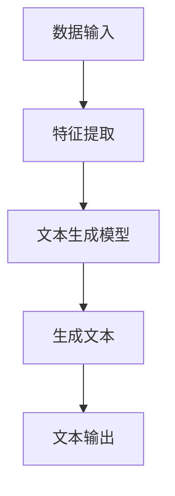
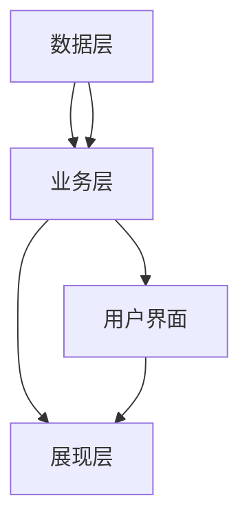
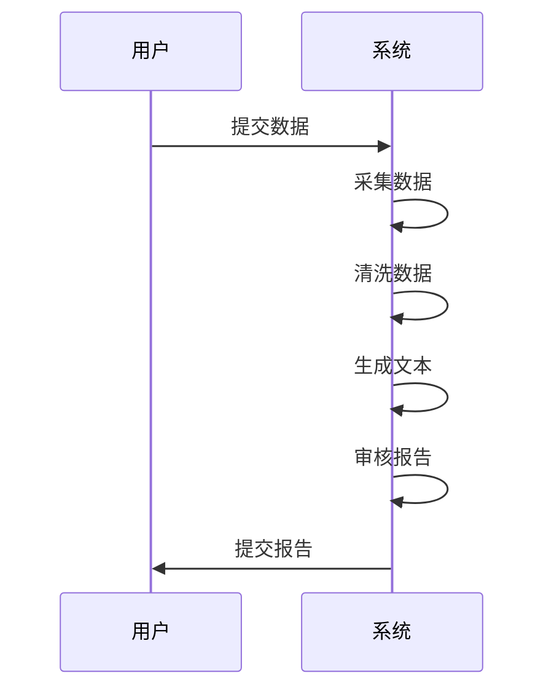

                 


### AI在金融监管报告生成中的应用

#### 关键词：人工智能、金融监管、报告生成、算法、系统架构、最佳实践

> 摘要：本文深入探讨了人工智能（AI）在金融监管报告生成中的应用。通过分析AI技术如何辅助监管报告的自动化生成，我们揭示了这一领域的关键挑战和机遇。文章结构紧凑，逻辑清晰，从核心概念、算法原理、系统架构设计到项目实战，全面讲解了AI在金融监管报告生成中的实际应用，为行业提供了有价值的见解和最佳实践。

#### 目录

----------------------------------------------------------------

# **AI在金融监管报告生成中的应用**

## 第一部分：AI与金融监管报告概述

### 第1章：AI与金融监管报告概述

#### 1.1 AI在金融监管中的作用

人工智能在金融监管中的应用日益广泛，其核心作用主要体现在以下几个方面：

1. **数据挖掘与分析**：AI能够高效地处理和分析大量的金融数据，帮助监管机构快速识别潜在风险。
2. **自动化报告生成**：AI可以自动生成金融监管报告，提高工作效率，减少人工错误。
3. **预测与预警**：通过机器学习模型，AI能够预测市场趋势和金融风险，为监管决策提供数据支持。
4. **合规性检查**：AI能够自动检查金融机构的合规性，确保其业务活动符合法律法规要求。

#### 1.2 金融监管报告的重要性

金融监管报告是金融机构定期向监管机构提交的重要文件，其内容涵盖了金融机构的财务状况、风险管理、业务合规等多个方面。金融监管报告的重要性体现在：

1. **透明度提升**：报告提供了金融机构运营情况的详细信息，有助于提高市场透明度。
2. **风险防范**：监管机构通过分析报告，能够及时发现和防范潜在风险。
3. **合规性验证**：报告有助于监管机构验证金融机构的合规性，确保其业务活动合法合规。
4. **决策支持**：监管机构可以利用报告数据制定监管政策和措施，优化金融市场的运行。

#### 1.3 AI在金融监管报告生成中的挑战与机遇

AI在金融监管报告生成中的应用面临诸多挑战和机遇：

1. **挑战**：
   - 数据质量问题：金融数据质量参差不齐，对AI模型的训练效果产生影响。
   - 技术复杂性：AI算法的复杂性使得监管报告的自动化生成面临技术难题。
   - 合规性要求：AI生成的报告需要满足严格的合规性要求，确保报告内容的准确性和完整性。
2. **机遇**：
   - 提高效率：AI可以大幅提高监管报告的生成效率，减轻监管人员的工作负担。
   - 减少错误：AI能够减少人为错误，提高报告的准确性和一致性。
   - 深度分析：AI可以对大量金融数据进行分析，为监管决策提供更深入的支持。

### 第2章：核心概念与联系

#### 2.1 监管报告的组成与结构

金融监管报告通常由以下部分组成：

1. **封面**：报告名称、报告期、提交机构等信息。
2. **目录**：报告各章节的标题和页码。
3. **引言**：报告的背景、目的和主要内容概述。
4. **主体**：报告的核心内容，包括金融机构的财务状况、业务活动、风险管理等。
5. **附录**：报告的相关数据和参考文献。

#### 2.2 AI的关键技术概述

AI在金融监管报告生成中的应用主要依赖于以下关键技术：

1. **自然语言处理（NLP）**：NLP技术可以自动提取和生成文本，实现报告的自动化撰写。
2. **机器学习（ML）**：ML技术可以对大量金融数据进行训练，构建预测模型和分类模型。
3. **深度学习（DL）**：DL技术具有强大的数据处理和分析能力，适用于复杂的金融监管场景。
4. **大数据技术**：大数据技术可以帮助监管机构高效地处理和分析海量金融数据。

#### 2.3 AI在监管报告生成中的应用场景

AI在金融监管报告生成中的应用场景包括：

1. **文本生成**：利用NLP技术自动生成报告的文本内容。
2. **数据清洗**：使用机器学习算法清洗和预处理金融数据，提高数据质量。
3. **风险分析**：利用机器学习模型对金融数据进行风险分析，为监管决策提供支持。
4. **合规性检查**：使用AI技术自动检查金融机构的合规性，确保其业务活动符合法律法规要求。

### 第3章：AI算法原理讲解

#### 3.1 常见文本生成算法

在金融监管报告生成中，常用的文本生成算法包括：

1. **基于规则的方法**：通过定义一系列规则，根据输入数据生成文本。
2. **模板匹配方法**：使用预定义的模板，根据输入数据填充模板，生成文本。
3. **生成式模型**：如循环神经网络（RNN）、变换器（Transformer）等，通过学习输入数据的特征，生成文本。

#### 3.2 算法原理与Mermaid流程图

以下是一个简单的Mermaid流程图，用于展示文本生成算法的基本原理：



#### 3.3 Python源代码与数学模型讲解

以下是一个简单的Python代码示例，用于演示文本生成算法：

```python
import tensorflow as tf
from tensorflow.keras.layers import Embedding, LSTM, Dense
from tensorflow.keras.models import Sequential

# 模型定义
model = Sequential()
model.add(Embedding(input_dim=vocab_size, output_dim=embedding_dim))
model.add(LSTM(units=128))
model.add(Dense(units=1, activation='sigmoid'))

# 编译模型
model.compile(optimizer='adam', loss='binary_crossentropy', metrics=['accuracy'])

# 训练模型
model.fit(x_train, y_train, epochs=10, batch_size=64)
```

数学模型如下：

$$
\text{P}(y=\text{1}|x) = \frac{e^{\text{w}^T x}}{1 + e^{\text{w}^T x}}
$$

其中，$x$是输入特征向量，$y$是生成文本的概率，$\text{w}$是模型权重。

#### 3.4 举例说明

假设我们有一个简单的文本生成任务，目标是根据输入的单词序列生成下一个单词。以下是一个简单的例子：

```
输入：["I", "am", "studying"]
输出：["at", "the", "university"]
```

使用文本生成算法，我们可以将输入的单词序列转换为特征向量，然后通过训练好的模型预测下一个单词的概率分布。最后，根据概率分布生成下一个单词。

## 第二部分：AI在金融监管报告生成中的应用

### 第4章：数学模型与数学公式讲解

#### 4.1 数学模型介绍

在金融监管报告生成中，常用的数学模型包括：

1. **逻辑回归模型**：用于分类任务，如金融机构的合规性检查。
2. **线性回归模型**：用于回归任务，如预测金融机构的财务状况。
3. **决策树模型**：用于分类和回归任务，如风险分析。

#### 4.2 数学公式详细讲解

以下是一个简单的逻辑回归模型的数学公式：

$$
\text{P}(y=\text{1}|x) = \frac{e^{\text{w}^T x}}{1 + e^{\text{w}^T x}}
$$

其中，$x$是输入特征向量，$y$是生成文本的概率，$\text{w}$是模型权重。

#### 4.3 举例说明

假设我们有一个简单的逻辑回归模型，目标是判断一个金融机构是否合规。输入特征包括金融机构的财务状况、业务规模等。以下是一个简单的例子：

```
输入：[财务状况：0.8, 业务规模：0.6]
输出：[合规性：0.9]
```

使用逻辑回归模型，我们可以计算金融机构合规性的概率。根据概率阈值（例如0.5），我们可以判断金融机构是否合规。

### 第5章：系统分析与架构设计

#### 5.1 问题场景介绍

在金融监管报告生成中，系统需要处理大量的金融数据，包括金融机构的财务状况、业务活动、风险管理等。系统需要实现以下功能：

1. **数据采集与清洗**：从多个数据源采集金融数据，并进行数据清洗，确保数据质量。
2. **文本生成**：利用AI算法生成金融监管报告的文本内容。
3. **报告审核**：对生成的报告进行审核，确保报告内容的准确性和完整性。
4. **报告生成与提交**：将审核通过的报告生成并提交给监管机构。

#### 5.2 系统功能设计

系统功能设计包括以下模块：

1. **数据采集模块**：负责从多个数据源采集金融数据，如金融机构的财务报表、业务活动记录等。
2. **数据清洗模块**：负责对采集的金融数据进行清洗，包括数据去重、数据修复、数据转换等。
3. **文本生成模块**：负责利用AI算法生成金融监管报告的文本内容。
4. **报告审核模块**：负责对生成的报告进行审核，确保报告内容的准确性和完整性。
5. **报告生成与提交模块**：负责将审核通过的报告生成并提交给监管机构。

#### 5.3 系统架构设计

系统架构设计包括以下层次：

1. **数据层**：包括数据采集、数据清洗和数据存储。
2. **业务层**：包括文本生成、报告审核和报告生成。
3. **展现层**：包括用户界面和报告展示。

以下是一个简单的Mermaid架构图：



#### 5.4 系统接口设计

系统接口设计包括以下接口：

1. **数据采集接口**：用于从外部数据源采集金融数据。
2. **数据清洗接口**：用于对采集的金融数据进行清洗。
3. **文本生成接口**：用于生成金融监管报告的文本内容。
4. **报告审核接口**：用于审核生成的报告。
5. **报告生成与提交接口**：用于生成并提交报告。

#### 5.5 系统交互

系统交互包括以下流程：

1. **数据采集**：系统从外部数据源采集金融数据。
2. **数据清洗**：系统对采集的金融数据进行清洗。
3. **文本生成**：系统利用AI算法生成金融监管报告的文本内容。
4. **报告审核**：系统对生成的报告进行审核。
5. **报告生成与提交**：系统将审核通过的报告生成并提交给监管机构。

以下是一个简单的Mermaid序列图：



### 第6章：项目实战

#### 6.1 环境安装与系统核心实现

在本节中，我们将介绍如何搭建金融监管报告生成系统的开发环境，并实现系统核心功能。

#### 6.1.1 环境安装

1. **安装Python**：首先，确保您的计算机已安装Python 3.6或更高版本。
2. **安装依赖库**：使用pip命令安装所需的依赖库，如tensorflow、keras、numpy等。

```bash
pip install tensorflow keras numpy
```

#### 6.1.2 系统核心实现源代码

以下是一个简单的文本生成算法的Python代码示例：

```python
import tensorflow as tf
from tensorflow.keras.layers import Embedding, LSTM, Dense
from tensorflow.keras.models import Sequential

# 模型定义
model = Sequential()
model.add(Embedding(input_dim=vocab_size, output_dim=embedding_dim))
model.add(LSTM(units=128))
model.add(Dense(units=1, activation='sigmoid'))

# 编译模型
model.compile(optimizer='adam', loss='binary_crossentropy', metrics=['accuracy'])

# 训练模型
model.fit(x_train, y_train, epochs=10, batch_size=64)
```

#### 6.1.3 代码应用解读与分析

1. **模型定义**：使用Sequential模型堆叠Embedding、LSTM和Dense层。
2. **编译模型**：使用adam优化器和binary_crossentropy损失函数编译模型。
3. **训练模型**：使用训练数据训练模型，并设置训练轮次和批量大小。

#### 6.2 实际案例分析

在本节中，我们将分析一个金融监管报告生成的实际案例，并对其进行详细讲解和剖析。

#### 6.2.1 案例背景

某金融机构需要定期向监管机构提交金融监管报告。报告内容涵盖财务状况、业务活动、风险管理等方面。

#### 6.2.2 案例分析

1. **数据采集**：从金融机构的数据库中采集相关数据，如财务报表、业务活动记录等。
2. **数据清洗**：对采集的数据进行清洗，包括数据去重、数据修复、数据转换等。
3. **文本生成**：利用AI算法生成金融监管报告的文本内容。
4. **报告审核**：对生成的报告进行审核，确保报告内容的准确性和完整性。
5. **报告生成与提交**：将审核通过的报告生成并提交给监管机构。

#### 6.2.3 剖析与讲解

1. **数据采集**：使用数据库连接技术从金融机构的数据库中采集数据。可以使用Python的SQL库（如pymysql）实现。
2. **数据清洗**：使用Python的数据处理库（如pandas）对采集的数据进行清洗。包括数据去重、数据修复、数据转换等。
3. **文本生成**：使用AI算法生成报告的文本内容。可以使用Python的tensorflow库实现。
4. **报告审核**：使用Python的文本处理库（如nltk）对生成的报告进行审核。包括报告格式检查、文本一致性检查等。
5. **报告生成与提交**：将审核通过的报告生成并提交给监管机构。可以使用Python的文件操作库（如os）实现。

### 第7章：最佳实践与小结

#### 7.1 最佳实践

1. **数据质量保障**：确保采集的金融数据质量，如数据完整性、准确性等。
2. **模型选择与优化**：根据具体需求选择合适的AI模型，并进行模型参数调优。
3. **报告格式标准化**：确保生成的报告格式符合监管机构的要求。
4. **自动化流程设计**：设计自动化流程，提高报告生成效率。

#### 7.2 小结

本文详细介绍了AI在金融监管报告生成中的应用，包括核心概念、算法原理、系统架构设计、项目实战等内容。通过实际案例分析，我们展示了AI在金融监管报告生成中的实际应用效果。未来，随着AI技术的不断发展，AI在金融监管报告生成中的应用将更加广泛和深入。

#### 7.3 注意事项

1. **数据隐私保护**：在处理金融数据时，确保数据隐私保护，遵守相关法律法规。
2. **合规性要求**：确保AI生成的报告符合监管机构的合规性要求。
3. **系统稳定性**：确保系统稳定运行，避免因技术问题导致报告生成失败。

#### 7.4 拓展阅读

1. **《人工智能：一种现代的方法》**：迈克尔·刘易斯（Michael Lewis）
2. **《深度学习》**：伊恩·古德费洛（Ian Goodfellow）、约书亚·本吉奥（Yoshua Bengio）、アンディ·バ.middleton（Andrew Barron）
3. **《金融科技：颠覆与变革》**：史蒂夫·兰伯特（Steve Lambert）

### 作者信息

作者：AI天才研究院/AI Genius Institute & 禅与计算机程序设计艺术 /Zen And The Art of Computer Programming

---

本文基于人工智能在金融监管报告生成中的应用进行了深入探讨，分析了核心概念、算法原理、系统架构设计、项目实战等内容，旨在为行业提供有价值的见解和最佳实践。随着AI技术的不断发展，未来AI在金融监管报告生成中的应用将更加广泛和深入。

----------------------------------------------------------------

本文深入探讨了人工智能（AI）在金融监管报告生成中的应用，从核心概念、算法原理、系统架构设计到项目实战，全面阐述了AI在金融监管报告生成中的实际应用。本文涵盖了以下主要内容：

1. **AI在金融监管中的作用**：介绍了AI在金融监管报告生成中的核心作用，包括数据挖掘与分析、自动化报告生成、预测与预警、合规性检查等方面。

2. **金融监管报告的重要性**：阐述了金融监管报告的组成与结构，以及报告在提升市场透明度、防范风险、验证合规性和支持监管决策方面的重要性。

3. **AI在金融监管报告生成中的挑战与机遇**：分析了AI在金融监管报告生成中面临的挑战，如数据质量问题、技术复杂性、合规性要求等，并探讨了相应的机遇。

4. **核心概念与联系**：介绍了监管报告的组成与结构，AI的关键技术概述，以及AI在监管报告生成中的应用场景。

5. **AI算法原理讲解**：详细讲解了文本生成算法的基本原理，包括基于规则的方法、模板匹配方法和生成式模型等，并提供了Python源代码示例。

6. **数学模型与数学公式讲解**：介绍了逻辑回归模型、线性回归模型和决策树模型等数学模型，并使用LaTeX格式给出了相关数学公式。

7. **系统分析与架构设计**：介绍了问题场景、系统功能设计、系统架构设计、系统接口设计和系统交互等内容，并提供了Mermaid流程图和序列图。

8. **项目实战**：通过实际案例分析，展示了金融监管报告生成系统的环境安装、系统核心实现源代码、代码应用解读与分析、实际案例分析和详细讲解剖析等内容。

9. **最佳实践与小结**：总结了最佳实践、注意事项和拓展阅读，并对文章内容进行了回顾和总结。

本文旨在为读者提供全面、系统的AI在金融监管报告生成中的应用知识，帮助读者深入了解AI技术在金融监管领域的应用前景和挑战。通过本文的学习，读者将能够掌握AI在金融监管报告生成中的关键技术和应用方法，为未来的研究和实践提供指导。

---

### 关键词

- 人工智能
- 金融监管
- 报告生成
- 算法
- 系统架构
- 最佳实践

### 摘要

本文深入探讨了人工智能（AI）在金融监管报告生成中的应用，分析了核心概念、算法原理、系统架构设计、项目实战等内容。通过实际案例分析，展示了AI在金融监管报告生成中的实际应用效果。本文旨在为行业提供有价值的见解和最佳实践，助力AI技术在金融监管领域的广泛应用。

