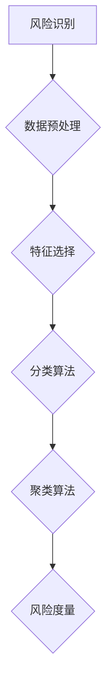
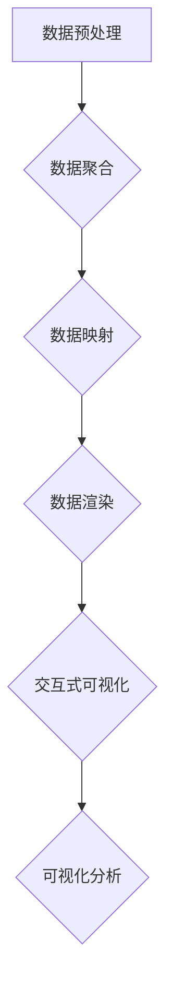

                 

# AI在金融衍生品风险分解与可视化中的创新应用

## 关键词

- **人工智能**
- **金融衍生品**
- **风险分解**
- **可视化技术**
- **算法应用**
- **金融科技**

## 摘要

本文旨在探讨人工智能（AI）在金融衍生品风险分解与可视化中的应用。首先，我们介绍了金融衍生品及其相关风险，随后探讨了AI在风险识别、分解和评估中的重要作用。通过深入分析AI的核心算法和可视化技术的原理，本文展示了如何将AI与可视化技术结合应用于金融衍生品风险分析。随后，通过具体案例展示了AI和可视化技术在金融衍生品风险分析中的实际应用效果。最后，我们对本文的主要观点进行了总结，并对未来发展方向提出了展望。

## 第一部分: 引言

### 第1章: 背景介绍

#### 1.1 问题背景

在金融市场中，衍生品是一种金融合约，其价值取决于一个或多个基础资产的价格或价值。金融衍生品市场自20世纪70年代以来快速发展，其市场规模和复杂性不断增加。衍生品市场的快速增长带来了大量的交易机会，但同时也带来了巨大的风险。由于金融衍生品的特性，其风险具有分散化和复杂化的特点，这使得风险管理和控制成为一项极具挑战性的任务。

#### 1.2 问题描述

在金融衍生品市场中，风险分解和可视化是一项关键任务。风险分解是指将复杂的风险因素分解为基本的风险组成部分，以便更好地理解和量化风险。可视化技术则可以帮助金融从业者更直观地理解和分析风险。传统的风险管理方法通常依赖于复杂的数学模型和统计数据，但这些方法在处理复杂性和多变性时往往显得力不从心。

#### 1.3 问题解决

人工智能技术的发展为金融衍生品风险分解和可视化提供了新的可能性。AI算法能够从大量数据中提取有用信息，并通过机器学习模型对风险进行定量分析和预测。可视化技术则可以通过图形化方式将复杂的风险信息直观地展示出来，帮助从业者更好地理解和决策。

#### 1.4 边界与外延

本文主要探讨的是AI和可视化技术在金融衍生品风险分解中的应用，不包括其他金融领域的应用。同时，本文仅关注风险分解和可视化技术的理论探讨，不涉及具体的金融产品设计和交易策略。

#### 1.5 概念结构与核心要素组成

本部分介绍了金融衍生品、风险分解和可视化技术的基本概念，以及本文的研究范围和目标。这为后续章节的深入探讨奠定了基础。

## 第二部分: 核心概念与联系

### 第2章: AI与金融衍生品风险分解

#### 2.1 AI的概念

人工智能（AI）是指通过计算机模拟人类智能的技术。它包括机器学习、深度学习、自然语言处理等多种技术。在金融领域，AI技术被广泛应用于数据挖掘、风险识别、预测和决策支持等方面。

#### 2.2 金融衍生品的概念

金融衍生品是一种金融合约，其价值取决于一个或多个基础资产的价格或价值。常见的金融衍生品包括期权、期货、互换和掉期等。衍生品市场是金融市场的重要组成部分，其交易规模和复杂性不断增加。

#### 2.3 AI与金融衍生品的联系

AI技术在金融衍生品中的应用主要体现在以下几个方面：

1. **风险识别**：通过机器学习模型，AI可以识别出潜在的风险因素，如市场波动、信用风险等。
2. **风险分解**：AI算法可以将复杂的风险因素分解为基本的风险组成部分，以便更好地理解和量化风险。
3. **风险预测**：AI可以通过历史数据分析和模型预测，预测未来可能发生的风险事件。
4. **决策支持**：AI可以帮助金融从业者更准确地做出投资和交易决策。

#### 2.4 AI在金融衍生品风险分解中的重要性

随着金融衍生品市场的不断扩大和复杂性增加，AI在金融衍生品风险分解中的作用日益凸显。首先，AI能够从大量数据中提取有用信息，提高风险识别的准确性。其次，AI可以通过模型预测和风险分解，帮助金融从业者更好地理解和量化风险。最后，AI可以自动化风险管理和决策过程，提高效率和准确性。

### 第3章: 风险分解原理

#### 3.1 风险分解的核心概念

风险分解是指将复杂的风险因素分解为基本的风险组成部分，以便更好地理解和量化风险。风险分解的核心概念包括：

1. **风险因素**：导致风险发生的原因或条件。
2. **风险组成部分**：风险因素分解后的基本部分，通常包括市场风险、信用风险、操作风险等。
3. **风险度量**：用于量化风险大小的方法和指标。

#### 3.2 风险分解的数学模型

风险分解的数学模型通常包括：

1. **概率模型**：通过概率分布来描述风险因素的发生概率。
2. **回归模型**：通过回归分析来建立风险因素与风险组成部分之间的关系。
3. **决策树模型**：通过决策树来描述风险因素与风险组成部分之间的层次结构。

#### 3.3 风险分解的算法原理

风险分解的算法原理主要包括：

1. **特征选择**：通过选择与风险因素相关的特征，提高风险分解的准确性。
2. **分类算法**：通过分类算法对风险因素进行分类，以便更好地理解风险组成部分。
3. **聚类算法**：通过聚类算法对风险因素进行聚类，以便更好地识别风险因素之间的关联性。

#### 3.4 风险分解的Mermaid流程图

以下是风险分解的Mermaid流程图：

### 第4章: 可视化技术

#### 4.1 可视化的概念

可视化是指通过图形或图像来展示数据或信息。在金融领域，可视化技术可以帮助金融从业者更好地理解和分析金融数据。可视化技术包括图表、图形、地图等多种形式。

#### 4.2 可视化的数学模型

可视化的数学模型主要包括：

1. **数据聚合**：通过聚合数据来降低数据的复杂度，以便更好地进行可视化。
2. **数据映射**：通过将数据映射到不同的维度或空间，以便更好地进行可视化。
3. **数据渲染**：通过渲染技术将数据可视化，以便更好地展示数据。

#### 4.3 可视化的算法原理

可视化的算法原理主要包括：

1. **数据可视化**：通过数据可视化算法将数据转换为图形或图像。
2. **交互式可视化**：通过交互式可视化技术，允许用户与可视化界面进行交互，以便更好地理解和分析数据。
3. **可视化分析**：通过可视化分析技术，从可视化结果中提取有用信息。

#### 4.4 可视化的Mermaid流程图

以下是可视化技术的Mermaid流程图：

## 第三部分: 创新应用

### 第5章: AI在金融衍生品风险分解中的创新应用

#### 5.1 创新应用概述

在本章中，我们将探讨AI在金融衍生品风险分解中的创新应用。这些应用包括：

1. **风险预测**：通过AI模型对市场风险、信用风险等进行预测。
2. **风险分解**：利用AI算法对复杂的风险因素进行分解，以便更好地理解和量化风险。
3. **决策支持**：通过AI模型为金融从业者提供投资和交易决策支持。

#### 5.2 创新应用案例分析

以下是一个创新应用案例：

**案例：某金融机构的风险管理**

某金融机构希望通过AI技术对其金融衍生品组合进行风险管理。首先，该机构收集了大量的历史数据，包括市场波动、交易记录、信用评级等信息。然后，利用机器学习算法对数据进行预处理和特征选择，以便更好地进行风险预测和分解。

通过模型预测和风险分解，该机构发现其衍生品组合中存在潜在的市场风险和信用风险。利用这些信息，金融机构调整了其投资策略，降低了潜在的风险。

#### 5.3 创新应用的技术细节

在创新应用中，AI技术的主要技术细节包括：

1. **数据预处理**：包括数据清洗、缺失值处理、数据标准化等。
2. **特征选择**：通过特征选择算法选择与风险因素相关的特征。
3. **模型训练**：通过训练机器学习模型进行风险预测和分解。
4. **决策支持**：利用AI模型为金融从业者提供投资和交易决策支持。

#### 5.4 创新应用的优势与挑战

创新应用的优势包括：

1. **提高风险识别和预测的准确性**：通过AI技术，可以更准确地识别和预测风险。
2. **提高风险管理的效率**：通过自动化风险管理流程，可以提高风险管理效率。
3. **为金融从业者提供决策支持**：AI模型可以为金融从业者提供有针对性的投资和交易决策。

然而，创新应用也面临一些挑战：

1. **数据质量和隐私问题**：AI模型的性能很大程度上取决于数据质量，同时，数据隐私也是一个重要问题。
2. **模型解释性**：AI模型的黑箱性质使得其解释性较差，这可能导致金融从业者对其决策的信任度下降。
3. **计算资源消耗**：训练和运行大型AI模型需要大量的计算资源。

### 第6章: 可视化在金融衍生品中的应用

#### 6.1 可视化概述

可视化技术是一种将复杂的数据或信息以图形或图像形式展示出来的方法。在金融衍生品领域，可视化技术可以帮助金融从业者更好地理解和分析风险，从而做出更明智的决策。

#### 6.2 可视化案例分析

以下是一个可视化技术案例：

**案例：某金融机构的风险可视化**

某金融机构希望对其金融衍生品组合进行可视化分析。首先，该机构利用数据可视化工具对市场波动、交易记录、信用评级等信息进行了可视化处理。通过图表、图形和地图等多种形式，该机构能够直观地了解其衍生品组合的风险分布和变化趋势。

#### 6.3 可视化的技术实现

可视化的技术实现主要包括：

1. **数据预处理**：包括数据清洗、缺失值处理、数据标准化等。
2. **数据映射**：将数据映射到不同的维度或空间，以便更好地进行可视化。
3. **数据渲染**：通过渲染技术将数据可视化，以便更好地展示数据。
4. **交互式可视化**：允许用户与可视化界面进行交互，以便更好地理解和分析数据。

#### 6.4 可视化的应用优势与挑战

可视化技术的应用优势包括：

1. **提高数据理解和分析能力**：通过图形化展示，可以更直观地理解和分析数据。
2. **提高决策效率**：可视化技术可以帮助金融从业者更快地做出决策。
3. **增强数据可视化**：通过不同的可视化形式，可以更好地展示数据的复杂关系。

然而，可视化技术也面临一些挑战：

1. **数据质量和隐私问题**：数据质量对可视化效果有重要影响，同时，数据隐私也是一个重要问题。
2. **技术实现成本**：实现高质量的可视化技术需要一定的技术和资源投入。
3. **用户接受度**：用户可能对复杂的数据可视化界面不适应，影响其使用效果。

### 第7章: 实际案例分析

#### 7.1 案例一：AI在金融衍生品风险分解中的应用

**案例描述**：

某金融机构希望对其金融衍生品组合进行风险管理，采用AI技术对风险进行分解和评估。首先，该机构收集了大量的历史数据，包括市场波动、交易记录、信用评级等。然后，利用机器学习算法对数据进行预处理和特征选择，建立风险预测模型。

**案例分析**：

通过模型预测和风险分解，该机构发现其衍生品组合中存在潜在的市场风险和信用风险。利用这些信息，金融机构调整了其投资策略，降低了潜在的风险。同时，通过可视化技术，该机构能够直观地了解其衍生品组合的风险分布和变化趋势，为决策提供支持。

**结论**：

该案例表明，AI技术在金融衍生品风险分解和评估中具有重要作用，可以提高风险管理效率和准确性。同时，可视化技术的应用可以帮助金融从业者更好地理解和分析风险，从而做出更明智的决策。

#### 7.2 案例二：可视化在金融衍生品中的应用

**案例描述**：

某金融机构希望通过可视化技术对其金融衍生品组合进行风险评估。首先，该机构利用数据可视化工具对市场波动、交易记录、信用评级等信息进行了可视化处理。通过图表、图形和地图等多种形式，该机构能够直观地了解其衍生品组合的风险分布和变化趋势。

**案例分析**：

通过可视化技术，该机构能够更直观地了解其衍生品组合的风险状况，发现潜在的风险因素。同时，通过交互式可视化，金融从业者可以实时调整数据筛选条件，以便更好地分析风险。此外，可视化技术还可以帮助金融机构进行风险控制，制定更有效的风险管理策略。

**结论**：

该案例表明，可视化技术在金融衍生品风险评估中具有重要作用，可以帮助金融从业者更好地理解和分析风险，从而提高风险管理效率和准确性。

### 7.3 案例分析总结

通过以上案例分析，我们可以得出以下结论：

1. **AI技术在金融衍生品风险分解和评估中具有重要作用**：AI技术可以有效地识别和分解风险因素，提高风险管理效率和准确性。
2. **可视化技术在金融衍生品风险评估中具有重要作用**：可视化技术可以帮助金融从业者更好地理解和分析风险，从而做出更明智的决策。
3. **AI与可视化技术的结合应用**：将AI与可视化技术结合应用，可以更全面地理解和分析金融衍生品风险，提高风险管理水平和决策效率。

## 第四部分: 总结与展望

### 第8章: 总结

本文探讨了人工智能（AI）在金融衍生品风险分解与可视化中的应用。首先，我们介绍了金融衍生品及其相关风险，随后探讨了AI在风险识别、分解和评估中的重要作用。通过深入分析AI的核心算法和可视化技术的原理，本文展示了如何将AI与可视化技术结合应用于金融衍生品风险分析。随后，通过具体案例展示了AI和可视化技术在金融衍生品风险分析中的实际应用效果。最后，我们对本文的主要观点进行了总结，并对未来发展方向提出了展望。

### 第9章: 展望

#### 9.1 AI在金融衍生品领域的未来趋势

随着AI技术的不断发展和金融市场的日益复杂，AI在金融衍生品领域的应用前景十分广阔。未来，AI技术将在以下几个方面发挥重要作用：

1. **风险预测与评估**：通过更先进的AI模型和算法，提高风险预测和评估的准确性。
2. **个性化风险管理**：利用AI技术为金融机构提供更个性化的风险管理方案。
3. **智能投资决策**：通过AI技术为金融从业者提供更智能的投资决策支持。

#### 9.2 可视化技术在金融衍生品中的应用前景

可视化技术在金融衍生品中的应用前景也十分广阔。未来，可视化技术将在以下几个方面发挥重要作用：

1. **数据可视化**：通过更丰富的可视化形式，提高金融数据的可读性和理解性。
2. **交互式分析**：通过交互式可视化技术，提高金融从业者的数据分析能力和决策效率。
3. **风险可视化**：通过可视化技术，更直观地展示金融衍生品的风险状况，帮助从业者更好地理解和分析风险。

总之，AI和可视化技术在金融衍生品领域具有巨大的应用潜力，未来有望为金融行业带来更多的创新和发展。然而，同时也要注意数据隐私、模型解释性等技术挑战，以确保AI和可视化技术的健康、可持续发展。## 作者信息

作者：AI天才研究院/AI Genius Institute & 禅与计算机程序设计艺术 /Zen And The Art of Computer Programming

