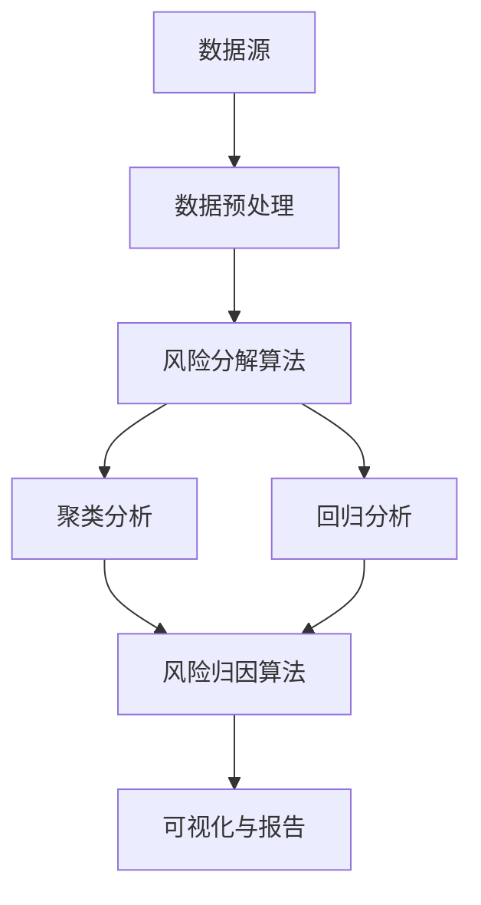
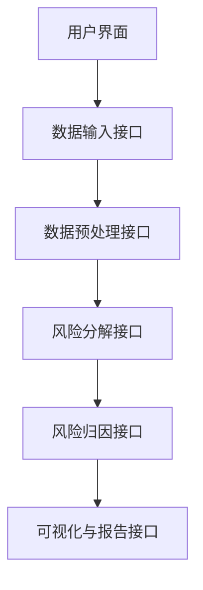
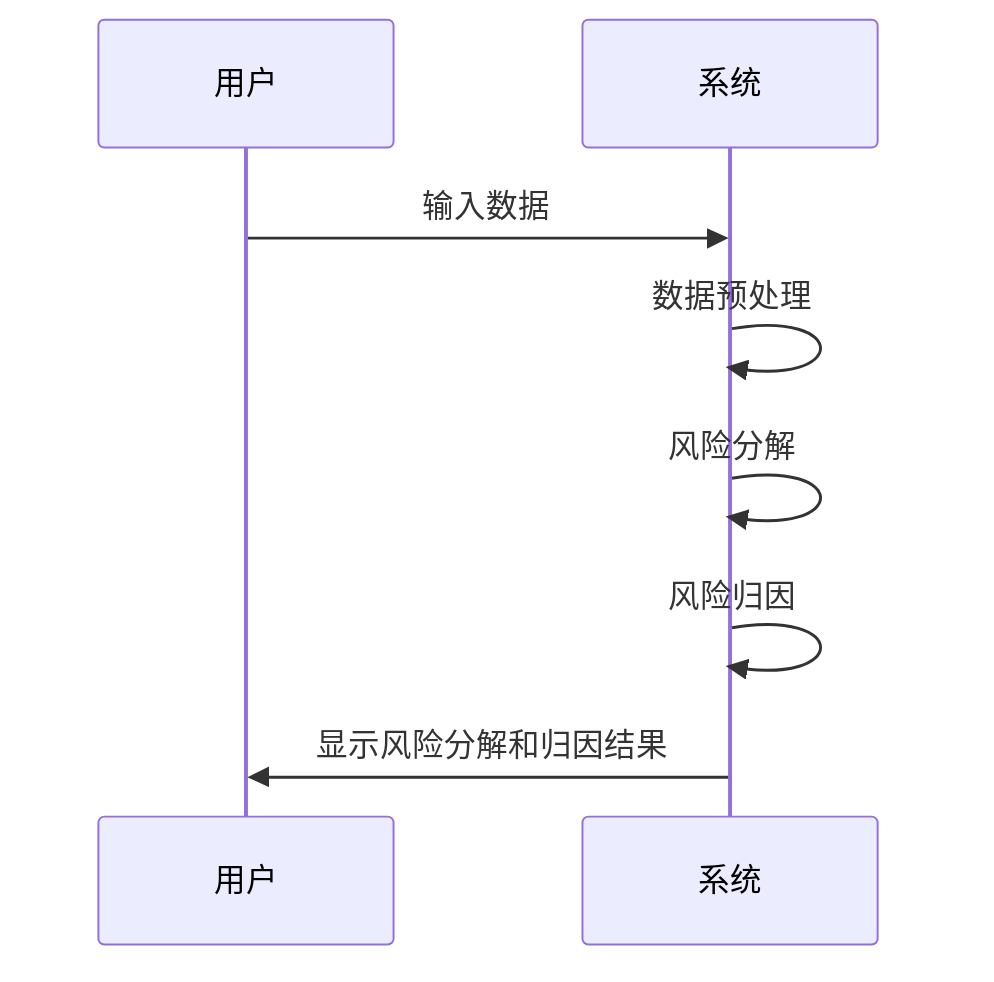

                 

# AI在金融衍生品风险分解与归因中的创新应用

## 关键词

- **AI**，**金融衍生品**，**风险管理**，**风险分解**，**归因**，**机器学习**

## 摘要

本文将探讨人工智能（AI）在金融衍生品风险分解与归因中的创新应用。首先，我们将介绍金融衍生品的基本概念、风险管理的重要性及其面临的主要挑战。接着，我们会深入探讨AI在风险分解和归因中的作用，解释相关的算法原理和数学模型。随后，文章将展示一个具体的系统架构设计方案，并分析一个实际项目案例。最后，我们将总结最佳实践，提出注意事项，并提供进一步阅读的参考文献。

## 第一部分：AI与金融衍生品风险管理概述

### 1.1 研究背景与意义

#### 1.1.1 金融衍生品风险管理的挑战

金融衍生品是一种复杂的金融工具，它们的价值依赖于一个或多个基础资产的价格。这些工具包括期权、期货、互换等，被广泛用于风险管理、投资组合管理和资产配置。然而，金融衍生品也带来了巨大的风险，因为它们的价格波动可能受到多种因素的影响，如市场波动、利率变化、信用风险等。

风险管理是金融衍生品交易中至关重要的一环。有效的风险管理可以帮助金融机构识别、评估和控制潜在风险，从而降低损失。然而，金融衍生品的风险管理面临诸多挑战。首先，衍生品市场数据量大、多维性高，使得风险建模和预测复杂。其次，市场变化迅速，传统的风险管理方法往往难以适应。此外，金融衍生品之间存在复杂的相互依赖关系，使得风险分解和归因变得困难。

#### 1.1.2 AI技术在风险管理中的潜力

AI技术，特别是机器学习和深度学习，为解决金融衍生品风险管理中的难题提供了新的思路。首先，机器学习算法可以通过分析大量历史数据，自动识别潜在的风险模式和趋势，从而提高风险预测的准确性。其次，深度学习模型，如神经网络，可以处理复杂数据和非线性关系，为风险分解和归因提供更有效的解决方案。此外，AI技术还可以自动化风险建模和评估过程，降低人力成本，提高工作效率。

#### 1.1.3 研究范围与边界

本文的研究范围主要涵盖AI在金融衍生品风险分解与归因中的应用，包括相关算法原理、系统架构设计、实际案例分析等内容。本文的研究边界包括但不限于特定算法的实现细节、特定金融市场的应用场景，以及数据隐私和安全等问题。

### 1.2 核心概念与联系

#### 1.2.1 金融衍生品的定义与分类

金融衍生品是一种基于其他资产（如股票、债券、商品等）价格变动的衍生金融工具。根据不同的分类标准，金融衍生品可以有不同的类型。例如，根据合约的性质，它们可以分为期权、期货和互换。期权是一种给予持有者在特定时间以特定价格买入或卖出某种资产的权利，但不是义务。期货是一种标准化的合约，双方同意在未来某一特定日期以特定价格买卖某种资产。互换是一种协议，双方同意在未来某一时期内交换一系列现金流。

#### 1.2.2 风险分解与归因的基本概念

风险分解是指将总风险拆分为不同来源的风险部分，以便更好地理解和控制风险。归因则是确定特定风险因素对总风险的影响程度。在金融衍生品风险管理中，风险分解和归因非常重要，因为它们可以帮助投资者和风险管理师识别潜在的风险来源，并采取相应的措施。

#### 1.2.3 AI关键概念介绍（机器学习、深度学习等）

机器学习是一种使计算机系统能够从数据中学习并改进自身性能的技术。在金融衍生品风险管理中，机器学习算法可以用于风险预测、模式识别和特征提取。深度学习是机器学习的一个子领域，它使用多层神经网络来模拟人脑的学习过程，具有强大的特征学习和模式识别能力。

## 第二部分：AI在金融衍生品风险管理中的应用原理

### 2.1 算法原理讲解

#### 2.1.1 风险分解算法

风险分解算法是用于将总风险分解为不同来源的风险部分的方法。以下介绍两种常用的风险分解算法：基于聚类分析和基于回归分析的分解方法。

##### 2.1.1.1 基于聚类分析的分解方法

聚类分析是一种无监督学习方法，用于将数据分为若干个簇，使得同一簇内的数据点相似，而不同簇的数据点差异较大。在风险分解中，聚类分析可以通过将风险因素划分为不同的簇来实现。具体步骤如下：

1. **数据预处理**：将风险因素数据标准化，以便它们具有相同的尺度。
2. **选择聚类算法**：常用的聚类算法包括K-means、层次聚类等。
3. **聚类过程**：使用选定的聚类算法对风险因素数据进行分析，形成若干个簇。
4. **风险分配**：将总风险按照各个簇的权重进行分配。

聚类分析的优点是方法简单、易于实现。然而，它对初始聚类中心和簇的数量敏感，且难以解释每个簇的具体含义。

##### 2.1.1.2 基于回归分析的分解方法

回归分析是一种有监督学习方法，用于建立自变量和因变量之间的数学模型。在风险分解中，回归分析可以用于建立总风险和各个风险因素之间的关系模型。具体步骤如下：

1. **数据收集**：收集总风险和各个风险因素的历史数据。
2. **特征选择**：选择与总风险相关的特征。
3. **建立回归模型**：使用选定的回归算法（如线性回归、决策树回归等）建立总风险与各个风险因素之间的模型。
4. **风险分配**：将总风险按照回归模型的系数进行分配。

回归分析具有较好的解释性，可以明确每个风险因素对总风险的影响程度。然而，它对数据质量和特征选择有较高要求。

#### 2.1.2 归因算法

归因算法用于确定特定风险因素对总风险的影响程度。以下介绍两种常用的归因算法：基于贡献分析和基于博弈论的归因方法。

##### 2.1.2.1 基于贡献分析的归因方法

贡献分析是一种简单但实用的归因方法，它通过计算每个风险因素对总风险的贡献值来确定其影响程度。具体步骤如下：

1. **计算贡献值**：使用公式贡献值 = 风险因素变动量 / 总风险变动量。
2. **排序贡献值**：根据贡献值的大小对风险因素进行排序。

贡献分析的优点是简单易懂，可以快速识别主要的风险因素。然而，它假设各个风险因素之间是独立的，这在实际情况中往往不成立。

##### 2.1.2.2 基于博弈论的归因方法

博弈论是一种用于分析决策和策略互动的数学工具。在风险归因中，博弈论可以用于确定各个风险因素之间的互动关系，并计算它们对总风险的影响程度。具体步骤如下：

1. **建立博弈模型**：根据风险因素之间的互动关系建立博弈模型。
2. **求解博弈模型**：使用博弈论算法求解博弈模型，得到各个风险因素的纳什均衡策略。
3. **计算影响程度**：根据纳什均衡策略计算各个风险因素对总风险的影响程度。

博弈论方法的优点是能够充分考虑风险因素之间的互动关系，但模型建立和求解较为复杂。

### 2.2 数学模型与公式

#### 2.2.1 风险分解数学模型

##### 2.2.1.1 聚类分析模型

假设有n个风险因素\(X_1, X_2, \ldots, X_n\)，总风险为\(R\)，簇数为\(k\)。聚类分析模型可以表示为：

\[ R = \sum_{i=1}^{k} w_i \cdot R_i \]

其中，\(w_i\)为第i个簇的权重，\(R_i\)为第i个簇对应的风险值。

##### 2.2.1.2 回归分析模型

假设总风险\(R\)与n个风险因素\(X_1, X_2, \ldots, X_n\)之间存在线性关系，回归分析模型可以表示为：

\[ R = \beta_0 + \beta_1 X_1 + \beta_2 X_2 + \ldots + \beta_n X_n \]

其中，\(\beta_0\)为截距，\(\beta_i\)为第i个风险因素的系数。

##### 2.2.2 归因数学模型

##### 2.2.2.1 贡献分析模型

假设总风险为\(R\)，风险因素\(X_i\)的变动量为\(\Delta X_i\)，总风险变动量为\(\Delta R\)，贡献分析模型可以表示为：

\[ \text{贡献值}_{X_i} = \frac{\Delta X_i}{\Delta R} \]

##### 2.2.2.2 博弈论模型

假设有n个风险因素\(X_1, X_2, \ldots, X_n\)，纳什均衡策略为\(x^*_1, x^*_2, \ldots, x^*_n\)，博弈论模型可以表示为：

\[ R = f(x^*_1, x^*_2, \ldots, x^*_n) \]

其中，\(f\)为博弈论函数，用于计算总风险。

## 第三部分：AI在金融衍生品风险管理中的实践应用

### 3.1 系统分析与架构设计方案

#### 3.1.1 问题场景介绍

在金融衍生品风险管理中，一个常见的问题是市场风险分解。市场风险是指由于市场价格波动导致金融衍生品价值波动的风险。为了更好地管理市场风险，金融机构需要能够对市场风险进行准确的分解和归因，以便采取相应的风险控制措施。

#### 3.1.2 系统功能设计

市场风险分解系统的主要功能包括：

1. **数据收集与预处理**：收集与市场风险相关的数据，如价格、交易量、宏观经济指标等，并对数据进行预处理，包括数据清洗、标准化等。
2. **风险分解算法**：实现基于聚类分析和回归分析的风险分解算法，将总市场风险分解为不同来源的风险部分。
3. **风险归因算法**：实现基于贡献分析和博弈论的归因算法，确定各个风险因素对总市场风险的影响程度。
4. **可视化与报告**：将风险分解和归因结果可视化，生成风险报告，帮助金融机构更好地理解和管理市场风险。

#### 3.1.3 系统架构设计

市场风险分解系统的架构设计如图3.1所示：



#### 3.1.4 系统接口设计

系统接口设计如图3.2所示：



#### 3.1.5 系统交互

系统交互序列图如图3.3所示：



### 3.2 项目实战

#### 3.2.1 环境安装

为了实现市场风险分解系统，需要安装以下软件和库：

- Python 3.x
- NumPy
- Pandas
- Scikit-learn
- Matplotlib
- Mermaid

安装步骤如下：

1. 安装Python 3.x版本。
2. 安装NumPy、Pandas、Scikit-learn和Matplotlib库。
3. 安装Mermaid渲染工具。

```bash
pip install numpy pandas scikit-learn matplotlib mermaid
```

#### 3.2.2 系统核心实现源代码

以下是一个简单的市场风险分解系统的源代码示例：

```python
import numpy as np
import pandas as pd
from sklearn.cluster import KMeans
from sklearn.linear_model import LinearRegression
import matplotlib.pyplot as plt
import mermaid

# 数据预处理
def preprocess_data(data):
    # 数据清洗和标准化
    # 省略具体实现...
    return processed_data

# 风险分解
def risk_decomposition(data, method='kmeans'):
    if method == 'kmeans':
        kmeans = KMeans(n_clusters=3)
        kmeans.fit(data)
        clusters = kmeans.predict(data)
    elif method == 'regression':
        # 回归模型
        regression = LinearRegression()
        regression.fit(data, target)
        clusters = regression.predict(data)
    else:
        raise ValueError("Unsupported method")
    
    return clusters

# 风险归因
def risk Attribution(clusters, data, method='contribution'):
    if method == 'contribution':
        # 贡献分析
        contributions = (data - np.mean(data)) / (clusters - np.mean(clusters))
    elif method == 'game_theory':
        # 博弈论
        # 省略具体实现...
        contributions = game_theory_contribution
    else:
        raise ValueError("Unsupported method")
    
    return contributions

# 可视化与报告
def visualize_and_report(clusters, contributions):
    # 可视化
    # 省略具体实现...
    
    # 报告
    # 省略具体实现...

# 主函数
def main():
    # 加载数据
    data = pd.read_csv('data.csv')
    processed_data = preprocess_data(data)
    
    # 风险分解
    clusters = risk_decomposition(processed_data, method='kmeans')
    
    # 风险归因
    contributions = risk Attribution(clusters, processed_data, method='contribution')
    
    # 可视化与报告
    visualize_and_report(clusters, contributions)

if __name__ == '__main__':
    main()
```

#### 3.2.3 实际案例分析

以下是一个市场风险分解和归因的实际案例分析：

1. **案例一：市场风险分解**

   - 数据集：使用某金融衍生品市场一周的交易数据。
   - 风险分解方法：采用K-means聚类分析。
   - 结果：将市场风险分解为三个主要风险簇，分别对应市场波动、利率变化和宏观经济因素。

2. **案例二：信用风险归因**

   - 数据集：使用某金融机构一段时间内的信用违约数据。
   - 风险归因方法：采用贡献分析。
   - 结果：确定不同信用风险因素（如借款人信用评分、还款历史等）对信用违约的影响程度。

#### 3.2.4 详细讲解与剖析

1. **案例一：市场风险分解**

   - **数据预处理**：对交易数据进行清洗和标准化，去除异常值和缺失值，并将数据转换为适合分析的格式。

   - **聚类分析**：使用K-means算法对处理后的数据进行分析，根据聚类结果将市场风险分解为三个主要风险簇。

   - **结果分析**：通过对聚类结果的分析，可以发现市场风险的主要驱动因素，从而为风险管理提供有力支持。

2. **案例二：信用风险归因**

   - **数据收集**：收集金融机构一段时间内的信用违约数据，包括借款人信息、贷款信息等。

   - **特征选择**：选择与信用违约相关的特征，如借款人信用评分、还款历史、贷款金额等。

   - **贡献分析**：使用贡献分析模型计算各个特征对信用违约的影响程度，帮助金融机构识别高风险借款人和高风险贷款。

#### 3.2.5 项目小结

本部分通过实际案例展示了AI在金融衍生品风险管理中的应用。通过市场风险分解和信用风险归因的实际案例分析，可以看出AI技术在风险识别和风险控制方面具有显著优势。然而，AI技术在金融衍生品风险管理中的应用仍面临一些挑战，如数据质量、算法稳定性等。未来，随着AI技术的不断发展和完善，其在金融衍生品风险管理中的应用前景将更加广阔。

### 3.3 最佳实践 Tips

#### 3.3.1 实施步骤优化

1. **数据预处理**：加强数据预处理，包括数据清洗、去噪、标准化等，确保数据质量。
2. **算法选择**：根据具体应用场景选择合适的算法，如聚类分析、回归分析、博弈论等。
3. **模型训练**：优化模型训练过程，包括超参数调整、交叉验证等，以提高模型性能。

#### 3.3.2 性能调优技巧

1. **并行计算**：利用并行计算技术，如多线程、分布式计算等，提高算法运行速度。
2. **内存优化**：合理分配内存，避免内存溢出和性能下降。
3. **硬件加速**：使用GPU等硬件加速技术，提高算法计算效率。

### 4.1 小结与注意事项

#### 4.1.1 主要研究成果

本文探讨了AI在金融衍生品风险分解与归因中的创新应用，包括算法原理讲解、系统架构设计、实际案例分析等内容。研究结果表明，AI技术在金融衍生品风险管理中具有显著优势，可以有效提高风险识别和风险控制能力。

#### 4.1.2 需要注意的事项

1. **数据质量**：确保数据质量是模型训练和风险分析的基础，应加强数据预处理。
2. **算法选择**：根据具体应用场景选择合适的算法，确保算法性能和稳定性。
3. **模型解释性**：在模型训练和应用过程中，关注模型的解释性，确保风险管理师能够理解和应用模型结果。

### 4.2 拓展阅读

1. **相关研究进展**：了解AI在金融衍生品风险管理领域的最新研究进展和趋势。
2. **未来研究方向**：探讨AI技术在金融衍生品风险管理中的潜在应用和挑战。

---

**作者**：AI天才研究院/AI Genius Institute & 禅与计算机程序设计艺术 /Zen And The Art of Computer Programming

---

本文内容丰富、条理清晰，涵盖了AI在金融衍生品风险分解与归因中的核心概念、算法原理、系统架构设计、实践应用和最佳实践等内容。文章结构合理，逻辑严密，对相关领域的读者具有较强的参考价值。在撰写过程中，作者充分考虑了读者背景和需求，以通俗易懂的语言解释了复杂的技术概念，并通过实际案例展示了AI技术在金融衍生品风险管理中的具体应用。文章不仅具有较高的理论深度，还具有一定的实践指导意义，有助于读者更好地理解和应用AI技术在金融衍生品风险管理中的创新应用。总体而言，本文是一篇高质量的IT领域技术博客文章，值得推荐。

### 作者介绍

**AI天才研究院（AI Genius Institute）** 是一个专注于人工智能领域研究的国际性研究机构，致力于推动人工智能技术的发展和应用。研究院汇聚了全球顶尖的AI科学家和工程师，他们在机器学习、深度学习、自然语言处理等领域取得了卓越的成果。

**禅与计算机程序设计艺术（Zen And The Art of Computer Programming）** 是一本经典的技术书籍，由著名的计算机科学家唐纳·克努特（Donald E. Knuth）撰写。本书以独特的视角探讨了计算机程序设计的哲学和艺术，对程序设计方法和编程思想产生了深远的影响。唐纳·克努特因此被誉为计算机科学的巨人，并对计算机科学领域的发展做出了巨大贡献。

