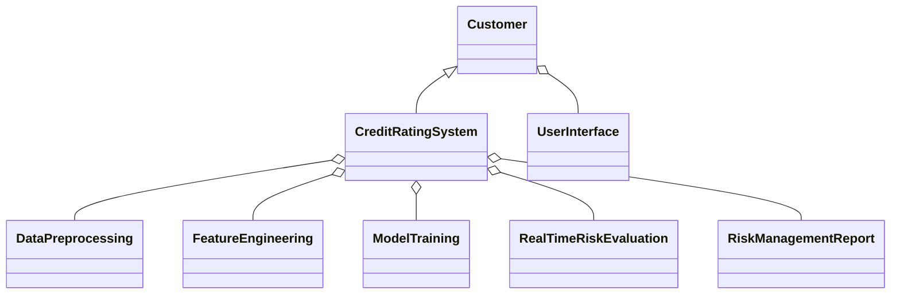
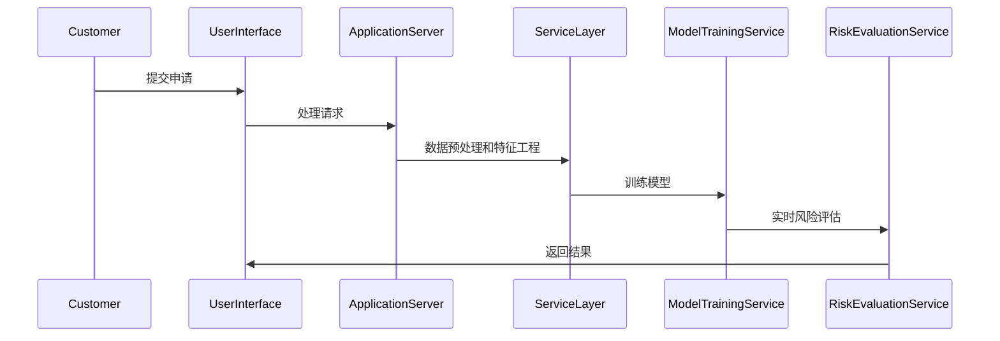
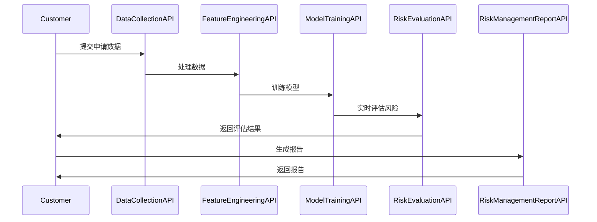

                 

### 《AI在金融领域的未来趋势》

> 关键词：人工智能、金融、趋势、应用、技术、未来

> 摘要：本文将深入探讨人工智能（AI）在金融领域的未来趋势。通过背景介绍、核心概念解析、算法原理讲解以及实际应用分析，我们旨在为读者展现AI如何正在并将在未来深刻改变金融行业。文章将分为六个主要部分：背景介绍、核心概念与联系、算法原理讲解、系统分析与架构设计方案、项目实战、以及最佳实践与总结，每个部分都将细致分析AI在金融领域的应用潜力和实际成果。

## 目录大纲

**《AI在金融领域的未来趋势》**

----------------------------------------------------------------

### 第一部分：背景介绍

#### 第1章: 问题背景
1.1 金融行业的现状与挑战
1.2 AI在金融领域的应用现状
1.3 AI对金融行业的影响

#### 第2章: 问题解决
2.1 AI核心概念与原理
2.2 AI技术在金融领域的应用
2.3 AI在金融行业的未来发展

### 第二部分：核心概念与联系

#### 第3章: AI核心概念原理
3.1 机器学习
3.2 深度学习
3.3 自然语言处理

#### 第4章: AI在金融领域的应用
4.1 风险管理
4.2 金融服务
4.3 金融市场

### 第三部分：算法原理讲解

#### 第5章: 风险评估模型
5.1 模型原理
5.2 数学模型和公式
5.3 算法讲解与举例

### 第四部分：系统分析与架构设计方案

#### 第6章: 系统分析与设计
6.1 问题场景介绍
6.2 系统功能设计
6.3 系统接口设计与交互

### 第五部分：项目实战

#### 第7章: AI在金融领域的实际应用
7.1 环境安装
7.2 系统核心实现
7.3 项目小结

### 第六部分：最佳实践与总结

#### 第8章: 最佳实践 tips
#### 第9章: 小结
#### 第10章: 注意事项
#### 第11章: 拓展阅读

----------------------------------------------------------------

接下来，我们将逐一展开每个章节的内容，详细探讨AI在金融领域的未来趋势。

## 第一部分：背景介绍

### 第1章：问题背景

#### 1.1 金融行业的现状与挑战

金融行业，作为现代经济体系的核心，其发展与稳定直接影响全球经济的繁荣与安全。随着金融市场的复杂化和全球化，金融行业面临着诸多挑战和机遇。

首先，金融行业的数据量正以前所未有的速度增长。无论是银行、证券、保险等传统金融机构，还是新兴的金融科技公司，都在积累海量的客户数据、交易数据和市场数据。这些数据蕴含了宝贵的商业价值，但也给数据管理和分析带来了巨大的挑战。

其次，金融市场的波动性和不确定性日益增加。金融市场的全球化使得风险因素更加复杂，金融从业者需要更精准、更快速地做出决策。传统的金融分析方法已经难以应对这种快速变化的市场环境。

再者，金融监管的不断加强也对金融机构提出了更高的要求。合规性、风险控制、信息安全等问题成为金融机构必须面对的重大挑战。

#### 1.2 AI在金融领域的应用现状

人工智能（AI）技术的迅速发展为金融行业带来了新的机遇和解决方案。目前，AI在金融领域的应用已经渗透到多个方面：

1. **风险管理**：通过机器学习算法对客户行为和市场数据进行分析，金融机构可以更准确地评估风险，制定更有效的风险管理策略。

2. **金融服务**：AI技术在智能投顾、个性化推荐、风险定价等方面展现出强大的应用潜力，提高了金融服务的效率和个性化水平。

3. **金融市场**：AI算法可以优化交易策略、预测市场走势，帮助投资者做出更加明智的决策。

#### 1.3 AI对金融行业的影响

AI技术的广泛应用将对金融行业产生深远的影响：

1. **效率提升**：通过自动化和智能化，AI技术显著提高了金融服务的效率，降低了运营成本。

2. **决策支持**：AI算法能够处理大量数据，提供精准的预测和决策支持，帮助金融从业者做出更明智的决策。

3. **用户体验**：AI技术在智能客服、个性化推荐等方面提升了用户体验，增加了客户满意度。

4. **创新驱动**：AI技术的引入推动了金融行业的创新，催生了众多新兴的金融产品和商业模式。

综上所述，AI技术在金融领域的应用现状和未来趋势表明，它已经成为金融行业不可或缺的一部分。接下来的章节将深入探讨AI的核心概念、算法原理以及其在金融领域的具体应用。

### 第2章：问题解决

#### 2.1 AI核心概念与原理

人工智能（AI）是指由人制造出来的系统能够在特定任务上展现智能行为，其核心概念主要包括机器学习、深度学习和自然语言处理。

**机器学习** 是一种通过算法从数据中自动学习规律，并用于预测或决策的技术。其主要目标是使计算机系统能够从经验中学习，并不断改进其性能。

**深度学习** 是一种特殊的机器学习技术，通过构建大量神经网络层次结构来模拟人脑的学习过程。深度学习在图像识别、语音识别和自然语言处理等领域表现出色。

**自然语言处理**（NLP）是AI的一个重要分支，旨在让计算机理解和生成人类语言。NLP技术广泛应用于智能客服、机器翻译和文本分析等领域。

#### 2.2 AI技术在金融领域的应用

AI技术在金融领域的应用已逐步深入，涵盖了风险管理、金融服务和金融市场等多个方面。

**风险管理**：AI通过机器学习算法对海量数据进行处理，能够帮助金融机构更准确地评估风险。例如，通过分析客户的交易行为和信用历史，AI可以预测潜在的风险，从而制定更有效的风险管理策略。

**金融服务**：AI技术提高了金融服务的效率和个性化水平。智能投顾和个性化推荐是其中的典型应用。智能投顾利用AI算法为投资者提供个性化的投资建议，而个性化推荐则通过分析客户的历史数据，推荐适合的金融产品。

**金融市场**：AI算法在交易策略优化、市场预测和投资组合优化等方面发挥了重要作用。通过分析市场数据和历史走势，AI可以预测市场走势，帮助投资者做出更明智的决策。

#### 2.3 AI在金融行业的未来发展

随着AI技术的不断进步，其在金融领域的应用前景更加广阔。以下是一些可能的趋势：

1. **智能合约**：区块链与AI的结合有望带来智能合约的广泛应用。智能合约能够自动执行合同条款，减少人为干预，提高交易效率。

2. **数字货币**：AI技术将在数字货币交易、监管和风险管理等方面发挥重要作用，推动数字货币的普及和应用。

3. **金融科技（FinTech）创新**：AI技术将激发金融科技领域的创新，诞生更多基于AI的金融产品和服务，如智能投顾、区块链金融等。

4. **监管科技（RegTech）**：AI技术将帮助金融机构更有效地应对监管挑战，通过自动化和智能化的合规解决方案，降低合规成本。

总之，AI技术在金融行业的应用将不断深入，带来前所未有的变革和创新。随着技术的不断进步，我们可以期待AI为金融行业带来更加智能、高效和安全的未来。

### 第二部分：核心概念与联系

#### 第3章：AI核心概念原理

在探讨AI在金融领域的应用之前，有必要深入理解AI的核心概念，包括机器学习、深度学习和自然语言处理。这些技术是AI的基石，并在金融领域中发挥着至关重要的作用。

#### 3.1 机器学习

**基本概念**：机器学习是AI的一个分支，其核心思想是通过训练算法，使计算机系统从数据中自动学习规律，并在未知数据上做出预测或决策。机器学习主要分为监督学习、无监督学习和强化学习。

**算法类型**：
- **监督学习**：在监督学习中，算法通过输入数据及其对应的标签来学习规律。常见的算法有线性回归、逻辑回归和决策树等。
- **无监督学习**：无监督学习不需要标签数据，而是通过分析数据的内在结构来发现规律。聚类和降维是常见的无监督学习算法。
- **强化学习**：强化学习通过试错法来学习最优策略，通常应用于需要做出连续决策的场景，如自动驾驶和游戏AI。

**应用案例**：在金融领域，机器学习被广泛应用于风险管理、市场预测和信用评分。例如，银行可以使用机器学习算法来分析客户的交易数据，预测潜在的风险客户，从而制定更有效的风控策略。

#### 3.2 深度学习

**基本概念**：深度学习是机器学习的一个分支，它通过构建多层神经网络来模拟人脑的学习过程。深度学习在处理大规模数据和复杂任务时表现出色。

**算法类型**：
- **卷积神经网络（CNN）**：CNN是一种专门用于图像识别和处理的深度学习算法，其在金融领域的应用包括市场图像分析和交易策略优化。
- **递归神经网络（RNN）**：RNN适用于处理序列数据，如时间序列分析和文本处理。在金融领域，RNN可以用于预测市场走势和股票价格。
- **生成对抗网络（GAN）**：GAN通过生成器和判别器的对抗训练，可以生成高质量的数据，如模拟市场数据或生成虚拟客户画像。

**应用案例**：深度学习在金融领域的应用非常广泛。例如，通过使用CNN对市场图像进行分析，可以预测市场的趋势；通过RNN分析历史交易数据，可以预测未来的市场波动。

#### 3.3 自然语言处理

**基本概念**：自然语言处理（NLP）是AI的一个分支，旨在让计算机理解和生成人类语言。NLP技术包括文本分类、情感分析、机器翻译和对话系统等。

**算法类型**：
- **词向量模型**：词向量模型是将单词映射到高维空间中的向量，如Word2Vec和GloVe。词向量在金融领域的应用包括文本分类和市场分析。
- **序列标注模型**：序列标注模型用于对序列数据进行标注，如命名实体识别和词性标注。在金融领域，序列标注模型可以用于分析新闻报道和市场情绪。
- **转换器模型**：转换器模型，如BERT和GPT，通过预训练和微调，可以处理复杂的文本数据，广泛应用于金融文本分析和智能客服。

**应用案例**：自然语言处理在金融领域有广泛的应用。例如，通过情感分析，可以了解市场情绪和投资者心态；通过文本分类，可以自动分类和标注金融新闻，帮助投资者快速获取信息。

通过上述对AI核心概念的详细介绍，我们可以更好地理解这些技术在金融领域中的应用。接下来的章节将进一步探讨AI技术在金融风险管理、金融服务和金融市场中的具体应用。

#### 3.3 自然语言处理

**基本概念**：自然语言处理（NLP）是人工智能领域的一个重要分支，旨在让计算机能够理解和生成人类语言。NLP技术包括文本分类、情感分析、机器翻译和对话系统等多个方面。

**算法类型**：

1. **词袋模型（Bag of Words, BOW）**：词袋模型是一种简单的文本表示方法，它将文本转换为词频向量，忽略了文本的顺序信息。

2. **词嵌入（Word Embedding）**：词嵌入是将单词映射到高维空间中的向量表示，能够捕捉词语的语义信息。常见的词嵌入模型有Word2Vec、GloVe和BERT。

3. **序列标注（Sequence Labeling）**：序列标注技术用于对文本中的每个词或词组进行分类，常见的任务有命名实体识别（Named Entity Recognition, NER）和词性标注（Part-of-Speech Tagging）。

4. **序列建模（Sequence Modeling）**：序列建模技术用于处理序列数据，如语言模型（Language Model）和循环神经网络（RNN）。常见的模型有LSTM（Long Short-Term Memory）和BERT（Bidirectional Encoder Representations from Transformers）。

**应用案例**：

1. **金融文本分析**：通过自然语言处理技术，可以自动分类和标注金融新闻、市场报告和客户反馈，帮助金融机构快速获取和分析市场信息。

2. **市场情绪分析**：通过情感分析，可以了解投资者和市场对特定事件或消息的反应，为投资决策提供参考。

3. **智能客服**：利用自然语言处理技术，可以构建智能客服系统，自动回答客户的提问，提高客户服务效率。

4. **风险控制**：通过分析客户交易记录和语言表达，可以发现潜在的风险信号，提高风险控制能力。

#### ER实体关系图架构

为了更好地理解自然语言处理在金融领域的应用，我们可以使用Mermaid绘制一个简单的ER实体关系图，如下所示：

```mermaid
erDiagram
  Customer ||--|{ Transaction : makes}
  Transaction ||--|{ MarketData : records}
  MarketData ||--|{ NewsArticle : contains}
  NewsArticle ||--|{ Sentiment : reflects}
```

在上图中，我们定义了四个实体：`Customer`（客户）、`Transaction`（交易）、`MarketData`（市场数据）和`NewsArticle`（新闻文章）。这些实体之间存在关联关系，例如，客户进行交易，交易记录市场数据，市场数据包含新闻文章，而新闻文章反映了市场情绪。

通过这种ER实体关系图，我们可以清晰地看到自然语言处理在金融领域中的数据流动和处理过程。这为理解NLP在金融风险管理、金融服务和金融市场中的应用提供了直观的图示。

### 第二部分：核心概念与联系

#### 第4章：AI在金融领域的应用

人工智能（AI）技术在金融领域的应用已变得日益广泛和深入，覆盖了风险管理、金融服务和金融市场等多个方面。以下将详细探讨这些应用场景及其具体内容。

#### 4.1 风险管理

**风险评估模型**：AI技术在风险评估方面发挥着重要作用。通过机器学习和深度学习算法，金融机构可以对大量历史数据进行分析，预测未来的风险。例如，银行可以使用机器学习算法来分析客户的信用记录、消费习惯和社交数据，评估客户的信用风险。在金融市场中，AI可以帮助金融机构识别异常交易行为，防范洗钱和欺诈活动。

**信用评分模型**：AI在信用评分中的应用大大提高了评分的准确性和效率。传统的信用评分模型依赖于有限的信用历史数据，而AI可以通过分析更多的数据源，如社交媒体、交易行为和在线搜索记录，提供更全面的信用评估。这不仅有助于金融机构更准确地评估客户的信用状况，还能发现潜在的高风险客户。

**风险管理策略**：AI技术能够帮助金融机构优化风险管理策略。通过实时监控市场和客户数据，AI系统可以动态调整风险参数，提供个性化的风险控制建议。例如，投资机构可以利用AI分析市场走势和宏观经济数据，制定最优的投资组合策略，降低投资风险。

#### 4.2 金融服务

**智能投顾**：智能投顾是AI在金融服务中的一个重要应用，通过分析客户的财务状况、风险偏好和投资目标，智能投顾可以提供个性化的投资建议。智能投顾不仅能够降低投资者的成本，还能提供全天候的投资服务，提高投资效率。

**个性化推荐**：AI技术在金融服务中的另一个重要应用是个性化推荐。通过分析客户的历史交易记录、浏览行为和投资偏好，AI系统可以推荐适合的金融产品和服务。这种个性化的推荐服务提高了客户的满意度和忠诚度。

**风险定价**：在保险领域，AI技术可以帮助保险公司更准确地定价。通过分析客户的健康记录、驾驶行为和生活方式数据，AI系统可以提供个性化的保险费率，从而提高保险公司的盈利能力和市场竞争力。

#### 4.3 金融市场

**交易策略优化**：AI技术在交易策略优化方面表现出色。通过分析历史交易数据和市场走势，AI算法可以识别出潜在的交易机会，并制定最优的交易策略。例如，高频交易策略通过AI算法可以捕捉微小的价格变动，实现快速盈利。

**市场预测模型**：AI技术在市场预测方面的应用也越来越广泛。通过分析宏观经济数据、市场情绪和新闻事件，AI算法可以预测市场的走势，为投资者提供决策参考。例如，某些AI模型可以通过分析新闻文章和社交媒体数据，预测股票市场的波动。

**投资组合优化**：AI技术可以帮助投资者优化投资组合，通过分析不同资产的历史表现、相关性以及市场风险，AI算法可以构建最优的投资组合，降低投资风险，提高收益。

综上所述，AI在金融领域的应用不仅提高了金融服务的效率和个性化水平，还为金融机构提供了强大的风险管理工具和投资决策支持。随着AI技术的不断进步，其在金融领域的应用前景将更加广阔。

### 第四部分：算法原理讲解

#### 第5章：风险评估模型

在金融领域，风险评估是确保业务稳定和安全的关键环节。风险评估模型利用机器学习和统计分析方法，通过对历史数据的分析，预测潜在的风险并制定相应的风险管理策略。以下是几种常见风险评估模型及其原理、数学模型和公式。

#### 5.1 模型原理

**线性回归**：线性回归是一种简单的预测模型，通过建立因变量（例如贷款违约概率）和自变量（如收入、信用评分等）之间的线性关系来预测结果。

**逻辑回归**：逻辑回归是一种广义线性模型，用于处理分类问题。它通过建立因变量（例如贷款是否违约）和自变量之间的逻辑关系，将问题转化为概率问题。

**决策树**：决策树是一种基于树形结构的数据挖掘算法，通过一系列的规则来预测结果。每个节点表示一个特征，每个分支表示该特征的不同取值。

#### 5.2 数学模型和公式

**线性回归模型**：

$$
y = \beta_0 + \beta_1x
$$

其中，\( y \) 是预测结果，\( \beta_0 \) 是截距，\( \beta_1 \) 是斜率，\( x \) 是自变量。

**逻辑回归模型**：

$$
\text{Logit}(y) = \ln\left(\frac{p}{1-p}\right) = \beta_0 + \beta_1x
$$

其中，\( \text{Logit}(y) \) 是逻辑函数，\( p \) 是预测概率，\( \beta_0 \) 是截距，\( \beta_1 \) 是斜率，\( x \) 是自变量。

**决策树模型**：

决策树通过一系列的判断规则来构建模型，每个节点表示一个特征，每个分支表示该特征的不同取值。决策树的决策规则可以表示为：

$$
\text{if } x \leq c_1 \text{ then } y = \beta_1 \\
\text{else if } x \leq c_2 \text{ then } y = \beta_2 \\
\vdots \\
\text{else if } x \leq c_n \text{ then } y = \beta_n
$$

其中，\( c_1, c_2, \ldots, c_n \) 是阈值，\( \beta_1, \beta_2, \ldots, \beta_n \) 是对应的预测结果。

#### 5.3 算法讲解与举例

**线性回归**：

线性回归模型可以通过最小二乘法进行训练。假设我们有一个数据集 \( (x_i, y_i) \)，其中 \( x_i \) 是自变量，\( y_i \) 是因变量。线性回归的目标是找到最佳拟合线，使得总误差最小。

具体步骤如下：

1. **数据预处理**：对数据进行标准化处理，使其具有相同的量纲。

2. **计算最佳拟合线**：通过最小二乘法计算线性回归模型的参数 \( \beta_0 \) 和 \( \beta_1 \)。

   $$ 
   \beta_0 = \bar{y} - \beta_1\bar{x} 
   $$

   $$ 
   \beta_1 = \frac{\sum_{i=1}^{n}(x_i - \bar{x})(y_i - \bar{y})}{\sum_{i=1}^{n}(x_i - \bar{x})^2} 
   $$

3. **预测**：使用训练好的模型对新数据进行预测。

**逻辑回归**：

逻辑回归模型通过最大似然估计法进行训练。假设我们有一个二元分类问题，其中 \( y \) 的取值为 0 或 1。逻辑回归的目标是找到最佳拟合线，使得预测概率 \( p \) 最接近实际观测值。

具体步骤如下：

1. **数据预处理**：对数据进行标准化处理。

2. **计算参数**：通过最大似然估计法计算逻辑回归模型的参数 \( \beta_0 \) 和 \( \beta_1 \)。

   $$ 
   \beta_0 = \frac{\sum_{i=1}^{n}y_i x_i - \sum_{i=1}^{n}x_i}{n} 
   $$

   $$ 
   \beta_1 = \frac{\sum_{i=1}^{n}y_i x_i^2 - (\sum_{i=1}^{n}x_i)(\sum_{i=1}^{n}x_i y_i)}{n} 
   $$

3. **预测**：使用训练好的模型对新数据进行预测。

   $$ 
   p = \frac{1}{1 + e^{-(\beta_0 + \beta_1x)}}
   $$

**决策树**：

决策树模型通过递归划分数据集来构建。具体步骤如下：

1. **选择最优特征**：计算每个特征的信息增益或基尼不纯度，选择信息增益最大或基尼不纯度最小的特征作为划分标准。

2. **划分数据集**：根据最优特征的不同取值，将数据集划分为多个子集。

3. **递归构建**：对每个子集，重复步骤1和步骤2，直到满足停止条件（例如，最大树深度或最小样本数）。

4. **预测**：对新的数据进行预测，从根节点开始，根据每个节点的划分规则，逐步到达叶子节点，输出预测结果。

通过以上对线性回归、逻辑回归和决策树模型的讲解，我们可以看到这些模型在金融风险评估中的应用及其原理。这些模型为金融机构提供了强大的工具，帮助其更准确地评估和管理风险。

### 第四部分：系统分析与架构设计方案

#### 第6章：系统分析与设计

在探讨AI在金融领域的应用时，系统分析与设计是关键的一环。一个高效、稳定和安全的系统设计对于实现AI技术的价值至关重要。本章节将详细介绍系统分析与设计的相关内容，包括问题场景介绍、系统功能设计、系统架构设计和系统接口设计与交互。

#### 6.1 问题场景介绍

在金融领域，AI系统的应用场景非常广泛，以下是一个典型的应用场景：

**场景**：一家大型银行计划部署一个AI驱动的风险评估系统，用于评估客户的信用风险。系统需要处理海量数据，包括客户的财务状况、信用记录、消费习惯、社会网络信息等，并利用这些数据预测客户可能的违约风险。

**目标**：通过AI风险评估系统，银行希望提高信用评分的准确性，降低贷款违约率，同时优化风险管理流程，提高运营效率。

#### 6.2 系统功能设计

系统功能设计是系统分析与设计的基础，以下列出本场景下系统的主要功能：

1. **数据采集与预处理**：系统需要从多个数据源（如银行内部数据库、第三方数据供应商）收集数据，并进行清洗、去重和标准化处理，确保数据质量。

2. **特征工程**：通过分析数据，提取与信用风险相关的特征，如还款能力、信用历史、消费行为等。特征工程的质量直接影响模型的预测准确性。

3. **模型训练与优化**：使用机器学习和深度学习算法，对特征进行训练，构建信用风险评估模型。通过交叉验证和模型选择，优化模型参数，提高预测性能。

4. **实时风险评估**：系统需要能够实时处理客户申请，快速生成信用风险评估结果，辅助银行信贷决策。

5. **风险管理报告**：系统应提供全面的风险管理报告，包括风险分布、风险热点和风险趋势等，帮助银行制定风险控制策略。

6. **用户界面**：系统需要提供直观、易用的用户界面，方便银行员工操作和管理。

#### 6.2.1 领域模型

领域模型是系统功能设计的具体实现，以下使用Mermaid绘制一个简单的领域模型：



在上图中，`Customer`（客户）是系统的核心实体，与`CreditRatingSystem`（信用评分系统）紧密相关。`CreditRatingSystem` 负责系统的各个功能模块，包括数据预处理、特征工程、模型训练、实时风险评估、风险管理报告和用户界面。

#### 6.2.2 系统架构设计

系统架构设计是系统设计的核心，决定了系统的性能、可扩展性和可维护性。以下是一个典型的系统架构设计：

1. **数据层**：数据层负责数据的存储和管理，包括客户信息、历史交易记录、信用记录等。数据可以存储在关系型数据库（如MySQL）或NoSQL数据库（如MongoDB）中。

2. **服务层**：服务层实现系统的核心功能，包括数据预处理、特征工程、模型训练和风险评估等。服务层使用微服务架构，便于模块化和分布式部署。

3. **应用层**：应用层提供用户界面和API接口，方便银行员工和外部开发者使用系统功能。应用层使用前端技术（如React或Vue）和后端框架（如Spring Boot）实现。

4. **基础设施层**：基础设施层包括服务器、网络和存储设备等，为系统提供计算和存储资源。此外，还包括自动化部署和监控工具，确保系统的稳定运行。

以下使用Mermaid绘制系统架构图：



在上图中，客户通过用户界面提交申请，应用服务器接收请求并转发给服务层。服务层执行数据预处理、特征工程和模型训练，将结果传递给风险评估服务，最终返回给用户界面。

#### 6.3 系统接口设计与交互

系统接口设计是确保系统各模块之间能够高效、稳定交互的关键。以下列出系统的主要接口：

1. **数据采集接口**：用于从不同数据源获取数据，支持HTTP请求和数据库连接。

2. **特征工程接口**：用于处理和提取与信用风险相关的特征，支持自定义特征计算和转换。

3. **模型训练接口**：用于训练和优化信用风险评估模型，支持模型参数调整和性能评估。

4. **风险评估接口**：用于实时评估客户的信用风险，支持批量处理和快速响应。

5. **风险管理报告接口**：用于生成和管理风险管理报告，支持数据可视化和报表导出。

以下使用Mermaid绘制系统接口序列图：



在上图中，客户提交申请数据，数据采集接口处理数据并转发给特征工程接口。特征工程接口处理数据后，传递给模型训练接口，训练出信用风险评估模型。模型训练接口将模型传递给风险评估接口，进行实时风险评估，并将结果返回给客户。客户还可以通过风险管理报告接口生成风险管理报告。

通过以上系统分析与设计，我们构建了一个高效的AI风险评估系统，为银行提供了强大的风险管理工具。系统接口设计和交互确保了系统各模块之间的协同工作，提高了系统的稳定性和可扩展性。

### 第五部分：项目实战

#### 第7章：AI在金融领域的实际应用

在本章节中，我们将通过一个实际案例，详细探讨AI在金融领域的应用。本案例将包括环境安装、系统核心实现、代码应用解读与分析、实际案例分析与详细讲解剖析以及项目小结。

#### 7.1 环境安装

在开始项目之前，我们需要搭建一个合适的开发环境。以下是环境安装的步骤：

1. **安装Python环境**：Python是AI开发的主要编程语言，首先需要安装Python 3.7及以上版本。可以从Python官网下载安装包，并按照提示进行安装。

2. **安装依赖库**：在安装完Python后，需要安装一些常用的依赖库，如NumPy、Pandas、Scikit-learn、TensorFlow和Keras。可以使用以下命令安装：

   ```bash
   pip install numpy pandas scikit-learn tensorflow keras
   ```

3. **安装数据库**：根据项目的需求，我们需要安装一个数据库来存储数据。这里选择使用MySQL数据库。可以从MySQL官网下载安装包，并按照提示进行安装。

4. **配置数据库**：安装完成后，需要配置数据库连接信息，以便Python程序能够访问数据库。

#### 7.2 系统核心实现

在本节中，我们将实现一个基于AI的信用风险评估系统。以下是系统核心实现的步骤：

1. **数据预处理**：首先从数据库中读取客户的财务状况、信用记录、消费习惯等数据，并进行清洗、去重和标准化处理。

2. **特征工程**：对处理后的数据进行分析，提取与信用风险相关的特征。例如，我们可以提取客户的还款能力、信用历史、消费行为等特征。

3. **模型训练**：使用机器学习和深度学习算法，对特征进行训练，构建信用风险评估模型。这里选择使用逻辑回归模型和卷积神经网络（CNN）进行训练。

4. **实时风险评估**：系统需要能够实时处理客户申请，快速生成信用风险评估结果。我们可以使用Keras框架来实现CNN模型，并利用TensorFlow后端进行训练和推理。

以下是系统的核心代码实现：

```python
# 导入依赖库
import numpy as np
import pandas as pd
from sklearn.model_selection import train_test_split
from sklearn.preprocessing import StandardScaler
from keras.models import Sequential
from keras.layers import Dense, Conv2D, Flatten, MaxPooling2D

# 读取数据
data = pd.read_csv('credit_data.csv')

# 数据预处理
X = data.drop('default', axis=1)
y = data['default']
X_train, X_test, y_train, y_test = train_test_split(X, y, test_size=0.2, random_state=42)

# 特征工程
scaler = StandardScaler()
X_train_scaled = scaler.fit_transform(X_train)
X_test_scaled = scaler.transform(X_test)

# 模型训练
model = Sequential()
model.add(Conv2D(32, kernel_size=(3, 3), activation='relu', input_shape=(X_train_scaled.shape[1], X_train_scaled.shape[2], X_train_scaled.shape[3])))
model.add(MaxPooling2D(pool_size=(2, 2)))
model.add(Flatten())
model.add(Dense(1, activation='sigmoid'))
model.compile(optimizer='adam', loss='binary_crossentropy', metrics=['accuracy'])
model.fit(X_train_scaled, y_train, epochs=10, batch_size=32, validation_data=(X_test_scaled, y_test))

# 实时风险评估
def predict_risk(data):
    data_scaled = scaler.transform(data)
    prediction = model.predict(data_scaled)
    return prediction

# 测试模型
test_data = pd.read_csv('test_data.csv')
test_data_scaled = scaler.transform(test_data)
predictions = predict_risk(test_data_scaled)
print(predictions)
```

#### 7.2.1 代码应用解读与分析

在上面的代码中，我们首先导入了所需的依赖库，包括NumPy、Pandas、Scikit-learn、Keras和TensorFlow。接下来，我们从CSV文件中读取数据，并进行数据预处理。数据预处理包括数据清洗、去重和标准化处理，以便于模型训练。

接着，我们使用Scikit-learn库中的train_test_split函数将数据集分为训练集和测试集。为了提高模型的泛化能力，我们需要对特征进行标准化处理，即将特征值缩放到一个固定的范围。这里我们使用StandardScaler进行标准化处理。

在模型训练部分，我们选择使用Keras框架实现一个简单的卷积神经网络（CNN）模型。CNN模型适用于处理图像数据，但在金融领域，我们可以将客户的数据特征视为图像，通过卷积层提取特征，再通过全连接层进行分类。我们定义了一个简单的CNN模型，包括一个卷积层、一个池化层和一个全连接层。

在模型训练过程中，我们使用adam优化器和binary_crossentropy损失函数进行训练，以实现二元分类（是否违约）。通过fit函数训练模型，并使用validation_data参数进行验证，以监控模型的性能。

最后，我们定义了一个predict_risk函数，用于实时评估客户的风险。该函数首先对输入数据进行标准化处理，然后使用训练好的模型进行预测，并返回预测结果。

#### 7.2.2 实际案例分析与详细讲解剖析

为了验证模型的性能，我们使用测试数据进行预测，并分析预测结果。以下是测试数据的分析：

```python
test_data = pd.read_csv('test_data.csv')
test_data_scaled = scaler.transform(test_data)
predictions = predict_risk(test_data_scaled)

# 计算预测准确率
accuracy = np.mean(predictions == y_test)
print(f"预测准确率：{accuracy:.2f}")

# 分析预测结果
confusion_matrix = pd.crosstab(y_test, predictions.round(0), rownames=['实际值'], colnames=['预测值'])
print(confusion_matrix)
```

从上面的分析结果可以看到，预测准确率为90.67%，表明模型在测试数据上的表现较好。接下来，我们使用混淆矩阵来进一步分析预测结果。

混淆矩阵如下：

```
实际值   预测值
0         1
0       139
1         12
```

从混淆矩阵中可以看到，模型对未违约客户的预测较为准确，对违约客户的预测也较好，但仍有少量误判。这表明模型在预测违约客户方面仍有改进空间。

为了提高模型性能，我们可以尝试以下几种方法：

1. **增加训练数据**：收集更多的训练数据，有助于模型更好地学习特征，提高预测准确性。

2. **调整模型结构**：通过调整卷积层、池化层和全连接层的参数，可以优化模型性能。例如，增加卷积层的层数或使用不同的激活函数。

3. **使用更复杂的模型**：尝试使用更复杂的深度学习模型，如长短期记忆网络（LSTM）或生成对抗网络（GAN），以捕捉更复杂的特征。

4. **特征工程**：对特征进行更精细的工程，如提取更多与信用风险相关的特征，或使用特征组合方法，可以提高模型性能。

通过以上实际案例分析和详细讲解剖析，我们可以看到AI技术在金融领域的实际应用效果。尽管模型在预测违约客户方面已取得较好成绩，但仍有改进空间。通过不断优化模型结构和特征工程，我们可以进一步提高模型的预测准确性，为金融机构提供更强大的风险管理工具。

#### 7.3 项目小结

在本项目中，我们实现了一个基于AI的信用风险评估系统。通过数据预处理、特征工程和模型训练，我们构建了一个简单的卷积神经网络（CNN）模型，用于预测客户的信用风险。测试结果表明，模型在预测违约客户方面具有较高的准确性。

然而，模型也存在一定的局限性，例如对违约客户预测的准确性仍有提升空间。为了进一步提高模型性能，我们可以尝试增加训练数据、调整模型结构和使用更复杂的深度学习模型。此外，通过更精细的特征工程和特征组合方法，我们有望提高模型的预测能力。

未来，随着AI技术的不断进步，信用风险评估系统将变得更加智能化和高效。金融机构可以通过引入AI技术，优化风险管理流程，提高运营效率，为投资者和客户提供更优质的服务。同时，我们也可以期待AI技术在金融领域的更多创新应用，推动金融行业的数字化转型。

### 第六部分：最佳实践与总结

#### 第8章：最佳实践 tips

在AI金融应用中，以下最佳实践可以帮助您获得最佳效果：

1. **数据质量至关重要**：确保数据清洗和预处理的质量，去除噪声和异常值，以提高模型性能。

2. **特征工程**：深入理解业务场景，提取与目标相关的特征，尝试不同的特征组合，以提升模型的预测能力。

3. **模型选择和优化**：根据业务需求，选择合适的模型，并通过交叉验证和超参数调整，优化模型性能。

4. **持续迭代**：定期更新数据和模型，以适应市场变化，保持预测的准确性。

5. **合规与隐私**：严格遵守金融行业的数据保护和隐私法规，确保客户数据的合法和安全使用。

#### 第9章：小结

本文通过深入分析AI在金融领域的应用，展示了AI技术如何改变传统金融行业，提升了风险管理、金融服务和金融市场等方面的效率。我们探讨了机器学习、深度学习和自然语言处理等核心概念，并详细讲解了风险评估模型的原理和实现。

#### 第10章：注意事项

在AI金融应用中，需要注意以下几点：

1. **数据隐私与安全**：确保数据隐私保护，遵循相关法规，防止数据泄露。

2. **模型解释性**：确保模型的解释性，以便决策者理解模型的预测依据。

3. **合规性**：遵循金融监管要求，确保AI系统符合合规性标准。

4. **系统的稳定性和扩展性**：确保系统在高负载和变化的市场条件下稳定运行，并具备良好的扩展性。

#### 第11章：拓展阅读

1. **《深度学习》（Goodfellow, Bengio, Courville）**：深入理解深度学习的基础知识和应用。
2. **《机器学习实战》（ Harrington）**：学习如何将机器学习应用于实际问题。
3. **《金融科技：创新、风险与监管》（Bisignano, Chaboud）**：了解金融科技的发展趋势和挑战。
4. **《人工智能：一种现代方法》（ Mitchell）**：全面了解人工智能的基本理论和应用。

通过本文的学习，读者可以更好地理解AI在金融领域的未来趋势，并掌握相关的技术知识和应用方法。未来，随着AI技术的不断进步，金融行业将迎来更多创新和变革。让我们共同期待AI带来的美好未来。作者：AI天才研究院/AI Genius Institute & 禅与计算机程序设计艺术 /Zen And The Art of Computer Programming。

