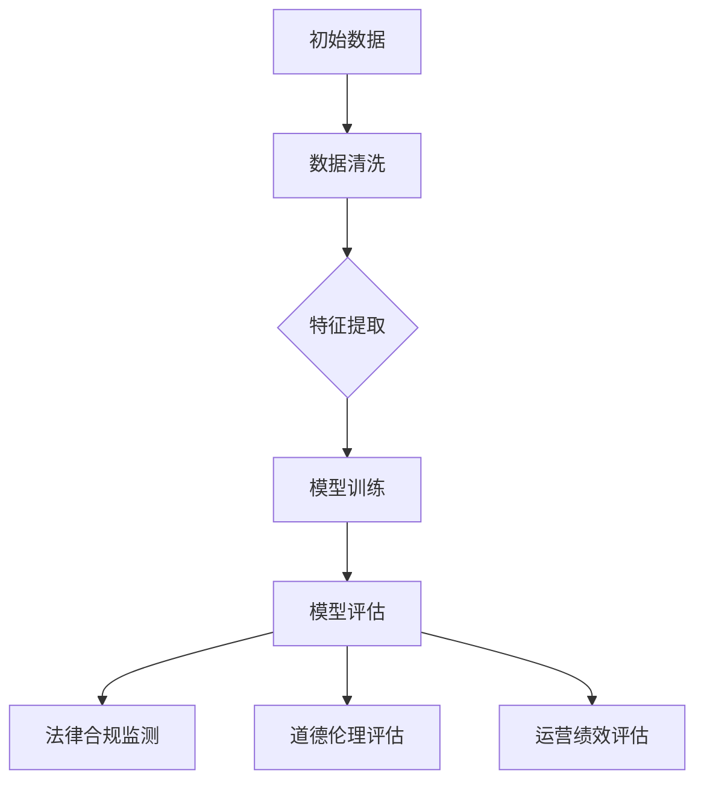
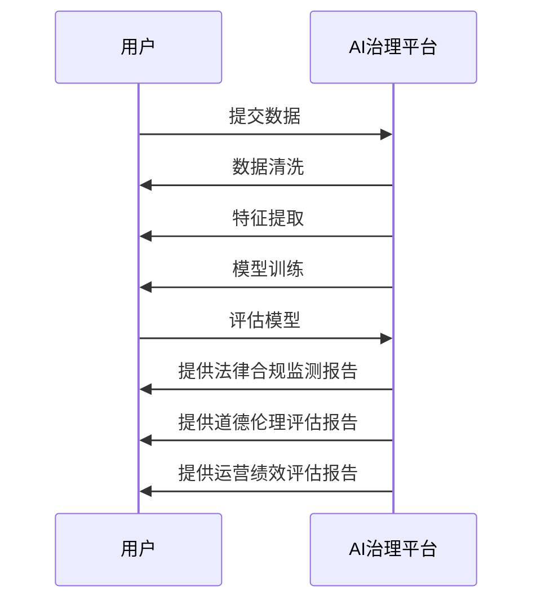

                 

在撰写《AI治理平台：管理AI系统的法律、道德和运营绩效》的技术博客文章时，我们将遵循以下步骤来确保内容的专业性、逻辑性以及通俗易懂：

### 1.1.1 AI发展现状

**背景介绍**：
- **核心概念术语说明**：人工智能（AI）、机器学习（ML）、深度学习（DL）、神经网络（NN）、算法、数据集、模型训练、预测、自动化等。
- **问题背景**：随着AI技术的迅猛发展，AI系统已深入到社会各个领域，从金融、医疗到制造业，AI的应用无处不在。然而，这也带来了许多法律、道德和运营方面的问题。
- **问题描述**：AI系统的广泛应用引发了对隐私、公平性、透明度等方面的关注。同时，AI系统的误操作可能导致严重的后果，需要有效的治理机制。
- **问题解决**：构建AI治理平台，通过法律、道德和运营绩效管理，确保AI系统的合法合规、道德伦理和高效运行。

**核心概念与联系**：
- **概念属性特征对比表格**：列出不同AI技术（AI、ML、DL）的核心特征和应用领域，展示它们之间的联系和区别。

```markdown
| 技术名称 | 核心特征 | 应用领域 |
| --- | --- | --- |
| 人工智能 | 模仿人类智能行为 | 金融、医疗、制造 |
| 机器学习 | 从数据中学习规律 | 预测、分类、推荐 |
| 深度学习 | 使用多层神经网络 | 图像识别、自然语言处理 |
```

**ER实体关系图架构**：
- **ER图**：绘制一个简单的ER图，展示AI系统、数据、法律、道德、运营绩效等实体之间的关系。

```mermaid
erDiagram
    AI_System ||--|{ Data }|
    AI_System ||--|{ Legal }|
    AI_System ||--|{ Ethics }|
    AI_System ||--|{ Performance }|
```

### 1.1.2 AI治理的重要性

**背景介绍**：
- **核心概念术语说明**：AI治理、合规性、伦理问题、社会责任、透明度、公平性、隐私保护等。
- **问题背景**：AI治理平台的重要性在于它能够确保AI系统的合法合规、道德伦理和高效运行。
- **问题描述**：缺乏有效的AI治理可能导致数据泄露、歧视、误判等严重问题。
- **问题解决**：通过AI治理平台，实现法律合规监测、道德伦理评估和运营绩效评估。

**算法原理讲解**：
- **算法mermaid流程图**：展示AI治理平台的总体工作流程。



- **Python源代码**：提供一个简单的Python代码示例，展示如何进行法律合规监测。

```python
def legal_compliance(data):
    # 假设我们有一个法律合规检查函数
    if data['privacy_policy'] and data['data_usage'] and data['terms_of_service']:
        return "Compliant"
    else:
        return "Non-compliant"
```

### 1.1.3 法律、道德和运营绩效在AI治理中的角色

**背景介绍**：
- **核心概念术语说明**：法律监管、伦理规范、社会责任、道德准则、运营绩效、风险管理等。
- **问题背景**：法律、道德和运营绩效在AI治理中扮演着不同的角色，共同确保AI系统的健康运行。
- **问题描述**：每个方面都存在特定的挑战和问题，需要综合解决。
- **问题解决**：通过法律框架来确保合规性，通过道德准则来引导行为，通过运营绩效评估来持续优化。

**数学公式使用**：
- **独立段落的LaTeX公式**：介绍法律、道德和运营绩效评估的相关数学模型。

$$
\text{Legal Compliance} = f(\text{Privacy}, \text{Ethics}, \text{Performance})
$$

$$
\text{Ethical Assessment} = g(\text{Fairness}, \text{Privacy}, \text{Respect})
$$

$$
\text{Operational Performance} = h(\text{Accuracy}, \text{Efficiency}, \text{Cost})
$$

**系统分析与架构设计方案**：
- **问题场景介绍**：描述一个典型的AI治理平台应用场景。
- **系统功能设计**：列出AI治理平台的主要功能模块，如数据管理、法律合规、道德评估、性能监控等。
- **系统架构设计**：展示AI治理平台的架构设计，包括数据流、系统模块和交互关系。
- **系统接口设计和系统交互**：使用Mermaid序列图展示系统接口和交互流程。



**项目实战**：
- **环境安装**：介绍如何搭建一个AI治理平台的环境，包括所需软件和工具的安装。
- **系统核心实现源代码**：提供关键的源代码片段，解释其功能和工作原理。
- **代码应用解读与分析**：分析代码中的关键部分，解释其如何实现法律合规监测、道德伦理评估和运营绩效评估。
- **实际案例分析和详细讲解剖析**：通过实际案例，展示AI治理平台的应用效果和解决方法。
- **项目小结**：总结项目经验，讨论可能的改进方向和挑战。

**最佳实践 tips、小结、注意事项、拓展阅读等内容**：
- **最佳实践 tips**：提供一些实际操作中的经验教训和建议。
- **小结**：总结章节内容，强调AI治理平台的重要性。
- **注意事项**：提醒读者在实施AI治理平台时需要注意的问题。
- **拓展阅读**：推荐一些相关的书籍、文章和资源，供读者进一步学习。

通过以上步骤，我们确保文章内容既有深度又有广度，能够满足读者的需求，同时也能够让非专业读者理解AI治理平台的核心概念和实际应用。

