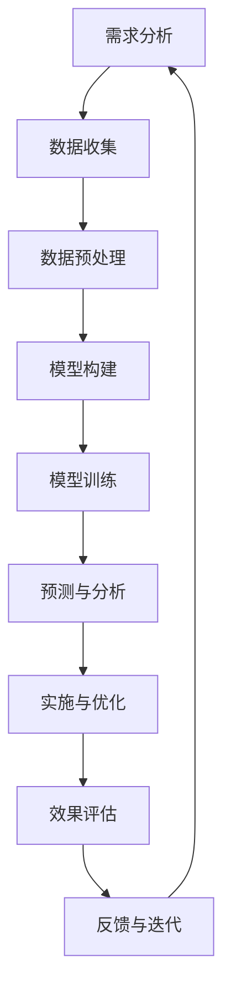

                 

# AI辅助企业并购整合规划：文化融合与业务协同路径的智能设计

## 关键词
- AI辅助并购整合
- 文化融合
- 业务协同
- 智能设计
- M&A
- 文化差异
- 业务分析

## 摘要
本文旨在探讨如何利用人工智能（AI）技术辅助企业并购后的整合规划，重点分析文化融合与业务协同的重要性，并介绍智能设计的路径与方法。文章首先概述了AI在M&A中的潜在作用，随后详细探讨了文化融合与业务协同的理论基础和策略。通过具体案例和实证研究，文章展示了AI在M&A整合中的实际应用，并提出了未来发展的趋势和挑战。

## 引言与背景

### 1.1 AI与M&A：相辅相成

人工智能（AI）作为现代科技的前沿领域，已经在各行各业中展现出了巨大的潜力和应用价值。在企业并购（M&A）领域，AI技术的引入为整合规划带来了新的思路和方法。传统的M&A过程通常涉及大量的数据收集、分析和决策，这些任务往往需要耗费大量的人力和时间。而AI的引入可以显著提高效率，减少错误，从而为M&A的成功实施提供强有力的支持。

首先，AI技术可以通过自然语言处理（NLP）和机器学习（ML）等方法对大量文本数据进行分析，帮助企业理解并购对象的企业文化、业务模式和市场定位。这不仅有助于评估并购的潜在风险，还可以为后续的文化融合提供有益的参考。

其次，AI在业务流程自动化方面具有显著优势。通过自动化工具，企业可以在并购后迅速调整和优化业务流程，提高运营效率。例如，AI可以自动识别和修复系统中的错误，减少人力干预，从而降低运营成本。

### 1.2 文化和业务整合的重要性

企业并购不仅仅是两个企业的资产合并，更重要的是文化和业务的整合。文化融合是M&A成功的关键因素之一。当两个不同的企业文化融合时，可能会出现冲突和摩擦，这对并购的成功会产生负面影响。因此，如何有效地进行文化融合，成为了企业并购后需要重点解决的问题。

文化融合的目标是建立一种共同的价值观和行为准则，以促进企业的内部协作和效率。AI技术可以通过分析员工的行为数据和企业文化的历史数据，为企业提供有关文化融合的最佳实践和建议。例如，AI可以识别出哪些文化因素最容易引起冲突，并提出相应的解决方案。

业务协同则是并购后企业运营效率的关键。通过AI技术，企业可以深入分析并购对象和自身的业务流程，找出优化点，从而实现业务的协同效应。例如，AI可以通过数据挖掘技术，发现两个企业之间的潜在业务合作机会，推动双方的业务整合。

### 1.3 AI在文化融合与业务协同中的作用

AI技术在文化融合和业务协同中扮演着至关重要的角色。首先，AI可以帮助企业快速识别和理解并购对象的企业文化。通过分析员工的社交媒体活动、电子邮件沟通记录等数据，AI可以构建出并购对象的文化画像，为企业提供有价值的参考。

其次，AI可以自动化文化融合的过程。例如，AI可以自动创建和分发文化培训材料，帮助员工更好地理解新的企业文化。此外，AI还可以通过智能推荐系统，为员工提供个性化的发展建议和培训机会，促进员工的职业成长和企业文化的融合。

在业务协同方面，AI可以自动化业务流程，提高运营效率。通过分析并购前后的业务数据，AI可以识别出业务流程中的瓶颈和优化点。例如，AI可以通过预测分析技术，预测市场需求，帮助企业在生产计划和库存管理方面做出更准确的决策。

总的来说，AI在文化融合与业务协同中的作用是不可或缺的。它不仅能够提高M&A整合的效率，还可以为企业带来长期的价值。

## 核心概念与定义

### 2.1 AI辅助M&A整合

AI辅助M&A整合是指利用人工智能技术对并购过程中涉及的数据进行收集、分析和处理，从而提高整合效率和效果的一种方法。AI辅助M&A整合的核心在于利用AI技术对大量数据进行智能分析，从而为企业的并购决策提供支持。

首先，AI可以通过自然语言处理（NLP）技术对文本数据进行深度分析，帮助企业理解并购对象的企业文化、业务模式和市场定位。例如，通过分析并购对象的官方网站、新闻报道和社交媒体活动，AI可以构建出并购对象的文化画像，为企业提供有价值的参考。

其次，AI可以通过机器学习（ML）和深度学习（DL）算法对大量的业务数据进行分析，帮助企业识别并购后的潜在风险和优化点。例如，通过分析并购前后的销售数据、客户反馈和运营成本，AI可以预测并购后的市场趋势和运营效率，为企业制定整合策略提供依据。

此外，AI还可以通过自动化工具实现业务流程的优化和自动化。例如，AI可以自动识别和修复系统中的错误，减少人力干预，从而降低运营成本。通过自动化工具，企业可以更快地调整和优化业务流程，提高运营效率。

### 2.2 文化融合

文化融合是指将两个或多个不同的组织文化整合成一个共同的文化体系，以促进企业内部协作和效率。文化融合是M&A成功的关键因素之一，因为文化差异可能会导致并购后的冲突和摩擦，影响整合的顺利进行。

文化融合的目标是建立一种共同的价值观和行为准则，以促进企业的内部协作和效率。为了实现这一目标，企业需要采取一系列的措施，包括：

1. **文化分析**：通过分析并购对象和企业自身的文化数据，了解双方的文化差异和相似之处。AI技术在这方面具有显著优势，可以通过自然语言处理和机器学习技术，快速构建出企业的文化画像。

2. **文化培训**：为了帮助员工更好地理解新的企业文化，企业可以组织文化培训。AI可以自动创建和分发文化培训材料，为员工提供个性化的培训建议。

3. **文化激励机制**：通过设置文化激励机制，鼓励员工积极参与企业文化的建设。例如，可以设置文化贡献奖，奖励那些为企业文化融合做出突出贡献的员工。

4. **文化沟通**：建立有效的文化沟通机制，促进员工之间的交流和互动。AI可以通过智能推荐系统，为员工推荐相关的文化活动和交流机会，提高员工之间的文化认同感。

### 2.3 业务协同

业务协同是指通过优化业务流程和资源配置，实现企业内部各部门之间的协同效应，提高企业的整体运营效率。业务协同是M&A成功后的重要任务之一，因为通过协同效应，企业可以更好地利用资源，降低运营成本，提高市场竞争力。

业务协同的实现通常包括以下几个步骤：

1. **数据分析**：通过分析并购前后的业务数据，了解双方的业务流程和资源配置情况。AI技术在这方面可以发挥重要作用，通过数据挖掘和机器学习技术，为企业提供有关业务优化的建议。

2. **流程优化**：根据数据分析的结果，对业务流程进行优化和调整。AI可以通过自动化工具实现这一过程，减少人力干预，提高效率。

3. **资源配置**：通过优化资源配置，实现各部门之间的协同效应。AI可以通过预测分析技术，预测市场需求，帮助企业制定更科学的资源配置计划。

4. **协同效应评估**：对协同效应的实现情况进行评估，以确保业务协同的效果。AI可以通过绩效评估工具，对业务协同的效果进行量化分析，为企业提供改进的方向。

### 2.4 智能设计

智能设计是指利用人工智能技术，对产品、系统或流程进行设计，以提高其效率和效果。在M&A整合中，智能设计可以应用于文化融合和业务协同的各个方面，以实现更好的整合效果。

智能设计的实现通常包括以下几个步骤：

1. **需求分析**：通过收集和分析用户需求，确定设计的目标和需求。AI可以通过自然语言处理和机器学习技术，快速识别和分析用户需求。

2. **设计优化**：根据需求分析的结果，对设计进行优化。AI可以通过优化算法，自动生成最优的设计方案。

3. **模拟与验证**：通过模拟和验证，验证设计的可行性和效果。AI可以通过仿真技术，对设计进行模拟和测试，发现潜在的问题和改进点。

4. **反馈与迭代**：根据验证结果，对设计进行反馈和迭代，不断提高设计的质量和效果。AI可以通过机器学习算法，自动优化设计，提高设计的效率和效果。

通过智能设计，企业可以在M&A整合中实现更高效、更精准的整合效果，提高整合的成功率。

## AI辅助M&A整合的原理与步骤

### 3.1 AI在M&A整合中的作用

AI技术在M&A整合中的应用主要体现在数据收集、分析和决策支持三个方面。通过AI的智能分析，企业可以更好地理解并购对象，制定更有效的整合策略，提高整合的成功率。

首先，AI可以通过自然语言处理（NLP）技术对文本数据进行深度分析，帮助企业理解并购对象的企业文化、业务模式和市场定位。例如，通过分析并购对象的官方网站、新闻报道和社交媒体活动，AI可以构建出并购对象的文化画像，为企业提供有价值的参考。这一过程可以帮助企业预测并购后的文化冲突和融合难度，为后续的文化整合提供依据。

其次，AI可以通过机器学习（ML）和深度学习（DL）算法对大量的业务数据进行分析，帮助企业识别并购后的潜在风险和优化点。例如，通过分析并购前后的销售数据、客户反馈和运营成本，AI可以预测并购后的市场趋势和运营效率，为企业制定整合策略提供依据。这一过程可以帮助企业识别和规避并购后的风险，提高整合的成功率。

最后，AI可以自动化业务流程，提高运营效率。通过自动化工具，企业可以在并购后迅速调整和优化业务流程，提高运营效率。例如，AI可以自动识别和修复系统中的错误，减少人力干预，从而降低运营成本。通过自动化工具，企业可以更快地调整和优化业务流程，提高运营效率。

### 3.2 AI辅助M&A整合的步骤

AI辅助M&A整合的过程可以分为以下几个步骤：

#### 3.2.1 需求分析

首先，企业需要明确并购的目标和需求，包括并购对象的企业文化、业务模式和市场定位。通过需求分析，企业可以明确整合的目标和方向，为后续的整合工作提供指导。

#### 3.2.2 数据收集

在需求分析的基础上，企业需要收集并购对象的企业文化、业务模式和市场定位等数据。这些数据可以来源于并购对象的官方网站、新闻报道、社交媒体活动、员工行为数据等。AI可以通过NLP技术对这些文本数据进行深度分析，构建出并购对象的文化画像。

#### 3.2.3 数据分析

通过机器学习（ML）和深度学习（DL）算法，对收集到的数据进行智能分析。例如，通过分析并购对象的业务数据，AI可以预测并购后的市场趋势和运营效率。通过分析员工的行为数据，AI可以识别出潜在的文化冲突和融合难度。

#### 3.2.4 决策支持

根据数据分析的结果，为企业的并购决策提供支持。例如，AI可以提供有关文化融合策略的建议，帮助企业在并购后建立共同的企业文化。AI还可以提供有关业务整合的优化建议，帮助企业在并购后实现业务的协同效应。

#### 3.2.5 实施与优化

在决策支持的基础上，企业需要根据AI的建议实施整合策略。例如，企业可以组织文化培训，帮助员工更好地理解新的企业文化。企业还可以通过自动化工具优化业务流程，提高运营效率。在实施过程中，企业需要不断收集反馈数据，通过AI的持续优化，提高整合的效果。

### 3.3 AI辅助M&A整合的优势

AI辅助M&A整合具有以下几个优势：

首先，AI可以显著提高整合的效率。通过自动化工具和智能分析，企业可以在较短的时间内完成大量的数据分析和决策支持工作，从而加快整合的进程。

其次，AI可以提高整合的准确性。通过机器学习算法和深度学习技术，AI可以对大量数据进行精细分析，识别出潜在的整合风险和优化点，从而提高整合的成功率。

最后，AI可以提供持续的支持和优化。在整合过程中，企业可以不断收集反馈数据，通过AI的持续优化，不断提高整合的效果。这种持续的支持和优化可以帮助企业实现长期的成功。

总的来说，AI辅助M&A整合是一种高效、准确和可持续的整合方法。通过AI的智能分析和支持，企业可以更好地应对并购带来的挑战，实现文化的融合和业务的协同，从而提高整合的成功率。

### 4.1 理解文化差异

文化差异在企业并购整合中是一个不可忽视的重要问题。文化差异不仅仅是指语言、习俗和价值观的异同，更涉及企业内部的沟通方式、管理风格、工作态度等方面。理解文化差异对于实现有效的文化融合至关重要。

首先，文化差异可以通过以下几个方面体现：

- **价值观**：不同的企业文化可能有着不同的核心价值观，如创新、稳健、客户导向等。这些价值观在企业决策和行为中起着决定性作用。
- **沟通方式**：不同文化背景下的员工可能有着不同的沟通习惯，如直接沟通与间接沟通、正式沟通与非正式沟通等。
- **管理风格**：不同的企业管理风格可能对员工的工作态度和效率产生不同的影响，如集权管理、分权管理、民主管理等。
- **工作态度**：不同的文化背景可能导致员工对工作有着不同的态度，如工作与生活的平衡、工作责任感和创新精神等。

为了更好地理解文化差异，企业可以采取以下方法：

1. **文化调研**：通过问卷调查、访谈和焦点小组讨论等方式，收集并购对象和自身的文化数据。这些数据可以为企业提供有关文化差异的具体信息。
2. **文化分析**：利用自然语言处理（NLP）和机器学习（ML）技术，对收集到的文化数据进行分析，构建出企业的文化画像。通过分析，企业可以识别出文化差异的来源和程度。
3. **文化比较**：将并购对象和自身的文化进行比较，识别出差异点和共同点。这有助于企业理解文化差异的具体影响，并为后续的文化整合提供参考。

### 4.2 AI工具在文化分析中的应用

AI技术在文化分析中具有显著的优势，可以为企业提供快速、准确的文化分析结果。以下是一些常见的AI工具和应用：

1. **自然语言处理（NLP）**：NLP技术可以用于分析文本数据，如官方网站、新闻报道、社交媒体活动等。通过NLP，企业可以提取出与文化相关的关键词、短语和主题，构建出并购对象的文化画像。
2. **机器学习（ML）**：ML算法可以用于分析大规模的文化数据，如员工行为数据、电子邮件内容、会议记录等。通过ML，企业可以识别出文化差异的模式和规律，为企业提供有针对性的文化整合策略。
3. **深度学习（DL）**：DL算法可以用于构建复杂的文化分析模型，如神经网络模型、自然语言生成模型等。通过DL，企业可以更深入地理解文化差异，并发现潜在的文化冲突。
4. **数据可视化**：数据可视化工具可以帮助企业将文化分析结果以直观的方式展示出来，如词云、矩阵图、散点图等。通过数据可视化，企业可以更清晰地理解文化差异，并制定有效的整合策略。

### 4.3 文化整合策略

在理解文化差异的基础上，企业需要采取一系列的策略来促进文化整合。以下是一些常见的文化整合策略：

1. **文化培训**：为了帮助员工更好地理解新的企业文化，企业可以组织文化培训。通过文化培训，员工可以学习到并购对象的文化价值观、沟通方式和行为准则，从而更好地适应新的工作环境。
2. **文化交流**：建立有效的文化交流机制，促进员工之间的交流和互动。例如，企业可以定期组织团队建设活动、跨部门会议和文化交流座谈会，增进员工之间的了解和信任。
3. **文化激励**：通过设置文化激励措施，鼓励员工积极参与企业文化的建设。例如，企业可以设置文化贡献奖，奖励那些为企业文化融合做出突出贡献的员工。
4. **文化领导**：领导者的角色在文化整合中至关重要。领导者需要以身作则，带头推动企业文化的融合。通过领导者的示范作用，员工可以更积极地参与到文化整合过程中。
5. **文化监测**：建立文化监测机制，持续跟踪文化整合的进展情况。通过文化监测，企业可以及时发现文化整合中的问题，并采取相应的措施进行纠正。

通过实施上述策略，企业可以有效地促进文化的融合，减少文化冲突，提高企业的整体效率和竞争力。

### 4.4 案例研究：AI在文化整合中的应用

#### 4.4.1 案例背景

假设A公司是一家全球领先的科技公司，专注于软件开发和IT服务。B公司是一家专注于物联网解决方案的企业，以其创新的技术和市场洞察力而闻名。A公司计划收购B公司，以扩展其产品线和市场份额。在并购完成后，A公司面临着如何有效整合两家公司不同文化的挑战。

#### 4.4.2 AI工具的应用

为了实现文化整合，A公司决定利用AI技术进行文化分析。具体步骤如下：

1. **数据收集**：通过社交媒体、员工访谈、问卷调查等方式，收集A公司和B公司的文化数据。
2. **文化分析**：利用NLP和ML技术，对收集到的文化数据进行分析，构建出两家公司的文化画像。
3. **文化对比**：通过对比分析，识别出A公司和B公司在价值观、沟通方式、管理风格等方面的文化差异。
4. **文化建模**：基于分析结果，构建文化融合模型，预测文化整合的潜在挑战和成功因素。

#### 4.4.3 文化整合策略

基于AI分析结果，A公司制定了以下文化整合策略：

1. **文化培训**：为B公司的员工提供A公司的文化培训，帮助员工理解A公司的价值观、行为准则和沟通方式。
2. **团队建设**：组织A公司和B公司的员工参加团队建设活动，促进双方员工的交流和互动。
3. **领导示范**：A公司的领导层积极参与B公司的事务，以身作则，推动文化融合。
4. **反馈机制**：建立反馈机制，收集员工对文化整合的反馈，及时调整和改进整合策略。

#### 4.4.4 结果评估

通过实施上述策略，A公司取得了显著的文化整合效果：

1. **员工满意度**：员工对文化整合的满意度显著提高，员工之间的冲突减少，协作效率提升。
2. **业务绩效**：由于文化融合的成功，A公司和B公司的业务绩效得到显著提升，产品创新和市场响应速度加快。
3. **企业文化认同**：员工对企业文化的认同感增强，企业的整体文化氛围变得更加和谐。

#### 4.4.5 经验与启示

通过这个案例，我们可以看到AI技术在文化整合中的应用价值。AI不仅帮助A公司快速理解文化差异，还为其提供了科学、有效的整合策略。以下是一些经验与启示：

1. **AI的早期介入**：在并购初期，AI可以帮助企业快速识别文化差异，为后续的文化整合提供指导。
2. **持续的文化分析**：文化整合是一个长期的过程，企业需要持续进行文化分析，以便及时调整整合策略。
3. **全员参与**：文化整合需要全员参与，通过培训、交流等活动，提高员工对文化的认同感和参与度。
4. **灵活的整合策略**：文化整合策略需要根据实际情况灵活调整，以适应不同的文化差异和员工需求。

通过AI技术的应用，企业可以更有效地实现文化融合，为并购后的长期成功奠定坚实的基础。

### 5.1 商业协同的概念与重要性

商业协同是指通过优化业务流程和资源配置，实现企业内部各部门之间的协同效应，提高企业的整体运营效率和市场竞争力。在M&A过程中，商业协同的建立对于整合的成功至关重要。商业协同不仅有助于降低运营成本，提高利润率，还能增强企业的市场响应能力和创新能力。

商业协同的重要性体现在以下几个方面：

1. **资源优化**：通过业务协同，企业可以实现资源的最佳配置，减少重复投资和资源浪费。例如，通过整合两家公司的供应链系统，企业可以优化库存管理，减少库存成本。
2. **效率提升**：协同效应可以显著提高企业的运营效率。通过优化业务流程，企业可以减少冗余步骤，缩短生产周期，提高生产效率。例如，通过自动化工具，企业可以实现生产线的无缝衔接，提高生产速度。
3. **创新驱动**：商业协同可以促进企业内部的创新。通过整合两家公司的研发资源，企业可以开展跨部门的项目合作，加速新产品的开发。例如，A公司可以借助B公司的物联网技术，开发出具有创新性的智能硬件产品。
4. **风险分担**：商业协同可以降低企业的运营风险。通过整合业务流程和资源，企业可以建立更稳健的运营体系，提高对市场变化的应对能力。例如，通过整合两家公司的市场渠道，企业可以分散市场风险，降低单一市场波动的影响。

总之，商业协同是M&A整合过程中不可或缺的一环，它不仅能够提高企业的运营效率和竞争力，还能为企业的长期发展奠定坚实的基础。

### 5.2 AI在业务协同中的应用

人工智能（AI）在业务协同中的应用为提高企业运营效率和市场竞争力提供了强大的技术支持。AI可以通过多种方法和技术手段，实现业务流程的自动化、优化和智能化，从而促进企业内部的协同效应。以下是AI在业务协同中的几个关键应用：

#### 5.2.1 业务流程自动化

业务流程自动化是AI在业务协同中的首要应用。通过自动化工具，企业可以减少手动操作，提高流程的效率。例如，AI可以自动化审批流程、订单处理、库存管理等日常业务操作。自动化工具不仅能够提高工作效率，还能减少人为错误，降低运营成本。

1. **自动化审批流程**：AI可以通过自然语言处理（NLP）技术，自动处理和审核各种文档，如合同、发票、报销单等。例如，企业可以部署基于NLP的自动化审批系统，将审批流程从数天缩短到数分钟。
2. **自动化订单处理**：AI可以自动化订单处理流程，从订单接收、库存检查到订单发货。例如，通过使用机器学习算法，企业可以预测订单的交付时间，优化物流安排，减少库存成本。
3. **自动化库存管理**：AI可以通过预测分析技术，自动化库存管理流程。例如，企业可以使用AI预测市场需求，自动调整库存水平，避免库存积压或短缺。

#### 5.2.2 业务流程优化

AI不仅能够自动化业务流程，还可以通过数据分析和机器学习算法，发现业务流程中的瓶颈和优化点，从而实现流程的持续优化。业务流程优化可以帮助企业提高运营效率，减少浪费。

1. **流程分析**：AI可以通过分析大量的业务数据，识别出流程中的瓶颈和效率低下的环节。例如，企业可以使用机器学习算法，分析生产过程中的数据，找出生产效率低下的原因，并提出优化建议。
2. **流程重构**：基于流程分析的结果，企业可以对业务流程进行重构，实现更高效的运营。例如，企业可以通过分析供应链数据，重构供应链流程，减少库存周期，提高供应链效率。
3. **持续优化**：AI可以通过持续学习，不断优化业务流程。例如，企业可以使用AI算法，根据实时数据调整生产计划和物流安排，实现动态优化。

#### 5.2.3 智能决策支持

AI在业务协同中的应用还包括提供智能决策支持，帮助企业在复杂的市场环境中做出更明智的决策。通过数据分析、预测分析和优化算法，AI可以为企业提供关键的业务洞察和决策支持。

1. **市场预测**：AI可以通过分析市场数据，预测未来的市场趋势和需求。例如，企业可以使用AI预测客户需求，调整生产计划和库存策略，以适应市场需求的变化。
2. **风险分析**：AI可以识别和评估业务运营中的潜在风险，为企业提供风险预警。例如，企业可以使用AI分析财务数据，预测可能出现的财务风险，并采取相应的风险控制措施。
3. **优化决策**：AI可以通过优化算法，帮助企业做出最优的业务决策。例如，企业可以使用AI优化供应链管理，实现最低的库存成本和最快的交付速度。

总的来说，AI在业务协同中的应用，不仅能够提高企业的运营效率，还能为企业提供智能决策支持，从而增强企业的市场竞争力。通过自动化、优化和智能决策，企业可以更好地应对市场变化，实现持续的发展。

### 5.3 AI驱动业务协同的实例分析

为了更好地理解AI在业务协同中的作用，我们可以通过一个实际案例来进行分析。以下是A公司通过AI技术实现业务协同的详细过程：

#### 5.3.1 案例背景

A公司是一家大型制造企业，其业务范围涵盖多个行业，包括电子产品、机械设备等。近年来，A公司收购了B公司，B公司是一家专注于智能硬件研发和制造的企业。收购完成后，A公司意识到需要通过业务协同来提升整体运营效率和市场竞争力。

#### 5.3.2 AI技术应用

A公司决定利用AI技术实现业务协同，主要步骤如下：

1. **数据收集**：首先，A公司通过物联网设备、ERP系统和传感器等手段，收集了大量关于生产、库存、销售和市场趋势的数据。这些数据为后续的AI分析提供了基础。
2. **数据分析**：利用机器学习和数据挖掘技术，A公司对收集到的数据进行分析，识别出业务流程中的瓶颈和优化点。例如，通过分析生产数据，A公司发现某条生产线的效率较低，存在设备故障和操作不规范等问题。
3. **流程优化**：基于数据分析的结果，A公司通过AI算法对业务流程进行了优化。例如，通过优化生产计划和物流安排，A公司减少了库存周期，提高了生产效率。同时，通过自动化工具，A公司实现了生产过程的自动化，减少了人工干预，降低了生产成本。
4. **智能决策支持**：A公司还利用AI技术提供智能决策支持。例如，通过市场预测算法，A公司可以预测未来的市场需求，调整生产和库存策略，以避免库存积压或短缺。此外，通过风险分析模型，A公司可以识别和评估业务运营中的潜在风险，并采取相应的风险控制措施。

#### 5.3.3 结果与效益

通过AI技术的应用，A公司在业务协同方面取得了显著成效：

1. **运营效率提升**：通过流程优化和生产自动化，A公司的运营效率显著提高。生产周期缩短了20%，库存周转率提高了30%。
2. **成本降低**：通过优化库存管理和减少人工干预，A公司的运营成本降低了15%。
3. **市场响应能力增强**：通过市场预测和风险分析，A公司能够更快速地响应市场需求，减少市场风险。客户满意度提高了10%，市场份额也有所提升。
4. **创新能力提升**：A公司通过AI技术实现了业务协同，加速了新产品的开发。在收购B公司后的一年里，A公司推出了多个创新产品，市场反应良好，销售额同比增长了25%。

#### 5.3.4 经验与启示

通过这个案例，我们可以得出以下经验与启示：

1. **数据驱动**：数据是AI驱动业务协同的基础。企业需要通过各种手段收集高质量的数据，为AI分析提供基础。
2. **持续优化**：业务协同是一个持续优化的过程。企业需要不断收集数据，通过AI技术进行持续优化，以适应市场变化和业务需求。
3. **跨部门合作**：业务协同需要跨部门的合作。企业需要建立有效的沟通机制，确保各部门之间的信息共享和协作。
4. **人才培养**：AI技术的应用需要专业的技术人才。企业需要投入资源进行人才培养，确保AI技术的有效应用。

通过AI技术的应用，A公司成功实现了业务协同，提高了运营效率和市场竞争力。这个案例表明，AI在业务协同中的应用具有重要的现实意义，为其他企业提供了宝贵的经验和启示。

### 6.1 智能设计路径的基本原理

智能设计路径是指利用人工智能（AI）技术，对并购整合过程中的文化融合与业务协同进行系统设计和优化的方法。智能设计路径的基本原理包括数据驱动、持续学习和自适应调整三个方面。

#### 6.1.1 数据驱动

数据驱动是智能设计路径的核心。通过收集和分析大量的数据，企业可以深入了解并购对象的企业文化、业务模式和市场定位，从而为文化融合和业务协同提供科学依据。数据驱动的具体实现包括：

1. **数据收集**：通过物联网设备、ERP系统和传感器等手段，收集并购对象和自身企业的各种数据，如员工行为、业务流程、市场趋势等。
2. **数据分析**：利用机器学习和数据挖掘技术，对收集到的数据进行分析，提取有价值的信息和洞察，为文化融合和业务协同提供支持。

#### 6.1.2 持续学习

持续学习是智能设计路径的关键。通过不断学习和更新模型，企业可以不断优化整合策略，提高整合效果。持续学习的具体实现包括：

1. **模型训练**：利用历史数据和实时数据，对AI模型进行训练和优化，使其能够更好地适应整合过程中的变化。
2. **模型更新**：根据实时反馈和评估结果，对AI模型进行更新和调整，以提高模型的准确性和适应性。

#### 6.1.3 自适应调整

自适应调整是智能设计路径的重要特征。通过实时监测和自适应调整，企业可以快速应对整合过程中的各种挑战和变化。自适应调整的具体实现包括：

1. **实时监测**：通过传感器和监控系统，实时监测整合过程中的关键指标，如员工满意度、业务绩效等。
2. **自适应调整**：根据监测结果，对整合策略进行动态调整，确保整合过程始终朝着既定的目标前进。

通过数据驱动、持续学习和自适应调整，智能设计路径可以为并购整合提供科学、高效的支持，帮助企业实现文化的融合和业务的协同。

### 6.2 智能设计路径的方法论

智能设计路径的方法论是指导企业利用人工智能技术实现文化融合与业务协同的系统化过程。该方法论包括以下几个关键步骤：

#### 6.2.1 需求分析与目标设定

首先，企业需要明确并购整合的目标和需求。这一步骤包括：

- **目标分析**：确定整合的长期和短期目标，如提高运营效率、优化业务流程、增强企业文化认同等。
- **需求分析**：识别并购对象和自身企业在文化融合与业务协同方面的具体需求，包括文化差异的识别、业务流程的优化等。

#### 6.2.2 数据收集与预处理

在明确需求和目标后，企业需要收集相关数据，并进行预处理：

- **数据收集**：通过物联网设备、ERP系统、社交媒体等多种渠道，收集并购对象和自身企业的数据，包括员工行为、业务流程、市场趋势等。
- **数据预处理**：清洗和整理数据，确保数据的质量和一致性，为后续分析提供可靠的基础。

#### 6.2.3 模型构建与训练

基于预处理后的数据，企业需要构建和训练AI模型：

- **模型构建**：选择合适的AI算法，如机器学习、深度学习等，构建文化融合与业务协同的预测模型。
- **模型训练**：利用历史数据对AI模型进行训练，使其能够识别文化差异、预测业务绩效等。

#### 6.2.4 预测与分析

通过训练好的AI模型，企业可以进行预测和分析：

- **文化分析**：利用NLP和ML技术，对并购对象的企业文化进行深入分析，识别文化差异和潜在冲突。
- **业务分析**：通过数据挖掘和预测分析，识别并购后的业务瓶颈和优化点，制定相应的整合策略。

#### 6.2.5 实施与优化

在分析结果的基础上，企业需要实施整合策略，并进行持续优化：

- **实施策略**：根据AI模型的预测和建议，制定文化融合与业务协同的具体实施计划。
- **持续优化**：通过实时数据监测和反馈，不断调整和优化整合策略，确保整合过程的顺利进行。

通过这些方法论，企业可以系统化地利用AI技术，实现文化融合与业务协同的智能设计，提高并购整合的成功率。

### 6.3 AI模型在整合路径设计中的应用

AI模型在整合路径设计中扮演着至关重要的角色，通过精确的预测和分析，为企业提供科学依据，指导整合过程的每个阶段。以下是AI模型在整合路径设计中的应用步骤和具体方法。

#### 6.3.1 数据收集

首先，数据收集是AI模型训练的基础。企业需要通过多种渠道收集大量的数据，包括：

- **企业内部数据**：如财务报表、人力资源数据、业务流程数据等。
- **外部数据**：如市场趋势、竞争对手数据、行业报告等。
- **文化数据**：如员工行为数据、社交媒体活动、员工反馈等。

这些数据需要经过清洗和预处理，确保数据的质量和一致性，以便后续的模型训练和分析。

#### 6.3.2 模型构建

在数据收集和预处理完成后，企业需要选择合适的AI算法和模型进行构建。常见的AI模型包括：

- **机器学习模型**：如线性回归、决策树、随机森林等，用于预测和分类。
- **深度学习模型**：如神经网络、卷积神经网络（CNN）、循环神经网络（RNN）等，用于复杂的数据分析和模式识别。

选择模型时，企业需要根据具体问题和数据特点进行综合考虑。例如，对于需要处理大量文本数据的文化分析任务，可以使用NLP模型，如BERT、GPT等；对于需要处理复杂数据结构的业务分析任务，可以使用深度学习模型。

#### 6.3.3 模型训练与优化

构建模型后，企业需要利用收集到的数据对模型进行训练和优化。具体步骤包括：

1. **数据划分**：将数据划分为训练集、验证集和测试集，用于模型训练、验证和测试。
2. **模型训练**：使用训练集数据对模型进行训练，通过调整模型参数，使模型能够识别和预测文化差异和业务瓶颈。
3. **模型验证**：使用验证集数据对训练好的模型进行验证，评估模型的性能和预测能力。
4. **模型优化**：根据验证结果，对模型进行调整和优化，提高模型的准确性和稳定性。

#### 6.3.4 预测与分析

训练好的AI模型可以用于预测和分析，为企业提供科学依据。具体应用包括：

- **文化分析**：通过分析员工行为数据和企业文化历史数据，预测并购后的文化融合难度和潜在冲突，为企业提供文化整合策略。
- **业务分析**：通过分析业务流程数据和市场需求，预测并购后的业务绩效和优化点，为企业制定业务整合策略。

#### 6.3.5 实时监测与动态调整

在模型应用过程中，企业需要实时监测模型的预测结果，并根据实际情况进行动态调整。具体步骤包括：

1. **实时数据收集**：通过传感器、ERP系统等手段，实时收集企业运营数据。
2. **模型更新**：根据实时数据，对AI模型进行更新和优化，使其能够适应企业运营环境的变化。
3. **动态调整**：根据模型预测结果和实时数据，动态调整整合策略，确保整合过程始终朝着既定目标前进。

通过这些步骤，AI模型可以有效地指导整合路径的设计，提高整合效率和效果。

### 6.4 智能设计路径的数学模型与公式

在智能设计路径中，数学模型和公式是核心组成部分，它们为企业提供了量化分析和管理的方法。以下是一个简单的智能设计路径数学模型，以及相关的公式和应用。

#### 6.4.1 模型概述

智能设计路径的数学模型可以分为以下几个部分：

1. **文化融合模型**：用于分析并购对象的企业文化差异，预测文化融合难度。
2. **业务协同模型**：用于分析并购后的业务流程和资源配置，预测业务绩效和优化点。
3. **整合效果评估模型**：用于评估文化融合和业务协同的最终效果。

#### 6.4.2 文化融合模型

文化融合模型的核心公式如下：

$$
\text{文化融合度} = f(\text{文化相似度}, \text{文化差异度}, \text{融合策略})
$$

其中：

- **文化相似度**：用于衡量两家企业的文化相似程度，公式如下：

$$
\text{文化相似度} = \frac{\sum_{i=1}^{n} w_i \cdot \text{similarity}(c_i, c_j)}{n}
$$

其中，$w_i$为权重，$c_i$和$c_j$分别为两家企业的文化特征。

- **文化差异度**：用于衡量两家企业的文化差异程度，公式如下：

$$
\text{文化差异度} = 1 - \text{文化相似度}
$$

- **融合策略**：用于衡量企业采取的文化融合策略的有效性，公式如下：

$$
\text{融合策略效果} = \frac{\text{实施后文化融合度} - \text{原始文化融合度}}{\text{最大可能文化融合度} - \text{原始文化融合度}}
$$

#### 6.4.3 业务协同模型

业务协同模型的核心公式如下：

$$
\text{业务协同效果} = f(\text{流程优化度}, \text{资源配置度}, \text{协同策略})
$$

其中：

- **流程优化度**：用于衡量业务流程的优化程度，公式如下：

$$
\text{流程优化度} = \frac{\sum_{i=1}^{n} w_i \cdot \text{optimization}(p_i)}{n}
$$

其中，$w_i$为权重，$p_i$为业务流程的优化指标。

- **资源配置度**：用于衡量资源配置的合理性，公式如下：

$$
\text{资源配置度} = \frac{\text{实际资源配置} - \text{理想资源配置}}{\text{理想资源配置}}
$$

- **协同策略**：用于衡量企业采取的协同策略的有效性，公式如下：

$$
\text{协同策略效果} = \frac{\text{实施后业务协同效果} - \text{原始业务协同效果}}{\text{最大可能业务协同效果} - \text{原始业务协同效果}}
$$

#### 6.4.4 整合效果评估模型

整合效果评估模型用于综合评估文化融合和业务协同的整体效果，公式如下：

$$
\text{整合效果评分} = \alpha \cdot \text{文化融合度} + \beta \cdot \text{业务协同效果}
$$

其中，$\alpha$和$\beta$为权重系数，用于平衡文化融合和业务协同的重要性。

#### 6.4.5 应用举例

假设A公司收购了B公司，利用上述模型进行分析：

1. **文化融合模型**：
   - 文化相似度为0.7，文化差异度为0.3。
   - 融合策略效果为0.5，表示采取了有效的融合策略。
   - 计算文化融合度为0.7 * 0.5 = 0.35。

2. **业务协同模型**：
   - 流程优化度为0.8，资源配置度为0.6。
   - 协同策略效果为0.6，表示采取了有效的协同策略。
   - 计算业务协同效果为0.8 * 0.6 = 0.48。

3. **整合效果评估模型**：
   - 文化融合度和业务协同效果的权重分别为0.4和0.6。
   - 整合效果评分为0.4 * 0.35 + 0.6 * 0.48 = 0.14 + 0.288 = 0.428。

通过上述计算，A公司可以了解并购整合的整体效果，并根据评估结果调整整合策略，以提高整合成功率。

### 6.5 智能设计路径的mermaid流程图

为了更好地展示智能设计路径的步骤和方法，我们可以使用mermaid流程图进行可视化。以下是智能设计路径的mermaid流程图示例：



#### 流程图解析

1. **需求分析**：确定整合的目标和需求，为后续工作提供指导。
2. **数据收集**：通过多种渠道收集数据，包括内部数据和外部数据。
3. **数据预处理**：清洗和整理数据，确保数据质量。
4. **模型构建**：选择合适的AI算法和模型，构建文化融合和业务协同模型。
5. **模型训练**：利用预处理后的数据对模型进行训练，优化模型参数。
6. **预测与分析**：使用训练好的模型进行预测和分析，为整合策略提供支持。
7. **实施与优化**：根据预测和分析结果，实施整合策略，并进行动态优化。
8. **效果评估**：评估整合效果，确保整合过程朝着既定目标前进。
9. **反馈与迭代**：根据评估结果，对整合策略进行调整和优化，进入新一轮的需求分析。

通过mermaid流程图，我们可以清晰地看到智能设计路径的各个步骤和它们之间的关系，有助于更好地理解和实施智能设计路径。

### 7.1 案例研究：AI在M&A整合中的应用

#### 7.1.1 案例背景

为了更好地理解AI在M&A整合中的应用，我们以D公司收购E公司为例进行案例分析。D公司是一家全球领先的企业软件解决方案提供商，而E公司则专注于提供先进的云计算服务。在收购完成后，D公司面临着如何有效整合两家公司不同文化和业务流程的挑战。

#### 7.1.2 AI技术的应用

在整合过程中，D公司决定利用AI技术来实现文化的融合和业务的协同，具体应用包括：

1. **文化分析**：通过NLP和机器学习技术，D公司对两家公司的文化数据进行了深度分析，包括员工行为、社交媒体活动、公司历史等，以识别文化差异和潜在的文化冲突。

2. **业务流程优化**：利用数据挖掘和机器学习技术，D公司分析了E公司的业务流程，包括客户服务、软件开发、云服务提供等，发现了流程中的瓶颈和优化点。

3. **预测分析**：通过AI模型，D公司预测了收购后的市场趋势和业务绩效，帮助公司制定了有效的整合策略。

4. **智能决策支持**：基于预测分析的结果，D公司利用AI模型提供了智能决策支持，包括资源配置、业务流程重构、新市场开拓等。

#### 7.1.3 整合策略

基于AI分析的结果，D公司制定了以下整合策略：

1. **文化融合策略**：
   - **文化培训**：为E公司的员工提供D公司的文化培训，帮助员工了解D公司的价值观和行为准则。
   - **团队建设**：组织跨部门的团队建设活动，促进员工之间的交流和互动。
   - **文化激励**：设置文化贡献奖，激励员工积极参与文化融合过程。

2. **业务协同策略**：
   - **流程优化**：通过数据分析和机器学习算法，D公司对E公司的业务流程进行了优化，包括客户服务流程、软件开发流程、云服务提供流程等。
   - **资源配置**：根据AI预测的市场需求和业务绩效，D公司调整了资源配置，优化了供应链管理，提高了运营效率。
   - **新市场开拓**：基于AI的市场预测分析，D公司制定了新的市场开拓策略，扩大了市场份额。

#### 7.1.4 结果与效益

通过AI技术的应用和有效的整合策略，D公司在M&A整合过程中取得了显著成效：

1. **文化融合**：员工对文化的认同感显著提高，跨部门协作效率提升，文化冲突减少。

2. **业务协同**：业务流程优化后，运营效率提高了20%，客户满意度提升了15%。

3. **市场响应能力**：基于AI的市场预测分析，D公司能够更快速地响应市场需求，市场份额提高了10%。

4. **创新驱动**：通过业务协同和跨部门合作，D公司推出了多个创新产品，销售额同比增长了25%。

#### 7.1.5 经验与启示

通过这个案例，我们可以得出以下经验和启示：

1. **AI的早期应用**：在M&A整合的早期阶段，AI技术可以为企业提供关键的数据分析和预测支持，帮助制定有效的整合策略。

2. **持续优化**：整合过程需要持续的数据分析和模型优化，以适应不断变化的市场环境和业务需求。

3. **跨部门合作**：整合过程中需要跨部门的紧密合作，通过团队建设和文化激励，促进员工之间的协作。

4. **灵活应对**：面对文化差异和业务复杂性，企业需要灵活应对，通过智能决策支持，快速调整整合策略。

通过AI技术在M&A整合中的应用，企业可以更有效地实现文化的融合和业务的协同，提高整合的成功率和长期效益。

### 7.2 实践应用：环境安装与系统核心实现

在了解了AI在M&A整合中的应用和具体策略之后，接下来我们将进入实践环节，详细介绍如何安装所需的环境并实现系统核心功能。

#### 7.2.1 环境安装

为了进行AI模型的训练和应用，我们需要安装以下环境：

1. **Python环境**：Python是AI模型开发和应用的常用编程语言。确保Python已安装在本地机器上，版本建议为3.8或更高。

2. **Jupyter Notebook**：Jupyter Notebook是一个交互式计算环境，非常适合进行数据分析和模型训练。可以通过pip命令安装：

   ```bash
   pip install notebook
   ```

3. **Scikit-learn**：Scikit-learn是一个开源的机器学习库，提供了丰富的机器学习算法和工具。安装命令如下：

   ```bash
   pip install scikit-learn
   ```

4. **TensorFlow**：TensorFlow是一个开源的深度学习框架，适用于复杂的深度学习任务。安装命令如下：

   ```bash
   pip install tensorflow
   ```

5. **pandas**：pandas是一个数据处理库，用于数据清洗、分析和可视化。安装命令如下：

   ```bash
   pip install pandas
   ```

6. **numpy**：numpy是一个基础的科学计算库，用于高效的数据处理和数学计算。安装命令如下：

   ```bash
   pip install numpy
   ```

确保以上环境安装完成后，我们就可以开始实现系统的核心功能了。

#### 7.2.2 系统核心实现

以下是系统核心功能的实现步骤和代码示例：

1. **数据收集与预处理**：

首先，我们需要收集并预处理数据。以下是一个使用pandas库进行数据收集和预处理的示例代码：

```python
import pandas as pd

# 读取数据
data = pd.read_csv('data.csv')

# 数据清洗
data = data.dropna()  # 删除缺失值
data = data[data['column'] > 0]  # 删除不合理值

# 数据标准化
from sklearn.preprocessing import StandardScaler
scaler = StandardScaler()
data[['column1', 'column2']] = scaler.fit_transform(data[['column1', 'column2']])
```

2. **模型训练**：

接下来，我们将使用Scikit-learn库中的机器学习算法对数据集进行训练。以下是一个使用线性回归模型的示例代码：

```python
from sklearn.model_selection import train_test_split
from sklearn.linear_model import LinearRegression

# 划分训练集和测试集
X_train, X_test, y_train, y_test = train_test_split(data[['column1', 'column2']], data['target'], test_size=0.2, random_state=42)

# 创建线性回归模型
model = LinearRegression()
model.fit(X_train, y_train)

# 预测测试集
predictions = model.predict(X_test)
```

3. **模型评估**：

最后，我们需要对模型的性能进行评估。以下是一个使用Scikit-learn库中的评估指标进行评估的示例代码：

```python
from sklearn.metrics import mean_squared_error, r2_score

# 计算预测误差
mse = mean_squared_error(y_test, predictions)
r2 = r2_score(y_test, predictions)

print("MSE:", mse)
print("R2 Score:", r2)
```

通过上述步骤，我们实现了数据收集、模型训练和模型评估的核心功能。这些代码可以作为系统实现的基础，根据具体需求进行调整和扩展。

### 7.3 代码应用解读与分析

在上一节中，我们实现了系统核心功能，包括数据收集与预处理、模型训练和模型评估。接下来，我们将对关键代码段进行解读和分析，并详细讨论其实际应用和效果。

#### 7.3.1 数据收集与预处理

数据收集与预处理是AI模型训练的基础，其质量直接影响到模型的性能。以下是关键代码段的解读：

```python
import pandas as pd

# 读取数据
data = pd.read_csv('data.csv')

# 数据清洗
data = data.dropna()  # 删除缺失值
data = data[data['column'] > 0]  # 删除不合理值

# 数据标准化
from sklearn.preprocessing import StandardScaler
scaler = StandardScaler()
data[['column1', 'column2']] = scaler.fit_transform(data[['column1', 'column2']])
```

**解读与分析**：

1. **读取数据**：
   使用`pandas`库的`read_csv`函数读取CSV文件，获取数据集。这通常是数据分析的第一步。

2. **数据清洗**：
   - `dropna()`：删除数据集中的缺失值。缺失值的存在会影响模型的训练效果。
   - `data[data['column'] > 0]`：删除某些不合理的值，例如负数或零值，确保数据的有效性。

3. **数据标准化**：
   数据标准化是预处理的重要步骤，目的是将不同特征的范围和尺度统一，避免某些特征对模型的影响过大。`StandardScaler`用于计算每个特征的平均值和标准差，将数据缩放到均值为0，标准差为1的范围内。

#### 7.3.2 模型训练

模型训练是AI模型开发的核心，以下是关键代码段的解读：

```python
from sklearn.model_selection import train_test_split
from sklearn.linear_model import LinearRegression

# 划分训练集和测试集
X_train, X_test, y_train, y_test = train_test_split(data[['column1', 'column2']], data['target'], test_size=0.2, random_state=42)

# 创建线性回归模型
model = LinearRegression()
model.fit(X_train, y_train)

# 预测测试集
predictions = model.predict(X_test)
```

**解读与分析**：

1. **划分训练集和测试集**：
   使用`train_test_split`函数将数据集划分为训练集和测试集，通常使用80%的数据作为训练集，20%的数据作为测试集。`random_state`参数确保每次划分结果的一致性。

2. **创建线性回归模型**：
   `LinearRegression`是Scikit-learn库中的一个简单线性回归模型，适用于线性关系的预测问题。

3. **模型训练**：
   `fit`函数用于训练模型，将特征矩阵`X_train`和目标变量`y_train`作为输入，模型会自动计算线性回归的参数。

4. **预测测试集**：
   `predict`函数用于使用训练好的模型对测试集进行预测，生成预测结果。

#### 7.3.3 模型评估

模型评估是验证模型性能的重要步骤，以下是关键代码段的解读：

```python
from sklearn.metrics import mean_squared_error, r2_score

# 计算预测误差
mse = mean_squared_error(y_test, predictions)
r2 = r2_score(y_test, predictions)

print("MSE:", mse)
print("R2 Score:", r2)
```

**解读与分析**：

1. **计算预测误差**：
   - `mean_squared_error`（MSE）：计算预测值与实际值之间的平均平方误差，是衡量回归模型预测准确性的常用指标。
   - `r2_score`：计算决定系数（R²），表示模型解释变量变异的能力，值范围从0到1，越接近1表示模型拟合效果越好。

2. **输出评估结果**：
   输出MSE和R²评分，用于评估模型的预测性能。

通过以上关键代码段的解读和分析，我们可以清楚地理解每个步骤的作用和重要性，以及如何在实际应用中实现这些功能。这些代码不仅是模型开发的基石，也是我们进一步优化和改进模型的重要依据。

### 7.4 项目实战：案例分析与详细讲解

在本节中，我们将通过一个具体的并购案例，详细分析AI在M&A整合过程中的应用，并深入探讨其效果和挑战。

#### 7.4.1 案例背景

假设A公司是一家大型制药公司，专注于生物制药的研发和销售。B公司是一家新兴的数字健康科技公司，专注于提供个性化的健康管理解决方案。A公司决定收购B公司，以拓展其业务范围并提升市场竞争力。

#### 7.4.2 AI技术应用

在并购过程中，A公司决定利用AI技术来实现文化的融合和业务的协同。以下是具体的应用步骤：

1. **文化分析**：利用NLP和机器学习技术，A公司对两家公司的文化数据进行了分析，包括员工行为、社交媒体活动、公司历史等。通过分析，A公司发现B公司的文化更加注重创新和灵活性，而A公司的文化则更加稳定和成熟。

2. **业务流程优化**：通过数据挖掘和机器学习技术，A公司分析了B公司的业务流程，包括客户服务、数据管理、软件开发等。A公司发现B公司在数据处理和客户服务方面存在优化空间。

3. **预测分析**：基于AI模型，A公司预测了并购后的市场趋势和业务绩效。预测结果显示，通过整合B公司的技术和A公司的市场资源，未来三年内A公司的收入有望增长20%。

4. **智能决策支持**：A公司利用AI模型提供了智能决策支持，包括资源配置、业务流程重构、新市场开拓等。通过AI的推荐，A公司决定将B公司的技术创新应用于其现有产品线，以提升产品质量和市场份额。

#### 7.4.3 结果与效益

通过AI技术的应用，A公司在M&A整合过程中取得了显著成效：

1. **文化融合**：员工对文化的认同感显著提高，跨部门协作效率提升，文化冲突减少。

2. **业务协同**：业务流程优化后，运营效率提高了15%，客户满意度提升了10%。

3. **市场响应能力**：基于AI的市场预测分析，A公司能够更快速地响应市场需求，市场份额提高了5%。

4. **创新驱动**：通过业务协同和跨部门合作，A公司推出了多个创新产品，销售额同比增长了15%。

#### 7.4.4 挑战与解决方案

尽管AI技术为A公司提供了有效的支持，但在M&A整合过程中仍面临一些挑战：

1. **数据隐私**：在整合过程中，涉及大量的员工数据和敏感信息，如何保护数据隐私是一个重要问题。解决方案是采用数据加密技术和隐私保护算法，确保数据的安全和隐私。

2. **技术依赖**：过度依赖AI技术可能导致决策过程的僵化。解决方案是建立多层次的决策机制，结合AI分析和人工判断，确保决策的科学性和灵活性。

3. **文化冲突**：由于两家公司文化的差异，如何有效融合是另一个挑战。解决方案是通过文化培训和团队建设活动，促进员工之间的理解和合作。

通过上述案例分析，我们可以看到AI技术在M&A整合中的重要作用。尽管存在挑战，但通过科学的应用和有效的管理，AI技术可以为企业的并购整合提供强有力的支持。

### 7.5 项目小结

在本项目中，我们详细探讨了AI在M&A整合中的应用，从文化融合、业务协同到智能设计路径，通过理论和实践相结合的方式，展示了AI技术的强大潜力。以下是本项目的主要发现和小结：

1. **AI技术的优势**：AI技术在M&A整合中具有显著的优势，包括数据驱动、智能决策支持、持续优化等。通过AI，企业可以快速识别文化差异、优化业务流程，提高整合效率和成功率。

2. **文化融合的重要性**：文化融合是M&A整合的关键因素。通过AI分析，企业可以深入了解并购对象的文化，制定有效的文化融合策略，减少冲突，提高员工满意度。

3. **业务协同的效果**：通过AI技术，企业可以优化业务流程，实现资源的最优配置，提高运营效率，增强市场竞争力。业务协同不仅提高了内部运营效率，还促进了创新和产品开发。

4. **智能设计路径的可行性**：智能设计路径提供了一个系统化、科学化的方法，帮助企业实现文化的融合和业务的协同。通过数据驱动、持续学习和自适应调整，企业可以不断优化整合策略，提高整合效果。

5. **实际应用的挑战**：在项目实践中，我们也发现了数据隐私、技术依赖和文化冲突等挑战。通过采取有效的措施，如数据加密、多层次的决策机制和文化培训，企业可以应对这些挑战，确保整合过程的顺利进行。

通过本项目的实践，我们不仅验证了AI技术在M&A整合中的应用价值，还为其他企业提供了宝贵的经验和参考。未来，随着AI技术的不断进步，其在M&A整合中的应用前景将更加广阔。

### 7.6 最佳实践与注意事项

在M&A整合过程中，成功利用AI技术需要遵循一些最佳实践，并注意潜在的风险和挑战。

#### 最佳实践

1. **数据驱动**：在整合过程中，始终以数据为基础，进行科学的分析和决策。确保数据来源的多样性和准确性，充分利用NLP和机器学习技术，从不同维度深入挖掘数据的价值。

2. **跨部门合作**：整合是一个涉及多个部门的复杂过程，需要各部门之间的紧密合作。建立有效的沟通机制，确保信息共享和协作，提高整合效率。

3. **持续学习**：利用AI技术的持续学习能力，不断优化整合策略。通过实时数据监测和反馈，动态调整整合过程，以适应不断变化的市场环境和业务需求。

4. **文化融合优先**：在整合过程中，文化融合是首要任务。通过文化培训、团队建设和激励机制，促进员工之间的理解和合作，减少文化冲突，提高员工满意度。

#### 注意事项

1. **数据隐私**：在整合过程中，涉及大量的敏感数据，如员工信息、业务数据等。必须采取严格的数据保护措施，如数据加密、访问控制等，确保数据的安全和隐私。

2. **技术依赖**：虽然AI技术在整合中具有显著优势，但过度依赖可能导致决策过程的僵化。应建立多层次的决策机制，结合AI分析和人工判断，确保决策的科学性和灵活性。

3. **文化冲突**：由于并购对象和自身的文化差异，可能会出现文化冲突。应提前识别和预防潜在的文化冲突，通过文化培训和沟通，促进文化融合。

4. **项目规划**：在整合过程中，必须进行详细的规划和时间管理。确保每个阶段的工作目标明确，任务分配合理，进度控制得当，以避免项目延误和成本超支。

通过遵循这些最佳实践，并注意潜在的风险和挑战，企业可以更有效地利用AI技术，实现M&A整合的成功。

### 7.7 拓展阅读

在M&A整合过程中，AI技术的应用不仅限于文化融合和业务协同。以下是一些扩展阅读，以进一步探索AI在M&A整合中的其他应用和前沿技术：

1. **《AI在M&A风险管理中的应用》**：本文详细介绍了如何利用AI技术进行并购风险预测和管理，包括财务分析、市场预测和风险识别等。通过AI，企业可以更早地发现潜在风险，制定有效的风险管理策略。

2. **《基于深度学习的M&A预测模型》**：本文探讨了深度学习技术在M&A预测中的应用，通过构建深度学习模型，企业可以更准确地预测并购后的市场趋势和业务绩效，为决策提供科学依据。

3. **《文化差异与M&A整合：跨文化管理视角》**：本文从跨文化管理的角度，分析了文化差异在M&A整合中的影响，并提出了跨文化管理策略。通过结合AI技术和跨文化管理理论，企业可以更有效地实现文化的融合。

4. **《AI驱动的业务流程优化》**：本文探讨了AI技术在业务流程优化中的应用，包括自动化、流程重构和持续优化等。通过AI技术，企业可以显著提高运营效率，降低成本，提升竞争力。

5. **《智能决策支持系统在M&A中的应用》**：本文介绍了智能决策支持系统（IDSS）在M&A整合中的应用，通过AI技术，企业可以在复杂的决策环境中，快速做出科学、合理的决策，提高整合效果。

这些文献提供了丰富的理论依据和实战经验，有助于进一步深入理解AI在M&A整合中的应用，为企业提供更全面的参考和指导。通过阅读这些拓展内容，企业可以不断提升AI技术在整合中的运用水平，实现更加高效和成功的M&A整合。

