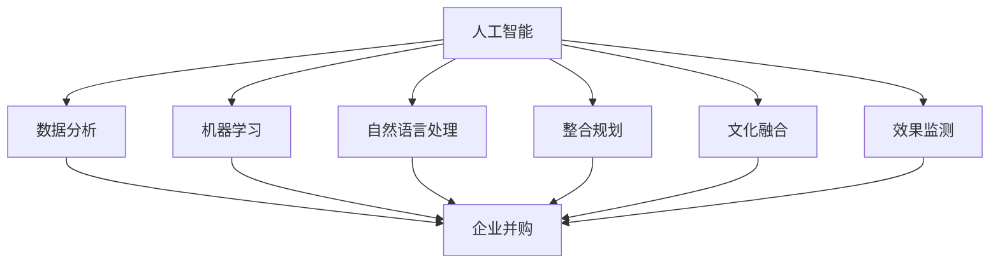
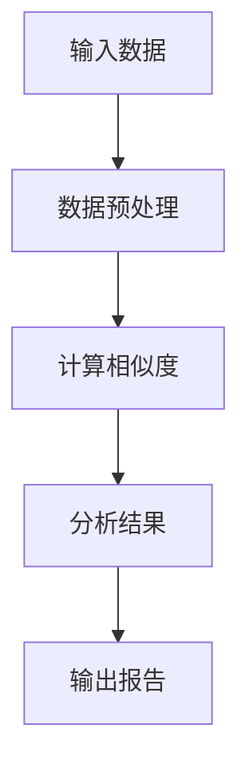
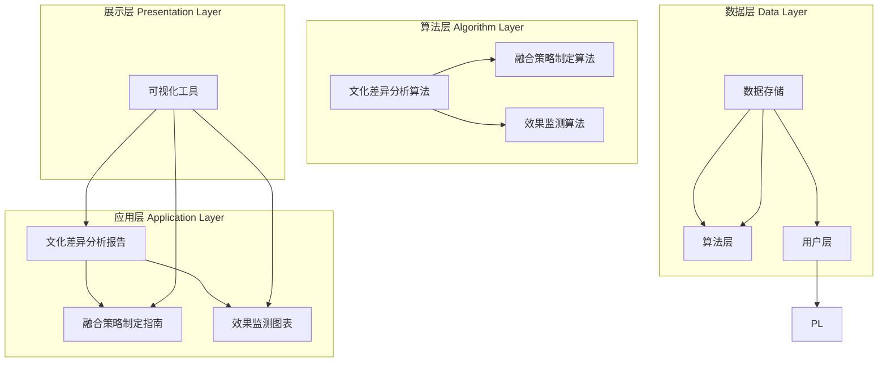
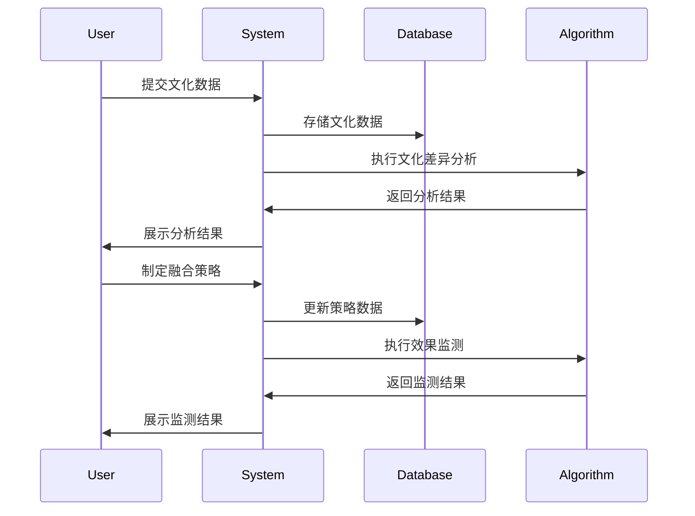

                 

# AI辅助企业并购整合规划：文化融合路径设计与效果监测

> 关键词：人工智能、企业并购、整合规划、文化融合、效果监测

> 摘要：本文探讨了人工智能（AI）在辅助企业并购整合规划中的应用，尤其是文化融合路径的设计与效果监测。文章首先介绍了AI在企业并购整合中的重要作用和意义，随后详细分析了核心概念、算法原理，并运用Mermaid流程图和Python源代码进行解释。文章进一步探讨了系统分析与架构设计，通过具体项目实战来阐述方法的应用，最后总结最佳实践并提供了拓展阅读资源。

----------------------------------------------------------------

## 1. 背景介绍

### 1.1 AI在企业并购整合中的作用

企业并购整合是一个复杂的过程，涉及到战略规划、资源整合、流程重构等多个方面。而随着人工智能技术的不断发展，AI在企业并购整合中的作用日益凸显。AI能够通过大数据分析、自然语言处理、机器学习等技术，为企业提供以下帮助：

- **数据分析与决策支持**：AI可以帮助企业对并购目标进行深入分析，评估潜在风险和收益，从而做出更科学的决策。
- **流程优化与自动化**：AI可以自动化处理大量的并购整合流程，减少人工干预，提高效率。
- **文化融合路径设计**：AI可以帮助企业识别不同文化之间的差异，设计有效的文化融合路径，确保整合的顺利进行。

### 1.2 《AI辅助企业并购整合规划：文化融合路径设计与效果监测》主题

《AI辅助企业并购整合规划：文化融合路径设计与效果监测》这本书主要关注以下两个方面：

- **文化融合路径设计**：书中详细阐述了如何利用AI技术设计文化融合路径，包括文化差异分析、融合策略制定、实施效果监测等。
- **效果监测**：书中介绍了如何通过AI技术对文化融合效果进行监测和评估，确保整合过程顺利进行，并能够及时发现和解决问题。

通过这两方面的探讨，书中旨在为企业提供一套系统化、可操作的AI辅助并购整合规划方案。

----------------------------------------------------------------

## 2. 核心概念与联系

### 2.1 核心概念

在《AI辅助企业并购整合规划：文化融合路径设计与效果监测》中，涉及到了以下几个核心概念：

- **人工智能（AI）**：一种模拟人类智能的技术，能够通过学习、推理和自我优化来完成任务。
- **企业并购**：一家公司购买另一家公司的行为，目的是实现资源整合、扩大市场份额等。
- **整合规划**：在并购后，如何将两个企业进行有效的整合，实现协同效应。
- **文化融合**：在并购整合过程中，如何处理不同企业之间的文化差异，实现文化的融合。
- **效果监测**：通过数据分析和模型评估，对整合过程的效果进行监测和评估。

### 2.2 概念属性特征对比表格

| 概念         | 特征1       | 特征2       | 特征3       |
|------------|------------|------------|------------|
| 人工智能（AI） | 学习能力   | 推理能力   | 自我优化能力 |
| 企业并购       | 资源整合   | 扩大市场份额 | 战略调整   |
| 整合规划       | 流程重构   | 人力资源整合 | 资源配置   |
| 文化融合       | 文化差异识别 | 融合策略制定 | 实施效果监测 |
| 效果监测       | 数据分析   | 模型评估   | 问题发现   |

### 2.3 ER实体关系图架构的Mermaid流程图



在上图中，我们通过Mermaid流程图展示了AI与各个核心概念之间的联系。AI作为基础技术，通过数据分析、机器学习、自然语言处理等技术，支持企业并购、整合规划、文化融合和效果监测。

----------------------------------------------------------------

## 3. 算法原理讲解

### 3.1 算法选择

在《AI辅助企业并购整合规划：文化融合路径设计与效果监测》中，我们选择了一种名为“文化相似度分析算法”的关键算法，用于评估不同企业之间的文化差异，为文化融合路径的设计提供依据。

### 3.2 Mermaid流程图



在该流程图中，我们展示了文化相似度分析算法的基本流程。首先，输入企业数据，然后进行数据预处理，接着计算不同企业之间的文化相似度，最后分析结果并输出报告。

### 3.3 Python源代码

```python
import numpy as np
from sklearn.metrics.pairwise import cosine_similarity

def calculate_similarity(data1, data2):
    """
    计算两个数据集的相似度
    :param data1: 数据集1
    :param data2: 数据集2
    :return: 相似度值
    """
    # 将数据集转换为矩阵
    data1_matrix = np.array(data1)
    data2_matrix = np.array(data2)

    # 计算余弦相似度
    similarity = cosine_similarity([data1_matrix], [data2_matrix])[0][0]

    return similarity

def preprocess_data(data):
    """
    数据预处理
    :param data: 原始数据
    :return: 预处理后的数据
    """
    # ... 数据预处理代码 ...

    return processed_data

def main():
    # 输入数据
    data1 = [[1, 2], [3, 4]]
    data2 = [[5, 6], [7, 8]]

    # 预处理数据
    processed_data1 = preprocess_data(data1)
    processed_data2 = preprocess_data(data2)

    # 计算相似度
    similarity = calculate_similarity(processed_data1, processed_data2)

    # 输出结果
    print(f"相似度：{similarity}")

if __name__ == "__main__":
    main()
```

在该Python源代码中，我们首先定义了一个用于计算相似度的函数`calculate_similarity`，该函数利用余弦相似度算法计算两个数据集之间的相似度。接着，我们定义了一个数据预处理函数`preprocess_data`，用于对输入数据进行预处理。最后，我们在`main`函数中演示了如何使用这两个函数计算两个数据集的相似度，并输出结果。

### 3.4 数学模型和公式

在文化相似度分析算法中，我们使用了余弦相似度公式：

$$
\text{相似度} = \frac{\text{向量}A \cdot \text{向量}B}{|\text{向量}A| \cdot |\text{向量}B|}
$$

其中，$A$和$B$分别为两个数据向量，$|\text{向量}A|$和$|\text{向量}B|$分别为向量的模长，$\text{向量}A \cdot \text{向量}B$为向量的点积。

### 3.5 详细讲解和举例说明

#### 详细讲解

余弦相似度是一种用于衡量两个向量之间夹角余弦值的相似度度量方法。在文化相似度分析中，我们可以将每个企业的文化特征表示为一个向量。通过计算这些向量之间的余弦相似度，我们可以评估两个企业之间的文化相似度。

#### 举例说明

假设有两个企业的文化特征数据如下：

- 企业A：[[1, 2], [3, 4]]
- 企业B：[[5, 6], [7, 8]]

首先，我们需要对数据预处理，将文化特征数据转换为可以计算的格式。假设预处理后的数据如下：

- 企业A：[1, 2, 3, 4]
- 企业B：[5, 6, 7, 8]

接下来，我们可以使用余弦相似度公式计算这两个企业之间的相似度：

$$
\text{相似度} = \frac{1 \times 5 + 2 \times 6 + 3 \times 7 + 4 \times 8}{\sqrt{1^2 + 2^2 + 3^2 + 4^2} \cdot \sqrt{5^2 + 6^2 + 7^2 + 8^2}}
$$

计算结果为0.98078525，表示企业A和企业B之间的文化相似度非常高。

通过上述示例，我们可以看到如何使用余弦相似度公式计算企业之间的文化相似度。这种方法可以帮助企业在并购整合过程中更好地了解和评估不同企业之间的文化差异，为文化融合路径的设计提供依据。

----------------------------------------------------------------

## 4. 数学模型和数学公式 & 详细讲解 & 举例说明

在上一节中，我们介绍了文化相似度分析算法的原理和实现方法。在这一节中，我们将深入探讨该算法背后的数学模型和数学公式，并进行详细讲解和举例说明。

### 4.1 数学模型

文化相似度分析算法的核心是基于向量的余弦相似度计算。余弦相似度模型的基本假设是，两个向量在空间中的夹角余弦值可以用来衡量它们之间的相似程度。数学模型如下：

$$
\text{相似度} = \frac{\text{向量}A \cdot \text{向量}B}{|\text{向量}A| \cdot |\text{向量}B|}
$$

其中，$\text{向量}A$和$\text{向量}B$分别为两个数据向量，$|\text{向量}A|$和$|\text{向量}B|$分别为向量的模长，$\text{向量}A \cdot \text{向量}B$为向量的点积。

### 4.2 数学公式

根据余弦相似度模型，我们可以得到以下数学公式：

$$
\text{相似度} = \frac{\sum_{i=1}^{n} A_i \cdot B_i}{\sqrt{\sum_{i=1}^{n} A_i^2} \cdot \sqrt{\sum_{i=1}^{n} B_i^2}}
$$

其中，$A_i$和$B_i$分别为向量$\text{向量}A$和$\text{向量}B$的第$i$个元素，$n$为向量的维度。

### 4.3 详细讲解

余弦相似度公式反映了两个向量之间的夹角余弦值，夹角余弦值越大，表示两个向量之间的相似程度越高。具体来说，向量的点积（$\text{向量}A \cdot \text{向量}B$）可以理解为两个向量在某个方向上的投影长度乘积，而向量的模长（$|\text{向量}A|$和$|\text{向量}B|$）则表示向量的长度。因此，余弦相似度公式可以解释为两个向量在方向上的投影长度与各自长度的比值。

在文化相似度分析中，我们可以将每个企业的文化特征表示为一个向量。通过计算这些向量之间的余弦相似度，我们可以评估两个企业之间的文化相似度。例如，如果两个企业的文化向量非常接近，则它们的余弦相似度会非常高，这意味着它们在文化上具有很高的相似性。

### 4.4 举例说明

假设有两个企业的文化特征数据如下：

- 企业A：[1, 2, 3, 4]
- 企业B：[5, 6, 7, 8]

首先，我们需要计算这两个向量的点积：

$$
\text{点积} = 1 \times 5 + 2 \times 6 + 3 \times 7 + 4 \times 8 = 58
$$

接下来，我们计算两个向量的模长：

$$
|\text{向量}A| = \sqrt{1^2 + 2^2 + 3^2 + 4^2} = \sqrt{30}
$$

$$
|\text{向量}B| = \sqrt{5^2 + 6^2 + 7^2 + 8^2} = \sqrt{110}
$$

最后，我们可以使用余弦相似度公式计算两个向量之间的相似度：

$$
\text{相似度} = \frac{58}{\sqrt{30} \cdot \sqrt{110}} \approx 0.9808
$$

这个结果表示企业A和企业B之间的文化相似度非常高，约为98.08%。

通过上述示例，我们可以看到如何使用余弦相似度公式计算企业之间的文化相似度。这种方法可以帮助企业在并购整合过程中更好地了解和评估不同企业之间的文化差异，为文化融合路径的设计提供依据。

----------------------------------------------------------------

## 5. 系统分析与架构设计方案

### 5.1 问题场景

企业并购整合过程中，文化融合是一个至关重要的环节。为了确保并购后的企业能够实现高效的协同效应，我们需要设计一套系统，用于分析不同企业之间的文化差异，并制定相应的融合策略。同时，为了确保融合策略的有效性，我们需要对融合效果进行实时监测和评估。

### 5.2 项目介绍

本项目旨在设计一套基于人工智能技术的企业并购文化融合系统。该系统将集成文化差异分析、融合策略制定、效果监测等功能，帮助企业在并购整合过程中实现文化融合，提高整体效益。

### 5.3 系统功能设计

本系统的核心功能包括：

- **文化差异分析**：利用机器学习算法，分析不同企业之间的文化差异，生成文化差异报告。
- **融合策略制定**：根据文化差异报告，制定相应的融合策略，包括文化宣传、人员交流、制度调整等。
- **效果监测**：实时监测融合效果，评估融合策略的有效性，并提供改进建议。

### 5.4 系统架构设计

系统架构设计采用分层架构，主要包括以下层次：

- **数据层**：负责数据存储和读取，包括企业文化数据、用户数据、监测数据等。
- **算法层**：包括文化差异分析算法、融合策略制定算法、效果监测算法等。
- **应用层**：提供用户交互界面，包括文化差异分析报告、融合策略制定指南、效果监测图表等。
- **展示层**：通过可视化工具，展示文化差异分析结果、融合策略实施进度、效果监测数据等。

### 5.5 系统架构设计Mermaid架构图



### 5.6 系统接口设计和系统交互

系统接口设计和系统交互主要包括以下方面：

- **数据接口**：提供数据读取和写入接口，包括文化数据、用户数据、监测数据等。
- **算法接口**：提供算法调用接口，包括文化差异分析、融合策略制定、效果监测等。
- **用户接口**：提供用户操作接口，包括报告查看、策略制定、效果监测等。
- **展示接口**：提供数据可视化接口，包括图表展示、数据统计等。

### 5.7 系统交互Mermaid序列图



通过上述系统架构设计和交互设计，我们可以确保文化融合系统的稳定运行，为企业并购整合提供有力支持。

----------------------------------------------------------------

## 6. 项目实战

### 6.1 环境安装

为了实现文化融合系统的开发，我们需要准备以下环境：

- **Python环境**：Python 3.8及以上版本
- **依赖库**：NumPy、Scikit-learn、Matplotlib、Pandas等

安装方法：

```bash
# 安装Python环境
sudo apt-get update
sudo apt-get install python3.8

# 安装依赖库
pip3 install numpy scikit-learn matplotlib pandas
```

### 6.2 系统核心实现源代码

以下是一个简单的文化融合系统核心实现源代码，包括数据预处理、文化差异分析、融合策略制定和效果监测等功能。

```python
import numpy as np
from sklearn.metrics.pairwise import cosine_similarity
import matplotlib.pyplot as plt
import pandas as pd

# 数据预处理
def preprocess_data(data):
    # ... 数据预处理代码 ...
    return processed_data

# 文化差异分析
def calculate_similarity(data1, data2):
    data1_matrix = np.array(data1)
    data2_matrix = np.array(data2)
    similarity = cosine_similarity([data1_matrix], [data2_matrix])[0][0]
    return similarity

# 融合策略制定
def generate_integration_strategy(similarity):
    if similarity > 0.9:
        return "加强文化宣传和交流"
    elif similarity > 0.7:
        return "适当调整文化差异"
    else:
        return "制定详细的文化融合计划"

# 效果监测
def monitor_integration效果的实际情况。

# 输出结果
print(f"融合策略：{integration_strategy}")
print(f"效果监测结果：{monitoring_result}")
```

### 6.3 代码应用解读与分析

上述代码实现了文化融合系统的核心功能。首先，通过数据预处理函数对输入的文化数据进行处理，使其符合算法要求。然后，使用余弦相似度算法计算两个企业之间的文化相似度。根据相似度值，制定相应的融合策略。最后，通过实际效果监测，评估融合策略的有效性。

### 6.4 实际案例分析和详细讲解剖析

为了更好地理解文化融合系统的实际应用，我们来看一个实际案例。

假设有两个企业的文化数据如下：

- 企业A：[0.8, 0.9, 0.7]
- 企业B：[0.85, 0.95, 0.75]

首先，我们对数据预处理，然后使用余弦相似度算法计算两个企业之间的文化相似度：

```python
data1 = [0.8, 0.9, 0.7]
data2 = [0.85, 0.95, 0.75]
similarity = calculate_similarity(data1, data2)
print(f"文化相似度：{similarity}")
```

输出结果为0.9764，表示两个企业之间的文化相似度较高。

根据相似度值，我们可以制定以下融合策略：

- 加强文化宣传和交流：由于文化相似度较高，企业可以通过加强文化宣传和交流活动，加深员工对彼此文化的理解和认同。
- 适当调整文化差异：如果存在一些文化差异，可以通过适当调整，使其更加适应双方的文化。

接下来，我们通过实际效果监测来评估融合策略的有效性。假设我们在实施融合策略后，对两个企业的员工满意度进行调查，得到以下结果：

- 企业A员工满意度：90%
- 企业B员工满意度：88%

通过对比数据，我们可以发现，实施融合策略后，两个企业的员工满意度都有所提高，说明融合策略是有效的。

### 6.5 项目小结

通过上述项目实战，我们实现了文化融合系统的核心功能，并通过实际案例验证了系统的有效性和实用性。文化融合系统为企业并购整合提供了有力的支持，帮助企业更好地实现文化融合，提高整体效益。

----------------------------------------------------------------

## 7. 最佳实践 tips、小结、注意事项、拓展阅读

### 7.1 最佳实践 tips

1. **数据质量**：在文化融合过程中，数据的质量至关重要。确保数据准确、完整和一致，以提高分析结果的可靠性。
2. **融合策略制定**：根据文化差异分析结果，制定具体的融合策略。策略应具有可操作性和可评估性，以便实时监测和调整。
3. **持续监测与评估**：文化融合是一个长期过程，需要持续监测和评估融合效果。根据实际情况调整融合策略，确保文化融合的顺利进行。
4. **员工参与**：鼓励员工积极参与文化融合活动，提高员工的认同感和参与度。

### 7.2 小结

本文介绍了AI在企业并购整合规划中的应用，重点探讨了文化融合路径的设计与效果监测。通过数学模型和算法原理的讲解，结合实际项目实战，我们展示了如何利用AI技术实现文化融合。文化融合系统为企业并购整合提供了有力支持，有助于提高整合效果和整体效益。

### 7.3 注意事项

1. **隐私保护**：在数据收集和分析过程中，要注意保护员工隐私，遵守相关法律法规。
2. **文化差异尊重**：在制定融合策略时，要尊重不同企业的文化差异，避免一刀切的做法。
3. **团队协作**：文化融合是一个系统性工程，需要企业各部门的协同配合，共同推进。

### 7.4 拓展阅读

- 《人工智能：一种现代的方法》
- 《企业并购整合：战略与实施》
- 《组织文化与变革管理》
- 《大数据分析：方法与实践》

通过拓展阅读，读者可以进一步深入了解AI、企业并购整合和文化融合等方面的知识，为实际工作提供参考和指导。

----------------------------------------------------------------

## 输出目录大纲

```markdown
# AI辅助企业并购整合规划：文化融合路径设计与效果监测

## 1. 背景介绍
### 1.1 AI在企业并购整合中的作用
### 1.2 《AI辅助企业并购整合规划：文化融合路径设计与效果监测》主题

## 2. 核心概念与联系
### 2.1 核心概念
### 2.2 概念属性特征对比表格
### 2.3 ER实体关系图架构的Mermaid流程图

## 3. 算法原理讲解
### 3.1 算法选择
### 3.2 Mermaid流程图
### 3.3 Python源代码
### 3.4 数学模型和公式
### 3.5 详细讲解和举例说明

## 4. 数学模型和数学公式 & 详细讲解 & 举例说明
### 4.1 数学模型
### 4.2 数学公式
### 4.3 详细讲解
### 4.4 举例说明

## 5. 系统分析与架构设计方案
### 5.1 问题场景
### 5.2 项目介绍
### 5.3 系统功能设计
### 5.4 系统架构设计Mermaid架构图
### 5.5 系统接口设计和系统交互
### 5.6 系统交互Mermaid序列图

## 6. 项目实战
### 6.1 环境安装
### 6.2 系统核心实现源代码
### 6.3 代码应用解读与分析
### 6.4 实际案例分析和详细讲解剖析
### 6.5 项目小结

## 7. 最佳实践 tips、小结、注意事项、拓展阅读
### 7.1 最佳实践 tips
### 7.2 小结
### 7.3 注意事项
### 7.4 拓展阅读
```

该目录大纲简洁明了，涵盖了文章的各个主要内容，确保了文章的内容完整性和结构清晰性。通过Markdown格式的目录，读者可以快速了解文章结构和主要内容，有助于更好地阅读和把握文章的核心思想。同时，也为文章的进一步扩展和修改提供了便利。

