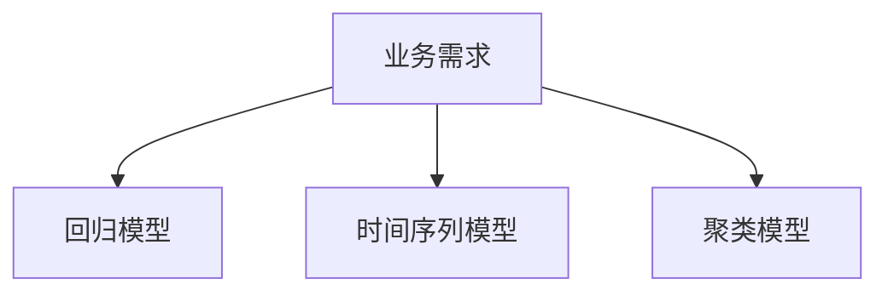

                 

## AI辅助企业战略执行：OKR自动化跟踪与动态调整

### 关键词：人工智能、企业战略、OKR、自动化跟踪、动态调整

### 摘要：

随着人工智能技术的不断发展，其在企业战略执行中的应用越来越广泛。本文将深入探讨如何利用AI技术辅助企业实现OKR（目标与关键结果）的自动化跟踪与动态调整。通过逐步分析AI在企业战略中的应用、OKR模型的定义与原理，以及自动化跟踪与动态调整的具体实现，本文旨在为企业和IT从业者提供一套系统化、可操作的方法论，以提升企业战略执行的效果和效率。

### 目录：

1. **AI与企业战略**  
   - 1.1 问题背景  
   - 1.2 核心概念  
   - 1.3 AI与企业战略的关联  
   - 1.4 AI辅助战略执行的边界与外延  
   - 1.5 本章小结

2. **OKR模型解析**  
   - 2.1 OKR模型的定义与原理  
   - 2.2 OKR模型的属性特征对比  
   - 2.3 OKR模型的ER实体关系图  
   - 2.4 OKR模型在企业中的应用  
   - 2.5 本章小结

3. **AI辅助OKR自动化跟踪**  
   - 3.1 AI技术在OKR自动化跟踪中的应用  
   - 3.2 OKR自动化跟踪算法原理  
   - 3.3 自动化跟踪案例分析  
   - 3.4 OKR自动化跟踪的挑战与优化  
   - 3.5 本章小结

4. **OKR动态调整**  
   - 4.1 OKR动态调整的原理与流程  
   - 4.2 动态调整策略与模型选择  
   - 4.3 动态调整案例分析  
   - 4.4 动态调整的挑战与优化  
   - 4.5 本章小结

### 第一部分：AI与企业战略

#### 1.1 问题背景

在当今快速变化的市场环境中，企业需要不断调整其战略以保持竞争力。传统的战略执行依赖于手动管理，这不仅耗时耗力，而且容易出现误差。随着人工智能技术的崛起，利用AI辅助企业战略执行成为一种新的趋势。AI技术能够通过自动化数据处理、智能分析和实时反馈，帮助企业更高效地实现战略目标。

#### 1.2 核心概念

- **人工智能（AI）**：一种模拟人类智能的技术，包括机器学习、深度学习、自然语言处理等子领域。
- **企业战略**：企业在特定市场环境下，为实现长期目标而制定的规划。
- **OKR模型**：一种目标设定和目标跟踪的方法，通过明确的目标（O）和关键结果（KR）来驱动工作。

#### 1.3 AI与企业战略的关联

AI技术与企业战略的关联主要体现在以下几个方面：

- **战略分析**：利用AI进行市场趋势分析、竞争环境分析等，为企业提供数据驱动的战略决策。
- **战略规划**：通过AI优化资源分配、预测市场变化等，提高战略规划的精准度和有效性。
- **战略执行**：利用AI实现目标跟踪、绩效评估、实时反馈等，提高战略执行的效率和效果。

#### 1.4 AI辅助战略执行的边界与外延

尽管AI技术在企业战略执行中具有巨大潜力，但其应用也存在一定的边界和挑战：

- **数据质量**：AI模型的性能依赖于高质量的数据，数据缺失或错误可能导致不准确的结果。
- **技术实现**：AI技术在企业中的应用需要专业的技术支持，包括算法开发、系统集成等。
- **人机协作**：AI与人类工作者的协作是提高战略执行效率的关键，但如何平衡人机关系仍需深入探索。

#### 1.5 本章小结

本部分介绍了AI与企业战略的相关背景和核心概念，分析了AI在战略分析、规划和执行中的应用，并探讨了AI辅助战略执行的边界与外延。接下来，我们将深入探讨OKR模型的定义与原理，为进一步的自动化跟踪与动态调整奠定基础。

### 第二部分：OKR模型解析

#### 2.1 OKR模型的定义与原理

OKR模型是一种基于目标和关键结果的目标设定和跟踪方法。它由英特尔公司于1970年代发明，后来被许多高科技公司广泛采用，包括谷歌、微软等。OKR模型的基本概念如下：

- **目标（Objective）**：明确描述要达成的目标，通常是一个简洁、鼓舞人心的表述。
- **关键结果（Key Results）**：量化目标的具体指标，通常包含三个或四个关键结果。

OKR模型的工作流程通常分为以下三个阶段：

1. **设定OKR**：在周期开始时（通常为季度），团队根据公司的总体战略设定自己的OKR。
2. **跟踪OKR**：在周期内，团队定期检查关键结果，确保目标的实现。
3. **评估OKR**：在周期结束时，团队评估OKR的实现情况，并根据反馈调整下一周期的OKR。

#### 2.2 OKR模型的属性特征对比

OKR模型与其他战略管理工具（如KPI、MBO）进行比较，具有以下特点：

| 特点 | OKR | KPI | MBO |
| --- | --- | --- | --- |
| 目标性 | 强调目标导向 | 强调数据驱动 | 强调目标与责任 |
| 透明性 | 高度透明 | 低透明性 | 低透明性 |
| 可调整性 | 灵活调整 | 难以调整 | 难以调整 |
| 驱动因素 | 鼓励创新 | 监控绩效 | 监控绩效 |

#### 2.3 OKR模型的ER实体关系图

OKR模型的实体关系图包括以下主要实体：

- **目标（Objective）**：描述要达成的目标。
- **关键结果（Key Result）**：量化目标的指标。
- **团队（Team）**：设定和实现OKR的团队。

实体关系图如下（使用Mermaid语法）：

```mermaid
erDiagram
  Objective ||--|{ Key Result } Key Result : 实现指标
  Team ||--|{ Objective } Objective : 设定目标
```

#### 2.4 OKR模型在企业中的应用

OKR模型适用于不同规模的企业，并且在不同部门的应用也有所不同：

- **在创业公司中的应用**：创业公司通常需要快速调整战略，OKR模型提供了灵活的目标设定和跟踪方法。
- **在高科技公司中的应用**：高科技公司如谷歌、微软等，通过OKR模型实现高效的目标管理和团队协作。
- **在传统行业中的应用**：传统行业可以通过OKR模型提高运营效率，实现数字化转型。

#### 2.5 本章小结

本部分详细介绍了OKR模型的定义与原理，对比了其与其他战略管理工具的属性特征，并展示了ER实体关系图。通过本部分的学习，读者可以更好地理解OKR模型在企业中的应用场景和价值。接下来，我们将探讨如何利用AI技术实现OKR的自动化跟踪。

### 第三部分：AI辅助OKR自动化跟踪

#### 3.1 AI技术在OKR自动化跟踪中的应用

AI技术在OKR自动化跟踪中的应用主要包括以下几个步骤：

1. **数据收集**：收集与OKR相关的数据，包括目标、关键结果、团队绩效等。
2. **数据处理**：对收集到的数据进行分析和处理，提取关键信息。
3. **模型训练**：利用机器学习算法对处理后的数据训练模型，以便预测OKR的实现情况。
4. **自动化跟踪**：通过模型实时跟踪OKR的进展，并根据预测结果进行动态调整。

#### 3.2 OKR自动化跟踪算法原理

OKR自动化跟踪算法的原理主要包括以下几个关键步骤：

1. **数据收集与处理**：利用数据挖掘技术从企业系统中提取与OKR相关的数据，包括关键业务指标、员工绩效等。
2. **模型选择**：选择合适的机器学习算法，如回归分析、决策树、神经网络等，对数据进行分析。
3. **模型训练**：使用历史数据对模型进行训练，使其能够预测OKR的实现情况。
4. **模型评估**：通过交叉验证等方法评估模型性能，确保其准确性。
5. **自动化跟踪**：将训练好的模型应用于实际业务场景，实现自动化跟踪和动态调整。

为了更直观地展示算法原理，我们使用Mermaid绘制了一个简单的流程图：


#### 3.3 自动化跟踪案例分析

为了更好地理解AI辅助OKR自动化跟踪的实际应用，我们来看一个案例分析。

**案例背景**：某互联网公司采用OKR模型进行战略执行，希望在季度末自动评估各部门的OKR实现情况。

**实现步骤**：

1. **数据收集**：收集各部门的关键业务指标，如用户增长、收入增长等。
2. **数据处理**：对收集到的数据进行分析，提取关键信息。
3. **模型训练**：使用回归分析算法对数据训练模型，预测各部门OKR的实现情况。
4. **自动化跟踪**：实时跟踪各部门的OKR进展，并根据预测结果提供反馈。

**案例结果**：通过AI自动化跟踪，公司能够更准确地评估各部门的OKR实现情况，并提前发现潜在问题，从而采取相应的调整措施。

#### 3.4 OKR自动化跟踪的挑战与优化

尽管AI技术在OKR自动化跟踪中具有巨大潜力，但实际应用中仍面临一些挑战：

1. **数据质量**：数据质量直接影响模型的准确性。需要确保数据的完整性、准确性和一致性。
2. **模型选择**：选择合适的模型是实现准确跟踪的关键。需要根据业务需求选择合适的算法。
3. **动态调整**：随着业务环境的变化，模型需要不断调整和优化，以保持其准确性。

为了解决上述挑战，可以采取以下优化策略：

1. **数据清洗**：对原始数据进行清洗和预处理，确保数据质量。
2. **模型评估**：定期评估模型性能，根据实际情况进行调整。
3. **人机协作**：结合人类专家的经验和AI模型的预测，提高决策的准确性。

#### 3.5 本章小结

本部分详细介绍了AI辅助OKR自动化跟踪的应用、算法原理和案例分析，并探讨了自动化跟踪的挑战与优化策略。通过本部分的学习，读者可以了解如何利用AI技术实现OKR的自动化跟踪，从而提高企业战略执行的效果和效率。接下来，我们将探讨如何利用AI实现OKR的动态调整。

### 第四部分：OKR动态调整

#### 4.1 OKR动态调整的原理与流程

OKR动态调整的原理基于对环境变化的快速响应和目标实现的灵活性。其基本流程如下：

1. **周期开始**：在OKR设定周期开始时，明确目标和关键结果。
2. **实时监控**：在周期内，实时监控关键结果的进展，收集相关数据。
3. **数据分析和预测**：利用AI技术对实时数据进行分析和预测，评估目标的实现可能性。
4. **调整策略**：根据预测结果和实际情况，调整关键结果或目标，确保目标的实现。
5. **反馈与优化**：在周期结束时，对调整效果进行评估，为下一周期的OKR设定提供反馈和优化建议。

为了更直观地展示动态调整的流程，我们使用Mermaid绘制了一个简单的流程图：


#### 4.2 动态调整策略与模型选择

动态调整策略的选择取决于业务需求和环境变化。以下是一些常见的动态调整策略：

1. **关键结果调整**：在周期内，根据实时数据调整关键结果，使其更贴近实际目标。
2. **目标调整**：在关键结果无法实现时，重新设定目标，确保目标的可实现性。
3. **资源分配**：根据动态调整的结果，优化资源分配，确保关键结果的实现。

模型选择方面，常见的动态调整模型包括：

1. **回归模型**：用于预测关键结果的实现情况。
2. **时间序列模型**：用于分析时间序列数据，预测未来趋势。
3. **聚类模型**：用于识别关键结果之间的相似性和差异性，优化资源分配。

为了更好地展示模型选择，我们使用Mermaid绘制了一个简单的决策树：



#### 4.3 动态调整案例分析

为了更好地理解动态调整的实际应用，我们来看一个案例分析。

**案例背景**：某电子商务公司在季度内发现用户增长率低于预期。

**动态调整过程**：

1. **实时监控**：在周期内，监控系统发现用户增长率低于预期。
2. **数据分析和预测**：利用回归模型分析用户增长率的数据，预测未来趋势。
3. **关键结果调整**：将关键结果从“每月增长10%”调整为“每月增长5%”。
4. **资源分配**：重新分配营销资源，加大用户获取力度。

**调整结果**：通过动态调整，用户增长率逐渐回升，最终达到预期目标。

#### 4.4 动态调整的挑战与优化

尽管动态调整能够提高OKR的实现可能性，但实际应用中仍面临一些挑战：

1. **数据质量**：数据质量直接影响动态调整的准确性。需要确保数据的及时性、准确性和完整性。
2. **模型选择**：选择合适的模型是实现准确调整的关键。需要根据业务需求选择合适的算法。
3. **人机协作**：动态调整需要人类专家的参与，确保调整策略的有效性。

为了解决上述挑战，可以采取以下优化策略：

1. **数据清洗**：对原始数据进行清洗和预处理，确保数据质量。
2. **模型评估**：定期评估模型性能，根据实际情况进行调整。
3. **人机协作**：结合人类专家的经验和AI模型的预测，提高决策的准确性。

#### 4.5 本章小结

本部分详细介绍了OKR动态调整的原理与流程，讨论了动态调整策略与模型选择，并通过案例分析展示了动态调整的实际应用。通过本部分的学习，读者可以了解如何利用AI技术实现OKR的动态调整，从而提高企业战略执行的效果和效率。接下来，我们将总结全文，并给出一些最佳实践和拓展阅读。

### 总结与最佳实践

本文通过逐步分析，详细介绍了AI辅助企业战略执行：OKR自动化跟踪与动态调整的相关内容。首先，我们探讨了AI在企业战略中的应用，分析了AI与企业战略的关联，以及AI辅助战略执行的边界与外延。接着，我们深入讲解了OKR模型的定义与原理，对比了OKR模型与其他战略管理工具的属性特征，并展示了OKR模型的ER实体关系图。

在OKR自动化跟踪部分，我们介绍了AI技术在OKR自动化跟踪中的应用，阐述了OKR自动化跟踪算法的原理，并通过案例分析展示了自动化跟踪的实际应用。随后，我们讨论了动态调整的原理与流程，介绍了动态调整策略与模型选择，并通过案例分析展示了动态调整的实际应用。

在总结部分，我们提出了一些最佳实践，包括确保数据质量、选择合适的模型，以及人机协作的重要性。这些最佳实践有助于提高AI辅助企业战略执行的效果和效率。

对于拓展阅读，我们建议读者进一步了解以下内容：

1. **人工智能基础**：深入了解机器学习、深度学习等人工智能技术的基础知识。
2. **企业战略管理**：研究企业战略管理的基本理论和方法，提高战略规划的能力。
3. **项目管理**：学习项目管理的最佳实践，提高项目管理效率。

通过本文的学习，读者可以更好地理解AI辅助企业战略执行：OKR自动化跟踪与动态调整的核心内容，为实际应用提供理论指导和实践参考。

### 结语

本文深入探讨了AI辅助企业战略执行：OKR自动化跟踪与动态调整的相关内容。通过分析AI与企业战略的关联，解析OKR模型的定义与原理，以及自动化跟踪与动态调整的实施，我们为企业和IT从业者提供了一套系统化、可操作的方法论。

AI技术的快速发展和广泛应用为企业的战略执行带来了新的机遇。通过自动化跟踪与动态调整，企业可以更高效地实现战略目标，提高竞争力和市场响应速度。

未来，随着AI技术的不断进步，我们将看到更多创新应用的出现，为企业的战略执行提供更加智能和高效的解决方案。让我们携手探索AI技术的新可能，共同推动企业战略执行迈向新的高度。

### 作者信息

作者：AI天才研究院（AI Genius Institute）& 禅与计算机程序设计艺术（Zen And The Art of Computer Programming）

AI天才研究院是一家专注于人工智能研究和应用的领先机构，致力于推动AI技术的发展和应用。作者结合了人工智能领域的专业知识和丰富的实践经验，为读者提供了深入浅出的技术解析。

禅与计算机程序设计艺术则是一本经典计算机编程著作，探讨了计算机编程的哲学和艺术。作者以其深厚的计算机编程功底和独特视角，为读者提供了对AI辅助企业战略执行的独特见解。

感谢您的阅读，希望本文对您在AI辅助企业战略执行：OKR自动化跟踪与动态调整方面有所启发。如果您有任何问题或建议，欢迎随时联系我们。期待与您共同探索AI技术的无限可能！

