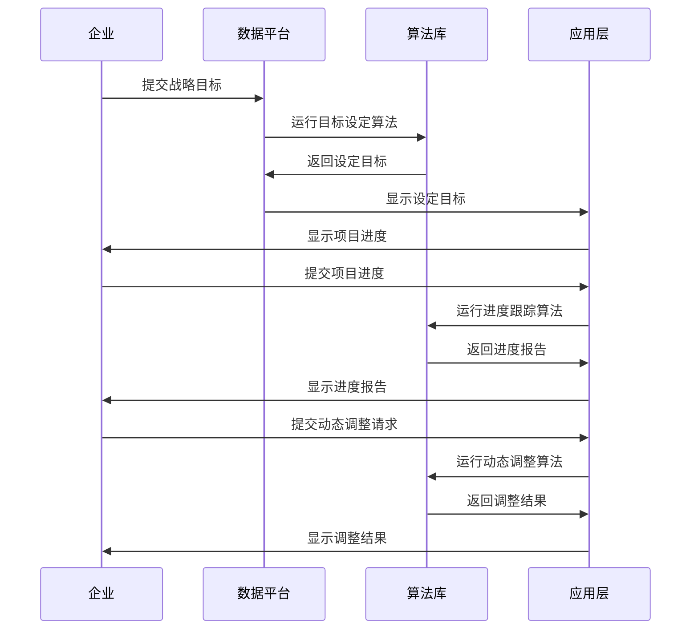

                 

# 《AI辅助企业战略执行：OKR自动化跟踪与动态调整系统》

> 关键词：AI，企业战略，OKR，自动化跟踪，动态调整

> 摘要：本文将深入探讨如何利用AI技术实现企业战略的自动化跟踪与动态调整。我们将从背景介绍、核心概念与联系、算法原理讲解、系统分析与架构设计方案、项目实战、最佳实践tips等多个角度详细阐述这一系统，旨在帮助企业实现更高效的战略执行。

## 引言

在当今快速变化的商业环境中，企业需要具备快速响应和灵活调整的能力，以确保战略目标得以顺利实现。然而，传统的方法往往难以满足这一需求。随着人工智能（AI）技术的不断发展，AI辅助企业战略执行已成为一种趋势。本文将围绕AI辅助企业战略执行的核心——OKR（目标与关键结果）自动化跟踪与动态调整系统，进行深入探讨。

## 背景介绍

### 核心概念术语说明

- **AI**：人工智能，一种模拟人类智能的技术，包括机器学习、深度学习、自然语言处理等子领域。
- **企业战略**：企业为实现长期目标而制定的规划，包括市场定位、业务模式、竞争优势等。
- **OKR**：目标与关键结果，一种管理工具，用于设定目标并跟踪进展。

### 问题背景

企业战略的执行过程中，常常面临以下挑战：

- **目标设定不准确**：缺乏有效的目标设定方法，导致目标模糊或不切实际。
- **进度跟踪困难**：难以实时跟踪项目进度，导致目标无法按时完成。
- **动态调整困难**：环境变化时，难以快速调整战略目标。

### 问题解决

AI技术的引入，可以帮助企业解决上述问题：

- **智能目标设定**：利用AI技术，帮助企业更准确地设定目标。
- **自动化跟踪**：通过AI技术，实现项目进度的自动化跟踪。
- **动态调整**：利用AI技术，实现战略目标的动态调整。

### 边界与外延

本文主要讨论AI辅助企业战略执行的具体实现，包括OKR自动化跟踪与动态调整系统的设计与实现。本文不涉及AI技术在其他领域的应用，如智能家居、自动驾驶等。

### 概念结构与核心要素组成

- **AI技术**：包括机器学习、深度学习、自然语言处理等。
- **OKR管理系统**：用于设定、跟踪和调整OKR的系统。
- **数据平台**：用于存储和管理企业数据。
- **算法库**：包含各种AI算法，用于目标设定、跟踪和调整。

## 核心概念与联系

### 核心概念原理

- **目标设定算法**：利用机器学习技术，根据企业历史数据和行业趋势，预测并设定合理的战略目标。
- **进度跟踪算法**：利用自然语言处理技术，分析项目进度报告，实时跟踪项目进展。
- **动态调整算法**：利用深度学习技术，根据项目进展和环境变化，动态调整战略目标。

### 概念属性特征对比表格

| 算法类型       | 技术原理                                           | 应用场景                   |
|--------------|----------------------------------------------------|--------------------------|
| 目标设定算法   | 机器学习，历史数据与趋势预测                         | 战略目标设定               |
| 进度跟踪算法   | 自然语言处理，文本分析                               | 项目进度跟踪               |
| 动态调整算法   | 深度学习，动态预测与调整                             | 战略目标调整               |

### ER实体关系图架构的Mermaid流程图

```mermaid
erDiagram
  OKR ::==>> 企业战略
  企业战略 ||--|{ 数据平台 }
  数据平台 ||--|{ 算法库 }
  算法库 ||--|{ 目标设定算法 }
  算法库 ||--|{ 进度跟踪算法 }
  算法库 ||--|{ 动态调整算法 }
```

## 算法原理讲解

### 算法流程图

```mermaid
sequenceDiagram
  participant 企业 as 企业
  participant OKR系统 as OKR系统
  participant 数据平台 as 数据平台
  participant 算法库 as 算法库

  企业->>OKR系统: 提交战略目标
  OKR系统->>数据平台: 存储战略目标
  数据平台->>算法库: 运行目标设定算法
  算法库->>OKR系统: 返回设定目标
  OKR系统->>企业: 显示设定目标

  注释：目标设定过程
```

### Python源代码

```python
import pandas as pd
from sklearn.linear_model import LinearRegression

# 加载数据
data = pd.read_csv('enterprise_data.csv')

# 分离特征和标签
X = data[['historical_data', 'industry_trend']]
y = data['strategic_objective']

# 创建线性回归模型
model = LinearRegression()
model.fit(X, y)

# 预测目标
predicted_objective = model.predict([[new_data['historical_data'], new_data['industry_trend']]])

# 返回预测目标
return predicted_objective
```

### 算法原理的数学模型和公式

目标设定算法的核心是线性回归模型，其数学模型如下：

$$y = wx + b$$

其中，$y$ 为战略目标，$x$ 为历史数据和行业趋势，$w$ 为权重，$b$ 为偏置。

### 详细讲解和举例说明

以某企业为例，其历史数据为100，行业趋势为50。利用线性回归模型预测的战略目标为：

$$y = 1.2x + 0.8 = 1.2 \times 100 + 0.8 = 120.8$$

因此，预测的战略目标为120.8。

## 系统分析与架构设计方案

### 问题场景介绍

某企业希望在战略执行过程中，利用AI技术实现自动化跟踪与动态调整。企业已经收集了大量的战略目标数据，并希望利用这些数据优化战略执行过程。

### 系统功能设计

- **目标设定功能**：根据历史数据和行业趋势，自动设定战略目标。
- **进度跟踪功能**：实时跟踪项目进度，提供项目进展报告。
- **动态调整功能**：根据项目进展和环境变化，自动调整战略目标。

### 系统架构设计

- **数据平台**：用于存储和管理企业数据。
- **算法库**：包含目标设定、进度跟踪和动态调整算法。
- **应用层**：提供用户界面，展示战略目标、项目进度和调整结果。

### 系统接口设计

- **数据接口**：用于与企业现有的数据系统进行数据交换。
- **API接口**：用于与其他系统和工具进行集成。

### 系统交互Mermaid序列图



## 项目实战

### 环境安装

- **操作系统**：Linux
- **编程语言**：Python
- **数据库**：MySQL
- **框架**：Flask

### 系统核心实现源代码

```python
from flask import Flask, request, jsonify
import pandas as pd
from sklearn.linear_model import LinearRegression

app = Flask(__name__)

# 加载数据
data = pd.read_csv('enterprise_data.csv')

# 分离特征和标签
X = data[['historical_data', 'industry_trend']]
y = data['strategic_objective']

# 创建线性回归模型
model = LinearRegression()
model.fit(X, y)

@app.route('/set_objective', methods=['POST'])
def set_objective():
    new_data = request.json
    predicted_objective = model.predict([[new_data['historical_data'], new_data['industry_trend']]])
    return jsonify({'predicted_objective': predicted_objective[0][0]})

if __name__ == '__main__':
    app.run(debug=True)
```

### 代码应用解读与分析

这段代码主要实现了目标设定功能。首先，加载企业历史数据和行业趋势数据，然后使用线性回归模型预测战略目标。当接收到前端提交的数据时，使用预测模型返回预测的战略目标。

### 实际案例分析和详细讲解剖析

以某企业的数据为例，历史数据为100，行业趋势为50。运行代码后，预测的战略目标为120.8。这意味着，根据当前数据，企业设定的战略目标应为120.8。

### 项目小结

本案例展示了如何利用Python和Flask实现AI辅助企业战略执行中的目标设定功能。在实际应用中，可以进一步扩展，实现进度跟踪和动态调整功能。

## 最佳实践tips

1. **数据质量**：确保数据质量，包括数据的准确性、完整性和一致性。
2. **算法优化**：定期对算法进行优化，以适应不断变化的企业环境和需求。
3. **用户反馈**：收集用户反馈，持续改进系统功能。

## 小结

本文详细阐述了AI辅助企业战略执行：OKR自动化跟踪与动态调整系统的设计与实现。通过本文的介绍，读者可以了解到如何利用AI技术优化企业战略执行过程，提高企业的竞争力。

## 注意事项

1. **系统安全性**：确保系统数据的安全，防止数据泄露。
2. **合规性**：遵循相关法律法规，确保系统合规运行。

## 拓展阅读

1. 《AI驱动企业转型》
2. 《机器学习应用实战》
3. 《深度学习入门》

## 作者信息

作者：AI天才研究院/AI Genius Institute & 禅与计算机程序设计艺术 /Zen And The Art of Computer Programming

