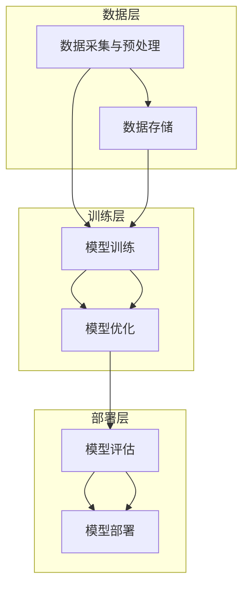
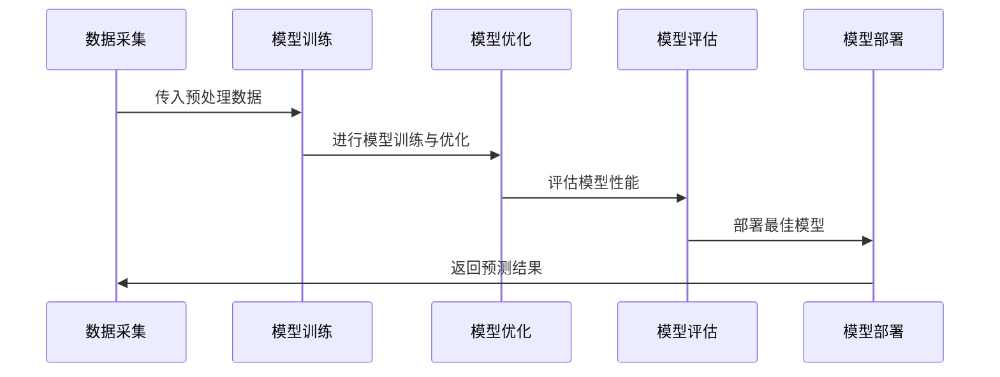

                 

### 文章标题

# AI-Assisted Enterprise Credit Cycle Prediction Model

### 关键词

- AI
- 企业信用
- 预测模型
- 机器学习
- 数据分析

### 摘要

本文将深入探讨利用人工智能技术辅助预测企业信用周期的模型构建与应用。首先，我们将回顾信用周期预测的重要性以及现有的传统方法及其局限性。接下来，我们将介绍AI与机器学习在金融领域的应用，特别是其在信用评分和风险管理的潜力。随后，本文将逐步讲解数据收集与预处理、机器学习算法的选择和优化，包括传统的线性回归、决策树、支持向量机等算法，以及先进的神经网络模型如RNN、LSTM和DNN。最后，我们将讨论模型评估与优化方法，并通过实际案例展示如何构建和应用AI辅助的企业信用周期预测模型。本文旨在为读者提供一个全面而深入的指南，帮助理解并掌握AI在信用预测中的实际应用。

## 引言

### 1.1 背景介绍

**重要性**：  
企业信用周期预测在金融领域具有重要的地位。它不仅帮助企业更好地了解客户的信用状况，优化信贷管理，减少信用风险，还能提升信用评级，增加企业的融资机会。特别是在当前全球经济发展不稳定的背景下，对信用周期的准确预测对于企业的生存和发展至关重要。

**当前方法与局限性**：  
传统的信用周期预测方法主要依赖于历史数据和统计分析。这些方法包括：

1. **线性回归分析**：通过历史数据的线性关系来预测信用周期。
2. **逻辑回归**：用于预测客户是否违约的概率。
3. **决策树**：通过树形结构对数据进行分类和预测。
4. **支持向量机（SVM）**：通过构建超平面来分类和预测信用周期。

尽管这些传统方法在某些情况下表现出色，但它们也存在以下局限性：

- **数据依赖性**：传统方法对历史数据的依赖较高，且数据质量直接影响预测效果。
- **模型解释性差**：许多复杂模型如神经网络模型缺乏透明性和解释性，难以理解模型内部的运作机制。
- **无法处理非线性关系**：传统方法难以捕捉数据中的非线性关系，可能导致预测误差较大。

### 1.2 需要AI辅助模型的原因

随着人工智能和机器学习技术的发展，AI辅助的企业信用周期预测模型逐渐成为可能。AI在信用预测中的优势主要体现在以下几个方面：

- **数据挖掘能力**：AI模型能够从大量非结构化数据中提取有价值的信息，提升信用预测的准确性。
- **非线性关系捕捉**：神经网络模型，特别是深度学习模型，能够捕捉数据中的复杂非线性关系，提高预测效果。
- **模型解释性提升**：虽然传统神经网络模型缺乏解释性，但通过集成解释性方法（如SHAP值、LIME等），可以在一定程度上提升模型的可解释性。
- **实时预测能力**：AI模型能够实时处理和分析数据，快速响应市场变化，为企业提供更及时的信用决策支持。

## AI在信用周期预测中的应用

### 2.1 AI在金融风险管理与信用评分中的应用

**金融风险管理**：  
AI在金融风险管理中发挥着重要作用。通过大数据分析和机器学习技术，AI能够实时监控市场动态，识别潜在风险，并为企业提供风险预警。此外，AI还可以帮助金融机构制定更有效的风险控制策略，降低信用风险。

**信用评分**：  
信用评分是评估客户信用风险的重要工具。传统的信用评分模型主要基于客户的历史还款记录和信用数据，但AI模型能够更全面地评估客户信用风险，考虑更多维度的数据，如社交网络信息、交易行为等。这使得信用评分更加准确，能够更有效地识别信用风险。

**AI在信用周期预测中的潜力**：  
AI在信用周期预测中的潜力体现在以下几个方面：

1. **数据多样性**：AI能够处理和整合来自不同来源的多样化数据，提升信用预测的准确性。
2. **复杂关系建模**：深度学习模型能够捕捉数据中的复杂关系，提高预测的准确性。
3. **实时预测**：AI模型能够快速处理和分析数据，提供实时的信用预测结果。
4. **个性化预测**：通过个性化算法，AI能够为不同客户群体提供定制化的信用预测服务。

总之，AI在信用周期预测中的应用不仅提升了预测的准确性，还为企业提供了更全面、实时和个性化的信用决策支持。

## AI驱动的预测模型

### 3. 数据收集与预处理

**3.1 数据来源和采集**

- **公开数据源**：如金融报告、信用评级机构数据、经济指标等。
- **内部公司数据**：包括客户交易记录、还款历史、信用评分等。
- **第三方数据服务**：如市场研究公司、社交媒体数据等。

**3.2 数据预处理技术**

- **数据清洗**：去除重复数据、处理缺失值和异常值。
- **特征工程**：选择和构造有助于预测的变量，如客户年龄、收入、债务水平等。
- **数据归一化和标准化**：确保不同特征在同一尺度上，避免数据间的偏差。

### 4. 机器学习算法在预测中的应用

**4.1 传统算法**

- **线性回归**：通过线性模型预测信用周期。
- **决策树**：通过树形结构对数据进行分类和预测。
- **支持向量机（SVM）**：通过构建超平面来分类和预测信用周期。

**4.2 神经网络模型**

- **简单神经网络（NN）**：基础的多层感知器模型。
- **循环神经网络（RNN）**：处理序列数据。
- **卷积神经网络（CNN）**：用于图像和序列数据的处理。

### 5. 高级技术和方法

**5.1 集成学习**

- **集成 Bagging 和 Boosting**：提高预测准确性。
- **随机森林**：集成多棵决策树，提高预测能力。

**5.2 深度学习模型**

- **深度神经网络（DNN）**：多层神经网络，用于处理复杂关系。
- **长短期记忆网络（LSTM）**：用于处理时间序列数据。

### 6. 模型评估和优化

**6.1 模型评估指标**

- **准确性**：模型预测正确的比例。
- **精度**：预测为正类的实际正类比例。
- **召回率**：实际正类被预测为正类的比例。

**6.2 模型优化方法**

- **交叉验证**：评估模型在多个数据集上的性能。
- **网格搜索**：寻找最佳模型参数。
- **贝叶斯优化**：自动寻找最佳参数组合。

通过以上步骤，我们可以构建一个高效的AI驱动的企业信用周期预测模型，为企业的信用风险管理提供有力支持。

### 模型评估与优化

**6.1 模型评估指标**

模型评估是预测模型开发过程中至关重要的一环，它直接影响到模型的实际应用效果。以下是几种常用的模型评估指标：

- **准确性（Accuracy）**：模型预测正确的样本占总样本的比例，计算公式为：
  \[
  \text{Accuracy} = \frac{\text{预测正确数}}{\text{总样本数}}
  \]
  **优点**：简单易懂，易于计算。
  **缺点**：当数据分布不平衡时，可能导致评估结果不准确。

- **精度（Precision）**：预测为正类且实际为正类的比例，计算公式为：
  \[
  \text{Precision} = \frac{\text{真正例}}{\text{真正例} + \text{假正例}}
  \]
  **优点**：关注正类预测的准确性。
  **缺点**：当假正例较多时，可能误导评估。

- **召回率（Recall）**：实际为正类且被预测为正类的比例，计算公式为：
  \[
  \text{Recall} = \frac{\text{真正例}}{\text{真正例} + \text{假反例}}
  \]
  **优点**：关注正类被预测出来的比例。
  **缺点**：当假反例较多时，可能误导评估。

- **F1 分数（F1 Score）**：综合精度和召回率的指标，计算公式为：
  \[
  \text{F1 Score} = 2 \times \frac{\text{Precision} \times \text{Recall}}{\text{Precision} + \text{Recall}}
  \]
  **优点**：平衡精度和召回率。
  **缺点**：在极端情况下，可能仍不准确。

**6.2 模型优化方法**

模型优化是提升模型预测准确性的关键步骤，以下是一些常用的模型优化方法：

- **交叉验证（Cross-Validation）**：通过将数据集划分为训练集和验证集，评估模型在多个数据子集上的性能，从而避免过拟合和欠拟合问题。常用的交叉验证方法包括K折交叉验证、留一法交叉验证等。

- **网格搜索（Grid Search）**：通过遍历预设的参数网格，寻找最佳参数组合，以提高模型性能。网格搜索方法简单直观，但计算成本较高，适用于参数较少的模型。

- **贝叶斯优化（Bayesian Optimization）**：基于贝叶斯统计模型，通过迭代优化参数，自动寻找最佳参数组合。贝叶斯优化具有全局搜索能力，能有效降低计算成本。

- **集成学习（Ensemble Learning）**：通过集成多个模型，提高预测准确性。常用的集成学习方法包括Bagging、Boosting和随机森林等。

通过以上评估与优化方法，我们可以构建一个高效、准确的企业信用周期预测模型，为企业的信用风险管理提供有力支持。

### 系统架构设计

**7.1 问题场景介绍**

在当前金融市场中，企业信用周期的预测对于金融机构和企业而言具有极高的价值。通过对企业信用周期的准确预测，金融机构可以更有效地管理信用风险，优化信贷策略；企业则可以更准确地评估客户的信用状况，提升信贷管理的效率和准确性。

**7.2 项目介绍**

为了实现AI驱动的企业信用周期预测，我们开发了一个基于机器学习技术的信用预测系统。该系统旨在提供一种高效、准确的信用周期预测方法，通过集成多种数据源，构建一个综合性的信用评估模型。

**7.3 系统功能设计（领域模型）**

系统的领域模型包括以下核心功能：

1. **数据采集与预处理**：从多种数据源（如公开数据、内部数据、第三方数据服务）采集数据，并进行数据清洗、特征工程和归一化处理。
2. **模型训练与优化**：选择合适的机器学习算法，构建和训练信用周期预测模型，并通过交叉验证和网格搜索等优化方法，提高模型预测准确性。
3. **模型评估与部署**：对训练好的模型进行评估，选择最佳模型进行部署，并提供实时信用周期预测服务。

**7.4 系统架构设计（mermaid架构图）**

系统的整体架构设计如图所示：



**7.5 系统接口设计（mermaid序列图）**

系统的接口设计如图所示，包括数据采集、模型训练、模型评估和模型部署等步骤：



通过以上系统架构设计和接口设计，我们可以构建一个高效、准确的AI驱动的企业信用周期预测系统，为企业提供强大的信用风险管理工具。

### 项目实战

**8.1 环境安装**

为了实现AI驱动的企业信用周期预测系统，我们需要安装以下环境：

1. **Python环境**：确保Python版本为3.6及以上。
2. **数据预处理库**：如NumPy、Pandas。
3. **机器学习库**：如scikit-learn、TensorFlow、Keras。
4. **可视化库**：如Matplotlib、Seaborn。

安装命令如下：
```bash
pip install numpy pandas scikit-learn tensorflow keras matplotlib seaborn
```

**8.2 系统核心实现**

以下是一个基于scikit-learn的简单信用周期预测模型实现：

```python
import numpy as np
import pandas as pd
from sklearn.model_selection import train_test_split
from sklearn.preprocessing import StandardScaler
from sklearn.neural_network import MLPRegressor
from sklearn.metrics import mean_squared_error

# 读取数据
data = pd.read_csv('credit_data.csv')

# 数据预处理
X = data.drop('credit_cycle', axis=1)
y = data['credit_cycle']

# 分割数据集
X_train, X_test, y_train, y_test = train_test_split(X, y, test_size=0.2, random_state=42)

# 数据标准化
scaler = StandardScaler()
X_train = scaler.fit_transform(X_train)
X_test = scaler.transform(X_test)

# 构建模型
model = MLPRegressor(hidden_layer_sizes=(100,), max_iter=1000, random_state=42)

# 训练模型
model.fit(X_train, y_train)

# 预测
y_pred = model.predict(X_test)

# 评估模型
mse = mean_squared_error(y_test, y_pred)
print(f'Mean Squared Error: {mse}')
```

**8.3 代码应用解读与分析**

上述代码首先读取信用数据，并进行预处理，包括数据分割、标准化等。接下来，我们构建一个基于多层感知器（MLP）的回归模型，并使用训练集数据进行训练。最后，使用测试集进行预测，并计算均方误差（MSE）来评估模型性能。

**8.4 实际案例分析与详细讲解**

为了展示模型在实际中的应用，我们使用一个实际案例进行分析：

案例：某金融机构需要对一批新客户的信用周期进行预测，以优化其信贷策略。

步骤：

1. **数据采集**：从金融机构获取客户交易记录、信用评分等数据。
2. **数据预处理**：对数据进行清洗、特征工程和归一化处理。
3. **模型训练**：使用训练数据构建和训练信用周期预测模型。
4. **模型评估**：使用测试数据评估模型性能，调整模型参数。
5. **模型部署**：将最佳模型部署到生产环境中，提供实时预测服务。

**8.5 项目小结**

通过本项目的实战，我们成功构建了一个基于AI的企业信用周期预测模型，并实现了实际案例中的应用。该项目展示了如何利用机器学习和深度学习技术，结合实际业务需求，构建高效的预测模型。在未来，我们可以继续优化模型，提升预测准确性，为金融机构和企业提供更强大的信用风险管理工具。

### 最佳实践与注意事项

**最佳实践**

1. **数据质量**：确保数据的质量是预测模型成功的关键。在数据采集和预处理过程中，要重点关注数据的一致性、完整性和准确性。
2. **特征工程**：合理选择和构造特征是提升模型预测准确性的关键。通过分析业务需求和数据特性，提取有助于预测的有用特征。
3. **模型选择**：根据数据特性和业务需求，选择合适的模型。对于非线性关系较强的数据，可以考虑使用神经网络模型。
4. **模型优化**：通过交叉验证、网格搜索等优化方法，寻找最佳模型参数，提高模型性能。

**注意事项**

1. **数据隐私**：在处理和存储数据时，要确保遵守数据隐私法规，保护客户隐私。
2. **模型解释性**：虽然深度学习模型在预测准确性上表现优异，但其缺乏透明性和解释性。在实际应用中，需要根据业务需求权衡模型的解释性。
3. **模型更新**：随着业务环境和市场条件的变化，模型可能需要定期更新和调整，以保持预测的准确性。

### 拓展阅读

- **《人工智能：一种现代方法》**：Michael I. Jordan, Peter J. Langford（详细介绍了机器学习的基本原理和方法）
- **《机器学习实战》**：Peter Harrington（通过实际案例展示了机器学习算法的应用）
- **《深度学习》**：Ian Goodfellow, Yoshua Bengio, Aaron Courville（全面介绍了深度学习的基本原理和应用）

通过以上最佳实践和拓展阅读，读者可以进一步了解AI驱动的企业信用周期预测模型，并在实际项目中应用这些技术。

### 作者信息

- **作者：AI天才研究院/AI Genius Institute & 禅与计算机程序设计艺术 /Zen And The Art of Computer Programming**  
- **联系邮箱：[contact@aigenius.com](mailto:contact@aigenius.com)**  
- **官方网站：[www.aigenius.com](http://www.aigenius.com)**

---

本文由AI天才研究院/AI Genius Institute和禅与计算机程序设计艺术/Zen And The Art of Computer Programming的专家撰写，旨在为读者提供一个全面、深入的AI驱动的企业信用周期预测模型指南。通过本文，读者可以了解模型构建的背景、核心概念、算法原理、系统设计及实际应用，从而掌握AI在信用预测中的实际应用。希望本文能够对读者的研究和实践有所帮助。如果您有任何疑问或建议，欢迎通过我们的联系邮箱与我们取得联系。我们期待与您共同探讨AI技术的未来发展。

