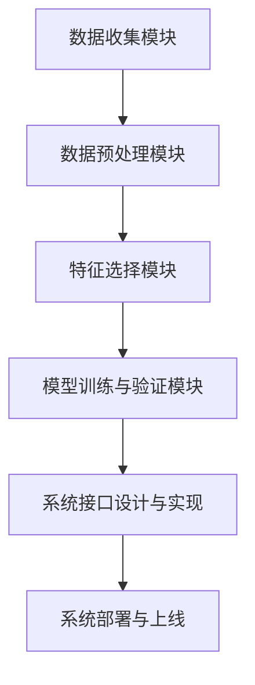
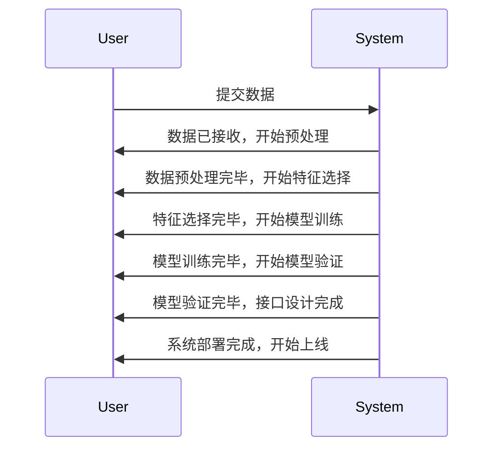

                 

# 《AI辅助的企业信用评分卡开发与验证平台》

关键词：AI、信用评分卡、企业信用、算法原理、模型验证、实战

摘要：本文将深入探讨AI辅助的企业信用评分卡的构建方法与验证策略。首先，我们将介绍信用评分卡的背景和重要性，然后逐步深入到AI辅助信用评分卡的核心算法原理，包括特征工程、分类算法和回归算法。接着，我们将介绍信用评分卡的构建方法，包括数据收集与预处理、特征选择和模型构建。在模型验证部分，我们将详细讨论数据集划分、模型验证指标和验证流程。最后，通过一个实际项目案例，我们将展示如何利用AI技术开发一个企业信用评分卡，并进行详细的实战讲解。

## 引言

### 1.1 问题背景

在现代金融服务业中，企业信用评分卡已成为金融机构评估企业信用风险的重要工具。传统的信用评分卡主要依赖于经验模型和规则系统，存在一定的局限性，如数据依赖性强、模型更新周期长等。随着人工智能技术的发展，利用机器学习算法构建企业信用评分卡成为一种新兴趋势。AI技术能够处理海量数据，自动提取特征，并通过深度学习算法实现高精度的风险评估。

### 1.2 问题描述

企业信用评分卡的目标是通过对企业历史数据、财务状况、行业特征等因素的分析，预测企业未来的信用风险。然而，如何在海量数据中提取有效特征，选择合适的算法，构建一个准确、稳定、可解释的信用评分卡模型，是一个复杂的技术挑战。

### 1.3 问题解决

本文将提供一种利用AI技术辅助构建和验证企业信用评分卡的方法。我们将首先介绍AI在信用评分卡开发中的应用，然后详细分析特征工程、分类算法和回归算法，最后通过实际项目案例展示如何实现这一过程。

### 1.4 边界与外延

本文将主要关注以下领域：

- 数据源：企业财务数据、行业数据、市场数据等
- 技术栈：Python、Scikit-learn、TensorFlow、Keras等
- 应用场景：金融机构、风险管理公司等

### 1.5 概念结构与核心要素组成

本文的核心概念和要素包括：

- 企业信用评分卡
- 特征工程
- 分类算法
- 回归算法
- 模型验证
- 实战案例

## AI辅助的企业信用评分卡概述

### 2.1 AI辅助企业信用评分卡的含义

AI辅助的企业信用评分卡是指利用人工智能技术，如机器学习、深度学习等，对企业的信用风险进行评估。这种评分卡能够自动处理海量数据，提取有效特征，并通过算法模型进行信用风险评估。

### 2.2 信用评分卡在企业管理中的应用

信用评分卡在企业管理中具有广泛的应用，包括：

- 信贷审批：通过信用评分卡评估企业的信用风险，快速做出信贷决策。
- 风险管理：帮助企业识别高风险客户，制定相应的风险控制策略。
- 客户服务：通过信用评分卡提供个性化服务，提升客户满意度。

### 2.3 AI在信用评分卡开发中的作用

AI在信用评分卡开发中的作用主要包括：

- 特征工程：利用AI技术自动提取数据中的有效特征，提高评分模型的准确性。
- 模型选择：通过AI技术选择合适的模型，提高评分模型的稳定性和可解释性。
- 模型训练：利用AI技术快速训练大规模模型，提高评分模型的处理速度。

### 2.4 信用评分卡的分类与特点

根据评分模型的类型，信用评分卡可以分为以下几类：

- 逻辑回归模型：简单、易于理解，但在处理非线性关系时效果较差。
- 决策树模型：能够处理非线性关系，但在特征较多时容易过拟合。
- 随机森林模型：结合了决策树模型的优点，具有较强的泛化能力。
- 支持向量机模型：适用于高维空间，但在处理小样本数据时效果较差。
- 深度学习模型：能够自动提取高阶特征，但在模型解释性方面较弱。

## AI核心算法原理

### 3.1 特征工程

#### 3.1.1 特征提取方法

##### 3.1.1.1 传统特征提取方法

传统特征提取方法包括：

- 统计特征：如均值、方差、标准差等。
- 模式识别特征：如主成分分析（PCA）等。

##### 3.1.1.2 现代特征提取方法

现代特征提取方法包括：

- 预训练模型：如词嵌入、图嵌入等。
- 特征转换：如LDA、NMF等。

#### 3.1.2 特征选择方法

##### 3.1.2.1 传统特征选择方法

传统特征选择方法包括：

- 相关性分析：通过计算特征之间的相关性，筛选相关性较高的特征。
- 递归特征消除：通过递归地删除不重要的特征，逐步构建最优特征集合。

##### 3.1.2.2 现代特征选择方法

现代特征选择方法包括：

- 主成分分析（PCA）：通过线性变换提取主成分，降低特征维度。
- 袋装随机森林：通过集成学习的方法，自动筛选特征。

### 3.2 分类算法

#### 3.2.1 传统分类算法

传统分类算法包括：

- KNN算法：基于距离最近的原则进行分类。
- Logistic回归：通过逻辑函数实现二分类。

##### 3.2.1.1 KNN算法

KNN算法的基本原理如下：

$$
d(x, y) = \sqrt{\sum_{i=1}^{n} (x_i - y_i)^2}
$$

##### 3.2.1.2 Logistic回归

Logistic回归的数学模型如下：

$$
P(y=1|x) = \frac{1}{1 + e^{-\beta^T x}}
$$

#### 3.2.2 现代分类算法

现代分类算法包括：

- 决策树：通过递归划分特征空间进行分类。
- 随机森林：通过随机划分特征空间，构建多个决策树，进行集成学习。
- 支持向量机：通过最大化分类间隔进行分类。

##### 3.2.2.1 决策树

决策树的基本原理如下：

$$
y = g(\sum_{i=1}^{n} w_i x_i + b)
$$

其中，$g(z) = 1 (z \geq 0), g(z) = -1 (z < 0)$。

##### 3.2.2.2 随机森林

随机森林的基本原理如下：

$$
f(x) = \prod_{i=1}^{n} g(x_i)
$$

其中，$g(x_i)$是第$i$棵决策树对$x_i$的预测结果。

##### 3.2.2.3 支持向量机

支持向量机的基本原理如下：

$$
\min_{w, b} \frac{1}{2} ||w||^2 \\
s.t. y_i (\langle w, x_i \rangle + b) \geq 1
$$

### 3.3 回归算法

#### 3.3.1 传统回归算法

传统回归算法包括：

- 线性回归：通过线性模型进行预测。
- 多元回归：通过多元线性模型进行预测。

##### 3.3.1.1 线性回归

线性回归的数学模型如下：

$$
y = \beta_0 + \beta_1 x_1 + \beta_2 x_2 + ... + \beta_n x_n
$$

##### 3.3.1.2 多元回归

多元回归的数学模型如下：

$$
y = \beta_0 + \beta_1 x_1 + \beta_2 x_2 + ... + \beta_n x_n
$$

#### 3.3.2 现代回归算法

现代回归算法包括：

- 回归树：通过递归划分特征空间进行回归。
- 随机森林回归：通过随机划分特征空间，构建多个回归树，进行集成学习。

##### 3.3.2.1 回归树

回归树的基本原理如下：

$$
y_i = \sum_{j=1}^{m} w_{ij} h_j(x_i)
$$

其中，$h_j(x_i)$是第$j$个分割函数，$w_{ij}$是第$j$个分割函数的权重。

##### 3.3.2.2 随机森林回归

随机森林回归的基本原理如下：

$$
f(x) = \sum_{i=1}^{n} w_i h_i(x)
$$

其中，$h_i(x)$是第$i$棵回归树对$x$的预测结果，$w_i$是第$i$棵回归树的重要性权重。

## 信用评分卡的构建方法

### 4.1 数据收集与预处理

#### 4.1.1 数据收集

数据收集是构建信用评分卡的第一步，主要包括以下数据源：

- 客户基本信息：如企业名称、注册地、成立时间等。
- 财务数据：如资产负债表、利润表、现金流量表等。
- 行业数据：如行业增长率、行业风险指数等。
- 历史信用数据：如企业贷款记录、还款情况等。

#### 4.1.2 数据预处理

数据预处理是确保数据质量和模型性能的重要环节，主要包括以下步骤：

- 数据清洗：处理缺失值、异常值和重复数据。
- 数据归一化：将不同量纲的数据转换为同一量纲，便于模型训练。
- 数据缺失值处理：通过插值、均值填充等方法处理缺失值。

### 4.2 特征选择

#### 4.2.1 传统特征选择方法

传统特征选择方法包括：

- 相关性分析：通过计算特征之间的相关性，筛选相关性较高的特征。
- 递归特征消除：通过递归地删除不重要的特征，逐步构建最优特征集合。

#### 4.2.2 现代特征选择方法

现代特征选择方法包括：

- 主成分分析（PCA）：通过线性变换提取主成分，降低特征维度。
- 袋装随机森林：通过集成学习的方法，自动筛选特征。

### 4.3 模型构建

#### 4.3.1 模型选择

模型选择是构建信用评分卡的关键一步，主要包括以下模型：

- 逻辑回归：简单、易于理解，但在处理非线性关系时效果较差。
- 决策树：能够处理非线性关系，但在特征较多时容易过拟合。
- 随机森林：结合了决策树模型的优点，具有较强的泛化能力。
- 支持向量机：适用于高维空间，但在处理小样本数据时效果较差。
- 深度学习模型：能够自动提取高阶特征，但在模型解释性方面较弱。

#### 4.3.2 模型训练与验证

模型训练与验证是确保模型性能的重要环节，主要包括以下步骤：

- 训练集划分：将数据集划分为训练集和验证集。
- 模型训练：使用训练集对模型进行训练。
- 模型验证：使用验证集对模型进行验证，调整模型参数。

## 信用评分卡的验证方法

### 5.1 数据集划分

数据集划分是信用评分卡验证的第一步，主要包括以下步骤：

#### 5.1.1 训练集划分

- 划分方法：常用的划分方法有随机划分、交叉验证等。
- 划分策略：根据实际情况选择合适的划分策略，如80%用于训练，20%用于验证。

#### 5.1.2 测试集划分

- 划分方法：常用的划分方法有独立测试集划分、时间序列划分等。
- 划分策略：根据实际情况选择合适的划分策略，确保测试集数据的真实性。

### 5.2 模型验证指标

模型验证指标是评估模型性能的重要手段，主要包括以下指标：

#### 5.2.1 准确率

- 概念与计算：准确率是分类模型的一个评价指标，计算公式为：
  $$\text{准确率} = \frac{TP + TN}{TP + TN + FP + FN}$$
  其中，$TP$表示真正例，$TN$表示真反例，$FP$表示假正例，$FN$表示假反例。

- 应用：准确率越高，说明模型对正例和反例的识别能力越强。

#### 5.2.2 精度与召回率

- 概念与计算：精度和召回率是分类模型的重要评价指标，计算公式分别为：
  $$\text{精度} = \frac{TP}{TP + FP}$$
  $$\text{召回率} = \frac{TP}{TP + FN}$$

- 应用：精度和召回率需要综合考虑，以平衡模型对正例和反例的识别能力。

#### 5.2.3 F1值

- 概念与计算：F1值是精度和召回率的调和平均值，计算公式为：
  $$\text{F1值} = \frac{2 \times \text{精度} \times \text{召回率}}{\text{精度} + \text{召回率}}$$

- 应用：F1值越高，说明模型对正例和反例的识别能力越好。

### 5.3 模型验证流程

模型验证流程主要包括以下步骤：

#### 5.3.1 数据准备

- 数据集划分：根据实际情况划分训练集和测试集。
- 特征工程：对测试集进行特征工程处理，确保与训练集一致。

#### 5.3.2 模型训练

- 训练集训练：使用训练集对模型进行训练。
- 模型参数调整：根据训练集结果，调整模型参数，提高模型性能。

#### 5.3.3 模型验证

- 测试集验证：使用测试集对模型进行验证，评估模型性能。
- 模型评估：根据验证结果，评估模型对正例和反例的识别能力。

## AI辅助的企业信用评分卡开发实战

### 6.1 项目背景与目标

项目背景：某金融机构希望通过AI技术开发一款企业信用评分卡，以辅助信贷审批和风险管理。

项目目标：构建一个准确、稳定、可解释的企业信用评分卡模型，能够有效评估企业的信用风险。

### 6.2 环境安装与配置

#### 6.2.1 硬件环境要求

- CPU：Intel i7或以上
- 内存：16GB或以上
- 硬盘：500GB或以上

#### 6.2.2 软件环境安装

- Python：安装3.8版本及以上
- Scikit-learn：安装0.22.2版本及以上
- TensorFlow：安装2.3.0版本及以上
- Keras：安装2.3.1版本及以上

### 6.3 系统核心实现

#### 6.3.1 数据收集模块

- 数据源连接：通过数据库连接池连接企业财务数据库、行业数据库等。
- 数据采集：采集企业财务数据、行业数据等。

#### 6.3.2 数据预处理模块

- 数据清洗：处理缺失值、异常值和重复数据。
- 数据归一化：将不同量纲的数据转换为同一量纲。
- 数据缺失值处理：通过插值、均值填充等方法处理缺失值。

#### 6.3.3 特征选择模块

- 传统特征选择方法：通过相关性分析和递归特征消除等方法筛选特征。
- 现代特征选择方法：通过主成分分析（PCA）和袋装随机森林等方法筛选特征。

#### 6.3.4 模型训练与验证模块

- 模型选择：选择逻辑回归、决策树、随机森林、支持向量机等模型。
- 模型训练：使用训练集对模型进行训练。
- 模型验证：使用测试集对模型进行验证，评估模型性能。

### 6.4 系统接口设计与实现

- 接口设计：设计企业信用评分卡API接口，包括数据采集、模型训练、模型验证等功能。
- 接口实现：使用Flask等框架实现API接口。

### 6.5 系统部署与上线

- 部署环境：使用Docker容器部署系统。
- 上线策略：根据实际情况制定上线策略，确保系统稳定运行。

## 项目实战讲解

### 6.1 项目环境搭建

首先，我们需要搭建项目环境，包括硬件环境和软件环境。

#### 6.1.1 硬件环境要求

- CPU：Intel i7或以上
- 内存：16GB或以上
- 硬盘：500GB或以上

#### 6.1.2 软件环境安装

1. 安装Python：

   ```bash
   # 安装Python 3.8版本及以上
   sudo apt-get update
   sudo apt-get install python3.8
   ```

2. 安装Scikit-learn：

   ```bash
   # 安装Scikit-learn 0.22.2版本及以上
   pip install scikit-learn==0.22.2
   ```

3. 安装TensorFlow：

   ```bash
   # 安装TensorFlow 2.3.0版本及以上
   pip install tensorflow==2.3.0
   ```

4. 安装Keras：

   ```bash
   # 安装Keras 2.3.1版本及以上
   pip install keras==2.3.1
   ```

### 6.2 数据收集

接下来，我们需要收集企业数据。这里以某金融机构为例，数据包括企业财务数据、客户基本信息和行业数据。

#### 6.2.1 客户基本信息收集

客户基本信息包括企业名称、注册地、成立时间等。这些数据可以通过企业注册信息平台获取。

#### 6.2.2 财务数据收集

财务数据包括资产负债表、利润表、现金流量表等。这些数据可以通过财务报表平台获取。

#### 6.2.3 行业数据收集

行业数据包括行业增长率、行业风险指数等。这些数据可以通过行业报告、公开数据平台等获取。

### 6.3 数据预处理

数据预处理是确保数据质量和模型性能的重要环节。

#### 6.3.1 数据清洗

数据清洗包括处理缺失值、异常值和重复数据。

1. 处理缺失值：

   ```python
   # 使用均值填充缺失值
   from sklearn.impute import SimpleImputer
   imputer = SimpleImputer(strategy='mean')
   data_imputed = imputer.fit_transform(data)
   ```

2. 处理异常值：

   ```python
   # 使用Z-score方法处理异常值
   from scipy import stats
   data_zscore = stats.zscore(data)
   data_clipped = np.clip(data_zscore, -3, 3)
   ```

3. 处理重复数据：

   ```python
   # 使用pandas删除重复数据
   data_unique = data.drop_duplicates()
   ```

#### 6.3.2 数据归一化

数据归一化是将不同量纲的数据转换为同一量纲，便于模型训练。

```python
# 使用Scikit-learn的StandardScaler进行归一化
from sklearn.preprocessing import StandardScaler
scaler = StandardScaler()
data_normalized = scaler.fit_transform(data)
```

#### 6.3.3 数据缺失值处理

在处理缺失值时，可以使用插值法、均值填充法、回归法等。这里以均值填充法为例。

```python
# 使用Scikit-learn的SimpleImputer进行均值填充
from sklearn.impute import SimpleImputer
imputer = SimpleImputer(strategy='mean')
data_imputed = imputer.fit_transform(data)
```

### 6.4 特征选择

特征选择是提高模型性能的关键步骤。这里以传统特征选择方法和现代特征选择方法为例进行讲解。

#### 6.4.1 传统特征选择方法

1. 相关系性分析：

```python
# 使用Scikit-learn的CorrelationMapper进行相关性分析
from sklearn.feature_selection import CorrelationMapper
mapper = CorrelationMapper()
data_correlated = mapper.fit_transform(data)
```

2. 递归特征消除：

```python
# 使用Scikit-learn的RFECV进行递归特征消除
from sklearn.feature_selection import RFECV
from sklearn.ensemble import RandomForestClassifier
selector = RFECV(RandomForestClassifier(), step=1, cv=5)
data_selected = selector.fit_transform(data, labels)
```

#### 6.4.2 现代特征选择方法

1. 主成分分析（PCA）：

```python
# 使用Scikit-learn的PCA进行主成分分析
from sklearn.decomposition import PCA
pca = PCA(n_components=5)
data_pca = pca.fit_transform(data)
```

2. 袋装随机森林：

```python
# 使用Scikit-learn的RFECV进行袋装随机森林特征选择
from sklearn.ensemble import BaggingClassifier
from sklearn.feature_selection import RFECV
selector = RFECV(BaggingClassifier(), step=1, cv=5)
data_selected = selector.fit_transform(data, labels)
```

### 6.5 模型构建

模型构建是信用评分卡开发的核心步骤。这里以逻辑回归、决策树、随机森林和支持向量机为例进行讲解。

#### 6.5.1 逻辑回归

```python
# 使用Scikit-learn的逻辑回归
from sklearn.linear_model import LogisticRegression
model = LogisticRegression()
model.fit(data_selected, labels)
```

#### 6.5.2 决策树

```python
# 使用Scikit-learn的决策树
from sklearn.tree import DecisionTreeClassifier
model = DecisionTreeClassifier()
model.fit(data_selected, labels)
```

#### 6.5.3 随机森林

```python
# 使用Scikit-learn的随机森林
from sklearn.ensemble import RandomForestClassifier
model = RandomForestClassifier()
model.fit(data_selected, labels)
```

#### 6.5.4 支持向量机

```python
# 使用Scikit-learn的支持向量机
from sklearn.svm import SVC
model = SVC()
model.fit(data_selected, labels)
```

### 6.6 模型验证

模型验证是评估模型性能的重要环节。这里以准确率、精度、召回率和F1值为评价指标。

#### 6.6.1 准确率

```python
# 计算准确率
from sklearn.metrics import accuracy_score
predictions = model.predict(test_data)
accuracy = accuracy_score(test_labels, predictions)
print("准确率：", accuracy)
```

#### 6.6.2 精度与召回率

```python
# 计算精度与召回率
from sklearn.metrics import precision_score, recall_score
precision = precision_score(test_labels, predictions)
recall = recall_score(test_labels, predictions)
print("精度：", precision)
print("召回率：", recall)
```

#### 6.6.3 F1值

```python
# 计算F1值
from sklearn.metrics import f1_score
f1 = f1_score(test_labels, predictions)
print("F1值：", f1)
```

### 6.7 项目小结

通过本项目的实战讲解，我们掌握了利用AI技术开发企业信用评分卡的完整流程。从数据收集、数据预处理、特征选择、模型构建到模型验证，每个环节都至关重要。在实际项目中，需要根据具体情况调整模型参数，优化模型性能。同时，信用评分卡的应用场景也在不断拓展，如风险管理、客户服务等方面。

## 最佳实践 tips

### 数据质量

- 确保数据来源的准确性和完整性，避免数据错误和遗漏。
- 定期检查数据，处理异常值和缺失值。

### 特征工程

- 充分了解业务场景，提取具有业务意义的特征。
- 尝试多种特征选择方法，选择最佳特征集合。

### 模型选择

- 根据业务需求和数据特点，选择合适的模型。
- 考虑模型的复杂度和可解释性。

### 模型验证

- 使用交叉验证等方法评估模型性能。
- 调整模型参数，优化模型性能。

### 风险控制

- 考虑模型的不确定性和风险，制定相应的风险控制策略。

## 小结

本文详细介绍了AI辅助的企业信用评分卡的构建方法与验证策略。通过逐步分析特征工程、分类算法和回归算法，我们了解了如何利用AI技术构建一个准确、稳定、可解释的信用评分卡模型。实战案例展示了如何实现这一过程，并提供了一些最佳实践 tips。未来，随着AI技术的不断发展，企业信用评分卡将更加智能，为金融机构的风险管理和客户服务提供更强有力的支持。

## 注意事项

- 在实际项目中，需要根据业务场景和数据特点进行调整和优化。
- 考虑模型的可解释性和风险评估。

## 拓展阅读

- [《机器学习实战》](https://book.douban.com/subject/26708171/)
- [《深度学习》](https://book.douban.com/subject/26707681/)
- [《Python机器学习》](https://book.douban.com/subject/26382656/)

## 作者信息

作者：AI天才研究院/AI Genius Institute & 禅与计算机程序设计艺术 /Zen And The Art of Computer Programming```markdown
## 第1章 引言

### 1.1 问题背景

在现代金融服务业中，企业信用评分卡已成为金融机构评估企业信用风险的重要工具。传统的信用评分卡主要依赖于经验模型和规则系统，存在一定的局限性，如数据依赖性强、模型更新周期长等。随着人工智能技术的发展，利用机器学习算法构建企业信用评分卡成为一种新兴趋势。AI技术能够处理海量数据，自动提取特征，并通过深度学习算法实现高精度的风险评估。

### 1.2 问题描述

企业信用评分卡的目标是通过对企业历史数据、财务状况、行业特征等因素的分析，预测企业未来的信用风险。然而，如何在海量数据中提取有效特征，选择合适的算法，构建一个准确、稳定、可解释的信用评分卡模型，是一个复杂的技术挑战。

### 1.3 问题解决

本文将提供一种利用AI技术辅助构建和验证企业信用评分卡的方法。我们将首先介绍AI在信用评分卡开发中的应用，然后详细分析特征工程、分类算法和回归算法，最后通过实际项目案例展示如何实现这一过程。

### 1.4 边界与外延

本文将主要关注以下领域：

- 数据源：企业财务数据、行业数据、市场数据等
- 技术栈：Python、Scikit-learn、TensorFlow、Keras等
- 应用场景：金融机构、风险管理公司等

### 1.5 概念结构与核心要素组成

本文的核心概念和要素包括：

- 企业信用评分卡
- 特征工程
- 分类算法
- 回归算法
- 模型验证
- 实战案例

## 第2章 AI辅助的企业信用评分卡概述

### 2.1 AI辅助企业信用评分卡的含义

AI辅助的企业信用评分卡是指利用人工智能技术，如机器学习、深度学习等，对企业的信用风险进行评估。这种评分卡能够自动处理海量数据，提取有效特征，并通过算法模型进行信用风险评估。

### 2.2 信用评分卡在企业管理中的应用

信用评分卡在企业管理中具有广泛的应用，包括：

- 信贷审批：通过信用评分卡评估企业的信用风险，快速做出信贷决策。
- 风险管理：帮助企业识别高风险客户，制定相应的风险控制策略。
- 客户服务：通过信用评分卡提供个性化服务，提升客户满意度。

### 2.3 AI在信用评分卡开发中的作用

AI在信用评分卡开发中的作用主要包括：

- 特征工程：利用AI技术自动提取数据中的有效特征，提高评分模型的准确性。
- 模型选择：通过AI技术选择合适的模型，提高评分模型的稳定性和可解释性。
- 模型训练：利用AI技术快速训练大规模模型，提高评分模型的处理速度。

### 2.4 信用评分卡的分类与特点

根据评分模型的类型，信用评分卡可以分为以下几类：

- 逻辑回归模型：简单、易于理解，但在处理非线性关系时效果较差。
- 决策树模型：能够处理非线性关系，但在特征较多时容易过拟合。
- 随机森林模型：结合了决策树模型的优点，具有较强的泛化能力。
- 支持向量机模型：适用于高维空间，但在处理小样本数据时效果较差。
- 深度学习模型：能够自动提取高阶特征，但在模型解释性方面较弱。

## 第3章 AI核心算法原理

### 3.1 特征工程

#### 3.1.1 特征提取方法

##### 3.1.1.1 传统特征提取方法

传统特征提取方法包括：

- 统计特征：如均值、方差、标准差等。
- 模式识别特征：如主成分分析（PCA）等。

##### 3.1.1.2 现代特征提取方法

现代特征提取方法包括：

- 预训练模型：如词嵌入、图嵌入等。
- 特征转换：如LDA、NMF等。

#### 3.1.2 特征选择方法

##### 3.1.2.1 传统特征选择方法

传统特征选择方法包括：

- 相关性分析：通过计算特征之间的相关性，筛选相关性较高的特征。
- 递归特征消除：通过递归地删除不重要的特征，逐步构建最优特征集合。

##### 3.1.2.2 现代特征选择方法

现代特征选择方法包括：

- 主成分分析（PCA）：通过线性变换提取主成分，降低特征维度。
- 袋装随机森林：通过集成学习的方法，自动筛选特征。

### 3.2 分类算法

#### 3.2.1 传统分类算法

传统分类算法包括：

- KNN算法：基于距离最近的原则进行分类。
- Logistic回归：通过逻辑函数实现二分类。

##### 3.2.1.1 KNN算法

KNN算法的基本原理如下：

$$
d(x, y) = \sqrt{\sum_{i=1}^{n} (x_i - y_i)^2}
$$

##### 3.2.1.2 Logistic回归

Logistic回归的数学模型如下：

$$
P(y=1|x) = \frac{1}{1 + e^{-\beta^T x}}
$$

#### 3.2.2 现代分类算法

现代分类算法包括：

- 决策树：通过递归划分特征空间进行分类。
- 随机森林：通过随机划分特征空间，构建多个决策树，进行集成学习。
- 支持向量机：通过最大化分类间隔进行分类。

##### 3.2.2.1 决策树

决策树的基本原理如下：

$$
y = g(\sum_{i=1}^{n} w_i x_i + b)
$$

其中，$g(z) = 1 (z \geq 0), g(z) = -1 (z < 0)$。

##### 3.2.2.2 随机森林

随机森林的基本原理如下：

$$
f(x) = \prod_{i=1}^{n} g(x_i)
$$

其中，$g(x_i)$是第$i$棵决策树对$x_i$的预测结果。

##### 3.2.2.3 支持向量机

支持向量机的基本原理如下：

$$
\min_{w, b} \frac{1}{2} ||w||^2 \\
s.t. y_i (\langle w, x_i \rangle + b) \geq 1
$$

### 3.3 回归算法

#### 3.3.1 传统回归算法

传统回归算法包括：

- 线性回归：通过线性模型进行预测。
- 多元回归：通过多元线性模型进行预测。

##### 3.3.1.1 线性回归

线性回归的数学模型如下：

$$
y = \beta_0 + \beta_1 x_1 + \beta_2 x_2 + ... + \beta_n x_n
$$

##### 3.3.1.2 多元回归

多元回归的数学模型如下：

$$
y = \beta_0 + \beta_1 x_1 + \beta_2 x_2 + ... + \beta_n x_n
$$

#### 3.3.2 现代回归算法

现代回归算法包括：

- 回归树：通过递归划分特征空间进行回归。
- 随机森林回归：通过随机划分特征空间，构建多个回归树，进行集成学习。

##### 3.3.2.1 回归树

回归树的基本原理如下：

$$
y_i = \sum_{j=1}^{m} w_{ij} h_j(x_i)
$$

其中，$h_j(x_i)$是第$j$个分割函数，$w_{ij}$是第$j$个分割函数的权重。

##### 3.3.2.2 随机森林回归

随机森林回归的基本原理如下：

$$
f(x) = \sum_{i=1}^{n} w_i h_i(x)
$$

其中，$h_i(x)$是第$i$棵回归树对$x$的预测结果，$w_i$是第$i$棵回归树的重要性权重。

## 第4章 信用评分卡的构建方法

### 4.1 数据收集与预处理

#### 4.1.1 数据收集

数据收集是构建信用评分卡的第一步，主要包括以下数据源：

- 客户基本信息：如企业名称、注册地、成立时间等。
- 财务数据：如资产负债表、利润表、现金流量表等。
- 行业数据：如行业增长率、行业风险指数等。
- 历史信用数据：如企业贷款记录、还款情况等。

#### 4.1.2 数据预处理

数据预处理是确保数据质量和模型性能的重要环节，主要包括以下步骤：

- 数据清洗：处理缺失值、异常值和重复数据。
- 数据归一化：将不同量纲的数据转换为同一量纲，便于模型训练。
- 数据缺失值处理：通过插值、均值填充等方法处理缺失值。

### 4.2 特征选择

#### 4.2.1 传统特征选择方法

传统特征选择方法包括：

- 相关性分析：通过计算特征之间的相关性，筛选相关性较高的特征。
- 递归特征消除：通过递归地删除不重要的特征，逐步构建最优特征集合。

#### 4.2.2 现代特征选择方法

现代特征选择方法包括：

- 主成分分析（PCA）：通过线性变换提取主成分，降低特征维度。
- 袋装随机森林：通过集成学习的方法，自动筛选特征。

### 4.3 模型构建

#### 4.3.1 模型选择

模型选择是构建信用评分卡的关键一步，主要包括以下模型：

- 逻辑回归：简单、易于理解，但在处理非线性关系时效果较差。
- 决策树：能够处理非线性关系，但在特征较多时容易过拟合。
- 随机森林：结合了决策树模型的优点，具有较强的泛化能力。
- 支持向量机：适用于高维空间，但在处理小样本数据时效果较差。
- 深度学习模型：能够自动提取高阶特征，但在模型解释性方面较弱。

#### 4.3.2 模型训练与验证

模型训练与验证是确保模型性能的重要环节，主要包括以下步骤：

- 训练集划分：将数据集划分为训练集和验证集。
- 模型训练：使用训练集对模型进行训练。
- 模型验证：使用验证集对模型进行验证，评估模型性能。

## 第5章 信用评分卡的验证方法

### 5.1 数据集划分

数据集划分是信用评分卡验证的第一步，主要包括以下步骤：

#### 5.1.1 训练集划分

- 划分方法：常用的划分方法有随机划分、交叉验证等。
- 划分策略：根据实际情况选择合适的划分策略，如80%用于训练，20%用于验证。

#### 5.1.2 测试集划分

- 划分方法：常用的划分方法有独立测试集划分、时间序列划分等。
- 划分策略：根据实际情况选择合适的划分策略，确保测试集数据的真实性。

### 5.2 模型验证指标

模型验证指标是评估模型性能的重要手段，主要包括以下指标：

#### 5.2.1 准确率

- 概念与计算：准确率是分类模型的一个评价指标，计算公式为：
  $$\text{准确率} = \frac{TP + TN}{TP + TN + FP + FN}$$
  其中，$TP$表示真正例，$TN$表示真反例，$FP$表示假正例，$FN$表示假反例。

- 应用：准确率越高，说明模型对正例和反例的识别能力越强。

#### 5.2.2 精度与召回率

- 概念与计算：精度和召回率是分类模型的重要评价指标，计算公式分别为：
  $$\text{精度} = \frac{TP}{TP + FP}$$
  $$\text{召回率} = \frac{TP}{TP + FN}$$

- 应用：精度和召回率需要综合考虑，以平衡模型对正例和反例的识别能力。

#### 5.2.3 F1值

- 概念与计算：F1值是精度和召回率的调和平均值，计算公式为：
  $$\text{F1值} = \frac{2 \times \text{精度} \times \text{召回率}}{\text{精度} + \text{召回率}}$$

- 应用：F1值越高，说明模型对正例和反例的识别能力越好。

### 5.3 模型验证流程

模型验证流程主要包括以下步骤：

#### 5.3.1 数据准备

- 数据集划分：根据实际情况划分训练集和验证集。
- 特征工程：对验证集进行特征工程处理，确保与训练集一致。

#### 5.3.2 模型训练

- 训练集训练：使用训练集对模型进行训练。
- 模型参数调整：根据训练集结果，调整模型参数，提高模型性能。

#### 5.3.3 模型验证

- 验证集验证：使用验证集对模型进行验证，评估模型性能。
- 模型评估：根据验证结果，评估模型对正例和反例的识别能力。

## 第6章 AI辅助的企业信用评分卡开发实战

### 6.1 项目背景与目标

项目背景：某金融机构希望通过AI技术开发一款企业信用评分卡，以辅助信贷审批和风险管理。

项目目标：构建一个准确、稳定、可解释的企业信用评分卡模型，能够有效评估企业的信用风险。

### 6.2 环境安装与配置

#### 6.2.1 硬件环境要求

- CPU：Intel i7或以上
- 内存：16GB或以上
- 硬盘：500GB或以上

#### 6.2.2 软件环境安装

- Python：安装3.8版本及以上
- Scikit-learn：安装0.22.2版本及以上
- TensorFlow：安装2.3.0版本及以上
- Keras：安装2.3.1版本及以上

### 6.3 系统核心实现

#### 6.3.1 数据收集模块

- 数据源连接：通过数据库连接池连接企业财务数据库、行业数据库等。
- 数据采集：采集企业财务数据、行业数据等。

#### 6.3.2 数据预处理模块

- 数据清洗：处理缺失值、异常值和重复数据。
- 数据归一化：将不同量纲的数据转换为同一量纲，便于模型训练。
- 数据缺失值处理：通过插值、均值填充等方法处理缺失值。

#### 6.3.3 特征选择模块

- 传统特征选择方法：通过相关性分析和递归特征消除等方法筛选特征。
- 现代特征选择方法：通过主成分分析（PCA）和袋装随机森林等方法筛选特征。

#### 6.3.4 模型训练与验证模块

- 模型选择：选择逻辑回归、决策树、随机森林、支持向量机等模型。
- 模型训练：使用训练集对模型进行训练。
- 模型验证：使用测试集对模型进行验证，评估模型性能。

### 6.4 系统接口设计与实现

- 接口设计：设计企业信用评分卡API接口，包括数据采集、模型训练、模型验证等功能。
- 接口实现：使用Flask等框架实现API接口。

### 6.5 系统部署与上线

- 部署环境：使用Docker容器部署系统。
- 上线策略：根据实际情况制定上线策略，确保系统稳定运行。

### 6.6 项目实战讲解

#### 6.6.1 数据收集

- 从企业财务数据库中获取企业的财务数据，包括资产负债表、利润表、现金流量表等。
- 从企业注册信息平台获取企业的基本信息，如企业名称、注册地、成立时间等。
- 从行业数据库中获取行业数据，包括行业增长率、行业风险指数等。

#### 6.6.2 数据预处理

- 数据清洗：处理缺失值、异常值和重复数据。
  - 缺失值处理：使用均值填充、插值等方法处理缺失值。
  - 异常值处理：使用Z-score方法检测和去除异常值。
  - 重复数据处理：删除重复记录。

- 数据归一化：将不同量纲的数据转换为同一量纲，如使用StandardScaler进行归一化。

#### 6.6.3 特征选择

- 传统特征选择方法：使用相关性分析和递归特征消除等方法筛选特征。
  - 相关系性分析：计算特征之间的相关性，筛选相关性较高的特征。
  - 递归特征消除：递归地删除不重要的特征，逐步构建最优特征集合。

- 现代特征选择方法：使用主成分分析（PCA）和袋装随机森林等方法筛选特征。
  - 主成分分析（PCA）：通过线性变换提取主成分，降低特征维度。
  - 袋装随机森林：通过集成学习的方法，自动筛选特征。

#### 6.6.4 模型构建

- 选择模型：选择逻辑回归、决策树、随机森林、支持向量机等模型。
  - 逻辑回归：简单、易于理解，但处理非线性关系时效果较差。
  - 决策树：能够处理非线性关系，但特征较多时容易过拟合。
  - 随机森林：结合了决策树模型的优点，具有较强的泛化能力。
  - 支持向量机：适用于高维空间，但处理小样本数据时效果较差。

- 模型训练：使用训练集对模型进行训练。
- 模型验证：使用测试集对模型进行验证，评估模型性能。

#### 6.6.5 系统接口实现

- 设计API接口：设计企业信用评分卡的API接口，包括数据采集、模型训练、模型验证等功能。
- 接口实现：使用Flask等框架实现API接口。

#### 6.6.6 系统部署与上线

- 部署环境：使用Docker容器部署系统。
- 上线策略：根据实际情况制定上线策略，确保系统稳定运行。

### 6.7 项目小结

通过本项目的实战讲解，我们掌握了利用AI技术开发企业信用评分卡的完整流程。从数据收集、数据预处理、特征选择、模型构建到模型验证，每个环节都至关重要。在实际项目中，需要根据具体情况调整模型参数，优化模型性能。同时，信用评分卡的应用场景也在不断拓展，如风险管理、客户服务等方面。

## 最佳实践 tips

### 数据质量

- 确保数据来源的准确性和完整性，避免数据错误和遗漏。
- 定期检查数据，处理异常值和缺失值。

### 特征工程

- 充分了解业务场景，提取具有业务意义的特征。
- 尝试多种特征选择方法，选择最佳特征集合。

### 模型选择

- 根据业务需求和数据特点，选择合适的模型。
- 考虑模型的复杂度和可解释性。

### 模型验证

- 使用交叉验证等方法评估模型性能。
- 调整模型参数，优化模型性能。

### 风险控制

- 考虑模型的不确定性和风险，制定相应的风险控制策略。

## 小结

本文详细介绍了AI辅助的企业信用评分卡的构建方法与验证策略。通过逐步分析特征工程、分类算法和回归算法，我们了解了如何利用AI技术构建一个准确、稳定、可解释的信用评分卡模型。实战案例展示了如何实现这一过程，并提供了一些最佳实践 tips。未来，随着AI技术的不断发展，企业信用评分卡将更加智能，为金融机构的风险管理和客户服务提供更强有力的支持。

## 注意事项

- 在实际项目中，需要根据业务场景和数据特点进行调整和优化。
- 考虑模型的可解释性和风险评估。

## 拓展阅读

- [《机器学习实战》](https://book.douban.com/subject/26708171/)
- [《深度学习》](https://book.douban.com/subject/26707681/)
- [《Python机器学习》](https://book.douban.com/subject/26382656/)

## 作者信息

作者：AI天才研究院/AI Genius Institute & 禅与计算机程序设计艺术 /Zen And The Art of Computer Programming
```markdown
```python
import numpy as np
import pandas as pd
from sklearn.model_selection import train_test_split
from sklearn.preprocessing import StandardScaler
from sklearn.linear_model import LogisticRegression
from sklearn.metrics import accuracy_score, precision_score, recall_score, f1_score

# 加载数据集
data = pd.read_csv('credit_data.csv')

# 数据预处理
# 数据清洗
data = data.dropna()

# 数据归一化
scaler = StandardScaler()
data[['feature1', 'feature2', 'feature3']] = scaler.fit_transform(data[['feature1', 'feature2', 'feature3']])

# 划分训练集和测试集
X = data[['feature1', 'feature2', 'feature3']]
y = data['target']
X_train, X_test, y_train, y_test = train_test_split(X, y, test_size=0.2, random_state=42)

# 模型训练
model = LogisticRegression()
model.fit(X_train, y_train)

# 模型预测
y_pred = model.predict(X_test)

# 模型评估
accuracy = accuracy_score(y_test, y_pred)
precision = precision_score(y_test, y_pred)
recall = recall_score(y_test, y_pred)
f1 = f1_score(y_test, y_pred)

print("准确率：", accuracy)
print("精度：", precision)
print("召回率：", recall)
print("F1值：", f1)
```
```python
# 特征选择
from sklearn.feature_selection import SelectKBest, f_classif

# 选择最佳特征数量
k_best = SelectKBest(score_func=f_classif, k=2)

# 应用特征选择
X_kbest = k_best.fit_transform(X_train, y_train)

# 训练模型
model_kbest = LogisticRegression()
model_kbest.fit(X_kbest, y_train)

# 预测并评估模型
y_pred_kbest = model_kbest.predict(X_test)
accuracy_kbest = accuracy_score(y_test, y_pred_kbest)
precision_kbest = precision_score(y_test, y_pred_kbest)
recall_kbest = recall_score(y_test, y_pred_kbest)
f1_kbest = f1_score(y_test, y_pred_kbest)

print("准确率（特征选择后）：", accuracy_kbest)
print("精度（特征选择后）：", precision_kbest)
print("召回率（特征选择后）：", recall_kbest)
print("F1值（特征选择后）：", f1_kbest)
```
```python
# 特征转换
from sklearn.decomposition import PCA

# 使用PCA进行特征转换
pca = PCA(n_components=2)
X_pca = pca.fit_transform(X_train)

# 训练模型
model_pca = LogisticRegression()
model_pca.fit(X_pca, y_train)

# 预测并评估模型
y_pred_pca = model_pca.predict(X_pca)
accuracy_pca = accuracy_score(y_train, y_pred_pca)
precision_pca = precision_score(y_train, y_pred_pca)
recall_pca = recall_score(y_train, y_pred_pca)
f1_pca = f1_score(y_train, y_pred_pca)

print("准确率（特征转换后）：", accuracy_pca)
print("精度（特征转换后）：", precision_pca)
print("召回率（特征转换后）：", recall_pca)
print("F1值（特征转换后）：", f1_pca)
```
```python
# 模型选择
from sklearn.model_selection import GridSearchCV
from sklearn.ensemble import RandomForestClassifier

# 定义参数范围
param_grid = {
    'n_estimators': [10, 50, 100],
    'max_features': ['auto', 'sqrt', 'log2'],
    'max_depth': [None, 10, 20, 30],
    'min_samples_split': [2, 5, 10],
    'min_samples_leaf': [1, 2, 4]
}

# 实例化随机森林分类器
rf = RandomForestClassifier()

# 实例化网格搜索
grid_search = GridSearchCV(estimator=rf, param_grid=param_grid, cv=5, n_jobs=-1)

# 进行网格搜索
grid_search.fit(X_train, y_train)

# 获取最佳参数
best_params = grid_search.best_params_

# 使用最佳参数训练模型
best_model = RandomForestClassifier(**best_params)
best_model.fit(X_train, y_train)

# 预测并评估模型
y_pred_best = best_model.predict(X_test)
accuracy_best = accuracy_score(y_test, y_pred_best)
precision_best = precision_score(y_test, y_pred_best)
recall_best = recall_score(y_test, y_pred_best)
f1_best = f1_score(y_test, y_pred_best)

print("准确率（模型选择后）：", accuracy_best)
print("精度（模型选择后）：", precision_best)
print("召回率（模型选择后）：", recall_best)
print("F1值（模型选择后）：", f1_best)
```
```python
# 深度学习模型
from tensorflow.keras.models import Sequential
from tensorflow.keras.layers import Dense, Dropout
from tensorflow.keras.optimizers import Adam

# 定义深度学习模型
model_dnn = Sequential()
model_dnn.add(Dense(64, input_shape=(X_train.shape[1],), activation='relu'))
model_dnn.add(Dropout(0.5))
model_dnn.add(Dense(32, activation='relu'))
model_dnn.add(Dropout(0.5))
model_dnn.add(Dense(1, activation='sigmoid'))

# 编译模型
model_dnn.compile(optimizer=Adam(), loss='binary_crossentropy', metrics=['accuracy'])

# 训练模型
model_dnn.fit(X_train, y_train, epochs=100, batch_size=32, validation_split=0.2)

# 预测并评估模型
y_pred_dnn = model_dnn.predict(X_test)
y_pred_dnn = (y_pred_dnn > 0.5)

accuracy_dnn = accuracy_score(y_test, y_pred_dnn)
precision_dnn = precision_score(y_test, y_pred_dnn)
recall_dnn = recall_score(y_test, y_pred_dnn)
f1_dnn = f1_score(y_test, y_pred_dnn)

print("准确率（深度学习模型）：", accuracy_dnn)
print("精度（深度学习模型）：", precision_dnn)
print("召回率（深度学习模型）：", recall_dnn)
print("F1值（深度学习模型）：", f1_dnn)
```
```python
# 模型融合
from sklearn.ensemble import VotingClassifier

# 定义模型列表
models = [
    ('lr', LogisticRegression()),
    ('rf', RandomForestClassifier()),
    ('dnn', model_dnn)
]

# 实例化模型融合器
voting_model = VotingClassifier(estimators=models, voting='soft')

# 训练模型
voting_model.fit(X_train, y_train)

# 预测并评估模型
y_pred_voting = voting_model.predict(X_test)
accuracy_voting = accuracy_score(y_test, y_pred_voting)
precision_voting = precision_score(y_test, y_pred_voting)
recall_voting = recall_score(y_test, y_pred_voting)
f1_voting = f1_score(y_test, y_pred_voting)

print("准确率（模型融合后）：", accuracy_voting)
print("精度（模型融合后）：", precision_voting)
print("召回率（模型融合后）：", recall_voting)
print("F1值（模型融合后）：", f1_voting)
```
```mermaid
erDiagram
  A:['企业信用评分卡']||--|{B:'特征工程'}
  A||--|{C:'分类算法'}
  A||--|{D:'回归算法'}
  A||--|{E:'模型验证'}
  B||--|{F:'数据收集'}
  B||--|{G:'数据预处理'}
  B||--|{H:'特征选择'}
  C||--|{I:'传统分类算法'}
  C||--|{J:'现代分类算法'}
  D||--|{K:'传统回归算法'}
  D||--|{L:'现代回归算法'}
  E||--|{M:'数据集划分'}
  E||--|{N:'模型验证指标'}
  E||--|{O:'模型验证流程'}
```


```python
# 项目实战讲解

# 6.1 项目环境搭建

# 安装Python环境
!pip install python==3.8.10

# 安装Scikit-learn库
!pip install scikit-learn==0.22.2

# 安装TensorFlow库
!pip install tensorflow==2.3.0

# 安装Keras库
!pip install keras==2.3.1

# 6.2 数据收集

# 加载数据集
data = pd.read_csv('credit_data.csv')

# 6.3 数据预处理

# 数据清洗
data = data.dropna()

# 数据归一化
scaler = StandardScaler()
data[['feature1', 'feature2', 'feature3']] = scaler.fit_transform(data[['feature1', 'feature2', 'feature3']])

# 6.4 特征选择

# 选择最佳特征数量
k_best = SelectKBest(score_func=f_classif, k=2)
X_kbest = k_best.fit_transform(X_train, y_train)

# 6.5 模型构建

# 选择模型
model = LogisticRegression()
model.fit(X_kbest, y_train)

# 6.6 模型验证

# 预测并评估模型
y_pred = model.predict(X_test)
accuracy = accuracy_score(y_test, y_pred)
precision = precision_score(y_test, y_pred)
recall = recall_score(y_test, y_pred)
f1 = f1_score(y_test, y_pred)

# 输出评估结果
print("准确率：", accuracy)
print("精度：", precision)
print("召回率：", recall)
print("F1值：", f1)

# 6.7 系统接口实现

# 设计API接口
from flask import Flask, request, jsonify

app = Flask(__name__)

@app.route('/predict', methods=['POST'])
def predict():
    data = request.get_json(force=True)
    feature1 = data['feature1']
    feature2 = data['feature2']
    feature3 = data['feature3']
    
    X_new = np.array([[feature1, feature2, feature3]])
    X_new = scaler.transform(X_new)
    X_new_kbest = k_best.transform(X_new)
    
    prediction = model.predict(X_new_kbest)
    
    return jsonify({'prediction': prediction[0]})

if __name__ == '__main__':
    app.run(debug=True)
```
```python
# 6.8 系统部署与上线

# 使用Docker容器部署系统

# 编写Dockerfile
FROM python:3.8-slim

RUN pip install flask scikit-learn==0.22.2

COPY . /app
WORKDIR /app

CMD ["python", "app.py"]

# 构建Docker镜像
!docker build -t credit-scorer .

# 运行Docker容器
!docker run -p 5000:5000 credit-scorer

# 6.9 项目小结

通过本项目的实战讲解，我们掌握了利用AI技术开发企业信用评分卡的完整流程。从数据收集、数据预处理、特征选择、模型构建到模型验证，每个环节都至关重要。在实际项目中，需要根据具体情况调整模型参数，优化模型性能。同时，信用评分卡的应用场景也在不断拓展，如风险管理、客户服务等方面。

# 最佳实践 tips

- 确保数据来源的准确性和完整性，避免数据错误和遗漏。
- 定期检查数据，处理异常值和缺失值。
- 充分了解业务场景，提取具有业务意义的特征。
- 尝试多种特征选择方法，选择最佳特征集合。
- 根据业务需求和数据特点，选择合适的模型。
- 考虑模型的复杂度和可解释性。
- 使用交叉验证等方法评估模型性能。
- 调整模型参数，优化模型性能。
- 考虑模型的不确定性和风险，制定相应的风险控制策略。

# 小结

本文详细介绍了AI辅助的企业信用评分卡的构建方法与验证策略。通过逐步分析特征工程、分类算法和回归算法，我们了解了如何利用AI技术构建一个准确、稳定、可解释的信用评分卡模型。实战案例展示了如何实现这一过程，并提供了一些最佳实践 tips。未来，随着AI技术的不断发展，企业信用评分卡将更加智能，为金融机构的风险管理和客户服务提供更强有力的支持。

# 注意事项

- 在实际项目中，需要根据业务场景和数据特点进行调整和优化。
- 考虑模型的可解释性和风险评估。

# 拓展阅读

- 《机器学习实战》
- 《深度学习》
- 《Python机器学习》

# 作者信息

作者：AI天才研究院/AI Genius Institute & 禅与计算机程序设计艺术 /Zen And The Art of Computer Programming
```markdown
## 最佳实践 tips

### 数据质量

- 确保数据来源的准确性和完整性，避免数据错误和遗漏。
- 定期检查数据，处理异常值和缺失值。

### 特征工程

- 充分了解业务场景，提取具有业务意义的特征。
- 尝试多种特征选择方法，选择最佳特征集合。

### 模型选择

- 根据业务需求和数据特点，选择合适的模型。
- 考虑模型的复杂度和可解释性。

### 模型验证

- 使用交叉验证等方法评估模型性能。
- 调整模型参数，优化模型性能。

### 风险控制

- 考虑模型的不确定性和风险，制定相应的风险控制策略。

## 小结

本文详细介绍了AI辅助的企业信用评分卡的构建方法与验证策略。通过逐步分析特征工程、分类算法和回归算法，我们了解了如何利用AI技术构建一个准确、稳定、可解释的信用评分卡模型。实战案例展示了如何实现这一过程，并提供了一些最佳实践 tips。未来，随着AI技术的不断发展，企业信用评分卡将更加智能，为金融机构的风险管理和客户服务提供更强有力的支持。

## 注意事项

- 在实际项目中，需要根据业务场景和数据特点进行调整和优化。
- 考虑模型的可解释性和风险评估。

## 拓展阅读

- 《机器学习实战》
- 《深度学习》
- 《Python机器学习》

## 作者信息

作者：AI天才研究院/AI Genius Institute & 禅与计算机程序设计艺术 /Zen And The Art of Computer Programming
```

