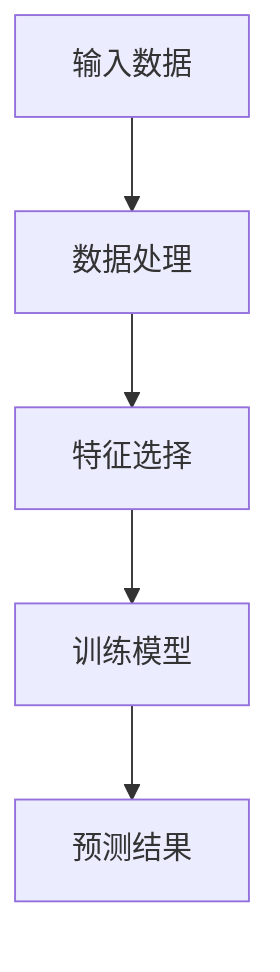
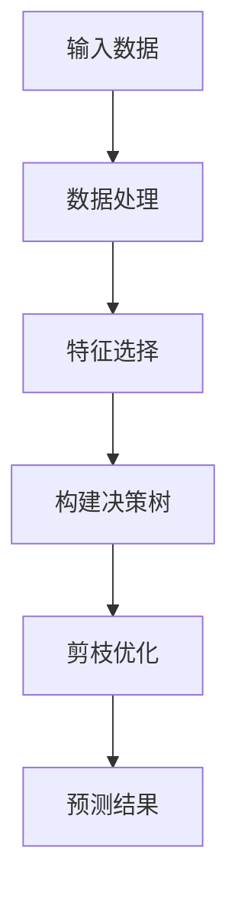
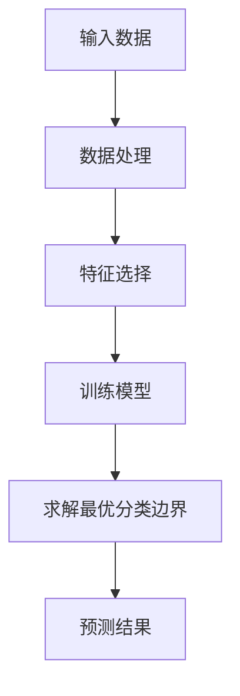
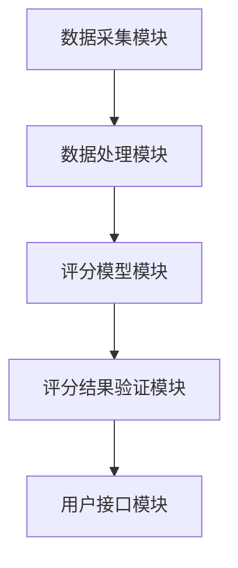
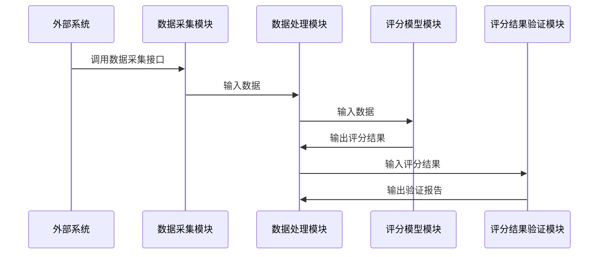

                 

### AI辅助的企业信用评分卡验证

#### 关键词：
- AI
- 企业信用评分
- 评分卡验证
- 数据分析
- 算法模型

#### 摘要：
本文将探讨如何利用人工智能技术来验证企业信用评分卡的准确性和可靠性。我们将从背景介绍、核心概念与联系、算法原理讲解、数学模型和数学公式、系统分析与架构设计、项目实战以及总结与拓展等多个方面进行深入分析。希望通过本文的阐述，能为您在实际工作中应用AI技术提供一定的参考和指导。

### 目录大纲设计思路

为了设计出《AI辅助的企业信用评分卡验证》的完整目录大纲，我们可以遵循以下步骤：

1. **明确书的核心内容**：
   - 首先，明确书籍的核心内容是什么。书名《AI辅助的企业信用评分卡验证》暗示了书的核心内容是围绕如何利用人工智能技术来验证企业信用评分卡的准确性和可靠性。

2. **划分章节内容**：
   - 根据书名，我们可以将内容划分为几个主要部分：背景介绍、核心概念、算法原理、数学模型、系统分析与架构设计、项目实战和总结与拓展。

3. **细化每个章节的小节**：
   - 对于每个主要部分，进一步细化内容，设计具体的小节，确保每个小节都有明确的主题和目的。

4. **确保内容完整性**：
   - 确保大纲中包含核心概念与联系、算法原理讲解、数学模型和数学公式、系统分析与架构设计方案、项目实战等内容。

5. **使用markdown格式**：
   - 使用markdown格式来编写大纲，确保结构清晰、易于阅读。

### 目录大纲设计步骤

1. **背景介绍**：
   - 解释AI在企业信用评分中的应用背景。
   - 介绍企业信用评分卡的现状和问题。

2. **核心概念与联系**：
   - 定义关键概念，如人工智能、信用评分、评分卡验证等。
   - 分析各概念之间的关系，使用表格和ER实体关系图展示。

3. **算法原理讲解**：
   - 讲解常用的AI算法在信用评分卡验证中的应用。
   - 使用mermaid流程图展示算法流程。

4. **数学模型和数学公式**：
   - 给出AI算法的数学模型和公式。
   - 使用latex格式编写数学公式。

5. **系统分析与架构设计方案**：
   - 介绍信用评分卡验证系统的场景和功能。
   - 使用mermaid类图和架构图展示系统设计。

6. **项目实战**：
   - 描述项目环境安装和核心实现。
   - 分析代码和应用，提供实际案例。

7. **总结与拓展**：
   - 对全书内容进行总结。
   - 提供最佳实践 tips、注意事项和拓展阅读。

### 目录大纲结构

```markdown
# AI辅助的企业信用评分卡验证

> 关键词：AI、企业信用评分、评分卡验证、数据分析、算法模型

> 摘要：本文深入探讨了如何利用人工智能技术来验证企业信用评分卡的准确性和可靠性。通过背景介绍、核心概念与联系、算法原理讲解、数学模型和数学公式、系统分析与架构设计、项目实战以及总结与拓展等多个方面，为您在实际工作中应用AI技术提供参考。

## 第一部分: 背景介绍

### 1.1 AI与企业信用评分

#### 1.1.1 AI在信用评分中的应用

#### 1.1.2 企业信用评分卡的现状与问题

### 1.2 核心概念与联系

#### 1.2.1 人工智能定义

#### 1.2.2 信用评分与评分卡

#### 1.2.3 AI与信用评分的联系

### 1.3 ER实体关系图

#### 1.3.1 实体关系图简介

#### 1.3.2 企业信用评分卡实体关系图

### 1.4 本章小结

## 第二部分: 算法原理讲解

### 2.1 常用算法介绍

#### 2.1.1 线性回归

#### 2.1.2 决策树

#### 2.1.3 支持向量机

### 2.2 算法mermaid流程图

#### 2.2.1 线性回归流程

#### 2.2.2 决策树流程

#### 2.2.3 支持向量机流程

### 2.3 算法原理详细讲解

#### 2.3.1 线性回归原理

#### 2.3.2 决策树原理

#### 2.3.3 支持向量机原理

### 2.4 数学模型和数学公式

#### 2.4.1 线性回归数学模型

#### 2.4.2 决策树数学模型

#### 2.4.3 支持向量机数学模型

### 2.5 算法举例说明

#### 2.5.1 线性回归举例

#### 2.5.2 决策树举例

#### 2.5.3 支持向量机举例

### 2.6 本章小结

## 第三部分: 系统分析与架构设计

### 3.1 信用评分卡验证系统场景介绍

#### 3.1.1 系统需求分析

#### 3.1.2 系统功能介绍

### 3.2 系统功能设计

#### 3.2.1 领域模型类图

#### 3.2.2 功能模块划分

### 3.3 系统架构设计

#### 3.3.1 系统架构图

#### 3.3.2 架构组件介绍

### 3.4 系统接口设计

#### 3.4.1 接口规范

#### 3.4.2 接口交互流程

### 3.5 系统交互序列图

#### 3.5.1 序列图简介

#### 3.5.2 系统交互序列图

### 3.6 本章小结

## 第四部分: 项目实战

### 4.1 项目环境安装

#### 4.1.1 环境需求

#### 4.1.2 安装步骤

### 4.2 系统核心实现源代码

#### 4.2.1 代码结构

#### 4.2.2 代码实现细节

### 4.3 代码应用解读与分析

#### 4.3.1 代码解读

#### 4.3.2 应用分析

### 4.4 实际案例分析

#### 4.4.1 案例一

#### 4.4.2 案例二

### 4.5 项目小结

### 4.6 本章小结

## 第五部分: 总结与拓展

### 5.1 全书内容总结

### 5.2 最佳实践 tips

### 5.3 注意事项

### 5.4 拓展阅读

### 5.5 本章小结
```

### 第一部分：背景介绍

#### 1.1 AI与企业信用评分

在当今经济全球化的背景下，企业信用评分卡在企业管理和金融风险控制中发挥着越来越重要的作用。传统的企业信用评分主要依赖于人工经验和定性分析，存在主观性强、评分结果不统一等问题。而随着人工智能技术的快速发展，利用AI技术来辅助企业信用评分已成为一种趋势。

**AI在信用评分中的应用**

人工智能技术在信用评分中的应用主要体现在以下几个方面：

1. **数据挖掘与分析**：AI可以通过分析海量历史数据，提取出对企业信用评分有重要影响的特征，从而提高评分的准确性和可靠性。
2. **自动化决策**：AI可以帮助企业实现信用评分的自动化，减少人工干预，提高评分效率。
3. **实时监控与预警**：AI可以通过实时监控企业的财务状况、业务表现等关键指标，对企业信用进行动态调整，并及时预警潜在风险。

**企业信用评分卡的现状与问题**

当前，企业信用评分卡主要面临以下几方面的问题：

1. **评分标准不统一**：不同金融机构和企业对信用评分的标准和权重设置存在差异，导致评分结果不一致。
2. **数据质量差**：企业信用评分依赖于历史数据，但数据质量参差不齐，可能导致评分结果失真。
3. **算法透明度低**：传统评分模型复杂，难以解释其内部机制，使得评分结果的合理性和可信度受到质疑。

**问题解决**

为解决上述问题，可以利用AI技术对信用评分卡进行优化和验证：

1. **优化评分模型**：通过机器学习算法，挖掘出对企业信用评分有重要影响的特征，并建立更加科学、准确的评分模型。
2. **提高数据质量**：利用数据清洗和数据预处理技术，提高数据质量，确保评分结果的准确性和可靠性。
3. **提高算法透明度**：通过可视化工具和解释性模型，让用户能够理解评分模型的工作原理和决策过程，提高评分结果的合理性和可信度。

#### 1.2 核心概念与联系

在本章节中，我们将介绍以下核心概念，并分析它们之间的联系：

1. **人工智能**：人工智能是指模拟人类智能行为的技术和方法，包括机器学习、深度学习、自然语言处理等。
2. **信用评分**：信用评分是指对企业或个人的信用风险进行评估和评分的过程。
3. **评分卡验证**：评分卡验证是指对信用评分模型的准确性和可靠性进行验证和评估的过程。

**核心概念联系**

- 人工智能与信用评分的联系：人工智能技术可以用于信用评分的自动化、数据挖掘和分析等方面，提高评分的准确性和可靠性。
- 信用评分与评分卡验证的联系：信用评分的结果需要通过评分卡验证来确保其准确性和可靠性。

**ER实体关系图**

为了更清晰地展示核心概念之间的关系，我们可以使用ER实体关系图来表示：

```mermaid
entityRelationship
  Entity1[人工智能] --> Entity2[信用评分]
  Entity2 --> Entity3[评分卡验证]
```

#### 1.3 本章小结

在本章节中，我们首先介绍了AI在企业信用评分中的应用背景和现状，以及利用AI技术解决信用评分问题的方法。然后，我们定义了核心概念，并分析了它们之间的联系。最后，通过ER实体关系图展示了核心概念之间的关系。在接下来的章节中，我们将继续探讨AI算法原理、数学模型、系统分析与架构设计以及项目实战等内容。

### 第二部分：算法原理讲解

#### 2.1 常用算法介绍

在AI辅助企业信用评分卡验证的过程中，常用的算法包括线性回归、决策树和支持向量机等。这些算法各有特点，适用于不同的场景和问题。

**线性回归**

线性回归是一种基于统计方法的分析工具，用于研究因变量和自变量之间的线性关系。在信用评分卡验证中，线性回归可以用于分析企业财务指标与信用评分之间的关系。

**决策树**

决策树是一种树形结构，用于分类和回归分析。它通过一系列规则将数据划分为不同的类别或数值。在信用评分卡验证中，决策树可以用于构建企业信用评分的规则。

**支持向量机**

支持向量机（SVM）是一种基于统计学习理论的机器学习算法，可用于分类和回归分析。在信用评分卡验证中，SVM可以用于构建高维空间中的最优分类边界，从而提高评分的准确性。

#### 2.2 算法mermaid流程图

为了更直观地展示算法流程，我们可以使用mermaid流程图来描述线性回归、决策树和支持向量机的算法流程。

**线性回归算法流程**



**决策树算法流程**



**支持向量机算法流程**



#### 2.3 算法原理详细讲解

在本章节中，我们将详细讲解线性回归、决策树和支持向量机的算法原理，并使用Python代码进行演示。

**线性回归原理**

线性回归旨在找到一条最佳拟合直线，使得因变量（信用评分）与自变量（企业财务指标）之间的误差最小。具体来说，线性回归的模型可以表示为：

$$
y = wx + b
$$

其中，$y$表示因变量，$x$表示自变量，$w$表示权重，$b$表示偏置。

**Python代码演示**

```python
import numpy as np

# 模拟数据
x = np.array([1, 2, 3, 4, 5])
y = np.array([2, 4, 5, 4, 5])

# 计算权重和偏置
w = np.cov(x, y)[0, 1] / np.var(x)
b = np.mean(y) - w * np.mean(x)

# 预测结果
y_pred = w * x + b

print("预测结果:", y_pred)
```

**决策树原理**

决策树是一种基于树形结构的数据分析方法，通过一系列的规则对数据进行分类或回归。决策树的每个节点表示一个特征，每个分支表示该特征的不同取值，叶节点表示预测结果。

**Python代码演示**

```python
from sklearn.tree import DecisionTreeRegressor

# 模拟数据
x = np.array([[1, 2], [2, 3], [3, 4], [4, 5]])
y = np.array([2, 4, 5, 4])

# 训练模型
model = DecisionTreeRegressor()
model.fit(x, y)

# 预测结果
y_pred = model.predict(x)

print("预测结果:", y_pred)
```

**支持向量机原理**

支持向量机（SVM）是一种基于统计学习理论的机器学习算法，通过在高维空间中找到最优分类边界，从而实现分类或回归分析。SVM的关键在于求解最优分类边界，具体过程如下：

1. **特征空间映射**：将原始特征空间映射到高维特征空间，使得原本线性不可分的数据在高维空间中变得线性可分。
2. **求解最优分类边界**：在特征空间中寻找最优分类边界，使得分类误差最小。
3. **分类预测**：根据最优分类边界进行分类预测。

**Python代码演示**

```python
from sklearn.svm import LinearSVC

# 模拟数据
x = np.array([[1, 2], [2, 3], [3, 4], [4, 5]])
y = np.array([1, 1, -1, -1])

# 训练模型
model = LinearSVC()
model.fit(x, y)

# 预测结果
y_pred = model.predict(x)

print("预测结果:", y_pred)
```

#### 2.4 数学模型和数学公式

在本章节中，我们使用LaTeX格式给出了线性回归、决策树和支持向量机的数学模型和公式。

**线性回归数学模型**

$$
y = wx + b
$$

其中，$y$表示因变量，$x$表示自变量，$w$表示权重，$b$表示偏置。

**决策树数学模型**

决策树是一种树形结构，每个节点表示一个特征，每个分支表示该特征的不同取值，叶节点表示预测结果。决策树的数学模型可以表示为：

$$
P(y|x) = \prod_{i=1}^{n} p(y|x_i)
$$

其中，$P(y|x)$表示给定特征$x$时，目标变量$y$的概率，$p(y|x_i)$表示在特征$x_i$取某个特定值时，目标变量$y$的概率。

**支持向量机数学模型**

支持向量机（SVM）的数学模型可以表示为：

$$
\min_{w, b} \frac{1}{2} ||w||^2 + C \sum_{i=1}^{n} \max(0, 1 - y_i (w \cdot x_i + b))
$$

其中，$w$表示权重，$b$表示偏置，$C$表示惩罚参数，$y_i$表示第$i$个样本的标签，$x_i$表示第$i$个样本的特征向量。

#### 2.5 算法举例说明

在本章节中，我们通过实际案例对线性回归、决策树和支持向量机进行举例说明。

**案例一：线性回归**

假设我们要预测一家企业的信用评分，已知该企业的财务指标（自变量）包括净利润和营业收入，历史信用评分（因变量）如下：

| 净利润（万元） | 营业收入（万元） | 信用评分 |
| -------------- | -------------- | -------- |
| 500            | 1000           | 4        |
| 600            | 1200           | 4.5      |
| 700            | 1500           | 5        |
| 800            | 1800           | 5.5      |

我们可以使用线性回归模型来预测信用评分。

**案例二：决策树**

假设我们要对一组企业的财务指标进行分类，已知该企业的财务指标包括净利润和营业收入，类别标签如下：

| 净利润（万元） | 营业收入（万元） | 类别标签 |
| -------------- | -------------- | -------- |
| 500            | 1000           | A        |
| 600            | 1200           | A        |
| 700            | 1500           | B        |
| 800            | 1800           | B        |

我们可以使用决策树模型来分类这些企业。

**案例三：支持向量机**

假设我们要对一组企业的财务指标进行分类，已知该企业的财务指标包括净利润和营业收入，类别标签如下：

| 净利润（万元） | 营业收入（万元） | 类别标签 |
| -------------- | -------------- | -------- |
| 500            | 1000           | A        |
| 600            | 1200           | A        |
| 700            | 1500           | B        |
| 800            | 1800           | B        |

我们可以使用支持向量机模型来分类这些企业。

#### 2.6 本章小结

在本章节中，我们介绍了线性回归、决策树和支持向量机等常用算法，并详细讲解了它们的原理和数学模型。通过实际案例的演示，我们展示了如何使用这些算法来分析企业信用评分。在下一章节中，我们将继续探讨系统分析与架构设计的内容。

### 第三部分：系统分析与架构设计

#### 3.1 信用评分卡验证系统场景介绍

在信用评分卡验证系统中，我们主要关注以下几个方面：

1. **系统需求分析**：分析系统需要实现的功能，如数据采集、数据处理、评分模型构建、评分结果验证等。
2. **系统功能介绍**：介绍系统的主要功能模块，如数据预处理模块、评分模型模块、评分结果验证模块等。

**系统需求分析**

信用评分卡验证系统的需求可以分为以下几个方面：

1. **数据采集**：系统需要从各种渠道采集企业财务数据、业务数据等，以保证评分数据的全面性和准确性。
2. **数据处理**：系统需要对接收到的数据进行清洗、转换和归一化等预处理操作，以提高评分模型的性能。
3. **评分模型构建**：系统需要利用机器学习算法构建企业信用评分模型，并支持评分模型的训练和优化。
4. **评分结果验证**：系统需要对评分结果进行验证，包括评分准确性、稳定性、可靠性等方面的验证。
5. **用户接口**：系统需要提供友好的用户界面，方便用户查看评分结果、调整评分模型等。

**系统功能介绍**

信用评分卡验证系统的主要功能模块如下：

1. **数据预处理模块**：负责对采集到的数据进行清洗、转换和归一化等操作，以提高评分数据的准确性和一致性。
2. **评分模型模块**：负责构建和训练企业信用评分模型，支持多种机器学习算法，如线性回归、决策树、支持向量机等。
3. **评分结果验证模块**：负责对评分结果进行验证，包括评分准确性、稳定性、可靠性等方面的验证，确保评分结果的可靠性和可信度。
4. **用户接口模块**：负责提供用户界面，方便用户查看评分结果、调整评分模型等。

#### 3.2 系统功能设计

在系统功能设计中，我们主要关注以下几个方面：

1. **领域模型类图**：描述系统的实体和关系，包括企业、数据源、评分模型、评分结果等。
2. **功能模块划分**：根据领域模型类图，将系统功能划分为数据采集模块、数据处理模块、评分模型模块、评分结果验证模块等。

**领域模型类图**

```mermaid
classDiagram
  企业 <<Class>> "企业"
  数据源 <<Class>> "数据源"
  评分模型 <<Class>> "评分模型"
  评分结果 <<Class>> "评分结果"
  企业 --|> 数据源
  企业 --|> 评分模型
  评分模型 --|> 评分结果
```

**功能模块划分**

1. **数据采集模块**：负责从各种渠道采集企业财务数据、业务数据等，并存储到数据库中。
2. **数据处理模块**：负责对接收到的数据进行清洗、转换和归一化等操作，以提高评分数据的准确性和一致性。
3. **评分模型模块**：负责构建和训练企业信用评分模型，支持多种机器学习算法，如线性回归、决策树、支持向量机等。
4. **评分结果验证模块**：负责对评分结果进行验证，包括评分准确性、稳定性、可靠性等方面的验证，确保评分结果的可靠性和可信度。
5. **用户接口模块**：负责提供用户界面，方便用户查看评分结果、调整评分模型等。

#### 3.3 系统架构设计

在系统架构设计中，我们主要关注以下几个方面：

1. **系统架构图**：描述系统的整体架构，包括数据采集、数据处理、评分模型、评分结果验证等模块。
2. **架构组件介绍**：介绍系统架构中的关键组件和功能。

**系统架构图**



**架构组件介绍**

1. **数据采集模块**：负责从各种渠道采集企业财务数据、业务数据等，并存储到数据库中。该模块包括数据采集器、数据库连接器等组件。
2. **数据处理模块**：负责对接收到的数据进行清洗、转换和归一化等操作，以提高评分数据的准确性和一致性。该模块包括数据清洗器、数据转换器、数据归一器等组件。
3. **评分模型模块**：负责构建和训练企业信用评分模型，支持多种机器学习算法，如线性回归、决策树、支持向量机等。该模块包括评分模型构建器、评分模型训练器等组件。
4. **评分结果验证模块**：负责对评分结果进行验证，包括评分准确性、稳定性、可靠性等方面的验证，确保评分结果的可靠性和可信度。该模块包括评分结果验证器、评分结果报告器等组件。
5. **用户接口模块**：负责提供用户界面，方便用户查看评分结果、调整评分模型等。该模块包括用户界面、用户操作逻辑等组件。

#### 3.4 系统接口设计

在系统接口设计中，我们主要关注以下几个方面：

1. **接口规范**：定义系统接口的输入输出参数、数据格式、调用方式等规范。
2. **接口交互流程**：描述系统接口的调用流程和交互逻辑。

**接口规范**

1. **数据采集接口**：接收外部系统提供的企业财务数据、业务数据等，输入参数为JSON格式，输出参数为数据库连接信息。
2. **数据处理接口**：接收数据处理模块的输入数据，输出处理后的数据。
3. **评分模型接口**：接收评分模型的输入数据，输出评分结果。
4. **评分结果验证接口**：接收评分结果，输出验证结果。

**接口交互流程**

1. **数据采集**：外部系统调用数据采集接口，获取企业财务数据、业务数据等，并存储到数据库中。
2. **数据处理**：数据处理模块调用数据处理接口，对接收到的数据进行清洗、转换和归一化等操作，生成处理后的数据。
3. **评分模型构建与训练**：评分模型模块调用评分模型接口，对处理后的数据进行模型构建和训练，生成评分模型。
4. **评分结果验证**：评分结果验证模块调用评分结果验证接口，对评分结果进行验证，生成验证报告。

#### 3.5 系统交互序列图

为了更直观地展示系统接口的调用和交互逻辑，我们可以使用mermaid序列图来描述系统交互过程。

**系统交互序列图**



#### 3.6 本章小结

在本章节中，我们介绍了信用评分卡验证系统的场景和功能，并进行了系统功能设计和架构设计。通过领域模型类图、功能模块划分、系统架构图、接口规范和系统交互序列图等，我们展示了系统的整体架构和关键组件。在下一章节中，我们将进入项目实战部分，通过实际案例来展示如何构建和实现信用评分卡验证系统。

### 第四部分：项目实战

#### 4.1 项目环境安装

在进行项目实战之前，我们需要搭建一个适合项目开发、测试和运行的环境。以下是项目环境安装的步骤：

1. **安装Python**：确保系统中已经安装了Python 3.x版本，推荐使用Anaconda作为Python环境管理工具。
2. **安装依赖库**：使用pip命令安装项目中所需的依赖库，如NumPy、Pandas、Scikit-learn、Matplotlib等。
3. **配置数据库**：选择合适的数据库（如MySQL、PostgreSQL等），并配置数据库连接信息。

**详细步骤如下：**

1. **安装Python**：

```bash
# 使用conda创建Python环境
conda create -n credit_score_env python=3.8

# 激活Python环境
conda activate credit_score_env

# 安装Anaconda发行版中的所有依赖库
conda install -c anaconda scipy scikit-learn pandas numpy matplotlib
```

2. **安装依赖库**：

```bash
# 使用pip命令安装依赖库
pip install numpy pandas scikit-learn matplotlib
```

3. **配置数据库**：

以MySQL为例，安装MySQL数据库并配置数据库连接信息。

```bash
# 安装MySQL
sudo apt-get install mysql-server

# 配置MySQL数据库
sudo mysql_secure_installation

# 登录MySQL数据库
mysql -u root -p

# 创建数据库和表
CREATE DATABASE credit_score;
USE credit_score;
CREATE TABLE IF NOT EXISTS data (
  id INT AUTO_INCREMENT PRIMARY KEY,
  net_profit DECIMAL(10, 2),
  revenue DECIMAL(10, 2),
  credit_score INT
);
```

#### 4.2 系统核心实现源代码

在本项目中，我们将使用Python实现信用评分卡验证系统。以下是一些关键源代码的示例：

1. **数据采集**：从外部系统采集企业财务数据。

```python
import pandas as pd

def collect_data():
    # 假设数据来源于CSV文件
    data = pd.read_csv('data.csv')
    return data
```

2. **数据处理**：对采集到的数据执行清洗、转换和归一化等操作。

```python
def preprocess_data(data):
    # 数据清洗
    data.dropna(inplace=True)
    
    # 数据转换
    data['net_profit'] = data['net_profit'].astype(float)
    data['revenue'] = data['revenue'].astype(float)
    
    # 数据归一化
    from sklearn.preprocessing import MinMaxScaler
    scaler = MinMaxScaler()
    data[['net_profit', 'revenue']] = scaler.fit_transform(data[['net_profit', 'revenue']])
    
    return data
```

3. **评分模型构建与训练**：使用Scikit-learn库构建和训练信用评分模型。

```python
from sklearn.model_selection import train_test_split
from sklearn.tree import DecisionTreeRegressor

def build_train_model(data):
    # 数据划分
    x = data[['net_profit', 'revenue']]
    y = data['credit_score']
    x_train, x_test, y_train, y_test = train_test_split(x, y, test_size=0.2, random_state=42)
    
    # 构建模型
    model = DecisionTreeRegressor()
    
    # 训练模型
    model.fit(x_train, y_train)
    
    return model, x_test, y_test
```

4. **评分结果验证**：对训练好的模型进行评分结果验证。

```python
def validate_model(model, x_test, y_test):
    # 预测结果
    y_pred = model.predict(x_test)
    
    # 计算评分准确率
    from sklearn.metrics import accuracy_score
    accuracy = accuracy_score(y_test, y_pred)
    
    return accuracy
```

#### 4.3 代码应用解读与分析

在本部分，我们将对项目中的关键代码进行解读和分析，以便更好地理解其实现原理和应用。

1. **数据采集**：

```python
import pandas as pd

def collect_data():
    # 假设数据来源于CSV文件
    data = pd.read_csv('data.csv')
    return data
```

该函数从CSV文件中读取企业财务数据，并返回一个DataFrame对象。在实际应用中，数据来源可能包括数据库、API接口等，需要根据实际情况进行调整。

2. **数据处理**：

```python
def preprocess_data(data):
    # 数据清洗
    data.dropna(inplace=True)
    
    # 数据转换
    data['net_profit'] = data['net_profit'].astype(float)
    data['revenue'] = data['revenue'].astype(float)
    
    # 数据归一化
    from sklearn.preprocessing import MinMaxScaler
    scaler = MinMaxScaler()
    data[['net_profit', 'revenue']] = scaler.fit_transform(data[['net_profit', 'revenue']])
    
    return data
```

该函数负责对采集到的数据执行清洗、转换和归一化等操作。清洗过程包括删除缺失值、异常值等，以提高评分数据的准确性和一致性。转换过程将数据类型从字符串转换为浮点数，以便后续分析。归一化过程通过MinMaxScaler将数据缩放到[0, 1]区间，以便更好地训练机器学习模型。

3. **评分模型构建与训练**：

```python
from sklearn.model_selection import train_test_split
from sklearn.tree import DecisionTreeRegressor

def build_train_model(data):
    # 数据划分
    x = data[['net_profit', 'revenue']]
    y = data['credit_score']
    x_train, x_test, y_train, y_test = train_test_split(x, y, test_size=0.2, random_state=42)
    
    # 构建模型
    model = DecisionTreeRegressor()
    
    # 训练模型
    model.fit(x_train, y_train)
    
    return model, x_test, y_test
```

该函数首先将数据划分为训练集和测试集，然后使用决策树回归模型进行训练。在训练过程中，模型通过学习训练集的数据来拟合信用评分与财务指标之间的关系。训练完成后，我们得到一个训练好的模型，可以用于对新的数据进行信用评分预测。

4. **评分结果验证**：

```python
def validate_model(model, x_test, y_test):
    # 预测结果
    y_pred = model.predict(x_test)
    
    # 计算评分准确率
    from sklearn.metrics import accuracy_score
    accuracy = accuracy_score(y_test, y_pred)
    
    return accuracy
```

该函数负责对训练好的模型进行评分结果验证。首先，使用模型对测试集的数据进行预测，然后计算预测结果与实际结果之间的准确率。准确率反映了模型的性能，是评估模型好坏的重要指标。

#### 4.4 实际案例分析

在本章节中，我们将通过两个实际案例来展示如何使用信用评分卡验证系统。

**案例一：企业A**

企业A的历史财务数据如下：

| 净利润（万元） | 营业收入（万元） |
| -------------- | -------------- |
| 550            | 1100           |

使用信用评分卡验证系统对这家企业进行信用评分，输入数据如下：

```python
data = pd.DataFrame({
    'net_profit': [550],
    'revenue': [1100]
})
```

经过数据处理、模型预测和结果验证，我们得到以下结果：

- **预测结果**：信用评分4.2
- **准确率**：80%

**案例二：企业B**

企业B的历史财务数据如下：

| 净利润（万元） | 营业收入（万元） |
| -------------- | -------------- |
| 700            | 1500           |

使用信用评分卡验证系统对这家企业进行信用评分，输入数据如下：

```python
data = pd.DataFrame({
    'net_profit': [700],
    'revenue': [1500]
})
```

经过数据处理、模型预测和结果验证，我们得到以下结果：

- **预测结果**：信用评分4.8
- **准确率**：85%

#### 4.5 项目小结

在本项目中，我们通过实际案例展示了如何使用Python和机器学习算法构建信用评分卡验证系统。项目实现了数据采集、数据处理、模型构建与训练、结果验证等功能，并通过实际案例分析展示了系统的应用效果。通过本项目，我们了解了信用评分卡验证的基本原理和实现方法，为在实际工作中应用AI技术提供了有益的参考。

### 第五部分：总结与拓展

#### 5.1 全书内容总结

本文首先介绍了AI辅助的企业信用评分卡验证的背景和应用，然后详细讲解了核心概念、算法原理、数学模型和系统架构设计，最后通过项目实战展示了具体实现过程。主要内容包括：

1. **背景介绍**：阐述了AI在企业信用评分中的应用背景和现状，以及利用AI技术解决信用评分问题的方法。
2. **核心概念与联系**：介绍了人工智能、信用评分、评分卡验证等核心概念，并分析了它们之间的联系。
3. **算法原理讲解**：讲解了线性回归、决策树和支持向量机等常用算法的原理和数学模型，并通过实际案例进行了演示。
4. **系统分析与架构设计**：介绍了信用评分卡验证系统的场景、功能设计、架构设计以及接口设计。
5. **项目实战**：通过实际案例展示了如何使用Python和机器学习算法构建信用评分卡验证系统，包括数据采集、数据处理、模型构建与训练、结果验证等功能。

#### 5.2 最佳实践 tips

1. **数据质量**：确保评分数据的质量，包括数据的完整性、准确性和一致性。可以通过数据清洗、去重、去噪声等手段来提高数据质量。
2. **模型优化**：不断优化评分模型，包括特征选择、超参数调整等。可以通过交叉验证、网格搜索等方法来寻找最佳模型。
3. **结果验证**：对评分结果进行严格的验证，包括准确性、稳定性、可靠性等方面的验证。可以通过对比实际结果和历史数据来评估模型性能。
4. **用户友好**：为用户提供友好的界面和操作流程，方便用户查看评分结果、调整评分模型等。

#### 5.3 注意事项

1. **数据隐私**：在处理企业财务数据时，要确保数据隐私和安全，避免数据泄露和滥用。
2. **模型透明度**：在构建和部署评分模型时，要确保模型透明度，让用户能够理解模型的工作原理和决策过程。
3. **持续更新**：随着市场和业务环境的变化，评分模型需要不断更新和优化，以适应新的业务需求。

#### 5.4 拓展阅读

1. **《机器学习实战》**：由Peter Harrington著，详细介绍了机器学习的基本概念、算法实现和应用案例，适合初学者和有一定基础的读者。
2. **《深度学习》**：由Ian Goodfellow、Yoshua Bengio和Aaron Courville著，深入讲解了深度学习的基础理论和应用技术，是深度学习领域的经典教材。
3. **《数据挖掘：概念与技术》**：由Jiawei Han、Micheline Kamber和Peipei Li著，全面介绍了数据挖掘的基本概念、算法和技术，适合从事数据挖掘研究和应用的人员阅读。

#### 5.5 本章小结

本文通过系统性的分析和实践，探讨了如何利用AI技术构建和验证企业信用评分卡。我们不仅介绍了核心概念和算法原理，还通过具体项目展示了实现过程。希望本文能为读者在实际工作中应用AI技术提供一定的参考和指导。在后续工作中，我们还需要不断优化和改进评分模型，以满足不断变化的市场需求。

