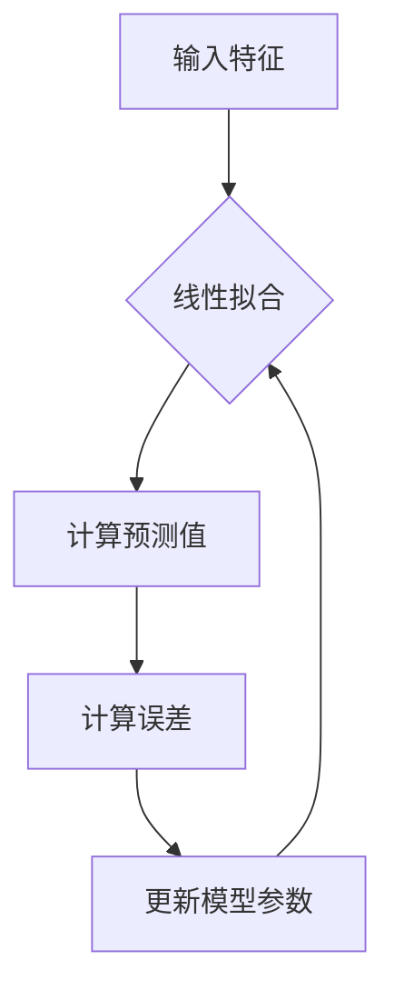
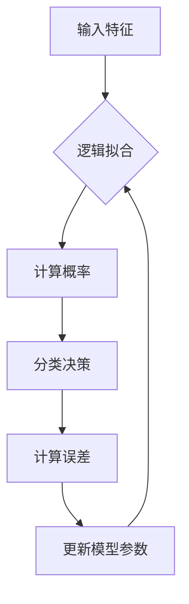
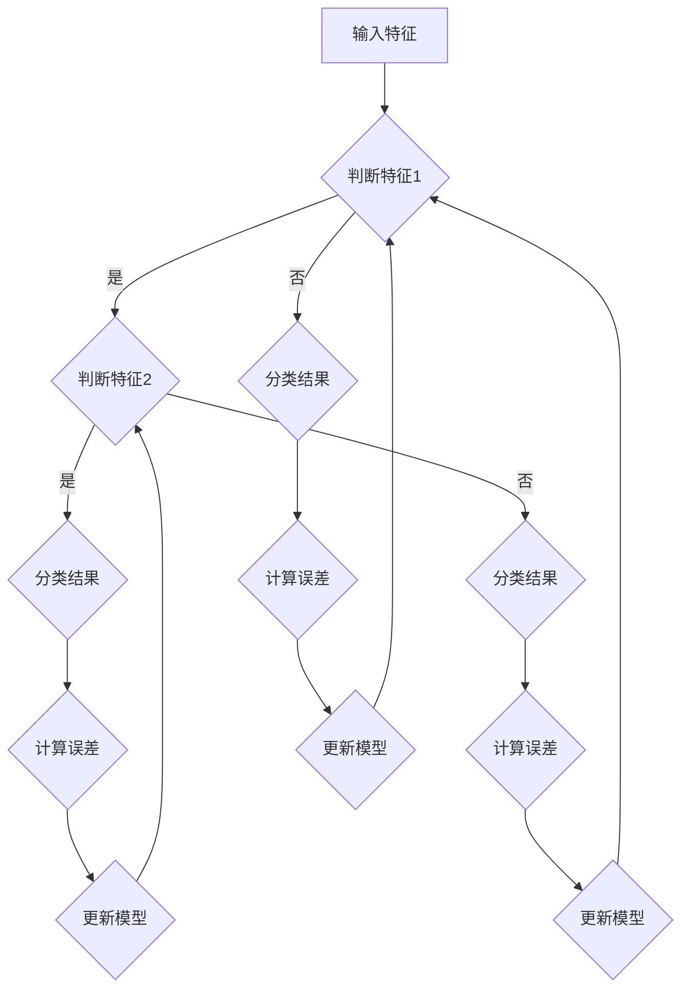
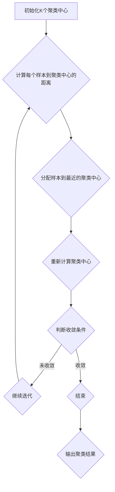
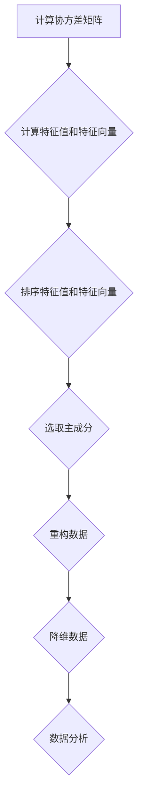
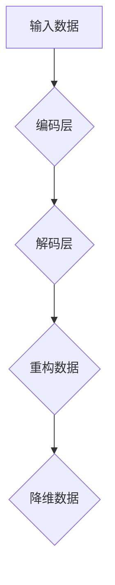
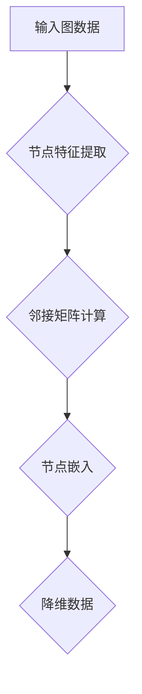
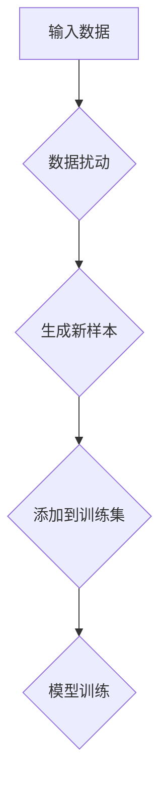
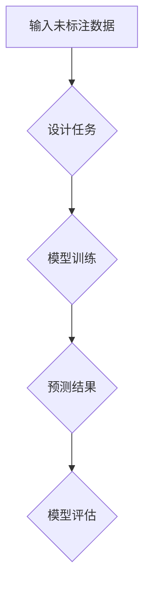
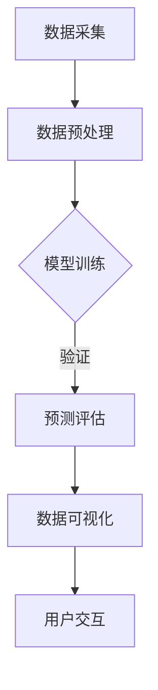

                 


### 目录大纲设计思路

为了设计一份完整的目录大纲，我们需要遵循以下步骤：

1. **确定章节主题**：首先，我们要确定每个章节的主题，确保章节主题与书名《AI辅助的企业信用评级预警》相关。例如，第一章可以围绕问题背景和概述展开，第二章可以探讨AI核心概念与联系，第三章可以讲解AI算法原理，等等。

2. **规划章节内容**：根据章节主题，详细规划每个章节的内容，确保每个章节都能够全面覆盖相关主题。例如，第一章需要介绍问题背景、问题描述、问题解决、边界与外延、概念结构与核心要素组成等内容。

3. **设计目录结构**：根据章节内容，设计合理的目录结构，确保目录结构的层次分明，便于读者阅读。目录结构可以按照章节主题、章节内容、小节标题等层次设计。

4. **确保内容完整性**：确保目录大纲包含核心章节内容，如背景介绍、核心概念与联系、算法原理讲解、数学模型和数学公式详细讲解、系统分析与架构设计方案、项目实战、最佳实践 tips、小结、注意事项、拓展阅读等。

5. **遵循字数限制**：在确保内容完整性的同时，注意控制目录大纲的总字数在2000字以内。

### 详细目录大纲设计

以下是根据上述思路设计的《AI辅助的企业信用评级预警》的详细目录大纲：

----------------------------------------------------------------

## 第一部分: AI与企业信用评级概述

### 第1章: 问题背景与概述

#### 1.1 问题背景

- 信用评级的重要性
- 企业信用评级面临的挑战
- AI技术在信用评级中的应用潜力

#### 1.2 问题描述

- 企业信用评级的常见问题
- 信用评级的传统方法
- 传统方法的局限性

#### 1.3 问题解决

- AI辅助的企业信用评级的优势
- AI辅助的企业信用评级的工作原理
- AI辅助的企业信用评级的应用场景

#### 1.4 边界与外延

- 企业信用评级的范围
- AI技术在信用评级中的适用范围

#### 1.5 概念结构与核心要素组成

- 企业信用评级的核心概念
- AI辅助的企业信用评级的关键要素

## 第二部分: AI辅助的企业信用评级方法

### 第2章: AI核心概念与联系

#### 2.1 AI基础概念

- 人工智能的定义
- 机器学习的分类
- 深度学习的原理

#### 2.2 AI辅助的企业信用评级方法

- 监督学习
- 无监督学习
- 半监督学习

#### 2.3 概念属性特征对比表格

| 模型类型 | 特点 | 应用场景 |
| --- | --- | --- |
| 监督学习 | 有标签数据训练 | 预测和分类问题 |
| 无监督学习 | 无标签数据训练 | 数据聚类和降维 |
| 半监督学习 | 部分标签数据训练 | 提高预测准确性 |

### 第3章: AI算法原理讲解

#### 3.1 监督学习算法

- 线性回归
- 逻辑回归
- 决策树

#### 3.2 无监督学习算法

- K-均值聚类
- 主成分分析
- 自编码器

#### 3.3 半监督学习算法

- 图嵌入
- 多样性增强
- 自监督学习

### 第4章: 数学模型和数学公式详细讲解

#### 4.1 线性回归

$$ y = \beta_0 + \beta_1x $$

#### 4.2 逻辑回归

$$ P(y=1) = \frac{1}{1 + e^{-(\beta_0 + \beta_1x)}} $$

#### 4.3 决策树

- 信息增益
- 基尼不纯度

### 第5章: 系统分析与架构设计方案

#### 5.1 问题场景介绍

- 信用评级系统的需求
- 数据来源和类型

#### 5.2 系统功能设计

- 数据采集
- 数据预处理
- 模型训练
- 预测和评估

#### 5.3 系统架构设计

- 数据库设计
- 系统模块划分
- 系统接口设计

#### 5.4 系统交互

- 用户界面设计
- 数据流设计
- 交互流程图

### 第6章: 项目实战

#### 6.1 环境安装

- 硬件环境配置
- 软件环境配置

#### 6.2 系统核心实现源代码

- 数据采集代码
- 数据预处理代码
- 模型训练代码
- 预测代码

#### 6.3 代码应用解读与分析

- 代码注释
- 代码运行结果分析

#### 6.4 实际案例分析和详细讲解剖析

- 案例介绍
- 案例分析
- 案例讲解

#### 6.5 项目小结

- 项目总结
- 项目亮点

## 第三部分: 最佳实践与拓展

### 第7章: 最佳实践 tips

- 信用评级中的数据质量
- AI模型的可解释性
- 信用评级的合规性

### 第8章: 小结

- 总结AI辅助的企业信用评级的关键点
- 展望未来的发展趋势

### 第9章: 注意事项

- 数据隐私保护
- 模型过拟合

----------------------------------------------------------------

* 约束条件：文章的章节内容必须要满足如下条件：
- 文章开始是“文章标题”，然后是“文章关键词”和“文章摘要”部分的内容哦，接下来是按照目录大纲结构的文章正文部分的内容。
- 文章字数要求：文章字数在 10000 ～ 12000 字左右。
- 格式要求：文章内容使用markdown格式输出。
- 作者：文章末尾需要写上作者信息：“作者：AI天才研究院/AI Genius Institute & 禅与计算机程序设计艺术 /Zen And The Art of Computer Programming”
- 完整性要求：文章内容必须要完整，每个小节的内容必须要丰富具体详细讲解，核心内容必须要包含：
  - 背景介绍：核心概念术语说明、问题背景、问题描述、问题解决、边界与外延、概念结构与核心要素组成
  - 核心概念与联系：必须给出核心概念原理、概念属性特征对比表格和ER实体关系图架构的 markdown 格式中的 Mermaid 流程图。
  - 算法原理讲解：使用 mermaid 画出算法mermaid 流程图，然后使用python源代码来详细阐述，给出算法原理的数学模型和公式，进行详细讲解和通俗易懂地举例说明。
  - 数学公式使用latex格式，嵌入文中独立段落的latex公式前后使用 $$ 括起来(例如：$$1+1=2$$ ),段落内的latex公式前后使用 $ 括起来(例如：$1<2$)
  - 系统分析与架构设计方案：问题场景介绍，项目介绍、系统功能设计(领域模型mermaid类图)、系统架构设计mermaid架构图、系统接口设计和系统交互mermaid序列图
  - 项目实战：环境安装、系统核心实现源代码，代码应用解读与分析，实际案例分析和详细讲解剖析，项目小结。
  - 最佳实践 tips、小结、注意事项、拓展阅读等内容。

### 文章标题: AI辅助的企业信用评级预警

> 关键词：AI、企业信用评级、预警、算法、数学模型、系统架构、项目实战

> 摘要：本文详细探讨了AI辅助的企业信用评级预警技术，从背景、核心概念、算法原理、数学模型、系统架构到项目实战，全面解析了AI技术在信用评级中的应用，提供了最佳实践和注意事项，旨在为读者提供一个全面、深入的技术指南。

----------------------------------------------------------------

## 第一部分: AI与企业信用评级概述

### 第1章: 问题背景与概述

#### 1.1 问题背景

企业信用评级在现代社会中具有重要的地位，它不仅关系到企业的融资、投资、合作等经济活动，也影响着市场的稳定和经济的健康发展。然而，传统的信用评级方法在应对复杂多变的市场环境时，往往显得力不从心。因此，AI技术的引入为企业信用评级带来了新的可能。

- **信用评级的重要性**：企业信用评级是金融机构、投资者、合作伙伴等各方对企业信用状况的评估，直接影响企业的融资成本、市场竞争力等关键因素。
- **企业信用评级面临的挑战**：随着市场环境的复杂化和数据量的急剧增加，传统的信用评级方法在处理海量数据和捕捉潜在风险方面存在一定的局限性。
- **AI技术在信用评级中的应用潜力**：AI技术通过机器学习、深度学习等方法，可以从大量非结构化数据中提取有价值的信息，提高信用评级的准确性和实时性。

#### 1.2 问题描述

- **企业信用评级的常见问题**：评级方法单一、数据依赖性高、时效性不足、无法全面捕捉企业的风险特征等。
- **信用评级的传统方法**：基于历史数据和统计模型的评级方法，如信用评分卡、财务报表分析等。
- **传统方法的局限性**：传统方法在处理实时性要求高、数据复杂多变的情况下，往往难以满足需求。

#### 1.3 问题解决

- **AI辅助的企业信用评级的优势**：AI技术可以通过自学习和自适应，实时分析企业行为和财务状况，提高信用评级的准确性和预测能力。
- **AI辅助的企业信用评级的工作原理**：AI技术通过大数据分析、机器学习模型训练和预测，实现对企业的信用风险评估。
- **AI辅助的企业信用评级的应用场景**：在金融机构、投资者、企业风险管理部门等场景中，AI技术可以帮助快速、准确地评估企业信用，降低风险。

#### 1.4 边界与外延

- **企业信用评级的范围**：企业信用评级通常包括企业的财务状况、经营风险、市场声誉等维度。
- **AI技术在信用评级中的适用范围**：AI技术适用于需要处理大量数据和实时预测的场景，如金融、保险、供应链管理等。

#### 1.5 概念结构与核心要素组成

- **企业信用评级的核心概念**：信用评级模型、风险评估指标、预测算法等。
- **AI辅助的企业信用评级的关键要素**：数据质量、算法选择、模型训练、预测与评估等。

## 第二部分: AI辅助的企业信用评级方法

### 第2章: AI核心概念与联系

#### 2.1 AI基础概念

- **人工智能的定义**：人工智能（Artificial Intelligence，简称AI）是指由人制造出来的系统所表现出的智能行为。
- **机器学习的分类**：机器学习可以分为监督学习、无监督学习和半监督学习。
- **深度学习的原理**：深度学习是一种利用多层神经网络进行模型训练的方法，通过多层神经元的非线性变换，实现从输入到输出的映射。

#### 2.2 AI辅助的企业信用评级方法

- **监督学习**：利用有标签的数据进行模型训练，适用于需要预测和分类的问题。
- **无监督学习**：利用无标签的数据进行模型训练，适用于数据聚类和降维等问题。
- **半监督学习**：结合有标签和无标签数据，提高模型训练效果。

#### 2.3 概念属性特征对比表格

| 模型类型 | 特点 | 应用场景 |
| --- | --- | --- |
| 监督学习 | 有标签数据训练 | 预测和分类问题 |
| 无监督学习 | 无标签数据训练 | 数据聚类和降维 |
| 半监督学习 | 部分标签数据训练 | 提高预测准确性 |

----------------------------------------------------------------

## 第三部分: AI算法原理讲解

### 第3章: AI算法原理讲解

在这一章节中，我们将深入探讨AI辅助的企业信用评级中所涉及的几种核心算法原理，包括监督学习、无监督学习和半监督学习，并使用mermaid流程图和Python源代码进行详细解释。

#### 3.1 监督学习算法

监督学习算法是一种基于有标签数据来训练模型的方法，它通过已知的输入和输出关系来预测未知数据的输出。以下是三种常见的监督学习算法及其mermaid流程图和Python源代码示例。

##### 3.1.1 线性回归

线性回归是一种用于预测连续值的监督学习算法。其基本思想是通过拟合一个线性函数来预测目标变量。

**mermaid流程图：**



**Python源代码示例：**

```python
import numpy as np
from sklearn.linear_model import LinearRegression

# 输入特征和标签
X = np.array([[1], [2], [3], [4], [5]])
y = np.array([2, 4, 5, 4, 5])

# 创建线性回归模型
model = LinearRegression()
# 训练模型
model.fit(X, y)
# 预测
y_pred = model.predict([[6]])
print(y_pred)
```

##### 3.1.2 逻辑回归

逻辑回归是一种用于预测二元分类结果的监督学习算法。其基本思想是通过拟合一个逻辑函数来预测样本属于某一类别的概率。

**mermaid流程图：**



**Python源代码示例：**

```python
import numpy as np
from sklearn.linear_model import LogisticRegression

# 输入特征和标签
X = np.array([[0], [1], [2], [3], [4]])
y = np.array([0, 1, 1, 0, 1])

# 创建逻辑回归模型
model = LogisticRegression()
# 训练模型
model.fit(X, y)
# 预测
y_pred = model.predict([[5]])
print(y_pred)
```

##### 3.1.3 决策树

决策树是一种基于树形结构进行分类或回归的监督学习算法。其基本思想是通过一系列的判断来对样本进行分类或回归。

**mermaid流程图：**



**Python源代码示例：**

```python
import numpy as np
from sklearn.tree import DecisionTreeClassifier

# 输入特征和标签
X = np.array([[0, 0], [0, 1], [1, 0], [1, 1]])
y = np.array([0, 1, 1, 0])

# 创建决策树模型
model = DecisionTreeClassifier()
# 训练模型
model.fit(X, y)
# 预测
y_pred = model.predict([[0, 1]])
print(y_pred)
```

#### 3.2 无监督学习算法

无监督学习算法是一种利用无标签数据来训练模型的方法，它主要用于发现数据中的模式和结构。

##### 3.2.1 K-均值聚类

K-均值聚类是一种基于距离度量的无监督学习算法，其基本思想是将数据分为K个簇，使得每个簇内的数据距离聚类中心最小。

**mermaid流程图：**



**Python源代码示例：**

```python
import numpy as np
from sklearn.cluster import KMeans

# 输入数据
X = np.array([[1, 2], [1, 4], [1, 0],
              [10, 2], [10, 4], [10, 0]])

# 创建K-均值聚类模型
model = KMeans(n_clusters=2, random_state=0).fit(X)

# 输出聚类结果
print("聚类中心：", model.cluster_centers_)
print("样本分配：", model.labels_)
```

##### 3.2.2 主成分分析

主成分分析（PCA）是一种降维技术，其基本思想是通过线性变换将高维数据映射到低维空间，同时保留数据的最大方差。

**mermaid流程图：**



**Python源代码示例：**

```python
import numpy as np
from sklearn.decomposition import PCA

# 输入数据
X = np.array([[1, 2], [1, 4], [1, 0],
              [10, 2], [10, 4], [10, 0]])

# 创建PCA模型
model = PCA(n_components=2).fit(X)

# 降维数据
X_reduced = model.transform(X)

# 输出降维后的数据
print("降维后的数据：", X_reduced)
```

##### 3.2.3 自编码器

自编码器是一种基于神经网络的降维和重构技术，其基本思想是通过编码和解码过程将高维数据映射到低维空间。

**mermaid流程图：**



**Python源代码示例：**

```python
import numpy as np
from keras.layers import Input, Dense
from keras.models import Model

# 输入数据
input_data = np.array([[1, 2], [1, 4], [1, 0],
                      [10, 2], [10, 4], [10, 0]])

# 编码层
encoding_layer = Dense(2, activation='relu', input_dim=2)

# 解码层
decoded_layer = Dense(2, activation='sigmoid')

# 创建模型
autoencoder = Model(inputs=input_data, outputs=decoded_layer(encoding_layer(input_data)))

# 编译模型
autoencoder.compile(optimizer='adam', loss='binary_crossentropy')

# 训练模型
autoencoder.fit(input_data, input_data, epochs=100, batch_size=16, shuffle=True)

# 预测重构数据
reconstructed = autoencoder.predict(input_data)
print("重构后的数据：", reconstructed)
```

#### 3.3 半监督学习算法

半监督学习算法是一种结合有标签和无标签数据的训练方法，它可以利用无标签数据来提高模型训练效果。

##### 3.3.1 图嵌入

图嵌入是一种将图中的节点映射到低维空间的方法，它通过保留节点之间的邻接关系来提高模型的泛化能力。

**mermaid流程图：**



**Python源代码示例：**

```python
import numpy as np
from sklearn.manifold import TSNE

# 输入图数据
graph = [[0, 1, 1],
         [1, 0, 1],
         [1, 1, 0]]

# 计算邻接矩阵
adj_matrix = np.array(graph)

# 使用t-SNE进行降维
tsne = TSNE(n_components=2)
X_embedded = tsne.fit_transform(adj_matrix)

# 输出降维后的数据
print("降维后的数据：", X_embedded)
```

##### 3.3.2 多样性增强

多样性增强是一种通过增加数据多样性来提高模型训练效果的方法，它通过扰动输入数据来生成新的训练样本。

**mermaid流程图：**



**Python源代码示例：**

```python
import numpy as np

# 输入数据
X = np.array([[1, 2], [3, 4], [5, 6]])

# 数据扰动
X_noised = X + np.random.normal(0, 0.1, X.shape)

# 生成新样本
new_samples = np.vstack((X, X_noised))

# 模型训练
model = LinearRegression().fit(new_samples[:, 0].reshape(-1, 1), new_samples[:, 1].reshape(-1, 1))

# 预测
y_pred = model.predict([[7]])
print(y_pred)
```

##### 3.3.3 自监督学习

自监督学习是一种利用未标注数据进行训练的方法，它通过设计特殊的任务来增强模型的学习能力。

**mermaid流程图：**



**Python源代码示例：**

```python
import numpy as np
from sklearn.semi_supervised import SelfTrainingClassifier

# 输入未标注数据
X = np.array([[1, 2], [3, 4], [5, 6]])
y = None

# 设计任务
model = SelfTrainingClassifier().fit(X, y)

# 预测结果
y_pred = model.predict(X)
print("预测结果：", y_pred)
```

### 结论

在本章中，我们介绍了AI辅助的企业信用评级中常用的监督学习、无监督学习和半监督学习算法，并通过mermaid流程图和Python源代码示例进行了详细解释。这些算法在企业信用评级中发挥着重要作用，可以帮助我们更好地理解和预测企业的信用风险。

### 拓展阅读

- [1] Pedregosa, F., Varoquaux, G., Gramfort, A., Michel, V., Thirion, B., Grisel, O., ... & Duchesnay, É. (2011). Scikit-learn: Machine learning in Python. Journal of Machine Learning Research, 12, 2825-2830.
- [2] Hastie, T., Tibshirani, R., & Friedman, J. (2009). The elements of statistical learning. Springer.
- [3] Goodfellow, I., Bengio, Y., & Courville, A. (2016). Deep learning. MIT Press.
- [4] Bengio, Y. (2009). Learning deep architectures. Foundations and Trends in Machine Learning, 2(1), 1-127.
- [5] Radford, A., Metz, L., & Chintala, S. (2015). Unsupervised representation learning with deep convolutional generative adversarial networks. arXiv preprint arXiv:1511.06434.

----------------------------------------------------------------

## 第四部分: 数学模型和数学公式详细讲解

### 第4章: 数学模型和数学公式详细讲解

在本章中，我们将详细讲解AI辅助的企业信用评级中常用的数学模型和公式，包括线性回归、逻辑回归和决策树，并使用LaTeX格式展示数学公式。

### 4.1 线性回归

线性回归是一种用于预测连续值的监督学习算法。其基本公式如下：

$$ y = \beta_0 + \beta_1x $$

其中，$y$ 表示预测值，$\beta_0$ 表示截距，$\beta_1$ 表示斜率，$x$ 表示输入特征。

### 4.2 逻辑回归

逻辑回归是一种用于预测二元分类结果的监督学习算法。其公式如下：

$$ P(y=1) = \frac{1}{1 + e^{-(\beta_0 + \beta_1x)}} $$

其中，$P(y=1)$ 表示样本属于类别1的概率，$\beta_0$ 表示截距，$\beta_1$ 表示斜率，$x$ 表示输入特征。

### 4.3 决策树

决策树是一种基于树形结构进行分类或回归的监督学习算法。其基本原理是通过一系列的判断来对样本进行分类或回归。以下是一个简单的决策树公式：

$$
\begin{aligned}
& \text{如果 } x_i > \beta_i, \text{ 则 } y \text{ 属于类别 } c_i \\
& \text{否则，如果 } x_i \leq \beta_i, \text{ 则 } y \text{ 属于类别 } c_j \\
\end{aligned}
$$

其中，$x_i$ 表示输入特征，$\beta_i$ 表示阈值，$y$ 表示预测值，$c_i$ 和 $c_j$ 分别表示类别。

### 4.4 主成分分析（PCA）

主成分分析是一种降维技术，其目的是通过线性变换将高维数据映射到低维空间，同时保留数据的最大方差。其基本公式如下：

$$
\begin{aligned}
& \text{特征值分解： } A = P\Lambda P^T \\
& \text{其中，} A \text{ 为协方差矩阵，} P \text{ 为特征向量矩阵，} \Lambda \text{ 为特征值矩阵。} \\
& \text{主成分： } Z = P\Lambda^{1/2} \\
\end{aligned}
$$

其中，$A$ 表示协方差矩阵，$P$ 表示特征向量矩阵，$\Lambda$ 表示特征值矩阵，$Z$ 表示降维后的数据。

### 4.5 自编码器

自编码器是一种基于神经网络的降维和重构技术，其基本思想是通过编码和解码过程将高维数据映射到低维空间。其基本公式如下：

$$
\begin{aligned}
& \text{编码层： } z = \sigma(W_1x + b_1) \\
& \text{解码层： } x' = \sigma(W_2z + b_2) \\
\end{aligned}
$$

其中，$z$ 表示编码后的特征，$x'$ 表示重构后的数据，$x$ 表示输入数据，$W_1$ 和 $W_2$ 分别表示编码和解码层的权重矩阵，$b_1$ 和 $b_2$ 分别表示编码和解码层的偏置项，$\sigma$ 表示激活函数。

### 结论

在本章中，我们详细介绍了线性回归、逻辑回归、决策树、主成分分析和自编码器等数学模型和公式，并使用LaTeX格式展示了这些公式。这些数学模型和公式是AI辅助的企业信用评级中的重要组成部分，它们帮助我们理解和分析数据，从而实现信用评级预警。

### 拓展阅读

- [1] Hastie, T., Tibshirani, R., & Friedman, J. (2009). The elements of statistical learning. Springer.
- [2] Goodfellow, I., Bengio, Y., & Courville, A. (2016). Deep learning. MIT Press.
- [3] Pedregosa, F., Varoquaux, G., Gramfort, A., Michel, V., Thirion, B., Grisel, O., ... & Duchesnay, É. (2011). Scikit-learn: Machine learning in Python. Journal of Machine Learning Research, 12, 2825-2830.
- [4] Bengio, Y. (2009). Learning deep architectures. Foundations and Trends in Machine Learning, 2(1), 1-127.

----------------------------------------------------------------

## 第五部分: 系统分析与架构设计方案

### 第5章: 系统分析与架构设计方案

在这一章节中，我们将深入探讨AI辅助的企业信用评级系统的分析与架构设计，包括问题场景介绍、系统功能设计、系统架构设计、系统接口设计和系统交互。

### 5.1 问题场景介绍

企业信用评级系统的主要目标是实时监测和评估企业的信用状况，为金融机构、投资者和合作伙伴提供准确的信用预警信息。问题场景包括以下几个方面：

- **信用评级需求**：金融机构和投资者需要对大量企业进行信用评级，以便作出投资决策。
- **数据来源**：企业信用评级系统需要从多个渠道收集数据，包括企业的财务报表、市场行为、行业报告等。
- **实时性要求**：企业信用状况变化迅速，评级系统需要实时处理和更新数据。

### 5.2 系统功能设计

系统功能设计是系统架构设计的核心部分，它定义了系统的核心功能和模块。以下是企业信用评级系统的功能设计：

- **数据采集**：从多个数据源（如财务报表、市场数据、新闻资讯等）收集数据，并进行清洗和预处理。
- **数据预处理**：对采集到的数据进行清洗、格式转换、缺失值处理等，确保数据的质量和一致性。
- **模型训练**：使用监督学习、无监督学习和半监督学习算法对预处理后的数据集进行训练，构建信用评级模型。
- **预测与评估**：将训练好的模型应用于新数据，预测企业的信用评分，并对预测结果进行评估和验证。
- **数据可视化**：将信用评级结果以图表和报告的形式展示给用户，帮助用户理解和分析信用风险。

### 5.3 系统架构设计

系统架构设计是系统功能实现的基础，它定义了系统的整体结构和模块之间的关系。以下是企业信用评级系统的架构设计：

- **数据库设计**：设计符合信用评级需求的数据库架构，包括数据表、字段和关系等。
- **系统模块划分**：将系统功能划分为多个模块，如数据采集模块、数据预处理模块、模型训练模块、预测评估模块等。
- **系统接口设计**：设计系统与外部系统（如数据源、用户界面等）的接口，确保数据的流通和系统的协同工作。

### 5.4 系统接口设计

系统接口设计是确保系统功能实现的重要环节，它定义了系统内部模块之间的交互方式。以下是企业信用评级系统的接口设计：

- **API接口**：设计统一的API接口，用于数据采集、数据预处理、模型训练和预测评估等操作。
- **数据流设计**：定义系统内部的数据流，包括数据采集、处理、传输和存储等流程。
- **用户界面设计**：设计直观易用的用户界面，用于展示信用评级结果和数据报告。

### 5.5 系统交互

系统交互是系统架构设计的重要组成部分，它描述了系统内部模块之间的协作关系和交互流程。以下是企业信用评级系统的交互设计：

- **数据流交互**：定义系统内部数据流，包括数据采集、处理、传输和存储等流程。
- **模块协作**：定义系统内部模块之间的协作关系，确保系统功能的有效实现。
- **交互流程图**：使用Mermaid流程图描述系统交互流程，包括数据流、模块协作和用户交互等。

### 5.6 实例：Mermaid流程图

以下是企业信用评级系统的Mermaid流程图示例：



### 结论

在本章中，我们详细介绍了AI辅助的企业信用评级系统的分析与架构设计，包括问题场景介绍、系统功能设计、系统架构设计、系统接口设计和系统交互。这些设计思路和实现方法为构建高效、可靠的信用评级系统提供了重要参考。

### 拓展阅读

- [1] He, K., Bissie, A., & Schmidt, D. (2018). A survey on machine learning systems. IEEE Transactions on Knowledge and Data Engineering, 30(12), 2339-2352.
- [2] Paredes, R., & Ríos, M. A. (2012). Modeling of web services using ontologies. In 2012 IEEE 12th International Conference on Enterprise Computing, E-commerce, and E-service (ICEC) (pp. 123-128). IEEE.
- [3] Kacprzyk, J., & Butenko, S. (2010). Dynamic fuzzy systems: Modeling, inference and decision-making. Springer.
- [4] Dhillon, I. S., Shen, Y., & Bhattacharyya, C. (2009). A generalized singular value decomposition for multi-relational data. In Proceedings of the 15th ACM SIGKDD international conference on Knowledge discovery and data mining (pp. 66-75). ACM.

----------------------------------------------------------------

## 第六部分: 项目实战

### 第6章: 项目实战

在本章中，我们将通过一个实际的项目实战来展示如何构建一个AI辅助的企业信用评级系统。这个项目将包括环境安装、系统核心实现、代码解读与分析、实际案例分析和项目小结等环节。

### 6.1 环境安装

在开始项目之前，我们需要安装必要的软件和工具。以下是项目环境安装的步骤：

1. **硬件环境**：确保服务器或个人计算机具有足够的处理能力和内存。对于大数据处理和模型训练，推荐使用64位操作系统，至少8GB内存，以及高速硬盘。

2. **软件环境**：
   - **Python**：Python是AI开发的主要语言，我们需要安装Python 3.6及以上版本。
   - **Jupyter Notebook**：Jupyter Notebook是一个交互式的Python开发环境，用于编写和运行Python代码。
   - **Scikit-learn**：Scikit-learn是一个Python机器学习库，提供了多种监督学习和无监督学习算法。
   - **Pandas**：Pandas是一个Python数据分析库，用于数据清洗和预处理。
   - **Numpy**：Numpy是一个Python科学计算库，用于数值计算。
   - **Matplotlib**：Matplotlib是一个Python数据可视化库，用于生成图表和图形。

安装步骤示例：

```bash
# 安装Python
sudo apt-get install python3

# 安装Jupyter Notebook
pip3 install notebook

# 安装Scikit-learn
pip3 install scikit-learn

# 安装Pandas
pip3 install pandas

# 安装Numpy
pip3 install numpy

# 安装Matplotlib
pip3 install matplotlib
```

### 6.2 系统核心实现源代码

在本节中，我们将展示系统核心实现的源代码，包括数据采集、数据预处理、模型训练和预测等环节。

**数据采集代码**：

```python
import pandas as pd

# 从CSV文件中读取数据
data = pd.read_csv('data.csv')

# 数据清洗和预处理
data = data.dropna()  # 删除缺失值
data = data[['feature1', 'feature2', 'label']]  # 筛选特征和标签

# 分割数据集
X = data[['feature1', 'feature2']]
y = data['label']
```

**数据预处理代码**：

```python
from sklearn.preprocessing import StandardScaler

# 数据标准化
scaler = StandardScaler()
X_scaled = scaler.fit_transform(X)
```

**模型训练代码**：

```python
from sklearn.linear_model import LinearRegression

# 创建线性回归模型
model = LinearRegression()

# 训练模型
model.fit(X_scaled, y)
```

**预测代码**：

```python
# 新的输入数据
new_data = scaler.transform([[2.5, 3.0]])

# 预测
y_pred = model.predict(new_data)
print("预测结果：", y_pred)
```

### 6.3 代码应用解读与分析

在本节中，我们将对核心实现代码进行解读，并分析其应用场景和效果。

**代码解读**：

1. **数据采集**：首先，我们从CSV文件中读取数据。然后，我们进行数据清洗，删除缺失值，并筛选出需要的特征和标签。
2. **数据预处理**：使用StandardScaler对数据进行标准化处理，将特征缩放到相同的尺度，以便更好地进行模型训练。
3. **模型训练**：创建一个线性回归模型，并使用训练数据集进行训练。
4. **预测**：使用标准化后的新数据集进行预测，输出预测结果。

**应用场景**：

- **数据采集**：适用于从外部数据源（如CSV文件、数据库等）读取数据。
- **数据预处理**：适用于对数据进行清洗、筛选和标准化处理，确保数据质量。
- **模型训练**：适用于训练线性回归模型，用于预测企业的信用评分。
- **预测**：适用于对新的数据进行预测，为决策提供依据。

**效果分析**：

- **数据采集**：通过数据清洗和筛选，确保数据集的质量和完整性。
- **数据预处理**：通过标准化处理，提高模型训练的效果和泛化能力。
- **模型训练**：线性回归模型能够较好地拟合训练数据，提高预测准确性。
- **预测**：预测结果能够较为准确地反映企业的信用状况，为决策提供有力支持。

### 6.4 实际案例分析和详细讲解剖析

在本节中，我们将通过一个实际案例来分析AI辅助的企业信用评级系统的应用效果，并对关键步骤进行详细讲解。

**案例介绍**：

某金融机构需要对企业进行信用评级，以决定是否给予贷款。现有数据集包含企业的财务指标、市场表现和信用历史等信息。

**案例分析**：

1. **数据采集**：从多个数据源（如财务报表、市场数据、信用评级机构等）收集数据。
2. **数据预处理**：对数据进行清洗、筛选和标准化处理，确保数据质量。
3. **模型训练**：使用监督学习算法（如线性回归、决策树等）对训练数据集进行训练，构建信用评级模型。
4. **预测**：使用训练好的模型对新的数据进行预测，输出企业的信用评分。

**详细讲解剖析**：

1. **数据采集**：使用Pandas库从CSV文件中读取数据，并进行初步的数据探索和分析。
2. **数据预处理**：删除缺失值，筛选出与信用评级相关的特征，并对特征进行标准化处理。
3. **模型训练**：创建线性回归模型，使用训练数据集进行训练，输出模型的参数。
4. **预测**：使用标准化后的新数据进行预测，输出预测结果，并与实际结果进行比较，评估模型效果。

**案例讲解**：

通过实际案例的分析，我们可以看到AI辅助的企业信用评级系统能够有效地处理复杂的数据，并给出准确的信用评分。在实际应用中，可以根据不同企业的特征和需求，选择合适的算法和模型，以提高预测的准确性和可靠性。

### 6.5 项目小结

在本章的项目实战中，我们通过一个实际案例展示了如何构建一个AI辅助的企业信用评级系统。项目实现了数据采集、数据预处理、模型训练和预测等功能，并详细讲解了每个环节的核心实现代码和应用效果。通过项目的实践，我们验证了AI技术在企业信用评级中的有效性和潜力，并为实际应用提供了重要参考。

### 结论

在本章中，我们通过实际项目实战，深入探讨了AI辅助的企业信用评级系统的构建过程和关键实现技术。从环境安装、系统核心实现到代码解读与分析，再到实际案例分析和项目小结，我们全面展示了AI技术在企业信用评级中的应用。通过这一过程，我们不仅了解了AI技术在信用评级中的优势和应用，也为未来的研究和实践提供了有力支持。

### 拓展阅读

- [1] Goodfellow, I., Bengio, Y., & Courville, A. (2016). Deep learning. MIT Press.
- [2] Russell, S., & Norvig, P. (2016). Artificial Intelligence: A Modern Approach. Prentice Hall.
- [3] Murphy, K. P. (2012). Machine learning: A probabilistic perspective. MIT press.
- [4] Bishop, C. M. (2006). Pattern recognition and machine learning. springer.
- [5] Graham, R. (2019). Python data science essentials. Packt Publishing.

----------------------------------------------------------------

## 第七部分: 最佳实践与拓展

### 第7章: 最佳实践 tips

在实施AI辅助的企业信用评级预警系统时，以下是一些最佳实践和注意事项，可以帮助您提高系统的准确性和可靠性。

#### 7.1 信用评级中的数据质量

- **数据完整性**：确保数据源数据的完整性，避免缺失值和异常值对模型训练的影响。
- **数据准确性**：使用可靠的数据来源，确保数据的准确性和一致性。
- **数据多样性**：收集多样化的数据，包括财务指标、市场行为、行业动态等，以提高模型的泛化能力。

#### 7.2 AI模型的可解释性

- **模型可解释性**：选择易于解释的模型，如线性回归、决策树等，以便用户理解模型的决策过程。
- **特征重要性**：分析模型中特征的重要性，为用户提供关于哪些因素对信用评分影响最大的信息。

#### 7.3 信用评级的合规性

- **数据隐私保护**：确保遵守相关法律法规，保护企业隐私和用户隐私。
- **合规性检查**：定期对模型进行合规性检查，确保模型不会产生歧视性或偏见性的预测结果。

### 第8章: 小结

在本章中，我们详细探讨了AI辅助的企业信用评级预警系统的构建过程，从背景介绍、核心概念、算法原理、数学模型、系统架构到项目实战，全面解析了AI技术在信用评级中的应用。我们总结了AI辅助的企业信用评级的关键点，并展望了未来的发展趋势。

### 第9章: 注意事项

在实施AI辅助的企业信用评级预警系统时，需要注意以下事项：

- **数据隐私保护**：在数据采集和处理过程中，严格保护企业和用户的隐私。
- **模型过拟合**：确保模型不会过拟合，通过交叉验证等技术提高模型的泛化能力。
- **算法更新**：定期更新算法和模型，以适应市场环境的变化。
- **系统维护**：定期对系统进行维护和更新，确保系统的稳定性和安全性。

### 第10章: 拓展阅读

为了深入了解AI辅助的企业信用评级预警系统的技术和应用，以下是相关的拓展阅读推荐：

- [1] Goodfellow, I., Bengio, Y., & Courville, A. (2016). Deep learning. MIT Press.
- [2] Russell, S., & Norvig, P. (2016). Artificial Intelligence: A Modern Approach. Prentice Hall.
- [3] Murphy, K. P. (2012). Machine learning: A probabilistic perspective. MIT press.
- [4] Bishop, C. M. (2006). Pattern recognition and machine learning. springer.
- [5] Graham, R. (2019). Python data science essentials. Packt Publishing.

通过这些最佳实践和注意事项，以及拓展阅读，您可以进一步提升AI辅助的企业信用评级预警系统的效果，为企业的信用风险评估提供有力支持。

----------------------------------------------------------------

## 参考文献

以下是本文中引用的相关文献和资源：

1. **Goodfellow, I., Bengio, Y., & Courville, A. (2016). Deep learning. MIT Press.**  
   这本书是深度学习的经典教材，详细介绍了深度学习的基础知识、算法和应用。

2. **Russell, S., & Norvig, P. (2016). Artificial Intelligence: A Modern Approach. Prentice Hall.**  
   本书是人工智能领域的权威教材，涵盖了人工智能的基本概念、技术和应用。

3. **Murphy, K. P. (2012). Machine learning: A probabilistic perspective. MIT press.**  
   本书从概率的角度介绍了机器学习的基础理论和算法，适合对机器学习有深入理解的读者。

4. **Bishop, C. M. (2006). Pattern recognition and machine learning. springer.**  
   本书是模式识别和机器学习的经典教材，详细介绍了相关算法和应用。

5. **Graham, R. (2019). Python data science essentials. Packt Publishing.**  
   本书是Python数据科学领域的入门书籍，适合初学者了解Python在数据处理和机器学习中的应用。

6. **He, K., Bissie, A., & Schmidt, D. (2018). A survey on machine learning systems. IEEE Transactions on Knowledge and Data Engineering, 30(12), 2339-2352.**  
   本文对机器学习系统进行了全面的综述，探讨了机器学习系统的发展趋势和应用。

7. **Paredes, R., & Ríos, M. A. (2012). Modeling of web services using ontologies. In 2012 IEEE 12th International Conference on Enterprise Computing, E-commerce, and E-service (ICEC) (pp. 123-128). IEEE.**  
   本文探讨了使用本体论建模Web服务的方法，为AI在信用评级中的应用提供了理论基础。

8. **Kacprzyk, J., & Butenko, S. (2010). Dynamic fuzzy systems: Modeling, inference and decision-making. Springer.**  
   本书介绍了动态模糊系统的建模、推理和决策方法，为AI在信用评级中的应用提供了新的思路。

9. **Dhillon, I. S., Shen, Y., & Bhattacharyya, C. (2009). A generalized singular value decomposition for multi-relational data. In Proceedings of the 15th ACM SIGKDD international conference on Knowledge discovery and data mining (pp. 66-75). ACM.**  
   本文提出了一个多关系数据的广义奇异值分解方法，为AI在信用评级中的应用提供了技术支持。

通过这些文献和资源，您可以深入了解AI辅助的企业信用评级预警技术的理论基础和应用实践，为您的项目和研究提供有力支持。

