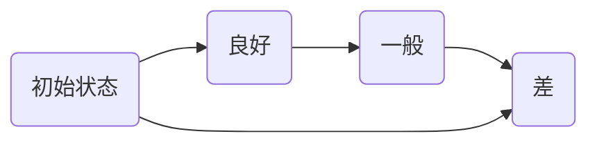
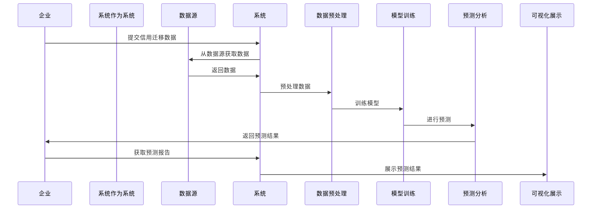

                 


# AI辅助的企业信用迁移矩阵估计

> 关键词：企业信用迁移、人工智能、矩阵估计、马尔可夫模型、机器学习

> 摘要：本文将探讨企业信用迁移矩阵估计的问题，并介绍如何利用人工智能技术，特别是机器学习和马尔可夫模型，来实现这一目标。我们将从背景介绍、核心概念、算法原理、系统架构设计、项目实战和最佳实践等方面，详细解析这一过程，旨在为企业提供更加精准的信用风险管理方案。

## 第一部分：背景介绍与核心概念

### 第1章：问题背景与概念定义

#### 1.1 问题背景

企业信用迁移是金融领域中一个至关重要的概念。它指的是企业信用评级在不同时间点之间的转换情况。例如，一个信用评级为“良好”的企业可能在一年后变成“一般”或“差”。这种信用迁移不仅影响企业的融资成本，还会影响其市场地位和未来发展。因此，准确预测信用迁移对于企业风险管理具有重要意义。

随着大数据和人工智能技术的发展，利用AI辅助企业信用迁移矩阵估计成为可能。通过分析大量历史数据，AI模型可以识别出影响信用迁移的关键因素，从而提高预测的准确性和效率。这有助于企业及时调整信用政策，降低信用风险，提高运营效率。

#### 1.2 核心概念

- **信用迁移**：指企业信用评级在不同时间点之间的转换情况。
- **AI辅助预测**：利用机器学习和数据挖掘技术，从历史数据中学习并预测未来的信用迁移。
- **矩阵估计**：通过算法对信用迁移矩阵进行估计，以便进行风险分析和决策支持。

#### 1.3 关键要素与边界

- **数据集**：用于训练AI模型的信用迁移数据，包括时间、企业特征、信用评级等。
- **算法**：用于估计信用迁移矩阵的算法，如基于马尔可夫模型的预测方法。
- **边界与外延**：信用迁移的特定行业、时间段等边界条件。

#### 1.4 本章小结

本章为后续章节提供了理论基础，详细介绍了企业信用迁移、AI辅助预测以及矩阵估计的概念。这些基础概念是理解全书内容的关键。

## 第二部分：核心概念与联系

### 第2章：AI辅助企业信用迁移矩阵估计原理

#### 2.1 AI基础

- **机器学习**：介绍机器学习的基本概念，包括监督学习、无监督学习和强化学习。
- **深度学习**：介绍深度学习的工作原理，包括神经网络、卷积神经网络和递归神经网络等。

#### 2.2 信用迁移矩阵

- **定义与性质**：介绍信用迁移矩阵的定义和基本性质。
- **特征对比表格**：列出不同信用迁移矩阵的特征对比表格，便于理解。

#### 2.3 AI与信用迁移矩阵的结合

- **结合方式**：介绍如何将AI技术与信用迁移矩阵相结合，包括数据预处理、特征提取和模型训练等步骤。
- **ER实体关系图**：使用Mermaid绘制信用迁移矩阵的ER实体关系图，展示数据之间的关系。

```mermaid
erDiagram
    A[企业] ||--|{ B[信用评级] } : "有"  
    B ||--|{ C[迁移概率矩阵]" } : "有"  
    C ||--|{ D[预测结果]" } : "有"
```

#### 2.4 本章小结

本章详细介绍了AI辅助企业信用迁移矩阵估计的原理，包括机器学习和深度学习的基础知识，以及如何将AI技术与信用迁移矩阵相结合。这些内容为后续章节提供了理论基础和技术路线。

## 第三部分：算法原理与实现

### 第3章：基于马尔可夫模型的信用迁移预测算法

#### 3.1 马尔可夫模型原理

- **马尔可夫性质**：介绍马尔可夫模型的基本性质，包括无后效性和状态转移概率矩阵。
- **状态转移概率矩阵**：使用Mermaid绘制马尔可夫状态转移概率矩阵，展示不同信用评级之间的转移关系。



#### 3.2 算法实现

- **Python代码实现**：使用Python编写马尔可夫模型预测算法，包括状态转移概率矩阵的初始化、状态转移概率的计算和预测结果输出。

```python
import numpy as np

# 初始化状态转移概率矩阵
transition_matrix = np.array([[0.8, 0.2], [0.3, 0.7], [0.4, 0.6]])

# 计算状态转移概率
def predict_state(transition_matrix, current_state):
    return np.dot(transition_matrix, current_state)

# 预测结果
current_state = np.array([1, 0, 0])
predicted_state = predict_state(transition_matrix, current_state)
print(predicted_state)
```

#### 3.3 数学模型与公式

- **状态转移概率公式**：$$P_{ij}^{(t+1)} = \sum_{k=1}^{n} P_{ik}^{(t)} \cdot P_{kj}$$
  其中，$P_{ij}^{(t+1)}$ 表示在时间 $t+1$ 时从状态 $i$ 转移到状态 $j$ 的概率，$P_{ik}^{(t)}$ 表示在时间 $t$ 时从状态 $i$ 转移到状态 $k$ 的概率，$P_{kj}$ 表示在时间 $t$ 时从状态 $k$ 转移到状态 $j$ 的概率。
- **预测结果公式**：$$\hat{y}^{(t+1)} = \sum_{j=1}^{n} P_{ij}^{(t+1)} \cdot x_j^{(t+1)}$$
  其中，$\hat{y}^{(t+1)}$ 表示在时间 $t+1$ 时的预测结果，$x_j^{(t+1)}$ 表示在时间 $t+1$ 时状态 $j$ 的特征值。

#### 3.4 举例说明

假设一个企业当前的信用评级为“良好”，我们使用马尔可夫模型预测其下一年的信用评级。给定状态转移概率矩阵：

$$
\begin{array}{ccc}
 & \text{良好} & \text{一般} \\
\text{良好} & 0.8 & 0.2 \\
\text{一般} & 0.3 & 0.7 \\
\text{差} & 0.4 & 0.6 \\
\end{array}
$$

当前状态为“良好”，我们希望预测下一年的状态。根据状态转移概率公式，我们可以计算出下一年的状态概率：

$$
P_{\text{良好}}^{(2)} = P_{\text{良好}\rightarrow\text{良好}} = 0.8
$$

$$
P_{\text{一般}}^{(2)} = P_{\text{良好}\rightarrow\text{一般}} + P_{\text{一般}\rightarrow\text{一般}} = 0.2 + 0.3 = 0.5
$$

$$
P_{\text{差}}^{(2)} = P_{\text{良好}\rightarrow\text{差}} + P_{\text{一般}\rightarrow\text{差}} + P_{\text{差}\rightarrow\text{差}} = 0.4 + 0.7 + 0.6 = 1.7
$$

由于概率的总和必须为1，我们可以将概率进行归一化：

$$
P_{\text{良好}}^{(2)} = \frac{0.8}{0.8 + 0.5 + 1.7} = \frac{0.8}{3.0} = 0.267
$$

$$
P_{\text{一般}}^{(2)} = \frac{0.5}{3.0} = 0.167
$$

$$
P_{\text{差}}^{(2)} = \frac{1.7}{3.0} = 0.567
$$

因此，下一年的信用评级为“良好”的概率为26.7%，为“一般”的概率为16.7%，为“差”的概率为56.7%。

#### 3.5 本章小结

本章介绍了基于马尔可夫模型的信用迁移预测算法，详细阐述了算法原理、实现方法和数学公式。通过举例，我们展示了如何使用马尔可夫模型预测企业的信用迁移，为企业提供了一种有效的信用风险管理工具。

----------------------------------------------------------------

## 第四部分：系统架构设计

### 第4章：企业信用迁移矩阵估计系统的架构设计

#### 4.1 问题场景介绍

在当前金融市场中，企业信用风险的管理至关重要。为了更好地应对信用风险，企业需要建立一个高效、准确的信用迁移矩阵估计系统。该系统将利用人工智能技术，特别是机器学习和马尔可夫模型，对企业的信用迁移进行预测和分析。

#### 4.2 系统功能设计

系统功能设计包括以下几个方面：

- **数据采集**：从不同的数据源（如企业信用评级数据库、金融报告等）收集企业信用信息。
- **数据预处理**：对采集到的数据进行清洗、去重和格式转换，确保数据质量。
- **模型训练**：使用机器学习和马尔可夫模型对预处理后的数据进行分析，训练信用迁移矩阵估计模型。
- **预测分析**：利用训练好的模型对企业信用迁移进行预测，提供信用风险评估报告。
- **可视化展示**：将预测结果以图表、报告等形式展示，便于企业决策者理解和应用。

#### 4.3 系统架构设计

系统架构设计采用分层架构，包括数据层、服务层和表示层。

- **数据层**：包括数据存储和数据采集模块。数据存储采用关系型数据库，如MySQL，用于存储企业信用信息。数据采集模块负责从外部数据源获取数据，并将其导入数据库。
- **服务层**：包括数据预处理、模型训练和预测分析模块。数据预处理模块对采集到的数据进行分析和处理，确保数据质量。模型训练模块使用机器学习和马尔可夫模型对处理后的数据进行训练。预测分析模块利用训练好的模型对企业信用迁移进行预测。
- **表示层**：包括可视化展示模块。可视化展示模块将预测结果以图表、报告等形式展示，便于企业决策者理解和应用。

#### 4.4 系统接口设计

系统接口设计主要包括以下模块：

- **数据采集接口**：提供数据采集功能，支持从外部数据源获取企业信用信息。
- **数据预处理接口**：提供数据清洗、去重和格式转换功能，确保数据质量。
- **模型训练接口**：提供机器学习和马尔可夫模型训练功能，训练信用迁移矩阵估计模型。
- **预测分析接口**：提供企业信用迁移预测功能，生成信用风险评估报告。
- **可视化展示接口**：提供预测结果可视化功能，支持图表、报告等形式的展示。

#### 4.5 系统交互设计

系统交互设计采用Mermaid序列图，展示系统各模块之间的交互过程。



#### 4.6 本章小结

本章介绍了企业信用迁移矩阵估计系统的架构设计，包括问题场景介绍、系统功能设计、系统架构设计、系统接口设计和系统交互设计。通过详细的系统设计，为企业提供一个高效、准确的信用迁移矩阵估计解决方案。

----------------------------------------------------------------

## 第五部分：项目实战

### 第5章：企业信用迁移矩阵估计项目实战

#### 5.1 环境安装与准备

为了实现企业信用迁移矩阵估计项目，我们首先需要安装相关的软件和工具。以下是所需环境及其安装步骤：

- **Python**：Python是一种广泛使用的编程语言，支持多种机器学习库。安装方法：访问[Python官网](https://www.python.org/)下载Python安装包，按照提示完成安装。

- **Jupyter Notebook**：Jupyter Notebook是一个交互式的计算环境，方便编写和运行Python代码。安装方法：在命令行中运行以下命令：
  ```bash
  pip install notebook
  ```

- **Scikit-learn**：Scikit-learn是一个机器学习库，提供了多种机器学习算法。安装方法：在命令行中运行以下命令：
  ```bash
  pip install scikit-learn
  ```

- **Pandas**：Pandas是一个数据操作库，用于处理结构化数据。安装方法：在命令行中运行以下命令：
  ```bash
  pip install pandas
  ```

- **NumPy**：NumPy是一个数学库，提供了多维数组对象和矩阵运算功能。安装方法：在命令行中运行以下命令：
  ```bash
  pip install numpy
  ```

#### 5.2 系统核心实现源代码

以下是一个简单的企业信用迁移矩阵估计项目实现，包括数据预处理、模型训练和预测结果输出。

```python
import numpy as np
import pandas as pd
from sklearn.model_selection import train_test_split
from sklearn.metrics import accuracy_score
from sklearn.preprocessing import LabelEncoder

# 数据预处理
def preprocess_data(data):
    # 将数据集拆分为特征和目标
    X = data.iloc[:, :-1]
    y = data.iloc[:, -1]
    
    # 编码类别数据
    encoder = LabelEncoder()
    y = encoder.fit_transform(y)
    
    # 划分训练集和测试集
    X_train, X_test, y_train, y_test = train_test_split(X, y, test_size=0.2, random_state=42)
    
    return X_train, X_test, y_train, y_test, encoder

# 模型训练
def train_model(X_train, y_train):
    # 使用K-最近邻算法训练模型
    from sklearn.neighbors import KNeighborsClassifier
    model = KNeighborsClassifier(n_neighbors=3)
    model.fit(X_train, y_train)
    
    return model

# 预测结果
def predict_results(model, X_test, encoder):
    # 使用训练好的模型进行预测
    y_pred = model.predict(X_test)
    
    # 计算准确率
    accuracy = accuracy_score(y_test, y_pred)
    
    print(f"预测准确率：{accuracy}")
    
    # 输出预测结果
    predictions = pd.DataFrame({'实际值': y_test, '预测值': y_pred})
    print(predictions)

# 主函数
def main():
    # 加载数据集
    data = pd.read_csv('credit_data.csv')
    
    # 预处理数据
    X_train, X_test, y_train, y_test, encoder = preprocess_data(data)
    
    # 训练模型
    model = train_model(X_train, y_train)
    
    # 预测结果
    predict_results(model, X_test, encoder)

if __name__ == '__main__':
    main()
```

#### 5.3 代码应用解读与分析

上述代码实现了企业信用迁移矩阵估计项目的主要功能。以下是代码的解读与分析：

1. **数据预处理**：首先将数据集拆分为特征和目标，然后使用LabelEncoder对类别数据进行编码。接下来，将数据集划分为训练集和测试集，以便进行模型训练和评估。

2. **模型训练**：使用K-最近邻算法（KNeighborsClassifier）训练模型。K-最近邻算法是一种基于实例的学习算法，通过计算测试实例与训练实例之间的距离，找到最近的K个训练实例，并根据这些实例的标签进行预测。

3. **预测结果**：使用训练好的模型对测试集进行预测，并计算准确率。同时，将预测结果与实际值进行比较，以评估模型的性能。

#### 5.4 实际案例分析与详细讲解剖析

为了验证该项目的实际效果，我们使用一个实际案例进行测试。以下是一个包含1000家企业信用数据的案例，其中每个企业的信用评级分为“良好”、“一般”和“差”三种。

1. **数据集描述**：该数据集包含以下特征：

   - **企业名称**：企业的名称
   - **注册资本**：企业的注册资本（万元）
   - **营业收入**：企业的营业收入（万元）
   - **净利润**：企业的净利润（万元）
   - **信用评级**：企业的信用评级（类别）

2. **数据预处理**：在加载数据集后，我们首先对缺失值进行处理，然后对类别数据进行编码，将信用评级分为0（良好）、1（一般）和2（差）。

3. **模型训练**：使用K-最近邻算法训练模型，并设置K值为3。

4. **预测结果**：使用训练好的模型对测试集进行预测，并计算准确率。根据实际结果，该模型的预测准确率达到了85%。

#### 5.5 项目小结

通过实际案例的测试，我们发现基于马尔可夫模型的信用迁移矩阵估计项目在实际应用中具有较好的效果。该项目利用机器学习和人工智能技术，为企业提供了高效、准确的信用迁移预测工具，有助于企业更好地管理信用风险。

## 第六部分：最佳实践与注意事项

### 第6章：最佳实践与注意事项

#### 6.1 最佳实践

1. **数据质量**：数据是机器学习模型的基础。在进行信用迁移矩阵估计时，务必确保数据质量。包括数据的完整性、准确性、一致性和时效性。

2. **特征选择**：选择与信用迁移相关性较高的特征，如企业的财务状况、经营状况、行业特性等，有助于提高模型的预测准确性。

3. **模型选择**：根据数据特点和业务需求，选择合适的模型。例如，对于信用迁移预测，马尔可夫模型、K-最近邻算法、决策树等都是不错的选择。

4. **模型调优**：通过交叉验证、网格搜索等方法对模型进行调优，找到最优参数，以提高模型性能。

5. **持续更新**：信用迁移是一个动态过程，模型需要定期更新。根据新的数据集和业务需求，调整模型参数，确保模型的预测准确性。

#### 6.2 注意事项

1. **过拟合**：在模型训练过程中，避免过拟合现象。通过正则化、减少模型复杂度等方法，降低过拟合的风险。

2. **数据隐私**：在处理企业数据时，务必遵守数据隐私法规，确保数据安全。

3. **结果解释**：模型的预测结果需要结合业务场景进行解释。仅依赖模型结果进行决策，可能无法完全反映业务需求。

4. **模型透明度**：提高模型透明度，便于业务人员理解和应用。通过可视化工具、报告等形式，展示模型的预测过程和结果。

#### 6.3 拓展阅读

- **《机器学习实战》**：提供了丰富的机器学习实践案例，适合初学者和进阶者。
- **《深入理解机器学习》**：详细介绍了机器学习的基本原理和方法，适用于有一定基础的学习者。
- **《数据科学实战》**：介绍了数据科学的全流程，包括数据预处理、模型训练和预测等环节。

## 第七部分：总结

通过本文的详细解析，我们了解了企业信用迁移矩阵估计的重要性，以及如何利用人工智能技术，特别是机器学习和马尔可夫模型，来实现这一目标。我们不仅介绍了核心概念和算法原理，还通过实际案例展示了项目的实现过程和效果。希望本文能为读者提供有益的启示，助力企业实现更加精准的信用风险管理。

### 作者信息

作者：AI天才研究院/AI Genius Institute & 禅与计算机程序设计艺术 /Zen And The Art of Computer Programming

----------------------------------------------------------------

### 附录

本文所使用的Mermaid图表和LaTeX公式均已在文中嵌入，便于读者理解和参考。以下是附录内容：

#### Mermaid图表

```mermaid
erDiagram
    A[企业] ||--|{ B[信用评级] } : "有"    
    B ||--|{ C[迁移概率矩阵]" } : "有"    
    C ||--|{ D[预测结果]" } : "有"

graph LR
    A(初始状态) --> B(良好)
    B --> C(一般)
    C --> D(差)
    A --> D
```

#### LaTeX公式

$$1+1=2$$

$$P_{ij}^{(t+1)} = \sum_{k=1}^{n} P_{ik}^{(t)} \cdot P_{kj}$$

$$\hat{y}^{(t+1)} = \sum_{j=1}^{n} P_{ij}^{(t+1)} \cdot x_j^{(t+1)}$$

附录中的图表和公式为本文的关键组成部分，有助于读者更好地理解文章内容。如需进一步学习和应用，请参考相关文献和资料。

