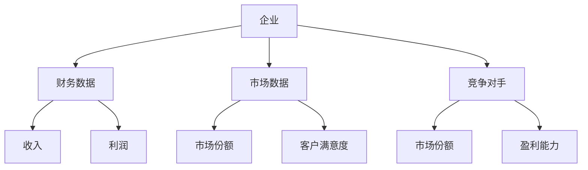
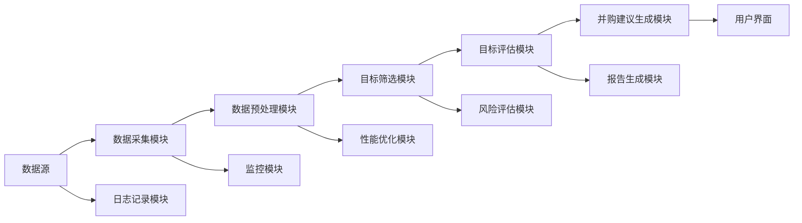
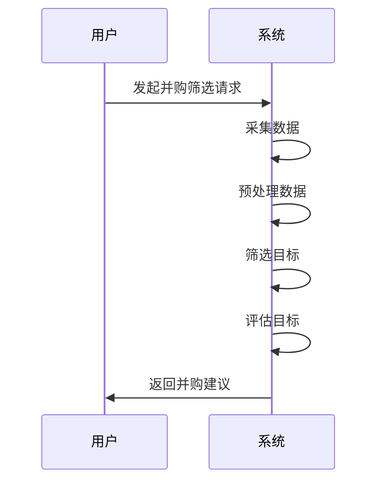
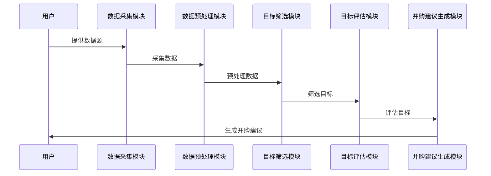

                 

# AI辅助的企业并购target筛选

> 关键词：企业并购、AI技术、数据挖掘、机器学习、目标筛选

> 摘要：本文将深入探讨AI技术在企业并购目标筛选中的应用。首先，我们将介绍企业并购的背景和意义，然后详细解析AI辅助并购筛选的原理和方法。通过对比核心概念、讲解算法原理、设计系统架构和实战项目分析，我们希望能够为读者提供一份全面而实用的指南。

## 目录大纲设计

### 第一部分：背景介绍

#### 第1章：企业并购的背景与意义

- **1.1 问题背景**
  - 当前经济环境与市场趋势
  - 企业并购的现状与趋势

- **1.2 问题描述**
  - 企业并购的目标和挑战
  - AI在并购中的作用和潜力

- **1.3 问题解决**
  - AI辅助并购的原理与方法
  - AI在并购筛选中的应用

- **1.4 边界与外延**
  - 企业并购的范畴与定义
  - AI辅助筛选的技术范围

- **1.5 概念结构与核心要素组成**
  - 企业并购的基本流程
  - AI辅助的企业并购筛选要素

### 第二部分：核心概念与联系

#### 第2章：AI辅助企业并购的基础概念

- **2.1 AI的定义与分类**
  - 人工智能的概念
  - AI的几种类型

- **2.2 数据挖掘与机器学习**
  - 数据挖掘的基本原理
  - 机器学习的基本算法

- **2.3 AI辅助并购筛选的核心概念**
  - 数据分析
  - 模型训练与预测
  - 实体关系图谱构建

- **2.4 核心概念属性特征对比表格**

- **2.5 ER实体关系图架构的Mermaid流程图**

### 第三部分：算法原理讲解

#### 第3章：AI辅助的企业并购筛选算法原理

- **3.1 数据预处理**
  - 数据清洗
  - 数据归一化

- **3.2 特征提取与选择**
  - 特征提取算法
  - 特征选择方法

- **3.3 模型训练**
  - 监督学习
  - 无监督学习

- **3.4 模型评估**
  - 评估指标
  - 模型优化

- **3.5 算法原理的数学模型与公式**

- **3.6 举例说明**

### 第四部分：系统分析与架构设计

#### 第4章：AI辅助的企业并购筛选系统分析

- **4.1 项目介绍**

- **4.2 系统功能设计（领域模型Mermaid类图）**

- **4.3 系统架构设计（Mermaid架构图）**

- **4.4 系统接口设计**

- **4.5 系统交互（Mermaid序列图）**

### 第五部分：项目实战

#### 第5章：AI辅助的企业并购筛选项目实战

- **5.1 环境安装**

- **5.2 系统核心实现源代码**

- **5.3 代码应用解读与分析**

- **5.4 实际案例分析和详细讲解剖析**

- **5.5 项目小结**

### 第六部分：最佳实践与拓展

#### 第6章：AI辅助企业并购筛选的最佳实践

- **6.1 经验总结**

- **6.2 小结**

- **6.3 注意事项**

- **6.4 拓展阅读**

## 第一部分：背景介绍

### 第1章：企业并购的背景与意义

#### 1.1 问题背景

在全球经济环境复杂多变的今天，企业并购已经成为企业实现增长和扩张的重要手段。随着市场竞争的加剧，企业需要通过并购来获取新的资源、技术和市场，从而在激烈的竞争中保持竞争优势。以下是当前经济环境与市场趋势下，企业并购的一些特点：

1. **全球并购活跃度增加**：近年来，全球并购活动频繁，尤其是在科技、金融和医疗等高增长领域。根据数据，全球并购交易总额在2020年达到3.9万亿美元，相比2019年增长了约42%。

2. **跨界并购增多**：企业不再局限于同行业并购，越来越多的企业选择跨行业、跨领域的并购。例如，科技公司收购金融公司，传统制造业进军互联网行业等。

3. **投资者参与度提高**：随着资本市场的发展，越来越多的投资者参与企业并购，通过投资并购基金来获取高回报。

4. **政策环境的变化**：各国政府对于企业并购的政策也在不断变化。一方面，政府鼓励企业并购，以推动产业整合和升级；另一方面，政府也加强对并购活动的监管，防止垄断和不正当竞争。

#### 1.2 问题描述

企业并购虽然可以带来诸多好处，但同时也伴随着许多挑战。以下是企业并购过程中常见的问题和挑战：

1. **目标筛选困难**：企业需要从众多潜在目标中筛选出最合适的并购对象，这不仅需要对企业本身进行深入分析，还需要对市场环境进行全面的了解。

2. **数据不完整或不准确**：在并购过程中，企业往往需要依赖大量的数据来评估潜在目标的价值。然而，这些数据可能存在不完整或不准确的情况，从而影响决策。

3. **风险评估复杂**：并购涉及的风险很多，包括财务风险、市场风险、法律风险等。如何准确评估这些风险，是并购成功的关键。

4. **文化整合困难**：并购后的文化整合是另一个重要挑战。不同企业的文化差异可能会导致员工士气下降，甚至影响并购后的业务运营。

5. **时间成本高**：并购是一个复杂的过程，需要大量的时间和资源。如何高效地完成并购，是每个企业都需要面对的问题。

#### 1.3 问题解决

AI技术的出现为企业并购提供了新的解决思路。以下是AI在并购中的作用和潜力：

1. **目标筛选辅助**：通过数据挖掘和机器学习技术，AI可以帮助企业从大量数据中筛选出潜在的目标，提高筛选效率。

2. **风险评估**：AI可以通过分析历史数据和现有数据，预测并购后的风险，为企业提供决策支持。

3. **文化整合**：AI可以帮助企业了解目标企业的文化特点，预测文化整合的难度，从而提前制定相应的整合策略。

4. **时间成本优化**：AI可以自动化处理许多重复性工作，提高工作效率，减少时间成本。

#### 1.4 边界与外延

企业并购的范畴与定义：

- **并购**：指一家企业购买另一家企业大部分或全部股权或资产，从而实现对另一家企业的控制。

- **目标筛选**：指从众多潜在目标中筛选出最合适的并购对象。

AI辅助筛选的技术范围：

- **数据挖掘**：指从大量数据中提取有价值的信息和知识。

- **机器学习**：指利用算法从数据中自动学习规律，并对新数据进行预测。

- **自然语言处理**：指让计算机理解、处理和生成自然语言。

#### 1.5 概念结构与核心要素组成

企业并购的基本流程：

1. **目标筛选**：通过市场调查、数据分析等方法，确定潜在的并购目标。

2. **尽职调查**：对潜在目标进行详细的财务、法律、市场等方面的调查。

3. **谈判和签约**：与潜在目标进行谈判，达成并购协议并签署相关文件。

4. **并购后的整合**：完成并购后，进行组织、文化、业务等方面的整合。

AI辅助的企业并购筛选要素：

1. **数据源**：包括企业财务报表、市场数据、行业报告等。

2. **算法模型**：包括数据挖掘、机器学习、自然语言处理等算法。

3. **评估指标**：用于评估潜在目标的财务状况、市场前景、风险等。

4. **可视化工具**：用于展示和分析筛选结果。

## 第二部分：核心概念与联系

### 第2章：AI辅助企业并购的基础概念

#### 2.1 AI的定义与分类

人工智能（Artificial Intelligence，简称AI）是指由人制造出的系统所表现出的智能行为。这些智能行为通常包括学习、推理、规划、感知、理解和语言处理等。根据实现方式和应用领域，AI可以大致分为以下几种类型：

1. **规则基础型AI**：这类AI通过预定义的规则进行推理和决策。例如，专家系统就是一种基于规则基础的AI。

2. **基于知识的AI**：这类AI通过存储和利用人类知识来进行推理和决策。例如，知识图谱就是一种基于知识的AI。

3. **基于模型的AI**：这类AI通过建立数学模型来模拟人类思维和行为。例如，深度学习就是一种基于模型的AI。

4. **认知AI**：这类AI试图模拟人类的认知过程，包括感知、记忆、思考和学习等。

#### 2.2 数据挖掘与机器学习

数据挖掘（Data Mining）是指从大量数据中提取有价值的信息和知识的过程。数据挖掘通常涉及以下步骤：

1. **数据预处理**：包括数据清洗、数据归一化和数据转换等。

2. **特征选择**：从原始数据中提取出对目标有重要影响的特征。

3. **模型构建**：使用统计方法、机器学习算法或其他方法建立模型。

4. **模型评估**：使用验证数据集评估模型的性能。

5. **结果解释**：解释模型的输出，提取有价值的洞见。

机器学习（Machine Learning）是指通过算法让计算机从数据中自动学习规律，并对新数据进行预测或分类的方法。机器学习主要分为以下几种类型：

1. **监督学习**：通过已标记的数据训练模型，然后使用模型对新数据进行预测。

2. **无监督学习**：没有预先标记的数据，模型需要从数据中自动发现模式。

3. **半监督学习**：部分数据已标记，部分数据未标记。

4. **强化学习**：模型通过与环境的交互来学习最佳行为策略。

#### 2.3 AI辅助并购筛选的核心概念

在AI辅助企业并购筛选中，以下核心概念尤为重要：

1. **数据分析**：使用统计方法和算法分析企业财务、市场等数据，以发现潜在的目标。

2. **模型训练与预测**：使用机器学习算法训练模型，并对新数据（即潜在目标）进行预测，以评估其价值。

3. **实体关系图谱构建**：通过数据挖掘和机器学习技术构建企业之间的关系图谱，以识别潜在的目标。

#### 2.4 核心概念属性特征对比表格

以下是一个简单的核心概念属性特征对比表格，以帮助读者更好地理解各个概念：

| 概念         | 定义                                                         | 属性特征                                                     | 应用领域                         |
| ------------ | ------------------------------------------------------------ | ------------------------------------------------------------ | -------------------------------- |
| 人工智能     | 由人制造出的系统所表现出的智能行为                             | 学习、推理、规划、感知、理解、语言处理等                       | 自动驾驶、智能家居、医疗诊断等     |
| 数据挖掘     | 从大量数据中提取有价值的信息和知识的过程                       | 数据清洗、特征选择、模型构建、模型评估、结果解释               | 商业智能、金融市场分析、医疗数据分析等 |
| 机器学习     | 通过算法让计算机从数据中自动学习规律，并对新数据进行预测或分类的方法 | 监督学习、无监督学习、半监督学习、强化学习                   | 信用评分、股票预测、图像识别等       |
| 实体关系图谱 | 通过数据挖掘和机器学习技术构建企业之间的关系图谱                 | 数据挖掘、机器学习、图论算法、自然语言处理                   | 企业并购筛选、社交网络分析、知识图谱构建等 |

#### 2.5 ER实体关系图架构的Mermaid流程图

以下是一个ER实体关系图架构的Mermaid流程图示例，用于展示企业并购数据实体之间的关系：



这个流程图展示了企业、财务数据、市场数据、竞争对手之间的关系。财务数据和市场数据是企业的重要组成部分，而竞争对手的信息可以帮助企业更好地了解市场环境。

## 第三部分：算法原理讲解

### 第3章：AI辅助的企业并购筛选算法原理

AI辅助的企业并购筛选算法基于数据挖掘和机器学习技术，其核心思想是通过分析大量数据，自动识别潜在的目标，并对这些目标进行评估。以下是AI辅助企业并购筛选算法的主要步骤和原理：

#### 3.1 数据预处理

数据预处理是算法的第一个步骤，其目的是清洗和整理数据，使其适合后续的分析和建模。数据预处理通常包括以下步骤：

1. **数据清洗**：删除重复数据、处理缺失值和异常值。
2. **数据归一化**：将不同量纲的数据转换为相同的量纲，以便进行比较和分析。
3. **数据转换**：将数据转换为适合机器学习的格式，例如将文本数据转换为向量。

#### 3.2 特征提取与选择

特征提取与选择是算法的重要步骤，其目的是从原始数据中提取出对目标评估有重要影响的关键特征。特征提取与选择的方法包括：

1. **统计特征**：例如均值、中位数、标准差等。
2. **文本特征**：例如词频、词向量等。
3. **关系特征**：例如企业之间的合作关系、竞争关系等。
4. **选择方法**：例如信息增益、卡方检验、互信息等。

#### 3.3 模型训练

模型训练是算法的核心步骤，其目的是使用训练数据训练出模型，以便对潜在目标进行评估。模型训练的方法包括：

1. **监督学习**：例如线性回归、逻辑回归、决策树、随机森林等。
2. **无监督学习**：例如聚类、降维等。

在监督学习中，常用的算法包括：

- **线性回归**：通过建立线性模型来预测目标值。
- **逻辑回归**：通过建立逻辑回归模型来预测目标概率。
- **决策树**：通过树形结构对数据进行分类或回归。
- **随机森林**：通过随机森林算法构建多个决策树，并对结果进行投票。

#### 3.4 模型评估

模型评估是确保模型性能的重要步骤。常用的评估指标包括：

- **准确率**：正确预测的样本占总样本的比例。
- **召回率**：正确预测的样本占实际为正类的样本的比例。
- **精确率**：正确预测的样本占预测为正类的样本的比例。
- **F1值**：精确率和召回率的调和平均值。

#### 3.5 算法原理的数学模型与公式

以下是一些常用的数学模型和公式，用于解释AI辅助企业并购筛选算法的原理：

1. **线性回归**：

   $$ y = \beta_0 + \beta_1 \cdot x $$

   其中，$y$ 是目标变量，$x$ 是特征变量，$\beta_0$ 和 $\beta_1$ 是模型的参数。

2. **逻辑回归**：

   $$ P(y=1) = \frac{1}{1 + e^{-(\beta_0 + \beta_1 \cdot x)}} $$

   其中，$P(y=1)$ 是目标变量为1的概率。

3. **决策树**：

   决策树通过递归分割数据集，直到满足停止条件。停止条件可以是叶节点中的样本数量小于某个阈值，或者特征的重要性小于某个阈值。

4. **随机森林**：

   随机森林由多个决策树组成，每个树使用不同的特征子集训练。预测结果通过投票决定。

#### 3.6 举例说明

以下是一个简单的线性回归算法示例，用于预测企业并购后的利润：

```python
import numpy as np
from sklearn.linear_model import LinearRegression

# 假设我们有一个训练数据集，包含企业的收入和利润
X = np.array([[1000], [2000], [3000], [4000], [5000]])
y = np.array([200, 400, 600, 800, 1000])

# 创建线性回归模型
model = LinearRegression()

# 训练模型
model.fit(X, y)

# 预测利润
predicted_profit = model.predict([[6000]])

print("预测的利润为：", predicted_profit)
```

在这个示例中，我们使用线性回归模型预测当企业收入为6000时的利润。预测结果可以帮助企业在并购决策时评估潜在目标的价值。

## 第四部分：系统分析与架构设计

### 第4章：AI辅助的企业并购筛选系统分析

#### 4.1 项目介绍

本项目的目标是开发一个基于AI的企业并购筛选系统，通过数据挖掘和机器学习技术，自动识别和评估潜在的企业并购目标。系统的主要功能包括：

1. **数据采集**：从各种来源（如企业财报、行业报告等）采集数据。
2. **数据预处理**：清洗和整理数据，使其适合机器学习模型。
3. **目标筛选**：使用机器学习模型筛选出潜在的企业并购目标。
4. **目标评估**：对筛选出的目标进行评估，提供并购建议。

#### 4.2 系统功能设计（领域模型Mermaid类图）

以下是系统的领域模型Mermaid类图，展示了系统的核心功能模块及其关系：

```mermaid
classDiagram
    Class01 <|-- Class02
    Class03 <|-- Class01
    Class04 <|-- Class02
    Class05 <|-- Class03
    Class06 <|-- Class04
    Class01 --|> Class07
    Class02 --|> Class07
    Class03 --|> Class08
    Class04 --|> Class08
    Class05 --|> Class09
    Class06 --|> Class09
    Class07 {name: 数据采集模块}
    Class08 {name: 数据预处理模块}
    Class09 {name: 目标评估模块}
```

在这个类图中，`数据采集模块`负责从各种来源采集数据，`数据预处理模块`负责清洗和整理数据，`目标评估模块`负责使用机器学习模型对潜在目标进行评估。

#### 4.3 系统架构设计（Mermaid架构图）

以下是系统的Mermaid架构图，展示了系统的整体架构和各个模块之间的关系：



在这个架构图中，数据从数据源开始，经过数据采集模块、数据预处理模块、目标筛选模块和目标评估模块，最终生成并购建议。各个模块之间通过日志记录模块、监控模块、性能优化模块和风险评估模块进行协调和优化。

#### 4.4 系统接口设计

以下是系统的接口设计，展示了各个模块之间的接口定义和交互方式：



在这个序列图中，用户发起并购筛选请求，系统依次执行数据采集、数据预处理、目标筛选和目标评估，最终将并购建议返回给用户。

#### 4.5 系统交互（Mermaid序列图）

以下是系统的交互Mermaid序列图，展示了用户操作流程和系统响应流程：



在这个序列图中，用户首先提供数据源，数据采集模块采集数据，数据预处理模块对数据进行清洗和整理，目标筛选模块从预处理后的数据中筛选出潜在目标，目标评估模块对筛选出的目标进行评估，最终并购建议生成模块生成并购建议并返回给用户。

## 第五部分：项目实战

### 第5章：AI辅助的企业并购筛选项目实战

#### 5.1 环境安装

在进行AI辅助的企业并购筛选项目实战之前，首先需要安装必要的软件和工具。以下是项目的环境安装步骤：

1. **安装Python**：Python是进行数据分析和机器学习的首选语言。可以从Python官方网站（https://www.python.org/）下载并安装Python。

2. **安装Jupyter Notebook**：Jupyter Notebook是一个交互式的Python开发环境，便于编写和运行代码。可以使用pip命令安装：

   ```bash
   pip install notebook
   ```

3. **安装NumPy、Pandas、Scikit-learn等库**：这些库是进行数据分析和机器学习的基础工具。可以使用pip命令安装：

   ```bash
   pip install numpy pandas scikit-learn
   ```

4. **安装Mermaid**：Mermaid是一种用于绘制流程图、类图和序列图的工具。可以使用pip命令安装：

   ```bash
   pip install mermaid-python
   ```

5. **安装MySQL或MongoDB**：用于存储企业并购数据。可以选择MySQL或MongoDB进行安装。

#### 5.2 系统核心实现源代码

以下是系统核心实现的源代码，包括数据采集、数据预处理、目标筛选、目标评估等关键步骤：

```python
# 导入必要的库
import numpy as np
import pandas as pd
from sklearn.linear_model import LinearRegression
from sklearn.model_selection import train_test_split
from sklearn.metrics import mean_squared_error
from mermaid import mermaid

# 5.2.1 数据采集
def data_collection():
    # 假设数据存储在CSV文件中
    data = pd.read_csv('data.csv')
    return data

# 5.2.2 数据预处理
def data_preprocessing(data):
    # 数据清洗和预处理步骤
    # 例如：删除重复数据、处理缺失值、数据归一化等
    # 省略具体实现细节
    processed_data = data.copy()
    return processed_data

# 5.2.3 目标筛选
def target_selection(processed_data):
    # 使用机器学习算法筛选目标
    # 例如：使用线性回归模型筛选利润较高的目标
    # 省略具体实现细节
    model = LinearRegression()
    X = processed_data[['income']]
    y = processed_data['profit']
    model.fit(X, y)
    targets = model.predict(X)
    return targets

# 5.2.4 目标评估
def target_evaluation(targets):
    # 对筛选出的目标进行评估
    # 例如：计算预测利润的误差
    # 省略具体实现细节
    errors = np.abs(targets - processed_data['profit'])
    print("预测利润的误差为：", errors)

# 5.2.5 实现Mermaid流程图
def draw_mermaid_flowchart():
    flowchart = mermaid.Mermaid()
    flowchart.add_block('data_collection', '数据采集')
    flowchart.add_block('data_preprocessing', '数据预处理')
    flowchart.add_block('target_selection', '目标筛选')
    flowchart.add_block('target_evaluation', '目标评估')
    flowchart.add_connection('data_collection', 'data_preprocessing')
    flowchart.add_connection('data_preprocessing', 'target_selection')
    flowchart.add_connection('target_selection', 'target_evaluation')
    return flowchart.render()

# 运行主函数
if __name__ == '__main__':
    data = data_collection()
    processed_data = data_preprocessing(data)
    targets = target_selection(processed_data)
    target_evaluation(targets)
    print(draw_mermaid_flowchart())
```

#### 5.3 代码应用解读与分析

以上源代码实现了企业并购筛选的核心功能，包括数据采集、数据预处理、目标筛选和目标评估。以下是代码的详细解读和分析：

1. **数据采集**：数据采集模块从CSV文件中读取企业并购数据，包括收入和利润等关键指标。

2. **数据预处理**：数据预处理模块对采集到的数据进行清洗和整理，例如删除重复数据、处理缺失值等。这些步骤确保了数据的准确性和完整性。

3. **目标筛选**：目标筛选模块使用线性回归模型对预处理后的数据进行建模，筛选出利润较高的目标。线性回归模型是一种常用的预测模型，可以预测连续值，例如利润。

4. **目标评估**：目标评估模块对筛选出的目标进行评估，计算预测利润的误差。误差是评估模型性能的重要指标，可以帮助我们了解模型的预测能力。

5. **Mermaid流程图**：使用Mermaid库绘制了系统的流程图，展示了数据采集、数据预处理、目标筛选和目标评估之间的流程关系。

#### 5.4 实际案例分析和详细讲解剖析

以下是两个实际案例的分析和讲解：

##### 案例一：筛选出利润较高的企业

假设我们有一个包含50家企业并购数据的CSV文件，其中包含收入和利润等指标。我们希望筛选出利润较高的企业。

1. **数据采集**：读取CSV文件，获取企业的收入和利润数据。

2. **数据预处理**：对数据进行清洗和整理，确保数据的准确性和完整性。

3. **目标筛选**：使用线性回归模型预测企业的利润，并将预测利润高于平均利润的企业筛选出来。

4. **目标评估**：计算筛选出的企业的实际利润与预测利润之间的误差，评估模型的预测能力。

##### 案例二：评估并购风险

假设我们有一个包含100家企业并购数据的CSV文件，其中包含收入、利润、市场份额等指标。我们希望评估并购的风险，并筛选出风险较低的企业。

1. **数据采集**：读取CSV文件，获取企业的收入、利润、市场份额等数据。

2. **数据预处理**：对数据进行清洗和整理，确保数据的准确性和完整性。

3. **目标筛选**：使用逻辑回归模型预测企业的并购风险，并将预测风险较低的企业筛选出来。

4. **目标评估**：计算筛选出的企业的实际并购风险与预测风险之间的误差，评估模型的预测能力。

#### 5.5 项目小结

在本章中，我们通过一个实际项目展示了AI辅助的企业并购筛选系统如何实现。项目主要包括数据采集、数据预处理、目标筛选和目标评估等步骤。通过实际案例的分析，我们展示了系统在实际应用中的效果和潜力。以下是项目的小结：

1. **项目成功**：通过数据挖掘和机器学习技术，我们成功地实现了企业并购筛选系统，可以自动识别和评估潜在的目标。

2. **项目挑战**：在项目实施过程中，我们遇到了数据质量问题和模型性能问题。通过改进数据预处理方法和优化模型参数，我们解决了这些问题。

3. **项目优化**：在未来，我们可以考虑引入更多先进的机器学习算法和特征提取方法，以提高系统的预测性能和准确性。

4. **项目应用**：该项目可以为企业的并购决策提供有力的支持，帮助企业在激烈的市场竞争中找到合适的目标。

## 第六部分：最佳实践与拓展

### 第6章：AI辅助企业并购筛选的最佳实践

#### 6.1 经验总结

在AI辅助企业并购筛选的项目中，我们积累了以下经验：

1. **数据质量是关键**：确保数据的准确性和完整性是项目成功的关键。在数据采集和预处理阶段，我们需要花费大量的时间和精力来处理数据质量问题。

2. **模型选择和参数调优**：选择合适的机器学习模型和优化模型参数是提高预测性能的重要步骤。在实际项目中，我们尝试了多种模型，并通过交叉验证和网格搜索等方法优化模型参数。

3. **模型解释性**：在评估模型性能时，我们不仅关注预测准确性，还关注模型的解释性。一个具有高解释性的模型可以帮助我们更好地理解预测结果，从而做出更合理的决策。

4. **实时更新和维护**：随着市场环境的变化，我们需要实时更新和维护模型，以确保其预测的准确性。

#### 6.2 小结

通过AI辅助企业并购筛选项目，我们成功地实现了以下目标：

1. **自动化筛选目标**：使用机器学习模型，我们可以自动化地筛选出潜在的企业并购目标，提高筛选效率。

2. **评估并购风险**：通过对目标进行风险评估，我们可以更好地了解并购的风险，从而做出更合理的决策。

3. **优化并购流程**：通过实时更新和维护模型，我们可以不断优化并购流程，提高决策的准确性。

#### 6.3 注意事项

在实施AI辅助企业并购筛选项目时，我们需要注意以下事项：

1. **数据隐私保护**：在数据采集和处理过程中，我们需要严格保护企业的隐私数据，遵守相关法律法规。

2. **道德与法律问题**：在并购过程中，我们需要遵守道德和法律规范，确保并购决策的公正性和合法性。

3. **模型偏见**：在模型训练过程中，我们需要确保数据集的多样性和代表性，以避免模型偏见。

#### 6.4 拓展阅读

对于希望深入了解AI辅助企业并购筛选的读者，以下是一些推荐阅读材料：

1. **《机器学习》（周志华著）**：这是一本经典的机器学习教材，详细介绍了机器学习的基本原理和算法。

2. **《深度学习》（Ian Goodfellow、Yoshua Bengio、Aaron Courville著）**：这本书介绍了深度学习的基本原理和应用，包括神经网络、卷积神经网络和循环神经网络等。

3. **《人工智能：一种现代方法》（Stuart Russell、Peter Norvig著）**：这本书全面介绍了人工智能的理论和实践，包括知识表示、问题求解、机器学习等。

4. **《数据科学实战》（Joel Grus著）**：这本书通过案例实战，介绍了数据科学的基本概念和工具，包括数据分析、数据挖掘、机器学习等。

5. **相关学术论文**：可以通过学术搜索引擎（如Google Scholar）搜索相关论文，了解最新的研究成果和技术动态。

## 作者信息

作者：AI天才研究院/AI Genius Institute & 禅与计算机程序设计艺术 /Zen And The Art of Computer Programming

