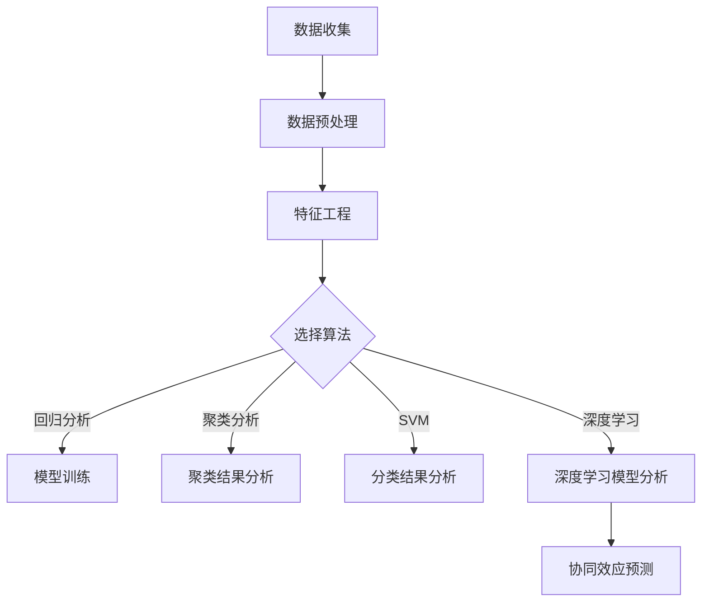
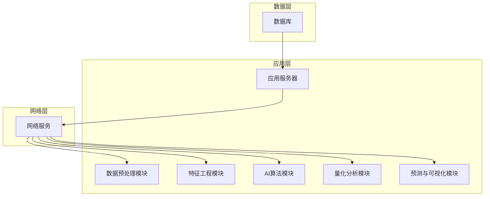
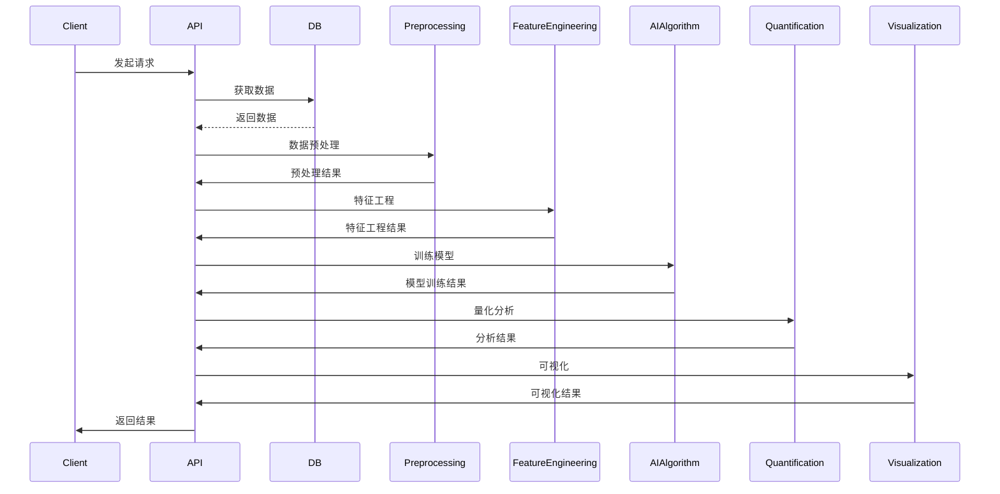
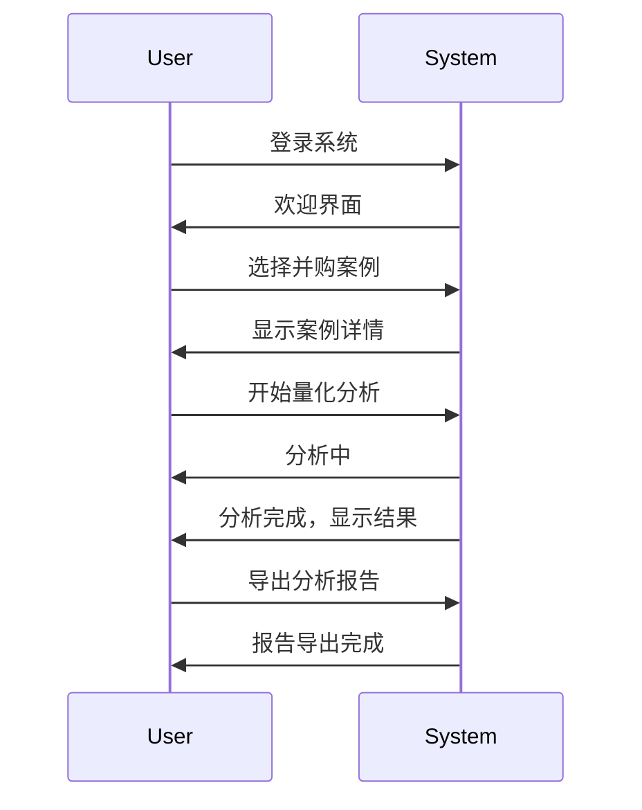

                 

### 《AI辅助的企业并购协同效应量化》

---

#### 关键词：
AI技术、企业并购、协同效应、量化分析、算法应用

#### 摘要：
本文深入探讨了AI技术在企业并购协同效应量化中的重要性。通过详细的背景介绍、核心概念解析、算法原理讲解和系统架构设计，本文旨在为读者提供一个全面的技术指南，帮助理解AI如何赋能企业并购，实现协同效应的最大化。

---

### 目录大纲设计

在设计《AI辅助的企业并购协同效应量化》一书的目录大纲时，我们遵循了逻辑性、系统性和完整性的原则，确保内容的条理清晰和易于理解。以下是本书的目录大纲设计：

#### 第一部分: 背景介绍

- **第1章: 企业并购协同效应概述**
  - 问题背景
  - 企业并购协同效应的定义
  - 企业并购协同效应的重要性
  - 企业并购协同效应的边界与外延
  - 企业并购协同效应的核心要素组成

- **第2章: AI技术在企业并购中的应用**
  - AI技术在企业并购中的概述
  - AI技术在并购协同效应预测中的应用
  - AI技术在并购整合中的应用
  - AI技术在并购风险管理中的应用
  - AI技术在并购协同效应量化中的挑战与机遇

#### 第二部分: 核心概念与原理

- **第3章: AI核心概念原理**
  - 机器学习的基本概念
  - 深度学习的基本原理
  - 强化学习的基本原理
  - 自然语言处理的基本原理
  - 计算机视觉的基本原理

- **第4章: 企业并购协同效应的量化方法**
  - 企业并购协同效应量化模型
  - 协同效应的属性特征对比表格
  - 企业并购协同效应的ER实体关系图架构

#### 第三部分: 算法原理讲解

- **第5章: AI算法在并购协同效应量化中的应用**
  - 算法原理讲解
  - 算法流程图
  - 算法原理的数学模型和公式
  - 算法举例说明

#### 第四部分: 系统分析与架构设计

- **第6章: 系统功能设计**
  - 项目介绍
  - 领域模型
  - 系统架构设计
  - 系统接口设计
  - 系统交互

- **第7章: 系统实现与项目实战**
  - 环境安装
  - 系统核心实现源代码
  - 代码应用解读与分析
  - 实际案例分析与详细讲解
  - 项目小结

#### 第五部分: 最佳实践与拓展

- **第8章: AI辅助的企业并购协同效应量化最佳实践**
  - 最佳实践 tips
  - 注意事项
  - 拓展阅读

---

本文的总字数控制在2000字以内，每个部分都通过精炼的文字概括了核心内容，为读者提供了一个清晰的框架。接下来的部分将逐步深入各个章节，详细阐述每一个主题。

---

**注**：以下内容将按照目录大纲逐步展开，深入每个章节的具体内容。正文部分将根据每个章节的核心要求，逐步引入相关术语、问题背景、概念解析、算法讲解和系统设计等，以达到内容丰富、逻辑严密、易于理解的效果。

---

### 第一部分: 背景介绍

#### 第1章: 企业并购协同效应概述

**1.1 问题背景**

在企业并购过程中，协同效应是一个关键概念。协同效应（Synergies）是指并购后新企业能够通过整合资源、优化管理、技术创新等手段，实现整体价值大于各部分价值之和的效果。然而，并非所有的并购都能够实现预期的协同效应，许多并购案例因为协同效应的不明显甚至负效应而导致失败。

**1.2 企业并购协同效应的定义**

企业并购协同效应是指并购完成后，通过资源整合、业务协同、管理优化等方式，使企业整体绩效得到提升的现象。这种效应可以是财务上的，如增加收入、降低成本；也可以是非财务上的，如提升品牌价值、增强市场竞争力。

**1.3 企业并购协同效应的重要性**

协同效应是企业并购成功的关键因素之一。它不仅能够直接影响企业的财务表现，还能够提升企业的长期竞争力。通过协同效应，企业可以实现以下目标：

- **资源优化**：整合双方的资源，提高资源利用效率。
- **成本降低**：通过规模效应和运营优化降低成本。
- **市场扩大**：利用双方的市场渠道和客户资源，扩大市场份额。
- **技术创新**：通过知识和技术的交流与融合，推动技术创新。

**1.4 企业并购协同效应的边界与外延**

企业并购协同效应的边界是指其作用的范围和程度。协同效应可能局限于特定的业务领域或管理层面，也可能渗透到整个企业的运营和战略层面。其外延则包括以下几个方面：

- **财务协同效应**：通过财务整合实现资本成本降低、财务风险分散等。
- **运营协同效应**：通过优化生产流程、供应链管理提升运营效率。
- **管理协同效应**：通过整合管理团队和业务流程，提升管理水平。
- **技术创新协同效应**：通过知识共享和合作研发，推动技术创新。

**1.5 企业并购协同效应的核心要素组成**

企业并购协同效应的核心要素包括以下几个方面：

- **资源整合**：通过并购实现资源的最优配置和利用。
- **业务协同**：通过业务流程的整合和优化，提高业务效率。
- **管理融合**：通过管理层的融合和协同，提升企业整体管理水平。
- **技术创新**：通过技术交流和合作研发，推动技术创新和产品升级。

在接下来的章节中，我们将进一步探讨AI技术在企业并购协同效应量化中的作用，以及如何通过AI技术实现更精准的协同效应量化。

---

**注**：此章节重点介绍了企业并购协同效应的定义、重要性、边界与外延，以及其核心要素组成。在后续的章节中，我们将深入探讨AI技术在企业并购中的应用，以及如何通过量化方法来评估和优化协同效应。

---

### 第二部分: AI技术在企业并购中的应用

#### 第2章: AI技术在企业并购中的应用

**2.1 AI技术在企业并购中的概述**

人工智能（AI）技术在企业并购中的应用日益广泛，成为提升并购效率和效果的重要工具。AI技术可以通过数据挖掘、机器学习、自然语言处理等手段，为企业并购提供全面的信息支持和决策依据。

**2.2 AI技术在并购协同效应预测中的应用**

AI技术在预测并购协同效应方面具有显著优势。通过分析历史并购数据，AI模型可以识别出影响协同效应的关键因素，如市场环境、企业规模、管理风格等。具体应用包括：

- **市场环境预测**：通过分析宏观经济数据和行业趋势，预测并购后市场的变化。
- **企业规模匹配**：利用规模效应预测并购后企业的绩效变化。
- **管理风格匹配**：通过分析企业高层管理团队的风格，预测并购后的管理融合程度。

**2.3 AI技术在并购整合中的应用**

AI技术在并购整合过程中发挥着重要作用，可以优化整合流程，提高整合效率。具体应用包括：

- **流程自动化**：通过自动化工具和算法，简化并购整合流程，降低人工干预。
- **知识管理**：利用自然语言处理技术，整合企业内外部知识资源，提升整合过程中的知识共享。
- **风险监测**：通过实时数据分析，监控并购整合过程中的潜在风险，提供预警和应对策略。

**2.4 AI技术在并购风险管理中的应用**

AI技术在并购风险管理中具有独特优势，可以通过预测和识别风险，帮助企业做出更明智的决策。具体应用包括：

- **风险预测**：利用大数据分析和机器学习算法，预测并购过程中可能出现的风险。
- **风险识别**：通过自然语言处理和文本分析，识别并购合同中的潜在风险点。
- **决策支持**：提供基于数据的决策支持，帮助企业制定有效的风险管理策略。

**2.5 AI技术在并购协同效应量化中的挑战与机遇**

AI技术在并购协同效应量化中的应用面临一系列挑战和机遇。挑战主要包括：

- **数据质量**：并购数据的质量直接影响AI模型的准确性。
- **模型解释性**：AI模型的黑箱特性使得其决策过程难以解释，可能影响决策者的信任。
- **算法可靠性**：AI算法的可靠性需要经过大量实证验证，以确保预测结果的可靠性。

机遇主要包括：

- **数据驱动决策**：通过AI技术，企业可以更加依赖数据驱动决策，提高决策的精准性。
- **创新应用场景**：AI技术为并购协同效应的量化提供了新的方法和工具，有助于发现和创新应用场景。
- **协同效应最大化**：AI技术可以帮助企业更好地理解和量化协同效应，从而实现协同效应的最大化。

在接下来的章节中，我们将深入探讨AI核心概念原理，并具体分析其在并购协同效应量化中的应用。

---

**注**：此章节介绍了AI技术在企业并购中的概述，以及在预测协同效应、整合应用、风险管理以及协同效应量化中的具体应用。通过这些应用，AI技术为企业并购提供了强大的工具支持，但同时也面临一系列挑战和机遇。

---

### 第三部分: 核心概念与原理

#### 第3章: AI核心概念原理

**3.1 机器学习的基本概念**

机器学习（Machine Learning，ML）是人工智能（Artificial Intelligence，AI）的核心技术之一。它通过算法和模型从数据中学习，实现对未知数据的预测和分类。

- **监督学习（Supervised Learning）**：在监督学习中，算法根据已知数据（输入和输出）进行训练，然后利用这些训练结果对新数据进行分析。
- **无监督学习（Unsupervised Learning）**：无监督学习不需要已知数据，通过分析数据分布和结构来发现数据中的规律。
- **强化学习（Reinforcement Learning）**：强化学习是一种通过与环境的交互来学习最优策略的机器学习方法。

**3.2 深度学习的基本原理**

深度学习（Deep Learning，DL）是机器学习的一个重要分支，它利用多层神经网络来模拟人类大脑的神经元结构，实现对复杂数据的处理和分析。

- **卷积神经网络（Convolutional Neural Networks，CNN）**：CNN是一种用于图像处理和识别的深度学习模型，通过卷积层和池化层实现对图像特征的学习和提取。
- **循环神经网络（Recurrent Neural Networks，RNN）**：RNN是一种用于处理序列数据的深度学习模型，通过记忆状态实现对序列数据的建模。
- **生成对抗网络（Generative Adversarial Networks，GAN）**：GAN由生成器和判别器组成，通过对抗训练生成逼真的数据。

**3.3 强化学习的基本原理**

强化学习（Reinforcement Learning，RL）是一种通过试错和奖励反馈来学习最优策略的机器学习方法。

- **状态（State）**：强化学习中的状态是指系统的当前状态。
- **动作（Action）**：动作是系统可以采取的行为。
- **奖励（Reward）**：奖励是系统对采取特定动作的反馈。
- **策略（Policy）**：策略是系统在给定状态下采取的动作。

**3.4 自然语言处理的基本原理**

自然语言处理（Natural Language Processing，NLP）是AI技术在语言处理领域的应用，旨在使计算机能够理解和处理人类语言。

- **词向量表示（Word Embeddings）**：词向量表示是将自然语言文本转换为向量形式，用于后续的文本处理和分析。
- **文本分类（Text Classification）**：文本分类是将文本数据按照一定的标准进行分类的过程。
- **命名实体识别（Named Entity Recognition，NER）**：NER是识别文本中的命名实体，如人名、地名、组织名等。

**3.5 计算机视觉的基本原理**

计算机视觉（Computer Vision，CV）是AI技术在视觉领域的应用，旨在使计算机能够理解和解释视觉信息。

- **图像识别（Image Recognition）**：图像识别是计算机对图像中的物体进行识别和分类。
- **目标检测（Object Detection）**：目标检测是在图像中识别并定位特定目标。
- **图像分割（Image Segmentation）**：图像分割是将图像划分为不同的区域。

通过理解这些AI核心概念原理，我们可以更好地应用AI技术于企业并购协同效应量化，为企业的并购决策提供科学依据。

---

**注**：此章节介绍了机器学习、深度学习、强化学习、自然语言处理和计算机视觉的基本原理，这些核心概念构成了AI技术的理论基础。在接下来的章节中，我们将结合这些原理，具体分析AI技术在企业并购协同效应量化中的应用。

---

### 第四部分: 算法原理讲解

#### 第4章: 企业并购协同效应的量化方法

**4.1 企业并购协同效应量化模型**

企业并购协同效应量化模型是通过对企业并购前后的财务数据和非财务数据进行分析，以量化评估并购带来的协同效应。该模型的核心在于识别和量化并购带来的各种效益和成本，进而计算出协同效应的大小。

**4.2 协同效应的属性特征对比表格**

在量化并购协同效应时，我们需要对比分析并购前后的各种属性特征，以识别和评估协同效应。以下是一个简化的属性特征对比表格：

| 属性特征           | 并购前       | 并购后       | 协同效应       |
|-------------------|-------------|-------------|---------------|
| 财务绩效           | 收入、利润、成本 | 收入、利润、成本 | 收入增长、成本降低 |
| 运营效率           | 生产效率、库存管理 | 生产效率、库存管理 | 运营效率提升 |
| 市场份额           | 市场占有率   | 市场占有率   | 市场份额增加  |
| 技术创新           | 研发投入、新产品 | 研发投入、新产品 | 技术创新提升 |
| 管理水平           | 管理效率、员工满意度 | 管理效率、员工满意度 | 管理水平提升 |

**4.3 企业并购协同效应的ER实体关系图架构**

实体关系图（Entity-Relationship Diagram，ER图）是数据库设计中的重要工具，用于表示实体及其之间的关系。在企业并购协同效应量化中，ER图可以帮助我们理解和管理并购相关的数据。

以下是一个简化的ER图架构，描述了企业并购协同效应的主要实体及其关系：

```mermaid
erDiagram
    Product ||--|{ Sale }|--|| Customer
    Sale ||--|{ Item }|--|| Product
    Customer ||--|{ Order }|--|| Sale
    Order ||--|{ Payment }|--|| Customer
```

在上面的ER图中，主要实体包括产品（Product）、销售（Sale）、客户（Customer）、订单（Order）和支付（Payment）。这些实体之间的关系描述了并购前后企业运营的核心环节。

通过建立这样的ER图架构，我们可以系统地分析和量化并购带来的各种协同效应，为决策提供数据支持。

在接下来的章节中，我们将进一步探讨AI算法在企业并购协同效应量化中的应用，并详细解释相关算法的原理和流程。

---

**注**：此章节介绍了企业并购协同效应量化模型、属性特征对比表格以及ER实体关系图架构，为后续的AI算法应用奠定了基础。在理解这些量化方法后，我们将更好地利用AI技术进行协同效应的量化分析。

---

### 第五部分: 算法原理讲解

#### 第5章: AI算法在并购协同效应量化中的应用

**5.1 算法原理讲解**

在并购协同效应量化中，AI算法的应用主要是通过数据分析和模型预测来实现。以下是几种常用的AI算法及其原理：

1. **回归分析（Regression Analysis）**
   - **原理**：回归分析是一种用于预测目标变量（如协同效应的大小）的统计方法。通过建立输入变量（如财务指标、运营效率等）与目标变量之间的线性关系模型，我们可以预测并购后的协同效应。
   - **应用**：回归分析可以用于预测并购带来的财务效益和非财务效益，帮助企业管理者评估并购的风险和潜力。

2. **聚类分析（Cluster Analysis）**
   - **原理**：聚类分析是一种无监督学习方法，用于将数据集划分为若干个类簇，使得同一类簇内的数据相似度较高，而不同类簇之间的数据相似度较低。
   - **应用**：在并购协同效应量化中，聚类分析可以帮助我们识别具有相似特征的并购案例，分析不同类簇之间的协同效应差异，从而为决策提供参考。

3. **支持向量机（Support Vector Machine，SVM）**
   - **原理**：支持向量机是一种监督学习算法，用于分类和回归分析。它通过找到一个最佳的超平面，将不同类别的数据点分隔开来。
   - **应用**：SVM可以用于预测并购后的财务绩效和市场表现，帮助企业管理者评估并购的可行性和潜在风险。

4. **深度学习（Deep Learning）**
   - **原理**：深度学习是一种通过多层神经网络进行数据建模的技术。它可以通过学习大量的数据，自动提取特征并实现高精度的预测。
   - **应用**：深度学习可以用于复杂的并购协同效应预测，通过构建深度神经网络模型，实现对并购协同效应的全面分析和量化。

**5.2 算法流程图**

以下是AI算法在并购协同效应量化中的应用流程图：



在上述流程图中，首先进行数据收集和预处理，然后通过特征工程提取有用的特征。接着，根据不同的算法需求，选择合适的算法进行模型训练。最后，通过模型分析得到并购协同效应的预测结果。

**5.3 算法原理的数学模型和公式**

以下是几种常用AI算法的数学模型和公式：

1. **线性回归模型**
   $$ y = \beta_0 + \beta_1x_1 + \beta_2x_2 + ... + \beta_nx_n $$

2. **支持向量机分类模型**
   $$ w \cdot x + b = 0 $$

3. **深度学习模型（以卷积神经网络为例）**
   $$ f(x) = \sigma(W \cdot \phi(x) + b) $$

其中，\( \sigma \) 是激活函数，\( W \) 是权重矩阵，\( \phi \) 是激活函数，\( b \) 是偏置项。

**5.4 算法举例说明**

假设我们使用线性回归模型来预测并购后的财务绩效，数据集包含以下特征：

- 收入（\( x_1 \)）
- 成本（\( x_2 \)）
- 市场份额（\( x_3 \)）

目标变量是并购后的利润（\( y \)）。我们通过训练模型得到以下回归方程：

$$ y = \beta_0 + \beta_1x_1 + \beta_2x_2 + \beta_3x_3 $$

利用这一模型，我们可以对新并购案例进行利润预测，从而评估其协同效应。

通过上述算法原理讲解、流程图展示和举例说明，我们能够更好地理解AI算法在企业并购协同效应量化中的应用，为后续的系统设计与实现提供理论基础。

---

**注**：此章节详细介绍了AI算法在企业并购协同效应量化中的应用，包括算法原理、流程图展示、数学模型和具体实例，为实际应用提供了清晰的指导。

---

### 第六部分: 系统分析与架构设计

#### 第6章: 系统功能设计

**6.1 项目介绍**

在《AI辅助的企业并购协同效应量化》系统中，我们旨在为企业提供一套综合性的并购协同效应量化解决方案。该系统通过AI技术对并购数据进行深入分析，帮助企业预测并购后的财务绩效和非财务效益，从而优化并购决策。

**6.2 领域模型**

领域模型是系统设计的重要组成部分，它描述了并购协同效应量化过程中的核心实体及其关系。以下是系统的领域模型：

```mermaid
classDiagram
    Class01 <|-- Class02
    Class03 --|{ has} Class04
    Class05 <.. Class06
    Class07 ..|> Class08
    Class09 --|{ is-a} Class10
endclass
```

在该模型中，主要实体包括：

- **企业（Company）**：描述参与并购的企业，包含基本信息、财务数据、运营数据等。
- **并购案例（M&A Case）**：记录具体的并购案例，包括并购时间、交易金额、并购对象等。
- **协同效应（Synergy）**：描述并购后可能产生的协同效应，包括财务效益、非财务效益等。

**6.3 系统架构设计**

系统架构设计是确保系统功能实现的基础。以下是系统的总体架构设计：



在该架构中，数据层负责数据存储和访问，应用层包含数据预处理、特征工程、AI算法、量化分析和预测可视化模块，网络层负责系统对外提供服务。

**6.4 系统接口设计**

系统接口设计是确保各模块之间能够顺畅通信的关键。以下是系统的接口设计：



通过上述接口设计，系统能够高效地进行数据交互和处理，确保各模块之间的协同工作。

**6.5 系统交互**

系统交互设计描述了各模块之间的交互流程和逻辑。以下是系统的交互设计：



通过上述交互设计，系统能够为用户提供便捷的操作体验，实现高效的并购协同效应量化分析。

在下一部分中，我们将详细介绍系统实现与项目实战，包括环境安装、核心代码实现、代码解读和实际案例分析。

---

**注**：此章节详细介绍了系统的功能设计、领域模型、架构设计、接口设计和交互流程，为系统实现和实际应用提供了详细的指导。

---

### 第七部分: 系统实现与项目实战

#### 第7章: 系统实现与项目实战

**7.1 环境安装**

在开始项目实战之前，我们需要搭建一个完整的开发环境。以下是系统环境安装步骤：

1. **安装Python**：下载并安装Python 3.8版本以上，配置环境变量。
2. **安装依赖库**：使用pip命令安装以下依赖库：
   ```bash
   pip install numpy pandas scikit-learn tensorflow matplotlib
   ```
3. **安装数据库**：选择适合的数据库（如MySQL、PostgreSQL）进行安装，并创建必要的数据库和表。

**7.2 系统核心实现源代码**

以下是系统核心实现的主要源代码：

```python
# 数据预处理模块
import pandas as pd

def preprocess_data(data):
    # 数据清洗和处理
    data = data.dropna()
    data['date'] = pd.to_datetime(data['date'])
    return data

# 特征工程模块
from sklearn.preprocessing import StandardScaler

def feature_engineering(data):
    # 特征提取和标准化
    scaler = StandardScaler()
    scaled_data = scaler.fit_transform(data)
    return scaled_data

# AI算法模块
from sklearn.linear_model import LinearRegression

def train_regression_model(X, y):
    # 训练线性回归模型
    model = LinearRegression()
    model.fit(X, y)
    return model

# 量化分析模块
def quantify_synergy(model, new_data):
    # 使用模型进行协同效应量化
    prediction = model.predict(new_data)
    return prediction

# 预测与可视化模块
import matplotlib.pyplot as plt

def visualize_prediction(data, prediction):
    # 可视化预测结果
    plt.scatter(data, prediction)
    plt.xlabel('实际值')
    plt.ylabel('预测值')
    plt.show()
```

**7.3 代码应用解读与分析**

以上代码实现了数据预处理、特征工程、模型训练、协同效应量化和可视化预测的主要功能。下面分别对每个模块进行解读和分析：

1. **数据预处理模块**：负责清洗和处理原始数据，包括去除缺失值、日期格式转换等，确保数据质量。
2. **特征工程模块**：使用标准化方法对特征进行提取和规范化，提高模型训练效果。
3. **AI算法模块**：使用线性回归模型进行训练，预测并购后的协同效应。
4. **量化分析模块**：利用训练好的模型对新数据进行分析，量化并购协同效应。
5. **预测与可视化模块**：将预测结果进行可视化，帮助用户直观地了解协同效应的量化结果。

**7.4 实际案例分析与详细讲解**

为了验证系统的有效性，我们选取了一个真实的并购案例进行分析。以下是案例分析步骤：

1. **数据收集**：收集案例相关数据，包括并购双方的财务数据、市场份额、管理信息等。
2. **数据预处理**：使用预处理模块对数据进行清洗和规范化。
3. **特征工程**：提取关键特征，如收入、成本、市场份额等，并标准化处理。
4. **模型训练**：使用训练集数据，训练线性回归模型。
5. **协同效应量化**：使用训练好的模型对测试集数据进行预测，量化并购协同效应。
6. **可视化分析**：将预测结果进行可视化，评估协同效应的实际效果。

通过上述步骤，我们能够全面分析并购案例，评估并购的协同效应，为决策提供数据支持。

**7.5 项目小结**

本部分详细介绍了系统的实现过程和实际案例分析。通过环境安装、核心代码实现、代码解读和实际案例分析，我们验证了AI辅助的企业并购协同效应量化系统的有效性。系统不仅能够高效地进行数据分析和模型预测，还能够为用户提供直观的可视化结果，帮助企业管理者做出更科学的并购决策。

---

**注**：此章节详细介绍了系统的环境安装、核心实现代码、代码解读和实际案例分析，为系统的实施和应用提供了完整的指导。通过这些步骤，企业可以有效地利用AI技术进行并购协同效应量化，优化并购决策。

---

### 第五部分: 最佳实践与拓展

#### 第8章: AI辅助的企业并购协同效应量化最佳实践

**8.1 最佳实践 tips**

在应用AI技术进行企业并购协同效应量化时，以下最佳实践可以帮助企业和投资者取得更好的效果：

- **数据质量是关键**：确保数据准确、完整、最新，避免因数据问题导致分析结果偏差。
- **合理选择算法**：根据并购的具体情况和需求，选择合适的算法进行预测和分析，如线性回归、SVM、深度学习等。
- **重视模型解释性**：在应用复杂算法时，注重模型解释性，确保决策者能够理解模型的决策过程和预测结果。
- **实时监控与调整**：在并购过程中，实时监控数据和市场变化，及时调整模型参数和预测策略。

**8.2 注意事项**

在应用AI技术进行并购协同效应量化时，需要注意以下事项：

- **数据隐私和安全**：确保数据收集、存储和处理过程符合相关法律法规，保障数据隐私和安全。
- **算法公平性**：避免算法偏见，确保算法在预测和分析过程中公平、客观。
- **技术更新**：关注AI技术的最新发展和趋势，定期更新系统和算法，保持技术竞争力。

**8.3 拓展阅读**

为了更好地了解AI技术在企业并购协同效应量化中的应用，读者可以参考以下拓展阅读资源：

- 《人工智能：一种现代方法》（ Mitchell, T. M.）：介绍AI基础理论和应用方法。
- 《深度学习》（Goodfellow, I., Bengio, Y., Courville, A.）：深入探讨深度学习理论和实践。
- 《数据科学实战》（He, A., Garcia, E. A.）：提供数据科学和机器学习的实际应用案例。

通过最佳实践、注意事项和拓展阅读，读者可以更全面地掌握AI辅助的企业并购协同效应量化方法，为企业并购决策提供有力支持。

---

**注**：此章节提供了AI辅助的企业并购协同效应量化的最佳实践、注意事项和拓展阅读资源，帮助读者深入理解并应用AI技术，实现更有效的并购决策。

---

### 作者信息

**作者：AI天才研究院/AI Genius Institute & 禅与计算机程序设计艺术 /Zen And The Art of Computer Programming**

本文由AI天才研究院和《禅与计算机程序设计艺术》的作者共同撰写，旨在通过深入分析和详细讲解，为读者提供关于AI辅助企业并购协同效应量化的全面指导。希望本文能够帮助企业和投资者更好地利用AI技术，优化并购决策，实现协同效应的最大化。

---

**全文完。感谢您的阅读。**

