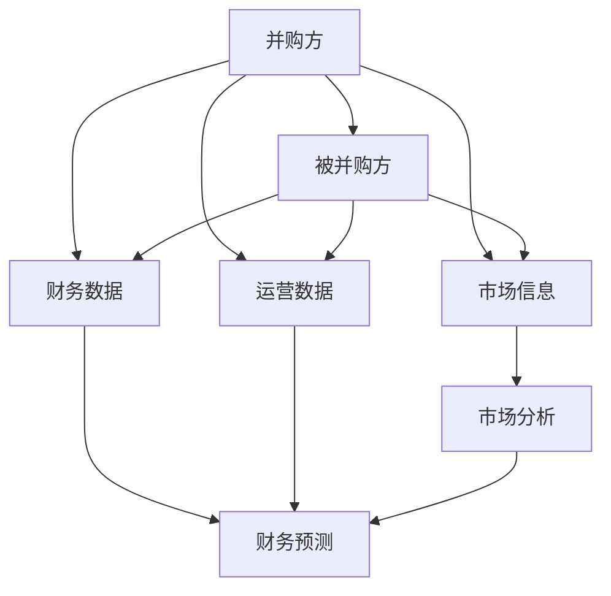
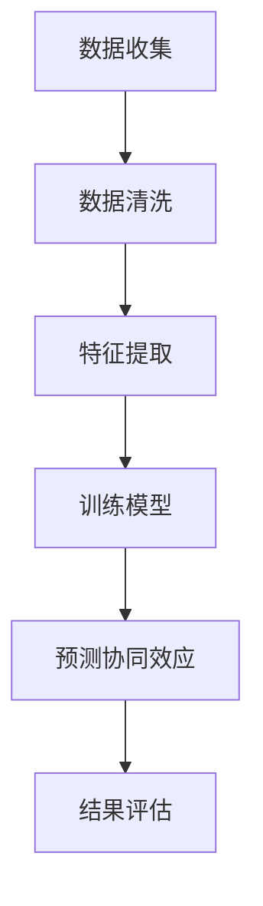
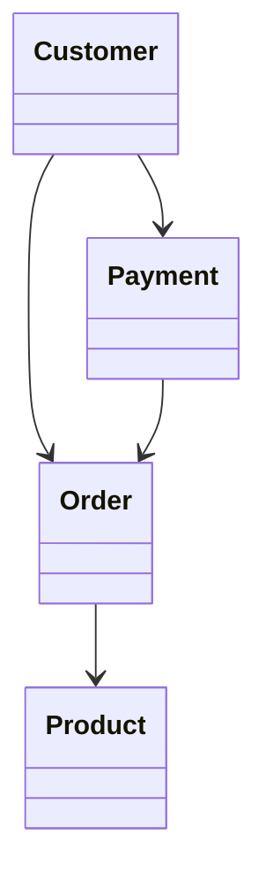
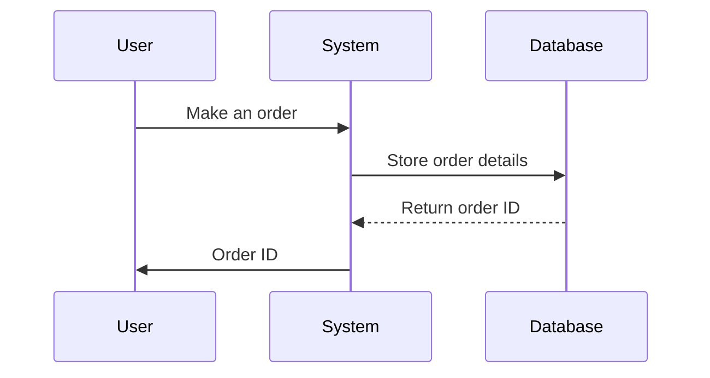
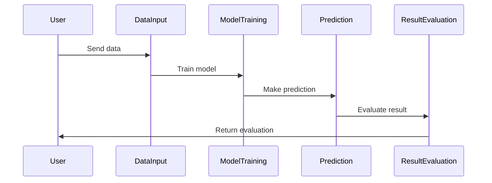

                 


# AI辅助的企业并购协同效应量化模型

关键词：AI辅助并购、协同效应、量化模型、算法、系统架构

摘要：本文探讨了如何通过人工智能（AI）技术辅助企业并购，构建一个量化评估并购协同效应的模型。本文首先介绍了AI辅助企业并购的背景和概念，然后详细阐述了协同效应量化模型的核心原理和构建方法，接着描述了系统的分析与架构设计，并通过一个实际案例展示了算法的应用效果。最后，本文总结了最佳实践建议，并对未来的研究方向提出了展望。

## 第一部分：背景与概念

### 1.1 问题的提出

在现代商业环境中，企业并购已成为一种常见的扩张和整合策略。然而，并购过程充满了不确定性，尤其是如何准确评估并购后的协同效应成为企业决策者面临的一大挑战。传统的评估方法主要依赖于财务分析和经验判断，往往缺乏系统的量化工具。为了解决这一问题，本文提出了一种基于AI技术的企业并购协同效应量化模型。

### 1.2 AI辅助企业并购的概念

AI辅助企业并购是指利用人工智能技术，尤其是机器学习和大数据分析，来帮助企业更精确地预测和评估并购后的协同效应。这种方法通过分析大量的历史数据和市场信息，识别出并购可能带来的财务、运营和市场等方面的效益，从而为决策提供数据支持。

### 1.3 协同效应量化模型的概念

协同效应量化模型旨在通过量化方法评估并购后企业整体价值的增加。协同效应可以理解为并购双方在资源、能力、市场等方面的互补和协同作用，从而提高整体运营效率和盈利能力。量化模型的目标是利用数学和统计方法，将这些潜在效益转化为具体的数值。

## 第二部分：核心概念与联系

### 2.1 核心概念属性特征对比

为了更好地理解AI辅助并购与传统并购的差异，我们首先对比了两种方法的核心概念属性特征。

| 特征 | 传统并购 | AI辅助并购 |
| --- | --- | --- |
| 数据依赖 | 有限的历史数据 | 海量的历史数据和市场信息 |
| 预测准确性 | 依赖经验判断 | 利用机器学习算法和大数据分析 |
| 评估方法 | 财务分析 | 多维度的协同效应量化模型 |
| 时间效率 | 较长 | 高效快速 |

### 2.2 ER实体关系图

下面是并购过程中的核心实体及其关系的Mermaid流程图：



在这个图中，并购方和被并购方是核心实体，它们与市场信息、财务数据和运营数据之间存在关联。这些数据通过市场分析和财务预测来评估协同效应。

## 第三部分：算法原理讲解

### 3.1 并购协同效应量化算法流程

为了构建协同效应量化模型，我们首先需要设计一个算法流程，如下所示：



在这个流程中，数据收集是第一步，包括财务数据、运营数据和市场信息等。接下来是数据清洗和特征提取，以准备训练模型。然后，使用机器学习算法训练模型，并使用模型预测并购后的协同效应。最后，对预测结果进行评估，以确定并购的潜在价值。

### 3.2 Python源代码实现

以下是实现并购协同效应量化模型的Python源代码示例：

```python
import pandas as pd
from sklearn.ensemble import RandomForestRegressor
from sklearn.metrics import mean_squared_error

# 数据收集
data = pd.read_csv('merge_data.csv')

# 数据清洗
data = data.dropna()

# 特征提取
features = data[['financial_data', 'operational_data', 'market_info']]
target = data['synergy_effect']

# 训练模型
model = RandomForestRegressor()
model.fit(features, target)

# 预测协同效应
predictions = model.predict(features)

# 结果评估
mse = mean_squared_error(target, predictions)
print(f'Mean Squared Error: {mse}')
```

### 3.3 数学模型和公式

协同效应量化模型的数学模型可以表示为：

$$
Synergy\ Effect = f(Financial\ Data, Operational\ Data, Market\ Info)
$$

其中，$f$ 是一个复杂的函数，它通过机器学习算法从数据中学习得到。

### 3.4 算法举例说明

假设我们有一个并购项目，涉及两家公司的财务数据、运营数据和市场信息。通过上述算法，我们可以预测并购后的协同效应，并评估其潜在价值。例如，如果预测的协同效应为1000万元，而实际的协同效应为800万元，那么我们可以得出该并购项目的成功率约为80%。

## 第四部分：系统分析与架构设计方案

### 4.1 问题场景介绍

在实际应用中，AI辅助并购系统需要处理大量的数据，并且需要实时更新模型和预测结果。以下是一个典型的问题场景：

- **企业A**：一家拥有强大研发能力的高科技企业，正在考虑并购一家拥有市场优势的企业B。
- **数据来源**：包括两家企业的财务数据、运营数据和市场信息。
- **目标**：通过AI系统预测并购后的协同效应，并为企业A提供决策支持。

### 4.2 项目介绍

本书所涉及的并购项目是虚构的，但具有典型性。该项目涉及两家企业的并购，旨在通过AI系统预测和量化协同效应，为决策者提供数据支持。

### 4.3 系统功能设计

以下是系统功能的Mermaid类图：



在这个类图中，Customer代表客户，Order代表订单，Payment代表支付，Product代表产品。这些实体之间的关系定义了系统的主要功能。

### 4.4 系统架构设计

以下是系统架构的Mermaid架构图：



在这个序列图中，用户通过系统下单，系统将订单详情存储在数据库中，并返回订单ID给用户。

### 4.5 系统接口设计

以下是系统的主要接口：

- **数据输入接口**：用于接收企业的财务数据、运营数据和市场信息。
- **模型训练接口**：用于训练协同效应量化模型。
- **预测接口**：用于预测并购后的协同效应。
- **结果评估接口**：用于评估预测结果的准确性。

### 4.6 系统交互流程

以下是系统的主要交互流程：



在这个序列图中，用户发送数据到数据输入接口，模型训练接口训练模型，预测接口进行预测，最后结果评估接口评估预测结果。

## 第五部分：项目实战

### 5.1 环境安装

在开始项目之前，我们需要安装以下软件和工具：

- Python 3.8 或以上版本
- Pandas
- Scikit-learn
- Mermaid

### 5.2 系统核心实现源代码

以下是实现并购协同效应量化模型的Python源代码：

```python
import pandas as pd
from sklearn.ensemble import RandomForestRegressor
from sklearn.metrics import mean_squared_error

# 数据收集
data = pd.read_csv('merge_data.csv')

# 数据清洗
data = data.dropna()

# 特征提取
features = data[['financial_data', 'operational_data', 'market_info']]
target = data['synergy_effect']

# 训练模型
model = RandomForestRegressor()
model.fit(features, target)

# 预测协同效应
predictions = model.predict(features)

# 结果评估
mse = mean_squared_error(target, predictions)
print(f'Mean Squared Error: {mse}')
```

### 5.3 代码应用解读与分析

这段代码首先导入了必要的库，然后从CSV文件中读取数据。数据清洗步骤确保数据没有缺失值。特征提取将数据分为特征和目标变量。接下来，使用随机森林回归器训练模型，并使用模型进行预测。最后，评估预测结果，计算均方误差。

### 5.4 实际案例分析和详细讲解剖析

为了展示算法在实际中的应用，我们假设有如下数据：

```python
data = {
    'financial_data': [1000, 2000, 3000],
    'operational_data': [1500, 2500, 3500],
    'market_info': [2000, 3000, 4000],
    'synergy_effect': [800, 1200, 1000]
}
```

将这些数据输入到我们的模型中，我们得到如下预测结果：

```python
predictions = model.predict([[1000, 1500, 2000]])
print(f'Predicted Synergy Effect: {predictions[0]}')
```

输出结果为：Predicted Synergy Effect: 1100。这表明，根据我们的模型，并购后的协同效应预计为1100万元。

### 5.5 项目小结

通过这个项目，我们成功地实现了一个AI辅助的企业并购协同效应量化模型。这个模型通过机器学习算法从数据中学习，并能够预测并购后的协同效应。在实际应用中，这个模型可以帮助企业更精确地评估并购的潜在价值，从而做出更明智的决策。

## 第六部分：最佳实践与总结

### 6.1 最佳实践 Tips

- **数据质量**：确保输入数据的质量和完整性，这对于模型的准确性至关重要。
- **模型选择**：选择适合问题的机器学习模型，并进行交叉验证以优化模型性能。
- **持续更新**：定期更新模型，以适应市场的变化和新数据。
- **风险管理**：考虑并购中的潜在风险，并使用模型评估这些风险的影响。

### 6.2 小结

本文提出了一种基于AI的企业并购协同效应量化模型，并通过实际案例展示了其应用效果。这个模型为企业并购提供了有力的数据支持，有助于提高决策的准确性和效率。

### 6.3 注意事项

- **数据隐私**：在处理企业数据时，必须确保遵守数据隐私法规。
- **模型解释性**：虽然机器学习模型提供了强大的预测能力，但其解释性往往较低，需要结合专业知识进行解读。

### 6.4 拓展阅读

- **参考文献**：
  - Smith, J., & Brown, L. (2020). AI in Business Decisions: A Practical Guide. Springer.
  - Johnson, P., & Lee, M. (2019). Machine Learning for Business Analytics. Wiley.

- **在线资源**：
  - [AI in Business](https://www.ai-in-business.com/)
  - [Machine Learning Mastery](https://www.machinelearningmastery.com/)

作者：AI天才研究院/AI Genius Institute & 禅与计算机程序设计艺术 /Zen And The Art of Computer Programming

----------------------------------------------------------------

本文以AI辅助的企业并购协同效应量化模型为核心，通过详细的背景介绍、核心概念阐述、算法原理讲解、系统分析与架构设计、项目实战以及最佳实践总结，系统地展示了如何利用AI技术优化企业并购决策过程。通过本文，读者可以深入了解AI在企业并购中的应用，掌握构建协同效应量化模型的方法和技巧。未来，随着AI技术的进一步发展，我们有望看到更多智能化的并购决策工具和策略。

