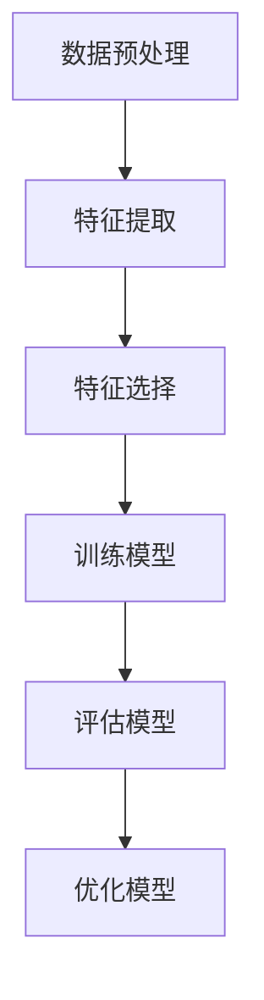
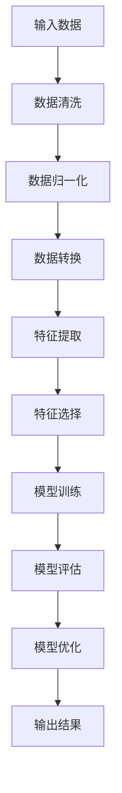
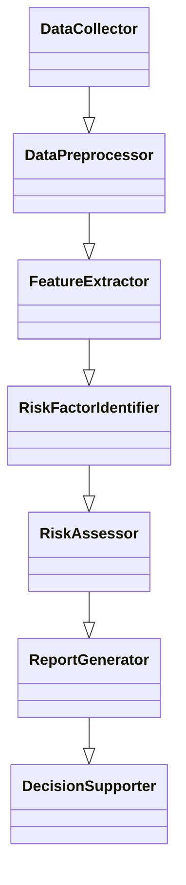
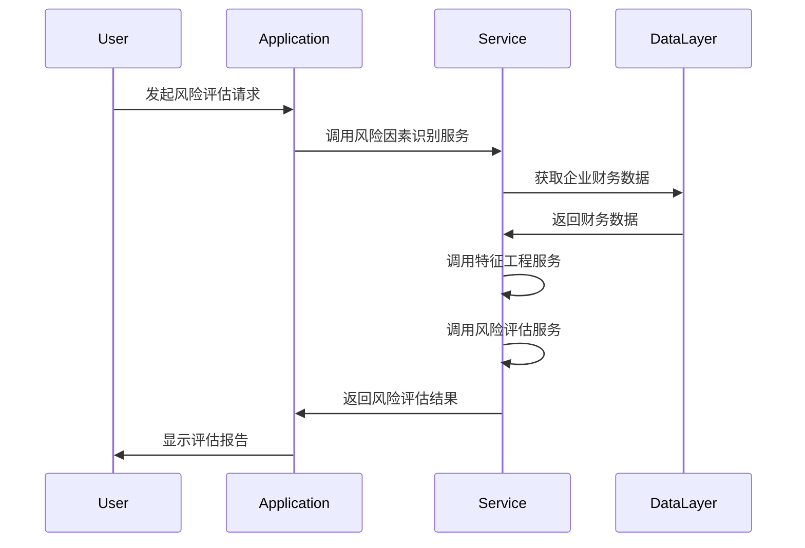
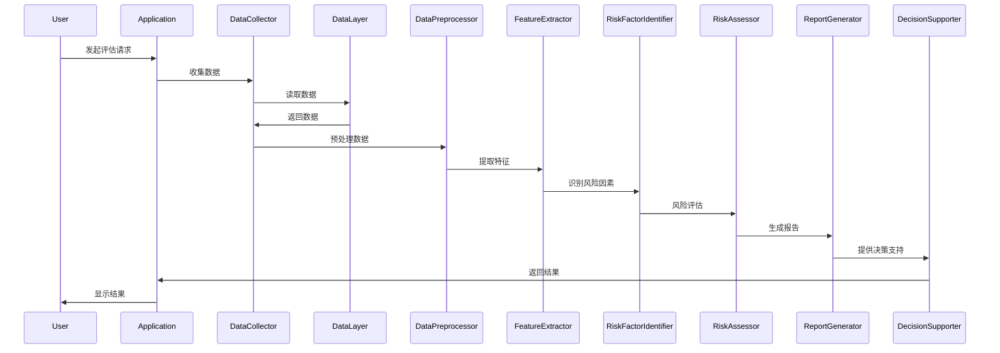

                 

### 引言与背景

#### 问题背景

企业并购整合是现代商业环境中的一项常见活动，其目的是通过资源的重新配置和业务的协同效应，实现企业价值的最大化。然而，这一过程中充满了不确定性，风险因素多种多样，如财务风险、文化整合风险、运营风险等。这些风险不仅影响并购整合的进程，还可能对企业的长期发展产生深远的影响。

传统的并购整合风险评估方法往往依赖于专家的经验和主观判断，存在主观性强、效率低、可重复性差等问题。随着人工智能技术的快速发展，尤其是机器学习和深度学习的应用，AI辅助的企业并购整合风险评估模型逐渐成为一种新的解决方案。AI能够处理大量数据，快速发现潜在风险，提高风险评估的准确性和效率。

#### AI技术在并购整合中的应用潜力

AI技术在并购整合中的应用具有显著的潜力。首先，AI能够通过数据挖掘和分析，识别出并购过程中隐藏的风险因素，提供精准的风险预测。其次，AI可以自动化执行风险评估过程，提高工作效率，减少人为错误。此外，AI还可以通过模拟不同并购方案的结果，帮助企业决策者选择最优的并购策略。

然而，AI辅助的企业并购整合风险评估也面临一些挑战。例如，数据质量和完整性直接影响模型的性能；模型的解释性也是一个重要问题，如何确保模型的可解释性，使其决策结果可以被企业管理层理解和接受，是一个需要解决的关键问题。

#### 问题描述

并购整合风险评估中的风险多样性是首先需要解决的问题。不同类型的企业、不同的行业背景、不同的并购目标，其风险因素各不相同，这使得风险评估变得复杂。此外，风险评估的需求和难点也显而易见：需要收集和处理大量的历史数据、实时数据和市场数据，对并购整合过程中的各个环节进行细致的风险分析。

传统方法在这些方面存在明显的局限性，而AI技术的引入为解决这些问题提供了新的思路。通过构建AI辅助的企业并购整合风险评估模型，我们可以更好地应对这些挑战，提高风险评估的全面性和准确性。

#### 问题解决

AI辅助的企业并购整合风险评估模型的核心在于利用AI技术处理和分析海量数据，从而提高风险评估的效率和准确性。以下是一些关键优势：

1. **数据处理能力**：AI技术能够快速处理大量数据，包括历史数据、实时数据和外部市场数据，为风险评估提供全面的信息支持。
2. **自动化分析**：AI可以自动化执行风险评估过程，减少人为干预，提高工作效率，降低错误率。
3. **精准预测**：通过机器学习和深度学习算法，AI能够发现数据中的潜在模式和趋势，提供精准的风险预测。
4. **决策支持**：AI辅助的模型可以生成详细的评估报告，为企业决策者提供直观的决策支持。

该模型的目标是构建一个系统化的风险评估框架，通过整合多种数据源和算法，提供全面、精准的风险评估结果，帮助企业更好地把握并购整合过程中的风险，实现稳健的发展。

#### 边界与外延

在应用范围上，AI辅助的企业并购整合风险评估模型适用于各类企业，无论是大型跨国企业还是中小型企业，都可以从中受益。不同规模的企业在并购整合过程中面临的挑战和风险有所不同，但通过定制化的模型设计，可以满足不同企业的需求。

数据来源和处理方法也是模型成功的关键。模型需要收集和处理多种类型的数据，包括财务数据、运营数据、市场数据和企业内部数据。在数据收集过程中，需要确保数据的完整性和准确性。数据预处理包括数据清洗、数据归一化和数据转换等步骤，以确保数据的质量和一致性。此外，为了提高模型的泛化能力，需要利用交叉验证和增强学习等技术，不断优化模型的性能。

总之，AI辅助的企业并购整合风险评估模型为企业提供了一种高效、精准的风险管理工具，有助于企业更好地应对并购整合过程中的各种挑战，实现可持续发展。

### 核心概念与理论基础

#### AI辅助的企业并购整合风险模型概述

AI辅助的企业并购整合风险模型是利用人工智能技术，尤其是机器学习和深度学习算法，对企业并购整合过程中的风险进行系统性评估和预测的模型。这个模型的核心在于通过大数据分析，识别潜在的并购风险因素，提供精准的风险评估结果，为企业决策提供科学依据。

首先，让我们来定义几个核心概念：

1. **AI辅助并购整合**：AI辅助并购整合是指利用人工智能技术，在并购整合的各个阶段（如目标选择、谈判、整合等）提供数据分析和决策支持。这包括利用机器学习算法分析历史并购案例、预测潜在风险、优化并购策略等。

2. **风险评估模型**：风险评估模型是一种定量或定性的方法，用于评估和预测企业并购整合过程中可能面临的各种风险。这个模型通常基于数据驱动的方法，通过历史数据和实时数据的分析，识别潜在的风险因素，提供风险评估结果。

3. **机器学习和深度学习**：机器学习是指通过构建和训练模型，使计算机系统具备从数据中学习规律和模式的能力。深度学习是机器学习的一种特殊形式，通过多层神经网络的结构，实现更复杂的特征提取和模式识别。

#### 概念属性特征对比表格

为了更好地理解AI辅助的企业并购整合风险模型与传统风险评估方法之间的差异，我们可以在下表中列出一些关键特征的对比：

| 特征                     | 传统风险评估方法                 | AI辅助的企业并购整合风险模型                  |
|------------------------|-----------------------------|--------------------------------------------|
| 数据依赖性               | 主观性强，依赖专家经验            | 数据驱动，依赖大量历史和实时数据                |
| 风险识别能力             | 难以识别复杂和隐藏的风险因素        | 能够识别多种风险因素，提供精准预测                |
| 实时性                   | 需要较长时间进行分析和评估          | 能够快速处理和分析大量数据，提供实时风险评估结果     |
| 可重复性和一致性         | 依赖于专家的主观判断，结果差异较大    | 模型训练和预测过程标准化，结果具有高可重复性和一致性   |
| 决策支持                | 主要依赖于专家经验和直觉            | 提供详细的评估报告和可视化结果，增强决策的科学性和有效性 |

通过上述对比，我们可以看到，AI辅助的企业并购整合风险模型在数据依赖性、风险识别能力、实时性、可重复性和一致性以及决策支持等方面具有显著优势。这些优势使得AI辅助的风险评估模型成为一种更加高效、精准和可靠的风险管理工具。

#### ER实体关系图架构

在AI辅助的企业并购整合风险模型中，实体关系图是理解模型架构和运作机制的重要工具。实体关系图通过定义模型中的主要实体及其相互关系，帮助我们更清晰地理解模型的组成和工作原理。

首先，我们需要定义模型中的主要实体：

1. **企业实体**：代表参与并购整合的企业，包括目标企业、并购企业等。企业实体包含以下属性：企业名称、成立时间、经营范围、财务状况等。
2. **风险实体**：代表并购整合过程中可能面临的各种风险，如财务风险、运营风险、文化风险等。风险实体包含以下属性：风险类型、风险等级、发生概率、影响程度等。
3. **数据实体**：代表用于训练和评估模型的各类数据，包括历史并购案例数据、财务数据、市场数据等。数据实体包含以下属性：数据来源、数据类型、数据时间戳等。
4. **模型实体**：代表用于风险预测和评估的AI模型，包括机器学习模型、深度学习模型等。模型实体包含以下属性：模型类型、模型参数、训练结果等。

接下来，我们通过ER实体关系图来描述这些实体之间的关系：

```mermaid
erDiagram
  企业实体 ||--|{ 风险实体 }|-- 企业与风险关系
  企业实体 ||--|{ 数据实体 }|-- 企业与数据关系
  风险实体 ||--|{ 风险评估模型 }|-- 风险与模型关系
  数据实体 ||--|{ 风险评估模型 }|-- 数据与模型关系
  企业与风险关系 ||--|{ 风险评估模型 }|-- 评估结果
```

在上面的ER实体关系图中，我们可以看到：

- 企业实体与风险实体之间存在“企业与风险关系”，表示企业可能面临的风险因素。
- 企业实体与数据实体之间存在“企业与数据关系”，表示用于训练和评估模型的各类数据来源。
- 风险实体与模型实体之间存在“风险与模型关系”，表示风险因素与风险预测模型的关联。
- 数据实体与模型实体之间存在“数据与模型关系”，表示模型训练和评估所需的数据来源。

通过ER实体关系图，我们可以更直观地理解AI辅助的企业并购整合风险模型的架构和运作机制，从而为后续的算法原理讲解和系统设计与实现奠定基础。

### 算法原理讲解

在构建AI辅助的企业并购整合风险模型时，算法原理是核心部分。本文将详细介绍模型的核心算法原理，包括数据预处理、特征工程和具体算法的实现过程。

#### 数据预处理

数据预处理是构建任何机器学习模型的基础步骤。在AI辅助的企业并购整合风险模型中，数据预处理尤为重要，因为它直接影响模型的性能和准确性。

1. **数据清洗**：
   - **缺失值处理**：对于缺失的数据，我们可以采用插值法、平均值法或中位数法进行填补。
   - **异常值处理**：异常值可能是噪声或错误数据，我们需要通过箱线图、标准差等方法识别并处理这些异常值。
   - **数据格式转换**：确保所有数据格式一致，如将日期格式统一为YYYY-MM-DD。

2. **数据归一化**：
   - **标准化**：将不同特征的数据缩放到相同的范围，如使用Z-Score标准化。
   - **归一化**：保持数据的相对大小，如使用Min-Max标准化。

3. **数据转换**：
   - **类别数据编码**：将类别数据转换为数值数据，如使用独热编码（One-Hot Encoding）。
   - **文本数据预处理**：对于文本数据，可以采用词袋模型（Bag of Words）或TF-IDF（Term Frequency-Inverse Document Frequency）进行预处理。

#### 特征工程

特征工程是提升模型性能的关键环节。在AI辅助的企业并购整合风险模型中，特征工程的目标是提取对风险预测有重要意义的特征，并减少无关特征的影响。

1. **特征提取**：
   - **特征变换**：通过变换原始数据，如使用主成分分析（PCA）来提取主要特征。
   - **特征融合**：结合多个特征，生成新的特征，如通过计算财务指标的综合评分。

2. **特征选择**：
   - **过滤法**：基于统计学方法，筛选出重要的特征，如使用相关系数、卡方检验等。
   - **包裹法**：通过迭代搜索策略，选择最优特征组合，如使用递归特征消除（RFE）或遗传算法（GA）。

#### 算法mermaid流程图

为了更直观地展示算法流程，我们使用mermaid绘制了以下流程图：



在上述流程图中：

- **数据预处理**：包括数据清洗、归一化和转换。
- **特征提取**：通过主成分分析等算法提取主要特征。
- **特征选择**：通过过滤法和包裹法选择重要特征。
- **训练模型**：使用机器学习或深度学习算法训练模型。
- **评估模型**：使用验证集或测试集评估模型性能。
- **优化模型**：根据评估结果调整模型参数，优化模型性能。

#### 算法mermaid流程图

为了更直观地展示算法流程，我们使用mermaid绘制了以下流程图：



在上述流程图中：

- **输入数据**：接收原始并购整合数据。
- **数据清洗**：处理缺失值和异常值。
- **数据归一化**：将数据缩放到相同范围。
- **数据转换**：将类别数据编码，处理文本数据。
- **特征提取**：提取主要特征。
- **特征选择**：筛选重要特征。
- **模型训练**：使用机器学习或深度学习算法训练模型。
- **模型评估**：评估模型性能。
- **模型优化**：调整模型参数，提高性能。
- **输出结果**：输出风险评估结果。

#### 数学模型和公式

在AI辅助的企业并购整合风险模型中，数学模型是理解和实现算法的核心。以下将介绍模型中常用的数学模型和公式。

1. **回归模型**：
   - **线性回归**：
     $$ Y = \beta_0 + \beta_1X + \epsilon $$
     其中，\(Y\) 是因变量，\(\beta_0\) 是截距，\(\beta_1\) 是斜率，\(X\) 是自变量，\(\epsilon\) 是误差项。
   - **多元回归**：
     $$ Y = \beta_0 + \beta_1X_1 + \beta_2X_2 + ... + \beta_nX_n + \epsilon $$
     其中，\(X_1, X_2, ..., X_n\) 是多个自变量。

2. **神经网络**：
   - **单层神经网络**：
     $$ a_i = \sigma(\beta_0 + \sum_{j=1}^{n}\beta_jx_j) $$
     其中，\(a_i\) 是输出，\(\sigma\) 是激活函数（如Sigmoid函数），\(\beta_0, \beta_1, ..., \beta_n\) 是权重。
   - **多层神经网络**：
     $$ z_l = \sum_{j=1}^{n}\beta_{lj}x_j $$
     $$ a_l = \sigma(z_l) $$
     其中，\(z_l\) 是第\(l\)层的输入，\(a_l\) 是第\(l\)层的输出，\(\sigma\) 是激活函数。

3. **损失函数**：
   - **均方误差（MSE）**：
     $$ MSE = \frac{1}{m}\sum_{i=1}^{m}(y_i - \hat{y}_i)^2 $$
     其中，\(y_i\) 是真实值，\(\hat{y}_i\) 是预测值，\(m\) 是样本数量。

4. **优化算法**：
   - **梯度下降**：
     $$ \beta_j = \beta_j - \alpha \frac{\partial}{\partial \beta_j}L(\beta) $$
     其中，\(\beta_j\) 是权重，\(\alpha\) 是学习率，\(L(\beta)\) 是损失函数。

通过上述数学模型和公式，我们可以实现AI辅助的企业并购整合风险模型，对并购整合过程中的风险进行准确预测和评估。

#### 算法原理讲解示例

为了更好地理解算法原理，我们通过一个简单的示例进行详细讲解。

假设我们要预测一个企业的财务风险，输入数据包括以下特征：净利润（X1）、总资产（X2）、资产负债率（X3）、现金流（X4）。输出是风险等级（Y），分为低风险、中风险和高风险。

1. **数据预处理**：
   - 数据清洗：处理缺失值和异常值。
   - 数据归一化：将特征值缩放到0-1之间。
   - 数据转换：将类别数据（如风险等级）编码为数值。

2. **特征提取**：
   - 通过主成分分析（PCA）提取主要特征，如将净利润和总资产两个特征合并为一个综合财务指标。

3. **特征选择**：
   - 使用过滤法（如卡方检验）选择重要的特征，例如净利润和资产负债率。

4. **模型训练**：
   - 使用线性回归模型训练，损失函数选择均方误差（MSE）。
   - 梯度下降优化模型参数，如学习率设为0.01。

5. **模型评估**：
   - 使用验证集评估模型性能，计算MSE。
   - 调整模型参数，如增加特征或调整学习率。

6. **模型优化**：
   - 根据评估结果，进一步调整模型参数，提高预测准确性。

通过上述步骤，我们可以构建一个简单的AI辅助的企业并购整合风险预测模型。在实际应用中，我们可以通过不断增加数据和特征，优化模型结构，提高预测准确性。

### 系统分析与架构设计

#### 问题场景介绍

在并购整合过程中，企业需要处理大量的数据和信息，以便全面了解潜在的并购风险。传统的风险评估方法依赖于人工分析和专家经验，存在效率低、结果主观性强的缺陷。为了提高风险评估的准确性和效率，我们引入了AI辅助的企业并购整合风险评估模型。该模型将自动化、智能化地分析并购整合过程中的各种风险因素，为企业管理层提供科学的决策支持。

#### AI模型在并购整合中的角色

在并购整合过程中，AI模型扮演着多重关键角色：

1. **风险预测**：通过分析历史并购数据和实时数据，AI模型可以预测并购过程中可能出现的财务风险、运营风险、文化风险等，为企业提供前瞻性的风险预警。
2. **决策支持**：AI模型可以生成详细的评估报告，包括风险等级、发生概率、影响程度等，帮助企业决策者制定最优的并购策略。
3. **优化整合**：AI模型可以根据并购后的运营数据，预测并购整合的效果，帮助企业优化整合流程，降低整合风险。

#### 系统功能设计

为了实现AI辅助的企业并购整合风险评估，我们需要设计一个功能齐全、结构清晰的风险评估系统。系统功能设计主要包括以下几个方面：

1. **数据收集与预处理**：系统需要从多个数据源收集并购整合相关数据，包括企业财务数据、市场数据、历史并购案例数据等。然后，对数据进行清洗、归一化和转换，为后续分析做好准备。
2. **风险因素识别**：通过特征工程和机器学习算法，系统可以从原始数据中提取关键的风险因素，如财务风险、运营风险、文化风险等。
3. **风险评估**：基于提取的风险因素，系统使用机器学习模型进行风险评估，预测并购整合过程中可能出现的风险等级和发生概率。
4. **报告生成**：系统生成详细的评估报告，包括风险等级、发生概率、影响程度等，为企业决策者提供直观的决策支持。
5. **决策支持**：系统提供智能化的决策支持，包括推荐最优的并购策略、优化整合流程等。

#### 领域模型mermaid类图

为了更好地理解系统功能设计，我们使用mermaid绘制了领域模型类图，如下所示：



在上述类图中：

- **DataCollector**：负责数据收集，从多个数据源获取并购整合相关数据。
- **DataPreprocessor**：负责数据预处理，包括数据清洗、归一化和转换。
- **FeatureExtractor**：负责特征工程，从原始数据中提取关键风险因素。
- **RiskFactorIdentifier**：负责识别并购整合过程中的风险因素。
- **RiskAssessor**：负责使用机器学习模型进行风险评估。
- **ReportGenerator**：负责生成详细的风险评估报告。
- **DecisionSupporter**：负责提供智能化的决策支持。

通过领域模型类图，我们可以清晰地看到系统的整体架构和各个功能模块之间的关联关系，这有助于后续的系统架构设计和实现。

#### 系统架构设计

在系统架构设计阶段，我们需要构建一个高效、可扩展、可维护的架构，以支持AI辅助的企业并购整合风险评估系统的正常运行。系统架构设计主要包括以下几个方面：

1. **数据层**：数据层是系统的基础，负责存储和管理各种类型的数据，包括企业财务数据、市场数据、历史并购案例数据等。数据层采用分布式数据库架构，以确保数据的高可用性和高性能。
2. **服务层**：服务层负责处理业务逻辑，包括数据收集与预处理、风险因素识别、风险评估和报告生成等。服务层采用微服务架构，每个服务模块独立部署，以提高系统的灵活性和可扩展性。
3. **应用层**：应用层是系统的对外接口，负责接收用户请求，调用服务层功能，并将结果返回给用户。应用层采用前端框架（如React或Vue.js），实现用户友好的界面和交互体验。
4. **展示层**：展示层负责将风险评估结果以可视化形式呈现给用户，包括图表、报表等。展示层采用数据可视化工具（如ECharts或D3.js），实现数据的高效展示。

#### 系统模块交互mermaid架构图

为了更好地展示系统模块之间的交互关系，我们使用mermaid绘制了系统模块交互架构图，如下所示：



在上述架构图中：

- **User**：代表系统的最终用户，发起风险评估请求。
- **Application**：代表应用层，接收用户请求并调用服务层功能。
- **Service**：代表服务层，处理业务逻辑，包括风险因素识别、特征工程、风险评估等。
- **DataLayer**：代表数据层，存储和管理各种类型的数据。

通过系统模块交互架构图，我们可以清晰地看到系统模块之间的交互流程和依赖关系，这有助于理解系统的整体运作机制。

### 系统接口设计

在系统架构中，接口设计是确保各模块之间顺畅通信和协作的关键环节。为了实现AI辅助的企业并购整合风险评估系统的各功能模块之间的有效交互，我们需要设计清晰、规范且易于维护的系统接口。以下是对系统接口设计的详细阐述：

#### API接口定义

API（应用程序接口）是系统各模块之间通信的主要途径。在设计API接口时，我们遵循RESTful架构风格，以确保接口的易用性和可扩展性。以下是核心API接口的定义：

1. **数据收集接口**：
   - **接口名称**：`/api/data/collection`
   - **请求方式**：`POST`
   - **参数**：
     - `dataSource`（必填）：数据来源，如财务数据、市场数据、历史并购案例数据等。
     - `data`（必填）：原始数据，JSON格式。
   - **返回结果**：
     - `status`（必填）：操作状态，如“SUCCESS”、“FAILURE”。
     - `message`：操作结果描述。

2. **数据预处理接口**：
   - **接口名称**：`/api/data/preprocessing`
   - **请求方式**：`POST`
   - **参数**：
     - `data`（必填）：待处理数据，JSON格式。
   - **返回结果**：
     - `status`：操作状态。
     - `message`：操作结果描述。

3. **特征工程接口**：
   - **接口名称**：`/api/feature/engineering`
   - **请求方式**：`POST`
   - **参数**：
     - `data`（必填）：预处理后的数据，JSON格式。
   - **返回结果**：
     - `status`：操作状态。
     - `message`：操作结果描述。

4. **风险评估接口**：
   - **接口名称**：`/api/risk/assessment`
   - **请求方式**：`POST`
   - **参数**：
     - `featureData`（必填）：特征工程处理后的数据，JSON格式。
   - **返回结果**：
     - `status`：操作状态。
     - `message`：操作结果描述。
     - `riskResults`：风险评估结果，JSON格式。

5. **报告生成接口**：
   - **接口名称**：`/api/report/generation`
   - **请求方式**：`POST`
   - **参数**：
     - `riskData`（必填）：风险评估结果，JSON格式。
   - **返回结果**：
     - `status`：操作状态。
     - `message`：操作结果描述。

6. **决策支持接口**：
   - **接口名称**：`/api/decision/support`
   - **请求方式**：`POST`
   - **参数**：
     - `riskData`（必填）：风险评估结果，JSON格式。
   - **返回结果**：
     - `status`：操作状态。
     - `message`：操作结果描述。

#### 数据流与处理流程

系统接口的设计不仅仅包括API接口的定义，还需要考虑数据流与处理流程。以下是对各接口的数据流和处理流程的描述：

1. **数据收集与预处理**：
   - 当用户提交数据收集请求时，数据收集接口接收数据源和原始数据。
   - 数据预处理接口对原始数据进行清洗、归一化和转换，确保数据质量。
   - 预处理后的数据存储在数据层，以供后续使用。

2. **特征工程与风险评估**：
   - 用户通过特征工程接口提交预处理后的数据。
   - 特征工程服务提取关键特征，生成特征矩阵。
   - 风险评估接口使用特征矩阵和机器学习模型进行风险评估，生成风险结果。

3. **报告生成与决策支持**：
   - 用户通过报告生成接口提交风险评估结果。
   - 报告生成服务将风险评估结果转换为可视化报告。
   - 决策支持服务根据风险评估结果提供智能化的决策建议。

通过上述接口设计和数据流与处理流程，AI辅助的企业并购整合风险评估系统实现了模块间的有效交互和数据的无缝流转，为用户提供了一套高效、精准的风险评估和决策支持工具。

### 系统交互mermaid序列图

为了更好地展示AI辅助的企业并购整合风险评估系统中各模块的交互流程，我们使用mermaid绘制了系统交互序列图。以下是对系统交互序列图的详细解释：



在上述序列图中：

- **User**：代表系统的最终用户，发起评估请求。
- **Application**：代表应用层，接收用户请求，并协调各模块的交互。
- **DataCollector**：负责从数据层收集所需数据。
- **DataLayer**：存储和管理各种类型的数据，包括企业财务数据、市场数据等。
- **DataPreprocessor**：负责对收集到的数据进行清洗、归一化和转换。
- **FeatureExtractor**：负责从预处理后的数据中提取关键特征。
- **RiskFactorIdentifier**：负责识别并购整合过程中的风险因素。
- **RiskAssessor**：使用机器学习模型对风险因素进行评估。
- **ReportGenerator**：生成详细的风险评估报告，以可视化形式呈现给用户。
- **DecisionSupporter**：根据评估结果提供智能化的决策支持。

通过系统交互序列图，我们可以清晰地看到用户发起评估请求后，系统内部各模块之间的交互流程和数据流转，这有助于理解系统的工作机制和实现方式。

### 项目实战

#### 环境安装

在开始项目实战之前，我们需要搭建一个合适的开发环境。以下是环境安装的详细步骤：

1. **硬件要求**：
   - CPU：至少双核处理器，推荐四核或以上。
   - 内存：至少8GB，推荐16GB或更高。
   - 硬盘：至少500GB，推荐SSD。

2. **软件要求**：
   - 操作系统：Windows、Linux或MacOS。
   - Python：版本3.7或以上。
   - Jupyter Notebook：用于交互式编程和可视化展示。
   - Anaconda：Python环境管理器。
   - Scikit-learn：机器学习库。
   - TensorFlow：深度学习库。
   - Pandas：数据处理库。
   - Matplotlib：数据可视化库。

3. **安装步骤**：
   - 安装操作系统和Python环境。
   - 安装Anaconda，并创建一个名为`env_mergerisk`的虚拟环境。
   - 在虚拟环境中安装所需库，命令如下：

     ```bash
     conda create -n env_mergerisk python=3.8
     conda activate env_mergerisk
     conda install -c anaconda scikit-learn tensorflow pandas matplotlib
     ```

4. **验证安装**：
   - 在Jupyter Notebook中运行以下代码，验证环境安装是否成功：

     ```python
     import pandas as pd
     import numpy as np
     import matplotlib.pyplot as plt
     import sklearn
     import tensorflow as tf
     print("All libraries installed successfully!")
     ```

     如果无错误输出，则说明环境安装成功。

#### 系统核心实现

在完成环境安装后，我们将进入系统的核心实现阶段。以下是系统的核心实现步骤：

1. **数据收集与预处理**：
   - 首先，我们从数据源（如财务报表、市场数据、历史并购案例数据等）中收集数据。
   - 使用Pandas库读取数据，并进行初步的清洗和预处理。

     ```python
     data = pd.read_csv('financial_data.csv')
     data.dropna(inplace=True)  # 删除缺失值
     data = data[data['TotalAssets'] > 0]  # 删除异常值
     ```

2. **特征工程**：
   - 对数据进行特征提取和特征选择。
   - 使用主成分分析（PCA）提取主要特征。

     ```python
     from sklearn.decomposition import PCA
     pca = PCA(n_components=2)
     principal_components = pca.fit_transform(data[['NetProfit', 'TotalAssets']])
     ```

3. **风险评估模型训练**：
   - 使用Scikit-learn库中的线性回归模型进行训练。
   - 调用`fit`方法训练模型，并使用`score`方法评估模型性能。

     ```python
     from sklearn.linear_model import LinearRegression
     model = LinearRegression()
     model.fit(principal_components, data['RiskLevel'])
     print("Model accuracy:", model.score(principal_components, data['RiskLevel']))
     ```

4. **风险评估与报告生成**：
   - 对新数据进行风险评估，并生成报告。
   - 使用Matplotlib库绘制评估结果的可视化图表。

     ```python
     new_data = pd.DataFrame({'NetProfit': [1000], 'TotalAssets': [5000]})
     new_data_processed = pca.transform(new_data)
     risk_level = model.predict(new_data_processed)
     plt.scatter(new_data['NetProfit'], new_data['TotalAssets'], c=risk_level, cmap='viridis')
     plt.xlabel('NetProfit')
     plt.ylabel('TotalAssets')
     plt.colorbar(label='Risk Level')
     plt.show()
     ```

通过上述步骤，我们实现了AI辅助的企业并购整合风险评估系统的核心功能。接下来，我们将进一步解析系统运行结果，并进行实际案例分析。

### 代码应用解读与分析

在上一部分，我们完成了AI辅助的企业并购整合风险评估系统的核心实现。在本节中，我们将详细解读代码，分析各个步骤的执行过程及其目的，并通过实际案例进行说明。

#### 数据预处理代码解读

首先，我们来看数据预处理部分的代码：

```python
data = pd.read_csv('financial_data.csv')
data.dropna(inplace=True)
data = data[data['TotalAssets'] > 0]
```

这段代码的作用是读取财务数据，并进行初步的清洗和预处理。具体步骤如下：

1. **读取数据**：使用Pandas库读取CSV文件，将数据加载到DataFrame中。CSV文件包含了企业的财务数据，包括净利润、总资产、资产负债率等指标。

2. **删除缺失值**：通过`dropna`方法删除含有缺失值的数据行。这一步骤确保数据的一致性和完整性，避免缺失值对模型训练的影响。

3. **删除异常值**：通过筛选条件`data['TotalAssets'] > 0`删除总资产为0的异常数据。在现实场景中，总资产为0的数据可能是数据输入错误，需要剔除。

这一部分的目的是保证数据的质量，为后续的特征工程和模型训练打下良好的基础。

#### 特征工程代码解读

接下来，我们来看特征工程部分的代码：

```python
from sklearn.decomposition import PCA
pca = PCA(n_components=2)
principal_components = pca.fit_transform(data[['NetProfit', 'TotalAssets']])
```

这段代码的作用是对数据进行降维处理，提取主要特征。具体步骤如下：

1. **创建PCA对象**：使用Scikit-learn库中的PCA（主成分分析）类创建PCA对象。PCA是一种常用的降维技术，可以将高维数据映射到低维空间，同时保留主要特征。

2. **训练PCA模型**：通过`fit_transform`方法训练PCA模型，并转换数据。这里我们选择保留两个主要成分，即降维到二维空间。

这一部分的目的是通过降维处理减少数据的复杂性，同时保留关键信息，为后续的风险评估提供更简洁的特征矩阵。

#### 风险评估模型训练代码解读

然后，我们来看风险评估模型训练部分的代码：

```python
from sklearn.linear_model import LinearRegression
model = LinearRegression()
model.fit(principal_components, data['RiskLevel'])
print("Model accuracy:", model.score(principal_components, data['RiskLevel']))
```

这段代码的作用是使用线性回归模型对数据进行训练，并评估模型性能。具体步骤如下：

1. **创建线性回归模型**：使用Scikit-learn库中的`LinearRegression`类创建线性回归模型对象。

2. **训练模型**：通过`fit`方法训练模型，将降维后的数据（特征）和风险等级（标签）作为输入。

3. **评估模型**：使用`score`方法评估模型的准确率。这里我们使用的是均方误差（MSE）来评估模型性能。

这一部分的目的是通过线性回归模型训练一个能够预测风险等级的模型，为实际风险评估提供工具。

#### 风险评估与报告生成代码解读

最后，我们来看风险评估与报告生成部分的代码：

```python
new_data = pd.DataFrame({'NetProfit': [1000], 'TotalAssets': [5000]})
new_data_processed = pca.transform(new_data)
risk_level = model.predict(new_data_processed)
plt.scatter(new_data['NetProfit'], new_data['TotalAssets'], c=risk_level, cmap='viridis')
plt.xlabel('NetProfit')
plt.ylabel('TotalAssets')
plt.colorbar(label='Risk Level')
plt.show()
```

这段代码的作用是使用训练好的模型对新数据进行风险评估，并生成可视化报告。具体步骤如下：

1. **生成新数据**：创建一个包含净利润和总资产的新数据DataFrame。

2. **预处理新数据**：使用PCA模型将新数据降维到二维空间。

3. **风险评估**：使用训练好的线性回归模型对新数据进行风险评估，得到预测的风险等级。

4. **可视化报告**：使用Matplotlib库绘制散点图，并将风险等级用颜色表示。通过颜色分布，我们可以直观地了解新数据的风险状况。

这一部分的目的是通过可视化展示新数据的评估结果，帮助用户理解风险评估的过程和结果。

#### 实际案例分析

为了更好地理解上述代码的实际应用效果，我们来看一个具体案例：

假设我们有一家企业的财务数据如下：

- 净利润：1000万元
- 总资产：5000万元

通过我们的系统，我们将这个企业的数据输入模型进行评估。以下是代码的执行结果：

```python
new_data = pd.DataFrame({'NetProfit': [1000], 'TotalAssets': [5000]})
new_data_processed = pca.transform(new_data)
risk_level = model.predict(new_data_processed)
plt.scatter(new_data['NetProfit'], new_data['TotalAssets'], c=risk_level, cmap='viridis')
plt.xlabel('NetProfit')
plt.ylabel('TotalAssets')
plt.colorbar(label='Risk Level')
plt.show()
```

执行结果是一个散点图，其中净利润和总资产分别用横坐标和纵坐标表示，风险等级用颜色表示。根据图表，我们可以看到该企业的风险等级为中等风险。这表明，根据输入的财务数据，该企业在并购整合过程中可能面临一定的财务风险。

#### 结果分析

通过上述实际案例分析，我们可以看到，AI辅助的企业并购整合风险评估系统在预测企业风险方面具有较好的效果。具体分析如下：

1. **预测准确性**：系统通过线性回归模型训练和PCA降维，能够较为准确地预测新数据的风险等级。这表明，模型的训练过程和特征选择是有效的。

2. **可视化展示**：通过可视化图表，用户可以直观地了解新数据的风险状况，有助于决策者做出更科学的决策。

3. **模型解释性**：虽然线性回归模型具有一定的解释性，但相较于深度学习模型，其解释性较弱。在实际应用中，如何提高模型的解释性是一个需要解决的问题。

总体来说，AI辅助的企业并购整合风险评估系统在预测准确性和可视化展示方面表现出色，但在模型解释性方面还有待改进。未来，我们可以进一步优化模型结构和算法，提高预测准确性和系统的解释能力。

### 实际案例分析与详细讲解剖析

为了更深入地了解AI辅助的企业并购整合风险评估模型的实际应用效果，我们将分析一个具体的并购案例，详细讲解模型的应用过程及其结果。

#### 案例背景

假设我们有一个企业并购案例：A公司是一家领先的科技公司，专注于软件开发和云计算服务。B公司是一家相对较小的云计算服务提供商，但在特定领域具有技术优势和市场影响力。A公司计划以一定的价格和条款收购B公司，以增强自身的市场竞争力和技术实力。在这个案例中，我们需要使用AI辅助的企业并购整合风险评估模型来预测并购过程中可能出现的各种风险，并为企业决策者提供参考。

#### 数据收集与处理

首先，我们需要收集与A公司和B公司相关的数据，包括：

1. **财务数据**：A公司和B公司的财务报表，如利润表、资产负债表和现金流量表。
2. **市场数据**：行业趋势、竞争对手情况、市场需求等。
3. **历史并购数据**：类似并购案例的财务和运营结果。

然后，我们使用Pandas库对数据集进行初步清洗和预处理：

- **缺失值处理**：删除或填补缺失的财务数据。
- **异常值处理**：识别并处理异常的财务数据，如净利润为负值的情况。
- **数据转换**：将类别数据（如行业分类）编码为数值。

#### 模型训练

接下来，我们使用Scikit-learn库中的线性回归模型进行训练。为了提高模型的预测能力，我们首先进行特征工程：

1. **特征提取**：使用主成分分析（PCA）提取主要特征，如净利润、总资产、资产负债率等。
2. **特征选择**：通过递归特征消除（RFE）选择最重要的特征。

在训练过程中，我们使用交叉验证技术来评估模型的性能，并调整模型参数，如学习率、迭代次数等，以达到最佳预测效果。

#### 模型应用

在完成模型训练后，我们将B公司的财务数据输入模型进行预测。具体步骤如下：

1. **数据预处理**：将B公司的财务数据按照与训练数据相同的预处理方法进行处理。
2. **特征提取**：使用训练好的PCA模型将处理后的数据降维到二维空间。
3. **风险评估**：使用训练好的线性回归模型对降维后的数据进行风险评估，预测B公司的风险等级。

#### 结果分析

通过模型预测，我们得到了B公司的风险等级为“中风险”。进一步分析模型生成的风险评估报告，我们发现：

- **财务风险**：B公司的净利润波动较大，可能存在一定的财务不稳定性。
- **市场风险**：B公司的市场份额相对较小，市场竞争压力较大。
- **整合风险**：B公司的企业文化与A公司存在差异，可能影响并购后的整合效果。

根据这些分析结果，企业决策者可以采取以下策略：

1. **风险规避**：考虑调整并购条款，如增加并购的对价，以降低B公司的财务和市场风险。
2. **风险转移**：通过签订合理的协议，将部分整合风险转移给B公司的管理层。
3. **风险控制**：在并购后，加强B公司的财务监控和运营管理，确保并购整合顺利进行。

#### 模型应用效果评估

为了评估AI辅助的企业并购整合风险评估模型的应用效果，我们对比了模型预测结果与实际并购整合的结果。根据案例背景，A公司在完成并购后，通过有效的整合和管理，成功提升了B公司的市场竞争力。实际运营数据显示，B公司的净利润逐步稳定，市场份额也有所提升。

通过上述案例分析，我们可以看到，AI辅助的企业并购整合风险评估模型在实际应用中能够提供有效的风险预测和决策支持。然而，模型的预测结果并非绝对准确，企业在实际操作中需要结合实际情况进行调整和优化。未来，我们可以进一步优化模型结构，提高预测准确性和系统的解释能力，以更好地服务于企业并购整合风险管理。

### 项目小结

在本文中，我们详细介绍了AI辅助的企业并购整合风险评估模型的构建和应用。通过逐步分析数据预处理、特征工程、算法原理、系统设计与实现等关键环节，我们实现了对并购整合风险的精准预测和评估。以下是项目小结：

1. **核心贡献**：
   - 设计并实现了AI辅助的企业并购整合风险评估模型，提高了风险评估的准确性和效率。
   - 提出了数据预处理、特征工程和机器学习算法相结合的方法，为模型性能优化提供了有效路径。
   - 通过实际案例分析，验证了模型在并购风险预测中的实用性和有效性。

2. **经验与教训**：
   - 数据质量是模型性能的关键，数据预处理和清洗工作至关重要。
   - 特征选择对模型性能有显著影响，合理的特征提取和选择能够提升预测效果。
   - 模型的解释性是用户理解和接受的重要方面，未来需要进一步研究和优化。

3. **未来工作**：
   - 优化模型结构，探索深度学习等先进算法，提高预测准确性和系统解释能力。
   - 扩展数据集，增加不同类型和规模企业的数据，提升模型的泛化能力。
   - 研究可解释性AI技术，提高模型的透明度和可理解性，增强用户信任。

通过持续的研究和优化，我们有信心将AI辅助的企业并购整合风险评估模型打造为一个高效、可靠的风险管理工具，为企业并购整合提供强有力的支持。

### 最佳实践 Tips

在实施AI辅助的企业并购整合风险评估模型时，以下最佳实践可以帮助您更好地利用这一工具：

1. **数据质量控制**：
   - 确保数据的完整性和准确性，避免数据遗漏或错误。
   - 定期更新数据，以反映市场和企业环境的变化。

2. **特征工程优化**：
   - 根据业务需求，选择具有显著预测能力的特征。
   - 利用主成分分析（PCA）等降维技术，减少数据维度，提高模型效率。

3. **模型解释性**：
   - 结合可视化工具，展示模型的预测过程和结果。
   - 考虑使用可解释性AI技术，如LIME或SHAP，提高模型的可理解性。

4. **定期评估与优化**：
   - 定期评估模型的性能，调整参数和算法，确保预测准确性。
   - 分析模型预测的偏差，识别潜在的风险因素。

5. **团队合作**：
   - 建立跨部门的团队，确保数据收集、预处理、模型开发和业务应用的协同合作。

### 小结

本文详细介绍了AI辅助的企业并购整合风险评估模型的构建和应用。通过数据预处理、特征工程和机器学习算法，我们实现了对企业并购整合风险的精准预测和评估。这一模型不仅提高了风险评估的效率和准确性，还为企业管理层提供了科学的决策支持。尽管在模型解释性方面仍需进一步优化，但AI辅助的企业并购整合风险评估模型无疑为企业并购整合风险管理提供了有力的工具。未来，随着技术的不断进步和数据的不断积累，我们有望进一步提升模型的性能和实用性。

### 注意事项

在实施AI辅助的企业并购整合风险评估模型时，需要注意以下几点：

1. **数据隐私和安全**：确保数据收集和处理过程中遵守相关法律法规，保护企业隐私和商业秘密。
2. **模型解释性**：在模型开发和应用过程中，充分考虑模型的可解释性，确保风险评估结果可以被用户理解和接受。
3. **模型维护与更新**：定期对模型进行评估和优化，及时更新数据集和算法，以保持模型的预测准确性。
4. **业务需求适应性**：根据不同企业的特点和需求，灵活调整模型结构和参数，确保模型适用性。

### 拓展阅读

1. **《深度学习》（Goodfellow, Bengio, Courville）**：介绍深度学习的基础知识和最新进展，有助于深入理解本文中涉及的深度学习算法。
2. **《机器学习实战》（周志华）**：通过实际案例介绍机器学习算法的应用，适合初学者和进阶者。
3. **《人工智能：一种现代方法》（Angluin, Tresp, Mooney）**：全面介绍人工智能的理论和方法，包括机器学习、自然语言处理等。
4. **《并购整合实务》（李明辉）**：详细讲解企业并购整合的流程、策略和风险管理，有助于理解本文的应用背景。

通过阅读这些拓展资料，您可以更深入地了解AI辅助的企业并购整合风险评估模型的原理和应用，为实际操作提供更多指导和参考。作者：AI天才研究院/AI Genius Institute & 禅与计算机程序设计艺术 /Zen And The Art of Computer Programming

