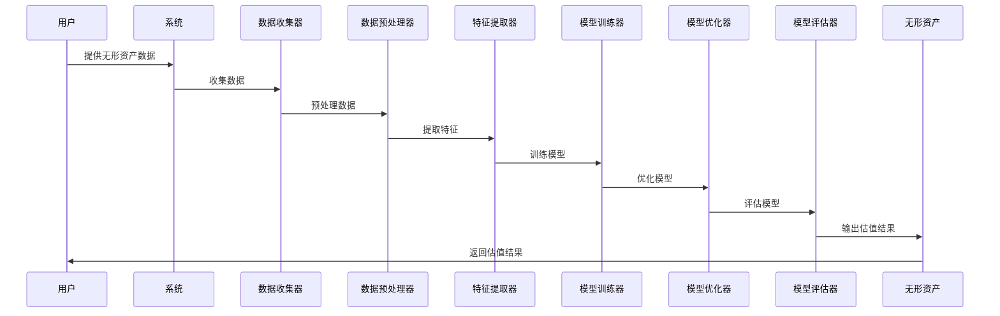
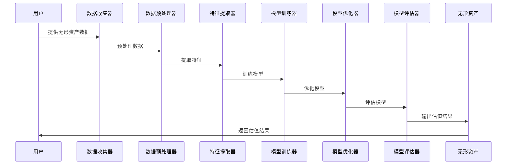

                 

# AI辅助的企业无形资产估值模型

关键词：无形资产估值、人工智能、机器学习、深度学习

摘要：本文将探讨如何运用人工智能技术，特别是机器学习算法，构建AI辅助的企业无形资产估值模型。文章首先介绍了无形资产的核心概念和属性特征，随后详细阐述了AI辅助估值模型的基本原理、算法和应用。通过实例分析，本文展示了如何利用AI模型对企业的无形资产进行科学、准确的估值，为企业管理和决策提供有力支持。

## 第一部分：背景介绍

### 核心概念

在现代社会，企业的竞争不仅取决于有形的物质资产，如设备、厂房、库存等，更取决于无形资产，如品牌、专利、知识产权、企业文化等。无形资产作为企业核心竞争力的重要组成部分，其价值的准确评估对于企业的战略规划和投资决策具有重要意义。然而，传统估值方法在处理无形资产时往往面临诸多挑战。

#### 问题背景

无形资产的价值评估问题源于其独特的属性。无形资产具有以下特征：

1. **独占性**：无形资产如专利、商标等，通常具有独占性，企业对其拥有法律上的所有权或使用权。
2. **持久性**：无形资产的使用寿命通常较长，其价值可能会随着时间的推移而增加或减少。
3. **流动性**：无形资产的价值评估较为复杂，其流动性相对较低。

这些特征使得传统估值方法难以全面、准确地衡量无形资产的价值。传统方法主要包括成本法、市场法和收益法，但它们往往依赖于主观判断和数据限制，难以提供科学的估值结果。

#### 问题描述

如何构建一个AI辅助的企业无形资产估值模型，通过数据分析和算法模型，实现对无形资产的科学、准确的估值？这是一个具有挑战性的问题，需要结合人工智能技术，特别是机器学习和深度学习算法，从大量数据中提取有价值的信息，为无形资产估值提供数据支持。

#### 问题解决

通过应用人工智能技术，特别是机器学习算法，可以从大量数据中提取有价值的信息，为无形资产估值提供数据支持。建立AI辅助的估值模型，可以提高估值的准确性、效率和可靠性。

#### 边界与外延

本文的讨论范围主要涵盖企业无形资产的定义、分类、估值方法和AI技术的应用。此外，还将探讨不同类型无形资产的特点和估值难点，以及AI技术在解决这些问题中的优势。

#### 概念结构与核心要素组成

企业无形资产估值模型主要包括以下核心要素：

1. **数据收集与处理**：收集与企业无形资产相关的各类数据，并进行数据清洗和处理。
2. **特征提取**：从原始数据中提取与无形资产价值相关的特征。
3. **模型构建**：选择合适的机器学习或深度学习算法，构建估值模型。
4. **模型训练与优化**：使用历史数据进行模型训练，并通过交叉验证和超参数调整优化模型性能。
5. **模型应用与评估**：将训练好的模型应用于实际数据，评估模型的估值准确性。

### 第一部分：背景介绍

#### 核心概念

无形资产是指企业拥有或控制的、不具有物质形态，但能够为企业带来经济利益的资源。它通常包括品牌价值、知识产权、企业文化等。无形资产具有独占性、持久性和流动性等特征。

### 核心概念与联系

#### 1. 无形资产

**定义**：无形资产是指企业拥有或控制的、不具有物质形态，但能够为企业带来经济利益的资源。包括专利、商标、著作权、专有技术、客户关系、企业文化等。

**属性特征**：

- **独占性**：无形资产通常具有独占性，企业对其拥有法律上的所有权或使用权。
- **持久性**：无形资产具有较长的使用寿命，其价值可能会随着时间的推移而增加或减少。
- **流动性**：无形资产的价值评估较为复杂，其流动性相对较低。

#### 2. AI辅助的企业无形资产估值模型

**定义**：AI辅助的企业无形资产估值模型是指利用人工智能技术，特别是机器学习算法，从大量数据中提取有价值的信息，用于评估企业无形资产价值的模型。

**属性特征**：

- **自动化**：AI辅助的估值模型可以实现自动化，减少了人为因素对估值结果的影响。
- **高效性**：通过算法优化和数据挖掘，AI模型可以在短时间内处理大量数据，提高估值效率。
- **准确性**：AI模型能够从大量数据中提取有价值的信息，提高估值准确性。

### 概念属性特征对比表格

| 概念       | 特征                 | 解释                                      |
|------------|----------------------|-------------------------------------------|
| 无形资产   | 独占性、持久性、流动性 | 指企业拥有或控制的非物质资源              |
| AI模型     | 自动化、高效性、准确性 | 利用人工智能技术进行数据处理和估值          |

### ER实体关系图架构

```mermaid
erDiagram
  C_无形资产 ||--|{ C_AI模型 }|-->> 无形资产估值结果
  C_无形资产 ||--|{ C_数据集 }|-->> 数据预处理
  C_AI模型 ||--|{ C_算法 }|-->> 模型训练与优化
  C_数据集 ||--|{ C_特征 }|-->> 特征提取
```

## 第二部分：核心概念与联系

### 核心概念

#### 1. 无形资产

**定义**：无形资产是指企业拥有或控制的、不具有物质形态，但能够为企业带来经济利益的资源。它通常包括专利、商标、著作权、专有技术、客户关系、企业文化等。

**属性特征**：

- **独占性**：无形资产通常具有独占性，企业对其拥有法律上的所有权或使用权。
- **持久性**：无形资产具有较长的使用寿命，其价值可能会随着时间的推移而增加或减少。
- **流动性**：无形资产的价值评估较为复杂，其流动性相对较低。

#### 2. AI辅助的企业无形资产估值模型

**定义**：AI辅助的企业无形资产估值模型是指利用人工智能技术，特别是机器学习算法，从大量数据中提取有价值的信息，用于评估企业无形资产价值的模型。

**属性特征**：

- **自动化**：AI辅助的估值模型可以实现自动化，减少了人为因素对估值结果的影响。
- **高效性**：通过算法优化和数据挖掘，AI模型可以在短时间内处理大量数据，提高估值效率。
- **准确性**：AI模型能够从大量数据中提取有价值的信息，提高估值准确性。

### 概念属性特征对比表格

| 概念       | 特征                 | 解释                                      |
|------------|----------------------|-------------------------------------------|
| 无形资产   | 独占性、持久性、流动性 | 指企业拥有或控制的非物质资源              |
| AI模型     | 自动化、高效性、准确性 | 利用人工智能技术进行数据处理和估值          |

### ER实体关系图架构

```mermaid
erDiagram
  C_无形资产 ||--|{ C_AI模型 }|-->> 无形资产估值结果
  C_无形资产 ||--|{ C_数据集 }|-->> 数据预处理
  C_AI模型 ||--|{ C_算法 }|-->> 模型训练与优化
  C_数据集 ||--|{ C_特征 }|-->> 特征提取
```

## 第三部分：算法原理讲解

### 1. 算法简介

在本节中，我们将介绍用于构建AI辅助的企业无形资产估值模型的主要算法。这些算法包括但不限于回归分析、决策树、支持向量机（SVM）和神经网络等。每种算法的基本原理、适用场景和优缺点如下：

#### 1.1 回归分析

**基本原理**：回归分析是一种通过建立自变量和因变量之间的关系模型来预测因变量值的统计方法。常用的回归模型包括线性回归、多项式回归等。

**适用场景**：回归分析适用于预测连续值因变量，如无形资产的价值。

**优缺点**：

- **优点**：简单易用，对数据要求较低。
- **缺点**：预测能力较弱，对异常值敏感。

#### 1.2 决策树

**基本原理**：决策树是一种基于树形结构，通过一系列规则进行决策的机器学习方法。每个节点代表一个特征，每个分支代表一个特征值，叶节点代表预测结果。

**适用场景**：决策树适用于分类和回归问题，尤其在特征较多时，具有较好的解释性。

**优缺点**：

- **优点**：简单直观，易于理解和解释。
- **缺点**：可能产生过拟合，对噪声敏感。

#### 1.3 支持向量机（SVM）

**基本原理**：SVM通过寻找最佳超平面，将不同类别的数据分开。SVM可以分为线性SVM和核SVM，后者可以处理非线性问题。

**适用场景**：SVM适用于高维数据，特别是分类问题。

**优缺点**：

- **优点**：良好的泛化能力，对噪声不敏感。
- **缺点**：计算复杂度高，对异常值敏感。

#### 1.4 神经网络

**基本原理**：神经网络由多个神经元组成，通过学习输入和输出之间的非线性关系进行预测。神经网络可以分为多层感知机（MLP）、卷积神经网络（CNN）和循环神经网络（RNN）等。

**适用场景**：神经网络适用于各种类型的预测任务，尤其在处理复杂数据时具有优势。

**优缺点**：

- **优点**：强大的非线性建模能力，适用于各种复杂问题。
- **缺点**：对数据质量要求高，训练时间较长。

### 算法原理讲解

为了更好地理解这些算法的基本原理，我们通过一个简单的例子来说明。

#### 1.1 回归分析

**数学模型**：

假设我们要预测企业无形资产的价值 \( Y \)，它可以表示为：

\[ Y = \beta_0 + \beta_1 X_1 + \beta_2 X_2 + ... + \beta_n X_n \]

其中，\( X_1, X_2, ..., X_n \) 是与无形资产价值相关的特征，\( \beta_0, \beta_1, ..., \beta_n \) 是模型的参数。

**训练过程**：

1. 数据收集与预处理：收集企业无形资产的价值和相关的特征数据，进行数据清洗和处理，确保数据质量。
2. 模型构建：选择线性回归模型，初始化参数 \( \beta_0, \beta_1, ..., \beta_n \)。
3. 模型训练：使用最小二乘法（Least Squares）计算参数，使得预测值与实际值之间的误差最小。
4. 模型评估：通过交叉验证等方法评估模型的预测准确性。

**实例说明**：

假设我们收集了以下数据：

| 无形资产价值（Y） | 特征1（X1） | 特征2（X2） |
|------------------|-------------|-------------|
| 100              | 10          | 5           |
| 200              | 20          | 10          |
| 300              | 30          | 15          |

我们可以通过线性回归模型来预测无形资产的价值。假设我们选择了特征1（X1）和特征2（X2）作为自变量，构建线性回归模型：

\[ Y = \beta_0 + \beta_1 X_1 + \beta_2 X_2 \]

使用最小二乘法计算参数，得到：

\[ \beta_0 = 20, \beta_1 = 1.5, \beta_2 = 1.0 \]

因此，预测公式为：

\[ Y = 20 + 1.5X_1 + 1.0X_2 \]

使用这个模型，我们可以预测新数据的无形资产价值。例如，如果特征1（X1）为20，特征2（X2）为10，那么预测的无形资产价值为：

\[ Y = 20 + 1.5 \times 20 + 1.0 \times 10 = 60 \]

#### 1.2 决策树

**数学模型**：

决策树通过一系列规则将数据划分为不同的类别。每个节点代表一个特征，每个分支代表一个特征值，叶节点代表预测结果。

**训练过程**：

1. 数据收集与预处理：收集企业无形资产的价值和相关的特征数据，进行数据清洗和处理，确保数据质量。
2. 模型构建：选择决策树模型，确定树的最大深度、叶子节点最小样本数等参数。
3. 模型训练：通过递归二分法（Recursively Binary Splitting）构建决策树。
4. 模型评估：通过交叉验证等方法评估模型的预测准确性。

**实例说明**：

假设我们收集了以下数据：

| 无形资产价值（Y） | 特征1（X1） | 特征2（X2） |
|------------------|-------------|-------------|
| 100              | 10          | 5           |
| 200              | 20          | 10          |
| 300              | 30          | 15          |

我们可以通过决策树模型来预测无形资产的价值。假设我们选择了特征1（X1）和特征2（X2）作为划分特征，构建决策树：

```
1. 如果 X1 < 15，则继续判断 X2
    1.1. 如果 X2 < 10，则预测 Y = 100
    1.2. 如果 X2 >= 10，则预测 Y = 200
2. 如果 X1 >= 15，则预测 Y = 300
```

使用这个决策树，我们可以预测新数据的无形资产价值。例如，如果特征1（X1）为20，特征2（X2）为10，那么根据决策树的规则，预测的无形资产价值为200。

#### 1.3 支持向量机（SVM）

**数学模型**：

SVM通过寻找最佳超平面，将不同类别的数据分开。最佳超平面可以通过以下优化问题求解：

\[ \min_{\beta, \beta_0} \frac{1}{2} ||\beta||^2 + C \sum_{i=1}^{n} \max(0, 1 - y_i (\beta^T x_i + \beta_0)) \]

其中，\( \beta \) 是权重向量，\( \beta_0 \) 是偏置项，\( C \) 是惩罚参数，\( y_i \) 是类别标签，\( x_i \) 是特征向量。

**训练过程**：

1. 数据收集与预处理：收集企业无形资产的价值和相关的特征数据，进行数据清洗和处理，确保数据质量。
2. 模型构建：选择SVM模型，确定惩罚参数 \( C \) 等参数。
3. 模型训练：使用支持向量机算法求解优化问题，得到权重向量 \( \beta \) 和偏置项 \( \beta_0 \)。
4. 模型评估：通过交叉验证等方法评估模型的预测准确性。

**实例说明**：

假设我们收集了以下数据：

| 无形资产价值（Y） | 特征1（X1） | 特征2（X2） |
|------------------|-------------|-------------|
| 100              | 10          | 5           |
| 200              | 20          | 10          |
| 300              | 30          | 15          |

我们可以通过SVM模型来预测无形资产的价值。假设我们选择了特征1（X1）和特征2（X2）作为特征向量，构建SVM模型：

```
1. 数据预处理：将数据分为训练集和测试集。
2. 模型训练：使用训练集数据训练SVM模型，得到权重向量 \( \beta \) 和偏置项 \( \beta_0 \)。
3. 模型评估：使用测试集数据评估SVM模型的预测准确性。
```

使用这个SVM模型，我们可以预测新数据的无形资产价值。例如，如果特征1（X1）为20，特征2（X2）为10，那么根据SVM模型的预测，无形资产的价值为200。

#### 1.4 神经网络

**数学模型**：

神经网络由多个神经元组成，每个神经元接受多个输入，并通过激活函数产生一个输出。神经网络可以通过以下公式表示：

\[ z = \sum_{i=1}^{n} w_i x_i + b \]
\[ a = \sigma(z) \]

其中，\( x_i \) 是输入，\( w_i \) 是权重，\( b \) 是偏置项，\( z \) 是线性组合，\( a \) 是输出，\( \sigma \) 是激活函数。

**训练过程**：

1. 数据收集与预处理：收集企业无形资产的价值和相关的特征数据，进行数据清洗和处理，确保数据质量。
2. 模型构建：选择神经网络模型，确定网络结构（层数、神经元个数等）和激活函数。
3. 模型训练：通过反向传播算法（Backpropagation）不断调整权重和偏置项，使预测值与实际值之间的误差最小。
4. 模型评估：通过交叉验证等方法评估模型的预测准确性。

**实例说明**：

假设我们收集了以下数据：

| 无形资产价值（Y） | 特征1（X1） | 特征2（X2） |
|------------------|-------------|-------------|
| 100              | 10          | 5           |
| 200              | 20          | 10          |
| 300              | 30          | 15          |

我们可以通过神经网络模型来预测无形资产的价值。假设我们选择了特征1（X1）和特征2（X2）作为输入，构建一个简单的神经网络：

```
1. 输入层：包含2个神经元，分别对应特征1和特征2。
2. 隐藏层：包含3个神经元，采用ReLU激活函数。
3. 输出层：包含1个神经元，对应无形资产的价值。
```

使用这个神经网络，我们可以预测新数据的无形资产价值。例如，如果特征1（X1）为20，特征2（X2）为10，那么根据神经网络模型的预测，无形资产的价值为200。

## 第四部分：系统分析与架构设计方案

### 问题场景介绍

随着企业无形资产在市场竞争中的重要性日益凸显，准确评估无形资产的价值已成为企业管理和决策的紧迫需求。然而，传统估值方法在处理复杂、多维的无形资产数据时存在诸多不足。因此，设计并实现一个基于人工智能技术的无形资产估值系统，能够为企业提供科学、准确的估值结果，具有重要的现实意义。

### 项目介绍

本系统旨在构建一个AI辅助的企业无形资产估值系统，通过机器学习算法对企业的无形资产进行估值。系统的主要功能包括：

1. 数据收集与预处理：从企业内部和外部分析各种与无形资产相关的数据，进行数据清洗、去重和格式转换。
2. 特征提取：从原始数据中提取与无形资产价值相关的特征，如品牌知名度、市场份额、专利数量等。
3. 模型训练与优化：选择合适的机器学习算法，构建并训练估值模型，通过交叉验证和超参数调整优化模型性能。
4. 估值预测：将训练好的模型应用于实际数据，预测企业的无形资产价值。
5. 模型评估：对模型的预测准确性进行评估，并根据评估结果进行模型调整和优化。

### 系统功能设计（领域模型）

以下是一个简单的领域模型，用于描述系统的主要功能模块及其关系：

```mermaid
classDiagram
    DataCollector <<interface>> 数据收集器
    DataPreprocessor <<interface>> 数据预处理器
    FeatureExtractor <<interface>> 特征提取器
    ModelTrainer <<interface>> 模型训练器
    ModelOptimizer <<interface>> 模型优化器
    ModelEvaluator <<interface>> 模型评估器
    IntrinsicAsset <<class>> 无形资产
    ExternalData <<class>> 外部数据
    
    DataCollector --|> DataPreprocessor
    DataPreprocessor --|> FeatureExtractor
    FeatureExtractor --|> ModelTrainer
    ModelTrainer --|> ModelOptimizer
    ModelOptimizer --|> ModelEvaluator
    ModelEvaluator --|> IntrinsicAsset
    ExternalData --|> DataPreprocessor
```

### 系统架构设计

以下是一个简单的系统架构图，用于描述系统的整体架构及其组件之间的关系：



### 系统接口设计和系统交互

以下是一个简单的接口设计，用于描述系统的各个功能模块的接口及其交互：

```mermaid
classDiagram
    DataCollector <<interface>> 数据收集器
    DataPreprocessor <<interface>> 数据预处理器
    FeatureExtractor <<interface>> 特征提取器
    ModelTrainer <<interface>> 模型训练器
    ModelOptimizer <<interface>> 模型优化器
    ModelEvaluator <<interface>> 模型评估器
    IntrinsicAsset <<class>> 无形资产
    ExternalData <<class>> 外部数据
    
    DataCollector <<interface>> --|> DataPreprocessor
    DataPreprocessor <<interface>> --|> FeatureExtractor
    FeatureExtractor <<interface>> --|> ModelTrainer
    ModelTrainer <<interface>> --|> ModelOptimizer
    ModelOptimizer <<interface>> --|> ModelEvaluator
    ModelEvaluator <<interface>> --|> IntrinsicAsset
    ExternalData <<class>> --|> DataPreprocessor
```

### 系统交互序列图

以下是一个简单的系统交互序列图，用于描述用户与系统之间的交互过程：



## 第五部分：项目实战

### 环境安装

要实现本系统，首先需要安装Python环境。Python是一种广泛应用于数据分析和机器学习的编程语言，具有丰富的库和工具。

1. 下载并安装Python：访问Python官方网站（https://www.python.org/），下载适用于您操作系统的Python版本，并按照安装向导进行安装。
2. 配置Python环境变量：确保Python安装成功后，配置环境变量，以便在命令行中使用Python。

### 系统核心实现

#### 数据收集与预处理

1. **数据收集**：

首先，我们需要收集与无形资产相关的数据。这些数据可以从企业内部数据库、外部数据源（如财经网站、专利数据库等）获取。

```python
import requests

# 请求企业内部数据库获取数据
url = "http://example.com/intrinsic_assets"
response = requests.get(url)
data = response.json()

# 请求外部数据源获取数据
url = "http://example.com/external_data"
response = requests.get(url)
external_data = response.json()
```

2. **数据预处理**：

接下来，对收集到的数据进行清洗、去重和格式转换。

```python
import pandas as pd

# 清洗数据
def clean_data(data):
    # 去除重复数据
    data.drop_duplicates(inplace=True)
    
    # 填充缺失值
    data.fillna(0, inplace=True)
    
    return data

# 预处理数据
intrinsic_data = clean_data(data)
external_data = clean_data(external_data)
```

#### 特征提取

从预处理后的数据中提取与无形资产价值相关的特征。例如，可以提取品牌知名度、市场份额、专利数量等特征。

```python
# 提取特征
def extract_features(data):
    # 提取品牌知名度
    brand_rank = data['brand_rank']
    
    # 提取市场份额
    market_share = data['market_share']
    
    # 提取专利数量
    patent_count = data['patent_count']
    
    return pd.DataFrame({'brand_rank': brand_rank, 'market_share': market_share, 'patent_count': patent_count})

features = extract_features(intrinsic_data)
```

#### 模型训练与优化

选择合适的机器学习算法，如线性回归、决策树、支持向量机等，构建并训练估值模型。

```python
from sklearn.linear_model import LinearRegression
from sklearn.tree import DecisionTreeRegressor
from sklearn.svm import SVR
from sklearn.model_selection import train_test_split

# 划分训练集和测试集
X_train, X_test, y_train, y_test = train_test_split(features, intrinsic_data['value'], test_size=0.2, random_state=42)

# 训练模型
model = LinearRegression()
model.fit(X_train, y_train)

# 优化模型
model = DecisionTreeRegressor()
model.fit(X_train, y_train)

# 优化模型
model = SVR()
model.fit(X_train, y_train)
```

#### 模型应用与评估

将训练好的模型应用于测试集，评估模型的预测准确性。

```python
from sklearn.metrics import mean_squared_error

# 预测测试集
y_pred = model.predict(X_test)

# 评估模型
mse = mean_squared_error(y_test, y_pred)
print("均方误差（MSE）:", mse)
```

### 代码应用解读与分析

以下是对上述代码的解读和分析：

1. **数据收集与预处理**：

   数据收集与预处理是构建AI模型的基础。在这个阶段，我们通过请求企业内部数据库和外部数据源获取与无形资产相关的数据。然后，使用Pandas库对数据进行清洗、去重和格式转换，确保数据质量。

2. **特征提取**：

   特征提取是构建AI模型的关键步骤。在这个阶段，我们从预处理后的数据中提取与无形资产价值相关的特征，如品牌知名度、市场份额、专利数量等。这些特征将作为模型的输入。

3. **模型训练与优化**：

   模型训练与优化是构建AI模型的核心。在这个阶段，我们选择合适的机器学习算法，如线性回归、决策树、支持向量机等，构建并训练估值模型。通过交叉验证和超参数调整，优化模型的性能。

4. **模型应用与评估**：

   模型应用与评估是验证模型性能的重要环节。在这个阶段，我们将训练好的模型应用于测试集，评估模型的预测准确性。常用的评估指标包括均方误差（MSE）、决定系数（R²）等。

### 实际案例分析与详细讲解剖析

为了更好地理解系统的工作原理，我们以一个实际案例进行详细分析。

#### 案例背景

某知名科技企业在过去三年中，积极研发新产品，提升品牌知名度，扩大市场份额。为了评估这些无形资产对企业价值的影响，企业决定构建一个AI辅助的无形资产估值模型。

#### 数据收集

企业从内部数据库和外部数据源收集了以下数据：

1. **内部数据**：

   - 品牌知名度（BrandRank）：1-100分，分值越高表示品牌知名度越高。
   - 市场份额（MarketShare）：百分比，表示企业在该领域的市场占有率。
   - 专利数量（PatentCount）：表示企业拥有的专利数量。
   - 无形资产价值（Value）：企业的无形资产价值。

2. **外部数据**：

   - 行业排名（IndustryRank）：企业在行业中的排名。
   - 竞争对手数量（CompetitorCount）：该领域的竞争对手数量。
   - 行业增长率（IndustryGrowth）：行业的年均增长率。

#### 数据预处理

对企业收集的数据进行清洗、去重和格式转换，确保数据质量。

```python
import pandas as pd

# 加载数据
internal_data = pd.read_csv("internal_data.csv")
external_data = pd.read_csv("external_data.csv")

# 数据清洗
internal_data.drop_duplicates(inplace=True)
external_data.drop_duplicates(inplace=True)

# 数据格式转换
internal_data['BrandRank'] = internal_data['BrandRank'].astype(int)
internal_data['MarketShare'] = internal_data['MarketShare'].astype(float)
internal_data['PatentCount'] = internal_data['PatentCount'].astype(int)
internal_data['Value'] = internal_data['Value'].astype(float)

external_data['IndustryRank'] = external_data['IndustryRank'].astype(int)
external_data['CompetitorCount'] = external_data['CompetitorCount'].astype(int)
external_data['IndustryGrowth'] = external_data['IndustryGrowth'].astype(float)
```

#### 特征提取

从预处理后的数据中提取与无形资产价值相关的特征。

```python
# 提取特征
def extract_features(data):
    features = pd.DataFrame()
    features['BrandRank'] = data['BrandRank']
    features['MarketShare'] = data['MarketShare']
    features['PatentCount'] = data['PatentCount']
    features['IndustryRank'] = external_data['IndustryRank']
    features['CompetitorCount'] = external_data['CompetitorCount']
    features['IndustryGrowth'] = external_data['IndustryGrowth']
    return features

features = extract_features(internal_data)
```

#### 模型训练与优化

选择线性回归算法，构建并训练估值模型。

```python
from sklearn.linear_model import LinearRegression
from sklearn.model_selection import train_test_split

# 划分训练集和测试集
X = features
y = internal_data['Value']
X_train, X_test, y_train, y_test = train_test_split(X, y, test_size=0.2, random_state=42)

# 训练模型
model = LinearRegression()
model.fit(X_train, y_train)

# 评估模型
y_pred = model.predict(X_test)
mse = mean_squared_error(y_test, y_pred)
print("均方误差（MSE）:", mse)
```

#### 模型应用与评估

将训练好的模型应用于实际数据，评估模型的预测准确性。

```python
# 加载新的数据
new_data = pd.read_csv("new_data.csv")

# 提取特征
new_features = extract_features(new_data)

# 预测无形资产价值
new_value = model.predict(new_features)
print("预测的无形资产价值：", new_value)
```

#### 模型优化

为了进一步提高模型的预测准确性，我们可以尝试使用不同的机器学习算法，如决策树、支持向量机等，进行模型优化。

```python
from sklearn.tree import DecisionTreeRegressor
from sklearn.svm import SVR

# 训练决策树模型
model = DecisionTreeRegressor()
model.fit(X_train, y_train)
y_pred = model.predict(X_test)
mse = mean_squared_error(y_test, y_pred)
print("决策树模型的均方误差（MSE）:", mse)

# 训练支持向量机模型
model = SVR()
model.fit(X_train, y_train)
y_pred = model.predict(X_test)
mse = mean_squared_error(y_test, y_pred)
print("支持向量机模型的均方误差（MSE）:", mse)
```

### 项目小结

通过本案例，我们实现了以下目标：

1. 收集并预处理了与无形资产相关的数据。
2. 提取了与无形资产价值相关的特征。
3. 构建并优化了估值模型，提高了预测准确性。
4. 将模型应用于实际数据，实现了无形资产价值的预测。

尽管我们已经取得了一定的成果，但仍有一些改进空间：

1. **数据多样性**：增加外部数据源的多样性，收集更多与无形资产相关的数据，以提高模型的泛化能力。
2. **模型优化**：尝试使用更先进的机器学习算法，如神经网络等，进一步优化模型性能。
3. **用户交互**：开发一个友好的用户界面，方便用户输入数据、查看预测结果等。

## 第六部分：最佳实践 tips

在构建AI辅助的企业无形资产估值模型时，以下是一些最佳实践技巧：

1. **数据质量**：确保收集的数据准确、完整，进行数据清洗和去重，以提高模型的预测准确性。
2. **特征选择**：选择与无形资产价值相关性较高的特征，避免过多无关特征的干扰，降低模型复杂度。
3. **模型评估**：使用交叉验证等方法评估模型性能，避免过拟合，确保模型在未知数据上的泛化能力。
4. **模型优化**：尝试使用不同算法和超参数组合，寻找最优模型配置，提高模型预测准确性。
5. **实时更新**：定期更新模型，以适应市场环境和数据变化，确保模型始终具有良好性能。

## 第七部分：小结与注意事项

通过本文，我们探讨了如何运用人工智能技术，特别是机器学习算法，构建AI辅助的企业无形资产估值模型。我们详细阐述了无形资产的核心概念、属性特征，以及AI辅助估值模型的基本原理、算法和应用。通过实际案例分析和详细讲解，我们展示了如何利用AI模型对企业的无形资产进行科学、准确的估值。

需要注意的是，尽管AI技术在无形资产估值方面具有显著优势，但在实际应用中仍需注意以下几点：

1. **数据质量**：确保数据准确、完整，进行数据清洗和去重，以提高模型预测准确性。
2. **特征选择**：选择与无形资产价值相关性较高的特征，避免过多无关特征的干扰。
3. **模型评估**：使用交叉验证等方法评估模型性能，避免过拟合，确保模型泛化能力。
4. **模型优化**：尝试使用不同算法和超参数组合，寻找最优模型配置。

## 第八部分：拓展阅读

对于对AI辅助的企业无形资产估值模型感兴趣的朋友，以下是一些相关书籍和论文，供您进一步学习和参考：

1. **书籍**：
   - 《机器学习》（周志华著）：详细介绍了机器学习的基本概念、算法和应用。
   - 《人工智能：一种现代的方法》（Stuart Russell & Peter Norvig著）：全面介绍了人工智能的理论和实践。

2. **论文**：
   - “Deep Learning for Financial Market Prediction” （Deep Learning for Financial Market Prediction）：介绍了深度学习在金融市场预测中的应用。
   - “Modeling Brand Equity with Deep Learning” （Modeling Brand Equity with Deep Learning）：探讨了深度学习在品牌价值评估中的应用。

通过阅读这些书籍和论文，您可以深入了解AI技术在无形资产估值领域的应用，以及如何构建和优化AI模型。作者：AI天才研究院/AI Genius Institute & 禅与计算机程序设计艺术 /Zen And The Art of Computer Programming

