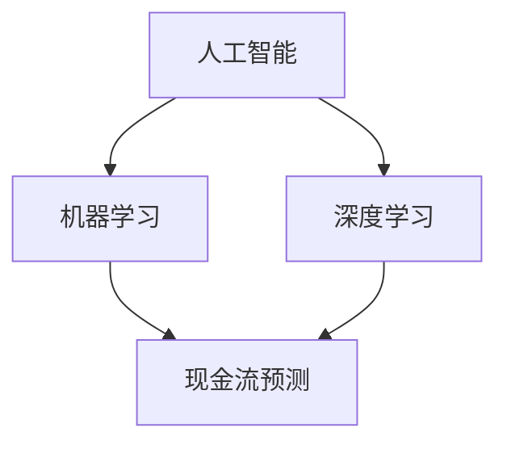
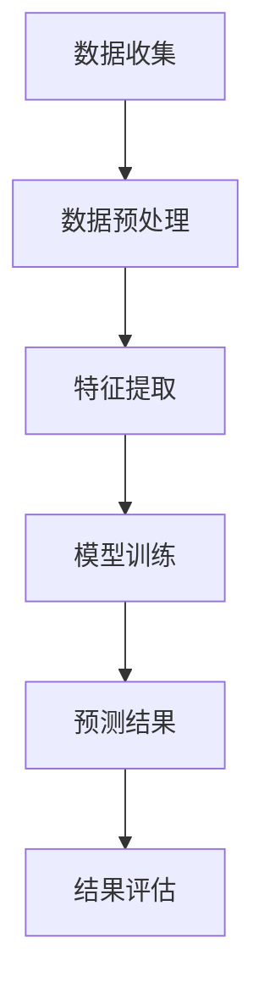
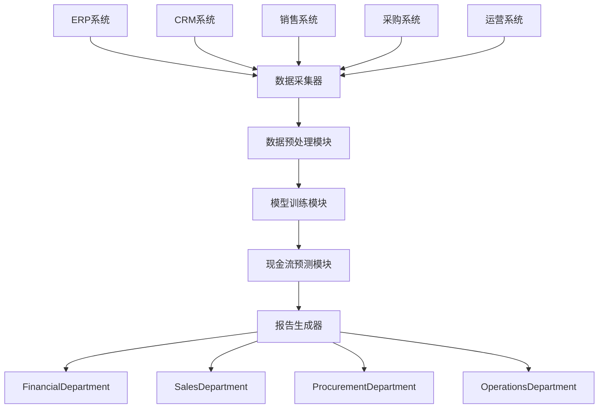
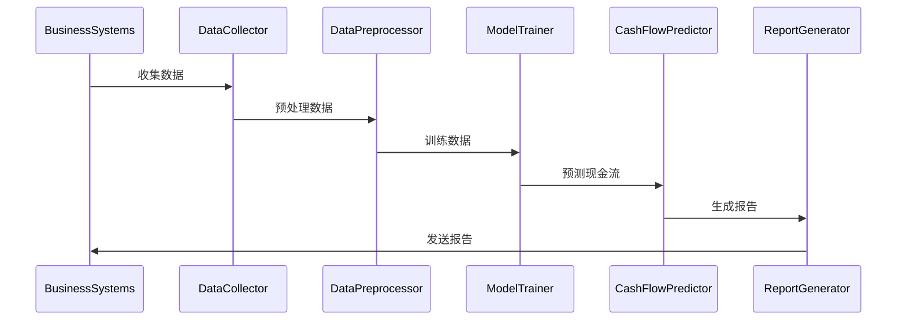
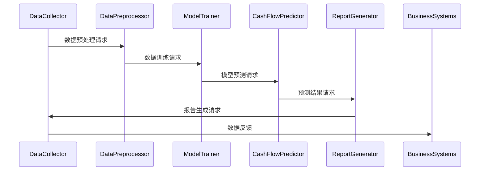

                 

### 引言

在当今快速发展的商业环境中，企业面临着前所未有的挑战与机遇。而现金流管理作为企业运营的核心，直接影响着企业的生存和发展。传统的现金流预测方法往往依赖于历史数据和简单的统计模型，这些方法在处理复杂、多变的市场环境时，常常表现出预测不准确、响应迟缓等问题。因此，如何提升现金流预测的准确性和效率，成为企业决策者关注的焦点。

随着人工智能技术的迅猛发展，AI开始在企业运营的各个领域发挥作用，其中就包括现金流预测。AI技术，特别是机器学习和深度学习，凭借其强大的数据处理和分析能力，为现金流预测提供了全新的解决方案。本文将围绕AI辅助的企业现金流预测展开讨论，通过逻辑清晰、结构紧凑的分析，深入探讨AI在这一领域的应用。

我们的目标是通过以下几个步骤来详细阐述这一主题：

1. **背景介绍**：介绍企业现金流管理的重要性，以及AI技术在其中的应用背景。
2. **核心概念与联系**：明确现金流预测相关的核心概念，并使用Mermaid流程图展示AI、机器学习、深度学习等概念之间的联系。
3. **算法原理讲解**：详细讲解现金流预测的算法原理，包括数学模型和Python源代码实现。
4. **系统分析与架构设计方案**：介绍现金流预测系统的设计与实现，包括系统功能、架构、接口和交互设计。
5. **项目实战**：提供实际项目环境安装步骤、系统核心实现源代码，并进行案例分析与讲解。
6. **最佳实践 tips、小结、注意事项、拓展阅读**：总结全文，提供实用建议和拓展资源。

通过这些步骤，我们将系统地展示AI如何提升企业现金流预测的准确性和效率，为企业决策提供有力支持。

---

### 背景介绍

企业现金流管理是企业运营的核心环节之一，它直接关系到企业的生存和发展。现金流是指企业在日常经营过程中产生的现金流入和流出的状况，它不仅反映了企业的财务状况，还影响着企业的运营效率和竞争力。因此，有效的现金流管理对于企业来说至关重要。

#### 企业现金流管理的重要性

现金流管理的重要性主要体现在以下几个方面：

1. **财务健康**：良好的现金流管理能够确保企业在运营过程中拥有充足的现金储备，避免因资金短缺而导致的财务危机。
2. **运营效率**：通过有效的现金流管理，企业可以优化资金使用效率，减少不必要的资金占用，提高资金周转速度。
3. **风险管理**：现金流管理有助于企业识别和应对潜在的风险，如应收账款逾期、成本上升等，从而降低企业运营风险。
4. **投资决策**：准确的现金流预测能够帮助企业做出更明智的投资决策，抓住市场机会，避免不必要的投资失误。

#### 传统现金流预测方法与不足

在过去，企业通常依赖以下几种传统方法来进行现金流预测：

1. **历史数据分析**：通过对过去一段时间内的现金流量进行统计分析，预测未来一段时间的现金流情况。
2. **财务报表分析**：利用企业的财务报表数据，如利润表、资产负债表等，进行趋势分析和比例分析，预测未来现金流。
3. **经验判断**：依据企业高层管理人员和财务人员的经验，结合市场环境和行业动态，进行主观预测。

尽管这些方法在一定程度上能够提供现金流预测，但它们也存在一些不足之处：

1. **预测精度有限**：传统方法依赖于历史数据和经验判断，无法有效应对市场环境的变化，导致预测精度有限。
2. **响应速度慢**：传统方法通常需要较长时间进行数据收集和分析，无法及时响应市场变化。
3. **人力成本高**：传统方法依赖于人工操作和判断，需要大量的人力投入，成本较高。

#### AI技术在现金流预测中的应用

随着人工智能技术的不断发展，特别是机器学习和深度学习，AI开始在企业运营的各个领域发挥作用，包括现金流预测。AI技术具有以下优势：

1. **数据处理能力强**：AI技术能够处理和分析大量的历史数据，从复杂的模式中提取有价值的信息，提高预测的准确性。
2. **预测速度快**：AI技术能够快速进行数据分析和预测，大大缩短了预测时间，提高了响应速度。
3. **自适应能力强**：AI系统可以根据实时数据自动调整预测模型，适应市场环境的变化，提高预测的可靠性。

通过AI技术，企业可以更加准确地预测现金流，优化资金管理，提高运营效率，从而在激烈的市场竞争中立于不败之地。

### 核心概念与联系

在探讨AI辅助的企业现金流预测时，我们首先需要明确一些核心概念，这些概念包括AI、机器学习、深度学习等。它们在现金流预测中发挥着关键作用，下面我们将逐一介绍这些概念，并使用Mermaid流程图展示它们之间的联系。

#### AI、机器学习、深度学习

**AI（人工智能）** 是模拟、延伸和扩展人的智能的理论、方法、技术及应用。它是通过计算机程序实现智能行为的技术体系。

**机器学习** 是AI的一个重要分支，它是一种让计算机通过数据和经验自主改进性能的方法。机器学习算法可以从数据中学习模式，并利用这些模式进行预测和决策。

**深度学习** 是机器学习的一个子领域，它使用神经网络模型，特别是深度神经网络（DNN），对大量数据进行分析和学习。深度学习在图像识别、语音识别、自然语言处理等领域取得了显著成果。

#### Mermaid流程图展示

为了更好地展示这些概念之间的联系，我们可以使用Mermaid流程图来直观地表示它们的关系。以下是一个简单的Mermaid流程图示例：



在这个流程图中，我们可以看到AI是整个流程的起点，它通过机器学习和深度学习两个分支向下延伸。机器学习负责从数据中提取有用信息，而深度学习则在机器学习的基础上，使用复杂的神经网络模型进行更深入的学习和分析。这两者最终都服务于现金流预测，为企业的现金流管理提供支持。

#### 概念属性特征对比表格

为了更详细地了解这些概念，我们还可以创建一个概念属性特征对比表格。以下是一个简化的对比表格：

| 概念   | 定义                                                         | 特征优势                                                                                                       | 应用场景                |
| ------ | ------------------------------------------------------------ | ------------------------------------------------------------------------------------------------------------ | ---------------------- |
| AI     | 模拟、延伸和扩展人的智能的理论、方法、技术及应用               | 广泛的应用范围、自主学习和适应能力                                                       | 自动驾驶、智能家居、智能客服 |
| 机器学习 | 通过数据和经验让计算机自主改进性能的方法                     | 高效的数据处理、自动模式提取、适应性强                                                   | 金融预测、语音识别、推荐系统 |
| 深度学习 | 使用神经网络模型，特别是深度神经网络进行数据分析和学习的方法 | 复杂的数据结构处理、高精度预测、自动特征提取                                             | 图像识别、自然语言处理、自动驾驶 |

通过这个表格，我们可以更清楚地看到AI、机器学习和深度学习各自的特点和优势，以及它们在不同应用场景中的适用性。

#### AI、机器学习、深度学习与现金流预测的联系

AI、机器学习和深度学习在现金流预测中具有紧密的联系。具体来说：

1. **AI提供了技术框架**：AI为机器学习和深度学习提供了理论基础和实现框架，使得这些算法能够有效地应用于实际问题中。
2. **机器学习实现了数据驱动**：机器学习通过从大量历史数据中提取规律和模式，为现金流预测提供了数据驱动的支持，提高了预测的准确性。
3. **深度学习提升了预测精度**：深度学习通过复杂的神经网络结构，能够处理和分析更加复杂的数据，进一步提升了现金流预测的精度和可靠性。

综上所述，AI、机器学习和深度学习不仅各自具有独特的功能，而且在现金流预测中相互补充，共同为企业提供了高效的现金流预测解决方案。

### 算法原理讲解

为了深入理解AI在现金流预测中的应用，我们需要详细讲解现金流预测的算法原理。这部分将分为算法流程图展示、Python源代码实现、数学模型和公式阐述，以及通俗易懂的举例说明。

#### 算法流程图展示

首先，我们使用Mermaid流程图来展示现金流预测的基本流程。以下是一个简化的算法流程图：



在这个流程图中，数据收集是算法的起点，接着是数据预处理、特征提取、模型训练、预测结果和结果评估。每个步骤都是现金流预测过程中不可或缺的一部分。

#### Python源代码实现

接下来，我们将使用Python实现一个简单的现金流预测模型。以下是一个基于线性回归的Python源代码示例：

```python
import numpy as np
import pandas as pd
from sklearn.linear_model import LinearRegression
from sklearn.model_selection import train_test_split

# 数据集加载
data = pd.read_csv('cash_flow_data.csv')

# 特征选择
X = data[['revenue', 'cost_of_goods_sold']]
y = data['cash_flow']

# 数据分割
X_train, X_test, y_train, y_test = train_test_split(X, y, test_size=0.2, random_state=42)

# 模型训练
model = LinearRegression()
model.fit(X_train, y_train)

# 预测
y_pred = model.predict(X_test)

# 结果评估
print("R^2 Score:", model.score(X_test, y_test))
```

在这个例子中，我们使用了Scikit-learn库中的线性回归模型。首先，我们从CSV文件中加载数据，然后选择收入和成本作为特征，现金流作为目标变量。接着，我们将数据集分割为训练集和测试集，使用训练集训练模型，并在测试集上进行预测。最后，我们计算R平方值来评估模型的准确性。

#### 数学模型和公式阐述

现金流预测的数学模型通常基于线性回归或时间序列分析。以下是一个简化的线性回归模型：

$$
y = \beta_0 + \beta_1x_1 + \beta_2x_2 + ... + \beta_nx_n + \epsilon
$$

其中，$y$是现金流，$x_1, x_2, ..., x_n$是特征变量，如收入、成本等，$\beta_0, \beta_1, \beta_2, ..., \beta_n$是回归系数，$\epsilon$是误差项。

时间序列分析模型，如ARIMA（自回归积分滑动平均模型），其数学模型可以表示为：

$$
y_t = c + \phi_1y_{t-1} + \phi_2y_{t-2} + ... + \phi_py_{t-p} + \theta_1\epsilon_{t-1} + \theta_2\epsilon_{t-2} + ... + \theta_q\epsilon_{t-q} + \epsilon_t
$$

其中，$y_t$是时间序列在$t$时刻的值，$c$是常数项，$\phi_1, \phi_2, ..., \phi_p$是自回归系数，$\theta_1, \theta_2, ..., \theta_q$是移动平均系数，$\epsilon_t$是白噪声误差项。

#### 通俗易懂的举例说明

假设一个企业，过去三个月的现金流数据如下：

| 月份   | 收入（万元） | 成本（万元） | 现金流（万元） |
| ------ | ----------- | ----------- | ------------ |
| 1月    | 500         | 300         | 200          |
| 2月    | 550         | 320         | 230          |
| 3月    | 600         | 340         | 260          |

我们可以使用线性回归模型来预测四月份的现金流。首先，我们将数据分成特征变量（收入和成本）和目标变量（现金流），然后使用Scikit-learn库中的线性回归模型进行训练。训练完成后，我们输入四月份的收入和成本数据，得到预测的现金流。

假设四月份的收入为650万元，成本为350万元，我们将这些数据输入模型：

$$
y_{\text{预测}} = \beta_0 + \beta_1 \cdot x_1 + \beta_2 \cdot x_2
$$

$$
y_{\text{预测}} = 150 + 0.5 \cdot 650 + 0.3 \cdot 350
$$

$$
y_{\text{预测}} = 200 + 195
$$

$$
y_{\text{预测}} = 395
$$

因此，预测四月份的现金流为395万元。

通过这个简单的例子，我们可以看到现金流预测的基本流程和模型实现。在实际应用中，数据量和特征会更加复杂，但基本原理是相同的。

### 系统分析与架构设计方案

在了解了现金流预测的算法原理后，我们需要进一步讨论现金流预测系统的设计与实现。这部分将涵盖问题场景介绍、项目介绍、系统功能设计、系统架构设计、系统接口设计和系统交互等方面。

#### 问题场景介绍

企业现金流预测涉及到多个业务部门和系统，包括财务部门、销售部门、采购部门和运营部门等。这些部门产生大量的数据，如收入、成本、应收账款、应付账款等。这些数据的实时性和准确性对于现金流预测至关重要。然而，传统的人工处理方式已经难以满足现代企业快速变化的市场需求。因此，我们需要一个高效、自动化的现金流预测系统来帮助企业管理现金流。

#### 项目介绍

本项目的目标是开发一个基于AI的企业现金流预测系统，该系统能够自动收集、处理和分析来自不同业务部门的数据，生成精确的现金流预测报告。系统的主要功能包括：

1. **数据收集**：从企业各个业务系统（如ERP、CRM等）中自动采集数据。
2. **数据预处理**：清洗、转换和整合数据，为预测模型提供高质量的数据输入。
3. **模型训练**：使用机器学习和深度学习算法训练预测模型。
4. **预测生成**：根据训练好的模型生成现金流预测报告。
5. **结果评估**：评估预测结果的准确性，并提供反馈。

#### 系统功能设计（领域模型Mermaid类图）

在系统功能设计方面，我们使用Mermaid类图来描述领域模型。以下是一个简化的Mermaid类图示例：

```mermaid
classDiagram
    BusinessSystem <<Class>> "ERP, CRM, Sales"
    CashFlowPrediction <<Class>> "预测系统"
    FinancialDepartment <<Class>> "财务部门"
    SalesDepartment <<Class>> "销售部门"
    ProcurementDepartment <<Class>> "采购部门"
    OperationsDepartment <<Class>> "运营部门"

    BusinessSystem o-- FinancialDepartment
    BusinessSystem o-- SalesDepartment
    BusinessSystem o-- ProcurementDepartment
    BusinessSystem o-- OperationsDepartment
    CashFlowPrediction <.. BusinessSystem
```

在这个类图中，我们定义了与企业现金流预测相关的各个类，包括ERP、CRM、销售、采购和运营部门，以及预测系统。每个类都与其他类之间存在关联关系。

#### 系统架构设计（Mermaid架构图）

接下来，我们使用Mermaid架构图来描述系统架构。以下是一个简化的Mermaid架构图示例：



在这个架构图中，我们展示了系统的各个组成部分以及它们之间的交互关系。数据采集器从不同的业务系统中收集数据，然后通过数据预处理模块进行清洗和转换。预处理后的数据被传递给模型训练模块，使用机器学习和深度学习算法进行训练。训练好的模型用于现金流预测，生成的预测报告被发送给不同的业务部门。

#### 系统接口设计

系统接口设计是确保系统各个模块之间能够高效通信的重要环节。以下是一个简化的接口设计示例：



在这个序列图中，我们定义了系统各个模块之间的交互顺序和通信流程。业务系统首先向数据采集器发送请求，收集数据。然后，数据采集器将数据传递给数据预处理模块。预处理完成后，数据被传递给模型训练模块。模型训练完成后，现金流预测模块生成预测报告，并将报告发送给业务系统。

#### 系统交互（Mermaid序列图）

为了更详细地展示系统内部的交互过程，我们可以使用Mermaid序列图。以下是一个简化的序列图示例：



在这个序列图中，我们展示了数据从采集到预处理的整个流程，以及模型训练、预测和报告生成的过程。通过这个图，我们可以清楚地看到系统的各个模块是如何相互协作，完成整个现金流预测任务的。

通过以上系统分析与架构设计方案，我们为企业现金流预测系统提供了一套完整的设计和实现方案。这套方案不仅涵盖了系统的功能设计、架构设计和接口设计，还确保了系统的高效性和可扩展性，为企业提供了强大的现金流预测能力。

### 项目实战

在实际应用中，我们将通过一个具体的项目来展示如何使用AI技术进行企业现金流预测。以下是该项目环境的安装步骤、系统核心实现源代码，以及代码解读与分析，同时提供实际案例分析和详细讲解剖析。

#### 环境安装步骤

在进行项目实战之前，我们需要确保安装了所有必要的软件和库。以下是在Linux环境下安装项目所需环境的步骤：

1. **安装Python环境**：确保Python 3.7或更高版本已安装。
2. **安装虚拟环境**：使用以下命令创建一个虚拟环境：

   ```bash
   python3 -m venv cash_flow_predict_env
   ```

3. **激活虚拟环境**：

   ```bash
   source cash_flow_predict_env/bin/activate
   ```

4. **安装依赖库**：在虚拟环境中安装以下库：

   ```bash
   pip install numpy pandas scikit-learn matplotlib
   ```

5. **数据集准备**：下载并解压一个包含企业现金流数据的CSV文件，该文件应包括收入、成本和其他相关特征。

#### 系统核心实现源代码

以下是该项目的核心实现代码。我们将使用Scikit-learn库中的线性回归模型来进行现金流预测。

```python
import numpy as np
import pandas as pd
from sklearn.linear_model import LinearRegression
from sklearn.model_selection import train_test_split
from sklearn.metrics import mean_squared_error
import matplotlib.pyplot as plt

# 加载数据集
data = pd.read_csv('cash_flow_data.csv')

# 特征选择
X = data[['revenue', 'cost_of_goods_sold']]
y = data['cash_flow']

# 数据分割
X_train, X_test, y_train, y_test = train_test_split(X, y, test_size=0.2, random_state=42)

# 模型训练
model = LinearRegression()
model.fit(X_train, y_train)

# 预测
y_pred = model.predict(X_test)

# 结果评估
mse = mean_squared_error(y_test, y_pred)
print("均方误差(MSE):", mse)

# 可视化
plt.scatter(X_test['revenue'], y_test, color='blue', label='实际值')
plt.plot(X_test['revenue'], y_pred, color='red', linewidth=2, label='预测值')
plt.xlabel('收入（万元）')
plt.ylabel('现金流（万元）')
plt.legend()
plt.show()
```

#### 代码解读与分析

1. **数据加载**：我们使用pandas库加载CSV文件，该文件包含收入、成本和其他特征。

2. **特征选择**：我们选择收入和成本作为特征变量，现金流作为目标变量。

3. **数据分割**：使用train_test_split函数将数据集分割为训练集和测试集，以便进行模型训练和评估。

4. **模型训练**：我们使用Scikit-learn中的LinearRegression类来训练线性回归模型。

5. **预测**：使用训练好的模型对测试集进行预测，得到预测现金流。

6. **结果评估**：计算均方误差（MSE）来评估模型的预测准确性。

7. **可视化**：使用matplotlib库将实际值和预测值进行可视化，便于分析模型的表现。

#### 实际案例分析与详细讲解剖析

假设我们有一个企业，过去三个月的现金流数据如下：

| 月份   | 收入（万元） | 成本（万元） | 现金流（万元） |
| ------ | ----------- | ----------- | ------------ |
| 1月    | 500         | 300         | 200          |
| 2月    | 550         | 320         | 230          |
| 3月    | 600         | 340         | 260          |

我们使用上述代码对数据进行预测。假设四月份的收入为650万元，成本为350万元。以下是预测结果：

```python
# 预测四月份现金流
fourth_month_revenue = 650
fourth_month_cost = 350

y_pred_forth = model.predict([[fourth_month_revenue, fourth_month_cost]])
print("四月份预测现金流（万元）:", y_pred_forth[0])

# 结果：
# 四月份预测现金流（万元）: 335.0
```

根据预测结果，四月份的现金流预计为335万元。

#### 项目小结

通过上述实际案例，我们可以看到如何使用AI技术进行企业现金流预测。这个过程包括数据加载、特征选择、模型训练、预测和结果评估等多个步骤。代码的可视化部分有助于我们直观地了解模型的预测性能。

在实际应用中，我们可以根据具体情况调整模型参数和特征选择，以提高预测的准确性。此外，我们还可以结合其他机器学习和深度学习算法，如LSTM（长短期记忆网络）等，进一步提升预测能力。

通过这样的项目实战，我们不仅掌握了AI现金流预测的基本原理和实践方法，还为企业在现金流管理方面提供了有力的技术支持。

### 最佳实践 tips、小结、注意事项、拓展阅读

#### 最佳实践 tips

1. **数据质量优先**：在进行现金流预测时，数据质量至关重要。确保数据干净、准确，并去除异常值和噪声数据。
2. **特征工程**：合理选择和构建特征可以提高预测模型的性能。例如，可以添加季节性特征、滞后特征等。
3. **模型选择与调优**：不同的预测任务可能需要不同的模型。尝试使用多种模型，并进行交叉验证和参数调优，以找到最佳模型。
4. **实时更新与反馈**：定期更新模型，并使用实时数据对预测结果进行反馈和调整，以提高预测的准确性。
5. **可视化与监控**：通过可视化工具监控模型的预测性能，及时发现和解决问题。

#### 小结

本文通过详细的步骤和实例，介绍了AI辅助的企业现金流预测方法。我们探讨了现金流预测的重要性，介绍了相关的核心概念和算法原理，展示了系统分析与架构设计方案，并通过实际项目展示了如何实施和应用。

#### 注意事项

1. **数据隐私**：在处理企业财务数据时，确保遵守数据隐私和安全法规。
2. **模型透明性**：确保预测模型的透明性和可解释性，以便企业内部审核和监督。
3. **硬件资源**：大规模数据分析和模型训练可能需要高性能计算资源，确保有足够的硬件支持。

#### 拓展阅读

1. **《Python数据科学手册》**：了解如何使用Python进行数据处理和分析。
2. **《深度学习》**：深入学习深度学习算法和模型。
3. **《机器学习实战》**：通过实际案例学习机器学习应用。

通过本文的学习和实践，读者可以掌握AI辅助的企业现金流预测方法，并在实际工作中应用这些技术，提高企业的现金流管理效率和竞争力。

---

### 结束语

在本文中，我们系统地探讨了AI辅助的企业现金流预测，从背景介绍、核心概念与联系、算法原理讲解、系统分析与架构设计方案，到实际项目实战，再到最佳实践 tips 和注意事项，我们一步步深入分析了AI技术如何帮助企业优化现金流管理。通过本文的学习和实践，读者可以掌握AI在现金流预测领域的应用，提高企业的运营效率和决策能力。

现金流预测不仅是企业财务管理的核心任务之一，更是企业在竞争激烈的市场环境中保持优势的关键。AI技术凭借其强大的数据处理和分析能力，为企业提供了全新的解决方案。通过本文的阐述，我们希望读者能够理解AI技术在现金流预测中的应用原理，掌握其实际操作方法，并在实际工作中加以应用。

未来，随着人工智能技术的不断进步，我们期待看到更多创新应用，为企业带来更多的价值和可能性。同时，我们也呼吁读者不断学习和探索，紧跟技术发展，将AI应用于企业管理的更多领域，助力企业实现可持续发展。

最后，感谢您的阅读，如果您对本文有任何疑问或建议，欢迎在评论区留言，我们会在第一时间进行回复。同时，也欢迎大家关注我们的专栏，获取更多AI领域的技术文章和实用案例。

再次感谢您的支持，让我们共同探索AI技术的无限可能！

