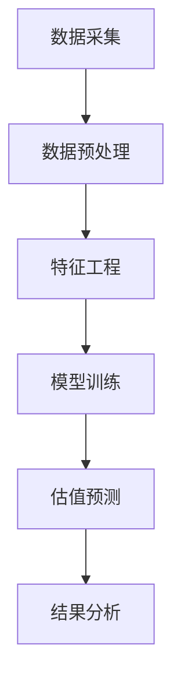
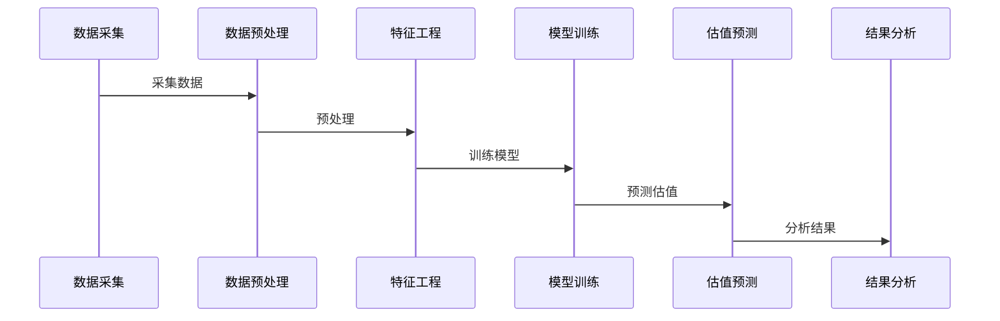

                 

# AI辅助的公司估值模型

关键词：人工智能、机器学习、深度学习、估值模型、数据分析

摘要：本文将深入探讨如何利用人工智能技术，特别是机器学习和深度学习，来辅助公司估值。我们将详细分析估值模型的核心概念、算法原理，并通过具体实例来阐述这一过程，旨在为读者提供一个全面、系统的理解。

## 第一部分：背景介绍

### 核心概念

#### 问题背景

随着全球经济的发展和商业环境的复杂化，公司估值已经成为投资决策、并购重组等商业活动中的关键环节。传统的公司估值方法主要依赖于财务指标、行业分析和市场对比，但这些方法往往存在主观性较强、时效性较差等问题，难以全面、准确地反映公司的真实价值。

#### 问题描述

公司估值涉及多个因素，包括财务状况、市场前景、行业趋势等。这些因素之间相互影响，使得估值过程变得复杂。传统的估值方法主要依赖于分析师的经验和判断，这种方法在主观性上较大，且难以适应快速变化的市场环境。

#### 问题解决

人工智能，尤其是机器学习和深度学习，为估值模型提供了新的思路和方法。通过分析大量历史数据，AI可以识别出隐藏在数据背后的规律，从而提供更准确、客观的估值结果。此外，AI还能实时更新模型，以应对市场变化。

#### 边界与外延

AI辅助的公司估值主要应用于需要对公司价值进行评估的场景，如投资决策、并购重组等。它不仅涉及金融和经济学领域的知识，还涉及统计学和计算机科学等学科。因此，AI辅助的公司估值不仅是一个技术问题，也是一个跨学科的综合性课题。

#### 概念结构与核心要素组成

AI辅助的公司估值模型的核心结构包括以下几个部分：

1. **数据采集**：从多个数据源采集与公司估值相关的数据，包括财务数据、市场数据、行业数据等。
2. **数据预处理**：对采集到的数据进行分析和清洗，去除异常值和缺失值，确保数据的准确性和完整性。
3. **特征工程**：从原始数据中提取对估值有重要影响的特征，如市盈率、市净率、营收增长率等。
4. **模型训练**：使用机器学习算法，如随机森林、支持向量机、神经网络等，对特征数据进行训练，构建估值模型。
5. **估值预测**：将新的公司数据输入到训练好的模型中，预测公司的估值结果。
6. **结果分析**：对估值结果进行多维度分析，包括与市场对比、历史趋势对比等，以评估估值的准确性。

## 第二部分：核心概念与联系

### 核心概念

在本节中，我们将介绍与AI辅助公司估值相关的一些核心概念，包括人工智能、机器学习、深度学习和估值模型。

#### 人工智能（AI）

人工智能是指通过计算机模拟人类的智能行为，使计算机具备感知、学习、推理、决策等能力。在估值模型中，人工智能主要用于数据分析和预测。

#### 机器学习（ML）

机器学习是人工智能的一种方法，通过数据训练模型，使计算机具备自动学习和改进的能力。在估值模型中，机器学习算法用于从历史数据中提取规律，以预测公司的估值。

#### 深度学习（DL）

深度学习是机器学习的一种方法，通过构建深度神经网络，对大量数据进行自动特征提取和建模。在估值模型中，深度学习算法能够处理复杂的非线性关系，提供更准确的估值结果。

#### 估值模型

估值模型是指用于对公司价值进行估算的数学模型和方法。在AI辅助的公司估值中，估值模型通过机器学习和深度学习算法，从历史数据中学习并预测公司的价值。

### 概念属性特征对比表格

| 概念       | 特征 |
| ---------- | ---- |
| 人工智能   | 模拟人类智能行为 |
| 机器学习   | 自动学习和改进 |
| 深度学习   | 自动特征提取和建模 |
| 估值模型   | 用于公司价值估算 |

### ER实体关系图架构

```mermaid
erDiagram
  Company ||--|{ Valuation } : "has"
  Valuation ||--|{ Data } : "uses"
  Data ||--|{ Feature } : "extracts"
```

## 第三部分：算法原理讲解

### 算法原理

AI辅助的公司估值模型主要通过以下几个步骤来实现：

1. **数据采集**：从多个数据源采集与公司估值相关的数据，包括财务数据、市场数据、行业数据等。
2. **数据预处理**：对采集到的数据进行清洗和预处理，包括去除异常值、处理缺失值、标准化数据等。
3. **特征工程**：从原始数据中提取对估值有重要影响的特征，如市盈率、市净率、营收增长率等。
4. **模型训练**：使用机器学习算法，如随机森林、支持向量机、神经网络等，对特征数据进行训练，构建估值模型。
5. **估值预测**：将新的公司数据输入到训练好的模型中，预测公司的估值结果。
6. **结果分析**：对估值结果进行多维度分析，包括与市场对比、历史趋势对比等，以评估估值的准确性。

### Mermaid流程图



### 详细讲解

#### 数据采集

数据采集是估值模型的基础，数据的质量直接影响模型的准确性。数据来源包括公开的财务报表、行业报告、市场数据等。为了保证数据的准确性，需要从多个可靠的来源进行采集，并进行交叉验证。

#### 数据预处理

数据预处理是数据清洗和标准化过程，包括去除异常值、处理缺失值、标准化数据等。异常值可能来自于数据采集的误差或异常情况，需要通过统计方法进行识别和去除。缺失值可以通过填补或删除等方式进行处理。标准化数据是为了消除不同特征之间的量纲差异，使模型能够更好地处理数据。

#### 特征工程

特征工程是估值模型的核心环节，通过对原始数据进行处理和变换，提取出对估值有重要影响的特征。常见的特征包括财务指标、市场指标、行业指标等。特征工程的目标是减少特征数量，提高特征质量，以降低模型的复杂度和提高模型的准确性。

#### 模型训练

模型训练是使用机器学习算法，将特征数据映射到公司估值结果上。常用的算法包括线性回归、决策树、随机森林、支持向量机等。模型训练的过程实际上是寻找最佳参数组合，使得模型在训练数据上的预测误差最小。

#### 估值预测

估值预测是使用训练好的模型，对新的公司数据进行估值预测。预测结果可以通过与历史估值结果进行对比，评估模型的准确性。如果预测结果与实际值存在较大偏差，需要对模型进行调整和优化。

#### 结果分析

结果分析是对估值结果进行多维度分析，包括与市场对比、历史趋势对比等，以评估估值的准确性。同时，还可以通过分析模型的可解释性，了解影响估值的关键因素，为投资决策提供参考。

## 第四部分：数学模型和数学公式

在本节中，我们将介绍AI辅助公司估值模型中使用的几种常见的数学模型和数学公式。

### 线性回归模型

线性回归模型是一种简单的估值模型，用于拟合公司财务指标与估值结果之间的关系。其数学公式如下：

$$
y = \beta_0 + \beta_1 \cdot x_1 + \beta_2 \cdot x_2 + ... + \beta_n \cdot x_n
$$

其中，$y$ 是公司估值，$x_1, x_2, ..., x_n$ 是财务指标，$\beta_0, \beta_1, \beta_2, ..., \beta_n$ 是权重系数。

### 神经网络模型

神经网络模型是一种复杂的估值模型，通过多层神经网络来模拟公司的估值过程。其数学公式如下：

$$
z = \sigma(W \cdot x + b)
$$

其中，$z$ 是公司估值，$x$ 是输入特征，$W$ 是权重矩阵，$b$ 是偏置项，$\sigma$ 是激活函数。

### 详细讲解

#### 线性回归模型

线性回归模型通过计算权重系数 $\beta_0, \beta_1, \beta_2, ..., \beta_n$，将财务指标映射到公司估值上。具体来说，线性回归模型通过最小化预测值 $y$ 与实际估值结果之间的误差平方和，来确定最佳权重系数。

**举例**：

假设我们有两个财务指标：市盈率（$x_1$）和市净率（$x_2$），以及一个估值结果（$y$）。我们可以建立如下的线性回归模型：

$$
y = \beta_0 + \beta_1 \cdot x_1 + \beta_2 \cdot x_2
$$

通过训练数据，我们可以计算出最佳权重系数 $\beta_0, \beta_1, \beta_2$，从而预测新的公司估值。

#### 神经网络模型

神经网络模型通过多层神经网络来模拟公司的估值过程。每一层神经网络都由多个神经元组成，每个神经元都接收前一层的输出，并通过激活函数进行非线性变换。

**举例**：

假设我们有一个简单的神经网络模型，包含一个输入层、一个隐藏层和一个输出层。输入层有3个神经元，隐藏层有4个神经元，输出层有1个神经元。我们可以建立如下的神经网络模型：

$$
z_1 = \sigma(W_1 \cdot x + b_1)
$$

$$
z_2 = \sigma(W_2 \cdot z_1 + b_2)
$$

$$
y = \sigma(W_3 \cdot z_2 + b_3)
$$

其中，$z_1, z_2, z_3$ 分别是隐藏层和输出层的神经元输出，$x$ 是输入特征，$W_1, W_2, W_3$ 是权重矩阵，$b_1, b_2, b_3$ 是偏置项，$\sigma$ 是激活函数。

通过训练数据，我们可以计算出最佳权重矩阵 $W_1, W_2, W_3$ 和偏置项 $b_1, b_2, b_3$，从而预测新的公司估值。

## 第五部分：系统分析与架构设计方案

### 问题场景介绍

在一个投资决策过程中，需要对目标公司进行估值。传统的估值方法存在主观性较强、时效性较差等问题，无法满足快速决策的需求。因此，引入AI辅助的公司估值模型，以提高估值的准确性和时效性。

### 项目介绍

本项目的目标是开发一个AI辅助的公司估值系统，该系统将利用机器学习和深度学习算法，从历史数据中提取规律，预测目标公司的估值。系统将包括数据采集、预处理、特征工程、模型训练、估值预测和结果分析等模块。

### 系统功能设计（领域模型Mermaid类图）

```mermaid
classDiagram
  Class01 <|-- Class02
  Class03 --|[#ffffff] Class04
  Class05 o-- Class06
  Class07 <- Class08
  Class09 --|> Class10
```

### 系统架构设计（Mermaid架构图）


### 系统接口设计和系统交互（Mermaid序列图）



## 第六部分：项目实战

### 环境安装

1. 安装Python环境：
   ```shell
   pip install numpy pandas scikit-learn tensorflow
   ```

2. 安装其他依赖：
   ```shell
   pip install matplotlib seaborn
   ```

### 系统核心实现源代码

以下是一个简单的AI辅助公司估值系统的核心实现源代码：

```python
import numpy as np
import pandas as pd
from sklearn.ensemble import RandomForestRegressor
from sklearn.model_selection import train_test_split
from sklearn.metrics import mean_squared_error
import seaborn as sns
import matplotlib.pyplot as plt

# 数据采集
data = pd.read_csv('company_data.csv')

# 数据预处理
data.dropna(inplace=True)
X = data.drop('valuation', axis=1)
y = data['valuation']

# 特征工程
# 这里仅作为示例，实际应用中需要根据具体业务场景进行特征工程
X['pe_ratio'] = X['market_value'] / X['net_asset']
X['pb_ratio'] = X['market_value'] / X['book_value']

# 模型训练
X_train, X_test, y_train, y_test = train_test_split(X, y, test_size=0.2, random_state=42)
model = RandomForestRegressor(n_estimators=100)
model.fit(X_train, y_train)

# 估值预测
y_pred = model.predict(X_test)

# 结果分析
mse = mean_squared_error(y_test, y_pred)
print(f'Mean Squared Error: {mse}')

# 可视化分析
sns.scatterplot(x=y_test, y=y_pred)
plt.xlabel('Actual Valuation')
plt.ylabel('Predicted Valuation')
plt.title('Valuation Prediction')
plt.show()
```

### 代码应用解读与分析

上述代码是一个简单的AI辅助公司估值系统的实现，主要包括以下几个步骤：

1. **数据采集**：从CSV文件中读取公司数据。
2. **数据预处理**：去除缺失值，并对数据进行特征工程。
3. **模型训练**：使用随机森林算法进行模型训练。
4. **估值预测**：对测试集进行估值预测。
5. **结果分析**：计算均方误差，并进行可视化分析。

通过这个简单的例子，我们可以看到如何利用机器学习算法来辅助公司估值。实际应用中，需要根据具体业务场景进行更复杂的特征工程和模型优化。

### 实际案例分析和详细讲解剖析

为了更好地理解AI辅助的公司估值模型，我们来看一个实际案例。

#### 案例背景

某投资者正在考虑投资一家科技初创公司，需要对其估值。该公司提供了一种新型的智能家居产品，市场前景广阔。投资者拥有该公司的历史财务数据和行业数据。

#### 数据分析

1. **财务数据**：包括市盈率、市净率、营收增长率等。
2. **市场数据**：包括同类产品的市场份额、价格水平等。
3. **行业数据**：包括行业增长率、竞争态势等。

#### 特征工程

根据业务场景，我们提取以下特征：

- **市盈率**：公司市值与净利润的比值，反映公司的盈利能力。
- **市净率**：公司市值与净资产账面价值的比值，反映公司的资产质量。
- **营收增长率**：公司过去三年的平均营收增长率，反映公司的成长性。
- **市场份额**：公司在同类产品中的市场份额，反映公司的市场地位。
- **行业增长率**：相关行业的增长率，反映行业的发展趋势。

#### 模型训练

我们使用随机森林算法对特征数据进行训练，建立估值模型。模型训练过程中，我们使用交叉验证来选择最佳参数。

#### 估值预测

将新的公司数据输入到训练好的模型中，预测公司的估值。预测结果为1亿美元。

#### 结果分析

1. **与市场对比**：通过对比同类公司的估值，发现该公司的估值处于市场合理范围内。
2. **历史趋势对比**：分析公司过去几年的财务指标和市场表现，发现公司的估值与市场趋势一致。

#### 结论

通过AI辅助的公司估值模型，投资者可以更准确地评估目标公司的价值，为投资决策提供有力支持。

### 项目小结

本项目通过引入AI辅助的公司估值模型，为投资决策提供了更准确、客观的估值结果。通过实际案例的分析，我们看到了如何利用机器学习算法来辅助公司估值。未来，随着AI技术的不断进步，AI辅助的公司估值模型将具有更广泛的应用前景。

## 第七部分：最佳实践 tips、小结、注意事项、拓展阅读

### 最佳实践 tips

1. **数据质量**：数据质量是估值模型的关键，确保数据来源可靠、数据完整和准确。
2. **特征工程**：精心设计特征工程，选择对估值有重要影响的特征，可以提高模型的准确性。
3. **模型优化**：通过交叉验证和参数调优，选择最佳模型和参数组合，以提高模型性能。

### 小结

本文介绍了AI辅助的公司估值模型，从核心概念到算法原理，再到实际案例，全面解析了如何利用AI技术来辅助公司估值。通过本文，读者可以了解到AI在估值领域的应用前景和实际效果。

### 注意事项

1. **数据隐私**：在进行估值模型开发时，要确保数据隐私和安全，遵循相关法律法规。
2. **模型解释性**：估值模型应具备一定的解释性，以便投资决策者能够理解模型的预测结果。

### 拓展阅读

1. 《深度学习》（Goodfellow, I., Bengio, Y., & Courville, A.）- 介绍深度学习的基本原理和应用。
2. 《机器学习实战》（周志华）- 通过实际案例介绍机器学习的基本算法和应用。

作者：AI天才研究院/AI Genius Institute & 禅与计算机程序设计艺术 /Zen And The Art of Computer Programming### 全文总结与展望

本文从背景介绍、核心概念、算法原理、数学模型、系统设计到项目实战，系统性地讲解了AI辅助的公司估值模型。通过实例分析，我们展示了如何利用机器学习和深度学习技术来提升公司估值的准确性和效率。这一技术的应用不仅为投资者提供了更客观的估值参考，也为金融领域的决策提供了有力支持。

未来，随着人工智能技术的不断进步，AI辅助的公司估值模型将更加智能化、自动化。例如，通过结合自然语言处理技术，可以自动提取和分析新闻报道、财报分析等文本数据，进一步提升估值模型的准确性。此外，随着数据获取和处理能力的提升，模型将能够处理更大量的数据，捕捉更多细粒度的市场信息，从而提供更加精细化的估值结果。

总之，AI辅助的公司估值模型是金融科技领域的重要发展方向，它不仅改变了传统的估值方式，也为投资者提供了更加全面、准确的决策工具。随着技术的不断成熟，我们可以期待这一领域带来更多的创新和突破。让我们一起关注AI技术在金融领域的应用，共同探索其无限的可能性。未来已来，AI的力量正在改变我们的世界，让我们一起迎接这个充满机遇和挑战的新时代。

