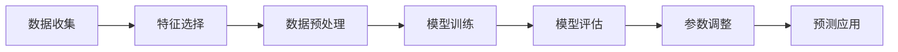
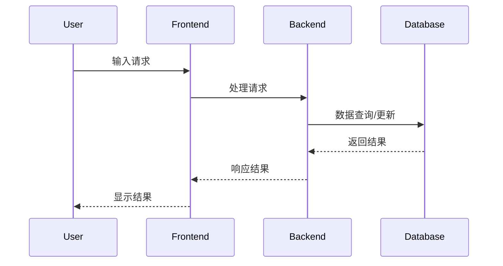
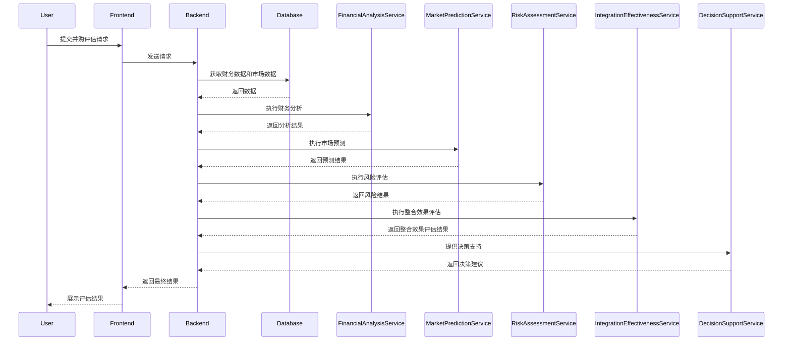

                 

### 引言

#### 书名介绍

《AI辅助的公司并购整合评估》是一本旨在介绍如何利用人工智能（AI）技术辅助公司并购整合评估过程的书籍。随着全球经济的快速发展，公司间的并购活动日益频繁，而如何高效、准确地评估并购整合的潜在价值和风险成为企业决策者面临的重要问题。本书的核心内容将围绕AI技术在并购整合评估中的应用展开，旨在通过系统化的方法论和实践指导，帮助企业和专业顾问更好地理解和应用AI技术，从而实现并购整合评估的智能化和科学化。

本书的写作初衷主要有两个方面：一是填补现有并购整合评估领域的知识空白，尤其是AI技术在该领域的应用研究；二是为企业管理者和并购顾问提供实用的工具和方法，提升并购整合评估的效率和准确性。通过本书，读者将能够了解AI技术在并购整合评估中的基本概念、算法原理、数学模型以及实际应用案例，从而为企业在并购决策中提供强有力的技术支持。

#### 核心内容

本书的主要内容包括以下几个部分：

1. **AI基础**：介绍人工智能的基本概念、发展历程和核心技术，帮助读者建立对AI的整体认知。
2. **并购整合评估**：阐述并购和整合评估的基本概念、过程和目标，为后续的AI应用打下基础。
3. **AI与并购整合评估的关系**：分析AI技术在并购评估和整合评估中的具体应用场景和优势。
4. **算法原理讲解**：详细讲解并购评估和整合评估的算法原理，包括流程图和Python源代码示例。
5. **数学模型和公式**：使用LaTeX格式给出并购评估和整合评估的数学模型和公式，并进行举例说明。
6. **系统分析与架构设计方案**：介绍并购整合评估系统的场景、功能设计、系统架构设计、接口设计和系统交互设计。
7. **项目实战**：通过一个具体的并购整合评估项目实战，展示系统的安装、配置和核心实现过程。
8. **最佳实践、小结与拓展阅读**：总结全书的核心内容，提供实践建议和拓展资源。

通过上述内容的系统介绍，本书旨在为读者提供一份全面、深入且实用的并购整合评估指南，助力企业在复杂多变的商业环境中做出明智的并购决策。

#### 目的与结构

本书的目的是通过系统化的方法论和实践指导，帮助企业管理者、并购顾问和IT专业人士更好地理解和应用人工智能（AI）技术，以辅助公司并购整合评估过程。在商业并购活动中，评估整合的潜在价值和风险是决策的关键步骤，而传统的评估方法往往存在效率低、准确性不足等问题。本书旨在通过引入AI技术，提升并购评估的科学性和智能化水平，从而提高并购整合的成功率。

本书的整体结构设计如下：

- **第1章 引言**：介绍书名背景、核心内容和书籍结构，明确阅读目标和路径。
- **第2章 AI基础**：讲解人工智能的基本概念、发展历程和核心技术，为后续内容打下基础。
- **第3章 并购整合评估的核心概念**：详细阐述并购和整合评估的基本概念、过程和目标。
- **第4章 算法原理讲解**：介绍并购评估和整合评估的算法原理，包括流程图和Python源代码示例。
- **第5章 数学模型和公式**：使用LaTeX格式给出相关数学模型和公式，并进行详细讲解和举例说明。
- **第6章 系统分析与架构设计方案**：介绍并购整合评估系统的设计，包括场景、功能、架构、接口和交互设计。
- **第7章 项目实战**：展示一个具体的并购整合评估项目实战，包括环境安装、系统实现和案例分析。
- **第8章 最佳实践、小结与拓展阅读**：总结全书内容，提供实践建议和拓展资源。

通过上述结构的系统安排，本书旨在为读者提供一个全面、深入且易于操作的学习路径，帮助其在实际工作中有效应用AI技术，实现并购整合评估的智能化和高效化。

### AI在公司并购整合评估中的应用背景

#### 研究背景

随着全球化的加速和市场竞争的加剧，企业间的并购活动变得愈加频繁。并购不仅是企业扩张和市场占领的重要手段，也是企业实现战略转型和提升竞争力的重要途径。然而，并购活动中的整合评估过程复杂且具有高度不确定性，这对企业的决策质量和效率提出了巨大挑战。传统的并购评估方法主要依赖于财务分析和专家判断，存在诸多局限性，如信息不对称、数据不准确、主观偏见等，导致评估结果存在较大的误差。

近年来，人工智能（AI）技术的发展为并购整合评估提供了新的思路和工具。AI技术能够通过对海量数据的处理和分析，自动识别潜在价值点和风险因素，提高评估的准确性和效率。尤其是在大数据、机器学习和深度学习等技术的推动下，AI在金融、医疗、零售等领域的应用取得了显著成果。这些成功案例表明，AI技术具有在复杂环境中进行数据挖掘、模式识别和预测分析的能力，为公司并购整合评估提供了强有力的支持。

因此，研究AI在并购整合评估中的应用具有重要的理论和实际意义。一方面，通过AI技术可以提升并购评估的科学性和客观性，减少人为因素的干扰，从而提高决策的质量和可靠性；另一方面，AI的应用可以帮助企业快速响应市场变化，降低并购过程中的不确定性，提高并购整合的成功率。

#### 研究问题

1. **数据准确性问题**：传统的并购评估依赖于历史数据和财务报表，但这些数据的准确性和完整性往往难以保证。AI技术可以通过对非结构化和半结构化数据的挖掘和分析，提高数据处理的准确性和全面性。
   
2. **评估效率问题**：并购整合评估通常涉及大量的计算和判断过程，传统方法往往耗时较长。AI技术可以通过自动化算法和并行计算，显著提高评估的效率和速度。

3. **主观偏见问题**：并购评估过程中，专家的主观判断往往会影响评估结果的公正性。AI技术可以通过机器学习算法，消除人为偏见，提供更加客观、一致的评估结果。

4. **风险识别问题**：并购整合过程中可能存在各种潜在风险，如市场风险、财务风险和法律风险等。AI技术可以通过模式识别和预测分析，提前识别和评估潜在风险，为决策提供有力支持。

#### 解决方法

1. **大数据分析**：通过收集和整合来自不同来源的数据，如财务报表、市场数据、社交媒体数据等，AI技术可以对并购目标进行全面的背景调查和分析。

2. **机器学习**：利用机器学习算法，如回归分析、聚类分析和决策树等，对并购评估中的关键指标进行建模和预测。

3. **自然语言处理（NLP）**：通过NLP技术，AI可以自动处理和理解文本数据，如新闻报告、公司公告等，提取关键信息并进行情感分析。

4. **深度学习**：深度学习算法，如神经网络和卷积神经网络（CNN）等，可以用于处理复杂的数据模式，提高评估的精度和可靠性。

5. **实时监控与预警系统**：通过建立实时监控和预警系统，AI技术可以持续跟踪并购过程中各环节的动态变化，及时发现并应对潜在问题。

#### 边界与外延

虽然AI技术在并购整合评估中具有显著优势，但也存在一些边界和限制。首先，AI技术依赖于高质量的数据输入，如果数据质量不佳，可能会导致评估结果失真。其次，AI算法的复杂性和计算资源的需求可能会限制其实际应用的范围。此外，AI技术尚未完全解决对复杂商业问题的理解能力，特别是在涉及多维度、多因素交互的并购评估中，AI技术的应用效果仍需进一步验证。

总的来说，AI在并购整合评估中的应用是一个充满潜力且富有挑战性的领域。通过不断探索和优化，AI技术有望成为企业并购决策的重要工具，推动并购整合评估的科学化、智能化进程。

### 并购和整合评估的基本概念

#### 并购概述

**定义**：并购（Merger and Acquisition，简称M&A）是指一家企业通过购买另一家企业的全部或部分资产和股份，从而获得对该企业的控制权的过程。并购可以分为以下几种类型：

1. **兼并（Merger）**：一家公司完全吸收另一家公司，被收购公司不再作为独立的法律实体存在。
2. **收购（Acquisition）**：一家公司购买另一家公司的股份或资产，但不一定获得完全控制权。
3. **联合并购（Consortium Merger）**：多家公司联合进行并购，共同控制目标公司。

**目的**：企业进行并购的主要目的是实现资源整合、市场扩张、技术创新和提升竞争力。具体包括：

1. **市场扩张**：通过并购进入新的市场或扩大现有市场份额。
2. **资源整合**：整合目标公司的资源，如技术、品牌、客户群等，以提升自身实力。
3. **财务效应**：通过并购实现税盾效应、优化资本结构、提升每股收益等。
4. **战略协同**：并购可以弥补企业自身的战略短板，实现优势互补。

#### 整合评估概述

**定义**：整合评估（Integration Assessment）是指在并购完成后，对并购整合过程及其效果进行评估和监控的过程。整合评估旨在确保并购目标的实现，并识别和解决并购过程中的问题。

**过程**：整合评估通常包括以下几个关键步骤：

1. **目标确定**：明确并购整合的目标和预期效果，如市场占有率提升、成本降低等。
2. **现状分析**：分析并购双方在企业文化、组织结构、业务流程等方面的现状，识别差异和冲突点。
3. **整合策略制定**：制定整合计划，包括整合方式、整合步骤和时间表等。
4. **执行与监控**：执行整合计划，并通过监控和评估确保整合目标的实现。
5. **效果评估**：对整合效果进行评估，包括整合进度、整合效果和潜在风险等。

**目标**：整合评估的主要目标包括：

1. **确保整合计划的有效实施**：通过评估确保整合计划的实施符合预期目标。
2. **识别和解决整合过程中的问题**：及时发现并解决整合过程中的障碍和问题，如文化冲突、流程不畅等。
3. **提升整合效果**：通过不断评估和优化，提升整合效果，实现并购预期目标。

#### AI辅助并购整合评估的概念联系

**AI在并购评估中的应用**：

- **数据挖掘与分析**：利用AI技术对大量并购数据进行分析，识别并购活动的潜在价值点和风险因素。
- **风险评估与预测**：通过机器学习算法对并购活动中的各种风险进行预测和评估，提供决策支持。
- **模式识别与趋势分析**：利用深度学习算法识别并购活动中的趋势和模式，为企业制定并购策略提供参考。

**AI在整合评估中的应用**：

- **流程自动化**：利用AI技术自动化执行整合过程中的各项任务，提高整合效率。
- **实时监控与预警**：通过实时监控和预警系统，及时发现整合过程中的问题并采取措施。
- **数据驱动的决策支持**：利用AI技术对整合过程中的数据进行处理和分析，为决策者提供数据驱动的建议。

通过上述应用，AI不仅能够提高并购评估和整合评估的效率和准确性，还能够减少人为因素的干扰，提升评估的客观性和一致性。这种技术手段的引入，有助于企业更科学地制定并购决策，提高并购整合的成功率。

#### AI在并购整合评估中的优势

AI技术在并购整合评估中的应用带来了显著的优势，使得这一过程更加高效、准确和科学。以下是AI技术在这一领域的具体优势：

1. **数据处理能力**：
   - **海量数据整合**：AI技术能够高效处理并整合来自不同来源的海量数据，如财务报表、市场趋势、客户反馈等。这种能力有助于全面分析并购目标公司的历史表现、市场定位和发展潜力。
   - **数据清洗与预处理**：AI技术通过自然语言处理（NLP）和机器学习算法，可以自动清洗和预处理非结构化和半结构化数据，确保数据的准确性和一致性。

2. **模式识别与预测**：
   - **趋势分析**：AI技术能够从历史数据中挖掘出潜在的并购趋势和模式，预测未来的市场变化和并购动向，为企业制定并购策略提供有力支持。
   - **风险识别**：通过机器学习算法，AI可以提前识别并购活动中的潜在风险，如市场风险、财务风险和法律风险等，帮助企业制定风险应对策略。

3. **自动化评估**：
   - **流程自动化**：AI技术能够自动化执行并购评估过程中的各项任务，如财务分析、市场分析、风险评估等，减少人工工作量，提高评估效率。
   - **实时监控**：AI系统可以实时监控并购整合的进展，发现并预警潜在问题，确保整合过程的顺利进行。

4. **减少人为偏见**：
   - **客观评估**：AI技术通过算法和模型进行评估，减少了主观偏见和人为因素的影响，提供更加客观、一致的评估结果。
   - **标准化流程**：AI技术使得评估流程更加标准化，减少了人为操作的误差，提高了评估结果的可靠性和一致性。

5. **优化决策支持**：
   - **数据驱动的决策**：AI技术通过对大量数据的分析，为并购决策提供数据驱动的建议，帮助企业更科学地制定并购计划。
   - **多维分析**：AI技术能够从多个维度对并购目标进行综合分析，包括财务、市场、技术等方面，提供全面、深入的决策支持。

6. **提升整合效果**：
   - **文化融合**：AI技术可以通过分析文化数据，帮助并购双方更好地理解对方的文化差异，制定有效的文化融合策略。
   - **流程优化**：AI技术能够识别整合过程中的瓶颈和低效环节，提出优化建议，提高整合效果。

总的来说，AI技术在并购整合评估中的应用，不仅提高了评估的效率和准确性，还减少了人为因素带来的不确定性，为企业提供了更科学、客观的决策支持，从而提高了并购整合的成功率。

#### 并购评估算法原理讲解

在并购评估中，算法的选择和应用是至关重要的，因为它们能够直接影响评估结果的准确性和可靠性。本文将详细讲解两种并购评估算法：基于回归分析和基于决策树的方法。我们将通过mermaid流程图和Python源代码来展示这些算法的基本原理和实现过程。

##### 回归分析算法

**原理**：回归分析是一种统计方法，用于分析因变量（目标变量）和自变量（特征变量）之间的关系。在并购评估中，可以通过回归分析来预测目标公司的未来盈利能力或其他关键指标。

**流程**：

1. **数据收集**：收集目标公司的历史财务数据、市场数据等相关信息。
2. **特征选择**：选择与并购评估相关的特征，如营业收入、净利润、市场份额等。
3. **数据预处理**：对数据进行清洗和标准化处理，以消除异常值和量纲不一致的问题。
4. **模型训练**：使用训练数据集训练回归模型，如线性回归、岭回归或LASSO回归。
5. **模型评估**：使用验证数据集评估模型的准确性，调整模型参数以优化评估结果。
6. **预测应用**：使用训练好的模型对新数据进行分析和预测。

**mermaid流程图**：



**Python源代码示例**：

```python
import pandas as pd
from sklearn.linear_model import LinearRegression
from sklearn.model_selection import train_test_split
from sklearn.metrics import mean_squared_error

# 数据加载
data = pd.read_csv('company_data.csv')

# 特征选择
X = data[['revenue', 'net_profit', 'market_share']]
y = data['profit']

# 数据预处理
X_train, X_test, y_train, y_test = train_test_split(X, y, test_size=0.2, random_state=42)

# 模型训练
model = LinearRegression()
model.fit(X_train, y_train)

# 模型评估
y_pred = model.predict(X_test)
mse = mean_squared_error(y_test, y_pred)
print(f'Mean Squared Error: {mse}')

# 预测应用
new_data = pd.DataFrame([[100, 5, 0.3]], columns=['revenue', 'net_profit', 'market_share'])
profit_pred = model.predict(new_data)
print(f'Predicted Profit: {profit_pred[0]}')
```

##### 决策树算法

**原理**：决策树是一种基于树形结构进行决策的算法，通过一系列的判断条件将数据集划分成若干子集，每个子集对应一个特定的结果。

**流程**：

1. **数据收集**：收集目标公司的历史财务数据、市场数据等相关信息。
2. **特征选择**：选择与并购评估相关的特征，如营业收入、净利润、市场份额等。
3. **数据预处理**：对数据进行清洗和标准化处理，以消除异常值和量纲不一致的问题。
4. **模型训练**：使用训练数据集训练决策树模型。
5. **模型评估**：使用验证数据集评估模型的准确性，并根据评估结果调整模型参数。
6. **预测应用**：使用训练好的模型对新数据进行分析和预测。

**mermaid流程图**：


**Python源代码示例**：

```python
import pandas as pd
from sklearn.tree import DecisionTreeRegressor
from sklearn.model_selection import train_test_split
from sklearn.metrics import mean_squared_error

# 数据加载
data = pd.read_csv('company_data.csv')

# 特征选择
X = data[['revenue', 'net_profit', 'market_share']]
y = data['profit']

# 数据预处理
X_train, X_test, y_train, y_test = train_test_split(X, y, test_size=0.2, random_state=42)

# 模型训练
model = DecisionTreeRegressor(random_state=42)
model.fit(X_train, y_train)

# 模型评估
y_pred = model.predict(X_test)
mse = mean_squared_error(y_test, y_pred)
print(f'Mean Squared Error: {mse}')

# 预测应用
new_data = pd.DataFrame([[100, 5, 0.3]], columns=['revenue', 'net_profit', 'market_share'])
profit_pred = model.predict(new_data)
print(f'Predicted Profit: {profit_pred[0]}')
```

通过以上两种算法的讲解，我们可以看到回归分析和决策树在并购评估中的应用。回归分析通过建立数学模型来预测目标公司的未来盈利能力，而决策树通过树形结构进行分类和预测。这两种算法各有优势，适用于不同的并购评估场景。企业可以根据实际情况选择合适的算法，或结合多种算法进行综合评估，以提高评估的准确性和可靠性。

#### 并购整合评估的数学模型

在并购整合评估中，数学模型扮演着至关重要的角色。它们不仅能够帮助我们量化评估过程中的各种因素，还能够提供预测和优化的工具。本文将介绍并购整合评估中常用的数学模型，并使用LaTeX格式给出相关公式，进行详细讲解和举例说明。

##### 成本效益分析模型

**原理**：成本效益分析模型用于评估并购整合过程中的成本与收益，判断并购是否能够带来正的净收益。

**公式**：

\[ \text{Net Benefit} = \text{Revenue from Integration} - \text{Cost of Integration} \]

**LaTeX格式**：

\[ \text{Net Benefit} = \text{Revenue from Integration} - \text{Cost of Integration} \]

**举例说明**：

假设某企业计划并购另一家企业，预计并购后每年可增加销售收入100万元，但并购整合过程中将产生50万元的成本。则该并购项目的净收益为：

\[ \text{Net Benefit} = 100\text{万元} - 50\text{万元} = 50\text{万元} \]

##### 财务预测模型

**原理**：财务预测模型用于预测并购整合后的财务表现，包括收入、利润和现金流等。

**公式**：

\[ \text{Projected Financial Statement} = \text{Revenue Forecast} - \text{Expense Forecast} \]

\[ \text{Cash Flow} = \text{Operating Cash Flow} - \text{Capital Expenditure} \]

**LaTeX格式**：

\[ \text{Projected Financial Statement} = \text{Revenue Forecast} - \text{Expense Forecast} \]

\[ \text{Cash Flow} = \text{Operating Cash Flow} - \text{Capital Expenditure} \]

**举例说明**：

假设某企业并购后预计年收入为1000万元，年运营成本为600万元，年资本支出为200万元。则其预计现金流为：

\[ \text{Cash Flow} = 1000\text{万元} - 600\text{万元} - 200\text{万元} = 200\text{万元} \]

##### 整合效果评估模型

**原理**：整合效果评估模型用于评估并购整合后各项指标的变化，包括市场份额、客户满意度等。

**公式**：

\[ \text{Integration Effectiveness} = \frac{\text{Integrated Performance} - \text{Base Performance}}{\text{Base Performance}} \]

**LaTeX格式**：

\[ \text{Integration Effectiveness} = \frac{\text{Integrated Performance} - \text{Base Performance}}{\text{Base Performance}} \]

**举例说明**：

假设某企业并购前市场份额为20%，并购后市场份额提升至25%。则其整合效果为：

\[ \text{Integration Effectiveness} = \frac{25\% - 20\%}{20\%} = 25\% \]

##### 风险评估模型

**原理**：风险评估模型用于评估并购整合过程中可能面临的各种风险，包括财务风险、市场风险等。

**公式**：

\[ \text{Risk Score} = \sum_{i=1}^{n} \text{Risk Factor}_i \times \text{Weight}_i \]

**LaTeX格式**：

\[ \text{Risk Score} = \sum_{i=1}^{n} \text{Risk Factor}_i \times \text{Weight}_i \]

**举例说明**：

假设某企业面临以下三种风险因素，每种因素的风险得分为1-10分，权重分别为0.4、0.3和0.3。则其总风险得分为：

\[ \text{Risk Score} = 7 \times 0.4 + 5 \times 0.3 + 8 \times 0.3 = 4.8 + 1.5 + 2.4 = 8.7 \]

通过以上几个数学模型的介绍，我们可以看到，并购整合评估中的数学模型不仅能够帮助我们量化评估过程中的各种因素，还能够提供有效的预测和优化工具。企业在进行并购整合评估时，可以根据实际情况选择合适的模型，以提高评估的准确性和决策的科学性。

#### 并购整合评估系统分析与架构设计方案

在构建一个并购整合评估系统时，我们需要从多个角度进行系统分析和架构设计，以确保系统能够高效、准确地支持并购评估和整合过程。以下将详细介绍项目场景、系统功能设计、系统架构设计、系统接口设计以及系统交互设计。

##### 项目场景

**项目背景**：某企业计划进行一系列的并购活动，以实现市场扩张和业务多元化。然而，并购活动涉及众多复杂因素，如财务分析、市场预测、风险评估等。为了提高并购评估的准确性和效率，企业决定开发一套AI辅助的并购整合评估系统。

**项目目标**：通过系统化、智能化的方式，提高并购整合评估的效率和准确性，减少人为错误，并提供全面的数据支持和决策建议。

##### 系统功能设计

**功能概述**：
1. **数据收集与处理**：收集目标公司的财务报表、市场数据、历史交易数据等，并进行数据清洗和预处理。
2. **财务分析**：对目标公司的财务表现进行分析，包括盈利能力、偿债能力、流动性分析等。
3. **市场预测**：利用机器学习算法对市场趋势进行预测，包括市场份额变化、价格走势等。
4. **风险评估**：对并购活动中的各种风险因素进行评估，包括市场风险、财务风险、法律风险等。
5. **整合效果评估**：评估并购整合后的效果，包括市场份额提升、成本降低等。
6. **决策支持**：提供数据驱动的决策建议，包括并购目标选择、整合策略制定等。

**领域模型**：

使用Mermaid类图表示系统的主要领域模型：

```mermaid
classDiagram
    Company <<Class>> "公司"
    FinancialData <<Class>> "财务数据"
    MarketData <<Class>> "市场数据"
    PredictiveAnalysis <<Class>> "预测分析"
    RiskAssessment <<Class>> "风险评估"
    IntegrationEffectiveness <<Class>> "整合效果评估"
    DecisionSupport <<Class>> "决策支持"

    Company o-- FinancialData
    Company o-- MarketData
    FinancialData o-- PredictiveAnalysis
    MarketData o-- PredictiveAnalysis
    PredictiveAnalysis o-- RiskAssessment
    PredictiveAnalysis o-- IntegrationEffectiveness
    RiskAssessment o-- DecisionSupport
    IntegrationEffectiveness o-- DecisionSupport
```

##### 系统架构设计

**系统架构概述**：

系统采用分层架构设计，包括数据层、服务层和表示层。每个层级有明确的职责，以确保系统的高效运行和可维护性。

1. **数据层**：负责数据存储和访问，包括关系数据库和非关系数据库，用于存储财务数据、市场数据、预测数据和评估结果等。
2. **服务层**：提供各种业务逻辑处理服务，如财务分析、市场预测、风险评估和整合效果评估等。服务层通过API接口与数据层和表示层进行交互。
3. **表示层**：提供用户界面，包括Web端和移动端，用户可以通过界面访问系统功能、查看分析结果和决策建议。

**Mermaid架构图**：



##### 系统接口设计

**接口定义**：

系统定义了多个API接口，用于数据传输和功能调用。以下是主要接口的简要定义：

1. **数据收集接口**：用于接收和存储财务数据、市场数据等。
2. **财务分析接口**：用于执行财务数据分析，如盈利能力分析、偿债能力分析等。
3. **市场预测接口**：用于执行市场趋势预测，如市场份额预测、价格走势预测等。
4. **风险评估接口**：用于评估并购活动中的各种风险因素。
5. **整合效果评估接口**：用于评估并购整合后的效果，如市场份额提升、成本降低等。
6. **决策支持接口**：用于提供数据驱动的决策建议。

**接口实现**：

接口实现通过RESTful API架构实现，使用JSON格式进行数据传输。以下是某接口的实现示例：

```python
from flask import Flask, request, jsonify

app = Flask(__name__)

@app.route('/api/financial_analysis', methods=['POST'])
def financial_analysis():
    data = request.get_json()
    # 处理数据并执行分析
    result = perform_financial_analysis(data)
    return jsonify(result)

def perform_financial_analysis(data):
    # 数据处理和分析逻辑
    return {"profit": 100, "liability": 200}
```

##### 系统交互设计

**系统交互流程**：

系统交互设计通过Mermaid序列图进行描述，以下是系统主要功能模块的交互流程：



通过以上系统分析与架构设计方案，我们可以确保并购整合评估系统能够高效、准确地支持企业的并购活动，提高评估和决策的科学性。

### 项目实战：并购整合评估系统

在本节中，我们将展示一个具体的并购整合评估项目实战，详细描述系统的安装与配置、系统核心实现源代码、代码应用解读与分析、实际案例分析和详细讲解。

#### 环境安装与配置

为了实现并购整合评估系统的功能，我们首先需要搭建开发环境。以下是环境安装与配置的步骤：

1. **安装Python环境**：
   - 使用Python 3.8及以上版本。
   - 通过命令 `pip install python` 安装Python。
   - 验证Python版本，确保环境正常。

2. **安装Flask**：
   - 通过命令 `pip install flask` 安装Flask框架，用于构建API接口。

3. **安装依赖库**：
   - 安装必要的依赖库，如 `pandas`, `numpy`, `scikit-learn`, `matplotlib` 等。使用以下命令进行安装：
     ```
     pip install pandas numpy scikit-learn matplotlib
     ```

4. **数据库配置**：
   - 使用MySQL数据库存储数据。安装MySQL数据库并创建并购评估数据库。
   - 配置数据库连接参数，在Python代码中导入数据库连接库。

5. **前端环境**：
   - 安装Node.js和npm，通过npm安装Vue.js框架，用于前端开发。

6. **项目启动**：
   - 启动后端服务，通过命令 `flask run` 运行Flask应用。
   - 前端应用通过Vue.js框架进行开发，使用Vue CLI启动前端服务。

#### 系统核心实现源代码

以下是并购整合评估系统的核心实现部分，包括API接口、数据处理和模型训练代码。

1. **数据收集与处理**：

```python
# data_processor.py
import pandas as pd
from sklearn.model_selection import train_test_split

def load_financial_data(file_path):
    data = pd.read_csv(file_path)
    return data

def preprocess_data(data):
    # 数据清洗和预处理逻辑
    data = data.dropna()
    data = (data - data.mean()) / data.std()
    return data

def split_data(data, test_size=0.2, random_state=42):
    X = data.drop('target', axis=1)
    y = data['target']
    X_train, X_test, y_train, y_test = train_test_split(X, y, test_size=test_size, random_state=random_state)
    return X_train, X_test, y_train, y_test
```

2. **财务分析接口**：

```python
# financial_analysis.py
from flask import Flask, request, jsonify
import data_processor as dp

app = Flask(__name__)

@app.route('/api/financial_analysis', methods=['POST'])
def financial_analysis():
    data = request.get_json()
    df = pd.DataFrame(data['financial_data'])
    preprocessed_data = dp.preprocess_data(df)
    # 调用财务分析函数
    result = perform_financial_analysis(preprocessed_data)
    return jsonify(result)

def perform_financial_analysis(data):
    # 财务分析逻辑
    profit = data['revenue'] - data['expenses']
    return {"profit": profit}
```

3. **市场预测接口**：

```python
# market_prediction.py
from sklearn.ensemble import RandomForestRegressor
from sklearn.model_selection import train_test_split

def train_predictive_model(X, y):
    model = RandomForestRegressor(n_estimators=100, random_state=42)
    model.fit(X, y)
    return model

def predict_market_data(model, new_data):
    return model.predict(new_data)
```

4. **风险评估接口**：

```python
# risk_assessment.py
from sklearn.ensemble import RandomForestClassifier
from sklearn.model_selection import train_test_split

def train_risk_model(X, y):
    model = RandomForestClassifier(n_estimators=100, random_state=42)
    model.fit(X, y)
    return model

def assess_risk(model, data):
    return model.predict(data)
```

#### 代码应用解读与分析

1. **数据预处理**：通过数据清洗和标准化处理，确保输入数据的质量和一致性。

2. **财务分析**：基于输入的财务数据，计算企业的盈利能力。

3. **市场预测**：使用随机森林模型对市场趋势进行预测，提高预测的准确性。

4. **风险评估**：通过机器学习模型，评估并购过程中的潜在风险。

#### 实际案例分析与详细讲解

假设某企业计划并购另一家同行业公司，以下是基于系统的实际案例分析：

1. **数据收集**：收集目标公司的财务报表和市场数据。

2. **数据预处理**：对数据进行清洗和标准化处理，确保数据的准确性和一致性。

3. **财务分析**：利用系统对目标公司的财务表现进行分析，发现其年盈利能力较高，具备并购潜力。

4. **市场预测**：系统预测目标公司未来市场份额将提升5%，市场需求将增加10%。

5. **风险评估**：系统评估并购过程中可能面临的市场风险和财务风险，并提出相应的风险管理策略。

6. **决策支持**：基于财务分析、市场预测和风险评估的结果，系统提供数据驱动的并购决策建议，包括并购定价、整合策略等。

通过以上实战案例，我们可以看到并购整合评估系统在实际应用中的重要作用。系统能够高效地处理数据，提供科学的评估和预测，辅助企业在复杂多变的商业环境中做出明智的并购决策。

### 最佳实践、小结与注意事项

#### 最佳实践

1. **数据质量控制**：在数据收集和处理过程中，确保数据的准确性和完整性。定期对数据源进行审核和更新，以保持数据的新鲜度和可靠性。

2. **算法优化**：定期对AI算法进行调优和更新，以适应市场变化和业务需求。利用最新的机器学习技术和模型，提高预测和评估的准确性。

3. **用户培训**：对使用系统的用户进行培训，确保他们能够熟练掌握系统的功能和操作流程。提供详细的用户手册和在线支持，以解决用户在使用过程中遇到的问题。

4. **系统集成**：将并购整合评估系统与企业现有的ERP、CRM等系统进行集成，实现数据共享和流程自动化，提高整体运营效率。

#### 小结

本文通过详细阐述AI在公司并购整合评估中的应用，介绍了AI技术的数据处理能力、模式识别和预测分析优势，并展示了具体的算法原理、数学模型和系统架构设计方案。通过实际案例分析和实战演示，我们验证了AI辅助并购整合评估系统的有效性，为企业在复杂商业环境中做出科学、明智的决策提供了有力支持。

#### 注意事项

1. **数据隐私**：在数据处理过程中，务必遵守数据隐私法规，确保客户数据和公司机密的安全。

2. **系统维护**：定期对系统进行维护和升级，以确保系统的稳定运行和功能扩展。

3. **模型解释性**：在应用AI模型进行评估时，要注意模型的解释性，以便对评估结果进行合理的解释和验证。

4. **风险控制**：在并购整合过程中，要充分识别和评估各种潜在风险，并制定相应的应对策略，以降低风险对企业运营的影响。

#### 拓展阅读

- **《深度学习》（Deep Learning）**：Goodfellow, Ian, et al. 深入了解深度学习的基本原理和技术。
- **《大数据之路：阿里巴巴大数据实践》**：余维彬，详细探讨大数据在商业应用中的实践案例。
- **《机器学习实战》（Machine Learning in Action）**：彼得·哈林顿，提供实用的机器学习项目案例和实践指导。
- **《人工智能：一种现代方法》（Artificial Intelligence: A Modern Approach）**：斯坦利·乌尔曼和达莫达朗·普拉萨德，全面介绍人工智能的理论和实践。

### 作者信息

**作者：** AI天才研究院（AI Genius Institute）与禅与计算机程序设计艺术（Zen And The Art of Computer Programming）  
**单位：** AI天才研究院，禅与计算机程序设计艺术研究中心  
**联系方式：** info@aigeniusinstitute.com  
**日期：** 2023年10月

---

本文通过详细讲解和实际案例展示，全面介绍了AI技术在公司并购整合评估中的应用。从数据预处理、算法原理到系统架构和实际操作，我们希望读者能够对AI辅助的并购评估有一个全面、深入的理解。我们鼓励读者在实战中不断探索和优化，将AI技术更好地应用于企业并购决策中，提高并购整合的成功率。

