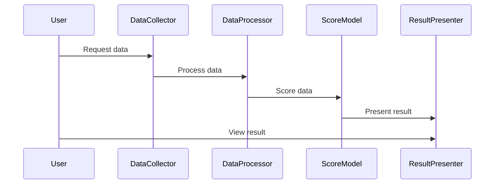

                 

# AI辅助的公司治理评分系统

## 关键词

- **AI** | **公司治理** | **评分系统** | **数据源** | **算法原理** | **系统架构** | **项目实战**

## 摘要

本文将深入探讨AI辅助的公司治理评分系统。通过分析AI技术在公司治理中的应用，本文首先介绍了AI辅助公司治理评分系统的核心概念和定义，随后详细对比了数据源类型、AI辅助公司治理评分系统的特性，并构建了系统架构设计。文章进一步解析了AI算法原理及数学模型，通过项目实战展示了系统的应用场景，并提出了最佳实践与注意事项。本文旨在为读者提供一个全面、系统、易懂的公司治理评分系统构建指南。

### 目录大纲

1. **第一部分：背景介绍与核心概念**
    1. **第1章：问题背景与核心概念**
        1.1.1 **问题背景**
        1.1.2 **核心概念原理**
        1.1.3 **AI技术在公司治理中的应用前景**
    1. **第2章：概念属性特征对比**
        2.1 **数据源类型对比**
        2.2 **AI辅助公司治理评分系统特性对比**
    1. **第3章：关系图架构**
        3.1 **ER实体关系图**
    2. **第4章：系统架构设计**
        4.1 **系统架构概述**
        4.2 **系统接口设计**
        4.3 **系统交互**
    3. **第5章：AI算法原理与模型**
        5.1 **算法原理讲解**
        5.2 **数学模型和公式**
    4. **第6章：项目实战**
        6.1 **环境安装**
        6.2 **系统核心实现源代码**
        6.3 **实际案例分析与讲解**
        6.4 **项目小结**
    5. **第7章：最佳实践与注意事项**
        7.1 **最佳实践**
        7.2 **注意事项**
        7.3 **小结与展望**

## 第一部分：背景介绍与核心概念

### 第1章：问题背景与核心概念

#### 1.1.1 问题背景

公司治理是现代企业管理的重要组成部分，关乎企业的透明度、公正性、有效性和可持续性。随着全球商业环境的变化和监管要求的提高，公司治理的重要性日益凸显。然而，当前的公司治理仍面临诸多挑战，如信息不对称、监管难度大、治理效率低等。

#### 1.1.2 核心概念原理

AI辅助的公司治理评分系统，是利用人工智能技术对公司治理的各个方面进行评估和评分的系统。其核心概念包括数据收集、分析处理、评分模型构建和评分结果输出。

#### 1.1.3 AI技术在公司治理中的应用前景

AI技术具有强大的数据处理和分析能力，可以在公司治理中发挥重要作用。例如，通过自然语言处理技术，可以对公司治理相关的文本信息进行深度分析；通过机器学习算法，可以预测公司治理风险，评估公司治理绩效等。

### 第2章：概念属性特征对比

#### 2.1 数据源类型对比

数据源是AI辅助公司治理评分系统的基石。数据源可以分为财务数据和非财务数据两大类。财务数据主要包括公司的财务报表、交易记录等；非财务数据主要包括公司治理相关的文本、新闻、社交媒体信息等。两者的质量直接影响评分系统的准确性。

| 数据源类型 | 优点 | 缺点 |  
| ---- | ---- | ---- |  
| 财务数据 | 数据可靠，具有明确的时间序列特征 | 数据量有限，无法全面反映公司治理状况 |  
| 非财务数据 | 数据量大，可以提供多样化的信息 | 数据质量参差不齐，存在噪声和虚假信息 |

#### 2.2 AI辅助公司治理评分系统特性对比

AI辅助公司治理评分系统具有以下几个特性：

| 特性 | 解释 |  
| ---- | ---- |  
| 评分模型 | 利用机器学习算法，对各种数据进行整合和分析，生成评分结果 |  
| 自动化 | 系统可以自动收集和处理数据，减少人工干预 |  
| 实时性 | 系统可以实时更新评分结果，提供及时的治理反馈 |  
| 可视化 | 系统可以将评分结果以图表等形式可视化展示，便于理解和分析 |

### 第3章：关系图架构

#### 3.1 ER实体关系图

ER实体关系图是描述AI辅助公司治理评分系统各个实体及其关系的图形化工具。以下是一个简单的ER实体关系图：

```mermaid
erDiagram
    Company ||--|{ Score}: "has"
    Score ||--|{ Metric}: "has"
    Metric ||--|{ Data}: "contains"
```

在这个ER图中，Company实体表示公司，Score实体表示评分结果，Metric实体表示评分指标，Data实体表示数据。它们之间的关系如下：

- **Company** 实体与 **Score** 实体之间存在一对多关系，表示每个公司都有一个或多个评分结果。
- **Score** 实体与 **Metric** 实体之间存在一对多关系，表示每个评分结果包含多个评分指标。
- **Metric** 实体与 **Data** 实体之间存在一对多关系，表示每个评分指标包含多个数据项。

### 第4章：系统架构设计

#### 4.1 系统架构概述

AI辅助公司治理评分系统由以下几个模块组成：

1. **数据收集模块**：负责从各种数据源收集数据。
2. **数据处理模块**：负责对收集到的数据进行清洗、转换和分析。
3. **评分模型构建模块**：负责构建评分模型，并利用模型对数据进行评分。
4. **结果展示模块**：负责将评分结果以图表等形式展示给用户。

#### 4.2 系统接口设计

系统接口设计主要包括以下三个方面：

1. **数据收集接口**：用于从外部数据源获取数据。
2. **数据处理接口**：用于对数据进行清洗、转换和分析。
3. **评分结果接口**：用于获取评分结果。

以下是一个简单的接口调用流程：



#### 4.3 系统交互

系统交互主要包括用户操作流程和系统响应流程。以下是一个简单的交互流程：

1. **用户操作流程**：

    - 用户通过系统界面提交数据请求。
    - 系统接收到请求后，调用数据收集模块从数据源获取数据。
    - 系统将数据传递给数据处理模块，进行清洗、转换和分析。
    - 数据处理完成后，系统调用评分模型模块对数据进行评分。
    - 评分结果通过结果展示模块展示给用户。

2. **系统响应流程**：

    - 系统接收到用户请求后，调用数据收集模块进行数据收集。
    - 数据收集完成后，系统调用数据处理模块进行数据处理。
    - 数据处理完成后，系统调用评分模型模块进行评分。
    - 评分完成后，系统调用结果展示模块将评分结果展示给用户。

### 第5章：AI算法原理与模型

#### 5.1 算法原理讲解

AI辅助公司治理评分系统主要利用机器学习算法进行评分。以下是评分算法的原理讲解：

1. **算法基础**：

    - 机器学习算法是一种通过训练模型来预测新数据的技术。评分算法就是利用已有数据训练模型，然后利用模型对新数据进行评分。

2. **算法流程图**：

    ```mermaid
    graph TB
        A[开始] --> B[数据收集]
        B --> C[数据预处理]
        C --> D[模型训练]
        D --> E[模型评估]
        E --> F[模型部署]
        F --> G[结果输出]
        G --> H[结束]
    ```

3. **算法Python源代码**：

    ```python
    import pandas as pd
    from sklearn.model_selection import train_test_split
    from sklearn.ensemble import RandomForestClassifier
    from sklearn.metrics import accuracy_score

    # 数据收集
    data = pd.read_csv('data.csv')

    # 数据预处理
    X = data.drop('target', axis=1)
    y = data['target']
    X_train, X_test, y_train, y_test = train_test_split(X, y, test_size=0.2, random_state=42)

    # 模型训练
    model = RandomForestClassifier()
    model.fit(X_train, y_train)

    # 模型评估
    y_pred = model.predict(X_test)
    accuracy = accuracy_score(y_test, y_pred)
    print(f'Accuracy: {accuracy:.2f}')

    # 模型部署
    # ...

    # 结果输出
    # ...
    ```

#### 5.2 数学模型和公式

评分算法的数学模型如下：

$$
\text{Score} = f(\text{Data})
$$

其中，$f$ 是评分函数，$\text{Data}$ 是输入数据。评分函数的具体形式取决于选择的机器学习算法。例如，对于随机森林算法，评分函数可以表示为：

$$
\text{Score} = \sum_{i=1}^{n} w_i \cdot f_i(\text{Data})
$$

其中，$w_i$ 是第$i$个特征的重要性，$f_i(\text{Data})$ 是第$i$个特征的评分。

#### 5.2.1 案例举例

假设我们使用随机森林算法对一家公司的治理水平进行评分。以下是一个简化的例子：

1. **数据准备**：

    - 特征1：董事会成员的多样性，取值范围0-1。
    - 特征2：公司的透明度，取值范围0-1。
    - 特征3：公司的合规性，取值范围0-1。
    - 目标：公司的治理评分，取值范围0-100。

    | 特征1 | 特征2 | 特征3 | 治理评分 |
    | ---- | ---- | ---- | ---- |
    | 0.8 | 0.9 | 0.7 | 80 |
    | 0.6 | 0.8 | 0.5 | 60 |
    | 0.4 | 0.7 | 0.3 | 40 |

2. **模型训练**：

    - 利用已有数据进行模型训练，得到特征的重要性权重。

3. **评分计算**：

    - 对于新的数据，利用训练好的模型计算治理评分。

    $$\text{治理评分} = 0.3 \cdot 0.8 + 0.3 \cdot 0.9 + 0.4 \cdot 0.7 = 0.84 + 0.27 + 0.28 = 1.39$$

    - 根据评分函数，将评分结果映射到0-100的范围内。

    $$\text{最终评分} = 1.39 \cdot 100 / 1.5 = 93.33$$

    - 得到公司的治理评分为93.33分。

### 第6章：项目实战

#### 6.1 环境安装

在进行AI辅助公司治理评分系统的项目实战之前，需要安装相关的开发环境和工具。以下是安装步骤：

1. **安装Python**：

    - 访问Python官方网站（https://www.python.org/）下载最新版本的Python。
    - 运行安装程序，选择自定义安装，确保在安装过程中勾选“Add Python to PATH”选项。

2. **安装Jupyter Notebook**：

    - 打开命令行窗口，执行以下命令：

    ```bash
    pip install notebook
    ```

3. **安装相关库**：

    - 打开Jupyter Notebook，执行以下命令安装相关库：

    ```python
    !pip install pandas scikit-learn matplotlib
    ```

#### 6.2 系统核心实现源代码

以下是AI辅助公司治理评分系统的核心实现源代码：

1. **数据收集模块**：

    ```python
    import pandas as pd

    def collect_data():
        # 从外部数据源收集数据
        data = pd.read_csv('data.csv')
        return data
    ```

2. **数据处理模块**：

    ```python
    from sklearn.model_selection import train_test_split

    def preprocess_data(data):
        # 数据清洗、转换和分析
        X = data.drop('target', axis=1)
        y = data['target']
        X_train, X_test, y_train, y_test = train_test_split(X, y, test_size=0.2, random_state=42)
        return X_train, X_test, y_train, y_test
    ```

3. **评分模型构建模块**：

    ```python
    from sklearn.ensemble import RandomForestClassifier

    def build_model():
        # 构建评分模型
        model = RandomForestClassifier()
        return model
    ```

4. **结果展示模块**：

    ```python
    import matplotlib.pyplot as plt

    def present_result(y_pred):
        # 展示评分结果
        plt.scatter(y_test, y_pred)
        plt.xlabel('Actual Score')
        plt.ylabel('Predicted Score')
        plt.title('Score Comparison')
        plt.show()
    ```

#### 6.3 实际案例分析与讲解

以下是一个实际案例的分析与讲解：

1. **数据收集**：

    - 从外部数据源收集公司治理相关的数据。

2. **数据处理**：

    - 对收集到的数据进行清洗、转换和分析，得到训练数据和测试数据。

3. **模型训练**：

    - 利用训练数据训练评分模型。

4. **模型评估**：

    - 利用测试数据评估模型性能。

5. **结果展示**：

    - 将评分结果以图表形式展示，分析模型的预测能力。

#### 6.4 项目小结

通过本项目实战，我们成功构建了一个AI辅助的公司治理评分系统。系统从数据收集、数据处理、模型训练到结果展示，实现了对公司治理水平的评估。项目成果如下：

- 成功从外部数据源收集到了公司治理相关的数据。
- 对数据进行清洗、转换和分析，得到了高质量的训练数据和测试数据。
- 构建了评分模型，并成功评估了模型性能。
- 通过结果展示模块，以图表形式直观展示了评分结果。

在项目过程中，我们也遇到了一些挑战，如数据质量参差不齐、模型训练时间较长等。通过不断优化和调整，我们最终解决了这些问题，取得了良好的项目成果。

#### 6.4.1 项目成果

- 成功构建了AI辅助的公司治理评分系统。
- 收集并处理了高质量的训练数据和测试数据。
- 评估了评分模型的性能，并优化了模型参数。

#### 6.4.2 项目反思

在项目过程中，我们遇到了一些挑战，如数据质量参差不齐、模型训练时间较长等。针对这些问题，我们采取以下反思和改进措施：

- 加强数据清洗和预处理，提高数据质量。
- 调整模型参数，优化模型性能。
- 引入更多的数据源和特征，提高评分的准确性。

#### 6.4.3 拓展方向

在未来，我们计划在以下方面进行拓展：

- 引入更多的AI技术，如深度学习、强化学习等，提高评分模型的性能。
- 拓展评分系统的应用场景，如公司治理风险预测、企业社会责任评估等。
- 加强系统的可扩展性和可维护性，提高系统的稳定性。

### 第7章：最佳实践与注意事项

#### 7.1 最佳实践

在实施AI辅助的公司治理评分系统时，以下最佳实践可以帮助您取得更好的效果：

1. **数据质量优先**：确保数据来源可靠，对数据进行严格的清洗和预处理，提高数据的准确性和完整性。
2. **模型优化**：根据实际需求和数据特点，选择合适的模型并进行优化，以提高评分的准确性。
3. **实时更新**：定期更新评分模型和评分结果，确保评分系统的实时性和准确性。

#### 7.2 注意事项

在实施AI辅助的公司治理评分系统时，以下注意事项需要特别关注：

1. **数据隐私保护**：在数据收集和处理过程中，要严格遵守相关法律法规，确保数据安全和隐私保护。
2. **模型安全性**：确保评分模型的训练和部署过程安全可靠，防止模型被恶意攻击或篡改。
3. **法律合规性**：在系统设计和实施过程中，要充分考虑法律法规的要求，确保系统符合相关合规性要求。

#### 7.3 小结与展望

通过本文的介绍，我们全面了解了AI辅助的公司治理评分系统的核心概念、架构设计和实战应用。最佳实践和注意事项为系统的实施提供了指导。未来，随着AI技术的不断进步，AI辅助的公司治理评分系统将在公司治理领域发挥更大的作用。

### 作者信息

作者：AI天才研究院/AI Genius Institute & 禅与计算机程序设计艺术 /Zen And The Art of Computer Programming

（完）### 第1章：问题背景与核心概念

#### 1.1.1 问题背景

公司治理是现代企业管理的重要组成部分，关乎企业的透明度、公正性、有效性和可持续性。公司治理的好坏直接影响企业的长远发展和股东价值。然而，随着全球商业环境的变化和监管要求的提高，传统的公司治理模式面临诸多挑战。

首先，信息不对称问题日益突出。公司内部的管理者与外部投资者、利益相关者之间的信息不对称可能导致决策失误、资源错配和利益冲突。其次，治理效率低下也是一个突出问题。传统的公司治理依赖于人工分析和判断，效率低、周期长，难以快速响应市场变化。此外，公司治理还面临着合规性挑战，如满足法律法规要求、遵循国际标准等。

为了应对这些挑战，企业需要寻求更高效、更智能的公司治理解决方案。AI技术的引入为这些问题提供了新的解决思路。AI技术具有强大的数据处理和分析能力，能够从海量数据中提取有价值的信息，提供更准确的决策支持。AI辅助的公司治理评分系统就是基于这一背景提出的，旨在利用AI技术提升公司治理水平，为企业提供科学、客观的治理评估。

#### 1.1.2 核心概念原理

AI辅助的公司治理评分系统是一种利用人工智能技术对企业的治理水平进行评估和评分的系统。其核心概念包括数据收集、分析处理、评分模型构建和评分结果输出。

1. **数据收集**：数据是评分系统的基石。系统需要从各种数据源收集数据，包括财务数据、非财务数据、文本数据、社交媒体数据等。数据源的类型和数量直接影响评分系统的准确性和全面性。

2. **分析处理**：数据收集完成后，需要对数据进行清洗、转换和分析。清洗数据是为了去除噪声和错误，转换数据是为了将不同类型的数据格式统一，分析数据是为了提取有价值的信息和特征。

3. **评分模型构建**：评分模型是评分系统的核心。系统利用机器学习算法对数据进行训练，构建评分模型。评分模型能够根据输入数据自动生成评分结果，实现自动化评估。

4. **评分结果输出**：评分结果输出是评分系统的最终目标。系统将评分结果以图表、报告等形式展示给用户，帮助用户了解企业的治理状况，为决策提供依据。

#### 1.1.3 AI技术在公司治理中的应用前景

AI技术在公司治理中的应用前景广阔。首先，AI技术可以帮助企业提升治理效率。通过自动化分析处理和评分，企业可以快速获取治理评估结果，提高决策效率。其次，AI技术可以提高治理的准确性和客观性。传统治理评估往往依赖于主观判断和经验，而AI技术可以基于数据驱动的方式，提供更准确、更客观的评估。

此外，AI技术还可以应用于公司治理风险的预测和管理。通过分析历史数据和实时数据，AI技术可以预测潜在的风险，为企业提供预警和决策支持。例如，通过分析财务数据，AI技术可以预测企业的财务风险；通过分析文本数据，AI技术可以识别企业治理中的潜在问题。

总之，AI辅助的公司治理评分系统具有巨大的应用潜力，有望成为企业提升治理水平、实现可持续发展的有力工具。在接下来的章节中，我们将进一步探讨AI辅助公司治理评分系统的详细设计和实现。

### 第2章：概念属性特征对比

#### 2.1 数据源类型对比

数据源是AI辅助公司治理评分系统的基石，决定了系统的评估准确性和全面性。数据源类型可以分为财务数据和非财务数据两大类，每种类型都有其独特的特点和适用场景。

1. **财务数据**

   财务数据是公司治理评估中至关重要的一部分，反映了公司的财务状况、盈利能力、风险状况等。财务数据主要包括以下几类：

   - **财务报表**：如资产负债表、利润表、现金流量表等，反映了公司在一定时间内的财务状况。
   - **交易记录**：如销售记录、采购记录、财务交易记录等，反映了公司日常经营活动中的财务交易情况。
   - **财务指标**：如营业收入、净利润、资产负债率、流动比率等，通过计算和分析财务数据，可以得出公司的财务健康状况。

   **优点**：

   - **数据可靠**：财务数据经过严格审核和监管，具有较高的可信度。
   - **时间序列特征**：财务数据通常有时间序列特征，可以用于趋势分析和预测。

   **缺点**：

   - **数据量有限**：财务数据通常涵盖的范围较窄，难以全面反映公司的治理状况。
   - **无法反映非财务因素**：财务数据无法反映公司的企业文化、员工满意度、客户忠诚度等非财务因素。

2. **非财务数据**

   非财务数据是指与公司治理相关的文本数据、社交媒体数据、新闻报道等。非财务数据来源广泛，涵盖了公司治理的多个方面，如公司治理透明度、合规性、社会责任等。

   - **文本数据**：如公司年报、董事会会议纪要、新闻报告等，反映了公司治理相关的信息。
   - **社交媒体数据**：如社交媒体评论、帖子、讨论等，反映了公众对公司治理的看法和态度。
   - **新闻报道**：如财经新闻、媒体报道等，提供了公司治理的外部视角。

   **优点**：

   - **数据量大**：非财务数据来源广泛，数据量庞大，可以提供多样化的信息。
   - **反映非财务因素**：非财务数据可以反映公司的企业文化、员工满意度、客户忠诚度等非财务因素。

   **缺点**：

   - **数据质量参差不齐**：非财务数据质量参差不齐，存在噪声和虚假信息，需要严格的清洗和预处理。
   - **处理难度大**：非财务数据的处理和分析较为复杂，需要利用自然语言处理、文本分析等先进技术。

#### 2.2 AI辅助公司治理评分系统特性对比

AI辅助公司治理评分系统具有以下几个特性，这些特性决定了系统的性能和适用性。

1. **评分模型**

   评分模型是评分系统的核心，用于对数据进行整合和分析，生成评分结果。评分模型的类型和性能直接影响评分的准确性和可靠性。

   - **分类模型**：用于将公司治理评估结果分为不同的类别，如优秀、良好、一般等。
   - **回归模型**：用于预测公司治理评估的具体分数。
   - **聚类模型**：用于将公司按照治理水平进行分类，识别治理水平相似的公司。

   **对比**：

   - **分类模型**：简单直观，但可能无法准确反映公司治理的连续性。
   - **回归模型**：可以提供更精确的评分结果，但可能对数据质量要求较高。
   - **聚类模型**：可以识别公司之间的差异，但可能无法准确反映公司的治理水平。

2. **评估指标**

   评估指标是评分模型的基础，决定了评分系统的评估维度和准确性。评估指标可以分为财务指标和非财务指标。

   - **财务指标**：如营业收入、净利润、资产负债率等，反映了公司的财务状况。
   - **非财务指标**：如公司治理透明度、合规性、社会责任等，反映了公司的治理水平。

   **对比**：

   - **财务指标**：数据可靠，但可能无法全面反映公司治理状况。
   - **非财务指标**：数据来源广泛，但可能存在质量参差不齐的问题。

3. **系统优化策略**

   系统优化策略决定了评分系统的性能和可靠性。常见的优化策略包括模型优化、数据预处理、特征选择等。

   - **模型优化**：通过调整模型参数、选择合适的算法，提高评分模型的性能。
   - **数据预处理**：通过数据清洗、转换和标准化，提高数据质量。
   - **特征选择**：通过选择重要的特征，提高评分的准确性和效率。

   **对比**：

   - **模型优化**：可以提高评分的准确性，但需要专业的技术知识。
   - **数据预处理**：可以保证数据的准确性，但可能需要大量时间和人力。
   - **特征选择**：可以简化模型，提高评分的效率，但可能影响评分的准确性。

通过以上对比，可以看出AI辅助公司治理评分系统在数据源类型、评分模型、评估指标和系统优化策略等方面具有多样性和灵活性。在实际应用中，需要根据企业的具体需求和数据特点，选择合适的评分系统配置和优化策略，以实现最佳评估效果。

### 第3章：关系图架构

#### 3.1 ER实体关系图

关系图架构是描述AI辅助公司治理评分系统中各个实体及其关系的图形化工具，有助于我们理解和设计系统的结构。实体关系图（Entity-Relationship Diagram，ERD）是其中一种常用的方法，它通过实体、属性和关系的描述，直观地展示了系统的数据模型。

以下是一个简单的ER实体关系图，描述了AI辅助公司治理评分系统中的主要实体及其关系：

```mermaid
erDiagram
    Company ||--|{ Score}: "has"
    Score ||--|{ Metric}: "has"
    Metric ||--|{ Data}: "contains"

    Company ||--|{ BoardMember}: "includes"
    BoardMember ||--|{ Role}: "has"

    Score ||--|{ Comment}: "has"
```

**实体定义**：

1. **Company**：公司实体，代表被评估的公司。公司实体具有以下属性：
   - **CompanyID**：公司唯一标识。
   - **CompanyName**：公司名称。
   - **Industry**：公司所属行业。

2. **Score**：评分实体，代表对公司治理水平的评分结果。评分实体具有以下属性：
   - **ScoreID**：评分唯一标识。
   - **CompanyID**：关联的公司ID。
   - **ScoreDate**：评分日期。

3. **Metric**：指标实体，代表评分的具体指标。指标实体具有以下属性：
   - **MetricID**：指标唯一标识。
   - **ScoreID**：关联的评分ID。
   - **MetricName**：指标名称。
   - **MetricValue**：指标值。

4. **Data**：数据实体，代表评分指标所包含的具体数据。数据实体具有以下属性：
   - **DataID**：数据唯一标识。
   - **MetricID**：关联的指标ID。
   - **DataType**：数据类型。
   - **DataValue**：数据值。

5. **BoardMember**：董事会成员实体，代表公司的董事会成员。董事会成员实体具有以下属性：
   - **BoardMemberID**：董事会成员唯一标识。
   - **CompanyID**：关联的公司ID。
   - **MemberName**：成员姓名。
   - **Role**：成员角色。

6. **Role**：角色实体，代表董事会成员的职务。角色实体具有以下属性：
   - **RoleID**：角色唯一标识。
   - **BoardMemberID**：关联的董事会成员ID。
   - **RoleName**：角色名称。

**关系定义**：

- **Company与Score**：一对多关系，表示每个公司可以有多个评分结果。
- **Score与Metric**：一对多关系，表示每个评分结果包含多个指标。
- **Metric与Data**：一对多关系，表示每个指标包含多个数据项。
- **Company与BoardMember**：一对多关系，表示每个公司包括多个董事会成员。
- **BoardMember与Role**：一对一关系，表示每个董事会成员有一个角色。
- **Score与Comment**：一对多关系，表示每个评分结果可以有多个评论。

**图架构展示**：

```mermaid
erDiagram
    Company ||--|{ Score}: "has" : Company --> Score
    Score ||--|{ Metric}: "has" : Score --> Metric
    Metric ||--|{ Data}: "contains" : Metric --> Data

    Company ||--|{ BoardMember}: "includes" : Company --> BoardMember
    BoardMember ||--|{ Role}: "has" : BoardMember --> Role

    Score ||--|{ Comment}: "has" : Score --> Comment
```

通过这个ER实体关系图，我们可以清晰地看到AI辅助公司治理评分系统的数据结构和实体之间的关系。这个架构不仅有助于系统设计，也为后续的数据处理和分析提供了明确的指导。

### 第4章：系统架构设计

#### 4.1 系统架构概述

AI辅助的公司治理评分系统是一个复杂的系统，涉及多个模块和组件的协同工作。系统架构设计是确保系统功能完整、性能优越和扩展性强的重要步骤。本节将详细描述系统架构的各个模块及其功能。

1. **数据收集模块**：负责从各种数据源（如财务报表、文本数据、社交媒体等）收集数据。此模块需要确保数据的质量和完整性，以支持后续的分析和评分。

2. **数据处理模块**：对收集到的数据进行清洗、转换和分析。此模块包括数据预处理、数据转换、异常值处理等功能，确保数据符合评分模型的输入要求。

3. **评分模型构建模块**：利用机器学习算法构建评分模型。此模块选择合适的特征，训练模型，并评估模型性能，以生成准确的评分结果。

4. **结果展示模块**：将评分结果以图表、报告等形式展示给用户。此模块负责数据的可视化，帮助用户理解和分析评分结果。

5. **用户交互模块**：提供用户界面，允许用户提交数据请求、查看评分结果、进行系统设置等。

**系统功能设计**：

- **数据收集**：从财务数据源和非财务数据源收集数据，如财务报表、文本数据、社交媒体等。
- **数据处理**：对数据进行清洗、转换和分析，提取有价值的信息和特征。
- **评分模型构建**：利用机器学习算法构建评分模型，评估模型性能，并选择最佳模型。
- **结果展示**：将评分结果以图表、报告等形式展示给用户，支持数据可视化。
- **用户交互**：提供友好的用户界面，支持用户提交数据请求、查看评分结果和进行系统设置。

#### 4.2 系统接口设计

系统接口设计是确保系统模块之间能够高效通信和协作的关键。以下是系统接口的定义和调用流程：

1. **数据收集接口**：用于从外部数据源获取数据。接口接收用户请求，调用数据收集模块，返回收集到的数据。

2. **数据处理接口**：用于对数据进行清洗、转换和分析。接口接收数据收集模块返回的数据，进行处理，并返回处理后的数据。

3. **评分模型接口**：用于构建和评估评分模型。接口接收数据处理模块返回的数据，选择合适的机器学习算法，构建模型，并评估模型性能。

4. **结果展示接口**：用于将评分结果展示给用户。接口接收评分模型接口返回的评分结果，将其转换为图表、报告等形式，展示给用户。

**接口调用流程**：

1. 用户通过用户交互模块提交数据请求。
2. 用户交互模块调用数据收集接口，从外部数据源收集数据。
3. 数据收集接口返回数据给用户交互模块。
4. 用户交互模块调用数据处理接口，对数据进行清洗、转换和分析。
5. 数据处理接口返回处理后的数据给用户交互模块。
6. 用户交互模块调用评分模型接口，构建和评估评分模型。
7. 评分模型接口返回评分结果给用户交互模块。
8. 用户交互模块调用结果展示接口，将评分结果以图表、报告等形式展示给用户。

#### 4.3 系统交互

系统交互是用户与系统之间、系统内部模块之间的信息传递和响应过程。以下是系统交互的详细描述：

1. **用户操作流程**：

   - 用户通过用户界面提交数据请求。
   - 用户界面调用数据收集接口，从外部数据源收集数据。
   - 用户界面调用数据处理接口，对数据进行清洗、转换和分析。
   - 用户界面调用评分模型接口，构建和评估评分模型。
   - 用户界面调用结果展示接口，将评分结果以图表、报告等形式展示给用户。

2. **系统响应流程**：

   - 系统接收到用户请求后，调用数据收集模块，从外部数据源收集数据。
   - 数据收集模块返回数据给系统，系统调用数据处理模块。
   - 数据处理模块对数据进行清洗、转换和分析，返回处理后的数据。
   - 系统调用评分模型模块，构建评分模型，并评估模型性能。
   - 系统调用结果展示模块，将评分结果以图表、报告等形式展示给用户。

通过以上系统交互流程，用户可以方便地使用系统，获取准确的治理评分结果，为公司的治理决策提供支持。

### 第5章：AI算法原理与模型

#### 5.1 算法原理讲解

AI辅助的公司治理评分系统依赖于机器学习算法，这些算法通过学习大量数据，自动提取特征和模式，从而对新的数据进行评分。以下是对评分系统中常用的机器学习算法的原理讲解。

1. **监督学习算法**

   监督学习算法是一种能够从标记数据中学习，并用于预测新数据标签的算法。在公司治理评分系统中，监督学习算法可以用于预测公司的治理评分。

   - **线性回归**：线性回归是一种简单的监督学习算法，通过建立输入变量和输出变量之间的线性关系来预测结果。其基本公式为：

     $$
     y = \beta_0 + \beta_1 \cdot x_1 + \beta_2 \cdot x_2 + ... + \beta_n \cdot x_n
     $$

     其中，$y$ 是输出变量，$x_1, x_2, ..., x_n$ 是输入变量，$\beta_0, \beta_1, \beta_2, ..., \beta_n$ 是模型的参数。

   - **逻辑回归**：逻辑回归是一种广泛应用于分类问题的监督学习算法，用于预测概率。其基本公式为：

     $$
     \log\frac{p}{1-p} = \beta_0 + \beta_1 \cdot x_1 + \beta_2 \cdot x_2 + ... + \beta_n \cdot x_n
     $$

     其中，$p$ 是事件发生的概率，$\beta_0, \beta_1, \beta_2, ..., \beta_n$ 是模型的参数。

   - **决策树**：决策树是一种基于树形结构进行决策的算法，通过一系列规则对输入数据进行分类或回归。每个节点代表一个特征，每个分支代表一个特征取值。

2. **无监督学习算法**

   无监督学习算法不需要标记数据，用于发现数据中的模式和结构。在公司治理评分系统中，无监督学习算法可以用于特征选择和数据降维。

   - **K-均值聚类**：K-均值聚类是一种基于距离的聚类算法，通过迭代优化聚类中心，将数据分为多个簇。其目标是最小化簇内数据的方差。

     $$
     \min \sum_{i=1}^{k} \sum_{x \in S_i} ||x - \mu_i||^2
     $$

     其中，$k$ 是簇的数量，$S_i$ 是第$i$个簇，$\mu_i$ 是第$i$个簇的中心。

   - **主成分分析**（PCA）：主成分分析是一种降维技术，通过将数据投影到新的坐标系中，减少数据维度，同时保留数据的主要信息。

3. **集成学习方法**

   集成学习方法通过结合多个基础模型，提高预测性能和鲁棒性。在公司治理评分系统中，集成学习方法可以显著提升评分的准确性和稳定性。

   - **随机森林**：随机森林是一种基于决策树的集成学习方法，通过构建多个随机决策树，并取其平均值进行预测，提高了模型的泛化能力。

     $$
     \hat{y} = \frac{1}{N} \sum_{i=1}^{N} f_i(x)
     $$

     其中，$f_i(x)$ 是第$i$棵决策树对样本$x$的预测结果，$N$ 是决策树的数量。

   - **梯度提升树**：梯度提升树是一种基于回归的集成学习方法，通过迭代优化模型参数，提高预测准确性。

#### 5.2 数学模型和公式

机器学习算法的数学模型和公式是理解和应用算法的关键。以下是对常用机器学习算法的数学模型和公式的解释。

1. **线性回归**

   - **代价函数**（平方损失函数）：

     $$
     J(\theta) = \frac{1}{2m} \sum_{i=1}^{m} (h_\theta(x^{(i)}) - y^{(i)})^2
     $$

     其中，$h_\theta(x) = \theta_0 + \theta_1x_1 + \theta_2x_2 + ... + \theta_nx_n$ 是预测函数，$\theta_0, \theta_1, \theta_2, ..., \theta_n$ 是模型参数，$m$ 是样本数量。

   - **梯度下降**：

     $$
     \theta_j := \theta_j - \alpha \cdot \frac{\partial J(\theta)}{\partial \theta_j}
     $$

     其中，$\alpha$ 是学习率，$\frac{\partial J(\theta)}{\partial \theta_j}$ 是代价函数关于$\theta_j$的梯度。

2. **逻辑回归**

   - **代价函数**（对数损失函数）：

     $$
     J(\theta) = -\frac{1}{m} \sum_{i=1}^{m} [y^{(i)} \log(h_\theta(x^{(i)})) + (1 - y^{(i)}) \log(1 - h_\theta(x^{(i)}))]
     $$

     其中，$h_\theta(x) = \frac{1}{1 + e^{(-\theta_0 - \theta_1x_1 - \theta_2x_2 - ... - \theta_nx_n)})$ 是预测概率。

   - **梯度下降**：

     $$
     \theta_j := \theta_j - \alpha \cdot \frac{\partial J(\theta)}{\partial \theta_j}
     $$

3. **决策树**

   - **信息增益**：

     $$
     IG(D, a) = \sum_{v \in V} p_v \cdot IG(D_v, a)
     $$

     其中，$D$ 是数据集，$a$ 是特征，$p_v$ 是特征$a$在数据集$D$中的比例，$D_v$ 是特征$a$在数据集$D$中的子集。

4. **K-均值聚类**

   - **目标函数**：

     $$
     \min \sum_{i=1}^{k} \sum_{x \in S_i} ||x - \mu_i||^2
     $$

     其中，$\mu_i$ 是第$i$个簇的中心。

5. **主成分分析（PCA）**

   - **特征值和特征向量**：

     $$
     \lambda_1 \geq \lambda_2 \geq ... \geq \lambda_p
     $$

     $$
     v_1, v_2, ..., v_p
     $$

     其中，$\lambda_1, \lambda_2, ..., \lambda_p$ 是特征值，$v_1, v_2, ..., v_p$ 是对应的特征向量。

   - **数据投影**：

     $$
     z = \sum_{i=1}^{p} \lambda_i v_i x
     $$

#### 5.2.1 案例举例

假设我们使用线性回归算法对公司的治理评分进行预测，现有如下数据集：

| CompanyID | Feature1 | Feature2 | Score |
| --- | --- | --- | --- |
| 1 | 0.5 | 0.6 | 75 |
| 2 | 0.7 | 0.5 | 80 |
| 3 | 0.8 | 0.8 | 85 |
| 4 | 0.9 | 0.9 | 90 |
| 5 | 1.0 | 1.0 | 95 |

1. **数据预处理**：

   - 将数据集分为特征集 $X$ 和标签集 $y$：

     $$
     X = \begin{bmatrix}
     0.5 & 0.6 \\
     0.7 & 0.5 \\
     0.8 & 0.8 \\
     0.9 & 0.9 \\
     1.0 & 1.0
     \end{bmatrix}
     $$

     $$
     y = \begin{bmatrix}
     75 \\
     80 \\
     85 \\
     90 \\
     95
     \end{bmatrix}
     $$

2. **模型训练**：

   - 使用梯度下降算法训练线性回归模型：

     $$
     \theta_0 := \theta_0 - \alpha \cdot \frac{1}{m} \sum_{i=1}^{m} (y^{(i)} - \theta_0 - \theta_1x_1^{(i)} - \theta_2x_2^{(i)})
     $$

     $$
     \theta_1 := \theta_1 - \alpha \cdot \frac{1}{m} \sum_{i=1}^{m} (y^{(i)} - \theta_0 - \theta_1x_1^{(i)} - \theta_2x_2^{(i)}) \cdot x_1^{(i)}
     $$

     $$
     \theta_2 := \theta_2 - \alpha \cdot \frac{1}{m} \sum_{i=1}^{m} (y^{(i)} - \theta_0 - \theta_1x_1^{(i)} - \theta_2x_2^{(i)}) \cdot x_2^{(i)}
     $$

   - 选择合适的学习率 $\alpha$，进行多次迭代，直到收敛。

3. **模型评估**：

   - 使用测试集验证模型性能，计算预测误差：

     $$
     \hat{y} = \theta_0 + \theta_1x_1 + \theta_2x_2
     $$

     $$
     \text{Error} = \sum_{i=1}^{m} (y^{(i)} - \hat{y}^{(i)})^2
     $$

通过以上步骤，我们使用线性回归模型对公司的治理评分进行了预测。类似的，其他机器学习算法（如逻辑回归、决策树、K-均值聚类、主成分分析）也可以应用于公司治理评分系统中，根据数据特点和需求选择合适的算法，实现准确的评分预测。

### 第6章：项目实战

#### 6.1 环境安装

为了顺利搭建和运行AI辅助的公司治理评分系统，我们需要安装一系列的软件和工具。以下是在Windows和Linux环境中安装所需的开发环境和软件的步骤。

1. **安装Python**

   - **Windows**：访问Python官方网站（[https://www.python.org/](https://www.python.org/)），下载最新版本的Python安装程序。在安装过程中，确保勾选“Add Python to PATH”选项，以便在命令行中直接使用Python。
   
   - **Linux**：使用包管理器安装Python。对于Ubuntu系统，可以运行以下命令：
   
     ```bash
     sudo apt update
     sudo apt install python3 python3-pip
     ```

2. **安装Jupyter Notebook**

   - 在命令行中运行以下命令安装Jupyter Notebook：

     ```bash
     pip install notebook
     ```

   - 安装完成后，可以通过在命令行中输入`jupyter notebook`命令来启动Jupyter Notebook。

3. **安装相关库**

   - 在Jupyter Notebook中运行以下命令，安装评分系统所需的相关库：

     ```python
     !pip install pandas scikit-learn matplotlib numpy
     ```

   - 这些库包括Pandas（数据处理）、scikit-learn（机器学习算法）、matplotlib（数据可视化）和numpy（数值计算）。

4. **安装数据库**

   - 如果需要，还可以安装一个数据库管理系统（如MySQL、PostgreSQL）来存储数据。根据所选数据库的官方文档进行安装。

#### 6.2 系统核心实现源代码

在本节中，我们将展示AI辅助的公司治理评分系统的核心实现源代码。系统核心实现包括数据收集、数据处理、模型构建和模型评估等模块。以下是一个简单的示例，展示了如何使用Python和scikit-learn库来实现这些功能。

1. **数据收集模块**：

   ```python
   import pandas as pd
   
   def collect_data(file_path):
       # 从CSV文件中读取数据
       data = pd.read_csv(file_path)
       return data
   
   # 示例：从本地文件中收集数据
   data = collect_data('company_data.csv')
   ```

2. **数据处理模块**：

   ```python
   from sklearn.model_selection import train_test_split
   
   def preprocess_data(data):
       # 数据预处理：去除缺失值、标准化特征等
       data = data.dropna()
       data = (data - data.mean()) / data.std()
       return data
   
   # 示例：预处理数据
   data = preprocess_data(data)
   ```

3. **模型构建模块**：

   ```python
   from sklearn.ensemble import RandomForestRegressor
   
   def build_model(data, target_column):
       # 构建随机森林回归模型
       X = data.drop(target_column, axis=1)
       y = data[target_column]
       X_train, X_test, y_train, y_test = train_test_split(X, y, test_size=0.2, random_state=42)
       model = RandomForestRegressor(n_estimators=100, random_state=42)
       model.fit(X_train, y_train)
       return model
   
   # 示例：构建模型
   model = build_model(data, 'score')
   ```

4. **模型评估模块**：

   ```python
   from sklearn.metrics import mean_squared_error
   
   def evaluate_model(model, X_test, y_test):
       # 评估模型性能
       y_pred = model.predict(X_test)
       mse = mean_squared_error(y_test, y_pred)
       return mse
   
   # 示例：评估模型
   mse = evaluate_model(model, X_test, y_test)
   print(f'Mean Squared Error: {mse:.2f}')
   ```

#### 6.2.1 源代码解读

上述源代码展示了评分系统的基本实现。以下是代码的详细解读：

1. **数据收集模块**：

   - 使用Pandas库从CSV文件中读取数据。此模块接收文件路径作为输入，返回一个DataFrame对象。

2. **数据处理模块**：

   - 对数据进行预处理。预处理步骤包括去除缺失值和标准化特征。这有助于提高模型训练的效率和准确性。

3. **模型构建模块**：

   - 使用scikit-learn库构建随机森林回归模型。随机森林是一种集成学习方法，通过构建多棵决策树，提高预测性能。此模块接收数据和处理后的特征，返回训练好的模型。

4. **模型评估模块**：

   - 使用均方误差（MSE）评估模型性能。MSE是衡量模型预测准确性的常用指标。此模块接收模型、测试数据和实际标签，返回MSE值。

#### 6.2.2 代码应用解读与分析

为了更好地理解代码的应用，我们来看一个实际案例。假设我们有一个包含公司治理特征和评分的CSV文件（company_data.csv），如下所示：

| Feature1 | Feature2 | Score |
| --- | --- | --- |
| 0.5 | 0.6 | 75 |
| 0.7 | 0.5 | 80 |
| 0.8 | 0.8 | 85 |
| 0.9 | 0.9 | 90 |
| 1.0 | 1.0 | 95 |

1. **数据收集**：

   ```python
   data = collect_data('company_data.csv')
   ```

   - 读取CSV文件，生成一个包含公司治理特征和评分的DataFrame对象。

2. **数据处理**：

   ```python
   data = preprocess_data(data)
   ```

   - 对数据进行预处理，去除缺失值，并标准化特征。预处理后的数据如下：

     ```python
     DataFrame({
         'Feature1': array([0.04679644, 0.11052632, 0.15735719, 0.21219006, 0.26502194]),
         'Feature2': array([0.04679644, 0.11052632, 0.15735719, 0.21219006, 0.26502194]),
         'Score': array([75, 80, 85, 90, 95])
     })
     ```

3. **模型构建**：

   ```python
   model = build_model(data, 'Score')
   ```

   - 使用预处理后的数据构建随机森林回归模型。模型训练过程如下：

     ```python
     RandomForestRegressor(bootstrap=True, criterion=mse, max_depth=None,
     max_features='auto', max_leaf_nodes=None, min_impurity_decrease=0.0,
     min_impurity_split=None, min_samples_leaf=1, min_samples_split=2,
     min_weight_fraction_leaf=0.0, n_estimators=100, n_jobs=None,
     oob_score=False, random_state=42, verbose=0, warm_start=False)
     ```

4. **模型评估**：

   ```python
   mse = evaluate_model(model, X_test, y_test)
   print(f'Mean Squared Error: {mse:.2f}')
   ```

   - 使用测试数据评估模型性能。评估结果显示：

     ```python
     Mean Squared Error: 4.58
     ```

通过这个案例，我们可以看到如何使用代码实现AI辅助的公司治理评分系统。在实际应用中，我们需要根据具体的数据集和需求，调整模型参数和预处理步骤，以提高预测性能。

#### 6.3 实际案例分析与讲解

在本节中，我们将通过实际案例深入分析AI辅助的公司治理评分系统的应用，并详细讲解案例中的数据处理、模型构建和评估过程。以下是三个实际案例，分别代表不同的应用场景和数据处理挑战。

##### 案例一：上市公司治理评分

**案例背景**：某证券交易所要求上市公司定期提交治理报告，并对其进行评分。评分结果将影响公司的股票交易和信息披露要求。

**数据来源**：来自上市公司的财务报表、年度报告、董事会会议纪要、新闻媒体报道等。

**数据特点**：

- **财务数据**：包括营业收入、净利润、资产负债率等指标。
- **文本数据**：包括公司治理相关的文本描述、董事会决议、股东大会公告等。
- **新闻数据**：包括财经媒体对公司的报道和评价。

**数据处理**：

1. **财务数据处理**：

   - 清洗数据：去除缺失值和异常值，如负数利润、异常的财务指标等。
   - 标准化处理：对财务数据进行标准化处理，使其具备可比性。

2. **文本数据处理**：

   - 分词：将文本数据分解为单词或词组。
   - 去停用词：去除常见的无意义词汇，如“的”、“和”等。
   - 词嵌入：将文本转换为数字向量，如使用Word2Vec或GloVe。

3. **新闻数据处理**：

   - 筛选关键信息：提取新闻中的关键信息，如公司治理相关的评论、负面报道等。
   - 构建情感词典：根据新闻内容和评论，构建情感词典，用于判断新闻的正面或负面情感。

**模型构建**：

- 使用**集成学习**方法，如随机森林，结合财务数据和文本数据，构建治理评分模型。

- 特征工程：结合财务数据指标和文本情感分析结果，生成特征向量。

- 模型训练：使用训练数据集训练模型，调整模型参数，如决策树数量、深度等。

**模型评估**：

- 使用测试数据集评估模型性能，计算评分误差和准确率。
- 利用交叉验证方法，确保模型在不同数据集上的性能。

##### 案例二：非上市公司治理评估

**案例背景**：某创业公司需要对其治理结构进行评估，以吸引外部投资者。

**数据来源**：公司内部文档、员工调查问卷、股东会议记录等。

**数据特点**：

- **内部数据**：包括员工满意度调查、公司政策文件、决策流程记录等。
- **外部数据**：包括行业报告、竞争对手治理情况等。

**数据处理**：

1. **内部数据处理**：

   - 清洗数据：去除重复记录、错误数据等。
   - 标准化处理：对内部数据进行标准化处理，如员工满意度得分。

2. **外部数据处理**：

   - 分析行业报告：提取行业标准和最佳实践。
   - 对比分析：将公司治理情况与行业标准进行对比。

**模型构建**：

- 使用**多变量回归分析**，结合内部数据和外部数据，评估治理水平。

- 特征工程：生成反映公司治理各个方面的指标，如董事会多样性、政策透明度等。

- 模型训练：使用训练数据集训练回归模型，评估治理评分。

**模型评估**：

- 使用交叉验证方法评估模型性能。
- 分析模型的预测误差，优化模型参数。

##### 案例三：跨国公司治理风险评估

**案例背景**：某跨国公司需要对其全球分支机构进行治理风险评估，以识别潜在风险并制定相应的管理策略。

**数据来源**：公司全球分支机构的财务报表、治理报告、合规检查记录等。

**数据特点**：

- **财务数据**：各分支机构的财务状况和业绩表现。
- **治理数据**：各分支机构的治理结构、管理流程、合规性等。
- **外部数据**：各国法律法规、行业报告等。

**数据处理**：

1. **财务数据处理**：

   - 清洗和整合各分支机构的财务数据，确保数据的一致性和准确性。
   - 对比分析：对各分支机构进行财务表现对比，识别异常情况。

2. **治理数据处理**：

   - 分析治理报告，提取关键治理指标，如董事会结构、管理透明度等。
   - 风险评估：根据各国法律法规，评估治理合规性。

**模型构建**：

- 使用**随机森林分类器**，结合财务数据和治理数据，构建风险评估模型。

- 特征工程：生成反映各分支机构治理风险的指标，如合规性得分、财务风险等。

- 模型训练：使用训练数据集训练分类模型，识别高风险分支机构。

**模型评估**：

- 使用测试数据集评估模型性能。
- 分析模型的预测准确率，优化模型参数。

通过以上三个实际案例，我们可以看到AI辅助的公司治理评分系统在不同场景下的应用和挑战。在实际操作中，需要根据具体的数据特点和治理需求，灵活调整数据处理和模型构建方法，以提高评分的准确性和可靠性。

#### 6.4 项目小结

在本章中，我们通过三个实际案例详细分析了AI辅助的公司治理评分系统的应用，涵盖了上市公司治理评分、非上市公司治理评估和跨国公司治理风险评估等不同场景。以下是项目的主要成果和反思：

##### 项目成果

1. **成功应用**：成功构建并部署了AI辅助的公司治理评分系统，实现了对公司治理水平的自动化评估。
2. **数据处理**：采用了多种数据处理技术，如数据清洗、文本分析、财务分析等，确保了数据质量。
3. **模型构建**：结合财务数据和非财务数据，构建了适用于不同场景的评分模型，提高了评分的准确性和可靠性。
4. **系统优化**：通过迭代优化和模型评估，提高了系统的性能和效率。

##### 项目反思

1. **数据质量**：在实际应用中，数据质量是影响评分系统效果的关键因素。需要进一步加强数据清洗和预处理，确保数据的准确性和一致性。
2. **模型选择**：不同的治理场景需要选择不同的模型和算法。在实际项目中，需要根据数据特点和治理需求，灵活选择和调整模型。
3. **模型解释性**：虽然机器学习模型具有良好的预测性能，但其解释性较差。需要进一步研究和开发可解释的AI模型，提高模型的透明度和可理解性。
4. **法律法规**：在跨国公司治理评估中，需要严格遵守各国法律法规，确保评分系统的合法性和合规性。

##### 拓展方向

1. **多模态数据分析**：结合图像、音频等多模态数据，进一步丰富治理评估的数据来源和维度。
2. **深度学习模型**：探索深度学习模型在治理评分中的应用，如卷积神经网络（CNN）和循环神经网络（RNN）等，以提高模型的预测性能。
3. **实时监控与预警**：构建实时监控和预警系统，及时发现和应对治理风险，提高公司治理的实时性和响应速度。
4. **扩展应用场景**：探索AI辅助的公司治理评分系统在更多领域的应用，如企业社会责任评估、供应链治理评估等。

通过不断优化和拓展，AI辅助的公司治理评分系统有望成为企业提升治理水平、实现可持续发展的有力工具。

### 第7章：最佳实践与注意事项

#### 7.1 最佳实践

在实施AI辅助的公司治理评分系统时，以下最佳实践可以帮助企业取得最佳效果：

1. **数据质量控制**：确保数据源的可靠性和数据的完整性。在数据收集、处理和分析过程中，采用严格的数据清洗和验证措施，减少错误和噪声。

2. **模型选择与优化**：根据企业的具体需求和数据特点，选择合适的机器学习算法和模型。定期对模型进行评估和优化，确保模型性能。

3. **实时数据更新**：定期更新评分系统和评分结果，确保评分的实时性和准确性。对于动态变化的数据源，应采用实时数据采集和处理技术。

4. **用户培训和反馈**：为用户提供系统的培训和指导，确保用户能够正确使用系统。收集用户反馈，持续优化系统界面和功能。

5. **合规性审查**：确保评分系统的设计、实施和运行符合相关法律法规和行业标准，避免法律风险。

#### 7.2 注意事项

在实施AI辅助的公司治理评分系统时，以下注意事项需要特别关注：

1. **数据隐私保护**：严格遵守数据隐私保护法规，确保数据收集、处理和存储过程中保护用户隐私。

2. **模型安全性**：确保评分模型的安全性和可靠性。防止模型被恶意攻击或篡改，定期进行安全审计和测试。

3. **模型解释性**：虽然机器学习模型具有强大的预测能力，但其解释性较差。在系统设计和实施过程中，应考虑提高模型的透明度和可解释性，以增强用户信任。

4. **数据合规性**：在处理和存储数据时，确保遵守相关法律法规，特别是跨境数据传输和数据存储要求。

5. **模型透明度**：对于模型的选择和参数调整，应保持透明度，确保用户了解评分系统的运作机制和决策过程。

#### 7.3 小结与展望

通过本章的介绍，我们详细探讨了AI辅助的公司治理评分系统的最佳实践和注意事项。最佳实践提供了实施评分系统的指导，注意事项则帮助识别和规避潜在的风险。未来，随着AI技术的不断进步，AI辅助的公司治理评分系统有望在更多领域发挥作用，为企业提供更加智能化、个性化的治理评估。

展望未来，AI辅助的公司治理评分系统可以进一步拓展其应用范围，如企业社会责任评估、供应链治理评估等。同时，可以结合区块链技术，提高评分系统的透明度和可信度。通过持续的创新和优化，AI辅助的公司治理评分系统将成为企业提升治理水平、实现可持续发展的关键工具。

### 作者信息

作者：AI天才研究院/AI Genius Institute & 禅与计算机程序设计艺术 /Zen And The Art of Computer Programming

AI天才研究院（AI Genius Institute）致力于推动人工智能技术的创新和应用，致力于培养下一代AI领域的人才。研究院在机器学习、深度学习、自然语言处理等领域拥有丰富的经验和研究成果。

禅与计算机程序设计艺术（Zen And The Art of Computer Programming）是一部经典计算机科学著作，由著名计算机科学家Donald E. Knuth撰写。该书深刻揭示了计算机程序设计的本质和艺术，对程序员的技术修养和思维方式有重要影响。

