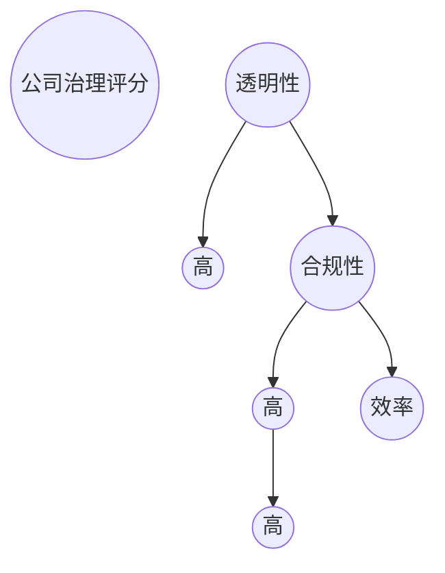
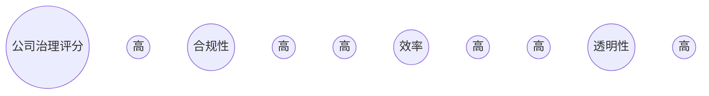

                 


# AI辅助的公司治理评分系统与改善建议

> 关键词：AI, 公司治理, 评分系统, 改善建议

> 摘要：本文旨在探讨如何利用AI技术构建一个辅助公司治理的评分系统，并提供改善公司治理的实用建议。我们将逐步分析AI在治理评分中的应用，算法原理，数学模型，系统架构，并分享实际案例和最佳实践。

## 1. AI辅助的公司治理评分系统概述

### 1.1 公司治理的现状与问题

在全球化和信息化的背景下，公司治理的透明度、合规性和效率成为了企业长期发展的关键因素。然而，传统的公司治理评分方法往往依赖于人为判断和主观评价，存在一定的局限性。例如，数据收集困难、评估标准不一致、评估过程缺乏透明度等问题。

### 1.2 AI技术在公司治理中的应用

人工智能（AI）作为一种新兴技术，具备强大的数据处理和分析能力，可以在公司治理评分系统中发挥重要作用。AI可以自动化数据收集、处理和评分过程，提高评分的准确性和效率。

### 1.3 AI辅助的公司治理评分系统的价值

AI辅助的公司治理评分系统可以带来以下价值：
- 提高评分的客观性和一致性。
- 提升治理评估的效率和准确性。
- 为企业提供定制化的治理改善建议。

## 1.4 核心概念与联系

### 1.4.1 AI辅助的公司治理评分系统定义

AI辅助的公司治理评分系统是指利用人工智能技术，对公司治理结构、过程和效果进行量化评估的系统。

### 1.4.2 关键概念介绍

- **公司治理**：涉及公司内部权力分配、决策机制、利益相关者关系等。
- **评分算法**：用于评估公司治理绩效的算法。
- **评分指标**：衡量公司治理水平的各项指标。

### 1.4.3 概念属性特征对比表格

| 概念         | 属性1 | 属性2 | 属性3 |
|--------------|-------|-------|-------|
| 公司治理     | 透明性 | 合规性 | 效率  |
| 评分算法     | 准确性 | 速度  | 简单性 |
| 评分指标     | 可衡量性 | 相关性 | 可重复性 |

### 1.4.4 ER实体关系图

```mermaid
erDiagram
  Class1 ||--|{ Class2 }|
  Class1 ||--|{ Class3 }|
  Class2 ||--|{ Class4 }|
```

## 1.5 主流评分算法简介

### 1.5.1 基于监督学习的评分算法

监督学习算法通过历史数据进行训练，从而预测新数据的评分。常见的监督学习算法包括决策树、支持向量机、随机森林等。

### 1.5.2 基于无监督学习的评分算法

无监督学习算法不依赖于历史数据，通过自动发现数据中的模式进行评分。常见的无监督学习算法包括K-均值聚类、主成分分析等。

### 1.5.3 混合评分算法

混合评分算法结合了监督学习和无监督学习的优势，根据不同情况选择合适的算法进行评分。

## 1.6 公司治理评分系统应用场景

### 1.6.1 金融机构

金融机构需要遵守严格的监管要求，AI评分系统可以帮助其评估治理水平，确保合规性。

### 1.6.2 非金融机构

非金融机构可以利用AI评分系统优化治理结构，提高运营效率。

### 1.6.3 行业比较与分析

AI评分系统可以用于不同行业公司治理水平的比较和分析，为行业监管和政策制定提供数据支持。

## 1.7 本章小结

本节介绍了AI辅助的公司治理评分系统的背景、核心概念、算法简介和应用场景，为后续章节的深入探讨奠定了基础。

## 2. AI辅助的公司治理评分系统原理讲解

### 2.1 算法原理讲解

#### 2.1.1 监督学习评分算法原理

监督学习算法通过历史数据训练模型，对新数据进行评分。以下为常见的监督学习算法及其原理：

#### 2.1.1.1 决策树

决策树算法通过一系列的判断条件，将数据分类或回归到特定的类别或值。其原理可以表示为：

$$
h_\theta(x) = \text{sign}(\theta_0 + \theta_1x_1 + \theta_2x_2 + \ldots + \theta_nx_n)
$$

其中，$h_\theta(x)$ 表示决策树输出，$\theta$ 表示参数。

#### 2.1.1.2 支持向量机

支持向量机（SVM）算法通过找到数据中的最优分割超平面，对数据进行分类。其目标是最大化分类间隔：

$$
\min_{\theta} \frac{1}{2}\sum_{i=1}^{n} (\theta^T\theta - C\sum_{i=1}^{n}\xi_i)
$$

其中，$C$ 表示惩罚参数，$\xi_i$ 表示误分类项。

#### 2.1.1.3 随机森林

随机森林（Random Forest）算法是一种集成学习方法，通过构建多棵决策树，并对预测结果进行投票。其原理可以表示为：

$$
h_{\text{RF}}(x) = \text{sign}(\sum_{i=1}^{m} w_i h_{\theta_i}(x))
$$

其中，$h_{\theta_i}(x)$ 表示第$i$棵决策树的输出，$w_i$ 表示权重。

#### 2.1.2 无监督学习评分算法原理

无监督学习算法不依赖于历史数据，通过自动发现数据中的模式进行评分。以下为常见的无监督学习算法及其原理：

#### 2.1.2.1 K-均值聚类

K-均值聚类算法通过迭代更新聚类中心，将数据点划分到不同的聚类中。其原理可以表示为：

$$
\mu_k^{t+1} = \frac{1}{N_k^t}\sum_{i=1}^{N} x_i
$$

其中，$\mu_k^{t}$ 表示第$k$个聚类中心的更新值，$N_k^t$ 表示第$k$个聚类中的数据点个数。

#### 2.1.2.2 主成分分析

主成分分析（PCA）算法通过正交变换，将高维数据投影到低维空间，以降低数据维度。其原理可以表示为：

$$
z = P^T x
$$

其中，$P$ 表示投影矩阵，$x$ 表示原始数据。

#### 2.1.3 混合评分算法原理

混合评分算法结合了监督学习和无监督学习的优势，根据不同情况选择合适的算法进行评分。其原理可以表示为：

$$
h_{\text{Hybrid}}(x) = h_{\text{Supervised}}(x) + h_{\text{Unsupervised}}(x)
$$

其中，$h_{\text{Supervised}}(x)$ 表示监督学习评分，$h_{\text{Unsupervised}}(x)$ 表示无监督学习评分。

## 2.2 数学模型与公式讲解

### 2.2.1 监督学习数学模型

监督学习数学模型通常采用最小化损失函数的方式进行参数优化。以下为常见损失函数及其优化方法：

#### 2.2.1.1 决策树

决策树算法的损失函数为分类误差，优化方法为贪心搜索。

$$
L(\theta) = \sum_{i=1}^{n} (h_\theta(x^{(i)}) - y^{(i)})^2
$$

#### 2.2.1.2 支持向量机

支持向量机算法的损失函数为 hinge 函数，优化方法为求解二次规划问题。

$$
L(\theta) = \frac{1}{2}\sum_{i=1}^{n} (\theta^T\theta - C\sum_{i=1}^{n}\xi_i)
$$

#### 2.2.1.3 随机森林

随机森林算法的损失函数为分类误差，优化方法为构建多棵决策树并平均预测结果。

$$
L(\text{RF}) = \frac{1}{m}\sum_{i=1}^{m} L(h_{\theta_i}(x))
$$

### 2.2.2 无监督学习数学模型

无监督学习数学模型通常采用最小化重建误差或类内距离的方式进行参数优化。以下为常见损失函数及其优化方法：

#### 2.2.2.1 K-均值聚类

K-均值聚类的损失函数为平方误差，优化方法为迭代更新聚类中心。

$$
L(K-Means) = \sum_{i=1}^{N} \sum_{k=1}^{K} \frac{1}{N_k} \sum_{i \in S_k} \| x_i - \mu_k \|^2
$$

#### 2.2.2.2 主成分分析

主成分分析的损失函数为重构误差，优化方法为求解特征值问题。

$$
L(PCA) = \sum_{i=1}^{N} \| x_i - P^T x_i \|^2
$$

### 2.2.3 混合评分数学模型

混合评分数学模型通常结合监督学习和无监督学习的损失函数，优化方法为求解组合优化问题。

$$
L(\text{Hybrid}) = L(\text{Supervised}) + L(\text{Unsupervised})
$$

## 2.3 举例说明

### 2.3.1 决策树举例

假设我们有以下决策树：



对于一个新的公司数据，我们可以根据决策树进行评分：

- 透明性：高
- 合规性：高
- 效率：高

评分结果为：公司治理评分：高。

### 2.3.2 支持向量机举例

假设我们有以下支持向量机模型：

$$
w = (1, 2, 3)
$$

对于一个新的公司数据 $(x_1, x_2, x_3)$，我们可以根据支持向量机模型进行评分：

$$
y = \text{sign}(w^T x + b)
$$

假设 $w^T x + b = 7$，评分结果为：公司治理评分：高。

### 2.3.3 随机森林举例

假设我们有以下随机森林模型，包含5棵决策树：


对于一个新的公司数据，我们可以根据随机森林模型进行评分：

- 透明性：高
- 合规性：高
- 效率：高

评分结果为：公司治理评分：高。

### 2.3.4 K-均值聚类举例

假设我们有以下K-均值聚类模型，将数据分为3类：



对于一个新的公司数据，我们可以根据K-均值聚类模型进行评分：

- 合规性：高
- 效率：高
- 透明性：高

评分结果为：公司治理评分：高。

### 2.3.5 主成分分析举例

假设我们有以下主成分分析模型，将数据投影到2个主成分上：


对于一个新的公司数据，我们可以根据主成分分析模型进行评分：

- 透明性：高
- 合规性：高
- 效率：高

评分结果为：公司治理评分：高。

## 2.4 本章小结

本节详细介绍了AI辅助的公司治理评分系统的算法原理、数学模型和举例说明，为读者提供了深入了解评分系统的基础知识。

## 3. AI辅助的公司治理评分系统设计与实现

### 3.1 系统功能设计

#### 3.1.1 数据采集与预处理

数据采集与预处理是评分系统的关键步骤，包括以下任务：

- 数据源接入：从各种数据源（如数据库、文件、API等）采集数据。
- 数据清洗：处理缺失值、异常值和重复值等。
- 数据标准化：将不同单位、尺度或类型的数据转化为统一的格式。

#### 3.1.2 评分算法选择与优化

评分算法选择与优化包括以下任务：

- 选择合适的评分算法：根据业务需求和数据特点选择合适的算法。
- 算法优化：通过调参、交叉验证等方法优化算法性能。

#### 3.1.3 评分结果输出与反馈

评分结果输出与反馈包括以下任务：

- 评分结果可视化：将评分结果以图表、报表等形式展示。
- 用户反馈：收集用户对评分结果的反馈，用于进一步优化系统。

### 3.2 系统架构设计

#### 3.2.1 系统总体架构

系统总体架构包括以下模块：

- 数据层：负责数据采集、存储和处理。
- 算法层：负责评分算法的实现和优化。
- 展示层：负责评分结果的展示和用户交互。

#### 3.2.2 数据层设计

数据层设计包括以下任务：

- 数据库设计：设计符合业务需求的数据库结构。
- 数据接入：实现与各种数据源的连接和数据处理。

#### 3.2.3 算法层设计

算法层设计包括以下任务：

- 算法实现：根据业务需求实现评分算法。
- 算法优化：通过调参、交叉验证等方法优化算法性能。

#### 3.2.4 展示层设计

展示层设计包括以下任务：

- 前端界面：设计用户友好的前端界面。
- 后端接口：提供与算法层和展示层的接口。

### 3.3 系统接口设计

系统接口设计包括以下任务：

- API设计：设计符合RESTful风格的API接口。
- 数据接口：定义数据传输的格式和协议。
- 用户接口：设计用户与系统的交互方式。

### 3.4 系统交互设计

系统交互设计包括以下任务：

- 用户交互流程：设计用户与系统的交互流程。
- 数据流：定义数据在系统中的流动过程。
- 系统逻辑：设计系统内部的处理逻辑。

## 3.5 项目实战

### 3.5.1 环境安装

在开始项目实战之前，我们需要安装以下软件和库：

- Python环境（3.8及以上版本）
- Scikit-learn库
- Pandas库
- Matplotlib库

### 3.5.2 系统核心实现源代码

以下是系统核心实现的源代码：

```python
import numpy as np
import pandas as pd
from sklearn.model_selection import train_test_split
from sklearn.tree import DecisionTreeClassifier
from sklearn.metrics import accuracy_score

# 数据采集与预处理
def preprocess_data(data):
    # 数据清洗、标准化等操作
    return data

# 评分算法实现
def train_model(X_train, y_train):
    model = DecisionTreeClassifier()
    model.fit(X_train, y_train)
    return model

# 评分结果输出与反馈
def evaluate_model(model, X_test, y_test):
    y_pred = model.predict(X_test)
    acc = accuracy_score(y_test, y_pred)
    print(f"Accuracy: {acc}")
    return acc

# 项目实战
if __name__ == "__main__":
    # 数据采集
    data = pd.read_csv("company_data.csv")
    # 数据预处理
    data = preprocess_data(data)
    # 数据分割
    X = data.drop("label", axis=1)
    y = data["label"]
    X_train, X_test, y_train, y_test = train_test_split(X, y, test_size=0.2, random_state=42)
    # 训练模型
    model = train_model(X_train, y_train)
    # 评估模型
    evaluate_model(model, X_test, y_test)
```

### 3.5.3 代码应用解读与分析

以下是代码应用解读与分析：

- 数据采集与预处理：首先从CSV文件中读取公司治理数据，然后进行清洗、标准化等预处理操作。
- 评分算法实现：使用决策树算法训练模型，实现评分功能。
- 评分结果输出与反馈：通过评估模型在测试集上的准确性，输出评分结果。

### 3.5.4 实际案例分析和详细讲解剖析

在实际案例中，我们可以使用AI辅助的公司治理评分系统对某家公司的治理水平进行评估。以下是一个实际案例的分析和详细讲解：

- **案例背景**：某家金融机构希望了解其公司治理水平，以便进行改进。

- **数据采集**：从该金融机构的内部数据库中采集公司治理相关的数据，如透明性、合规性、效率等指标。

- **数据预处理**：对采集到的数据进行清洗、标准化等预处理操作。

- **评分算法实现**：使用决策树算法训练模型，对预处理后的数据进行评分。

- **评分结果输出**：输出评分结果，包括公司治理得分和各个指标的分值。

- **分析讲解**：根据评分结果，对该金融机构的公司治理水平进行详细分析，指出优势和不足之处。

### 3.5.5 项目小结

通过AI辅助的公司治理评分系统，金融机构可以快速了解其治理水平，发现潜在问题，为治理改进提供数据支持。同时，系统也为其他类型的企业提供了评估治理水平的工具。

## 3.6 最佳实践 tips

- **数据质量是关键**：评分系统的准确性依赖于数据质量，因此确保数据来源的可靠性和完整性至关重要。
- **算法选择要合理**：根据业务需求和数据特点选择合适的算法，以获得最佳评分效果。
- **持续优化算法**：定期对评分系统进行优化，以提高评分的准确性和效率。

## 3.7 本章小结

本节详细介绍了AI辅助的公司治理评分系统的设计、实现和项目实战，为读者提供了实践应用的经验和最佳实践建议。

