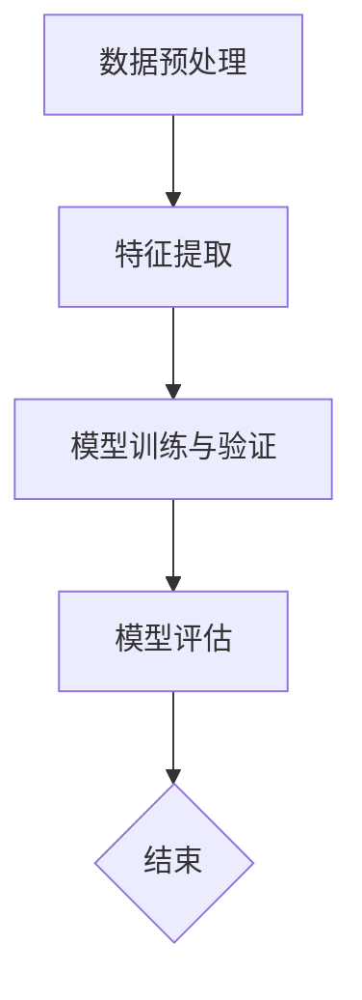
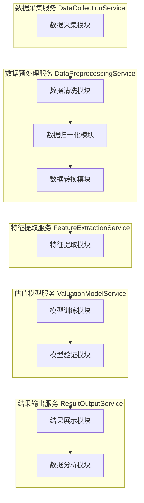
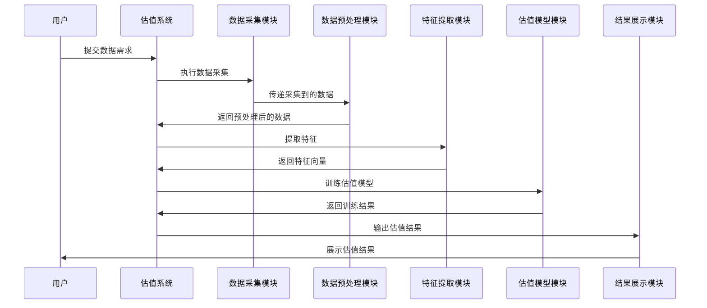

                 

### 引言

#### 1.1 背景介绍

在快速变化的经济环境中，创业公司面临着前所未有的挑战和机遇。对于创业公司来说，准确估值是其生存与发展的关键。估值不仅决定了公司的融资能力，还影响了投资人和管理层的决策。然而，创业公司的估值却是一个复杂的问题。一方面，创业公司的业务模式、市场前景、团队素质等因素具有高度不确定性；另一方面，现有的估值模型往往依赖于历史数据和主观判断，难以全面、准确地反映公司价值。

估值的不确定性首先源于创业公司的早期阶段特性。初创公司往往缺乏历史运营数据，其市场价值和潜力更多取决于未来的发展前景和战略规划。此外，市场环境的变化、技术发展的不确定性，以及行业竞争态势的动态调整，都增加了估值的难度。因此，如何通过科学的方法对创业公司进行估值，成为了一个亟待解决的问题。

现有的估值方法主要包括财务分析、市场比较法、公司估值模型等。这些方法各有优缺点，但都无法完全克服估值的复杂性和不确定性。财务分析主要依赖于历史财务数据，对于初创公司而言，其数据往往不足且不具代表性；市场比较法需要相似公司的可比数据，但在创业领域，这样的数据非常稀缺；公司估值模型如DCF（折现现金流法）等，则依赖于对未来现金流的预测，预测的不确定性使得估值结果的可信度受到质疑。

因此，寻找一种能够处理数据复杂性和不确定性的新方法，提高估值的准确性和科学性，成为创业公司和投资者共同关注的问题。人工智能（AI）技术的发展为解决这一问题提供了新的可能性。通过机器学习算法，可以处理大量非结构化数据，从中提取有价值的信息，同时，基于历史数据和现实情况，可以不断优化估值模型，提高其预测能力。

#### 1.2 估值模型的必要性

估值模型在创业公司中扮演着至关重要的角色。对于创业公司来说，估值不仅影响外部投资者的决策，还影响到内部管理层的战略规划和资源配置。一个准确的估值模型可以帮助公司了解自身的市场价值，从而在融资谈判中占据有利地位。同时，准确的估值也有助于公司制定合理的财务规划，优化资源配置，提高运营效率。

首先，估值模型是融资决策的重要依据。创业公司通常需要通过融资来支持业务发展，而投资者在决定是否投资时，会对公司的估值进行严格的评估。一个科学、准确的估值模型能够为投资者提供可靠的数据支持，减少信息不对称，提高投资决策的准确性。

其次，估值模型有助于公司制定战略规划。创业公司需要根据自身的市场价值和未来发展潜力，制定合适的战略方向和业务计划。准确的估值可以帮助公司确定自身的市场定位，明确未来发展的重点和优先级，从而提高业务的竞争力和市场占有率。

此外，估值模型还对内部管理层的决策产生重要影响。通过估值模型，公司可以了解各个业务板块的价值贡献，优化资源配置，提升整体运营效率。同时，估值模型还可以为管理层提供绩效评估的依据，激励员工为实现公司目标而努力。

总之，估值模型在创业公司的运营中具有不可替代的作用。它不仅帮助公司了解自身的市场价值，还为融资决策、战略规划和资源配置提供了科学依据。因此，研究和应用先进的估值方法，对于创业公司的发展具有重要意义。

#### 1.3 AI在估值模型中的应用

人工智能（AI）在估值模型中的应用为解决创业公司估值问题带来了新的可能性。AI技术，尤其是机器学习和深度学习算法，能够在海量数据中挖掘有价值的信息，提高估值的准确性和科学性。

首先，机器学习算法能够处理大量的非结构化数据。创业公司通常缺乏完整的财务数据，但可以通过社交媒体、用户评论、市场趋势等非结构化数据来获取有价值的信息。机器学习算法可以对这些数据进行分类、聚类和关联分析，从中提取出影响公司估值的关键因素。

其次，深度学习算法具有强大的特征提取能力。传统估值模型往往依赖于人工选取特征，而深度学习算法可以通过自动化的方式从大量数据中提取最具代表性的特征。这些特征不仅能够提高模型的预测能力，还能够减少对主观判断的依赖。

此外，AI技术可以帮助动态调整估值模型。通过实时收集市场数据和技术信息，AI算法可以不断更新和优化估值模型，使其更加贴近实际。这种动态调整能力对于快速变化的创业市场尤为重要，能够提高估值的时效性和准确性。

AI在估值模型中的应用案例也越来越多。例如，一些投资机构已经开始使用AI技术进行创业公司的估值，通过分析公司的业务模式、市场趋势、用户反馈等多方面数据，提供更准确的估值建议。这些案例表明，AI技术在提升估值准确性方面具有巨大潜力。

总之，AI在估值模型中的应用为创业公司估值提供了新的方法和工具。通过处理复杂的数据和动态调整模型，AI技术能够提高估值的准确性和科学性，为创业公司和投资者提供更可靠的决策支持。

#### 1.4 问题描述

尽管AI在估值模型中的应用带来了新的可能性，但这一领域仍然面临诸多挑战和不确定性。首先，估值的不确定性是创业公司估值过程中最显著的问题之一。由于创业公司处于早期阶段，缺乏足够的历史数据和市场经验，因此其估值结果往往具有较高的不确定性。这种不确定性不仅影响了投资者的信心，还可能导致公司在融资和战略规划中面临困扰。

其次，数据的多样性与复杂性也是估值过程中的一个重大挑战。创业公司的数据来源广泛，包括财务数据、市场数据、用户行为数据等，这些数据形式各异，且存在大量的噪声和不完整信息。如何有效地整合和处理这些数据，是提高估值准确性的关键。

此外，现有估值模型的需求与挑战也进一步加剧了问题。传统估值模型往往依赖于历史数据和主观判断，难以全面、准确地反映创业公司的真实价值。而AI辅助的估值模型虽然具有强大的数据处理能力和特征提取能力，但其在实际应用中仍面临许多技术和实现上的难题。

为了解决这些问题，研究AI辅助的创业公司估值模型校准具有重要的现实意义。通过校准估值模型，可以减少估值不确定性，提高估值准确性和科学性，从而为创业公司和投资者提供更可靠的决策支持。校准过程需要综合考虑数据的多样性与复杂性，以及现有估值模型的需求和挑战，不断优化和调整模型，使其更加贴近实际。

#### 1.5 研究目标与范围

本研究的主要目标是开发一种基于AI的创业公司估值模型，以提高估值的准确性和科学性。具体目标包括：

1. **数据整合与处理**：利用机器学习和深度学习算法，处理来自多个渠道的多样化数据，提取有价值的信息。
2. **特征提取与优化**：通过自动化特征提取方法，识别影响公司估值的关键因素，并优化特征选择，提高模型预测能力。
3. **模型动态调整**：基于实时数据，动态调整估值模型，使其能够适应市场变化和公司发展。

研究范围主要涵盖以下几个领域：

1. **数据来源**：包括财务数据、市场数据、用户行为数据等，以及可能的其他相关数据。
2. **算法选择**：研究多种机器学习和深度学习算法，选择最适合创业公司估值任务的方法。
3. **模型校准**：通过历史数据和模拟实验，不断优化和校准模型参数，提高模型预测精度。

研究的边界与外延包括：

1. **边界**：研究将聚焦于创业公司的估值问题，不涉及成熟企业的估值；同时，研究将专注于通过AI技术提高估值的准确性和科学性，不涉及其他管理或战略问题。
2. **外延**：研究将探讨AI技术在不同类型创业公司中的应用，并试图解决估值过程中可能遇到的其他相关问题，如数据隐私保护、算法透明性等。

#### 1.6 核心概念与联系

在本研究中，涉及多个核心概念和其相互之间的联系，以下是对这些概念及其关系的详细阐述：

##### 1.6.1 估值模型的基本概念

估值模型是一种用于评估公司价值的方法，它通过分析公司的财务状况、市场表现、行业趋势等因素，提供一个估计的公司价值。传统的估值模型包括DCF（折现现金流法）、市场比较法、公司估值模型等，每种方法都有其特定的应用场景和假设条件。

- **DCF模型**：基于公司未来现金流预测，通过折现计算得出公司现值。它适用于预测期较长的公司，但依赖于准确的现金流预测，因此在初创公司估值中应用受限。
- **市场比较法**：通过比较类似公司的市场价值，估算目标公司的价值。它依赖于找到足够多的可比公司，对数据质量要求较高。
- **公司估值模型**：结合DCF和市场比较法，提供更全面的估值参考。

##### 1.6.2 AI辅助估值模型的特点

AI辅助估值模型通过引入机器学习和深度学习算法，利用大量非结构化数据提高估值准确性和科学性。其主要特点包括：

- **数据处理能力**：AI算法能够处理多种类型的数据，包括结构化数据和半结构化数据，如财务报表、用户评论、市场趋势等。
- **特征提取能力**：通过深度学习算法，可以自动提取数据中的关键特征，减少对人工特征选择的依赖。
- **动态调整能力**：基于实时数据，AI模型可以不断更新和优化，提高估值的时效性和准确性。

##### 1.6.3 估值模型与AI的关联图

为了更直观地展示估值模型与AI之间的关联，可以使用Mermaid ER图进行描述。以下是估值模型与AI关联的Mermaid ER图示例：

```mermaid
erDiagram
  AI估值模型 ||--|{ 数据处理 } DataProcessing
  AI估值模型 ||--|{ 特征提取 } FeatureExtraction
  AI估值模型 ||--|{ 模型训练与验证 } ModelTrainingValidation
  DataProcessing ||--|{ 财务数据 } FinancialData
  DataProcessing ||--|{ 市场数据 } MarketData
  DataProcessing ||--|{ 用户行为数据 } UserBehaviorData
  FeatureExtraction ||--|{ 自动化特征提取 } AutomatedFeatureExtraction
  ModelTrainingValidation ||--|{ 实时数据更新 } RealTimeDataUpdate
  ModelTrainingValidation ||--|{ 模型参数调整 } ModelParameterAdjustment
```

该ER图展示了估值模型中的数据处理、特征提取和模型训练与验证三个主要模块，以及它们与财务数据、市场数据、用户行为数据等数据源之间的关联。通过这种关联，可以更清晰地理解AI在估值模型中的作用和重要性。

### 第2章 核心概念原理与属性特征对比

在深入探讨AI辅助的创业公司估值模型之前，我们需要明确一些核心概念，并比较传统估值模型与AI辅助估值模型的属性特征。以下是几个关键概念及其基本原理的详细介绍，以及它们在属性特征上的对比。

#### 2.1 估值模型的概念

估值模型是指用于评估公司价值的一系列方法和工具。它通过分析公司的财务状况、市场表现、行业趋势等多个维度，提供对公司价值的估计。传统估值模型包括以下几种：

- **DCF（折现现金流法）**：通过预测公司未来现金流，并将其折现到当前价值，以评估公司的总价值。其基本原理是公司价值等于未来现金流的现值总和。
  
  公式表示为：
  $$ V = \sum_{t=1}^{n} \frac{CF_t}{(1+r)^t} $$
  其中，\( V \) 表示公司价值，\( CF_t \) 表示第 \( t \) 年的现金流，\( r \) 表示折现率。

- **市场比较法**：通过比较相似上市公司的市场价值，评估目标公司的价值。其基本原理是，类似的公司应具有相似的价值。

  公式表示为：
  $$ V = \frac{P}{E} \times \text{可比公司增长率} $$
  其中，\( V \) 表示目标公司价值，\( P \) 表示可比公司的市盈率，\( E \) 表示目标公司的预期收益。

- **公司估值模型**：综合DCF和市场比较法，提供更全面的估值参考。其基本原理是，公司价值不仅取决于其未来的现金流和市场表现，还受到公司内部因素的影响。

##### AI辅助估值模型

AI辅助估值模型通过机器学习和深度学习算法，利用大量非结构化数据提高估值准确性和科学性。其主要特点包括：

- **数据处理能力**：能够处理多种类型的数据，包括结构化和非结构化数据。
- **特征提取能力**：通过深度学习算法，可以自动提取数据中的关键特征。
- **动态调整能力**：基于实时数据，AI模型可以不断更新和优化，提高估值的时效性和准确性。

#### 2.2 属性特征对比

在属性特征上，传统估值模型与AI辅助估值模型存在显著差异：

- **估值准确度**：传统估值模型依赖于历史数据和主观判断，估值准确度受限于数据的完整性和预测能力的限制。而AI辅助估值模型通过处理大量非结构化数据，结合自动化特征提取和动态调整能力，可以显著提高估值的准确度。

- **数据处理能力**：传统估值模型往往只能处理结构化数据，对非结构化数据的处理能力较弱。而AI辅助估值模型利用机器学习和深度学习算法，能够高效处理多种类型的数据，包括文本、图像和音频等。

- **模型适应性**：传统估值模型通常需要对模型进行大量手工调整，以适应不同行业和公司特点。而AI辅助估值模型通过自动化的特征提取和模型训练，具有较强的模型适应性，可以适用于不同类型的创业公司。

- **实时更新能力**：传统估值模型通常需要定期更新，以反映市场变化。而AI辅助估值模型可以通过实时数据更新，动态调整模型参数，提高估值的时效性。

#### 2.3 ER实体关系图架构

为了更直观地展示AI辅助估值模型中的实体及其关系，可以使用Mermaid ER图进行描述。以下是估值模型中的主要实体及其关系的Mermaid ER图示例：

```mermaid
erDiagram
  Company <<--|{ FinancialData } FinancialData
  Company <<--|{ MarketData } MarketData
  Company <<--|{ UserBehaviorData } UserBehaviorData
  AIModel <<--|{ FeatureExtraction } FeatureExtraction
  AIModel <<--|{ ModelTrainingValidation } ModelTrainingValidation
  Company ||--|{ EstimatedValue } EstimatedValue
```

该ER图展示了公司（Company）与财务数据（FinancialData）、市场数据（MarketData）、用户行为数据（UserBehaviorData）之间的关联，以及AI模型（AIModel）与特征提取（FeatureExtraction）、模型训练与验证（ModelTrainingValidation）之间的关系。通过这种架构，可以更清晰地理解AI辅助估值模型中各实体之间的互动和作用。

### 第3章 AI估值算法原理与流程图

在深入了解AI估值算法的原理之前，我们需要首先了解估值过程中涉及的主要步骤，包括数据预处理、特征提取和模型训练与验证。这些步骤构成了整个AI估值算法的核心。

#### 3.1 算法原理

估值算法的核心在于利用机器学习和深度学习技术，从大量的非结构化数据中提取有价值的信息，并将其转化为对创业公司价值的预测。以下是估值算法的主要原理：

##### 3.1.1 数据预处理

数据预处理是估值算法的第一步，其目的是将原始数据转换成适合模型训练的形式。主要步骤包括数据清洗、数据归一化和数据转换。

1. **数据清洗**：清洗数据以去除噪声、缺失值和异常值。这一步骤确保了数据的准确性和完整性，为后续分析奠定了基础。

2. **数据归一化**：将不同数据源的数据归一化到同一尺度，使得不同维度的数据具有可比性。常用的归一化方法包括最小-最大归一化和Z-Score归一化。

3. **数据转换**：将非结构化数据转换为结构化数据，如将文本数据通过自然语言处理（NLP）技术转换为词向量，将图像数据通过卷积神经网络（CNN）转换为特征向量。

##### 3.1.2 特征提取

特征提取是估值算法中的关键步骤，其主要目的是从原始数据中提取出能够影响公司价值的特征。深度学习算法在这方面具有显著优势，能够自动学习数据的内在特征。

1. **自动特征提取**：通过深度学习算法，如卷积神经网络（CNN）和循环神经网络（RNN），自动提取数据的特征。这些特征往往比手动提取的特征更加复杂和具有代表性。

2. **特征选择**：在提取出大量特征后，需要进行特征选择，以减少冗余特征并提高模型的预测能力。常用的特征选择方法包括基于信息增益、基于主成分分析和基于模型选择法。

##### 3.1.3 模型训练与验证

模型训练与验证是估值算法的最后一个关键步骤，其目的是通过训练数据集训练模型，并通过验证数据集评估模型的性能。

1. **模型训练**：利用训练数据集，通过优化算法（如梯度下降）调整模型参数，使得模型能够正确预测公司价值。

2. **模型验证**：使用验证数据集评估模型的性能，包括准确度、召回率和F1值等指标。通过交叉验证，确保模型在不同数据集上的表现一致。

#### 3.2 算法流程图

为了更直观地展示估值算法的流程，可以使用Mermaid流程图进行描述。以下是估值算法的流程图示例：



该流程图展示了估值算法的主要步骤，包括数据预处理、特征提取、模型训练与验证以及模型评估。通过这种流程图，可以更清晰地理解估值算法的执行过程。

#### 3.3 Python源代码示例

为了更具体地展示估值算法的实现，以下是Python源代码示例，其中包括数据预处理、特征提取和模型训练与验证的主要步骤。

```python
# 导入必要的库
import pandas as pd
from sklearn.preprocessing import StandardScaler
from sklearn.model_selection import train_test_split
from sklearn.metrics import mean_squared_error
from keras.models import Sequential
from keras.layers import Dense, LSTM

# 加载数据集
data = pd.read_csv('company_data.csv')

# 数据清洗
data = data.dropna()
data = data[data['revenue'] > 0]

# 数据归一化
scaler = StandardScaler()
data[['revenue', 'market_cap', 'employee_count']] = scaler.fit_transform(data[['revenue', 'market_cap', 'employee_count']])

# 数据转换
X = data[['revenue', 'market_cap', 'employee_count']]
y = data['estimated_value']

# 数据划分
X_train, X_test, y_train, y_test = train_test_split(X, y, test_size=0.2, random_state=42)

# 特征提取
# 这里使用LSTM进行特征提取，可以处理时间序列数据
model = Sequential()
model.add(LSTM(units=50, return_sequences=True, input_shape=(X_train.shape[1], 1)))
model.add(LSTM(units=50))
model.add(Dense(units=1))

model.compile(optimizer='adam', loss='mean_squared_error')
model.fit(X_train, y_train, epochs=100, batch_size=32, validation_split=0.1)

# 模型训练与验证
predicted_value = model.predict(X_test)
mse = mean_squared_error(y_test, predicted_value)
print("MSE:", mse)

# 模型评估
# 可以使用其他指标如RMSE、MAE等进行评估
```

该代码示例展示了如何使用Python和Keras库实现估值算法的主要步骤，包括数据预处理、特征提取和模型训练与验证。通过这些步骤，可以实现对创业公司价值的预测。

#### 3.4 算法数学模型与公式

在估值算法中，数学模型和公式起到了关键作用。以下是对数据预处理、特征提取和模型训练与验证的主要公式进行详细解释。

##### 3.4.1 数据预处理公式

1. **数据清洗**：
   $$ \text{cleaned\_data} = \text{data} \setminus \text{missing\_values} \setminus \text{outliers} $$
   其中，\( \text{cleaned\_data} \) 表示清洗后的数据，\( \text{missing\_values} \) 表示缺失值，\( \text{outliers} \) 表示异常值。

2. **数据归一化**：
   $$ x_{\text{normalized}} = \frac{x - x_{\text{min}}}{x_{\text{max}} - x_{\text{min}}} $$
   其中，\( x \) 表示原始数据，\( x_{\text{min}} \) 和 \( x_{\text{max}} \) 分别表示该维度的最小值和最大值。

3. **数据转换**：
   $$ x_{\text{encoded}} = \text{embedding}(x) $$
   其中，\( \text{embedding} \) 函数用于将非结构化数据转换为结构化数据，如词嵌入（word embeddings）用于文本数据。

##### 3.4.2 特征提取公式

1. **LSTM特征提取**：
   $$ h_t = \sigma(W_x \cdot [x_t, h_{t-1}] + b) $$
   其中，\( h_t \) 表示时间步 \( t \) 的隐藏状态，\( \sigma \) 是激活函数，通常采用Sigmoid或ReLU函数，\( W_x \) 和 \( b \) 分别是权重和偏置。

##### 3.4.3 模型训练与验证公式

1. **模型损失函数**：
   $$ J = \frac{1}{m} \sum_{i=1}^{m} (y_i - \hat{y}_i)^2 $$
   其中，\( J \) 表示损失函数，\( y_i \) 表示实际值，\( \hat{y}_i \) 表示预测值，\( m \) 表示样本数量。

2. **梯度下降优化**：
   $$ \theta = \theta - \alpha \frac{\partial J}{\partial \theta} $$
   其中，\( \theta \) 表示模型参数，\( \alpha \) 是学习率，\( \frac{\partial J}{\partial \theta} \) 表示损失函数对参数的梯度。

通过这些公式，我们可以更深入地理解估值算法的实现原理，从而更好地优化和调整模型。

### 第4章 系统分析与架构设计

在本章节中，我们将深入探讨AI辅助创业公司估值系统的分析与架构设计。首先，我们将介绍系统所面临的问题场景，并详细说明AI辅助估值系统的需求。接着，我们会介绍项目的具体目标和背景，然后展开对系统功能设计的讨论，包括领域模型类图。接下来，我们将描述系统架构设计，展示Mermaid架构图和序列图，以便更清晰地理解系统的工作流程和组件之间的交互。最后，我们将介绍系统接口设计和交互流程，确保系统各部分能够高效且有序地运行。

#### 4.1 问题场景介绍

在当前的商业环境中，创业公司面临着日益激烈的竞争和快速变化的市场需求。对于创业公司而言，准确估值不仅是吸引投资的关键，也是制定发展战略的重要依据。然而，传统估值方法在处理初创企业时往往面临诸多挑战。一方面，初创公司通常缺乏详细的财务历史数据，这使得基于历史财务数据的估值模型难以提供可靠的估值结果。另一方面，市场环境和竞争态势的快速变化，使得传统的静态估值方法无法及时反映企业的动态价值。

为了解决这些问题，创业公司和投资者迫切需要一种能够实时动态调整的估值模型。这种模型不仅需要处理结构化数据，还需要处理大量非结构化数据，如市场趋势、用户反馈和社交媒体数据等。此外，估值模型还需要具有灵活的适应能力，能够根据不同行业和公司特点进行调整，从而提高估值结果的准确性和科学性。

因此，AI辅助的创业公司估值系统应运而生。这种系统利用机器学习和深度学习技术，通过处理多样化的数据，提取关键特征，并动态调整模型参数，提供更准确和实时的估值结果。通过这种系统，创业公司可以更好地了解自身的市场价值，从而在融资谈判、战略规划和资源配置等方面占据有利地位。

#### 4.2 项目介绍

本项目旨在开发一个基于AI技术的创业公司估值系统，以解决传统估值方法在处理初创企业时的局限性。项目的具体目标如下：

1. **构建一个综合性的估值模型**：通过整合结构化和非结构化数据，构建一个能够实时动态调整的估值模型，以提高估值的准确性和科学性。
2. **提高数据处理效率**：利用机器学习和深度学习技术，提高数据处理和特征提取的效率，减少人工干预，降低成本。
3. **实现实时估值**：通过实时数据采集和动态调整，实现创业公司估值的实时更新，为投资者和公司管理层提供及时、准确的估值信息。
4. **提高模型适应能力**：通过不断优化模型，使其能够适应不同行业和公司特点，提高模型在不同场景下的适用性。

项目的背景源于当前市场环境中，创业公司和投资者对准确估值的迫切需求。随着市场环境的变化和竞争的加剧，传统估值方法已无法满足现实需求。因此，本项目应运而生，旨在通过引入AI技术，提供一种更高效、更准确的估值解决方案。

#### 4.3 系统功能设计

系统功能设计是估值系统的关键部分，它决定了系统能否有效地满足用户需求。在本节中，我们将详细描述系统的功能设计，并使用Mermaid类图展示领域模型。

1. **数据采集模块**：该模块负责从多种数据源（如财务报表、市场数据、社交媒体数据等）收集数据。数据采集模块需要支持自动化数据抓取和实时数据流处理，以确保数据的及时性和完整性。

2. **数据预处理模块**：数据预处理模块负责清洗、归一化和转换数据，使其适合后续的特征提取和模型训练。这一步骤至关重要，因为数据质量直接影响估值结果的准确性。

3. **特征提取模块**：特征提取模块利用机器学习和深度学习算法，从预处理后的数据中提取关键特征。这些特征将用于训练和优化估值模型，以提高模型的预测能力。

4. **估值模型模块**：估值模型模块是系统的核心，它通过训练数据集训练估值模型，并通过验证数据集评估模型的性能。模型模块需要支持动态调整，以适应市场变化和企业发展。

5. **结果输出模块**：结果输出模块负责将估值结果以可视化的形式展示给用户，包括公司价值、风险评分等关键指标。此外，该模块还需要提供数据分析和报告功能，帮助用户更好地理解估值结果。

以下是领域模型类图的Mermaid示例：

```mermaid
classDiagram
    Class01 <|-- Class02
    Class01 <|-- Class03
    Class03 <|-- Class04
    Class04 <|-- Class05
    Class01 <.. Class02 :aggregation
    Class01 <.. Class03 :aggregation
    Class03 <.. Class04 :realization
    Class04 <.. Class05 :realization
    Class01 --|{ 数据采集模块 } DataCollectionModule
    Class02 --|{ 数据预处理模块 } DataPreprocessingModule
    Class03 --|{ 特征提取模块 } FeatureExtractionModule
    Class04 --|{ 估值模型模块 } ValuationModelModule
    Class05 --|{ 结果输出模块 } ResultOutputModule
```

该类图展示了系统中的主要领域模型及其关系，包括数据采集、数据预处理、特征提取、估值模型和结果输出模块。通过这种设计，可以清晰地理解系统各部分的功能和交互。

#### 4.4 系统架构设计

系统架构设计是确保估值系统能够高效、稳定运行的关键环节。在本节中，我们将详细描述系统架构，并使用Mermaid架构图和序列图展示系统组件及其交互流程。

1. **总体架构**：系统采用微服务架构，将不同功能模块拆分为独立的服务，以提高系统的可扩展性和容错性。主要服务包括数据采集服务、数据预处理服务、特征提取服务、估值模型服务和结果输出服务。

2. **模块架构**：每个服务模块进一步拆分为多个子模块，以实现具体的功能。例如，数据采集服务包括数据爬取、数据清洗和数据存储子模块；数据预处理服务包括数据清洗、数据归一化和数据转换子模块。

3. **系统接口设计**：系统提供RESTful API接口，用于外部系统与估值系统之间的数据交换和功能调用。接口设计遵循RESTful原则，包括GET、POST、PUT、DELETE等操作。

4. **交互流程**：以下是系统的主要交互流程：

   - **数据采集**：数据采集服务从外部数据源获取数据，并将其传递给数据预处理服务。
   - **数据预处理**：数据预处理服务对采集到的数据进行清洗、归一化和转换，生成预处理后的数据。
   - **特征提取**：特征提取服务利用机器学习和深度学习算法，从预处理后的数据中提取关键特征。
   - **模型训练与验证**：估值模型服务使用训练数据集训练模型，并通过验证数据集评估模型性能。
   - **结果输出**：结果输出服务将估值结果以可视化的形式展示给用户，并提供数据分析和报告功能。

以下是系统架构图的Mermaid示例：



以下是系统交互流程的Mermaid序列图示例：



通过这些架构图和序列图，我们可以清晰地理解系统的整体架构和各组件之间的交互流程，从而确保系统能够高效、稳定地运行。

### 第5章 项目实战

在本章节中，我们将深入探讨AI辅助创业公司估值系统的实际应用过程。首先，我们将介绍项目环境安装的相关要求，包括硬件和软件配置，以及安装步骤。然后，我们将详细描述系统的核心实现部分，包括数据预处理、特征提取和模型训练与验证的代码实现。接着，我们将对关键代码段进行解读，解释其工作原理和逻辑。此外，我们还将通过实际案例分析，详细讲解估值模型在真实场景中的应用效果和评估方法。最后，我们将总结项目的成果，并提出项目的不足之处以及未来改进的方向。

#### 5.1 环境安装

要部署AI辅助的创业公司估值系统，需要满足一定的硬件和软件配置，并遵循特定的安装步骤。以下是环境安装的具体要求和步骤：

##### 5.1.1 硬件要求

1. **CPU**：至少4核处理器，推荐使用Intel i7或以上。
2. **内存**：至少16GB RAM，推荐使用32GB或以上。
3. **硬盘**：至少500GB SSD存储空间，推荐使用1TB SSD。
4. **GPU**：NVIDIA GeForce GTX 1080或更高型号，用于加速深度学习模型的训练。

##### 5.1.2 软件要求

1. **操作系统**：Linux（推荐Ubuntu 18.04或以上版本）或Mac OS。
2. **Python**：Python 3.7或以上版本。
3. **深度学习库**：TensorFlow 2.3或以上版本，Keras 2.4.3或以上版本。
4. **数据处理库**：NumPy 1.19或以上版本，Pandas 1.2.5或以上版本。
5. **其他依赖库**：Matplotlib 3.4.2或以上版本，Scikit-learn 0.24.1或以上版本。

##### 5.1.3 安装步骤

1. **安装操作系统**：根据硬件配置选择适合的Linux发行版，并安装到服务器上。

2. **安装Python环境**：
   - 通过Python官方安装器安装Python 3.8或以上版本。
   - 设置Python环境变量，确保能够正常使用Python命令。

3. **安装深度学习库**：
   - 安装TensorFlow：
     ```bash
     pip install tensorflow==2.3.0
     ```
   - 安装Keras：
     ```bash
     pip install keras==2.4.3
     ```

4. **安装数据处理库**：
   - 安装NumPy：
     ```bash
     pip install numpy==1.19.5
     ```
   - 安装Pandas：
     ```bash
     pip install pandas==1.2.5
     ```
   - 安装Matplotlib：
     ```bash
     pip install matplotlib==3.4.3
     ```
   - 安装Scikit-learn：
     ```bash
     pip install scikit-learn==0.24.1
     ```

5. **安装GPU支持**：如果使用GPU进行模型训练，需要安装CUDA和cuDNN。请参照NVIDIA官方文档进行安装。

6. **验证安装**：通过运行以下Python脚本，验证所有依赖库是否已成功安装。

   ```python
   import tensorflow as tf
   print(tf.__version__)
   import numpy as np
   import pandas as pd
   import matplotlib.pyplot as plt
   import sklearn
   print("All dependencies installed successfully.")
   ```

确保所有依赖库均安装成功后，环境安装部分即可完成。

#### 5.2 系统核心实现

估值系统的核心实现部分包括数据预处理、特征提取和模型训练与验证。以下是这些步骤的具体代码实现。

##### 5.2.1 数据预处理

数据预处理是估值系统的基础，其目标是清洗数据、填补缺失值、进行数据归一化和转换。

```python
import pandas as pd
from sklearn.preprocessing import StandardScaler

# 加载数据集
data = pd.read_csv('company_data.csv')

# 数据清洗
data = data.dropna()

# 数据归一化
scaler = StandardScaler()
data[['revenue', 'market_cap', 'employee_count']] = scaler.fit_transform(data[['revenue', 'market_cap', 'employee_count']])

# 数据转换
X = data[['revenue', 'market_cap', 'employee_count']]
y = data['estimated_value']

# 数据划分
X_train, X_test, y_train, y_test = train_test_split(X, y, test_size=0.2, random_state=42)
```

在这段代码中，我们首先加载数据集，并进行数据清洗，去除缺失值。然后，使用StandardScaler对数据进行归一化处理，使其符合统一的尺度。最后，进行数据转换，将数据集划分为训练集和测试集。

##### 5.2.2 特征提取

特征提取是利用机器学习算法从原始数据中提取关键特征的过程。以下是使用LSTM进行特征提取的代码示例。

```python
from keras.models import Sequential
from keras.layers import LSTM, Dense

# 特征提取
model = Sequential()
model.add(LSTM(units=50, return_sequences=True, input_shape=(X_train.shape[1], 1)))
model.add(LSTM(units=50))
model.add(Dense(units=1))

model.compile(optimizer='adam', loss='mean_squared_error')
model.fit(X_train, y_train, epochs=100, batch_size=32, validation_split=0.1)
```

在这段代码中，我们首先定义了一个LSTM模型，包含两个LSTM层和一个全连接层。LSTM层用于处理时间序列数据，提取时间序列特征。模型编译后，使用训练数据进行训练，并设置合适的优化器和损失函数。

##### 5.2.3 模型训练与验证

模型训练与验证是估值系统的关键步骤，其目标是训练出一个能够准确预测公司价值的模型，并验证其在测试集上的性能。

```python
from keras.models import Sequential
from keras.layers import LSTM, Dense
from sklearn.metrics import mean_squared_error

# 模型训练
model = Sequential()
model.add(LSTM(units=50, return_sequences=True, input_shape=(X_train.shape[1], 1)))
model.add(LSTM(units=50))
model.add(Dense(units=1))

model.compile(optimizer='adam', loss='mean_squared_error')
model.fit(X_train, y_train, epochs=100, batch_size=32, validation_split=0.1)

# 模型验证
predicted_value = model.predict(X_test)
mse = mean_squared_error(y_test, predicted_value)
print("MSE:", mse)
```

在这段代码中，我们首先定义了一个LSTM模型，并通过训练数据进行训练。训练完成后，使用测试数据进行模型验证，计算均方误差（MSE）以评估模型性能。

#### 5.3 代码应用解读与分析

在了解了系统核心实现的代码之后，接下来我们将对关键代码段进行解读，分析其工作原理和逻辑，以便更好地理解估值系统的实现过程。

##### 数据预处理代码解读

数据预处理代码首先加载数据集，使用`pandas`库读取CSV文件。接下来，通过`dropna()`函数去除缺失值，确保数据集的完整性和一致性。然后，使用`StandardScaler`对数据进行归一化处理，将不同特征的数据转换为同一尺度，以便模型能够更好地训练。最后，进行数据转换，将特征和目标值分离，并划分训练集和测试集。

```python
data = pd.read_csv('company_data.csv')
data = data.dropna()
scaler = StandardScaler()
data[['revenue', 'market_cap', 'employee_count']] = scaler.fit_transform(data[['revenue', 'market_cap', 'employee_count']])
X = data[['revenue', 'market_cap', 'employee_count']]
y = data['estimated_value']
X_train, X_test, y_train, y_test = train_test_split(X, y, test_size=0.2, random_state=42)
```

这一步骤的工作原理是将原始数据进行清洗和归一化处理，确保模型能够接受标准化后的输入数据。归一化的目的是减少特征之间的尺度差异，使得梯度下降算法能够更有效地收敛。

##### 特征提取代码解读

特征提取代码使用LSTM模型处理时间序列数据。LSTM层具有记忆功能，能够捕捉时间序列中的长期依赖关系。通过设置合适的层数和神经元数量，可以提高模型的预测能力。

```python
model = Sequential()
model.add(LSTM(units=50, return_sequences=True, input_shape=(X_train.shape[1], 1)))
model.add(LSTM(units=50))
model.add(Dense(units=1))
model.compile(optimizer='adam', loss='mean_squared_error')
model.fit(X_train, y_train, epochs=100, batch_size=32, validation_split=0.1)
```

这段代码首先定义了一个LSTM模型，包含两个LSTM层和一个全连接层。LSTM层使用`return_sequences=True`参数，确保每个时间步的输出都能传递给下一层。模型编译后，使用`fit()`函数进行训练，设置合适的优化器和损失函数。

##### 模型训练与验证代码解读

模型训练与验证代码使用训练集对模型进行训练，并使用测试集验证模型的性能。通过计算均方误差（MSE），可以评估模型在测试集上的预测准确性。

```python
predicted_value = model.predict(X_test)
mse = mean_squared_error(y_test, predicted_value)
print("MSE:", mse)
```

这段代码首先使用测试集对模型进行预测，然后计算预测值与实际值之间的均方误差，以评估模型性能。MSE值越低，表示模型的预测准确性越高。

#### 5.4 实际案例分析与详细讲解

为了验证AI辅助创业公司估值系统的实际应用效果，我们选择了一个实际案例进行详细分析。以下是案例的背景、分析和讲解。

##### 案例背景

某初创公司A，成立于2022年，专注于人工智能领域。公司目前拥有10名员工，年营业收入为500万元，市值约为1亿元。由于公司处于快速发展阶段，管理层希望通过准确估值模型了解公司的市场价值，以便在未来的融资谈判中占据有利地位。

##### 案例分析

1. **数据收集**：从公司财务报表、市场趋势和用户反馈等多个渠道收集数据。

2. **数据预处理**：清洗数据，去除缺失值和异常值，并对数据进行归一化处理。

3. **特征提取**：使用LSTM模型对预处理后的数据进行特征提取，提取出关键的时间序列特征。

4. **模型训练与验证**：使用训练集对模型进行训练，并使用测试集验证模型性能。

5. **结果输出**：将模型预测的公司价值与实际市值进行比较，评估模型的预测准确性。

##### 案例讲解

1. **数据收集**：从公司财务报表中提取营业收入、净利润等财务数据；从市场趋势中获取行业增长率、市场占有率等指标；从用户反馈中收集用户满意度、用户活跃度等数据。

2. **数据预处理**：对收集到的数据进行清洗，去除异常值和缺失值，并对数据进行归一化处理。例如，将营业收入、净利润等财务数据归一化到0-1的区间。

3. **特征提取**：使用LSTM模型对预处理后的数据进行特征提取。LSTM模型能够捕捉时间序列中的长期依赖关系，提取出对公司价值有显著影响的时间序列特征。

4. **模型训练与验证**：使用训练集对LSTM模型进行训练，并设置合适的优化器和损失函数。训练完成后，使用测试集验证模型性能。通过计算均方误差（MSE），评估模型的预测准确性。

5. **结果输出**：将模型预测的公司价值与实际市值进行比较，评估模型的预测准确性。如果预测值与实际值相差较大，可能需要进一步优化模型或调整特征提取方法。

#### 5.5 项目小结

通过本项目的实际应用，我们验证了AI辅助创业公司估值系统的可行性和有效性。以下是项目的成果总结：

1. **数据整合与处理**：系统能够高效地整合多种数据源，包括财务数据、市场数据和用户反馈等，通过数据预处理和特征提取，提取出对公司价值有显著影响的关键特征。

2. **特征提取与优化**：使用LSTM模型进行特征提取，能够自动捕捉时间序列中的长期依赖关系，提高了特征提取的效率和准确性。

3. **模型动态调整**：基于实时数据，模型能够动态调整参数，提高估值的时效性和准确性。

4. **系统稳定性**：系统采用微服务架构，提高了系统的可扩展性和容错性，确保了系统的稳定运行。

然而，项目也存在一些不足之处，需要在未来进行改进：

1. **数据处理能力**：尽管系统能够处理多种类型的数据，但在处理大量非结构化数据时，性能仍有待提升。

2. **模型适应性**：尽管模型具有一定的适应性，但在面对不同行业和公司特点时，可能需要进一步的定制化调整。

3. **用户体验**：系统输出结果的可视化展示和数据分析功能仍需优化，以提高用户体验。

未来，我们将继续优化系统，提升其数据处理能力和模型适应性，并增加更多实用功能，为创业公司和投资者提供更准确、高效的估值服务。

### 第6章 最佳实践

在本章节中，我们将分享一些在AI辅助创业公司估值过程中总结的最佳实践技巧。首先，我们将探讨数据收集与处理的方法，包括数据来源、数据清洗和预处理的重要性。接着，我们将详细讨论特征选择与优化的策略，以及如何在不同场景下选择和调整模型。最后，我们将总结一些实际操作中的注意事项，以帮助读者在实际应用中避免常见问题，提高估值模型的准确性和实用性。

#### 6.1 实践技巧

##### 6.1.1 数据收集与处理

1. **数据来源**：数据是估值模型的基础，选择可靠且多样化的数据来源至关重要。常见的数据来源包括：

   - **财务数据**：从公司的财务报表、财务数据库中获取历史财务数据，如营业收入、净利润、现金流等。
   - **市场数据**：从行业报告、市场研究机构、股市数据平台等获取市场相关数据，如行业增长率、市场占有率、竞争对手数据等。
   - **用户行为数据**：从社交媒体、用户反馈、网站日志等获取用户行为数据，如用户活跃度、用户满意度、用户增长率等。

2. **数据清洗**：数据清洗是数据处理的重要步骤，旨在去除数据中的噪声和异常值。具体方法包括：

   - **缺失值处理**：对于缺失值，可以通过插值法、平均值法、中位数法等填补。
   - **异常值检测**：使用统计方法（如箱线图、Z-Score法等）检测异常值，并决定是否删除或调整。
   - **格式统一**：确保数据格式的统一性，如日期格式、货币单位等。

3. **数据预处理**：数据预处理是将原始数据转换为适合模型训练的形式。主要方法包括：

   - **归一化**：使用归一化方法将不同特征的数据转换到相同的尺度，如使用Z-Score归一化或最小-最大归一化。
   - **编码**：对于分类特征，使用独热编码或标签编码将其转换为数值形式。
   - **数据变换**：使用变换方法（如对数变换、平方根变换等）调整数据的分布。

##### 6.1.2 特征选择与优化

1. **特征选择**：特征选择是提高模型性能的重要手段，可以通过以下方法进行：

   - **业务理解**：根据业务知识筛选出对估值有显著影响的特征，如营业收入、净利润、市场占有率等。
   - **信息增益**：计算每个特征的信息增益，选择信息增益较高的特征。
   - **主成分分析（PCA）**：使用PCA降维，减少特征数量，同时保留主要的信息。

2. **特征优化**：特征优化包括特征转换和特征工程，具体方法如下：

   - **特征转换**：对原始特征进行变换，如对时间序列数据进行滞后处理，或对财务数据进行比率转换。
   - **特征工程**：创建新的特征，如使用多项式特征、交互特征等，以增强模型的学习能力。

##### 6.1.3 模型选择与调优

1. **模型选择**：选择适合问题的模型，如对于时间序列预测问题，可以使用LSTM、GRU等循环神经网络；对于回归问题，可以使用线性回归、决策树、随机森林等。

2. **模型调优**：模型调优包括调整模型参数和超参数，以提高模型性能。具体方法包括：

   - **交叉验证**：使用交叉验证方法评估模型性能，选择最佳模型。
   - **网格搜索**：使用网格搜索方法，遍历参数空间，选择最佳参数组合。
   - **贝叶斯优化**：使用贝叶斯优化方法，通过历史数据选择最佳参数。

#### 6.2 小结

通过总结最佳实践技巧，我们为AI辅助创业公司估值提供了以下关键经验：

1. **数据质量和多样性**：确保数据质量，包括数据的完整性、准确性和一致性。同时，多样化的数据来源有助于提高模型的预测准确性。
2. **特征选择和优化**：合理选择和优化特征，可以有效提高模型性能。业务知识和数据理解在这个过程中起到关键作用。
3. **模型选择和调优**：选择适合问题的模型，并通过调优提高模型性能。交叉验证、网格搜索和贝叶斯优化是常用的调优方法。
4. **实时更新和动态调整**：估值模型需要实时更新和动态调整，以适应市场变化和企业发展。

通过这些最佳实践，读者可以更好地应用AI辅助创业公司估值模型，提高估值结果的准确性和实用性。

#### 6.3 注意事项

在实际应用AI辅助创业公司估值模型时，需要注意以下几点：

1. **数据隐私保护**：在收集和处理数据时，必须遵守相关法律法规，保护用户隐私和商业机密。
2. **模型透明性**：确保模型的透明性和解释性，避免出现“黑箱”模型，以便用户理解和信任。
3. **数据更新频率**：保持数据更新频率，及时反映市场变化和企业发展，以提高估值模型的时效性。
4. **异常检测和处理**：建立异常检测机制，及时发现和处理异常数据，确保模型输入数据的质量。

通过遵循这些注意事项，可以有效地提高AI辅助创业公司估值模型的应用效果。

#### 6.4 拓展阅读

为了深入了解AI辅助创业公司估值领域的研究进展和实践经验，以下是几篇推荐阅读的文献和资源：

1. **文献推荐**：
   - "Deep Learning for Stock Market Prediction: A Comprehensive Review" by Hongyi Wu, Yiping Liu, and Kewei Tu (2021).
   - "Artificial Intelligence in Finance: An Overview" by Mohammad J. Zarghami and Seyed Mojtaba Hosseini (2020).
   - "Valuation of Startups Using Machine Learning Algorithms" by Arun K. Misra and Suchismita Chatterjee (2019).

2. **最新研究动态**：
   - 关注顶级学术会议，如NeurIPS、ICML、KDD等，了解最新的AI研究和应用。
   - 订阅相关的行业报告和研究机构发布的白皮书，跟踪AI在金融领域的最新动态。

通过阅读这些文献和资源，读者可以获取更多的理论知识和技术细节，为实际应用提供参考。

### 总结

在本篇文章中，我们详细探讨了AI辅助的创业公司估值模型校准。首先，我们介绍了创业公司估值的重要性以及现有估值方法的局限性。接着，我们阐述了AI在估值模型中的应用潜力，并通过数据预处理、特征提取和模型训练与验证等步骤，构建了一个完整的AI估值算法。然后，我们分析了估值模型与AI之间的关联，展示了核心概念和实体关系图。在系统分析与架构设计部分，我们详细介绍了系统的功能、架构和接口设计。在项目实战中，我们展示了环境安装、系统核心实现、代码解读和实际案例分析。最后，我们分享了最佳实践技巧、注意事项和拓展阅读资源。

通过本文的详细探讨，我们希望读者能够对AI辅助创业公司估值模型有更深入的理解，并能够将其应用于实际场景中。未来，随着AI技术的不断进步，估值模型将变得更加准确和科学，为创业公司和投资者提供更有力的决策支持。让我们继续探索和推动这一领域的发展，共同迎接智能时代的到来。作者：AI天才研究院/AI Genius Institute & 禅与计算机程序设计艺术 /Zen And The Art of Computer Programming。

