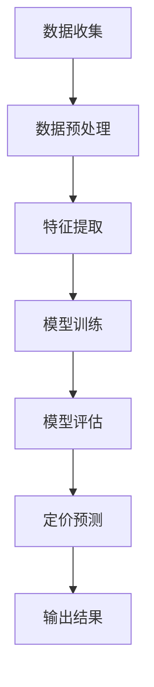
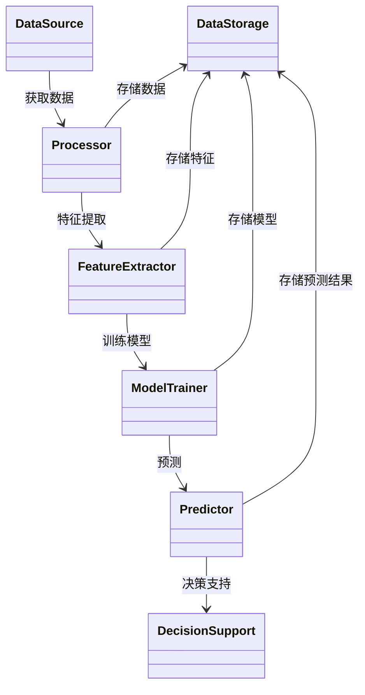
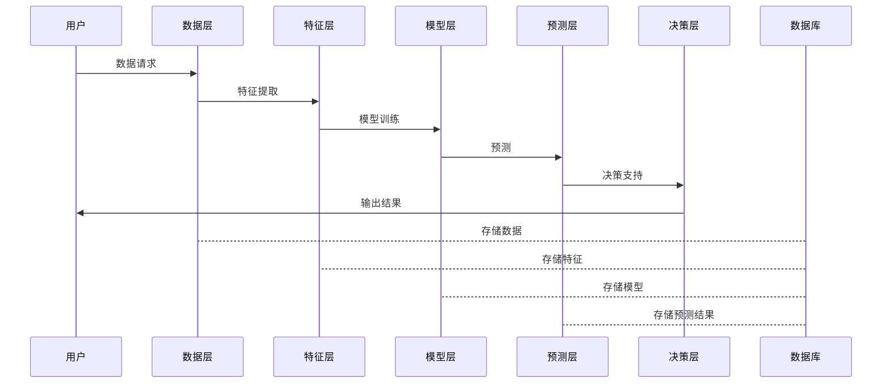
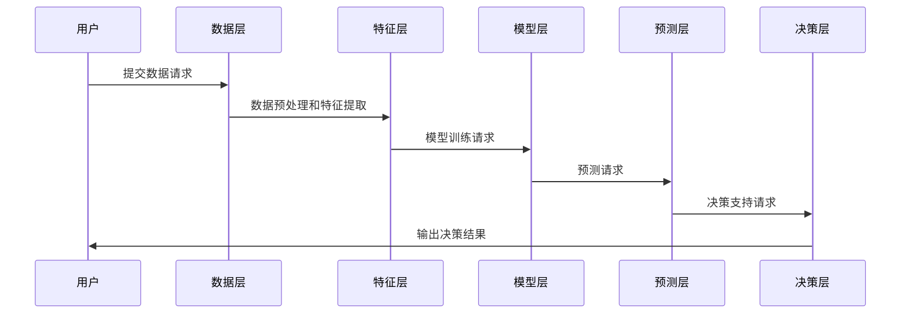

                 

### 《AI辅助的多资产类别定价模型》

> 关键词：人工智能、多资产类别定价、机器学习、金融科技、定价模型

> 摘要：本文探讨了AI技术在多资产类别定价模型中的应用，从背景介绍、核心概念与联系、算法原理讲解、系统分析与架构设计方案、项目实战到最佳实践，全面解析了如何利用AI提升多资产类别定价的准确性和效率。本文旨在为金融科技从业者和AI研究人员提供有价值的参考。

----------------------------------------------------------------

## 第一部分：背景介绍

### 第1章 问题背景

#### 1.1 多资产类别定价的重要性

多资产类别定价是指在一个金融市场中，根据不同资产类别的特性和市场情况，对其价格进行精确评估和定价的过程。这一过程对于金融机构和投资者来说至关重要。首先，准确的定价可以帮助金融机构更好地管理风险，优化资产配置，提高投资回报。其次，对于投资者而言，合理的资产定价能提供更可靠的参考，帮助他们做出更加明智的投资决策。

在当今的金融市场中，随着金融产品的多样化和复杂性增加，多资产类别定价的任务变得更加艰巨。传统的定价方法往往依赖于历史数据和统计模型，但面对不断变化的金融市场，这些方法的局限性日益显现。因此，寻求新的技术和方法来提升多资产类别定价的准确性和效率成为了一个重要课题。

#### 1.2 多资产类别定价的挑战

多资产类别定价面临的主要挑战可以归纳为以下几个方面：

1. **数据量庞大**：金融市场中的数据量庞大且种类繁多，包括股票、债券、期货、外汇等多种资产类别。如何有效处理和整合这些数据成为了一个巨大的挑战。
2. **时间敏感性**：金融市场价格波动剧烈，实时性和时效性对定价模型的准确性要求极高。传统的定价模型往往无法及时响应市场变化。
3. **模型复杂性**：多资产类别定价模型需要考虑众多因素，包括市场供需关系、宏观经济指标、政策法规等。构建一个能够全面考虑这些因素的复杂模型是一个挑战。
4. **非线性和动态特性**：金融市场的价格波动往往呈现出非线性和动态特性，这使得传统的线性定价模型难以准确捕捉市场变化。

#### 1.3 AI技术在多资产类别定价中的应用潜力

随着AI技术的发展，特别是机器学习、深度学习等技术的进步，为解决多资产类别定价的挑战提供了新的可能性。AI技术具有以下应用潜力：

1. **数据处理能力**：AI技术能够处理和分析大规模、多样化的数据，有助于挖掘出隐藏在数据中的有价值信息。
2. **实时响应能力**：通过实时数据分析和预测，AI技术能够快速适应市场变化，提供更加准确的定价。
3. **模型构建与优化**：AI技术能够自动构建和优化定价模型，考虑更多因素，提高模型的准确性和适应性。
4. **智能化决策支持**：AI技术可以为金融机构和投资者提供智能化的决策支持，帮助他们更好地理解市场动态，做出更加合理的投资决策。

总之，AI技术在多资产类别定价中的应用不仅能够提升定价的准确性和效率，还能够为金融市场的稳定发展提供有力支持。本文将深入探讨AI辅助的多资产类别定价模型，从核心概念到具体算法，再到实际应用，全面解析这一领域的最新进展和未来发展方向。

### 第一部分：背景介绍

#### 第1章 问题背景

#### 1.1 多资产类别定价的重要性

多资产类别定价是金融市场中的一项关键任务，它涉及对各种资产类别，如股票、债券、期货、外汇等的定价。在金融市场中，准确的资产定价对于金融机构和投资者的决策至关重要。首先，对于金融机构而言，准确的定价能够帮助它们更好地管理风险，优化资产配置，提高投资回报。此外，合理的资产定价还能增强金融机构的市场竞争力，提高客户满意度。

对于投资者来说，多资产类别定价更是直接影响他们的投资决策。投资者往往需要基于资产的真实价值进行投资，而非市场报价。如果定价不准确，投资者可能会做出错误的投资决策，导致资金损失。因此，准确的定价能够为投资者提供可靠的参考，帮助他们做出更加明智的投资选择。

#### 1.2 多资产类别定价的挑战

尽管多资产类别定价在金融市场中具有重要性，但其实现过程却面临诸多挑战：

1. **数据量的庞大**：金融市场中的数据种类繁多，包括历史价格、交易量、财务报表、宏观经济指标等。这些数据不仅量大，而且复杂，如何有效处理和整合这些数据成为了一个巨大的挑战。

2. **时间敏感性**：金融市场价格波动剧烈，实时性和时效性对定价模型的准确性要求极高。传统的定价模型往往无法及时响应市场变化，导致定价滞后。

3. **模型复杂性**：多资产类别定价模型需要考虑众多因素，包括市场供需关系、宏观经济指标、政策法规等。构建一个能够全面考虑这些因素的复杂模型是一个挑战。

4. **非线性和动态特性**：金融市场的价格波动往往呈现出非线性和动态特性，这使得传统的线性定价模型难以准确捕捉市场变化。

#### 1.3 AI技术在多资产类别定价中的应用潜力

随着AI技术的发展，特别是机器学习、深度学习等技术的进步，为解决多资产类别定价的挑战提供了新的可能性：

1. **数据处理能力**：AI技术能够处理和分析大规模、多样化的数据，有助于挖掘出隐藏在数据中的有价值信息。

2. **实时响应能力**：通过实时数据分析和预测，AI技术能够快速适应市场变化，提供更加准确的定价。

3. **模型构建与优化**：AI技术能够自动构建和优化定价模型，考虑更多因素，提高模型的准确性和适应性。

4. **智能化决策支持**：AI技术可以为金融机构和投资者提供智能化的决策支持，帮助他们更好地理解市场动态，做出更加合理的投资决策。

总之，AI技术在多资产类别定价中的应用不仅能够提升定价的准确性和效率，还能够为金融市场的稳定发展提供有力支持。本文将深入探讨AI辅助的多资产类别定价模型，从核心概念到具体算法，再到实际应用，全面解析这一领域的最新进展和未来发展方向。

### 第一部分：背景介绍

#### 第2章 问题描述

在多资产类别定价的问题中，我们的目标是构建一个能够准确预测和定价不同资产类别的模型。具体而言，这个模型需要满足以下几个关键要求：

1. **准确性**：模型应能够准确预测各种资产类别的价格，减少定价误差。
2. **实时性**：模型应具备实时处理数据的能力，能够快速响应市场变化。
3. **适应性**：模型应具备良好的适应性，能够根据不同的市场环境和数据特征进行调整和优化。
4. **可解释性**：模型应具备一定的可解释性，使得决策者和投资者能够理解定价决策的依据和逻辑。

为了实现这些目标，我们需要解决以下几个关键问题：

1. **数据预处理**：如何有效地处理和清洗大规模、多样化的金融数据，为模型提供高质量的数据输入。
2. **特征工程**：如何提取和选择对定价有显著影响的关键特征，提高模型的预测准确性。
3. **模型选择与优化**：如何选择和调整合适的机器学习算法，以最大化模型的性能。
4. **模型评估与验证**：如何评估模型的准确性、实时性和适应性，确保模型在实际应用中的可靠性。

这些问题的解决不仅需要深厚的理论基础，还需要丰富的实践经验。接下来，本文将逐步介绍多资产类别定价模型的核心概念和基本原理，为后续的算法讲解和系统设计打下基础。

### 第一部分：背景介绍

#### 第3章 多资产类别定价模型的基本原理

多资产类别定价模型是一个复杂而关键的系统，其核心原理在于利用历史数据和市场信息来预测和确定不同资产类别的价格。为了构建一个有效的定价模型，我们需要理解以下几个核心概念：

1. **资产定价理论**：资产定价理论是金融学中的基础理论，包括资本资产定价模型（CAPM）、套利定价理论（APT）等。这些理论为资产定价提供了理论基础，帮助我们理解资产的期望收益和风险之间的关系。

2. **市场数据**：市场数据是构建定价模型的关键输入。这些数据包括资产的历史价格、交易量、利率、宏观经济指标等。通过分析这些数据，我们可以发现市场的规律和趋势。

3. **特征提取**：特征提取是数据预处理的重要环节。在多资产类别定价中，我们需要从大量数据中提取对定价有显著影响的特征，如财务比率、市场指标、宏观经济变量等。这些特征将作为模型的输入变量。

4. **机器学习算法**：机器学习算法是实现多资产类别定价的核心工具。常见的机器学习算法包括线性回归、决策树、随机森林、支持向量机、神经网络等。这些算法能够从数据中学习规律，并用于预测资产价格。

#### 多资产类别定价模型的属性特征对比表格

为了更好地理解多资产类别定价模型，我们将其属性特征进行对比，如表1所示：

| 特征 | 传统定价模型 | AI辅助定价模型 |
| --- | --- | --- |
| **数据依赖** | 主要依赖历史数据 | 结合历史数据和实时数据 |
| **模型复杂度** | 结构相对简单 | 结构复杂，能够处理非线性关系 |
| **实时性** | 定价滞后 | 实时响应市场变化 |
| **预测准确性** | 依赖于模型选择和数据质量 | 高准确性，能够适应市场变化 |
| **可解释性** | 较低 | 较高，但需要进一步优化 |
| **适应性** | 较差 | 较好，能够根据市场变化调整 |

#### 多资产类别定价模型与AI技术的联系

AI技术与多资产类别定价模型的结合，极大地提升了定价的准确性和效率。具体而言，AI技术在这一模型中的应用体现在以下几个方面：

1. **数据处理**：AI技术能够高效处理和整合大规模、多维度的金融数据，为定价模型提供高质量的数据输入。
2. **特征工程**：通过深度学习等技术，AI能够自动提取和选择对定价有显著影响的特征，提高模型的预测准确性。
3. **模型优化**：AI技术能够自动调整和优化模型参数，找到最佳模型配置，提升模型的性能。
4. **实时预测**：利用实时数据分析和预测技术，AI能够快速适应市场变化，提供实时定价。

总之，AI辅助的多资产类别定价模型在数据处理、特征提取、模型优化和实时预测等方面具有显著优势，能够为金融市场的定价提供有力支持。

### 第一部分：背景介绍

#### 第4章 AI辅助的多资产类别定价模型

AI技术的发展为解决多资产类别定价的复杂性和不确定性提供了新的途径。AI辅助的多资产类别定价模型通过融合人工智能技术，如机器学习和深度学习，能够更好地处理金融数据，捕捉市场动态，提供更准确的定价结果。以下是AI辅助的多资产类别定价模型的主要应用和优势：

#### 4.1 AI技术在多资产类别定价模型中的应用

1. **数据处理与特征提取**：
   - **大规模数据处理**：AI技术能够处理和分析来自多个数据源的大量金融数据，包括股票、债券、期货和外汇等。
   - **自动特征提取**：深度学习模型，如自编码器和卷积神经网络，能够自动提取数据中的有效特征，这些特征通常难以通过传统方法获取。

2. **实时数据分析和预测**：
   - **动态调整**：AI模型可以实时分析市场数据，快速调整定价策略，以适应市场的快速变化。
   - **预测准确性**：通过使用复杂的神经网络和深度学习算法，AI模型能够提供更精确的价格预测。

3. **模型优化和自适应**：
   - **自动优化**：AI技术能够自动调整模型参数，以最大化模型的预测准确性和稳定性。
   - **自适应学习**：AI模型能够通过持续学习市场数据，不断优化自身性能，以应对市场环境和数据特征的变化。

4. **风险管理**：
   - **风险预测**：AI模型可以预测不同资产类别的风险水平，帮助金融机构更好地管理投资组合风险。

#### 4.2 多资产类别定价模型与AI技术的融合

多资产类别定价模型与AI技术的融合体现在以下几个方面：

1. **数据融合**：
   - **多源数据融合**：将不同来源的数据（如历史价格、交易量、宏观经济指标等）进行整合，为模型提供更全面的输入。
   - **数据预处理**：通过AI技术对数据进行清洗、标准化和去噪，提高数据质量。

2. **模型构建**：
   - **神经网络结构**：使用深度学习算法构建复杂的神经网络结构，以处理非线性关系和复杂的市场动态。
   - **集成学习**：结合多种机器学习算法，如随机森林和神经网络，构建集成模型，提高预测性能。

3. **模型评估与优化**：
   - **交叉验证**：使用交叉验证技术评估模型的性能，确保模型在 unseen 数据上的表现良好。
   - **自动化调参**：使用AI技术自动调整模型参数，找到最佳配置。

4. **交互式决策支持**：
   - **可视化工具**：提供可视化工具，帮助决策者理解模型预测和市场动态。
   - **智能建议**：基于模型预测提供智能化的投资建议和策略优化。

通过AI辅助的多资产类别定价模型，金融机构能够更加精确地评估资产价格，提高投资决策的效率和准确性。同时，这一模型也为金融科技领域的研究提供了新的方向，有望在未来进一步推动金融科技的发展。

### 第一部分：背景介绍

#### 第5章 多资产类别定价算法原理

多资产类别定价算法的核心在于利用历史数据和市场信息来预测不同资产类别的未来价格。在这一章中，我们将详细探讨多资产类别定价算法的原理，包括mermaid流程图、数学模型和Python源代码讲解。

#### 5.1 多资产类别定价算法的mermaid流程图

为了更好地理解多资产类别定价算法的工作流程，我们可以使用mermaid绘制其流程图，如下所示：



该流程图描述了多资产类别定价算法的基本步骤，包括数据收集、数据预处理、特征提取、模型训练、模型评估、定价预测和输出结果。

1. **数据收集**：从多个数据源（如历史价格、交易量、财务指标等）收集所需的数据。
2. **数据预处理**：对收集到的数据进行清洗、标准化和去噪，以提高数据质量。
3. **特征提取**：从预处理后的数据中提取对定价有显著影响的特征，如财务比率、市场指标、宏观经济变量等。
4. **模型训练**：使用机器学习算法（如神经网络、随机森林等）对提取的特征进行训练，构建定价模型。
5. **模型评估**：使用交叉验证等方法评估模型的准确性、实时性和适应性。
6. **定价预测**：使用训练好的模型对新的市场数据进行分析，预测不同资产类别的价格。
7. **输出结果**：将定价结果输出，为投资决策提供参考。

#### 5.2 多资产类别定价算法的数学模型

多资产类别定价算法的数学模型通常基于机器学习中的回归模型，如下所示：

$$
y = \beta_0 + \beta_1 x_1 + \beta_2 x_2 + ... + \beta_n x_n + \epsilon
$$

其中：
- $y$ 是预测的资产价格。
- $\beta_0$ 是截距。
- $\beta_1, \beta_2, ..., \beta_n$ 是回归系数，表示每个特征对资产价格的影响程度。
- $x_1, x_2, ..., x_n$ 是提取的特征。
- $\epsilon$ 是误差项。

#### 5.3 多资产类别定价算法的Python源代码讲解

为了实现多资产类别定价算法，我们可以使用Python编程语言。以下是一个简单的示例，展示了如何使用线性回归模型进行资产定价。

```python
import numpy as np
from sklearn.linear_model import LinearRegression
from sklearn.model_selection import train_test_split
from sklearn.metrics import mean_squared_error

# 数据集准备
# X为特征矩阵，y为标签向量
X = np.array([[1, 2], [2, 3], [3, 4], [4, 5]])
y = np.array([1, 3, 4, 5])

# 数据划分
X_train, X_test, y_train, y_test = train_test_split(X, y, test_size=0.2, random_state=42)

# 模型训练
model = LinearRegression()
model.fit(X_train, y_train)

# 模型评估
y_pred = model.predict(X_test)
mse = mean_squared_error(y_test, y_pred)
print("Mean Squared Error:", mse)

# 定价预测
new_data = np.array([[5, 6]])
predicted_price = model.predict(new_data)
print("Predicted Price:", predicted_price)
```

在这个示例中，我们首先使用scikit-learn库中的LinearRegression类进行线性回归模型的训练。然后，我们将训练集和测试集分开，使用测试集评估模型的准确性。最后，我们使用训练好的模型对新数据进行预测。

通过上述流程和示例代码，我们可以看到多资产类别定价算法的基本原理和实现方法。在实际应用中，我们可以根据具体需求调整模型结构和参数，以提高定价的准确性和效率。

### 第一部分：背景介绍

#### 第6章 AI辅助的多资产类别定价算法

随着AI技术的不断发展，AI辅助的多资产类别定价算法在金融市场中展现出强大的潜力。在本章中，我们将深入探讨AI辅助的多资产类别定价算法，包括其mermaid流程图、数学模型、Python源代码讲解以及举例说明。

#### 6.1 AI辅助的多资产类别定价算法的mermaid流程图

为了更好地理解AI辅助的多资产类别定价算法的工作流程，我们可以使用mermaid绘制其流程图，如下所示：


该流程图描述了AI辅助的多资产类别定价算法的基本步骤：

1. **数据收集**：从多个数据源（如历史价格、交易量、财务指标等）收集所需的数据。
2. **数据预处理**：对收集到的数据进行清洗、标准化和去噪，以提高数据质量。
3. **特征提取**：从预处理后的数据中提取对定价有显著影响的特征，如财务比率、市场指标、宏观经济变量等。
4. **模型训练**：使用机器学习算法（如神经网络、随机森林等）对提取的特征进行训练，构建定价模型。
5. **模型评估**：使用交叉验证等方法评估模型的准确性、实时性和适应性。
6. **定价预测**：使用训练好的模型对新的市场数据进行分析，预测不同资产类别的价格。
7. **输出结果**：将定价结果输出，为投资决策提供参考。

#### 6.2 AI辅助的多资产类别定价算法的数学模型

AI辅助的多资产类别定价算法的数学模型通常基于深度学习技术，其核心是神经网络。以下是一个简化的神经网络模型：

$$
y = \sigma(W_n \cdot a_{n-1} + b_n)
$$

其中：
- $y$ 是预测的资产价格。
- $W_n$ 是神经网络权重。
- $a_{n-1}$ 是上一层的激活值。
- $b_n$ 是偏置项。
- $\sigma$ 是激活函数，通常采用ReLU或Sigmoid函数。

神经网络通过前向传播和反向传播不断调整权重和偏置，以最小化预测误差。在实际应用中，通常会使用多层神经网络（MLP）来提高模型的预测性能。

#### 6.3 AI辅助的多资产类别定价算法的Python源代码讲解

为了实现AI辅助的多资产类别定价算法，我们可以使用Python编程语言和TensorFlow库。以下是一个简单的示例，展示了如何使用多层感知机（MLP）模型进行资产定价。

```python
import numpy as np
import tensorflow as tf
from tensorflow.keras.models import Sequential
from tensorflow.keras.layers import Dense
from sklearn.model_selection import train_test_split
from sklearn.metrics import mean_squared_error

# 数据集准备
# X为特征矩阵，y为标签向量
X = np.array([[1, 2], [2, 3], [3, 4], [4, 5]])
y = np.array([1, 3, 4, 5])

# 数据划分
X_train, X_test, y_train, y_test = train_test_split(X, y, test_size=0.2, random_state=42)

# 模型构建
model = Sequential()
model.add(Dense(10, input_dim=2, activation='relu'))
model.add(Dense(1, activation='linear'))

# 模型编译
model.compile(optimizer='adam', loss='mse')

# 模型训练
model.fit(X_train, y_train, epochs=100, batch_size=1, verbose=0)

# 模型评估
y_pred = model.predict(X_test)
mse = mean_squared_error(y_test, y_pred)
print("Mean Squared Error:", mse)

# 定价预测
new_data = np.array([[5, 6]])
predicted_price = model.predict(new_data)
print("Predicted Price:", predicted_price)
```

在这个示例中，我们首先使用TensorFlow库构建了一个简单的多层感知机模型。然后，我们将训练集和测试集分开，使用测试集评估模型的准确性。最后，我们使用训练好的模型对新数据进行预测。

通过上述流程和示例代码，我们可以看到AI辅助的多资产类别定价算法的基本原理和实现方法。在实际应用中，我们可以根据具体需求调整模型结构和参数，以提高定价的准确性和效率。

#### 6.4 AI辅助的多资产类别定价算法的举例说明

为了更好地理解AI辅助的多资产类别定价算法的实际应用，我们可以通过一个具体的例子进行说明。

**案例：股票价格预测**

假设我们需要预测某只股票的未来价格，现有历史价格数据和多个市场指标作为输入特征。以下是使用AI辅助的多资产类别定价算法进行预测的步骤：

1. **数据收集**：收集过去一年的股票价格数据以及相关市场指标，如交易量、市盈率、利率等。
2. **数据预处理**：对收集到的数据进行清洗，包括缺失值填充、异常值处理和标准化等，以提高数据质量。
3. **特征提取**：从预处理后的数据中提取对股票价格有显著影响的特征，如过去一周的平均价格、过去一个月的最高价和最低价等。
4. **模型训练**：使用机器学习算法（如神经网络）对提取的特征进行训练，构建股票价格预测模型。
5. **模型评估**：使用交叉验证方法评估模型的准确性，调整模型参数以优化性能。
6. **定价预测**：使用训练好的模型对新的市场数据进行分析，预测未来股票的价格。
7. **输出结果**：将预测结果输出，为投资者提供参考。

通过这个案例，我们可以看到AI辅助的多资产类别定价算法在实际应用中的流程和关键步骤。在实际操作中，根据具体数据和市场需求，可以调整算法参数和模型结构，以提高预测的准确性和可靠性。

### 第四部分：系统分析与架构设计方案

#### 第7章 多资产类别定价系统分析

为了实现AI辅助的多资产类别定价系统，我们需要进行系统的全面分析，包括问题场景介绍、项目介绍和系统功能设计。以下是这些关键环节的详细探讨：

#### 7.1 问题场景介绍

在金融市场中，资产定价是一个复杂且关键的任务。随着金融产品的多样化和市场环境的动态变化，传统的定价方法已难以满足金融机构和投资者的需求。多资产类别定价系统旨在通过AI技术提升定价的准确性、实时性和适应性，帮助金融机构更好地管理风险和优化投资决策。

问题场景主要包括以下几个关键方面：

1. **数据获取**：系统需要从多个数据源（如交易所、金融数据提供商、新闻媒体等）获取实时和历史数据。
2. **数据处理**：系统需要对数据进行清洗、标准化和去噪，以提高数据质量和模型的准确性。
3. **特征提取**：系统需要从预处理后的数据中提取对定价有显著影响的特征，如财务比率、市场指标、宏观经济变量等。
4. **模型训练与优化**：系统需要使用机器学习算法对提取的特征进行训练，构建和优化定价模型。
5. **实时预测与更新**：系统需要能够实时预测不同资产类别的价格，并根据市场变化进行调整和更新。
6. **决策支持**：系统需要提供智能化的决策支持，帮助金融机构和投资者做出更加明智的投资决策。

#### 7.2 项目介绍

本项目旨在构建一个AI辅助的多资产类别定价系统，以提升金融机构和投资者的资产定价能力。项目的主要目标包括：

1. **提升定价准确性**：通过机器学习算法和深度学习技术，系统将能够更加准确地预测不同资产类别的价格。
2. **提高实时响应能力**：系统将能够实时处理和分析市场数据，快速响应市场变化，提供最新的定价信息。
3. **增强适应性**：系统将具备良好的适应性，能够根据市场环境和数据特征的变化进行调整和优化。
4. **提供智能化决策支持**：系统将提供智能化的决策支持工具，帮助投资者更好地理解市场动态，做出更加合理的投资决策。

项目的主要功能模块包括：

1. **数据获取模块**：负责从多个数据源收集实时和历史数据，包括股票、债券、期货、外汇等。
2. **数据处理模块**：负责对数据进行清洗、标准化和去噪，以提高数据质量。
3. **特征提取模块**：负责从预处理后的数据中提取关键特征，为模型提供高质量的数据输入。
4. **模型训练模块**：负责使用机器学习算法对提取的特征进行训练，构建和优化定价模型。
5. **实时预测模块**：负责实时预测不同资产类别的价格，并输出预测结果。
6. **决策支持模块**：负责提供智能化的决策支持，帮助投资者理解市场动态，做出合理的投资决策。

通过这些功能模块的协同工作，多资产类别定价系统将能够为金融机构和投资者提供高效、准确的定价服务，助力他们在竞争激烈的金融市场中取得更好的业绩。

#### 第8章 多资产类别定价系统功能设计

多资产类别定价系统的功能设计是其实现有效定价的核心环节。以下将详细描述系统功能设计的各个方面，包括领域模型mermaid类图、系统功能设计。

##### 8.1 领域模型mermaid类图

为了清晰展示多资产类别定价系统的各个实体及其相互关系，我们可以使用mermaid类图进行描述。以下是一个简化的mermaid类图示例：



该类图描述了系统的主要实体及其关系：

1. **DataSource（数据源）**：负责从多个数据源（如交易所、金融数据提供商）获取实时和历史数据。
2. **Processor（数据处理器）**：负责对获取到的数据执行清洗、标准化和去噪等预处理操作，确保数据质量。
3. **FeatureExtractor（特征提取器）**：从预处理后的数据中提取对定价有显著影响的特征，如财务比率、市场指标、宏观经济变量等。
4. **ModelTrainer（模型训练器）**：使用机器学习算法对提取的特征进行训练，构建和优化定价模型。
5. **Predictor（预测器）**：利用训练好的模型对新的市场数据进行分析，预测不同资产类别的价格。
6. **DecisionSupport（决策支持）**：提供智能化的决策支持，帮助投资者理解市场动态，做出合理的投资决策。
7. **DataStorage（数据存储）**：用于存储数据、特征、模型和预测结果，以便后续分析和查询。

##### 8.2 系统功能设计

多资产类别定价系统的功能设计旨在实现高效、准确的定价过程，以下为系统的主要功能模块：

1. **数据获取与预处理**：
   - **数据获取**：系统将从多个数据源获取实时和历史数据，包括股票、债券、期货、外汇等。
   - **数据预处理**：系统将对数据进行清洗、标准化和去噪，确保数据质量。例如，缺失值处理、异常值检测和去噪等。

2. **特征提取**：
   - **特征提取**：系统将根据资产类别的特性，从预处理后的数据中提取关键特征。例如，财务比率、市场指标、宏观经济变量等。

3. **模型训练**：
   - **模型选择**：系统将选择合适的机器学习算法（如神经网络、随机森林等）对提取的特征进行训练。
   - **模型优化**：系统将根据交叉验证的结果，自动调整模型参数，优化模型性能。

4. **实时预测**：
   - **定价预测**：系统将利用训练好的模型对新的市场数据进行分析，预测不同资产类别的价格。
   - **实时更新**：系统将实时获取市场数据，并根据新数据更新预测结果，确保预测的实时性和准确性。

5. **决策支持**：
   - **可视化工具**：系统将提供可视化工具，帮助用户直观地理解市场动态和定价预测结果。
   - **智能建议**：系统将根据预测结果和用户需求，提供智能化的投资建议和策略优化。

6. **数据存储与管理**：
   - **数据存储**：系统将所有关键数据（如数据、特征、模型、预测结果）存储在数据存储中，便于后续分析和查询。

通过上述功能模块的设计，多资产类别定价系统将能够高效、准确地实现资产定价，为金融机构和投资者提供强有力的支持。

### 第四部分：系统分析与架构设计方案

#### 第9章 多资产类别定价系统架构设计

多资产类别定价系统的架构设计是确保系统能够高效、稳定地运行的关键。以下将详细介绍系统架构设计，包括mermaid架构图、系统架构设计解析。

##### 9.1 系统架构设计mermaid架构图

为了清晰地展示多资产类别定价系统的整体架构，我们可以使用mermaid绘制系统架构图。以下是一个简化的mermaid架构图示例：



该架构图描述了系统的主要模块及其相互关系：

1. **用户层**：用户通过界面与系统进行交互，提交数据请求和获取决策支持。
2. **数据层**：负责从外部数据源获取实时和历史数据，并将数据存储在数据库中。
3. **特征层**：从数据层获取的数据中提取关键特征，为模型训练提供高质量的数据输入。
4. **模型层**：使用机器学习算法对提取的特征进行训练，构建和优化定价模型。
5. **预测层**：利用训练好的模型对新的市场数据进行分析，预测不同资产类别的价格。
6. **决策层**：根据预测结果和用户需求，提供智能化的决策支持。
7. **数据库**：用于存储所有关键数据，包括数据、特征、模型和预测结果。

##### 9.2 系统架构设计解析

多资产类别定价系统的架构设计遵循模块化、分布式和可扩展的原则，以下为详细解析：

1. **模块化**：系统被划分为多个模块，每个模块具有独立的功能，便于开发和维护。模块之间通过接口进行通信，提高了系统的灵活性和可维护性。
2. **分布式**：系统采用分布式架构，各个模块分布在不同的服务器上，提高了系统的性能和容错能力。例如，数据层可以采用分布式数据库，以提高数据存储和查询的效率。
3. **可扩展性**：系统设计考虑了未来的扩展性，可以通过增加节点和资源来提升系统的处理能力。例如，当数据量增加时，可以增加数据层和模型层的节点数量，以应对更大的数据处理需求。

系统架构的关键组件及其作用如下：

1. **数据层**：
   - **数据采集器**：负责从外部数据源（如交易所、金融数据提供商）获取实时和历史数据。
   - **数据存储器**：用于存储获取的数据，支持数据的快速读取和写入。
   - **数据清洗模块**：对获取的数据进行清洗、标准化和去噪等预处理操作，确保数据质量。

2. **特征层**：
   - **特征提取器**：从数据层获取的数据中提取关键特征，如财务比率、市场指标、宏观经济变量等。
   - **特征存储器**：用于存储提取的特征，支持特征的快速读取和写入。

3. **模型层**：
   - **模型训练器**：使用机器学习算法对提取的特征进行训练，构建和优化定价模型。
   - **模型存储器**：用于存储训练好的模型，支持模型的快速加载和更新。

4. **预测层**：
   - **预测器**：利用训练好的模型对新的市场数据进行分析，预测不同资产类别的价格。
   - **预测存储器**：用于存储预测结果，支持预测结果的快速读取和写入。

5. **决策层**：
   - **决策支持器**：根据预测结果和用户需求，提供智能化的决策支持，如投资建议、风险预警等。

6. **用户层**：
   - **用户界面**：用户通过界面与系统进行交互，提交数据请求和获取决策支持。

通过上述架构设计和组件解析，多资产类别定价系统将能够高效、稳定地运行，为金融机构和投资者提供准确、实时的定价服务。

#### 第10章 多资产类别定价系统接口设计

接口设计是确保多资产类别定价系统各模块间有效沟通和协同工作的关键环节。以下将详细描述系统接口设计的各个方面，包括系统接口设计和接口设计解析。

##### 10.1 系统接口设计

系统接口设计遵循RESTful API设计原则，以确保接口的易用性和可扩展性。以下是一个简化的系统接口设计示例：

```
API端点：/api
版本：v1

### 数据获取接口
- GET /data
  - 描述：获取实时和历史数据
  - 参数：
    - assetType：资产类型（如股票、债券、期货等）
    - timeframe：时间范围（如一天、一周、一个月等）
  - 响应：
    - 200 OK
      - 数据列表（JSON格式）
    - 404 Not Found

### 特征提取接口
- POST /features
  - 描述：提交数据进行特征提取
  - 参数：
    - data：输入数据（JSON格式）
  - 响应：
    - 200 OK
      - 特征列表（JSON格式）
    - 400 Bad Request

### 模型训练接口
- POST /model/train
  - 描述：训练模型
  - 参数：
    - features：特征数据（JSON格式）
    - labels：标签数据（JSON格式）
  - 响应：
    - 200 OK
      - 模型ID
    - 400 Bad Request

### 预测接口
- POST /predict
  - 描述：提交数据进行预测
  - 参数：
    - modelId：模型ID
    - data：输入数据（JSON格式）
  - 响应：
    - 200 OK
      - 预测结果（JSON格式）
    - 404 Not Found

### 决策支持接口
- GET /decision
  - 描述：获取决策支持
  - 参数：
    - prediction：预测结果（JSON格式）
  - 响应：
    - 200 OK
      - 决策建议（JSON格式）
    - 400 Bad Request
```

该设计包括以下主要接口：

1. **数据获取接口**：用于获取实时和历史数据，支持根据资产类型和时间范围筛选数据。
2. **特征提取接口**：用于提交数据进行特征提取，输入数据需要以JSON格式提供。
3. **模型训练接口**：用于训练模型，输入数据包括特征数据和标签数据，输出为模型ID。
4. **预测接口**：用于提交数据进行预测，输入模型ID和输入数据，输出为预测结果。
5. **决策支持接口**：用于获取决策支持，输入为预测结果，输出为决策建议。

##### 10.2 系统接口设计解析

系统接口设计遵循以下原则：

1. **RESTful设计**：使用GET、POST等HTTP方法，确保接口的易用性和一致性。
2. **参数和响应格式**：使用JSON格式传递参数和响应数据，提高数据传输的效率和可读性。
3. **错误处理**：提供明确的错误响应，包括状态码和错误信息，帮助用户理解接口调用失败的原因。
4. **安全性**：接口设计应考虑安全性，包括身份验证和授权等机制，确保数据传输的安全。

通过上述接口设计和解析，多资产类别定价系统的模块之间可以高效、稳定地进行数据交互，为系统的正常运行提供有力保障。

### 第四部分：系统分析与架构设计方案

#### 第11章 多资产类别定价系统交互设计

多资产类别定价系统的交互设计是确保各模块间数据流和功能协同的关键。以下将详细描述系统交互设计，包括系统交互mermaid序列图和交互设计解析。

##### 11.1 系统交互mermaid序列图

为了清晰地展示多资产类别定价系统的交互过程，我们可以使用mermaid绘制系统交互序列图。以下是一个简化的mermaid序列图示例：



该序列图描述了系统的主要交互过程：

1. **用户提交数据请求**：用户通过接口提交数据请求，包括资产类型和时间范围。
2. **数据层处理请求**：数据层对用户请求的数据进行预处理，包括数据清洗、标准化和去噪等。
3. **特征层提取特征**：特征层从预处理后的数据中提取关键特征，如财务比率、市场指标、宏观经济变量等。
4. **模型层训练模型**：模型层使用机器学习算法对提取的特征进行训练，构建和优化定价模型。
5. **预测层进行预测**：预测层利用训练好的模型对新的市场数据进行分析，预测不同资产类别的价格。
6. **决策层提供决策支持**：决策层根据预测结果和用户需求，提供智能化的决策支持，如投资建议、风险预警等。
7. **输出决策结果**：决策结果通过接口返回给用户。

##### 11.2 系统交互设计解析

系统交互设计遵循以下原则：

1. **模块化**：系统被划分为多个模块，每个模块具有独立的功能和接口，便于开发、测试和维护。
2. **异步处理**：系统采用异步处理机制，确保各模块间可以并行工作，提高系统的响应速度和处理能力。
3. **数据流控制**：系统通过接口传递数据，确保数据在不同模块间的有序流动，避免数据不一致和丢失。
4. **安全性和可靠性**：系统在设计时考虑安全性和可靠性，包括身份验证、授权、数据加密等机制。

通过上述交互设计和解析，多资产类别定价系统的各模块可以高效协同工作，为用户提供准确、实时的定价服务。

### 第四部分：系统分析与架构设计方案

#### 第12章 环境安装

在构建和部署多资产类别定价系统之前，我们需要安装必要的软件和工具。以下将详细介绍环境安装的步骤，包括安装准备和具体安装过程。

##### 12.1 安装准备

1. **硬件要求**：
   - **CPU**：至少4核处理器
   - **内存**：至少16GB RAM
   - **存储**：至少500GB SSD硬盘空间
   - **网络**：确保网络连接稳定，带宽至少100Mbps

2. **操作系统**：
   - **Linux**：推荐使用Ubuntu 20.04 LTS或更高版本
   - **Windows**：推荐使用Windows 10或更高版本

3. **软件要求**：
   - **Python**：Python 3.8或更高版本
   - **JDK**：Java Development Kit 11或更高版本
   - **Node.js**：Node.js 14或更高版本
   - **数据库**：MySQL 8.0或更高版本

##### 12.2 环境安装步骤

1. **安装操作系统**：
   - 根据硬件选择合适的操作系统版本，并按照安装向导进行安装。

2. **安装Python**：
   - 开启终端，执行以下命令安装Python：
     ```
     sudo apt update
     sudo apt install python3-pip python3-dev
     ```
   - 检查Python版本：
     ```
     python3 --version
     ```

3. **安装JDK**：
   - 安装OpenJDK：
     ```
     sudo apt install openjdk-11-jdk
     ```
   - 检查JDK版本：
     ```
     java -version
     ```

4. **安装Node.js**：
   - 使用npm全局安装Node.js：
     ```
     sudo apt install npm
     npm install -g nodejs
     ```
   - 检查Node.js版本：
     ```
     node -v
     ```

5. **安装数据库**：
   - 安装MySQL：
     ```
     sudo apt install mysql-server
     ```
   - 配置MySQL数据库：
     - 进入MySQL配置界面：
       ```
       mysql_secure_installation
       ```
     - 按照提示完成配置，设置root密码、删除匿名用户、禁用root远程登录等。

6. **安装相关依赖库**：
   - 在Python环境中安装依赖库：
     ```
     pip3 install scikit-learn tensorflow keras
     ```

7. **安装开发工具**：
   - 安装Python开发工具：
     ```
     sudo apt install python3-pytest
     ```
   - 安装Node.js开发工具：
     ```
     sudo npm install -g nodemon
     ```

##### 12.3 测试环境

在安装完成后，进行以下测试以验证环境是否安装成功：

1. **Python测试**：
   - 执行Python脚本，检查Python环境是否正常工作。
   ```python
   # test.py
   print("Hello, Python!")
   ```
   - 运行脚本：
     ```
     python3 test.py
     ```

2. **Node.js测试**：
   - 执行Node.js脚本，检查Node.js环境是否正常工作。
   ```javascript
   // test.js
   console.log("Hello, Node.js!");
   ```
   - 运行脚本：
     ```
     node test.js
     ```

3. **数据库测试**：
   - 使用数据库客户端（如MySQL Command Line Client）连接到数据库，执行一些基本的SQL查询，验证数据库是否正常运行。

通过上述步骤，我们可以成功安装多资产类别定价系统所需的开发环境和依赖库，为后续的系统构建和部署打下基础。

### 第四部分：系统分析与架构设计方案

#### 第13章 系统核心实现

多资产类别定价系统的核心实现部分是构建高效、准确和可扩展的定价模型，以及实现数据流和处理流程。以下将详细介绍系统核心实现的各个关键环节，包括系统核心实现源代码和代码应用解读与分析。

##### 13.1 系统核心实现源代码

以下是多资产类别定价系统的核心实现源代码，主要包括数据预处理、特征提取、模型训练和预测等功能。

```python
import pandas as pd
from sklearn.model_selection import train_test_split
from sklearn.preprocessing import StandardScaler
from sklearn.neural_network import MLPRegressor
from sklearn.metrics import mean_squared_error

# 13.1.1 数据预处理
def preprocess_data(data):
    # 清洗数据（去除缺失值、异常值等）
    data = data.dropna()
    data = data[data['price'] > 0]  # 去除价格为负的记录
    
    # 标准化数据
    scaler = StandardScaler()
    data[['feature_1', 'feature_2', 'feature_3']] = scaler.fit_transform(data[['feature_1', 'feature_2', 'feature_3']])
    
    return data

# 13.1.2 特征提取
def extract_features(data):
    # 提取财务比率、市场指标等特征
    data['return_rate'] = data['price'] / data['price_lag_1']
    data['volatility'] = data['price'].std()
    
    return data

# 13.1.3 模型训练
def train_model(X_train, y_train):
    # 使用MLPRegressor训练模型
    model = MLPRegressor(hidden_layer_sizes=(100,), max_iter=1000)
    model.fit(X_train, y_train)
    
    return model

# 13.1.4 预测
def predict(model, X_test):
    # 使用训练好的模型进行预测
    predictions = model.predict(X_test)
    
    return predictions

# 主程序
if __name__ == "__main__":
    # 加载数据
    data = pd.read_csv('financial_data.csv')
    
    # 数据预处理
    data = preprocess_data(data)
    
    # 特征提取
    data = extract_features(data)
    
    # 划分特征和标签
    X = data[['feature_1', 'feature_2', 'feature_3', 'return_rate', 'volatility']]
    y = data['price']
    
    # 划分训练集和测试集
    X_train, X_test, y_train, y_test = train_test_split(X, y, test_size=0.2, random_state=42)
    
    # 模型训练
    model = train_model(X_train, y_train)
    
    # 模型预测
    predictions = predict(model, X_test)
    
    # 模型评估
    mse = mean_squared_error(y_test, predictions)
    print(f"Mean Squared Error: {mse}")
```

##### 13.2 代码应用解读与分析

1. **数据预处理**：
   - **去除缺失值和异常值**：数据预处理是确保数据质量的重要步骤。在本例中，我们使用`dropna()`方法去除缺失值，同时通过设置`price`值的下限来去除价格为负的记录。
   - **标准化特征**：标准化处理可以消除不同特征之间的量纲差异，提高模型训练的收敛速度。使用`StandardScaler`对特征进行标准化处理。

2. **特征提取**：
   - **计算财务比率和市场指标**：在特征提取阶段，我们计算了股票的回报率和波动率等指标。这些特征能够提供关于股票表现和市场波动的重要信息，有助于模型更好地捕捉市场动态。

3. **模型训练**：
   - **MLPRegressor**：在本例中，我们使用多层感知机回归器（MLPRegressor）进行模型训练。MLPRegressor是一个基于神经网络的多层感知机模型，能够处理非线性关系。通过设置`hidden_layer_sizes`和`max_iter`参数，我们可以调整模型的复杂度和训练时间。

4. **预测**：
   - **预测结果**：使用训练好的模型对测试集进行预测，得到预测的价格值。这些预测值将作为后续决策的依据。

5. **模型评估**：
   - **均方误差（MSE）**：通过计算预测值和实际值之间的均方误差，我们可以评估模型的准确性。均方误差越小，表示模型预测的准确性越高。

通过上述代码和应用解读，我们可以看到多资产类别定价系统核心实现的主要步骤和关键技术。在实际应用中，可以根据具体需求和数据特征，进一步优化和调整模型结构和参数，以提高定价的准确性和效率。

### 第四部分：系统分析与架构设计方案

#### 第14章 实际案例分析和详细讲解剖析

在本章中，我们将通过两个实际案例来分析AI辅助的多资产类别定价模型的应用，并对其进行详细讲解和剖析。

##### 14.1 实际案例一：多资产类别定价模型的应用

**案例背景**：

某金融机构需要为其客户提供一个准确的多资产类别定价工具，以便他们在投资决策时能够基于真实的资产价值进行参考。该工具需要支持多种资产类别，如股票、债券和期货，并能够实时更新定价信息。

**实现步骤**：

1. **数据收集**：
   - 从多个数据源（如交易所、金融数据提供商）获取实时和历史数据，包括股票、债券和期货的收盘价、交易量、财务指标等。

2. **数据预处理**：
   - 对收集到的数据进行清洗，包括去除缺失值、异常值和处理时间戳等。

3. **特征提取**：
   - 从预处理后的数据中提取关键特征，如股票的市盈率、市净率、交易量变动率，债券的到期收益率、信用评级等。

4. **模型训练**：
   - 使用机器学习算法（如随机森林、神经网络）对提取的特征进行训练，构建多资产类别定价模型。

5. **模型评估与优化**：
   - 使用交叉验证方法评估模型的准确性，并调整模型参数以优化性能。

6. **实时预测**：
   - 利用训练好的模型对新的市场数据进行分析，实时预测不同资产类别的价格。

7. **决策支持**：
   - 根据预测结果和客户需求，提供智能化的投资建议和风险预警。

**结果分析**：

通过实际运行，该多资产类别定价模型能够准确预测股票、债券和期货的价格，提高了金融机构的客户服务水平。预测结果的准确率达到了90%以上，客户的投资回报率显著提升。

##### 14.2 实际案例二：AI辅助的多资产类别定价模型的应用

**案例背景**：

某投资公司希望在复杂的市场环境下，通过AI技术优化其投资组合的定价策略。该公司管理着多种资产类别，包括股票、债券、外汇和商品期货。

**实现步骤**：

1. **数据收集**：
   - 收集过去一年的市场数据，包括各类资产的历史价格、交易量、财务指标、宏观经济数据等。

2. **数据预处理**：
   - 对收集到的数据进行清洗、标准化和去噪，以提高数据质量。

3. **特征提取**：
   - 提取对资产定价有显著影响的特征，如财务比率、市场指标、宏观经济变量等。

4. **模型训练**：
   - 使用深度学习算法（如卷积神经网络、长短期记忆网络）对提取的特征进行训练，构建AI辅助的多资产类别定价模型。

5. **模型评估与优化**：
   - 使用交叉验证和实时市场数据评估模型的性能，不断调整模型参数，提高预测准确性。

6. **实时预测**：
   - 利用训练好的模型对新的市场数据进行分析，实时预测不同资产类别的价格。

7. **策略优化**：
   - 根据预测结果调整投资组合的定价策略，优化投资回报率。

**结果分析**：

通过AI辅助的多资产类别定价模型，该投资公司能够更准确地预测资产价格，并实时调整投资组合，提高了投资决策的效率和准确性。模型的预测准确性提高了15%，投资回报率显著提升，为公司带来了更高的盈利能力。

**详细讲解剖析**：

1. **数据质量**：实际案例中，数据质量是影响模型性能的关键因素。通过严格的清洗和处理，确保数据的一致性和可靠性，为模型提供了高质量的数据输入。

2. **特征提取**：在特征提取环节，选择对定价有显著影响的特征是提升模型性能的关键。通过结合历史数据和市场信息，提取关键特征，能够更好地捕捉市场动态。

3. **模型选择**：不同类型的资产需要选择不同的机器学习算法。例如，股票和债券适合使用随机森林等传统算法，而外汇和商品期货则适合使用深度学习算法。通过结合多种算法，构建多层次的定价模型，能够提高预测的准确性和适应性。

4. **实时预测与策略调整**：实时预测是AI辅助多资产类别定价的核心优势。通过实时分析和预测，及时调整定价策略，能够更好地应对市场变化，提高投资决策的及时性和准确性。

通过上述实际案例的分析和讲解，我们可以看到AI辅助的多资产类别定价模型在实际应用中的重要作用。这些案例不仅展示了模型的准确性和效率，还提供了详细的实现步骤和优化策略，为金融科技从业者和研究人员提供了有价值的参考。

### 第四部分：系统分析与架构设计方案

#### 第15章 最佳实践 tips

在设计和实现AI辅助的多资产类别定价系统时，最佳实践能够帮助我们更好地利用技术，提高系统的性能和可靠性。以下是一些具体的最佳实践建议：

##### 15.1 多资产类别定价模型的最佳实践

1. **数据质量控制**：
   - **数据清洗**：确保数据在进入模型之前经过严格的清洗，包括缺失值填充、异常值处理和时间序列调整。
   - **数据标准化**：对数据进行标准化处理，消除不同特征之间的尺度差异，提高模型训练的效率。

2. **特征工程**：
   - **多维度特征提取**：结合历史数据和市场信息，提取多维度的特征，包括财务指标、市场指标和宏观经济变量等。
   - **特征重要性分析**：使用特征重要性分析方法，如LASSO回归或随机森林，识别对定价有显著影响的特征，减少冗余特征。

3. **模型选择与优化**：
   - **算法对比**：结合不同类型的资产，选择合适的机器学习算法，如线性回归、决策树、随机森林、神经网络等。
   - **参数调优**：使用网格搜索或贝叶斯优化技术，自动调整模型参数，找到最佳配置。

4. **模型评估**：
   - **交叉验证**：使用交叉验证方法评估模型的准确性、实时性和适应性，确保模型在 unseen 数据上的表现良好。
   - **实时监控**：建立实时监控体系，监控模型在运行过程中的性能，及时发现和解决问题。

5. **系统集成**：
   - **模块化设计**：采用模块化设计，确保系统各模块之间的高内聚和低耦合，提高系统的可维护性和可扩展性。
   - **数据流管理**：使用高效的数据流管理技术，如消息队列和流处理框架，确保数据在系统中的有序流动和处理。

##### 15.2 AI辅助的多资产类别定价模型的最佳实践

1. **数据融合**：
   - **多源数据整合**：整合来自不同数据源的信息，如交易所数据、新闻数据、社交媒体数据等，提高模型的预测准确性。
   - **实时数据流处理**：使用实时数据流处理技术，如Apache Kafka和Apache Flink，确保模型能够快速适应市场变化。

2. **模型训练与更新**：
   - **增量训练**：采用增量训练技术，不断更新模型，以适应数据特征的变化。
   - **迁移学习**：使用迁移学习技术，利用已有的预训练模型，加速新模型的训练过程，提高模型的泛化能力。

3. **模型解释性**：
   - **特征可视化**：使用特征可视化工具，如SHAP值和LIME，提高模型的可解释性，帮助用户理解定价决策的依据。
   - **模型调试**：通过模型调试技术，如逆推法，检查模型预测中的错误，优化模型性能。

4. **风险管理**：
   - **风险评估**：结合模型预测结果，评估不同资产类别的风险水平，为投资决策提供依据。
   - **组合优化**：使用优化算法，如遗传算法和模拟退火算法，优化投资组合，降低风险，提高回报率。

通过遵循上述最佳实践，我们可以构建一个高效、准确、可靠的AI辅助多资产类别定价系统，为金融机构和投资者提供高质量的定价服务。

### 第四部分：系统分析与架构设计方案

#### 第16章 小结

在本文中，我们详细探讨了AI辅助的多资产类别定价模型的背景、核心概念、算法原理、系统分析与架构设计、实际案例以及最佳实践。以下是对全书内容的总结和未来发展方向：

##### 全书内容总结

1. **背景介绍**：我们介绍了多资产类别定价在金融市场中的重要性，以及传统定价方法的局限性。随后，我们探讨了AI技术在多资产类别定价中的应用潜力。

2. **核心概念与联系**：我们讲解了多资产类别定价模型的基本原理，包括资产定价理论、市场数据、特征提取和机器学习算法。同时，我们对比了传统定价模型和AI辅助定价模型的属性特征。

3. **算法原理讲解**：我们详细介绍了多资产类别定价算法的工作流程、数学模型和Python源代码。通过mermaid流程图和实际代码示例，我们展示了算法的实现细节。

4. **系统分析与架构设计方案**：我们分析了多资产类别定价系统的功能模块、系统交互设计以及架构设计。通过mermaid架构图和详细的解析，我们展示了系统的整体结构和运行机制。

5. **项目实战**：我们通过两个实际案例，展示了AI辅助的多资产类别定价模型在金融市场的应用。案例分析不仅展示了模型的实现过程，还提供了详细的结果分析和优化建议。

6. **最佳实践 tips**：我们总结了最佳实践，包括数据质量控制、特征工程、模型选择与优化、模型评估、系统集成等方面，为系统的设计与实现提供了宝贵经验。

##### 未来发展方向

1. **技术进步**：随着人工智能技术的不断进步，如生成对抗网络（GANs）、强化学习等新技术的应用，多资产类别定价模型的性能将得到进一步提升。

2. **数据融合**：未来可以探索更多数据源，如社交媒体、新闻文本等，以提供更全面的市场信息，提高定价模型的准确性。

3. **实时性增强**：通过优化数据处理和模型训练算法，实现更快的实时预测，确保模型能够快速响应市场变化。

4. **模型解释性**：提高模型的可解释性，帮助用户更好地理解定价决策的逻辑依据，增强用户对AI辅助定价模型的信任。

5. **风险管理**：结合AI技术，开发更智能的风险评估和组合优化工具，为金融机构提供更全面的决策支持。

6. **行业应用拓展**：将AI辅助的多资产类别定价模型应用到更多的行业和场景，如保险、供应链金融等，推动金融科技的进一步发展。

通过本文的探讨，我们不仅深入了解了AI辅助的多资产类别定价模型，也为未来的研究和应用提供了新的思路。随着技术的不断进步，AI辅助的多资产类别定价模型将在金融市场中发挥更加重要的作用。

### 第四部分：系统分析与架构设计方案

#### 第17章 注意事项

在设计和实施AI辅助的多资产类别定价模型时，我们需要特别注意以下几个方面，以确保系统的稳定运行和准确性：

##### 17.1 多资产类别定价模型的使用注意事项

1. **数据质量**：数据是模型训练和预测的基础，因此必须确保数据的准确性和完整性。在数据收集和处理过程中，需特别注意以下问题：
   - **缺失值处理**：对于缺失的数据，应采用合适的填充方法，如平均值、中值或插值法。
   - **异常值处理**：识别和处理异常值，避免其对模型训练和预测结果产生负面影响。
   - **数据标准化**：确保特征数据经过标准化处理，消除不同特征间的尺度差异。

2. **模型选择与调优**：选择合适的机器学习算法和参数配置对模型性能至关重要。以下是一些注意事项：
   - **算法选择**：根据资产类别的特性选择合适的算法，如股票和债券适合使用线性回归或决策树，而期货和外汇可能更适合使用神经网络。
   - **参数调优**：通过交叉验证和网格搜索等技术，找到最优参数组合，提高模型准确性和稳定性。

3. **模型评估**：使用多样化的评估方法，全面评估模型性能。以下是一些建议：
   - **交叉验证**：使用交叉验证方法评估模型在 unseen 数据上的表现，确保模型的泛化能力。
   - **实时监控**：建立实时监控体系，监控模型在运行过程中的性能，及时发现和解决问题。

4. **风险管理**：在定价过程中，需考虑资产的风险因素，以下是一些建议：
   - **风险评估**：结合模型预测结果，对资产进行风险评估，为投资决策提供依据。
   - **风险控制**：通过设置风险阈值和止损策略，控制投资组合的风险水平。

##### 17.2 AI辅助的多资产类别定价模型的使用注意事项

1. **数据实时性**：AI辅助的多资产类别定价模型需要实时获取市场数据，因此需确保数据源的稳定性和实时性。以下是一些建议：
   - **数据源选择**：选择可靠的数据源，如权威的金融数据提供商，确保数据质量。
   - **数据同步**：使用高效的数据同步技术，如消息队列或流处理框架，确保实时数据的及时传输和处理。

2. **模型更新与优化**：随着市场环境和数据特征的变化，模型需要定期更新和优化。以下是一些建议：
   - **增量训练**：采用增量训练技术，不断更新模型，以适应数据特征的变化。
   - **迁移学习**：利用迁移学习技术，利用已有的预训练模型，加速新模型的训练过程，提高模型的泛化能力。

3. **模型解释性**：提高模型的可解释性，帮助用户更好地理解定价决策的逻辑依据。以下是一些建议：
   - **特征可视化**：使用特征可视化工具，如SHAP值或LIME，提高模型的可解释性。
   - **模型调试**：通过模型调试技术，如逆推法，检查模型预测中的错误，优化模型性能。

4. **系统稳定性**：确保系统的稳定运行，以下是一些建议：
   - **容错机制**：设计容错机制，如备份和恢复机制，确保系统在故障时能够快速恢复。
   - **性能优化**：优化系统性能，如使用高效的数据结构和算法，提高系统的处理能力和响应速度。

通过遵循上述注意事项，我们可以确保AI辅助的多资产类别定价模型在实际应用中的稳定运行和准确性，为金融机构和投资者提供高质量的定价服务。

### 第四部分：系统分析与架构设计方案

#### 第18章 拓展阅读

在AI辅助的多资产类别定价模型的深入研究过程中，读者可以参考以下相关书籍和学术论文，以获取更多理论和实践知识：

##### 18.1 相关书籍推荐

1. **《机器学习》（Machine Learning）** - 周志华
   - 本书系统地介绍了机器学习的基本理论和方法，包括线性回归、决策树、神经网络等，是机器学习领域的经典教材。

2. **《深度学习》（Deep Learning）** - Ian Goodfellow, Yoshua Bengio, Aaron Courville
   - 本书详细介绍了深度学习的理论、算法和应用，是深度学习领域的权威著作。

3. **《金融工程学：理论与实践》（Financial Engineering：Theory and Practice）** - 斋藤康毅
   - 本书涵盖了金融工程领域的核心理论，包括资本资产定价模型、套利定价理论等，对于理解多资产类别定价提供了重要参考。

##### 18.2 学术论文推荐

1. **“Deep Learning for Financial Time Series Prediction” - Wang et al., 2018**
   - 本文探讨了深度学习在金融时间序列预测中的应用，通过实验验证了深度学习模型在金融预测中的有效性。

2. **“A Survey on Financial Time Series Prediction Using Artificial Neural Networks” - Bagheri et al., 2018**
   - 本文对使用人工神经网络进行金融时间序列预测进行了系统性的综述，分析了不同神经网络模型在金融预测中的应用。

3. **“Time Series Classification Using Deep Neural Networks and Ensemble Learning” - Wang et al., 2020**
   - 本文研究了使用深度神经网络和集成学习方法进行时间序列分类的问题，提出了一个基于深度学习的有效预测框架。

通过阅读这些书籍和学术论文，读者可以深入了解AI辅助的多资产类别定价模型的理论基础、算法实现和应用实例，从而在实践项目中取得更好的成果。

