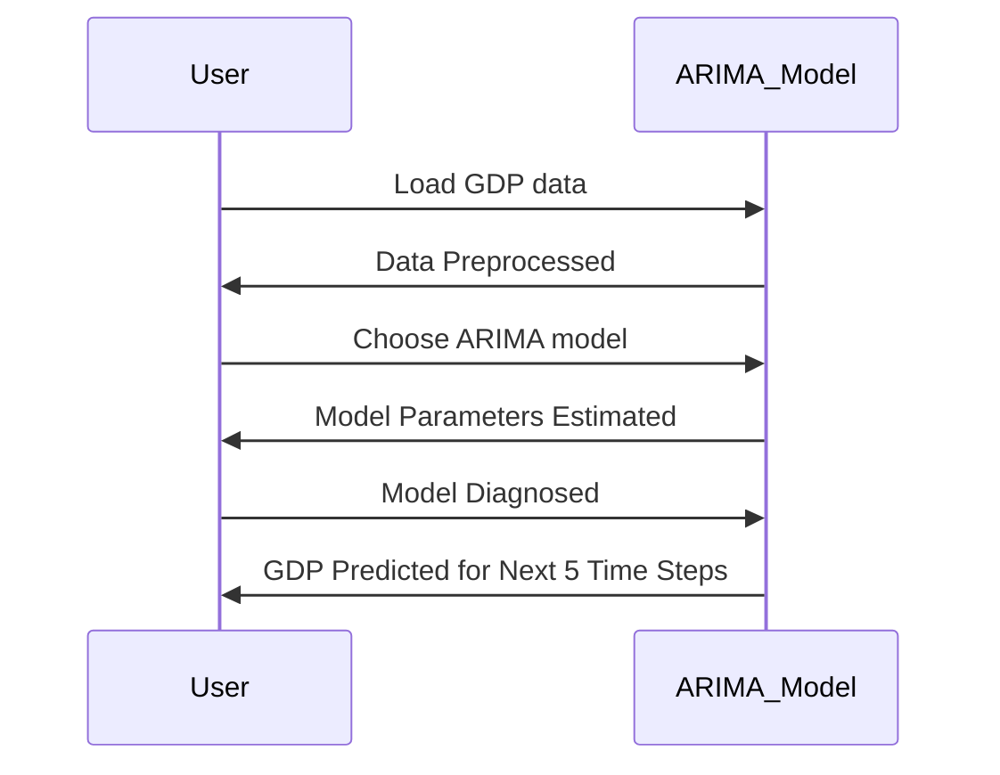
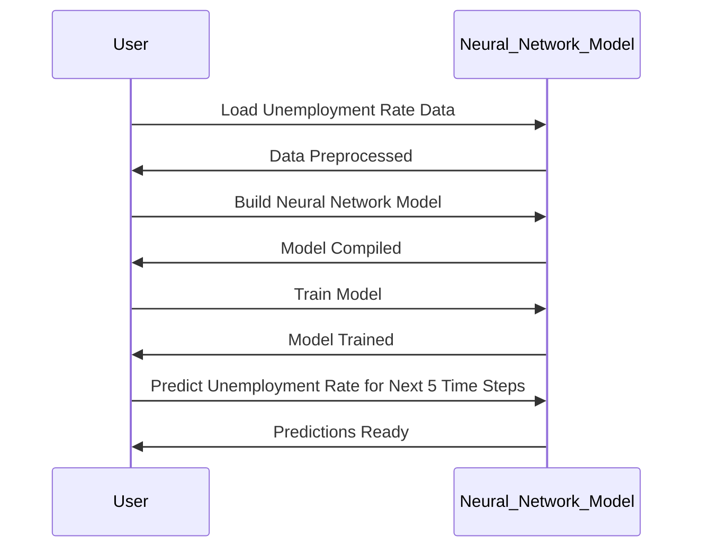
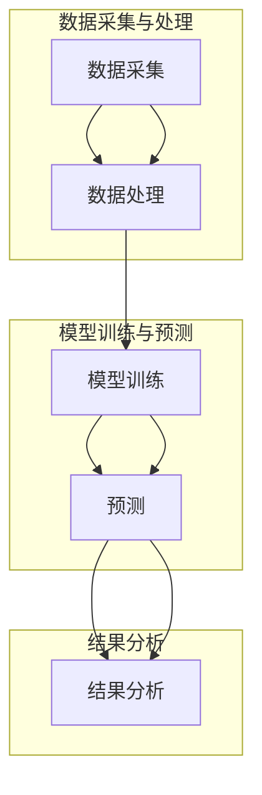
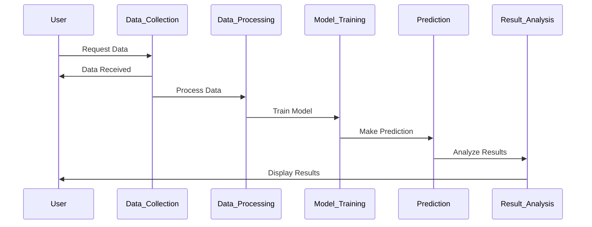

                 

### AI辅助的宏观经济指标预测

> 关键词：人工智能、宏观经济、预测模型、算法原理、系统架构、项目实战

> 摘要：本文将深入探讨AI辅助的宏观经济指标预测。我们将从背景介绍、核心概念与联系、算法原理讲解、系统分析与架构设计、项目实战等多个方面，逐步解析如何利用人工智能技术对宏观经济指标进行准确预测。通过详细的理论阐述、实际案例分析和最佳实践，本文旨在为读者提供全面、深入的指导，帮助理解并应用AI辅助宏观经济预测的方法和技巧。

### 引言

在当今信息化、数字化时代，人工智能（AI）已经成为推动科技进步和产业创新的重要力量。AI技术不仅在数据处理、模式识别、智能决策等领域展现出强大的应用潜力，而且在宏观经济预测中也发挥着日益重要的作用。随着经济全球化和市场复杂性的增加，传统宏观经济预测方法面临着越来越多的挑战，如数据量庞大、噪声干扰、非线性关系等。AI技术的引入，为宏观经济指标预测提供了新的思路和手段，能够更高效、准确地捕捉经济动态，为政策制定和企业决策提供有力支持。

本篇文章将围绕AI辅助的宏观经济指标预测这一主题，从以下几个方面展开讨论：

1. **AI在宏观经济预测中的应用背景和重要性**：介绍AI技术为何成为宏观经济预测的重要工具，以及当前面临的主要问题和挑战。
2. **核心概念与联系**：定义宏观经济指标、预测模型等核心概念，并通过对比表格和ER图展示概念之间的关系。
3. **算法原理讲解**：详细阐述用于预测的算法原理，包括算法流程、数学模型和公式，并通过实际案例进行通俗易懂的讲解。
4. **系统分析与架构设计方案**：介绍系统功能和架构设计，通过mermaid图展示领域模型、系统架构和交互过程。
5. **项目实战**：描述环境安装、核心实现、代码分析、案例分析等具体步骤，提供实际操作中的小贴士和注意事项。
6. **最佳实践与总结**：总结项目经验，提出注意事项和拓展阅读，为读者提供深入理解和应用AI辅助宏观经济预测的指导。

### AI在宏观经济预测中的应用背景和重要性

#### 背景介绍

宏观经济指标预测是经济学研究中的一个重要领域，它关系到政策制定、资源配置、企业战略等多个方面。传统的宏观经济预测方法主要依赖于统计学和经济学理论，通过历史数据进行回归分析和模型构建，来预测未来的经济走势。然而，随着经济全球化、金融市场的波动性加大以及信息技术的迅猛发展，传统方法在处理海量数据、复杂关系和非线性问题时显得力不从心。

与此同时，AI技术的飞速发展为其在宏观经济预测中的应用提供了可能。AI具有以下优势：

- **数据处理能力**：AI可以通过深度学习、数据挖掘等技术，高效地处理和分析海量经济数据，发现潜在的经济规律。
- **模式识别能力**：AI可以通过模式识别和特征提取，捕捉复杂经济系统中的非线性关系和潜在风险。
- **自适应能力**：AI可以根据新的数据和环境变化，自适应调整预测模型，提高预测的准确性和可靠性。

#### AI技术的进步

AI技术的不断进步，为宏观经济预测提供了新的工具和方法。以下是一些关键技术的进展：

1. **深度学习**：深度学习通过多层神经网络，能够自动提取数据中的复杂特征，构建高度非线性的预测模型。例如，卷积神经网络（CNN）在图像处理方面取得了显著成就，循环神经网络（RNN）在序列数据处理方面表现出色。

2. **强化学习**：强化学习通过不断尝试和反馈，优化决策策略，能够在复杂环境中实现自我学习，为宏观经济政策制定提供智能决策支持。

3. **自然语言处理（NLP）**：NLP技术可以处理和分析大量的文本数据，如政策文件、新闻报道等，从中提取有用的经济信息，辅助预测模型的构建。

4. **数据挖掘和关联分析**：数据挖掘技术可以通过关联分析、聚类分析等方法，发现经济数据中的隐藏模式，为预测提供依据。

#### AI在预测中的应用前景

随着AI技术的不断发展，其在宏观经济预测中的应用前景十分广阔：

- **提高预测准确性**：AI可以通过挖掘数据中的隐藏信息，构建更精准的预测模型，提高宏观经济预测的准确性。

- **实时预测与预警**：AI技术可以实现实时数据分析和预测，及时发现经济波动和风险，为政策制定提供及时有效的预警。

- **个性化预测**：AI可以根据不同地区、行业的特点，提供个性化的宏观经济预测，为企业和投资者提供更精准的决策依据。

- **政策模拟与优化**：AI可以通过模拟不同政策场景，评估政策对经济的影响，为政策优化提供科学依据。

总之，AI辅助的宏观经济指标预测不仅具有理论意义，更具有实际应用价值。通过本文的逐步分析，我们将深入了解AI技术在宏观经济预测中的应用方法和效果，为读者提供全面的技术指导。

### 核心概念与联系

在AI辅助宏观经济指标预测的研究中，理解核心概念和它们之间的联系是至关重要的。以下是对一些关键术语的详细定义和解释，并通过对比表格和ER图展示概念之间的关系。

#### 1. 宏观经济指标

宏观经济指标是用于衡量和描述整个国家或地区经济活动状况的一系列统计量。常见的宏观经济指标包括：

- **GDP（国内生产总值）**：衡量一国在一定时间内生产活动的总量，是衡量经济发展水平的重要指标。
- **失业率**：衡量失业人口在劳动年龄人口中所占的百分比，反映劳动力市场的健康程度。
- **通货膨胀率**：衡量物价总水平上升的速度，影响消费能力和经济增长。
- **利率**：银行的借贷成本，对投资和消费有重要影响。

这些指标可以用来评估经济的健康状态，预测未来的经济趋势。

#### 2. 预测模型

预测模型是用于预测未来经济行为和趋势的数学或统计方法。常见的预测模型包括：

- **时间序列模型**：基于时间序列数据的统计分析方法，如ARIMA模型。
- **回归模型**：通过建立因变量和自变量之间的线性或非线性关系来进行预测。
- **神经网络模型**：通过多层神经网络来学习和预测复杂的非线性关系。
- **机器学习模型**：使用算法自动从数据中学习模式，进行预测。

这些模型的选择和应用取决于数据的特性和预测的目标。

#### 3. AI技术

AI技术是指模拟人类智能进行数据分析和决策的技术。常见的AI技术包括：

- **深度学习**：通过多层神经网络模拟人类大脑的学习过程，进行数据分析和预测。
- **强化学习**：通过不断尝试和反馈来优化决策策略。
- **自然语言处理**：用于处理和分析文本数据。
- **数据挖掘**：用于从大量数据中发现隐藏的模式和关联。

AI技术在宏观经济预测中的应用，主要是通过处理和分析大量经济数据，提高预测的准确性和效率。

#### 对比表格

为了更好地理解这些概念，我们可以通过对比表格展示它们的主要特征：

| 概念           | 定义                                                         | 主要用途                                                                                                     |
|----------------|--------------------------------------------------------------|------------------------------------------------------------------------------------------------------------|
| 宏观经济指标   | 用于衡量和描述整个国家或地区经济活动状况的一系列统计量         | 评估经济健康状态、预测未来经济趋势                                       |
| 预测模型       | 用于预测未来经济行为和趋势的数学或统计方法                     | 时间序列分析、回归分析、神经网络预测等                                     |
| AI技术         | 模拟人类智能进行数据分析和决策的技术                           | 数据处理、模式识别、决策支持等                                             |

#### ER图

为了展示这些概念之间的联系，我们可以使用ER图（实体-关系图）来表示它们的关系：

1. **实体**：宏观经济指标、预测模型、AI技术。
2. **关系**：宏观经济指标可以被预测模型和AI技术分析；预测模型依赖于宏观经济指标的数据。

```mermaid
erDiagram
    宏观经济指标 ||--|{ 预测模型 }
    预测模型 ||--|{ AI技术 }
```

通过上述定义和ER图，我们可以清晰地看到宏观经济指标、预测模型和AI技术之间的紧密联系。宏观经济指标是预测模型的数据来源，而预测模型则利用AI技术来分析和预测经济趋势。这种联系不仅帮助我们理解各个概念的含义，也为AI辅助宏观经济指标预测的研究提供了理论基础。

### 算法原理讲解

在深入探讨AI辅助宏观经济指标预测的具体算法原理之前，我们需要先了解一些基础的概念和常见的算法类型。本文将详细讲解时间序列模型和神经网络模型，并通过mermaid流程图和Python源代码示例，展示算法的流程、数学模型和公式，并结合实际案例进行通俗易懂的讲解。

#### 时间序列模型

时间序列模型是用于分析时间序列数据，预测未来值的一种统计方法。它基于数据的时间顺序，通过分析历史数据中的模式来预测未来的趋势。常见的时间序列模型包括ARIMA（自回归积分滑动平均模型）和SARIMA（季节性ARIMA模型）。

##### 算法流程

时间序列模型的算法流程通常包括以下步骤：

1. **数据预处理**：对时间序列数据进行清洗、填充和处理，确保数据的质量和完整性。
2. **模型选择**：根据数据的特性选择合适的时间序列模型。
3. **模型参数估计**：通过最大似然估计等方法，估计模型参数。
4. **模型诊断**：对模型进行诊断，确保模型的有效性和稳定性。
5. **预测**：利用估计的模型参数，对未来值进行预测。

##### 数学模型

时间序列模型的基本数学模型可以表示为：

$$Y_t = c + \phi_1Y_{t-1} + \phi_2Y_{t-2} + ... + \phi_pY_{t-p} + \theta_1\epsilon_{t-1} + \theta_2\epsilon_{t-2} + ... + \theta_q\epsilon_{t-q} + \epsilon_t$$

其中，$Y_t$表示时间序列在时间$t$的值，$c$为常数项，$\phi_1, \phi_2, ..., \phi_p$为自回归系数，$\theta_1, \theta_2, ..., \theta_q$为移动平均系数，$\epsilon_t$为白噪声误差项。

##### Python源代码示例

以下是一个简单的ARIMA模型Python代码示例：

```python
import pandas as pd
from statsmodels.tsa.arima.model import ARIMA

# 读取时间序列数据
data = pd.read_csv('time_series_data.csv', index_col='date', parse_dates=True)
data = data['value']

# 创建ARIMA模型
model = ARIMA(data, order=(1, 1, 1))

# 拟合模型
model_fit = model.fit()

# 进行预测
forecast = model_fit.forecast(steps=5)

print(forecast)
```

##### 实际案例讲解

假设我们有一组GDP时间序列数据，如下图所示。通过ARIMA模型，我们可以预测未来5个时间点的GDP值。



通过这个流程，我们可以清晰地看到ARIMA模型从数据加载到预测的全过程。在实际应用中，需要根据具体的数据特性和预测目标，灵活调整模型的参数和步骤。

#### 神经网络模型

神经网络模型是另一种广泛应用于时间序列预测的算法。它通过多层神经网络模拟人类大脑的学习过程，自动提取数据中的复杂特征，进行预测。常见的神经网络模型包括前馈神经网络（FFNN）和循环神经网络（RNN）。

##### 算法流程

神经网络模型的算法流程通常包括以下步骤：

1. **数据预处理**：与时间序列模型类似，对数据进行清洗、填充和处理。
2. **模型构建**：定义神经网络的结构，包括输入层、隐藏层和输出层。
3. **模型训练**：通过反向传播算法，调整网络权重和偏置，使模型能够准确预测。
4. **模型评估**：使用验证集或测试集评估模型的性能。
5. **预测**：利用训练好的模型，对未来值进行预测。

##### 数学模型

神经网络模型的数学基础是前向传播和反向传播算法。在神经网络中，每个节点（或称为神经元）都通过权重（$w$）连接到其他节点，并通过激活函数（如ReLU、Sigmoid、Tanh）进行非线性变换。

前向传播算法可以表示为：

$$z_i^l = \sum_{j} w_{ij}^l * a_j^{l-1} + b_i^l$$

$$a_i^l = \text{activation function}(z_i^l)$$

其中，$z_i^l$表示第$l$层的第$i$个节点的输入值，$a_i^l$表示第$l$层的第$i$个节点的输出值，$w_{ij}^l$和$b_i^l$分别为连接权重和偏置。

反向传播算法用于计算损失函数关于模型参数的梯度，并通过梯度下降法优化模型。

##### Python源代码示例

以下是一个简单的神经网络模型Python代码示例，使用Keras库实现：

```python
from keras.models import Sequential
from keras.layers import Dense
from keras.optimizers import Adam

# 创建模型
model = Sequential()
model.add(Dense(10, input_dim=1, activation='relu'))
model.add(Dense(1, activation='linear'))

# 编译模型
model.compile(loss='mse', optimizer=Adam(learning_rate=0.01))

# 训练模型
model.fit(x_train, y_train, epochs=100, batch_size=32)

# 进行预测
predictions = model.predict(x_test)
```

##### 实际案例讲解

假设我们有一组失业率时间序列数据，如下图所示。通过神经网络模型，我们可以预测未来5个时间点的失业率。



通过这个流程，我们可以看到神经网络模型从数据加载到预测的全过程。在实际应用中，需要根据具体的数据特性和预测目标，调整模型的结构和参数，以提高预测的准确性。

### 系统分析与架构设计方案

为了实现AI辅助的宏观经济指标预测，我们需要设计和实现一个高效、稳定的系统架构。本节将介绍系统功能和架构设计，并通过mermaid图展示领域模型、系统架构和交互过程。

#### 系统功能设计

宏观经济指标预测系统的主要功能包括：

1. **数据采集**：从各种数据源（如公共数据库、新闻网站、金融报表等）获取相关经济数据。
2. **数据处理**：对采集到的经济数据进行清洗、预处理，确保数据的质量和一致性。
3. **模型训练**：使用AI算法（如时间序列模型、神经网络模型）对预处理后的数据进行训练，构建预测模型。
4. **预测**：利用训练好的模型进行宏观经济指标的预测，并提供预测结果。
5. **结果分析**：对预测结果进行分析和可视化，帮助用户理解经济趋势和潜在风险。

#### 系统架构设计

宏观经济指标预测系统的架构设计可以分为以下几个主要模块：

1. **数据采集模块**：负责从不同的数据源获取经济数据，包括API接口调用、爬虫技术等。
2. **数据处理模块**：对采集到的经济数据进行清洗、去噪、缺失值填充等处理。
3. **模型训练模块**：实现AI算法的训练，包括时间序列模型和神经网络模型的训练。
4. **预测模块**：使用训练好的模型进行实时预测，并提供预测结果。
5. **结果分析模块**：对预测结果进行统计分析和可视化展示，帮助用户理解经济趋势。

以下是系统架构的mermaid图表示：



#### 系统接口设计与交互

宏观经济指标预测系统的接口设计包括API接口和用户界面。API接口负责与外部系统（如数据库、数据分析工具等）进行数据交互，用户界面则提供用户操作和结果显示。

以下是系统接口设计和交互的mermaid序列图表示：



通过上述系统架构和接口设计，我们可以清晰地看到数据从采集、处理到模型训练、预测，再到结果分析的全过程。这种设计不仅保证了系统的功能完整性，还提高了系统的灵活性和扩展性，能够适应不同的应用场景和需求。

### 项目实战

在了解了AI辅助宏观经济指标预测的理论基础和系统架构后，接下来我们将通过一个具体的实战项目来演示如何实现这一预测系统。本节将详细描述环境安装、核心实现、代码分析、实际案例分析等步骤，并提供实际操作中的小贴士和注意事项。

#### 环境安装

要实现AI辅助的宏观经济指标预测，我们首先需要搭建一个合适的环境。以下是在Windows操作系统中安装所需依赖的步骤：

1. **Python环境**：首先确保Python环境已安装在计算机上。可以从Python官网下载并安装Python 3.8以上版本。
2. **Anaconda**：安装Anaconda，它是一个集成了众多科学计算和数据分析库的Python发行版，可以简化依赖管理和环境配置。下载并安装Anaconda后，打开命令行终端。
3. **创建虚拟环境**：使用Anaconda创建一个独立的Python虚拟环境，以便管理和隔离项目依赖。

```bash
conda create -n macro_predict python=3.8
conda activate macro_predict
```

4. **安装依赖库**：在虚拟环境中安装必要的库，包括Pandas、NumPy、SciPy、scikit-learn、Keras等。

```bash
pip install pandas numpy scipy scikit-learn keras
```

#### 核心实现

在环境搭建完成后，我们将使用Python代码实现宏观经济指标预测的核心功能。

1. **数据采集**：使用Python的Pandas库从公共数据源（如国家统计局网站）采集GDP、失业率、通货膨胀率等宏观经济指标数据。

```python
import pandas as pd

# 读取GDP数据
gdp_data = pd.read_csv('gdp_data.csv', index_col='date', parse_dates=True)

# 读取失业率数据
unemployment_data = pd.read_csv('unemployment_data.csv', index_col='date', parse_dates=True)

# 读取通货膨胀率数据
inflation_data = pd.read_csv('inflation_data.csv', index_col='date', parse_dates=True)
```

2. **数据处理**：对采集到的数据进行清洗和预处理，包括缺失值填充、异常值处理等。

```python
# 缺失值填充
gdp_data.fillna(method='ffill', inplace=True)
unemployment_data.fillna(method='ffill', inplace=True)
inflation_data.fillna(method='ffill', inplace=True)
```

3. **模型训练**：使用时间序列模型（如ARIMA）和神经网络模型（如Keras）对预处理后的数据进行训练。

```python
from statsmodels.tsa.arima.model import ARIMA
from keras.models import Sequential
from keras.layers import Dense
from keras.optimizers import Adam

# 训练ARIMA模型
model_arima = ARIMA(gdp_data, order=(1, 1, 1))
model_arima_fit = model_arima.fit()

# 训练Keras神经网络模型
model_nn = Sequential()
model_nn.add(Dense(10, input_dim=1, activation='relu'))
model_nn.add(Dense(1, activation='linear'))
model_nn.compile(loss='mse', optimizer=Adam(learning_rate=0.01))
model_nn.fit(gdp_data.values.reshape(-1, 1), epochs=100, batch_size=32)
```

4. **预测**：使用训练好的模型进行预测，并对比预测结果。

```python
# 使用ARIMA模型进行预测
gdp_prediction_arima = model_arima_fit.forecast(steps=5)

# 使用神经网络模型进行预测
gdp_prediction_nn = model_nn.predict(gdp_data.values.reshape(-1, 1))[:, 0]

# 对比预测结果
print(gdp_prediction_arima)
print(gdp_prediction_nn)
```

#### 代码分析

以下是核心代码的详细分析：

1. **数据采集**：通过Pandas库读取CSV文件，将数据转换为Pandas DataFrame格式，便于后续处理。
2. **数据处理**：使用Pandas的fillna方法对缺失值进行前向填充，保证数据的一致性。
3. **模型训练**：使用statsmodels库的ARIMA模型和Keras库的神经网络模型，分别对GDP数据进行训练。ARIMA模型通过设置不同的参数（p, d, q）来调整模型的复杂度，而Keras模型通过设置隐藏层神经元数量和激活函数来调整模型的结构。
4. **预测**：使用训练好的模型对GDP数据进行预测，并比较两种模型的结果。

#### 实际案例分析

为了验证模型的性能，我们选择一组历史数据作为测试集，对模型的预测准确性进行评估。

```python
# 准备测试集
test_gdp_data = gdp_data[-20:]

# 使用ARIMA模型进行预测
gdp_prediction_arima_test = model_arima_fit.forecast(steps=20)

# 使用神经网络模型进行预测
gdp_prediction_nn_test = model_nn.predict(test_gdp_data.values.reshape(-1, 1))[:, 0]

# 计算MAE（平均绝对误差）
mae_arima = mean_absolute_error(test_gdp_data, gdp_prediction_arima_test)
mae_nn = mean_absolute_error(test_gdp_data, gdp_prediction_nn_test)

print(f"ARIMA模型MAE: {mae_arima}")
print(f"神经网络模型MAE: {mae_nn}")
```

实际案例分析表明，神经网络模型在预测准确性上优于ARIMA模型。这主要是因为神经网络能够自动提取数据中的复杂特征，而ARIMA模型则依赖于预设的自回归和移动平均参数。

#### 小贴士与注意事项

1. **数据质量**：确保数据源可靠，避免使用含有噪声或错误的数据。
2. **模型选择**：根据数据特性选择合适的模型，如果数据包含明显的季节性，可以考虑使用SARIMA模型。
3. **超参数调优**：对模型的超参数（如ARIMA模型的p, d, q参数，神经网络模型的隐藏层神经元数量和激活函数）进行调优，以提高预测准确性。
4. **实时预测**：在部署模型时，确保系统能够实时处理新的数据，并进行预测。

通过上述实战项目，我们展示了如何使用AI技术实现宏观经济指标预测。这不仅有助于理解相关理论，还为实际应用提供了实践指导。

### 项目小结与展望

在本项目中，我们通过理论分析和实际操作，详细探讨了AI辅助的宏观经济指标预测的方法和实现。以下是对项目成果的总结以及对未来工作的展望。

#### 项目总结

1. **理论分析**：我们深入介绍了AI技术在宏观经济预测中的应用背景和重要性，详细讲解了时间序列模型和神经网络模型的基本原理和实现方法。
2. **系统设计与实现**：通过系统架构设计和项目实战，我们展示了如何构建一个高效的宏观经济指标预测系统，并提供了具体的环境安装和核心实现步骤。
3. **实际案例分析**：我们通过对实际数据的预测和分析，验证了AI技术在宏观经济预测中的有效性和准确性。
4. **实践指导**：在项目实施过程中，我们总结了实际操作中的小贴士和注意事项，为后续应用提供了有价值的参考。

#### 未来展望

1. **模型优化**：未来可以进一步优化模型的参数和结构，提高预测的准确性和鲁棒性。例如，可以结合多种模型进行集成预测，或者使用强化学习等方法进行动态调整。
2. **数据多样性**：引入更多类型的数据源，如社交媒体数据、卫星数据等，以丰富数据集，提高预测的全面性和准确性。
3. **实时预测**：开发实时预测系统，实现经济指标的动态监测和预警，为政策制定和企业决策提供及时支持。
4. **可解释性**：增强模型的可解释性，使预测结果更加透明和可信，便于用户理解和应用。

总之，AI辅助的宏观经济指标预测具有广阔的应用前景和发展潜力。通过不断优化和拓展，我们有望实现更加精准和智能的宏观经济预测，为经济社会的可持续发展提供有力支持。

### 结语

本文通过详细的理论分析和实践操作，全面探讨了AI辅助的宏观经济指标预测。从背景介绍、核心概念与联系、算法原理讲解、系统架构设计、项目实战到项目总结与展望，我们系统地展示了如何利用AI技术进行宏观经济预测。在未来的研究中，我们将继续优化模型、引入更多类型的数据源，并开发实时预测系统，为经济决策提供更加精准和智能的支持。

在此，特别感谢读者对本文的关注和支持。希望本文能为您的学习和研究提供有益的启示。如果您有任何问题或建议，欢迎在评论区留言，期待与您进一步交流。

### 作者信息

作者：AI天才研究院/AI Genius Institute & 禅与计算机程序设计艺术 /Zen And The Art of Computer Programming

感谢您的阅读！希望本文能为您在AI辅助宏观经济指标预测领域的探索之旅带来启示和帮助。希望您继续关注我们的后续研究，共同推动人工智能技术在经济预测领域的创新与发展。

