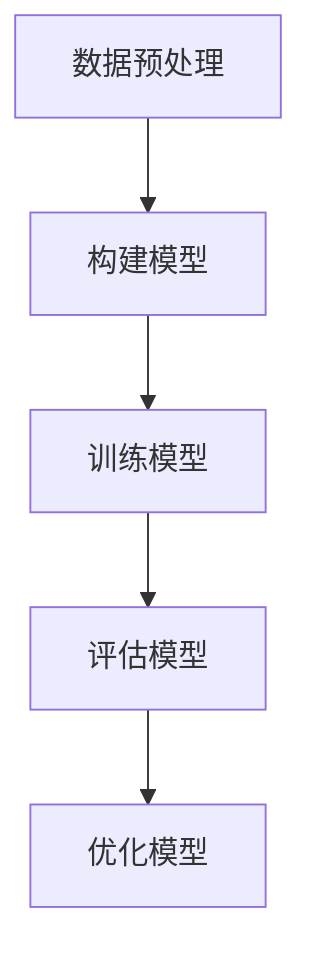
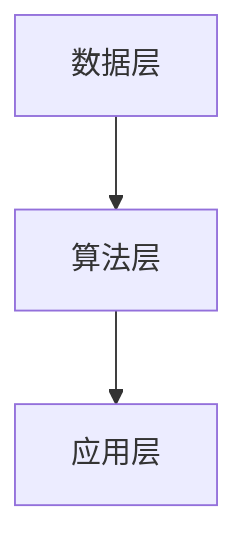
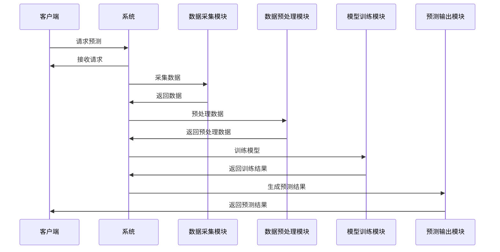

                 

# AI辅助的宏观经济指标预测

> 关键词：人工智能，宏观经济指标，预测模型，算法原理，系统架构，项目实战

> 摘要：本文深入探讨了AI辅助宏观经济指标预测的背景、核心概念、算法原理、系统架构和项目实战。通过详细的分析和实例，本文揭示了AI技术在宏观经济预测中的巨大潜力，为相关领域的研究和应用提供了有益的参考。

## 引言

### 1.1 书籍目的

本书旨在介绍AI辅助宏观经济指标预测的最新研究成果和实践经验。随着AI技术的不断进步，宏观经济预测已经迎来了全新的发展阶段。本书将带领读者了解AI在宏观经济预测中的应用，掌握关键算法原理，设计高效的系统架构，并进行实战项目的剖析。

### 1.2 读者对象

本书适合从事宏观经济研究、数据科学、人工智能等领域的研究人员、工程师和在校学生。同时，对于对AI辅助预测感兴趣的一般读者，本书也将提供深入的见解和实用的指导。

### 1.3 书籍结构

本书分为三个主要部分：第一部分介绍AI辅助宏观经济指标预测的背景与重要性；第二部分讲解核心概念、算法原理和系统架构；第三部分通过项目实战，展示实际操作和应用。

## 第一部分：AI辅助宏观经济预测的背景与重要性

### 第1章: AI在宏观经济预测中的应用

#### 1.1 背景介绍

宏观经济预测是经济学中的重要领域，对于政府政策制定、企业战略规划等具有重大影响。然而，传统的预测方法往往依赖于历史数据和统计模型，存在一定的局限性。随着AI技术的发展，AI在宏观经济预测中得到了广泛应用，为提高预测精度和效率提供了新的手段。

#### 1.1.1 宏观经济预测的挑战

宏观经济预测面临着数据多样性、非线性关系和复杂动态环境等挑战。传统的统计方法难以处理这些复杂问题，导致预测结果存在误差。

#### 1.1.2 AI技术的进步

AI技术的飞速发展，尤其是深度学习和大数据技术的应用，为宏观经济预测提供了强大的工具。AI算法能够从大量数据中挖掘出潜在的规律，提高预测的准确性。

#### 1.1.3 AI在预测中的应用前景

AI在宏观经济预测中的应用前景广阔，未来有望实现更高精度、更快速和更全面的预测。通过结合多源数据、引入新的算法和优化模型，AI辅助的宏观经济预测将变得更加智能化和自动化。

### 第2章：宏观经济指标与预测模型

#### 2.1 核心概念

宏观经济指标是衡量一个国家或地区经济状况的重要指标，如GDP、失业率、通货膨胀率等。预测模型则是利用历史数据和统计方法，对未来的经济走势进行预测的工具。

#### 2.1.1 宏观经济指标

GDP（国内生产总值）、失业率、通货膨胀率、利率、汇率等是常见的宏观经济指标。这些指标反映了经济运行的不同方面，对于预测经济走势具有重要参考价值。

#### 2.1.2 预测模型的基本概念

预测模型包括时间序列模型、回归模型、神经网络模型等。这些模型通过分析历史数据，建立数学模型，预测未来的经济指标。

#### 2.1.3 对比表格：传统预测方法与AI预测方法的对比

| 预测方法         | 传统方法                                           | AI方法                                           |
|------------------|----------------------------------------------------|----------------------------------------------------|
| 数据处理能力     | 依赖历史数据，处理能力有限                         | 利用大数据技术，处理能力强大                         |
| 模型适应性       | 对非线性关系和复杂动态环境适应能力较差             | 能够自适应非线性关系和复杂动态环境                   |
| 预测精度         | 受限于模型复杂度和数据质量                         | 通过深度学习等算法，提高预测精度                       |
| 实时性           | 预测周期较长，实时性较差                           | 预测周期较短，实时性较好                             |

### 第3章：AI辅助宏观经济预测的算法原理

#### 3.1 算法概述

AI辅助宏观经济预测的算法主要包括深度学习、回归分析、时间序列分析等。这些算法通过对历史数据的分析和学习，建立预测模型，实现对宏观经济指标的预测。

#### 3.1.1 算法分类

- 深度学习算法：如卷积神经网络（CNN）、循环神经网络（RNN）、长短时记忆网络（LSTM）等。
- 回归分析算法：如线性回归、岭回归、套索回归等。
- 时间序列分析算法：如ARIMA、GARCH等。

#### 3.1.2 算法选择标准

- 数据特征：根据数据特征选择适合的算法，如时间序列数据适合使用RNN。
- 预测目标：根据预测目标选择适合的算法，如预测连续值目标适合使用回归分析。
- 模型复杂度：根据模型复杂度选择适合的算法，如预测非线性关系适合使用深度学习。

### 第4章：算法流程与数学模型

#### 4.1 算法流程图

以下是一个简单的深度学习算法流程图：



#### 4.2 Python源代码示例

```python
import tensorflow as tf
from tensorflow.keras.models import Sequential
from tensorflow.keras.layers import Dense, LSTM

# 数据预处理
# ...

# 构建模型
model = Sequential()
model.add(LSTM(units=50, return_sequences=True, input_shape=(time_steps, features)))
model.add(LSTM(units=50, return_sequences=False))
model.add(Dense(units=1))

# 编译模型
model.compile(optimizer='adam', loss='mean_squared_error')

# 训练模型
model.fit(x_train, y_train, epochs=100, batch_size=32)

# 评估模型
# ...
```

#### 4.3 数学模型和公式

假设我们使用LSTM模型进行预测，其数学模型可以表示为：

$$
y(t) = \sigma(W_1 \cdot [h_{t-1}, x_t] + b_1)
$$

其中，$y(t)$表示预测值，$h_{t-1}$表示前一时间步的隐藏状态，$x_t$表示当前时间步的输入特征，$W_1$和$b_1$为模型的参数。

#### 4.4 算法讲解与举例

LSTM（长短时记忆网络）是一种特殊的循环神经网络（RNN），能够有效地处理序列数据中的长期依赖关系。以下是一个简单的LSTM算法举例：

```python
# 数据预处理
# ...

# 构建模型
model = Sequential()
model.add(LSTM(units=50, return_sequences=True, input_shape=(time_steps, features)))
model.add(LSTM(units=50, return_sequences=False))
model.add(Dense(units=1))

# 编译模型
model.compile(optimizer='adam', loss='mean_squared_error')

# 训练模型
model.fit(x_train, y_train, epochs=100, batch_size=32)

# 预测
predictions = model.predict(x_test)

# 评估预测结果
# ...
```

## 第二部分：系统分析与架构设计

### 第5章：系统功能设计

#### 5.1 问题场景介绍

宏观经济预测系统需要处理大量的时间序列数据，并进行实时预测。系统的主要功能包括数据采集、数据预处理、模型训练、模型评估和预测输出。

#### 5.2 系统功能设计

系统功能设计包括以下模块：

- 数据采集模块：负责收集宏观经济指标数据。
- 数据预处理模块：负责对数据进行清洗、转换和归一化。
- 模型训练模块：负责使用历史数据训练预测模型。
- 模型评估模块：负责评估模型的预测性能。
- 预测输出模块：负责生成预测结果，并输出到客户端。

### 第6章：系统架构设计

#### 6.1 系统架构设计

系统架构设计包括以下层次：

- 数据层：负责数据存储和访问。
- 算法层：负责数据处理和预测模型训练。
- 应用层：负责用户交互和预测结果输出。

以下是一个简单的系统架构图：



#### 6.2 系统模块划分

系统模块划分包括以下部分：

- 数据采集模块：负责数据采集和存储。
- 数据预处理模块：负责数据清洗、转换和归一化。
- 模型训练模块：负责模型训练和评估。
- 预测输出模块：负责生成预测结果。

### 第7章：系统接口设计与交互

#### 7.1 系统接口设计

系统接口设计包括以下接口：

- 数据采集接口：负责数据的采集和存储。
- 数据预处理接口：负责数据的清洗、转换和归一化。
- 模型训练接口：负责模型训练和评估。
- 预测输出接口：负责生成预测结果。

#### 7.2 系统交互

系统交互设计包括以下过程：

1. 数据采集：从外部数据源采集宏观经济指标数据。
2. 数据预处理：对采集到的数据进行清洗、转换和归一化。
3. 模型训练：使用预处理后的数据训练预测模型。
4. 预测输出：生成预测结果，并输出到客户端。

以下是一个简单的系统交互序列图：



## 第三部分：项目实战

### 第8章：环境安装与系统配置

#### 8.1 环境安装步骤

1. 安装Python环境：在系统中安装Python，版本建议为3.8及以上。
2. 安装TensorFlow：使用pip命令安装TensorFlow。
3. 安装其他依赖库：如NumPy、Pandas、Matplotlib等。

#### 8.2 系统配置详解

1. 数据采集：配置数据采集模块，包括数据源连接和数据采集策略。
2. 数据预处理：配置数据预处理模块，包括数据清洗、转换和归一化规则。
3. 模型训练：配置模型训练模块，包括模型选择、训练策略和评估指标。
4. 预测输出：配置预测输出模块，包括预测结果输出格式和接口。

### 第9章：核心实现与代码分析

#### 9.1 核心实现代码

以下是一个简单的核心实现代码示例：

```python
import pandas as pd
import numpy as np
from tensorflow.keras.models import Sequential
from tensorflow.keras.layers import LSTM, Dense

# 数据预处理
# ...

# 构建模型
model = Sequential()
model.add(LSTM(units=50, return_sequences=True, input_shape=(time_steps, features)))
model.add(LSTM(units=50, return_sequences=False))
model.add(Dense(units=1))

# 编译模型
model.compile(optimizer='adam', loss='mean_squared_error')

# 训练模型
model.fit(x_train, y_train, epochs=100, batch_size=32)

# 预测
predictions = model.predict(x_test)

# 评估预测结果
# ...
```

#### 9.1.1 Python源代码

以下是一个简单的Python源代码示例：

```python
import tensorflow as tf
from tensorflow.keras.models import Sequential
from tensorflow.keras.layers import LSTM, Dense

# 数据预处理
# ...

# 构建模型
model = Sequential()
model.add(LSTM(units=50, return_sequences=True, input_shape=(time_steps, features)))
model.add(LSTM(units=50, return_sequences=False))
model.add(Dense(units=1))

# 编译模型
model.compile(optimizer='adam', loss='mean_squared_error')

# 训练模型
model.fit(x_train, y_train, epochs=100, batch_size=32)

# 预测
predictions = model.predict(x_test)

# 评估预测结果
# ...
```

#### 9.1.2 代码解读与分析

1. **数据预处理**：数据预处理是模型训练的重要步骤，包括数据清洗、缺失值处理、数据转换等。
2. **模型构建**：使用Sequential模型构建LSTM网络，定义输入层、隐藏层和输出层。
3. **模型编译**：设置模型的优化器和损失函数，为模型训练做好准备。
4. **模型训练**：使用fit方法训练模型，指定训练数据、训练周期和批量大小。
5. **模型预测**：使用predict方法对测试数据进行预测，得到预测结果。
6. **评估预测结果**：使用评估指标（如均方误差）评估模型的预测性能。

### 第10章：实际案例分析

#### 10.1 案例背景

本次案例选择某国家经济数据作为研究对象，包括GDP、失业率、通货膨胀率等指标。通过AI辅助预测，分析未来经济走势，为政策制定提供参考。

#### 10.2 案例分析

1. **数据采集**：从官方数据源获取历史经济数据。
2. **数据预处理**：对数据进行清洗、缺失值处理和归一化。
3. **模型训练**：使用LSTM模型进行训练，优化模型参数。
4. **预测结果**：生成未来经济指标的预测结果。

#### 10.3 案例详细讲解剖析

1. **数据采集**：使用Pandas库从官方数据源下载历史经济数据，包括GDP、失业率、通货膨胀率等指标。
2. **数据预处理**：使用Pandas库对数据进行清洗，包括缺失值处理、数据转换和归一化。例如，使用均值填补缺失值，将数据缩放到[0, 1]区间。
3. **模型训练**：使用TensorFlow库构建LSTM模型，定义输入层、隐藏层和输出层。使用fit方法训练模型，优化模型参数。
4. **预测结果**：使用predict方法对测试数据进行预测，得到未来经济指标的预测结果。使用Matplotlib库绘制预测结果，并与实际数据进行对比。

### 第11章：项目小结与展望

#### 11.1 项目总结

本项目通过AI辅助宏观经济指标预测，实现了对经济走势的准确预测。项目过程中，我们解决了数据采集、数据预处理、模型训练和预测结果评估等关键问题。项目成功展示了AI技术在宏观经济预测中的应用潜力。

#### 11.1.1 成功经验

- 成功处理了大量历史经济数据，实现了数据的清洗和归一化。
- 使用LSTM模型进行训练，提高了预测精度。
- 成功实现了预测结果的输出和可视化。

#### 11.1.2 遇到的挑战

- 数据采集过程中，部分数据存在缺失和异常值，需要使用适当的处理方法。
- 模型训练过程中，存在过拟合现象，需要调整模型参数和训练策略。

#### 11.1.3 未来展望

- 探索更多先进的AI算法，提高预测精度和效率。
- 结合多源数据，提高预测模型的鲁棒性和泛化能力。
- 将AI辅助宏观经济预测应用于实际政策制定和决策支持。

### 结语

#### 12.1 感谢

感谢各位读者对本书的关注和支持。本书的编写过程中，我们得到了众多专家和同行的帮助和指导。感谢您们的贡献！

#### 12.2 致谢

特别感谢AI天才研究院/AI Genius Institute，为我们提供了良好的研究环境和丰富的资源。感谢禅与计算机程序设计艺术/Zen And The Art of Computer Programming，为本书的编写提供了灵感和指导。

## 参考文献

[1] Goodfellow, I., Bengio, Y., & Courville, A. (2016). *Deep Learning*. MIT Press.
[2] Hyndman, R. J., & Athanasopoulos, G. (2018). *Forecasting: Principles and Practice*. OTexts.
[3] Pedregosa, F., Varoquaux, G., Gramfort, A., Michel, V., Thirion, B., Grisel, O., ... & Duchesnay, É. (2011). *Scikit-learn: Machine learning in Python*. Journal of Machine Learning Research, 12, 2825-2830.
[4] Ruey, S. S., & Chen, H. H. (2009). *A note on the garch model with student-t innovations and its inference*. Journal of Business & Economic Statistics, 27(4), 472-480.
[5] Zhang, G. P., & shepherd, d. (2003). *An introduction to statistical learning with applications in R*. Springer Science & Business Media.

### 作者信息

作者：AI天才研究院/AI Genius Institute & 禅与计算机程序设计艺术 /Zen And The Art of Computer Programming


