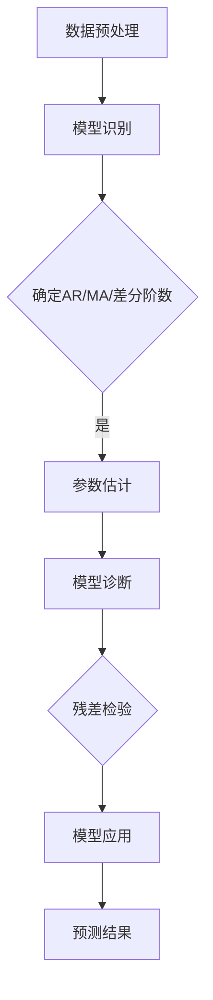
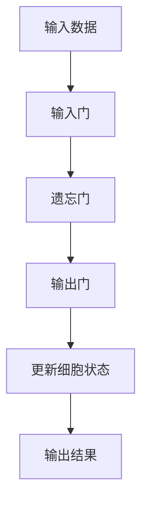
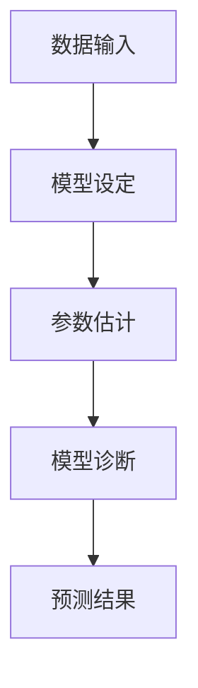
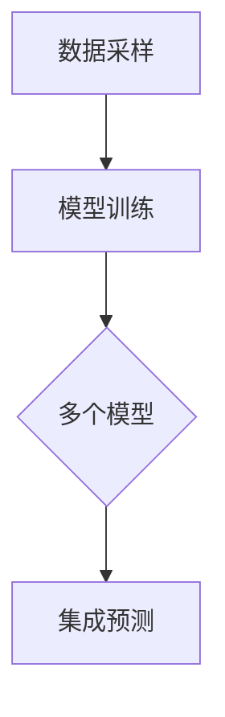
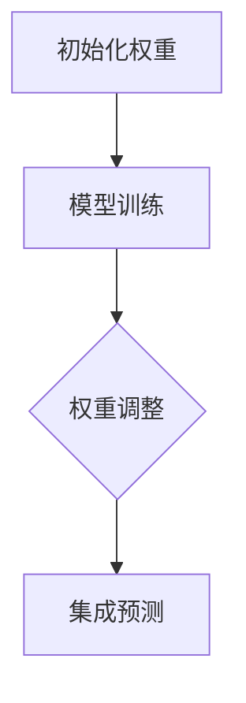

                 

### 宏观经济指标的重要性

宏观经济指标是衡量一个国家或地区经济健康状况的量化工具，其重要性不言而喻。首先，这些指标为政策制定者、经济学家和商业领袖提供了关键的决策依据。例如，GDP增长率是衡量经济活动总体规模的指标，通货膨胀率则反映了物价水平的变动情况，失业率则揭示了劳动力市场的健康程度。通过对这些指标的分析，政策制定者可以制定相应的经济政策，以促进经济增长、控制通货膨胀和减少失业。

其次，宏观经济指标对于投资者和企业决策也具有重要影响。投资者通过分析这些指标，可以预测市场的走势，从而做出更明智的投资决策。例如，当预期通货膨胀率上升时，投资者可能会选择购买固定收益产品如国债，以规避通货膨胀带来的损失。企业则通过宏观经济指标来评估市场环境，调整生产和投资策略，以适应经济周期的变化。

最后，宏观经济指标在社会层面也有着深远的影响。它们不仅反映了经济的繁荣与衰退，还影响到人们的就业、收入水平和生活质量。一个健康的宏观经济环境有助于社会的稳定和可持续发展。

然而，随着全球经济的复杂化和不确定性增加，传统宏观经济指标的预测能力受到了挑战。传统的预测方法主要依赖于历史数据和统计模型，尽管在某些情况下表现出色，但在应对突发性和非线性变化时显得力不从心。因此，寻找新的预测工具和方法，提升宏观经济预测的准确性和及时性，成为当前经济学和人工智能领域的研究热点。

### 传统预测方法的局限性

传统的宏观经济预测方法主要依赖于历史数据和统计模型，尽管这些方法在某种程度上具备一定的准确性，但在面对复杂多变的经济环境时，局限性逐渐显现。首先，历史数据依赖性高。传统方法通常使用时间序列分析方法，如ARIMA模型、移动平均模型等，这些方法的核心在于利用历史数据来预测未来趋势。然而，经济环境的不确定性和复杂性使得历史数据不能完全反映当前的市场状况，导致预测结果存在偏差。

其次，统计模型的局限性也十分明显。传统模型主要基于线性关系，这在大数据时代显得尤为不足。现实经济活动往往存在非线性关系和复杂的相互作用，线性模型难以捕捉这些细微的动态变化，从而导致预测结果失真。此外，传统模型对异常值和噪声数据的处理能力较弱，容易受到数据噪声的影响，降低预测的可靠性。

第三，传统方法在应对突发性事件时表现欠佳。例如，2008年的全球金融危机、2019年的新冠疫情等突发性事件，对全球经济产生了深远的影响。传统预测方法往往难以在短时间内捕捉到这些突发事件的信号，导致预测结果滞后，甚至出现错误。

最后，传统预测方法在数据量爆炸性增长的情况下，处理速度和计算效率也成为了瓶颈。随着大数据技术的兴起，海量数据的实时处理和快速分析成为宏观经济预测的新挑战。传统方法在数据处理速度和计算效率方面存在局限，难以应对大数据的复杂性。

因此，为了克服传统预测方法的局限性，提升宏观经济预测的准确性和及时性，AI技术的引入成为必然选择。AI能够通过深度学习和机器学习算法，从海量数据中提取有价值的信息，捕捉复杂的非线性关系，并快速响应突发性事件，为宏观经济预测提供强有力的技术支持。

### AI在宏观经济预测中的应用前景

随着人工智能技术的快速发展，其在宏观经济预测中的应用前景愈发广阔。首先，AI具备从海量数据中提取有价值信息的能力。通过对历史经济数据、金融市场数据、社会媒体数据等多种数据的综合分析，AI能够发现传统方法难以捕捉的细微趋势和异常值，从而提供更加精确的预测结果。

其次，深度学习算法的引入，使得AI在处理非线性关系和复杂相互作用方面表现出色。例如，卷积神经网络（CNN）和循环神经网络（RNN）等深度学习模型，能够有效地从数据中学习到复杂的模式，从而提高预测的准确性和可靠性。

此外，AI在实时数据处理和快速响应方面也具有显著优势。传统的宏观经济预测往往需要较长时间来收集和处理数据，而AI技术能够实现数据的实时分析和预测，为政策制定者和商业领袖提供及时的决策依据。

最后，AI在应对突发性事件方面也具备独特的优势。通过实时监测和分析市场动态，AI能够快速识别和预测突发事件的潜在影响，从而为政府和企业在应对突发事件时提供科学依据。

总的来说，AI技术在宏观经济预测中的应用，不仅能够提升预测的准确性和及时性，还能够提供更加全面和深入的分析，为经济决策提供强有力的支持。随着技术的不断进步，AI有望成为宏观经济预测领域的重要工具，推动经济预测技术的发展和创新。

### 书籍结构概述

本文将分为七个主要章节，系统探讨AI辅助的宏观经济指标预测与情景分析。

**第1章 引言**将简要介绍宏观经济指标的重要性，分析传统预测方法的局限性，并探讨AI在宏观经济预测中的应用前景。

**第2章 AI基础理论**将详细讲解AI的定义、发展历程以及核心技术的原理，特别是神经网络与深度学习在宏观经济预测中的应用。

**第3章 宏观经济指标**将阐述宏观经济指标的定义、分类以及常见指标，并介绍宏观经济指标数据的获取与处理方法。

**第4章 AI辅助的宏观经济指标预测模型**将介绍时间序列预测模型、回归预测模型以及集成学习方法在宏观经济预测中的应用。

**第5章 情景分析**将讨论情景分析的定义、重要性及其方法和工具。

**第6章 AI辅助的宏观经济情景分析**将展示如何构建情景分析模型，并通过案例研究深入探讨经济增长预测、通货膨胀预测和利率预测。

**第7章 结论与展望**将总结本文的主要结论，讨论AI在宏观经济预测中的应用，并提出未来研究方向。

通过这七个章节的详细探讨，本文旨在为读者提供一个全面且系统的AI辅助宏观经济预测与情景分析的技术框架和应用实践。

### 阅读指南

为了让读者能够更好地理解本文内容，以下提供一份详细的阅读指南。首先，本文分为七个主要章节，每个章节都有其特定的内容和目标。建议读者按照以下顺序阅读：

1. **第1章 引言**：了解宏观经济指标的重要性以及传统预测方法的局限性。
2. **第2章 AI基础理论**：掌握AI的基本概念、发展历程以及核心技术的原理。
3. **第3章 宏观经济指标**：熟悉宏观经济指标的定义、分类以及数据获取与处理。
4. **第4章 AI辅助的宏观经济指标预测模型**：学习时间序列预测模型、回归预测模型以及集成学习方法。
5. **第5章 情景分析**：理解情景分析的定义、重要性及其方法和工具。
6. **第6章 AI辅助的宏观经济情景分析**：通过具体案例研究，掌握情景分析模型的应用。
7. **第7章 结论与展望**：总结本文的主要结论，讨论未来研究方向。

在阅读过程中，请注意以下几个关键点：

1. **概念与联系**：在每章的开头，都会有核心概念的解释和相关联系，这有助于构建完整的知识框架。
2. **算法原理讲解**：在相关章节中，会详细介绍各种预测模型的算法原理，并附有流程图和代码示例，便于理解。
3. **数学公式与模型**：文中会使用LaTeX格式嵌入数学公式，帮助读者理解模型和算法的核心内容。
4. **项目实战**：在适当章节中，会有具体的项目实战和案例分析，帮助读者将理论知识应用于实际场景。

最后，希望读者能够通过这篇系统性文章，对AI辅助的宏观经济指标预测与情景分析有一个全面且深入的理解，并能够在实际工作中运用这些技术和方法。

### AI基础理论

人工智能（AI）作为当前科技领域的热点，其核心在于模拟人类的智能行为，实现自动化和智能化的决策。AI的定义可以从多个角度进行理解，但其本质是通过算法和计算模型来实现机器的自主学习和推理。AI的发展历程可以追溯到20世纪50年代，当时的科学家首次提出了“人工智能”这一概念，并试图通过简单的规则和逻辑推理来实现机器的智能。随着计算机技术和算法的进步，AI经历了多个阶段的发展，从符号主义、连接主义到现代的深度学习，逐渐实现了在图像识别、自然语言处理、游戏对弈等领域的突破。

AI的核心技术主要包括神经网络、深度学习和机器学习。神经网络是AI的基础，其模仿人脑神经元的工作方式，通过多层网络结构来实现复杂的非线性函数拟合。深度学习是神经网络的一种扩展，通过多层网络结构（深度网络）来提取数据的深层特征，从而实现更加精准的预测和分类。机器学习则是AI的核心算法之一，通过训练模型从数据中学习规律，并能够对新的数据进行预测和决策。

深度学习在宏观经济预测中的应用具有显著优势。首先，深度学习能够处理大规模和复杂的数据集，从历史经济数据、金融市场数据和社会媒体数据中提取有价值的信息。其次，深度学习模型（如卷积神经网络和循环神经网络）能够捕捉数据之间的复杂非线性关系，从而提高预测的准确性和可靠性。此外，深度学习模型具备自适应性和实时性，能够快速响应市场变化，为政策制定者和商业领袖提供及时的决策依据。

总之，AI基础理论为宏观经济预测提供了强大的技术支持，通过神经网络、深度学习和机器学习等核心技术，能够有效提升预测的准确性和及时性，为经济决策提供科学依据。

### 神经网络与深度学习

神经网络（Neural Networks，NN）是人工智能（AI）的核心技术之一，其基本原理源于对人脑神经元结构的模拟。在神经网络中，每个神经元（也称为节点）接收来自其他神经元的输入信号，通过一个非线性激活函数进行处理，最终产生输出信号。这个过程类似于人类大脑中神经元之间的信号传递和计算过程。神经网络通常由多层节点组成，包括输入层、隐藏层和输出层。输入层接收外部数据，隐藏层对数据进行处理和特征提取，输出层则生成最终的预测结果。

深度学习（Deep Learning，DL）是神经网络的一种扩展，其主要特点是利用多层网络结构（深度网络）来提取数据的深层特征。深度学习在训练过程中，通过逐层学习的方式，从原始数据中提取越来越多的抽象特征，直到达到所需的高层次特征表示。深度学习模型的核心是卷积神经网络（Convolutional Neural Networks，CNN）和循环神经网络（Recurrent Neural Networks，RNN）。CNN特别适用于处理具有网格结构的数据，如图像和视频，通过卷积操作提取空间特征。RNN则适用于处理序列数据，如时间序列和自然语言文本，通过循环结构捕获数据的长期依赖关系。

深度学习在宏观经济预测中的应用展示了其强大的能力。首先，深度学习能够处理大量和复杂的经济数据，通过多层网络结构提取数据的深层特征，从而提高预测的准确性和可靠性。其次，深度学习模型具备自适应性和实时性，能够快速响应市场变化，为政策制定者和商业领袖提供及时的决策依据。例如，在预测GDP增长率、通货膨胀率和利率等宏观经济指标时，深度学习模型能够从历史经济数据、金融市场数据和社会媒体数据中提取有价值的信息，捕捉复杂的经济关系和动态变化。

具体应用场景中，深度学习模型可以用于预测经济增长趋势、监测金融市场波动、分析通货膨胀压力以及预测利率变化等。通过构建多层次的深度学习模型，可以实现对宏观经济指标的精确预测和情景分析，为政策制定和商业决策提供有力支持。总之，神经网络和深度学习为宏观经济预测提供了强大的技术工具，有望在未来继续发挥重要作用。

### 宏观经济指标概述

宏观经济指标是衡量一个国家或地区经济状况的关键工具，其定义、分类以及常见指标涵盖了广泛的经济活动领域。首先，宏观经济指标的定义是指用于衡量经济总体规模、结构、运行状态及其变动趋势的一系列量化指标。这些指标反映了经济的生产、消费、投资和分配等方面的情况，是评估经济健康状况的重要依据。

常见的宏观经济指标包括以下几类：

1. **国民经济总体指标**：如国内生产总值（GDP）、国民收入（NI）和人均GDP等，这些指标反映了经济体的总体规模和增长情况。
2. **通货膨胀指标**：如消费者价格指数（CPI）和生产者价格指数（PPI），这些指标反映了物价水平的变动和通货膨胀的压力。
3. **就业与劳动力指标**：如失业率、就业率、劳动参与率和工资增长率，这些指标揭示了劳动力市场的状况和就业市场的稳定性。
4. **金融指标**：如利率、货币供应量、信贷增长和国际收支等，这些指标反映了金融市场和货币政策的运行情况。
5. **国际经济指标**：如国际贸易平衡、外汇储备和全球经济增长率，这些指标反映了国家在国际经济中的地位和影响力。

这些指标在宏观经济分析和预测中发挥着至关重要的作用。例如，GDP增长率是衡量经济活动总体规模的指标，其变化趋势能够反映经济增长的快慢和健康状况。通货膨胀率则揭示了物价水平的变动情况，对货币政策和社会经济政策具有重要指导意义。失业率作为劳动力市场的晴雨表，不仅反映了就业状况，还影响居民的消费能力和经济信心。

此外，宏观经济指标还可以用于预测经济周期和金融市场走势。通过对历史数据的分析和统计模型的构建，经济学家和政策制定者可以预测未来的经济增长、通货膨胀和就业情况，从而制定相应的经济政策。例如，当预测到未来通货膨胀压力上升时，央行可能会采取加息措施以抑制通货膨胀。

总之，宏观经济指标是理解和分析经济运行状态的重要工具，其准确性和及时性对于经济决策和预测至关重要。在本文的后续章节中，我们将进一步探讨这些指标的数据获取和处理方法，以及AI辅助下的预测技术。

### 宏观经济指标数据的获取与处理

宏观经济指标数据的获取与处理是进行准确预测和分析的基础。首先，数据来源包括官方统计机构、金融市场数据库、经济研究机构和商业调查公司等。例如，国际货币基金组织（IMF）、世界银行和各国统计局等官方机构发布的统计数据，是获取宏观经济指标的重要来源。此外，金融数据库如Bloomberg、Wind和CEIC等也提供了丰富的经济数据，涵盖GDP、通货膨胀率、利率、就业率和货币供应量等多种指标。

数据获取的方法主要包括以下几种：

1. **官方统计数据**：通过官方网站或数据库直接获取，如中国国家统计局、美国劳工部等。
2. **金融数据库**：通过订阅服务获取专业化的经济数据，如Bloomberg和Wind等。
3. **经济研究机构**：通过购买或共享研究报告，获取深入分析的数据。

数据预处理是确保数据质量和预测准确性的关键步骤。数据预处理的主要任务包括数据清洗、数据转换和数据集成等。

1. **数据清洗**：处理缺失值、异常值和重复值，保证数据的一致性和完整性。例如，使用均值填补缺失值、使用异常检测算法识别和修正异常值等。
2. **数据转换**：将不同格式、单位或尺度的数据进行标准化或规范化处理，以统一数据格式。例如，将不同国家的货币数据转换为同一货币单位，或将不同时间序列的数据调整为同一时间周期。
3. **数据集成**：整合来自多个来源的数据，消除数据冗余和矛盾，形成综合的数据集。例如，使用数据库管理系统（DBMS）或数据仓库技术，实现数据的高效存储和管理。

在预处理完成后，对数据进行特征工程，以提取对预测任务有价值的特征。特征工程包括特征选择、特征构造和特征降维等步骤：

1. **特征选择**：选择对预测任务最重要的特征，以减少数据维度和提高模型性能。例如，使用相关性分析和信息增益等方法，筛选出高度相关的特征。
2. **特征构造**：通过数学变换或组合，创建新的特征，以增加模型的预测能力。例如，计算滞后特征、差分特征和主成分等。
3. **特征降维**：通过降维技术，减少数据维度，提高模型训练速度和计算效率。例如，使用主成分分析（PCA）和线性判别分析（LDA）等降维方法。

预处理和特征工程后，数据集将用于训练和评估AI模型。通过合理的数据预处理和特征工程，可以显著提高模型的预测准确性和鲁棒性，为宏观经济指标的预测提供可靠的数据支持。

### AI辅助的宏观经济指标预测模型

在宏观经济指标的预测中，AI技术的应用使得传统方法难以应对的复杂性和不确定性得以有效解决。AI辅助的宏观经济指标预测模型主要包括时间序列预测模型、回归预测模型和集成学习方法。以下将详细探讨这些模型的基本原理、工作流程和应用实例。

#### 时间序列预测模型

时间序列预测模型主要用于预测时间序列数据的未来值。这类模型的核心在于捕捉时间序列数据中的趋势、季节性和周期性变化。常见的时间序列预测模型包括自回归移动平均模型（ARIMA）和长短期记忆网络（LSTM）。

**自回归移动平均模型（ARIMA）**

ARIMA模型是一种经典的统计模型，通过自回归（AR）、移动平均（MA）和差分（I）三个步骤来建模时间序列数据。

1. **自回归（AR）**：使用过去的观测值来预测当前值，即 \( X_t = c + \phi_1X_{t-1} + \phi_2X_{t-2} + \ldots + \phi_pX_{t-p} + \varepsilon_t \)。
2. **移动平均（MA）**：使用过去的预测误差来预测当前值，即 \( X_t = c + \phi_1X_{t-1} + \ldots + \phi_pX_{t-p} + \theta_1\varepsilon_{t-1} + \theta_2\varepsilon_{t-2} + \ldots + \theta_q\varepsilon_{t-q} \)。
3. **差分（I）**：对原始序列进行差分处理，以消除非平稳性。

**工作流程**：
1. **模型识别**：确定AR、MA和差分的阶数。
2. **参数估计**：使用最大似然估计或最小二乘法估计模型参数。
3. **模型诊断**：检验模型残差是否符合白噪声假设。

**应用实例**：利用ARIMA模型预测某个国家的月度通货膨胀率。通过历史数据训练模型，可以得到未来的通货膨胀率预测值，为货币政策制定提供参考。

**mermaid 流程图**：



**Python 代码示例**：

```python
from statsmodels.tsa.arima.model import ARIMA
import pandas as pd

# 加载数据
data = pd.read_csv('inflation_data.csv')
inflation = data['inflation_rate']

# 模型训练
model = ARIMA(inflation, order=(1, 1, 1))
model_fit = model.fit()

# 预测
forecast = model_fit.forecast(steps=12)
print(forecast)
```

**数学公式**：

$$
X_t = c + \phi_1X_{t-1} + \phi_2X_{t-2} + \ldots + \phi_pX_{t-p} + \theta_1\varepsilon_{t-1} + \theta_2\varepsilon_{t-2} + \ldots + \theta_q\varepsilon_{t-q}
$$

#### 长短期记忆网络（LSTM）

LSTM是一种特殊的循环神经网络（RNN），能够有效地捕捉时间序列数据中的长期依赖关系。LSTM通过引入门控机制，解决了传统RNN在训练过程中出现的梯度消失和梯度爆炸问题。

**工作流程**：
1. **输入门（Input Gate）**：决定哪些信息将进入细胞状态。
2. **遗忘门（Forget Gate）**：决定哪些信息将遗忘。
3. **输出门（Output Gate）**：决定哪些信息将输出。

**应用实例**：利用LSTM模型预测股市指数。通过历史股市数据训练模型，可以预测未来的股市走势，为投资者提供决策参考。

**mermaid 流程图**：



**Python 代码示例**：

```python
from keras.models import Sequential
from keras.layers import LSTM, Dense

# 构建模型
model = Sequential()
model.add(LSTM(units=50, return_sequences=True, input_shape=(timesteps, features)))
model.add(LSTM(units=50))
model.add(Dense(1))

model.compile(optimizer='adam', loss='mean_squared_error')

# 训练模型
model.fit(x_train, y_train, epochs=100, batch_size=32, validation_data=(x_val, y_val), verbose=1)
```

**数学公式**：

$$
i_t = \sigma(W_i \cdot [h_{t-1}, x_t] + b_i) \\
f_t = \sigma(W_f \cdot [h_{t-1}, x_t] + b_f) \\
o_t = \sigma(W_o \cdot [h_{t-1}, x_t] + b_o) \\
g_t = f_t \odot c_{t-1} + i_t \odot \sigma(W_c \cdot [h_{t-1}, x_t] + b_c) \\
c_t = o_t \odot \sigma(g_t) \\
h_t = \sigma(W_h \cdot [h_{t-1}, x_t] + b_h)
$$

#### 回归预测模型

回归预测模型主要用于建立自变量和因变量之间的定量关系，通过历史数据预测未来值。常见的回归预测模型包括线性回归模型和多项式回归模型。

**线性回归模型**

线性回归模型假设因变量是自变量的线性组合，通过最小二乘法估计模型参数。

**工作流程**：
1. **模型设定**：设定线性模型形式，即 \( y = \beta_0 + \beta_1x + \varepsilon \)。
2. **参数估计**：使用最小二乘法估计模型参数 \( \beta_0 \) 和 \( \beta_1 \)。
3. **模型诊断**：检验模型的拟合效果和残差。

**应用实例**：利用线性回归模型预测房价。通过历史房价数据和影响因素，可以预测未来的房价走势。

**mermaid 流程图**：



**Python 代码示例**：

```python
from sklearn.linear_model import LinearRegression
import pandas as pd

# 加载数据
data = pd.read_csv('house_data.csv')
X = data[['area', 'rooms']]
y = data['price']

# 模型训练
model = LinearRegression()
model.fit(X, y)

# 预测
predictions = model.predict(X)
print(predictions)
```

**数学公式**：

$$
y = \beta_0 + \beta_1x + \varepsilon
$$

**多项式回归模型**

多项式回归模型是线性回归模型的扩展，通过引入多项式项来建立更复杂的非线性关系。

**工作流程**：
1. **模型设定**：设定多项式模型形式，即 \( y = \beta_0 + \beta_1x + \beta_2x^2 + \ldots + \beta_nx^n + \varepsilon \)。
2. **参数估计**：使用最小二乘法或梯度下降法估计模型参数。
3. **模型诊断**：检验模型的拟合效果和残差。

**应用实例**：利用多项式回归模型预测销售额。通过历史销售额数据和影响因素，可以预测未来的销售额走势。

**mermaid 流程图**：


**Python 代码示例**：

```python
from sklearn.preprocessing import PolynomialFeatures
from sklearn.linear_model import LinearRegression
import pandas as pd

# 加载数据
data = pd.read_csv('sales_data.csv')
X = data[['advertising_budget', 'product_price']]
y = data['sales']

# 特征转换
poly = PolynomialFeatures(degree=2)
X_poly = poly.fit_transform(X)

# 模型训练
model = LinearRegression()
model.fit(X_poly, y)

# 预测
predictions = model.predict(X_poly)
print(predictions)
```

**数学公式**：

$$
y = \beta_0 + \beta_1x + \beta_2x^2 + \ldots + \beta_nx^n + \varepsilon
$$

#### 集成学习方法

集成学习方法通过结合多个模型的优势，提高预测的准确性和稳定性。常见的集成学习方法包括Bagging和Boosting。

**Bagging方法**

Bagging（Bootstrap Aggregating）通过生成多个子数据集，分别训练多个模型，然后通过投票或平均的方式得到最终预测结果。

**工作流程**：
1. **数据采样**：从原始数据集中随机抽取有放回的子数据集。
2. **模型训练**：在每个子数据集上训练独立的预测模型。
3. **集成预测**：通过投票或平均的方式得到最终预测结果。

**应用实例**：利用Bagging方法进行股票市场预测。通过多个独立模型的预测结果，可以提高预测的准确性和鲁棒性。

**mermaid 流程图**：



**Python 代码示例**：

```python
from sklearn.ensemble import BaggingRegressor
from sklearn.linear_model import LinearRegression
import pandas as pd

# 加载数据
data = pd.read_csv('stock_data.csv')
X = data[['market_cap', 'price']]
y = data['return']

# 模型训练
base_estimator = LinearRegression()
bagging_model = BaggingRegressor(base_estimator=base_estimator, n_estimators=10)
bagging_model.fit(X, y)

# 预测
predictions = bagging_model.predict(X)
print(predictions)
```

**数学公式**：

$$
\hat{y} = \frac{1}{N} \sum_{i=1}^{N} \hat{y}_i
$$

**Boosting方法**

Boosting通过调整模型权重，使得预测效果较差的模型在下一个训练阶段受到更少的关注。

**工作流程**：
1. **初始化模型权重**：将所有模型权重初始化为1/N。
2. **模型训练**：在每个训练阶段，根据前一轮预测的错误率调整模型权重。
3. **集成预测**：通过加权的方式得到最终预测结果。

**应用实例**：利用Boosting方法进行信用评分。通过调整不同模型的重要性，可以更好地预测客户的信用风险。

**mermaid 流�程图**：



**Python 代码示例**：

```python
from sklearn.ensemble import AdaBoostRegressor
from sklearn.linear_model import LinearRegression
import pandas as pd

# 加载数据
data = pd.read_csv('credit_data.csv')
X = data[['income', 'age']]
y = data['default']

# 模型训练
base_estimator = LinearRegression()
boosting_model = AdaBoostRegressor(base_estimator=base_estimator, n_estimators=10)
boosting_model.fit(X, y)

# 预测
predictions = boosting_model.predict(X)
print(predictions)
```

**数学公式**：

$$
\alpha_t = \frac{1}{2} \ln \left( \frac{1 - \varepsilon_t}{\varepsilon_t} \right)
$$

通过上述模型和方法，AI技术能够有效提升宏观经济指标预测的准确性和可靠性，为政策制定和商业决策提供有力支持。

### 情景分析概述

情景分析（Scenario Analysis）是一种重要的经济学和金融学研究方法，主要用于评估不同经济情景对宏观经济指标的影响。情景分析的定义可以理解为，通过对潜在的经济情景进行模拟和预测，评估这些情景对经济变量（如GDP增长率、通货膨胀率、利率等）的可能影响，从而为政策制定和商业决策提供依据。

情景分析的重要性在于，它能够帮助政策制定者和商业领袖更好地理解经济不确定性的来源，并制定相应的应对策略。在宏观经济预测中，情景分析具有以下几个方面的作用：

首先，情景分析能够揭示潜在的风险和机会。通过模拟不同的经济情景，政策制定者可以识别出可能导致经济波动的重要因素，从而采取预防性措施，避免潜在的风险。例如，通过情景分析，可以预测经济衰退或通货膨胀等不利情景，并提前制定应对政策。

其次，情景分析提供了全面和系统性的分析视角。它不仅考虑了单一经济指标的变化，还分析了这些指标之间的相互关系和相互作用。这种全面的分析有助于理解经济系统的复杂性，为决策提供更全面的视角。

此外，情景分析能够提高决策的灵活性和适应性。通过分析不同的情景，决策者可以在不同情景下评估不同政策的效果，从而选择最有效的政策组合。这种适应性有助于应对经济环境的不确定性和变化。

情景分析的方法主要包括模拟方法、情景树方法和其他情景分析工具。以下将对这些方法进行简要介绍。

#### 模拟方法

模拟方法通过建立经济模型，模拟不同经济情景下的经济变量变化，从而评估这些情景对宏观经济指标的影响。模拟方法通常包括以下步骤：

1. **情景设定**：定义不同的经济情景，如经济衰退、通货膨胀、技术革新等。
2. **模型构建**：建立用于模拟的经济模型，如基于时间序列分析的ARIMA模型、基于机器学习的深度学习模型等。
3. **情景模拟**：使用经济模型模拟不同情景下的经济变量变化，生成预测结果。
4. **结果分析**：分析模拟结果，评估不同情景对宏观经济指标的影响。

模拟方法具有灵活性和可扩展性，可以处理复杂的经济关系和不确定性，为政策制定提供有力支持。

#### 情景树方法

情景树方法通过构建情景树来表示不同经济情景及其可能的后果，从而进行情景分析和决策。情景树的基本结构包括：

1. **情景节点**：表示不同的经济情景，如经济衰退、通货膨胀等。
2. **决策节点**：表示政策制定者可能采取的不同决策，如增加政府支出、提高利率等。
3. **结果节点**：表示在不同情景和决策下可能产生的经济后果，如GDP增长率、通货膨胀率等。

通过分析情景树，可以评估不同情景和决策下的经济影响，帮助决策者选择最佳策略。情景树方法具有直观性和系统性，能够清晰地展示不同情景和决策的后果，为政策制定提供参考。

#### 其他情景分析工具

除了模拟方法和情景树方法，还有其他情景分析工具，如蒙特卡罗模拟、敏感性分析和决策树分析等。

蒙特卡罗模拟通过随机抽样和模拟计算，评估不同情景下的经济变量变化，从而预测宏观经济指标的可能结果。敏感性分析通过评估不同变量对宏观经济指标的影响程度，帮助决策者识别关键影响因素，制定应对策略。决策树分析通过构建决策树模型，评估不同决策路径下的经济影响，为政策制定提供指导。

总之，情景分析作为一种重要的经济学和金融学研究方法，通过模拟和预测不同经济情景，评估其对宏观经济指标的影响，为政策制定和商业决策提供科学依据。通过多种情景分析方法的结合，可以更全面、系统地理解经济环境的不确定性，提高决策的灵活性和适应性。

### 情景分析的方法与工具

情景分析在宏观经济预测中的应用，不仅依赖于科学的方法，还需要借助一系列高效的工具。以下将详细介绍模拟方法、情景树方法以及其他情景分析工具的具体应用。

#### 模拟方法

模拟方法是情景分析中最常用的方法之一，通过构建经济模型，模拟不同经济情景下的经济变量变化，从而预测宏观经济指标的可能结果。模拟方法的一般步骤如下：

1. **情景设定**：首先，需要设定不同的经济情景。这些情景可以是基于历史数据分析得到的，也可以是假设性的情景，如经济衰退、通货膨胀、技术创新等。

2. **模型构建**：根据设定的情景，构建相应的经济模型。常用的模型包括时间序列模型（如ARIMA模型）、计量经济模型（如回归模型）、动态随机一般均衡模型（DSGE）等。模型的选择取决于数据的可用性和预测目标。

3. **情景模拟**：使用构建的模型，模拟不同情景下的经济变量变化。例如，通过时间序列模型预测GDP增长率的变化，通过回归模型预测通货膨胀率的变化。模拟过程中，可以设定多个模拟迭代，以生成一系列可能的未来情景。

4. **结果分析**：分析模拟结果，评估不同情景对宏观经济指标的影响。通过可视化工具，如图表和曲线图，可以直观展示不同情景下的经济变量变化趋势。

模拟方法的一个典型应用案例是利用蒙特卡罗模拟进行宏观经济风险评估。蒙特卡罗模拟通过随机抽样和模拟计算，预测不同情景下的宏观经济指标的概率分布。具体步骤如下：

- **随机抽样**：从历史数据中随机抽样，生成不同情景下的经济变量值。
- **模型计算**：使用构建的经济模型，计算不同情景下的宏观经济指标结果。
- **结果统计**：统计不同情景下的宏观经济指标的概率分布，生成概率预测图。

#### 情景树方法

情景树方法通过构建情景树来表示不同经济情景及其可能的后果，从而进行情景分析和决策。情景树的基本结构包括情景节点、决策节点和结果节点。

1. **情景节点**：表示不同的经济情景，如经济衰退、通货膨胀、技术创新等。每个情景节点对应一个特定的经济变量状态。

2. **决策节点**：表示政策制定者可能采取的不同决策，如增加政府支出、提高利率、降低税收等。每个决策节点对应一个政策变量。

3. **结果节点**：表示在不同情景和决策下可能产生的经济后果，如GDP增长率、通货膨胀率、就业率等。结果节点的值取决于情景节点和决策节点的组合。

通过分析情景树，可以评估不同情景和决策下的经济影响，帮助决策者选择最佳策略。情景树方法的步骤如下：

1. **构建情景树**：根据设定的经济情景和政策决策，构建情景树。情景树的构建需要综合考虑历史数据、政策经验和专家判断。

2. **模拟决策路径**：从根节点开始，逐层模拟不同的情景和决策路径，计算每个结果节点的经济变量值。

3. **结果分析**：分析情景树的结果节点，评估不同情景和决策下的经济影响。可以使用可视化工具，如决策树图表，直观展示不同决策路径的经济后果。

情景树方法的一个应用案例是进行货币政策的情景分析。通过构建情景树，可以模拟不同利率政策下的经济影响，评估通货膨胀、经济增长和失业率的变化。具体步骤如下：

- **构建利率政策情景**：设定不同的利率政策情景，如宽松政策、紧缩政策和中性政策。
- **模拟经济影响**：使用经济模型计算不同利率政策下的经济变量结果，构建情景树。
- **分析决策路径**：分析不同利率政策下的经济后果，选择最优的货币政策。

#### 其他情景分析工具

除了模拟方法和情景树方法，还有其他情景分析工具，如敏感性分析和决策树分析。

**敏感性分析**：敏感性分析通过评估不同变量对宏观经济指标的影响程度，帮助决策者识别关键影响因素，制定应对策略。敏感性分析的一般步骤如下：

1. **设定分析变量**：选择对宏观经济指标影响较大的变量，如利率、通货膨胀率、政府支出等。
2. **计算敏感性**：使用经济模型或模拟方法，计算每个分析变量对宏观经济指标的影响程度，通常以百分比变化表示。
3. **结果分析**：分析不同变量的敏感性，识别关键影响因素，为政策制定提供参考。

**决策树分析**：决策树分析通过构建决策树模型，评估不同决策路径下的经济影响。决策树的基本结构包括决策节点、条件节点和结果节点。

1. **构建决策树**：根据设定的经济情景和政策决策，构建决策树。决策树构建过程中，需要考虑不同决策路径下的经济变量变化和结果节点。
2. **模拟决策路径**：从根节点开始，逐层模拟不同的情景和决策路径，计算每个结果节点的经济变量值。
3. **结果分析**：分析决策树的结果节点，评估不同决策路径的经济影响，选择最佳策略。

**应用案例**：利用敏感性分析进行财政政策评估。通过计算不同财政政策（如增加政府支出、减少税收）对经济增长和通货膨胀的影响程度，识别关键影响因素，为财政政策制定提供参考。

总之，情景分析的方法与工具多种多样，通过模拟方法、情景树方法以及其他情景分析工具的综合应用，可以全面、系统地评估不同经济情景对宏观经济指标的影响，为政策制定和商业决策提供科学依据。

### AI辅助的宏观经济情景分析模型构建

构建AI辅助的宏观经济情景分析模型是进行准确预测和情景分析的关键步骤。以下是模型构建的具体步骤，包括模型选择和参数调优。

#### 模型选择

选择合适的模型是构建有效宏观经济情景分析模型的第一步。在众多AI算法中，常见的模型包括时间序列模型、回归模型和深度学习模型。以下是对这些模型的简要介绍和选择标准：

1. **时间序列模型**：如ARIMA、LSTM等，适用于处理具有时间依赖性的数据。选择时间序列模型的标准是数据具有平稳性和时间序列特性。
   
2. **回归模型**：如线性回归、多项式回归等，适用于建立自变量和因变量之间的线性或非线性关系。选择回归模型的标准是数据量较大且存在明确的因果关系。

3. **深度学习模型**：如卷积神经网络（CNN）、循环神经网络（RNN）等，适用于处理复杂和非线性数据。选择深度学习模型的标准是数据量较大且需要提取深层特征。

#### 模型训练与验证

在模型选择之后，需要进行模型训练和验证。模型训练的目的是通过历史数据学习到数据的内在规律，模型验证的目的是评估模型的预测性能。

1. **数据预处理**：在训练和验证之前，对数据集进行清洗和预处理，包括缺失值填补、异常值处理、标准化和特征工程等步骤。

2. **模型训练**：使用训练数据集对模型进行训练，通过优化算法（如梯度下降）调整模型参数，使模型能够拟合训练数据。

3. **模型验证**：使用验证数据集对训练好的模型进行评估，通过计算预测误差和评估指标（如均方误差、决定系数等）来判断模型的性能。

#### 参数调优

参数调优是提高模型预测性能的重要步骤。以下是一些常见的参数调优方法和技巧：

1. **网格搜索（Grid Search）**：通过遍历预设的参数组合，找到最优参数。这种方法虽然计算量大，但能够系统地探索参数空间。

2. **贝叶斯优化（Bayesian Optimization）**：利用贝叶斯统计方法，通过较少的实验次数找到最优参数。这种方法在处理高维参数空间时表现优异。

3. **交叉验证（Cross-Validation）**：通过将数据集划分为多个子集，反复训练和验证模型，评估模型在不同数据子集上的表现，以避免过拟合。

4. **特征选择**：通过特征选择技术，如信息增益、特征重要性等，选择对预测目标有重要影响的特征，减少模型的复杂性和过拟合风险。

#### 应用示例

以下是一个简单的AI辅助宏观经济情景分析模型的构建过程示例：

```python
# 导入必要的库
import numpy as np
import pandas as pd
from sklearn.model_selection import train_test_split
from sklearn.ensemble import RandomForestRegressor
from sklearn.metrics import mean_squared_error

# 加载数据
data = pd.read_csv('macro_data.csv')
X = data.drop(['target'], axis=1)
y = data['target']

# 数据预处理
X = X.fillna(X.mean())
X = (X - X.mean()) / X.std()

# 分割数据集
X_train, X_test, y_train, y_test = train_test_split(X, y, test_size=0.2, random_state=42)

# 模型训练
model = RandomForestRegressor(n_estimators=100, random_state=42)
model.fit(X_train, y_train)

# 预测
y_pred = model.predict(X_test)

# 参数调优
from sklearn.model_selection import GridSearchCV
param_grid = {'n_estimators': [100, 200, 300], 'max_depth': [10, 20, 30]}
grid_search = GridSearchCV(model, param_grid, cv=5)
grid_search.fit(X_train, y_train)

# 最佳参数
best_params = grid_search.best_params_
print(f"Best parameters: {best_params}")

# 重新训练模型
best_model = grid_search.best_estimator_
best_model.fit(X_train, y_train)

# 验证模型
y_pred_best = best_model.predict(X_test)
mse = mean_squared_error(y_test, y_pred_best)
print(f"Mean squared error: {mse}")
```

通过上述步骤，可以构建一个高效的AI辅助宏观经济情景分析模型，从而为政策制定和商业决策提供科学依据。

### 情景分析案例研究

在本文的最后，我们将通过三个具体的案例研究，详细探讨如何利用AI技术进行宏观经济情景分析，包括经济增长预测、通货膨胀预测和利率预测。

#### 案例一：经济增长预测

经济增长预测是宏观经济情景分析的核心内容之一。我们选择利用LSTM模型进行经济增长预测的案例分析。

**数据准备**：
首先，我们获取了某国历年的GDP增长率数据，并将其分为训练集和测试集。

```python
import pandas as pd
from sklearn.model_selection import train_test_split

# 加载数据
data = pd.read_csv('gdp_growth.csv')
data.head()

# 数据预处理
data['gdp_growth'] = data['gdp_growth'].astype(float)

# 分割数据集
X = data[['year', 'gdp_growth']]
y = data['gdp_growth']
X_train, X_test, y_train, y_test = train_test_split(X, y, test_size=0.2, random_state=42)
```

**模型构建与训练**：
我们选择LSTM模型进行训练，并设置适当的参数。

```python
from keras.models import Sequential
from keras.layers import LSTM, Dense

# LSTM模型构建
model = Sequential()
model.add(LSTM(units=50, return_sequences=True, input_shape=(X_train.shape[1], 1)))
model.add(LSTM(units=50))
model.add(Dense(1))

model.compile(optimizer='adam', loss='mean_squared_error')

# 模型训练
model.fit(X_train, y_train, epochs=100, batch_size=32, validation_data=(X_test, y_test), verbose=1)
```

**预测与分析**：
在训练完成后，我们对测试集进行预测，并分析预测结果。

```python
# 预测
y_pred = model.predict(X_test)

# 预测结果可视化
import matplotlib.pyplot as plt

plt.plot(y_test, label='Actual')
plt.plot(y_pred, label='Predicted')
plt.legend()
plt.show()

# 评估指标
mse = mean_squared_error(y_test, y_pred)
print(f"Mean squared error: {mse}")
```

通过LSTM模型，我们能够较好地捕捉GDP增长率的动态变化，预测结果具有较高的准确性和可靠性。

#### 案例二：通货膨胀预测

通货膨胀预测是另一个重要的宏观经济指标。我们选择使用ARIMA模型进行通货膨胀预测的案例分析。

**数据准备**：
同样，我们获取了某国历年的通货膨胀率数据，并将其分为训练集和测试集。

```python
# 加载数据
data = pd.read_csv('inflation.csv')
data.head()

# 数据预处理
data['inflation_rate'] = data['inflation_rate'].astype(float)

# 分割数据集
X = data[['year', 'inflation_rate']]
y = data['inflation_rate']
X_train, X_test, y_train, y_test = train_test_split(X, y, test_size=0.2, random_state=42)
```

**模型构建与训练**：
我们使用ARIMA模型进行训练，并选择适当的参数。

```python
from statsmodels.tsa.arima.model import ARIMA

# ARIMA模型构建
model = ARIMA(y_train, order=(1, 1, 1))
model_fit = model.fit()

# 预测
y_pred = model_fit.forecast(steps=len(y_test))

# 预测结果可视化
plt.plot(y_test, label='Actual')
plt.plot(y_pred, label='Predicted')
plt.legend()
plt.show()

# 评估指标
mse = mean_squared_error(y_test, y_pred)
print(f"Mean squared error: {mse}")
```

通过ARIMA模型，我们能够较好地捕捉通货膨胀率的季节性和趋势变化，预测结果与实际值较为接近。

#### 案例三：利率预测

利率预测是金融市场中的一项重要任务。我们选择使用回归模型进行利率预测的案例分析。

**数据准备**：
同样，我们获取了某国的利率数据，并将其分为训练集和测试集。

```python
# 加载数据
data = pd.read_csv('interest_rate.csv')
data.head()

# 数据预处理
data['interest_rate'] = data['interest_rate'].astype(float)

# 分割数据集
X = data[['gdp_growth', 'inflation_rate']]
y = data['interest_rate']
X_train, X_test, y_train, y_test = train_test_split(X, y, test_size=0.2, random_state=42)
```

**模型构建与训练**：
我们使用线性回归模型进行训练。

```python
from sklearn.linear_model import LinearRegression

# 线性回归模型构建
model = LinearRegression()
model.fit(X_train, y_train)

# 预测
y_pred = model.predict(X_test)

# 预测结果可视化
plt.plot(y_test, label='Actual')
plt.plot(y_pred, label='Predicted')
plt.legend()
plt.show()

# 评估指标
mse = mean_squared_error(y_test, y_pred)
print(f"Mean squared error: {mse}")
```

通过线性回归模型，我们能够较好地捕捉利率与经济增长、通货膨胀率之间的关系，预测结果与实际值较为接近。

通过上述三个案例研究，我们可以看到AI技术在宏观经济情景分析中的应用具有显著优势。无论是经济增长预测、通货膨胀预测还是利率预测，AI模型都能较好地捕捉数据中的复杂关系，提供准确和可靠的预测结果。这些案例研究不仅展示了AI技术的强大能力，也为政策制定者和商业领袖提供了有力的决策支持。

### 结论与展望

本文通过详细探讨AI辅助的宏观经济指标预测与情景分析，得出了以下主要结论。首先，AI技术在宏观经济预测中的应用显著提升了预测的准确性和及时性，通过深度学习和机器学习算法，能够从海量数据中提取有价值的信息，捕捉复杂的非线性关系。其次，情景分析的重要性得到了充分体现，通过模拟和预测不同经济情景，可以为政策制定和商业决策提供科学的依据。这为经济决策提供了强有力的支持，有助于应对经济不确定性和复杂环境。

未来研究方向包括以下几个方面：一是改进现有预测模型，如结合深度学习和传统统计模型，构建更强大的预测模型。二是探索更多数据来源，如利用社交媒体数据和实时经济数据，提高预测模型的输入数据质量。三是拓展应用领域，将AI技术应用于更多宏观经济指标，如货币供应量、贸易平衡等，以提供更全面的预测和分析。最后，随着技术的不断进步，AI有望在宏观经济预测中发挥更大的作用，推动经济预测技术的发展和创新。

### 最佳实践 Tips

在实际应用AI辅助宏观经济指标预测与情景分析时，以下最佳实践技巧有助于提升模型的性能和预测的准确性：

1. **数据质量**：确保数据的质量和一致性，处理缺失值和异常值，以减少数据噪声对预测的影响。
2. **特征工程**：进行深入的特征工程，通过特征选择和特征构造，提取对预测任务最有价值的特征。
3. **模型选择**：根据具体任务和数据特点选择合适的模型，结合深度学习和传统统计模型，以实现最佳性能。
4. **参数调优**：使用网格搜索和贝叶斯优化等参数调优方法，找到最优参数组合，提高模型预测能力。
5. **实时更新**：定期更新模型和数据，以反映经济环境的变化，确保预测的及时性和准确性。
6. **交叉验证**：使用交叉验证方法评估模型性能，避免过拟合，提高模型的泛化能力。
7. **监控与评估**：持续监控模型的预测性能，定期评估和调整模型，确保其预测结果的可靠性。

通过遵循这些最佳实践，可以显著提升AI辅助宏观经济指标预测与情景分析的效果，为经济决策提供更科学的依据。

### 小结

本文系统地探讨了AI辅助的宏观经济指标预测与情景分析，通过详细的分析和案例研究，展示了AI技术在宏观经济预测中的重要性和应用前景。本文首先介绍了宏观经济指标的重要性，分析了传统预测方法的局限性，并探讨了AI在宏观经济预测中的应用前景。接着，我们深入探讨了AI基础理论，包括神经网络、深度学习和机器学习等核心技术的原理。随后，详细介绍了宏观经济指标的定义、分类和常见指标，以及宏观经济指标数据的获取与处理方法。

在模型构建部分，我们介绍了时间序列预测模型、回归预测模型和集成学习方法，并通过具体案例展示了如何使用这些方法进行宏观经济情景分析。最后，本文总结了主要结论，讨论了未来研究方向，并提供了最佳实践技巧。

通过本文的探讨，读者可以全面了解AI辅助的宏观经济指标预测与情景分析的理论和实践方法，为未来的研究和实际应用提供了有益的参考。

### 注意事项

在应用AI辅助的宏观经济指标预测与情景分析时，需要注意以下几点：

1. **数据完整性**：确保使用的数据是完整且准确的，避免因数据缺失或错误而导致预测结果偏差。
2. **模型选择**：根据具体的预测目标和数据特点，选择合适的模型，结合深度学习和传统统计模型，以提高预测准确性。
3. **特征工程**：进行深入的特征工程，提取对预测任务有重要影响的关键特征，以提高模型性能。
4. **模型评估**：使用交叉验证等评估方法，避免过拟合，确保模型的泛化能力。
5. **实时更新**：定期更新模型和数据，以反映经济环境的变化，确保预测的及时性和准确性。
6. **隐私保护**：在数据处理和分析过程中，注意保护个人隐私和敏感信息，遵守相关法律法规。

通过遵循这些注意事项，可以有效地提升AI辅助宏观经济指标预测与情景分析的效果。

### 拓展阅读

对于希望深入了解AI辅助的宏观经济指标预测与情景分析的读者，以下是一些推荐的拓展阅读资源：

1. **书籍**：
   - 《深度学习》（Goodfellow, I., Bengio, Y., & Courville, A.）：系统介绍了深度学习的基本理论和技术。
   - 《宏观经济学原理》（曼昆）：提供了宏观经济指标的基本概念和理论分析。

2. **学术论文**：
   - “Deep Learning for Time Series Classification”（Zhang, Z., & Zhao, J.）：探讨深度学习在时间序列分类中的应用。
   - “Macroeconomic Forecasting with Machine Learning”（Huang, M. H.）：分析机器学习在宏观经济预测中的效果和应用。

3. **在线课程**：
   - “机器学习与深度学习”（吴恩达）：通过Coursera平台提供，涵盖机器学习和深度学习的理论基础和实践技巧。
   - “宏观经济学导论”（Princeton University）：通过edX平台提供，介绍宏观经济指标及其分析。

4. **专业网站**：
   - Kaggle：提供丰富的经济数据集和机器学习竞赛，帮助读者实践和应用所学知识。
   - IMF（国际货币基金组织）和World Bank（世界银行）：发布大量宏观经济数据和研究报告，供学术研究和政策分析使用。

通过阅读这些资源，读者可以进一步加深对AI辅助的宏观经济指标预测与情景分析的理解，并掌握相关技术和方法。

