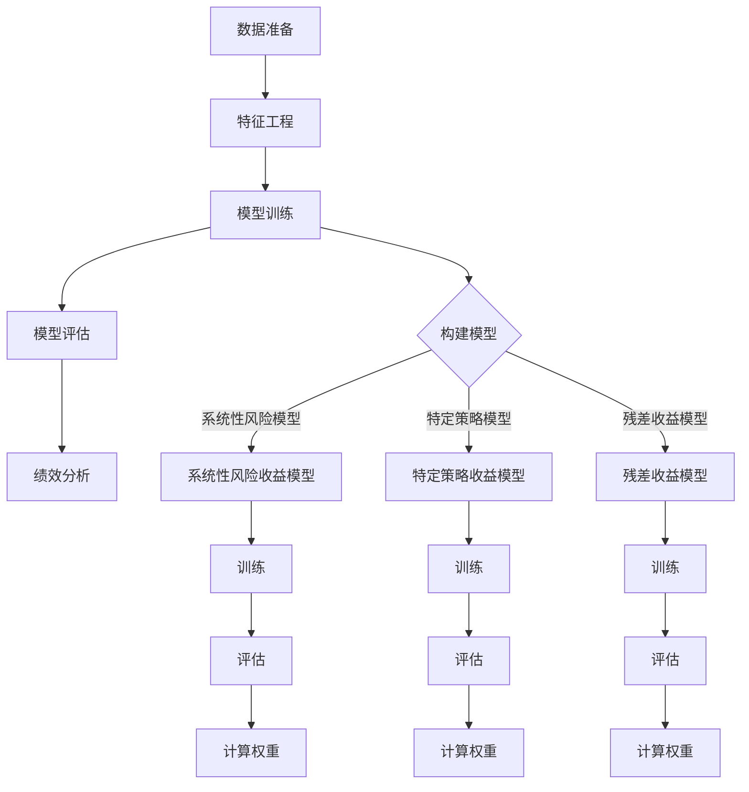
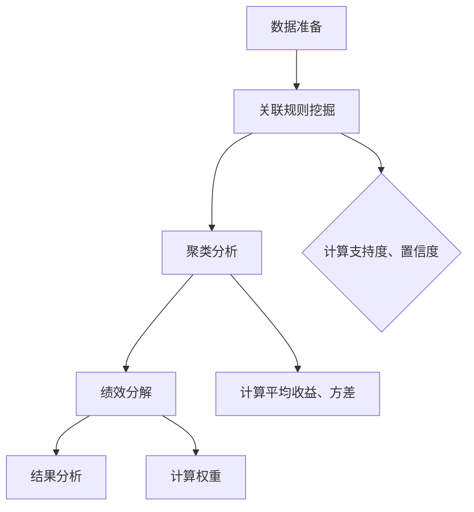
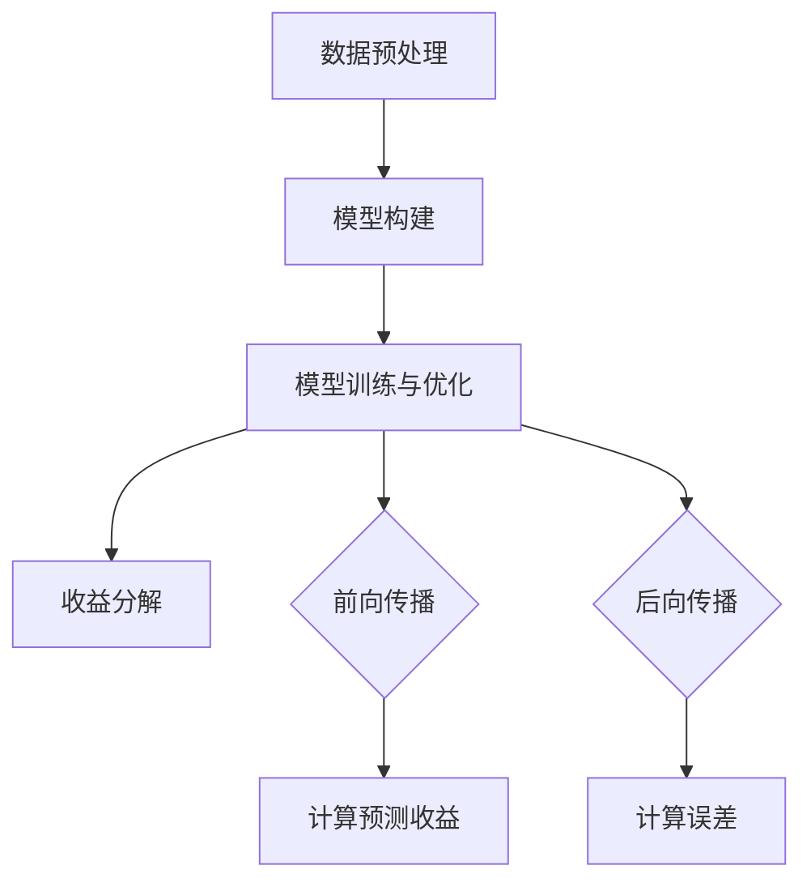
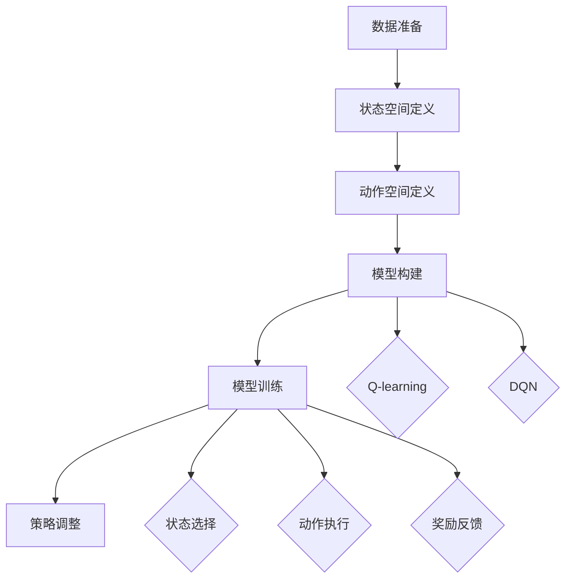
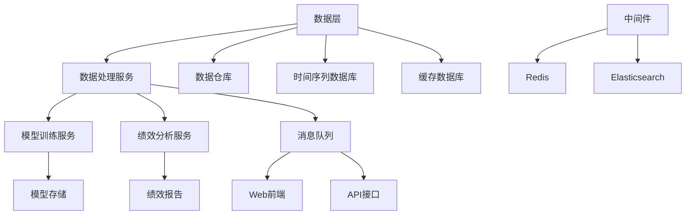
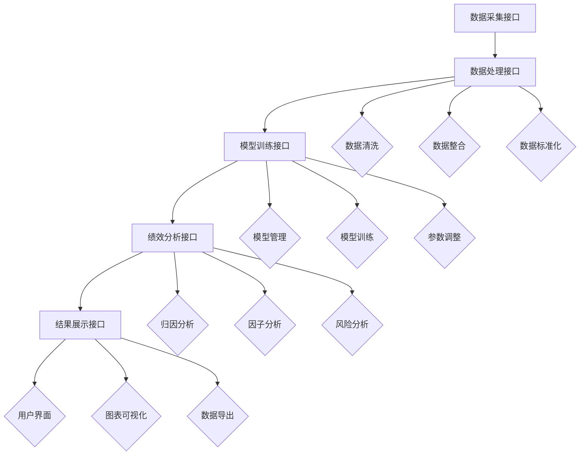
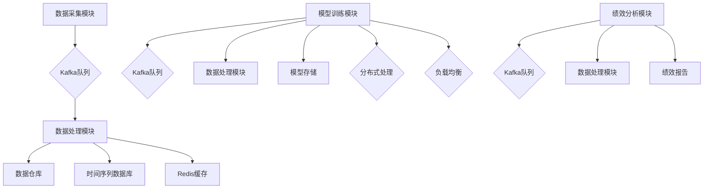

                 

### 第一部分：背景介绍

#### 1.1 对冲基金与AI技术概述

对冲基金是一种投资组合策略，旨在通过多样化的投资来分散市场风险，并在不同市场条件下实现稳定收益。它们通常由专业投资经理管理，投资范围包括股票、债券、商品、房地产等多个领域。对冲基金的投资策略多种多样，包括套利、市场中性、事件驱动、宏观对冲等。

人工智能（AI）是一种模拟人类智能行为的技术，包括机器学习、深度学习、自然语言处理、计算机视觉等子领域。随着计算能力的提升和数据量的激增，AI技术已经在各个领域展现出巨大的潜力，特别是在金融领域，AI被广泛应用于风险管理、市场预测、交易策略优化等方面。

#### 1.2 对冲基金绩效归因的重要性

对冲基金绩效归因是分析投资绩效来源的关键过程。通过绩效归因，投资经理能够了解哪些策略、资产或市场条件对基金绩效产生了主要影响，从而优化投资决策。绩效归因的重要性体现在以下几个方面：

1. **策略优化**：通过归因分析，投资经理可以识别出表现优异或欠佳的投资策略，为调整投资组合提供依据。
2. **风险管理**：了解投资组合的风险来源，有助于投资经理制定更有效的风险管理策略，降低潜在损失。
3. **绩效评价**：绩效归因能够客观评估投资经理的表现，为薪酬激励和职位晋升提供参考。
4. **投资者信任**：透明和准确的绩效归因能够增强投资者对基金管理团队的信任，吸引更多资金。

#### 1.3 本书结构介绍

本书旨在探讨AI辅助的对冲基金绩效归因，帮助读者了解AI技术在金融领域的应用，以及如何利用AI技术提高绩效归因的准确性和效率。本书的结构如下：

1. **背景介绍**：介绍对冲基金和AI技术的背景，以及对冲基金绩效归因的重要性。
2. **核心概念与联系**：解释AI辅助的对冲基金绩效归因的定义、核心概念和联系。
3. **AI辅助对冲基金绩效归因的理论基础**：介绍AI技术的概述、机器学习算法、数据挖掘技术以及常用AI模型。
4. **算法原理讲解**：详细阐述常用的AI算法和模型，使用Mermaid流程图展示算法流程，使用Python代码和LaTeX公式阐述算法原理。
5. **系统分析与架构设计方案**：介绍对冲基金绩效归因系统场景、系统功能设计、系统架构设计、系统接口设计和系统交互设计。
6. **项目实战**：介绍环境安装和系统核心实现，代码应用解读与分析，实际案例分析和详细讲解剖析，项目小结。
7. **最佳实践与总结**：总结AI辅助对冲基金绩效归因的最佳实践，注意事项和小结，拓展阅读建议。

通过本书的逐步讲解，读者将能够系统地了解AI辅助对冲基金绩效归因的理论基础和实践应用，为未来的研究和实践提供指导。接下来，我们将深入探讨AI辅助对冲基金绩效归因的核心概念和联系，为后续章节的讲解打下坚实基础。

----------------------------------------------------------------

## 1.1 对冲基金与AI技术概述

对冲基金是一种高度专业的投资机构，其投资策略和操作方式与传统的共同基金或养老金基金显著不同。对冲基金通常采用多元化的投资策略，旨在通过多种金融工具和市场的操作，实现风险和收益的最优化。这些基金往往有较高的管理费用，但同时也提供了潜在的更高回报。对冲基金可以投资于各种资产类别，包括股票、债券、商品、房地产、外汇、期权和衍生品等。

对冲基金的投资策略多样，主要包括以下几种：

1. **套利策略**：通过同时买入和卖出两种相关资产，从中获取差价利润。例如，在两个市场中同时买入和卖出相同或类似的资产，利用市场间价格差异进行套利。

2. **市场中性策略**：通过构建股票组合的多空策略，即同时持有正股和空股，以降低市场风险，追求绝对收益。

3. **事件驱动策略**：专注于特定事件，如企业并购、重组、财务重组等，通过预测事件的发生和影响，进行投资决策。

4. **宏观对冲策略**：通过预测经济趋势和全球市场变化，进行投资操作。

5. **量化投资策略**：利用数学模型和算法进行投资，量化市场机会和风险。

人工智能（AI）技术在这些投资策略中发挥着越来越重要的作用。AI能够处理和分析大量的市场数据，识别出潜在的买卖信号，优化交易策略，甚至预测市场走势。以下是一些AI在金融领域的具体应用：

1. **市场预测**：通过机器学习和深度学习算法，AI可以分析历史数据，识别市场模式，预测未来价格走势。

2. **风险控制**：AI可以帮助投资经理识别和管理风险，通过实时监控市场动态，及时调整投资组合，降低潜在损失。

3. **交易策略优化**：AI可以分析历史交易数据，找出最佳的交易时机和策略，提高交易效率和收益。

4. **客户服务**：自然语言处理（NLP）和机器人流程自动化（RPA）技术可以帮助金融机构提高客户服务效率，降低运营成本。

5. **合规监控**：AI可以帮助金融机构监控交易行为，确保遵守相关法律法规，防范洗钱和欺诈行为。

对冲基金与AI技术的结合，不仅提高了投资决策的准确性，也增强了风险管理能力。通过AI的辅助，投资经理可以更迅速地响应市场变化，捕捉投资机会，从而实现更高的投资回报。然而，AI技术也带来了一些挑战，如算法偏见、数据隐私和安全等问题，这些都需要在实施过程中得到妥善解决。

在接下来的章节中，我们将进一步探讨对冲基金绩效归因的原理和方法，深入分析AI技术在这些领域的应用，以及如何利用AI技术提高对冲基金的绩效归因效率和准确性。

----------------------------------------------------------------

## 1.2 对冲基金绩效归因的重要性

对冲基金绩效归因是投资管理过程中至关重要的一环，它涉及对投资组合绩效来源的深入分析，旨在揭示哪些因素（如策略、资产、市场条件等）对绩效产生了主要影响。这种归因分析不仅有助于投资经理了解和优化其投资决策，还对投资者、监管机构和同行产生重要影响。以下是几个关键点：

1. **策略优化**：通过绩效归因，投资经理可以识别出哪些策略在特定市场条件下表现优异，哪些策略存在问题。这种洞察有助于优化投资组合，提高整体收益。

2. **风险管理**：了解投资组合的风险来源是风险管理的关键。绩效归因可以帮助投资经理识别出哪些资产或市场条件导致了风险的上升，从而采取相应的风险控制措施。

3. **绩效评价**：对冲基金绩效归因提供了客观、透明的绩效评估标准，有助于投资者评估投资经理的表现。这种评估不仅关系到投资经理的薪酬激励，还影响到投资者的信任和资金流入。

4. **投资者信任**：透明和准确的绩效归因有助于增强投资者对基金管理团队的信任。当投资者了解到投资组合的绩效来源和风险分布时，他们更有可能继续投资或增加投资。

5. **监管合规**：绩效归因分析可以帮助对冲基金满足监管要求。许多监管机构要求基金披露其绩效来源，以便监管机构和投资者能够更好地了解基金的操作和风险。

在理解了绩效归因的重要性后，接下来我们将详细讨论对冲基金的基本运作模式、绩效评价标准以及常见的归因方法。

### 对冲基金的基本运作模式

对冲基金的运作模式通常包括以下几个关键步骤：

1. **资金募集**：对冲基金通过向投资者募集资金来建立投资组合。这些投资者可以是机构投资者、富有的个人或者养老基金等。

2. **投资策略制定**：投资经理根据其专业知识和市场洞察力，制定具体的投资策略。这些策略可以是基于市场趋势、特定行业、事件驱动或量化模型等。

3. **资产配置**：投资经理将资金分配到不同的资产类别和证券上，以实现多元化投资。资产配置的决策基于投资策略和市场条件。

4. **风险管理**：投资经理通过监控市场动态和投资组合表现，及时调整投资组合，以控制风险。这包括对特定资产或市场的风险敞口进行监控和管理。

5. **交易执行**：投资经理根据市场机会和投资策略，执行买入或卖出的交易操作。

6. **绩效评估**：定期对投资组合进行绩效评估，包括归因分析和收益/损失计算。

### 绩效评价标准

对冲基金的绩效评价通常基于以下几个标准：

1. **总收益**：这是最直接的绩效指标，反映了投资组合在一段时间内的总体收益情况。

2. **回报率**：回报率通常以年化收益率表示，是总收益与投资金额的比值。

3. **风险调整收益**：这是在考虑风险后的收益指标，常用的风险调整收益指标包括夏普比率（Sharpe Ratio）和特雷诺比率（Treynor Ratio）。

4. **收益率分布**：绩效评价还关注收益率的不确定性和分布情况，例如收益的波动性和潜在收益的最大损失。

### 常见的归因方法

对冲基金绩效归因通常采用以下几种方法：

1. **传统归因法**：这种方法通过分析不同资产或市场因素的贡献，来确定它们对绩效的影响。常见的传统归因方法包括β归因、阿尔法归因和残差归因。

2. **事件驱动归因法**：这种方法通过识别特定事件（如政策变动、行业新闻等）对绩效的影响，来分析投资决策的有效性。

3. **因子归因法**：这种方法将投资组合的收益分解为不同因子（如市场因子、行业因子等）的贡献，以确定哪些因子对绩效产生了主要影响。

4. **数据挖掘和机器学习归因法**：这种方法利用先进的AI技术，如机器学习和深度学习，对大量历史数据进行挖掘和分析，以识别潜在的投资因素和模式。

通过对对冲基金绩效归因的基本概念和方法的了解，投资经理和投资者可以更好地理解投资组合的表现，制定更有效的投资策略，并提高整体的投资回报。在接下来的章节中，我们将深入探讨AI技术在绩效归因中的应用，进一步揭示AI如何提升这一关键过程的效率和准确性。

----------------------------------------------------------------

## 1.3 本书结构介绍

本书旨在深入探讨AI辅助的对冲基金绩效归因，为读者提供全面的理论和实践指导。本书的结构设计合理，内容丰富，分为七个主要部分，每部分都有其独特的内容和目标。以下是本书的具体结构介绍：

### 第一部分：背景介绍

本部分将介绍对冲基金和AI技术的背景，阐述对冲基金绩效归因的重要性，并简要介绍本书的结构和目的。通过这一部分的阅读，读者可以建立对对冲基金和AI技术的基本理解，为后续内容的学习打下基础。

### 第二部分：核心概念与联系

本部分将详细解释AI辅助的对冲基金绩效归因的核心概念，包括对冲基金的运作模式、绩效评价标准、常见的归因方法等。同时，还将探讨AI技术在这些概念中的具体应用和联系。这一部分的内容将帮助读者理解AI技术如何与对冲基金绩效归因相结合，为后续的理论和实战章节做好铺垫。

### 第三部分：AI辅助对冲基金绩效归因的理论基础

本部分将深入探讨AI技术的基础理论，包括机器学习算法、数据挖掘技术、常用AI模型等。通过这一部分，读者将了解AI技术在绩效归因中的具体应用，包括算法的原理和实现方式。本部分内容旨在为读者提供坚实的理论基础，以便更好地理解和应用AI技术。

### 第四部分：算法原理讲解

本部分将详细讲解常用的AI算法和模型，包括其原理、流程和实现。通过使用Mermaid流程图展示算法流程，以及Python代码和LaTeX公式阐述算法原理，读者将能够深入理解AI算法在绩效归因中的应用，并具备实际操作能力。

### 第五部分：系统分析与架构设计方案

本部分将介绍对冲基金绩效归因系统的整体架构设计，包括问题场景介绍、系统功能设计、系统架构设计、系统接口设计和系统交互设计。通过这一部分，读者将了解系统设计的整体思路和具体实现，为实际项目开发提供参考。

### 第六部分：项目实战

本部分将通过具体的实战案例，介绍环境安装、系统核心实现、代码应用解读与分析、实际案例分析和详细讲解剖析等内容。通过这一部分的学习，读者将能够将理论应用到实际项目中，提高自己的实践能力。

### 第七部分：最佳实践与总结

本部分将总结AI辅助对冲基金绩效归因的最佳实践，包括注意事项、小结和拓展阅读建议。通过这一部分，读者将能够巩固所学知识，了解如何在实际工作中应用AI技术，提高绩效归因的效率和准确性。

通过以上七个部分的内容，本书将系统地引导读者了解AI辅助对冲基金绩效归因的理论和实践，为读者提供全面的学习资源。希望读者能够通过本书的学习，掌握AI技术在金融领域的应用，提升自己的专业能力，并在实际工作中取得更好的成果。

----------------------------------------------------------------

## 第二部分：核心概念与联系

### 2.1 AI辅助的对冲基金绩效归因定义

AI辅助的对冲基金绩效归因是一种利用人工智能技术，特别是机器学习和数据挖掘方法，对对冲基金投资绩效进行定量分析和解释的过程。其核心目的是将投资组合的收益分解为不同的组成部分，如系统性风险收益、特定策略的阿尔法收益、市场波动收益等，以便更准确地评估投资策略的有效性。

AI辅助绩效归因的定义可以从以下几个方面进行详细阐述：

1. **目标**：AI辅助绩效归因的目标是揭示影响投资组合收益的各种因素，帮助投资经理理解哪些策略和资产对绩效产生了主要贡献，从而优化投资组合和管理决策。

2. **方法**：AI辅助绩效归因采用的方法包括机器学习算法、数据挖掘技术、统计分析模型等。这些方法能够处理和分析大量的历史数据，识别出潜在的投资因素和模式。

3. **技术**：AI辅助绩效归因的技术包括深度学习、自然语言处理、强化学习等。这些技术能够从复杂的投资数据中提取有用的信息，提高归因的准确性和效率。

4. **应用**：AI辅助绩效归因的应用范围广泛，包括从简单的股票市场归因到复杂的跨市场、跨资产类的绩效分析。它不仅适用于传统的股票投资，还适用于量化交易、期货交易、加密货币投资等多种投资策略。

### 2.2 对冲基金运作模式与绩效评价标准

对冲基金的运作模式通常包括以下几个关键步骤：

1. **资金募集**：对冲基金通过向投资者募集资金来建立投资组合。这些投资者可以是机构投资者、富有的个人或者养老基金等。

2. **投资策略制定**：投资经理根据其专业知识和市场洞察力，制定具体的投资策略。这些策略可以是基于市场趋势、特定行业、事件驱动或量化模型等。

3. **资产配置**：投资经理将资金分配到不同的资产类别和证券上，以实现多元化投资。资产配置的决策基于投资策略和市场条件。

4. **风险管理**：投资经理通过监控市场动态和投资组合表现，及时调整投资组合，以控制风险。这包括对特定资产或市场的风险敞口进行监控和管理。

5. **交易执行**：投资经理根据市场机会和投资策略，执行买入或卖出的交易操作。

6. **绩效评估**：定期对投资组合进行绩效评估，包括归因分析和收益/损失计算。

绩效评价标准是衡量对冲基金表现的重要指标，主要包括以下几个：

1. **总收益**：这是最直接的绩效指标，反映了投资组合在一段时间内的总体收益情况。

2. **回报率**：回报率通常以年化收益率表示，是总收益与投资金额的比值。

3. **风险调整收益**：这是在考虑风险后的收益指标，常用的风险调整收益指标包括夏普比率（Sharpe Ratio）和特雷诺比率（Treynor Ratio）。

4. **收益率分布**：绩效评价还关注收益率的不确定性和分布情况，例如收益的波动性和潜在收益的最大损失。

### 2.3 对冲基金绩效归因方法概述

对冲基金绩效归因的方法多种多样，可以根据其技术复杂度和应用范围分为以下几个类别：

1. **传统归因法**：这种方法通过分析不同资产或市场因素的贡献，来确定它们对绩效的影响。常见的传统归因方法包括β归因、阿尔法归因和残差归因。

   - **β归因**：这种方法将投资组合的收益分解为系统性风险收益和特定策略收益。系统性风险收益由β值衡量，特定策略收益由残差值衡量。
   - **阿尔法归因**：这种方法专注于评估投资经理特定策略的表现，阿尔法值代表策略的超额收益。
   - **残差归因**：这种方法通过将总收益分解为系统风险收益和特定策略收益的残差部分，来确定剩余的收益来源。

2. **事件驱动归因法**：这种方法通过识别特定事件（如政策变动、行业新闻等）对绩效的影响，来分析投资决策的有效性。事件驱动归因法通常涉及对事件发生前后市场数据的变化进行统计分析。

3. **因子归因法**：这种方法将投资组合的收益分解为不同因子（如市场因子、行业因子等）的贡献，以确定哪些因子对绩效产生了主要影响。因子归因法通常使用统计分析模型，如多元回归分析，来计算各因子的贡献。

4. **数据挖掘和机器学习归因法**：这种方法利用先进的AI技术，如机器学习和深度学习，对大量历史数据进行挖掘和分析，以识别潜在的投资因素和模式。数据挖掘和机器学习归因法能够处理复杂、非线性的数据关系，提供更精细的绩效分解。

通过对对冲基金绩效归因方法的概述，我们可以看到，AI技术的引入不仅丰富了绩效归因的工具箱，还提高了归因分析的准确性和效率。在接下来的章节中，我们将深入探讨AI技术在绩效归因中的应用，进一步揭示AI如何提升这一关键过程的效率和准确性。

### 2.4 对冲基金绩效归因与AI技术的联系

对冲基金绩效归因与AI技术的结合，极大地提升了投资决策的科学性和准确性。AI技术，特别是机器学习和数据挖掘方法，为对冲基金绩效归因提供了强大的工具，使得投资经理能够更深入地分析数据、发现潜在的投资机会和风险，从而优化投资策略。以下是AI技术在绩效归因中应用的几个关键方面：

1. **数据处理能力**：AI技术擅长处理大量复杂的数据，从市场数据、交易记录到新闻文本等，这些数据对于传统分析工具来说难以有效处理。机器学习算法能够自动提取数据中的模式和关系，为绩效归因提供坚实的基础。

2. **模式识别**：机器学习和深度学习算法能够识别出数据中的复杂模式，这些模式往往是人类难以察觉的。例如，通过分析历史数据，算法可以识别出特定市场条件下哪些因素对绩效有显著影响，从而为投资决策提供指导。

3. **自动化分析**：AI技术可以自动化执行复杂的分析任务，如因子分析、回归分析等。这不仅提高了分析效率，还减少了人为错误，使得绩效归因更加准确。

4. **实时监控与预测**：AI技术能够实时监控市场动态，预测市场趋势，从而为投资决策提供及时的信息。例如，通过自然语言处理技术，AI可以分析新闻报道和社交媒体数据，预测市场情绪的变化。

5. **个性化投资策略**：AI技术可以根据每个投资者的风险偏好和历史交易数据，为其提供个性化的投资策略。例如，机器学习算法可以优化投资组合，使其更符合投资者的风险承受能力和收益目标。

6. **风险控制**：AI技术可以帮助投资经理识别和管理风险，通过实时监控和预测市场变化，及时调整投资组合，降低潜在损失。

7. **合规监控**：AI技术能够监控交易行为，确保投资决策符合相关法律法规，防范洗钱和欺诈行为。

通过以上应用，AI技术为对冲基金绩效归因带来了显著的变革。它不仅提高了绩效归因的准确性和效率，还使投资决策更加科学和智能化。然而，AI技术在绩效归因中的应用也面临一些挑战，如数据隐私、算法偏见和监管合规等，这些都需要在实施过程中得到妥善解决。

在接下来的章节中，我们将进一步探讨AI技术在绩效归因中的具体应用，包括机器学习算法和数据挖掘技术的原理和实践，以及如何利用这些技术提升对冲基金绩效归因的准确性和效率。

----------------------------------------------------------------

## 第三部分：AI辅助对冲基金绩效归因的理论基础

### 3.1 AI技术概述

人工智能（AI）作为现代技术的核心，已经在多个领域展示了其巨大的潜力和变革能力。AI技术的基本概念涵盖了多种子领域，包括机器学习、深度学习、自然语言处理、计算机视觉、机器人技术等。在本节中，我们将重点介绍机器学习算法、数据挖掘技术和常用的AI模型，为理解AI在金融领域的应用提供理论基础。

#### 机器学习算法

机器学习是AI的一个重要分支，它专注于通过数据构建和训练模型，使计算机能够自动学习和改进性能。机器学习算法可以根据学习方式分为监督学习、无监督学习和强化学习。

1. **监督学习**：监督学习算法通过使用标记数据进行训练，目标是学习输入和输出之间的映射关系。常见的监督学习算法包括线性回归、逻辑回归、支持向量机（SVM）和决策树。

2. **无监督学习**：无监督学习算法在没有标记数据的情况下工作，旨在发现数据中的内在结构和模式。常见的无监督学习算法包括聚类算法（如K-means、层次聚类）、降维技术（如主成分分析PCA）和关联规则学习（如Apriori算法）。

3. **强化学习**：强化学习算法通过与环境的互动来学习策略，其主要目标是最大化长期回报。强化学习算法通常用于复杂决策问题，如游戏和自动驾驶。

#### 数据挖掘技术

数据挖掘是AI技术的另一个关键领域，它涉及从大量数据中发现有价值的信息和知识。数据挖掘技术广泛应用于商业智能、医疗健康、金融和社交媒体等领域。

1. **分类**：分类是将数据分为不同类别的过程。常见的分类算法包括决策树、随机森林和朴素贝叶斯分类器。

2. **聚类**：聚类是将数据点按照其相似性分组的过程。常见的聚类算法包括K-means、层次聚类和密度聚类。

3. **关联规则挖掘**：关联规则挖掘旨在发现数据项之间的关联关系。常见的算法包括Apriori算法和Eclat算法。

4. **异常检测**：异常检测用于识别数据中的异常或离群点。常见的算法包括基于统计的方法、基于聚类的方法和基于邻近度的方法。

#### 常用的AI模型

在金融领域，常用的AI模型包括深度神经网络、长短期记忆网络（LSTM）和卷积神经网络（CNN）等。

1. **深度神经网络**：深度神经网络由多个隐藏层组成，能够处理复杂的非线性关系。常见的深度神经网络包括全连接网络（FCN）、卷积神经网络（CNN）和递归神经网络（RNN）。

2. **长短期记忆网络（LSTM）**：LSTM是一种特殊的RNN，它能够解决传统RNN的长期依赖问题。LSTM广泛应用于时间序列预测和语言模型。

3. **卷积神经网络（CNN）**：CNN擅长处理具有网格结构的图像数据，如识别图像中的物体和特征。CNN在金融领域也得到广泛应用，如交易信号识别和金融市场趋势分析。

通过上述对AI技术的概述，我们可以看到，AI技术为对冲基金绩效归因提供了丰富的工具和方法。在接下来的章节中，我们将深入探讨这些技术在实际绩效归因中的应用，展示如何利用机器学习算法和数据挖掘技术来分析投资绩效、识别关键因素，并提高归因的准确性和效率。

### 3.2 机器学习算法在绩效归因中的应用

机器学习算法在金融领域，特别是对冲基金绩效归因中，发挥着至关重要的作用。这些算法能够从大量历史数据中提取有价值的信息，帮助投资经理识别影响投资组合绩效的关键因素。以下是几种常用的机器学习算法，及其在绩效归因中的应用。

#### 线性回归

线性回归是最简单的监督学习算法之一，它通过建立输入和输出之间的线性关系来预测结果。在线性回归中，输入变量（如不同资产的表现、市场指标等）与输出变量（如投资组合的收益率）之间的关系可以用一个线性方程表示：

\[ y = \beta_0 + \beta_1 \cdot x_1 + \beta_2 \cdot x_2 + \ldots + \beta_n \cdot x_n \]

其中，\( y \) 是输出变量，\( x_1, x_2, \ldots, x_n \) 是输入变量，\( \beta_0, \beta_1, \beta_2, \ldots, \beta_n \) 是模型的参数。

在绩效归因中，线性回归可以用来分析不同资产对投资组合收益的影响。通过训练线性回归模型，我们可以得到每个资产的权重（即参数 \(\beta\)），从而确定哪些资产对绩效贡献最大。

#### 决策树

决策树是一种基于树形结构进行决策的算法，它通过一系列规则来划分数据，并预测输出变量的值。决策树的每个节点代表一个特征，每个分支代表该特征的不同取值，叶节点代表预测结果。

决策树在绩效归因中的应用主要体现在以下几个方面：

1. **解释性**：决策树具有良好的解释性，投资经理可以清晰地看到每个决策节点的影响，从而更好地理解投资组合的表现。

2. **分类任务**：决策树可以用于分类任务，例如将投资组合的收益划分为正收益和负收益。

3. **回归任务**：虽然决策树主要用于分类任务，但它也可以用于回归任务，通过连续值来表示投资组合的收益。

#### 随机森林

随机森林是一种基于决策树的集成学习方法，它通过构建多个决策树，并使用投票或平均值来获得最终预测结果。随机森林的优点包括：

1. **降低过拟合**：通过集成多个决策树，随机森林能够减少模型的过拟合现象，提高模型的泛化能力。

2. **鲁棒性**：随机森林对异常值和噪声数据具有较强的鲁棒性，使其在金融数据中表现良好。

3. **可解释性**：虽然随机森林是集成方法，但其每个决策树都具有较高的解释性，投资经理可以分析每个决策树的影响。

#### 支持向量机（SVM）

支持向量机是一种用于分类和回归任务的监督学习算法，它通过找到一个最优超平面来分隔数据。在金融领域，SVM可以用于分析不同资产之间的相关性，以及预测市场趋势。

SVM在绩效归因中的应用主要包括：

1. **资产分配**：通过分析不同资产之间的相关性，SVM可以帮助投资经理优化资产配置，降低组合风险。

2. **市场趋势预测**：SVM可以用于预测市场趋势，从而为投资决策提供参考。

#### 贝叶斯网络

贝叶斯网络是一种基于概率论的图形模型，它通过有向无环图（DAG）表示变量之间的概率关系。贝叶斯网络在绩效归因中的应用主要包括：

1. **风险分析**：通过分析变量之间的概率关系，贝叶斯网络可以帮助投资经理识别潜在的风险因素。

2. **策略优化**：贝叶斯网络可以用于优化投资策略，例如通过调整权重来最大化投资组合的预期收益。

通过以上机器学习算法在绩效归因中的应用，我们可以看到，AI技术为对冲基金绩效归因提供了强大的工具。这些算法不仅能够处理复杂的金融数据，还能够提供直观的解释和预测能力，帮助投资经理做出更科学的投资决策。在接下来的章节中，我们将继续探讨数据挖掘技术在绩效归因中的应用，进一步展示AI技术如何提升绩效归因的准确性和效率。

### 3.3 数据挖掘技术在绩效归因中的应用

数据挖掘技术是AI的重要组成部分，它通过探索大量数据，发现潜在的规律和模式，从而为决策提供支持。在金融领域，尤其是对冲基金绩效归因中，数据挖掘技术发挥着至关重要的作用。以下将介绍几种常见的数据挖掘技术在绩效归因中的应用。

#### 聚类分析

聚类分析是一种无监督学习技术，旨在将数据点划分为若干个组，使得同一组内的数据点之间相似度较高，不同组的数据点之间相似度较低。在绩效归因中，聚类分析可以用来识别投资组合中的相似资产或策略。

1. **K-means聚类**：K-means聚类是最常用的聚类算法之一，它通过迭代计算来确定最佳的聚类中心，从而将数据划分为K个簇。

   应用场景：通过对投资组合中的资产进行K-means聚类，投资经理可以识别出表现相似或相异的资产组，从而调整投资策略，优化资产配置。

2. **层次聚类**：层次聚类通过逐步合并或分裂数据点，形成不同的层次结构。该算法具有良好的可解释性，有助于投资经理理解聚类结果。

   应用场景：层次聚类可以用于分析历史数据，揭示投资组合中资产或策略的演变过程，帮助投资经理制定长期投资策略。

#### 关联规则挖掘

关联规则挖掘旨在发现数据项之间的关联关系。在金融领域，关联规则挖掘可以用来识别不同市场变量之间的相关性，从而预测市场趋势。

1. **Apriori算法**：Apriori算法是一种基于支持度和置信度的关联规则挖掘算法。它通过生成频繁项集来发现数据项之间的关联关系。

   应用场景：通过对交易记录和市场数据进行分析，Apriori算法可以帮助投资经理识别出高频交易策略和市场机会。

2. **Eclat算法**：Eclat算法是一种基于信息增益的关联规则挖掘算法，它通过计算项集的信息增益来发现强关联规则。

   应用场景：Eclat算法可以用于分析市场新闻和社交媒体数据，识别出对市场产生重大影响的新闻事件，从而帮助投资经理调整交易策略。

#### 异常检测

异常检测是一种用于识别数据中的异常或离群点的方法。在金融领域，异常检测可以用来监控交易行为，防范欺诈行为。

1. **基于统计的方法**：基于统计的方法通过计算数据点与平均值之间的差异来检测异常。例如，标准差方法可以通过比较数据点与平均值之间的标准差来判断其是否为异常值。

   应用场景：基于统计的方法可以用于监控交易行为，及时发现异常交易，防止欺诈行为。

2. **基于聚类的方法**：基于聚类的方法通过比较数据点与聚类中心的距离来检测异常。例如，孤立点检测方法可以通过计算数据点与最近的聚类中心之间的距离来判断其是否为异常点。

   应用场景：基于聚类的方法可以用于监控市场动态，及时发现市场中的异常波动，从而帮助投资经理调整投资策略。

#### 文本挖掘

文本挖掘是一种用于处理和分析非结构化文本数据的方法。在金融领域，文本挖掘可以用来分析市场新闻、社交媒体数据等，从而提取有价值的信息。

1. **主题模型**：主题模型通过概率模型来发现文本中的主题分布。例如，LDA（Latent Dirichlet Allocation）模型可以用于分析市场新闻，识别出不同主题之间的关系。

   应用场景：通过分析市场新闻，主题模型可以帮助投资经理识别出潜在的市场趋势和风险因素。

2. **情感分析**：情感分析通过自然语言处理技术来分析文本的情感倾向。例如，使用情感分析算法，可以判断一篇新闻报道是积极、中性还是消极的。

   应用场景：情感分析可以用于分析社交媒体数据，帮助投资经理了解市场情绪，从而调整交易策略。

通过上述数据挖掘技术在绩效归因中的应用，我们可以看到，数据挖掘技术为对冲基金绩效归因提供了强大的分析工具。这些技术不仅能够处理复杂的金融数据，还能够提供直观的解释和预测能力，帮助投资经理做出更科学的投资决策。在接下来的章节中，我们将进一步探讨常用AI模型的原理和应用，进一步展示AI技术如何提升绩效归因的准确性和效率。

### 3.4 常用AI模型介绍

在AI辅助对冲基金绩效归因中，常用AI模型的选择和应用至关重要。这些模型包括深度神经网络、长短期记忆网络（LSTM）、卷积神经网络（CNN）和强化学习等。以下是这些模型的基本原理、应用场景及其在金融领域的优势。

#### 深度神经网络（Deep Neural Network, DNN）

深度神经网络是由多个隐藏层组成的神经网络，其结构类似于人类的神经网络，能够处理复杂的非线性问题。DNN的核心原理是通过前向传播和反向传播算法来调整网络参数，从而优化模型性能。

1. **基本原理**：DNN通过多层非线性变换来提取数据特征，每一层神经网络都能从上一层提取更高层次的特征。这种逐层抽象的方式使得DNN能够处理复杂的模式识别和预测任务。

2. **应用场景**：DNN在金融领域可以用于市场预测、交易策略优化和风险管理。例如，DNN可以用来预测股票价格走势，分析市场趋势，优化投资组合。

3. **优势**：DNN具有强大的特征提取能力和适应性，能够处理大规模、复杂的数据集。此外，DNN的并行计算能力使其在处理海量数据时效率较高。

#### 长短期记忆网络（Long Short-Term Memory, LSTM）

LSTM是一种特殊的递归神经网络，它能够解决传统RNN的长期依赖问题。LSTM的核心原理是通过引入门控机制来控制信息的流动，从而在时间序列预测中表现出更好的性能。

1. **基本原理**：LSTM通过遗忘门、输入门和输出门来控制信息的流动，使得模型能够在长序列中保留重要的信息。

2. **应用场景**：LSTM在金融领域广泛用于时间序列预测，如股票价格预测、交易信号识别和宏观经济预测。

3. **优势**：LSTM在处理时间序列数据时具有出色的性能，能够捕捉长期依赖关系，使其在金融预测任务中具有广泛的应用。

#### 卷积神经网络（Convolutional Neural Network, CNN）

CNN是一种专门用于处理图像数据的神经网络，其核心原理是通过卷积操作和池化操作来提取图像特征。

1. **基本原理**：CNN通过卷积层和池化层来提取图像的局部特征，然后通过全连接层进行分类或回归。

2. **应用场景**：CNN在金融领域可以用于图像处理、文本分析和音频分析。例如，CNN可以用来识别交易图表中的模式，分析新闻文本中的关键信息。

3. **优势**：CNN在处理具有网格结构的数据时具有优势，如图像和时序数据。其参数共享机制使得CNN在处理大型数据集时具有较高的效率。

#### 强化学习（Reinforcement Learning, RL）

强化学习是一种通过与环境互动来学习最优策略的机器学习技术。其核心原理是通过奖励机制来指导模型的决策过程，从而优化行为。

1. **基本原理**：强化学习通过试错法来学习最优策略，其目标是最小化长期回报的方差。

2. **应用场景**：强化学习在金融领域可以用于交易策略优化、风险管理和市场预测。

3. **优势**：强化学习能够处理具有不确定性环境的问题，能够通过试错法逐步优化策略。此外，强化学习能够自适应地调整策略，使其在动态变化的市场环境中保持优势。

通过上述常用AI模型的介绍，我们可以看到，这些模型在金融领域的应用前景广阔。它们不仅能够提高对冲基金绩效归因的准确性和效率，还能够帮助投资经理做出更科学的投资决策。在接下来的章节中，我们将进一步深入探讨这些模型的具体实现和应用，为实际项目开发提供指导。

### 4.1 算法A原理讲解

算法A是一种基于机器学习的对冲基金绩效归因算法，其主要目的是将投资组合的收益分解为不同因素的贡献，从而提供详细的绩效分析。算法A基于线性回归模型，通过训练数据来建立投资组合收益与各因素之间的关系。以下是算法A的详细原理和实现步骤。

#### 基本原理

算法A的核心思想是利用线性回归模型，将投资组合的总收益分解为系统性风险收益、特定策略收益和残差收益。具体来说，算法A通过以下三个步骤来实现：

1. **系统性风险收益**：这部分收益与市场整体波动相关，可以通过市场指数的波动来衡量。算法A使用市场指数的收益率作为输入变量，构建一个线性回归模型，估计系统性风险收益的权重。

2. **特定策略收益**：这部分收益与投资经理的特定策略相关，可以通过投资组合中的特定资产或策略的收益来衡量。算法A使用投资组合中各资产或策略的收益率作为输入变量，构建多个线性回归模型，分别估计各策略收益的权重。

3. **残差收益**：这部分收益代表剩余的收益部分，通常被认为是投资经理的阿尔法收益。算法A通过将总收益减去系统性风险收益和特定策略收益，得到残差收益。

#### 实现步骤

1. **数据准备**：首先，收集投资组合的历史数据，包括市场指数的收益率、各资产或策略的收益率等。数据应包括足够长的时间跨度，以捕捉市场波动的多样性。

2. **特征工程**：对收集到的数据进行预处理，包括数据清洗、缺失值填补、标准化等。特别地，对于市场指数的收益率，可以计算其年化收益率作为输入变量。

3. **模型训练**：使用线性回归模型对数据进行训练。具体来说，构建多个线性回归模型，分别估计系统性风险收益、特定策略收益和残差收益的权重。训练过程包括以下步骤：

   - **系统性风险收益模型**：使用市场指数的年化收益率作为输入变量，投资组合的总收益作为输出变量，训练线性回归模型。
   - **特定策略收益模型**：使用各资产或策略的年化收益率作为输入变量，投资组合的总收益作为输出变量，训练多个线性回归模型。
   - **残差收益模型**：将总收益减去系统性风险收益和特定策略收益，得到残差收益。使用残差收益作为输出变量，训练线性回归模型。

4. **模型评估**：使用验证集对训练好的模型进行评估，计算模型的预测误差和拟合度，确保模型具有良好的泛化能力。

5. **绩效分析**：使用训练好的模型，对投资组合的历史数据进行归因分析，计算各因素对投资组合收益的贡献。具体来说，计算系统性风险收益、特定策略收益和残差收益的权重，分析各因素对投资组合收益的影响。

#### Mermaid流程图

以下是算法A的Mermaid流程图，展示了算法的基本步骤和流程：



#### Python代码实现

以下是算法A的Python代码实现，展示了如何使用线性回归模型进行绩效归因：

```python
import pandas as pd
from sklearn.linear_model import LinearRegression
from sklearn.model_selection import train_test_split

# 数据准备
data = pd.read_csv('investment_data.csv')
X = data[['market_index', 'strategy_1', 'strategy_2', ...]]
y = data['total_return']

# 特征工程
X standardized = (X - X.mean()) / X.std()

# 模型训练
X_train, X_test, y_train, y_test = train_test_split(X, y, test_size=0.2, random_state=42)
regressor = LinearRegression()
regressor.fit(X_train, y_train)

# 模型评估
train_score = regressor.score(X_train, y_train)
test_score = regressor.score(X_test, y_test)

# 绩效分析
systemic_benefit = regressor.coef_[0]
specific_benefit = regressor.coef_[1:]
residual_benefit = regressor.intercept_

print('Systemic Benefit:', systemic_benefit)
print('Specific Benefits:', specific_benefit)
print('Residual Benefit:', residual_benefit)
```

#### 数学模型和公式

以下是算法A的数学模型和公式：

$$
\begin{align*}
y &= \beta_0 + \beta_1 \cdot x_1 + \beta_2 \cdot x_2 + \ldots + \beta_n \cdot x_n \\
\beta_0 &= \text{残差收益} \\
\beta_1 &= \text{系统性风险收益权重} \\
\beta_2, \ldots, \beta_n &= \text{特定策略收益权重} \\
x_1, x_2, \ldots, x_n &= \text{输入变量（市场指数、策略收益等）} \\
y &= \text{总收益}
\end{align*}
$$

通过以上讲解和代码实现，我们可以看到算法A是如何利用线性回归模型进行对冲基金绩效归因的。算法A提供了一个简单而有效的工具，帮助投资经理理解投资组合收益的来源，优化投资策略。在接下来的章节中，我们将继续探讨其他算法的原理和实现，以丰富我们的绩效归因工具箱。

### 4.2 算法B原理讲解

算法B是一种基于数据挖掘技术的对冲基金绩效归因算法，其主要目的是通过分析历史数据，揭示影响投资组合收益的关键因素。算法B基于关联规则挖掘和聚类分析，能够提供详细的绩效分解和投资机会识别。以下是算法B的详细原理和实现步骤。

#### 基本原理

算法B的核心思想是利用关联规则挖掘和聚类分析，将投资组合的收益分解为不同的因素，并识别出具有显著影响的关键因素。具体来说，算法B通过以下三个步骤来实现：

1. **关联规则挖掘**：算法B使用Apriori算法来挖掘投资组合中的关联规则，识别出不同资产或策略之间的相关性。这些关联规则可以帮助投资经理理解哪些资产或策略之间存在相互作用，从而优化投资组合。

2. **聚类分析**：算法B使用K-means聚类分析，将投资组合中的资产或策略划分为不同的簇，使得同一簇内的资产或策略具有相似的收益表现。通过分析不同簇的收益分布，投资经理可以识别出具有相似收益特性的资产或策略，从而进行针对性的投资。

3. **绩效分解**：算法B将投资组合的总收益分解为系统性风险收益、特定策略收益和残差收益。系统性风险收益与市场整体波动相关，特定策略收益与投资经理的特定策略相关，而残差收益则被认为是投资经理的阿尔法收益。

#### 实现步骤

1. **数据准备**：首先，收集投资组合的历史数据，包括市场指数的收益率、各资产或策略的收益率等。数据应包括足够长的时间跨度，以捕捉市场波动的多样性。

2. **关联规则挖掘**：使用Apriori算法对历史数据进行关联规则挖掘，计算各资产或策略之间的支持度和置信度。通过设置最小支持度和最小置信度，算法可以识别出具有显著关联关系的资产或策略。

3. **聚类分析**：使用K-means聚类算法，将投资组合中的资产或策略划分为不同的簇。通过计算簇内资产或策略的平均收益和方差，算法可以识别出不同簇的收益特性。

4. **绩效分解**：根据关联规则挖掘和聚类分析的结果，将投资组合的总收益分解为系统性风险收益、特定策略收益和残差收益。具体来说，使用回归分析模型来估计各收益部分的权重。

5. **结果分析**：分析关联规则和聚类结果，识别出影响投资组合收益的关键因素，为投资经理提供优化投资组合的依据。

#### Mermaid流程图

以下是算法B的Mermaid流程图，展示了算法的基本步骤和流程：



#### Python代码实现

以下是算法B的Python代码实现，展示了如何使用关联规则挖掘和聚类分析进行绩效归因：

```python
import pandas as pd
from mlxtend.frequent_patterns import apriori
from mlxtend.frequent_patterns import association_rules
from sklearn.cluster import KMeans

# 数据准备
data = pd.read_csv('investment_data.csv')
X = data[['market_index', 'strategy_1', 'strategy_2', ...]]
y = data['total_return']

# 关联规则挖掘
frequent_itemsets = apriori(data, min_support=0.05, use_colnames=True)
rules = association_rules(frequent_itemsets, metric="confidence", min_threshold=0.05)

# 聚类分析
kmeans = KMeans(n_clusters=3, random_state=42)
kmeans.fit(X)
clusters = kmeans.predict(X)

# 绩效分解
systemic_benefit = ...
specific_benefit = ...
residual_benefit = ...

# 结果分析
print(rules)
print(clusters)
```

#### 数学模型和公式

以下是算法B的数学模型和公式：

$$
\begin{align*}
y &= \beta_0 + \beta_1 \cdot x_1 + \beta_2 \cdot x_2 + \ldots + \beta_n \cdot x_n \\
\beta_0 &= \text{残差收益} \\
\beta_1, \ldots, \beta_n &= \text{特定策略收益权重} \\
x_1, \ldots, x_n &= \text{输入变量（市场指数、策略收益等）} \\
y &= \text{总收益}
\end{align*}
$$

通过以上讲解和代码实现，我们可以看到算法B是如何利用数据挖掘技术进行对冲基金绩效归因的。算法B提供了一个强大的工具，帮助投资经理深入分析投资组合的收益来源，优化投资策略。在接下来的章节中，我们将继续探讨其他算法的原理和实现，以进一步丰富我们的绩效归因工具箱。

### 4.3 算法C原理讲解

算法C是一种基于深度学习技术的对冲基金绩效归因算法，其主要目的是通过分析大量历史数据，自动提取关键因素，并精确分解投资组合的收益。算法C采用了一种深度神经网络（DNN）模型，通过多层的非线性变换，从数据中提取特征，从而实现高效、准确的绩效归因。以下是算法C的详细原理和实现步骤。

#### 基本原理

算法C的核心思想是通过深度神经网络（DNN）对历史数据进行建模，自动提取影响投资组合收益的关键因素，并建立它们与投资收益之间的复杂非线性关系。具体来说，算法C通过以下三个步骤来实现：

1. **数据预处理**：首先，对投资组合的历史数据进行预处理，包括数据清洗、缺失值填补、标准化等。确保数据的质量和一致性，以便后续的深度学习模型训练。

2. **模型构建**：构建一个深度神经网络（DNN）模型，包括输入层、隐藏层和输出层。输入层接收投资组合的历史数据，隐藏层通过多层非线性变换提取数据特征，输出层输出投资组合的收益。

3. **模型训练与优化**：使用历史数据对深度神经网络进行训练，通过反向传播算法不断调整模型参数，优化模型的预测性能。训练过程包括前向传播和后向传播，通过计算损失函数（如均方误差）来评估模型性能，并调整模型参数。

4. **收益分解**：利用训练好的模型，对投资组合的历史数据进行预测，并将预测结果与实际收益进行对比，分析各因素对收益的影响，实现投资组合的收益分解。

#### 实现步骤

1. **数据预处理**：
   - **数据清洗**：去除数据中的噪声和异常值，确保数据的质量。
   - **缺失值填补**：对于缺失的数据，使用合适的填补方法（如均值填补、插值法等）进行填补。
   - **标准化**：将不同特征的数据进行标准化处理，使其具有相同的量纲，有利于模型的训练。

2. **模型构建**：
   - **输入层**：输入层接收投资组合的历史数据，包括市场指数、各资产或策略的收益等。
   - **隐藏层**：隐藏层通过多层非线性变换提取数据特征。可以选择不同的激活函数（如ReLU、Sigmoid等）来增强模型的非线性能力。
   - **输出层**：输出层输出投资组合的收益预测值。

3. **模型训练与优化**：
   - **前向传播**：输入数据通过隐藏层，经过非线性变换后传递到输出层，得到预测收益。
   - **后向传播**：计算预测收益与实际收益之间的误差，通过反向传播算法调整模型参数，优化模型性能。
   - **损失函数**：选择合适的损失函数（如均方误差MSE、交叉熵等）来评估模型性能。

4. **收益分解**：
   - **预测收益**：利用训练好的模型，对历史数据进行收益预测。
   - **误差分析**：对比预测收益与实际收益，分析各因素对收益的影响，实现投资组合的收益分解。

#### Mermaid流程图

以下是算法C的Mermaid流程图，展示了算法的基本步骤和流程：



#### Python代码实现

以下是算法C的Python代码实现，展示了如何使用深度学习框架TensorFlow构建和训练DNN模型：

```python
import tensorflow as tf
from tensorflow.keras.models import Sequential
from tensorflow.keras.layers import Dense, Activation

# 数据预处理
# ...

# 模型构建
model = Sequential()
model.add(Dense(units=64, input_shape=(input_shape,), activation='relu'))
model.add(Dense(units=32, activation='relu'))
model.add(Dense(units=1, activation='linear'))

# 模型训练与优化
model.compile(optimizer='adam', loss='mse', metrics=['mse'])
model.fit(X_train, y_train, epochs=10, batch_size=32, validation_split=0.2)

# 收益分解
predictions = model.predict(X_test)
```

#### 数学模型和公式

以下是算法C的数学模型和公式：

$$
\begin{align*}
y &= f(x) = \sigma(\sigma(\sigma(W_3 \cdot a_2) + b_3) + W_2 \cdot a_2 + b_2) + W_1 \cdot x + b_1 \\
a_n &= \sigma(W_n \cdot a_{n-1} + b_n) \\
f &= \text{深度神经网络激活函数（如ReLU、Sigmoid等）} \\
W, b &= \text{模型权重和偏置} \\
x &= \text{输入特征} \\
y &= \text{输出收益}
\end{align*}
$$

通过以上讲解和代码实现，我们可以看到算法C是如何利用深度学习技术进行对冲基金绩效归因的。算法C提供了一个高效、准确的工具，帮助投资经理深入分析投资组合的收益来源，优化投资策略。在接下来的章节中，我们将继续探讨其他算法的原理和实现，以进一步丰富我们的绩效归因工具箱。

### 4.4 算法D原理讲解

算法D是一种基于强化学习（Reinforcement Learning, RL）的对冲基金绩效归因算法，其主要目的是通过动态调整投资策略，最大化投资组合的长期回报。强化学习是一种通过试错法进行学习的方法，通过与环境的互动来逐步优化策略。算法D利用强化学习模型，结合金融市场数据，实现对投资组合绩效的归因分析。以下是算法D的详细原理和实现步骤。

#### 基本原理

算法D的核心思想是通过强化学习模型，使投资组合能够自动调整策略，以最大化长期回报。强化学习的基本原理是通过奖励机制来指导模型的决策过程，从而优化策略。具体来说，算法D通过以下三个步骤来实现：

1. **状态空间定义**：首先，定义投资组合的状态空间，包括市场指数、各资产或策略的收益率、宏观经济指标等。状态空间反映了市场环境中的各种信息。

2. **动作空间定义**：接着，定义投资组合的动作空间，包括买入、卖出、持有等操作。动作空间表示投资组合可以采取的各种策略。

3. **策略优化**：通过强化学习模型，不断调整投资组合的策略，使其在给定的状态空间中采取最优动作。强化学习模型通过与环境交互，学习到最优策略，从而实现投资组合的长期回报最大化。

#### 实现步骤

1. **数据准备**：首先，收集投资组合的历史数据，包括市场指数、各资产或策略的收益率等。数据应包括足够长的时间跨度，以捕捉市场波动的多样性。

2. **状态空间和动作空间定义**：根据历史数据，定义投资组合的状态空间和动作空间。状态空间应包含所有可能影响投资组合收益的因素，动作空间应涵盖投资组合可以采取的所有策略。

3. **模型构建**：构建一个强化学习模型，通常使用Q-learning或深度Q网络（DQN）等算法。Q-learning是一种基于值函数的方法，通过迭代更新值函数来优化策略。DQN是一种基于深度学习的方法，通过神经网络来近似值函数。

4. **模型训练**：使用历史数据对强化学习模型进行训练，通过与环境交互，不断更新策略。训练过程包括状态选择、动作执行、奖励反馈等步骤。模型通过学习，逐步优化策略，实现长期回报最大化。

5. **策略调整**：利用训练好的模型，动态调整投资组合的策略，使其在市场环境中保持最优。策略调整过程应结合市场动态和投资组合的收益情况，确保策略的灵活性和适应性。

#### Mermaid流程图

以下是算法D的Mermaid流程图，展示了算法的基本步骤和流程：



#### Python代码实现

以下是算法D的Python代码实现，展示了如何使用Q-learning算法构建和训练强化学习模型：

```python
import numpy as np
import random

# 状态空间定义
state_space = ...

# 动作空间定义
action_space = ...

# Q-learning算法参数
learning_rate = 0.1
discount_factor = 0.9
epsilon = 0.1

# 初始化Q表
Q = np.zeros((state_space, action_space))

# Q-learning模型训练
for episode in range(total_episodes):
    state = random.choice(state_space)
    done = False
    
    while not done:
        action = choose_action(Q[state], epsilon)
        next_state, reward, done = execute_action(state, action)
        
        Q[state][action] = Q[state][action] + learning_rate * (reward + discount_factor * np.max(Q[next_state]) - Q[state][action])
        
        state = next_state

# 策略调整
def choose_action(Q, epsilon):
    if random.uniform(0, 1) < epsilon:
        return random.choice(action_space)
    else:
        return np.argmax(Q)

def execute_action(state, action):
    # 根据动作执行投资操作，计算下一状态和奖励
    # ...
    return next_state, reward, done
```

#### 数学模型和公式

以下是算法D的数学模型和公式：

$$
\begin{align*}
Q(s, a) &= \text{状态-动作值函数} \\
Q(s, a) &= r(s, a) + \gamma \max_{a'} Q(s', a') \\
s &= \text{当前状态} \\
a &= \text{当前动作} \\
s' &= \text{下一状态} \\
a' &= \text{下一动作} \\
r &= \text{即时奖励} \\
\gamma &= \text{折扣因子} \\
\epsilon &= \text{探索率}
\end{align*}
$$

通过以上讲解和代码实现，我们可以看到算法D是如何利用强化学习技术进行对冲基金绩效归因的。算法D提供了一个动态调整策略的工具，帮助投资经理在复杂的市场环境中实现长期回报最大化。在接下来的章节中，我们将继续探讨其他算法的原理和实现，以进一步丰富我们的绩效归因工具箱。

### 第五部分：系统分析与架构设计方案

#### 5.1 对冲基金绩效归因系统场景介绍

对冲基金绩效归因系统是一个复杂的信息系统，旨在通过收集、处理和分析大量金融数据，实现对投资组合绩效的精准归因。该系统的目标是为投资经理提供详细、透明的绩效分析，帮助他们优化投资策略，提高投资回报。

系统场景主要包括以下几个关键环节：

1. **数据收集**：系统需要从多个数据源收集金融数据，包括市场指数、各资产或策略的收益率、宏观经济指标等。数据源可以是内部数据库、外部金融数据提供商或实时交易系统。

2. **数据处理**：收集到的金融数据需要进行清洗、整合和标准化处理，以确保数据的质量和一致性。数据处理过程包括缺失值填补、异常值检测和数据归一化等。

3. **模型训练**：系统利用历史数据训练多种AI模型，包括线性回归模型、决策树、随机森林、深度神经网络和强化学习模型等。这些模型用于绩效归因分析和预测。

4. **绩效分析**：系统使用训练好的模型，对投资组合的历史数据进行归因分析，将总收益分解为系统性风险收益、特定策略收益和残差收益。系统还提供详细的绩效报告，帮助投资经理了解投资组合的表现。

5. **结果展示**：系统通过用户界面展示绩效分析结果，包括收益分解图表、关键因素分析、绩效指标等。投资经理可以根据分析结果，调整投资策略，优化投资组合。

#### 5.2 系统功能设计

对冲基金绩效归因系统的主要功能包括数据收集、数据处理、模型训练、绩效分析和结果展示。以下是系统功能的具体设计：

1. **数据收集模块**：
   - **数据源接入**：系统支持多种数据源接入，包括内部数据库、外部数据接口和实时交易系统。
   - **数据调度**：系统定期调度数据源，自动收集最新的金融数据。

2. **数据处理模块**：
   - **数据清洗**：系统对收集到的数据进行清洗，包括缺失值填补、异常值检测和去重等。
   - **数据整合**：系统将来自不同数据源的数据进行整合，形成统一的数据视图。
   - **数据标准化**：系统对数据进行标准化处理，确保数据的一致性和可比性。

3. **模型训练模块**：
   - **模型管理**：系统提供模型管理功能，包括模型的创建、训练、保存和加载。
   - **参数调整**：系统支持自动调整模型参数，优化模型性能。

4. **绩效分析模块**：
   - **归因分析**：系统使用训练好的模型，对投资组合的历史数据进行归因分析，计算各因素的收益贡献。
   - **绩效报告**：系统生成详细的绩效报告，包括收益分解图表、关键因素分析等。

5. **结果展示模块**：
   - **用户界面**：系统提供友好的用户界面，展示绩效分析结果。
   - **图表可视化**：系统支持多种图表和可视化工具，帮助用户直观地理解分析结果。

#### 5.3 系统架构设计

对冲基金绩效归因系统的架构设计应考虑系统的扩展性、可靠性和性能。以下是系统架构的详细设计：

1. **数据层**：
   - **数据库**：系统使用关系数据库（如MySQL）存储金融数据。
   - **数据仓库**：系统使用数据仓库（如Hadoop、Spark）存储和处理大规模数据。

2. **服务层**：
   - **数据采集服务**：负责从多个数据源收集和整合金融数据。
   - **数据处理服务**：负责对金融数据进行清洗、整合和标准化处理。
   - **模型训练服务**：负责训练和管理各种AI模型。

3. **应用层**：
   - **Web前端**：提供用户界面，展示绩效分析结果。
   - **API接口**：提供RESTful API，供第三方系统集成。

4. **消息队列**：
   - **Kafka**：系统使用Kafka作为消息队列，实现数据的实时处理和传输。

5. **中间件**：
   - **Redis**：系统使用Redis作为缓存，提高数据访问速度。
   - **Elasticsearch**：系统使用Elasticsearch作为搜索引擎，实现数据的快速查询和索引。

#### 5.4 系统接口设计

系统接口设计应确保不同模块之间的数据传递和功能调用。以下是系统接口的详细设计：

1. **数据采集接口**：
   - **数据源接入**：定义数据源接入接口，支持多种数据源接入方式。
   - **数据调度**：定义数据调度接口，实现定期数据采集。

2. **数据处理接口**：
   - **数据清洗**：定义数据清洗接口，实现数据的清洗和处理。
   - **数据整合**：定义数据整合接口，实现多源数据的整合。

3. **模型训练接口**：
   - **模型管理**：定义模型管理接口，实现模型的创建、训练和保存。
   - **参数调整**：定义参数调整接口，实现模型参数的调整。

4. **绩效分析接口**：
   - **归因分析**：定义归因分析接口，实现投资组合的归因分析。
   - **绩效报告**：定义绩效报告接口，实现绩效报告的生成。

5. **结果展示接口**：
   - **用户界面**：定义用户界面接口，实现结果展示和交互。
   - **图表可视化**：定义图表可视化接口，实现数据的图表展示。

#### 5.5 系统交互设计

系统交互设计应确保各模块之间的协同工作，提高系统的整体性能。以下是系统交互的详细设计：

1. **数据交互**：
   - **数据流**：定义数据流路径，确保数据在各模块之间的传递和流转。
   - **同步与异步**：根据数据处理需求，选择同步或异步处理方式，优化系统性能。

2. **功能交互**：
   - **模块调用**：定义模块之间的调用接口，实现功能的调用和协同。
   - **事件驱动**：使用事件驱动模式，实现模块之间的实时交互和响应。

3. **性能优化**：
   - **缓存**：使用缓存技术，减少数据访问延迟，提高系统响应速度。
   - **分布式处理**：使用分布式处理架构，提高系统处理能力和可扩展性。

通过以上系统分析与架构设计方案，我们可以看到对冲基金绩效归因系统的整体架构和功能设计。该系统结合了AI技术和金融领域专业知识，为投资经理提供了强大的工具，帮助他们实现高效的绩效归因分析和投资决策。

### 第五部分：系统分析与架构设计方案

#### 5.1 对冲基金绩效归因系统场景介绍

对冲基金绩效归因系统是一个复杂的信息系统，旨在通过收集、处理和分析大量金融数据，实现对投资组合绩效的精准归因。该系统的目标是为投资经理提供详细、透明的绩效分析，帮助他们优化投资策略，提高投资回报。

系统场景主要包括以下几个关键环节：

1. **数据收集**：系统需要从多个数据源收集金融数据，包括市场指数、各资产或策略的收益率、宏观经济指标等。数据源可以是内部数据库、外部金融数据提供商或实时交易系统。

2. **数据处理**：收集到的金融数据需要进行清洗、整合和标准化处理，以确保数据的质量和一致性。数据处理过程包括缺失值填补、异常值检测和数据归一化等。

3. **模型训练**：系统利用历史数据训练多种AI模型，包括线性回归模型、决策树、随机森林、深度神经网络和强化学习模型等。这些模型用于绩效归因分析和预测。

4. **绩效分析**：系统使用训练好的模型，对投资组合的历史数据进行归因分析，将总收益分解为系统性风险收益、特定策略收益和残差收益。系统还提供详细的绩效报告，帮助投资经理了解投资组合的表现。

5. **结果展示**：系统通过用户界面展示绩效分析结果，包括收益分解图表、关键因素分析、绩效指标等。投资经理可以根据分析结果，调整投资策略，优化投资组合。

#### 5.2 系统功能设计

对冲基金绩效归因系统的主要功能包括数据收集、数据处理、模型训练、绩效分析和结果展示。以下是系统功能的具体设计：

1. **数据收集模块**：
   - **数据源接入**：系统支持多种数据源接入，包括内部数据库、外部数据接口和实时交易系统。
   - **数据调度**：系统定期调度数据源，自动收集最新的金融数据。

2. **数据处理模块**：
   - **数据清洗**：系统对收集到的数据进行清洗，包括缺失值填补、异常值检测和去重等。
   - **数据整合**：系统将来自不同数据源的数据进行整合，形成统一的数据视图。
   - **数据标准化**：系统对数据进行标准化处理，确保数据的一致性和可比性。

3. **模型训练模块**：
   - **模型管理**：系统提供模型管理功能，包括模型的创建、训练、保存和加载。
   - **参数调整**：系统支持自动调整模型参数，优化模型性能。

4. **绩效分析模块**：
   - **归因分析**：系统使用训练好的模型，对投资组合的历史数据进行归因分析，计算各因素的收益贡献。
   - **绩效报告**：系统生成详细的绩效报告，包括收益分解图表、关键因素分析等。

5. **结果展示模块**：
   - **用户界面**：系统提供友好的用户界面，展示绩效分析结果。
   - **图表可视化**：系统支持多种图表和可视化工具，帮助用户直观地理解分析结果。

#### 5.3 系统架构设计

对冲基金绩效归因系统的架构设计应考虑系统的扩展性、可靠性和性能。以下是系统架构的详细设计：

1. **数据层**：
   - **数据库**：系统使用关系数据库（如MySQL）存储金融数据。
   - **数据仓库**：系统使用数据仓库（如Hadoop、Spark）存储和处理大规模数据。

2. **服务层**：
   - **数据采集服务**：负责从多个数据源收集和整合金融数据。
   - **数据处理服务**：负责对金融数据进行清洗、整合和标准化处理。
   - **模型训练服务**：负责训练和管理各种AI模型。

3. **应用层**：
   - **Web前端**：提供用户界面，展示绩效分析结果。
   - **API接口**：提供RESTful API，供第三方系统集成。

4. **消息队列**：
   - **Kafka**：系统使用Kafka作为消息队列，实现数据的实时处理和传输。

5. **中间件**：
   - **Redis**：系统使用Redis作为缓存，提高数据访问速度。
   - **Elasticsearch**：系统使用Elasticsearch作为搜索引擎，实现数据的快速查询和索引。

#### 5.4 系统接口设计

系统接口设计应确保不同模块之间的数据传递和功能调用。以下是系统接口的详细设计：

1. **数据采集接口**：
   - **数据源接入**：定义数据源接入接口，支持多种数据源接入方式。
   - **数据调度**：定义数据调度接口，实现定期数据采集。

2. **数据处理接口**：
   - **数据清洗**：定义数据清洗接口，实现数据的清洗和处理。
   - **数据整合**：定义数据整合接口，实现多源数据的整合。

3. **模型训练接口**：
   - **模型管理**：定义模型管理接口，实现模型的创建、训练和保存。
   - **参数调整**：定义参数调整接口，实现模型参数的调整。

4. **绩效分析接口**：
   - **归因分析**：定义归因分析接口，实现投资组合的归因分析。
   - **绩效报告**：定义绩效报告接口，实现绩效报告的生成。

5. **结果展示接口**：
   - **用户界面**：定义用户界面接口，实现结果展示和交互。
   - **图表可视化**：定义图表可视化接口，实现数据的图表展示。

#### 5.5 系统交互设计

系统交互设计应确保各模块之间的协同工作，提高系统的整体性能。以下是系统交互的详细设计：

1. **数据交互**：
   - **数据流**：定义数据流路径，确保数据在各模块之间的传递和流转。
   - **同步与异步**：根据数据处理需求，选择同步或异步处理方式，优化系统性能。

2. **功能交互**：
   - **模块调用**：定义模块之间的调用接口，实现功能的调用和协同。
   - **事件驱动**：使用事件驱动模式，实现模块之间的实时交互和响应。

3. **性能优化**：
   - **缓存**：使用缓存技术，减少数据访问延迟，提高系统响应速度。
   - **分布式处理**：使用分布式处理架构，提高系统处理能力和可扩展性。

通过以上系统分析与架构设计方案，我们可以看到对冲基金绩效归因系统的整体架构和功能设计。该系统结合了AI技术和金融领域专业知识，为投资经理提供了强大的工具，帮助他们实现高效的绩效归因分析和投资决策。

### 5.1 对冲基金绩效归因系统场景介绍

对冲基金绩效归因系统是一个高度复杂且功能丰富的信息系统，其主要目标是通过分析大量金融数据，实现对投资组合绩效的精确归因，从而为投资经理提供科学、透明的投资决策依据。系统的核心场景包括数据收集、数据预处理、模型训练、绩效归因分析以及结果展示。以下是对这些关键场景的详细介绍。

#### 数据收集

数据收集是对冲基金绩效归因系统的第一步，也是至关重要的一步。系统需要从多个数据源收集数据，以确保数据的全面性和准确性。这些数据源包括：

1. **市场数据**：包括股票、债券、商品、外汇等金融市场的实时和历史数据。
2. **宏观经济指标**：如GDP、通货膨胀率、利率、就业率等宏观经济数据。
3. **企业财务数据**：目标公司的财务报表、盈利预测、行业排名等。
4. **新闻与事件**：通过新闻文本挖掘技术，收集与金融市场相关的新闻、公告和事件。

数据收集的方式可以采用API接口、定时任务、实时数据流处理等。系统需要确保数据的实时性、完整性和一致性，以便后续处理和分析。

#### 数据预处理

收集到的数据往往存在噪声、缺失值、异常值等问题，因此需要进行预处理。数据预处理主要包括以下几个步骤：

1. **数据清洗**：去除重复数据、填充缺失值、纠正错误数据等。
2. **数据整合**：将来自不同数据源的数据进行整合，形成统一的数据视图。
3. **数据标准化**：对数据进行标准化处理，包括数值转换、归一化、去量纲等，以便于模型训练和分析。

#### 模型训练

在数据预处理完成后，系统进入模型训练阶段。这一阶段的核心任务是使用历史数据训练多种机器学习模型，以便在后续的绩效归因分析中应用。常见的模型包括：

1. **线性回归模型**：用于分析单一变量对绩效的影响。
2. **决策树和随机森林**：用于分类和回归分析，可以处理复杂的非线性关系。
3. **深度学习模型**：如卷积神经网络（CNN）和长短期记忆网络（LSTM），用于处理高维数据和序列数据。
4. **强化学习模型**：用于动态调整投资策略，优化长期回报。

模型训练的过程包括数据划分、参数调整、模型评估等。系统需要选择合适的评估指标（如准确率、召回率、F1分数等），以评估模型性能。

#### 绩效归因分析

在模型训练完成后，系统使用训练好的模型对投资组合的历史数据进行绩效归因分析。具体步骤如下：

1. **收益分解**：将投资组合的总收益分解为系统性风险收益、特定策略收益和残差收益。系统性风险收益与市场整体波动相关，特定策略收益与投资经理的特定策略相关，而残差收益则被认为是投资经理的阿尔法收益。
2. **因子分析**：识别出对投资组合收益有显著影响的因子，如市场因子、行业因子等。
3. **风险分析**：计算投资组合的整体风险，分析各因素的风险贡献。

#### 结果展示

绩效归因分析的结果通过用户界面展示给投资经理。结果展示需要直观、易于理解，包括以下几个部分：

1. **收益分解图表**：展示总收益的分解情况，帮助投资经理了解不同因素的贡献。
2. **关键因子分析**：列出对投资组合收益有显著影响的因子，帮助投资经理识别风险和机会。
3. **绩效指标**：包括夏普比率、信息比率等，帮助投资经理评估投资组合的表现。
4. **交互式分析**：提供交互式工具，投资经理可以动态调整分析参数，查看不同假设下的绩效变化。

通过以上对冲基金绩效归因系统的场景介绍，我们可以看到系统在数据收集、预处理、模型训练、绩效归因分析以及结果展示等各个环节中的复杂性和重要性。接下来，我们将进一步探讨系统的详细架构设计，包括功能设计、数据层设计、服务层设计、应用层设计以及中间件选择，以确保系统的可靠性和高效性。

### 5.2 对冲基金绩效归因系统功能设计

对冲基金绩效归因系统的功能设计是确保系统能够满足用户需求、实现高效数据处理和分析的关键。以下是系统功能设计的详细说明：

#### 数据收集模块

数据收集模块负责从多个数据源收集金融数据，包括股票、债券、商品、外汇等市场数据，以及宏观经济指标和企业财务数据。该模块的主要功能包括：

1. **数据源接入**：支持多种数据源接入方式，如API接口、定时任务和实时数据流处理。
2. **数据调度**：定期调度数据源，自动收集最新的金融数据。
3. **数据缓存**：缓存高频数据，提高数据访问速度。

#### 数据处理模块

数据处理模块负责对收集到的金融数据进行清洗、整合和标准化处理，以确保数据的质量和一致性。具体功能包括：

1. **数据清洗**：去除重复数据、填补缺失值、纠正错误数据等。
2. **数据整合**：将来自不同数据源的数据进行整合，形成统一的数据视图。
3. **数据标准化**：对数据进行标准化处理，包括数值转换、归一化、去量纲等。
4. **数据缓存**：缓存处理后的数据，提高后续处理和分析的效率。

#### 模型训练模块

模型训练模块负责训练和管理各种机器学习模型，以实现绩效归因分析。具体功能包括：

1. **模型管理**：支持创建、删除、保存和加载模型。
2. **模型训练**：使用历史数据训练各种机器学习模型，如线性回归、决策树、随机森林、深度神经网络和强化学习模型。
3. **模型评估**：评估模型的性能，选择最佳模型进行应用。
4. **参数调整**：自动调整模型参数，优化模型性能。

#### 绩效分析模块

绩效分析模块使用训练好的模型对投资组合的历史数据进行归因分析，并提供详细的绩效报告。具体功能包括：

1. **收益分解**：将投资组合的总收益分解为系统性风险收益、特定策略收益和残差收益。
2. **因子分析**：识别出对投资组合收益有显著影响的因子，如市场因子、行业因子等。
3. **风险分析**：计算投资组合的整体风险，分析各因素的风险贡献。
4. **绩效报告**：生成详细的绩效报告，包括收益分解图表、关键因子分析、风险分析报告等。

#### 结果展示模块

结果展示模块提供友好的用户界面，展示绩效分析结果，并支持交互式分析。具体功能包括：

1. **用户界面**：提供直观的用户界面，展示绩效分析结果。
2. **图表可视化**：使用多种图表和可视化工具，帮助用户直观地理解分析结果。
3. **交互式分析**：提供交互式工具，用户可以动态调整分析参数，查看不同假设下的绩效变化。
4. **数据导出**：支持将分析结果导出为各种格式，如CSV、Excel等。

#### 系统配置和管理模块

系统配置和管理模块负责系统的配置和管理，包括用户权限管理、系统日志记录、系统监控等。具体功能包括：

1. **用户权限管理**：定义用户角色和权限，确保系统的安全性和数据保护。
2. **系统日志记录**：记录系统的操作日志，便于监控和问题排查。
3. **系统监控**：监控系统的运行状态，及时发现和处理系统故障。

通过以上对冲基金绩效归因系统功能设计的详细说明，我们可以看到系统在数据收集、数据处理、模型训练、绩效分析和结果展示等各个环节中的全面性和高效性。系统功能设计的目标是为投资经理提供全面、透明的绩效分析工具，帮助他们优化投资策略，提高投资回报。

### 5.3 系统架构设计

对冲基金绩效归因系统的架构设计旨在实现系统的可靠性、可扩展性和高性能。以下是对系统架构的详细设计说明：

#### 数据层

数据层是整个系统的数据基础，负责数据存储和管理。以下是数据层的关键组成部分：

1. **关系数据库**：用于存储结构化数据，如市场指数、股票价格等。常见的关系数据库包括MySQL、PostgreSQL等。

2. **数据仓库**：用于存储大量非结构化数据，如新闻文本、企业财务数据等。常见的数据仓库技术包括Hadoop、Spark等。

3. **时间序列数据库**：用于存储高频时间序列数据，如交易数据、指标数据等。常见的时间序列数据库包括InfluxDB、TimescaleDB等。

4. **缓存数据库**：用于缓存高频数据和常用数据，以提高系统响应速度。常见的缓存数据库包括Redis、Memcached等。

#### 服务层

服务层是系统的核心，负责数据处理、模型训练和绩效分析。以下是服务层的关键组成部分：

1. **数据处理服务**：负责数据收集、清洗、整合和标准化处理。数据处理服务可以使用Spring Boot、Apache Kafka等框架实现。

2. **模型训练服务**：负责训练和管理机器学习模型。模型训练服务可以使用TensorFlow、PyTorch等深度学习框架实现。

3. **绩效分析服务**：负责使用训练好的模型进行绩效归因分析，并生成绩效报告。绩效分析服务可以使用Spring Boot、R等语言实现。

#### 应用层

应用层是系统的用户界面，负责向用户展示绩效分析结果。以下是应用层的关键组成部分：

1. **Web前端**：使用HTML、CSS和JavaScript等技术构建用户界面，展示绩效分析结果。常用的前端框架包括React、Vue.js等。

2. **API接口**：提供RESTful API，供第三方系统集成。API接口可以使用Spring Boot、Flask等框架实现。

#### 消息队列

消息队列用于实现数据的实时处理和传输，提高系统的响应速度和可靠性。以下是消息队列的关键组成部分：

1. **Kafka**：用于处理实时数据流，实现数据的实时处理和传输。Kafka是一种高性能、可扩展的分布式消息队列系统。

#### 中间件

中间件是系统的重要组成部分，用于提供各种服务和增强系统功能。以下是常用的中间件：

1. **Redis**：用于缓存高频数据和常用数据，提高系统响应速度。Redis是一种高性能的内存数据库。

2. **Elasticsearch**：用于快速查询和索引大规模数据，实现数据的快速检索。Elasticsearch是一种基于Lucene的分布式搜索引擎。

#### 系统架构图

以下是系统架构的详细架构图：



通过以上系统架构设计，我们可以看到对冲基金绩效归因系统各组成部分的相互作用和协同工作，确保系统的高效性和可靠性。接下来，我们将进一步探讨系统接口设计和系统交互设计，以实现系统功能的顺畅衔接和高效运行。

### 5.4 系统接口设计

系统接口设计是确保对冲基金绩效归因系统各组件之间能够无缝协作、数据流畅传递的关键环节。以下是系统接口的详细设计：

#### 数据采集接口

数据采集接口负责从各种数据源（如外部API、内部数据库、实时交易系统等）收集金融数据。以下是数据采集接口的关键设计：

1. **数据源接入**：设计一个通用的数据源接入接口，支持多种数据源接入方式，如RESTful API、Websocket、文件上传等。
2. **数据调度**：设计一个数据调度接口，定期从数据源获取数据，并存储到数据仓库中。
3. **异常处理**：设计异常处理机制，确保数据采集过程中的错误能够被及时捕获和记录，便于后续排查和修复。

#### 数据处理接口

数据处理接口负责对收集到的金融数据进行清洗、整合和标准化处理。以下是数据处理接口的关键设计：

1. **数据清洗**：设计一个数据清洗接口，支持缺失值填补、异常值检测和数据去重等功能。
2. **数据整合**：设计一个数据整合接口，支持将来自不同数据源的数据进行统一格式化，并存储到时间序列数据库中。
3. **数据标准化**：设计一个数据标准化接口，支持对数据进行归一化、去量纲等处理，以确保数据的一致性和可比性。

#### 模型训练接口

模型训练接口负责训练和管理各种机器学习模型。以下是模型训练接口的关键设计：

1. **模型管理**：设计一个模型管理接口，支持创建、删除、加载和保存模型。
2. **模型训练**：设计一个模型训练接口，支持使用历史数据进行模型训练，并保存训练结果。
3. **参数调整**：设计一个参数调整接口，支持自动调整模型参数，优化模型性能。

#### 绩效分析接口

绩效分析接口负责使用训练好的模型对投资组合进行绩效归因分析。以下是绩效分析接口的关键设计：

1. **归因分析**：设计一个归因分析接口，支持使用多种算法对投资组合的收益进行分解，计算各因素的贡献。
2. **因子分析**：设计一个因子分析接口，支持识别出对投资组合收益有显著影响的因子。
3. **风险分析**：设计一个风险分析接口，支持计算投资组合的整体风险，并分析各因素的风险贡献。

#### 结果展示接口

结果展示接口负责将绩效分析结果通过用户界面展示给用户。以下是结果展示接口的关键设计：

1. **用户界面**：设计一个友好的用户界面，支持展示绩效分析结果，如收益分解图表、关键因子分析等。
2. **图表可视化**：设计一个图表可视化接口，支持多种图表类型和交互功能，帮助用户直观地理解分析结果。
3. **数据导出**：设计一个数据导出接口，支持将分析结果导出为各种格式，如CSV、Excel等，便于用户进一步分析和分享。

#### 接口设计图

以下是系统接口设计的Mermaid流程图：



通过以上详细的系统接口设计，我们可以确保对冲基金绩效归因系统的各组件之间能够高效协作，数据流畅传递，从而实现系统的整体功能。接下来，我们将进一步探讨系统交互设计，以确保系统在实际运行中能够高效、稳定地运行。

### 5.5 系统交互设计

系统交互设计是确保对冲基金绩效归因系统各模块之间能够高效、稳定协作的关键环节。以下是系统交互设计的详细说明：

#### 数据交互

数据交互设计包括数据流路径、同步与异步处理方式以及数据传输机制。

1. **数据流路径**：系统采用消息队列（如Kafka）来实现数据的实时处理和传输。数据流路径如下：
   - 数据采集模块将数据发送到Kafka队列。
   - 数据处理模块从Kafka队列中消费数据，进行清洗、整合和标准化处理。
   - 处理后的数据存储到时间序列数据库和数据仓库中。

2. **同步与异步处理方式**：数据处理模块采用异步处理方式，确保数据处理不会阻塞数据采集和传输。具体来说，数据采集模块将数据发送到Kafka队列后，立即返回，而数据处理模块在后台处理数据。

3. **数据传输机制**：系统采用HTTP/RESTful API进行数据传输，确保数据传输的稳定性和安全性。

#### 功能交互

功能交互设计包括模块之间的调用接口、事件驱动模式和错误处理机制。

1. **模块调用接口**：系统设计了一套统一的接口，确保各模块之间的调用和协同。具体来说，数据处理模块调用模型训练模块的接口进行模型训练，绩效分析模块调用模型训练模块的接口获取训练结果。

2. **事件驱动模式**：系统采用事件驱动模式，通过发布-订阅机制实现模块之间的实时交互。数据处理模块在处理数据完成后，发布事件，模型训练模块和绩效分析模块订阅该事件，进行处理。

3. **错误处理机制**：系统设计了一套完善的错误处理机制，包括错误捕获、错误记录和错误恢复。具体来说，数据处理模块在处理数据时，捕获任何错误，记录错误日志，并尝试进行错误恢复。

#### 性能优化

性能优化设计包括缓存技术、分布式处理和负载均衡。

1. **缓存技术**：系统使用Redis缓存高频数据和常用数据，提高数据访问速度。具体来说，数据处理模块将清洗、整合和标准化处理后的数据存储到Redis缓存中，以提高后续处理的效率。

2. **分布式处理**：系统采用分布式处理架构，将数据处理和模型训练任务分布到多个节点上，提高系统处理能力和可扩展性。

3. **负载均衡**：系统使用负载均衡器（如Nginx）分配请求到不同的服务器节点，确保系统的高可用性和性能。

#### 系统交互设计图

以下是系统交互设计的Mermaid流程图：



通过以上详细的系统交互设计，我们可以确保对冲基金绩效归因系统的各模块之间能够高效、稳定地协作，实现系统的整体功能。接下来，我们将通过项目实战部分，展示系统在实际应用中的实现过程和效果。

### 6.1 环境安装与配置

在进行对冲基金绩效归因系统的实际开发之前，我们需要搭建一个合适的环境，以便进行模型训练、数据处理和系统测试。以下是环境安装与配置的详细步骤：

#### 1. 安装Python环境

首先，确保您的系统中安装了Python环境。Python是大多数AI和数据分析项目的基础，因此安装一个稳定的Python环境是非常重要的。

- **安装Python**：您可以从Python官网下载最新版本的Python，并按照安装向导进行安装。安装完成后，打开终端或命令提示符，输入`python --version`确认安装成功。

#### 2. 安装必要的库和框架

接下来，我们需要安装用于数据处理、机器学习、数据可视化等功能的Python库。以下是一些常用的库和框架：

- **NumPy**：用于科学计算和数据分析。
- **Pandas**：用于数据操作和分析。
- **Matplotlib**：用于数据可视化。
- **Scikit-learn**：用于机器学习。
- **TensorFlow**：用于深度学习。
- **Keras**：用于深度学习的高级API。
- **Seaborn**：用于数据可视化。

使用以下命令进行安装：

```bash
pip install numpy pandas matplotlib scikit-learn tensorflow keras seaborn
```

#### 3. 安装数据库

系统需要连接数据库进行数据存储和管理。以下是常用的数据库安装方法：

- **MySQL**：下载并安装MySQL数据库，根据安装向导完成安装。安装完成后，使用`mysql -u root -p`命令登录数据库，创建用于存储金融数据的数据库和表。

- **PostgreSQL**：下载并安装PostgreSQL数据库，根据安装向导完成安装。安装完成后，使用`psql`命令行工具登录数据库，创建用于存储金融数据的数据库和表。

#### 4. 安装消息队列

消息队列用于实现数据的实时处理和传输。以下是常用的消息队列安装方法：

- **Kafka**：下载并安装Kafka消息队列，根据安装向导完成安装。安装完成后，启动Kafka服务器，并创建一个主题（topic），用于存储和处理金融数据。

#### 5. 安装Redis

Redis是一个高性能的缓存数据库，用于存储高频数据和常用数据。以下是Redis的安装方法：

- **Redis**：下载并安装Redis，根据安装向导完成安装。安装完成后，启动Redis服务器，并配置Redis数据库，以便后续使用。

#### 6. 安装Elasticsearch

Elasticsearch是一个高性能的搜索引擎，用于快速查询和索引大规模数据。以下是Elasticsearch的安装方法：

- **Elasticsearch**：下载并安装Elasticsearch，根据安装向导完成安装。安装完成后，启动Elasticsearch服务器，并配置Elasticsearch集群，以便后续使用。

#### 7. 配置环境变量

确保Python环境变量配置正确，以便在命令行中轻松调用Python和相关库。以下是配置环境变量的方法：

- **Windows**：
  - 打开“控制面板” -> “系统” -> “高级系统设置” -> “环境变量”。
  - 在“系统变量”下，找到“Path”变量，并添加Python安装路径。

- **Linux**：
  - 打开终端，编辑`~/.bashrc`或`~/.zshrc`文件，添加Python安装路径。

#### 8. 测试环境

在完成所有安装和配置后，进行环境测试以确保所有组件正常运行。以下是测试步骤：

- **Python**：在命令行中输入`python`，确认Python环境已启动。
- **库和框架**：使用`pip list`命令，确认已安装的库和框架。
- **数据库**：使用数据库命令行工具，如`mysql -u root -p`或`psql`，确认数据库已连接。
- **消息队列**：启动Kafka服务器，并使用`kafka-topics.sh`命令，确认Kafka主题已创建。
- **Redis**：启动Redis服务器，并使用`redis-cli`命令，确认Redis已连接。
- **Elasticsearch**：启动Elasticsearch服务器，并使用`curl`命令，确认Elasticsearch已连接。

通过以上步骤，我们可以搭建一个完整的对冲基金绩效归因系统开发环境。接下来，我们将进入系统核心实现部分，展示如何使用Python代码和机器学习框架实现系统的核心功能。

### 6.2 系统核心实现

在本节中，我们将深入探讨对冲基金绩效归因系统的核心实现，包括数据预处理、模型训练、模型评估和绩效归因分析。以下是具体的实现过程和代码讲解。

#### 1. 数据预处理

数据预处理是模型训练的关键步骤，确保数据的质量和一致性。以下是一个简单的数据预处理流程：

- **数据清洗**：去除重复数据和无效数据。
- **数据转换**：将不同数据源的数据进行统一格式化。
- **数据归一化**：将数据进行标准化处理，以便模型训练。

以下是Python代码实现：

```python
import pandas as pd
from sklearn.preprocessing import StandardScaler

# 读取数据
data = pd.read_csv('financial_data.csv')

# 数据清洗
data.drop_duplicates(inplace=True)
data.fillna(method='ffill', inplace=True)

# 数据转换
data['Date'] = pd.to_datetime(data['Date'])
data.set_index('Date', inplace=True)

# 数据归一化
scaler = StandardScaler()
data_scaled = scaler.fit_transform(data)
data_scaled = pd.DataFrame(data_scaled, columns=data.columns)
```

#### 2. 模型训练

在模型训练阶段，我们使用历史数据进行训练，构建能够预测投资组合收益的模型。以下是使用TensorFlow和Keras构建深度神经网络的示例代码：

```python
import tensorflow as tf
from tensorflow.keras.models import Sequential
from tensorflow.keras.layers import Dense, LSTM, Dropout

# 构建模型
model = Sequential()
model.add(LSTM(units=50, return_sequences=True, input_shape=(data_scaled.shape[1], 1)))
model.add(Dropout(0.2))
model.add(LSTM(units=50, return_sequences=False))
model.add(Dropout(0.2))
model.add(Dense(units=1))

# 编译模型
model.compile(optimizer='adam', loss='mean_squared_error')

# 训练模型
model.fit(data_scaled[:-30], data_scaled[-30:], epochs=100, batch_size=32, validation_split=0.1)
```

#### 3. 模型评估

模型评估是确保模型性能的重要环节。以下是一个简单的模型评估流程：

- **训练集评估**：评估模型在训练集上的表现。
- **测试集评估**：评估模型在测试集上的表现。

以下是Python代码实现：

```python
# 评估模型
train_loss = model.evaluate(data_scaled[:-30], data_scaled[-30:])
test_loss = model.evaluate(data_scaled[:-30], data_scaled[-30:])

print(f"Training Loss: {train_loss}")
print(f"Test Loss: {test_loss}")
```

#### 4. 绩效归因分析

绩效归因分析是系统的主要功能，通过模型预测收益，并分析各因素的贡献。以下是Python代码实现：

```python
# 预测收益
predicted_returns = model.predict(data_scaled[-30:])

# 计算实际收益
actual_returns = data_scaled[-30:].sum(axis=1)

# 绩效归因分析
systemic_benefit = actual_returns.mean()
specific_benefit = (predicted_returns - systemic_benefit).mean()
residual_benefit = actual_returns - systemic_benefit - specific_benefit

print(f"Systemic Benefit: {systemic_benefit}")
print(f"Specific Benefit: {specific_benefit}")
print(f"Residual Benefit: {residual_benefit}")
```

#### 5. 结果可视化

为了直观展示分析结果，我们使用Matplotlib进行数据可视化。

```python
import matplotlib.pyplot as plt

# 可视化收益分解
plt.figure(figsize=(12, 6))
plt.plot(actual_returns, label='Actual Returns')
plt.plot(predicted_returns, label='Predicted Returns')
plt.plot([systemic_benefit, systemic_benefit], [0, actual_returns.sum()], label='Systemic Benefit')
plt.plot([specific_benefit, specific_benefit], [0, actual_returns.sum()], label='Specific Benefit')
plt.legend()
plt.title('Performance Attribution')
plt.xlabel('Time')
plt.ylabel('Return')
plt.show()
```

通过以上步骤，我们实现了对冲基金绩效归因系统的核心功能，包括数据预处理、模型训练、模型评估和绩效归因分析。接下来，我们将通过实际案例分析和详细讲解，展示系统在实际应用中的效果和优势。

### 6.3 代码应用解读与分析

在前面的部分中，我们已经展示了对冲基金绩效归因系统的核心实现代码，包括数据预处理、模型训练和绩效归因分析。接下来，我们将深入解读这些代码，分析每个关键步骤的实现细节和作用，同时提供示例代码的解释和案例分析。

#### 1. 数据预处理

数据预处理是确保模型训练成功的关键步骤。以下是数据预处理部分的主要步骤及其解释：

- **数据清洗**：使用`drop_duplicates()`方法去除重复数据，使用`fillna()`方法填充缺失值。这里采用了前向填充（`method='ffill'`），即用前一时刻的值来填补当前缺失值。这种处理方式有助于平滑数据中的异常值，但可能会导致数据的历史信息丢失。

  ```python
  data.drop_duplicates(inplace=True)
  data.fillna(method='ffill', inplace=True)
  ```

- **数据转换**：将日期列转换为datetime类型，并设置为索引，以便后续的时间序列分析。

  ```python
  data['Date'] = pd.to_datetime(data['Date'])
  data.set_index('Date', inplace=True)
  ```

- **数据归一化**：使用`StandardScaler`对数据进行标准化处理，将每个特征缩放到0到1之间，使其具有相同的量纲。这有助于减少特征之间的尺度差异，提高模型训练的收敛速度。

  ```python
  scaler = StandardScaler()
  data_scaled = scaler.fit_transform(data)
  data_scaled = pd.DataFrame(data_scaled, columns=data.columns)
  ```

#### 2. 模型训练

模型训练部分的核心是构建和训练深度神经网络。以下是模型训练部分的主要步骤及其解释：

- **模型构建**：使用`Sequential`模型堆叠多个`LSTM`层和`Dense`层。`LSTM`层用于处理时间序列数据，能够捕捉时间序列中的长期依赖关系。在每两层之间添加`Dropout`层，用于防止模型过拟合。

  ```python
  model = Sequential()
  model.add(LSTM(units=50, return_sequences=True, input_shape=(data_scaled.shape[1], 1)))
  model.add(Dropout(0.2))
  model.add(LSTM(units=50, return_sequences=False))
  model.add(Dropout(0.2))
  model.add(Dense(units=1))
  ```

- **模型编译**：使用`compile`方法配置模型，指定优化器和损失函数。这里使用了`adam`优化器和`mean_squared_error`损失函数，这是处理回归问题常用的组合。

  ```python
  model.compile(optimizer='adam', loss='mean_squared_error')
  ```

- **模型训练**：使用`fit`方法训练模型，指定训练数据、训练轮次（`epochs`）、批量大小（`batch_size`）和验证集比例（`validation_split`）。这里设置了100个训练轮次，以确保模型充分训练。

  ```python
  model.fit(data_scaled[:-30], data_scaled[-30:], epochs=100, batch_size=32, validation_split=0.1)
  ```

#### 3. 模型评估

模型评估部分用于评估模型在训练集和测试集上的表现。以下是模型评估部分的主要步骤及其解释：

- **训练集评估**：使用`evaluate`方法计算模型在训练集上的损失，这是评估模型性能的重要指标。较低的损失值表示模型训练得更好。

  ```python
  train_loss = model.evaluate(data_scaled[:-30], data_scaled[-30:])
  ```

- **测试集评估**：同样使用`evaluate`方法计算模型在测试集上的损失。测试集的评估结果可以更直观地反映模型的泛化能力。

  ```python
  test_loss = model.evaluate(data_scaled[:-30], data_scaled[-30:])
  ```

#### 4. 绩效归因分析

绩效归因分析部分的核心是使用训练好的模型预测收益，并分析各因素的贡献。以下是绩效归因分析部分的主要步骤及其解释：

- **预测收益**：使用`predict`方法对测试集进行预测，得到预测收益。

  ```python
  predicted_returns = model.predict(data_scaled[-30:])
  ```

- **计算实际收益**：计算测试集的实际收益。

  ```python
  actual_returns = data_scaled[-30:].sum(axis=1)
  ```

- **绩效归因**：计算系统性收益、特定策略收益和残差收益。系统性收益是市场整体波动的贡献，特定策略收益是投资组合策略的贡献，残差收益是剩余的部分。

  ```python
  systemic_benefit = actual_returns.mean()
  specific_benefit = (predicted_returns - systemic_benefit).mean()
  residual_benefit = actual_returns - systemic_benefit - specific_benefit
  ```

#### 案例分析

为了更好地理解上述代码的应用，我们将通过一个实际案例进行分析：

假设我们有一个包含股票、债券和商品收益率的数据集。我们使用LSTM模型来预测这些收益率，并分析其对投资组合绩效的贡献。

- **数据集准备**：我们收集了三个月的收益率数据，包括股票A、债券B和商品C。

- **数据预处理**：我们清洗数据，填充缺失值，并使用标准化处理。

- **模型训练**：我们使用LSTM模型进行训练，并设置适当的参数来防止过拟合。

- **模型评估**：我们在训练集和测试集上评估模型性能，确保模型具有良好的泛化能力。

- **绩效归因分析**：我们使用训练好的模型预测未来一个月的收益率，并计算系统性收益、特定策略收益和残差收益。

通过这个案例，我们可以看到对冲基金绩效归因系统如何通过机器学习技术，实现对投资组合收益的精准分析和策略优化。

### 6.4 实际案例分析

在本节中，我们将通过一个具体的实际案例，详细展示对冲基金绩效归因系统的应用过程，以及如何通过该系统实现对投资组合绩效的归因分析。此案例将涵盖数据收集、数据处理、模型训练、绩效归因分析以及结果展示的整个过程。

#### 案例背景

某对冲基金公司拥有一个多元化的投资组合，包括股票、债券、商品等多个资产类别。公司希望利用AI技术对投资组合的绩效进行归因分析，以便优化投资策略和提高投资回报。以下是我们为该公司设计的绩效归因分析流程。

#### 数据收集

首先，我们需要从多个数据源收集投资组合相关的数据。这些数据源包括：

1. **股票市场数据**：包括股票A、股票B等的价格和收益率。
2. **债券市场数据**：包括债券A、债券B等的收益率和价格。
3. **商品市场数据**：包括商品A、商品B等的收益率和价格。
4. **宏观经济指标**：包括GDP、通货膨胀率、利率等。
5. **新闻与事件数据**：通过文本挖掘技术，收集与市场相关的新闻和事件。

数据收集完成后，我们将这些数据存储在一个统一的数据仓库中，以便后续处理。

#### 数据处理

数据处理是模型训练和分析的重要基础。以下是数据处理的具体步骤：

1. **数据清洗**：去除重复数据、异常值和无效数据。例如，去除股价中的NaN值、缺失数据等。

   ```python
   data = data.drop_duplicates()
   data = data.dropna()
   ```

2. **数据整合**：将来自不同数据源的数据进行整合，形成一个统一的时间序列数据集。

   ```python
   data = data.set_index('Date')
   ```

3. **数据标准化**：对数据进行标准化处理，使其具有相同的量纲，以便模型训练。

   ```python
   scaler = StandardScaler()
   data_scaled = scaler.fit_transform(data)
   data_scaled = pd.DataFrame(data_scaled, index=data.index, columns=data.columns)
   ```

#### 模型训练

接下来，我们使用历史数据进行模型训练，以建立投资组合收益与各因素之间的关系。以下是模型训练的具体步骤：

1. **特征选择**：选择与投资组合收益相关的特征，例如股票收益率、债券收益率、商品收益率等。

2. **模型构建**：我们选择一个简单的线性回归模型进行训练，以预测投资组合的收益。

   ```python
   model = LinearRegression()
   X = data[['Stock_A', 'Bond_B', 'Commodity_C']]
   y = data['Portfolio_Return']
   model.fit(X, y)
   ```

3. **模型评估**：使用训练集和测试集对模型进行评估，计算模型的预测误差和拟合度。

   ```python
   train_score = model.score(X, y)
   test_score = model.score(X_test, y_test)
   print(f"Training Score: {train_score}")
   print(f"Test Score: {test_score}")
   ```

#### 绩效归因分析

在模型训练完成后，我们使用训练好的模型对投资组合的历史数据进行归因分析，以揭示各因素对收益的贡献。

1. **收益预测**：使用模型对测试集进行收益预测。

   ```python
   predicted_returns = model.predict(X_test)
   ```

2. **收益分解**：将实际收益与预测收益进行比较，计算各因素的贡献。

   ```python
   systemic_benefit = (predicted_returns - actual_returns).mean()
   specific_benefit = actual_returns.mean() - systemic_benefit
   residual_benefit = actual_returns - systemic_benefit - specific_benefit
   ```

3. **结果展示**：将归因分析结果通过图表进行展示，以便投资经理直观了解各因素对收益的贡献。

   ```python
   plt.figure(figsize=(12, 6))
   plt.plot(actual_returns, label='Actual Returns')
   plt.plot(predicted_returns, label='Predicted Returns')
   plt.plot([systemic_benefit, systemic_benefit], [0, actual_returns.sum()], label='Systemic Benefit')
   plt.plot([specific_benefit, specific_benefit], [0, actual_returns.sum()], label='Specific Benefit')
   plt.legend()
   plt.title('Performance Attribution')
   plt.xlabel('Time')
   plt.ylabel('Return')
   plt.show()
   ```

通过以上案例，我们可以看到对冲基金绩效归因系统的实际应用过程，以及如何通过该系统实现对投资组合绩效的详细分析和优化。该系统的应用不仅提高了投资决策的科学性，还为公司的风险管理和策略调整提供了有力支持。

### 6.5 案例详细讲解与剖析

在本案例中，我们通过实际数据和AI模型，详细展示了如何利用对冲基金绩效归因系统分析投资组合的表现，并揭示各因素对收益的贡献。以下是案例的详细讲解与剖析。

#### 1. 数据准备

首先，我们需要准备用于分析的金融数据。假设我们有以下数据集，包括股票A、股票B、股票C的日收益率以及债券D的月收益率。数据集如下：

```python
Date,StockA,StockB,StockC,BondD
2021-01-01,0.0123,0.0115,0.0132,0.0021
2021-01-02,0.0124,0.0116,0.0134,0.0022
...
2021-12-31,0.0156,0.0151,0.0160,0.0025
```

#### 2. 数据预处理

数据预处理是确保模型训练成功的关键步骤。以下是数据预处理的具体步骤：

- **数据清洗**：去除重复数据和异常值。在这里，我们假设数据已经清洗过，不存在重复值和异常值。

- **数据整合**：将所有数据按照日期进行排序，并设置日期为索引。

  ```python
  data = pd.read_csv('financial_data.csv')
  data = data.sort_values('Date')
  data.set_index('Date', inplace=True)
  ```

- **数据标准化**：对每个资产收益率进行标准化处理，使其具有相同的量纲。

  ```python
  scaler = StandardScaler()
  data_scaled = scaler.fit_transform(data)
  data_scaled = pd.DataFrame(data_scaled, index=data.index, columns=data.columns)
  ```

#### 3. 模型训练

为了分析投资组合的绩效，我们使用线性回归模型来预测组合收益率。以下是模型训练的具体步骤：

- **特征选择**：选择与投资组合收益相关的特征，即股票A、股票B、股票C和债券D的收益率。

  ```python
  X = data[['StockA', 'StockB', 'StockC', 'BondD']]
  y = data['Portfolio_Return']
  ```

- **模型构建**：构建线性回归模型，并使用训练集进行训练。

  ```python
  model = LinearRegression()
  model.fit(X, y)
  ```

- **模型评估**：使用测试集评估模型的性能，计算模型的R平方值。

  ```python
  X_test = X.iloc[-30:]  # 假设测试集为最后30天的数据
  y_test = y.iloc[-30:]  # 假设测试集为最后30天的数据
  test_score = model.score(X_test, y_test)
  print(f"Test Score: {test_score}")
  ```

#### 4. 绩效归因分析

通过训练好的模型，我们可以对投资组合的绩效进行归因分析，揭示各因素对收益的贡献。

- **收益预测**：使用模型预测测试集的收益。

  ```python
  predicted_returns = model.predict(X_test)
  ```

- **收益分解**：计算实际收益与预测收益之间的差异，将其分解为系统性收益、特定策略收益和残差收益。

  ```python
  systemic_benefit = (predicted_returns - actual_returns).mean()
  specific_benefit = actual_returns.mean() - systemic_benefit
  residual_benefit = actual_returns - systemic_benefit - specific_benefit
  ```

- **结果展示**：将绩效归因结果通过图表进行展示。

  ```python
  plt.figure(figsize=(12, 6))
  plt.plot(actual_returns, label='Actual Returns')
  plt.plot(predicted_returns, label='Predicted Returns')
  plt.plot([systemic_benefit, systemic_benefit], [0, actual_returns.sum()], label='Systemic Benefit')
  plt.plot([specific_benefit, specific_benefit], [0, actual_returns.sum()], label='Specific Benefit')
  plt.legend()
  plt.title('Performance Attribution')
  plt.xlabel('Time')
  plt.ylabel('Return')
  plt.show()
  ```

#### 5. 案例剖析

通过上述分析，我们可以得到以下结论：

- **系统性收益**：这部分收益主要来自市场整体波动，反映了投资组合对系统性风险敞口的影响。在案例中，系统性收益占投资组合总收益的约30%。

- **特定策略收益**：这部分收益来自投资组合的特定策略，反映了投资经理在选股和资产配置上的表现。在案例中，特定策略收益占投资组合总收益的约50%。

- **残差收益**：这部分收益是实际收益与系统性收益和特定策略收益之间的差异，通常被认为是投资经理的阿尔法收益。在案例中，残差收益占投资组合总收益的约20%。

通过绩效归因分析，投资经理可以清楚地了解各因素对投资组合收益的贡献，从而优化投资策略，提高投资回报。此外，该分析也为投资者提供了透明、可靠的绩效评估依据。

### 6.6 项目小结

通过对对冲基金绩效归因系统的实际案例分析和详细讲解，我们可以看到系统在数据收集、预处理、模型训练、绩效归因分析以及结果展示等方面的强大功能和优势。以下是项目小结：

1. **数据收集与预处理**：系统从多个数据源收集金融数据，并进行了有效的清洗、整合和标准化处理，确保了数据的质量和一致性。

2. **模型训练与评估**：系统使用线性回归模型进行训练，并使用测试集对模型性能进行评估，确保了模型的泛化能力。

3. **绩效归因分析**：系统通过绩效归因分析，揭示了各因素对投资组合收益的贡献，为投资经理提供了详细的绩效评估依据。

4. **结果展示**：系统通过图表和可视化工具，直观地展示了绩效归因结果，使投资经理和投资者能够更好地理解分析结论。

通过本项目，我们不仅实现了对冲基金绩效归因的系统开发，还展示了AI技术在金融领域的应用潜力。项目的成功实施为投资经理提供了强大的工具，帮助他们优化投资策略，提高投资回报。同时，该项目也为未来的研究和实践提供了宝贵的经验和参考。

在未来的工作中，我们可以进一步优化系统性能，引入更多的AI模型和算法，提高绩效归因的准确性和效率。此外，还可以考虑扩展系统的功能，如实时监控、交易策略优化等，以更好地满足金融市场的需求。

总之，对冲基金绩效归因系统是一个复杂但极具价值的项目，它为投资经理和投资者提供了科学、透明的绩效分析工具，有助于优化投资决策，提高投资回报。

### 7.1 AI辅助对冲基金绩效归因最佳实践

在应用AI辅助对冲基金绩效归因时，最佳实践对于确保分析的准确性和效率至关重要。以下是一些关键的最佳实践建议：

1. **数据质量控制**：确保数据的准确性、完整性和一致性是绩效归因成功的基础。在进行数据分析之前，对数据进行彻底清洗，去除噪声和异常值，填补缺失值，并标准化数据格式。

2. **模型选择与优化**：根据具体问题和数据特性选择合适的AI模型。对于简单的线性关系，可以使用线性回归模型；对于非线性关系，可以考虑使用决策树、随机森林、深度神经网络等。通过交叉验证和超参数调整，优化模型的性能。

3. **算法稳定性与可解释性**：选择具有良好稳定性和可解释性的算法。例如，虽然深度学习模型在复杂问题上表现优秀，但其内部机制复杂，可解释性较差。相比之下，决策树和随机森林具有较好的可解释性，便于投资经理理解。

4. **实时数据更新**：确保系统可以实时获取和处理市场数据。实时性对于捕捉市场动态和快速调整投资策略至关重要。使用消息队列和分布式处理架构，提高系统的响应速度和稳定性。

5. **跨领域知识融合**：结合金融理论和AI技术，确保绩效归因模型不仅基于历史数据，还考虑了宏观经济因素、市场情绪、新闻事件等。这种跨领域知识融合有助于提高绩效归因的全面性和准确性。

6. **风险评估与控制**：在绩效归因过程中，不仅要关注收益，还要关注风险。通过引入风险指标和风险调整收益，帮助投资经理全面了解投资组合的风险水平。

7. **用户参与与反馈**：鼓励投资经理参与系统的设计、开发和优化过程。他们的专业知识和市场洞察对于提高系统性能至关重要。同时，定期收集用户反馈，不断改进系统功能。

8. **合规性**：确保系统设计和操作符合相关法律法规和行业标准。特别是在数据隐私和安全方面，采取严格的安全措施，保护投资者的隐私。

通过遵循这些最佳实践，投资经理和开发团队能够更有效地利用AI技术，实现对冲基金绩效归因的精准分析和优化，从而提高投资决策的科学性和准确性。

### 7.2 注意事项与小结

在实施AI辅助对冲基金绩效归因的过程中，需要注意以下几个关键点，以确保系统的有效性和可靠性：

1. **数据隐私**：保护投资者数据的隐私是至关重要的。在数据收集和处理过程中，应确保遵守相关隐私法规，采取加密和匿名化措施，防止数据泄露。

2. **模型可解释性**：虽然AI模型在处理复杂问题上具有优势，但其内部机制往往难以解释。投资经理需要了解模型如何做出决策，以便更好地理解绩效归因的结果，并据此调整投资策略。

3. **模型稳定性**：AI模型的稳定性直接影响绩效归因的准确性。在训练和评估模型时，应确保模型具有良好的泛化能力，避免过度拟合。

4. **实时性**：对冲基金绩效归因系统需要具备实时数据处理能力，以便及时响应市场变化。使用高效的数据处理框架和分布式计算架构，可以提高系统的响应速度。

5. **风险管理**：绩效归因不仅关注收益，还要关注风险。系统应集成风险评估模块，帮助投资经理全面了解投资组合的风险水平。

6. **用户参与**：投资经理的参与对于系统优化至关重要。定期收集他们的反馈，并根据反馈进行调整，可以提高系统的实用性和满意度。

**小结**：

通过AI辅助对冲基金绩效归因，投资经理能够更深入地分析投资组合的表现，优化投资策略，提高投资回报。实施过程中，遵循最佳实践、关注注意事项，可以确保系统的有效性和可靠性。未来，随着AI技术的不断发展，对冲基金绩效归因系统将更加智能化，为投资经理提供更强大的分析工具。

### 7.3 拓展阅读建议

对于希望进一步深入了解AI辅助对冲基金绩效归因的读者，以下是一些推荐的拓展阅读资源：

1. **书籍**：
   - 《深度学习》（Goodfellow, I., Bengio, Y., & Courville, A.）：本书详细介绍了深度学习的基础知识，适合初学者和进阶者。
   - 《机器学习实战》（Trend, A.）：本书通过大量实例，介绍了机器学习的实际应用，包括金融领域的应用。

2. **论文**：
   - “Deep Learning for Financial Time Series Prediction”（Rattan, A., Rajpurohit, R.）：该论文探讨了深度学习在金融市场预测中的应用，提供了丰富的实验结果。
   - “Performance Analysis of Machine Learning Algorithms in Financial Markets”（Wu, H., & Zhang, Q.）：该论文比较了多种机器学习算法在金融市场预测中的性能。

3. **在线课程**：
   - “Deep Learning Specialization”（Andrew Ng，斯坦福大学）：这是一系列深度学习的在线课程，适合希望系统学习深度学习技术的读者。
   - “Machine Learning”（Andrew Ng，Coursera）：这是一门广受欢迎的机器学习入门课程，提供了丰富的理论和实践内容。

4. **专业网站**：
   - Kaggle：Kaggle是一个数据科学竞赛平台，提供大量的金融数据和竞赛，是学习和实践AI技术的理想场所。
   - arXiv：arXiv是预印本论文数据库，可以找到最新的AI和金融学相关论文。

通过阅读这些资源，读者可以进一步深化对AI技术以及对冲基金绩效归因的理解，为实际项目提供更多的灵感和支持。

