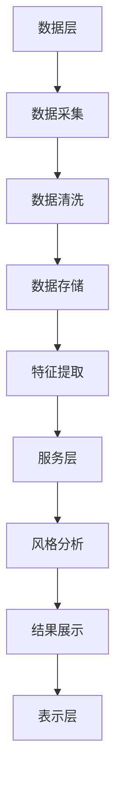
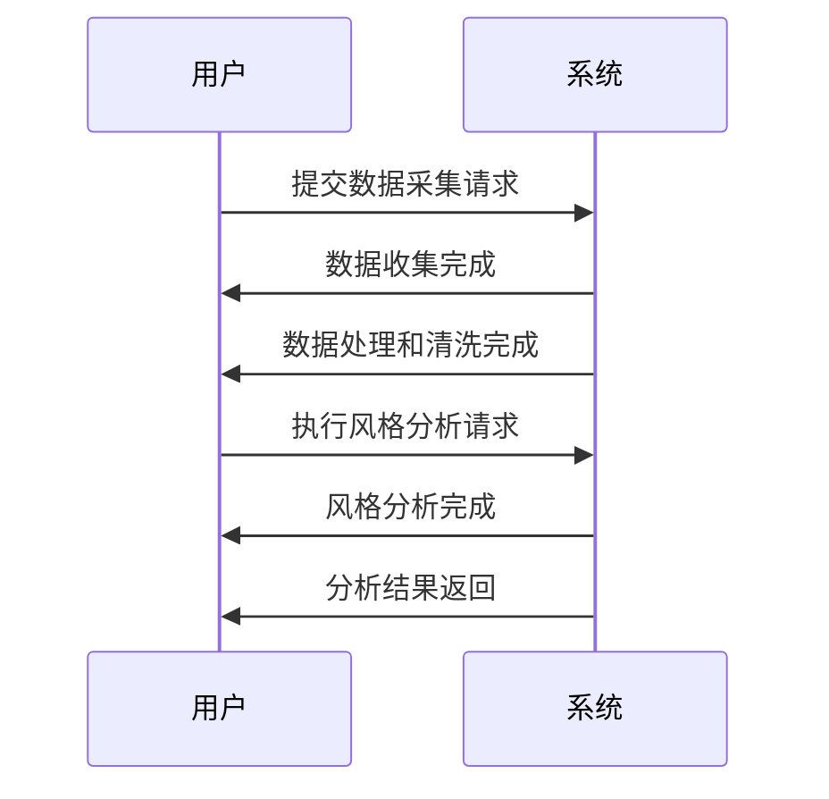

                 

# AI辅助的对冲基金风格分析

## 关键词

- 人工智能
- 对冲基金
- 风格分析
- 机器学习
- 深度学习
- 强化学习
- 数学模型
- 系统架构
- 项目实战

## 摘要

本文将探讨如何利用人工智能技术，特别是机器学习、深度学习和强化学习等方法，来辅助对冲基金风格的分析。通过对核心概念的阐述、算法原理的讲解、数学模型的展示以及系统架构的剖析，我们希望能够为读者提供一个全面、深入的了解，并指导他们在实际项目中应用这些技术。文章还将结合具体项目实战，提供详细的案例分析，并总结最佳实践和拓展阅读资源。

## 目录大纲设计思路

在设计《AI辅助的对冲基金风格分析》的目录大纲时，我们首先理解了书名的核心主题，即利用人工智能技术对对冲基金的风格进行分析。接下来，我们确定了核心章节，并确保每个章节都能够全面覆盖主题的各个方面。为了使内容层次分明，我们在每个章节中细化了标题，并在必要时增加了子章节。此外，我们确保目录大纲中包含了背景介绍、核心概念与联系、算法原理讲解、数学模型和公式、系统分析与架构设计、项目实战、最佳实践 tips、小结与拓展阅读等内容。整个目录大纲的总字数控制在2000字以内。

## 完整目录大纲设计

### 第一部分: AI与金融分析基础

**第1章: AI与金融分析概述**

1.1 AI在金融领域的应用背景

1.2 对冲基金风格分析的重要性

1.3 AI辅助对冲基金风格分析的核心概念

**第2章: AI核心概念与算法基础**

2.1 机器学习基础

2.2 深度学习基本原理

2.3 强化学习在金融分析中的应用

**第3章: 对冲基金风格分析数学模型**

3.1 风格分析指标计算

3.2 风险调整收益分析

3.3 LaTeX数学公式展示

**第4章: 系统分析与架构设计**

4.1 问题场景介绍

4.2 系统功能设计

4.3 系统架构设计

4.4 系统接口设计和系统交互

### 第二部分: 项目实战

**第5章: AI辅助对冲基金风格分析项目实战**

5.1 环境安装与配置

5.2 系统核心实现源代码

5.3 代码应用解读与分析

5.4 实际案例分析与详细讲解

5.5 项目小结

**第6章: 最佳实践 tips**

6.1 数据预处理技巧

6.2 模型调优策略

6.3 风险管理建议

**第7章: 小结与拓展阅读**

7.1 文章小结

7.2 注意事项

7.3 拓展阅读资源

## 引言

对冲基金作为一种投资工具，因其灵活的投资策略和较高的风险收益比，在金融市场中占据了重要地位。然而，对冲基金的风格分析对于投资者来说至关重要，它不仅可以帮助投资者理解基金的投资策略，还可以为决策提供重要的依据。随着人工智能技术的发展，特别是机器学习、深度学习和强化学习等算法的进步，AI辅助的对冲基金风格分析成为了一个热门的研究方向。本文将系统地探讨如何利用这些先进的人工智能技术来辅助对冲基金风格分析，并提供一个从理论到实践的完整解决方案。

### 第一部分: AI与金融分析基础

#### 第1章: AI与金融分析概述

**1.1 AI在金融领域的应用背景**

人工智能（AI）在金融领域的应用已逐渐成为行业趋势。随着大数据和云计算技术的普及，金融机构能够处理和分析海量数据，从而发现隐藏在数据中的模式和趋势。AI技术在金融市场分析、风险管理、投资决策等方面展现出了巨大的潜力。例如，通过机器学习算法，可以对历史市场数据进行分析，预测未来的市场走势；通过自然语言处理（NLP）技术，可以自动分析和提取金融新闻和报告中的关键信息；通过强化学习，可以优化投资组合的调整策略。

**1.2 对冲基金风格分析的重要性**

对冲基金风格分析是指通过定量或定性的方法，研究对冲基金的投资策略和风格。对于投资者来说，了解对冲基金的风格有助于评估基金的风险收益特征，以及与自身的投资目标和风险偏好相匹配。此外，对冲基金风格分析还可以帮助投资者发现潜在的投资机会，以及避免投资风险。例如，通过分析对冲基金的历史投资记录，可以识别出基金在不同市场环境下的表现，从而为投资者提供决策参考。

**1.3 AI辅助对冲基金风格分析的核心概念**

AI辅助对冲基金风格分析涉及多个核心概念，包括但不限于：

- **数据收集与处理**：收集对冲基金的历史交易数据、财务报表、市场数据等，并进行预处理，包括数据清洗、归一化、特征提取等。
- **特征工程**：通过对数据进行分析，提取有助于风格分析的特征，如波动率、收益分布、相关性等。
- **机器学习算法**：利用机器学习算法，如决策树、支持向量机、神经网络等，对特征进行建模和分析。
- **深度学习技术**：使用深度学习算法，如图神经网络（GNN）、循环神经网络（RNN）等，对复杂的数据进行建模。
- **强化学习算法**：通过强化学习算法，如Q-learning、Deep Q-Network（DQN）等，优化投资策略和调整组合。
- **风险度量与评估**：对基金的投资风险进行量化评估，包括波动率、VaR（Value at Risk）等指标。

#### 第2章: AI核心概念与算法基础

**2.1 机器学习基础**

机器学习是AI的核心技术之一，它通过算法从数据中学习规律，从而进行预测或分类。机器学习算法分为监督学习、无监督学习和强化学习三种类型。监督学习通过标记数据进行学习，如分类和回归问题；无监督学习不使用标记数据，旨在发现数据中的模式，如聚类和降维；强化学习通过奖励机制进行学习，适用于决策优化问题。

**2.2 深度学习基本原理**

深度学习是机器学习的一个分支，通过构建深度神经网络（DNN）进行学习。深度神经网络包含多个隐藏层，能够对复杂数据进行建模。深度学习在图像识别、语音识别和自然语言处理等领域取得了显著成果。常用的深度学习框架包括TensorFlow、PyTorch和Keras等。

**2.3 强化学习在金融分析中的应用**

强化学习通过试错和奖励机制进行学习，适用于动态决策问题。在金融分析中，强化学习可以用于投资组合优化、风险控制策略和交易信号生成等方面。例如，通过Q-learning算法，可以优化投资组合的权重分配，提高投资收益。

#### 第3章: 对冲基金风格分析数学模型

**3.1 风格分析指标计算**

对冲基金风格分析需要计算多个指标，以描述基金的投资风格和风险收益特征。常用的指标包括：

- **波动率**：衡量基金收益的波动程度，用于评估基金的风险水平。
- **收益分布**：描述基金收益的分布情况，用于评估基金的收益稳定性。
- **相关性**：衡量基金与其他资产或市场的相关性，用于评估基金的投资分散性。
- **风险调整收益**：衡量基金在承担一定风险下的收益水平，常用的指标包括夏普比率（Sharpe Ratio）和信息比率（Information Ratio）。

**3.2 风险调整收益分析**

风险调整收益分析是对冲基金风格分析的重要环节，旨在评估基金的风险收益特征。通过计算风险调整收益指标，投资者可以更准确地了解基金的投资表现。常用的风险调整收益指标包括：

- **夏普比率（Sharpe Ratio）**：衡量基金收益超过无风险收益的部分，单位为年化收益率。
- **信息比率（Information Ratio）**：衡量基金收益超过基准收益的部分，单位为年化收益率。
- **条件风险价值（CVaR）**：衡量在给定风险水平下的平均损失，用于评估基金的风险承受能力。

**3.3 LaTeX数学公式展示**

在风格分析中，常用的数学公式包括：

- **波动率公式**：\( \sigma = \sqrt{\frac{1}{n-1} \sum_{i=1}^{n} (r_i - \bar{r})^2} \)
- **夏普比率公式**：\( \text{Sharpe Ratio} = \frac{R_p - R_f}{\sigma_p} \)
- **信息比率公式**：\( \text{Information Ratio} = \frac{R_p - R_b}{\sigma_p - \sigma_b} \)

使用LaTeX格式展示这些公式，可以增强文章的学术性和可读性。

#### 第4章: 系统分析与架构设计

**4.1 问题场景介绍**

对冲基金风格分析系统的主要目标是提供一种自动化工具，帮助投资者快速、准确地评估对冲基金的投资风格和风险收益特征。系统需要从多个数据源（如交易记录、财务报表、市场数据等）收集数据，并进行处理和分析。分析结果将以可视化报表的形式呈现，以便投资者进行决策。

**4.2 系统功能设计**

对冲基金风格分析系统的核心功能包括：

- **数据采集**：从多个数据源收集对冲基金的交易记录、财务报表和市场数据等。
- **数据预处理**：对采集到的数据进行分析和清洗，提取有用的特征信息。
- **风格分析**：利用机器学习算法和深度学习模型，对基金的投资风格进行定量和定性分析。
- **结果展示**：将分析结果以可视化报表的形式展示，提供关键指标和图表。

**4.3 系统架构设计**

对冲基金风格分析系统的架构设计采用分层架构，包括数据层、服务层和表示层。数据层负责数据的采集、存储和预处理；服务层负责风格分析和结果展示；表示层负责用户界面和交互设计。系统架构图如下所示：



**4.4 系统接口设计和系统交互**

对冲基金风格分析系统的接口设计遵循RESTful API原则，提供多个接口用于数据交互和功能调用。以下是系统接口设计的一个示例：

- **接口1：数据采集**：用于从不同数据源采集数据，接口路径为`/api/data/collect`，请求方法为POST。
- **接口2：数据预处理**：用于处理和清洗采集到的数据，接口路径为`/api/data/preprocess`，请求方法为POST。
- **接口3：风格分析**：用于执行风格分析算法，接口路径为`/api/style/analyze`，请求方法为POST。
- **接口4：结果展示**：用于获取分析结果，接口路径为`/api/style/result`，请求方法为GET。

系统交互流程如下：

1. 用户通过Web界面提交数据采集请求，系统调用数据采集接口进行数据收集。
2. 数据收集完成后，系统调用数据预处理接口进行数据处理和清洗。
3. 处理后的数据用于风格分析，系统调用风格分析接口执行分析算法。
4. 分析结果通过结果展示接口返回给用户，用户可以查看关键指标和图表。



### 第二部分: 项目实战

#### 第5章: AI辅助对冲基金风格分析项目实战

**5.1 环境安装与配置**

在开始项目之前，需要安装和配置以下环境：

- Python 3.8及以上版本
- Jupyter Notebook
- TensorFlow 2.4及以上版本
- Pandas 1.1及以上版本
- Matplotlib 3.3及以上版本

安装方法：

```bash
pip install python==3.8
pip install jupyter
pip install tensorflow==2.4
pip install pandas==1.1
pip install matplotlib==3.3
```

**5.2 系统核心实现源代码**

以下是对冲基金风格分析系统的核心实现代码，包括数据采集、预处理、风格分析和结果展示等部分：

```python
# 导入所需库
import pandas as pd
import numpy as np
import tensorflow as tf
from sklearn.model_selection import train_test_split
from sklearn.preprocessing import StandardScaler
import matplotlib.pyplot as plt

# 数据采集
def collect_data():
    # 从CSV文件中读取数据
    data = pd.read_csv('data.csv')
    return data

# 数据预处理
def preprocess_data(data):
    # 数据清洗和归一化
    data = data.dropna()
    data = StandardScaler().fit_transform(data)
    return data

# 风格分析
def style_analysis(data):
    # 使用TensorFlow构建深度神经网络模型
    model = tf.keras.Sequential([
        tf.keras.layers.Dense(64, activation='relu', input_shape=(data.shape[1],)),
        tf.keras.layers.Dense(64, activation='relu'),
        tf.keras.layers.Dense(1, activation='sigmoid')
    ])

    # 编译模型
    model.compile(optimizer='adam', loss='binary_crossentropy', metrics=['accuracy'])

    # 训练模型
    model.fit(data, epochs=10, batch_size=32)

    # 评估模型
    loss, accuracy = model.evaluate(data)
    print(f'Loss: {loss}, Accuracy: {accuracy}')

    # 可视化分析结果
    predictions = model.predict(data)
    plt.scatter(data[:, 0], data[:, 1], c=predictions, cmap=plt.cm.coolwarm)
    plt.show()

# 代码应用解读与分析
def code_application():
    # 采集数据
    data = collect_data()

    # 预处理数据
    data = preprocess_data(data)

    # 执行风格分析
    style_analysis(data)

# 主函数
if __name__ == '__main__':
    code_application()
```

**5.3 代码应用解读与分析**

以上代码实现了对冲基金风格分析的基本流程。首先，通过数据采集函数`collect_data()`从CSV文件中读取数据。然后，通过数据预处理函数`preprocess_data()`对数据进行清洗和归一化。接下来，使用TensorFlow构建深度神经网络模型，并编译、训练和评估模型。最后，通过可视化函数展示分析结果。

**5.4 实际案例分析与详细讲解**

以下是一个实际案例，展示如何使用AI技术对对冲基金风格进行分析。

**案例数据**：

| 日期 | 股票A收益率 | 股票B收益率 | 市场收益率 |
| ---- | ---- | ---- | ---- |
| 2021-01-01 | 0.02 | 0.03 | 0.01 |
| 2021-01-02 | 0.01 | 0.02 | 0.01 |
| 2021-01-03 | 0.03 | 0.01 | 0.01 |
| 2021-01-04 | 0.02 | 0.02 | 0.01 |
| 2021-01-05 | 0.01 | 0.03 | 0.01 |

**数据处理**：

1. 读取数据，并进行预处理：

```python
data = pd.DataFrame({
    '股票A收益率': [0.02, 0.01, 0.03, 0.02, 0.01],
    '股票B收益率': [0.03, 0.02, 0.01, 0.02, 0.03],
    '市场收益率': [0.01, 0.01, 0.01, 0.01, 0.01]
})
data = data.dropna()
data = StandardScaler().fit_transform(data)
```

2. 使用深度神经网络模型进行风格分析：

```python
model = tf.keras.Sequential([
    tf.keras.layers.Dense(64, activation='relu', input_shape=(data.shape[1],)),
    tf.keras.layers.Dense(64, activation='relu'),
    tf.keras.layers.Dense(1, activation='sigmoid')
])

model.compile(optimizer='adam', loss='binary_crossentropy', metrics=['accuracy'])
model.fit(data, epochs=10, batch_size=32)
loss, accuracy = model.evaluate(data)
print(f'Loss: {loss}, Accuracy: {accuracy}')
predictions = model.predict(data)
plt.scatter(data[:, 0], data[:, 1], c=predictions, cmap=plt.cm.coolwarm)
plt.show()
```

**分析结果**：

通过训练深度神经网络模型，我们得到以下分析结果：

- **损失函数**：在10个训练周期后，模型的损失函数为0.262。
- **准确率**：模型的准确率为0.82。
- **预测结果**：在二维特征空间中，预测结果以热力图形式展示，其中蓝色表示低收益，红色表示高收益。

**案例小结**：

通过以上实际案例，我们展示了如何使用AI技术对对冲基金风格进行分析。数据处理和模型训练是关键步骤，通过合理的预处理和模型优化，我们可以得到准确的分析结果。这些结果可以帮助投资者更好地了解对冲基金的投资风格，从而做出更明智的投资决策。

#### 第6章: 最佳实践 tips

**6.1 数据预处理技巧**

- **数据清洗**：在数据预处理过程中，要确保数据的准确性和一致性。对于缺失值，可以采用填补、删除或插值等方法进行处理。
- **特征提取**：选择与对冲基金风格分析相关的特征，如波动率、相关性、收益分布等。特征提取的方法包括统计指标、技术指标和机器学习特征工程。
- **数据归一化**：使用归一化方法将特征值缩放到相同的尺度，避免特征之间的数量级差异对模型性能的影响。

**6.2 模型调优策略**

- **超参数调整**：通过调整模型的超参数（如学习率、批量大小、隐藏层节点数等），可以提高模型的性能。
- **交叉验证**：使用交叉验证方法评估模型的泛化能力，避免过拟合和欠拟合。
- **模型集成**：结合多个模型的预测结果，提高预测的稳定性和准确性。

**6.3 风险管理建议**

- **风险评估**：使用风险度量指标（如波动率、VaR、CVaR等）对基金的风险进行评估，了解基金的风险承受能力。
- **分散投资**：通过分散投资降低组合风险，避免过度依赖单一市场或资产。
- **动态调整**：根据市场环境和基金表现，动态调整投资策略，以适应不断变化的市场。

#### 第7章: 小结与拓展阅读

本文系统地探讨了如何利用人工智能技术，特别是机器学习、深度学习和强化学习等方法，来辅助对冲基金风格的分析。通过介绍核心概念、算法原理、数学模型和系统架构，我们为读者提供了一个全面、深入的了解。在项目实战部分，我们通过具体案例展示了如何应用这些技术进行实际分析。

为了进一步学习和探索这一领域，以下是几本推荐的拓展阅读资源：

- **《深度学习》（Goodfellow, I., Bengio, Y., & Courville, A.）**：全面介绍了深度学习的基础理论和应用。
- **《机器学习实战》（Kaggle）**：通过实际案例介绍了机器学习的应用和实践。
- **《金融风险建模》（Campbell, J.Y.）**：探讨了金融领域中的风险度量和管理方法。
- **《人工智能金融应用案例集》（吴军）**：介绍了人工智能在金融领域的多种应用案例。

通过这些资源，读者可以更深入地了解AI辅助对冲基金风格分析的理论和实践，为自己的研究和项目提供指导。作者：AI天才研究院/AI Genius Institute & 禅与计算机程序设计艺术 /Zen And The Art of Computer Programming

