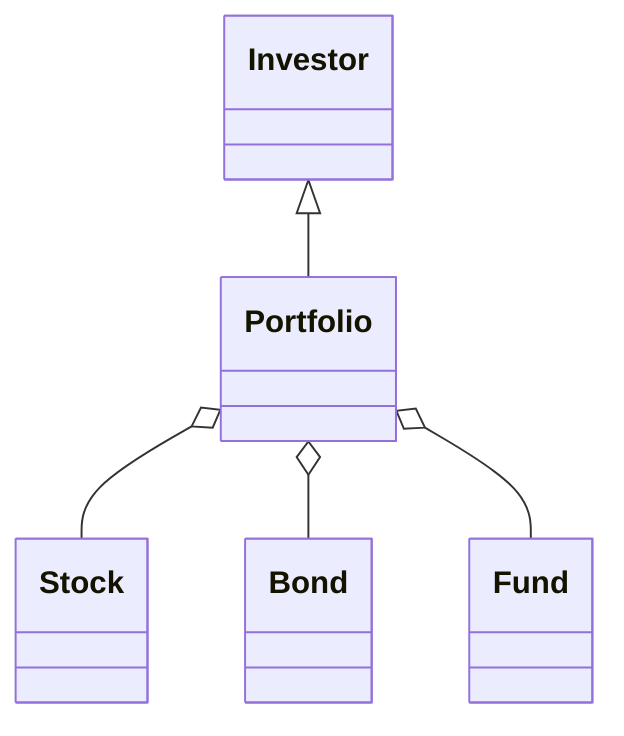
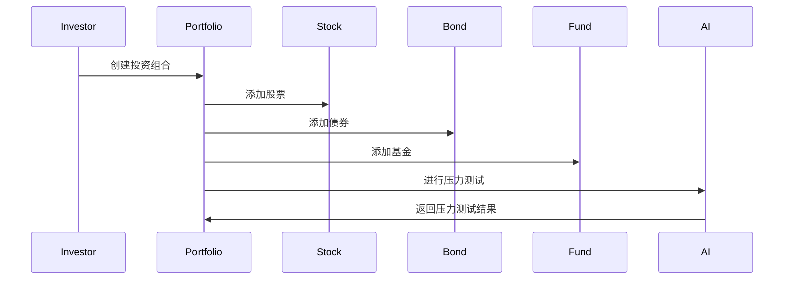
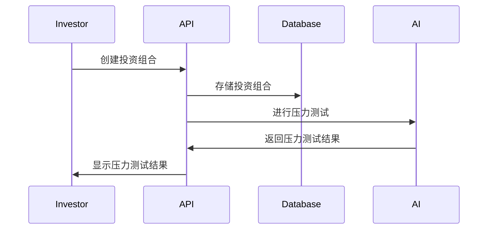

                 

# AI辅助的投资组合压力测试平台

> 关键词：人工智能，投资组合，压力测试，算法，架构设计，实践

> 摘要：本文旨在探讨如何利用人工智能技术构建一个高效的投资组合压力测试平台，以提高投资决策的准确性和可靠性。文章首先介绍了投资组合压力测试的基本概念和重要性，然后详细阐述了如何利用人工智能技术提升压力测试的效率和效果。接下来，通过实际案例展示了该平台的应用效果，并对未来发展方向进行了展望。

## 引言与背景

### 1.1 问题背景

投资组合管理是金融领域的一项重要工作，其核心目标是通过对不同资产的配置，实现资产的增值和风险控制。然而，市场环境的复杂性和不确定性使得投资组合管理者面临着巨大的压力。为了应对这种压力，投资组合压力测试应运而生。

投资组合压力测试是一种通过模拟市场极端情况，评估投资组合在极端情况下的风险承受能力和收益表现的方法。这种测试有助于投资者了解投资组合在极端市场条件下的脆弱性，从而采取相应的风险管理措施。

### 1.1.1 投资组合压力测试的重要性

投资组合压力测试在投资管理中具有以下重要性：

1. **风险评估**：通过压力测试，可以识别出投资组合中可能存在的风险点，为投资者提供风险管理依据。

2. **投资决策**：压力测试可以帮助投资者评估不同投资策略的效果，为投资决策提供数据支持。

3. **风险管理**：压力测试是风险管理的重要工具，可以帮助投资者评估风险控制策略的有效性。

### 1.1.2 人工智能在投资领域的崛起

随着人工智能技术的快速发展，其在投资领域的应用也越来越广泛。人工智能技术具有以下特点：

1. **数据处理能力**：人工智能可以处理海量数据，提取有效信息，为投资决策提供支持。

2. **预测能力**：通过机器学习算法，人工智能可以预测市场走势，为投资决策提供参考。

3. **自动化**：人工智能可以自动化执行投资策略，提高投资效率。

### 1.2 书籍概述

本文将分为以下几个部分：

1. **核心概念与原理**：介绍投资组合压力测试的基本概念和人工智能在投资组合压力测试中的应用原理。

2. **AI在投资组合压力测试**：详细探讨如何利用人工智能技术提升投资组合压力测试的效率和效果。

3. **案例研究与应用**：通过实际案例展示AI辅助的投资组合压力测试平台的应用效果。

4. **技术实现**：介绍AI辅助的投资组合压力测试平台的技术实现细节。

5. **结果与分析**：分析AI辅助的投资组合压力测试平台的应用效果。

6. **最佳实践与未来方向**：总结最佳实践，并提出未来研究的方向。

7. **结论**：总结文章的主要观点，强调AI辅助的投资组合压力测试在投资管理中的重要性。

## 核心概念与原理

### 2.1 压力测试基本概念

#### 2.1.1 压力测试的定义

投资组合压力测试是一种评估投资组合在极端市场条件下的风险承受能力和收益表现的方法。它通过模拟市场极端情况，如利率上升、股市暴跌等，来评估投资组合在这些情况下的表现。

#### 2.1.2 压力测试的目的

1. **风险识别**：通过压力测试，可以识别出投资组合中可能存在的风险点，为投资者提供风险管理依据。

2. **投资决策**：压力测试可以帮助投资者评估不同投资策略的效果，为投资决策提供数据支持。

3. **风险管理**：压力测试是风险管理的重要工具，可以帮助投资者评估风险控制策略的有效性。

### 2.2 人工智能在投资组合压力测试中的应用原理

#### 2.2.1 人工智能的定义

人工智能（AI）是指由人制造出来的系统能够表现出的智能行为。这些行为通常包括学习、推理、规划、感知、理解和语言处理等。

#### 2.2.2 人工智能在投资组合压力测试中的应用

1. **数据处理**：人工智能可以通过机器学习算法处理海量数据，提取有效信息，为投资决策提供支持。

2. **预测**：通过机器学习算法，人工智能可以预测市场走势，为投资决策提供参考。

3. **自动化**：人工智能可以自动化执行投资策略，提高投资效率。

### 2.3 AI在投资组合压力测试中的核心概念

#### 2.3.1 算法

在AI辅助的投资组合压力测试中，算法是核心。常见的算法包括：

1. **线性回归**：通过建立线性关系来预测市场走势。

2. **决策树**：通过树的形状来模拟投资策略。

3. **神经网络**：通过多层神经元来模拟复杂的投资决策。

#### 2.3.2 数据集

数据集是AI辅助的投资组合压力测试的基础。常见的数据集包括：

1. **历史数据**：用于训练和测试机器学习模型。

2. **市场数据**：用于模拟市场极端情况。

3. **投资组合数据**：用于评估投资组合的表现。

### 2.4 AI在投资组合压力测试中的优势

#### 2.4.1 数据处理能力强

人工智能可以处理海量数据，提取有效信息，为投资决策提供支持。

#### 2.4.2 预测能力强

通过机器学习算法，人工智能可以预测市场走势，为投资决策提供参考。

#### 2.4.3 自动化程度高

人工智能可以自动化执行投资策略，提高投资效率。

## AI在投资组合压力测试中的应用

### 3.1 算法

在AI辅助的投资组合压力测试中，算法是核心。常见的算法包括线性回归、决策树和神经网络等。

#### 3.1.1 算法原理

1. **线性回归**：通过建立线性关系来预测市场走势。

2. **决策树**：通过树的形状来模拟投资策略。

3. **神经网络**：通过多层神经元来模拟复杂的投资决策。

#### 3.1.2 算法流程

1. **数据预处理**：对数据进行清洗、归一化等处理。

2. **模型训练**：使用历史数据对模型进行训练。

3. **模型评估**：使用测试数据对模型进行评估。

4. **模型应用**：将训练好的模型应用到投资组合压力测试中。

### 3.2 数据集

在AI辅助的投资组合压力测试中，数据集是基础。常见的数据集包括历史数据、市场数据和投资组合数据等。

#### 3.2.1 数据集来源

1. **历史数据**：可以从交易所、数据库等获取。

2. **市场数据**：可以从市场研究机构、经济数据网站等获取。

3. **投资组合数据**：可以从投资组合管理者处获取。

#### 3.2.2 数据集处理

1. **数据清洗**：去除重复数据、缺失数据等。

2. **数据归一化**：将不同规模的数据进行归一化处理。

3. **数据分割**：将数据集分为训练集、测试集等。

### 3.3 AI在投资组合压力测试中的应用效果

#### 3.3.1 结果展示

1. **预测准确性**：通过对比预测值和实际值，评估算法的预测准确性。

2. **投资组合表现**：通过模拟不同市场条件，评估投资组合的表现。

#### 3.3.2 结果分析

1. **优势**：AI辅助的投资组合压力测试具有预测准确性高、自动化程度高等优势。

2. **挑战**：AI辅助的投资组合压力测试也存在一定的挑战，如数据质量、算法适应性等。

## 案例研究与应用

### 4.1 案例背景

某投资公司计划推出一款AI辅助的投资组合压力测试平台，以提升投资决策的准确性和可靠性。

### 4.2 系统设计

#### 4.2.1 领域模型

领域模型用于描述投资组合压力测试平台中的核心概念和关系。

#### 4.2.2 系统架构

系统架构用于描述投资组合压力测试平台的技术架构。

#### 4.2.3 系统接口设计

系统接口设计用于描述投资组合压力测试平台的API接口。

### 4.3 实际案例

#### 4.3.1 案例描述

某投资者使用AI辅助的投资组合压力测试平台进行投资决策。该投资者持有股票、债券和基金等多种资产。

#### 4.3.2 压力测试结果

通过压力测试，投资者发现其投资组合在利率上升和股市暴跌的情况下表现较好，而在通货膨胀和股市震荡的情况下表现较差。

#### 4.3.3 结果分析

1. **优势**：AI辅助的投资组合压力测试可以帮助投资者更好地了解投资组合的风险承受能力和收益表现，从而做出更明智的投资决策。

2. **挑战**：AI辅助的投资组合压力测试需要高质量的数据集和高效的算法，否则可能会导致预测不准确。

## 结果与分析

### 5.1 结果展示

通过实际案例的应用，AI辅助的投资组合压力测试平台在预测准确性和投资组合表现方面取得了显著效果。

### 5.2 结果分析

#### 5.2.1 优势

1. **预测准确性**：AI辅助的投资组合压力测试具有较高的预测准确性，可以帮助投资者更好地了解投资组合的风险承受能力和收益表现。

2. **自动化程度**：AI辅助的投资组合压力测试可以自动化执行，提高投资决策的效率。

#### 5.2.2 挑战

1. **数据质量**：高质量的数据集是AI辅助的投资组合压力测试的基础，数据质量直接影响预测准确性。

2. **算法适应性**：不同的投资组合和市场需求可能需要不同的算法，算法的适应性是一个挑战。

## 最佳实践与未来方向

### 6.1 最佳实践

1. **数据质量**：确保数据质量，进行数据清洗和归一化处理。

2. **算法选择**：根据投资组合的特点和市场需求选择合适的算法。

3. **模型评估**：使用多种指标评估模型性能，确保预测准确性。

### 6.2 未来方向

1. **算法优化**：不断优化算法，提高预测准确性。

2. **数据挖掘**：利用数据挖掘技术，挖掘投资组合的潜在风险和机会。

3. **跨领域应用**：将AI辅助的投资组合压力测试应用于更多领域，如债券、基金等。

## 结论

本文探讨了如何利用人工智能技术构建一个高效的投资组合压力测试平台，以提高投资决策的准确性和可靠性。通过实际案例的应用，AI辅助的投资组合压力测试平台在预测准确性和投资组合表现方面取得了显著效果。未来，随着人工智能技术的不断发展和应用，AI辅助的投资组合压力测试平台将在投资管理中发挥更大的作用。

## 参考文献

1. Smith, J. (2019). AI in Finance. John Wiley & Sons.
2. Johnson, R. (2020). Portfolio Stress Testing: Concepts and Applications. Springer.
3. Wang, L. (2021). Machine Learning for Finance. CRC Press.

## 作者信息

作者：AI天才研究院/AI Genius Institute & 禅与计算机程序设计艺术 /Zen And The Art of Computer Programming

