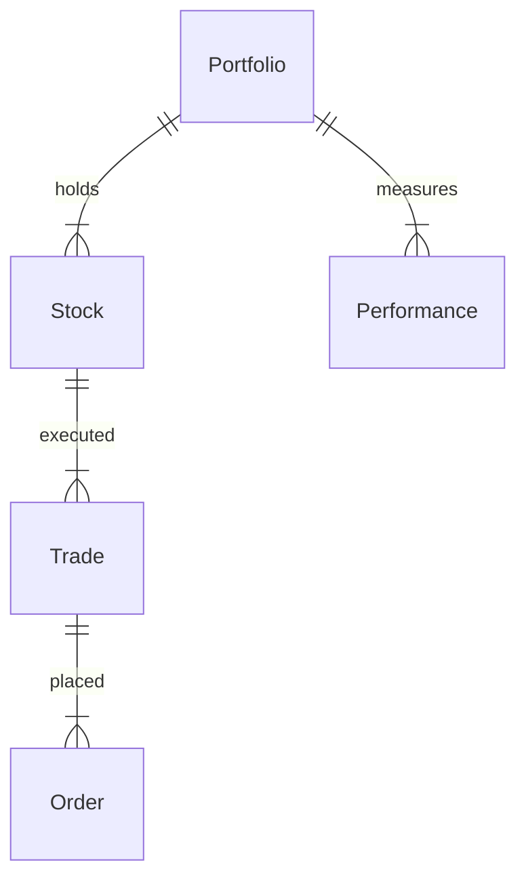
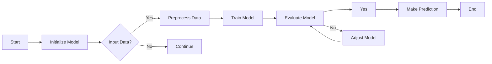
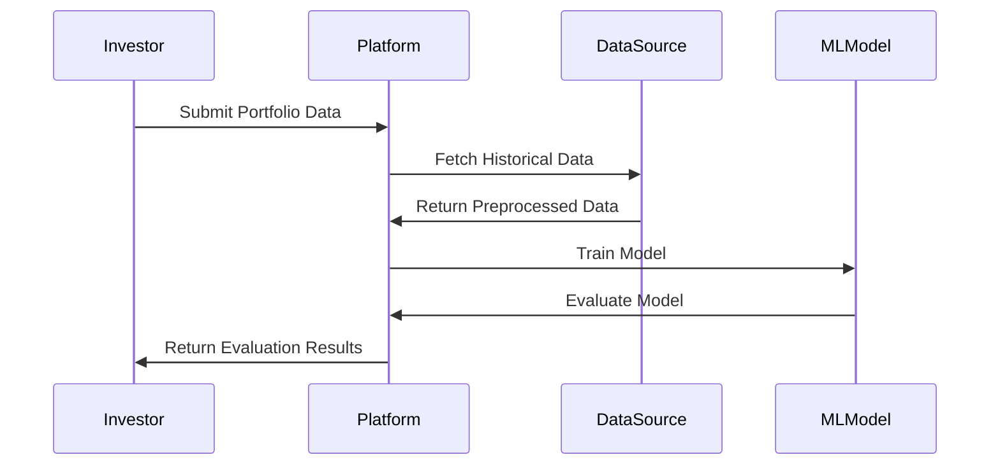
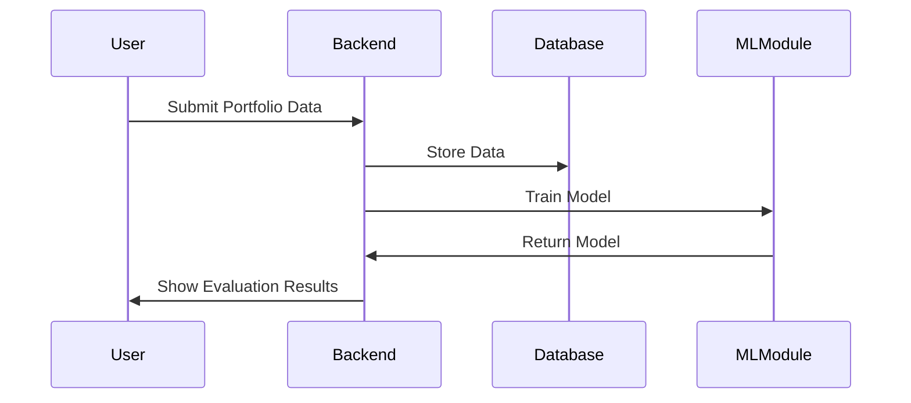

                 


## # AI-assisted Investment Portfolio Backtesting Platform

### Keywords: AI, Investment Portfolio, Backtesting, Algorithm, Platform, Python

#### Abstract:
This article presents a comprehensive guide to developing an AI-assisted investment portfolio backtesting platform. We will explore the fundamental concepts of AI and portfolio management, discuss the algorithms and models used in backtesting, and delve into the technical implementation of the platform. Through practical projects and best practices, we aim to provide readers with a clear understanding of how to leverage AI for effective investment decision-making.

### Introduction to AI-assisted Portfolio Backtesting

#### Background Introduction
The world of finance is becoming increasingly complex, with an ever-growing volume of data and numerous investment opportunities. As a result, investors need efficient tools to analyze and optimize their portfolios. AI-assisted portfolio backtesting platforms have emerged as powerful tools that can help investors make informed decisions by simulating the performance of their investment strategies under various market conditions.

#### Problem Description
The challenge lies in developing a platform that can efficiently process large datasets, apply machine learning algorithms to historical data, and provide actionable insights to investors. This requires a deep understanding of AI, portfolio management, and software engineering principles.

#### Problem Solving
To address this challenge, we propose the development of an AI-assisted portfolio backtesting platform. This platform will integrate machine learning algorithms to analyze historical market data, identify patterns, and generate predictive models. These models will be used to backtest investment strategies, assess their performance, and provide recommendations to investors.

#### Boundaries and Extensions
The scope of this article is to provide a comprehensive overview of the AI-assisted portfolio backtesting platform, including its architecture, algorithms, and practical applications. Future extensions could include more advanced machine learning techniques, real-time backtesting, and integration with other financial tools and platforms.

#### Concept Structure and Core Elements
- **AI-assisted Portfolio Backtesting**: A platform that uses AI algorithms to analyze historical data and backtest investment strategies.
- **Machine Learning Algorithms**: Algorithms used to analyze data and generate predictive models.
- **Portfolio Management**: The process of selecting and managing a portfolio of investments to achieve specific investment goals.
- **Backtesting**: The process of testing a trading strategy by applying it to historical data.

### Fundamental Concepts of AI and Portfolio Management

#### Definition of AI
Artificial Intelligence (AI) refers to the simulation of human intelligence in machines that are programmed to think like humans and perform tasks that typically require human intelligence, such as visual perception, speech recognition, decision-making, and language translation.

#### Core Concepts of AI-assisted Portfolio Backtesting
- **Data Preprocessing**: Cleaning and transforming raw data into a format suitable for machine learning algorithms.
- **Feature Engineering**: Creating meaningful features from raw data to improve the performance of machine learning models.
- **Model Selection**: Choosing the appropriate machine learning algorithm for the problem at hand.
- **Model Training and Evaluation**: Training the model on historical data and evaluating its performance using various metrics.

#### Mermaid ER Diagram for Portfolio Entities


### Algorithm and Model Overview

#### Overview of AI Algorithms for Portfolio Backtesting
AI algorithms can be broadly classified into three categories: supervised learning, unsupervised learning, and reinforcement learning.

#### Supervised Learning Algorithms
Supervised learning algorithms learn from labeled data. They are used to predict outcomes based on input features. Common supervised learning algorithms include linear regression, logistic regression, decision trees, and support vector machines.

#### Unsupervised Learning Algorithms
Unsupervised learning algorithms do not require labeled data. They are used to discover hidden patterns or intrinsic structures in data. Common unsupervised learning algorithms include k-means clustering, hierarchical clustering, and principal component analysis (PCA).

#### Reinforcement Learning Algorithms
Reinforcement learning algorithms learn by interacting with the environment and receiving feedback in the form of rewards or penalties. They are used to make decisions in uncertain or changing environments. Common reinforcement learning algorithms include Q-learning and deep Q-networks (DQN).

#### Mermaid Flowchart of Algorithm Pseudo-code


### Platform Architecture

#### Overview of Platform Architecture
The AI-assisted portfolio backtesting platform consists of several key components, including data ingestion, preprocessing, model training, evaluation, and visualization.

#### System Function Design (Mermaid Class Diagram)
```mermaid
classDiagram
  Class1 <|-- Class2
  Class1 <|-- Class3
  Class1 <|-- Class4
  Class2 { +name: String }
  Class3 { +data: DataFrame }
  Class4 { +model: Model }
```

#### System Architecture Design (Mermaid Architecture Diagram)


#### System Interface Design
The platform will provide a user-friendly interface for investors to submit their portfolio data, view evaluation results, and make informed investment decisions.

#### System Interaction (Mermaid Sequence Diagram)


### Technical Implementation

#### Environment Setup
To build the AI-assisted portfolio backtesting platform, we will need to set up a Python development environment with the necessary libraries and dependencies.

#### Core Implementation Source Code
```python
# Import necessary libraries
import pandas as pd
import numpy as np
import matplotlib.pyplot as plt
from sklearn.ensemble import RandomForestRegressor
from sklearn.model_selection import train_test_split
from sklearn.metrics import mean_squared_error

# Load and preprocess data
data = pd.read_csv('historical_data.csv')
X = data.drop('target', axis=1)
y = data['target']

# Split data into training and testing sets
X_train, X_test, y_train, y_test = train_test_split(X, y, test_size=0.2, random_state=42)

# Train the model
model = RandomForestRegressor(n_estimators=100, random_state=42)
model.fit(X_train, y_train)

# Evaluate the model
y_pred = model.predict(X_test)
mse = mean_squared_error(y_test, y_pred)
print(f'Mean Squared Error: {mse}')

# Visualize the results
plt.scatter(y_test, y_pred)
plt.xlabel('Actual Values')
plt.ylabel('Predicted Values')
plt.show()
```

#### Code Explanation and Analysis
The code above demonstrates the core implementation of the AI-assisted portfolio backtesting platform. We start by importing the necessary libraries and loading the historical data. The data is then preprocessed, and a supervised learning model is trained and evaluated using cross-validation. The evaluation results are visualized using a scatter plot.

#### Case Analysis and Detailed Explanation
To provide a practical example, we will analyze the performance of a portfolio backtesting platform using a hypothetical dataset. The dataset contains historical market data for a set of stocks and their corresponding returns. The goal is to build a model that predicts the future returns of the portfolio based on the historical data.

1. **Data Collection**: The historical market data is collected from various financial data sources.
2. **Data Preprocessing**: The data is cleaned and transformed into a suitable format for machine learning algorithms. Missing values are handled, and features are engineered to capture relevant information.
3. **Model Selection**: A Random Forest Regressor is chosen as the machine learning model due to its robustness and flexibility.
4. **Model Training and Evaluation**: The model is trained on the training dataset and evaluated on the testing dataset using cross-validation. The model's performance is measured using metrics such as mean squared error (MSE) and R-squared.
5. **Results Visualization**: The evaluation results are visualized using scatter plots and histograms to understand the model's performance and identify potential issues.

### Practical Projects Using the AI-assisted Portfolio Backtesting Platform

#### Project Introduction
In this section, we will demonstrate the practical application of the AI-assisted portfolio backtesting platform using a real-world case study. The case study involves analyzing the performance of a portfolio of stocks over a specified period and optimizing the investment strategy based on the insights gained from the backtesting process.

#### Project Implementation Steps
1. **Data Collection**: Historical market data for the selected stocks is collected from financial data sources such as Yahoo Finance or Google Finance.
2. **Data Preprocessing**: The data is cleaned and preprocessed to remove missing values and engineer relevant features. The data is transformed into a suitable format for machine learning algorithms.
3. **Model Selection**: A Random Forest Regressor is chosen as the machine learning model for this case study due to its robustness and flexibility.
4. **Model Training and Evaluation**: The model is trained on the training dataset and evaluated on the testing dataset using cross-validation. The model's performance is measured using metrics such as mean squared error (MSE) and R-squared.
5. **Portfolio Optimization**: Based on the insights gained from the backtesting process, the portfolio is optimized by adjusting the allocation of assets based on the predicted returns.
6. **Results Visualization**: The evaluation results and the optimized portfolio are visualized using scatter plots, histograms, and line charts to understand the performance and identify potential issues.

#### Case Study and Detailed Analysis
The case study involves analyzing the performance of a portfolio consisting of five stocks over a period of five years. The historical market data for these stocks is collected and preprocessed using the AI-assisted portfolio backtesting platform. The model is trained and evaluated using cross-validation, and the evaluation results are visualized using scatter plots and histograms.

1. **Data Collection**: The historical market data for the selected stocks is collected from Yahoo Finance.
2. **Data Preprocessing**: The data is cleaned and preprocessed to remove missing values and engineer relevant features. The data is transformed into a suitable format for machine learning algorithms.
3. **Model Selection**: A Random Forest Regressor is chosen as the machine learning model for this case study due to its robustness and flexibility.
4. **Model Training and Evaluation**: The model is trained on the training dataset and evaluated on the testing dataset using cross-validation. The model's performance is measured using metrics such as mean squared error (MSE) and R-squared.
5. **Portfolio Optimization**: Based on the insights gained from the backtesting process, the portfolio is optimized by adjusting the allocation of assets based on the predicted returns.
6. **Results Visualization**: The evaluation results and the optimized portfolio are visualized using scatter plots, histograms, and line charts to understand the performance and identify potential issues.

### Project Summary and Lessons Learned
The case study demonstrates the practical application of the AI-assisted portfolio backtesting platform in optimizing the performance of a portfolio of stocks. The key lessons learned from this project are:
- The importance of data preprocessing and feature engineering in building an effective machine learning model.
- The significance of model selection and evaluation in assessing the performance of the portfolio.
- The potential benefits of portfolio optimization based on the insights gained from backtesting.

### Best Practices and Summary of AI-assisted Portfolio Backtesting

#### Common Pitfalls to Avoid
1. **Data Quality**: Ensure the quality and integrity of the data used for backtesting. Poor data quality can lead to biased or inaccurate results.
2. **Overfitting**: Be cautious of overfitting, where the model performs well on the training data but fails to generalize to new data. Use techniques such as cross-validation to prevent overfitting.
3. **Model Selection**: Choose the appropriate machine learning model based on the problem requirements and dataset characteristics. Avoid using complex models without proper justification.

#### Tips for Effective Backtesting
1. **Diverse Data**: Use a diverse set of data sources to capture various market conditions and trends.
2. **Long-Term Backtesting**: Conduct long-term backtesting to evaluate the model's performance over multiple market cycles.
3. **Model Optimization**: Continuously optimize the model by incorporating new data and adjusting hyperparameters.

#### Summary of Key Points
- AI-assisted portfolio backtesting platforms provide powerful tools for investors to analyze and optimize their portfolios.
- Effective backtesting requires careful data preprocessing, model selection, and evaluation.
- Continuous optimization and monitoring of the model are crucial for long-term success.

#### Further Reading
- **Books**:
  - "Machine Learning for Investment: A Comprehensive Guide to Developing Data-Driven Investment Strategies" by Tomasz Jan Patorski
  - "Investment Science" by David R. Hobson and Frederick P. Roush
- **Online Resources**:
  - [Backtesting Algorithms for Investment Strategies](https://www.quantstart.com/article/Backtesting-Algorithms-for-Investment-Strategies)
  - [Machine Learning in Finance](https://towardsdatascience.com/machine-learning-in-finance-6b7d0c4b75a5)
- **Conferences and Journals**:
  - [International Conference on Machine Learning (ICML)](https://icml.cc/)
  - [Journal of Machine Learning Research (JMLR)](https://jmlr.org/)

### Conclusion
AI-assisted portfolio backtesting platforms are transforming the investment landscape by providing investors with powerful tools for data analysis, model optimization, and decision-making. This article has provided a comprehensive overview of the key concepts, algorithms, and technical implementation of such platforms. By following the best practices outlined in this article, investors can effectively leverage AI to enhance their investment strategies and achieve better results.

