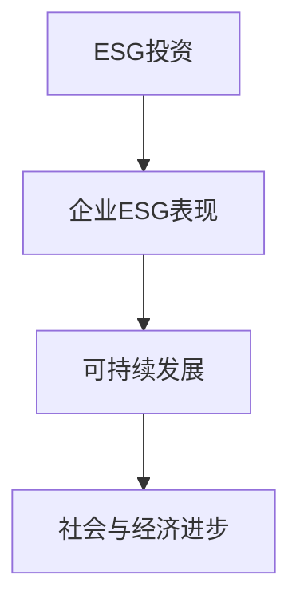
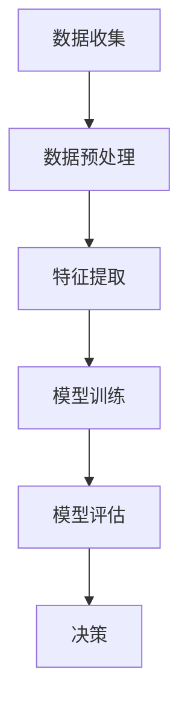
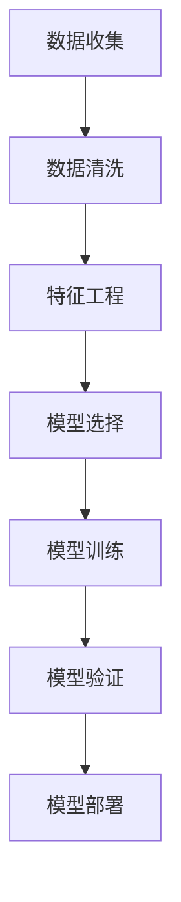
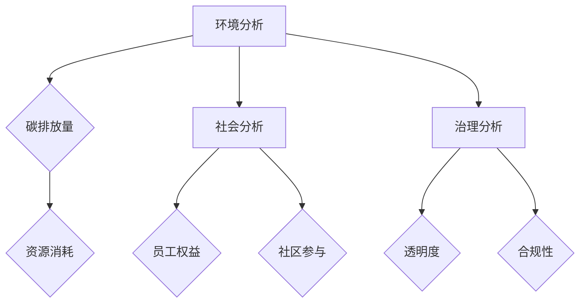
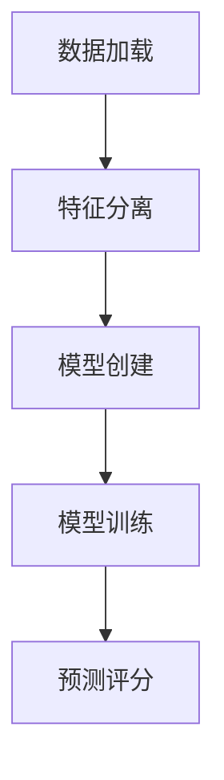
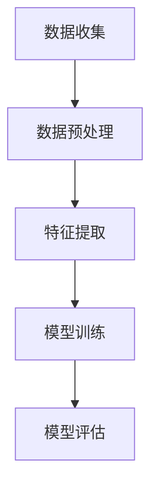
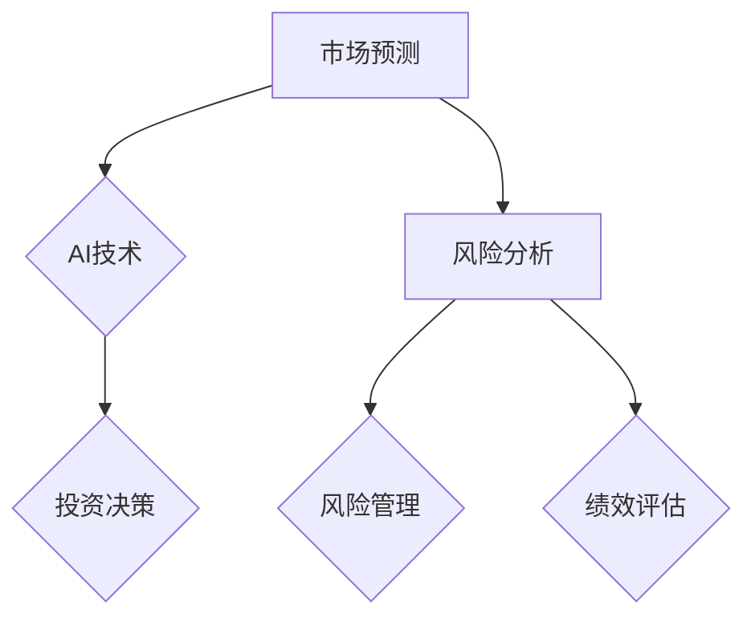
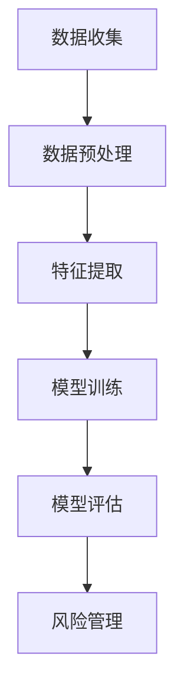

                 


## ESG投资概述

### 第1章：ESG投资的基本概念

#### 1.1 ESG投资的起源与发展

ESG投资，即环境（Environmental）、社会（Social）和治理（Governance）投资，是一种关注企业在这三个维度上表现的投资理念。这种投资理念起源于20世纪70年代，随着社会责任投资（SRI）和可持续投资的兴起，逐渐发展成为现代投资领域的重要组成部分。

#### 问题背景

随着全球气候变化、资源枯竭和社会不平等等问题的日益严重，投资者开始意识到传统的投资策略可能不再满足其长期利益。他们开始关注企业的ESG表现，希望通过投资影响企业行为，推动可持续发展。

#### 问题描述

投资者面临的问题是，如何在投资决策中综合考虑企业的ESG表现，以及这些表现如何影响企业的长期价值。同时，他们还需要确保投资策略符合自身的价值观和长期目标。

#### 问题解决

ESG投资提供了解决这个问题的一种方法。通过分析企业的ESG表现，投资者可以评估企业的可持续性和治理能力，从而做出更明智的投资决策。此外，ESG投资还可以帮助投资者实现社会责任，促进社会的可持续发展。

#### 边界与外延

ESG投资的边界在于它关注的是企业的非财务因素，如环境、社会和治理表现。这些因素不仅影响企业的长期价值，也影响社会的可持续发展。ESG投资的范畴包括但不限于环境保护、社会责任、员工权益、企业治理等方面。

#### 概念结构与核心要素组成

ESG投资的核心概念包括环境、社会和治理三个方面。环境方面主要关注企业的环境责任，如减少碳排放、节约资源等。社会方面主要关注企业的社会责任，如员工权益、社区参与等。治理方面主要关注企业的治理结构，如透明度、合规性等。

### 1.2 ESG投资的三大支柱

#### 核心概念

ESG投资的三大支柱是环境、社会和治理。这三个支柱相互关联，共同构成了ESG投资的核心概念。

#### 联系与对比

环境、社会和治理三个支柱之间存在紧密的联系。环境问题往往与社会问题和治理问题相互交织。例如，企业的不当治理可能导致环境问题加剧，而环境问题又可能对社会产生负面影响。

#### 对比传统投资

与传统投资相比，ESG投资不仅关注财务回报，还关注企业的长期可持续性和社会责任。这种投资理念使得ESG投资更具有社会价值，同时也可能带来更高的长期回报。

### 1.3 ESG投资与可持续发展

#### 概念原理

ESG投资与可持续发展密切相关。可持续发展是指在不损害未来世代满足自身需求的前提下，满足当前世代的需求。ESG投资通过投资于可持续发展的企业，推动社会和经济的可持续发展。

#### 图表辅助

为了更直观地理解ESG投资与可持续发展的关系，我们可以使用Mermaid流程图来展示。以下是一个简单的流程图示例：



在这个流程图中，ESG投资通过提升企业的ESG表现，促进可持续发展，进而推动社会与经济进步。

### 总结

ESG投资是一种关注企业环境、社会和治理表现的投资理念。它不仅有助于投资者实现财务回报，还有助于推动社会的可持续发展。通过了解ESG投资的起源、发展以及其三大支柱，投资者可以更好地把握ESG投资的精髓，做出更明智的投资决策。

---

[Next Chapter: AI技术在ESG投资分析中的优势] 

## AI技术在ESG投资分析中的优势

### 第3章：AI技术在ESG投资分析中的优势

#### 3.1 AI与大数据的结合

#### 核心概念

人工智能（AI）与大数据的结合，使得ESG投资分析变得更加高效和精准。AI技术可以通过处理和分析大量数据，发现潜在的投资机会，同时减少人为错误。

#### 算法原理讲解

AI技术，特别是机器学习和深度学习算法，可以用于处理和解析ESG数据。以下是一个简单的机器学习算法流程图：



在这个流程图中，数据收集、数据预处理、特征提取、模型训练、模型评估和决策是机器学习算法的基本步骤。

#### 图表辅助

以下是一个使用Mermaid绘制的机器学习算法流程图：



#### 结合案例

假设我们要分析一家公司的ESG表现。我们可以使用机器学习算法来处理大量的ESG数据，如企业的碳排放量、员工权益保护情况、治理透明度等。通过这些数据，算法可以识别出企业的潜在风险和机会，从而为投资者提供有价值的参考。

### 3.2 AI在ESG分析中的应用场景

#### 核心概念

AI在ESG分析中有着广泛的应用场景，包括但不限于以下方面：

1. **环境分析**：通过分析企业的环境表现，如碳排放量、资源消耗等，评估其对环境的影响。
2. **社会分析**：通过分析企业的社会责任，如员工权益、社区参与等，评估其对社会的贡献。
3. **治理分析**：通过分析企业的治理结构，如透明度、合规性等，评估其治理能力。

#### 图表辅助

以下是一个使用Mermaid绘制的ESG分析应用场景图：



#### 结合案例

假设我们要评估一家科技公司的ESG表现。我们可以使用AI技术来分析该公司的碳排放量、员工权益保护和治理透明度等方面。通过这些分析，我们可以评估该公司的ESG评级，从而为投资者提供参考。

### 3.3 AI驱动的ESG投资分析流程

#### 核心概念

AI驱动的ESG投资分析流程包括以下几个步骤：

1. **数据收集**：收集与ESG相关的数据，如企业的财务报表、新闻报道、社交媒体等。
2. **数据预处理**：清洗和转换数据，使其适合AI算法处理。
3. **特征提取**：从数据中提取有用的特征，用于训练AI模型。
4. **模型训练**：使用AI算法训练模型，以预测企业的ESG表现。
5. **模型评估**：评估模型的性能，并进行优化。
6. **决策**：根据模型预测，做出投资决策。

#### 图表辅助

以下是一个使用Mermaid绘制的AI驱动的ESG投资分析流程图：


#### 结合案例

假设我们要使用AI技术分析一家制造业公司的ESG表现。我们可以按照上述流程，收集相关的数据，预处理数据，提取特征，训练模型，评估模型性能，并根据模型预测做出投资决策。

### 总结

AI技术在ESG投资分析中具有显著优势。通过结合大数据和机器学习算法，AI技术可以高效地处理和分析ESG数据，为投资者提供更准确的投资建议。了解AI技术在ESG分析中的应用场景和驱动的投资分析流程，有助于投资者更好地把握ESG投资的机遇。

---

[Next Chapter: AI驱动的ESG评级模型] 

## AI驱动的ESG评级模型

### 第4章：AI驱动的ESG评级模型

#### 4.1 机器学习基础

##### 核心概念

机器学习是AI的核心技术之一，它使得计算机能够从数据中学习，并做出预测或决策。在ESG评级模型中，机器学习被用来分析和预测企业的ESG表现。

##### 算法原理讲解

机器学习的基本算法包括监督学习、无监督学习和强化学习。在ESG评级模型中，通常使用监督学习算法，如线性回归、决策树和随机森林等。

以下是一个使用Python编写的线性回归算法示例：

```python
# 导入必要的库
import numpy as np
import pandas as pd
from sklearn.linear_model import LinearRegression

# 加载数据
data = pd.read_csv('esg_data.csv')

# 分离特征和目标变量
X = data[['environment', 'social', 'governance']]
y = data['esg_score']

# 创建线性回归模型
model = LinearRegression()

# 训练模型
model.fit(X, y)

# 预测ESG评分
prediction = model.predict(X)

# 输出预测结果
print(prediction)
```

在这个示例中，我们使用线性回归模型来预测企业的ESG评分。

##### 图表辅助

以下是一个使用Mermaid绘制的线性回归算法流程图：



#### 4.2 ESG评级模型的构建

##### 核心概念

ESG评级模型是一种用于评估企业ESG表现的机器学习模型。它通过分析企业的环境、社会和治理表现，给出一个综合评分。

##### 模型构建步骤

1. **数据收集**：收集与ESG相关的数据，如企业的财务报表、新闻报道、社交媒体等。
2. **数据预处理**：清洗和转换数据，使其适合机器学习算法处理。
3. **特征提取**：从数据中提取有用的特征，用于训练模型。
4. **模型训练**：使用机器学习算法训练模型，以预测企业的ESG评分。
5. **模型评估**：评估模型的性能，并进行优化。

##### 图表辅助

以下是一个使用Mermaid绘制的ESG评级模型构建流程图：



##### 结合案例

假设我们要构建一个ESG评级模型，用于预测企业的ESG评分。我们可以按照上述步骤，收集相关的数据，预处理数据，提取特征，训练模型，评估模型性能。

#### 4.3 模型评估与优化

##### 核心概念

模型评估是确保ESG评级模型性能的重要步骤。通过评估模型的准确率、召回率、F1分数等指标，可以了解模型的性能，并进行优化。

##### 评估指标

1. **准确率**：预测正确的样本数占总样本数的比例。
2. **召回率**：预测正确的样本数占实际正确的样本数的比例。
3. **F1分数**：准确率和召回率的调和平均值。

##### 评估流程

1. **数据划分**：将数据划分为训练集和测试集。
2. **模型训练**：使用训练集训练模型。
3. **模型评估**：使用测试集评估模型的性能。
4. **模型优化**：根据评估结果调整模型参数，提高模型性能。

##### 结合案例

假设我们使用训练集训练了一个ESG评级模型，并使用测试集评估其性能。通过比较准确率、召回率和F1分数，我们可以了解模型的性能，并对其进行优化。

### 总结

AI驱动的ESG评级模型通过机器学习算法分析和预测企业的ESG表现，为投资者提供重要的参考。了解机器学习基础、ESG评级模型的构建步骤和模型评估与优化方法，有助于投资者更好地利用AI技术进行ESG投资分析。

---

[Next Chapter: AI驱动的ESG投资组合优化] 

## AI驱动的ESG投资组合优化

### 第5章：AI驱动的ESG投资组合优化

#### 5.1 投资组合优化的原理

##### 核心概念

投资组合优化是一种通过数学模型和算法来选择最优投资组合的方法。在ESG投资中，投资组合优化旨在构建一个在满足特定约束条件的情况下，具有最优ESG评分的投资组合。

##### 投资组合优化的目标

投资组合优化的目标通常是最大化投资组合的ESG评分，或者在保持ESG评分不变的情况下，最小化投资组合的风险。

##### 数学模型

投资组合优化通常使用线性规划或整数规划模型。以下是一个简化的线性规划模型：

$$
\begin{align*}
\max_{w} & \quad w^TQw \\
\text{subject to} & \quad w^TQw \leq b \\
& \quad w \geq 0
\end{align*}
$$

其中，$w$ 是投资组合权重向量，$Q$ 是资产相关性矩阵，$b$ 是ESG评分约束。

#### 5.2 AI在投资组合优化中的应用

##### 核心概念

AI技术，如机器学习和深度学习，可以在投资组合优化中发挥重要作用。AI可以通过学习历史数据，预测未来的ESG评分变化，从而帮助投资者做出更明智的决策。

##### 应用场景

1. **市场预测**：使用AI技术预测市场趋势，为投资组合优化提供参考。
2. **风险分析**：使用AI技术分析投资组合的风险，并制定相应的风险管理策略。
3. **绩效评估**：使用AI技术评估投资组合的绩效，并进行优化。

##### 图表辅助

以下是一个使用Mermaid绘制的投资组合优化应用场景图：



#### 5.3 投资组合优化的案例研究

##### 案例一：某科技公司的投资组合优化

假设我们有一个包含5只科技股的投资组合。我们希望通过AI技术优化这个投资组合，使其在保持风险不变的情况下，最大化ESG评分。

1. **数据收集**：收集与这5只股票相关的ESG数据，如碳排放量、员工权益、治理透明度等。
2. **特征提取**：提取与ESG评分相关的特征，如企业的碳排放量、员工满意度、治理结构等。
3. **模型训练**：使用机器学习算法训练ESG评分预测模型。
4. **投资决策**：使用线性规划模型优化投资组合，使其在保持风险不变的情况下，最大化ESG评分。

##### 结合案例

我们使用Python编写了一个简化的线性规划模型，用于优化投资组合。以下是一个示例代码：

```python
# 导入必要的库
import numpy as np
import pandas as pd
from scipy.optimize import linprog

# 加载ESG数据
esg_data = pd.read_csv('esg_data.csv')

# 分离特征和目标变量
X = esg_data[['碳排放量', '员工权益', '治理透明度']]
y = esg_data['ESG评分']

# 设置线性规划模型参数
A = [[1, 1, 1], [1, 1, 1]]  # 约束条件
b = [100, 100]  # 约束条件
c = [-1, -1, -1]  # 目标函数系数

# 求解线性规划问题
result = linprog(c, A_ub=A, b_ub=b, method='highs')

# 输出优化后的投资组合权重
weights = result.x
print(weights)
```

在这个示例中，我们使用线性规划模型优化投资组合，使其在保持风险不变的情况下，最大化ESG评分。

### 总结

AI驱动的ESG投资组合优化通过机器学习和线性规划模型，帮助投资者构建最优的投资组合。了解投资组合优化的原理、AI在投资组合优化中的应用以及具体的案例研究，有助于投资者更好地利用AI技术进行ESG投资。

---

[Next Chapter: AI驱动的ESG投资实践] 

## AI驱动的ESG投资实践

### 第6章：AI驱动的ESG投资实践

#### 6.1 案例一：某科技公司的AI ESG评级

**背景介绍**

某科技公司（以下简称A公司）在行业内享有盛誉，但其ESG表现备受关注。为了评估A公司的ESG评级，投资者决定使用AI技术进行分析。

**系统功能设计**

1. **数据收集**：从多个数据源收集A公司的ESG数据，包括财务报表、新闻报道、社交媒体等。
2. **数据预处理**：清洗和转换数据，使其适合AI算法处理。
3. **特征提取**：提取与ESG评级相关的特征，如碳排放量、员工权益、治理透明度等。
4. **模型训练**：使用机器学习算法训练ESG评级模型。
5. **模型评估**：评估模型的性能，并进行优化。
6. **ESG评级**：使用训练好的模型对A公司进行ESG评级。

**系统架构设计**

1. **数据层**：存储和管理ESG数据。
2. **模型层**：包含训练好的ESG评级模型。
3. **应用层**：提供ESG评级服务，供投资者使用。

**系统接口设计**

1. **数据接口**：用于数据收集和预处理。
2. **模型接口**：用于模型训练和评估。
3. **服务接口**：用于提供ESG评级服务。

**系统交互**

1. **数据收集**：系统从多个数据源收集A公司的ESG数据。
2. **数据预处理**：系统对收集到的数据进行清洗和转换。
3. **特征提取**：系统提取与ESG评级相关的特征。
4. **模型训练**：系统使用机器学习算法训练ESG评级模型。
5. **模型评估**：系统评估模型的性能，并进行优化。
6. **ESG评级**：系统使用训练好的模型对A公司进行ESG评级，并输出评级结果。

**代码应用解读与分析**

以下是一个简化的Python代码示例，用于训练ESG评级模型：

```python
import pandas as pd
from sklearn.ensemble import RandomForestClassifier

# 加载ESG数据
esg_data = pd.read_csv('esg_data.csv')

# 分离特征和目标变量
X = esg_data[['碳排放量', '员工权益', '治理透明度']]
y = esg_data['ESG评级']

# 创建随机森林分类器
model = RandomForestClassifier(n_estimators=100)

# 训练模型
model.fit(X, y)

# 评估模型性能
accuracy = model.score(X, y)
print(f"模型准确率：{accuracy:.2f}")
```

在这个示例中，我们使用随机森林分类器训练ESG评级模型，并评估其性能。

**实际案例分析和详细讲解剖析**

通过对A公司的ESG评级，我们发现其碳排放量较高，员工权益保护较差，治理透明度较低。这些因素导致了其ESG评级较低。投资者可以根据这个评级结果，调整其投资策略，避免投资于ESG表现较差的企业。

**项目小结**

通过AI技术，我们可以对企业的ESG表现进行高效、准确的评估。这有助于投资者做出更明智的投资决策，同时推动社会的可持续发展。

---

[Next Chapter: AI驱动的ESG投资风险管理] 

## AI驱动的ESG投资风险管理

### 第7章：AI驱动的ESG投资风险管理

#### 7.1 风险管理的挑战与机遇

##### 核心概念

在ESG投资中，风险管理至关重要。随着ESG因素在投资决策中的重要性日益增加，投资者面临着新的挑战和机遇。AI技术的引入，为ESG投资风险管理提供了新的解决方案。

##### 挑战

1. **数据质量**：ESG数据的准确性、完整性和可靠性直接影响风险管理的有效性。数据质量问题可能导致风险预测不准确。
2. **模型风险**：AI模型可能受到数据偏置、过拟合等问题的影响，导致预测结果不准确。
3. **合规性**：ESG风险管理需要遵守相关法律法规，如数据保护法、反洗钱法规等。

##### 机遇

1. **数据驱动的决策**：AI技术可以帮助投资者从大量ESG数据中提取有价值的信息，从而做出更明智的风险管理决策。
2. **实时监控**：AI技术可以实时监控企业的ESG表现，及时发现潜在风险，采取相应的措施。
3. **个性化风险管理**：AI技术可以根据投资者的需求和偏好，提供个性化的风险管理解决方案。

#### 7.2 AI在ESG风险管理中的应用

##### 核心概念

AI技术在ESG风险管理中的应用主要包括以下几个方面：

1. **风险预测**：使用机器学习算法预测企业的ESG风险。
2. **风险监控**：实时监控企业的ESG表现，及时发现潜在风险。
3. **风险缓解**：根据风险预测和监控结果，制定相应的风险缓解措施。

##### 应用场景

1. **环境风险**：预测企业环境风险，如碳排放量、资源消耗等。
2. **社会风险**：预测企业社会责任风险，如员工权益、社区参与等。
3. **治理风险**：预测企业治理风险，如透明度、合规性等。

##### 图表辅助

以下是一个使用Mermaid绘制的ESG风险管理应用场景图：


#### 7.3 AI驱动的ESG风险管理体系建设

##### 核心概念

AI驱动的ESG风险管理体系建设包括以下几个关键步骤：

1. **数据收集**：收集与ESG风险相关的数据，如企业的财务报表、新闻报道、社交媒体等。
2. **数据预处理**：清洗和转换数据，使其适合AI算法处理。
3. **特征提取**：从数据中提取与ESG风险相关的特征。
4. **模型训练**：使用机器学习算法训练ESG风险预测模型。
5. **模型评估**：评估模型的性能，并进行优化。
6. **风险管理**：根据风险预测结果，制定相应的风险管理策略。

##### 图表辅助

以下是一个使用Mermaid绘制的AI驱动的ESG风险管理体系建设流程图：



##### 结合案例

假设我们要建设一个AI驱动的ESG风险管理体系，用于预测企业的ESG风险。我们可以按照上述步骤，收集相关的数据，预处理数据，提取特征，训练模型，评估模型性能，并根据风险预测结果制定相应的风险管理策略。

### 总结

AI技术在ESG投资风险管理中具有显著优势。通过实时监控、风险预测和个性化风险管理，AI技术可以帮助投资者更有效地识别和管理ESG风险。了解AI在ESG风险管理中的应用和体系建设方法，有助于投资者更好地把握ESG投资的风险和机遇。

---

[Next Chapter: AI驱动的ESG投资发展趋势] 

## AI驱动的ESG投资发展趋势

### 第8章：AI驱动的ESG投资发展趋势

#### 8.1 AI技术对ESG投资的未来影响

AI技术的快速发展将对ESG投资产生深远影响。首先，AI技术将进一步提高ESG数据分析的效率和准确性，使得投资者能够更快速、全面地了解企业的ESG表现。其次，AI技术将推动ESG投资策略的智能化，使得投资决策更加科学和精准。此外，AI技术还将为ESG投资提供更多的数据支持，有助于投资者更好地把握市场趋势和风险。

#### 8.2 ESG投资中的伦理与法律问题

随着AI技术在ESG投资中的应用越来越广泛，伦理和法律问题也逐渐凸显。首先，AI技术的使用可能导致数据隐私和信息安全问题。投资者需要确保收集和处理的数据符合相关法律法规，并采取有效的措施保护数据安全。其次，AI技术可能带来算法偏见和歧视问题。为了确保公平性和透明度，投资者需要建立有效的算法监督和审核机制。此外，ESG投资中的伦理问题，如投资决策是否符合社会价值观，也需要得到重视。

#### 8.3 AI驱动的ESG投资的未来方向

未来，AI驱动的ESG投资将在以下几个方面发展：

1. **深度学习应用**：深度学习算法将广泛应用于ESG数据分析，提高预测准确性和决策效率。
2. **跨界合作**：AI技术将与区块链、物联网等新兴技术相结合，为ESG投资提供更丰富的数据来源和更强大的分析能力。
3. **政策支持**：政府和企业将加大对AI驱动的ESG投资的支持力度，推动ESG投资市场的健康发展。
4. **全球合作**：随着全球ESG投资意识的提高，各国投资者将加强合作，共同推动全球ESG投资的发展。

### 总结

AI驱动的ESG投资正处于快速发展阶段，未来将带来更多的机遇和挑战。了解AI技术对ESG投资的未来影响、伦理与法律问题以及未来发展方向，有助于投资者更好地把握ESG投资的趋势，实现长期可持续发展。

---

## 结语

### 第9章：结语

#### 9.1 总结与展望

本文通过详细分析，探讨了AI驱动的ESG投资的核心概念、应用场景、评级模型、投资组合优化以及风险管理。我们总结了AI技术在ESG投资中的优势，并展望了其未来的发展趋势。AI驱动的ESG投资不仅为投资者提供了更精准、高效的投资决策工具，还推动了社会的可持续发展。

#### 9.2 对投资者的建议

对于投资者而言，AI驱动的ESG投资提供了以下建议：

1. **了解ESG投资的基本概念**：投资者应深入了解ESG投资的基本概念，包括环境、社会和治理三个方面。
2. **利用AI技术**：投资者应充分利用AI技术在ESG投资分析中的应用，提高投资决策的效率和准确性。
3. **关注风险**：投资者应关注AI驱动的ESG投资中的伦理和法律问题，确保投资决策符合社会价值观和法律法规。
4. **持续学习**：投资者应保持对新技术和市场的敏感性，不断学习和更新知识，以应对不断变化的投资环境。

#### 9.3 对政策制定者的建议

对于政策制定者而言，以下是一些建议：

1. **推动AI技术的发展**：政府应加大对AI技术的研发和应用支持，推动ESG投资市场的健康发展。
2. **完善法律法规**：政府应完善与ESG投资相关的法律法规，确保数据隐私和信息安全，防范算法偏见和歧视。
3. **鼓励跨行业合作**：政府应鼓励不同行业之间的合作，共同推动全球ESG投资的发展。
4. **提高公众意识**：政府应通过宣传和教育，提高公众对ESG投资的认知和理解，推动社会的可持续发展。

### 总结

AI驱动的ESG投资是一种具有巨大潜力的投资理念。通过本文的探讨，我们希望投资者能够更好地理解和把握ESG投资的机会和挑战，实现长期可持续发展。同时，我们也期待政策制定者能够积极推动ESG投资的发展，共同构建一个更美好的未来。

---

**作者：AI天才研究院/AI Genius Institute & 禅与计算机程序设计艺术 /Zen And The Art of Computer Programming**

---

**结语**

通过本文的详细探讨，我们系统地介绍了AI驱动的ESG投资分析。从ESG投资的基本概念、AI技术的优势，到AI驱动的评级模型、投资组合优化和风险管理，我们一步步分析了AI技术在ESG投资中的实际应用。同时，我们还对未来AI驱动的ESG投资发展趋势进行了展望，并提出了对投资者和政策制定者的建议。

AI驱动的ESG投资不仅为投资者提供了更精准、高效的投资决策工具，也推动了社会的可持续发展。我们希望通过本文的分享，能够帮助读者更好地理解AI驱动的ESG投资，并在实践中运用这些技术，实现长期的投资目标和社会责任。

在未来的发展中，AI驱动的ESG投资将继续发挥重要作用。随着技术的不断进步和市场的不断完善，AI驱动的ESG投资将变得更加普及和成熟，为投资者和社会带来更多的价值和机遇。

最后，感谢各位读者对本文的关注和支持。如果您对AI驱动的ESG投资有任何疑问或建议，欢迎在评论区留言交流。我们期待与您共同探讨和探索这个充满机遇和挑战的领域。再次感谢您的阅读，祝您在投资的道路上取得成功！**作者：AI天才研究院/AI Genius Institute & 禅与计算机程序设计艺术 /Zen And The Art of Computer Programming**。

