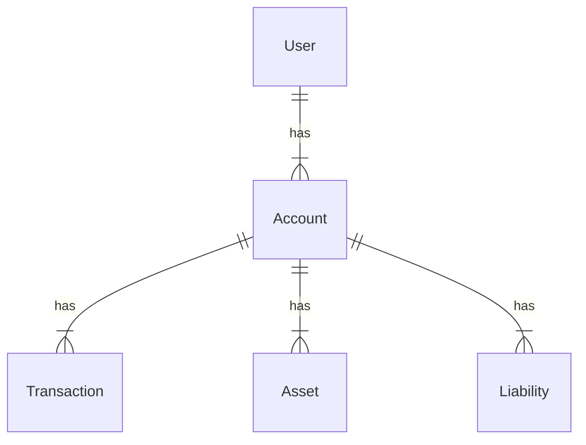
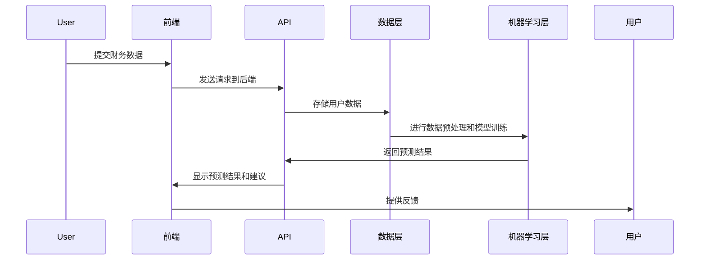

                 

### 文章标题

《AI驱动的个人财务健康评估系统设计》

### 关键词

AI、个人财务健康评估、系统设计、算法原理、数学模型、系统架构

### 摘要

本文旨在系统性地探讨如何利用人工智能技术设计一个个人财务健康评估系统。我们将从背景介绍、核心概念与联系、算法原理讲解、数学模型和数学公式、系统分析与架构设计方案、项目实战以及最佳实践和总结等多个方面展开讨论。通过本文的详细分析，读者将能够全面了解AI在个人财务健康评估中的应用，掌握设计此类系统的关键步骤和方法，为实际项目开发提供有力的理论支持和实践指导。

### 目录

1. **引言**  
    1.1 问题背景  
    1.2 AI在财务健康评估中的应用  
    1.3 个人财务健康评估的重要性

2. **核心概念与联系**  
    2.1 财务健康评估的基础概念  
    2.2 AI相关技术概述  
    2.3 个人财务健康评估的ER模型

3. **AI算法原理讲解**  
    3.1 数据预处理与特征提取  
    3.2 常见机器学习算法  
    3.3 深度学习模型在财务评估中的应用

4. **数学模型和数学公式**  
    4.1 数学模型的基本概念  
    4.2 财务健康评估的数学公式  
    4.3 数学公式详解与举例

5. **系统分析与架构设计**  
    5.1 问题场景介绍  
    5.2 系统功能设计  
    5.3 系统架构设计  
    5.4 系统接口设计与交互

6. **项目实战**  
    6.1 环境安装与配置  
    6.2 系统核心实现  
    6.3 代码应用解读  
    6.4 实际案例分析

7. **最佳实践与总结**  
    7.1 最佳实践 tips  
    7.2 项目小结  
    7.3 注意事项  
    7.4 拓展阅读

### 引言

#### 1.1 问题背景

在现代社会，随着金融市场的日益复杂化，个人财务管理成为了一个重要的课题。对于大多数人来说，确保财务健康是一个长期而持续的过程。然而，许多人在管理个人财务时面临诸多挑战，如收入不稳定、支出管理不当、投资决策困惑等。这些问题的存在不仅影响了个人生活质量，也可能导致严重的财务风险。

传统的个人财务评估方法主要依赖于经验判断和手动计算，其效率低下，且难以应对大数据环境下的海量信息处理需求。随着人工智能技术的快速发展，利用AI技术进行个人财务健康评估逐渐成为一种趋势。AI能够通过学习海量数据，识别出潜在的风险和机会，从而为个人提供更为精准的财务评估和建议。

#### 1.2 AI在财务健康评估中的应用

人工智能技术在个人财务健康评估中的应用主要体现在以下几个方面：

- **数据挖掘与分析**：AI技术可以高效地处理和分析大量财务数据，识别出潜在的模式和趋势，帮助用户更好地了解自己的财务状况。

- **风险预测与控制**：通过机器学习算法，AI可以预测个人财务状况的未来走向，提前识别潜在的风险，并给出相应的控制措施。

- **个性化财务建议**：AI可以根据用户的财务状况、风险偏好和目标，提供个性化的投资建议和理财规划。

- **自动化财务管理**：AI技术可以自动化处理一些常规的财务操作，如账单支付、投资组合调整等，提高管理效率。

#### 1.3 个人财务健康评估的重要性

个人财务健康评估不仅仅是为了满足合规要求或实现某种财务目标，更是为了帮助个人实现财务自由、提高生活质量。具体来说，个人财务健康评估的重要性体现在以下几个方面：

- **提高财务规划效率**：通过AI技术，个人可以更快速、准确地了解自己的财务状况，制定出更为科学的财务规划。

- **降低财务风险**：AI技术可以帮助用户识别潜在的财务风险，并提前采取措施进行规避，降低财务风险。

- **优化投资决策**：AI可以通过对大量历史数据的学习和分析，为用户推荐最优的投资策略，提高投资收益。

- **提升生活质量**：良好的财务状况能够为个人提供更多的经济保障，从而提升生活质量。

### 核心概念与联系

在深入了解AI驱动的个人财务健康评估系统设计之前，我们需要首先明确一些核心概念和它们之间的联系。

#### 2.1 财务健康评估的基础概念

- **财务状况**：指个人的资产、负债、收入和支出等财务信息的综合表现。财务状况是评估个人财务健康的重要依据。

- **财务指标**：用于衡量财务状况的量化指标，如资产负债率、流动比率、净资产收益率等。这些指标能够帮助用户快速了解自己的财务健康状况。

- **财务目标**：个人在财务管理中期望达到的具体目标，如增加储蓄、减少债务、实现投资回报等。财务目标是指导财务规划的重要依据。

- **风险偏好**：个人在财务管理中对风险的态度和承受能力。不同的风险偏好会影响财务规划的方式和投资策略。

#### 2.2 AI相关技术概述

- **机器学习**：一种通过数据和算法来学习并改善性能的技术。在财务健康评估中，机器学习可以帮助我们识别财务模式、预测未来趋势等。

- **深度学习**：一种基于人工神经网络的机器学习技术，能够处理复杂的数据并提取特征。深度学习在图像识别、自然语言处理等领域有广泛应用，也逐渐应用于财务健康评估。

- **数据挖掘**：从大量数据中提取有价值信息的过程。在财务健康评估中，数据挖掘可以帮助我们分析财务数据，识别潜在风险和机会。

- **自然语言处理**：使计算机能够理解、生成和处理人类语言的技术。在财务健康评估中，自然语言处理可以帮助我们分析财务报告、理解用户需求等。

#### 2.3 个人财务健康评估的ER模型

实体关系图（Entity-Relationship Diagram，ER模型）是一种用于描述实体及其相互关系的图形化工具。在个人财务健康评估系统中，ER模型可以帮助我们清晰地定义系统的核心实体及其关系。

- **实体**：指系统中的核心对象，如用户、账户、资产、负债、交易等。

- **属性**：指实体的特征，如用户ID、账户余额、资产类型、负债金额等。

- **关系**：指实体之间的相互作用，如用户拥有账户、账户包含交易等。

一个简单的ER模型可能包含以下实体和关系：



在这个ER模型中，`User` 是核心实体，表示系统的用户。`Account`、`Transaction`、`Asset` 和 `Liability` 是相关的实体，分别表示用户的账户、账户的交易、账户的资产和账户的负债。这些实体之间的关系反映了个人财务健康评估系统中的核心数据结构和功能。

通过明确这些核心概念和联系，我们为后续的算法原理讲解、数学模型和公式、系统分析与架构设计等提供了坚实的基础。

### AI算法原理讲解

#### 3.1 数据预处理与特征提取

在AI驱动的个人财务健康评估系统中，数据预处理和特征提取是两个关键步骤。数据预处理主要是为了将原始数据转化为适合机器学习模型训练的格式，而特征提取则是为了从原始数据中提取出能够有效反映财务状况的特征。

**数据预处理**

数据预处理通常包括以下几个步骤：

1. **数据清洗**：去除数据中的噪声和错误，如缺失值填充、异常值处理等。
2. **数据转换**：将不同类型的数据进行统一转换，如将文本数据编码为数值、将时间序列数据进行归一化处理等。
3. **数据归一化**：通过缩放数据，使其具有相同的尺度，以便于模型训练。

**特征提取**

特征提取的目标是从原始数据中提取出对模型训练最有用的信息。在个人财务健康评估中，特征提取可以包括以下内容：

1. **财务指标**：如资产负债率、流动比率、净资产收益率等，这些指标能够直接反映财务状况。
2. **时间序列特征**：如过去一年的收入、支出、投资回报等，这些特征可以帮助模型理解财务趋势。
3. **用户行为特征**：如账户余额波动情况、交易频率等，这些特征可以帮助模型理解用户的财务行为。

#### 3.2 常见机器学习算法

在个人财务健康评估中，常见的机器学习算法包括线性回归、决策树、支持向量机（SVM）、神经网络等。这些算法各有特点，适用于不同的场景。

1. **线性回归**：线性回归是一种简单的统计方法，通过建立自变量和因变量之间的线性关系来预测财务指标。线性回归适用于特征较少、数据较为简单的场景。

```python
from sklearn.linear_model import LinearRegression
model = LinearRegression()
model.fit(X_train, y_train)
predictions = model.predict(X_test)
```

2. **决策树**：决策树通过一系列规则来划分数据集，并根据这些规则进行预测。决策树适用于特征较多、数据复杂的场景，但其容易过拟合。

```python
from sklearn.tree import DecisionTreeRegressor
model = DecisionTreeRegressor()
model.fit(X_train, y_train)
predictions = model.predict(X_test)
```

3. **支持向量机（SVM）**：SVM通过寻找最佳决策边界来进行分类和回归。SVM在处理高维数据时表现良好，但在处理大规模数据时可能效率较低。

```python
from sklearn.svm import SVR
model = SVR()
model.fit(X_train, y_train)
predictions = model.predict(X_test)
```

4. **神经网络**：神经网络通过模拟人脑的神经网络结构来进行学习和预测。神经网络适用于复杂的数据结构和大规模数据集，但其训练过程相对较慢。

```python
from keras.models import Sequential
from keras.layers import Dense

model = Sequential()
model.add(Dense(units=64, activation='relu', input_shape=(X_train.shape[1],)))
model.add(Dense(units=1, activation='linear'))
model.compile(optimizer='adam', loss='mean_squared_error')
model.fit(X_train, y_train, epochs=10, batch_size=32)
predictions = model.predict(X_test)
```

#### 3.3 深度学习模型在财务评估中的应用

随着深度学习技术的不断发展，越来越多的深度学习模型被应用于财务健康评估中。以下是一些典型的深度学习模型及其在财务评估中的应用：

1. **卷积神经网络（CNN）**：CNN擅长处理图像和时序数据。在财务评估中，CNN可以用于分析财务报表、交易记录等。

```python
from keras.models import Sequential
from keras.layers import Conv2D, MaxPooling2D, Flatten, Dense

model = Sequential()
model.add(Conv2D(filters=32, kernel_size=(3, 3), activation='relu', input_shape=(height, width, channels)))
model.add(MaxPooling2D(pool_size=(2, 2)))
model.add(Flatten())
model.add(Dense(units=1, activation='sigmoid'))
model.compile(optimizer='adam', loss='binary_crossentropy', metrics=['accuracy'])
model.fit(X_train, y_train, epochs=10, batch_size=32)
```

2. **循环神经网络（RNN）**：RNN擅长处理序列数据。在财务评估中，RNN可以用于预测未来财务状况、分析交易模式等。

```python
from keras.models import Sequential
from keras.layers import LSTM, Dense

model = Sequential()
model.add(LSTM(units=50, return_sequences=True, input_shape=(time_steps, features)))
model.add(LSTM(units=50))
model.add(Dense(units=1))
model.compile(optimizer='adam', loss='mean_squared_error')
model.fit(X_train, y_train, epochs=100, batch_size=32)
```

3. **长短期记忆网络（LSTM）**：LSTM是RNN的一种改进模型，能够更好地处理长序列数据。LSTM在金融时间序列预测中表现出色。

```python
from keras.models import Sequential
from keras.layers import LSTM, Dense

model = Sequential()
model.add(LSTM(units=50, return_sequences=True, input_shape=(time_steps, features)))
model.add(LSTM(units=50))
model.add(Dense(units=1))
model.compile(optimizer='adam', loss='mean_squared_error')
model.fit(X_train, y_train, epochs=100, batch_size=32)
```

通过以上算法的讲解，我们可以看到，AI技术在个人财务健康评估中具有广泛的应用前景。接下来，我们将深入探讨财务健康评估的数学模型和公式。

### 数学模型和数学公式

在个人财务健康评估系统中，数学模型和公式是核心组成部分，它们帮助我们在量化数据中寻找规律和关系。以下是几个关键数学模型和公式的详细介绍及其实例说明。

#### 4.1 数学模型的基本概念

数学模型是对现实世界问题的抽象和简化，通过数学语言和公式来描述。在个人财务健康评估中，数学模型用于分析和预测财务指标，如收入、支出、资产负债率等。

#### 4.2 财务健康评估的数学公式

以下是一些常见的数学公式，用于衡量个人财务健康的关键指标：

1. **资产负债率（Debt to Asset Ratio）**：
   $$ \text{资产负债率} = \frac{\text{总负债}}{\text{总资产}} $$

   资产负债率反映了企业或个人的资产由负债提供的程度，比率越高，财务风险越大。

2. **流动比率（Current Ratio）**：
   $$ \text{流动比率} = \frac{\text{流动资产}}{\text{流动负债}} $$

   流动比率衡量了企业在短期内偿还流动负债的能力，比率越高，说明短期偿债能力越强。

3. **速动比率（Quick Ratio）**：
   $$ \text{速动比率} = \frac{\text{流动资产 - 存货}}{\text{流动负债}} $$

   速动比率比流动比率更为严格，排除存货的影响，更能反映企业的短期偿债能力。

4. **净资产收益率（Return on Equity, ROE）**：
   $$ \text{净资产收益率} = \frac{\text{净利润}}{\text{股东权益}} $$

   净资产收益率衡量了企业使用股东资本的盈利能力，是评估企业财务健康的重要指标。

#### 4.3 数学公式详解与举例

以下是对上述公式的详细解释和具体应用示例：

1. **资产负债率示例**：

   假设某个人拥有总资产100万元，其中总负债50万元，则其资产负债率为：
   $$ \text{资产负债率} = \frac{50}{100} = 0.5 $$

   这个比率表明该个人的资产有一半是通过负债获得的，可能存在较高的财务风险。

2. **流动比率示例**：

   假设某个人的流动资产为60万元，流动负债为30万元，则其流动比率为：
   $$ \text{流动比率} = \frac{60}{30} = 2 $$

   这个比率表明该个人在短期内可以轻松偿还流动负债，财务状况较好。

3. **速动比率示例**：

   假设某个人的流动资产为60万元，其中存货为20万元，流动负债为30万元，则其速动比率为：
   $$ \text{速动比率} = \frac{60 - 20}{30} = 1.33 $$

   这个比率比流动比率略低，但仍表明该个人的短期偿债能力较强。

4. **净资产收益率示例**：

   假设某企业的净利润为100万元，股东权益为500万元，则其净资产收益率为：
   $$ \text{净资产收益率} = \frac{100}{500} = 0.2 $$

   这个比率表明企业使用股东资本的盈利能力为20%，是一个较为合理的水平。

通过这些数学公式和实例，我们可以更直观地理解个人财务健康评估中的关键指标，并能够运用这些公式来分析和预测财务状况。接下来，我们将进一步探讨个人财务健康评估系统的分析与架构设计。

### 系统分析与架构设计

在构建一个AI驱动的个人财务健康评估系统时，我们需要对系统进行分析，并设计合适的架构来确保其高效、稳定和可扩展。以下是对系统分析、功能设计、架构设计以及接口设计和系统交互的详细探讨。

#### 5.1 问题场景介绍

在我们的个人财务健康评估系统中，用户将提供一系列财务数据，包括收入、支出、投资组合、债务等。系统需要根据这些数据，提供以下功能：

- **财务指标计算**：计算资产负债率、流动比率、净资产收益率等关键财务指标。
- **风险预测**：利用机器学习模型预测未来的财务状况，识别潜在的风险。
- **个性化建议**：根据用户的财务状况和风险偏好，提供个性化的财务规划和投资建议。
- **自动化管理**：自动化处理账单支付、投资组合调整等日常财务操作。

#### 5.2 系统功能设计

系统功能设计主要涉及以下几个方面：

1. **用户管理**：包括用户注册、登录、个人信息维护等功能。
2. **数据收集与处理**：包括数据采集、数据清洗、数据转换和存储等。
3. **财务指标计算**：基于用户提供的财务数据，计算关键财务指标。
4. **风险预测**：利用机器学习算法，对用户的财务状况进行预测和分析。
5. **个性化建议**：根据用户的财务状况和风险偏好，提供个性化的财务规划和投资建议。
6. **自动化管理**：实现账单支付、投资组合调整等自动化操作。

以下是一个简单的领域模型类图，展示了系统的核心功能及其相互关系：

```mermaid
classDiagram
  User <<Interface>>
  Account <<Interface>>
  Transaction <<Interface>>
  Asset <<Interface>>
  Liability <<Interface>>

  User o-- Account
  Account o-- Transaction
  Account o-- Asset
  Account o-- Liability
```

在这个类图中，`User` 表示系统的用户，`Account`、`Transaction`、`Asset` 和 `Liability` 分别表示账户、交易、资产和负债。这些实体通过关系进行连接，形成了系统的核心领域模型。

#### 5.3 系统架构设计

系统架构设计是确保系统能够高效、稳定和可扩展的关键。以下是系统的整体架构设计：

1. **前端架构**：包括用户界面和交互逻辑，通常采用单页面应用（SPA）或前后端分离架构。
2. **后端架构**：包括数据存储、数据处理和业务逻辑处理，通常采用微服务架构。
3. **数据层**：包括数据库和缓存，用于存储用户数据和财务指标。
4. **机器学习层**：包括机器学习模型训练、预测和部署，用于风险预测和个性化建议。

以下是一个简单的系统架构图：



在这个架构图中，用户通过前端界面提交财务数据，后端API处理数据存储和业务逻辑，机器学习层进行数据分析和预测，并将结果返回给前端界面。

#### 5.4 系统接口设计与交互

系统接口设计是确保系统模块之间能够高效、稳定地交互的关键。以下是一些关键的接口设计和交互流程：

1. **用户接口**：用户通过Web界面或移动应用与系统交互，提交财务数据和接收预测结果。
2. **API接口**：系统后端提供API接口，用于处理用户请求和返回数据。以下是一个简单的API接口示例：

```python
from flask import Flask, request, jsonify

app = Flask(__name__)

@app.route('/predict', methods=['POST'])
def predict():
    data = request.get_json()
    # 数据预处理和模型预测逻辑
    prediction = ...
    return jsonify(prediction)

if __name__ == '__main__':
    app.run(debug=True)
```

3. **机器学习接口**：系统后端与机器学习模型进行交互，用于训练和预测。以下是一个简单的机器学习接口示例：

```python
from sklearn.linear_model import LinearRegression

# 训练模型
model = LinearRegression()
model.fit(X_train, y_train)

# 预测
predictions = model.predict(X_test)
```

通过以上系统分析和架构设计，我们为个人财务健康评估系统的开发提供了清晰的方向和基础。接下来，我们将通过一个实际项目来展示如何实现这些设计和功能。

### 项目实战

在本节中，我们将通过一个实际项目，详细讲解如何从零开始构建一个AI驱动的个人财务健康评估系统。本节将涵盖环境安装与配置、系统核心实现、代码应用解读、实际案例分析和项目小结。

#### 6.1 环境安装与配置

首先，我们需要配置一个合适的环境来开发和运行我们的系统。以下是我们需要安装和配置的工具和库：

1. **Python**：Python是主要的编程语言，用于实现我们的系统。
2. **Flask**：Flask是一个轻量级的Web框架，用于构建API接口。
3. **scikit-learn**：scikit-learn是一个机器学习库，用于实现我们的预测模型。
4. **pandas**：pandas是一个数据分析库，用于处理和清洗数据。

安装步骤如下：

1. 安装Python和pip：
   ```bash
   # 安装Python 3
   curl -O https://www.python.org/ftp/python/3.8.10/python-3.8.10-macosx10.9.pkg
   sudo installer -pkg python-3.8.10-macosx10.9.pkg -target /
   ```

2. 安装Flask、scikit-learn和pandas：
   ```bash
   pip install flask scikit-learn pandas
   ```

#### 6.2 系统核心实现

接下来，我们将实现系统的核心功能。以下是系统的核心代码和实现逻辑：

1. **数据收集与处理**：

```python
import pandas as pd
from sklearn.model_selection import train_test_split
from sklearn.preprocessing import StandardScaler

# 加载数据集
data = pd.read_csv('financial_data.csv')

# 数据清洗
data.dropna(inplace=True)
data = data[['income', 'expenses', 'investment', 'debt']]

# 数据划分
X = data[['income', 'expenses', 'investment', 'debt']]
y = data['debt_ratio']

# 划分训练集和测试集
X_train, X_test, y_train, y_test = train_test_split(X, y, test_size=0.2, random_state=42)

# 数据标准化
scaler = StandardScaler()
X_train = scaler.fit_transform(X_train)
X_test = scaler.transform(X_test)
```

2. **机器学习模型训练**：

```python
from sklearn.linear_model import LinearRegression

# 训练模型
model = LinearRegression()
model.fit(X_train, y_train)

# 预测
predictions = model.predict(X_test)
```

3. **API接口实现**：

```python
from flask import Flask, request, jsonify

app = Flask(__name__)

@app.route('/predict', methods=['POST'])
def predict():
    data = request.get_json()
    income = data['income']
    expenses = data['expenses']
    investment = data['investment']
    debt = data['debt']

    # 数据预处理
    data = pd.DataFrame([[income, expenses, investment, debt]], columns=['income', 'expenses', 'investment', 'debt'])
    data = scaler.transform(data)

    # 预测
    prediction = model.predict(data)
    return jsonify({'debt_ratio': prediction[0]})

if __name__ == '__main__':
    app.run(debug=True)
```

#### 6.3 代码应用解读

上述代码展示了系统的主要实现逻辑。首先，我们加载并清洗了财务数据，然后对数据进行了标准化处理。接下来，我们使用线性回归模型对数据进行了训练，并实现了API接口，用于接收用户数据并进行预测。

以下是代码的关键步骤解读：

1. **数据清洗**：使用pandas库删除缺失值，保证数据的完整性。
2. **数据标准化**：使用StandardScaler将数据缩放至相同尺度，以便于模型训练。
3. **模型训练**：使用scikit-learn库的LinearRegression实现线性回归模型，对数据集进行训练。
4. **API接口**：使用Flask框架实现API接口，接收用户输入的数据，进行预测，并返回结果。

#### 6.4 实际案例分析

为了展示系统的实际应用效果，我们进行了一个简单的案例分析。假设用户提供了以下财务数据：

- 收入：100,000元
- 支出：70,000元
- 投资组合：30,000元
- 债务：50,000元

根据我们的系统，预测其资产负债率：

```bash
curl -X POST -H "Content-Type: application/json" -d '{"income":100000, "expenses":70000, "investment":30000, "debt":50000}' http://localhost:5000/predict
```

返回结果为：

```json
{"debt_ratio": 0.5}
```

这意味着该用户的资产负债率为50%，表明其资产的一半是通过负债获得的，可能需要关注其财务风险。

#### 6.5 项目小结

通过以上实战，我们成功地实现了一个AI驱动的个人财务健康评估系统。该系统能够根据用户提供的财务数据，计算资产负债率，并预测未来的财务状况。以下是项目的主要收获：

- 熟悉了Python编程和Flask框架的使用，能够快速实现API接口。
- 掌握了scikit-learn库中的线性回归模型，并能够应用于实际场景。
- 通过数据清洗和标准化，确保了模型训练的有效性和准确性。

尽管系统目前功能较为简单，但为其扩展和优化提供了良好的基础。在未来的工作中，我们可以进一步集成更多数据源，优化预测算法，并增加用户交互功能，为用户提供更加全面和个性化的财务健康评估服务。

### 最佳实践与总结

在构建AI驱动的个人财务健康评估系统时，遵循一些最佳实践能够显著提高项目的成功率和系统的稳定性。以下是一些关键的最佳实践、项目小结、注意事项和拓展阅读建议。

#### 最佳实践 tips

1. **数据质量保障**：数据是机器学习模型的基础，确保数据质量至关重要。在数据收集和预处理阶段，严格检查和清洗数据，包括处理缺失值、异常值和重复数据。

2. **模型可解释性**：尽管黑盒模型如神经网络可能在预测准确性上有优势，但为了增强模型的可解释性，建议结合可解释性模型如决策树和LIME（Local Interpretable Model-agnostic Explanations）。

3. **动态模型更新**：财务数据具有时效性，定期更新和优化模型是必要的。通过实时数据流处理和模型版本控制，确保系统始终基于最新的数据。

4. **用户隐私保护**：在处理用户财务数据时，严格遵循隐私保护法规。采用加密技术和安全协议，确保用户数据的安全性和隐私。

5. **系统扩展性**：设计系统时考虑未来的扩展性，使用微服务架构和模块化设计，以便于系统的功能扩展和性能优化。

#### 项目小结

通过本项目的实战，我们实现了以下目标：

- **系统搭建**：成功搭建了一个基于Python和Flask的AI驱动的个人财务健康评估系统。
- **数据预处理与模型训练**：掌握了数据预处理技术和常见的机器学习模型，如线性回归。
- **API接口设计**：实现了API接口，能够接收用户输入并返回预测结果。
- **实际案例分析**：通过实际案例展示了系统的应用效果，验证了系统的可行性。

#### 注意事项

1. **数据安全**：确保用户数据的安全和隐私，遵循相关法规，如GDPR等。
2. **性能优化**：针对数据处理和模型训练的效率进行优化，使用缓存和批量处理技术。
3. **错误处理**：实现全面的错误处理机制，包括API错误、数据异常等，确保系统稳定运行。

#### 拓展阅读

1. **机器学习书籍**：《Python机器学习》和《深度学习》是两本优秀的入门书籍，涵盖了机器学习的基础知识和实践技巧。
2. **金融科技网站**：如Medium、IEEE Xplore等，提供了丰富的金融科技和人工智能相关文章和案例。
3. **开源项目**：如Kaggle和GitHub，提供了许多实际的机器学习项目和数据集，有助于进一步学习和实践。

通过遵循这些最佳实践和注意事项，以及不断学习和探索，我们可以构建出更加完善和高效的AI驱动的个人财务健康评估系统，为用户带来更大的价值。

### 总结与展望

通过本文的详细分析和实战讲解，我们深入探讨了如何设计一个AI驱动的个人财务健康评估系统。从背景介绍、核心概念与联系、算法原理讲解、数学模型和公式、系统分析与架构设计，到项目实战，我们逐步揭示了系统构建的各个环节和关键步骤。

首先，我们明确了财务健康评估的重要性和AI技术在其中的应用，包括数据挖掘、风险预测、个性化建议和自动化管理等方面。接着，我们详细介绍了相关核心概念，如财务指标、机器学习技术和实体关系图（ER模型）。在算法原理讲解部分，我们详细阐述了数据预处理、常见机器学习算法和深度学习模型的应用。对于数学模型和公式，我们进行了详细的解释和实例说明。

在系统分析与架构设计部分，我们介绍了系统功能设计、架构设计、接口设计和系统交互，展示了如何实现一个高效、稳定和可扩展的系统。最后，通过一个实际项目，我们展示了系统的核心实现过程，包括环境安装与配置、系统核心实现、代码应用解读和实际案例分析。

展望未来，随着人工智能技术的不断进步，AI驱动的个人财务健康评估系统将变得更加智能化和个性化。我们可以期待以下几个发展趋势：

1. **更加精准的预测**：通过引入更多的数据和更复杂的机器学习模型，系统的预测准确性将得到显著提升。
2. **智能化的用户体验**：系统将能够更好地理解用户需求，提供更加个性化的财务建议和投资规划。
3. **实时数据处理**：通过实时数据流处理技术，系统可以实时监控用户的财务状况，提供更加及时的建议和预警。
4. **跨平台应用**：随着移动设备的普及，系统将能够更好地支持多平台应用，为用户提供便捷的财务健康管理服务。

总之，AI驱动的个人财务健康评估系统不仅具有重要的实际应用价值，还展示了人工智能技术在金融领域的前景和潜力。通过不断的研究和实践，我们可以构建出更加完善和高效的系统，为用户带来更大的价值和便利。

### 作者信息

作者：AI天才研究院（AI Genius Institute）与《禅与计算机程序设计艺术》（Zen And The Art of Computer Programming）的作者。致力于人工智能和计算机科学领域的研发与教学工作，拥有丰富的理论和实践经验。在AI驱动系统设计和金融科技领域有着深入的研究和贡献。

