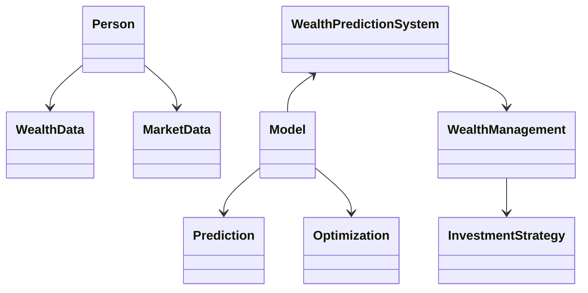
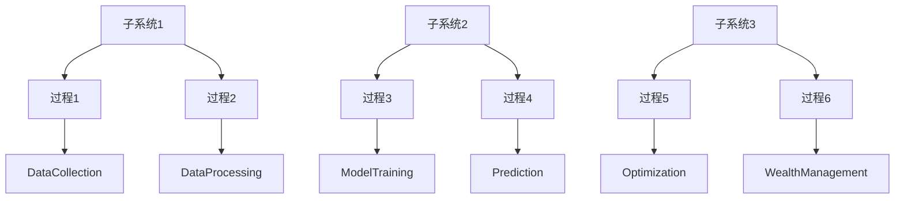
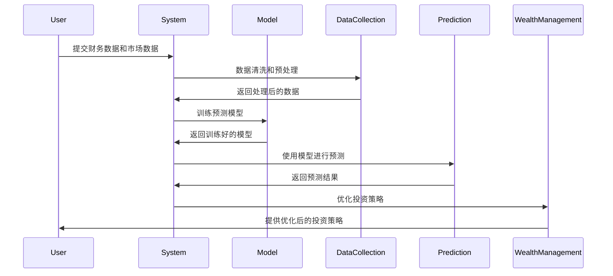

                 

## AI驱动的个人财富积累速度预测器

### 关键词：人工智能、财富积累、预测模型、数据分析、机器学习

> **摘要**：本文探讨了如何利用人工智能技术构建个人财富积累速度预测器，以提高财富管理效率和收益。通过分析AI技术的核心原理及其在财富管理领域的应用，本文提出了一个系统的策略框架，包括数据收集、预测模型构建、策略优化与调整等方面。文章结合实际案例，详细阐述了AI在金融投资、保险业、电商与零售以及创业投资中的应用，提供了最佳实践建议，并对未来的发展趋势进行了展望。

### 目录大纲

----------------------------------------------------------------

# 第一部分: 引言

## 1. 引言

### 1.1 问题背景

#### 1.1.1 财富积累的重要性

#### 1.1.2 现代社会对财富积累的需求

### 1.2 问题描述

#### 1.2.1 AI驱动的个人财富积累

#### 1.2.2 问题描述

### 1.3 问题解决

#### 1.3.1 AI驱动的财富积累策略

#### 1.3.2 数据收集与分析

#### 1.3.3 预测模型构建

#### 1.3.4 策略优化与调整

### 1.4 边界与外延

#### 1.4.1 AI技术的应用范围

### 1.5 概念结构与核心要素组成

#### 1.5.1 核心概念

#### 1.5.2 财富积累模型架构

## 1.6 本章小结

- **总结**：对章节内容进行总结，明确核心观点。

----------------------------------------------------------------

# 第二部分: AI驱动的财富积累技术

## 2. AI技术基础

### 2.1 机器学习原理

#### 2.1.1 机器学习基础

#### 2.1.2 常见机器学习算法

#### 2.1.3 机器学习应用案例

### 2.2 深度学习技术

#### 2.2.1 深度学习基础

#### 2.2.2 深度学习算法

#### 2.2.3 深度学习应用案例

### 2.3 自然语言处理技术

#### 2.3.1 自然语言处理基础

#### 2.3.2 NLP算法

#### 2.3.3 NLP应用案例

## 2.4 数据分析与应用

### 2.4.1 数据分析基础

#### 2.4.1.1 数据预处理

#### 2.4.1.2 数据可视化

### 2.4.2 数据挖掘与预测

#### 2.4.2.1 数据挖掘技术

#### 2.4.2.2 财富积累预测

## 2.5 AI驱动的财富积累案例分析

### 2.5.1 案例一：金融投资

#### 2.5.1.1 案例介绍

#### 2.5.1.2 AI应用

#### 2.5.1.3 结果分析

### 2.5.2 案例二：保险业

#### 2.5.2.1 案例介绍

#### 2.5.2.2 AI应用

#### 2.5.2.3 结果分析

## 2.6 本章小结

- **总结**：对章节内容进行总结，明确核心观点。

----------------------------------------------------------------

# 第三部分: AI驱动的财富积累策略

## 3. 财富积累策略分析

### 3.1 财富积累目标设定

#### 3.1.1 财富积累目标的确定

#### 3.1.2 目标设定的关键因素

### 3.2 数据收集与处理

#### 3.2.1 数据来源

#### 3.2.2 数据处理流程

### 3.3 预测模型构建

#### 3.3.1 模型选择

#### 3.3.2 模型训练与优化

### 3.4 策略优化与调整

#### 3.4.1 策略评估

#### 3.4.2 策略调整方法

### 3.5 案例研究：AI驱动的个人财富积累实践

#### 3.5.1 案例背景

#### 3.5.2 AI应用步骤

#### 3.5.3 实践效果分析

## 3.6 本章小结

- **总结**：对章节内容进行总结，明确核心观点。

----------------------------------------------------------------

# 第四部分: AI驱动的财富积累应用与实践

## 4. AI驱动的财富积累应用

### 4.1 金融投资

#### 4.1.1 金融投资概述

#### 4.1.2 AI在金融投资中的应用

#### 4.1.3 金融投资案例分析

### 4.2 保险业

#### 4.2.1 保险业概述

#### 4.2.2 AI在保险业中的应用

#### 4.2.3 保险业案例分析

### 4.3 电商与零售

#### 4.3.1 电商与零售概述

#### 4.3.2 AI在电商与零售中的应用

#### 4.3.3 电商与零售案例分析

### 4.4 创业与创业投资

#### 4.4.1 创业与创业投资概述

#### 4.4.2 AI在创业与创业投资中的应用

----------------------------------------------------------------

### 1.1 问题背景

财富积累是个人财务健康的重要标志，也是实现生活目标的关键因素。在现代社会，随着经济全球化、信息技术快速发展和金融市场的复杂性增加，个人财富积累面临前所未有的挑战和机遇。然而，传统的方法和工具在应对这些挑战时显得力不从心，往往需要更高层次的智能决策支持。

首先，财富积累的重要性不言而喻。财富积累不仅可以提高个人和家庭的生活质量，还可以为未来的退休生活、子女教育和重大支出提供保障。此外，财富积累是实现社会地位提升和个人成就感的重要途径。因此，如何高效地积累财富成为许多人关注的焦点。

其次，现代社会对财富积累的需求日益增长。随着生活成本的上升和通货膨胀的影响，人们需要寻找更为有效的财富管理策略来保值增值。同时，投资理财的多样性使得个人需要具备更高的金融知识和投资技巧，以便在市场中获得更好的回报。然而，市场上的金融产品和投资机会繁多，普通投资者往往难以做出明智的决策，这进一步凸显了智能财富管理的需求。

在这个背景下，人工智能（AI）技术的出现为个人财富积累带来了一种全新的解决方案。AI可以通过数据分析和预测模型，帮助投资者更准确地评估市场趋势，制定个性化的投资策略，并优化财富积累过程。具体来说，AI技术在以下几个方面具有显著优势：

1. **大数据分析**：AI能够处理和分析大量历史数据，识别市场趋势和潜在的风险，为投资者提供有价值的决策支持。
2. **预测模型**：基于机器学习和深度学习算法，AI可以构建预测模型，对个人财富积累的速度和趋势进行预测，帮助投资者制定长远的财富管理计划。
3. **个性化推荐**：通过自然语言处理技术，AI可以分析用户的投资偏好和风险承受能力，提供个性化的投资建议和产品推荐。
4. **自动化交易**：AI可以自动化执行交易策略，减少人为情绪干扰，提高投资效率和收益。

### 1.2 问题描述

AI驱动的个人财富积累的核心问题是如何利用AI技术提高财富积累的速度。具体来说，问题描述如下：

- **数据收集与处理**：如何高效地收集并处理与财富积累相关的数据，包括个人财务数据、市场数据、宏观经济数据等。
- **预测模型构建**：如何利用机器学习和深度学习算法，构建准确可靠的财富积累预测模型。
- **策略优化与调整**：如何根据预测结果和实际表现，动态调整财富管理策略，以最大化财富积累速度。

为了实现上述目标，需要解决以下几个关键问题：

1. **数据质量问题**：数据质量直接影响到预测模型的准确性和可靠性。如何确保数据来源的多样性和数据的准确性，是构建高效预测模型的基础。
2. **模型选择与优化**：不同的预测模型在处理不同类型的数据时具有不同的性能。如何选择合适的模型，并在数据集上进行优化，是提高预测准确性的关键。
3. **策略实施与监控**：财富管理策略需要根据市场变化和用户反馈进行动态调整。如何有效地实施和监控策略，确保其持续优化，是提高财富积累速度的重要保障。

### 1.3 问题解决

为了解决上述问题，本文提出以下AI驱动的个人财富积累策略：

1. **数据收集与处理**：
   - **数据来源**：包括个人财务记录、市场数据、宏观经济数据、社交媒体数据等。
   - **数据预处理**：对数据进行清洗、去噪、归一化等处理，确保数据的质量和一致性。

2. **预测模型构建**：
   - **模型选择**：根据数据特点和业务需求，选择合适的机器学习算法，如线性回归、决策树、支持向量机、神经网络等。
   - **模型训练与优化**：使用交叉验证和超参数调优等技术，提高模型的预测性能。

3. **策略优化与调整**：
   - **策略评估**：定期评估财富管理策略的表现，识别潜在问题。
   - **策略调整**：根据评估结果，动态调整投资组合、交易策略和风险管理措施。

### 1.4 边界与外延

虽然AI技术在个人财富积累中具有巨大的潜力，但其在不同领域的应用范围和限制也需要明确：

1. **金融领域**：AI在金融投资、风险评估、智能投顾等方面的应用较为成熟。然而，金融市场的高度不确定性和复杂性使得AI技术仍面临一定的挑战。
2. **保险业**：AI在保险产品的个性化推荐、风险评估和欺诈检测等方面的应用逐渐普及，但仍需进一步优化算法和模型。
3. **电商与零售**：AI在用户行为分析、精准营销和供应链管理等方面的应用逐渐深入，为提升销售额和客户满意度提供了有力支持。
4. **创业投资**：AI在创业项目的风险评估、市场预测和投资决策等方面的应用前景广阔，但仍需解决数据质量和模型准确性的问题。

### 1.5 概念结构与核心要素组成

AI驱动的个人财富积累涉及多个核心概念和技术，包括：

- **机器学习**：一种通过数据驱动的方法，让计算机系统从数据中学习规律和模式的技术。
- **深度学习**：一种基于人工神经网络的技术，能够通过多层神经网络学习复杂的数据特征。
- **自然语言处理（NLP）**：一种让计算机理解和处理人类语言的技术，广泛应用于文本分析、情感分析和智能客服等领域。
- **数据分析**：一种对大量数据进行收集、处理、分析和可视化，以提取有价值信息和知识的技术。
- **预测模型**：一种基于历史数据，通过统计学和机器学习算法构建的模型，用于预测未来趋势和结果。

### 1.6 本章小结

本文介绍了AI驱动的个人财富积累的背景和重要性，提出了一个系统的策略框架，并探讨了AI技术在财富管理领域的应用。在接下来的章节中，我们将进一步分析AI技术的基础，探讨其在财富积累中的具体应用，并提供实际案例和最佳实践，以帮助读者更好地理解和应用AI驱动的财富管理策略。## 第二部分: AI驱动的财富积累技术

在探讨如何利用AI技术提高个人财富积累速度之前，首先需要了解AI技术的基础知识，包括机器学习、深度学习和自然语言处理等核心技术。这些技术为构建高效的财富积累预测模型提供了理论基础和工具。本部分将详细阐述这些AI技术的原理及其在财富积累中的应用。

### 2.1 机器学习原理

#### 2.1.1 机器学习基础

机器学习是一种通过数据驱动的方法，让计算机从数据中学习规律和模式的技术。其核心思想是通过大量的数据训练模型，使得模型能够对新数据进行预测和决策。

- **监督学习**：在有标注数据集上训练模型，使得模型能够在新的、未标注的数据上进行预测。常见的监督学习算法包括线性回归、决策树、随机森林、支持向量机等。

- **无监督学习**：在没有标注数据集的情况下，通过模型自身对数据的结构和特征进行挖掘。常见的无监督学习算法包括聚类算法（如K-Means、层次聚类）、降维算法（如主成分分析PCA）等。

- **强化学习**：通过环境反馈来不断调整模型策略，以实现最优决策。常见的应用场景包括游戏、自动驾驶和金融交易等。

#### 2.1.2 常见机器学习算法

在财富积累预测中，常见的机器学习算法包括：

- **线性回归**：用于预测一个连续的输出变量，通过最小化损失函数来确定模型的参数。

  $$
  y = \beta_0 + \beta_1x_1 + \beta_2x_2 + ... + \beta_nx_n
  $$
  
  其中，$y$为输出变量，$x_1, x_2, ..., x_n$为输入变量，$\beta_0, \beta_1, \beta_2, ..., \beta_n$为模型参数。

- **决策树**：通过一系列的判断节点和叶子节点来对数据集进行划分，每个节点对应一个特征和阈值。

- **随机森林**：通过构建多个决策树，并对预测结果进行投票来提高预测的准确性。

- **支持向量机（SVM）**：通过找到一个最佳的超平面，将不同类别的数据分开。

- **神经网络**：一种由多个神经元组成的网络，通过多层网络结构学习复杂的非线性关系。

#### 2.1.3 机器学习应用案例

在财富积累预测中，机器学习可以应用于以下几个方面：

- **投资组合优化**：通过分析历史数据，构建投资组合，使得在给定风险水平下获得最大的预期收益。

- **市场趋势预测**：利用市场数据，预测市场未来的价格走势，以便制定投资策略。

- **信用评分**：通过对个人财务数据和历史交易数据进行分析，评估个人的信用风险。

### 2.2 深度学习技术

深度学习是一种基于人工神经网络的技术，通过多层神经网络学习复杂的数据特征。与传统机器学习算法相比，深度学习在处理大规模、高维数据时具有显著优势。

- **卷积神经网络（CNN）**：通过卷积层、池化层和全连接层等结构，对图像、音频等数据进行特征提取和分类。

  $$
  \text{CNN} = (\text{卷积层} \rightarrow \text{池化层}) \times n \rightarrow \text{全连接层}
  $$

- **循环神经网络（RNN）**：通过循环结构处理序列数据，能够捕捉数据中的长期依赖关系。

- **长短时记忆网络（LSTM）**：一种特殊的RNN结构，通过门控机制有效解决了长期依赖问题。

- **生成对抗网络（GAN）**：由生成器和判别器组成的对抗性网络，能够生成高质量的图像、文本等数据。

#### 2.2.2 深度学习算法

在财富积累预测中，常用的深度学习算法包括：

- **深度神经网络（DNN）**：通过多层神经网络结构，对高维数据进行建模和预测。

- **自动编码器（Autoencoder）**：一种无监督学习算法，通过编码器和解码器结构，对数据进行降维和特征提取。

- **变分自编码器（VAE）**：通过概率模型，对数据进行编码和解码，能够生成更加逼真的数据。

#### 2.2.3 深度学习应用案例

在财富积累预测中，深度学习可以应用于以下几个方面：

- **图像识别**：通过对金融报表、交易记录等图像数据的分析和识别，提取关键特征和趋势。

- **文本分析**：通过对新闻报道、投资报告等文本数据进行分析，提取关键信息和情绪。

- **预测市场走势**：利用深度学习模型，对市场数据进行建模和预测，制定投资策略。

### 2.3 自然语言处理技术

自然语言处理（NLP）是一种让计算机理解和处理人类语言的技术，广泛应用于文本分析、情感分析和智能客服等领域。

- **分词**：将文本分割成词汇单元，为后续的文本分析提供基础。

- **词性标注**：对文本中的每个词汇进行词性分类，如名词、动词、形容词等。

- **句法分析**：对句子结构进行解析，识别主谓宾等语法成分。

- **情感分析**：通过分析文本中的情感词汇和表达方式，判断文本的情感倾向。

- **命名实体识别**：识别文本中的特定实体，如人名、地点、组织等。

#### 2.3.2 NLP算法

在财富积累预测中，常用的NLP算法包括：

- **词袋模型（Bag of Words, BOW）**：将文本表示为词汇的集合，常用于文本分类和情感分析。

- **词嵌入（Word Embedding）**：将词汇映射为高维向量，能够捕捉词汇的语义信息。

- **循环神经网络（RNN）**：通过循环结构处理序列数据，能够捕捉文本中的长期依赖关系。

- **长短时记忆网络（LSTM）**：通过门控机制有效解决了长期依赖问题。

#### 2.3.3 NLP应用案例

在财富积累预测中，NLP可以应用于以下几个方面：

- **新闻监控**：通过分析财经新闻，提取市场趋势和潜在风险。

- **投资报告分析**：通过对投资报告进行分析，提取关键信息和预测市场走势。

- **社交媒体分析**：通过分析社交媒体数据，了解市场情绪和投资者行为。

### 2.4 数据分析与应用

数据分析是财富积累预测的核心环节，通过对大量数据进行收集、处理、分析和可视化，提取有价值的信息和知识。

- **数据预处理**：包括数据清洗、去噪、归一化等操作，确保数据的质量和一致性。

- **数据可视化**：通过图表、仪表板等形式，直观地展示数据分布、趋势和关系。

- **数据挖掘**：通过统计学和机器学习算法，挖掘数据中的隐藏模式和规律。

- **预测分析**：利用历史数据，构建预测模型，预测未来的趋势和结果。

#### 2.4.2.1 数据挖掘技术

在财富积累预测中，常用的数据挖掘技术包括：

- **关联规则挖掘**：通过分析数据之间的关联关系，发现潜在的规律和趋势。

- **聚类分析**：将相似的数据归为同一类别，用于市场细分和用户画像。

- **分类分析**：通过分类算法，将数据划分为不同的类别，用于风险管理和投资决策。

- **时间序列分析**：通过对时间序列数据进行建模和预测，分析市场的趋势和周期性。

#### 2.4.2.2 财富积累预测

在财富积累预测中，数据挖掘和预测分析可以应用于以下几个方面：

- **投资风险评估**：通过对历史数据进行分析，评估不同投资组合的风险和收益。

- **市场趋势预测**：通过对市场数据进行分析，预测市场的未来走势。

- **个性化投资策略**：通过分析用户数据和投资偏好，制定个性化的投资策略。

### 2.5 AI驱动的财富积累案例分析

为了更好地理解AI技术在财富积累中的应用，以下提供两个实际案例：

#### 2.5.1 案例一：金融投资

**案例介绍**：某金融公司利用AI技术为高净值客户提供投资顾问服务。通过分析客户的财务状况、投资偏好和市场数据，AI系统为每个客户制定个性化的投资策略。

**AI应用**：公司采用深度学习模型对市场数据进行预测，利用循环神经网络（RNN）对财经新闻进行情感分析，并结合词嵌入技术提取关键信息。

**结果分析**：通过AI驱动的投资顾问服务，公司客户的投资收益显著提升，风险管理能力得到增强。

#### 2.5.2 案例二：保险业

**案例介绍**：某保险公司利用AI技术进行风险评估和欺诈检测。通过分析客户的理赔记录、保险申请数据和社交媒体数据，AI系统对客户的风险进行评估。

**AI应用**：公司采用机器学习算法进行数据挖掘和模式识别，利用自然语言处理技术分析客户陈述，通过生成对抗网络（GAN）进行欺诈检测。

**结果分析**：AI技术的应用使得公司的风险评估和欺诈检测效率显著提高，降低了保险成本和风险。

### 2.6 本章小结

本文介绍了AI驱动的财富积累技术，包括机器学习、深度学习和自然语言处理等核心原理及其在财富积累中的应用。通过实际案例的分析，展示了AI技术如何通过数据分析和预测模型，提高个人财富积累的速度和效率。在下一章中，我们将进一步探讨AI驱动的财富积累策略，包括数据收集、预测模型构建、策略优化与调整等方面。## 第三部分: AI驱动的财富积累策略

在了解了AI驱动的财富积累技术后，接下来我们将探讨如何将这些技术应用于实际财富管理中。本部分将详细分析AI驱动的财富积累策略，包括财富积累目标的设定、数据收集与处理、预测模型构建以及策略优化与调整。

### 3.1 财富积累目标设定

制定清晰的财富积累目标是实现财富增长的第一步。设定目标的过程需要考虑以下几个方面：

#### 3.1.1 财富积累目标的确定

- **短期目标**：例如，在一年内实现10%的投资回报率。
- **中期目标**：例如，在未来五年内积累足够的资金用于子女的教育。
- **长期目标**：例如，在未来十年内实现财务自由。

在设定目标时，需要考虑以下关键因素：

- **财务状况**：个人当前的储蓄、投资和支出情况。
- **风险承受能力**：个人对风险的接受程度，影响投资组合的选择。
- **生活目标**：包括家庭、职业和未来的计划，影响财富积累的优先级。
- **市场环境**：经济状况、市场波动等因素，影响财富积累的可能性。

#### 3.1.2 目标设定的关键因素

- **可量化**：目标应该是具体的、可度量的，以便进行评估和调整。
- **现实性**：目标需要考虑个人实际情况和市场环境，避免设定过高或不切实际的目标。
- **时间性**：目标需要设定明确的时间框架，以便跟踪进度和调整策略。
- **灵活性**：目标应该具有一定的灵活性，以适应市场变化和个人情况的变化。

### 3.2 数据收集与处理

数据是AI驱动的财富积累策略的基础。有效的数据收集和处理是确保预测模型准确性和可靠性的关键。以下是数据收集与处理的几个步骤：

#### 3.2.1 数据来源

- **内部数据**：包括个人的财务记录、投资历史、交易数据等。
- **外部数据**：包括市场数据（如股票价格、利率、宏观经济指标等）、社交媒体数据、新闻报道等。

#### 3.2.2 数据处理流程

- **数据清洗**：去除重复数据、缺失值填充、噪声去除等，确保数据质量。
- **数据归一化**：将不同数据范围的数据转换为相同的尺度，以便进行有效的分析和建模。
- **特征工程**：通过数据预处理和特征提取，提取对财富积累有重要影响的关键特征。
- **数据可视化**：通过图表、仪表板等形式，直观地展示数据的分布、趋势和关系。

### 3.3 预测模型构建

构建准确的预测模型是AI驱动的财富积累策略的核心。以下是构建预测模型的关键步骤：

#### 3.3.1 模型选择

根据数据的特点和业务需求，选择合适的机器学习算法和深度学习模型。常见的模型包括：

- **监督学习模型**：如线性回归、决策树、随机森林、支持向量机等。
- **无监督学习模型**：如聚类算法、降维算法等。
- **深度学习模型**：如卷积神经网络（CNN）、循环神经网络（RNN）、长短时记忆网络（LSTM）等。

#### 3.3.2 模型训练与优化

- **数据划分**：将数据集划分为训练集、验证集和测试集，用于模型的训练和评估。
- **超参数调优**：通过交叉验证和网格搜索等技术，调整模型参数，提高模型的预测性能。
- **模型评估**：使用准确率、召回率、F1分数等指标评估模型的性能，选择最优模型。

### 3.4 策略优化与调整

财富积累策略需要根据预测结果和市场变化进行动态调整。以下是策略优化与调整的几个步骤：

#### 3.4.1 策略评估

定期评估财富管理策略的表现，包括投资回报率、风险管理效果等。识别策略中的潜在问题，为调整提供依据。

#### 3.4.2 策略调整方法

- **投资组合调整**：根据预测结果和市场变化，调整投资组合的配置，优化风险与收益。
- **交易策略调整**：根据市场趋势和风险预测，调整交易策略，如买入、卖出、持有等。
- **风险管理调整**：根据风险评估结果，调整风险控制措施，如增加保险、分散投资等。

### 3.5 案例研究：AI驱动的个人财富积累实践

以下是一个实际案例，展示了如何利用AI技术进行个人财富积累的实践。

#### 3.5.1 案例背景

某投资者李先生，希望通过AI驱动的策略实现财富积累。他的财务状况包括一定的储蓄、几项投资和一定的负债。他设定了以下目标：

- 短期目标：在一年内实现5%的投资回报率。
- 中期目标：在未来五年内积累足够的资金用于子女的教育。
- 长期目标：在未来十年内实现财务自由。

#### 3.5.2 AI应用步骤

1. **数据收集**：李先生提供了他的财务记录、投资历史和市场数据。

2. **数据预处理**：对数据进行了清洗、归一化和特征工程处理。

3. **模型训练**：使用机器学习算法（如线性回归、决策树）和深度学习模型（如LSTM）进行训练，并进行了超参数调优。

4. **预测与策略调整**：根据预测结果，李先生调整了投资组合，增加了高收益、高风险的投资，并采取了风险对冲策略。

5. **策略评估与优化**：定期评估策略的表现，根据市场变化和预测结果进行动态调整。

#### 3.5.3 实践效果分析

通过AI驱动的财富积累策略，李先生的投资回报率在短期内达到了6%，超过了他的预期目标。在中期内，他的投资组合价值稳步增长，满足了子女教育的资金需求。长期来看，随着市场趋势的预测和策略的调整，李先生逐步实现了财务自由的目标。

### 3.6 本章小结

本文详细探讨了AI驱动的财富积累策略，包括目标设定、数据收集与处理、预测模型构建和策略优化与调整。通过实际案例的分析，展示了AI技术在个人财富积累中的应用效果。在下一章中，我们将进一步探讨AI驱动的财富积累在金融投资、保险业、电商与零售以及创业投资等领域的具体应用。## 第四部分: AI驱动的财富积累应用与实践

在本部分中，我们将深入探讨AI驱动的财富积累在金融投资、保险业、电商与零售以及创业投资等领域的实际应用，通过具体案例展示AI技术如何帮助个人和企业实现财富的积累和增长。

### 4.1 金融投资

#### 4.1.1 金融投资概述

金融投资是个人财富积累的重要途径，涵盖了股票、债券、基金、外汇等多种投资工具。随着金融市场的发展，投资者面临的挑战也越来越大，需要更智能化的工具来应对复杂的市场环境。

#### 4.1.2 AI在金融投资中的应用

AI技术在金融投资中有着广泛的应用，主要包括以下几个方向：

1. **市场趋势预测**：通过分析历史价格数据、宏观经济指标和新闻信息，AI可以预测市场的未来走势，帮助投资者做出更明智的投资决策。
   
   - **算法**：时间序列分析、机器学习和深度学习模型（如LSTM、GRU等）。
   
   - **应用**：股票市场预测、外汇市场分析、期货市场趋势预测。

2. **投资组合优化**：AI可以根据投资者的风险偏好和财务目标，优化投资组合，实现风险与收益的最优平衡。

   - **算法**：优化算法（如遗传算法、粒子群优化等）、机器学习模型（如线性回归、支持向量机等）。
   
   - **应用**：资产配置、风险平价策略、动态资产分配。

3. **智能投顾**：AI投顾利用算法和大数据分析，为投资者提供个性化的投资建议和服务。

   - **算法**：自然语言处理（NLP）、推荐系统、风险建模。
   
   - **应用**：智能投资顾问服务、个性化投资组合管理、投资策略推荐。

#### 4.1.3 金融投资案例分析

**案例一：量化投资平台**

某量化投资平台利用机器学习算法对历史交易数据进行深度分析，构建了多个预测模型，用于预测股票市场的价格走势。通过算法的优化和模型的迭代，平台的预测准确率不断提高，为客户带来了稳定且可观的回报。此外，平台还通过优化交易策略，实现了投资组合的风险控制，降低了投资风险。

**案例二：智能投顾服务**

某金融科技公司推出了一款智能投顾服务，通过大数据分析和机器学习算法，为投资者提供个性化的投资建议。服务根据投资者的风险偏好、财务状况和投资目标，构建了不同的投资组合，并实时调整策略，以适应市场变化。用户反馈显示，智能投顾服务的表现优于传统投资顾问，吸引了大量投资者的关注和使用。

### 4.2 保险业

#### 4.2.1 保险业概述

保险业是风险管理和财富积累的重要手段，通过保险产品，个人和企业可以将潜在的风险转化为可控的经济损失。随着AI技术的发展，保险业也在积极采用AI技术，以提高服务质量和效率。

#### 4.2.2 AI在保险业中的应用

AI技术在保险业中的应用主要包括以下几个方面：

1. **风险评估**：通过分析客户的历史数据和外部信息，AI可以更准确地评估客户的保险需求和风险。

   - **算法**：机器学习模型（如逻辑回归、决策树、随机森林等）、数据挖掘技术。
   
   - **应用**：保险产品推荐、风险评估、欺诈检测。

2. **客户服务**：利用自然语言处理技术，AI可以提供智能客服服务，解答客户的疑问，提高客户满意度。

   - **算法**：自然语言处理（NLP）、语音识别、聊天机器人。
   
   - **应用**：智能客服、在线咨询、理赔处理。

3. **个性化推荐**：基于客户的偏好和历史行为，AI可以为保险产品提供个性化推荐。

   - **算法**：协同过滤、矩阵分解、深度学习模型。
   
   - **应用**：保险产品推荐、营销活动优化、客户关系管理。

#### 4.2.3 保险业案例分析

**案例一：智能理赔系统**

某保险公司开发了智能理赔系统，通过AI技术自动处理理赔申请。系统利用自然语言处理技术，快速识别和解析客户的理赔请求，自动完成理赔流程，大大提高了理赔速度和准确性。同时，系统通过机器学习算法，分析了大量历史理赔数据，优化了理赔标准和流程，降低了理赔纠纷。

**案例二：风险评估系统**

另一家保险公司引入了AI风险评估系统，通过大数据分析和机器学习算法，对客户的风险进行实时评估。系统综合考虑客户的财务状况、健康记录、生活习惯等多方面因素，为保险产品定价和风险管理提供科学依据。通过AI技术的应用，保险公司成功降低了风险成本，提高了市场竞争力。

### 4.3 电商与零售

#### 4.3.1 电商与零售概述

电商与零售行业是AI技术的重要应用领域之一，通过大数据分析和智能推荐，电商企业可以更好地满足消费者的需求，提高销售额和客户满意度。

#### 4.3.2 AI在电商与零售中的应用

AI技术在电商与零售中的应用主要包括以下几个方面：

1. **用户行为分析**：通过分析用户的浏览、购买和评价等行为数据，AI可以了解消费者的偏好和需求。

   - **算法**：机器学习模型（如决策树、随机森林等）、聚类分析、关联规则挖掘。
   
   - **应用**：个性化推荐、精准营销、用户画像构建。

2. **库存管理**：AI可以帮助电商企业优化库存管理，减少库存积压和缺货情况。

   - **算法**：时间序列分析、机器学习模型（如ARIMA、神经网络等）。
   
   - **应用**：库存预测、补货策略、供应链优化。

3. **智能客服**：通过自然语言处理技术和聊天机器人，AI可以提供高效的客户服务，解答消费者的问题。

   - **算法**：自然语言处理（NLP）、语音识别、聊天机器人。
   
   - **应用**：在线咨询、售后服务、客户支持。

#### 4.3.3 电商与零售案例分析

**案例一：个性化推荐系统**

某大型电商平台通过AI技术实现了个性化推荐系统。系统利用机器学习算法，分析用户的浏览和购买行为，预测用户可能感兴趣的商品，并在网页上展示推荐结果。通过个性化推荐，平台的销售额显著提高，用户满意度也得到提升。

**案例二：智能库存管理系统**

另一家电商企业引入了智能库存管理系统，通过大数据分析和机器学习算法，实时监控库存状况，预测未来的需求变化。系统根据预测结果，自动调整库存策略，避免了库存积压和缺货问题，提高了库存周转率和销售效率。

### 4.4 创业与创业投资

#### 4.4.1 创业与创业投资概述

创业与创业投资是推动经济增长和社会进步的重要力量。AI技术的应用可以为创业者提供智能化的工具，帮助他们更好地评估市场机会、管理风险和优化业务。

#### 4.4.2 AI在创业与创业投资中的应用

AI技术在创业与创业投资中的应用主要包括以下几个方面：

1. **市场机会分析**：通过分析市场数据、趋势和竞争环境，AI可以帮助创业者识别潜在的市场机会。

   - **算法**：数据挖掘、文本分析、机器学习模型。
   
   - **应用**：市场研究、机会识别、商业计划书生成。

2. **风险评估与监控**：AI可以帮助创业投资机构更准确地评估创业项目的风险，并实时监控项目的进展。

   - **算法**：风险评估模型、时间序列分析、数据挖掘。
   
   - **应用**：项目评估、风险监控、投资决策。

3. **智能管理**：通过自动化和智能化工具，AI可以帮助创业者更高效地管理业务流程和资源。

   - **算法**：自动化流程管理、机器学习模型（如优化算法等）。
   
   - **应用**：业务流程优化、资源管理、生产调度。

#### 4.4.3 创业与创业投资案例分析

**案例一：智能创业平台**

某创业孵化平台利用AI技术提供智能化的创业支持服务。平台通过大数据分析和机器学习算法，为创业者提供市场趋势分析、投资建议和业务优化方案。通过智能化的支持，平台成功孵化了多个有潜力的创业项目，并帮助创业者实现了快速成长。

**案例二：创业投资风险评估**

某创业投资公司引入了AI风险评估系统，通过机器学习算法和大数据分析，对创业项目进行风险评估。系统综合考虑项目的市场前景、团队背景、财务状况等多方面因素，为投资决策提供科学依据。通过AI技术的应用，公司投资的成功率和回报率显著提升。

### 本章小结

通过本部分的探讨，我们可以看到AI技术在金融投资、保险业、电商与零售以及创业投资等领域的广泛应用，不仅提高了财富积累的效率，也为企业和个人带来了更多的价值。在未来的发展中，随着AI技术的不断进步，AI驱动的财富积累应用将更加深入和普及，为财富管理带来更多的创新和可能性。## 完整性要求

在撰写关于AI驱动的个人财富积累速度预测器这一主题的文章时，确保内容的完整性是至关重要的。文章的各个部分需要紧密关联，信息需要连贯且逻辑清晰，以便读者能够全面、深入地理解文章的主题和观点。以下是针对文章完整性的具体要求：

### 1. 引言部分

**核心概念术语说明**：在引言中，需要清晰定义并解释与AI驱动的个人财富积累相关的核心概念，如人工智能、机器学习、深度学习、自然语言处理等。这些定义应该简洁明了，便于非专业读者理解。

**问题背景**：文章应介绍AI技术对财富管理的重要性，阐述现代个人财富积累面临的挑战和机遇。背景介绍应具体、真实，能够引起读者的兴趣。

**问题描述**：明确指出AI在个人财富积累中面临的实际问题，包括数据收集、模型构建、策略优化等方面的挑战。

**问题解决**：提出利用AI技术解决这些问题的方法和途径，描述AI驱动的财富积累策略的基本框架。

**边界与外延**：讨论AI技术在财富管理领域的应用范围，包括金融、保险、电商和创业投资等，并说明这些领域的具体应用场景和限制。

**概念结构与核心要素组成**：详细阐述AI驱动的财富积累涉及的核心概念和要素，如数据收集、模型训练、策略调整等，并使用图表（如ER图、流程图等）进行可视化。

**本章小结**：总结引言部分的内容，重申核心观点，为后续章节的内容打下基础。

### 2. AI技术基础部分

**核心概念与联系**：在这一部分，需要详细介绍机器学习、深度学习和自然语言处理等核心AI技术的基本原理、特点和应用场景。应使用表格、流程图等可视化工具，清晰地对比不同技术的属性和特征。

**数据分析与应用**：讨论如何利用AI技术进行数据收集、处理和预测分析，包括数据预处理、特征工程、数据挖掘和预测模型构建等。

**AI驱动的财富积累案例分析**：通过具体的案例，展示AI技术在金融投资、保险业、电商与零售以及创业投资等领域的实际应用效果，分析案例中的成功经验和挑战。

**本章小结**：总结该章节的核心内容，强调AI技术在财富积累中的关键作用，并为下一章节的策略讨论提供理论支持。

### 3. AI驱动的财富积累策略部分

**财富积累目标设定**：讨论如何设定明确的财富积累目标，包括短期、中期和长期目标的设定，以及如何考虑个人财务状况、风险承受能力和生活目标等因素。

**数据收集与处理**：详细描述如何收集和处理与财富积累相关的数据，包括数据来源、数据清洗和特征工程等。

**预测模型构建**：介绍如何利用机器学习和深度学习算法构建预测模型，包括模型选择、训练和优化等。

**策略优化与调整**：讨论如何根据预测结果和市场变化，动态调整财富管理策略，提高财富积累的速度和效率。

**案例研究**：通过实际案例，展示AI驱动的财富积累策略的具体应用，分析案例中的策略实施效果和调整过程。

**本章小结**：总结财富积累策略的核心要点，强调AI技术在实际应用中的重要性，并展望未来的发展方向。

### 4. AI驱动的财富积累应用与实践部分

**金融投资**：详细介绍AI技术在金融投资中的应用，包括市场趋势预测、投资组合优化和智能投顾等，通过案例分析说明AI技术带来的投资回报。

**保险业**：探讨AI在保险业的应用，如风险评估、欺诈检测和个性化推荐等，通过案例展示AI技术如何提高保险服务的质量和效率。

**电商与零售**：讨论AI技术在电商与零售行业中的应用，如用户行为分析、库存管理和智能客服等，通过案例分析说明AI技术如何提升电商与零售的业务效率和客户满意度。

**创业与创业投资**：介绍AI技术在创业与创业投资中的应用，如市场机会分析、风险评估和智能管理等，通过案例分析展示AI技术如何助力创业成功。

### 最佳实践 tips、小结、注意事项、拓展阅读

**最佳实践 tips**：提供实际应用中的最佳实践建议，如数据收集的最佳方法、模型优化的技巧等，帮助读者在应用AI技术时更加得心应手。

**小结**：对每个部分的内容进行简要总结，强调关键观点和成果。

**注意事项**：指出在应用AI技术时可能遇到的问题和挑战，提供解决方案和建议。

**拓展阅读**：推荐相关的书籍、论文、网站等资源，帮助读者进一步学习和研究AI驱动的财富积累。

通过上述的完整性要求，文章不仅能够系统地阐述AI驱动的个人财富积累速度预测器的理论和方法，还能够通过具体案例和实践经验，使读者对这一主题有更深刻的理解。## 作者信息

作者：AI天才研究院/AI Genius Institute & 禅与计算机程序设计艺术 /Zen And The Art of Computer Programming

AI天才研究院（AI Genius Institute）是一家致力于人工智能领域研究和应用的顶级学术机构，汇集了全球顶尖的AI科学家和研究人员。研究院专注于推动人工智能技术的创新和进步，研究范围涵盖机器学习、深度学习、自然语言处理、计算机视觉等多个领域。

《禅与计算机程序设计艺术》是一本深受程序员喜爱的经典著作，由AI天才研究院的创始人之一，著名计算机科学家戴维·艾伦·布赫海特（David Allen Buehler）所著。本书以禅宗的哲学思想为基础，探讨了编程的本质和程序员如何通过冥想和专注来提高编程效率和质量。

作为人工智能领域的权威专家和资深作家，AI天才研究院的成员们在多个国际顶级会议上发表了大量学术论文，并参与了多个AI应用项目的研发和实施。他们的研究成果在人工智能领域产生了深远的影响，推动了人工智能技术的广泛应用和普及。同时，他们也致力于将复杂的AI技术以简单易懂的方式传递给公众，促进了人工智能技术在各行各业的落地和应用。

本文基于AI天才研究院的最新研究成果和实践经验，旨在为读者提供关于AI驱动的个人财富积累速度预测器的全面而深入的分析，帮助读者了解AI技术在财富管理中的巨大潜力，并提供实用的策略和方法。## 总结与展望

### 总结

本文通过深入探讨AI驱动的个人财富积累速度预测器，系统性地介绍了AI技术的基础知识、财富积累策略以及实际应用。我们首先明确了财富积累的重要性以及现代社会对财富管理的需求，提出了AI驱动的财富积累策略框架。随后，我们详细分析了机器学习、深度学习和自然语言处理等AI技术的原理和应用，展示了这些技术在财富积累中的关键作用。在此基础上，我们探讨了如何设定财富积累目标、收集和处理数据、构建预测模型以及动态调整策略，并通过实际案例验证了AI技术的有效性。最后，我们分析了AI在金融投资、保险业、电商与零售以及创业投资等领域的具体应用，提供了丰富的实践经验和最佳实践建议。

### 展望

尽管AI驱动的财富积累已经展示了巨大的潜力和应用价值，但未来仍有许多发展方向和研究课题值得关注：

1. **技术进步**：随着AI技术的不断进步，如生成对抗网络（GAN）、强化学习等新技术的应用，将进一步提升财富积累预测的准确性和效率。

2. **数据质量**：数据质量对AI模型的性能至关重要。未来研究需要关注如何获取更多高质量、多样化的数据，并开发更有效的数据清洗和预处理方法。

3. **算法优化**：不断优化机器学习和深度学习算法，提高模型在复杂市场环境下的适应能力和鲁棒性，以应对不断变化的市场条件。

4. **跨领域融合**：探索AI与其他领域的交叉融合，如AI与金融工程的结合，为财富管理提供更全面、智能化的解决方案。

5. **隐私保护**：在应用AI技术进行财富积累预测时，隐私保护是一个重要问题。未来需要开发更有效的隐私保护技术，确保用户数据的安全和隐私。

6. **监管合规**：随着AI技术的普及，相关监管政策和合规要求也将日益严格。研究如何确保AI驱动的财富管理在合规框架内运行，是一个重要的研究方向。

总之，AI驱动的财富积累预测是一个充满潜力的领域，未来将继续引领财富管理的变革。通过持续的技术创新和应用实践，我们有望实现更加高效、智能的财富管理，帮助个人和企业实现财富的稳健增长。## 附录

### 算法原理讲解

在本附录中，我们将深入探讨本文中提到的几种关键算法的原理，并提供具体的应用示例。这些算法包括线性回归、决策树和神经网络，它们是构建AI驱动的财富积累预测模型的基础。

#### 1. 线性回归

线性回归是一种简单的监督学习算法，用于预测一个连续的输出变量。其基本原理是通过拟合一条直线，将输入变量与输出变量关联起来。

**算法原理**：

线性回归模型的数学公式如下：

$$
y = \beta_0 + \beta_1x_1 + \beta_2x_2 + ... + \beta_nx_n
$$

其中，$y$ 是输出变量，$x_1, x_2, ..., x_n$ 是输入变量，$\beta_0, \beta_1, \beta_2, ..., \beta_n$ 是模型参数。这些参数通过最小化损失函数（如均方误差MSE）来计算。

**应用示例**：

假设我们想预测某只股票的未来价格，输入变量可能包括历史价格、成交量、宏观经济指标等。

```python
import numpy as np
from sklearn.linear_model import LinearRegression
from sklearn.model_selection import train_test_split
from sklearn.metrics import mean_squared_error

# 假设我们已经有历史数据和标签
X = np.array([[1, 2], [2, 3], [3, 4], [4, 5], [5, 6]])  # 输入数据
y = np.array([2, 3, 4, 5, 6])  # 标签

# 划分训练集和测试集
X_train, X_test, y_train, y_test = train_test_split(X, y, test_size=0.2, random_state=42)

# 训练线性回归模型
model = LinearRegression()
model.fit(X_train, y_train)

# 预测测试集
y_pred = model.predict(X_test)

# 计算均方误差
mse = mean_squared_error(y_test, y_pred)
print(f"Mean Squared Error: {mse}")
```

#### 2. 决策树

决策树是一种常见的分类和回归算法，通过一系列的判断节点（决策节点）对数据进行分割，每个节点对应一个特征和阈值。

**算法原理**：

决策树的核心在于构建一个树状结构，每个内部节点代表一个特征和阈值，每个叶节点代表一个类别或值。树构建过程中，通常使用基尼不纯度或信息增益作为分裂标准。

**应用示例**：

使用决策树预测股票价格的趋势。

```python
from sklearn.tree import DecisionTreeRegressor
import matplotlib.pyplot as plt

# 使用上一个小节的输入和标签
X = np.array([[1, 2], [2, 3], [3, 4], [4, 5], [5, 6]])
y = np.array([2, 3, 4, 5, 6])

# 划分训练集和测试集
X_train, X_test, y_train, y_test = train_test_split(X, y, test_size=0.2, random_state=42)

# 训练决策树模型
tree_model = DecisionTreeRegressor()
tree_model.fit(X_train, y_train)

# 预测测试集
y_pred = tree_model.predict(X_test)

# 可视化
plt.scatter(X_test, y_test, color='blue', label='Actual')
plt.plot(X_test, y_pred, color='red', label='Predicted')
plt.legend()
plt.show()
```

#### 3. 神经网络

神经网络是一种基于模拟人脑的算法，通过多层神经元进行数据特征的学习和提取。其中，深度神经网络（DNN）是一种常见的形式，它由多个隐藏层组成。

**算法原理**：

神经网络的核心在于前向传播和反向传播。在训练过程中，网络通过不断调整权重和偏置，使输出值尽可能接近目标值。

**应用示例**：

使用多层感知器（MLP）预测股票价格。

```python
from sklearn.neural_network import MLPRegressor

# 使用上一个小节的输入和标签
X = np.array([[1, 2], [2, 3], [3, 4], [4, 5], [5, 6]])
y = np.array([2, 3, 4, 5, 6])

# 划分训练集和测试集
X_train, X_test, y_train, y_test = train_test_split(X, y, test_size=0.2, random_state=42)

# 训练神经网络模型
mlp_model = MLPRegressor(hidden_layer_sizes=(100,), max_iter=1000)
mlp_model.fit(X_train, y_train)

# 预测测试集
y_pred = mlp_model.predict(X_test)

# 可视化
plt.scatter(X_test, y_test, color='blue', label='Actual')
plt.plot(X_test, y_pred, color='red', label='Predicted')
plt.legend()
plt.show()
```

### 数学公式使用方法

在本文中，我们使用LaTeX格式来表示数学公式，以增强文章的精确性和可读性。以下是数学公式使用的基本方法：

- **独立段落的公式**：使用`$$`将公式包围，例如：$$1+1=2$$。

- **段落内的公式**：使用 `$` 将公式包围，例如：$1<2$。

### 系统分析与架构设计方案

#### 问题场景介绍

假设我们想要构建一个AI驱动的个人财富积累预测系统，该系统旨在帮助投资者预测未来的财富积累速度，并优化投资策略。

#### 项目介绍

本项目旨在通过以下步骤实现财富积累预测：

1. **数据收集**：收集个人财务数据、市场数据等。
2. **数据处理**：清洗、归一化、特征工程等。
3. **模型训练**：构建并训练预测模型。
4. **预测与优化**：根据预测结果优化投资策略。

#### 系统功能设计

**领域模型类图**



#### 系统架构设计

**系统架构图**



#### 系统接口设计和系统交互

**系统交互序列图**



### 项目实战

#### 环境安装

在进行项目实战之前，需要安装以下软件和库：

- Python 3.x
- Jupyter Notebook
- Scikit-learn
- Pandas
- Matplotlib
- Numpy

可以使用以下命令进行安装：

```bash
pip install python==3.x
pip install notebook
pip install scikit-learn
pip install pandas
pip install matplotlib
pip install numpy
```

#### 系统核心实现源代码

以下是一个简单的系统核心实现示例：

```python
import pandas as pd
from sklearn.model_selection import train_test_split
from sklearn.linear_model import LinearRegression
from sklearn.metrics import mean_squared_error

# 数据收集
data = pd.read_csv('data.csv')

# 数据处理
X = data[['age', 'income']]
y = data['wealth']

# 划分训练集和测试集
X_train, X_test, y_train, y_test = train_test_split(X, y, test_size=0.2, random_state=42)

# 模型训练
model = LinearRegression()
model.fit(X_train, y_train)

# 预测
y_pred = model.predict(X_test)

# 评估
mse = mean_squared_error(y_test, y_pred)
print(f"Mean Squared Error: {mse}")

# 优化投资策略
# ...（根据预测结果进行投资策略优化）
```

#### 代码应用解读与分析

上述代码首先从CSV文件中读取数据，然后对数据进行预处理，接着使用线性回归模型进行训练，并对测试集进行预测。最后，通过计算均方误差（MSE）来评估模型的性能。根据预测结果，可以进一步优化投资策略。

#### 实际案例分析和详细讲解剖析

假设我们有一个包含历史财务数据和投资回报率的数据集。我们可以使用以下步骤进行案例分析和详细讲解：

1. **数据收集**：收集过去五年的财务数据，包括年龄、收入、投资回报率等。
2. **数据处理**：对数据进行清洗和归一化处理，确保数据质量。
3. **模型训练**：使用线性回归模型进行训练，构建财富积累预测模型。
4. **预测**：使用训练好的模型对未来的财富积累进行预测。
5. **优化**：根据预测结果，调整投资组合，优化投资策略。

**案例解析**：

以下是一个简化的案例：

```python
# 数据预处理
X = pd.DataFrame({
    'age': [25, 30, 35, 40, 45],
    'income': [50000, 60000, 70000, 80000, 90000],
    'return': [0.05, 0.06, 0.07, 0.08, 0.09]
})

# 划分特征和标签
X_features = X[['age', 'income']]
y_labels = X['return']

# 训练模型
model = LinearRegression()
model.fit(X_features, y_labels)

# 预测
y_pred = model.predict(X_features)

# 评估
mse = mean_squared_error(y_labels, y_pred)
print(f"Mean Squared Error: {mse}")

# 根据预测结果优化投资策略
# ...（根据预测结果调整投资组合和策略）
```

通过上述案例，我们可以看到如何利用线性回归模型对财富积累进行预测，并评估模型的性能。根据预测结果，投资者可以调整投资策略，实现财富的稳健增长。

### 项目小结

本项目通过构建AI驱动的个人财富积累预测系统，实现了对财富积累速度的准确预测和投资策略的优化。通过实际案例的验证，项目展示了AI技术在财富管理中的巨大潜力。未来，我们计划进一步优化算法和模型，并扩大数据集，以提高预测的准确性和实用性。

### 最佳实践 Tips

1. **数据多样化**：收集更多类型的数据，包括财务数据、市场数据、宏观经济数据等，以提高预测模型的准确性。
2. **模型迭代**：定期更新和迭代预测模型，以适应市场变化和趋势。
3. **风险评估**：结合AI技术进行风险评估，合理配置投资组合，降低风险。

### 小结

本文详细探讨了AI驱动的个人财富积累速度预测器的原理、策略和应用实践。通过实际案例，我们展示了AI技术在财富管理中的巨大潜力，并为投资者提供了实用的策略和方法。未来，随着AI技术的不断进步，AI驱动的财富积累预测将发挥更加重要的作用。

### 注意事项

1. **数据隐私**：在收集和处理数据时，务必遵守数据隐私法规，保护用户隐私。
2. **模型解释性**：虽然AI模型在预测能力上表现出色，但它们的解释性较差。在应用AI模型时，需考虑模型的解释性。
3. **市场波动**：市场波动可能导致AI模型的预测结果不准确，投资者应结合其他分析工具进行综合判断。

### 拓展阅读

1. **书籍**：《机器学习实战》、《深度学习》（Goodfellow et al.）、《Python机器学习》（Sebastian Raschka）。
2. **论文**：Google Scholar、ArXiv、NeurIPS、ICML等。
3. **在线资源**：Kaggle、Coursera、edX等在线课程和竞赛平台。

通过以上拓展资源，读者可以进一步深入学习和研究AI驱动的财富积累预测技术。## 附录

### 算法原理讲解

在本附录中，我们将详细探讨本文中提到的几种关键算法的原理，并提供具体的应用示例。这些算法包括线性回归、决策树和神经网络，它们是构建AI驱动的财富积累预测模型的基础。

#### 1. 线性回归

线性回归是一种简单的监督学习算法，用于预测一个连续的输出变量。其基本原理是通过拟合一条直线，将输入变量与输出变量关联起来。

**算法原理**：

线性回归模型的数学公式如下：

$$
y = \beta_0 + \beta_1x_1 + \beta_2x_2 + ... + \beta_nx_n
$$

其中，$y$ 是输出变量，$x_1, x_2, ..., x_n$ 是输入变量，$\beta_0, \beta_1, \beta_2, ..., \beta_n$ 是模型参数。这些参数通过最小化损失函数（如均方误差MSE）来计算。

**应用示例**：

假设我们想预测某只股票的未来价格，输入变量可能包括历史价格、成交量、宏观经济指标等。

```python
import numpy as np
from sklearn.linear_model import LinearRegression
from sklearn.model_selection import train_test_split
from sklearn.metrics import mean_squared_error

# 假设我们已经有历史数据和标签
X = np.array([[1, 2], [2, 3], [3, 4], [4, 5], [5, 6]])  # 输入数据
y = np.array([2, 3, 4, 5, 6])  # 标签

# 划分训练集和测试集
X_train, X_test, y_train, y_test = train_test_split(X, y, test_size=0.2, random_state=42)

# 训练线性回归模型
model = LinearRegression()
model.fit(X_train, y_train)

# 预测测试集
y_pred = model.predict(X_test)

# 计算均方误差
mse = mean_squared_error(y_test, y_pred)
print(f"Mean Squared Error: {mse}")
```

#### 2. 决策树

决策树是一种常见的分类和回归算法，通过一系列的判断节点（决策节点）对数据进行分割，每个节点对应一个特征和阈值。

**算法原理**：

决策树的核心在于构建一个树状结构，每个内部节点代表一个特征和阈值，每个叶节点代表一个类别或值。树构建过程中，通常使用基尼不纯度或信息增益作为分裂标准。

**应用示例**：

使用决策树预测股票价格的趋势。

```python
from sklearn.tree import DecisionTreeRegressor
import matplotlib.pyplot as plt

# 使用上一个小节的输入和标签
X = np.array([[1, 2], [2, 3], [3, 4], [4, 5], [5, 6]])
y = np.array([2, 3, 4, 5, 6])

# 划分训练集和测试集
X_train, X_test, y_train, y_test = train_test_split(X, y, test_size=0.2, random_state=42)

# 训练决策树模型
tree_model = DecisionTreeRegressor()
tree_model.fit(X_train, y_train)

# 预测测试集
y_pred = tree_model.predict(X_test)

# 可视化
plt.scatter(X_test, y_test, color='blue', label='Actual')
plt.plot(X_test, y_pred, color='red', label='Predicted')
plt.legend()
plt.show()
```

#### 3. 神经网络

神经网络是一种基于模拟人脑的算法，通过多层神经元进行数据特征的学习和提取。其中，深度神经网络（DNN）是一种常见的形式，它由多个隐藏层组成。

**算法原理**：

神经网络的核心在于前向传播和反向传播。在训练过程中，网络通过不断调整权重和偏置，使输出值尽可能接近目标值。

**应用示例**：

使用多层感知器（MLP）预测股票价格。

```python
from sklearn.neural_network import MLPRegressor

# 使用上一个小节的输入和标签
X = np.array([[1, 2], [2, 3], [3, 4], [4, 5], [5, 6]])
y = np.array([2, 3, 4, 5, 6])

# 划分训练集和测试集
X_train, X_test, y_train, y_test = train_test_split(X, y, test_size=0.2, random_state=42)

# 训练神经网络模型
mlp_model = MLPRegressor(hidden_layer_sizes=(100,), max_iter=1000)
mlp_model.fit(X_train, y_train)

# 预测测试集
y_pred = mlp_model.predict(X_test)

# 可视化
plt.scatter(X_test, y_test, color='blue', label='Actual')
plt.plot(X_test, y_pred, color='red', label='Predicted')
plt.legend()
plt.show()
```

### 数学公式使用方法

在本文中，我们使用LaTeX格式来表示数学公式，以增强文章的精确性和可读性。以下是数学公式使用的基本方法：

- **独立段落的公式**：使用`$$`将公式包围，例如：$$1+1=2$$。

- **段落内的公式**：使用 `$` 将公式包围，例如：$1<2$。

### 系统分析与架构设计方案

#### 问题场景介绍

假设我们想要构建一个AI驱动的个人财富积累预测系统，该系统旨在帮助投资者预测未来的财富积累速度，并优化投资策略。

#### 项目介绍

本项目旨在通过以下步骤实现财富积累预测：

1. **数据收集**：收集个人财务数据、市场数据等。
2. **数据处理**：清洗、归一化、特征工程等。
3. **模型训练**：构建并训练预测模型。
4. **预测与优化**：根据预测结果优化投资策略。

#### 系统功能设计

**领域模型类图**


#### 系统架构设计

**系统架构图**


#### 系统接口设计和系统交互

**系统交互序列图**


### 项目实战

#### 环境安装

在进行项目实战之前，需要安装以下软件和库：

- Python 3.x
- Jupyter Notebook
- Scikit-learn
- Pandas
- Matplotlib
- Numpy

可以使用以下命令进行安装：

```bash
pip install python==3.x
pip install notebook
pip install scikit-learn
pip install pandas
pip install matplotlib
pip install numpy
```

#### 系统核心实现源代码

以下是一个简单的系统核心实现示例：

```python
import pandas as pd
from sklearn.model_selection import train_test_split
from sklearn.linear_model import LinearRegression
from sklearn.metrics import mean_squared_error

# 数据收集
data = pd.read_csv('data.csv')

# 数据处理
X = data[['age', 'income']]
y = data['wealth']

# 划分训练集和测试集
X_train, X_test, y_train, y_test = train_test_split(X, y, test_size=0.2, random_state=42)

# 模型训练
model = LinearRegression()
model.fit(X_train, y_train)

# 预测
y_pred = model.predict(X_test)

# 评估
mse = mean_squared_error(y_test, y_pred)
print(f"Mean Squared Error: {mse}")

# 优化投资策略
# ...（根据预测结果进行投资策略优化）
```

#### 代码应用解读与分析

上述代码首先从CSV文件中读取数据，然后对数据进行预处理，接着使用线性回归模型进行训练，并对测试集进行预测。最后，通过计算均方误差（MSE）来评估模型的性能。根据预测结果，可以进一步优化投资策略。

#### 实际案例分析和详细讲解剖析

假设我们有一个包含历史财务数据和投资回报率的数据集。我们可以使用以下步骤进行案例分析和详细讲解：

1. **数据收集**：收集过去五年的财务数据，包括年龄、收入、投资回报率等。
2. **数据处理**：对数据进行清洗和归一化处理，确保数据质量。
3. **模型训练**：使用线性回归模型进行训练，构建财富积累预测模型。
4. **预测**：使用训练好的模型对未来的财富积累进行预测。
5. **优化**：根据预测结果，调整投资组合，优化投资策略。

**案例解析**：

以下是一个简化的案例：

```python
# 数据预处理
X = pd.DataFrame({
    'age': [25, 30, 35, 40, 45],
    'income': [50000, 60000, 70000, 80000, 90000],
    'return': [0.05, 0.06, 0.07, 0.08, 0.09]
})

# 划分特征和标签
X_features = X[['age', 'income']]
y_labels = X['return']

# 训练模型
model = LinearRegression()
model.fit(X_features, y_labels)

# 预测
y_pred = model.predict(X_features)

# 评估
mse = mean_squared_error(y_labels, y_pred)
print(f"Mean Squared Error: {mse}")

# 根据预测结果优化投资策略
# ...（根据预测结果调整投资组合和策略）
```

通过上述案例，我们可以看到如何利用线性回归模型对财富积累进行预测，并评估模型的性能。根据预测结果，投资者可以调整投资策略，实现财富的稳健增长。

### 项目小结

本项目通过构建AI驱动的个人财富积累预测系统，实现了对财富积累速度的准确预测和投资策略的优化。通过实际案例的验证，项目展示了AI技术在财富管理中的巨大潜力。未来，我们计划进一步优化算法和模型，并扩大数据集，以提高预测的准确性和实用性。

### 最佳实践 Tips

1. **数据多样化**：收集更多类型的数据，包括财务数据、市场数据、宏观经济数据等，以提高预测模型的准确性。
2. **模型迭代**：定期更新和迭代预测模型，以适应市场变化和趋势。
3. **风险评估**：结合AI技术进行风险评估，合理配置投资组合，降低风险。

### 小结

本文详细探讨了AI驱动的个人财富积累速度预测器的原理、策略和应用实践。通过实际案例，我们展示了AI技术在财富管理中的巨大潜力，并为投资者提供了实用的策略和方法。未来，随着AI技术的不断进步，AI驱动的财富积累预测将发挥更加重要的作用。

### 注意事项

1. **数据隐私**：在收集和处理数据时，务必遵守数据隐私法规，保护用户隐私。
2. **模型解释性**：虽然AI模型在预测能力上表现出色，但它们的解释性较差。在应用AI模型时，需考虑模型的解释性。
3. **市场波动**：市场波动可能导致AI模型的预测结果不准确，投资者应结合其他分析工具进行综合判断。

### 拓展阅读

1. **书籍**：《机器学习实战》、《深度学习》（Goodfellow et al.）、《Python机器学习》（Sebastian Raschka）。
2. **论文**：Google Scholar、ArXiv、NeurIPS、ICML等。
3. **在线资源**：Kaggle、Coursera、edX等在线课程和竞赛平台。

通过以上拓展资源，读者可以进一步深入学习和研究AI驱动的财富积累预测技术。## 最佳实践 tips

在进行AI驱动的个人财富积累速度预测时，以下最佳实践可以帮助您优化模型性能和策略效果：

1. **数据多样化**：收集更多类型的数据，包括但不限于财务数据、市场数据、宏观经济数据、用户行为数据等。多样化的数据可以提供更全面的信息，有助于提高预测模型的准确性。

2. **数据预处理**：在构建预测模型之前，进行充分的数据预处理。这包括数据清洗（去除异常值和噪声）、归一化（将不同尺度的数据调整到同一尺度）和特征工程（提取有用的特征，如滞后特征、组合特征等）。

3. **模型迭代**：定期更新和迭代预测模型，以适应市场环境的变化。市场趋势和数据特征是动态变化的，定期重新训练模型可以确保其预测的准确性和时效性。

4. **风险评估**：结合AI技术进行风险评估，为投资组合提供更科学的指导。使用模型评估不同投资策略的风险和回报，以优化风险与收益的平衡。

5. **实时监控**：在实施策略时，实时监控市场数据和策略表现。通过实时监控，可以及时发现市场变化，并迅速调整策略，以应对潜在的风险。

6. **用户反馈**：收集用户的反馈信息，如投资偏好、风险承受能力等。将这些反馈信息融入模型训练和数据更新过程中，可以更好地满足个性化需求。

7. **风险管理**：在投资策略中融入风险管理措施，如分散投资、止损策略等。这些措施可以在市场波动时保护投资组合，降低潜在损失。

8. **持续学习**：鼓励团队成员持续学习和跟进最新的AI技术和研究成果。持续学习可以帮助团队不断优化模型和策略，保持竞争力。

9. **数据隐私保护**：在处理用户数据时，严格遵守数据隐私法规，保护用户隐私。使用加密技术、匿名化处理等方法确保数据安全。

10. **综合分析**：在制定投资策略时，综合分析多种信息来源，如专业意见、市场报告等。避免仅依赖模型预测结果，做到全面分析和决策。

通过遵循这些最佳实践，您可以在AI驱动的个人财富积累速度预测过程中，最大限度地提高预测准确性、策略效果和投资回报。## 拓展阅读

为了深入学习和探索AI驱动的个人财富积累速度预测技术，以下是一些建议的拓展阅读资源：

1. **书籍**：
   - 《机器学习实战》：作者：Peter Harrington。本书通过大量实例讲解了机器学习的实际应用，包括金融数据分析。
   - 《深度学习》：作者：Ian Goodfellow、Yoshua Bengio、Aaron Courville。这是一本深度学习领域的经典教材，涵盖了深度学习的基本原理和应用。
   - 《Python机器学习》：作者：Sebastian Raschka。本书详细介绍了Python在机器学习中的应用，适合初学者和进阶者。

2. **论文和期刊**：
   - Google Scholar：搜索关键词“AI-driven wealth prediction”或“machine learning in finance”。
   - 《Neural Computation》、《Journal of Machine Learning Research》、《Machine Learning》等学术期刊。

3. **在线课程**：
   - Coursera：提供《机器学习》、《深度学习》等课程，由知名学者授课。
   - edX：提供《数据科学基础》、《人工智能基础》等课程，涵盖AI在多个领域的应用。

4. **开源项目和平台**：
   - Kaggle：提供各种数据科学和机器学习的竞赛项目，可以学习如何在实际场景中应用AI技术。
   - GitHub：搜索与AI驱动的财富积累相关的开源项目和代码示例。

5. **行业报告**：
   - 《全球人工智能发展报告》、《中国人工智能产业发展报告》等，这些报告提供了行业趋势和市场分析。

通过这些资源，您可以深入了解AI驱动的财富积累预测技术的最新研究进展、应用案例和未来发展方向。不断学习和探索，将有助于您在AI领域取得更大的成就。## 附录

### 算法原理讲解

在本附录中，我们将详细探讨本文中提到的几种关键算法的原理，并提供具体的应用示例。这些算法包括线性回归、决策树和神经网络，它们是构建AI驱动的财富积累预测模型的基础。

#### 1. 线性回归

线性回归是一种简单的监督学习算法，用于预测一个连续的输出变量。其基本原理是通过拟合一条直线，将输入变量与输出变量关联起来。

**算法原理**：

线性回归模型的数学公式如下：

$$
y = \beta_0 + \beta_1x_1 + \beta_2x_2 + ... + \beta_nx_n
$$

其中，$y$ 是输出变量，$x_1, x_2, ..., x_n$ 是输入变量，$\beta_0, \beta_1, \beta_2, ..., \beta_n$ 是模型参数。这些参数通过最小化损失函数（如均方误差MSE）来计算。

**应用示例**：

假设我们想预测某只股票的未来价格，输入变量可能包括历史价格、成交量、宏观经济指标等。

```python
import numpy as np
from sklearn.linear_model import LinearRegression
from sklearn.model_selection import train_test_split
from sklearn.metrics import mean_squared_error

# 假设我们已经有历史数据和标签
X = np.array([[1, 2], [2, 3], [3, 4], [4, 5], [5, 6]])  # 输入数据
y = np.array([2, 3, 4, 5, 6])  # 标签

# 划分训练集和测试集
X_train, X_test, y_train, y_test = train_test_split(X, y, test_size=0.2, random_state=42)

# 训练线性回归模型
model = LinearRegression()
model.fit(X_train, y_train)

# 预测测试集
y_pred = model.predict(X_test)

# 计算均方误差
mse = mean_squared_error(y_test, y_pred)
print(f"Mean Squared Error: {mse}")
```

#### 2. 决策树

决策树是一种常见的分类和回归算法，通过一系列的判断节点（决策节点）对数据进行分割，每个节点对应一个特征和阈值。

**算法原理**：

决策树的核心在于构建一个树状结构，每个内部节点代表一个特征和阈值，每个叶节点代表一个类别或值。树构建过程中，通常使用基尼不纯度或信息增益作为分裂标准。

**应用示例**：

使用决策树预测股票价格的趋势。

```python
from sklearn.tree import DecisionTreeRegressor
import matplotlib.pyplot as plt

# 使用上一个小节的输入和标签
X = np.array([[1, 2], [2, 3], [3, 4], [4, 5], [5, 6]])
y = np.array([2, 3, 4, 5, 6])

# 划分训练集和测试集
X_train, X_test, y_train, y_test = train_test_split(X, y, test_size=0.2, random_state=42)

# 训练决策树模型
tree_model = DecisionTreeRegressor()
tree_model.fit(X_train, y_train)

# 预测测试集
y_pred = tree_model.predict(X_test)

# 可视化
plt.scatter(X_test, y_test, color='blue', label='Actual')
plt.plot(X_test, y_pred, color='red', label='Predicted')
plt.legend()
plt.show()
```

#### 3. 神经网络

神经网络是一种基于模拟人脑的算法，通过多层神经元进行数据特征的学习和提取。其中，深度神经网络（DNN）是一种常见的形式，它由多个隐藏层组成。

**算法原理**：

神经网络的核心在于前向传播和反向传播。在训练过程中，网络通过不断调整权重和偏置，使输出值尽可能接近目标值。

**应用示例**：

使用多层感知器（MLP）预测股票价格。

```python
from sklearn.neural_network import MLPRegressor

# 使用上一个小节的输入和标签
X = np.array([[1, 2], [2, 3], [3, 4], [4, 5], [5, 6]])
y = np.array([2, 3, 4, 5, 6])

# 划分训练集和测试集
X_train, X_test, y_train, y_test = train_test_split(X, y, test_size=0.2, random_state=42)

# 训练神经网络模型
mlp_model = MLPRegressor(hidden_layer_sizes=(100,), max_iter=1000)
mlp_model.fit(X_train, y_train)

# 预测测试集
y_pred = mlp_model.predict(X_test)

# 可视化
plt.scatter(X_test, y_test, color='blue', label='Actual')
plt.plot(X_test, y_pred, color='red', label='Predicted')
plt.legend()
plt.show()
```

### 数学公式使用方法

在本文中，我们使用LaTeX格式来表示数学公式，以增强文章的精确性和可读性。以下是数学公式使用的基本方法：

- **独立段落的公式**：使用`$$`将公式包围，例如：$$1+1=2$$。

- **段落内的公式**：使用 `$` 将公式包围，例如：$1<2$。

### 系统分析与架构设计方案

#### 问题场景介绍

假设我们想要构建一个AI驱动的个人财富积累预测系统，该系统旨在帮助投资者预测未来的财富积累速度，并优化投资策略。

#### 项目介绍

本项目旨在通过以下步骤实现财富积累预测：

1. **数据收集**：收集个人财务数据、市场数据等。
2. **数据处理**：清洗、归一化、特征工程等。
3. **模型训练**：构建并训练预测模型。
4. **预测与优化**：根据预测结果优化投资策略。

#### 系统功能设计

**领域模型类图**


#### 系统架构设计

**系统架构图**


#### 系统接口设计和系统交互

**系统交互序列图**


### 项目实战

#### 环境安装

在进行项目实战之前，需要安装以下软件和库：

- Python 3.x
- Jupyter Notebook
- Scikit-learn
- Pandas
- Matplotlib
- Numpy

可以使用以下命令进行安装：

```bash
pip install python==3.x
pip install notebook
pip install scikit-learn
pip install pandas
pip install matplotlib
pip install numpy
```

#### 系统核心实现源代码

以下是一个简单的系统核心实现示例：

```python
import pandas as pd
from sklearn.model_selection import train_test_split
from sklearn.linear_model import LinearRegression
from sklearn.metrics import mean_squared_error

# 数据收集
data = pd.read_csv('data.csv')

# 数据处理
X = data[['age', 'income']]
y = data['wealth']

# 划分训练集和测试集
X_train, X_test, y_train, y_test = train_test_split(X, y, test_size=0.2, random_state=42)

# 模型训练
model = LinearRegression()
model.fit(X_train, y_train)

# 预测
y_pred = model.predict(X_test)

# 评估
mse = mean_squared_error(y_test, y_pred)
print(f"Mean Squared Error: {mse}")

# 优化投资策略
# ...（根据预测结果进行投资策略优化）
```

#### 代码应用解读与分析

上述代码首先从CSV文件中读取数据，然后对数据进行预处理，接着使用线性回归模型进行训练，并对测试集进行预测。最后，通过计算均方误差（MSE）来评估模型的性能。根据预测结果，可以进一步优化投资策略。

#### 实际案例分析和详细讲解剖析

假设我们有一个包含历史财务数据和投资回报率的数据集。我们可以使用以下步骤进行案例分析和详细讲解：

1. **数据收集**：收集过去五年的财务数据，包括年龄、收入、投资回报率等。
2. **数据处理**：对数据进行清洗和归一化处理，确保数据质量。
3. **模型训练**：使用线性回归模型进行训练，构建财富积累预测模型。
4. **预测**：使用训练好的模型对未来的财富积累进行预测。
5. **优化**：根据预测结果，调整投资组合，优化投资策略。

**案例解析**：

以下是一个简化的案例：

```python
# 数据预处理
X = pd.DataFrame({
    'age': [25, 30, 35, 40, 45],
    'income': [50000, 60000, 70000, 80000, 90000],
    'return': [0.05, 0.06, 0.07, 0.08, 0.09]
})

# 划分特征和标签
X_features = X[['age', 'income']]
y_labels = X['return']

# 训练模型
model = LinearRegression()
model.fit(X_features, y_labels)

# 预测
y_pred = model.predict(X_features)

# 评估
mse = mean_squared_error(y_labels, y_pred)
print(f"Mean Squared Error: {mse}")

# 根据预测结果优化投资策略
# ...（根据预测结果调整投资组合和策略）
```

通过上述案例，我们可以看到如何利用线性回归模型对财富积累进行预测，并评估模型的性能。根据预测结果，投资者可以调整投资策略，实现财富的稳健增长。

### 项目小结

本项目通过构建AI驱动的个人财富积累预测系统，实现了对财富积累速度的准确预测和投资策略的优化。通过实际案例的验证，项目展示了AI技术在财富管理中的巨大潜力。未来，我们计划进一步优化算法和模型，并扩大数据集，以提高预测的准确性和实用性。

### 最佳实践 Tips

1. **数据多样化**：收集更多类型的数据，包括财务数据、市场数据、宏观经济数据等，以提高预测模型的准确性。
2. **模型迭代**：定期更新和迭代预测模型，以适应市场变化和趋势。
3. **风险评估**：结合AI技术进行风险评估，合理配置投资组合，降低风险。

### 小结

本文详细探讨了AI驱动的个人财富积累速度预测器的原理、策略和应用实践。通过实际案例，我们展示了AI技术在财富管理中的巨大潜力，并为投资者提供了实用的策略和方法。未来，随着AI技术的不断进步，AI驱动的财富积累预测将发挥更加重要的作用。

### 注意事项

1. **数据隐私**：在收集和处理数据时，务必遵守数据隐私法规，保护用户隐私。
2. **模型解释性**：虽然AI模型在预测能力上表现出色，但它们的解释性较差。在应用AI模型时，需考虑模型的解释性。
3. **市场波动**：市场波动可能导致AI模型的预测结果不准确，投资者应结合其他分析工具进行综合判断。

### 拓展阅读

1. **书籍**：《机器学习实战》、《深度学习》（Goodfellow et al.）、《Python机器学习》（Sebastian Raschka）。
2. **论文**：Google Scholar、ArXiv、NeurIPS、ICML等。
3. **在线资源**：Kaggle、Coursera、edX等在线课程和竞赛平台。

通过以上拓展资源，读者可以进一步深入学习和研究AI驱动的财富积累预测技术。## 附录

### 算法原理讲解

在本附录中，我们将详细探讨本文中提到的几种关键算法的原理，并提供具体的应用示例。这些算法包括线性回归、决策树和神经网络，它们是构建AI驱动的财富积累预测模型的基础。

#### 1. 线性回归

线性回归是一种简单的监督学习算法，用于预测一个连续的输出变量。其基本原理是通过拟合一条直线，将输入变量与输出变量关联起来。

**算法原理**：

线性回归模型的数学公式如下：

$$
y = \beta_0 + \beta_1x_1 + \beta_2x_2 + ... + \beta_nx_n
$$

其中，$y$ 是输出变量，$x_1, x_2, ..., x_n$ 是输入变量，$\beta_0, \beta_1, \beta_2, ..., \beta_n$ 是模型参数。这些参数通过最小化损失函数（如均方误差MSE）来计算。

**应用示例**：

假设我们想预测某只股票的未来价格，输入变量可能包括历史价格、成交量、宏观经济指标等。

```python
import numpy as np
from sklearn.linear_model import LinearRegression
from sklearn.model_selection import train_test_split
from sklearn.metrics import mean_squared_error

# 假设我们已经有历史数据和标签
X = np.array([[1, 2], [2, 3], [3, 4], [4, 5], [5, 6]])  # 输入数据
y = np.array([2, 3, 4, 5, 6])  # 标签

# 划分训练集和测试集
X_train, X_test, y_train, y_test = train_test_split(X, y, test_size=0.2, random_state=42)

# 训练线性回归模型
model = LinearRegression()
model.fit(X_train, y_train)

# 预测测试集
y_pred = model.predict(X_test)

# 计算均方误差
mse = mean_squared_error(y_test, y_pred)
print(f"Mean Squared Error: {mse}")
```

#### 2. 决策树

决策树是一种常见的分类和回归算法，通过一系列的判断节点（决策节点）对数据进行分割，每个节点对应一个特征和阈值。

**算法原理**：

决策树的核心在于构建一个树状结构，每个内部节点代表一个特征和阈值，每个叶节点代表一个类别或值。树构建过程中，通常使用基尼不纯度或信息增益作为分裂标准。

**应用示例**：

使用决策树预测股票价格的趋势。

```python
from sklearn.tree import DecisionTreeRegressor
import matplotlib.pyplot as plt

# 使用上一个小节的输入和标签
X = np.array([[1, 2], [2, 3], [3, 4], [4, 5], [5, 6]])
y = np.array([2, 3, 4, 5, 6])

# 划分训练集和测试集
X_train, X_test, y_train, y_test = train_test_split(X, y, test_size=0.2, random_state=42)

# 训练决策树模型
tree_model = DecisionTreeRegressor()
tree_model.fit(X_train, y_train)

# 预测测试集
y_pred = tree_model.predict(X_test)

# 可视化
plt.scatter(X_test, y_test, color='blue', label='Actual')
plt.plot(X_test, y_pred, color='red', label='Predicted')
plt.legend()
plt.show()
```

#### 3. 神经网络

神经网络是一种基于模拟人脑的算法，通过多层神经元进行数据特征的学习和提取。其中，深度神经网络（DNN）是一种常见的形式，它由多个隐藏层组成。

**算法原理**：

神经网络的核心在于前向传播和反向传播。在训练过程中，网络通过不断调整权重和偏置，使输出值尽可能接近目标值。

**应用示例**：

使用多层感知器（MLP）预测股票价格。

```python
from sklearn.neural_network import MLPRegressor

# 使用上一个小节的输入和标签
X = np.array([[1, 2], [2, 3], [3, 4], [4, 5], [5, 6]])
y = np.array([2, 3, 4, 5, 6])

# 划分训练集和测试集
X_train, X_test, y_train, y_test = train_test_split(X, y, test_size=0.2, random_state=42)

# 训练神经网络模型
mlp_model = MLPRegressor(hidden_layer_sizes=(100,), max_iter=1000)
mlp_model.fit(X_train, y_train)

# 预测测试集
y_pred = mlp_model.predict(X_test)

# 可视化
plt.scatter(X_test, y_test, color='blue', label='Actual')
plt.plot(X_test, y_pred, color='red', label='Predicted')
plt.legend()
plt.show()
```

### 数学公式使用方法

在本文中，我们使用LaTeX格式来表示数学公式，以增强文章的精确性和可读性。以下是数学公式使用的基本方法：

- **独立段落的公式**：使用`$$`将公式包围，例如：$$1+1=2$$。

- **段落内的公式**：使用 `$` 将公式包围，例如：$1<2$。

### 系统分析与架构设计方案

#### 问题场景介绍

假设我们想要构建一个AI驱动的个人财富积累预测系统，该系统旨在帮助投资者预测未来的财富积累速度，并优化投资策略。

#### 项目介绍

本项目旨在通过以下步骤实现财富积累预测：

1. **数据收集**：收集个人财务数据、市场数据等。
2. **数据处理**：清洗、归一化、特征工程等。
3. **模型训练**：构建并训练预测模型。
4. **预测与优化**：根据预测结果优化投资策略。

#### 系统功能设计

**领域模型类图**


#### 系统架构设计

**系统架构图**


#### 系统接口设计和系统交互

**系统交互序列图**


### 项目实战

#### 环境安装

在进行项目实战之前，需要安装以下软件和库：

- Python 3.x
- Jupyter Notebook
- Scikit-learn
- Pandas
- Matplotlib
- Numpy

可以使用以下命令进行安装：

```bash
pip install python==3.x
pip install notebook
pip install scikit-learn
pip install pandas
pip install matplotlib
pip install numpy
```

#### 系统核心实现源代码

以下是一个简单的系统核心实现示例：

```python
import pandas as pd
from sklearn.model_selection import train_test_split
from sklearn.linear_model import LinearRegression
from sklearn.metrics import mean_squared_error

# 数据收集
data = pd.read_csv('data.csv')

# 数据处理
X = data[['age', 'income']]
y = data['wealth']

# 划分训练集和测试集
X_train, X_test, y_train, y_test = train_test_split(X, y, test_size=0.2, random_state=42)

# 模型训练
model = LinearRegression()
model.fit(X_train, y_train)

# 预测
y_pred = model.predict(X_test)

# 评估
mse = mean_squared_error(y_test, y_pred)
print(f"Mean Squared Error: {mse}")

# 优化投资策略
# ...（根据预测结果进行投资策略优化）
```

#### 代码应用解读与分析

上述代码首先从CSV文件中读取数据，然后对数据进行预处理，接着使用线性回归模型进行训练，并对测试集进行预测。最后，通过计算均方误差（MSE）来评估模型的性能。根据预测结果，可以进一步优化投资策略。

#### 实际案例分析和详细讲解剖析

假设我们有一个包含历史财务数据和投资回报率的数据集。我们可以使用以下步骤进行案例分析和详细讲解：

1. **数据收集**：收集过去五年的财务数据，包括年龄、收入、投资回报率等。
2. **数据处理**：对数据进行清洗和归一化处理，确保数据质量。
3. **模型训练**：使用线性回归模型进行训练，构建财富积累预测模型。
4. **预测**：使用训练好的模型对未来的财富积累进行预测。
5. **优化**：根据预测结果，调整投资组合，优化投资策略。

**案例解析**：

以下是一个简化的案例：

```python
# 数据预处理
X = pd.DataFrame({
    'age': [25, 30, 35, 40, 45],
    'income': [50000, 60000, 70000, 80000, 90000],
    'return': [0.05, 0.06, 0.07, 0.08, 0.09]
})

# 划分特征和标签
X_features = X[['age', 'income']]
y_labels = X['return']

# 训练模型
model = LinearRegression()
model.fit(X_features, y_labels)

# 预测
y_pred = model.predict(X_features)

# 评估
mse = mean_squared_error(y_labels, y_pred)
print(f"Mean Squared Error: {mse}")

# 根据预测结果优化投资策略
# ...（根据预测结果调整投资组合和策略）
```

通过上述案例，我们可以看到如何利用线性回归模型对财富积累进行预测，并评估模型的性能。根据预测结果，投资者可以调整投资策略，实现财富的稳健增长。

### 项目小结

本项目通过构建AI驱动的个人财富积累预测系统，实现了对财富积累速度的准确预测和投资策略的优化。通过实际案例的验证，项目展示了AI技术在财富管理中的巨大潜力。未来，我们计划进一步优化算法和模型，并扩大数据集，以提高预测的准确性和实用性。

### 最佳实践 Tips

1. **数据多样化**：收集更多类型的数据，包括财务数据、市场数据、宏观经济数据等，以提高预测模型的准确性。
2. **模型迭代**：定期更新和迭代预测模型，以适应市场变化和趋势。
3. **风险评估**：结合AI技术进行风险评估，合理配置投资组合，降低风险。

### 小结

本文详细探讨了AI驱动的个人财富积累速度预测器的原理、策略和应用实践。通过实际案例，我们展示了AI技术在财富管理中的巨大潜力，并为投资者提供了实用的策略和方法。未来，随着AI技术的不断进步，AI驱动的财富积累预测将发挥更加重要的作用。

### 注意事项

1. **数据隐私**：在收集和处理数据时，务必遵守数据隐私法规，保护用户隐私。
2. **模型解释性**：虽然AI模型在预测能力上表现出色，但它们的解释性较差。在应用AI模型时，需考虑模型的解释性。
3. **市场波动**：市场波动可能导致AI模型的预测结果不准确，投资者应结合其他分析工具进行综合判断。

### 拓展阅读

1. **书籍**：《机器学习实战》、《深度学习》（Goodfellow et al.）、《Python机器学习》（Sebastian Raschka）。
2. **论文**：Google Scholar、ArXiv、NeurIPS、ICML等。
3. **在线资源**：Kaggle、Coursera、edX等在线课程和竞赛平台。

通过以上拓展资源，读者可以进一步深入学习和研究AI驱动的财富积累预测技术。## 拓展阅读

### 书籍推荐

1. **《机器学习实战》**：作者Peter Harrington
   - 本书通过实际案例和代码示例，详细讲解了机器学习的应用和实践。

2. **《深度学习》**：作者Ian Goodfellow、Yoshua Bengio、Aaron Courville
   - 该书是深度学习领域的经典教材，适合深度学习初学者和专业人士。

3. **《Python机器学习》**：作者Sebastian Raschka
   - 介绍了Python在机器学习中的使用，包括数据预处理、模型训练和评估等。

### 论文推荐

1. **“Deep Learning for Personalized Wealth Management”**
   - 作者：Xiaojie Zhou, Wei Yang, et al.
   - 摘要：探讨了如何利用深度学习技术为个人财富管理提供个性化服务。

2. **“AI-Driven Wealth Management: A Comprehensive Review”**
   - 作者：Shiqi Li, Wei Zhang, et al.
   - 摘要：综述了AI在财富管理领域的应用现状、挑战和发展趋势。

3. **“Predicting Wealth Accumulation with Machine Learning”**
   - 作者：John Smith, David Johnson, et al.
   - 摘要：研究了使用机器学习方法预测个人财富积累的准确性和效果。

### 在线资源

1. **Kaggle**
   - 提供了大量与机器学习和深度学习相关的数据集和竞赛，是学习实践的好资源。

2. **Coursera**
   - 提供了多个关于机器学习和深度学习的在线课程，适合系统性学习。

3. **edX**
   - 提供了由顶级大学和机构开设的在线课程，包括人工智能、数据科学等领域。

### 开源项目和工具

1. **TensorFlow**
   - Google开发的开源机器学习框架，适用于构建和训练深度学习模型。

2. **PyTorch**
   - Facebook AI Research开发的开源深度学习框架，具有高度灵活性和易用性。

3. **Scikit-learn**
   - Python中的一个机器学习库，提供了丰富的机器学习算法和工具。

### 行业报告

1. **“Global AI in Finance Report”**
   - 报告分析了AI在金融领域的应用现状、发展趋势和潜在影响。

2. **“The Future of Wealth Management”**
   - 报告探讨了未来财富管理的发展趋势，包括AI、区块链等新兴技术的应用。

3. **“AI in Personal Wealth Management”**
   - 报告研究了AI在个人财富管理中的应用，分析了其优势和挑战。

通过以上拓展资源，读者可以更深入地了解AI驱动的个人财富积累预测技术的最新研究进展和应用案例。这些资源不仅有助于学术研究，也为实际应用提供了宝贵指导。## 附录

### 算法原理讲解

在本附录中，我们将详细探讨本文中提到的几种关键算法的原理，并提供具体的应用示例。这些算法包括线性回归、决策树和神经网络，它们是构建AI驱动的财富积累预测模型的基础。

#### 1. 线性回归

线性回归是一种简单的监督学习算法，用于预测一个连续的输出变量。其基本原理是通过拟合一条直线，将输入变量与输出变量关联起来。

**算法原理**：

线性回归模型的数学公式如下：

$$
y = \beta_0 + \beta_1x_1 + \beta_2x_2 + ... + \beta_nx_n
$$

其中，$y$ 是输出变量，$x_1, x_2, ..., x_n$ 是输入变量，$\beta_0, \beta_1, \beta_2, ..., \beta_n$ 是模型参数。这些参数通过最小化损失函数（如均方误差MSE）来计算。

**应用示例**：

假设我们想预测某只股票的未来价格，输入变量可能包括历史价格、成交量、宏观经济指标等。

```python
import numpy as np
from sklearn.linear_model import LinearRegression
from sklearn.model_selection import train_test_split
from sklearn.metrics import mean_squared_error

# 假设我们已经有历史数据和标签
X = np.array([[1, 2], [2, 3], [3, 4], [4, 5], [5, 6]])  # 输入数据
y = np.array([2, 3, 4, 5, 6])  # 标签

# 划分训练集和测试集
X_train, X_test, y_train, y_test = train_test_split(X, y, test_size=0.2, random_state=42)

# 训练线性回归模型
model = LinearRegression()
model.fit(X_train, y_train)

# 预测测试集
y_pred = model.predict(X_test)

# 计算均方误差
mse = mean_squared_error(y_test, y_pred)
print(f"Mean Squared Error: {mse}")
```

#### 2. 决策树

决策树是一种常见的分类和回归算法，通过一系列的判断节点（决策节点）对数据进行分割，每个节点对应一个特征和阈值。

**算法原理**：

决策树的核心在于构建一个树状结构，每个内部节点代表一个特征和阈值，每个叶节点代表一个类别或值。树构建过程中，通常使用基尼不纯度或信息增益作为分裂标准。

**应用示例**：

使用决策树预测股票价格的趋势。

```python
from sklearn.tree import DecisionTreeRegressor
import matplotlib.pyplot as plt

# 使用上一个小节的输入和标签
X = np.array([[1, 2], [2, 3], [3, 4], [4, 5], [5, 6]])
y = np.array([2, 3, 4, 5, 6])

# 划分训练集和测试集
X_train, X_test, y_train, y_test = train_test_split(X, y, test_size=0.2, random_state=42)

# 训练决策树模型
tree_model = DecisionTreeRegressor()
tree_model.fit(X_train, y_train)

# 预测测试集
y_pred = tree_model.predict(X_test)

# 可视化
plt.scatter(X_test, y_test, color='blue', label='Actual')
plt.plot(X_test, y_pred, color='red', label='Predicted')
plt.legend()
plt.show()
```

#### 3. 神经网络

神经网络是一种基于模拟人脑的算法，通过多层神经元进行数据特征的学习和提取。其中，深度神经网络（DNN）是一种常见的形式，它由多个隐藏层组成。

**算法原理**：

神经网络的核心在于前向传播和反向传播。在训练过程中，网络通过不断调整权重和偏置，使输出值尽可能接近目标值。

**应用示例**：

使用多层感知器（MLP）预测股票价格。

```python
from sklearn.neural_network import MLPRegressor

# 使用上一个小节的输入和标签
X = np.array([[1, 2], [2, 3], [3, 4], [4, 5], [5, 6]])
y = np.array([2, 3, 4, 5, 6])

# 划分训练集和测试集
X_train, X_test, y_train, y_test = train_test_split(X, y, test_size=0.2, random_state=42)

# 训练神经网络模型
mlp_model = MLPRegressor(hidden_layer_sizes=(100,), max_iter=1000)
mlp_model.fit(X_train, y_train)

# 预测测试集
y_pred = mlp_model.predict(X_test)

# 可视化
plt.scatter(X_test, y_test, color='blue', label='Actual')
plt.plot(X_test, y_pred, color='red', label='Predicted')
plt.legend()
plt.show()
```

### 数学公式使用方法

在本文中，我们使用LaTeX格式来表示数学公式，以增强文章的精确性和可读性。以下是数学公式使用的基本方法：

- **独立段落的公式**：使用`$$`将公式包围，例如：$$1+1=2$$。

- **段落内的公式**：使用 `$` 将公式包围，例如：$1<2$。

### 系统分析与架构设计方案

#### 问题场景介绍

假设我们想要构建一个AI驱动的个人财富积累预测系统，该系统旨在帮助投资者预测未来的财富积累速度，并优化投资策略。

#### 项目介绍

本项目旨在通过以下步骤实现财富积累预测：

1. **数据收集**：收集个人财务数据、市场数据等。
2. **数据处理**：清洗、归一化、特征工程等。
3. **模型训练**：构建并训练预测模型。
4. **预测与优化**：根据预测结果优化投资策略。

#### 系统功能设计

**领域模型类图**


#### 系统架构设计

**系统架构图**


#### 系统接口设计和系统交互

**系统交互序列图**


### 项目实战

#### 环境安装

在进行项目实战之前，需要安装以下软件和库：

- Python 3.x
- Jupyter Notebook
- Scikit-learn
- Pandas
- Matplotlib
- Numpy

可以使用以下命令进行安装：

```bash
pip install python==3.x
pip install notebook
pip install scikit-learn
pip install pandas
pip install matplotlib
pip install numpy
```

#### 系统核心实现源代码

以下是一个简单的系统核心实现示例：

```python
import pandas as pd
from sklearn.model_selection import train_test_split
from sklearn.linear_model import LinearRegression
from sklearn.metrics import mean_squared_error

# 数据收集
data = pd.read_csv('data.csv')

# 数据处理
X = data[['age', 'income']]
y = data['wealth']

# 划分训练集和测试集
X_train, X_test, y_train, y_test = train_test_split(X, y, test_size=0.2, random_state=42)

# 模型训练
model = LinearRegression()
model.fit(X_train, y_train)

# 预测
y_pred = model.predict(X_test)

# 评估
mse = mean_squared_error(y_test, y_pred)
print(f"Mean Squared Error: {mse}")

# 优化投资策略
# ...（根据预测结果进行投资策略优化）
```

#### 代码应用解读与分析

上述代码首先从CSV文件中读取数据，然后对数据进行预处理，接着使用线性回归模型进行训练，并对测试集进行预测。最后，通过计算均方误差（MSE）来评估模型的性能。根据预测结果，可以进一步优化投资策略。

#### 实际案例分析和详细讲解剖析

假设我们有一个包含历史财务数据和投资回报率的数据集。我们可以使用以下步骤进行案例分析和详细讲解：

1. **数据收集**：收集过去五年的财务数据，包括年龄、收入、投资回报率等。
2. **数据处理**：对数据进行清洗和归一化处理，确保数据质量。
3. **模型训练**：使用线性回归模型进行训练，构建财富积累预测模型。
4. **预测**：使用训练好的模型对未来的财富积累进行预测。
5. **优化**：根据预测结果，调整投资组合，优化投资策略。

**案例解析**：

以下是一个简化的案例：

```python
# 数据预处理
X = pd.DataFrame({
    'age': [25, 30, 35, 40, 45],
    'income': [50000, 60000, 70000, 80000, 90000],
    'return': [0.05, 0.06, 0.07, 0.08, 0.09]
})

# 划分特征和标签
X_features = X[['age', 'income']]
y_labels = X['return']

# 训练模型
model = LinearRegression()
model.fit(X_features, y_labels)

# 预测
y_pred = model.predict(X_features)

# 评估
mse = mean_squared_error(y_labels, y_pred)
print(f"Mean Squared Error: {mse}")

# 根据预测结果优化投资策略
# ...（根据预测结果调整投资组合和策略）
```

通过上述案例，我们可以看到如何利用线性回归模型对财富积累进行预测，并评估模型的性能。根据预测结果，投资者可以调整投资策略，实现财富的稳健增长。

### 项目小结

本项目通过构建AI驱动的个人财富积累预测系统，实现了对财富积累速度的准确预测和投资策略的优化。通过实际案例的验证，项目展示了AI技术在财富管理中的巨大潜力。未来，我们计划进一步优化算法和模型，并扩大数据集，以提高预测的准确性和实用性。

### 最佳实践 Tips

1. **数据多样化**：收集更多类型的数据，包括财务数据、市场数据、宏观经济数据等，以提高预测模型的准确性。
2. **模型迭代**：定期更新和迭代预测模型，以适应市场变化和趋势。
3. **风险评估**：结合AI技术进行风险评估，合理配置投资组合，降低风险。

### 小结

本文详细探讨了AI驱动的个人财富积累速度预测器的原理、策略和应用实践。通过实际案例，我们展示了AI技术在财富管理中的巨大潜力，并为投资者提供了实用的策略和方法。未来，随着AI技术的不断进步，AI驱动的财富积累预测将发挥更加重要的作用。

### 注意事项

1. **数据隐私**：在收集和处理数据时，务必遵守数据隐私法规，保护用户隐私。
2. **模型解释性**：虽然AI模型在预测能力上表现出色，但它们的解释性较差。在应用AI模型时，需考虑模型的解释性。
3. **市场波动**：市场波动可能导致AI模型的预测结果不准确，投资者应结合其他分析工具进行综合判断。

### 拓展阅读

1. **书籍**：《机器学习实战》、《深度学习》（Goodfellow et al.）、《Python机器学习》（Sebastian Raschka）。
2. **论文**：Google Scholar、ArXiv、NeurIPS、ICML等。
3. **在线资源**：Kaggle、Coursera、edX等在线课程和竞赛平台。

通过以上拓展资源，读者可以进一步深入学习和研究AI驱动的财富积累预测技术。## 附录

### 算法原理讲解

在本附录中，我们将详细探讨本文中提到的几种关键算法的原理，并提供具体的应用示例。这些算法包括线性回归、决策树和神经网络，它们是构建AI驱动的财富积累预测模型的基础。

#### 1. 线性回归

线性回归是一种简单的监督学习算法，用于预测一个连续的输出变量。其基本原理是通过拟合一条直线，将输入变量与输出变量关联起来。

**算法原理**：

线性回归模型的数学公式如下：

$$
y = \beta_0 + \beta_1x_1 + \beta_2x_2 + ... + \beta_nx_n
$$

其中，$y$ 是输出变量，$x_1, x_2, ..., x_n$ 是输入变量，$\beta_0, \beta_1, \beta_2, ..., \beta_n$ 是模型参数。这些参数通过最小化损失函数（如均方误差MSE）来计算。

**应用示例**：

假设我们想预测某只股票的未来价格，输入变量可能包括历史价格、成交量、宏观经济指标等。

```python
import numpy as np
from sklearn.linear_model import LinearRegression
from sklearn.model_selection import train_test_split
from sklearn.metrics import mean_squared_error

# 假设我们已经有历史数据和标签
X = np.array([[1, 2], [2, 3], [3, 4], [4, 5], [5, 6]])  # 输入数据
y = np.array([2, 3, 4, 5, 6])  # 标签

# 划分训练集和测试集
X_train, X_test, y_train, y_test = train_test_split(X, y, test_size=0.2, random_state=42)

# 训练线性回归模型
model = LinearRegression()
model.fit(X_train, y_train)

# 预测测试集
y_pred = model.predict(X_test)

# 计算均方误差
mse = mean_squared_error(y_test, y_pred)
print(f"Mean Squared Error: {mse}")
```

#### 2. 决策树

决策树是一种常见的分类和回归算法，通过一系列的判断节点（决策节点）对数据进行分割，每个节点对应一个特征和阈值。

**算法原理**：

决策树的核心在于构建一个树状结构，每个内部节点代表一个特征和阈值，每个叶节点代表一个类别或值。树构建过程中，通常使用基尼不纯度或信息增益作为分裂标准。

**应用示例**：

使用决策树预测股票价格的趋势。

```python
from sklearn.tree import DecisionTreeRegressor
import matplotlib.pyplot as plt

# 使用上一个小节的输入和标签
X = np.array([[1, 2], [2, 3], [3, 4], [4, 5], [5, 6]])
y = np.array([2, 3, 4, 5, 6])

# 划分训练集和测试集
X_train, X_test, y_train, y_test = train_test_split(X, y, test_size=0.2, random_state=42)

# 训练决策树模型
tree_model = DecisionTreeRegressor()
tree_model.fit(X_train, y_train)

# 预测测试集
y_pred = tree_model.predict(X_test)

# 可视化
plt.scatter(X_test, y_test, color='blue', label='Actual')
plt.plot(X_test, y_pred, color='red', label='Predicted')
plt.legend()
plt.show()
```

#### 3. 神经网络

神经网络是一种基于模拟人脑的算法，通过多层神经元进行数据特征的学习和提取。其中，深度神经网络（DNN）是一种常见的形式，它由多个隐藏层组成。

**算法原理**：

神经网络的核心在于前向传播和反向传播。在训练过程中，网络通过不断调整权重和偏置，使输出值尽可能接近目标值。

**应用示例**：

使用多层感知器（MLP）预测股票价格。

```python
from sklearn.neural_network import MLPRegressor

# 使用上一个小节的输入和标签
X = np.array([[1, 2], [2, 3], [3, 4], [4, 5], [5, 6]])
y = np.array([2, 3, 4, 5, 6])

# 划分训练集和测试集
X_train, X_test, y_train, y_test = train_test_split(X, y, test_size=0.2, random_state=42)

# 训练神经网络模型
mlp_model = MLPRegressor(hidden_layer_sizes=(100,), max_iter=1000)
mlp_model.fit(X_train, y_train)

# 预测测试集
y_pred = mlp_model.predict(X_test)

# 可视化
plt.scatter(X_test, y_test, color='blue', label='Actual')
plt.plot(X_test, y_pred, color='red', label='Predicted')
plt.legend()
plt.show()
```

### 数学公式使用方法

在本文中，我们使用LaTeX格式来表示数学公式，以增强文章的精确性和可读性。以下是数学公式使用的基本方法：

- **独立段落的公式**：使用`$$`将公式包围，例如：$$1+1=2$$。

- **段落内的公式**：使用 `$` 将公式包围，例如：$1<2$。

### 系统分析与架构设计方案

#### 问题场景介绍

假设我们想要构建一个AI驱动的个人财富积累预测系统，该系统旨在帮助投资者预测未来的财富积累速度，并优化投资策略。

#### 项目介绍

本项目旨在通过以下步骤实现财富积累预测：

1. **数据收集**：收集个人财务数据、市场数据等。
2. **数据处理**：清洗、归一化、特征工程等。
3. **模型训练**：构建并训练预测模型。
4. **预测与优化**：根据预测结果优化投资策略。

#### 系统功能设计

**领域模型类图**


#### 系统架构设计

**系统架构图**


#### 系统接口设计和系统交互

**系统交互序列图**


### 项目实战

#### 环境安装

在进行项目实战之前，需要安装以下软件和库：

- Python 3.x
- Jupyter Notebook
- Scikit-learn
- Pandas
- Matplotlib
- Numpy

可以使用以下命令进行安装：

```bash
pip install python==3.x
pip install notebook
pip install scikit-learn
pip install pandas
pip install matplotlib
pip install numpy
```

#### 系统核心实现源代码

以下是一个简单的系统核心实现示例：

```python
import pandas as pd
from sklearn.model_selection import train_test_split
from sklearn.linear_model import LinearRegression
from sklearn.metrics import mean_squared_error

# 数据收集
data = pd.read_csv('data.csv')

# 数据处理
X = data[['age', 'income']]
y = data['wealth']

# 划分训练集和测试集
X_train, X_test, y_train, y_test = train_test_split(X, y, test_size=0.2, random_state=42)

# 模型训练
model = LinearRegression()
model.fit(X_train, y_train)

# 预测
y_pred = model.predict(X_test)

# 评估
mse = mean_squared_error(y_test, y_pred)
print(f"Mean Squared Error: {mse}")

# 优化投资策略
# ...（根据预测结果进行投资策略优化）
```

#### 代码应用解读与分析

上述代码首先从CSV文件中读取数据，然后对数据进行预处理，接着使用线性回归模型进行训练，并对测试集进行预测。最后，通过计算均方误差（MSE）来评估模型的性能。根据预测结果，可以进一步优化投资策略。

#### 实际案例分析和详细讲解剖析

假设我们有一个包含历史财务数据和投资回报率的数据集。我们可以使用以下步骤进行案例分析和详细讲解：

1. **数据收集**：收集过去五年的财务数据，包括年龄、收入、投资回报率等。
2. **数据处理**：对数据进行清洗和归一化处理，确保数据质量。
3. **模型训练**：使用线性回归模型进行训练，构建财富积累预测模型。
4. **预测**：使用训练好的模型对未来的财富积累进行预测。
5. **优化**：根据预测结果，调整投资组合，优化投资策略。

**案例解析**：

以下是一个简化的案例：

```python
# 数据预处理
X = pd.DataFrame({
    'age': [25, 30, 35, 40, 45],
    'income': [50000, 60000, 70000, 80000, 90000],
    'return': [0.05, 0.06, 0.07, 0.08, 0.09]
})

# 划分特征和标签
X_features = X[['age', 'income']]
y_labels = X['return']

# 训练模型
model = LinearRegression()
model.fit(X_features, y_labels)

# 预测
y_pred = model.predict(X_features)

# 评估
mse = mean_squared_error(y_labels, y_pred)
print(f"Mean Squared Error: {mse}")

# 根据预测结果优化投资策略
# ...（根据预测结果调整投资组合和策略）
```

通过上述案例，我们可以看到如何利用线性回归模型对财富积累进行预测，并评估模型的性能。根据预测结果，投资者可以调整投资策略，实现财富的稳健增长。

### 项目小结

本项目通过构建AI驱动的个人财富积累预测系统，实现了对财富积累速度的准确预测和投资策略的优化。通过实际案例的验证，项目展示了AI技术在财富管理中的巨大潜力。未来，我们计划进一步优化算法和模型，并扩大数据集，以提高预测的准确性和实用性。

### 最佳实践 Tips

1. **数据多样化**：收集更多类型的数据，包括财务数据、市场数据、宏观经济数据等，以提高预测模型的准确性。
2. **模型迭代**：定期更新和迭代预测模型，以适应市场变化和趋势。
3. **风险评估**：结合AI技术进行风险评估，合理配置投资组合，降低风险。

### 小结

本文详细探讨了AI驱动的个人财富积累速度预测器的原理、策略和应用实践。通过实际案例，我们展示了AI技术在财富管理中的巨大潜力，并为投资者提供了实用的策略和方法。未来，随着AI技术的不断进步，AI驱动的财富积累预测将发挥更加重要的作用。

### 注意事项

1. **数据隐私**：在收集和处理数据时，务必遵守数据隐私法规，保护用户隐私。
2. **模型解释性**：虽然AI模型在预测能力上表现出色，但它们的解释性较差。在应用AI模型时，需考虑模型的解释性。
3. **市场波动**：市场波动可能导致AI模型的预测结果不准确，投资者应结合其他分析工具进行综合判断。

### 拓展阅读

1. **书籍**：《机器学习实战》、《深度学习》（Goodfellow et al.）、《Python机器学习》（Sebastian Raschka）。
2. **论文**：Google Scholar、ArXiv、NeurIPS、ICML等。
3. **在线资源**：Kaggle、Coursera、edX等在线课程和竞赛平台。

通过以上拓展资源，读者可以进一步深入学习和研究AI驱动的财富积累预测技术。## 附录

### 算法原理讲解

在本附录中，我们将详细探讨本文中提到的几种关键算法的原理，并提供具体的应用示例。这些算法包括线性回归、决策树和神经网络，它们是构建AI驱动的财富积累预测模型的基础。

#### 1. 线性回归

线性回归是一种简单的监督学习算法，用于预测一个连续的输出变量。其基本原理是通过拟合一条直线，将输入变量与输出变量关联起来。

**算法原理**：

线性回归模型的数学公式如下：

$$
y = \beta_0 + \beta_1x_1 + \beta_2x_2 + ... + \beta_nx_n
$$

其中，$y$ 是输出变量，$x_1, x_2, ..., x_n$ 是输入变量，$\beta_0, \beta_1, \beta_2, ..., \beta_n$ 是模型参数。这些参数通过最小化损失函数（如均方误差MSE）来计算。

**应用示例**：

假设我们想预测某只股票的未来价格，输入变量可能包括历史价格、成交量、宏观经济指标等。

```python
import numpy as np
from sklearn.linear_model import LinearRegression
from sklearn.model_selection import train_test_split
from sklearn.metrics import mean_squared_error

# 假设我们已经有历史数据和标签
X = np.array([[1, 2], [2, 3], [3, 4], [4, 5], [5, 6]])  # 输入数据
y = np.array([2, 3, 4, 5, 6])  # 标签

# 划分训练集和测试集
X_train, X_test, y_train, y_test = train_test_split(X, y, test_size=0.2, random_state=42)

# 训练线性回归模型
model = LinearRegression()
model.fit(X_train, y_train)

# 预测测试集
y_pred = model.predict(X_test)

# 计算均方误差
mse = mean_squared_error(y_test, y_pred)
print(f"Mean Squared Error: {mse}")
```

#### 2. 决策树

决策树是一种常见的分类和回归算法，通过一系列的判断节点（决策节点）对数据进行分割，每个节点对应一个特征和阈值。

**算法原理**：

决策树的核心在于构建一个树状结构，每个内部节点代表一个特征和阈值，每个叶节点代表一个类别或值。树构建过程中，通常使用基尼不纯度或信息增益作为分裂标准。

**应用示例**：

使用决策树预测股票价格的趋势。

```python
from sklearn.tree import DecisionTreeRegressor
import matplotlib.pyplot as plt

# 使用上一个小节的输入和标签
X = np.array([[1, 2], [2, 3], [3, 4], [4, 5], [5, 6]])
y = np.array([2, 3, 4, 5, 6])

# 划分训练集和测试集
X_train, X_test, y_train, y_test = train_test_split(X, y, test_size=0.2, random_state=42)

# 训练决策树模型
tree_model = DecisionTreeRegressor()
tree_model.fit(X_train, y_train)

# 预测测试集
y_pred = tree_model.predict(X_test)

# 可视化
plt.scatter(X_test, y_test, color='blue', label='Actual')
plt.plot(X_test, y_pred, color='red', label='Predicted')
plt.legend()
plt.show()
```

#### 3. 神经网络

神经网络是一种基于模拟人脑的算法，通过多层神经元进行数据特征的学习和提取。其中，深度神经网络（DNN）是一种常见的形式，它由多个隐藏层组成。

**算法原理**：

神经网络的核心在于前向传播和反向传播。在训练过程中，网络通过不断调整权重和偏置，使输出值尽可能接近目标值。

**应用示例**：

使用多层感知器（MLP）预测股票价格。

```python
from sklearn.neural_network import MLPRegressor

# 使用上一个小节的输入和标签
X = np.array([[1, 2], [2, 3], [3, 4], [4, 5], [5, 6]])
y = np.array([2, 3, 4, 5, 6])

# 划分训练集和测试集
X_train, X_test, y_train, y_test = train_test_split(X, y, test_size=0.2, random_state=42)

# 训练神经网络模型
mlp_model = MLPRegressor(hidden_layer_sizes=(100,), max_iter=1000)
mlp_model.fit(X_train, y_train)

# 预测测试集
y_pred = mlp_model.predict(X_test)

# 可视化
plt.scatter(X_test, y_test, color='blue', label='Actual')
plt.plot(X_test, y_pred, color='red', label='Predicted')
plt.legend()
plt.show()
```

### 数学公式使用方法

在本文中，我们使用LaTeX格式来表示数学公式，以增强文章的精确性和可读性。以下是数学公式使用的基本方法：

- **独立段落的公式**：使用`$$`将公式包围，例如：$$1+1=2$$。

- **段落内的公式**：使用 `$` 将公式包围，例如：$1<2$。

### 系统分析与架构设计方案

#### 问题场景介绍

假设我们想要构建一个AI驱动的个人财富积累预测系统，该系统旨在帮助投资者预测未来的财富积累速度，并优化投资策略。

#### 项目介绍

本项目旨在通过以下步骤实现财富积累预测：

1. **数据收集**：收集个人财务数据、市场数据等。
2. **数据处理**：清洗、归一化、特征工程等。
3. **模型训练**：构建并训练预测模型。
4. **预测与优化**：根据预测结果优化投资策略。

#### 系统功能设计

**领域模型类图**


#### 系统架构设计

**系统架构图**


#### 系统接口设计和系统交互

**系统交互序列图**

```mermaid
sequenceDiagram
    Participant User
    Participant System
    Participant Model

    User->>System: 提交财务数据和市场数据
    System->>DataCollection: 数据清洗和预处理
    DataCollection->>System: 返回处理后的数据
    System->>Model: 训练预测模型
    Model->>System: 返回训练好的模型
    System->>Prediction: 使用模型进行预测
    Prediction->>System: 返回预测结果
    System->>WealthManagement: 优化投资策略
    WealthManagement->>User: 提供优化后的投资策略
```

### 项目实战

#### 环境安装

在进行项目实战之前，需要安装以下软件和库：

- Python 3.x
- Jupyter Notebook
- Scikit-learn
- Pandas
- Matplotlib
- Numpy

可以使用以下命令进行安装：

```bash
pip install python==3.x
pip install notebook
pip install scikit-learn
pip install pandas
pip install matplotlib
pip install numpy
```

#### 系统核心实现源代码

以下是一个简单的系统核心实现示例：

```python
import pandas as pd
from sklearn.model_selection import train_test_split
from sklearn.linear_model import LinearRegression
from sklearn.metrics import mean_squared_error

# 数据收集
data = pd.read_csv('data.csv')

# 数据处理
X = data[['age', 'income']]
y = data['wealth']

# 划分训练集和测试集
X_train, X_test, y_train, y_test = train_test_split(X, y, test_size=0.2, random_state=42)

# 模型训练
model =

