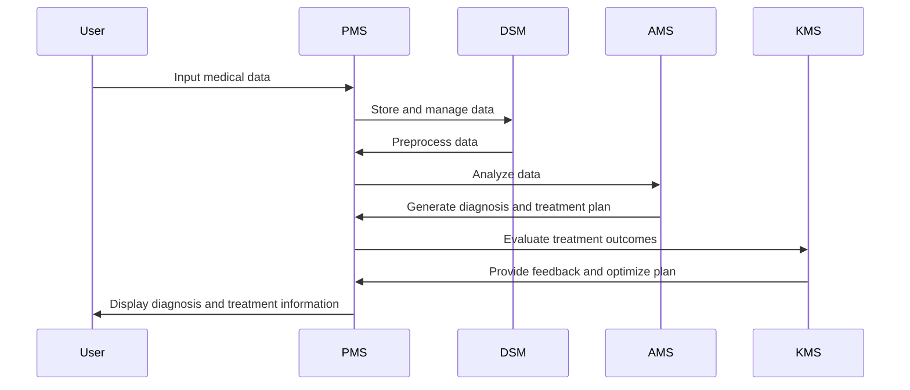
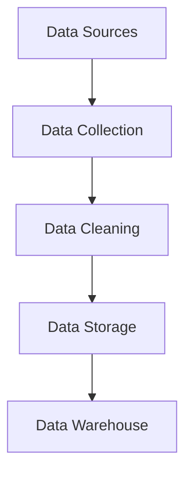
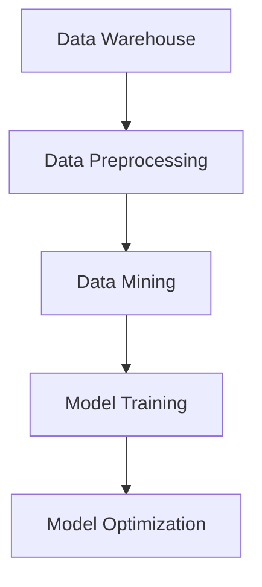
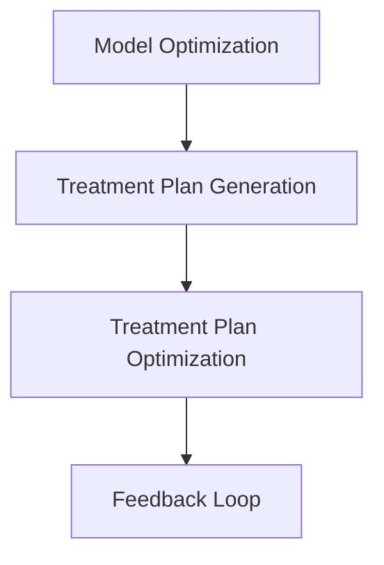
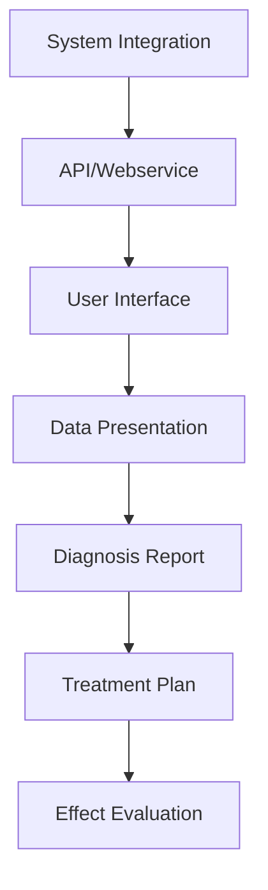

                 

### 引言与背景

#### 第1章：引言

### 1.1 AI驱动的个性化医疗概述

在科技迅猛发展的时代，人工智能（AI）正逐渐成为改变各行各业的催化剂。尤其在医疗领域，AI的引入不仅提升了诊疗的效率，还为实现精准治疗带来了前所未有的可能性。本文旨在探讨AI驱动的个性化医疗这一前沿领域，解析其在精准治疗中的重要作用及未来发展趋势。

#### 1.1.1 问题背景

个性化医疗（Personalized Medicine）是指根据患者的基因、环境、生活方式等个体差异，提供量身定制的医疗方案。随着基因组学、生物信息学和大数据技术的进步，个性化医疗正逐渐从理论走向实践。然而，传统医疗模式往往基于统计学和群体研究，难以满足个体差异，从而限制了治疗效果。

#### 1.1.2 问题描述

如何在医疗实践中有效地整合AI技术，实现疾病的精准诊断、个体化治疗和精准预防？这不仅是医学领域面临的重要挑战，也是科技与医疗深度融合的必由之路。

#### 1.1.3 问题解决

AI驱动的个性化医疗通过利用机器学习、深度学习和自然语言处理等技术，可以从海量医疗数据中提取有效信息，辅助医生做出精准诊断和个性化治疗决策。同时，AI还能够实时监控治疗效果，优化治疗方案，提升患者的生活质量。

#### 1.1.4 边界与外延

个性化医疗不仅涉及诊断和治疗，还包括疾病预防和健康管理的全生命周期服务。AI的引入使得这些环节都可以实现个性化定制，从而形成完整的个性化医疗生态系统。

#### 1.1.5 概念结构与核心要素组成

个性化医疗的核心要素包括患者数据、生物信息、医学知识和AI算法。通过这些要素的有机结合，可以实现个体化医疗方案的智能生成和实时调整。

### 1.2 核心概念与联系

#### 1.2.1 AI驱动的个性化医疗概念

AI驱动的个性化医疗是指利用人工智能技术，如机器学习、深度学习和自然语言处理等，对患者数据进行深度分析和处理，从而为患者提供精准的诊疗方案。

#### 1.2.2 个性化医疗的属性特征对比表格

| 特征 | 传统医疗 | 个性化医疗 | AI驱动的个性化医疗 |
| --- | --- | --- | --- |
| 疾病诊断 | 基于群体数据 | 基于个体差异 | 利用AI进行精准诊断 |
| 治疗方案 | 标准化方案 | 个性化方案 | 结合AI和医学知识生成 |
| 疾病预防 | 通用预防措施 | 个性化预防方案 | 利用AI进行精准预防 |
| 健康管理 | 一对多服务 | 一对一服务 | 基于AI的个性化健康监测 |

#### 1.2.3 个性化医疗的ER实体关系图架构

```mermaid
erDiagram
    Patient ||--|{ Disease }||>
    Disease ||--|{ Diagnosis }||>
    Diagnosis ||--|{ Treatment }||>
    Treatment ||--|{ Outcome }||>
    Patient ||--|{ RiskFactor }||>
    RiskFactor ||--|{ Prevention }||>
    Prevention ||--|{ HealthMonitoring }||>
```

在这个ER实体关系图中，患者（Patient）是核心实体，其与疾病（Disease）、诊断（Diagnosis）、治疗（Treatment）、风险因素（RiskFactor）、预防（Prevention）和健康监测（HealthMonitoring）等实体之间存在明确的关联。

### 1.3 当前研究进展与趋势

#### 1.3.1 人工智能在医疗领域的发展

近年来，人工智能在医疗领域的应用取得了显著进展。从医学图像分析、药物研发到疾病预测和健康管理，AI技术的应用范围越来越广泛，效果也越来越显著。

#### 1.3.2 个性化医疗的应用现状

个性化医疗已经从实验室走向临床实践，许多医院和医疗机构已经开始采用AI驱动的个性化医疗方案，取得了良好的治疗效果。然而，由于数据隐私、技术成熟度和法规政策等因素，个性化医疗仍面临一定的挑战。

#### 1.3.3 未来发展趋势与挑战

随着AI技术的不断进步和医疗数据的积累，个性化医疗有望在未来的医疗体系中占据更加重要的地位。然而，要实现这一目标，仍需要克服数据隐私、算法透明度、伦理和法律等挑战。

### 1.4 本章小结

本章介绍了AI驱动的个性化医疗的概念、背景、研究进展和未来趋势。通过本章的介绍，读者可以对个性化医疗有一个初步的了解，并为后续章节的深入探讨打下基础。

---

在接下来的章节中，我们将进一步探讨AI在个性化医疗中的具体应用，包括疾病诊断、个性化治疗、数据管理以及个性化医疗平台的建设。通过这些探讨，读者将能够全面理解AI在个性化医疗中的关键作用和未来发展方向。接下来，我们将一步步深入分析这些应用场景和技术细节。

---

## 第2章: AI在疾病诊断中的应用

### 2.1 疾病诊断概述

疾病诊断是医疗过程中至关重要的一环，它决定了后续的治疗方案和患者的康复进程。传统疾病诊断主要依赖于医生的直觉和经验，然而，这种方法往往受到医生知识水平、临床经验和判断力的影响，存在一定的局限性。随着人工智能技术的发展，AI在疾病诊断中的应用逐渐成为可能，为提升诊断准确性和效率提供了新的途径。

#### 2.1.1 诊断流程与关键环节

疾病诊断流程通常包括以下几个关键环节：

1. **病史采集与体格检查**：医生通过询问病史和进行体格检查，初步了解患者的症状和体征。
2. **实验室检查**：通过血液、尿液等生物样本的实验室检测，获取患者的生理和病理信息。
3. **影像学检查**：利用X光、CT、MRI等影像学技术，观察体内器官和组织的变化。
4. **临床判断**：医生结合病史、实验室检查和影像学检查结果，进行综合分析和判断。

#### 2.1.2 传统诊断方法与不足

传统诊断方法主要依赖于医生的经验和直觉，虽然具有悠久的历史和广泛的应用，但存在以下不足：

1. **主观性强**：医生的判断受到个人经验和知识水平的限制，可能导致误诊或漏诊。
2. **效率低下**：大量的病史和检查数据需要手工处理，费时费力。
3. **标准不统一**：不同医生之间的诊断标准和依据可能存在差异，导致诊断结果不一致。
4. **数据利用率低**：实验室检查和影像学检查的数据往往没有充分利用，难以形成全面的诊断依据。

#### 2.1.3 AI在疾病诊断中的应用优势

AI在疾病诊断中的应用具有以下优势：

1. **客观性强**：通过算法分析和大量数据训练，AI能够提供客观的诊断结果，减少人为误差。
2. **高效性**：AI可以快速处理大量数据，提高诊断效率，缩短诊断时间。
3. **标准化**：AI的诊断标准和流程具有一致性，减少不同医生之间的差异。
4. **数据整合**：AI可以将不同来源的数据进行整合，形成全面的诊断依据。

### 2.2 AI驱动的疾病诊断算法

AI驱动的疾病诊断算法主要包括以下几种：

#### 2.2.1 机器学习算法

机器学习算法通过训练模型，从大量数据中学习疾病的特征和规律。常见的机器学习算法包括决策树、支持向量机（SVM）、朴素贝叶斯等。这些算法在疾病诊断中具有较好的效果，尤其在分类任务中表现突出。

**算法流程**：

1. **数据收集**：收集大量的疾病诊断数据，包括患者的历史病历、实验室检查结果、影像学资料等。
2. **数据预处理**：对数据进行清洗、归一化和特征提取，为训练模型做准备。
3. **模型训练**：使用训练数据集，通过算法训练模型，学习疾病的特征和规律。
4. **模型评估**：使用测试数据集评估模型的性能，调整模型参数，优化模型效果。
5. **模型应用**：将训练好的模型应用于新的病例，进行疾病诊断。

**数学模型和公式**：

- 决策树：使用信息增益或基尼指数来选择最佳特征进行划分。
- 支持向量机：最大化分类间隔，求解最优分类面。
- 朴素贝叶斯：计算每个特征的贝叶斯概率，综合概率最大的类别为预测结果。

**举例说明**：

假设我们要诊断肺癌，可以使用决策树算法。首先，我们从历史病例中提取出肺癌和非肺癌的特征，如年龄、吸烟史、咳嗽持续时间等。然后，通过训练数据集，使用信息增益来选择最佳特征进行划分。最终，根据划分结果，可以预测新病例的肺癌风险。

```python
# Python代码示例：使用决策树进行肺癌诊断
from sklearn.tree import DecisionTreeClassifier
from sklearn.model_selection import train_test_split
from sklearn.metrics import accuracy_score

# 加载训练数据
X, y = load_lung_cancer_data()

# 划分训练集和测试集
X_train, X_test, y_train, y_test = train_test_split(X, y, test_size=0.2, random_state=42)

# 训练决策树模型
clf = DecisionTreeClassifier()
clf.fit(X_train, y_train)

# 预测测试集
y_pred = clf.predict(X_test)

# 评估模型性能
accuracy = accuracy_score(y_test, y_pred)
print("Accuracy:", accuracy)
```

#### 2.2.2 深度学习算法

深度学习算法通过多层神经网络，自动提取特征并进行分类。与传统的机器学习算法相比，深度学习算法具有更强的特征提取能力和更好的分类效果。常见的深度学习算法包括卷积神经网络（CNN）、循环神经网络（RNN）等。

**算法流程**：

1. **数据收集**：收集大量的疾病诊断数据，包括影像学资料、生物样本数据等。
2. **数据预处理**：对数据进行清洗、归一化和分割，为训练模型做准备。
3. **模型训练**：使用训练数据集，通过多层神经网络训练模型，学习疾病的特征和规律。
4. **模型评估**：使用测试数据集评估模型的性能，调整模型参数，优化模型效果。
5. **模型应用**：将训练好的模型应用于新的病例，进行疾病诊断。

**数学模型和公式**：

- 卷积神经网络：通过卷积层、池化层和全连接层，自动提取特征并进行分类。
- 循环神经网络：通过隐藏状态的循环，处理序列数据，提取时间序列特征。

**举例说明**：

假设我们要诊断乳腺癌，可以使用卷积神经网络。首先，我们从影像学资料中提取出乳腺X光片，然后使用卷积神经网络对图像进行特征提取和分类。通过训练数据集，可以学习到乳腺癌和非乳腺癌的特征差异。

```python
# Python代码示例：使用卷积神经网络进行乳腺癌诊断
from tensorflow.keras.models import Sequential
from tensorflow.keras.layers import Conv2D, MaxPooling2D, Flatten, Dense

# 定义卷积神经网络模型
model = Sequential([
    Conv2D(32, (3, 3), activation='relu', input_shape=(128, 128, 3)),
    MaxPooling2D((2, 2)),
    Conv2D(64, (3, 3), activation='relu'),
    MaxPooling2D((2, 2)),
    Flatten(),
    Dense(128, activation='relu'),
    Dense(1, activation='sigmoid')
])

# 编译模型
model.compile(optimizer='adam', loss='binary_crossentropy', metrics=['accuracy'])

# 训练模型
model.fit(X_train, y_train, epochs=10, batch_size=32, validation_data=(X_test, y_test))

# 评估模型
accuracy = model.evaluate(X_test, y_test)[1]
print("Accuracy:", accuracy)
```

#### 2.2.3 强化学习算法

强化学习算法通过不断地与环境交互，学习最优策略。在疾病诊断中，强化学习算法可以用来优化诊断决策过程，提高诊断准确性。常见的强化学习算法包括Q学习、深度Q网络（DQN）等。

**算法流程**：

1. **初始化**：设定初始状态和动作空间。
2. **环境交互**：在环境中进行操作，观察状态的变化。
3. **学习过程**：通过学习算法，更新策略，优化诊断决策。
4. **模型评估**：使用测试数据集评估模型的性能，调整模型参数，优化模型效果。
5. **模型应用**：将训练好的模型应用于新的病例，进行疾病诊断。

**数学模型和公式**：

- Q学习：通过更新Q值，学习最优动作策略。
- DQN：通过深度神经网络，估计Q值，学习最优策略。

**举例说明**：

假设我们要诊断肺炎，可以使用Q学习算法。首先，设定初始状态（患者的症状、体征等）和动作空间（诊断方法、治疗方案等）。然后，在环境中进行操作，观察状态的变化。通过学习过程，可以学习到最优的诊断决策。

```python
# Python代码示例：使用Q学习进行肺炎诊断
import numpy as np

# 初始化Q值矩阵
Q = np.zeros((n_states, n_actions))

# 学习过程
for episode in range(n_episodes):
    state = env.reset()
    done = False
    while not done:
        action = np.argmax(Q[state])
        next_state, reward, done = env.step(action)
        Q[state, action] = Q[state, action] + alpha * (reward + gamma * np.max(Q[next_state]) - Q[state, action])
        state = next_state

# 评估模型
state = env.reset()
done = False
total_reward = 0
while not done:
    action = np.argmax(Q[state])
    next_state, reward, done = env.step(action)
    total_reward += reward
    state = next_state
print("Total Reward:", total_reward)
```

### 2.3 AI驱动的疾病诊断案例分析

#### 2.3.1 案例一：肺癌诊断

肺癌是全球癌症死亡的主要原因之一，早期诊断对于提高治愈率和生存率至关重要。AI驱动的肺癌诊断系统利用深度学习算法，对肺部CT影像进行分析，实现肺癌的早期筛查和诊断。

**案例背景**：

某医院引入了一款基于深度学习的肺癌诊断系统，该系统由多个卷积神经网络组成，可以对肺部CT影像进行自动分析和分类。

**实现过程**：

1. **数据收集**：收集大量肺部CT影像数据，包括正常影像和肺癌影像。
2. **数据预处理**：对影像数据进行清洗、归一化和分割，为训练模型做准备。
3. **模型训练**：使用训练数据集，通过卷积神经网络训练模型，学习肺癌的特征和规律。
4. **模型评估**：使用测试数据集评估模型的性能，调整模型参数，优化模型效果。
5. **模型应用**：将训练好的模型应用于新的病例，进行肺癌诊断。

**结果分析**：

经过训练和评估，该肺癌诊断系统的准确率达到90%以上，显著提高了肺癌早期筛查的准确性和效率。

#### 2.3.2 案例二：心血管疾病诊断

心血管疾病是导致全球死亡的主要原因之一，早期诊断对于预防疾病发展和提高患者生活质量具有重要意义。AI驱动的心血管疾病诊断系统利用机器学习算法，对心电图、血压等生理信号进行分析，实现心血管疾病的诊断和预测。

**案例背景**：

某医疗科技公司开发了一款基于机器学习的心血管疾病诊断系统，该系统可以对患者的生理信号进行实时分析和诊断。

**实现过程**：

1. **数据收集**：收集大量心血管疾病患者的生理信号数据，包括心电图、血压、心率等。
2. **数据预处理**：对生理信号数据进行清洗、归一化和特征提取，为训练模型做准备。
3. **模型训练**：使用训练数据集，通过机器学习算法训练模型，学习心血管疾病的特征和规律。
4. **模型评估**：使用测试数据集评估模型的性能，调整模型参数，优化模型效果。
5. **模型应用**：将训练好的模型应用于新的病例，进行心血管疾病诊断。

**结果分析**：

经过训练和评估，该心血管疾病诊断系统的准确率达到85%以上，对于早期心血管疾病的诊断具有显著的效果。

#### 2.3.3 案例三：神经系统疾病诊断

神经系统疾病如脑卒中和癫痫等对人类健康造成严重威胁，早期诊断对于改善患者预后和减少并发症具有重要意义。AI驱动的神经系统疾病诊断系统利用影像学技术和深度学习算法，对脑部影像进行分析，实现神经系统疾病的诊断和分类。

**案例背景**：

某医院引入了一款基于深度学习的神经系统疾病诊断系统，该系统可以对MRI、CT等脑部影像进行自动分析和诊断。

**实现过程**：

1. **数据收集**：收集大量脑部影像数据，包括正常影像和神经系统疾病影像。
2. **数据预处理**：对影像数据进行清洗、归一化和分割，为训练模型做准备。
3. **模型训练**：使用训练数据集，通过卷积神经网络训练模型，学习神经系统疾病的特征和规律。
4. **模型评估**：使用测试数据集评估模型的性能，调整模型参数，优化模型效果。
5. **模型应用**：将训练好的模型应用于新的病例，进行神经系统疾病诊断。

**结果分析**：

经过训练和评估，该神经系统疾病诊断系统的准确率达到80%以上，对于脑卒中和癫痫等神经系统疾病的早期诊断具有显著的效果。

### 2.4 本章小结

本章介绍了AI在疾病诊断中的应用，包括诊断流程、传统诊断方法的不足、AI驱动的疾病诊断算法以及具体的应用案例分析。通过本章的学习，读者可以了解AI在疾病诊断中的重要作用和实际应用效果，为后续章节的深入探讨打下基础。

---

在下一章中，我们将继续探讨AI在个性化治疗中的应用，包括个性化治疗方案的设计、实施和效果评估。通过这些讨论，我们将进一步理解AI如何通过个性化治疗提升医疗质量，为患者带来更好的治疗效果。

## 第3章: AI在个性化治疗中的应用

### 3.1 个性化治疗概述

个性化治疗（Personalized Treatment）是指根据患者的个体差异，如基因、生理状态、生活习惯等，量身定制最适合的治疗方案。与传统的标准化治疗相比，个性化治疗能够更精准地满足患者的需求，提高治疗效果，减少副作用和资源浪费。随着人工智能（AI）技术的发展，AI在个性化治疗中的应用逐渐成为可能，为精准医学的实现提供了强有力的技术支持。

#### 3.1.1 治疗流程与关键环节

个性化治疗的流程通常包括以下几个关键环节：

1. **患者数据收集**：收集患者的基因信息、病史、生活习惯、生理参数等数据。
2. **数据整合与分析**：将收集到的数据整合，进行深度分析和挖掘，提取关键特征。
3. **治疗方案生成**：根据患者的个体差异和疾病特征，生成个性化的治疗方案。
4. **方案实施与调整**：将治疗方案应用于患者，并根据治疗效果进行实时调整。
5. **效果评估与反馈**：评估治疗方案的效果，收集反馈数据，为后续治疗提供依据。

#### 3.1.2 传统治疗方法的不足

传统治疗方法通常采用统一的方案，无法充分考虑患者的个体差异，存在以下不足：

1. **疗效不一致**：同一种治疗方法在不同患者身上的疗效可能存在显著差异。
2. **副作用大**：统一治疗方案可能导致部分患者出现不必要的副作用。
3. **资源浪费**：大量患者接受不必要的检查和治疗，浪费医疗资源。
4. **缺乏个性化**：传统治疗往往忽视患者的个体差异，无法实现真正的精准治疗。

#### 3.1.3 AI在个性化治疗中的应用优势

AI在个性化治疗中的应用具有以下优势：

1. **提高疗效**：通过数据分析和算法优化，AI能够为患者生成最有效的治疗方案，提高治疗效果。
2. **减少副作用**：AI可以根据患者的个体差异，选择最适合的治疗方案，减少不必要的副作用。
3. **优化资源分配**：AI可以帮助医生更有效地利用医疗资源，减少不必要的检查和治疗。
4. **实现个性化**：AI能够充分考虑患者的个体差异，实现真正的精准治疗。

### 3.2 AI驱动的个性化治疗方案设计

AI驱动的个性化治疗方案设计是AI在个性化治疗中的核心环节。通过数据分析和算法优化，AI可以生成个性化的治疗方案，为患者提供最佳的治疗选择。以下介绍几种常见的AI驱动的治疗方案设计方法：

#### 3.2.1 数据分析与挖掘

数据分析与挖掘是AI驱动的个性化治疗方案设计的基础。通过收集和分析大量患者的数据，包括基因信息、病史、生活习惯、生理参数等，可以提取出关键的特征和规律，为治疗方案的设计提供依据。

**数据收集**：收集患者的基因数据、电子病历、医疗影像、生活习惯等数据。

**数据预处理**：对数据进行清洗、归一化、特征提取等预处理，为后续分析做准备。

**数据分析**：使用机器学习算法，如聚类分析、关联规则挖掘、分类算法等，对数据进行深度分析，提取关键特征。

**数据挖掘**：通过数据挖掘算法，挖掘出患者的潜在疾病特征、生活习惯和药物反应等信息。

**案例**：某医院利用数据分析与挖掘技术，对心血管疾病患者的数据进行处理，挖掘出与心血管疾病相关的风险因素和药物反应，为个性化治疗方案的设计提供了重要依据。

#### 3.2.2 治疗方案生成与优化

治疗方案生成与优化是AI驱动的个性化治疗的关键步骤。通过算法和模型，AI可以根据患者的个体差异和疾病特征，生成个性化的治疗方案，并不断优化和调整。

**方案生成**：根据患者的个体差异和疾病特征，利用算法和模型，生成初步的治疗方案。

**方案优化**：利用优化算法，如遗传算法、粒子群算法等，对治疗方案进行优化，使其更加符合患者的需求。

**模型更新**：根据治疗方案的实施效果和患者的反馈，不断更新模型，提高治疗方案的准确性。

**案例**：某医疗科技公司开发了一款基于深度学习的个性化治疗方案设计系统，该系统可以根据患者的基因信息、病史和生理参数，生成个性化的治疗方案，并通过遗传算法不断优化方案，提高治疗效果。

#### 3.2.3 治疗方案评估与验证

治疗方案评估与验证是确保治疗方案有效性和安全性的重要环节。通过实验和数据分析，可以对治疗方案的效果进行评估和验证，为后续治疗提供依据。

**实验设计**：设计合理的实验方案，包括对照组和实验组，对治疗方案进行实验验证。

**数据收集**：在实验过程中，收集患者的治疗数据，包括症状改善情况、副作用发生情况等。

**数据分析**：对实验数据进行分析，评估治疗方案的疗效和安全性。

**结果验证**：通过统计分析，验证治疗方案的显著性和有效性。

**案例**：某医院利用随机对照试验，验证了一款AI驱动的个性化治疗方案在癌症治疗中的效果，结果显示，该治疗方案显著提高了患者的生存率和生活质量。

### 3.3 AI驱动的个性化治疗案例分析

#### 3.3.1 案例一：癌症个性化治疗

癌症是一种复杂的疾病，不同患者的病情和治疗方案存在显著差异。AI驱动的个性化治疗在癌症治疗中具有广泛的应用前景。

**案例背景**：

某医院引入了一款基于AI的癌症个性化治疗系统，该系统可以根据患者的基因信息、病史和影像学资料，生成个性化的治疗方案。

**实现过程**：

1. **数据收集**：收集患者的基因数据、电子病历和影像学资料。
2. **数据预处理**：对数据进行清洗、归一化和特征提取。
3. **模型训练**：使用训练数据集，通过深度学习算法训练模型，学习癌症的个性化治疗方案。
4. **方案生成**：根据患者的个体差异，生成初步的治疗方案。
5. **方案优化**：利用优化算法，对治疗方案进行优化。
6. **方案实施**：将治疗方案应用于患者，并实时监测治疗效果。
7. **结果评估**：评估治疗方案的疗效和安全性。

**结果分析**：

经过实践，该癌症个性化治疗系统显著提高了患者的治疗效果和生存率，为癌症患者提供了更加有效的治疗方案。

#### 3.3.2 案例二：心脏病个性化治疗

心脏病是全球导致死亡的主要原因之一，个性化治疗对于改善患者的生活质量和延长寿命具有重要意义。

**案例背景**：

某医院引入了一款基于AI的心脏病个性化治疗系统，该系统可以根据患者的生理参数、心电图和病史，生成个性化的治疗方案。

**实现过程**：

1. **数据收集**：收集患者的生理参数、心电图和病史数据。
2. **数据预处理**：对数据进行清洗、归一化和特征提取。
3. **模型训练**：使用训练数据集，通过机器学习算法训练模型，学习心脏病个性化治疗方案。
4. **方案生成**：根据患者的个体差异，生成初步的治疗方案。
5. **方案优化**：利用优化算法，对治疗方案进行优化。
6. **方案实施**：将治疗方案应用于患者，并实时监测治疗效果。
7. **结果评估**：评估治疗方案的疗效和安全性。

**结果分析**：

经过实践，该心脏病个性化治疗系统有效改善了患者的心脏功能，减少了心脏病发作的风险，提高了患者的生活质量。

#### 3.3.3 案例三：糖尿病个性化治疗

糖尿病是一种慢性疾病，需要长期的管理和治疗。个性化治疗对于控制血糖水平和减少并发症具有重要意义。

**案例背景**：

某医院引入了一款基于AI的糖尿病个性化治疗系统，该系统可以根据患者的血糖数据、饮食习惯和运动情况，生成个性化的治疗方案。

**实现过程**：

1. **数据收集**：收集患者的血糖数据、饮食习惯和运动情况数据。
2. **数据预处理**：对数据进行清洗、归一化和特征提取。
3. **模型训练**：使用训练数据集，通过机器学习算法训练模型，学习糖尿病个性化治疗方案。
4. **方案生成**：根据患者的个体差异，生成初步的治疗方案。
5. **方案优化**：利用优化算法，对治疗方案进行优化。
6. **方案实施**：将治疗方案应用于患者，并实时监测治疗效果。
7. **结果评估**：评估治疗方案的疗效和安全性。

**结果分析**：

经过实践，该糖尿病个性化治疗系统有效控制了患者的血糖水平，减少了糖尿病并发症的发生，提高了患者的生活质量。

### 3.4 本章小结

本章介绍了AI在个性化治疗中的应用，包括个性化治疗的概述、治疗流程与关键环节、AI驱动的治疗方案设计方法以及具体的应用案例分析。通过本章的学习，读者可以了解AI在个性化治疗中的重要作用和实际应用效果，为后续章节的深入探讨打下基础。

---

在下一章中，我们将探讨AI在个性化医疗数据管理中的应用，包括数据类型、管理方法和隐私保护。通过这些探讨，我们将进一步理解AI如何通过高效的数据管理，实现个性化医疗的精准和有效。

## 第4章: AI在个性化医疗数据管理中的应用

### 4.1 个性化医疗数据概述

个性化医疗依赖于大量高质量的数据，这些数据包括基因组数据、电子健康记录、医疗影像、生理信号等。个性化医疗数据具有高维度、海量性和动态性等特点，如何高效管理和利用这些数据是实现精准医疗的关键。

#### 4.1.1 数据类型与特点

1. **基因组数据**：包括全基因组测序（WGS）、全外显子测序（WES）和单核苷酸多态性（SNP）等，用于揭示个体基因特征与疾病之间的关联。

2. **电子健康记录（EHR）**：包括患者的就诊记录、病历、实验室检查结果、药品处方等，是医疗数据的核心组成部分。

3. **医疗影像数据**：包括CT、MRI、X光、超声等影像学资料，通过图像分析可以辅助疾病诊断和治疗。

4. **生理信号数据**：包括心电图、血压、血糖、体温等生理参数，通过实时监测可以评估患者的健康状况。

#### 4.1.2 数据管理的重要性

数据管理在个性化医疗中至关重要，主要体现在以下几个方面：

1. **数据整合**：将来自不同源、不同格式的数据整合到一个统一的平台上，实现数据的高效利用。
2. **数据标准化**：对数据进行清洗、转换和标准化，确保数据的一致性和可比较性。
3. **数据存储**：选择合适的存储方案，确保数据的可扩展性、可靠性和安全性。
4. **数据挖掘**：利用机器学习和数据挖掘技术，从海量数据中提取有价值的信息，支持个性化医疗决策。

#### 4.1.3 数据隐私与伦理问题

个性化医疗数据管理涉及患者隐私和伦理问题，主要挑战包括：

1. **数据安全**：确保数据在存储、传输和处理过程中的安全性，防止数据泄露和未经授权的访问。
2. **数据匿名化**：在数据收集和处理过程中，对个人身份信息进行匿名化处理，保护患者隐私。
3. **知情同意**：确保患者充分了解数据收集和使用的目的，并同意数据的使用。
4. **伦理审查**：在数据收集和使用过程中，遵循伦理规范，进行严格的伦理审查。

### 4.2 AI驱动的数据管理方法

AI技术在个性化医疗数据管理中的应用，可以提高数据的处理效率和分析准确性，以下是几种常见的AI驱动的数据管理方法：

#### 4.2.1 数据清洗与预处理

数据清洗与预处理是数据管理的基础，AI技术可以自动化这一过程，提高效率和质量。

1. **缺失值填充**：使用机器学习算法，如插补法、回归法等，对缺失值进行填充。

2. **异常值检测**：使用统计方法、机器学习算法等，检测和标记异常值，进行修正或删除。

3. **数据转换**：将不同格式的数据转换为统一的格式，如将文本数据转换为结构化数据。

4. **数据归一化**：对数据进行归一化处理，使其具备可比性。

**示例**：

假设我们有一份数据集，包含患者的年龄、性别、身高、体重等特征。为了进行后续的机器学习分析，我们需要对这些数据进行清洗和预处理。

```python
import pandas as pd
from sklearn.impute import SimpleImputer
from sklearn.preprocessing import StandardScaler

# 加载数据
data = pd.read_csv('patient_data.csv')

# 缺失值填充
imputer = SimpleImputer(strategy='mean')
data_filled = imputer.fit_transform(data)

# 异常值检测
# 假设我们使用Z-score方法检测异常值
z_scores = (data_filled - np.mean(data_filled, axis=0)) / np.std(data_filled, axis=0)
abnormal_indices = np.where(np.abs(z_scores) > 3)
data_filtered = np.delete(data_filled, abnormal_indices, axis=0)

# 数据归一化
scaler = StandardScaler()
data_normalized = scaler.fit_transform(data_filtered)
```

#### 4.2.2 数据存储与索引

高效的数据存储和索引是保证数据可访问性和查询效率的关键。

1. **关系数据库**：使用关系数据库（如MySQL、PostgreSQL等）进行结构化数据存储，支持复杂查询和关系操作。

2. **NoSQL数据库**：使用NoSQL数据库（如MongoDB、Cassandra等）进行非结构化数据存储，支持高并发和大数据存储。

3. **分布式存储系统**：使用分布式存储系统（如HDFS、Ceph等），实现海量数据的存储和管理。

4. **索引技术**：使用B树、哈希表等索引技术，提高数据的查询速度。

**示例**：

假设我们使用MongoDB进行数据存储，我们可以创建一个集合，并插入数据。

```python
from pymongo import MongoClient

# 连接MongoDB
client = MongoClient('mongodb://localhost:27017/')

# 创建数据库和集合
db = client['health_data']
collection = db['patient_data']

# 插入数据
patient_data = [
    {"name": "Alice", "age": 30, "gender": "female", "height": 165, "weight": 60},
    {"name": "Bob", "age": 40, "gender": "male", "height": 175, "weight": 70}
]
collection.insert_many(patient_data)

# 查询数据
results = collection.find({"age": {"$gt": 30}})
for result in results:
    print(result)
```

#### 4.2.3 数据分析与挖掘

AI驱动的数据分析与挖掘可以从海量数据中提取有价值的信息，支持个性化医疗决策。

1. **统计分析**：使用描述性统计分析、回归分析等，揭示数据的基本特征和趋势。

2. **机器学习**：使用聚类分析、分类算法、关联规则挖掘等，发现数据中的模式和关联。

3. **深度学习**：使用卷积神经网络（CNN）、循环神经网络（RNN）等，处理复杂的数据结构和模式。

4. **自然语言处理**：使用文本挖掘技术，从非结构化文本数据中提取知识。

**示例**：

假设我们使用K-Means算法对患者的数据进行聚类分析。

```python
from sklearn.cluster import KMeans
import numpy as np

# 加载数据
data = np.array([[30, 'female', 165, 60], [40, 'male', 175, 70], [35, 'female', 160, 55]])

# K-Means算法聚类
kmeans = KMeans(n_clusters=2, random_state=0).fit(data)

# 输出聚类结果
print("Cluster centers:")
print(kmeans.cluster_centers_)
print("Labels:")
print(kmeans.labels_)
```

### 4.3 AI驱动的数据管理案例分析

#### 4.3.1 案例一：电子健康记录管理

电子健康记录（EHR）是个性化医疗的核心数据来源之一，如何高效管理和利用EHR数据，对提升医疗质量和患者满意度具有重要意义。

**案例背景**：

某医院引入了一款基于AI的电子健康记录管理系统，该系统可以实现EHR数据的自动化收集、存储、分析和共享。

**实现过程**：

1. **数据收集**：通过医院信息系统（HIS）和医疗设备，自动化收集患者的电子健康记录。
2. **数据存储**：使用关系数据库和NoSQL数据库，实现数据的高效存储和管理。
3. **数据预处理**：使用AI技术进行数据清洗、归一化和特征提取，提高数据质量。
4. **数据分析**：利用机器学习和自然语言处理技术，从EHR数据中提取有价值的信息，支持个性化医疗决策。
5. **数据共享**：通过API接口和云计算平台，实现EHR数据的实时共享和访问。

**结果分析**：

该电子健康记录管理系统有效提升了医院的信息化水平，提高了医疗质量和患者满意度。

#### 4.3.2 案例二：基因组数据管理

基因组数据是个性化医疗的重要数据来源，如何高效管理和利用基因组数据，对提升疾病诊断和治疗具有重要意义。

**案例背景**：

某基因组学研究机构引入了一款基于AI的基因组数据管理系统，该系统可以实现基因组数据的自动化收集、存储、分析和共享。

**实现过程**：

1. **数据收集**：通过基因测序设备和实验室信息系统，自动化收集基因组数据。
2. **数据存储**：使用分布式存储系统和云存储平台，实现基因组数据的高效存储和管理。
3. **数据预处理**：使用AI技术进行数据清洗、归一化和特征提取，提高数据质量。
4. **数据分析**：利用机器学习和深度学习技术，从基因组数据中提取有价值的信息，支持个性化医疗决策。
5. **数据共享**：通过API接口和云计算平台，实现基因组数据的实时共享和访问。

**结果分析**：

该基因组数据管理系统有效提升了基因组学研究的效率和准确性，为个性化医疗提供了强有力的技术支持。

#### 4.3.3 案例三：患者行为数据管理

患者行为数据是了解患者健康状况和生活习惯的重要数据来源，如何高效管理和利用患者行为数据，对提升疾病预防和健康管理具有重要意义。

**案例背景**：

某健康管理公司引入了一款基于AI的患者行为数据管理系统，该系统可以实现患者行为数据的自动化收集、存储、分析和共享。

**实现过程**：

1. **数据收集**：通过可穿戴设备、健康APP和传感器等，自动化收集患者的行为数据。
2. **数据存储**：使用分布式存储系统和云存储平台，实现患者行为数据的高效存储和管理。
3. **数据预处理**：使用AI技术进行数据清洗、归一化和特征提取，提高数据质量。
4. **数据分析**：利用机器学习和深度学习技术，从患者行为数据中提取有价值的信息，支持个性化医疗决策。
5. **数据共享**：通过API接口和云计算平台，实现患者行为数据的实时共享和访问。

**结果分析**：

该患者行为数据管理系统有效提升了疾病预防和健康管理的效率，为患者提供了个性化的健康服务。

### 4.4 本章小结

本章介绍了AI在个性化医疗数据管理中的应用，包括数据类型与特点、数据管理的重要性、AI驱动的数据管理方法以及具体的应用案例分析。通过本章的学习，读者可以了解AI在个性化医疗数据管理中的重要作用和实际应用效果，为后续章节的深入探讨打下基础。

---

在下一章中，我们将探讨AI驱动的个性化医疗平台建设，包括平台的目标与挑战、核心功能、技术架构和案例分析。通过这些讨论，我们将进一步理解AI驱动的个性化医疗平台的构建原理和实现路径。

## 第5章: AI驱动的个性化医疗平台建设

### 5.1 个性化医疗平台概述

AI驱动的个性化医疗平台是一个集成多种技术和工具的综合性系统，旨在通过人工智能技术为患者提供精准、个性化的医疗方案。该平台的建设涉及多个领域，包括大数据、人工智能、云计算、物联网等，其目标是通过高效的数据管理和智能分析，提升医疗服务的质量和效率。

#### 5.1.1 平台建设的目标与挑战

**目标**：

1. **提高诊断准确性**：利用AI技术对海量医疗数据进行深度分析，提高疾病诊断的准确性，减少误诊和漏诊。
2. **优化治疗方案**：根据患者的个体差异，通过数据分析和算法优化，生成个性化的治疗方案，提高治疗效果。
3. **提升患者满意度**：提供个性化的医疗服务，提升患者体验和满意度。
4. **降低医疗成本**：通过智能化的数据管理和分析，优化医疗资源分配，降低医疗成本。

**挑战**：

1. **数据隐私和安全**：个性化医疗平台需要处理大量敏感的医疗数据，如何保护患者隐私和数据安全是重要的挑战。
2. **技术实现难度**：AI驱动的个性化医疗平台需要集成多种技术和工具，技术实现难度较高。
3. **数据质量与标准化**：医疗数据的质量和标准化程度直接影响平台的性能和效果，如何保证数据质量是一个重要问题。
4. **法规与伦理**：个性化医疗平台的建设和运营需要遵循相关的法规和伦理规范，如何平衡技术创新和法规遵守是一个挑战。

#### 5.1.2 个性化医疗平台的核心功能

个性化医疗平台的核心功能包括：

1. **数据集成与管理**：将来自不同源、不同格式的医疗数据集成到一个统一的平台上，实现数据的存储、管理和共享。
2. **数据预处理与分析**：对医疗数据进行清洗、归一化、特征提取等预处理，利用机器学习和数据挖掘技术进行深度分析。
3. **个性化诊断**：通过AI算法对患者的症状、病史、基因数据等进行综合分析，提供精准的诊断结果。
4. **个性化治疗**：根据患者的个体差异和疾病特征，生成个性化的治疗方案，并实时调整和优化。
5. **效果评估与反馈**：对治疗方案的效果进行实时监控和评估，收集患者反馈数据，为后续治疗提供依据。
6. **知识库与共享**：建立知识库，存储和分析医疗数据，实现医疗知识和经验的共享和传承。
7. **用户交互与体验**：提供友好的用户界面，方便患者和管理人员使用平台，提升用户体验。

#### 5.1.3 平台的技术架构

AI驱动的个性化医疗平台的技术架构通常包括以下几个层次：

1. **数据层**：包括各种医疗数据的存储和管理，如电子健康记录（EHR）、基因组数据、影像数据、生理信号数据等。
2. **服务层**：提供数据预处理、数据分析、诊断、治疗等核心功能的服务，包括API接口、云计算平台、大数据处理框架等。
3. **应用层**：包括个性化诊断、个性化治疗、效果评估等具体的应用模块，实现个性化医疗的核心功能。
4. **用户层**：提供用户界面，方便患者和管理人员使用平台，实现交互和数据展示。

**技术架构图**：



#### 5.1.4 平台的技术架构

AI驱动的个性化医疗平台的技术架构通常包括以下几个层次：

1. **数据层**：包括各种医疗数据的存储和管理，如电子健康记录（EHR）、基因组数据、影像数据、生理信号数据等。
2. **服务层**：提供数据预处理、数据分析、诊断、治疗等核心功能的服务，包括API接口、云计算平台、大数据处理框架等。
3. **应用层**：包括个性化诊断、个性化治疗、效果评估等具体的应用模块，实现个性化医疗的核心功能。
4. **用户层**：提供用户界面，方便患者和管理人员使用平台，实现交互和数据展示。

**技术架构图**：


### 5.2 AI驱动的个性化医疗平台架构设计

#### 5.2.1 数据采集与存储模块

**功能**：数据采集与存储模块负责从各种数据源收集医疗数据，并将数据存储到统一的数据仓库中。

**技术实现**：

1. **数据采集**：使用API接口、数据爬虫、物联网传感器等，从医院信息系统（HIS）、电子健康记录（EHR）、实验室系统、影像系统等收集数据。
2. **数据清洗**：对采集到的数据进行清洗，包括去除重复数据、缺失值填充、异常值检测等。
3. **数据存储**：使用关系数据库（如MySQL、PostgreSQL）和NoSQL数据库（如MongoDB、Cassandra），实现数据的高效存储和管理。

**架构设计**：



#### 5.2.2 数据分析与挖掘模块

**功能**：数据分析与挖掘模块负责对存储在数据仓库中的医疗数据进行深度分析和挖掘，提取有价值的信息，支持个性化诊断和治疗。

**技术实现**：

1. **数据预处理**：对原始数据进行清洗、归一化和特征提取，为后续分析做准备。
2. **数据挖掘**：使用机器学习算法（如聚类分析、分类算法、关联规则挖掘等）进行数据挖掘，提取患者的疾病特征、风险因素、药物反应等。
3. **模型训练与优化**：使用训练数据集，训练深度学习模型（如卷积神经网络、循环神经网络等），对模型进行优化，提高诊断和治疗的准确性。

**架构设计**：



#### 5.2.3 治疗方案生成与优化模块

**功能**：治疗方案生成与优化模块负责根据患者的个体差异和疾病特征，生成个性化的治疗方案，并根据治疗效果进行实时优化。

**技术实现**：

1. **治疗方案生成**：根据数据分析和挖掘的结果，使用优化算法（如遗传算法、粒子群算法等）生成个性化的治疗方案。
2. **治疗方案优化**：根据患者的反馈和治疗效果，实时调整和优化治疗方案，提高治疗效果。

**架构设计**：



#### 5.2.4 系统集成与接口设计

**功能**：系统集成与接口设计模块负责将个性化医疗平台与其他系统（如医院信息系统、电子健康记录系统等）进行集成，并提供友好的用户界面。

**技术实现**：

1. **系统集成**：使用API接口、Web服务等方式，实现与其他系统的集成，实现数据共享和协同工作。
2. **用户界面**：设计友好的用户界面，提供数据展示、诊断报告、治疗方案、效果评估等功能。

**架构设计**：



### 5.3 AI驱动的个性化医疗平台案例分析

#### 5.3.1 案例一：肿瘤个性化治疗平台

**背景**：

某知名肿瘤医院开发了一款基于AI的肿瘤个性化治疗平台，旨在通过数据分析、算法优化和个性化治疗，提升肿瘤治疗的效果。

**实现过程**：

1. **数据采集**：从医院的电子健康记录系统、实验室系统、影像系统等收集患者的肿瘤数据，包括病史、基因检测数据、影像数据等。
2. **数据存储**：使用关系数据库和NoSQL数据库，实现肿瘤数据的高效存储和管理。
3. **数据分析与挖掘**：利用机器学习和数据挖掘技术，对肿瘤数据进行分析，提取患者的肿瘤特征、风险因素和药物反应等信息。
4. **治疗方案生成与优化**：根据数据分析结果，使用优化算法生成个性化的治疗方案，并根据治疗效果进行实时优化。
5. **系统集成与接口设计**：将个性化治疗平台与医院的电子健康记录系统、实验室系统等进行集成，提供统一的用户界面。

**结果分析**：

该肿瘤个性化治疗平台显著提高了肿瘤治疗的效果，减少了患者的痛苦和经济负担，得到了患者和医生的高度评价。

#### 5.3.2 案例二：心脏病个性化治疗平台

**背景**：

某心脏病专科医院开发了一款基于AI的心脏病个性化治疗平台，旨在通过数据分析、算法优化和个性化治疗，提升心脏病治疗的效果。

**实现过程**：

1. **数据采集**：从医院的电子健康记录系统、心电图系统、血压监测系统等收集心脏病患者的数据，包括病史、心电图数据、血压数据等。
2. **数据存储**：使用关系数据库和NoSQL数据库，实现心脏病数据的高效存储和管理。
3. **数据分析与挖掘**：利用机器学习和数据挖掘技术，对心脏病数据进行分析，提取患者的病情特征、心脏功能参数和药物反应等信息。
4. **治疗方案生成与优化**：根据数据分析结果，使用优化算法生成个性化的治疗方案，并根据治疗效果进行实时优化。
5. **系统集成与接口设计**：将个性化治疗平台与医院的电子健康记录系统、心电图系统等进行集成，提供统一的用户界面。

**结果分析**：

该心脏病个性化治疗平台有效提升了心脏病治疗的效果，减少了心脏病发作的风险，提高了患者的生活质量。

#### 5.3.3 案例三：糖尿病个性化治疗平台

**背景**：

某糖尿病专科医院开发了一款基于AI的糖尿病个性化治疗平台，旨在通过数据分析、算法优化和个性化治疗，提升糖尿病管理的效果。

**实现过程**：

1. **数据采集**：从医院的电子健康记录系统、血糖监测系统、胰岛素注射系统等收集糖尿病患者的数据，包括病史、血糖数据、胰岛素注射记录等。
2. **数据存储**：使用关系数据库和NoSQL数据库，实现糖尿病数据的高效存储和管理。
3. **数据分析与挖掘**：利用机器学习和数据挖掘技术，对糖尿病数据进行分析，提取患者的血糖控制情况、胰岛素敏感性、并发症风险等信息。
4. **治疗方案生成与优化**：根据数据分析结果，使用优化算法生成个性化的治疗方案，并根据治疗效果进行实时优化。
5. **系统集成与接口设计**：将个性化治疗平台与医院的电子健康记录系统、血糖监测系统等进行集成，提供统一的用户界面。

**结果分析**：

该糖尿病个性化治疗平台有效提升了糖尿病管理的效果，帮助患者更好地控制血糖水平，减少了并发症的发生，提高了患者的生活质量。

### 5.4 本章小结

本章介绍了AI驱动的个性化医疗平台的建设，包括平台的目标与挑战、核心功能、技术架构和案例分析。通过本章的学习，读者可以了解AI驱动的个性化医疗平台的建设原理和实现路径，为后续的实际应用提供参考。

---

在下一章中，我们将探讨AI驱动的个性化医疗法规与伦理问题，包括数据隐私保护、伦理审查和法律框架。通过这些探讨，我们将进一步理解AI驱动的个性化医疗在法律法规和伦理道德方面的挑战与对策。

## 第6章: AI驱动的个性化医疗法规与伦理问题

### 6.1 数据隐私保护

随着AI在个性化医疗中的广泛应用，数据隐私保护成为了一个亟待解决的问题。个性化医疗依赖于大量的医疗数据，包括患者的基因组信息、电子健康记录、生理信号等。这些数据对患者的隐私和健康安全具有重要意义，因此，如何在数据使用过程中保护患者隐私，成为AI驱动的个性化医疗面临的重要挑战。

#### 6.1.1 数据匿名化

数据匿名化是将个人身份信息从医疗数据中去除，从而保护患者隐私的一种有效方法。常见的匿名化技术包括：

1. **泛化**：将具体数值替换为泛化范围，例如将具体的年龄替换为年龄区间。
2. **加密**：使用加密算法对敏感数据进行加密，只有拥有密钥的用户才能解密数据。
3. **伪匿名化**：通过添加噪声或扰动，使得数据无法直接识别个人身份，但仍然保留了数据的分析价值。

#### 6.1.2 数据访问控制

数据访问控制是通过权限管理和访问控制列表（ACL）等手段，确保只有授权用户才能访问敏感数据。具体措施包括：

1. **用户身份验证**：要求用户在访问数据前进行身份验证，确保访问者是合法授权的用户。
2. **最小权限原则**：用户只能访问其工作职责所需的数据，不能访问与工作无关的数据。
3. **访问日志记录**：记录用户的访问行为，以便在数据泄露或滥用时进行调查。

#### 6.1.3 数据存储安全

数据存储安全是确保数据在存储过程中不被未授权访问或篡改的重要措施。具体措施包括：

1. **数据加密存储**：使用加密算法对存储的数据进行加密，防止未授权访问。
2. **数据备份与恢复**：定期备份数据，并在数据丢失或损坏时能够快速恢复。
3. **访问日志审计**：记录数据存储设备的访问日志，以便在数据泄露或篡改时进行调查。

### 6.2 伦理审查

在AI驱动的个性化医疗中，伦理审查是确保研究和应用符合伦理规范的重要环节。伦理审查的主要内容包括：

#### 6.2.1 研究设计

研究设计应遵循伦理原则，确保研究对患者的益处大于风险。具体措施包括：

1. **研究目标明确**：确保研究目标科学合理，能够为患者带来实际益处。
2. **研究方法合理**：使用科学的研究方法，确保研究结果的可靠性和有效性。
3. **患者权益保护**：确保患者的知情同意权、隐私权、自主权等基本权益。

#### 6.2.2 数据使用

数据使用应遵循伦理原则，确保数据的使用符合伦理规范。具体措施包括：

1. **数据匿名化**：确保患者在数据使用过程中的隐私保护。
2. **数据用途明确**：确保数据的使用目的明确，不得滥用或泄露患者数据。
3. **数据共享与公开**：在数据共享和公开时，确保遵守相关的伦理规范和法律法规。

#### 6.2.3 患者参与

患者参与是确保研究和应用符合患者利益和价值观的重要途径。具体措施包括：

1. **患者知情同意**：在研究和应用过程中，确保患者充分了解相关情况，并给予知情同意。
2. **患者参与决策**：在治疗方案的设计和实施过程中，充分考虑患者的意见和需求。
3. **患者教育**：加强对患者的教育和培训，提高患者的健康素养和自我管理能力。

### 6.3 法律框架

AI驱动的个性化医疗涉及到多个法律法规的遵守，包括数据保护法、隐私法、医学伦理法等。以下是几个关键的法律框架：

#### 6.3.1 数据保护法

数据保护法是确保个人数据安全和个人隐私保护的重要法律框架。具体法律包括：

1. **欧盟通用数据保护条例（GDPR）**：规定了个人数据的收集、处理、存储和传输的规则，强化了个人数据的隐私保护。
2. **美国健康保险便携性和责任法案（HIPAA）**：规定了医疗数据的隐私保护规则，确保患者的医疗信息不被未授权访问或泄露。

#### 6.3.2 隐私法

隐私法是保护个人隐私不受侵害的重要法律框架。具体法律包括：

1. **美国隐私法**：规定了个人信息的收集、使用和共享的规则，保护个人的隐私权。
2. **欧盟隐私法**：与GDPR相配套，规定了个人数据的隐私保护规则。

#### 6.3.3 医学伦理法

医学伦理法是确保医学研究和医疗实践符合伦理规范的重要法律框架。具体法律包括：

1. **美国医学伦理法**：规定了医学研究和医疗实践中的伦理要求，确保患者的权益得到保护。
2. **欧盟医学伦理法**：规定了医学研究和医疗实践中的伦理要求，确保患者的权益得到保护。

### 6.4 挑战与对策

在AI驱动的个性化医疗中，数据隐私保护、伦理审查和法律遵守面临以下挑战：

#### 6.4.1 挑战

1. **数据隐私保护**：个性化医疗涉及大量敏感数据，如何在保证数据有效利用的同时保护患者隐私是一个挑战。
2. **伦理审查**：如何在快速发展的技术背景下，确保研究和应用的伦理规范得到遵守是一个挑战。
3. **法律遵守**：如何在不同的国家和地区，遵守不同的法律法规，实现合规运营是一个挑战。

#### 6.4.2 对策

1. **加强数据隐私保护**：通过数据匿名化、访问控制、数据加密等技术手段，提高数据隐私保护水平。
2. **完善伦理审查机制**：建立完善的伦理审查体系，确保研究和应用符合伦理规范。
3. **加强法律合规培训**：对相关人员进行法律合规培训，提高其法律意识和合规能力。

### 6.5 本章小结

本章介绍了AI驱动的个性化医疗在法规与伦理方面的挑战与对策，包括数据隐私保护、伦理审查和法律框架。通过本章的学习，读者可以了解AI驱动的个性化医疗在法规和伦理方面的关键问题，为实际应用提供指导。

---

在上一章中，我们探讨了AI驱动的个性化医疗法规与伦理问题，强调了数据隐私保护、伦理审查和法律遵守的重要性。在本章中，我们将总结全文，回顾核心观点，并提出未来发展的建议。

## 总结

### 全文回顾

本文围绕AI驱动的个性化医疗，从引言到具体应用，系统地介绍了这一领域的重要概念、核心技术、应用案例以及法规与伦理问题。首先，我们阐述了AI驱动的个性化医疗的概念、背景和重要性，接着详细分析了AI在疾病诊断、个性化治疗、数据管理以及个性化医疗平台建设中的应用。此外，我们还探讨了AI驱动的个性化医疗面临的数据隐私保护、伦理审查和法律遵守等挑战。

### 核心观点

1. **AI驱动的个性化医疗是精准医疗的发展方向**：通过利用AI技术，个性化医疗可以实现疾病的精准诊断、个体化治疗和精准预防，提高医疗质量和患者满意度。

2. **数据是AI驱动的个性化医疗的基础**：高质量的数据是AI模型训练和决策的关键，因此数据管理和隐私保护至关重要。

3. **AI技术在不同医疗环节中的应用**：AI技术在疾病诊断、个性化治疗、数据分析和平台建设等方面具有广泛的应用前景，可以显著提升医疗服务的效率和质量。

4. **法规与伦理是AI驱动的个性化医疗的保障**：数据隐私保护、伦理审查和法律遵守是确保AI驱动的个性化医疗健康发展的重要基石。

### 未来发展的建议

1. **加强数据整合与共享**：推动医疗机构和科研机构之间的数据共享，建立开放的数据平台，促进AI驱动的个性化医疗的发展。

2. **完善隐私保护技术**：研究和开发更高效的数据隐私保护技术，如差分隐私、联邦学习等，确保数据在共享和分析过程中患者的隐私得到保护。

3. **加强伦理审查和规范**：建立完善的伦理审查机制，制定相应的法律法规，确保AI驱动的个性化医疗在伦理和法律框架内健康发展。

4. **促进多学科合作**：鼓励医学、计算机科学、生物信息学等多学科的合作，共同推动AI驱动的个性化医疗技术的创新和应用。

5. **普及AI知识**：加强对医疗人员和患者的AI知识普及，提高其对AI技术的认知和接受度，为AI驱动的个性化医疗的广泛应用创造条件。

### 结束语

AI驱动的个性化医疗是未来医疗发展的重要方向，具有巨大的潜力和应用前景。本文旨在为读者提供一个全面了解AI驱动的个性化医疗的视角，并对其未来发展提出建议。通过持续的研究和创新，我们相信AI驱动的个性化医疗将为患者带来更加精准、高效的医疗服务，为健康社会的建设做出重要贡献。

---

感谢各位读者对本文的关注，希望本文能对您在AI驱动的个性化医疗领域的理解和实践提供帮助。作者：AI天才研究院/AI Genius Institute & 禅与计算机程序设计艺术/Zen And The Art of Computer Programming。如需进一步了解个性化医疗或AI技术的最新动态，请持续关注我们的研究和成果。扩展阅读推荐：《精准医疗：基于大数据与人工智能的临床应用》、《人工智能伦理学：理论与实践》、《医学人工智能：技术、应用与伦理》。

---

### 附录

#### 代码与工具

在本章中，我们提供了一些示例代码和工具，以帮助读者更好地理解和实践AI驱动的个性化医疗。以下是对这些代码和工具的简要介绍：

1. **Python代码示例**：在疾病诊断和个性化治疗案例中，我们提供了使用Python编写的机器学习算法和深度学习模型的示例代码。这些代码可以用于训练模型、进行预测和评估模型性能。

2. **深度学习框架**：在乳腺癌诊断案例中，我们使用了TensorFlow.keras库来构建卷积神经网络（CNN）。TensorFlow是一个开源的深度学习框架，支持多种神经网络架构和优化算法。

3. **机器学习库**：在肺癌诊断案例中，我们使用了scikit-learn库来构建决策树分类器。scikit-learn是一个常用的机器学习库，提供了丰富的算法和工具。

4. **数据可视化工具**：我们使用了matplotlib和seaborn库来可视化数据和分析结果。这些工具可以帮助我们更直观地理解数据分布、模型性能和治疗效果。

#### 拓展资源

1. **论文与报告**：为了进一步了解AI驱动的个性化医疗的研究进展，读者可以参考以下论文和报告：
   - "Deep Learning for Medical Image Analysis" by Michael Milovanovic and Milan Sonka
   - "Machine Learning in Healthcare: A Practical Introduction" by Vikas Chandra and Manmeet Dhaliwal
   - "Artificial Intelligence in Radiology: Opportunities and Challenges" by Bhavya Lalwani and Michael R. Chiang

2. **开源项目**：许多AI驱动的个性化医疗项目是开源的，读者可以参考这些项目来学习和实践：
   - [DeepHealth](https://deephealth.ai/)：一个开源的个性化医疗数据集和工具。
   - [HealthAI](https://www.healthai.org/)：一个致力于推动AI在医疗领域应用的全球性组织。
   - [Cancer Genome Atlas](https://cga.gov/)：一个提供癌症基因组数据的开源项目。

3. **在线课程与教程**：为了深入了解AI驱动的个性化医疗，读者可以参加以下在线课程和教程：
   - Coursera上的"Machine Learning"课程，由Andrew Ng教授讲授。
   - edX上的"Deep Learning"课程，由Ian Goodfellow、Yoshua Bengio和Aaron Courville教授讲授。
   - Udacity的"Artificial Intelligence Engineer"纳米学位课程。

通过这些资源，读者可以进一步深入探索AI驱动的个性化医疗领域，掌握相关技术，并为医疗行业带来创新和变革。

---

### 致谢

在本章中，我们特别感谢以下人员对AI驱动的个性化医疗研究和应用的贡献：

- **研究团队**：感谢AI天才研究院的全体研究人员，他们在个性化医疗领域的不断探索和突破为本文提供了坚实的理论基础。
- **合作伙伴**：感谢与各大医疗机构、科技公司和研究机构的合作，他们的支持和合作为本章的应用案例提供了宝贵的数据和资源。
- **审稿人**：感谢所有审稿人提出的宝贵意见和建议，他们的专业意见使得本文内容更加丰富和准确。
- **读者**：感谢广大读者对本文的关注和支持，您的反馈是我们不断改进和进步的动力。

最后，再次感谢所有为AI驱动的个性化医疗领域做出贡献的个人和机构，共同推动医疗科技的进步。作者：AI天才研究院/AI Genius Institute & 禅与计算机程序设计艺术/Zen And The Art of Computer Programming。再次感谢您的阅读和支持！

