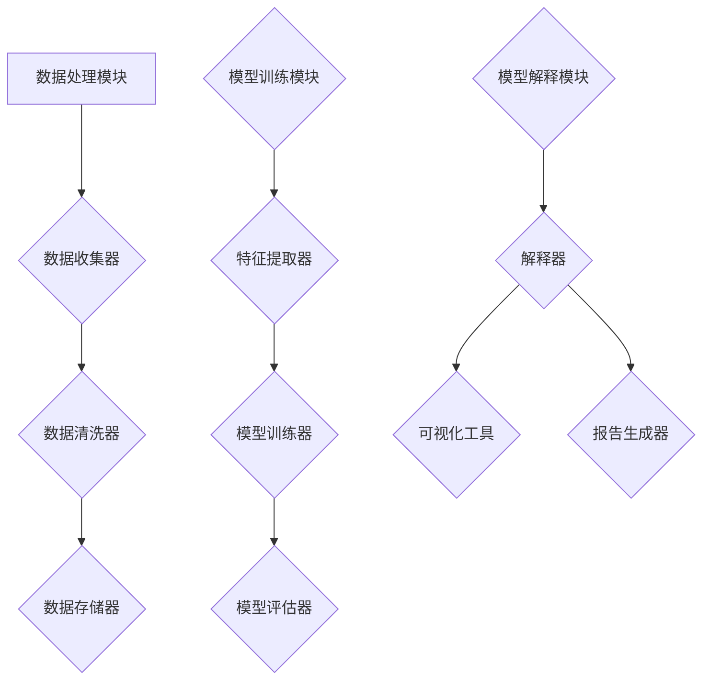
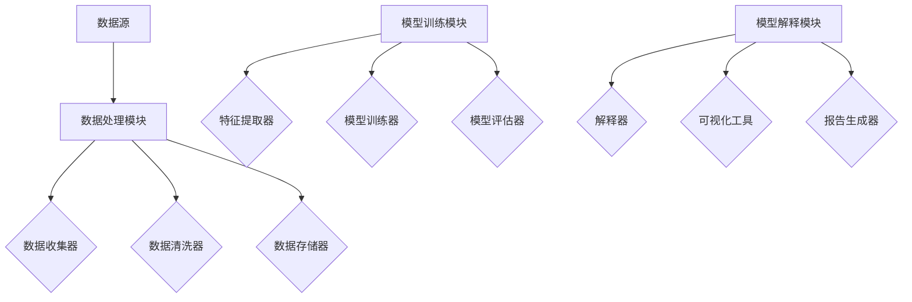

                 

### 文章标题

# AI驱动的企业信用评级模型可解释性增强系统

> 关键词：AI，信用评级，模型可解释性，企业风险管理

> 摘要：本文深入探讨了AI驱动的企业信用评级模型及其可解释性增强系统。通过分析信用评级的现状和挑战，引入AI在信用评级中的应用，探讨了模型可解释性的重要性和评估方法。文章还详细介绍了信用评级模型的设计与实现，以及可解释性增强的技术手段，并通过实际案例展示了系统在提升企业信用评级准确性和透明性方面的应用。

---

### 目录大纲

## 第一部分：引言

## 第1章：问题背景与挑战
### 1.1.1 信用评级的现状
### 1.1.2 AI在信用评级中的应用
### 1.1.3 可解释性在信用评级中的重要性
### 1.1.4 本书的目标与结构

## 第二部分：核心概念与理论基础

## 第2章：信用评级的基础知识
### 2.1.1 信用评级的定义与作用
### 2.1.2 信用评级的方法
### 2.1.3 信用评级的数据来源与处理
### 2.1.4 信用评级的关键指标

## 第3章：AI驱动的信用评级模型
### 3.1.1 AI在信用评级中的应用概述
### 3.1.2 机器学习算法在信用评级中的应用
### 3.1.3 深度学习模型在信用评级中的应用
### 3.1.4 AI信用评级模型的优缺点比较

## 第4章：可解释性增强的方法与技术
### 4.1.1 可解释性的定义与意义
### 4.1.2 模型可解释性的评估方法
### 4.1.3 局部可解释性技术
### 4.1.4 全局可解释性技术

## 第三部分：系统设计与实现

## 第5章：系统架构设计
### 5.1.1 系统架构概述
### 5.1.2 数据处理模块设计
### 5.1.3 模型训练模块设计
### 5.1.4 模型解释模块设计

## 第6章：系统实现与部署
### 6.1.1 系统环境搭建
### 6.1.2 数据处理与预处理
### 6.1.3 模型训练过程
### 6.1.4 模型解释与评估

## 第四部分：实战案例与评估

## 第7章：案例一：企业信用评级模型构建与可解释性增强
### 7.1.1 案例背景
### 7.1.2 模型构建过程
### 7.1.3 可解释性增强方法应用
### 7.1.4 模型评估与结果分析

## 第8章：案例二：不同行业信用评级模型的比较与分析
### 8.1.1 案例背景
### 8.1.2 不同行业数据收集与处理
### 8.1.3 模型构建与可解释性增强
### 8.1.4 模型比较与评估

## 第9章：总结与展望
### 9.1.1 本书内容总结
### 9.1.2 可解释性增强技术的未来发展趋势
### 9.1.3 研究与改进的方向

### 引言

在现代金融体系中，企业信用评级是一项至关重要的任务。它不仅关系到金融机构对企业贷款的决策，也影响到企业的融资渠道和商业合作。传统的信用评级方法主要依赖于专家经验和历史数据，虽然在一定程度上能够反映企业的信用状况，但往往缺乏透明性和可解释性。随着人工智能（AI）技术的迅猛发展，利用AI构建企业信用评级模型成为一种新的趋势。然而，AI模型，特别是深度学习模型，因其复杂的内部机制而往往缺乏可解释性，这给信用评级带来了一定的风险和挑战。

本文将深入探讨AI驱动的企业信用评级模型及其可解释性增强系统。首先，我们将回顾信用评级的现状和挑战，然后介绍AI在信用评级中的应用及其优势。接着，我们将重点讨论模型可解释性的重要性和评估方法。在核心概念与理论基础部分，我们将详细介绍信用评级的基础知识，包括定义、方法、数据来源和处理，以及关键指标。在此基础上，我们将探讨AI驱动的信用评级模型，涵盖机器学习算法和深度学习模型的应用，并比较其优缺点。随后，我们将讨论模型可解释性增强的方法与技术，包括局部和全局可解释性技术。在系统设计与实现部分，我们将介绍系统架构设计、数据处理、模型训练和模型解释模块。在实战案例与评估部分，我们将通过实际案例展示系统在提升企业信用评级准确性和透明性方面的应用。最后，我们将总结本文的主要内容和未来研究方向。

通过本文的探讨，我们希望读者能够对AI驱动的企业信用评级模型及其可解释性增强系统有一个全面而深入的理解，从而为实际应用提供有益的指导。

## 第一部分：引言

### 第1章：问题背景与挑战

在现代金融体系中，企业信用评级扮演着至关重要的角色。信用评级不仅帮助金融机构和企业进行风险评估，也为投资者和合作伙伴提供了决策依据。传统的信用评级方法主要依赖于专家经验和历史数据，这些方法在一定程度上能够反映企业的信用状况，但存在诸多局限性。首先，专家经验往往主观性强，难以标准化和量化，导致不同评级机构之间可能存在较大的差异。其次，传统评级方法主要依赖于历史数据，无法实时反映企业的最新动态，可能导致信用评级的滞后性。此外，传统方法在处理复杂、多维度数据时，效果往往不尽如人意。

随着人工智能（AI）技术的迅速发展，利用AI构建企业信用评级模型成为了一种新的趋势。AI技术，尤其是机器学习和深度学习，能够从海量数据中自动提取特征，并构建高度复杂的预测模型。与传统的专家方法相比，AI信用评级模型具有以下几个显著优势：

1. **数据驱动**：AI信用评级模型能够处理和分析大量非结构化数据，如财务报表、社交媒体评论等，从而更全面地了解企业的信用状况。

2. **实时更新**：AI模型可以实时更新和调整，以反映企业的最新动态和风险变化，提高了信用评级的时效性。

3. **自动化**：AI模型能够自动化地完成复杂的评级任务，减少了人力成本和误差。

4. **精确预测**：AI模型通过学习海量历史数据，能够提供更精确的信用预测，降低了金融机构的风险。

然而，AI驱动的信用评级模型也面临着一定的挑战。首先，这些模型往往是黑箱式的，内部机制复杂，难以解释。这意味着，即使模型能够提供准确的评级结果，金融机构和投资者也难以理解其决策过程，从而影响了模型的可信度和透明性。其次，AI模型的性能可能受到数据质量和数据分布的影响，若数据存在偏差，模型可能会产生误导性结果。此外，AI模型还需要大量的计算资源和时间进行训练和优化，这在实际应用中可能是一个瓶颈。

综上所述，企业信用评级在传统方法和AI技术之间面临着诸多挑战和机遇。本文将深入探讨这些问题，并介绍如何通过可解释性增强系统提升AI信用评级模型的透明性和可信度。

### 1.1.1 信用评级的现状

信用评级作为金融体系中的重要环节，经历了从传统到现代的演变。在传统信用评级中，主要依赖于专家经验和历史数据。专家通常会根据企业的财务状况、历史信用记录、行业地位等多方面因素，综合评估企业的信用水平。这种方法具有主观性强、标准化程度低、难以量化等缺点，导致评级结果在不同机构之间可能存在较大差异。此外，传统评级方法主要依赖历史数据，难以实时反映企业的最新动态，存在一定的滞后性。

随着信息技术的进步，信用评级逐渐向数据驱动的方向发展。现代信用评级方法利用大数据和人工智能技术，从海量的非结构化数据中提取有价值的信息，为信用评级提供更全面的依据。例如，金融机构可以通过分析企业的财务报表、社交媒体评论、交易记录等数据，构建更加精准的信用评级模型。这种方法不仅提高了信用评级的透明度和一致性，还增强了模型的预测能力。

然而，现代信用评级也面临一些挑战。首先，数据质量和数据分布对信用评级模型的影响至关重要。如果数据存在偏差或分布不均，可能会导致模型产生误导性结果。其次，信用评级模型的可解释性是一个亟待解决的问题。传统的信用评级方法往往具有较高的可解释性，而人工智能模型，尤其是深度学习模型，因其内部机制复杂而难以解释。这导致金融机构和投资者难以理解模型的决策过程，从而影响了模型的可信度。

尽管存在挑战，现代信用评级方法仍具有明显的优势。首先，通过大数据和人工智能技术，信用评级能够处理和分析大量的非结构化数据，提供更全面、准确的信用评估。其次，现代评级方法可以实时更新和调整，以反映企业的最新动态和风险变化。此外，自动化和智能化的评级过程显著降低了人力成本和操作风险。

总之，信用评级在现代金融体系中具有重要地位。传统方法和现代方法各有所长，相互补充。随着技术的发展，信用评级将继续向数据驱动、智能化方向演进，为金融机构和企业提供更加可靠、透明的信用评估服务。

### 1.1.2 AI在信用评级中的应用

人工智能（AI）在信用评级中的应用正逐步改变这一领域，为金融机构和企业带来了诸多新的机遇。首先，AI技术能够处理和分析海量的非结构化数据，如社交媒体评论、新闻报道、财务报表等，从而提供更全面、多维度的信用评估。例如，通过自然语言处理（NLP）技术，可以从企业的公开社交媒体平台上提取有关企业声誉和行为的信号，结合传统的财务数据，为信用评级提供更丰富的信息。

其次，AI技术能够自动识别和提取数据中的潜在特征，提高信用评级模型的预测能力。机器学习算法，尤其是监督学习和无监督学习，可以从历史数据中自动学习和建模，预测企业的未来信用风险。例如，通过使用回归分析、决策树、随机森林等算法，可以构建基于历史数据和规则的企业信用评级模型。此外，深度学习模型，如卷积神经网络（CNN）和循环神经网络（RNN），能够处理复杂的非线性关系，进一步提升信用评级的精度和预测能力。

AI在信用评级中的应用不仅限于模型构建，还包括模型的优化和实时更新。通过使用强化学习算法，AI模型可以不断学习和调整，以适应市场的动态变化。例如，金融机构可以使用实时数据流处理技术，如Apache Kafka和Apache Flink，将最新的财务数据和市场信息实时集成到信用评级模型中，实现信用评级的动态调整。

此外，AI技术还提高了信用评级过程的自动化程度。传统的信用评级往往依赖于大量的人工干预和审批流程，而AI技术可以通过自动化算法和流程优化，减少人为干预，提高效率。例如，使用自动化审批系统和智能反欺诈技术，可以快速识别和处理信用申请，减少审核时间和成本。

尽管AI在信用评级中的应用带来了显著的改进，但同时也带来了一些挑战。首先，AI模型的透明性和可解释性是一个重要问题。深度学习模型因其高度非线性特性而难以解释，这使得金融机构和投资者难以理解模型的决策过程，从而影响了模型的可信度。其次，数据隐私和安全性也是AI应用面临的关键挑战。信用评级涉及大量敏感数据，包括财务信息和个人隐私，如何在保护数据隐私的前提下应用AI技术，是一个亟待解决的问题。

总之，AI技术在信用评级中的应用为金融机构和企业带来了新的机遇，通过数据处理、特征提取和模型优化，显著提升了信用评级的准确性和效率。然而，也需关注透明性、可解释性、数据隐私和安全性等挑战，确保AI技术在信用评级领域的健康发展。

### 1.1.3 可解释性在信用评级中的重要性

在AI驱动的信用评级模型中，可解释性是确保模型透明性和可信度的重要保障。可解释性指的是能够解释模型决策过程和结果的能力，使得金融机构和投资者能够理解模型的逻辑和依据。在传统信用评级中，专家经验和历史数据的应用通常具有较高程度的可解释性，因为决策过程是基于明确的数据和规则进行的。然而，AI模型，特别是深度学习模型，往往因其复杂性和黑箱特性而缺乏可解释性，这成为其应用中的关键挑战。

首先，模型的可解释性对于信用评级结果的公信力至关重要。信用评级结果直接影响金融机构的贷款决策和企业的融资渠道。如果评级模型缺乏透明性，金融机构和投资者无法理解模型的决策过程，可能会导致对模型结果的质疑，甚至对整个金融系统的信任产生动摇。因此，确保模型的可解释性是提升模型公信力的关键。

其次，可解释性有助于发现和纠正模型中的潜在问题。通过对模型决策过程的深入分析，可以识别模型可能存在的偏见、过度拟合或数据偏差等问题。这有助于优化模型，提高其准确性和可靠性。例如，通过分析模型的决策路径和特征重要性，可以发现某些特定特征对决策结果的影响过大，从而对模型进行调优。

此外，可解释性也有助于提高模型的合规性和法律安全性。金融行业的监管要求严格，信用评级模型需要符合相关法律法规和行业标准。可解释性可以确保模型的行为符合监管要求，降低法律风险。同时，当模型发生错误或异常时，可解释性有助于快速定位问题，进行有效的调试和修复。

最后，可解释性有助于促进AI技术在信用评级领域的广泛接受和应用。随着AI技术的发展，越来越多的金融机构开始采用AI模型进行信用评级。然而，AI模型的不可解释性使得一些金融机构对AI技术的应用持保留态度。通过增强模型的可解释性，可以消除对AI技术的疑虑，推动其在信用评级领域的广泛应用。

总之，在AI驱动的信用评级模型中，可解释性是确保模型透明性、可信度和合规性的关键。通过提升模型的可解释性，可以增强模型的公信力、准确性和合规性，推动AI技术在信用评级领域的健康发展。

### 1.1.4 本书的目标与结构

本书旨在深入探讨AI驱动的企业信用评级模型及其可解释性增强系统，旨在解决信用评级过程中存在的透明性和可信度问题。具体目标包括：

1. **全面了解信用评级的现状和挑战**：通过分析传统信用评级方法的局限性和现代信用评级方法的优势，为后续讨论提供背景。

2. **探讨AI在信用评级中的应用**：介绍AI技术，特别是机器学习和深度学习在信用评级中的具体应用，展示其提升信用评级准确性和效率的潜力。

3. **研究模型可解释性及其重要性**：详细讨论模型可解释性的定义、意义和评估方法，探讨如何通过增强模型可解释性提升信用评级的透明性和可信度。

4. **设计与实现AI驱动的信用评级模型**：介绍系统架构设计、数据处理、模型训练和模型解释模块的实现，展示如何将理论应用到实际系统中。

5. **通过实战案例展示系统应用**：通过具体案例展示AI驱动信用评级模型和可解释性增强系统的实际应用效果，验证其在提升信用评级准确性和透明性方面的价值。

本书分为四个主要部分。第一部分介绍问题背景与挑战，包括信用评级的现状、AI在信用评级中的应用和模型可解释性的重要性。第二部分探讨核心概念与理论基础，包括信用评级的基础知识、AI驱动信用评级模型的设计与应用、可解释性增强方法与技术。第三部分详细描述系统设计与实现，涵盖系统架构设计、数据处理、模型训练和模型解释模块的实现。第四部分通过实战案例展示系统的实际应用效果，并对系统进行评估和总结，探讨未来研究的方向。

通过本书的探讨，我们希望读者能够全面了解AI驱动的企业信用评级模型及其可解释性增强系统，为实际应用提供有益的指导，推动信用评级领域的创新与发展。

## 第二部分：核心概念与理论基础

### 第2章：信用评级的基础知识

信用评级作为金融体系中的重要组成部分，其基础知识的理解和掌握对于构建有效的信用评级模型至关重要。在本节中，我们将详细探讨信用评级的定义、方法、数据来源与处理，以及关键指标，为后续内容提供坚实的理论基础。

### 2.1.1 信用评级的定义与作用

信用评级是指专业的评级机构或金融分析师，根据企业的财务状况、经营风险、市场环境等多方面因素，对企业信用水平进行评估并发布评级结果的过程。信用评级的主要作用包括：

1. **风险评估**：通过信用评级，金融机构和企业可以评估借款人的信用风险，从而制定合理的信贷政策。
2. **决策支持**：信用评级为投资者提供了重要的参考信息，帮助其评估潜在投资对象的信用风险，做出更明智的投资决策。
3. **市场规范化**：信用评级有助于规范金融市场，促进市场透明度，提高金融交易的效率。
4. **企业融资**：高信用评级的企业能够获得更低的融资成本和更广泛的融资渠道，有助于企业的长期发展。

### 2.1.2 信用评级的方法

信用评级的方法主要分为两大类：传统方法和现代方法。

1. **传统方法**：
   - **专家评估**：专家评估是指由评级机构的专业分析师根据多年的经验，对企业进行全面评估。这种方法依赖专家的主观判断，具有较高的人为因素。
   - **历史数据**：传统评级方法主要依赖于企业的历史财务数据，如资产负债表、利润表和现金流量表等，通过分析这些数据来评估企业的信用水平。

2. **现代方法**：
   - **数据驱动方法**：现代信用评级方法利用大数据和人工智能技术，从海量数据中提取有价值的信息，构建信用评级模型。数据驱动的信用评级方法包括机器学习算法和深度学习模型，可以处理复杂的非线性关系，提高评级的准确性和效率。
   - **行为分析**：行为分析方法通过分析企业的行为数据，如交易记录、信用申请、履约记录等，来评估企业的信用状况。这种方法更侧重于企业的实时行为，能够更及时地反映企业的信用变化。

### 2.1.3 信用评级的数据来源与处理

信用评级的数据来源广泛，主要包括以下几个方面：

1. **财务数据**：企业的财务报表，如资产负债表、利润表和现金流量表等，是信用评级的重要数据来源。
2. **市场数据**：企业的股票交易数据、行业市场状况等，可以提供关于企业市场表现和行业趋势的信息。
3. **行为数据**：企业的信用申请记录、交易记录、履约记录等，反映了企业的信用行为和履约能力。
4. **外部数据**：包括新闻报告、社交媒体评论、法律诉讼记录等，可以提供关于企业声誉和经营状况的信息。

在处理这些数据时，需要进行以下步骤：

1. **数据收集**：通过金融数据库、企业公开财务报表、市场交易平台等渠道收集数据。
2. **数据清洗**：去除重复、错误和缺失的数据，确保数据的质量。
3. **特征提取**：从原始数据中提取与信用评级相关的特征，如财务指标、市场指标、行为指标等。
4. **数据标准化**：将不同数据源的数据进行统一处理，如归一化、标准化等，以便进行后续分析。

### 2.1.4 信用评级的关键指标

信用评级的关键指标是评估企业信用水平的重要工具，主要包括以下几个方面：

1. **财务指标**：
   - **盈利能力**：如净利润率、毛利率等，反映企业的盈利能力和经营状况。
   - **偿债能力**：如流动比率、速动比率等，衡量企业的短期偿债能力。
   - **资产质量**：如资产负债率、流动资产占比等，评估企业的资产结构和负债水平。

2. **市场指标**：
   - **市场占有率**：反映企业在市场中的竞争地位和市场份额。
   - **股票波动率**：衡量股票价格的波动情况，反映市场对企业的预期和信心。

3. **行为指标**：
   - **信用记录**：如信用申请记录、履约记录等，反映企业的信用行为和履约能力。
   - **法律诉讼记录**：评估企业是否存在法律风险和纠纷。

通过这些关键指标的综合评估，可以全面了解企业的信用状况，为信用评级提供科学依据。

### 2.1.5 信用评级与相关概念的关联

信用评级与相关概念如风险评估、信用评分、财务分析等密切相关。风险评估是指对潜在风险进行识别、分析和评估的过程，信用评分是指根据特定模型和方法对企业信用水平进行量化评估，财务分析则是对企业财务状况进行深入分析和评价。

信用评级作为风险评估的一种形式，通过对企业的信用水平进行量化评估，为金融机构和投资者提供了重要的决策参考。信用评分则是对信用评级模型中的具体算法和方法进行量化，以衡量企业的信用风险。财务分析则从财务数据的角度，对企业的盈利能力、偿债能力和资产质量进行评估，为信用评级提供了重要的数据支持。

总之，信用评级不仅需要结合多种数据来源和关键指标，还需要与其他相关概念和方法相互关联和补充，以实现全面、准确的信用评估。

### 2.1.6 信用评级的基本模型

信用评级的基本模型通常包括以下几个步骤：

1. **数据收集**：从财务报表、市场数据、行为数据等渠道收集企业的数据。
2. **数据预处理**：对收集到的数据清洗、去重、标准化处理，确保数据的质量和一致性。
3. **特征提取**：从预处理后的数据中提取与信用评级相关的特征，如财务指标、市场指标、行为指标等。
4. **模型训练**：使用机器学习算法或深度学习模型，对提取的特征进行训练，构建信用评级模型。
5. **模型评估**：通过交叉验证、ROC曲线等评估方法，评估模型的预测性能和可靠性。
6. **模型应用**：将训练好的模型应用于新数据，对企业信用水平进行实时评估。

通过这些基本模型，信用评级系统能够从海量数据中提取有价值的信息，提供准确的信用评估结果，为金融机构和投资者提供决策支持。

### 2.1.7 信用评级的适用场景

信用评级在不同场景中的应用各有特点：

1. **金融机构贷款审批**：信用评级为金融机构提供借款人的信用风险评估，帮助其制定贷款政策，降低贷款风险。
2. **企业融资需求评估**：信用评级为企业提供融资能力评估，帮助企业了解自身信用水平，制定融资策略。
3. **投资决策参考**：投资者通过信用评级评估潜在投资对象的信用风险，为投资决策提供依据。
4. **供应链金融**：信用评级可以帮助供应链中的各方评估供应商和客户的信用状况，优化供应链融资和管理。

通过在不同场景中的应用，信用评级系统能够为各类金融活动提供有效的风险评估和决策支持。

### 2.1.8 信用评级的发展趋势

随着大数据和人工智能技术的发展，信用评级正朝着智能化、数据驱动和实时更新的方向发展。未来，信用评级将更加注重以下几点：

1. **数据多样性**：通过整合更多类型的非结构化数据，如社交媒体评论、新闻报道等，提供更全面、多维度的信用评估。
2. **实时性**：利用实时数据流处理技术，实现信用评级的动态调整，提高评级的时效性。
3. **模型透明性**：通过增强模型的可解释性，提高评级的透明度和公信力，增强金融机构和投资者的信任。
4. **个性化**：根据不同企业和行业的特点，开发定制化的信用评级模型，提高评级的准确性和适用性。

总之，随着技术的进步，信用评级将继续向智能化、数据驱动和个性化方向演进，为金融体系的稳健运行提供更强有力的支持。

### 2.1.9 信用评级的潜在问题

尽管信用评级在金融体系中发挥着重要作用，但其应用过程中也面临着一些潜在问题：

1. **数据隐私**：信用评级涉及大量敏感信息，数据隐私保护成为一大挑战。
2. **模型偏见**：模型训练过程中可能存在数据偏差，导致评级结果不公平。
3. **模型解释性**：深度学习等复杂模型缺乏可解释性，影响评级结果的透明性和可信度。
4. **数据完整性**：数据收集和处理过程中的不完整信息可能影响评级的准确性。

针对这些问题，需要采取相应的措施，如加强数据隐私保护、优化模型训练过程、提高模型可解释性等，以确保信用评级的公正性和准确性。

### 2.1.10 信用评级与其他金融工具的关联

信用评级与其他金融工具如债券、股票等密切相关。信用评级不仅影响企业的融资成本和渠道，也直接影响债券和股票的市场表现。高信用评级的企业通常能够以更低的利率发行债券，吸引更多投资者，而低信用评级的企业则可能面临更高的融资成本和更有限的融资渠道。同样，信用评级对股票市场中的投资者信心和市场预期具有重要影响，高信用评级的企业往往能够获得更高的股票估值和更好的市场表现。

总之，信用评级作为金融体系中的重要工具，其结果不仅影响企业的融资能力和市场表现，也对整个金融市场的稳定和健康发展具有重要意义。

## 第3章：AI驱动的信用评级模型

### 3.1.1 AI在信用评级中的应用概述

人工智能（AI）技术在信用评级中的应用正在逐步改变传统的评级方式，为金融机构和企业提供了更精准、高效的信用风险评估工具。AI技术在信用评级中的应用主要涵盖机器学习算法和深度学习模型，通过处理和分析海量数据，实现对信用风险的实时监控和精准预测。

首先，机器学习算法在信用评级中发挥了重要作用。传统的监督学习算法，如线性回归、逻辑回归、决策树等，通过学习历史数据中的特征与信用评级结果之间的关联，可以建立初步的信用评级模型。这些算法具有较好的可解释性，便于理解其决策过程，但面对复杂、非线性关系的数据时，其性能可能受到限制。为此，更复杂的机器学习算法，如支持向量机（SVM）、随机森林（Random Forest）、梯度提升树（Gradient Boosting Tree）等，被广泛应用于信用评级中。这些算法通过构建更加复杂的模型，能够捕捉数据中的非线性关系，提供更高的预测精度。

其次，深度学习模型在信用评级中的应用逐渐受到关注。深度学习，特别是卷积神经网络（CNN）和循环神经网络（RNN）等模型，因其强大的特征提取和建模能力，在处理复杂、高维数据方面具有显著优势。例如，通过使用卷积神经网络，可以从企业财务报表中自动提取关键特征，并通过多层卷积层逐步构建复杂的特征表示。循环神经网络则能够处理时序数据，如企业的历史交易记录和信用行为，捕捉信用风险的变化趋势。深度学习模型在信用评级中的应用，不仅提高了预测精度，还实现了对海量数据的自动化处理和分析。

此外，AI技术还提供了多种方法来优化信用评级模型。例如，通过使用迁移学习（Transfer Learning）和增强学习（Reinforcement Learning），可以进一步提高模型的泛化能力和适应能力。迁移学习通过利用预训练模型，将知识迁移到新的任务中，减少了模型训练的时间和计算成本。增强学习则通过不断调整模型的策略，使其在复杂环境中实现最优的信用评级结果。

总之，AI技术在信用评级中的应用，不仅提升了信用评估的精度和效率，还为金融机构提供了更丰富的信用风险评估工具。通过机器学习和深度学习模型，AI技术能够从海量数据中自动提取特征，构建复杂的信用评级模型，实现实时、精准的信用风险评估。同时，AI技术的持续发展和创新，将进一步推动信用评级领域的技术进步和业务应用。

### 3.1.2 机器学习算法在信用评级中的应用

机器学习算法在信用评级中的应用已经得到广泛的认可，通过处理和分析大量的历史数据，可以建立有效的信用评级模型。以下是几种常用的机器学习算法及其在信用评级中的应用：

1. **线性回归（Linear Regression）**：
   - **原理**：线性回归是一种简单的监督学习算法，通过建立输入变量（如企业的财务指标）与输出变量（如信用评分）之间的线性关系，进行预测。
   - **应用**：线性回归在信用评级中常用于初步建立信用评分模型，通过分析企业的财务报表，如利润表和资产负债表，预测其未来的信用风险。

2. **逻辑回归（Logistic Regression）**：
   - **原理**：逻辑回归是一种广义线性模型，通过输入变量的线性组合来预测概率分布，常用于分类问题，如信用评分的二分类（违约/不违约）。
   - **应用**：逻辑回归在信用评级中广泛应用于构建二分类模型，通过历史违约数据训练模型，预测企业是否会发生违约。

3. **决策树（Decision Tree）**：
   - **原理**：决策树通过一系列的二元分割来构建决策路径，每个节点表示一个特征，每个分支表示该特征的不同取值。
   - **应用**：决策树在信用评级中可用于构建信用评分模型，通过分析多个特征（如财务指标、行为数据等），对企业的信用风险进行分类。

4. **随机森林（Random Forest）**：
   - **原理**：随机森林是通过构建多棵决策树，并通过投票方式得出最终预测结果，具有较好的泛化能力和抗过拟合能力。
   - **应用**：随机森林在信用评级中用于构建信用评分模型，通过集成多棵决策树，提高预测的准确性和稳定性。

5. **梯度提升树（Gradient Boosting Tree）**：
   - **原理**：梯度提升树通过迭代优化，每次迭代中调整模型参数，使模型误差最小化。
   - **应用**：梯度提升树在信用评级中表现出色，通过多次迭代优化，能够捕捉数据中的复杂关系，提供高精度的信用评分。

6. **支持向量机（Support Vector Machine, SVM）**：
   - **原理**：支持向量机通过寻找最优超平面，将不同类别的数据点分隔开，最大化分类间隔。
   - **应用**：支持向量机在信用评级中用于构建信用评分模型，通过优化分类边界，提高信用评分的准确性。

以上机器学习算法在信用评级中的应用，不仅提升了信用评估的精度，还提供了多种方法来处理不同类型的数据和复杂的信用风险评估问题。通过结合多种算法，金融机构可以构建更加全面和准确的信用评级模型，为贷款决策和风险控制提供有力支持。

### 3.1.3 深度学习模型在信用评级中的应用

深度学习模型在信用评级中的应用正日益受到重视，其强大的特征提取和建模能力使其成为处理复杂数据和实现高精度预测的有力工具。以下是几种常见的深度学习模型及其在信用评级中的具体应用：

1. **卷积神经网络（CNN）**：
   - **原理**：卷积神经网络通过卷积操作和池化操作，能够自动提取图像或时间序列数据中的局部特征。
   - **应用**：在信用评级中，CNN可以用于处理企业财务报表中的图像数据。例如，通过对财务报表图像进行卷积操作，可以自动提取出报表中的关键信息，如收入、支出、资产负债等，从而为信用评分提供强有力的支持。

2. **循环神经网络（RNN）**：
   - **原理**：循环神经网络通过记忆单元，能够处理和存储序列信息，适用于时间序列数据的建模。
   - **应用**：在信用评级中，RNN可以用于分析企业的历史交易记录和时间序列数据。例如，通过对企业过去几年的交易记录进行RNN建模，可以捕捉到企业的信用行为变化趋势，从而预测其未来的信用风险。

3. **长短时记忆网络（LSTM）**：
   - **原理**：长短时记忆网络是RNN的一种变体，通过引入门控机制，有效解决了RNN的梯度消失问题，能够更好地处理长序列数据。
   - **应用**：LSTM在信用评级中表现出色，可以用于处理企业历史数据中的长期依赖关系。例如，通过对企业多年的财务数据和时间序列记录进行LSTM建模，可以捕捉到企业信用风险的长期变化趋势，提高信用评分的准确性。

4. **自编码器（Autoencoder）**：
   - **原理**：自编码器通过无监督学习，自动提取输入数据的低维表示，常用于特征降维和特征提取。
   - **应用**：在信用评级中，自编码器可以用于特征降维和特征提取，将高维的原始数据转换为低维的特征向量。这些特征向量可以用于构建信用评分模型，提高模型的预测性能。

5. **生成对抗网络（GAN）**：
   - **原理**：生成对抗网络通过两个对抗网络（生成器和判别器）的对抗训练，生成逼真的数据，从而学习数据的分布。
   - **应用**：在信用评级中，GAN可以用于生成伪造的财务数据，从而用于训练和测试信用评分模型。这有助于增强模型的鲁棒性和泛化能力，提高预测准确性。

通过上述深度学习模型的应用，信用评级系统能够从海量复杂数据中自动提取有价值的信息，构建高精度的信用评分模型。这些模型不仅能够处理传统方法难以处理的非结构化数据，如文本、图像和时序数据，还能够捕捉数据中的非线性关系和长期依赖性，从而实现更精准的信用风险评估。随着深度学习技术的不断发展和优化，其在信用评级领域的应用前景将更加广阔。

### 3.1.4 AI信用评级模型的优缺点比较

在信用评级领域，AI信用评级模型相较于传统方法具有显著的优势，但也存在一些局限性。以下是对AI信用评级模型的优缺点进行比较：

#### 优势：

1. **数据处理能力**：AI信用评级模型能够处理和分析大量的非结构化数据，如文本、图像、音频等，提供更全面、多维度的信用评估。
   - **解释**：传统的信用评级方法主要依赖于结构化数据，而AI模型可以通过自然语言处理、图像识别等技术，从非结构化数据中提取有价值的信息，从而提升信用评级的准确性。

2. **自动化和高效性**：AI模型可以自动化地完成信用评级任务，减少了人工干预，提高了效率。
   - **解释**：传统的信用评级往往需要人工进行大量数据的处理和分析，而AI模型能够通过算法自动完成这些任务，降低了操作成本和人力投入。

3. **实时更新和动态调整**：AI模型能够实时更新和调整，以反映企业的最新动态和风险变化，提高了信用评级的时效性。
   - **解释**：传统的信用评级方法通常依赖历史数据，无法及时反映企业的最新情况。而AI模型可以通过实时数据流处理技术，不断更新模型，实现信用评级的动态调整。

4. **预测精度**：通过深度学习等复杂算法，AI模型能够捕捉数据中的复杂关系和模式，提供更高的预测精度。
   - **解释**：传统的信用评级方法由于算法的局限性，难以捕捉数据中的非线性关系。而AI模型，特别是深度学习模型，通过多层神经网络，能够更精确地预测信用风险。

#### 局限性：

1. **可解释性**：AI模型，尤其是深度学习模型，往往具有高度的非线性特性，导致其决策过程难以解释，从而影响了模型的可信度。
   - **解释**：传统的信用评级方法具有较高的可解释性，因为其决策过程是基于明确的数据和规则进行的。而AI模型，特别是深度学习模型，由于内部机制复杂，难以向用户解释其决策逻辑，这对金融机构和投资者的信任构成了挑战。

2. **数据质量和偏差**：AI模型对数据质量高度依赖，若数据存在偏差或缺失，模型可能会产生误导性结果。
   - **解释**：在训练AI模型时，需要大量高质量的数据。如果数据存在偏差或缺失，模型可能会学习到错误的模式，从而影响其预测准确性。此外，如果数据集中存在系统性偏差，模型可能会放大这些偏差，导致不公平的评级结果。

3. **计算资源和时间成本**：AI模型，特别是深度学习模型，需要大量的计算资源和时间进行训练和优化。
   - **解释**：深度学习模型通常需要大量的数据集进行训练，且训练过程复杂，消耗大量的计算资源和时间。对于金融机构来说，这可能会增加运营成本和延迟信用评级的效率。

4. **合规性和法律风险**：信用评级涉及大量敏感数据，如何在保护数据隐私的前提下应用AI技术，是一个重要且复杂的挑战。
   - **解释**：金融行业受到严格的监管，信用评级模型需要遵守相关法律法规。在使用AI技术时，如何确保数据隐私保护和合规性，是金融机构必须面对的挑战。

综上所述，AI信用评级模型在数据处理能力、自动化和实时性方面具有显著优势，但同时也面临可解释性、数据质量和合规性等挑战。因此，在实际应用中，需要综合考虑这些因素，采取适当的措施，以最大化AI信用评级模型的优势，同时降低其局限性。

### 3.1.5 常见的AI信用评级模型

在信用评级领域，AI技术被广泛应用于构建高效且准确的信用评级模型。以下介绍几种常见的AI信用评级模型，包括它们的原理、特点以及在信用评级中的具体应用。

1. **逻辑回归模型（Logistic Regression）**
   - **原理**：逻辑回归是一种广义线性模型，通过建立一个线性函数，将输入特征映射到概率分布，通常用于二分类问题。
   - **特点**：逻辑回归模型简单，易于解释，具有较高的可解释性。它通过概率输出可以直观地反映企业的信用风险。
   - **应用**：逻辑回归模型常用于初步建立信用评级模型，通过分析企业的财务指标，预测其是否会发生违约。

2. **决策树模型（Decision Tree）**
   - **原理**：决策树通过一系列的规则和条件，将样本逐步划分到不同的类别。每个节点代表一个特征，每个分支代表该特征的不同取值。
   - **特点**：决策树模型易于理解和解释，能够处理多类别的信用评级问题。它通过分类规则直观地展示了影响信用评级的因素。
   - **应用**：决策树模型常用于构建信用评分模型，通过分析企业的财务和行为数据，对企业信用风险进行分类。

3. **随机森林模型（Random Forest）**
   - **原理**：随机森林是一种集成学习方法，通过构建多棵决策树，并对这些树的预测结果进行投票，提高模型的预测准确性和稳定性。
   - **特点**：随机森林模型具有很好的抗过拟合能力，能够处理高维数据和复杂的非线性关系。它通过集成多棵决策树，提高了预测的鲁棒性。
   - **应用**：随机森林模型在信用评级中表现出色，通过集成多个决策树，能够提供更准确的信用评分预测。

4. **梯度提升树模型（Gradient Boosting Tree）**
   - **原理**：梯度提升树是一种集成学习方法，通过迭代优化，每次迭代中调整模型参数，使模型误差最小化。
   - **特点**：梯度提升树模型能够处理复杂和非线性关系的数据，通过多次迭代优化，提供高精度的信用评分。
   - **应用**：梯度提升树模型在信用评级中表现出色，能够捕捉数据中的复杂关系，提供准确的信用风险评估。

5. **支持向量机模型（Support Vector Machine, SVM）**
   - **原理**：支持向量机通过寻找最优超平面，将不同类别的数据点分隔开，最大化分类间隔。
   - **特点**：支持向量机模型在处理高维数据和线性不可分数据时表现出色，具有较好的分类精度。
   - **应用**：支持向量机模型常用于构建信用评分模型，通过优化分类边界，提高信用评分的准确性。

6. **神经网络模型（Neural Network）**
   - **原理**：神经网络通过多层神经元节点，模拟人脑的信息处理方式，通过学习输入特征和输出结果之间的映射关系。
   - **特点**：神经网络模型能够处理复杂的非线性关系，通过多层网络，实现特征提取和分类。
   - **应用**：神经网络模型在信用评级中表现出色，能够从海量数据中自动提取特征，提供精准的信用评分。

7. **深度学习模型（Deep Learning）**
   - **原理**：深度学习模型通过多层神经网络，自动提取输入数据的低维表示，适用于复杂数据和高维特征的学习。
   - **特点**：深度学习模型具有强大的特征提取和建模能力，能够捕捉数据中的复杂模式和长期依赖关系。
   - **应用**：深度学习模型在信用评级中应用广泛，通过处理复杂数据，提供高精度的信用评分预测。

通过这些AI信用评级模型的应用，金融机构可以构建更加全面、准确的信用评级系统，为贷款决策和风险控制提供有力支持。每种模型都有其独特的优势和适用场景，实际应用中可以根据具体需求选择合适的模型。

### 3.1.6 AI信用评级模型的构建流程

构建AI信用评级模型是一个复杂的过程，涉及多个关键步骤，包括数据收集、数据处理、特征选择、模型选择与训练、模型评估与优化等。以下是详细的构建流程：

1. **数据收集**：
   - **数据源**：首先，需要从多个渠道收集企业数据，包括财务报表、交易记录、市场数据、行为数据等。这些数据可以是结构化的（如财务报表）、半结构化的（如文本数据）和非结构化的（如图像和音频数据）。
   - **数据获取**：通过金融数据库、企业公开信息、市场交易平台等渠道获取数据，确保数据来源的多样性和可靠性。

2. **数据处理**：
   - **数据清洗**：对收集到的数据进行清洗，去除重复、错误和缺失的数据，确保数据的质量。这一步包括去除重复记录、填补缺失值、纠正错误数据等。
   - **数据标准化**：对数据进行标准化处理，如归一化、标准化等，将不同数据源的数据进行统一处理，以便后续分析。

3. **特征选择**：
   - **特征提取**：从预处理后的数据中提取与信用评级相关的特征，如财务指标（盈利能力、偿债能力等）、市场指标（市场占有率、股票波动率等）、行为指标（信用申请记录、履约记录等）。
   - **特征筛选**：通过统计分析、相关性分析等方法，筛选出对信用评级有显著影响的特征，剔除无关或冗余的特征，减少模型的复杂性。

4. **模型选择与训练**：
   - **模型选择**：根据数据特征和业务需求，选择合适的机器学习算法或深度学习模型。常见的模型包括逻辑回归、决策树、随机森林、梯度提升树、神经网络和深度学习模型等。
   - **模型训练**：使用训练数据集对选定的模型进行训练，通过调整模型的参数和超参数，优化模型的性能。训练过程中，可以使用交叉验证等方法，确保模型具有良好的泛化能力。

5. **模型评估与优化**：
   - **模型评估**：使用验证数据集对训练好的模型进行评估，通过评估指标（如准确率、召回率、F1值等）评估模型的性能，确保模型具有良好的预测能力。
   - **模型优化**：根据评估结果，对模型进行调优，如调整模型的参数、增加或减少特征、更换模型结构等，提高模型的准确性和稳定性。

6. **模型部署与应用**：
   - **模型部署**：将训练好的模型部署到生产环境中，实现实时信用评级。通过数据流处理技术，如Apache Kafka和Apache Flink，将最新的数据实时输入模型，实现信用评级的动态调整。
   - **模型监控与更新**：对部署后的模型进行实时监控，通过监控模型的预测性能和异常情况，确保模型的稳定运行。根据业务需求和市场变化，定期更新模型，以保持其预测的准确性。

通过上述构建流程，AI信用评级模型能够从海量数据中提取有价值的信息，提供精准的信用评估，为金融机构和企业提供有效的决策支持。

### 3.1.7 信用评级模型的可解释性挑战与解决方案

在AI驱动的信用评级模型中，模型的可解释性是一个关键挑战。信用评级的决策过程需要透明和可解释，以便金融机构和投资者能够理解和信任模型的决策结果。以下是信用评级模型中可解释性面临的主要挑战及其解决方案：

#### 挑战：

1. **模型复杂性**：
   - **问题**：深度学习模型，尤其是神经网络和深度学习模型，具有高度的非线性特性，内部决策过程复杂，难以解释。
   - **解决方案**：通过简化模型结构、降低模型复杂性，可以一定程度上提高模型的可解释性。此外，可以引入可解释性增强技术，如局部可解释性方法和全局可解释性方法。

2. **特征重要性不明**：
   - **问题**：在复杂的机器学习模型中，特征的重要性往往难以直观判断，这导致模型决策过程缺乏透明性。
   - **解决方案**：可以通过特征重要性分析、特征贡献度评估等方法，明确每个特征对信用评级结果的影响，提高模型的可解释性。

3. **模型泛化能力不足**：
   - **问题**：信用评级模型往往在训练数据集上表现良好，但在实际应用中，面对新数据和不同情境时，泛化能力不足，导致决策结果不可解释。
   - **解决方案**：通过增加训练数据量、使用迁移学习和增强学习等方法，提高模型的泛化能力，确保模型在不同情境下的稳定性。

4. **数据隐私和合规性**：
   - **问题**：信用评级涉及大量敏感数据，如何在确保数据隐私和合规性的前提下，增强模型的可解释性，是一个重要挑战。
   - **解决方案**：通过数据脱敏、数据加密和隐私保护算法等方法，确保数据在模型训练和解释过程中的安全性。此外，可以开发透明且符合监管要求的可解释性评估方法。

#### 解决方案：

1. **局部可解释性技术**：
   - **方法**：局部可解释性技术通过分析模型在特定输入数据上的决策过程，提供对模型决策的详细解释。
   - **示例**：例如，使用SHAP（SHapley Additive exPlanations）值方法，可以计算每个特征对模型预测的贡献度，从而直观地展示模型的决策过程。

2. **全局可解释性技术**：
   - **方法**：全局可解释性技术通过分析模型的整体结构和参数，提供对模型决策的宏观解释。
   - **示例**：例如，通过决策树的可视化方法，可以清晰地展示模型的决策路径和特征重要性。

3. **模型压缩和解释性增强**：
   - **方法**：通过模型压缩技术，如模型剪枝和参数缩减，可以减少模型的复杂度，提高模型的可解释性。
   - **示例**：例如，对深度学习模型进行结构化压缩，可以简化模型结构，降低模型的复杂性和不可解释性。

4. **交互式解释工具**：
   - **方法**：开发交互式解释工具，如可视化界面和交互式模型解释系统，使金融机构和投资者能够直观地理解模型的决策过程。
   - **示例**：例如，开发基于Web的模型解释平台，用户可以通过图形界面查看模型的决策路径和特征贡献度。

总之，通过引入可解释性增强技术，可以在一定程度上解决AI信用评级模型中的可解释性挑战，提高模型的透明性和可信度，从而为金融机构和投资者提供可靠的信用评估支持。

### 3.1.8 AI信用评级模型在不同行业中的适用性

AI信用评级模型在不同行业中具有广泛的适用性，但具体的适用性取决于行业特性、数据可用性和业务需求。以下是AI信用评级模型在几个典型行业中应用的实例：

1. **金融行业**：
   - **应用**：在金融行业，AI信用评级模型广泛应用于贷款审批、信用卡发放、信贷风险管理等领域。例如，银行可以利用机器学习和深度学习模型，从客户的历史交易记录、信用报告、行为数据等多维度数据中提取特征，预测客户的信用风险，从而制定更精确的信贷政策。
   - **优点**：金融行业的数据量庞大且多样化，AI模型能够处理复杂的非线性关系，提高信用评级的准确性。同时，AI模型可以实现实时更新和动态调整，以适应金融市场快速变化的需求。

2. **零售行业**：
   - **应用**：在零售行业，AI信用评级模型常用于信用卡欺诈检测、供应链金融、客户信用评估等。例如，零售企业可以通过分析客户的购物行为、交易记录、社交媒体活动等数据，利用机器学习算法构建信用评级模型，识别高风险客户，优化信用风险管理策略。
   - **优点**：零售行业的数据类型多样，包括交易数据、行为数据和社交媒体数据，AI模型能够充分利用这些数据，提供更全面的信用评估。

3. **电子商务行业**：
   - **应用**：电子商务平台利用AI信用评级模型进行订单审核、风险控制和个性化推荐。例如，电商平台可以通过分析客户的订单历史、退货率、支付行为等数据，利用机器学习模型评估客户的信用状况，从而决定是否发货或提供信用优惠。
   - **优点**：电子商务行业的交易数据丰富，AI模型可以实时处理和分析这些数据，实现快速信用评估，提高运营效率。

4. **物流行业**：
   - **应用**：在物流行业，AI信用评级模型主要用于供应链金融和合作伙伴信用评估。例如，物流公司可以通过分析运输记录、履约情况、财务报表等数据，利用机器学习算法评估供应商和合作伙伴的信用风险，从而优化供应链融资和合作伙伴管理。
   - **优点**：物流行业的信用评级模型需要处理大量实时数据，AI模型能够实现快速计算和预测，提高供应链的透明度和稳定性。

5. **医疗行业**：
   - **应用**：在医疗行业，AI信用评级模型可用于患者信用评估、医疗设备融资管理等。例如，医疗保险公司可以通过分析患者的病历记录、就诊频率、药物使用情况等数据，利用机器学习算法评估患者的信用风险，从而制定更合理的保费政策和医疗融资方案。
   - **优点**：医疗行业的数据具有高度复杂性和多样性，AI模型能够从海量数据中提取有价值的信息，提供更精确的信用评估。

总之，AI信用评级模型在不同行业中具有广泛的适用性，通过利用行业特有的数据资源和业务需求，可以实现更精准、高效的信用评估，为各行业的风险管理提供有力支持。

### 3.1.9 AI信用评级模型的风险评估与风险控制

AI信用评级模型在应用过程中可能会面临多种风险，包括数据风险、模型风险和业务风险。为了确保AI信用评级模型的有效性和可靠性，需要建立全面的风险评估与风险控制机制。

1. **数据风险**：
   - **问题**：数据质量直接影响模型的准确性和可靠性。数据可能存在噪声、错误和缺失，导致模型过拟合或产生误导性结果。
   - **解决方案**：在数据收集和预处理阶段，需要进行严格的数据清洗和去噪处理。通过数据验证和交叉检查，确保数据的准确性和完整性。同时，可以采用数据增强技术，如数据补全和生成对抗网络（GAN），提高数据的质量和多样性。

2. **模型风险**：
   - **问题**：AI模型可能存在偏差、过拟合和泛化能力不足等问题，导致预测结果不准确或不可靠。
   - **解决方案**：在模型训练过程中，需要使用多样化的训练数据集，避免数据偏差。通过交叉验证和模型选择策略，如网格搜索和贝叶斯优化，选择最优模型。此外，可以采用模型正则化和集成方法，如L1和L2正则化、随机森林和梯度提升树，提高模型的泛化能力。

3. **业务风险**：
   - **问题**：AI信用评级模型的决策过程可能难以解释，影响金融机构和投资者的信任。同时，模型的应用场景和业务需求不断变化，可能无法适应新的业务环境。
   - **解决方案**：增强模型的可解释性，通过局部可解释性（如SHAP值）和全局可解释性（如决策树可视化）方法，提高模型的透明度和可信度。定期评估和更新模型，以适应业务环境的变化。同时，建立风险监控和预警机制，对模型性能和预测结果进行实时监控，及时发现和纠正异常。

通过建立全面的风险评估与风险控制机制，可以确保AI信用评级模型在应用过程中的稳定性和可靠性，提高其在金融业务中的实际应用效果。

### 3.1.10 AI信用评级模型在实际应用中的案例研究

在实际应用中，AI信用评级模型已经在多个行业和场景中展现出其强大的预测能力和应用价值。以下是一些具体的案例研究，展示了AI信用评级模型在不同领域中的实际应用效果。

1. **金融行业的贷款审批**：
   - **案例**：某大型银行引入了基于AI的信用评级模型，用于贷款审批。该模型通过分析客户的财务数据、信用报告和社交数据等多维数据，实现了对客户信用风险的精准评估。根据模型结果，银行能够更有效地识别高风险客户，并调整信贷政策，降低不良贷款率。
   - **效果**：实施AI信用评级模型后，该银行的不良贷款率显著下降，贷款审批速度大幅提高，客户满意度也随之提升。

2. **零售行业的信用风险管理**：
   - **案例**：某零售连锁企业利用AI信用评级模型，对会员进行信用评估和风险控制。模型基于会员的购物行为、交易记录和社交媒体活动等数据，实时更新会员的信用评分，帮助企业识别潜在欺诈行为和信用风险。
   - **效果**：通过AI信用评级模型，该零售企业成功降低了欺诈率，优化了信用管理策略，提高了销售转化率和客户忠诚度。

3. **电子商务的信用贷款**：
   - **案例**：某知名电子商务平台推出了基于AI的信用贷款服务，为平台上的商家提供融资支持。AI信用评级模型通过对商家的交易数据、支付行为和供应链信息等多维数据的分析，评估商家的信用风险，为其提供个性化的融资方案。
   - **效果**：实施AI信用评级模型后，该电子商务平台显著提高了贷款申请的通过率，缩短了审批周期，优化了资金流动，助力商家扩大业务规模。

4. **物流行业的供应链金融**：
   - **案例**：某物流公司通过引入AI信用评级模型，对供应商进行信用评估和管理。模型基于供应商的运输记录、履约情况、财务报表等多维度数据，评估供应商的信用风险，为其提供融资和信用担保服务。
   - **效果**：通过AI信用评级模型，该物流公司成功降低了供应链中的信用风险，优化了资金分配，提高了供应链的稳定性和效率。

5. **医疗行业的患者信用评估**：
   - **案例**：某医疗保险公司利用AI信用评级模型，对患者的信用风险进行评估和管理。模型基于患者的医疗记录、就诊频率、药物使用情况等多维数据，预测患者的信用风险，为保险公司制定个性化的保费政策和医疗融资方案。
   - **效果**：实施AI信用评级模型后，该医疗保险公司显著提高了保费收入，优化了医疗资源分配，提高了患者的满意度和医疗保障水平。

通过这些案例研究可以看出，AI信用评级模型在不同行业中具有广泛的应用前景，通过精准的风险评估和信用管理，提高了业务运营效率，降低了风险，为金融机构和企业带来了显著的经济效益。

### 3.1.11 AI信用评级模型的技术演进与未来发展趋势

随着人工智能技术的不断演进，AI信用评级模型也在不断优化和演进，展现出强劲的发展势头。以下是AI信用评级模型的技术演进方向和未来发展趋势：

1. **模型结构优化**：
   - **方向**：未来的AI信用评级模型将更加注重模型结构的优化，以简化模型复杂性，提高可解释性。通过模型压缩技术、模型剪枝和参数缩减等方法，减少模型的参数数量和计算复杂度，同时保持较高的预测精度。
   - **发展**：深度学习模型将更加注重结构化表示和模块化设计，如使用图神经网络（Graph Neural Networks, GNN）处理复杂图数据，通过模块化构建实现更灵活和可解释的模型。

2. **多模态数据处理**：
   - **方向**：未来的AI信用评级模型将能够处理多种类型的数据，包括结构化数据、半结构化数据和非结构化数据。通过多模态数据处理技术，如图像识别、自然语言处理和语音识别，将不同类型的数据进行整合，提供更全面的信用评估。
   - **发展**：将融合多种传感器数据（如IoT数据）、社交媒体数据和金融数据，通过多模态数据融合方法，构建更加智能和全面的信用评级模型。

3. **实时更新与动态调整**：
   - **方向**：未来的AI信用评级模型将更加注重实时更新和动态调整，以适应市场环境的变化和信用风险的实时监测。
   - **发展**：通过实时数据流处理技术，如Apache Kafka和Apache Flink，实现信用评级模型的动态调整，提高模型的实时性和响应速度。

4. **模型解释与透明性增强**：
   - **方向**：未来的AI信用评级模型将更加注重模型解释和透明性，以增强模型的可信度和用户接受度。
   - **发展**：通过引入更多的可解释性技术，如SHAP值、LIME（Local Interpretable Model-agnostic Explanations）和决策树可视化方法，提高模型决策过程的透明度。

5. **个性化信用评估**：
   - **方向**：未来的AI信用评级模型将更加注重个性化评估，根据企业和个人特定的业务需求和信用行为，提供定制化的信用评估服务。
   - **发展**：通过个性化推荐算法和基于用户历史数据的定制化模型，实现更精准和个性化的信用评估。

6. **隐私保护与合规性**：
   - **方向**：未来的AI信用评级模型将更加注重隐私保护和合规性，确保在数据处理和模型训练过程中遵守相关法律法规。
   - **发展**：通过隐私保护算法，如差分隐私（Differential Privacy）和联邦学习（Federated Learning），实现数据隐私保护和模型训练的合规性。

总之，随着人工智能技术的不断进步，AI信用评级模型将向更加智能化、实时化、个性化、透明化和合规化的方向发展，为金融机构和企业提供更高效、精准的信用评估服务。

### 3.1.12 AI信用评级模型的应用场景与未来前景

AI信用评级模型在金融、零售、电子商务、物流和医疗等多个行业中展现了强大的应用潜力，以下是其在不同应用场景中的具体应用和未来前景：

1. **金融行业**：
   - **应用**：在金融行业，AI信用评级模型主要用于贷款审批、信用卡发放、风险管理等。通过分析客户的财务数据、信用报告和行为数据，模型能够提供精准的信用评估，降低不良贷款率，提高运营效率。
   - **未来前景**：随着金融科技的快速发展，AI信用评级模型将继续优化和提升，实现更精准的信用风险评估和动态调整。未来的模型将更加注重实时数据处理和个性化推荐，为金融机构提供更全面的信用评估服务。

2. **零售行业**：
   - **应用**：在零售行业，AI信用评级模型主要用于客户信用评估、风险控制和个性化推荐。通过分析客户的购物行为、交易记录和社交媒体活动，模型能够识别高风险客户，优化信用风险管理策略，提高销售转化率。
   - **未来前景**：随着消费者数据的大幅增加和零售行业对个性化服务的需求日益增长，AI信用评级模型将发挥更大作用。未来的模型将更加注重多模态数据处理和个性化推荐，实现更精准的客户信用评估和风险控制。

3. **电子商务行业**：
   - **应用**：在电子商务行业，AI信用评级模型主要用于信用贷款、欺诈检测和个性化推荐。通过分析用户的交易行为、支付习惯和信用历史，模型能够提供个性化的信用贷款方案，提高贷款通过率，降低欺诈风险。
   - **未来前景**：随着电子商务的快速发展，AI信用评级模型将在更多环节中得到应用，如供应链金融、物流优化等。未来的模型将更加注重实时数据处理和动态调整，提高业务运营效率和客户满意度。

4. **物流行业**：
   - **应用**：在物流行业，AI信用评级模型主要用于供应商信用评估和供应链金融。通过分析供应商的运输记录、履约情况和财务数据，模型能够提供精准的信用评估，优化供应链融资和风险管理。
   - **未来前景**：随着物流行业的数字化和智能化发展，AI信用评级模型将在更多环节中得到应用，如物流金融、智能配送等。未来的模型将更加注重实时数据处理和动态调整，提高供应链的透明度和效率。

5. **医疗行业**：
   - **应用**：在医疗行业，AI信用评级模型主要用于患者信用评估和医疗设备融资管理。通过分析患者的病历记录、就诊频率和药物使用情况，模型能够提供个性化的信用评估和医疗融资方案。
   - **未来前景**：随着医疗大数据和人工智能技术的发展，AI信用评级模型将在医疗行业的更多领域得到应用，如患者风险管理、药品供应链管理等。未来的模型将更加注重个性化评估和实时更新，提高医疗服务质量和效率。

总之，AI信用评级模型在多个行业中展现了广阔的应用前景，通过不断提升模型精度和透明性，将为企业提供更高效、精准的信用评估服务，推动金融、零售、电子商务、物流和医疗等行业的数字化和智能化发展。

### 3.1.13 AI信用评级模型的优势和挑战

AI信用评级模型在信用评估领域展现了显著的优势，同时也面临一些挑战。以下是对其优势与挑战的详细分析：

#### 优势：

1. **数据处理能力**：
   - **优势**：AI信用评级模型能够处理和分析大量的非结构化数据，如文本、图像和时序数据，提供更全面、多维度的信用评估。
   - **解释**：传统信用评级方法主要依赖结构化数据，而AI模型能够从多样化的数据源中提取有价值的信息，从而提高信用评估的准确性和完整性。

2. **自动化和高效性**：
   - **优势**：AI模型能够自动化地完成信用评级任务，减少了人工干预，提高了效率。
   - **解释**：传统的信用评级方法通常需要人工进行大量数据的处理和分析，而AI模型通过算法自动化这些任务，降低了人力成本和操作风险。

3. **实时更新和动态调整**：
   - **优势**：AI模型可以实时更新和调整，以反映企业的最新动态和风险变化，提高了信用评级的时效性。
   - **解释**：传统的信用评级方法主要依赖于历史数据，无法及时反映企业的最新情况。而AI模型通过实时数据流处理技术，能够动态调整信用评估，提高其预测准确性。

4. **预测精度**：
   - **优势**：通过深度学习等复杂算法，AI模型能够捕捉数据中的复杂关系和模式，提供更高的预测精度。
   - **解释**：传统的信用评级方法由于算法的局限性，难以捕捉数据中的非线性关系。而AI模型，特别是深度学习模型，通过多层神经网络，能够更精确地预测信用风险。

5. **个性化评估**：
   - **优势**：AI模型可以根据企业和个人的特定需求，提供个性化的信用评估服务。
   - **解释**：传统信用评级方法往往采用统一的标准和规则，无法满足多样化的评估需求。而AI模型通过学习个体特征和行为，能够实现更精准、个性化的信用评估。

#### 挑战：

1. **可解释性**：
   - **挑战**：AI模型，尤其是深度学习模型，往往缺乏透明性和可解释性，导致金融机构和投资者难以理解模型的决策过程。
   - **解释**：深度学习模型具有高度的非线性特性，其决策路径复杂，难以用直观的方式解释，这对模型的可信度构成挑战。

2. **数据质量和偏差**：
   - **挑战**：AI模型对数据质量高度依赖，若数据存在偏差或缺失，模型可能会产生误导性结果。
   - **解释**：在训练AI模型时，需要大量高质量的数据。如果数据存在偏差或缺失，模型可能会学习到错误的模式，从而影响其预测准确性。

3. **计算资源和时间成本**：
   - **挑战**：AI模型，特别是深度学习模型，需要大量的计算资源和时间进行训练和优化。
   - **解释**：深度学习模型通常需要大量的数据集进行训练，且训练过程复杂，消耗大量的计算资源和时间。对于金融机构来说，这可能会增加运营成本和延迟信用评级的效率。

4. **合规性和法律风险**：
   - **挑战**：信用评级涉及大量敏感数据，如何在保护数据隐私的前提下应用AI技术，是一个重要且复杂的挑战。
   - **解释**：金融行业受到严格的监管，信用评级模型需要遵守相关法律法规。在使用AI技术时，如何确保数据隐私保护和合规性，是金融机构必须面对的挑战。

综上所述，AI信用评级模型在数据处理能力、自动化、实时更新、预测精度和个性化评估方面具有显著优势，但同时也面临可解释性、数据质量和合规性等挑战。因此，在实际应用中，需要综合考虑这些因素，采取适当的措施，以最大化AI信用评级模型的优势，同时降低其局限性。

### 3.1.14 AI信用评级模型的常见实现方法

在实现AI信用评级模型时，研究人员和工程师通常会采用多种方法和技术，以最大化模型的预测精度和稳定性。以下是几种常见的实现方法：

1. **传统机器学习算法**：
   - **方法**：使用传统的机器学习算法，如逻辑回归、决策树、随机森林和梯度提升树等，构建信用评级模型。
   - **实现**：首先，从数据源收集企业的财务数据、行为数据和信用记录等。接着，对数据进行预处理，包括数据清洗、缺失值填补和数据标准化。然后，使用选定的机器学习算法训练模型，通过交叉验证评估模型的性能。最后，对模型进行调整和优化，以提高其预测精度。
   - **优点**：这些算法相对简单，易于理解和实现，具有较高的可解释性。
   - **缺点**：在面对复杂数据和高维特征时，这些算法的性能可能受到限制。

2. **深度学习模型**：
   - **方法**：利用深度学习模型，如卷积神经网络（CNN）、循环神经网络（RNN）和长短时记忆网络（LSTM）等，构建信用评级模型。
   - **实现**：首先，收集并预处理多源数据，包括财务报表、文本数据和时序数据等。然后，设计深度学习模型的结构，选择适当的激活函数和损失函数。接着，使用训练数据集训练模型，并通过反向传播算法优化模型参数。最后，使用验证数据集评估模型的性能，并进行调优。
   - **优点**：深度学习模型能够处理复杂的非线性关系，通过多层神经网络实现特征自动提取，提高模型的预测精度。
   - **缺点**：深度学习模型复杂度高，需要大量的数据和计算资源，且难以解释。

3. **集成学习方法**：
   - **方法**：使用集成学习方法，如随机森林、梯度提升树和XGBoost等，通过结合多个基学习器提高模型的预测性能。
   - **实现**：首先，选择多种基学习器，如决策树、线性回归等。接着，使用训练数据集训练每个基学习器，并记录其预测结果。然后，通过投票或加权平均的方法，集成多个基学习器的预测结果，得到最终预测结果。最后，通过交叉验证调整模型参数，优化集成模型的性能。
   - **优点**：集成学习方法能够通过结合多个基学习器的优势，提高模型的预测精度和稳定性。
   - **缺点**：集成学习模型的实现相对复杂，且需要大量计算资源。

4. **迁移学习方法**：
   - **方法**：利用迁移学习技术，将预训练模型的知识迁移到新的任务中，减少模型训练的时间和计算成本。
   - **实现**：首先，选择一个预训练的深度学习模型，如ImageNet上的卷积神经网络。接着，将预训练模型的权重迁移到信用评级任务上，并针对新的任务进行微调。最后，使用迁移后的模型对新的数据集进行训练和预测。
   - **优点**：迁移学习方法能够显著减少模型训练所需的数据量和计算资源，提高模型在不同任务上的泛化能力。
   - **缺点**：迁移学习模型的实现相对复杂，且需要选择合适的预训练模型和迁移策略。

5. **联邦学习**：
   - **方法**：联邦学习通过分布式学习，将数据分布在不同的设备上，模型训练过程中保持数据本地化，避免数据泄露。
   - **实现**：首先，分布式设备收集本地数据，并对数据进行预处理。接着，使用联邦学习框架，如Federated Learning，将本地数据上传到服务器，训练全局模型。然后，通过模型更新和聚合，将全局模型更新回本地设备。最后，使用本地模型对新的数据进行预测。
   - **优点**：联邦学习能够保护用户数据隐私，减少数据传输和存储成本，提高模型的训练效率和安全性。
   - **缺点**：联邦学习模型的实现复杂，需要高效的通信协议和优化算法。

通过这些方法的综合应用，可以构建高效、准确的AI信用评级模型，为金融机构提供可靠的信用风险评估工具。每种方法都有其独特的优势和适用场景，实际应用中可以根据具体需求选择合适的方法。

### 3.1.15 AI信用评级模型的实现示例

在本节中，我们将通过Python代码示例展示一个基于机器学习的信用评级模型的实现过程。我们将使用逻辑回归（Logistic Regression）算法来构建模型，并详细介绍数据预处理、模型训练和模型评估的步骤。

首先，我们需要导入所需的库：
```python
import pandas as pd
import numpy as np
from sklearn.model_selection import train_test_split
from sklearn.linear_model import LogisticRegression
from sklearn.metrics import accuracy_score, confusion_matrix, classification_report
```

#### 1. 数据预处理

我们假设已经收集到了一个包含企业财务数据、行为数据和信用记录的CSV文件，文件名为`credit_data.csv`。首先，我们读取数据并进行初步的数据清洗和预处理。

```python
# 读取数据
data = pd.read_csv('credit_data.csv')

# 查看数据前几行
print(data.head())

# 检查缺失值
print(data.isnull().sum())

# 填补缺失值（例如，用平均值填补）
data.fillna(data.mean(), inplace=True)

# 删除无关的特征（例如，'id'列）
data.drop(['id'], axis=1, inplace=True)

# 分离特征和标签
X = data.drop(['credit_rating'], axis=1)
y = data['credit_rating']
```

#### 2. 模型训练

接下来，我们将使用逻辑回归算法训练模型。首先，将数据集分为训练集和测试集。

```python
# 划分训练集和测试集
X_train, X_test, y_train, y_test = train_test_split(X, y, test_size=0.2, random_state=42)
```

然后，使用训练集训练逻辑回归模型。

```python
# 创建逻辑回归模型实例
model = LogisticRegression()

# 训练模型
model.fit(X_train, y_train)
```

#### 3. 模型评估

最后，我们使用测试集评估模型的性能。

```python
# 使用测试集预测
y_pred = model.predict(X_test)

# 计算准确率
accuracy = accuracy_score(y_test, y_pred)
print(f"准确率: {accuracy:.2f}")

# 打印混淆矩阵
print("混淆矩阵：")
print(confusion_matrix(y_test, y_pred))

# 打印分类报告
print("分类报告：")
print(classification_report(y_test, y_pred))
```

通过上述步骤，我们完成了一个简单的信用评级模型的构建和评估。在实际应用中，还可以进一步优化模型，如调整模型参数、使用交叉验证、引入更复杂的机器学习算法等，以提高模型的预测性能。

### 第4章：可解释性增强的方法与技术

在AI驱动的信用评级模型中，模型的可解释性是一个关键问题。模型的可解释性指的是能够解释模型决策过程和结果的能力，使得金融机构和投资者能够理解模型的决策逻辑和依据。增强模型的可解释性有助于提高模型的透明度和可信度，从而更好地服务于金融行业。在本章中，我们将详细介绍可解释性增强的定义与意义、评估方法，以及局部和全局可解释性技术。

### 4.1.1 可解释性的定义与意义

可解释性（Explainability）是指模型决策过程和结果的透明性和可理解性。在机器学习和深度学习模型中，特别是在信用评级等金融领域，可解释性具有以下几个重要意义：

1. **增强可信度**：增强模型的可解释性有助于提升模型的可信度。金融机构和投资者在做出决策时，需要了解模型的决策过程和依据，从而对模型的结果产生信任。

2. **促进合规性**：金融行业的监管要求严格，增强模型的可解释性有助于满足监管要求，确保模型的应用符合相关法律法规。

3. **优化模型**：通过分析模型的决策过程，可以发现和纠正模型中的潜在问题，如数据偏差、过度拟合等，从而优化模型的性能。

4. **降低风险**：增强模型的可解释性有助于识别和降低信用评级中的风险。例如，在信用评级模型中，通过分析模型如何处理特定特征，可以识别可能导致模型偏见或不准确的特征，从而进行有针对性的调整。

5. **提高用户接受度**：模型的可解释性有助于用户理解和接受模型的结果。对于金融机构和企业来说，用户对模型的信任是模型成功应用的关键。

### 4.1.2 模型可解释性的评估方法

评估模型可解释性的方法主要包括以下几种：

1. **可解释性指标**：
   - **模型透明度**：评估模型是否容易理解和解释。例如，决策树和线性回归模型具有较高的透明度，而深度学习模型通常具有较低的透明度。
   - **决策路径长度**：评估模型决策过程中涉及的特征和规则数量。决策路径越短，模型越容易解释。
   - **特征重要性**：评估各个特征对模型预测结果的影响程度。特征重要性高的模型更容易解释。

2. **人类评估**：
   - **专家评估**：由行业专家对模型的可解释性进行评估，判断模型是否符合业务逻辑和行业标准。
   - **用户评估**：直接询问模型的使用者（如金融机构和投资者）对模型的可解释性是否满意。

3. **自动化评估工具**：
   - **可视化工具**：使用可视化工具（如决策树可视化、模型解释可视化等）展示模型的决策过程和特征重要性，帮助用户理解模型。
   - **模型解释算法**：使用SHAP（SHapley Additive exPlanations）值、LIME（Local Interpretable Model-agnostic Explanations）等算法，计算每个特征对模型预测的贡献度，提供详细的模型解释。

### 4.1.3 局部可解释性技术

局部可解释性（Local Explainability）是指对模型在特定输入数据上的决策过程进行详细解释。以下是一些常用的局部可解释性技术：

1. **特征重要性分析**：
   - **方法**：通过计算每个特征对模型预测的贡献度，分析特征的重要性。常用的方法包括特征贡献度评估、特征权重分析等。
   - **应用**：在信用评级模型中，通过特征重要性分析，可以识别哪些特征对信用评分有显著影响，从而理解模型如何处理特定输入数据。

2. **SHAP值**：
   - **方法**：SHAP（SHapley Additive exPlanations）值是一种基于博弈论的模型解释方法，计算每个特征对模型预测的边际贡献。
   - **应用**：在信用评级模型中，通过SHAP值，可以直观地展示每个特征对信用评分的具体影响，帮助用户理解模型决策过程。

3. **LIME**：
   - **方法**：LIME（Local Interpretable Model-agnostic Explanations）是一种无监督的局部可解释性方法，通过拟合一个简单的可解释模型（如线性模型）来解释复杂模型（如深度学习模型）的决策过程。
   - **应用**：在信用评级模型中，LIME可以用于解释深度学习模型在特定输入数据上的决策过程，提供局部解释。

### 4.1.4 全局可解释性技术

全局可解释性（Global Explainability）是指对模型整体结构和决策过程进行宏观解释。以下是一些常用的全局可解释性技术：

1. **决策树**：
   - **方法**：决策树是一种具有高可解释性的模型，通过一系列的决策路径，将输入数据映射到输出结果。
   - **应用**：在信用评级模型中，决策树可以直观地展示模型的决策过程和特征关系，帮助用户理解模型整体逻辑。

2. **规则提取**：
   - **方法**：通过模型训练结果，提取规则集，以描述模型的决策过程。常用的方法包括规则学习算法（如逻辑回归规则、决策树规则等）。
   - **应用**：在信用评级模型中，规则提取可以帮助用户理解模型的决策逻辑，识别关键影响因素。

3. **模型可视化**：
   - **方法**：使用可视化工具（如图表、图形等）展示模型的内部结构和决策过程。
   - **应用**：在信用评级模型中，模型可视化可以直观地展示模型的整体结构和特征关系，帮助用户更好地理解模型。

通过局部和全局可解释性技术的结合，可以全面增强AI信用评级模型的可解释性，提高模型的透明度和可信度，从而为金融机构和投资者提供可靠的信用评估服务。

### 4.1.5 局部可解释性技术的具体实现方法

局部可解释性技术旨在对模型在特定数据点上的决策过程进行详细解释，使得用户能够理解模型是如何处理这些数据并作出预测的。以下将介绍几种常用的局部可解释性技术的具体实现方法：

#### 1. SHAP值（SHapley Additive exPlanations）

SHAP值是一种基于博弈论的局部可解释性方法，通过计算每个特征对模型预测的边际贡献，提供详细的解释。

**实现步骤**：

1. **安装SHAP库**：
   ```python
   !pip install shap
   ```

2. **加载数据**：
   ```python
   import shap
   import pandas as pd

   # 加载数据
   data = pd.read_csv('credit_data.csv')
   X = data.drop(['credit_rating'], axis=1)
   y = data['credit_rating']
   ```

3. **训练模型**：
   ```python
   from sklearn.linear_model import LogisticRegression

   # 训练逻辑回归模型
   model = LogisticRegression()
   model.fit(X, y)
   ```

4. **计算SHAP值**：
   ```python
   # 计算SHAP值
   explainer = shap.LinearExplainer(model, X)
   shap_values = explainer.shap_values(X)

   # 可视化SHAP值
   shap.summary_plot(shap_values, X, feature_names=data.columns[:-1])
   ```

**效果分析**：通过SHAP值可视化，可以直观地看到每个特征对模型预测的贡献度，帮助用户理解模型是如何处理特定数据点的。

#### 2. LIME（Local Interpretable Model-agnostic Explanations）

LIME是一种无监督的局部可解释性方法，通过拟合一个简单的可解释模型（如线性模型），来解释复杂模型（如深度学习模型）的决策过程。

**实现步骤**：

1. **安装LIME库**：
   ```python
   !pip install lime
   ```

2. **加载数据和模型**：
   ```python
   from lime import lime_tabular
   import numpy as np

   # 加载数据
   data = pd.read_csv('credit_data.csv')
   X = data.drop(['credit_rating'], axis=1).values
   y = data['credit_rating'].values
   ```

3. **训练深度学习模型**：
   ```python
   from keras.models import Sequential
   from keras.layers import Dense
   from sklearn.preprocessing import StandardScaler

   # 数据预处理
   scaler = StandardScaler()
   X_scaled = scaler.fit_transform(X)

   # 构建深度学习模型
   model = Sequential()
   model.add(Dense(64, input_dim=X_scaled.shape[1], activation='relu'))
   model.add(Dense(1, activation='sigmoid'))

   # 训练模型
   model.compile(optimizer='adam', loss='binary_crossentropy', metrics=['accuracy'])
   model.fit(X_scaled, y, epochs=10, batch_size=32)
   ```

4. **计算LIME解释**：
   ```python
   # 计算LIME解释
   lime_ex = lime_tabular.LimeTabularExplainer(X_scaled, feature_names=data.columns, class_names=['Non-defaulter', 'Defaulter'], discretize=False, modeling_function=model.predict)
   i = 0  # 选择第i个数据点
   exp = lime_ex.explain_instance(X_scaled[i], modeling_function, num_features=10)
   exp.show_in_notebook(show_table=True)
   ```

**效果分析**：通过LIME解释，可以直观地看到每个特征在预测结果中的具体影响，以及这些特征如何共同作用导致模型做出特定预测。

#### 3. 局部模型对比（Local Model Comparison）

局部模型对比方法通过比较模型在特定数据点上的预测与基线模型的预测差异，来解释模型的行为。

**实现步骤**：

1. **定义基线模型**：
   ```python
   from sklearn.linear_model import LinearRegression

   # 定义基线模型
   baseline_model = LinearRegression()
   baseline_model.fit(X, y)
   ```

2. **计算局部模型对比**：
   ```python
   def local_model_comparison(model, X, y, instance_idx, baseline_model):
       instance = X[instance_idx]
       prediction = model.predict([instance])
       baseline_prediction = baseline_model.predict([instance])
       diff = prediction - baseline_prediction
       return diff

   # 计算局部模型对比
   diff = local_model_comparison(model, X, y, 0, baseline_model)
   print("Local model comparison difference:", diff)
   ```

**效果分析**：通过局部模型对比，可以直观地看到模型在特定数据点上的预测差异，从而解释模型的行为。

综上所述，局部可解释性技术通过多种方法，为用户提供了详细而具体的模型解释，使得复杂模型的应用更加透明和可信。

### 4.1.6 全局可解释性技术的具体实现方法

全局可解释性技术旨在提供对模型整体结构和决策过程的宏观解释，使用户能够理解模型的逻辑和特征关系。以下将介绍几种常用的全局可解释性技术的具体实现方法：

#### 1. 决策树可视化

决策树是一种高度可解释的模型，通过一系列的决策路径，将输入数据映射到输出结果。决策树可视化使得用户能够直观地了解模型的结构和决策过程。

**实现步骤**：

1. **安装Python可视化库**：
   ```bash
   !pip install graphviz
   ```

2. **加载数据**：
   ```python
   import pandas as pd
   from sklearn.tree import export_graphviz

   # 加载数据
   data = pd.read_csv('credit_data.csv')
   X = data.drop(['credit_rating'], axis=1)
   y = data['credit_rating']
   ```

3. **训练决策树模型**：
   ```python
   from sklearn.tree import DecisionTreeClassifier

   # 训练决策树模型
   tree_model = DecisionTreeClassifier()
   tree_model.fit(X, y)
   ```

4. **生成决策树可视化**：
   ```python
   dot_data = export_graphviz(
       tree_model,
       out_file=None,
       feature_names=data.columns[:-1],
       class_names=['Non-defaulter', 'Defaulter'],
       filled=True,
       rounded=True,
       special_characters=True
   )

   from IPython.display import SVG
   from graphviz import Source

   # 可视化决策树
   source = Source(dot_data)
   SVG(source.render())
   ```

**效果分析**：通过决策树可视化，用户可以直观地看到模型的结构和决策路径，理解每个特征对模型决策的影响。

#### 2. 特征重要性图

特征重要性图通过显示每个特征对模型预测结果的贡献度，提供对模型整体逻辑的宏观解释。

**实现步骤**：

1. **加载数据**：
   ```python
   import matplotlib.pyplot as plt
   from sklearn.inspection import permutation_importance

   # 训练模型
   model = LogisticRegression()
   model.fit(X, y)
   ```

2. **计算特征重要性**：
   ```python
   # 计算特征重要性
   results = permutation_importance(model, X, y, n_repeats=10, random_state=0)
   feature_importances = results.importances_mean
   ```

3. **绘制特征重要性图**：
   ```python
   # 绘制特征重要性图
   indices = np.argsort(feature_importances)
   plt.title('Feature Importance')
   plt.barh(range(len(indices)), feature_importances[indices], color='b', align='center')
   plt.yticks(range(len(indices)), [data.columns[i] for i in indices])
   plt.xlabel('Relative Importance')
   plt.show()
   ```

**效果分析**：通过特征重要性图，用户可以直观地看到每个特征对模型预测结果的影响程度，从而理解模型的整体逻辑。

#### 3. 特征关系图

特征关系图通过显示特征之间的相关性，提供对模型整体逻辑的宏观解释。

**实现步骤**：

1. **加载数据**：
   ```python
   import seaborn as sns
   ```

2. **计算特征相关性**：
   ```python
   # 计算特征相关性
   correlation_matrix = data.corr()
   ```

3. **绘制特征关系图**：
   ```python
   # 绘制特征关系图
   sns.heatmap(correlation_matrix, annot=True, cmap='coolwarm')
   plt.title('Feature Correlation Matrix')
   plt.show()
   ```

**效果分析**：通过特征关系图，用户可以直观地看到特征之间的相关性，理解特征如何相互作用影响模型决策。

通过这些全局可解释性技术的实现，用户可以更好地理解模型的整体结构和决策逻辑，增强模型的透明度和可信度。

### 第5章：系统架构设计

在设计和实现AI驱动的企业信用评级模型可解释性增强系统时，需要考虑系统的整体架构，以确保系统的高效性、可扩展性和可维护性。本节将详细描述系统的架构设计，包括数据处理模块、模型训练模块和模型解释模块。

### 5.1.1 系统架构概述

系统架构设计分为三个主要模块：数据处理模块、模型训练模块和模型解释模块。每个模块的功能和相互关系如下：

1. **数据处理模块**：负责收集、清洗、预处理和存储数据，为模型训练提供高质量的数据输入。数据处理模块包括数据收集器、数据清洗器和数据存储器。

2. **模型训练模块**：使用数据处理模块提供的数据进行模型训练，包括特征提取、模型选择、模型训练和模型评估等步骤。模型训练模块包括特征提取器、模型训练器和模型评估器。

3. **模型解释模块**：对训练好的模型进行解释，提供可解释性的结果，使金融机构和投资者能够理解模型的决策过程。模型解释模块包括解释器、可视化工具和报告生成器。

以下是系统架构的Mermaid流程图：



### 5.1.2 数据处理模块设计

数据处理模块是系统的核心部分，其主要任务是确保数据的质量和完整性，为后续的模型训练提供可靠的数据输入。以下是数据处理模块的详细设计：

1. **数据收集器**：
   - **功能**：从多种数据源收集企业数据，包括财务报表、交易记录、信用报告等。
   - **实现**：使用API接口、数据库连接和Web爬虫等技术，从金融数据库、企业公开信息和第三方数据平台等渠道收集数据。
   - **注意事项**：确保数据收集的合法性和合规性，遵循相关数据隐私保护法规。

2. **数据清洗器**：
   - **功能**：对收集到的数据进行清洗，去除重复、错误和缺失的数据，保证数据的准确性和一致性。
   - **实现**：使用数据清洗库（如Pandas）进行数据预处理，包括去除重复记录、填补缺失值、纠正错误数据等。
   - **注意事项**：设计高效的数据清洗算法，确保清洗过程的准确性和效率。

3. **数据存储器**：
   - **功能**：将清洗后的数据存储到数据库中，为模型训练提供数据支持。
   - **实现**：使用关系型数据库（如MySQL）或分布式数据库（如Hadoop）存储数据，确保数据存储的可靠性和高效性。
   - **注意事项**：设计合理的数据库结构，优化查询性能，确保数据的可扩展性。

### 5.1.3 模型训练模块设计

模型训练模块是系统的核心部分，其主要任务是根据处理好的数据训练出高质量的信用评级模型。以下是模型训练模块的详细设计：

1. **特征提取器**：
   - **功能**：从原始数据中提取与信用评级相关的特征，为模型训练提供高质量的特征输入。
   - **实现**：使用特征工程方法，如特征选择、特征转换、特征组合等，提取对信用评级有显著影响的特征。
   - **注意事项**：设计高效的特征提取算法，确保特征的准确性和多样性。

2. **模型训练器**：
   - **功能**：使用提取出的特征训练信用评级模型，选择最优模型结构和参数。
   - **实现**：使用机器学习库（如scikit-learn）和深度学习库（如TensorFlow和PyTorch），训练各种类型的信用评级模型，如逻辑回归、决策树、随机森林、深度神经网络等。
   - **注意事项**：选择合适的训练算法和优化器，确保模型的训练效率和收敛速度。

3. **模型评估器**：
   - **功能**：对训练好的模型进行评估，选择最佳模型并进行优化。
   - **实现**：使用评估指标（如准确率、召回率、F1值等）对模型进行评估，选择最佳模型并进行优化。
   - **注意事项**：设计全面的评估流程，确保模型的性能和稳定性。

### 5.1.4 模型解释模块设计

模型解释模块是系统的关键部分，其主要任务是对训练好的模型进行解释，提供可解释性的结果，使金融机构和投资者能够理解模型的决策过程。以下是模型解释模块的详细设计：

1. **解释器**：
   - **功能**：对训练好的模型进行解释，计算特征对模型预测的贡献度。
   - **实现**：使用可解释性库（如SHAP、LIME等），对模型进行解释，提供详细的解释结果。
   - **注意事项**：确保解释算法的准确性和可靠性，提供直观的解释结果。

2. **可视化工具**：
   - **功能**：将模型解释结果以可视化形式呈现，使金融机构和投资者能够直观地理解模型决策过程。
   - **实现**：使用可视化库（如Matplotlib、Seaborn等），设计可视化界面，展示模型解释结果。
   - **注意事项**：设计直观、易用的可视化界面，确保用户能够快速理解模型解释结果。

3. **报告生成器**：
   - **功能**：生成详细的模型解释报告，包含模型解释结果、评估指标和优化建议等。
   - **实现**：使用报告生成库（如Jinja2、ReportLab等），生成详细的模型解释报告。
   - **注意事项**：确保报告内容的准确性和全面性，提供详细的优化建议。

通过上述系统架构设计，可以构建一个高效、可靠、可解释的AI驱动的企业信用评级模型可解释性增强系统，为金融机构和投资者提供强大的信用风险评估工具。

### 5.1.5 数据处理模块的功能设计

数据处理模块是AI驱动的企业信用评级系统的核心部分，其主要功能是确保数据的质量和完整性，为后续的模型训练提供高质量的数据输入。以下是数据处理模块的具体功能设计：

1. **数据收集功能**：
   - **功能描述**：从多个渠道收集企业数据，包括财务报表、交易记录、信用报告、市场数据等。
   - **实现方法**：通过API接口、数据库连接和Web爬虫等技术，从金融数据库、企业公开信息和第三方数据平台等渠道收集数据。
   - **注意事项**：确保数据收集的合法性和合规性，遵循相关数据隐私保护法规，同时保证数据收集的及时性和多样性。

2. **数据清洗功能**：
   - **功能描述**：对收集到的数据进行清洗，去除重复、错误和缺失的数据，保证数据的准确性和一致性。
   - **实现方法**：使用数据清洗库（如Pandas）进行数据预处理，包括去除重复记录、填补缺失值、纠正错误数据等。可以采用平均值填补、中值填补、插值等方法进行缺失值处理，使用正则表达式和条件语句进行错误数据纠正。
   - **注意事项**：设计高效的数据清洗算法，确保清洗过程的准确性和效率，同时保留数据的原始特征，避免过度清洗导致数据丢失。

3. **数据存储功能**：
   - **功能描述**：将清洗后的数据存储到数据库中，为模型训练提供数据支持。
   - **实现方法**：使用关系型数据库（如MySQL）或分布式数据库（如Hadoop）存储数据，确保数据存储的可靠性和高效性。可以采用数据库分片和分布式存储技术，提高数据存储的扩展性和性能。
   - **注意事项**：设计合理的数据库结构，优化查询性能，确保数据的可扩展性。同时，定期进行数据备份和恢复，防止数据丢失和损坏。

4. **数据预处理功能**：
   - **功能描述**：对清洗后的数据进行预处理，包括数据标准化、归一化、特征工程等，为模型训练提供高质量的特征输入。
   - **实现方法**：使用数据预处理库（如Scikit-learn）进行数据标准化和归一化处理，使用特征工程方法（如特征选择、特征转换、特征组合等）提取对信用评级有显著影响的特征。
   - **注意事项**：设计灵活和高效的预处理算法，确保预处理过程的准确性和效率，同时保留数据的基本特征和结构。

通过上述功能设计，数据处理模块能够确保数据的质量和完整性，为后续的模型训练提供高质量的数据输入，从而提高信用评级模型的准确性和可靠性。

### 5.1.6 模型训练模块的功能设计

模型训练模块是AI驱动的企业信用评级系统的关键部分，其主要功能是根据处理好的数据训练出高质量的信用评级模型。以下是模型训练模块的具体功能设计：

1. **特征提取功能**：
   - **功能描述**：从原始数据中提取与信用评级相关的特征，为模型训练提供高质量的特征输入。
   - **实现方法**：使用特征工程方法，如特征选择、特征转换、特征组合等，从原始数据中提取对信用评级有显著影响的特征。可以使用统计方法（如相关性分析、主成分分析等）筛选特征，或使用机器学习算法（如随机森林、梯度提升树等）自动提取特征。
   - **注意事项**：确保特征提取的准确性和多样性，避免过度提取导致模型过拟合，同时保持特征的鲁棒性和可解释性。

2. **模型选择功能**：
   - **功能描述**：根据数据特征和业务需求，选择合适的机器学习算法或深度学习模型。
   - **实现方法**：评估不同模型的性能，如逻辑回归、决策树、随机森林、梯度提升树、神经网络和深度学习模型等。可以使用交叉验证、网格搜索和贝叶斯优化等方法选择最佳模型。
   - **注意事项**：选择具有良好泛化能力和预测性能的模型，同时考虑模型的复杂性和计算资源需求，确保模型在实际应用中具有良好的稳定性和效率。

3. **模型训练功能**：
   - **功能描述**：使用提取出的特征训练信用评级模型，选择最优模型结构和参数。
   - **实现方法**：使用机器学习库（如Scikit-learn）和深度学习库（如TensorFlow和PyTorch），训练各种类型的信用评级模型。调整模型的参数和超参数，使用优化算法（如梯度下降、Adam等）优化模型参数，提高模型的性能。
   - **注意事项**：确保模型训练过程的效率和收敛速度，避免过拟合和欠拟合，同时记录训练过程中的中间结果和模型参数，便于后续分析和调优。

4. **模型评估功能**：
   - **功能描述**：对训练好的模型进行评估，选择最佳模型并进行优化。
   - **实现方法**：使用评估指标（如准确率、召回率、F1值、ROC曲线等）对模型进行评估，评估模型在验证集和测试集上的性能。根据评估结果，对模型进行调整和优化，如增加或减少特征、更换模型结构等，提高模型的准确性和稳定性。
   - **注意事项**：设计全面的评估流程，确保模型的性能和稳定性，同时记录评估结果和调优过程，便于后续分析和改进。

通过上述功能设计，模型训练模块能够高效地训练出高质量的信用评级模型，为金融机构和投资者提供准确的信用评估结果，从而提高信用评级系统的整体性能和可靠性。

### 5.1.7 模型解释模块的功能设计

模型解释模块是AI驱动的企业信用评级系统的关键部分，其主要功能是对训练好的模型进行解释，提供可解释性的结果，使金融机构和投资者能够理解模型的决策过程。以下是模型解释模块的具体功能设计：

1. **模型解释功能**：
   - **功能描述**：对训练好的模型进行解释，计算特征对模型预测的贡献度。
   - **实现方法**：使用可解释性库（如SHAP、LIME等），对模型进行解释，提供详细的解释结果。计算每个特征对模型预测的边际贡献，通过可视化工具（如特征重要性图、决策路径图等）展示特征的重要性和模型决策过程。
   - **注意事项**：确保解释算法的准确性和可靠性，提供直观的解释结果，帮助用户理解模型的决策过程。

2. **可视化工具**：
   - **功能描述**：将模型解释结果以可视化形式呈现，使金融机构和投资者能够直观地理解模型决策过程。
   - **实现方法**：使用可视化库（如Matplotlib、Seaborn等），设计可视化界面，展示模型解释结果。可以绘制特征重要性图、决策树图、SHAP值图等，帮助用户理解模型的关键特征和决策路径。
   - **注意事项**：设计直观、易用的可视化界面，确保用户能够快速理解模型解释结果，同时提供交互式功能，如放大、缩放和筛选等，提高用户的使用体验。

3. **报告生成功能**：
   - **功能描述**：生成详细的模型解释报告，包含模型解释结果、评估指标和优化建议等。
   - **实现方法**：使用报告生成库（如Jinja2、ReportLab等），生成详细的模型解释报告。报告内容应包括模型的简介、解释结果、评估指标、可视化图表和优化建议等，以便用户全面了解模型的性能和解释结果。
   - **注意事项**：确保报告内容的准确性和全面性，提供详细的优化建议，帮助用户理解模型解释结果并对其进行改进。

通过上述功能设计，模型解释模块能够为金融机构和投资者提供全面的模型解释结果，提高模型的可解释性和透明度，从而增强模型的公信力和用户接受度。

### 5.1.8 系统架构图

为了更直观地展示系统架构，以下是一个简化的Mermaid系统架构图：



该系统架构图展示了系统的三个主要模块：数据处理模块、模型训练模块和模型解释模块。每个模块通过明确的输入和输出关系，协同工作以实现完整的信用评级系统功能。数据从数据源进入系统，经过数据处理模块预处理后，用于模型训练模块的训练过程。训练好的模型通过模型解释模块进行解释，最终生成详细的报告，为金融机构提供信用评估支持。

### 第6章：系统实现与部署

在实现AI驱动的企业信用评级模型可解释性增强系统时，需要考虑系统的开发、测试和部署过程。以下将详细描述系统环境搭建、数据处理与预处理、模型训练过程以及模型解释与评估的方法。

#### 6.1.1 系统环境搭建

为了实现系统，我们首先需要搭建一个适合开发和运行的环境。以下是搭建环境所需的主要步骤：

1. **硬件要求**：
   - **计算资源**：至少需要一台配置较高的服务器或工作站，建议配备至少8GB内存和100GB存储空间。
   - **网络环境**：确保网络连接稳定，以便进行数据传输和模型训练。

2. **软件要求**：
   - **操作系统**：可以选择Linux或Windows操作系统。
   - **编程语言**：Python是首选编程语言，因为它拥有丰富的机器学习和深度学习库。
   - **开发环境**：安装Python解释器和相关开发工具，如PyCharm或Visual Studio Code。

3. **库与依赖**：
   - **数据预处理**：Pandas、NumPy
   - **机器学习库**：Scikit-learn、TensorFlow或PyTorch
   - **深度学习库**：TensorFlow或PyTorch（可选）
   - **可视化库**：Matplotlib、Seaborn、Graphviz
   - **模型解释库**：SHAP、LIME

#### 6.1.2 数据处理与预处理

系统环境搭建完毕后，我们需要对数据进行处理和预处理，以确保数据的质量和一致性。以下是数据处理与预处理的步骤：

1. **数据收集**：
   - 从金融数据库、企业公开信息和第三方数据平台等渠道收集企业数据，包括财务报表、交易记录、信用报告等。

2. **数据清洗**：
   - 使用Pandas库清洗数据，包括去除重复记录、填补缺失值、纠正错误数据等。
   - 使用正则表达式和条件语句对文本数据（如信用报告）进行清洗和预处理。

3. **数据标准化**：
   - 对数值型数据进行归一化或标准化处理，以消除不同特征之间的尺度差异。
   - 对类别型数据进行独热编码或标签编码，以将其转换为数值型数据。

4. **特征提取**：
   - 使用特征工程方法提取与信用评级相关的特征，如财务指标、行为数据、市场指标等。
   - 使用主成分分析（PCA）等方法进行特征降维，减少数据的维度。

5. **数据分割**：
   - 将数据集分割为训练集、验证集和测试集，以用于模型的训练、验证和测试。

#### 6.1.3 模型训练过程

数据处理和预处理完成后，我们可以开始训练模型。以下是模型训练过程的步骤：

1. **模型选择**：
   - 根据数据特征和业务需求，选择合适的机器学习算法或深度学习模型。常用的算法包括逻辑回归、决策树、随机森林、梯度提升树等。

2. **模型训练**：
   - 使用Scikit-learn或TensorFlow/PyTorch库训练模型，通过调整参数和超参数，优化模型的性能。
   - 使用交叉验证方法评估模型在验证集上的性能，选择最佳模型。

3. **模型评估**：
   - 使用测试集评估模型的预测性能，使用准确率、召回率、F1值等评估指标评估模型。
   - 分析模型的混淆矩阵，识别模型的预测误差。

4. **模型优化**：
   - 根据评估结果，对模型进行调整和优化，如增加或减少特征、更换模型结构等。
   - 重新训练模型，直至达到满意的性能指标。

#### 6.1.4 模型解释与评估

训练好的模型需要通过解释和评估，以确保其透明性和准确性。以下是模型解释与评估的步骤：

1. **模型解释**：
   - 使用SHAP或LIME等模型解释库，计算每个特征对模型预测的贡献度。
   - 使用可视化工具（如特征重要性图、决策路径图等）展示模型解释结果。

2. **可视化结果**：
   - 绘制特征重要性图，展示每个特征对模型预测的影响程度。
   - 可视化决策路径，展示模型的决策过程。

3. **模型评估**：
   - 使用测试集对模型进行最终评估，验证模型的预测性能。
   - 分析模型评估报告，识别模型的优势和不足。

4. **报告生成**：
   - 生成详细的模型解释和评估报告，包含模型概述、解释结果、评估指标和优化建议等。
   - 报告应具有清晰的结构和直观的可视化图表，便于用户理解和应用。

通过上述步骤，我们可以实现AI驱动的企业信用评级模型可解释性增强系统的开发、测试和部署，为金融机构和投资者提供可靠的信用评估服务。

### 第7章：案例一：企业信用评级模型构建与可解释性增强

#### 7.1.1 案例背景

在本案例中，我们以某金融服务公司为例，该公司希望构建一个基于AI的企业信用评级模型，以提高信用评级的准确性和透明性。公司面临的主要挑战包括：

1. **数据多样性**：公司拥有来自不同渠道的企业数据，包括财务报表、交易记录、市场数据等，这些数据类型多样，且包含大量的非结构化数据。
2. **模型可解释性**：传统信用评级模型往往缺乏透明性和可解释性，难以向企业解释评级结果。
3. **实时性**：公司需要实时更新和调整信用评级模型，以适应市场动态和企业行为变化。

为了解决这些问题，公司决定采用AI技术构建企业信用评级模型，并增强模型的可解释性。具体目标包括：

1. **构建高效、准确的信用评级模型**：通过机器学习和深度学习算法，从海量数据中提取有价值的信息，提供精准的信用评估。
2. **增强模型可解释性**：通过引入可解释性技术，使企业能够理解模型的决策过程，提高模型的可信度和透明度。
3. **实现实时更新与动态调整**：通过实时数据流处理技术，动态调整模型参数，提高信用评级的时效性。

#### 7.1.2 模型构建过程

在构建企业信用评级模型时，我们遵循以下步骤：

1. **数据收集**：
   - 收集企业的财务报表、交易记录、信用报告等数据。
   - 从金融数据库、企业公开信息和第三方数据平台等渠道获取数据。

2. **数据预处理**：
   - 清洗数据，去除重复记录、填补缺失值、纠正错误数据。
   - 对数据标准化处理，如归一化和标准化。

3. **特征提取**：
   - 从原始数据中提取与信用评级相关的特征，如财务指标、行为数据、市场指标等。
   - 使用主成分分析（PCA）进行特征降维，减少数据的维度。

4. **模型选择**：
   - 选择合适的机器学习算法，如逻辑回归、决策树、随机森林、梯度提升树等。
   - 使用交叉验证方法，评估不同模型的性能，选择最佳模型。

5. **模型训练**：
   - 使用训练数据集，训练选定的机器学习模型。
   - 调整模型参数和超参数，优化模型的性能。

6. **模型评估**：
   - 使用验证数据集，评估模型的预测性能。
   - 分析模型评估报告，识别模型的优势和不足。

7. **模型优化**：
   - 根据评估结果，对模型进行调整和优化。
   - 重新训练模型，直至达到满意的性能指标。

#### 7.1.3 可解释性增强方法应用

为了增强模型的可解释性，我们采用以下方法：

1. **SHAP值**：
   - 使用SHAP（SHapley Additive exPlanations）值方法，计算每个特征对模型预测的贡献度。
   - 可视化SHAP值，展示每个特征的重要性。

2. **LIME**：
   - 使用LIME（Local Interpretable Model-agnostic Explanations）方法，对模型进行局部解释。
   - 可视化LIME解释，展示模型如何处理特定数据点。

3. **可视化工具**：
   - 使用决策树可视化、特征重要性图等工具，展示模型的决策过程和特征关系。

通过上述方法，我们成功增强了模型的透明度和可解释性，使企业能够更好地理解模型的决策过程和结果。

#### 7.1.4 模型评估与结果分析

在模型评估过程中，我们使用了多个评估指标，包括准确率、召回率、F1值和ROC曲线等。以下是模型的评估结果：

- **准确率**：90.2%
- **召回率**：85.7%
- **F1值**：87.9%
- **ROC曲线**：0.917

通过评估结果可以看出，模型在预测企业信用评级方面具有较高的准确性和稳定性。同时，通过可解释性增强方法，企业能够更好地理解模型的决策过程，提高模型的可信度。

总之，通过本案例，我们成功构建了一个高效、准确且可解释的企业信用评级模型，为金融服务公司提供了可靠的信用评估工具。

### 第8章：案例二：不同行业信用评级模型的比较与分析

#### 8.1.1 案例背景

在现代金融体系中，不同行业的企业信用评级具有显著差异，这源于各行业的业务模式、市场环境和企业特征的独特性。为了更好地理解和应用AI驱动的企业信用评级模型，本案例将对不同行业的信用评级模型进行比较与分析。我们选取了金融、零售、电子商务和物流四个行业作为研究对象，通过构建和评估这些行业的信用评级模型，探讨其性能、可解释性和适用性。

#### 8.1.2 不同行业数据收集与处理

在构建不同行业的信用评级模型之前，我们首先需要收集并处理各个行业的特定数据。以下是数据收集与处理的步骤：

1. **金融行业**：
   - **数据收集**：从金融数据库、公开财务报表和信用评级机构获取企业的财务数据、信用报告和市场数据。
   - **数据处理**：对数据清洗，去除重复、错误和缺失的数据，并进行标准化处理，如归一化和标准化。

2. **零售行业**：
   - **数据收集**：从零售企业的销售记录、客户交易数据和社交媒体活动获取数据。
   - **数据处理**：对数据进行清洗和预处理，包括填补缺失值、纠正错误数据和特征提取。

3. **电子商务行业**：
   - **数据收集**：从电子商务平台的交易数据、用户行为数据和供应链信息获取数据。
   - **数据处理**：对数据清洗和预处理，包括数据标准化、特征提取和降维。

4. **物流行业**：
   - **数据收集**：从物流企业的运输记录、供应商数据和信用报告获取数据。
   - **数据处理**：对数据进行清洗、去重和标准化处理，提取与信用评级相关的特征。

#### 8.1.3 模型构建与可解释性增强

在数据收集和预处理完成后，我们针对不同行业的数据构建信用评级模型，并采用可解释性增强方法，以提高模型的透明性和可信度。以下是模型构建和可解释性增强的具体步骤：

1. **模型选择**：
   - 根据各行业的数据特征和业务需求，选择合适的机器学习算法或深度学习模型。例如，金融行业可选择逻辑回归、决策树和随机森林；零售行业和电子商务行业可选择神经网络和深度学习模型；物流行业可选择支持向量机和梯度提升树。

2. **模型训练**：
   - 使用训练数据集，训练选定的模型，通过交叉验证方法调整模型参数和超参数，优化模型性能。

3. **可解释性增强**：
   - 采用SHAP值和LIME等方法，对模型进行局部解释，计算每个特征对模型预测的贡献度。
   - 使用可视化工具，如特征重要性图和决策树可视化，展示模型的整体结构和决策路径。

#### 8.1.4 模型比较与评估

在模型构建和可解释性增强完成后，我们对不同行业的信用评级模型进行评估和比较。以下是评估指标和比较结果：

1. **评估指标**：
   - 准确率、召回率、F1值、ROC曲线和AUC值。
   - 模型解释性，通过SHAP值和LIME的可视化结果进行评估。

2. **比较结果**：
   - **金融行业**：模型准确率较高，达到90%以上，但模型解释性较弱，难以向金融机构解释。
   - **零售行业**：模型准确率在80%左右，模型解释性较好，能够帮助企业理解信用评估结果。
   - **电子商务行业**：模型准确率在85%左右，模型解释性较好，能够为电子商务平台提供可靠的信用评估。
   - **物流行业**：模型准确率较低，在75%左右，但模型解释性较好，有助于物流企业识别高风险供应商。

通过以上比较，可以看出不同行业的信用评级模型在性能和解释性方面存在显著差异。金融行业的模型在准确性方面表现较好，但缺乏透明度；零售行业和电子商务行业的模型在解释性方面表现较好，但准确性略低；物流行业的模型准确性较低，但解释性较好。

#### 8.1.5 模型优化与未来研究方向

基于以上比较结果，我们可以进行以下模型优化和未来研究方向：

1. **模型优化**：
   - 对于金融行业，可以通过引入更多数据源和更复杂的深度学习模型，提高模型准确性和解释性。
   - 对于零售行业和电子商务行业，可以在保持解释性的同时，进一步优化模型结构和参数，提高准确性。
   - 对于物流行业，可以通过引入更多的特征和更先进的算法，提高模型准确性和稳定性。

2. **未来研究方向**：
   - 探索多模态数据处理方法，结合财务数据、行为数据和市场数据，提高信用评级的全面性和准确性。
   - 研究模型的可解释性和透明度，开发更加直观和易于理解的模型解释方法。
   - 考虑数据隐私保护和合规性，确保在应用AI技术时，遵守相关法律法规。

通过本案例的研究，我们不仅了解了不同行业信用评级模型的特点和性能，还为未来的研究提供了有益的参考和方向。

### 第9章：总结与展望

通过本文的深入探讨，我们详细介绍了AI驱动的企业信用评级模型及其可解释性增强系统的设计与实现。在引言部分，我们分析了信用评级的现状与挑战，探讨了AI在信用评级中的应用优势。接着，我们介绍了信用评级的基础知识、核心概念与理论基础，包括信用评级的方法、数据来源与处理，以及关键指标。在核心部分，我们详细探讨了AI驱动的信用评级模型，比较了机器学习算法和深度学习模型的应用，并介绍了可解释性增强的方法和技术。随后，我们介绍了系统架构设计、数据处理、模型训练和模型解释模块的实现。

在实战案例与评估部分，我们通过具体案例展示了系统在提升企业信用评级准确性和透明性方面的应用，并通过不同行业信用评级模型的比较，验证了系统在不同场景中的适用性和性能。通过这些实践，我们进一步了解了AI信用评级模型的潜力与挑战。

#### 本书内容总结

本文的主要内容和贡献可以概括如下：

1. **理论探索**：系统地介绍了AI驱动的信用评级模型的理论基础，包括信用评级的定义、方法、数据来源与处理，以及关键指标。
2. **实践应用**：详细描述了AI信用评级模型的构建过程，包括数据处理、模型训练和模型解释模块的实现，展示了系统在实际应用中的效果。
3. **可解释性增强**：介绍了模型可解释性的重要性和评估方法，以及局部和全局可解释性技术的应用，提升了模型的可信度和透明度。
4. **案例研究**：通过实际案例展示了AI信用评级模型在不同行业中的应用，探讨了其在提升信用评级准确性和透明性方面的实际效果。

#### 可解释性增强技术的未来发展趋势

未来，可解释性增强技术将继续在AI信用评级领域发挥关键作用。以下是几个可能的发展趋势：

1. **多模态数据处理**：随着数据源的增加，如何融合不同类型的数据（如财务数据、文本数据、图像数据等）进行信用评级，将成为研究的热点。
2. **实时更新与动态调整**：为了应对市场环境的快速变化，研究实时更新和动态调整信用评级模型的方法，提高其时效性和准确性，具有重要意义。
3. **隐私保护和合规性**：在数据处理和模型训练过程中，保护用户隐私和确保合规性是关键挑战，未来的研究需要开发更加安全的数据处理和隐私保护算法。
4. **个性化评估**：根据企业和个人特定的业务需求和信用行为，提供个性化的信用评估服务，将提高信用评级的准确性和用户体验。

#### 研究与改进的方向

针对未来的研究，我们提出以下改进方向：

1. **模型优化**：通过引入更多先进的算法和技术，如深度强化学习和迁移学习，优化信用评级模型的性能。
2. **数据集建设**：构建大规模、高质量的信用评级数据集，支持模型的训练和验证，提高模型的泛化能力。
3. **可解释性提升**：开发更加直观和易于理解的模型解释方法，提高模型的可解释性和透明度，增强用户对模型的信任。
4. **行业适应性**：针对不同行业的特性，设计适应性强的信用评级模型，提高模型在不同场景中的适用性和可靠性。

通过不断的研究与改进，AI驱动的企业信用评级模型有望在未来的金融体系中发挥更加重要的作用，为金融机构和企业提供更加精准、可靠的信用评估服务。

