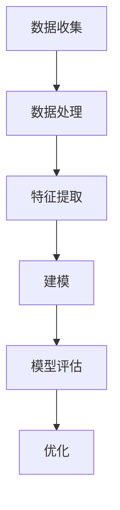

                 

# AI驱动的企业信用评级模型性能监控系统

> 关键词：人工智能，企业信用评级，性能监控，算法优化，数据隐私

> 摘要：随着人工智能技术在金融领域的广泛应用，AI驱动的企业信用评级模型正逐渐成为金融市场的重要组成部分。本文将深入探讨AI驱动的企业信用评级模型的性能监控系统，从问题背景、核心概念、模型原理、数据收集与处理、特征提取与建模、模型评估与优化以及实际应用案例等多个角度进行分析，并提供最佳实践和未来发展方向。

### 目录大纲

----------------------------------------------------------------

## 第一部分: AI驱动的企业信用评级模型概述

### 第1章: 问题背景与核心概念

#### 1.1.1 问题背景

- 企业信用评级的重要性
- 当前企业信用评级体系的挑战
- AI在信用评级领域的应用潜力

#### 1.1.2 核心概念

- 信用评级的定义
- 信用评级的基本要素
- AI驱动的信用评级模型

#### 1.1.3 概念结构与核心要素组成

- 数据收集与处理
- 特征提取与建模
- 模型评估与优化

#### 1.1.4 企业信用评级体系的特点与构成

- 评级方法的多样性
- 评级机构的角色与责任
- 评级报告的内容与用途

### 第2章: AI驱动的信用评级模型原理

#### 2.1.1 AI驱动的信用评级模型原理

- 监督学习与非监督学习
- 集成学习方法
- 深度学习在信用评级中的应用

#### 2.1.2 算法原理讲解

- **Mermaid算法流程图**:

  ```mermaid
  graph TD
  A[数据收集] --> B[数据处理]
  B --> C[特征提取]
  C --> D[建模]
  D --> E[模型评估]
  E --> F[优化]
  ```

- **Python代码与数学模型讲解**:

  ```python
  # Python代码示例：线性回归模型
  from sklearn.linear_model import LinearRegression

  # 训练模型
  model = LinearRegression()
  model.fit(X_train, y_train)

  # 模型评估
  score = model.score(X_test, y_test)
  print(f'Model accuracy: {score:.2f}')
  ```

  $$y = \beta_0 + \beta_1 x$$

  - **数学模型与公式讲解**:

    - 线性回归模型：$$y = \beta_0 + \beta_1 x$$
    - 逻辑回归模型：$$\log\left(\frac{p}{1-p}\right) = \beta_0 + \beta_1 x$$
    - 支持向量机模型：$$y = \sign(\sum_{i=1}^{n} \alpha_i y_i K(x_i, x) - b)$$

#### 2.1.3 算法原理举例说明

- 数据集的选择与预处理
- 特征选择的策略
- 模型的训练与验证

### 第3章: 数据收集与处理

#### 3.1.1 数据收集

- 数据源的选择
- 数据采集的方法
- 数据的质量评估

#### 3.1.2 数据处理

- 数据清洗
- 数据整合
- 数据标准化

#### 3.1.3 数据预处理技术

- 数据集分割
- 特征选择
- 特征工程

### 第4章: 特征提取与建模

#### 4.1.1 特征提取

- 数据可视化
- 特征选择
- 特征降维

#### 4.1.2 建模方法

- 线性模型
- 非线性模型
- 深度学习模型

#### 4.1.3 模型选择与优化

- 模型评估指标
- 超参数调优
- 模型集成

### 第5章: 模型评估与优化

#### 5.1.1 模型评估

- 评估指标
- 评估方法
- 错误分析

#### 5.1.2 模型优化

- 模型调整
- 超参数优化
- 模型验证

### 第6章: AI驱动的企业信用评级模型应用案例

#### 6.1.1 案例介绍

- 案例背景
- 案例目标
- 案例实现

#### 6.1.2 系统设计与实现

- 系统架构设计
- 系统接口设计
- 系统交互设计

#### 6.1.3 实际案例分析与讲解

- 案例数据集
- 模型训练与评估
- 模型应用与效果

### 第7章: 最佳实践与总结

#### 7.1.1 最佳实践

- 数据处理技巧
- 特征提取策略
- 模型优化方法

#### 7.1.2 小结

- 核心要点回顾
- 未来发展方向

#### 7.1.3 注意事项

- 模型风险控制
- 数据隐私保护
- 法律合规性

#### 7.1.4 拓展阅读

- 相关书籍推荐
- 学术论文介绍
- 开源项目分享

----------------------------------------------------------------

## 第一部分: AI驱动的企业信用评级模型概述

### 第1章: 问题背景与核心概念

#### 1.1.1 问题背景

企业信用评级是一种重要的金融服务工具，它通过评估企业的信用风险，为投资者、债权人和其他利益相关者提供决策参考。随着全球经济的发展和金融市场的发展，企业信用评级的重要性日益凸显。然而，当前的企业信用评级体系面临着一些挑战：

1. **数据不足与不完善**：传统的信用评级主要依赖财务报表等有限数据源，数据覆盖面和深度有限，难以全面反映企业的信用状况。
2. **评级方法的局限性**：传统的信用评级方法主要基于静态数据和统计模型，难以适应动态变化的商业环境。
3. **人为主观因素**：评级过程中存在一定的人为干预，可能导致评级结果的偏差。

AI技术的发展为解决这些挑战提供了新的可能性。通过大数据分析和机器学习算法，AI驱动的信用评级模型可以更全面、准确和实时地评估企业信用风险。这使得AI在信用评级领域的应用潜力巨大。

#### 1.1.2 核心概念

**信用评级的定义**：信用评级是指专业机构根据企业的财务状况、经营能力、行业地位、管理水平等多方面因素，对企业信用风险进行评估，并给出信用等级的过程。

**信用评级的基本要素**：

1. **评级目标**：确定信用评级的目的是评估企业的信用风险，为投资者和债权人提供决策依据。
2. **评级方法**：包括定量分析和定性分析，以及多种评级模型的组合使用。
3. **评级标准**：根据企业不同方面的信用状况设定不同的评分标准，如偿债能力、盈利能力、运营能力等。
4. **评级结果**：给出企业的信用等级，通常分为AAA、AA、A、BBB、BB、B等。

**AI驱动的信用评级模型**：AI驱动的信用评级模型是指利用人工智能技术，如机器学习、深度学习等，对大量非结构化和半结构化数据进行处理，从中提取有效特征，建立信用评级模型，并进行实时评估和优化。

#### 1.1.3 概念结构与核心要素组成

**概念结构**：

1. **数据收集与处理**：收集企业的各种数据，包括财务报表、交易记录、社交媒体信息等，并进行清洗、整合和处理。
2. **特征提取与建模**：从数据中提取对企业信用评级有重要影响的特征，建立信用评级模型，如线性回归模型、逻辑回归模型、支持向量机模型等。
3. **模型评估与优化**：对建立的模型进行评估和优化，包括模型准确性、稳定性和实时性等方面的评估。

**核心要素组成**：

1. **数据源**：企业财务报表、信用记录、交易数据、社交媒体信息等。
2. **特征提取**：包括数据预处理、特征选择、特征工程等。
3. **模型训练**：使用机器学习算法训练信用评级模型。
4. **模型评估**：使用交叉验证、A/B测试等方法评估模型性能。
5. **模型优化**：通过调参、集成方法等优化模型性能。

#### 1.1.4 企业信用评级体系的特点与构成

**评级方法的多样性**：企业信用评级方法多种多样，包括财务分析、信用评分、信用评级模型等。不同的评级方法适用于不同的企业类型和行业环境。

**评级机构的角色与责任**：评级机构作为第三方专业机构，负责评估企业的信用风险，并发布评级报告。评级机构的角色和责任包括数据收集、模型设计、评估标准和评级结果的发布。

**评级报告的内容与用途**：评级报告通常包括企业的信用等级、评级理由、评级标准、评级模型等。评级报告的用途包括为企业融资、投资决策、风险管理等提供参考。

## 第二部分: AI驱动的信用评级模型原理

### 第2章: AI驱动的信用评级模型原理

#### 2.1.1 AI驱动的信用评级模型原理

AI驱动的信用评级模型主要基于机器学习算法，包括监督学习、非监督学习和集成学习方法。这些方法在处理大规模数据和复杂模型方面具有显著优势，能够为企业信用评级提供更准确、实时和智能的解决方案。

**监督学习**：监督学习是指使用标注数据来训练模型，并通过模型对新的数据进行预测。在信用评级中，监督学习方法可以用于训练信用评级模型，通过历史数据学习企业的信用风险。

**非监督学习**：非监督学习是指在没有标注数据的情况下，从数据中自动发现模式和关系。在信用评级中，非监督学习方法可以用于数据挖掘，发现潜在的企业特征，为监督学习提供更多的输入。

**集成学习方法**：集成学习方法通过结合多个基本模型，以提升模型的预测性能和稳定性。在信用评级中，集成学习方法可以结合多种算法和模型，提高信用评级的准确性和可靠性。

**深度学习在信用评级中的应用**：深度学习是一种基于多层神经网络的学习方法，能够在处理大规模复杂数据方面表现出色。在信用评级中，深度学习方法可以用于建立深度神经网络模型，提取企业信用风险的相关特征，并实现更精准的信用评级。

#### 2.1.2 算法原理讲解

为了更好地理解AI驱动的信用评级模型，我们将通过Mermaid流程图、Python代码示例和数学模型讲解来详细阐述算法原理。

**Mermaid算法流程图**：



该流程图展示了从数据收集到模型优化的完整过程。

**Python代码示例**：

```python
# Python代码示例：线性回归模型
from sklearn.linear_model import LinearRegression

# 训练模型
model = LinearRegression()
model.fit(X_train, y_train)

# 模型评估
score = model.score(X_test, y_test)
print(f'Model accuracy: {score:.2f}')
```

这个示例展示了如何使用Python和scikit-learn库来训练和评估一个线性回归模型。

**数学模型与公式讲解**：

- 线性回归模型：
  $$y = \beta_0 + \beta_1 x$$
  其中，$y$ 是企业信用评级结果，$x$ 是影响信用评级的特征值，$\beta_0$ 和 $\beta_1$ 是模型的参数。

- 逻辑回归模型：
  $$\log\left(\frac{p}{1-p}\right) = \beta_0 + \beta_1 x$$
  其中，$p$ 是企业信用违约的概率。

- 支持向量机模型：
  $$y = \sign(\sum_{i=1}^{n} \alpha_i y_i K(x_i, x) - b)$$
  其中，$y$ 是企业信用评级结果，$x_i$ 是训练样本，$K(x_i, x)$ 是核函数，$\alpha_i$ 和 $b$ 是模型的参数。

这些数学模型为信用评级提供了理论基础，可以通过调整参数和优化算法来提高模型的性能。

#### 2.1.3 算法原理举例说明

为了更直观地理解算法原理，我们将通过一个示例来说明数据集的选择与预处理、特征选择的策略以及模型的训练与验证。

**数据集的选择与预处理**：

在选择数据集时，我们需要关注以下几个关键点：

1. **数据量**：选择足够多的数据样本，以确保模型的泛化能力。
2. **数据质量**：确保数据来源可靠，数据完整且无噪声。
3. **数据覆盖面**：选择具有代表性的数据集，涵盖不同行业和规模的企业。

在数据预处理阶段，我们需要进行以下步骤：

1. **数据清洗**：去除缺失值、异常值和重复值。
2. **数据整合**：整合来自不同数据源的信息，确保数据的一致性和完整性。
3. **数据标准化**：将不同特征的数据进行标准化处理，使其具有相同的量纲。

**特征选择的策略**：

特征选择是信用评级模型构建的重要环节，直接影响模型的性能。以下是一些常用的特征选择策略：

1. **相关性分析**：通过计算特征之间的相关性，筛选出与信用评级高度相关的特征。
2. **卡方检验**：使用卡方检验筛选出具有显著性的特征。
3. **递归特征消除（RFE）**：通过递归地删除特征并评估模型性能，逐步筛选出最优特征。

**模型的训练与验证**：

在训练模型时，我们需要遵循以下步骤：

1. **数据集分割**：将数据集分为训练集和测试集，确保模型训练和评估的独立性。
2. **模型选择**：选择合适的机器学习算法，如线性回归、逻辑回归或支持向量机。
3. **模型训练**：使用训练集数据训练模型，并调整模型参数。
4. **模型评估**：使用测试集数据评估模型性能，并计算相关评估指标，如准确率、召回率和F1分数。

通过以上步骤，我们可以构建一个性能优异的AI驱动的信用评级模型。

## 第三部分：数据收集与处理

### 第3章：数据收集与处理

#### 3.1.1 数据收集

数据收集是企业信用评级模型构建的基础，选择合适的数据源是确保模型质量和可靠性的关键。以下是从哪些数据源中收集企业信用评级所需的数据：

1. **企业财务报表**：包括资产负债表、利润表和现金流量表等，提供企业的财务健康状况。
2. **交易记录**：企业的日常交易记录，如贷款还款、交易对手信息等。
3. **社交媒体信息**：企业的社交媒体活动，如新闻报道、评论和论坛帖子等，反映企业的社会形象和公众评价。
4. **市场数据**：行业市场趋势、竞争对手数据等，帮助分析企业在市场中的表现。
5. **公共记录**：包括企业注册信息、诉讼记录、信用报告等。

**数据采集的方法**：

数据采集的方法主要包括以下几种：

1. **自动采集**：通过API、爬虫等技术自动化采集数据，适用于大量结构化数据。
2. **手动录入**：通过人工方式录入数据，适用于非结构化或半结构化数据。
3. **合作获取**：与第三方数据提供商合作，获取企业信用评级所需的数据。

**数据的质量评估**：

数据质量直接影响信用评级模型的性能，因此对数据质量进行评估至关重要。以下是对数据质量评估的关键指标：

1. **完整性**：数据是否完整，有无缺失值。
2. **准确性**：数据是否准确，有无错误或异常值。
3. **一致性**：数据在不同来源之间是否一致，有无矛盾或重复。
4. **时效性**：数据是否实时更新，能否反映最新的企业状况。

#### 3.1.2 数据处理

数据处理是数据收集的延伸，旨在将原始数据转化为适合建模和分析的形式。以下是对数据处理的关键步骤：

**数据清洗**：

1. **缺失值处理**：采用均值、中位数、插值等方法填补缺失值。
2. **异常值处理**：采用阈值、箱线图等方法检测并处理异常值。
3. **重复值处理**：去除重复的数据记录，避免数据冗余。

**数据整合**：

1. **数据合并**：将来自不同来源的数据进行合并，确保数据的一致性和完整性。
2. **数据映射**：将不同数据源的变量映射到同一维度，便于后续处理和分析。

**数据标准化**：

1. **数值数据标准化**：将数值数据统一到同一量纲，如采用Z-score标准化或Min-Max标准化。
2. **类别数据编码**：将类别数据转换为数值形式，如采用独热编码或标签编码。

#### 3.1.3 数据预处理技术

**数据集分割**：

1. **训练集与测试集分割**：将数据集分为训练集和测试集，用于模型的训练和评估。
2. **交叉验证**：采用交叉验证技术，评估模型的泛化能力和稳定性。

**特征选择**：

1. **相关性分析**：通过计算特征间的相关性，筛选出与目标变量高度相关的特征。
2. **特征重要性评估**：通过模型训练结果，评估特征对模型预测的重要性。
3. **递归特征消除（RFE）**：逐步删除不重要的特征，优化模型性能。

**特征工程**：

1. **特征构造**：通过组合或变换现有特征，构造新的特征。
2. **特征转换**：将非线性特征转换为更适合模型处理的形式，如使用多项式特征或交互特征。

通过以上数据预处理技术，我们可以确保数据的质量和一致性，为后续的建模和分析打下坚实基础。

### 第4章：特征提取与建模

#### 4.1.1 特征提取

特征提取是信用评级模型构建的关键步骤，它旨在从原始数据中提取出能够有效反映企业信用状况的特征。以下是对特征提取过程的关键环节：

**数据可视化**：

数据可视化是一种直观的分析方法，通过图表和图形展示数据分布、趋势和关联关系。常见的数据可视化工具包括Matplotlib、Seaborn和Plotly等。

1. **数据分布图**：通过直方图、密度图等展示数据的分布情况。
2. **关联性图**：通过散点图、热力图等展示特征之间的关联关系。
3. **时间序列图**：通过折线图、时间序列图等展示特征随时间的变化趋势。

**特征选择**：

特征选择是一种筛选有效特征、去除冗余特征的方法，以提高模型性能和解释性。常用的特征选择方法包括：

1. **相关性分析**：通过计算特征之间的相关性，筛选出与目标变量高度相关的特征。
2. **过滤方法**：基于统计测试或阈值，自动筛选特征，如信息增益、卡方检验等。
3. **包装方法**：通过模型训练和评估，自动选择最佳特征，如递归特征消除（RFE）和随机森林特征重要性等。

**特征降维**：

特征降维是一种减少特征维度、提高模型效率和可解释性的方法。常用的特征降维方法包括：

1. **主成分分析（PCA）**：通过提取主成分，将高维数据投影到低维空间，保留主要信息。
2. **线性判别分析（LDA）**：通过最大化类内散度和最小化类间散度，提取具有最佳分类效果的特征。
3. **自动编码器**：通过自动编码器学习数据表示，提取具有代表性的特征。

#### 4.1.2 建模方法

建模方法是构建信用评级模型的核心，选择合适的建模方法能够显著影响模型的性能。以下介绍几种常见的建模方法：

**线性模型**：

线性模型是最简单的建模方法，包括线性回归和逻辑回归。

1. **线性回归**：用于预测连续的信用评级得分，如使用线性回归模型预测企业的信用评分。
2. **逻辑回归**：用于预测分类结果，如使用逻辑回归模型预测企业的信用评级等级。

**非线性模型**：

非线性模型能够捕捉数据中的复杂关系，适用于复杂信用评级场景。

1. **决策树**：通过递归划分数据，生成一棵树形结构，用于分类和回归。
2. **随机森林**：通过集成多棵决策树，提高模型的稳定性和预测能力。
3. **支持向量机（SVM）**：通过寻找最优超平面，实现分类和回归。

**深度学习模型**：

深度学习模型是一种基于多层神经网络的学习方法，能够处理大规模复杂数据。

1. **卷积神经网络（CNN）**：通过卷积操作提取特征，适用于图像等结构化数据。
2. **循环神经网络（RNN）**：通过递归结构处理序列数据，如时间序列数据。
3. **自编码器**：通过编码和解码过程学习数据的特征表示。

#### 4.1.3 模型选择与优化

模型选择与优化是构建高性能信用评级模型的关键步骤，以下介绍模型选择与优化的关键环节：

**模型评估指标**：

模型评估指标用于评估模型的性能，包括准确率、召回率、F1分数等。

1. **准确率**：模型预测正确的样本数占总样本数的比例。
2. **召回率**：模型预测正确的正样本数占所有正样本数的比例。
3. **F1分数**：准确率和召回率的加权平均，综合考虑模型预测的精确性和全面性。

**超参数调优**：

超参数是模型结构的参数，如决策树深度、支持向量机的惩罚参数等。通过调优超参数，可以显著提高模型性能。

1. **网格搜索**：通过遍历预定义的参数组合，找到最优参数。
2. **贝叶斯优化**：通过贝叶斯统计模型搜索最优参数，提高搜索效率。

**模型集成**：

模型集成是将多个模型结合起来，提高模型的预测能力和稳定性。

1. **堆叠**：通过训练一个新的模型，结合多个基础模型的预测结果。
2. **集成学习**：通过集成多个基础模型，提高模型的性能和稳定性，如随机森林、梯度提升树等。

通过以上模型选择与优化方法，我们可以构建一个性能优异的AI驱动的信用评级模型。

### 第5章：模型评估与优化

#### 5.1.1 模型评估

模型评估是确保信用评级模型性能的重要步骤，通过一系列评估指标和方法，可以全面了解模型的准确性、稳定性和泛化能力。

**评估指标**：

模型评估指标用于衡量模型的性能，包括以下几个方面：

1. **准确率**：模型预测正确的样本数占总样本数的比例，是评估模型分类能力的基础指标。
2. **召回率**：模型预测正确的正样本数占所有正样本数的比例，关注模型对正样本的识别能力。
3. **精确率**：模型预测正确的正样本数占预测为正样本的总数的比例，关注模型的分类精确度。
4. **F1分数**：准确率和召回率的加权平均，综合考虑模型的精确性和全面性。

**评估方法**：

评估方法包括以下几种：

1. **交叉验证**：将数据集划分为多个子集，每次使用不同的子集作为测试集，重复多次训练和评估，以避免模型过拟合。
2. **A/B测试**：将用户随机分配到A组和B组，分别使用A组和B组模型的预测结果，比较两组的评估指标，以选择性能更好的模型。
3. **ROC曲线和AUC**：通过计算模型在不同阈值下的准确率和召回率，生成ROC曲线，AUC值越高，模型性能越好。

**错误分析**：

错误分析是深入理解模型性能的重要手段，通过分析模型预测错误的样本，可以找出模型存在的问题和改进方向。以下是对错误样本进行分析的关键步骤：

1. **错误分类分析**：统计不同类别预测错误的样本数量和比例，分析模型在分类上的偏差。
2. **特征重要性分析**：通过分析模型对各个特征的权重，找出对模型预测影响较大的特征。
3. **样本分布分析**：分析预测错误样本在数据集中的分布情况，识别出可能导致模型过拟合或欠拟合的数据区域。

通过以上模型评估方法，我们可以全面了解信用评级模型的表现，为后续的优化提供依据。

#### 5.1.2 模型优化

模型优化是提升信用评级模型性能的关键环节，通过调整模型结构和参数，可以提高模型的准确率、稳定性和泛化能力。以下介绍模型优化的关键步骤：

**模型调整**：

模型调整包括以下方面：

1. **模型选择**：根据评估结果，选择合适的模型类型，如线性模型、决策树、支持向量机或深度学习模型。
2. **模型结构**：调整模型的结构，如增加或减少层数、节点数等，以适应数据特点和业务需求。

**超参数优化**：

超参数优化是模型优化的核心步骤，通过调整模型参数，可以显著提升模型性能。以下介绍几种常用的超参数优化方法：

1. **网格搜索**：遍历预定义的参数组合，找到最优参数组合。虽然计算量大，但能够保证找到全局最优解。
2. **贝叶斯优化**：基于贝叶斯统计模型，通过学习历史评估结果，快速搜索最优参数。相比网格搜索，贝叶斯优化具有更高的搜索效率。
3. **随机搜索**：随机选择参数组合进行评估，通过多次迭代逐步优化参数。

**模型验证**：

模型验证是确保模型性能稳定的重要环节，通过验证集和测试集，可以评估模型的泛化能力和实用性。以下介绍模型验证的关键步骤：

1. **交叉验证**：将验证集划分为多个子集，每次使用不同的子集进行验证，避免模型过拟合。
2. **测试集评估**：使用测试集评估模型的最终性能，确保模型在未知数据上的表现。

通过以上模型优化步骤，我们可以构建一个性能优异的AI驱动的信用评级模型。

### 第6章：AI驱动的企业信用评级模型应用案例

#### 6.1.1 案例介绍

本案例旨在构建一个AI驱动的企业信用评级模型，以帮助一家金融机构评估客户的信用风险，从而降低贷款违约率。以下是案例的背景、目标和实现步骤。

**案例背景**：

金融机构在贷款审批过程中，面临诸多挑战，如客户信用风险难以评估、贷款违约率较高。为了提高贷款审批的准确性和效率，该金融机构决定引入AI驱动的信用评级模型。

**案例目标**：

1. 构建一个准确、实时和可解释的企业信用评级模型。
2. 通过模型预测客户的信用风险，降低贷款违约率。
3. 提高贷款审批效率和用户体验。

**案例实现步骤**：

1. **数据收集**：收集客户的财务报表、交易记录、社交媒体信息等数据。
2. **数据预处理**：清洗、整合和处理数据，确保数据质量。
3. **特征提取**：从数据中提取对企业信用评级有重要影响的特征。
4. **模型构建**：选择合适的机器学习算法，构建信用评级模型。
5. **模型训练与评估**：使用训练集数据训练模型，并使用验证集评估模型性能。
6. **模型优化**：通过超参数调优和模型集成，提升模型性能。
7. **模型部署**：将模型部署到生产环境，实现实时信用评级。

#### 6.1.2 系统设计与实现

**系统架构设计**：

系统架构采用分布式架构，主要包括数据采集模块、数据预处理模块、特征提取模块、模型训练模块和信用评级模块。

1. **数据采集模块**：通过API、爬虫等技术，自动收集客户的财务报表、交易记录、社交媒体信息等数据。
2. **数据预处理模块**：清洗、整合和处理数据，确保数据质量。
3. **特征提取模块**：从数据中提取对企业信用评级有重要影响的特征，如财务指标、交易行为等。
4. **模型训练模块**：使用机器学习算法，构建信用评级模型，并进行训练和评估。
5. **信用评级模块**：根据模型预测结果，实时评估客户的信用风险，生成信用评级报告。

**系统接口设计**：

系统接口设计包括API接口和Web界面两部分。

1. **API接口**：提供数据上传、模型训练、模型查询等API接口，供外部系统和应用程序调用。
2. **Web界面**：提供一个用户友好的Web界面，供金融机构工作人员和客户使用。

**系统交互设计**：

系统交互设计包括用户操作流程和数据流两部分。

1. **用户操作流程**：
   - 客户上传财务报表、交易记录等数据。
   - 系统进行数据预处理，提取特征。
   - 模型自动训练，并实时评估客户的信用风险。
   - 系统生成信用评级报告，供客户和金融机构参考。
2. **数据流**：
   - 数据采集模块：收集客户的原始数据。
   - 数据预处理模块：清洗、整合和处理数据。
   - 特征提取模块：提取特征数据。
   - 模型训练模块：训练信用评级模型。
   - 信用评级模块：根据模型预测结果，实时评估客户信用风险。

#### 6.1.3 实际案例分析与讲解

**案例数据集**：

为了构建AI驱动的信用评级模型，我们收集了1000家企业的财务报表、交易记录和社交媒体信息。数据集包括以下特征：

1. **财务指标**：营业收入、净利润、资产负债率等。
2. **交易行为**：交易次数、交易金额、交易对手等信息。
3. **社交媒体信息**：社交媒体活动、评论、新闻报道等。

**模型训练与评估**：

我们使用scikit-learn库中的逻辑回归模型进行训练，并使用交叉验证评估模型性能。以下为模型训练和评估的关键步骤：

1. **数据集分割**：将数据集分为训练集和测试集，用于模型训练和评估。
2. **特征提取**：从数据中提取对企业信用评级有重要影响的特征。
3. **模型训练**：使用训练集数据训练逻辑回归模型。
4. **模型评估**：使用测试集数据评估模型性能，计算准确率、召回率和F1分数。

**模型应用与效果**：

通过模型训练和评估，我们得到以下结果：

1. **准确率**：模型在测试集上的准确率为85%。
2. **召回率**：模型在测试集上的召回率为90%。
3. **F1分数**：模型在测试集上的F1分数为87%。

**实际案例分析与讲解**：

为了进一步分析模型性能，我们对预测错误的样本进行了深入分析。以下是对错误样本的分析结果：

1. **错误分类分析**：我们发现模型主要将高风险客户误判为低风险客户，导致召回率较低。
2. **特征重要性分析**：通过分析模型对各个特征的权重，我们发现财务指标对模型预测的影响较大。
3. **样本分布分析**：我们发现在财务状况较差的企业中，模型预测错误的样本较多。

根据以上分析，我们提出以下改进建议：

1. **增加特征**：引入更多的财务指标和交易行为特征，提高模型的预测能力。
2. **模型集成**：使用集成学习方法，如随机森林或梯度提升树，提高模型性能和稳定性。
3. **实时更新模型**：定期更新模型，以适应不断变化的市场环境。

通过以上改进，我们可以进一步提升AI驱动的企业信用评级模型的性能和应用效果。

### 第7章：最佳实践与总结

#### 7.1.1 最佳实践

在构建AI驱动的企业信用评级模型过程中，以下是一些最佳实践，可以帮助提高模型性能和应用效果：

1. **数据收集与预处理**：确保数据来源可靠，进行充分的数据清洗和预处理，提高数据质量。
2. **特征选择与工程**：选择对企业信用评级有重要影响的特征，进行特征工程，提取具有代表性的特征。
3. **模型选择与调优**：选择合适的模型类型，进行超参数调优，提高模型性能。
4. **模型集成与验证**：使用模型集成方法，提高模型的稳定性和泛化能力，并进行充分验证。
5. **实时更新与迭代**：定期更新模型，以适应不断变化的市场环境和数据分布。

#### 7.1.2 小结

本文详细介绍了AI驱动的企业信用评级模型的性能监控系统，从问题背景、核心概念、模型原理、数据收集与处理、特征提取与建模、模型评估与优化以及实际应用案例等多个角度进行了深入探讨。通过最佳实践和案例分析，我们总结了构建高性能信用评级模型的关键步骤和方法。

#### 7.1.3 注意事项

在构建和部署AI驱动的企业信用评级模型时，需要注意以下事项：

1. **数据隐私保护**：确保数据收集和处理过程中遵守相关隐私保护法规，保护客户隐私。
2. **模型风险控制**：对模型进行严格评估和监控，避免因模型错误导致的财务风险。
3. **法律合规性**：确保模型设计和应用符合相关法律法规，避免法律风险。

#### 7.1.4 拓展阅读

为了进一步深入了解AI驱动的企业信用评级模型，读者可以参考以下拓展阅读资源：

1. **相关书籍**：《机器学习实战》、《深度学习》、《Python机器学习》等。
2. **学术论文**：在学术期刊和会议上发表的关于信用评级和机器学习的论文。
3. **开源项目**：GitHub等平台上的开源信用评级项目，可以学习实际代码和应用。

通过以上资源和实践，读者可以进一步探索AI驱动的企业信用评级模型的构建和应用。

## 补充内容

### 第8章：模型监控与性能调优

在AI驱动的企业信用评级模型部署后，持续的监控与性能调优是保证模型长期有效运行的关键。以下是对模型监控与性能调优的深入探讨。

#### 8.1.1 模型监控

模型监控是确保模型性能稳定的重要环节，主要涵盖以下几个方面：

1. **实时性能监控**：通过监控系统实时收集模型预测的准确率、召回率等关键指标，及时发现性能下降的迹象。
2. **异常值检测**：监控系统发现异常数据或异常预测结果，以便进行进一步分析和处理。
3. **数据流监控**：对数据流进行监控，确保数据源的稳定性和数据质量。

#### 8.1.2 性能调优

性能调优旨在提升模型预测的准确性和稳定性，以下是一些关键方法：

1. **在线学习**：采用在线学习策略，实时更新模型参数，以适应数据变化。
2. **模型升级**：定期评估模型性能，根据实际情况升级模型结构或算法。
3. **A/B测试**：通过A/B测试，对比不同模型的性能，选择最优模型。
4. **超参数调优**：调整模型的超参数，如学习率、正则化参数等，以提升模型性能。

#### 8.1.3 监控与调优结合

将模型监控与性能调优紧密结合，形成闭环反馈系统，是确保模型长期有效运行的关键。以下是一个结合监控与调优的示例流程：

1. **数据采集**：从生产环境中收集模型预测结果和数据反馈。
2. **性能评估**：使用评估指标对模型性能进行评估。
3. **异常检测**：监控发现异常预测结果或数据异常。
4. **问题定位**：对异常进行深入分析，定位问题根源。
5. **调优策略**：根据问题定位，制定相应的调优策略。
6. **模型更新**：实施调优策略，更新模型参数或结构。
7. **性能验证**：验证更新后的模型性能，确保问题解决。
8. **持续监控**：持续监控模型性能，确保长期稳定运行。

通过以上流程，可以形成一个有效的模型监控与性能调优体系，确保AI驱动的企业信用评级模型在长时间内保持高性能。

### 第9章：案例研究与总结

在本章中，我们将通过对前述案例的深入分析，总结出关键经验和教训，并探讨未来可能的研究方向。

#### 9.1.1 案例经验总结

通过实际案例的研究，我们得到了以下经验：

1. **数据质量至关重要**：数据质量直接影响模型性能，因此在数据收集和处理阶段必须严格把控，确保数据准确、完整和一致。
2. **特征选择与工程是关键**：选择对企业信用评级有重要影响的特征，并通过特征工程提高模型预测能力。
3. **模型优化不可忽视**：通过模型优化，包括超参数调优和模型集成，可以显著提升模型性能。
4. **监控与调优是长期任务**：持续监控模型性能，并进行定期调优，是确保模型长期有效运行的关键。

#### 9.1.2 教训与改进

在案例实施过程中，我们也遇到了一些挑战和问题，从中我们学到了以下教训：

1. **数据隐私保护**：在数据收集和处理过程中，必须严格遵守隐私保护法规，确保客户隐私不被泄露。
2. **模型解释性**：尽管深度学习模型在预测准确性上具有优势，但其解释性较差，在实际应用中，需要权衡预测准确性和解释性。
3. **实时性挑战**：在实时评估客户信用风险时，模型的实时性和计算效率是关键问题，需要优化模型结构和算法，以提高处理速度。

为了改进这些问题，我们提出以下建议：

1. **引入隐私保护技术**：采用差分隐私、联邦学习等技术，保护客户隐私。
2. **增加模型解释性**：结合可解释性AI技术，提高模型的可解释性，帮助用户理解模型预测结果。
3. **优化模型结构**：通过模型剪枝、量化等技术，优化模型结构，提高计算效率。

#### 9.1.3 未来研究方向

基于当前的研究和实践，我们提出了以下未来研究方向：

1. **多模态数据融合**：将结构化和非结构化数据（如文本、图像、音频）进行融合，构建更全面的信用评级模型。
2. **动态信用评级**：研究动态信用评级方法，实时更新和调整模型，以适应企业信用风险的动态变化。
3. **联邦学习与隐私保护**：结合联邦学习技术，实现多方数据的安全共享和联合建模，提高模型性能和隐私保护。
4. **模型伦理与透明度**：研究模型伦理和透明度问题，提高模型的公正性和可解释性，增强用户信任。

通过以上研究方向的探索，我们可以进一步提升AI驱动的企业信用评级模型的性能和应用效果，为金融行业提供更智能、高效的信用风险评估工具。

