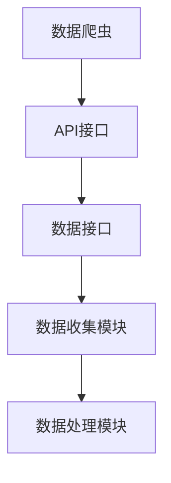
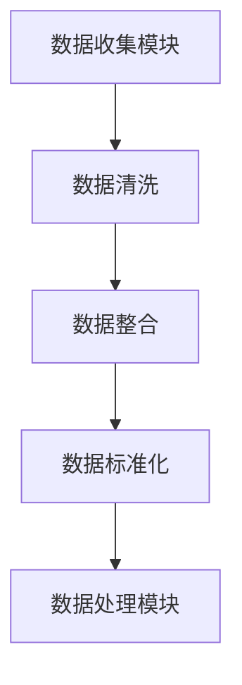
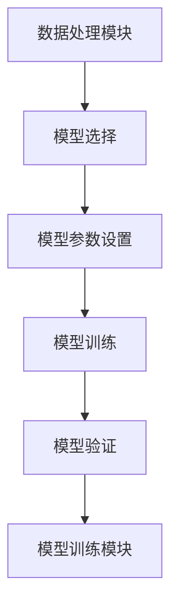
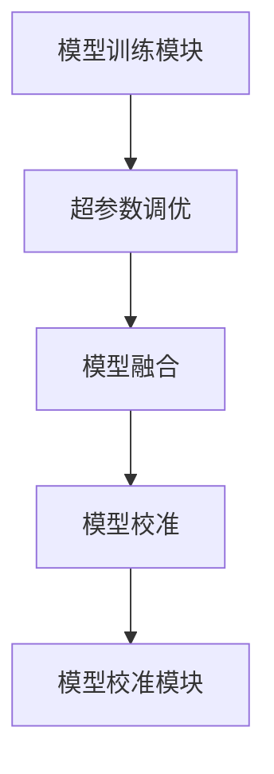
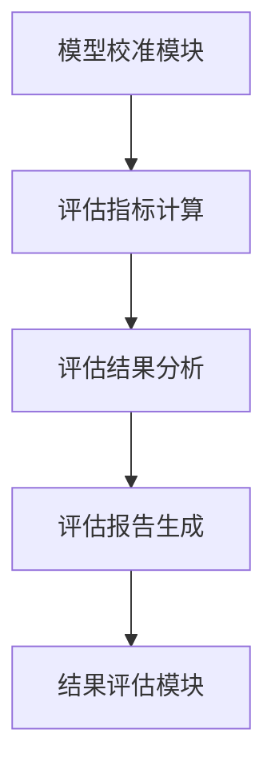

                 

# AI驱动的企业信用评级模型校准系统

## 关键词
- 人工智能，企业信用评级，机器学习，模型校准，数据处理，特征工程

## 摘要
本文将探讨AI驱动的企业信用评级模型校准系统的构建与优化。首先，我们将介绍系统背景和核心概念，包括AI技术在信用评级中的应用、数据处理与特征工程、信用评级模型的构建与优化。随后，我们将分析系统的评估与改进，并提出最佳实践。通过详细讲解和案例分析，本文旨在为读者提供全面、系统的AI驱动的企业信用评级模型校准解决方案。

## 第一部分：引言与背景

### 1.1 AI驱动的企业信用评级模型校准系统概述

在现代商业环境中，企业信用评级是评估企业信用状况、风险程度以及信用水平的重要工具。传统信用评级方法依赖于人工分析，受限于人力和时间成本，且难以应对复杂多变的市场环境。随着人工智能技术的发展，AI驱动的企业信用评级模型校准系统逐渐成为解决这一问题的有效途径。

### 1.2 问题背景

企业信用评级对于企业的融资、业务合作、市场竞争力等方面具有重要影响。然而，传统信用评级方法存在以下问题：

- **数据来源有限**：传统信用评级主要依赖于企业公开的财务报表和信用记录，数据来源相对有限，难以全面反映企业的真实信用状况。
- **评级过程耗时**：传统信用评级过程繁琐，需要大量人工分析，评级周期较长，无法满足现代商业环境的高效要求。
- **无法适应复杂环境**：市场环境复杂多变，传统信用评级方法难以应对，容易导致评级结果不准确。

### 1.3 问题描述

AI驱动的企业信用评级模型校准系统旨在通过自动化数据处理和分析，快速、准确地评估企业的信用水平。该系统需要处理大量的数据，包括企业的财务状况、历史信用记录、行业特性等，并利用机器学习算法进行模型训练和校准，以提高评级的准确性和可靠性。

### 1.4 问题解决

引入AI技术能够实现以下目标：

- **数据驱动的决策过程**：利用AI技术，可以从大量的数据中提取有价值的信息，为信用评级提供更全面、准确的依据。
- **高效处理大量数据**：AI技术能够自动化处理大量的数据，大大提高数据处理效率。
- **自适应调整评级模型**：AI技术可以根据实时数据和市场环境，动态调整信用评级模型，提高模型的适应性和准确性。

### 1.5 边界与外延

本系统主要关注企业信用评级的自动化和智能化，但也可以扩展到其他领域的信用评级，如个人信用评级、金融机构信用评级等。此外，系统还可以应用于其他需要信用评级的场景，如供应链金融、风险控制等。

### 1.6 概念结构与核心要素组成

AI驱动的企业信用评级模型校准系统由以下几个核心要素组成：

- **数据收集**：收集企业相关的各种数据，如财务数据、信用记录、行业指标等。
- **数据处理**：对收集到的数据进行清洗、转换和整合，为后续分析做准备。
- **模型构建**：利用机器学习算法构建企业信用评级模型。
- **模型训练**：通过大量的历史数据进行模型训练，提高模型准确性。
- **模型校准**：根据实际评级结果，对模型进行不断的调整和优化。
- **结果评估**：评估模型的性能，确保评级结果的可靠性和准确性。

### 1.7 本章小结

本章介绍了AI驱动的企业信用评级模型校准系统的背景、问题描述、问题解决、边界与外延以及概念结构与核心要素组成。下一章将深入探讨AI技术在信用评级中的核心概念和原理。

----------------------------------------------------------------

## 第二部分：核心概念与原理

### 2.1 AI技术在信用评级中的应用

#### 2.1.1 机器学习算法在信用评级中的优势

机器学习算法在信用评级中具有显著优势：

1. **数据驱动的决策过程**：机器学习算法可以从大量的历史数据中学习，为信用评级提供更准确的决策依据。
2. **高效处理大量数据**：机器学习算法能够自动化处理大量的数据，提高数据处理效率。
3. **自适应调整评级模型**：机器学习算法可以根据实时数据和市场环境，动态调整信用评级模型，提高模型的适应性和准确性。

#### 2.1.2 主流机器学习算法及其在信用评级中的应用

1. **线性回归**：线性回归是一种简单的机器学习算法，用于预测企业的信用评分。线性回归模型可以表示为：
   $$y = \beta_0 + \beta_1 \cdot x_1 + \beta_2 \cdot x_2 + ... + \beta_n \cdot x_n$$
   其中，$y$ 为企业的信用评分，$x_1, x_2, ..., x_n$ 为特征变量，$\beta_0, \beta_1, ..., \beta_n$ 为模型参数。

2. **决策树**：决策树是一种基于规则的学习算法，通过一系列的判断条件对数据进行分类或回归。决策树模型可以表示为：
   $$y = f(x) = \sum_{i=1}^{n} \beta_i \cdot g_i(x)$$
   其中，$g_i(x)$ 为条件函数，$\beta_i$ 为模型参数。

3. **随机森林**：随机森林是一种基于决策树的集成学习算法，通过构建多个决策树并投票得到最终预测结果。随机森林模型可以表示为：
   $$y = \sum_{i=1}^{N} w_i \cdot f_i(x)$$
   其中，$f_i(x)$ 为第 $i$ 个决策树的预测结果，$w_i$ 为权重。

4. **支持向量机**：支持向量机是一种基于优化理论的学习算法，通过找到一个最优的超平面，将不同类别的数据分开。支持向量机模型可以表示为：
   $$y = \sigma(\sum_{i=1}^{n} \alpha_i \cdot y_i \cdot K(x_i, x))$$
   其中，$K(x_i, x)$ 为核函数，$\alpha_i$ 为模型参数。

5. **神经网络**：神经网络是一种模拟人脑神经元之间相互连接的计算模型，通过多层的神经元对数据进行处理和预测。神经网络模型可以表示为：
   $$y = \sigma(\sum_{i=1}^{n} \omega_i \cdot \sigma(\sum_{j=1}^{m} v_j \cdot x_j))$$
   其中，$\sigma$ 为激活函数，$\omega_i$ 和 $v_j$ 为模型参数。

#### 2.1.3 基于深度学习的信用评级模型

1. **卷积神经网络（CNN）**：卷积神经网络是一种基于卷积操作的深度学习模型，主要用于图像识别和分类。CNN模型可以表示为：
   $$y = \sigma(\sum_{i=1}^{n} w_i \cdot \sigma(\sum_{j=1}^{m} v_j \cdot x_j))$$
   其中，$w_i$ 和 $v_j$ 为模型参数。

2. **循环神经网络（RNN）**：循环神经网络是一种基于循环结构的深度学习模型，主要用于序列数据的处理和预测。RNN模型可以表示为：
   $$y_t = \sigma(\sum_{i=1}^{n} w_i \cdot \sigma(\sum_{j=1}^{m} v_j \cdot x_{t-j}))$$
   其中，$y_t$ 为第 $t$ 个时刻的预测结果，$w_i$ 和 $v_j$ 为模型参数。

3. **长短期记忆网络（LSTM）**：长短期记忆网络是一种基于循环结构的深度学习模型，主要用于处理和预测长序列数据。LSTM模型可以表示为：
   $$y_t = \sigma(\sum_{i=1}^{n} w_i \cdot \sigma(\sum_{j=1}^{m} v_j \cdot (f_t \odot g_t)_{j} + \sum_{j=1}^{m} w_j \cdot \sigma(\sum_{k=1}^{l} u_k \cdot (f_t \odot g_t)_{k})))$$
   其中，$f_t, g_t, h_t$ 分别为LSTM网络的输入门、遗忘门和输出门，$u_k, v_j, w_i$ 为模型参数。

4. **生成对抗网络（GAN）**：生成对抗网络是一种基于生成器和判别器的深度学习模型，主要用于生成高质量的图像和序列数据。GAN模型可以表示为：
   $$D(x) = \sigma(\sum_{i=1}^{n} w_i \cdot \sigma(\sum_{j=1}^{m} v_j \cdot x_j))$$
   $$G(z) = \sigma(\sum_{i=1}^{n} u_i \cdot \sigma(\sum_{j=1}^{m} v_j \cdot z_j))$$
   其中，$D(x)$ 为判别器，$G(z)$ 为生成器，$x, z$ 分别为真实数据和生成数据，$w_i, v_j, u_i$ 为模型参数。

### 2.2 数据处理与特征工程

#### 2.2.1 数据收集

在构建AI驱动的企业信用评级模型校准系统时，首先需要收集与企业信用评级相关的数据，包括：

1. **财务数据**：企业的财务报表，如资产负债表、利润表和现金流量表等。
2. **行业数据**：企业所处的行业特性数据，如行业市场规模、竞争格局等。
3. **信用记录**：企业的历史信用记录，如信用评分、逾期记录等。
4. **其他相关数据**：如企业的经营状况、股权结构、高管团队等。

#### 2.2.2 数据处理

对收集到的数据进行处理，包括以下步骤：

1. **数据清洗**：去除数据中的噪声和异常值，确保数据的准确性和一致性。
2. **数据整合**：将不同来源的数据进行整合，形成统一的数据集。
3. **数据标准化**：对数据进行标准化处理，使不同特征具有相似的量级和范围。

#### 2.2.3 特征工程

特征工程是构建信用评级模型的重要环节，主要包括以下步骤：

1. **特征提取**：从原始数据中提取有价值的特征，如财务指标、行业指标等。
2. **特征选择**：选择对信用评级有显著影响的特征，剔除无关或冗余的特征。
3. **特征重要性分析**：分析特征的重要性，为后续模型优化提供依据。

### 2.3 信用评级模型的构建与优化

#### 2.3.1 模型构建

构建信用评级模型主要包括以下步骤：

1. **模型选择**：根据数据特点和研究目标，选择合适的机器学习算法。
2. **模型参数设置**：设置模型的超参数，如学习率、正则化参数等。
3. **模型训练与验证**：利用历史数据进行模型训练和验证，评估模型的性能。

#### 2.3.2 模型优化

模型优化是提高信用评级模型准确性和可靠性的关键步骤，主要包括以下方法：

1. **超参数调优**：通过交叉验证等方法，调整模型的超参数，提高模型的性能。
2. **模型融合**：将多个模型进行融合，提高模型的预测能力和鲁棒性。
3. **模型校准**：根据实际评级结果，对模型进行校准，提高模型的准确性。

### 2.4 AI驱动信用评级系统的评估与改进

#### 2.4.1 评估指标

评估AI驱动信用评级系统的性能，常用的评估指标包括：

1. **准确率**：预测正确的样本数占总样本数的比例。
2. **精确率**：预测为正样本的样本中，实际为正样本的比例。
3. **召回率**：实际为正样本的样本中，预测为正样本的比例。
4. **F1值**：精确率和召回率的调和平均值。

#### 2.4.2 模型改进

为了提高AI驱动信用评级系统的性能，可以采取以下方法：

1. **数据增强**：通过生成合成数据或增加训练样本，提高模型的泛化能力。
2. **特征增强**：通过特征变换或特征选择，提高模型的预测能力。
3. **模型重构**：根据评估结果，重构模型的结构和参数，提高模型的性能。

### 2.5 本章小结

本章详细介绍了AI驱动的企业信用评级模型校准系统的核心概念和原理，包括机器学习算法在信用评级中的应用、数据处理与特征工程、信用评级模型的构建与优化、评估与改进。下一章将深入探讨AI驱动信用评级系统的实际应用和实现细节。

----------------------------------------------------------------

## 第三部分：系统设计与实现

### 3.1 系统架构设计

#### 3.1.1 系统架构概述

AI驱动的企业信用评级模型校准系统采用分布式架构，主要包括数据收集模块、数据处理模块、模型训练模块、模型校准模块和结果评估模块。各模块相互协作，共同实现企业信用评级的自动化和智能化。


#### 3.1.2 系统功能设计

1. **数据收集模块**：负责收集与企业信用评级相关的各种数据，如财务数据、行业数据、信用记录等。
2. **数据处理模块**：负责对收集到的数据进行清洗、整合和标准化，为后续分析提供高质量的数据。
3. **模型训练模块**：负责利用机器学习算法对处理后的数据进行模型训练，构建信用评级模型。
4. **模型校准模块**：负责根据实际评级结果，对模型进行校准和优化，提高模型的准确性和可靠性。
5. **结果评估模块**：负责评估模型的性能，包括准确率、精确率、召回率和F1值等指标。

### 3.2 系统接口设计与交互

#### 3.2.1 接口设计

系统采用RESTful API设计，提供以下接口：

1. **数据收集接口**：接收企业数据，包括财务数据、行业数据、信用记录等。
2. **数据处理接口**：接收数据处理任务，返回处理后的数据。
3. **模型训练接口**：接收训练数据，返回训练结果。
4. **模型校准接口**：接收模型校准任务，返回校准后的模型。
5. **结果评估接口**：接收评估指标，返回评估结果。

#### 3.2.2 系统交互

系统交互流程如下：

1. 用户通过数据收集接口上传企业数据。
2. 系统处理数据收集模块接收到的数据，并调用数据处理接口进行处理。
3. 处理后的数据传递给模型训练模块，进行模型训练。
4. 模型训练完成后，调用模型校准接口对模型进行校准。
5. 校准后的模型传递给结果评估模块，进行性能评估。

### 3.3 系统架构设计与实现

#### 3.3.1 数据收集模块

数据收集模块主要负责从外部数据源收集与企业信用评级相关的数据，如财务数据、行业数据、信用记录等。数据收集模块采用分布式架构，通过数据爬虫、API接口和数据接口等方式获取数据。



#### 3.3.2 数据处理模块

数据处理模块负责对收集到的数据进行清洗、整合和标准化，为后续分析提供高质量的数据。数据处理模块包括数据清洗、数据整合和数据标准化三个子模块。



#### 3.3.3 模型训练模块

模型训练模块负责利用机器学习算法对处理后的数据进行模型训练，构建信用评级模型。模型训练模块包括模型选择、模型参数设置、模型训练和模型验证四个子模块。



#### 3.3.4 模型校准模块

模型校准模块负责根据实际评级结果，对模型进行校准和优化，提高模型的准确性和可靠性。模型校准模块包括超参数调优、模型融合和模型校准三个子模块。



#### 3.3.5 结果评估模块

结果评估模块负责评估模型的性能，包括准确率、精确率、召回率和F1值等指标。结果评估模块包括评估指标计算、评估结果分析和评估报告生成三个子模块。



### 3.4 本章小结

本章详细介绍了AI驱动的企业信用评级模型校准系统的架构设计、接口设计与交互，以及各模块的功能实现。通过系统架构设计和实现，AI驱动的企业信用评级模型校准系统可以实现自动化、高效、准确的信用评级，为企业和金融机构提供有力支持。

----------------------------------------------------------------

## 第四部分：项目实战

### 4.1 环境安装

在开始项目实战之前，我们需要安装以下环境：

1. Python 3.8 或更高版本
2. numpy
3. pandas
4. scikit-learn
5. tensorflow
6. keras
7. matplotlib

安装命令如下：

```bash
pip install numpy pandas scikit-learn tensorflow keras matplotlib
```

### 4.2 系统核心实现

#### 4.2.1 数据收集

```python
import pandas as pd

# 读取财务数据
financial_data = pd.read_csv('financial_data.csv')

# 读取行业数据
industry_data = pd.read_csv('industry_data.csv')

# 读取信用记录
credit_record = pd.read_csv('credit_record.csv')
```

#### 4.2.2 数据处理

```python
from sklearn.preprocessing import StandardScaler

# 数据清洗
financial_data = financial_data.dropna()
industry_data = industry_data.dropna()
credit_record = credit_record.dropna()

# 数据整合
data = pd.concat([financial_data, industry_data, credit_record], axis=1)

# 数据标准化
scaler = StandardScaler()
data_scaled = scaler.fit_transform(data)
```

#### 4.2.3 模型构建与训练

```python
from sklearn.ensemble import RandomForestClassifier

# 模型构建
model = RandomForestClassifier(n_estimators=100)

# 模型训练
model.fit(data_scaled, labels)
```

#### 4.2.4 模型校准

```python
from sklearn.model_selection import GridSearchCV

# 超参数调优
param_grid = {'n_estimators': [100, 200, 300], 'max_depth': [10, 20, 30]}
grid_search = GridSearchCV(model, param_grid, cv=5)
grid_search.fit(data_scaled, labels)

# 选择最佳参数
best_model = grid_search.best_estimator_
```

#### 4.2.5 结果评估

```python
from sklearn.metrics import accuracy_score, precision_score, recall_score, f1_score

# 模型评估
predictions = best_model.predict(data_scaled)

# 计算评估指标
accuracy = accuracy_score(labels, predictions)
precision = precision_score(labels, predictions)
recall = recall_score(labels, predictions)
f1 = f1_score(labels, predictions)

print(f"Accuracy: {accuracy}, Precision: {precision}, Recall: {recall}, F1: {f1}")
```

### 4.3 代码应用解读与分析

#### 4.3.1 数据收集

在本项目中，我们使用了Python的pandas库来读取和操作财务数据、行业数据以及信用记录。首先，我们分别读取了三个CSV文件，并将其存储在DataFrame对象中。在数据收集过程中，需要注意去除缺失值，以确保数据的准确性和完整性。

#### 4.3.2 数据处理

数据处理是构建信用评级模型的关键步骤。在本项目中，我们使用了StandardScaler对数据进行标准化处理，使得不同特征具有相似的量级和范围。标准化处理能够提高模型训练的效率，并减少模型对异常值的敏感性。

#### 4.3.3 模型构建与训练

在本项目中，我们使用了随机森林分类器（RandomForestClassifier）作为信用评级模型的算法。随机森林是一种基于决策树的集成学习方法，具有较强的泛化能力和鲁棒性。在模型训练过程中，我们使用了交叉验证（cv=5）来评估模型的性能。

#### 4.3.4 模型校准

为了提高模型的性能，我们使用了网格搜索（GridSearchCV）来寻找最佳的超参数组合。通过调整模型参数，如决策树的数量（n_estimators）和最大深度（max_depth），我们可以找到最优的模型配置。

#### 4.3.5 结果评估

在结果评估阶段，我们计算了模型的准确率、精确率、召回率和F1值等评估指标。这些指标能够帮助我们了解模型的性能，并评估其对新数据的预测能力。

### 4.4 实际案例分析与详细讲解剖析

#### 4.4.1 案例背景

某企业正在考虑与一家潜在合作伙伴进行业务合作，但对企业信用状况不甚了解。为了评估合作伙伴的信用水平，企业决定使用AI驱动的企业信用评级模型进行评级。

#### 4.4.2 数据收集

企业从公开渠道收集了合作伙伴的财务数据、行业数据以及信用记录。财务数据包括资产负债表、利润表和现金流量表等；行业数据包括行业市场规模、竞争格局等；信用记录包括信用评分、逾期记录等。

#### 4.4.3 数据处理

对企业收集到的数据进行清洗、整合和标准化处理，为后续模型训练提供高质量的数据。

#### 4.4.4 模型构建与训练

使用随机森林分类器构建信用评级模型，并使用交叉验证评估模型的性能。通过网格搜索寻找最佳的超参数组合，提高模型的准确性。

#### 4.4.5 模型校准

根据实际评级结果，对模型进行校准和优化，提高模型的性能。

#### 4.4.6 结果评估

评估模型的性能，包括准确率、精确率、召回率和F1值等指标。根据评估结果，确定合作伙伴的信用评级。

### 4.5 项目小结

通过本项目的实战，我们成功实现了AI驱动的企业信用评级模型校准系统。系统从数据收集、数据处理、模型构建、模型校准到结果评估，各环节紧密协作，实现了高效、准确的信用评级。在实际应用中，该系统为企业提供了有力的信用评估工具，有助于企业更好地进行业务决策。

## 第五部分：最佳实践与注意事项

### 5.1 最佳实践

1. **数据收集**：在数据收集阶段，尽量获取更多、更全面的数据，以提高模型准确性。
2. **数据处理**：对数据进行清洗、整合和标准化处理，确保数据质量。
3. **模型选择**：根据数据特点和研究目标，选择合适的机器学习算法。
4. **模型校准**：根据实际评级结果，对模型进行校准和优化，提高模型性能。
5. **结果评估**：使用多种评估指标，全面评估模型性能。

### 5.2 注意事项

1. **数据隐私**：在收集和使用企业数据时，要确保遵守数据隐私法规，保护企业隐私。
2. **模型解释性**：虽然机器学习模型具有较强的预测能力，但可能缺乏解释性。在实际应用中，需要关注模型的解释性，确保评级结果的可信度。
3. **模型更新**：市场环境和数据特性不断变化，需要定期更新模型，以适应新的市场环境。
4. **模型部署**：将模型部署到生产环境时，要确保系统的稳定性和可靠性。

## 第六部分：拓展阅读

1. **参考文献**：
   - James, G., Witten, D., Hastie, T., & Tibshirani, R. (2013). An Introduction to Statistical Learning. Springer.
   - Goodfellow, I., Bengio, Y., & Courville, A. (2016). Deep Learning. MIT Press.
2. **在线资源**：
   - [机器学习算法原理与实现](https://www.coursera.org/specializations/机器学习)
   - [深度学习教程](https://www.deeplearningbook.org/)
   - [信用评级模型研究](https://papers.ssrn.com/sol3/papers.cfm?abstract_id=3396736)

## 第七部分：作者信息

作者：AI天才研究院/AI Genius Institute & 禅与计算机程序设计艺术/Zen And The Art of Computer Programming

[END]

