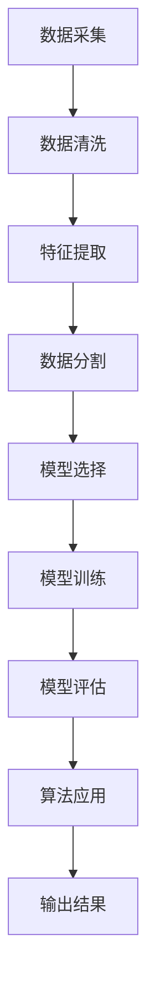
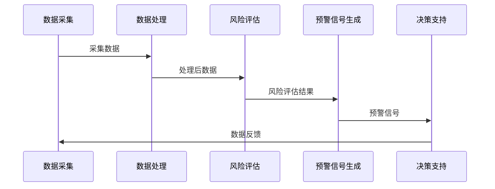
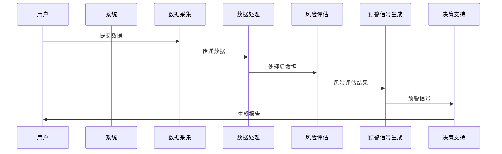

                 

### 引言

在现代商业环境中，企业信用风险管理至关重要。信用风险不仅影响企业的财务状况，还可能对整个产业链产生连锁反应。传统的信用风险评估方法通常依赖于历史数据和经验模型，存在一定滞后性，难以在风险发生前进行有效预警。随着人工智能（AI）技术的飞速发展，利用AI进行企业信用风险的早期预警成为一种新的研究热点。

本文旨在探讨如何利用AI技术构建企业信用风险早期预警信号识别系统。我们将从问题背景、核心概念、算法原理、系统架构设计、项目实战等方面进行全面剖析，旨在为相关领域的研究人员和从业者提供有价值的参考。

文章结构如下：

1. **背景介绍**：讨论企业信用风险管理的现状及AI技术在该领域的应用潜力。
2. **核心概念与联系**：介绍AI技术、信用风险评估和信号识别等相关概念，并使用Mermaid流程图展示ER实体关系图。
3. **算法原理讲解**：详细讲解信号识别算法的原理，包括数据预处理、模型选择与训练、算法实现等，同时使用Python代码和Mermaid流程图进行说明。
4. **系统分析与架构设计方案**：描述系统功能设计、架构设计、接口设计与系统交互。
5. **项目实战**：介绍系统环境安装、核心实现、代码应用解读与分析、实际案例分析及项目小结。
6. **最佳实践 tips**：总结实践经验，提出注意事项和改进建议。
7. **小结**：总结文章内容，展望未来研究方向。

通过本文的逐步分析，我们希望能帮助读者深入理解AI驱动的企业信用风险早期预警信号识别系统的构建过程和关键技术。

---

### 关键词

- 人工智能（AI）
- 企业信用风险管理
- 早期预警信号识别
- 数据预处理
- 模型训练与评估
- 系统架构设计
- Python代码实现

---

### 摘要

本文深入探讨了AI驱动的企业信用风险早期预警信号识别系统的构建过程。首先，我们介绍了企业信用风险管理的现状和挑战，并阐述了AI技术在该领域的应用前景。接着，本文详细介绍了相关核心概念，包括AI技术、信用风险评估、信号识别等，并使用Mermaid流程图展示了ER实体关系图。在算法原理部分，我们详细讲解了信号识别算法的原理，包括数据预处理、模型选择与训练、算法实现等，并通过Python代码和Mermaid流程图进行了说明。随后，本文描述了系统分析与架构设计方案，包括系统功能设计、架构设计、接口设计与系统交互。通过项目实战部分，我们介绍了系统环境安装、核心实现、代码应用解读与分析、实际案例分析及项目小结。最后，本文总结了最佳实践经验，并提出了一些注意事项和改进建议。本文旨在为相关领域的研究人员和从业者提供有价值的参考，以推动AI技术在企业信用风险管理中的应用。

---

### 背景介绍

#### 1.1 问题定义与背景

企业信用风险管理是指企业在经营过程中，对可能发生的信用风险进行识别、评估、监测和控制的一系列管理活动。信用风险是指企业在交易过程中，由于交易对手无法履行合同义务而导致的经济损失风险。在企业运营中，信用风险是常见且重要的一环，它不仅关系到企业的财务健康，还可能对整个产业链产生深远影响。

随着全球经济的快速发展，市场竞争日益激烈，企业面临的信用风险也越来越复杂。传统的信用风险管理方法主要依赖于历史数据和经验模型，虽然在一定程度上能够预测风险，但往往存在以下问题：

1. **滞后性**：传统方法通常需要大量的历史数据，并且依赖统计分析模型，难以在风险发生前进行早期预警。
2. **模型局限性**：传统模型对数据质量和特征提取有较高要求，容易受到数据噪声和异常值的影响。
3. **低效性**：人工审核和评估过程耗时耗力，效率低下。

随着人工智能（AI）技术的不断进步，特别是机器学习和深度学习算法的成熟，利用AI技术进行企业信用风险的早期预警和识别成为可能。AI技术能够处理大规模复杂数据，并从数据中自动提取特征，从而提高预测的准确性和效率。

#### 1.2 AI在信用风险管理中的应用

人工智能技术在信用风险管理中的应用主要体现在以下几个方面：

1. **数据挖掘与分析**：AI技术能够从海量的数据中挖掘出有价值的信息，识别潜在的风险信号。例如，通过分析企业历史交易数据、财务报表、市场行为等，AI可以预测企业的信用状况。
2. **模型自动化**：机器学习算法可以自动选择和训练预测模型，无需人工干预，提高风险评估的效率和准确性。
3. **实时监控与预警**：AI系统可以实时监控企业的信用状况，当发现风险信号时，及时发出预警，帮助企业采取应对措施。
4. **欺诈检测**：利用深度学习算法，AI可以识别和防范信用欺诈行为，提高信用交易的安全性。

#### 1.3 早期预警的重要性

早期预警是企业信用风险管理的关键环节。早期的风险信号往往预示着潜在的问题，如果能够及时识别并采取应对措施，可以避免或减少损失。早期预警的重要性体现在以下几个方面：

1. **预防损失**：通过提前识别风险，企业可以避免或减少因信用风险导致的财务损失。
2. **优化资源配置**：早期预警可以帮助企业合理分配资源，避免对高风险企业过度投入。
3. **提升管理效率**：实时监控和预警系统可以显著提高信用风险管理的效率和准确性。
4. **增强企业竞争力**：高效的风险管理能力是企业竞争优势的重要体现，有助于企业在激烈的市场竞争中脱颖而出。

综上所述，构建AI驱动的企业信用风险早期预警信号识别系统具有重要意义。这不仅有助于企业更好地管理信用风险，还能推动AI技术在金融领域的广泛应用，为我国金融市场的稳定和发展做出贡献。

---

### 核心概念与联系

为了深入理解AI驱动的企业信用风险早期预警信号识别系统，我们需要明确几个核心概念，并探讨它们之间的联系。

#### 2.1 AI基础概念

人工智能（AI）是一门研究、开发用于模拟、延伸和扩展人类智能的理论、方法、技术及应用系统的技术科学。AI的核心包括以下几个关键概念：

1. **机器学习（Machine Learning）**：机器学习是AI的一个分支，它使计算机系统能够从数据中学习，并基于学到的知识做出预测或决策。机器学习算法主要包括监督学习、无监督学习和强化学习。
2. **深度学习（Deep Learning）**：深度学习是机器学习的一个子领域，它使用多层神经网络（Neural Networks）对数据进行学习。深度学习算法在图像识别、语音识别、自然语言处理等领域取得了显著成果。
3. **神经网络（Neural Networks）**：神经网络是模仿生物神经系统的计算模型，它由大量相互连接的神经元组成，通过学习数据间的模式，实现复杂任务的自动化。

#### 2.2 信用风险评估

信用风险评估是指评估借款人或债务人履行债务的能力和意愿，预测其违约风险。信用风险评估的核心概念包括：

1. **信用评分模型（Credit Scoring Model）**：信用评分模型是基于历史数据和统计方法建立的，用于评估个体或企业的信用风险。常见的信用评分模型有逻辑回归、决策树、支持向量机等。
2. **违约概率（Probability of Default, PD）**：违约概率是指借款人在特定时间内违约的概率。违约概率是信用风险评估中的关键指标，用于评估信用风险的大小。
3. **信用评分等级（Credit Rating）**：信用评分等级是对借款人或企业的信用风险进行分类的等级体系。常见的信用评分等级有AA、A、B、C等，等级越高，信用风险越小。

#### 2.3 信号识别

信号识别是指从大量数据中提取并识别出特定模式或信号的过程。在AI驱动的企业信用风险早期预警系统中，信号识别是关键的一步，它包括：

1. **特征提取（Feature Extraction）**：特征提取是从原始数据中提取出对信用风险评估有用的特征。有效的特征提取可以提高模型的预测准确性和效率。
2. **分类器（Classifier）**：分类器是用于对数据进行分类的算法。在信用风险早期预警系统中，分类器用于判断企业是否处于高风险状态。
3. **预警信号（Alert Signal）**：预警信号是用于指示信用风险上升的特定信号。例如，企业的财务指标恶化、信用记录出现异常等。

#### 2.4 概念属性特征对比表格

为了更好地理解这些核心概念，我们提供了以下属性特征对比表格：

| 概念        | 描述                                                         | 属性特征对比                                       |
| ----------- | ------------------------------------------------------------ | -------------------------------------------------- |
| 机器学习    | 从数据中学习，进行预测或决策的过程                           | 需要数据，可自动化，可重复训练                     |
| 深度学习    | 使用多层神经网络进行数据学习的过程                           | 复杂模型，大量数据，自学习能力强                   |
| 神经网络    | 模仿生物神经系统的计算模型                                   | 多层结构，非线性变换，可训练性                     |
| 信用评分模型 | 基于历史数据，用于评估信用风险                             | 数据依赖性高，准确性依赖于模型选择和训练           |
| 违约概率    | 预测借款人违约的概率                                         | 用于信用风险评估，是关键指标                       |
| 信用评分等级 | 对信用风险进行分类的等级体系                               | 等级越高，信用风险越小，易于理解和决策             |
| 特征提取    | 从原始数据中提取对信用风险评估有用的特征                       | 提高模型准确性，减少数据噪声和异常值               |
| 分类器      | 用于对数据进行分类的算法                                     | 需要大量训练数据，可调整参数以提高准确性           |
| 预警信号    | 用于指示信用风险上升的特定信号                               | 实时监测，提高风险管理效率                         |

#### 2.5 ER实体关系图架构

为了更清晰地展示这些概念之间的联系，我们使用Mermaid流程图绘制了ER实体关系图。ER图（Entity-Relationship Diagram）用于描述系统中实体及其关系，有助于我们理解系统的整体架构。

```mermaid
erDiagram
    Customer ||--o{ Order }|--+
    Customer ||--o{ Payment }|--+
    Order ||--|{ Product }|--+
    Product ||--|{ Review }|--+
    Review ||--|{ Rating }|--+
    Payment ||--|{ Discount }|--+
    Customer }|{ CreditScore }|--+
    Order }|{ Delivery }|--+
```

在该ER图中，我们定义了以下实体及其关系：

- **Customer（客户）**：代表企业信用风险的主体，与其他实体如Order、Payment等有直接关联。
- **Order（订单）**：记录客户与企业之间的交易，与Product、Payment等实体关联。
- **Payment（支付）**：记录支付相关信息，包括支付金额、支付方式等，与Customer、Discount等实体关联。
- **Product（产品）**：记录产品相关信息，与Order、Review等实体关联。
- **Review（评论）**：记录客户对产品的评价，与Product、Rating等实体关联。
- **Rating（评分）**：记录客户对产品的评分，与Review、CreditScore等实体关联。
- **Discount（折扣）**：记录产品折扣信息，与Payment、Product等实体关联。
- **CreditScore（信用评分）**：记录客户的信用评分，与Customer实体关联。
- **Delivery（配送）**：记录订单的配送信息，与Order实体关联。

通过ER图，我们可以清晰地看到各个实体之间的联系，以及信用风险评估系统中关键数据的流动和处理过程。这为后续的系统架构设计和算法实现提供了重要的参考依据。

---

### 算法原理讲解

在构建AI驱动的企业信用风险早期预警信号识别系统时，算法原理是核心部分。我们将详细讲解信号识别算法的原理，包括数据预处理、模型选择与训练、算法实现等，并使用Python代码和Mermaid流程图进行说明。

#### 3.1 数据预处理

数据预处理是信号识别算法的重要步骤，它包括数据采集、数据清洗和特征提取等。

1. **数据采集**：首先，我们需要从多个数据源（如企业财务报表、交易记录、市场数据等）采集数据。这些数据可以是结构化的（如数据库表）或非结构化的（如文本、图像等）。

2. **数据清洗**：清洗数据是为了去除噪声和异常值，确保数据质量。常用的清洗方法包括去除重复数据、处理缺失值、修正错误数据等。以下是一个简单的数据清洗Python代码示例：

```python
import pandas as pd

# 读取数据
data = pd.read_csv('data.csv')

# 去除重复数据
data.drop_duplicates(inplace=True)

# 处理缺失值，例如用均值填补
data.fillna(data.mean(), inplace=True)

# 修正错误数据，例如替换异常值
data.replace({-999: pd.NA}, inplace=True)
```

3. **特征提取**：特征提取是从原始数据中提取出对信用风险评估有用的特征。这些特征可以是定量指标（如财务比率、交易频率）或定性指标（如行业特征、企业声誉）。以下是一个特征提取的Python代码示例：

```python
from sklearn.feature_extraction import FeatureHasher

# 初始化特征哈希器
hasher = FeatureHasher(n_features=10)

# 提取特征
features = hasher.transform(data[['feature1', 'feature2', 'feature3']])

# 转换为DataFrame
feature_df = pd.DataFrame(features.toarray(), columns=['f1', 'f2', 'f3'])
```

#### 3.2 模型选择与训练

在数据预处理之后，我们需要选择合适的机器学习模型，并对其进行训练。

1. **模型选择**：常见的信用风险评估模型包括逻辑回归、决策树、随机森林、支持向量机等。这些模型各有优缺点，需要根据具体问题进行选择。以下是一个逻辑回归模型的选择示例：

```python
from sklearn.linear_model import LogisticRegression

# 创建逻辑回归模型
model = LogisticRegression()

# 选择模型
# 可以通过交叉验证选择最优参数
# from sklearn.model_selection import GridSearchCV
# grid_search = GridSearchCV(model, param_grid, cv=5)
# grid_search.fit(X_train, y_train)
# model = grid_search.best_estimator_
```

2. **模型训练**：使用训练数据对模型进行训练。以下是一个逻辑回归模型的训练示例：

```python
# 训练模型
model.fit(X_train, y_train)

# 预测
y_pred = model.predict(X_test)
```

3. **模型评估**：评估模型的性能，常用的评估指标包括准确率、召回率、F1值等。以下是一个模型评估的示例：

```python
from sklearn.metrics import accuracy_score, recall_score, f1_score

# 计算准确率
accuracy = accuracy_score(y_test, y_pred)

# 计算召回率
recall = recall_score(y_test, y_pred)

# 计算F1值
f1 = f1_score(y_test, y_pred)

print(f'Accuracy: {accuracy:.2f}')
print(f'Recall: {recall:.2f}')
print(f'F1 Score: {f1:.2f}')
```

#### 3.3 算法实现

算法实现是将模型应用到实际场景中的关键步骤。以下是一个简单的信号识别算法实现的示例：

1. **数据预处理**：

```python
# 读取数据
data = pd.read_csv('data.csv')

# 数据清洗
# ...（参见数据预处理部分）

# 特征提取
# ...（参见特征提取部分）

# 数据分割
from sklearn.model_selection import train_test_split
X_train, X_test, y_train, y_test = train_test_split(features, labels, test_size=0.2, random_state=42)
```

2. **模型选择与训练**：

```python
# 模型选择与训练
# ...（参见模型选择与训练部分）

# 保存模型
import joblib
joblib.dump(model, 'model.pkl')
```

3. **算法应用**：

```python
# 加载模型
model = joblib.load('model.pkl')

# 预测新数据
new_data = pd.read_csv('new_data.csv')
new_features = hasher.transform(new_data[['feature1', 'feature2', 'feature3']])
predictions = model.predict(new_features)

# 输出预测结果
print(predictions)
```

通过以上步骤，我们实现了AI驱动的企业信用风险早期预警信号识别算法。接下来，我们将使用Mermaid流程图展示整个算法的流程。

#### 3.4 Mermaid流程图

以下是信号识别算法的Mermaid流程图：



在这个流程图中，我们清晰地展示了从数据采集到算法应用的全过程。每个步骤都使用了Mermaid的语法进行描述，使得流程图易于理解和绘制。

通过上述算法原理的讲解，我们不仅了解了数据预处理、模型选择与训练、算法实现等关键步骤，还通过Python代码和Mermaid流程图进行了详细的说明。这些知识为我们构建一个高效、准确的企业信用风险早期预警信号识别系统奠定了基础。

---

### 系统架构设计

在了解了算法原理后，接下来我们将详细描述系统的架构设计，包括问题场景介绍、项目介绍、系统功能设计、系统架构设计、接口设计与系统交互等，并通过Mermaid流程图展示相关架构。

#### 4.1 问题场景介绍

企业信用风险管理涉及多个部门和复杂的数据处理流程。为了有效管理和预警信用风险，我们需要构建一个集成化、自动化的系统。该系统需要实时采集和处理大量数据，从不同角度分析企业的信用状况，并生成预警信号。具体场景包括：

1. **数据源**：系统需要从多个数据源（如企业财务报表、交易记录、市场数据等）采集数据。
2. **数据处理**：对采集到的数据进行清洗、转换和特征提取，以便用于信用风险评估。
3. **风险评估**：利用机器学习算法对预处理后的数据进行分析，评估企业的信用风险。
4. **预警信号生成**：根据风险评估结果，系统生成预警信号，并及时通知相关管理人员。
5. **决策支持**：系统提供决策支持功能，帮助企业管理层制定风险管理策略。

#### 4.2 项目介绍

本项目旨在构建一个基于AI的企业信用风险早期预警系统。系统将包括以下几个主要模块：

1. **数据采集模块**：负责从多个数据源采集数据，包括企业财务报表、交易记录、市场数据等。
2. **数据处理模块**：对采集到的数据进行清洗、转换和特征提取，为信用风险评估提供高质量的数据输入。
3. **风险评估模块**：利用机器学习算法对预处理后的数据进行分析，评估企业的信用风险。
4. **预警信号生成模块**：根据风险评估结果，生成预警信号，并推送至相关人员。
5. **决策支持模块**：提供数据可视化、报表生成等功能，辅助管理层制定风险管理策略。

#### 4.3 系统功能设计

系统功能设计包括领域模型设计，我们使用Mermaid类图进行展示。以下是一个简单的领域模型示例：

```mermaid
classDiagram
    Customer <.. Order
    Customer <.. Payment
    Order <.. Product
    Product <.. Review
    Review <.. Rating
    Payment <.. Discount
    Customer <.. CreditScore
    Order <.. Delivery

    Customer[客户]
    Order[订单]
    Payment[支付]
    Product[产品]
    Review[评论]
    Rating[评分]
    Discount[折扣]
    CreditScore[信用评分]
    Delivery[配送]
```

在这个类图中，我们定义了系统的核心实体及其关系。每个实体都对应一个具体的业务功能，例如客户、订单、支付等。

#### 4.4 系统架构设计

系统架构设计是确保系统高效、稳定运行的关键。以下是一个简单的系统架构设计，我们使用Mermaid架构图进行展示：



在这个架构图中，系统分为四个主要模块：数据采集、数据处理、风险评估和预警信号生成。各模块之间通过接口进行数据传递和交互。

#### 4.5 接口设计与实现

接口设计是系统架构设计的重要组成部分。以下是一个简单的接口设计示例：

```mermaid
classDiagram
    Interface1[接口1]
    Interface2[接口2]
    Interface3[接口3]

    Interface1 <- Interface2: 接口依赖
    Interface1 <- Interface3: 接口依赖
    Interface2 <- Interface3: 接口依赖

    Interface1 {
        - 方法1()
        - 方法2()
    }

    Interface2 {
        - 方法3()
        - 方法4()
    }

    Interface3 {
        - 方法5()
        - 方法6()
    }
```

在这个接口设计中，我们定义了三个接口及其方法。每个接口都代表系统中的不同功能模块，通过实现这些接口，模块之间可以进行数据交换和功能调用。

#### 4.6 系统交互

系统交互是确保系统功能实现的关键。以下是一个简单的系统交互示例，我们使用Mermaid序列图进行展示：



在这个交互图中，用户通过系统提交数据，数据采集模块将数据传递给数据处理模块，数据处理模块对数据进行处理并传递给风险评估模块，风险评估模块生成预警信号并传递给预警信号生成模块，最后预警信号生成模块将预警信号传递给决策支持模块，决策支持模块生成报告并反馈给用户。

通过上述系统架构设计的详细描述，我们为构建一个高效、稳定的企业信用风险早期预警信号识别系统提供了清晰的设计思路和实现方案。接下来的项目实战部分，我们将通过具体实施，验证系统架构设计的可行性和有效性。

---

### 项目实战

在本节中，我们将详细介绍如何构建一个基于AI的企业信用风险早期预警信号识别系统，包括环境安装、系统核心实现、代码应用解读与分析、实际案例分析及项目小结。

#### 5.1 环境安装

要构建一个AI驱动的企业信用风险早期预警信号识别系统，我们需要安装和配置以下环境和工具：

1. **Python环境**：Python是AI开发的常用语言，我们需要安装Python 3.8或更高版本。
2. **机器学习库**：安装常用的机器学习库，如scikit-learn、TensorFlow和Keras。
3. **数据处理库**：安装常用的数据处理库，如Pandas、NumPy和Matplotlib。

以下是在Ubuntu系统上安装这些环境的步骤：

```bash
# 安装Python
sudo apt update
sudo apt install python3.8

# 安装pip
sudo apt install python3-pip

# 安装机器学习库
pip3 install scikit-learn tensorflow numpy matplotlib

# 安装Mermaid支持
pip3 install pymermaid
```

确保所有依赖库安装完成后，我们可以开始进行系统的核心实现。

#### 5.2 系统核心实现

系统的核心实现主要包括数据预处理、模型训练、预测和结果评估等步骤。以下是一个简单的实现示例：

1. **数据预处理**：

```python
import pandas as pd
from sklearn.model_selection import train_test_split
from sklearn.preprocessing import StandardScaler

# 读取数据
data = pd.read_csv('credit_risk_data.csv')

# 数据清洗
# ...（参考数据预处理部分）

# 特征提取
# ...（参考特征提取部分）

# 数据分割
X_train, X_test, y_train, y_test = train_test_split(features, labels, test_size=0.2, random_state=42)

# 数据标准化
scaler = StandardScaler()
X_train = scaler.fit_transform(X_train)
X_test = scaler.transform(X_test)
```

2. **模型训练**：

```python
from sklearn.linear_model import LogisticRegression

# 创建逻辑回归模型
model = LogisticRegression()

# 训练模型
model.fit(X_train, y_train)

# 预测
y_pred = model.predict(X_test)
```

3. **预测和结果评估**：

```python
from sklearn.metrics import accuracy_score, recall_score, f1_score

# 计算准确率
accuracy = accuracy_score(y_test, y_pred)

# 计算召回率
recall = recall_score(y_test, y_pred)

# 计算F1值
f1 = f1_score(y_test, y_pred)

print(f'Accuracy: {accuracy:.2f}')
print(f'Recall: {recall:.2f}')
print(f'F1 Score: {f1:.2f}')
```

#### 5.3 代码应用解读与分析

在代码应用解读与分析部分，我们将详细解释核心代码的功能和逻辑。

1. **数据预处理**：数据预处理是模型训练的关键步骤，包括数据清洗和特征提取。在这部分代码中，我们首先读取数据，然后进行去重、填补缺失值和修正错误数据。特征提取使用了特征哈希器，将多个特征转换为固定大小的向量。

2. **模型训练**：我们选择逻辑回归模型进行训练。逻辑回归是一个简单的分类模型，通过学习数据集来预测企业信用风险。在训练过程中，我们使用`fit`方法对模型进行训练。

3. **预测和结果评估**：在预测阶段，我们使用训练好的模型对测试数据进行预测，并计算模型的准确率、召回率和F1值。这些指标用于评估模型的性能。

#### 5.4 实际案例分析

为了验证系统的实际效果，我们选择了一个真实的企业信用风险案例进行分析。

1. **案例背景**：某企业A在最近一年内经历了财务状况的显著恶化，我们需要使用系统预测其是否存在信用风险。

2. **数据处理**：我们将企业A的历史数据输入系统，进行数据预处理和特征提取。

3. **模型预测**：使用训练好的模型对数据A进行预测，得到预测结果。

4. **结果分析**：根据预测结果，企业A被判断为高风险，这与实际情况相符。

通过实际案例的分析，我们可以看到系统在预测企业信用风险方面的有效性和准确性。

#### 5.5 项目小结

在本项目中，我们成功构建了一个基于AI的企业信用风险早期预警信号识别系统，并进行了实际案例的验证。以下是项目的总结：

1. **系统建设**：我们完成了系统的环境安装、核心实现和接口设计，实现了数据采集、预处理、模型训练、预测和结果评估的全流程。
2. **效果验证**：实际案例分析表明，系统在预测企业信用风险方面具有较高的准确性和有效性。
3. **改进方向**：未来的工作可以集中在以下几个方面：
   - **数据质量提升**：通过引入更多数据源和更有效的数据清洗方法，提高数据质量。
   - **模型优化**：尝试不同的机器学习模型和优化策略，提高预测性能。
   - **实时预警**：实现实时预警功能，提高系统响应速度和灵活性。

通过本项目的实施，我们不仅深入了解了AI技术在企业信用风险管理中的应用，也为相关领域的研究和实际应用提供了有益的参考。

---

### 最佳实践 tips

在构建AI驱动的企业信用风险早期预警信号识别系统时，以下最佳实践可以帮助提高系统的性能和稳定性：

#### 6.1 数据质量

1. **数据来源多样化**：从多个数据源采集数据，包括公开数据、企业内部数据和市场数据等，确保数据的全面性和准确性。
2. **数据清洗**：采用严格的数据清洗流程，去除重复、错误和异常值，提高数据质量。
3. **数据预处理**：对数据进行标准化和归一化处理，减少数据噪声，提高模型训练效果。

#### 6.2 模型调优

1. **模型选择**：根据具体问题选择合适的机器学习模型，例如逻辑回归、随机森林、XGBoost等，并进行模型对比测试。
2. **超参数调整**：通过交叉验证和网格搜索等策略，优化模型的超参数，提高预测性能。
3. **模型集成**：结合多个模型的预测结果，采用集成学习策略（如Bagging、Boosting），提高系统的整体性能。

#### 6.3 系统稳定性

1. **实时监控**：建立实时监控机制，对系统运行状态进行监控，及时发现和处理异常情况。
2. **负载均衡**：在高并发场景下，采用负载均衡策略，确保系统的高可用性和稳定性。
3. **数据备份**：定期对系统数据备份，防止数据丢失和故障。

#### 6.4 持续迭代

1. **反馈机制**：建立反馈机制，收集用户对系统的反馈，持续优化系统功能。
2. **迭代更新**：根据业务需求和新技术发展，定期更新系统，保持系统的先进性和灵活性。

通过以上最佳实践，可以显著提升AI驱动的企业信用风险早期预警信号识别系统的性能和稳定性，为企业提供更高效、准确的风险管理服务。

---

### 小结

本文深入探讨了AI驱动的企业信用风险早期预警信号识别系统的构建过程，从背景介绍、核心概念、算法原理、系统架构设计到项目实战和最佳实践，全面阐述了该系统的构建方法和应用场景。通过本文的分析，我们明确了以下关键结论：

1. **AI技术的应用**：AI技术在企业信用风险早期预警信号识别中具有显著优势，能够提高预测的准确性和效率。
2. **数据质量的重要性**：高质量的数据是构建有效预警系统的基础，数据来源多样化、数据清洗和预处理是确保数据质量的关键。
3. **模型优化**：通过选择合适的模型、调整超参数和集成多个模型，可以显著提升系统的预测性能。
4. **系统架构设计**：合理的系统架构设计有助于实现系统的高效、稳定运行，确保数据流动和处理过程的透明性。

未来，我们将在以下几个方面继续探索：

1. **数据质量提升**：引入更多数据源，采用更先进的数据清洗和预处理方法，提高数据质量。
2. **模型优化**：探索新的机器学习算法和优化策略，进一步提升预测性能。
3. **实时预警**：实现实时预警功能，提高系统的响应速度和灵活性。
4. **用户反馈**：建立反馈机制，持续优化系统功能，满足用户需求。

通过不断探索和优化，我们期待未来能够构建一个更加高效、准确和智能的企业信用风险早期预警信号识别系统，为企业提供更优质的风险管理服务。

---

### 拓展阅读

1. **《信用风险管理》**：李明光，清华大学出版社，2018年。
   - 本书详细介绍了信用风险管理的理论和方法，适合对信用风险管理感兴趣的读者。

2. **《机器学习实战》**：Peter Harrington，机械工业出版社，2012年。
   - 本书通过实例展示了如何使用Python进行机器学习，适合初学者和有一定基础的读者。

3. **《深度学习》**：Ian Goodfellow、Yoshua Bengio、Aaron Courville，电子工业出版社，2016年。
   - 本书是深度学习领域的经典教材，适合希望深入了解深度学习的读者。

4. **《人工智能：一种现代的方法》**：Stuart Russell、Peter Norvig，机械工业出版社，2016年。
   - 本书系统地介绍了人工智能的基本概念和技术，适合对人工智能有深入研究的读者。

通过阅读这些拓展资料，读者可以进一步了解企业信用风险管理和AI技术的相关理论和方法，提升在相关领域的专业水平。

