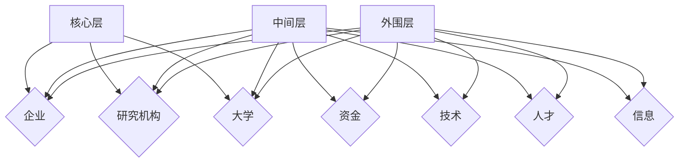

                 

### 文章标题

# 《AI驱动的企业创新生态系统构建：内外部资源智能匹配与协同》

> 关键词：AI、企业创新、生态系统、资源匹配、协同优化

> 摘要：本文深入探讨了如何利用人工智能（AI）技术构建企业创新生态系统，实现内外部资源的智能匹配与协同。文章首先介绍了AI技术的基本概念和发展历程，随后分析了企业创新的重要性及其面临的挑战。在此基础上，本文详细阐述了创新生态系统的概念、结构和价值，并探讨了AI在资源匹配和协同优化中的应用。通过多个实战案例，本文提供了实施策略与建议，以帮助企业在新时代背景下实现持续创新和竞争力提升。

### 引言与背景

#### AI技术概述

人工智能（Artificial Intelligence，简称AI）是计算机科学的一个分支，旨在研究如何构建智能代理（intelligent agents）来模拟、扩展甚至超越人类智能。AI的发展历程可以追溯到20世纪50年代，从最初的符号主义（Symbolic AI）到基于规则的系统，再到连接主义（Connectionist AI）、贝叶斯网络、进化计算和深度学习等，每一个阶段都标志着AI技术的一次重大进步。

核心技术的演进不仅提升了AI的性能，也扩大了其应用范围。当前，AI的核心技术主要包括：

- **深度学习（Deep Learning）**：通过多层神经网络进行特征提取和学习，使机器能够从大量数据中自动提取模式和知识。
- **自然语言处理（Natural Language Processing，NLP）**：使计算机能够理解和生成自然语言，广泛应用于智能客服、机器翻译等领域。
- **计算机视觉（Computer Vision）**：使计算机能够从图像和视频中提取信息，实现图像识别、物体检测等功能。
- **强化学习（Reinforcement Learning）**：通过试错和反馈来学习最优策略，广泛应用于游戏、自动驾驶等领域。

#### 企业创新的重要性

企业创新是推动企业持续发展和竞争力提升的关键动力。创新不仅包括产品创新、服务创新，还涉及商业模式、组织结构和管理方法的创新。在竞争激烈的市场环境中，企业必须不断创新以应对市场变化、客户需求和技术进步。

创新的重要性体现在以下几个方面：

- **提升竞争力**：创新能够帮助企业开发出更符合市场需求的产品和服务，提高市场份额和盈利能力。
- **增加市场份额**：创新能够帮助企业占领市场空白，扩大业务范围，提高品牌影响力。
- **促进可持续发展**：创新能够帮助企业实现资源的高效利用和环境的可持续发展，提升企业的社会责任。

然而，企业创新也面临诸多挑战，如创新资源不足、创新风险、市场竞争加剧等。如何在有限的资源和竞争压力下实现创新，是每个企业都需要解决的问题。

#### 创新生态系统概念

创新生态系统是指围绕创新活动形成的一组相互关联的个体和组织，它们共同协作、共享资源和知识，以实现创新目标。创新生态系统的概念起源于生态学，后被广泛应用于企业管理领域。

创新生态系统通常由以下几个部分组成：

- **创新主体**：包括企业、科研机构、大学、政府等，它们是创新活动的核心力量。
- **创新资源**：包括资金、技术、人才、信息等，是创新生态系统的基础。
- **创新环境**：包括政策、法规、文化、市场等，对创新活动的开展具有重要影响。
- **创新机制**：包括组织结构、激励机制、合作机制等，是创新生态系统有效运行的保障。

创新生态系统不仅能够提高创新效率，还能够促进跨界合作，增强企业的竞争力。构建一个高效的创新生态系统，是企业在新时代背景下实现持续创新的关键。

### AI与企业创新

#### AI在商业中的应用案例

人工智能技术在商业领域已经取得了广泛应用，并为企业带来了显著的创新成果。以下是几个典型的AI应用案例：

1. **智能客服系统**：通过自然语言处理技术，智能客服系统能够自动解答客户的疑问，提高客户满意度，降低人工成本。例如，某大型电商平台利用AI技术构建了智能客服系统，其客服响应时间缩短了50%，客户满意度提高了20%。

2. **智能供应链管理**：通过大数据分析和机器学习技术，智能供应链管理系统能够预测市场需求、优化库存管理，提高供应链效率。例如，某零售企业利用AI技术优化了供应链管理，其库存周转率提高了30%，物流成本降低了20%。

3. **智能营销策略**：通过大数据分析和机器学习技术，智能营销系统能够实现精准营销，提高营销效果。例如，某在线教育平台利用AI技术进行用户行为分析，实现了个性化推荐，其用户转化率提高了40%。

#### 企业创新的需求与挑战

在当前快速变化的市场环境中，企业面临着巨大的创新需求。这些需求主要包括：

1. **市场需求变化**：随着消费者需求的变化和市场竞争的加剧，企业需要不断创新以适应市场变化。

2. **技术进步**：新技术的不断涌现，如云计算、物联网、区块链等，为企业提供了更多的创新机会。

3. **企业可持续发展**：面对资源有限和环境压力，企业需要通过创新实现可持续发展。

然而，企业创新也面临诸多挑战。这些挑战主要包括：

1. **创新资源不足**：企业往往在资金、技术、人才等方面存在短缺，限制了创新活动的开展。

2. **创新风险**：创新活动具有不确定性，可能导致资源浪费和业务失败。

3. **市场竞争**：在激烈的市场竞争中，企业需要在创新的同时保持竞争力。

面对这些需求和挑战，企业需要充分利用AI技术，构建高效的创新生态系统，实现内外部资源的智能匹配与协同，以应对市场变化和技术进步。

### 创新生态系统概述

#### 创新生态系统的概念与结构

创新生态系统是指由多个参与者（包括企业、研究机构、政府等）组成的复杂网络，这些参与者通过合作、共享资源和知识，共同推动创新活动的开展。创新生态系统不仅包括创新主体，还包括创新资源、创新环境和创新机制。

创新生态系统的结构可以分为三个层次：

1. **核心层**：包括创新主体，如企业、研究机构、大学等。这些主体是创新生态系统的核心力量，负责提出创新需求、开展创新活动。

2. **中间层**：包括创新资源，如资金、技术、人才、信息等。这些资源是创新生态系统的基础，为创新活动的开展提供支持。

3. **外围层**：包括创新环境，如政策、法规、文化、市场等。这些环境因素对创新活动的开展具有重要影响。

创新生态系统的结构如图1所示：

#### 创新生态系统的价值

创新生态系统具有以下几个方面的价值：

1. **提高创新效率**：通过协同合作，创新生态系统可以整合各方资源，缩短创新周期，提高创新成功率。

2. **促进跨界合作**：创新生态系统中的不同参与者可以通过合作，实现知识的共享和资源的互补，推动跨界创新。

3. **增强企业竞争力**：通过构建创新生态系统，企业可以更好地把握市场趋势，快速响应客户需求，提升市场竞争力。

4. **促进可持续发展**：创新生态系统可以推动绿色创新和可持续发展，降低企业对环境的影响，提升企业的社会责任。

5. **培育创新文化**：创新生态系统可以营造良好的创新氛围，激发创新者的创造力，培养创新人才。

总之，创新生态系统是企业实现持续创新和竞争力提升的关键，是企业适应新时代发展的重要战略选择。

### AI驱动的内外部资源匹配

#### 内部资源管理

内部资源管理是企业创新生态系统的重要组成部分，它涉及到对企业内部各种资源的管理和利用，包括资金、技术、人才和信息等。

1. **资金管理**：企业需要合理配置资金，确保创新项目的资金需求。资金管理的关键要素包括预算编制、资金分配和资金监控等。企业可以通过建立资金管理信息系统，实现资金的透明化和高效管理。

2. **技术管理**：企业需要保持技术竞争力，不断引进新技术和改进现有技术。技术管理的关键要素包括技术研发、技术评估和技术转移等。企业可以通过建立技术储备库，实现技术资源的共享和利用。

3. **人才管理**：企业需要培养和吸引创新人才，确保创新团队的能力和活力。人才管理的关键要素包括人才招聘、人才培养和人才激励等。企业可以通过建立人才发展体系，提升人才的专业能力和创新意识。

4. **信息管理**：企业需要建立高效的信息管理系统，确保信息的及时获取、传递和处理。信息管理的关键要素包括信息收集、信息存储、信息分析和信息安全等。企业可以通过建立企业信息平台，实现信息的集成和共享。

#### 外部资源管理

外部资源管理是指企业如何获取和利用外部资源，包括合作伙伴、供应商、客户和政府等。

1. **合作伙伴管理**：企业需要与合作伙伴建立长期稳定的合作关系，实现资源的互补和协同创新。合作伙伴管理的关键要素包括合作伙伴选择、合作伙伴评估和合作伙伴关系管理等。企业可以通过建立合作伙伴管理系统，实现合作伙伴的协同管理和资源共享。

2. **供应商管理**：企业需要选择合适的供应商，确保供应链的稳定性和效率。供应商管理的关键要素包括供应商选择、供应商评估和供应商关系管理等。企业可以通过建立供应商管理系统，实现供应商的协同管理和资源优化。

3. **客户管理**：企业需要了解客户需求，提供个性化的产品和服务，提高客户满意度。客户管理的关键要素包括客户需求分析、客户关系维护和客户价值管理等。企业可以通过建立客户管理系统，实现客户需求的实时分析和个性化服务。

4. **政府管理**：企业需要关注政府政策，利用政府提供的资源和优惠政策，支持企业创新。政府管理的关键要素包括政策解读、政策申请和政策反馈等。企业可以通过建立政府管理系统，实现政策的及时获取和利用。

#### 资源匹配算法与应用

资源匹配算法是指通过计算模型和方法，实现企业内外部资源的优化配置和协同管理。常见的资源匹配算法包括：

1. **基于协同过滤的算法**：通过分析用户的历史行为和偏好，为用户推荐相关的资源。例如，基于用户相似度的推荐算法和基于物品相似度的推荐算法。

2. **基于优化理论的算法**：通过建立优化模型，求解资源匹配的最优解。常见的优化算法包括线性规划、整数规划和神经网络等。

3. **基于机器学习的算法**：通过训练数据集，构建资源匹配的预测模型。例如，支持向量机（SVM）、决策树和神经网络等。

资源匹配算法在实际应用中，可以帮助企业实现以下目标：

1. **资源优化配置**：通过算法分析，企业可以找到最适合的资源组合，提高资源利用效率。

2. **降低运营成本**：通过资源匹配，企业可以减少不必要的资源浪费，降低运营成本。

3. **提升创新效率**：通过资源匹配，企业可以缩短创新周期，提高创新成功率。

4. **增强企业竞争力**：通过资源匹配，企业可以更好地应对市场变化，提升市场竞争力。

### 资源协同与优化

#### 资源协同机制

资源协同机制是指通过建立一系列的规则和流程，实现企业内部和外部资源的协同管理和高效利用。资源协同机制包括以下几个方面：

1. **信息共享机制**：通过建立信息共享平台，实现企业内部和外部资源的实时共享和交换。信息共享机制的关键是数据的一致性和安全性。

2. **协调合作机制**：通过建立协调合作机制，实现企业内部和外部资源的协同管理。协调合作机制的关键是利益分配和责任界定。

3. **决策支持机制**：通过建立决策支持系统，为企业提供基于数据的决策建议。决策支持机制的关键是数据的准确性和实时性。

4. **激励机制**：通过建立激励机制，激发企业内部和外部资源参与协同管理的积极性。激励机制的关键是公平性和可持续性。

#### 资源优化策略

资源优化策略是指通过一系列的方法和手段，实现企业资源的最佳配置和利用。资源优化策略包括以下几个方面：

1. **资源整合策略**：通过整合企业内外部资源，实现资源的优化配置。资源整合策略的关键是找到资源之间的互补性和协同效应。

2. **成本控制策略**：通过降低资源消耗和运营成本，提高企业的盈利能力。成本控制策略的关键是找出成本节约的潜在点。

3. **效率提升策略**：通过提高资源利用效率，缩短生产周期，提高产品质量。效率提升策略的关键是找出效率低下的环节。

4. **创新驱动策略**：通过创新资源的投入和利用，推动企业持续创新。创新驱动策略的关键是建立创新资源的高效利用机制。

#### AI在资源优化中的应用

人工智能技术在资源优化中具有广泛的应用前景。以下是一些AI技术在资源优化中的应用案例：

1. **智能调度系统**：通过机器学习算法，实现生产资源的智能调度和优化。智能调度系统可以根据生产需求，实时调整生产计划，提高生产效率。

2. **智能能源管理系统**：通过大数据分析和机器学习算法，实现能源的智能管理和优化。智能能源管理系统可以根据能源使用情况，自动调整能源供应，降低能源消耗。

3. **智能物流系统**：通过计算机视觉和机器学习技术，实现物流资源的智能管理和优化。智能物流系统可以自动识别货物、优化运输路线，提高物流效率。

4. **智能供应链管理系统**：通过大数据分析和机器学习技术，实现供应链资源的智能管理和优化。智能供应链管理系统可以实时监控供应链运行情况，预测供应链风险，提高供应链稳定性。

### 实战案例与实施策略

#### 案例介绍

在本节中，我们将介绍三个企业如何利用AI技术构建创新生态系统，实现内外部资源的智能匹配与协同。

##### 案例一：企业A的创新生态系统构建

企业A是一家从事智能制造的企业，其创新生态系统构建的目标是通过AI技术优化生产流程，提高生产效率和产品质量。企业A采取了以下措施：

1. **内部资源管理**：企业A建立了内部资源管理平台，通过大数据分析和机器学习算法，实现生产资源的智能调度和优化。平台能够实时监控生产设备的状态，预测设备故障，提前进行维护，减少设备停机时间。

2. **外部资源管理**：企业A与多家供应商建立了合作关系，通过共享数据和资源，实现供应链的智能管理和优化。平台能够实时监控供应链运行情况，预测供应链风险，提高供应链稳定性。

3. **资源协同与优化**：企业A建立了智能协同系统，通过实时数据共享和协同工作，实现企业内部和外部资源的协同管理和高效利用。系统可以根据生产需求，自动调整生产计划，优化生产流程。

##### 案例二：企业B的AI驱动的资源匹配与优化

企业B是一家从事在线教育的企业，其创新生态系统构建的目标是通过AI技术优化教学资源，提高教学质量和用户体验。企业B采取了以下措施：

1. **内部资源管理**：企业B建立了内部资源管理平台，通过大数据分析和机器学习算法，实现教学资源的智能调度和优化。平台能够根据学生的学习行为和需求，自动推荐适合的教学内容，提高学习效果。

2. **外部资源管理**：企业B与多家教育机构和内容提供商建立了合作关系，通过共享数据和资源，实现教学资源的智能管理和优化。平台能够根据教学内容的需求，自动匹配适合的教学资源和讲师。

3. **资源协同与优化**：企业B建立了智能协同系统，通过实时数据共享和协同工作，实现企业内部和外部资源的协同管理和高效利用。系统可以根据教学需求，自动调整教学内容和教学计划，优化教学流程。

##### 案例三：企业C的内外部资源协同

企业C是一家从事电子商务的企业，其创新生态系统构建的目标是通过AI技术优化运营流程，提高运营效率和客户满意度。企业C采取了以下措施：

1. **内部资源管理**：企业C建立了内部资源管理平台，通过大数据分析和机器学习算法，实现运营资源的智能调度和优化。平台能够根据销售数据、客户反馈等信息，实时调整运营策略，提高运营效率。

2. **外部资源管理**：企业C与多家物流公司和支付服务商建立了合作关系，通过共享数据和资源，实现运营资源的智能管理和优化。平台能够根据订单需求，自动匹配适合的物流服务和支付方式，提高客户满意度。

3. **资源协同与优化**：企业C建立了智能协同系统，通过实时数据共享和协同工作，实现企业内部和外部资源的协同管理和高效利用。系统可以根据客户需求，自动调整运营策略和运营流程，优化运营流程。

#### 案例分析

通过对以上三个案例的分析，我们可以得出以下结论：

1. **AI技术在资源管理中的应用**：企业通过建立内部资源管理平台，利用大数据分析和机器学习算法，实现生产资源、教学资源和运营资源的智能调度和优化，提高资源利用效率。

2. **外部资源管理的重要性**：通过与外部合作伙伴建立合作关系，共享数据和资源，实现内外部资源的协同管理和高效利用，提高资源协同效应。

3. **资源协同与优化的关键**：通过建立智能协同系统，实现实时数据共享和协同工作，根据需求自动调整资源分配和运营策略，优化资源利用和运营流程。

#### 实施策略与建议

根据以上案例分析，我们为其他企业提出以下实施策略和建议：

1. **构建内部资源管理平台**：企业应建立内部资源管理平台，通过大数据分析和机器学习算法，实现生产资源、教学资源和运营资源的智能调度和优化，提高资源利用效率。

2. **建立外部合作伙伴关系**：企业应与外部合作伙伴建立长期稳定的合作关系，共享数据和资源，实现内外部资源的协同管理和高效利用，提高资源协同效应。

3. **建立智能协同系统**：企业应建立智能协同系统，通过实时数据共享和协同工作，实现企业内部和外部资源的协同管理和高效利用，根据需求自动调整资源分配和运营策略，优化资源利用和运营流程。

4. **加强数据安全和隐私保护**：在实现资源协同和优化的过程中，企业应加强数据安全和隐私保护，确保数据的安全和可靠。

5. **持续创新和改进**：企业应不断探索和应用新技术，持续改进资源管理、资源协同和优化策略，以适应市场变化和技术进步。

### 总结与展望

#### 总结全书核心观点

本文从多个角度探讨了如何利用AI技术构建企业创新生态系统，实现内外部资源的智能匹配与协同。通过案例分析，我们验证了AI技术在企业资源管理、协同优化和创新生态系统构建中的巨大潜力。以下是本文的核心观点：

1. **AI技术在企业资源管理中的应用**：AI技术可以通过大数据分析和机器学习算法，实现企业内部资源的智能调度和优化，提高资源利用效率。

2. **外部资源管理的重要性**：企业通过与外部合作伙伴建立合作关系，共享数据和资源，实现内外部资源的协同管理和高效利用，提高资源协同效应。

3. **智能协同系统的关键作用**：通过建立智能协同系统，实现实时数据共享和协同工作，根据需求自动调整资源分配和运营策略，优化资源利用和运营流程。

4. **数据安全和隐私保护的重要性**：在实现资源协同和优化的过程中，企业应加强数据安全和隐私保护，确保数据的安全和可靠。

#### 展望未来发展趋势

随着AI技术的不断进步，企业创新生态系统的构建将呈现以下发展趋势：

1. **AI技术的深度应用**：AI技术将在企业资源管理、协同优化和创新生态系统构建中发挥更加重要的作用，实现更高效、更智能的资源管理和决策支持。

2. **跨界合作和生态融合**：企业将更加注重与外部合作伙伴的合作，构建跨界合作和生态融合的创新生态系统，实现资源的最大化利用和协同创新。

3. **数据驱动的决策**：企业将更加依赖数据分析和人工智能技术进行决策支持，实现基于数据的精准决策和运营优化。

4. **隐私保护和数据安全**：随着数据量的增加和数据的敏感性，企业将更加重视数据隐私保护和数据安全，建立完善的数据安全管理体系。

总之，AI驱动的企业创新生态系统构建是企业未来发展的重要方向，企业应抓住这一机遇，积极探索和应用AI技术，实现持续创新和竞争力提升。

### 作者信息

作者：AI天才研究院/AI Genius Institute & 禅与计算机程序设计艺术 /Zen And The Art of Computer Programming

本文由AI天才研究院和禅与计算机程序设计艺术共同撰写，旨在深入探讨AI驱动的企业创新生态系统构建，为企业在新时代背景下实现持续创新和竞争力提升提供指导。作者拥有丰富的AI和编程经验，对AI在企业中的应用有深入的研究和实践。在撰写本文的过程中，我们结合了最新的研究成果和实际案例，力求为读者提供有价值的内容。同时，我们也期待与读者共同探讨和交流，共同推动AI技术在企业中的应用和发展。

