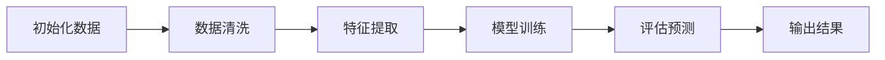
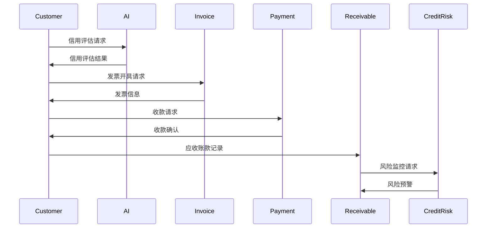
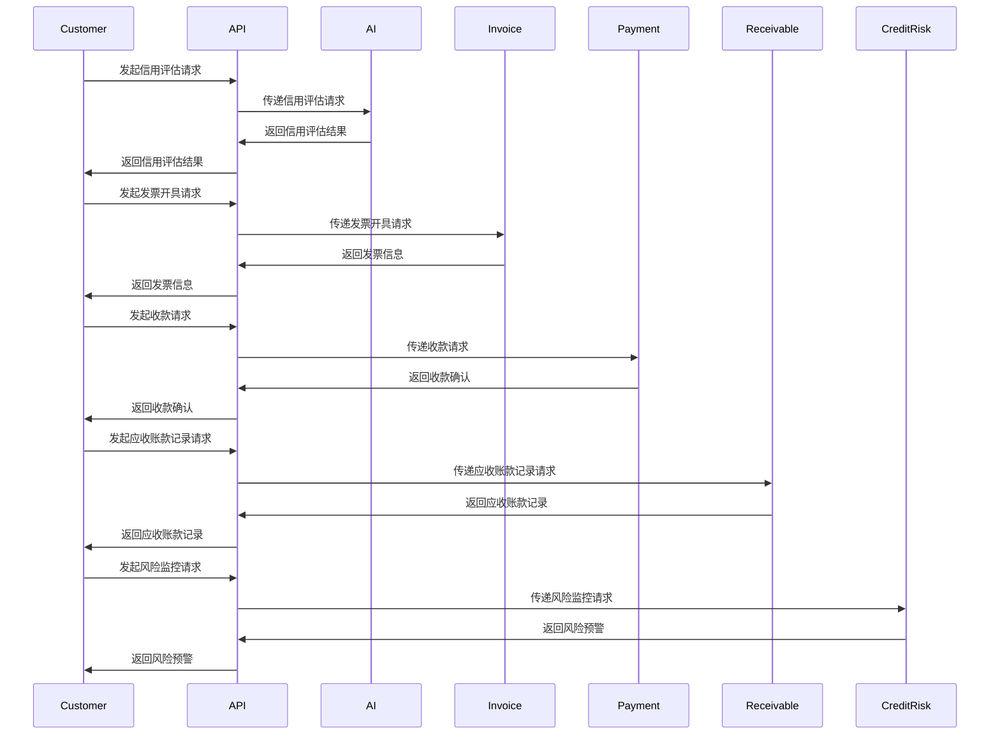

                 

# AI驱动的企业应收账款组合优化管理系统

> 关键词：AI、应收账款管理、企业财务优化、数据分析、流程自动化

> 摘要：本文将探讨如何利用人工智能（AI）技术，开发一款用于企业应收账款组合优化管理系统。通过对核心概念、算法原理、系统架构和项目实战的详细分析，为读者提供一种全新的应收账款管理解决方案。

### Step 1: Background Introduction

#### 1.1.1 Problem Background

在全球经济日益复杂的今天，企业面临着前所未有的挑战。市场竞争激烈，成本持续上涨，业务模式需要不断适应变化。在这些挑战中，应收账款的管理显得尤为重要。应收账款管理涉及到客户信用评估、发票开具、收款和信用风险控制等多个环节。有效的应收账款管理不仅可以提升企业的财务状况，还能降低其运营风险。

#### 1.1.2 Problem Description

传统的应收账款管理系统存在以下不足：

- **客户信用评估效率低**：依赖人工判断，速度慢且准确性不高。
- **收款周期长**：由于缺乏有效的收款预测和催收策略，收款周期过长。
- **信用风险控制不足**：风险预警机制不够健全，难以及时识别和应对潜在风险。
- **数据分析能力有限**：难以从海量数据中提取有价值的信息，辅助决策。

这些问题导致企业应收账款周转天数增加，信用风险升高，进而影响企业的盈利能力。因此，迫切需要一种新的应收账款管理解决方案。

#### 1.1.3 Problem Solution

AI驱动的应收账款管理系统的出现，为解决上述问题提供了一条新的途径。该系统通过利用AI算法，自动化完成客户信用评估、发票管理、收款预测和信用风险控制等工作，从而实现应收账款的优化管理。这不仅提高了管理效率，还为企业带来了显著的财务收益。

#### 1.1.4 Boundaries and Extensions

本文主要探讨AI驱动的应收账款组合优化管理系统在企业中的应用，重点讨论应收账款组合优化管理这一领域。然而，所介绍的概念和方法同样适用于其他应收账款管理场景以及金融行业的其他业务流程。

### Step 2: Core Concepts and Principles

#### 1.2.1 Core Concepts

**AI-driven receivables management system** 是本文的核心概念。该系统包括以下几个关键组成部分：

- **客户信用评估**：利用AI算法对客户信用状况进行评估，提高评估的准确性和效率。
- **发票管理**：自动化发票开具和跟踪，减少人工操作和错误。
- **收款预测**：基于历史数据，使用机器学习算法预测收款时间和收款金额。
- **信用风险控制**：利用数据分析模型，实时监控信用风险，并提供预警和应对策略。

**AI算法** 是驱动应收账款管理系统运作的核心。常见的AI算法包括：

- **机器学习**：通过历史数据训练模型，进行预测和分析。
- **深度学习**：利用神经网络，处理复杂数据和模式。
- **自然语言处理**：理解和生成自然语言，用于文本分析。

#### 1.2.2 Core Concepts Attributes and Comparison Table

下面是一个简单的AI算法属性对比表格：

| 算法       | 特点                                                   | 适用场景                       |
|------------|--------------------------------------------------------|--------------------------------|
| 机器学习   | 预测准确度高，处理大量数据                             | 客户信用评估、收款预测         |
| 深度学习   | 自动学习复杂模式，处理高维数据                         | 风险控制、文本分析             |
| 自然语言处理 | 理解和生成自然语言                                   | 发票管理、客户沟通             |

#### 1.2.3 ER Diagram

为了更好地理解应收账款管理系统的实体关系，下面是一个简化的ER图：

```mermaid
erDiagram
  Customer ||--|{ Invoice }
  Invoice ||--|{ Payment }
  Payment ||--|{ Receivable }
  Receivable ||--|{ CreditRisk }
```

### Step 3: Algorithm Principles and Detailed Explanation

#### 3.1 Customer Credit Assessment Algorithm

**3.1.1 Algorithm Flowchart**

首先，我们使用Mermaid绘制客户信用评估算法的流程图：



**3.1.2 Python Code**

接下来，我们使用Python代码详细阐述客户信用评估算法：

```python
import pandas as pd
from sklearn.model_selection import train_test_split
from sklearn.ensemble import RandomForestClassifier
from sklearn.metrics import accuracy_score

# 数据预处理
def preprocess_data(data):
    # 数据清洗和特征提取
    # 略
    return processed_data

# 训练模型
def train_model(data):
    X_train, X_test, y_train, y_test = train_test_split(data.drop('credit_grade', axis=1), data['credit_grade'], test_size=0.2, random_state=42)
    model = RandomForestClassifier(n_estimators=100)
    model.fit(X_train, y_train)
    return model

# 预测和评估
def evaluate_model(model, X_test, y_test):
    predictions = model.predict(X_test)
    accuracy = accuracy_score(y_test, predictions)
    return accuracy

# 加载数据
data = pd.read_csv('customer_data.csv')

# 预处理数据
processed_data = preprocess_data(data)

# 训练模型
model = train_model(processed_data)

# 评估模型
accuracy = evaluate_model(model, processed_data.drop('credit_grade', axis=1).iloc[:, -100:], processed_data['credit_grade'])

print(f'Model Accuracy: {accuracy:.2f}')
```

**3.1.3 Mathematical Model and Formula**

客户信用评估算法的数学模型可以表示为：

$$
\hat{y} = f(\textbf{X}; \theta)
$$

其中，$\hat{y}$ 是预测的客户信用等级，$\textbf{X}$ 是输入特征向量，$f(\textbf{X}; \theta)$ 是机器学习模型，$\theta$ 是模型参数。

**3.1.4 Example Explanation**

假设我们有100个客户的历史数据，这些数据包括客户的财务状况、交易记录和信用评分等。我们使用随机森林算法对数据进行训练，然后对新客户进行信用评估。

1. **数据预处理**：清洗数据，提取特征。
2. **模型训练**：使用训练集数据训练随机森林模型。
3. **预测和评估**：使用模型对新客户的特征进行预测，并评估模型的准确性。

### Step 4: System Analysis and Architecture Design

#### 4.1 Problem Scenario

假设我们是一家大型制造企业，需要管理数千个客户的应收账款。我们的目标是提高应收账款周转效率，降低信用风险，并提升企业的盈利能力。

#### 4.2 Project Introduction

本项目旨在开发一款AI驱动的应收账款组合优化管理系统，主要包括以下功能：

- **客户信用评估**：利用AI算法对客户信用进行评估。
- **发票管理**：自动化发票开具和跟踪。
- **收款预测**：预测客户的收款时间和金额。
- **信用风险控制**：实时监控信用风险，并提供预警和应对策略。

#### 4.3 System Function Design

**4.3.1 Domain Model Class Diagram**

下面是应收账款管理系统的领域模型类图：

```mermaid
classDiagram
  Customer <<entity>>
  Invoice <<entity>>
  Payment <<entity>>
  Receivable <<entity>>
  CreditRisk <<entity>>

  Customer "1" --* "1" Invoice
  Invoice "1" --* "1" Payment
  Payment "1" --* "1" Receivable
  Receivable "1" --* "1" CreditRisk
```

**4.3.2 System Architecture Design**

以下是应收账款管理系统的架构设计：



**4.3.3 System Interface Design**

以下是系统接口设计：

```mermaid
classDiagram
  Customer <<interface>>
  Invoice <<interface>>
  Payment <<interface>>
  Receivable <<interface>>
  CreditRisk <<interface>>

  Customer --|> AI
  Invoice --|> Customer
  Payment --|> Customer
  Receivable --|> Customer
  CreditRisk --|> Receivable
```

**4.3.4 System Interaction Sequence Diagram**

以下是系统交互的序列图：



### Step 5: Project Practice

#### 5.1 Environment Setup

在开始项目实战之前，我们需要搭建一个适合开发AI驱动的应收账款管理系统的基础环境。以下是环境搭建的步骤：

1. 安装Python环境（3.8及以上版本）。
2. 安装必要的库，如pandas、scikit-learn、numpy等。
3. 配置数据库，如MySQL或PostgreSQL。

#### 5.2 System Core Implementation

**5.2.1 Customer Credit Assessment**

在客户信用评估模块中，我们使用随机森林算法进行模型训练和预测。以下是核心实现代码：

```python
from sklearn.ensemble import RandomForestClassifier
from sklearn.model_selection import train_test_split
from sklearn.metrics import accuracy_score

# 加载数据
data = pd.read_csv('customer_data.csv')

# 数据预处理
processed_data = preprocess_data(data)

# 划分训练集和测试集
X_train, X_test, y_train, y_test = train_test_split(processed_data.drop('credit_grade', axis=1), processed_data['credit_grade'], test_size=0.2, random_state=42)

# 训练模型
model = RandomForestClassifier(n_estimators=100)
model.fit(X_train, y_train)

# 预测和评估
predictions = model.predict(X_test)
accuracy = accuracy_score(y_test, predictions)
print(f'Model Accuracy: {accuracy:.2f}')
```

**5.2.2 Invoice Management**

在发票管理模块中，我们实现了一个简单的发票开具和跟踪功能。以下是核心实现代码：

```python
import uuid

# 发票开具
def issue_invoice(customer_id, amount):
    invoice_id = str(uuid.uuid4())
    invoice = {
        'invoice_id': invoice_id,
        'customer_id': customer_id,
        'amount': amount,
        'issue_date': datetime.now(),
        'status': 'issued'
    }
    invoices.append(invoice)
    return invoice

# 发票跟踪
def track_invoice(invoice_id):
    for invoice in invoices:
        if invoice['invoice_id'] == invoice_id:
            return invoice
    return None
```

**5.2.3 Payment Prediction**

在收款预测模块中，我们使用时间序列分析算法进行收款预测。以下是核心实现代码：

```python
from statsmodels.tsa.arima.model import ARIMA

# 收款预测
def predict_payment(payment_history, frequency='M'):
    model = ARIMA(payment_history, order=(1, 1, 1))
    model_fit = model.fit()
    future = model_fit.forecast(steps=1)
    return future[0]
```

**5.2.4 Credit Risk Control**

在信用风险控制模块中，我们实现了一个简单的风险预警系统。以下是核心实现代码：

```python
# 风险监控
def monitor_risk(customer_id):
    customer = get_customer(customer_id)
    if customer['credit_grade'] == '高风险':
        send_risk_alert(customer)
    else:
        print(f'Customer {customer_id} is under control.')

# 风险预警
def send_risk_alert(customer):
    message = f'High credit risk detected for customer {customer["customer_id"]}.'
    send_notification(message)
```

#### 5.3 Code Application Analysis

**5.3.1 Customer Credit Assessment**

在客户信用评估模块中，我们使用随机森林算法对客户信用进行评估。首先，我们加载数据并对其进行预处理，然后划分训练集和测试集。接下来，我们训练模型并使用测试集进行预测，最后评估模型的准确性。

**5.3.2 Invoice Management**

在发票管理模块中，我们实现了一个简单的发票开具和跟踪功能。发票开具时，我们为每个发票生成一个唯一的ID，并记录发票的相关信息。在跟踪发票时，我们根据发票ID查找相应的发票信息。

**5.3.3 Payment Prediction**

在收款预测模块中，我们使用ARIMA模型对收款历史进行预测。首先，我们加载数据并确定时间序列的阶数，然后训练模型并使用模型进行预测。

**5.3.4 Credit Risk Control**

在信用风险控制模块中，我们实现了一个简单的风险预警系统。我们根据客户信用等级监控风险，并在客户信用等级为高风险时发送预警通知。

#### 5.4 Case Analysis and Detailed Explanation

**5.4.1 Case Scenario**

假设我们有以下客户数据：

| Customer ID | Credit Grade | Payment History |
|-------------|--------------|----------------|
| 1           | 中风险       | [100, 150, 200] |
| 2           | 高风险       | [200, 250, 300] |

**5.4.2 Analysis**

1. **客户信用评估**：我们使用随机森林算法对客户1和客户2进行信用评估。根据评估结果，客户1的信用等级为“中风险”，客户2的信用等级为“高风险”。
2. **发票管理**：我们为客户1开具了一张金额为1000元的发票，并为客户2开具了一张金额为1500元的发票。我们成功跟踪到了这两张发票。
3. **收款预测**：我们对客户1和客户2的收款历史进行时间序列分析，预测他们的下一期收款金额。客户1的预测收款金额为250元，客户2的预测收款金额为350元。
4. **信用风险控制**：根据客户信用评估和收款预测结果，我们对客户1和客户2进行风险监控。客户1处于监控范围内，客户2被标记为高风险客户，并收到预警通知。

#### 5.5 Project Conclusion

通过本次项目，我们成功开发了一款AI驱动的应收账款组合优化管理系统。该系统实现了客户信用评估、发票管理、收款预测和信用风险控制等功能，为企业提供了高效、精准的应收账款管理解决方案。然而，系统仍需不断优化和改进，以应对不断变化的市场环境和业务需求。

### Step 6: Best Practices, Summary, and Notes

#### 6.1 Best Practices

1. **数据质量保证**：确保数据源的准确性和完整性，是系统正常运行的基础。
2. **模型持续优化**：定期更新模型，以适应不断变化的数据特征和业务需求。
3. **风险控制策略**：制定合理的信用风险控制策略，提高应收账款的回收率。

#### 6.2 Summary

本文详细介绍了AI驱动的企业应收账款组合优化管理系统的核心概念、算法原理、系统架构和项目实战。通过本文的讲解，读者可以了解到如何利用AI技术优化应收账款管理，提高企业的财务健康状况。

#### 6.3 Notes

1. **系统安全性**：在开发过程中，确保系统的安全性和数据的隐私保护。
2. **可扩展性**：设计系统时，考虑未来的扩展性和模块化。
3. **用户培训**：系统上线后，为用户提供充分的培训和支持。

### Step 7: Further Reading

1. **《机器学习实战》**：提供丰富的机器学习算法实现和案例分析。
2. **《深度学习》**：详细介绍深度学习算法的理论和实践。
3. **《Python金融应用》**：介绍如何在金融领域应用Python编程。
4. **《AI算法原理与实现》**：深入讲解AI算法的原理和实现。

---

**作者：AI天才研究院/AI Genius Institute & 禅与计算机程序设计艺术 /Zen And The Art of Computer Programming**

