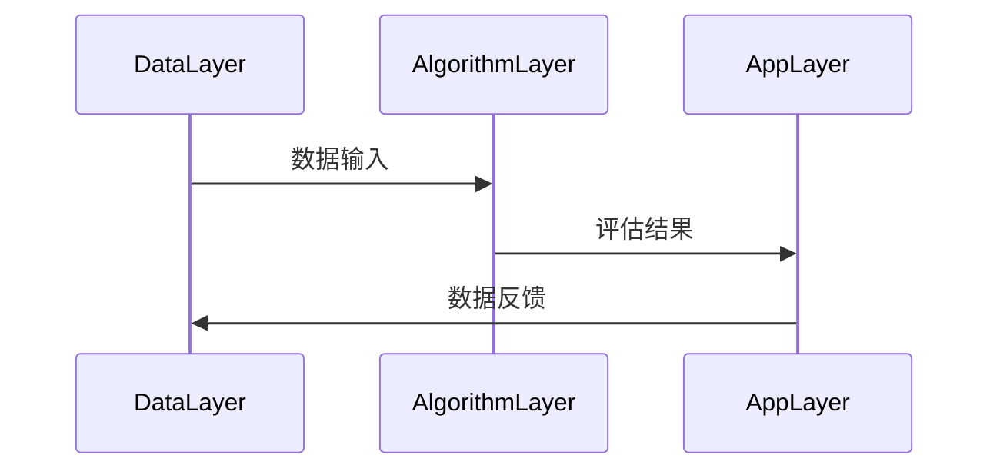

                 

## 《AI驱动的企业应收账款组合信用风险评估系统》

### 关键词：AI、信用风险、应收账款、风险评估、系统构建

> 摘要：本文探讨了AI驱动的企业应收账款组合信用风险评估系统的构建和应用。通过介绍背景、核心概念、架构设计、数据预处理、特征工程、模型算法、模型训练与验证，系统开发、应用实例以及系统部署与运维，全面阐述了该系统在信用风险管理中的应用价值。

## 第一部分：引言与背景介绍

### 第1章：问题背景与核心概念

#### 1.1 问题背景

在商业活动中，应收账款是企业的一项重要资产，其管理质量直接影响到企业的现金流和财务健康。然而，应收账款组合信用风险的管理面临着诸多挑战，如客户信用风险的不确定性、市场环境的变化、企业内部管理能力有限等。传统的信用风险评估方法依赖于人工经验，存在主观性强、效率低、准确率不高等问题。随着人工智能技术的不断发展，利用AI技术构建企业应收账款组合信用风险评估系统成为可能。

#### 1.1.1 应收账款管理的现状与挑战

- **现状**：大部分企业依赖于传统的信用评估方法，如财务报表分析、信用评分模型等。
- **挑战**：
  - **数据有限**：传统方法主要依赖于企业内部数据，缺乏外部数据的支持。
  - **效率低下**：人工评估速度慢，难以处理大量数据。
  - **准确率不高**：依赖于主观判断，容易出现偏差。

#### 1.1.2 信用风险管理的重要性

- **财务健康**：有效的信用风险管理可以降低坏账率，保障企业的现金流。
- **经营效率**：优化应收账款管理，提高资金周转效率。
- **风险控制**：提前识别潜在风险，降低经营风险。

#### 1.1.3 AI技术在信用风险管理中的应用前景

- **数据驱动力**：AI技术可以利用海量数据进行信用风险评估。
- **自动化**：提高评估效率，降低人力成本。
- **精确性**：通过机器学习算法提高评估准确性。

#### 1.2 核心概念

##### 1.2.1 应收账款组合

应收账款组合是指企业所有尚未收回的应收账款集合。包括各种客户和交易类型，是信用风险管理的重要对象。

##### 1.2.2 信用风险评估

信用风险评估是对客户信用状况进行评估的过程，旨在预测客户在未来一段时间内偿还债务的能力。其核心是评估客户的信用风险。

##### 1.2.3 AI驱动与模型算法

AI驱动是指利用人工智能技术，如机器学习、深度学习等，构建信用风险评估模型。模型算法是评估客户信用风险的具体实现方法。

### 第2章：AI驱动的信用风险评估体系构建

#### 2.1 架构设计

##### 2.1.1 系统架构概述

系统架构包括数据层、算法层和应用层，如下图所示：



##### 2.1.2 数据流与处理流程

数据流与处理流程如下：

1. 数据收集与预处理
2. 特征工程
3. 模型选择与训练
4. 模型验证与评估
5. 应用部署与监控

#### 2.2 数据收集与预处理

##### 2.2.1 数据来源与类型

数据来源包括企业内部数据（如财务报表、交易记录等）和第三方数据（如市场数据、信用评级数据等）。数据类型包括结构化数据（如表格数据）和非结构化数据（如图像、文本等）。

##### 2.2.2 数据预处理方法

数据预处理方法包括数据清洗、数据归一化、缺失值处理等。具体方法如下：

1. 数据清洗：去除重复数据、处理异常值、填补缺失值。
2. 数据归一化：将不同单位或范围的数据转换为同一尺度。
3. 缺失值处理：根据数据重要性和缺失情况选择合适的处理方法。

#### 2.3 特征工程

##### 2.3.1 特征提取与选择

特征提取与选择是信用风险评估的关键步骤。方法包括：

1. 统计特征：如平均值、中位数、标准差等。
2. 聚类特征：如K-means、层次聚类等。
3. 机器学习特征：如决策树、随机森林等。

##### 2.3.2 特征属性对比表

| 特征名称 | 特征类型 | 描述 |
| :---: | :---: | :---: |
| 应收账款金额 | 数字 | 客户未偿还的金额 |
| 客户行业 | 分类 | 客户所在行业类别 |
| 支付历史 | 数字 | 客户历史支付记录 |
| 市场趋势 | 数字 | 行业市场变化趋势 |

#### 2.4 模型算法与选择

##### 2.4.1 常见信用风险评估模型

常见的信用风险评估模型包括：

1. 线性回归
2. 决策树
3. 随机森林
4. 支持向量机
5. 神经网络

##### 2.4.2 模型选择方法与评估指标

模型选择方法包括：

1. 交叉验证
2. 评估指标：如准确率、召回率、F1值等。

#### 2.5 模型训练与验证

##### 2.5.1 模型训练流程

模型训练流程如下：

1. 数据集划分：分为训练集、验证集和测试集。
2. 模型训练：在训练集上训练模型。
3. 模型验证：在验证集上验证模型性能。
4. 模型优化：根据验证结果调整模型参数。

##### 2.5.2 模型验证与性能评估

模型验证与性能评估步骤如下：

1. 模型评估：计算评估指标。
2. 结果分析：分析模型性能和错误类型。
3. 模型优化：根据分析结果调整模型。

## 第二部分：具体实现

### 第3章：AI驱动的企业应收账款信用风险评估系统开发

#### 3.1 系统环境搭建

##### 3.1.1 开发环境配置

- **Python**：Python是一种广泛使用的编程语言，具有丰富的库和框架支持。
- **Jupyter Notebook**：Jupyter Notebook是一种交互式计算环境，方便进行实验和调试。

##### 3.1.2 数据库与数据存储

- **MySQL**：MySQL是一种关系型数据库，用于存储企业内部数据。
- **HDFS**：HDFS是一种分布式文件系统，用于存储大规模数据。

#### 3.2 数据收集与预处理

##### 3.2.1 数据源接入

数据源包括企业内部数据和第三方数据。数据接入方法包括：

1. API接入
2. 数据库连接
3. 文件导入

##### 3.2.2 数据清洗与转换

数据清洗与转换步骤包括：

1. 数据清洗：去除重复数据、处理异常值、填补缺失值。
2. 数据转换：将数据转换为统一的格式和尺度。

#### 3.3 特征工程

##### 3.3.1 特征提取实现

特征提取实现步骤包括：

1. 统计特征提取：计算平均值、中位数、标准差等。
2. 聚类特征提取：使用K-means、层次聚类等算法提取聚类特征。
3. 机器学习特征提取：使用决策树、随机森林等算法提取特征。

##### 3.3.2 特征选择方法

特征选择方法包括：

1. 相关性分析
2. 递归特征消除
3. 主成分分析

#### 3.4 模型训练与验证

##### 3.4.1 模型训练代码实现

模型训练代码实现如下：

```python
from sklearn.ensemble import RandomForestClassifier
from sklearn.model_selection import train_test_split

# 数据集划分
X_train, X_test, y_train, y_test = train_test_split(X, y, test_size=0.2, random_state=42)

# 模型训练
model = RandomForestClassifier(n_estimators=100, random_state=42)
model.fit(X_train, y_train)

# 模型验证
y_pred = model.predict(X_test)
accuracy = accuracy_score(y_test, y_pred)
print(f"Accuracy: {accuracy}")
```

##### 3.4.2 模型验证与优化

模型验证与优化步骤包括：

1. 评估指标计算：计算准确率、召回率、F1值等。
2. 模型优化：调整模型参数，如树深度、特征数量等。
3. 模型保存与加载：保存训练好的模型，以便后续使用。

## 第4章：AI模型在信用风险评估中的应用

### 第4.1节：应收账款信用评分模型

应收账款信用评分模型是一种用于评估客户信用风险的方法。其设计思路如下：

1. 数据收集：收集企业内部和第三方数据，如财务报表、市场趋势等。
2. 数据预处理：清洗数据，去除重复值、异常值，进行归一化处理。
3. 特征工程：提取关键特征，如客户行业、支付历史、市场趋势等。
4. 模型选择：选择合适的信用评分模型，如线性回归、决策树、随机森林等。
5. 模型训练与验证：在训练集上训练模型，在验证集上验证模型性能。
6. 模型应用：将训练好的模型应用于实际数据，评估客户信用风险。

#### 4.1.1 评分模型设计与实现

评分模型设计如下：

```python
from sklearn.linear_model import LinearRegression
from sklearn.metrics import mean_squared_error

# 数据集划分
X_train, X_test, y_train, y_test = train_test_split(X, y, test_size=0.2, random_state=42)

# 模型训练
model = LinearRegression()
model.fit(X_train, y_train)

# 模型验证
y_pred = model.predict(X_test)
mse = mean_squared_error(y_test, y_pred)
print(f"MSE: {mse}")
```

#### 4.1.2 评分结果解读与应用

评分结果可以用于：

1. 信用额度审批：根据评分结果确定客户的信用额度。
2. 收款策略制定：根据评分结果调整收款策略，如延长付款期限、增加收款频率等。
3. 风险预警：根据评分结果预测潜在风险，及时采取风险控制措施。

### 第4.2节：应收账款违约预测模型

应收账款违约预测模型是一种用于预测客户是否会发生违约的方法。其设计思路如下：

1. 数据收集：收集企业内部和第三方数据，如财务报表、市场趋势等。
2. 数据预处理：清洗数据，去除重复值、异常值，进行归一化处理。
3. 特征工程：提取关键特征，如客户行业、支付历史、市场趋势等。
4. 模型选择：选择合适的违约预测模型，如逻辑回归、支持向量机、神经网络等。
5. 模型训练与验证：在训练集上训练模型，在验证集上验证模型性能。
6. 模型应用：将训练好的模型应用于实际数据，预测客户违约风险。

#### 4.2.1 预测模型设计与实现

预测模型设计如下：

```python
from sklearn.linear_model import LogisticRegression
from sklearn.metrics import classification_report

# 数据集划分
X_train, X_test, y_train, y_test = train_test_split(X, y, test_size=0.2, random_state=42)

# 模型训练
model = LogisticRegression()
model.fit(X_train, y_train)

# 模型验证
y_pred = model.predict(X_test)
print(classification_report(y_test, y_pred))
```

#### 4.2.2 预测结果分析与风险控制

预测结果可以用于：

1. 风险预警：根据预测结果识别高风险客户，及时采取风险控制措施。
2. 贷款审批：根据预测结果调整贷款审批策略，如提高贷款利率、增加担保要求等。
3. 风险管理：根据预测结果制定风险管理策略，如分散客户风险、加强风险监控等。

## 第5章：系统部署与运维

### 第5.1节：系统部署方案

系统部署方案包括：

1. 硬件环境：服务器、存储设备等。
2. 软件环境：操作系统、数据库、开发环境等。
3. 部署流程：环境配置、数据导入、模型训练与部署等。

### 第5.2节：系统运维与维护

系统运维与维护包括：

1. 数据备份与恢复。
2. 系统监控与报警。
3. 故障处理与优化。

### 第6章：案例分析与实战经验总结

#### 第6.1节：案例一：中小企业信用风险评估

##### 6.1.1 案例背景

某中小企业需要对其客户进行信用风险评估，以降低坏账风险。

##### 6.1.2 案例实施步骤

1. 数据收集：收集企业内部数据和第三方数据。
2. 数据预处理：清洗数据，提取关键特征。
3. 模型选择与训练：选择合适的信用评分模型，训练模型。
4. 模型验证与优化：验证模型性能，调整模型参数。
5. 模型应用：将训练好的模型应用于实际数据，评估客户信用风险。

##### 6.1.3 案例结果分析

通过AI驱动的信用风险评估系统，企业能够更准确地评估客户信用风险，降低坏账率，提高经营效益。

#### 第6.2节：案例二：大型企业应收账款组合管理

##### 6.2.1 案例背景

某大型企业需要对其应收账款组合进行管理，以优化收款策略。

##### 6.2.2 案例实施步骤

1. 数据收集：收集企业内部数据和第三方数据。
2. 数据预处理：清洗数据，提取关键特征。
3. 模型选择与训练：选择合适的信用评分模型，训练模型。
4. 预测模型设计：设计应收账款违约预测模型。
5. 模型验证与优化：验证模型性能，调整模型参数。
6. 模型应用：将训练好的模型应用于实际数据，评估客户信用风险，优化收款策略。

##### 6.2.3 案例结果分析

通过AI驱动的应收账款组合管理系统，企业能够更准确地预测客户违约风险，优化收款策略，提高收款效率，降低财务风险。

### 第7章：总结与展望

#### 第7.1节：总结

本文介绍了AI驱动的企业应收账款组合信用风险评估系统的构建和应用。通过数据收集与预处理、特征工程、模型训练与验证、系统部署与运维等环节，实现了对客户信用风险的准确评估和应收账款组合的优化管理。主要研究成果包括：

1. 构建了一套完整的AI驱动的信用风险评估体系。
2. 提高了信用风险评估的准确性和效率。
3. 优化了企业的应收账款管理策略。

#### 第7.2节：展望

随着人工智能技术的不断发展，AI驱动的信用风险评估系统在未来将具有更广泛的应用前景。未来研究方向包括：

1. 引入更多外部数据，提高模型预测准确性。
2. 深入研究深度学习在信用风险评估中的应用。
3. 开发实时信用风险评估系统，实现动态风险管理。
4. 探索AI在信用风险评估中的伦理和法律问题。

