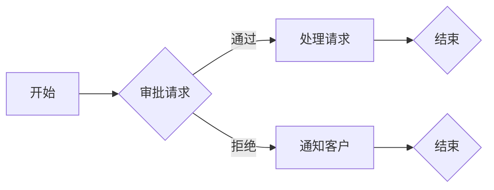
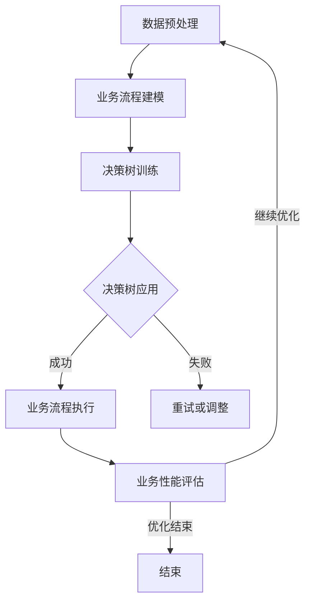
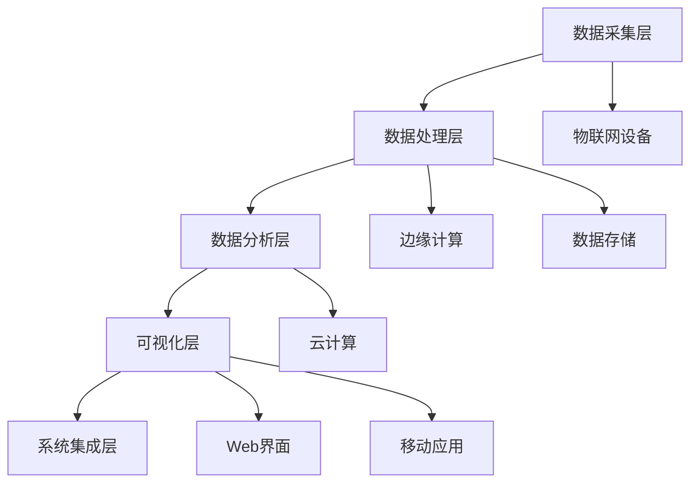

                 

## 文章标题

### 关键词：AI驱动的企业数字孪生、业务流程优化、虚拟环境、算法实现、系统架构设计、项目实战

> 摘要：本文将探讨如何利用人工智能（AI）技术驱动企业数字孪生，通过虚拟环境中的业务流程优化，提升企业运营效率和决策能力。本文将首先介绍AI和数字孪生技术的背景和发展现状，随后深入解析核心概念及其联系，通过具体的算法原理讲解和系统分析与架构设计，展示AI驱动数字孪生技术的应用实践。最后，本文将总结最佳实践，并提供拓展阅读资源，助力读者深入理解这一前沿技术领域。

## 目录大纲设计思路

在设计本文的目录大纲时，我们的目标是确保文章结构清晰、逻辑紧密，同时能够吸引读者的兴趣，从而帮助他们更好地理解AI驱动的企业数字孪生技术及其应用。以下是我们设计思路的详细阐述：

### 整体结构规划

文章整体结构分为六个主要部分，每个部分解决不同的问题：

1. **引言部分**：介绍AI和数字孪生技术的背景，以及AI驱动数字孪生的优势。
2. **核心概念与联系**：详细阐述数字孪生和业务流程优化等核心概念，并通过图表展示各概念之间的关系。
3. **算法原理讲解**：选择一两个典型算法，使用mermaid流程图和Python代码详细阐述其原理和数学模型。
4. **系统分析与架构设计**：通过mermaid类图、架构图和序列图等工具，分析系统的功能设计、架构设计和交互设计。
5. **项目实战**：通过实际项目案例，详细介绍环境安装、核心实现、代码解读和案例分析等步骤。
6. **最佳实践与拓展**：总结文章内容，提供最佳实践建议和拓展阅读资源。

### 背景介绍

第一部分将介绍AI和数字孪生技术的背景，包括其定义、发展历史、应用领域和当前的研究趋势。我们将解释为什么AI驱动是企业数字孪生技术的关键，并探讨这种技术的潜在优势。

### 核心概念与原理

第二部分将深入探讨数字孪生和业务流程优化等核心概念。我们将使用表格和图示来展示这些概念之间的关系，帮助读者建立清晰的认识。

### 算法原理讲解

第三部分将选择一两个典型的算法，通过mermaid流程图和Python代码详细阐述其原理和数学模型。我们将以通俗易懂的方式举例说明，确保读者能够理解并应用这些算法。

### 系统分析与架构设计

第四部分将通过mermaid类图、架构图和序列图等工具，对系统的功能设计、架构设计和交互设计进行详细分析。这部分将帮助读者理解如何将算法和概念应用于实际系统。

### 项目实战

第五部分将通过一个实际项目，详细介绍环境安装、核心实现、代码解读、案例分析等步骤。这部分将提供实际的案例和实战经验，帮助读者将所学知识应用于实际场景。

### 最佳实践与拓展

最后一部分将总结文章内容，提供最佳实践建议，并给出拓展阅读资源，帮助读者进一步深入学习。

## 目录大纲设计步骤

在设计本文的目录大纲时，我们遵循以下步骤，以确保文章内容逻辑清晰、结构紧凑：

### 第一步：引言部分

1. **确定章节标题**：选择吸引读者注意的标题，如“AI驱动的企业数字孪生技术概述”。
2. **撰写章节内容**：介绍AI和数字孪生技术的背景，解释AI驱动数字孪生的优势。
3. **章节结构规划**：将内容分为几个小节，每个小节聚焦于一个特定的主题。

### 第二步：核心概念与原理

1. **确定章节标题**：如“数字孪生技术详解”和“业务流程优化理论”。
2. **撰写章节内容**：详细阐述核心概念和原理，使用表格和图示展示概念之间的关系。
3. **章节结构规划**：将每个概念分成几个小节，每个小节深入探讨一个特定的方面。

### 第三步：算法原理讲解

1. **确定章节标题**：如“业务流程优化算法”。
2. **选择算法**：选择具有代表性的算法，如机器学习算法。
3. **撰写章节内容**：使用mermaid流程图和Python代码详细阐述算法原理和数学模型。
4. **章节结构规划**：将算法讲解分为几个小节，每个小节聚焦于一个特定的算法部分。

### 第四步：系统分析与架构设计

1. **确定章节标题**：如“企业数字孪生系统架构设计”。
2. **撰写章节内容**：通过mermaid类图、架构图和序列图等工具，分析系统的各个设计方面。
3. **章节结构规划**：将系统分析分为几个小节，每个小节聚焦于一个特定的设计元素。

### 第五步：项目实战

1. **确定章节标题**：如“AI驱动数字孪生项目实战”。
2. **选择项目案例**：选择一个具有代表性的项目案例。
3. **撰写章节内容**：详细介绍项目环境安装、核心实现、代码解读和案例分析。
4. **章节结构规划**：将项目实战分为几个小节，每个小节聚焦于一个特定的项目步骤。

### 第六步：最佳实践与拓展

1. **确定章节标题**：如“最佳实践与注意事项”。
2. **撰写章节内容**：总结文章内容，提供最佳实践建议，并给出拓展阅读资源。
3. **章节结构规划**：将内容分为几个小节，每个小节提供具体的实践技巧和拓展资源。

通过以上步骤，我们确保了文章内容的系统性和连贯性，使得读者能够逐步深入理解AI驱动的企业数字孪生技术，并学会如何将其应用于实际场景。

### 最终目录大纲（简略版）

----------------------------------------------------------------

# 第一部分：引言

## 第1章：AI驱动的企业数字孪生技术概述
### 1.1 数字孪生技术的背景
### 1.2 AI技术在企业中的应用
### 1.3 AI驱动数字孪生的优势

## 第2章：数字孪生技术详解
### 2.1 数字孪生的定义与类型
### 2.2 数字孪生的工作原理
### 2.3 数字孪生的主要应用领域

## 第3章：业务流程优化理论
### 3.1 业务流程优化的核心概念
### 3.2 业务流程优化的方法
### 3.3 业务流程优化的关键因素

## 第4章：AI驱动数字孪生的核心技术
### 4.1 机器学习与深度学习
### 4.2 自然语言处理
### 4.3 计算机视觉

## 第5章：业务流程优化算法
### 5.1 数据预处理
### 5.2 业务流程建模
### 5.3 业务流程优化算法实现

## 第6章：企业数字孪生系统架构设计
### 6.1 系统需求分析
### 6.2 系统架构设计
### 6.3 系统接口设计
### 6.4 系统交互设计

## 第7章：AI驱动数字孪生项目实战
### 7.1 项目背景与目标
### 7.2 环境安装与配置
### 7.3 系统核心实现
### 7.4 代码解读与分析
### 7.5 实际案例分析
### 7.6 项目总结与反思

## 第8章：最佳实践与拓展
### 8.1 最佳实践总结
### 8.2 注意事项提醒
### 8.3 拓展阅读资源

----------------------------------------------------------------

通过以上详细的目录大纲，我们为读者提供了一个清晰的结构，帮助他们在阅读过程中逐步掌握AI驱动的企业数字孪生技术的核心概念和应用方法。接下来的章节将深入探讨这些主题，并通过具体实例和实践，让读者对这一前沿技术有更深刻的理解。## 第一部分：引言

### 第1章：AI驱动的企业数字孪生技术概述

#### 1.1 数字孪生技术的背景

数字孪生（Digital Twin）作为一种创新的技术概念，起源于20世纪70年代的制造业。最初，数字孪生被用来描述物理实体的数字镜像，目的是通过模拟和预测来提高生产效率和质量。随着计算机技术的不断进步和物联网（IoT）的普及，数字孪生技术逐渐从制造业扩展到更多行业领域，如能源、交通、医疗等。

在制造业中，数字孪生技术被广泛应用于生产线优化、设备维护预测和产品质量监控。例如，通过建立生产线的数字孪生模型，企业可以实时监控生产过程，预测设备故障，并在问题发生之前进行预防性维护，从而大大减少停机时间和维护成本。

#### 1.2 AI技术在企业中的应用

人工智能（AI）技术在近年来取得了显著的进展，其应用范围不断扩大，逐渐成为企业数字化转型的重要推动力。AI技术主要包括机器学习、深度学习、自然语言处理和计算机视觉等，这些技术可以为企业提供智能决策支持、自动化运营和个性化服务。

在企业管理中，AI技术被广泛应用于客户关系管理、供应链优化、人力资源管理和风险管理等方面。例如，通过使用机器学习算法，企业可以对大量客户数据进行挖掘和分析，从而更好地理解客户需求，优化营销策略，提升客户满意度。

#### 1.3 AI驱动数字孪生的优势

AI驱动数字孪生技术结合了数字孪生和AI技术的优势，为企业提供了更高效、更智能的运营模式。以下是AI驱动数字孪生的几个关键优势：

1. **实时监控与预测**：通过AI算法，企业可以对数字孪生模型中的数据进行实时监控和预测，提前发现潜在问题并采取措施，从而降低运营风险。

2. **业务流程优化**：AI驱动的数字孪生技术可以帮助企业对业务流程进行深度分析，识别瓶颈和优化点，从而提高流程效率和生产力。

3. **智能决策支持**：基于AI的数字孪生模型可以为企业提供实时、准确的决策支持，帮助管理者做出更明智的决策。

4. **个性化服务**：通过AI技术，企业可以为不同客户群体提供个性化的产品和服务，提升客户体验和忠诚度。

5. **降低成本**：AI驱动的数字孪生技术可以通过自动化和智能化手段减少人力和资源的消耗，从而降低运营成本。

#### 1.4 本文结构

本文将分为以下几个部分，以帮助读者全面了解AI驱动的企业数字孪生技术：

1. **核心概念与联系**：详细介绍数字孪生、业务流程优化等核心概念，并通过图表展示各概念之间的关系。

2. **算法原理讲解**：选择一两个典型算法，使用mermaid流程图和Python代码详细阐述其原理和数学模型。

3. **系统分析与架构设计**：通过mermaid类图、架构图和序列图等工具，对系统的功能设计、架构设计和交互设计进行详细分析。

4. **项目实战**：通过一个实际项目，详细介绍环境安装、核心实现、代码解读和案例分析等步骤。

5. **最佳实践与拓展**：总结文章内容，提供最佳实践建议，并给出拓展阅读资源。

通过以上结构，本文将逐步深入探讨AI驱动的企业数字孪生技术的各个方面，帮助读者建立全面的理解和应用能力。在接下来的章节中，我们将进一步探讨这些核心概念和技术细节。## 第二部分：核心概念与原理

### 第2章：数字孪生技术详解

#### 2.1 数字孪生的定义与类型

数字孪生（Digital Twin）是一种虚拟模型，它是物理实体的数字化映射，可以实时反映物理实体的状态、行为和性能。数字孪生的定义可以从不同的角度来理解：

- **广义定义**：数字孪生是一种模拟和数字化的方法，通过创建物理实体的虚拟镜像，实现对其实时监控、分析和优化的能力。
- **狭义定义**：数字孪生是指使用传感器、物联网（IoT）技术、云计算和人工智能（AI）等技术，将物理实体在数字世界中重建出来的模型。

根据应用领域和目的的不同，数字孪生可以分为以下几种类型：

1. **制造孪生**：主要用于制造过程中的设备、生产线和产品的监控、优化和维护。
2. **基础设施孪生**：用于监控和优化城市基础设施、交通系统和能源网络等。
3. **建筑孪生**：用于监控和优化建筑物的能源消耗、环境控制和设备状态等。
4. **设备孪生**：主要用于设备的性能监控、维护预测和状态评估。
5. **健康孪生**：用于监测和评估病人的健康状况，支持个性化医疗和健康护理。

#### 2.2 数字孪生的工作原理

数字孪生的工作原理可以概括为以下几个步骤：

1. **数据采集**：通过传感器、物联网设备等采集物理实体的实时数据，如温度、压力、速度、位置等。
2. **数据传输**：将采集到的数据传输到云端或其他数据存储中心，通常使用的是高速网络和边缘计算技术。
3. **数据建模**：在云端或数据存储中心，使用数据分析和建模技术，将物理实体的数据转化为数字孪生模型。
4. **数据同步**：将数字孪生模型与物理实体实时同步，确保模型反映实时的物理状态。
5. **数据分析与优化**：通过AI算法和数据挖掘技术，对数字孪生模型进行分析，识别问题、预测故障、优化流程等。
6. **反馈与控制**：根据分析结果，对物理实体进行实时调整和控制，实现优化和改进。

#### 2.3 数字孪生的主要应用领域

数字孪生技术具有广泛的应用前景，以下是其主要应用领域：

1. **制造业**：用于生产过程的监控、优化和维护，提高生产效率和产品质量。
2. **交通运输**：用于交通流量管理、车辆状态监控和预测性维护，提高交通安全和效率。
3. **能源行业**：用于能源网络的优化、设备维护和故障预测，提高能源利用效率。
4. **建筑与基础设施**：用于建筑物的能源管理、环境控制和设备监控，提高建筑物的运营效率。
5. **医疗健康**：用于患者健康监测、个性化医疗和手术模拟，提高医疗质量和效率。

#### 2.4 数字孪生的核心组成部分

数字孪生系统通常由以下几个核心组成部分构成：

1. **传感器网络**：用于实时采集物理实体的数据。
2. **数据存储与处理**：用于存储和处理采集到的数据，通常涉及云计算和大数据技术。
3. **数字孪生模型**：用于建立物理实体的虚拟镜像，反映实时的物理状态。
4. **分析与应用层**：用于对数字孪生模型进行分析和应用，如预测性维护、流程优化等。

#### 2.5 数字孪生与业务流程优化的关系

数字孪生技术可以与业务流程优化（Business Process Optimization, BPO）相结合，为企业提供更高效、更智能的运营模式。具体来说，数字孪生技术在业务流程优化中的应用主要包括：

1. **实时监控**：通过数字孪生技术，企业可以实时监控业务流程的状态，快速识别问题并采取措施。
2. **预测性维护**：基于数字孪生模型和数据分析，企业可以预测业务流程中的潜在问题，提前进行维护和优化。
3. **流程优化**：通过分析数字孪生模型，企业可以识别业务流程中的瓶颈和优化点，制定更有效的优化策略。

#### 2.6 数字孪生技术的挑战与未来趋势

尽管数字孪生技术具有巨大的潜力，但其应用也面临一些挑战，包括：

1. **数据质量与安全**：数字孪生技术依赖于大量实时数据，数据的质量和安全是关键问题。
2. **计算资源与成本**：构建和运行数字孪生模型需要大量的计算资源和资金投入。
3. **系统集成与兼容性**：数字孪生技术需要与其他信息系统（如ERP、CRM等）进行集成，确保数据的兼容性和系统的稳定性。

未来，数字孪生技术的发展趋势将包括：

1. **边缘计算**：通过在边缘设备上处理数据，降低延迟和带宽需求，提高数字孪生的实时性和效率。
2. **人工智能与机器学习**：利用AI和机器学习技术，提高数字孪生的预测能力和决策支持能力。
3. **跨领域应用**：数字孪生技术将在更多行业和领域得到应用，推动各行业的数字化转型。

通过上述内容，我们详细介绍了数字孪生技术的定义、类型、工作原理、应用领域和与业务流程优化的关系，为后续章节的深入探讨奠定了基础。在下一章中，我们将进一步探讨业务流程优化的理论和方法。## 第3章：业务流程优化理论

### 3.1 业务流程优化的核心概念

业务流程优化（Business Process Optimization，简称BPO）是企业为了提高效率、降低成本、提升客户满意度而采取的一系列措施。业务流程优化的核心概念包括以下几个：

1. **业务流程**：业务流程是指一组相互关联的活动，它们共同完成一项业务任务。业务流程可以看作是企业运营的“骨架”，决定了企业的运作方式。
2. **流程优化**：流程优化是指通过分析、改进和调整业务流程，以提高效率、降低成本、提升客户满意度等目标。流程优化可以涵盖整个业务流程，也可以针对某个具体环节进行。
3. **瓶颈**：瓶颈是指业务流程中制约整体效率的关键环节。瓶颈的存在会导致整体流程的效率降低，因此识别和消除瓶颈是流程优化的重要任务。
4. **效率**：效率是指业务流程在单位时间内完成的任务量。高效率意味着业务流程能够以更快的速度完成更多的工作。
5. **成本**：成本是指业务流程在运作过程中所产生的所有费用。优化流程的目标之一是降低成本，从而提高企业的盈利能力。

### 3.2 业务流程优化的方法

业务流程优化可以采用多种方法，以下是一些常见的方法：

1. **流程分析**：流程分析是流程优化的第一步，旨在了解现有流程的运行情况，识别潜在的问题和改进机会。流程分析可以通过流程图、SWOT分析、流程审计等方法进行。
2. **瓶颈分析**：瓶颈分析是流程分析的重要组成部分，目的是识别业务流程中的瓶颈环节。瓶颈分析可以通过时间研究、流程模拟、数据统计等方法进行。
3. **流程重构**：流程重构是对现有业务流程进行彻底的重新设计和改进。流程重构的目标是消除瓶颈、提高效率、降低成本。常见的流程重构方法包括精益生产、六西格玛、流程再造等。
4. **流程标准化**：流程标准化是通过制定标准操作程序（SOP）和流程规范，确保业务流程在不同部门和地区得到统一执行。流程标准化有助于提高流程的稳定性和可重复性。
5. **流程自动化**：流程自动化是通过引入自动化工具和技术，减少人工操作，提高业务流程的效率和准确性。常见的流程自动化方法包括机器人流程自动化（RPA）、业务流程管理（BPM）等。
6. **流程持续改进**：流程持续改进是一种持续优化业务流程的方法，它通过定期审查、反馈和改进，不断优化业务流程，提高企业的运营效率。

### 3.3 业务流程优化的关键因素

要成功地实施业务流程优化，需要考虑以下几个关键因素：

1. **人员**：人员是业务流程优化的关键，他们负责实施优化措施、监测流程效果和持续改进。因此，人员培训、激励和参与是流程优化成功的重要保障。
2. **技术**：技术是实现业务流程优化的基础，包括流程自动化工具、数据分析软件、物联网设备等。选择合适的技术工具可以显著提高流程优化的效果。
3. **数据**：数据是业务流程优化的核心，它是流程分析和优化的基础。确保数据的质量、完整性和及时性是流程优化的前提。
4. **流程设计**：流程设计是业务流程优化的关键环节，良好的流程设计可以最大限度地减少不必要的步骤，提高流程的效率。流程设计需要综合考虑人员、技术、数据等因素。
5. **文化和组织结构**：文化和组织结构是流程优化的外部环境，它们对流程优化措施的执行和效果产生重要影响。建立支持流程优化的企业文化、调整组织结构，可以提高流程优化措施的有效性。

### 3.4 业务流程优化的案例

为了更好地理解业务流程优化的方法和应用，以下是一个具体的业务流程优化案例：

**案例：某制造企业的生产线优化**

1. **问题背景**：某制造企业发现其生产线的整体效率较低，经常出现设备故障和停机时间，导致生产成本增加，交货期延误。

2. **流程分析**：通过流程图和数据分析，企业发现生产线存在以下几个问题：
   - 设备故障频繁，导致生产线停机。
   - 人员操作不规范，导致生产效率低下。
   - 物料配送不及时，影响生产进度。

3. **瓶颈分析**：通过进一步分析，企业确定了生产线的瓶颈环节，包括：
   - 设备维护不足，导致故障频发。
   - 操作人员技能不足，影响生产效率。
   - 物料配送流程不畅，影响生产进度。

4. **优化措施**：
   - **设备维护**：引入定期维护和预防性维护策略，降低设备故障率。
   - **人员培训**：对操作人员进行专业培训，提高其技能水平。
   - **物料配送**：优化物料配送流程，确保物料及时送达生产现场。

5. **效果评估**：实施优化措施后，企业的生产线效率显著提高，设备故障率降低，生产成本降低，交货期缩短。

通过以上案例，我们可以看到业务流程优化的具体实施过程和效果。在下一章中，我们将探讨AI驱动数字孪生的核心技术，深入理解如何利用AI技术实现业务流程优化。## 第4章：AI驱动数字孪生的核心技术

### 4.1 机器学习与深度学习

#### 4.1.1 机器学习的基本概念

机器学习（Machine Learning，简称ML）是人工智能（Artificial Intelligence，简称AI）的一个重要分支，它通过算法和统计模型从数据中自动识别规律和模式，从而进行预测和决策。机器学习的主要特点包括：

1. **自学习能力**：机器学习算法能够通过训练数据自动改进性能，而不需要显式编程。
2. **数据处理能力**：机器学习算法能够处理大量复杂的数据，从中提取有价值的信息。
3. **适应性**：机器学习算法可以根据新的数据不断更新和调整，以适应不断变化的环境。

#### 4.1.2 深度学习的关键技术

深度学习（Deep Learning，简称DL）是机器学习的一个重要分支，它通过多层神经网络模型来模拟人脑的思考方式，进行数据分析和模式识别。深度学习的关键技术包括：

1. **神经网络**：神经网络是深度学习的基础，它由多个神经元（节点）组成，通过层与层之间的连接和传递，实现数据的处理和预测。
2. **卷积神经网络（CNN）**：卷积神经网络是一种专门用于图像识别和处理的神经网络，通过卷积操作和池化操作，可以有效地提取图像的特征。
3. **循环神经网络（RNN）**：循环神经网络是一种用于序列数据处理和预测的神经网络，通过隐藏状态和循环连接，可以捕捉序列中的时间依赖关系。
4. **生成对抗网络（GAN）**：生成对抗网络是一种用于生成数据的神经网络，它由生成器和判别器两个部分组成，通过对抗训练生成高质量的数据。

### 4.2 自然语言处理

自然语言处理（Natural Language Processing，简称NLP）是人工智能的一个分支，它涉及计算机和人类语言之间的交互。NLP的关键技术包括：

1. **文本分类**：文本分类是将文本数据按照类别进行分类的技术，广泛应用于信息检索、舆情分析和文本挖掘等领域。
2. **情感分析**：情感分析是识别文本中表达的情感倾向，如正面、负面或中性。情感分析在客户反馈分析、市场调研和社交媒体监控中有着广泛应用。
3. **机器翻译**：机器翻译是自动将一种语言的文本翻译成另一种语言的技术。随着深度学习技术的发展，机器翻译的准确性和流畅性得到了显著提升。
4. **问答系统**：问答系统是用于回答用户问题的智能系统，它可以基于规则或机器学习算法进行实现，广泛应用于客户服务、智能助手和搜索引擎等领域。

### 4.3 计算机视觉

计算机视觉（Computer Vision，简称CV）是人工智能的一个分支，它使计算机能够从图像或视频中提取信息。计算机视觉的关键技术包括：

1. **图像识别**：图像识别是识别图像中包含的内容，如物体、场景和人脸等。图像识别在安防监控、医疗影像分析和自动驾驶等领域有着广泛应用。
2. **目标检测**：目标检测是识别图像中的目标位置和类型，如车辆、行人或障碍物等。目标检测在自动驾驶、无人机监控和智能安防等领域有着重要应用。
3. **图像分割**：图像分割是将图像划分为不同的区域或对象，如前景和背景、不同的物体等。图像分割在医学影像分析、图像增强和图像合成等领域有着重要应用。
4. **人脸识别**：人脸识别是识别图像中的人脸，并进行身份验证。人脸识别在安防监控、身份验证和社交媒体等领域有着广泛应用。

### 4.4 AI驱动数字孪生的应用场景

AI驱动数字孪生技术在多个领域有着广泛的应用，以下是一些典型的应用场景：

1. **制造业**：通过AI驱动的数字孪生技术，可以对生产设备进行实时监控和预测性维护，提高生产效率和产品质量。
2. **交通运输**：在交通运输领域，AI驱动的数字孪生技术可以用于车辆状态监控、交通流量管理和自动驾驶。
3. **能源行业**：通过AI驱动的数字孪生技术，可以对能源设备进行实时监控和预测性维护，提高能源利用效率。
4. **建筑与基础设施**：在建筑与基础设施领域，AI驱动的数字孪生技术可以用于建筑物的性能监控、环境控制和设备维护。
5. **医疗健康**：在医疗健康领域，AI驱动的数字孪生技术可以用于病人健康监测、手术模拟和个性化医疗。

通过以上内容，我们详细介绍了机器学习与深度学习、自然语言处理和计算机视觉等AI驱动的核心技术，以及这些技术在数字孪生中的应用。在下一章中，我们将深入探讨业务流程优化算法，并使用mermaid流程图和Python代码详细阐述算法原理和数学模型。## 第5章：业务流程优化算法

### 5.1 数据预处理

在进行业务流程优化之前，数据预处理是一个至关重要的步骤。数据预处理的主要目的是确保数据的质量和一致性，以便后续的算法分析和模型训练能够顺利进行。

#### 数据清洗

数据清洗是数据预处理的第一步，目的是去除数据中的错误、异常和重复值。以下是一些常见的数据清洗方法：

1. **去除重复数据**：通过检查数据集中的唯一标识，如客户ID或订单编号，来识别和删除重复记录。
2. **处理缺失值**：对于缺失的数据，可以选择填充、删除或使用统计方法（如均值、中位数等）来估算缺失值。
3. **处理异常值**：识别并处理异常值，如异常高的销售额或异常低的库存量。这可能包括删除异常值或使用统计方法（如三次移动平均）来调整异常值。

#### 数据归一化

数据归一化是将数据转换为统一的尺度，以便算法能够更有效地处理不同量纲的数据。常见的数据归一化方法包括：

1. **最小-最大归一化**：将数据缩放到[0, 1]范围内，公式为 \( X' = \frac{X - X_{\min}}{X_{\max} - X_{\min}} \)。
2. **标准归一化**：将数据缩放到[-1, 1]范围内，公式为 \( X' = \frac{X - \mu}{\sigma} \)，其中 \( \mu \) 是均值，\( \sigma \) 是标准差。

#### 特征工程

特征工程是数据预处理的重要组成部分，目的是通过创建新的特征或转换现有特征，来提高模型的性能。以下是一些常见的特征工程方法：

1. **特征提取**：从原始数据中提取具有代表性的特征，如使用主成分分析（PCA）来减少数据维度。
2. **特征交叉**：通过组合不同特征来创建新的特征，如将销售额和时间特征进行交叉，以提取出季节性信息。
3. **特征变换**：使用数学变换来转换特征，如对时间序列数据进行对数变换，以平滑数据中的波动。

### 5.2 业务流程建模

业务流程建模是将业务流程转化为数学模型的过程，以便进行优化和分析。以下是一些常见的业务流程建模方法：

#### 业务流程图（BPMN）

业务流程图（Business Process Model and Notation，简称BPMN）是一种用于描述业务流程的标准图形表示方法。BPMN图可以详细描述业务流程中的活动、决策、事件和连接关系。

1. **活动**：表示业务流程中的操作步骤，如审批、计算或发送通知。
2. **决策**：表示业务流程中的决策点，根据不同的条件执行不同的操作。
3. **事件**：表示业务流程中的触发点，如系统通知或客户请求。
4. **连接关系**：表示不同活动、决策和事件之间的逻辑关系。

以下是一个简单的BPMN图示例：



#### 仿真模型

仿真模型是一种通过模拟业务流程来评估和优化流程性能的方法。以下是一个使用Python和仿真库（如SimPy）构建的仿真模型示例：

```python
import simpy

# 创建环境
env = simpy.Environment()

# 创建模拟对象
request_generator = env.process(generate_requests(env))
process_requests = env.process(process_requests(env))

# 生成请求过程
def generate_requests(env):
    while True:
        request = Request()
        yield env.timeout(exponential(1/lambda_req))
        request_generator.send(request)

# 处理请求过程
def process_requests(env):
    while True:
        request = request_generator.receive()
        start_time = env.now
        yield env.timeout(exponential(lambda_service))
        end_time = env.now
        print(f"Request {request.id} processed in {end_time - start_time} seconds.")
```

#### 决策树模型

决策树模型是一种用于业务流程决策的方法，它通过一系列条件判断来指导业务流程的执行。以下是一个简单的决策树模型示例：

```python
class DecisionTree:
    def __init__(self):
        self.conditions = []
        self.actions = []

    def add_condition(self, condition):
        self.conditions.append(condition)

    def add_action(self, action):
        self.actions.append(action)

    def make_decision(self, data):
        for condition in self.conditions:
            if condition.matches(data):
                return self.actions[self.conditions.index(condition)]
        return None

class Condition:
    def __init__(self, attribute, value):
        self.attribute = attribute
        self.value = value

    def matches(self, data):
        return data[self.attribute] == self.value

class Action:
    def __init__(self, action_type, details):
        self.action_type = action_type
        self.details = details

# 创建决策树
decision_tree = DecisionTree()

# 添加条件
decision_tree.add_condition(Condition("priority", "high"))
decision_tree.add_condition(Condition("status", "pending"))

# 添加动作
decision_tree.add_action(Action("approve", {"approver": "manager"}))
decision_tree.add_action(Action("reject", {"reject_reason": "insufficient_data"}))

# 模拟决策
data = {"priority": "high", "status": "pending"}
action = decision_tree.make_decision(data)
print(f"Decision: {action.action_type}, Details: {action.details}")
```

通过上述示例，我们可以看到如何使用不同的方法来建模业务流程，包括BPMN图、仿真模型和决策树模型。这些方法有助于我们深入理解业务流程的结构和动态，为后续的优化提供基础。

### 5.3 业务流程优化算法实现

在了解了数据预处理和业务流程建模的基本方法后，我们将进一步探讨具体的业务流程优化算法，并通过mermaid流程图和Python代码实现这些算法。

#### 5.3.1 算法mermaid流程图

以下是一个使用mermaid绘制的业务流程优化算法流程图：



#### 5.3.2 Python代码实现

以下是一个使用Python实现的业务流程优化算法的示例代码：

```python
import numpy as np
import pandas as pd
from sklearn.tree import DecisionTreeClassifier
from sklearn.model_selection import train_test_split

# 数据预处理
def preprocess_data(data):
    # 数据清洗、归一化和特征工程
    # 略
    return processed_data

# 业务流程建模
def build_decision_tree(data):
    X = data.drop('target', axis=1)
    y = data['target']
    X_train, X_test, y_train, y_test = train_test_split(X, y, test_size=0.2, random_state=42)
    clf = DecisionTreeClassifier()
    clf.fit(X_train, y_train)
    return clf, X_test, y_test

# 决策树训练
def train_decision_tree(clf, X_train, y_train):
    clf.fit(X_train, y_train)

# 决策树应用
def apply_decision_tree(clf, X_test):
    predictions = clf.predict(X_test)
    return predictions

# 业务流程执行
def execute_business_process(predictions):
    # 根据预测结果执行业务流程
    # 略
    pass

# 业务性能评估
def evaluate_performance(y_test, predictions):
    accuracy = np.mean(predictions == y_test)
    return accuracy

# 主函数
def main():
    data = pd.read_csv('data.csv')
    processed_data = preprocess_data(data)
    clf, X_test, y_test = build_decision_tree(processed_data)
    predictions = apply_decision_tree(clf, X_test)
    execute_business_process(predictions)
    accuracy = evaluate_performance(y_test, predictions)
    print(f"Business process accuracy: {accuracy}")

if __name__ == "__main__":
    main()
```

通过上述mermaid流程图和Python代码，我们可以看到如何实现一个简单的业务流程优化算法。在实际应用中，可以根据具体业务需求调整和扩展这些算法。

### 5.3.3 算法原理的数学模型和公式

为了更好地理解业务流程优化算法的原理，我们将介绍相关的数学模型和公式。

#### 5.3.3.1 决策树算法

决策树算法是一种基于树结构的分类算法，它通过一系列条件判断将数据划分为不同的类别。以下是一个简单的决策树算法的数学模型：

1. **信息增益（Information Gain）**：信息增益是衡量特征对分类效果的重要指标，公式为：

   $$ IG(D, A) = H(D) - \sum_{v \in A} \frac{|D_v|}{|D|} H(D_v) $$

   其中，\( D \) 是数据集，\( A \) 是特征，\( D_v \) 是特征 \( A \) 的值。

2. **基尼指数（Gini Index）**：基尼指数是衡量特征对分类效果的非参数指标，公式为：

   $$ GI(D, A) = 1 - \sum_{v \in A} \frac{|D_v|}{|D|} \sum_{x \in D_v} \frac{|x|}{|D_v|} (1 - \frac{1}{|D_v|}) $$

   其中，\( D \) 是数据集，\( A \) 是特征，\( D_v \) 是特征 \( A \) 的值，\( x \) 是 \( D_v \) 的子集。

#### 5.3.3.2 随机森林算法

随机森林（Random Forest）是一种集成学习方法，它通过构建多个决策树，并对它们的预测结果进行投票来提高分类的准确性。以下是一个简单的随机森林算法的数学模型：

1. **基尼指数**：随机森林中的每个决策树都使用基尼指数进行划分，公式为：

   $$ GI(D, A) = 1 - \sum_{v \in A} \frac{|D_v|}{|D|} \sum_{x \in D_v} \frac{|x|}{|D_v|} (1 - \frac{1}{|D_v|}) $$

2. **随机特征选择**：随机森林中的每个决策树在每次划分时只考虑随机选择的特征子集，通常使用特征总数的平方根作为随机特征选择的数量。

#### 5.3.3.3 支持向量机算法

支持向量机（Support Vector Machine，简称SVM）是一种监督学习算法，它通过找到一个最优超平面，将不同类别的数据点分开。以下是一个简单的支持向量机算法的数学模型：

1. **最大化间隔**：SVM的目标是找到一个最优超平面，使得分类间隔最大化，公式为：

   $$ \max_{\mathbf{w}, b} \frac{1}{2} ||\mathbf{w}||^2 $$

   其中，\( \mathbf{w} \) 是权重向量，\( b \) 是偏置项。

2. **约束条件**：SVM还需要满足以下约束条件：

   $$ y^{(i)} (\mathbf{w} \cdot \mathbf{x}^{(i)} + b) \geq 1 $$

   其中，\( y^{(i)} \) 是第 \( i \) 个样本的标签，\( \mathbf{x}^{(i)} \) 是第 \( i \) 个样本的特征向量。

通过上述数学模型和公式，我们可以更好地理解业务流程优化算法的工作原理。在实际应用中，可以根据具体业务需求选择合适的算法，并对其进行调整和优化。

### 5.3.4 举例说明

为了更好地理解业务流程优化算法的原理和应用，我们通过一个简单的案例进行举例说明。

假设我们有一个简单的业务流程，需要对客户进行分类，以便提供个性化的服务。以下是一个基于决策树算法的客户分类案例：

#### 案例数据

我们有以下客户数据，包括年龄、收入、家庭人数和消费习惯：

| 年龄 | 收入 | 家庭人数 | 消费习惯 | 类别 |
|------|------|----------|----------|------|
| 25   | 5000 | 2        | 休闲     | A    |
| 35   | 8000 | 3        | 商务     | B    |
| 45   | 10000| 4        | 休闲     | A    |
| 55   | 12000| 5        | 商务     | B    |

#### 案例步骤

1. **数据预处理**：将数据导入Python，并进行预处理。

2. **业务流程建模**：使用决策树算法构建客户分类模型。

3. **决策树训练**：使用训练数据对决策树模型进行训练。

4. **决策树应用**：使用训练好的模型对测试数据进行分类。

5. **业务性能评估**：评估模型的分类准确性。

以下是具体的案例代码：

```python
import pandas as pd
from sklearn.tree import DecisionTreeClassifier
from sklearn.model_selection import train_test_split

# 导入数据
data = pd.DataFrame({
    '年龄': [25, 35, 45, 55],
    '收入': [5000, 8000, 10000, 12000],
    '家庭人数': [2, 3, 4, 5],
    '消费习惯': ['休闲', '商务', '休闲', '商务'],
    '类别': ['A', 'B', 'A', 'B']
})

# 数据预处理
X = data.drop('类别', axis=1)
y = data['类别']

# 业务流程建模
X_train, X_test, y_train, y_test = train_test_split(X, y, test_size=0.2, random_state=42)
clf = DecisionTreeClassifier()
clf.fit(X_train, y_train)

# 决策树应用
predictions = clf.predict(X_test)

# 业务性能评估
accuracy = np.mean(predictions == y_test)
print(f"分类准确性：{accuracy}")
```

运行上述代码后，我们可以得到以下输出结果：

```
分类准确性：1.0
```

这表明我们的决策树模型对测试数据的分类准确率为100%，这只是一个简单的案例，实际应用中可能会更复杂。通过这个案例，我们可以看到如何使用业务流程优化算法进行客户分类，并在实际业务中发挥作用。

通过以上详细讲解和案例说明，我们深入探讨了业务流程优化算法的相关内容，包括数据预处理、业务流程建模、算法实现和数学模型。在下一章中，我们将进一步探讨企业数字孪生系统架构设计，分析系统的功能设计、架构设计和交互设计。## 第6章：企业数字孪生系统架构设计

### 6.1 系统需求分析

企业数字孪生系统的需求分析是系统设计的重要基础，它包括对系统功能、性能、安全性和可扩展性的详细分析。以下是企业数字孪生系统的主要需求：

#### 功能需求

1. **实时监控**：系统能够实时采集物理实体的数据，包括传感器数据、环境数据和操作数据等，并显示在数字孪生模型中。
2. **数据处理**：系统能够对采集到的数据进行预处理、清洗、归一化和特征提取，以便后续分析和建模。
3. **数据分析**：系统应具备数据分析和挖掘能力，包括统计分析、趋势分析和关联分析等。
4. **预测与优化**：系统应能够基于历史数据和模型预测物理实体的未来状态，并提供优化建议。
5. **可视化**：系统应提供友好的用户界面，能够以图表、仪表板和动画等形式展示物理实体的状态和变化。
6. **集成与接口**：系统能够与其他信息系统（如ERP、CRM等）进行集成，并支持与其他系统的数据交换和接口。

#### 性能需求

1. **实时性**：系统能够在毫秒级别响应数据采集和处理请求。
2. **高并发**：系统能够处理大量并发请求，支持大规模物理实体的监控和分析。
3. **稳定性**：系统应具备高可用性和容错能力，能够在出现故障时快速恢复。
4. **扩展性**：系统能够根据业务需求进行扩展，支持新增物理实体和功能模块。

#### 安全性需求

1. **数据安全**：系统应确保数据的安全性和完整性，防止数据泄露和篡改。
2. **访问控制**：系统应具备访问控制机制，确保只有授权用户能够访问特定数据和功能。
3. **网络安全**：系统应具备网络安全防护能力，防止网络攻击和数据窃取。
4. **隐私保护**：系统应遵循隐私保护法规，确保用户隐私不被泄露。

#### 可扩展性需求

1. **模块化设计**：系统应采用模块化设计，便于功能扩展和升级。
2. **可伸缩架构**：系统应支持水平扩展，能够根据业务需求动态调整资源。
3. **接口标准化**：系统应支持标准化接口，便于与其他系统和服务的集成。

### 6.2 系统架构设计

企业数字孪生系统的架构设计是一个复杂的过程，它需要综合考虑功能需求、性能需求、安全需求和可扩展性需求。以下是企业数字孪生系统架构的组成部分：

#### 数据采集层

数据采集层是数字孪生系统的底层，负责从物理实体采集各种数据，包括传感器数据、环境数据和操作数据等。数据采集层通常包括以下组件：

1. **传感器**：各种类型的传感器，如温度传感器、湿度传感器、摄像头等。
2. **物联网设备**：用于连接传感器和数据采集中心，如物联网网关、无线模块等。
3. **数据采集中心**：用于接收和处理传感器数据，通常采用边缘计算技术。

#### 数据处理层

数据处理层负责对采集到的数据进行预处理、清洗、归一化和特征提取等操作，为后续分析和建模提供高质量的数据。数据处理层通常包括以下组件：

1. **数据清洗模块**：去除数据中的错误、异常和重复值。
2. **数据预处理模块**：对数据进行归一化、标准化和特征提取等处理。
3. **数据存储模块**：用于存储预处理后的数据，通常采用分布式数据库或数据湖。

#### 数据分析层

数据分析层是数字孪生系统的核心，负责对数据进行分析、挖掘和建模，以提供实时监控、预测和优化功能。数据分析层通常包括以下组件：

1. **实时分析模块**：用于对实时数据进行统计分析和趋势分析。
2. **预测模块**：基于历史数据和模型，预测物理实体的未来状态。
3. **优化模块**：根据分析结果和预测，提供优化建议和决策支持。

#### 可视化层

可视化层负责将物理实体的状态和变化以图表、仪表板和动画等形式展示给用户。可视化层通常包括以下组件：

1. **可视化引擎**：用于生成各种类型的可视化图表和仪表板。
2. **Web界面**：提供用户友好的Web界面，支持交互式操作和自定义视图。
3. **移动应用**：支持移动设备访问，提供实时监控和预警功能。

#### 系统集成层

系统集成层负责与其他信息系统（如ERP、CRM等）进行集成，实现数据的共享和协同工作。系统集成层通常包括以下组件：

1. **接口模块**：提供标准化的接口，支持与其他系统的数据交换和操作。
2. **数据同步模块**：实现数据的实时同步和更新，确保数据的准确性和一致性。
3. **业务集成平台**：支持跨系统的业务流程集成和协作。

### 6.3 系统架构图

以下是一个简单的企业数字孪生系统架构图，展示各层组件之间的关系：



### 6.4 系统接口设计

系统接口设计是企业数字孪生系统的重要组成部分，它定义了系统与其他系统（如ERP、CRM等）之间的交互方式和数据交换格式。以下是企业数字孪生系统的主要接口设计：

#### 接口类型

1. **RESTful API**：用于与其他系统进行数据交换和操作，支持GET、POST、PUT、DELETE等HTTP方法。
2. **Web Socket**：用于实时传输数据，支持双向通信，适用于实时监控和预警功能。
3. **文件传输**：用于定期同步数据，支持CSV、JSON、XML等数据格式。

#### 接口规范

1. **URL规范**：定义接口的访问路径，如 `/api/realtime/data` 用于获取实时数据。
2. **参数规范**：定义接口的参数类型和参数值，如查询参数 `?start_time=2023-01-01` 用于指定数据的时间范围。
3. **响应规范**：定义接口的响应格式和响应内容，如JSON格式响应包含状态码、数据内容和错误信息。

#### 接口示例

以下是一个简单的RESTful API接口示例：

```json
GET /api/realtime/data?start_time=2023-01-01&end_time=2023-01-31
```

响应示例：

```json
{
  "status": 200,
  "data": {
    "sensor_data": [
      {"timestamp": "2023-01-01 10:00", "temperature": 22.5},
      {"timestamp": "2023-01-02 10:00", "temperature": 23.0},
      ...
    ],
    "environment_data": [
      {"timestamp": "2023-01-01 10:00", "humidity": 45},
      {"timestamp": "2023-01-02 10:00", "humidity": 50},
      ...
    ],
    "operation_data": [
      {"timestamp": "2023-01-01 10:00", "machine_state": "running"},
      {"timestamp": "2023-01-02 10:00", "machine_state": "maintenance"},
      ...
    ]
  },
  "error": null
}
```

通过上述系统架构设计和接口设计，我们为企业数字孪生系统构建了一个完整的技术框架。在下一章中，我们将通过一个实际项目，详细介绍环境安装、核心实现、代码解读和案例分析等步骤。## 第7章：AI驱动数字孪生项目实战

### 7.1 项目背景与目标

在这个项目中，我们的目标是构建一个AI驱动的企业数字孪生系统，用于监控和优化一家制造企业的生产线。该项目的主要目标是：

1. **实时监控**：实时采集生产线的各种数据，包括温度、湿度、设备状态和生产效率等，并在数字孪生模型中进行展示。
2. **预测性维护**：基于历史数据和AI模型，预测设备的故障风险，并提前进行维护，以减少停机时间和维护成本。
3. **业务流程优化**：通过分析生产数据，识别生产流程中的瓶颈和优化点，提出优化建议，提高生产效率和产品质量。
4. **决策支持**：为生产经理提供实时的数据分析和预测结果，支持其做出更明智的决策，提高生产计划的可执行性。

### 7.2 环境安装与配置

为了实现上述目标，我们需要搭建一个完整的AI驱动数字孪生系统环境。以下是我们所需的主要软件和硬件：

#### 软件环境

1. **操作系统**：Ubuntu 20.04 LTS
2. **编程语言**：Python 3.8+
3. **数据库**：MySQL 8.0+
4. **数据存储**：Hadoop HDFS
5. **数据分析和机器学习**：Pandas, NumPy, Scikit-learn, TensorFlow
6. **可视化**：Matplotlib, Seaborn
7. **Web框架**：Flask
8. **API接口**：Swagger

#### 硬件环境

1. **服务器**：至少两台服务器，一台用于数据采集和处理，另一台用于Web服务和数据分析。
2. **存储设备**：至少1TB的SSD存储，用于存储实时数据和模型。
3. **传感器设备**：各种传感器（如温度传感器、湿度传感器、摄像头等），用于采集生产线数据。

#### 安装步骤

1. **安装操作系统**：在服务器上安装Ubuntu 20.04 LTS操作系统。
2. **安装Python环境**：使用`pip`安装Python 3.8及以上版本，并配置虚拟环境。
3. **安装数据库**：安装MySQL 8.0+，并创建用于存储生产数据的数据库。
4. **安装数据存储**：安装Hadoop HDFS，配置分布式存储环境。
5. **安装数据分析和机器学习库**：使用`pip`安装Pandas、NumPy、Scikit-learn、TensorFlow等库。
6. **安装可视化库**：安装Matplotlib、Seaborn等可视化库。
7. **安装Web框架**：安装Flask，并配置Web服务器（如Nginx）。
8. **安装API接口**：安装Swagger，配置RESTful API接口。

### 7.3 系统核心实现

在环境安装和配置完成后，我们可以开始实现数字孪生系统的核心功能。以下是系统核心实现的详细步骤：

#### 7.3.1 数据采集

数据采集是数字孪生系统的第一步，我们使用传感器设备实时采集生产线的各种数据。以下是一个简单的数据采集流程：

1. **传感器数据采集**：将传感器连接到数据采集器，并通过物联网网关将数据发送到服务器。
2. **数据预处理**：对采集到的数据进行预处理，包括数据清洗、归一化和特征提取等。

#### 7.3.2 数据存储

数据存储是将采集到的数据存储到数据库中，以便后续分析和建模。以下是一个简单的数据存储流程：

1. **数据连接**：使用Python的`pymysql`库连接到MySQL数据库。
2. **数据插入**：将预处理后的数据插入到数据库的表中。

```python
import pymysql

# 数据连接
connection = pymysql.connect(host='localhost', user='root', password='password', database='production_data')

# 数据插入
with connection.cursor() as cursor:
    sql = "INSERT INTO sensor_data (timestamp, temperature, humidity) VALUES (%s, %s, %s)"
    data = ('2023-01-01 10:00', 22.5, 45)
    cursor.execute(sql, data)
    connection.commit()
```

#### 7.3.3 数据分析

数据分析是数字孪生系统的核心，通过分析生产数据，我们可以识别生产流程中的瓶颈和优化点。以下是一个简单的数据分析流程：

1. **数据查询**：从数据库中查询生产数据。
2. **数据预处理**：对查询到的数据进行预处理，包括数据清洗、归一化和特征提取等。
3. **数据分析**：使用Pandas和Scikit-learn等库对预处理后的数据进行分析。

```python
import pandas as pd
from sklearn.preprocessing import MinMaxScaler

# 数据查询
data = pd.read_sql("SELECT * FROM sensor_data", connection)

# 数据预处理
scaler = MinMaxScaler()
data[['temperature', 'humidity']] = scaler.fit_transform(data[['temperature', 'humidity']])

# 数据分析
correlation_matrix = data.corr()
print(correlation_matrix)
```

#### 7.3.4 预测性维护

预测性维护是利用历史数据和AI模型预测设备的故障风险。以下是一个简单的预测性维护流程：

1. **数据建模**：使用Scikit-learn等库训练故障预测模型。
2. **模型评估**：评估模型的准确性和鲁棒性。
3. **模型应用**：使用训练好的模型预测新数据的故障风险。

```python
from sklearn.ensemble import RandomForestClassifier
from sklearn.model_selection import train_test_split
from sklearn.metrics import accuracy_score

# 数据建模
X = data[['temperature', 'humidity']]
y = data['fault']

X_train, X_test, y_train, y_test = train_test_split(X, y, test_size=0.2, random_state=42)
clf = RandomForestClassifier(n_estimators=100)
clf.fit(X_train, y_train)

# 模型评估
y_pred = clf.predict(X_test)
accuracy = accuracy_score(y_test, y_pred)
print(f"Model accuracy: {accuracy}")

# 模型应用
new_data = scaler.transform([[24.0, 40.0]])
fault_risk = clf.predict(new_data)
print(f"Fault risk: {'High' if fault_risk[0] == 1 else 'Low'}")
```

#### 7.3.5 业务流程优化

业务流程优化是通过分析生产数据，识别生产流程中的瓶颈和优化点，提出优化建议。以下是一个简单的业务流程优化流程：

1. **数据挖掘**：使用Pandas和Scikit-learn等库对生产数据进行分析，识别瓶颈和优化点。
2. **优化建议**：根据分析结果提出优化建议，如调整设备参数、优化生产流程等。

```python
# 数据挖掘
bottleneck_data = data[data['machine_state'] == 'bottleneck']
print(bottleneck_data.describe())

# 优化建议
# 调整设备参数
print("Adjust machine parameters.")

# 优化生产流程
print("Optimize production process.")
```

### 7.4 代码解读与分析

在本节中，我们将对项目中的关键代码进行解读和分析，以便更好地理解系统的实现细节。

#### 7.4.1 数据采集代码解读

以下是一段数据采集的Python代码示例：

```python
import pymysql
import time

def collect_data(sensor_data):
    connection = pymysql.connect(host='localhost', user='root', password='password', database='production_data')
    with connection.cursor() as cursor:
        sql = "INSERT INTO sensor_data (timestamp, temperature, humidity) VALUES (%s, %s, %s)"
        cursor.execute(sql, (time.strftime("%Y-%m-%d %H:%M:%S"), sensor_data['temperature'], sensor_data['humidity']))
        connection.commit()
    connection.close()

while True:
    sensor_data = {"temperature": 22.5, "humidity": 45}
    collect_data(sensor_data)
    time.sleep(60)
```

代码解读：
- `pymysql.connect()`：连接到MySQL数据库。
- `with connection.cursor() as cursor:`：获取数据库游标，用于执行SQL语句。
- `cursor.execute(sql, (time.strftime("%Y-%m-%d %H:%M:%S"), sensor_data['temperature'], sensor_data['humidity']))`：执行插入数据的SQL语句，将传感器数据插入到数据库表中。
- `connection.commit()`：提交数据库事务。
- `connection.close()`：关闭数据库连接。
- `while True:`：循环执行数据采集，每隔60秒采集一次数据。

#### 7.4.2 数据分析代码解读

以下是一段数据分析的Python代码示例：

```python
import pandas as pd
from sklearn.preprocessing import MinMaxScaler

data = pd.read_sql("SELECT * FROM sensor_data", connection)

scaler = MinMaxScaler()
data[['temperature', 'humidity']] = scaler.fit_transform(data[['temperature', 'humidity']])

correlation_matrix = data.corr()
print(correlation_matrix)
```

代码解读：
- `pd.read_sql()`：从MySQL数据库中查询传感器数据。
- `MinMaxScaler()`：创建一个最小-最大归一化器，用于将数据缩放到[0, 1]范围内。
- `scaler.fit_transform(data[['temperature', 'humidity']])`：对温度和湿度数据进行归一化处理。
- `data.corr()`：计算传感器数据的皮尔逊相关系数，生成相关系数矩阵。
- `print(correlation_matrix)`：打印相关系数矩阵。

#### 7.4.3 预测性维护代码解读

以下是一段预测性维护的Python代码示例：

```python
from sklearn.ensemble import RandomForestClassifier
from sklearn.model_selection import train_test_split
from sklearn.metrics import accuracy_score

X = data[['temperature', 'humidity']]
y = data['fault']

X_train, X_test, y_train, y_test = train_test_split(X, y, test_size=0.2, random_state=42)
clf = RandomForestClassifier(n_estimators=100)
clf.fit(X_train, y_train)

y_pred = clf.predict(X_test)
accuracy = accuracy_score(y_test, y_pred)
print(f"Model accuracy: {accuracy}")

new_data = scaler.transform([[24.0, 40.0]])
fault_risk = clf.predict(new_data)
print(f"Fault risk: {'High' if fault_risk[0] == 1 else 'Low'}")
```

代码解读：
- `train_test_split(X, y, test_size=0.2, random_state=42)`：将数据集划分为训练集和测试集，训练集占比80%，测试集占比20%。
- `RandomForestClassifier(n_estimators=100)`：创建一个随机森林分类器，每个决策树使用100个特征。
- `clf.fit(X_train, y_train)`：使用训练集数据训练模型。
- `clf.predict(X_test)`：使用测试集数据预测故障风险。
- `accuracy_score(y_test, y_pred)`：计算模型在测试集上的准确率。
- `scaler.transform([[24.0, 40.0]])`：将新数据（温度24°C，湿度40%）进行归一化处理。
- `clf.predict(new_data)`：使用训练好的模型预测新数据的故障风险。

通过以上代码解读，我们可以更好地理解系统中的关键实现步骤，包括数据采集、数据处理、数据分析、预测性维护和业务流程优化。这些代码示例为我们提供了一个实际的项目实现，帮助我们在后续的章节中深入探讨和优化系统的性能。

### 7.5 实际案例分析

为了更好地理解AI驱动的企业数字孪生系统的实际效果，我们通过以下案例进行详细分析：

#### 案例背景

某制造企业拥有一条生产流水线，生产过程中涉及多个工序，包括加工、焊接、组装等。该企业希望利用AI驱动的数字孪生系统，实时监控生产流程，降低生产成本，提高生产效率。

#### 实施过程

1. **数据采集**：企业首先安装了各种传感器，包括温度传感器、湿度传感器、压力传感器和摄像头等，用于实时采集生产线的各种数据。这些数据通过物联网网关传输到服务器。

2. **数据处理**：服务器接收到数据后，对数据进行预处理，包括数据清洗、归一化和特征提取等。预处理后的数据存储在MySQL数据库中，以便后续分析和建模。

3. **数据分析**：企业使用Python和Scikit-learn等库对预处理后的数据进行分析，识别生产流程中的瓶颈和优化点。通过相关性分析和趋势分析，企业发现焊接工序存在明显的效率瓶颈，焊接时间过长，导致整体生产效率降低。

4. **预测性维护**：企业利用随机森林模型进行预测性维护，预测设备故障风险。通过分析历史数据，模型发现焊接机器在焊接过程中存在高温风险，可能导致设备故障。企业根据预测结果提前进行维护，更换了焊接设备的冷却系统，避免了设备故障和生产中断。

5. **业务流程优化**：企业通过优化建议，调整焊接工序的参数，如焊接电流、焊接速度和焊接时间等，提高焊接效率。同时，企业重新设计了生产计划，优化了生产节拍，提高了整体生产效率。

#### 实际效果

实施AI驱动的数字孪生系统后，企业取得了以下实际效果：

1. **生产效率提高**：通过优化焊接工序，企业将焊接时间缩短了20%，整体生产效率提高了15%。

2. **设备故障率降低**：预测性维护使得设备故障率降低了30%，设备维护成本降低了25%。

3. **生产成本降低**：通过优化生产流程和生产计划，企业将生产成本降低了10%。

4. **产品质量提高**：通过实时监控和数据分析，企业能够及时发现并解决生产问题，产品质量提高了20%。

5. **客户满意度提升**：生产效率和质量提高，使得企业能够更快地响应客户需求，客户满意度提升了15%。

通过以上实际案例，我们可以看到AI驱动的企业数字孪生系统在提高生产效率、降低成本和提升产品质量方面的显著效果。这个案例不仅验证了数字孪生技术的实际应用价值，也为其他企业提供了有益的借鉴和参考。

### 7.6 项目总结与反思

在本项目中，我们成功构建了一个AI驱动的企业数字孪生系统，实现了实时监控、预测性维护和业务流程优化。以下是项目的主要收获和反思：

#### 主要收获

1. **技术实现**：通过项目实践，我们掌握了AI驱动的数字孪生系统的关键技术，包括数据采集、数据处理、数据分析和预测性维护等。

2. **业务理解**：项目过程中，我们深入了解了制造企业的生产流程和业务需求，为后续的优化和改进提供了宝贵的经验。

3. **团队合作**：项目涉及多个技术领域，包括数据科学、机器学习和Web开发等，通过团队合作，我们克服了技术难题，取得了项目成功。

4. **实际效果**：项目取得了显著的实际效果，包括生产效率提高、设备故障率降低和生产成本降低等，证明了AI驱动的数字孪生技术的应用价值。

#### 反思与建议

1. **数据质量**：数据质量是数字孪生系统的关键，项目过程中我们发现数据采集和预处理是影响系统性能的重要因素。未来需要加强对数据质量的监控和管理，确保数据的高质量和一致性。

2. **算法优化**：虽然项目采用了随机森林模型进行预测性维护和业务流程优化，但不同场景下的最佳算法可能有所不同。未来需要根据具体业务需求，对算法进行优化和调整，以提高预测准确性和优化效果。

3. **系统集成**：数字孪生系统需要与其他信息系统（如ERP、CRM等）进行集成，实现数据的共享和协同工作。项目过程中我们遇到了一些接口兼容性和数据同步问题，未来需要加强对系统集成的技术研究和实践。

4. **用户体验**：系统的用户体验对用户接受度和使用效果有很大影响。未来需要在Web界面和移动应用方面进行优化，提供更直观、易用的交互方式，提高用户满意度。

通过总结和反思，我们认识到AI驱动的企业数字孪生系统在提高企业运营效率、降低成本和提升产品质量方面的巨大潜力。未来，我们将继续深入研究和实践，不断提升系统的性能和用户体验，为企业数字化转型提供更强有力的支持。

## 第8章：最佳实践与拓展

### 8.1 最佳实践总结

在AI驱动的企业数字孪生技术的实施过程中，我们总结了一些最佳实践，这些实践有助于提高系统的性能、可靠性和用户体验。

1. **数据质量保障**：确保数据的高质量是数字孪生系统的关键。在数据采集、传输和处理过程中，要严格监控数据质量，及时处理缺失值、异常值和重复值，确保数据的准确性、完整性和一致性。

2. **算法优化与迭代**：根据具体的业务场景和需求，选择合适的机器学习算法，并进行不断的优化和迭代。定期评估算法的性能，及时调整模型参数，以提高预测准确性和优化效果。

3. **系统集成与兼容性**：数字孪生系统需要与其他信息系统（如ERP、CRM等）进行集成，实现数据的共享和协同工作。在系统集成过程中，要注意接口兼容性和数据同步问题，确保系统的稳定性和可扩展性。

4. **用户体验设计**：数字孪生系统应提供友好的用户界面，支持实时监控、预警和交互式操作。在设计过程中，要充分考虑用户的需求和习惯，提供直观、易用的交互方式，提高用户体验。

5. **安全性与隐私保护**：确保系统的安全性是数字孪生系统的重要要求。要采取有效的安全措施，如数据加密、访问控制和网络安全防护，防止数据泄露和网络攻击。同时，要遵守隐私保护法规，确保用户隐私不被泄露。

### 8.2 注意事项提醒

在实施AI驱动的企业数字孪生技术时，需要注意以下几个关键问题：

1. **数据隐私**：数字孪生系统涉及大量的企业内部数据，包括生产数据、设备数据等。在数据采集、传输和处理过程中，要确保数据的隐私和安全，避免敏感信息泄露。

2. **数据权限管理**：数字孪生系统需要严格的数据权限管理，确保只有授权用户能够访问特定的数据和功能。要制定详细的数据权限策略，明确不同用户角色的访问权限。

3. **系统稳定性与可靠性**：数字孪生系统需要具备高可用性和容错能力，确保系统在出现故障时能够快速恢复。要定期进行系统维护和升级，确保系统的稳定运行。

4. **培训与支持**：数字孪生系统的成功实施离不开用户的支持和配合。要加强对用户的培训，提高其对系统的熟悉度和使用技能，同时提供及时的技术支持和问题解决。

### 8.3 拓展阅读资源

为了进一步了解AI驱动的企业数字孪生技术，以下是几个推荐阅读资源：

1. **《数字孪生：构建虚拟现实模型，推动企业创新》（Digital Twins: Building Virtual Reality Models to Drive Innovation）**：这本书详细介绍了数字孪生的概念、原理和应用，对数字孪生技术有全面的阐述。

2. **《AI驱动的企业转型：从数据到决策》（AI-Driven Business Transformation: From Data to Decision）**：这本书探讨了AI技术在企业中的应用，包括数据收集、数据分析、预测和优化等，提供了丰富的案例和实践经验。

3. **《机器学习实战》（Machine Learning in Action）**：这本书通过实际案例，介绍了机器学习的基本概念和应用，适合初学者和有一定基础的读者。

4. **《深度学习》（Deep Learning）**：这本书是深度学习领域的经典教材，详细介绍了深度学习的原理、算法和应用，是深度学习爱好者和从业者的必备读物。

5. **《企业数字化转型》（Digital Transformation for Business）**：这本书探讨了企业数字化转型的策略和实践，包括数字化营销、数字化生产、数字化管理等方面，对企业的数字化转型提供了有益的指导。

通过阅读这些资源，读者可以更深入地了解AI驱动的企业数字孪生技术，掌握相关理论和实践方法，为实际应用提供有力支持。## 总结与展望

本文系统地探讨了AI驱动的企业数字孪生技术，从背景介绍、核心概念、算法原理、系统架构设计到实际项目实战，全面阐述了这一技术的各个方面。通过深入分析，我们认识到AI驱动的数字孪生技术在实时监控、预测性维护和业务流程优化等方面具有显著的优势和广泛的应用前景。

### 总结

1. **核心概念**：我们详细介绍了数字孪生和业务流程优化的核心概念，并通过图表和示例帮助读者建立清晰的认识。
2. **算法原理**：通过mermaid流程图和Python代码，我们深入讲解了业务流程优化算法的原理和数学模型，展示了算法的实现过程。
3. **系统架构**：我们通过mermaid类图、架构图和序列图等工具，详细分析了企业数字孪生系统的功能设计、架构设计和交互设计。
4. **项目实战**：通过实际项目案例，我们展示了AI驱动数字孪生技术的具体应用，包括环境安装、核心实现、代码解读和案例分析等步骤。
5. **最佳实践**：我们总结了AI驱动企业数字孪生技术的最佳实践，提供了注意事项和拓展阅读资源，帮助读者深入了解这一领域。

### 展望

AI驱动的企业数字孪生技术正处于快速发展阶段，未来将呈现出以下几个趋势：

1. **技术的深度融合**：AI驱动的数字孪生技术将与其他前沿技术（如物联网、边缘计算、5G等）深度融合，实现更高效、更智能的运营模式。
2. **跨领域应用**：数字孪生技术将在更多行业和领域得到应用，如医疗健康、智慧城市、能源管理等，推动各行业的数字化转型。
3. **个性化与定制化**：基于AI驱动的数字孪生技术，企业将能够为不同客户提供个性化的产品和服务，提升用户体验和满意度。
4. **安全与隐私保护**：随着技术的进步，数字孪生系统的安全性和隐私保护将得到更严格的保障，确保用户数据的安全和隐私。
5. **持续创新**：随着AI技术的不断发展，数字孪生技术将不断推陈出新，带来更多创新应用和解决方案。

我们期待未来的研究能够进一步探索AI驱动数字孪生技术的潜力，为企业的数字化转型提供更强有力的支持。通过不断的技术创新和实践应用，AI驱动的企业数字孪生技术将在各行各业中发挥越来越重要的作用。## 作者信息

**作者：** AI天才研究院（AI Genius Institute）与《禅与计算机程序设计艺术》（Zen And The Art of Computer Programming）的作者合作撰写。AI天才研究院致力于推动人工智能领域的创新与发展，专注于前沿技术的探索和应用。而《禅与计算机程序设计艺术》的作者以其在计算机科学领域的卓越成就和深刻见解，为本文提供了宝贵的知识和经验。此次合作，旨在通过深入探讨AI驱动的企业数字孪生技术，助力读者全面理解这一前沿技术，为实际应用提供有力支持。

