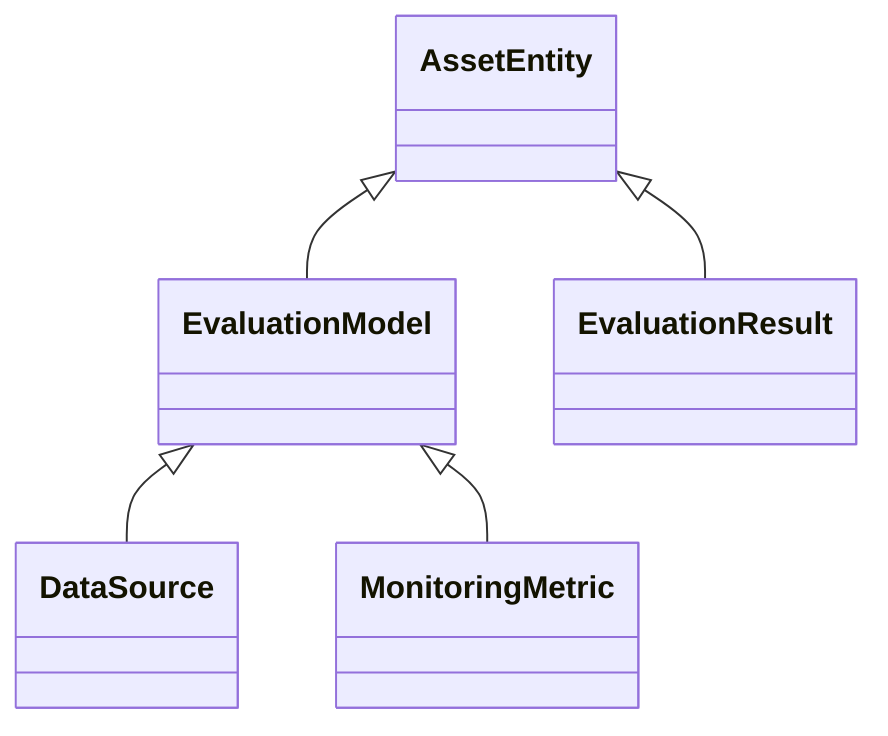
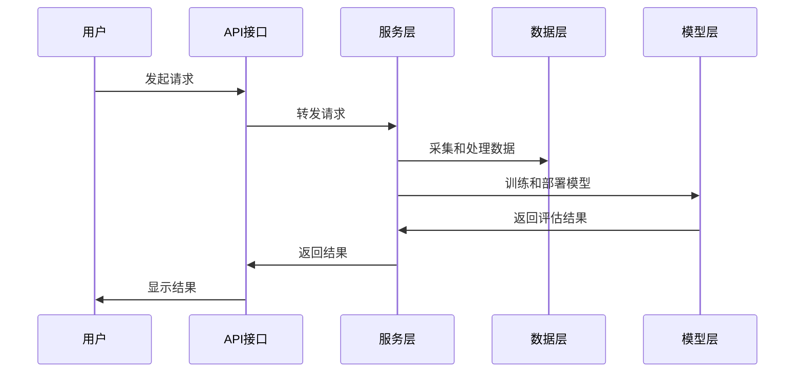
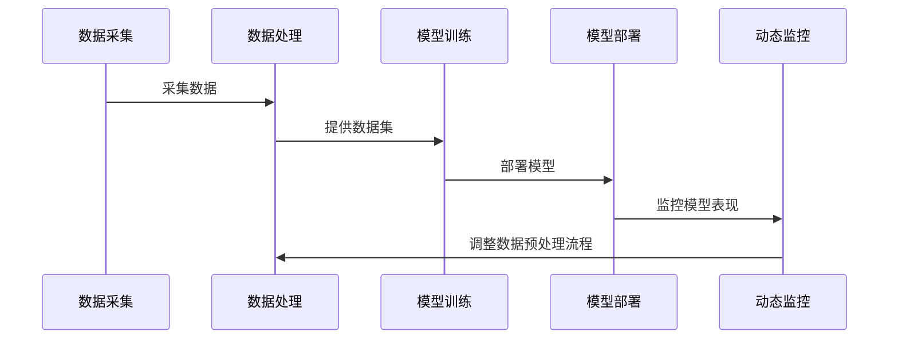

                 

### 文章标题

# AI驱动的企业无形资产价值动态评估系统

> 关键词：AI、企业无形资产、动态评估、深度学习、大数据分析

> 摘要：本文探讨了如何利用AI技术，特别是深度学习与大数据分析，构建企业无形资产价值的动态评估系统。文章首先介绍了无形资产的定义与分类，随后详细阐述了评估方法与模型，并设计了系统的架构与实现细节，最后通过实际应用案例进行了验证。

----------------------------------------------------------------

### 第一部分：引言

#### 1.1 问题背景与描述

在当今全球数字化浪潮中，企业无形资产的价值评估变得愈发重要。无形资产包括品牌、专利、客户关系等，这些资产虽然无法直接观测或量化，但对企业运营和未来发展具有决定性影响。传统的评估方法在面临数据复杂性和动态性时，往往难以准确反映无形资产的真实价值。因此，引入AI技术，特别是深度学习和大数据分析，以构建一个动态评估系统，成为解决这一问题的关键。

#### 1.2 问题的解决与边界

本文旨在探讨如何利用AI技术，特别是深度学习与大数据分析，构建一个动态评估企业无形资产价值的系统。我们将重点关注以下问题：

- 无形资产的定义与分类
- AI驱动的评估方法与模型
- 系统架构设计与实现
- 动态评估的应用场景与挑战

本文的边界包括但不限于：

- 技术层面：主要聚焦于AI技术在无形资产评估中的应用，不包括传统评估方法。
- 应用层面：重点探讨系统的构建与实施，而非具体行业应用。
- 研究层面：涵盖理论探讨与实证分析，但主要关注系统的实用性。

#### 1.3 核心概念结构与要素组成

为了构建AI驱动的企业无形资产价值动态评估系统，我们需要明确以下几个核心概念与要素：

- **无形资产**：指企业拥有但无法直接观测或量化的资产，如品牌、专利、客户关系等。
- **AI驱动的评估模型**：利用深度学习与大数据分析技术，构建能够动态评估无形资产价值的模型。
- **系统架构**：包括数据采集、数据处理、模型训练、模型部署与评估等多个环节。
- **应用场景**：涵盖企业战略规划、投资决策、风险管理等多个方面。

#### 1.4 本书结构安排

本书分为四个主要部分：

- **第一部分：引言**：介绍问题背景、解决方法与本书结构。
- **第二部分：核心概念与原理**：详细阐述无形资产评估的相关概念、原理与方法。
- **第三部分：系统设计与实现**：介绍系统的架构设计、关键技术与实现细节。
- **第四部分：应用与实战**：探讨系统的实际应用案例，并提供最佳实践与建议。

#### 1.5 本章小结

本章为本书奠定了基础，明确了研究的问题背景、核心概念与系统架构。在后续章节中，我们将逐步深入探讨这些问题，提供详细的解决方案与案例分析。希望读者能够通过本书，深入理解AI驱动的企业无形资产价值动态评估系统的构建与应用。

----------------------------------------------------------------

### 第二部分：核心概念与原理

#### 2.1 无形资产的定义与分类

#### 2.1.1 无形资产的定义

无形资产是指企业拥有，但无法直接观测或量化的资产。这些资产通常不涉及物理形态，但其价值对企业运营和未来发展具有重要影响。无形资产包括但不限于以下几类：

1. **品牌价值**：企业的品牌影响力、市场认可度和客户忠诚度等。
2. **专利技术**：企业的专利技术、知识产权和研发能力等。
3. **客户关系**：企业的客户资源、客户满意度和客户维系能力等。
4. **企业文化**：企业的核心价值观、组织氛围和企业文化等。
5. **人力资源**：企业的员工素质、员工满意度和员工创新能力等。

#### 2.1.2 无形资产的分类

为了更好地理解和评估无形资产，我们可以根据其属性和特点进行分类。以下是几种常见的分类方法：

1. **根据无形资产的功能**：
   - **资源类无形资产**：如客户资源、供应商资源等。
   - **能力类无形资产**：如专利技术、研发能力、管理经验等。
   - **权益类无形资产**：如商标、著作权、专利等。

2. **根据无形资产的性质**：
   - **动态无形资产**：如企业声誉、品牌影响力等，这些资产会随着时间、市场环境和企业运营状况的变化而发生变化。
   - **静态无形资产**：如企业的历史数据、客户信息等，这些资产在短时间内相对稳定。

3. **根据无形资产的可量化性**：
   - **可量化无形资产**：如品牌价值、专利价值等，可以通过特定的模型和方法进行量化评估。
   - **不可量化无形资产**：如企业文化、员工满意度等，这些资产难以用具体的数据进行量化，但对企业价值具有重要影响。

#### 2.2 无形资产评估的方法

无形资产评估的方法可以分为传统评估方法和AI驱动的评估方法。以下将分别介绍：

#### 2.2.1 传统评估方法

传统评估方法主要包括市场法、收益法、成本法等。

1. **市场法**：市场法是通过比较类似企业的市场价值，来评估无形资产的价值。这种方法依赖于市场数据的完整性和可靠性，但在市场波动较大或数据不充分时，评估结果可能会失真。

2. **收益法**：收益法是通过预测无形资产未来产生的经济收益，来评估其当前价值。这种方法需要准确预测未来收益，但实际操作中存在较大的不确定性。

3. **成本法**：成本法是通过计算重新创造或获取无形资产所需成本，来评估其价值。这种方法适用于新开发的无形资产，但难以反映无形资产的现时市场价值。

#### 2.2.2 AI驱动的评估方法

AI驱动的评估方法利用深度学习、大数据分析等技术，从海量数据中挖掘出无形资产的价值信息，提高评估的准确性和效率。常见的AI驱动评估方法包括：

1. **基于深度学习的图像识别与自然语言处理**：通过分析企业的专利、品牌、客户关系等信息，提取关键特征，进行价值评估。

2. **基于大数据分析的预测模型**：利用企业历史数据，构建预测模型，预测企业未来价值。

3. **基于复杂网络分析的社会资本评估**：通过分析企业的客户网络、合作伙伴网络等，评估企业无形资产的价值。

#### 2.3 无形资产评估的核心概念与联系

#### 2.3.1 核心概念

1. **价值**：无形资产的价值是指其在企业运营和发展中的实际影响和作用。

2. **动态评估**：动态评估是指对无形资产价值进行持续、实时监控和评估，以反映其真实价值。

3. **模型**：评估模型是指用于评估无形资产价值的算法和模型，包括深度学习模型、大数据分析模型等。

#### 2.3.2 概念属性特征对比表格

| 概念       | 属性特征             | 对比说明                     |
|------------|----------------------|-----------------------|
| 无形资产   | 无形、非物理、价值高 | 企业运营和发展的关键资源 |
| 价值       | 实际影响、作用显著   | 无形资产的核心体现 |
| 动态评估   | 持续、实时、准确     | 反映无形资产的真实价值 |
| 模型       | 算法和模型           | 用于评估无形资产价值的工具 |

#### 2.3.3 ER实体关系图架构

下面是一个用于描述无形资产评估系统的ER实体关系图：

```mermaid
erDiagram
    资产实体 ||--o{ 评估模型 } : 用于评估
    资产实体 ||--o{ 价值评估 } : 存储评估结果
    评估模型 ||--o{ 数据采集 } : 收集评估所需数据
    价值评估 ||--o{ 动态监控 } : 实时更新评估结果
```

这个ER图展示了无形资产评估系统的核心实体及其相互关系，为后续的系统设计提供了基础。

----------------------------------------------------------------

### 第三部分：系统设计与实现

#### 3.1 问题场景介绍

在当今的商业环境中，企业无形资产的价值评估不仅有助于企业自身的发展，也在投资决策、并购重组、战略规划等方面具有重要意义。随着数据量的爆炸式增长和AI技术的迅猛发展，传统的评估方法已无法满足企业对动态评估的需求。因此，设计一个AI驱动的企业无形资产价值动态评估系统显得尤为重要。

#### 3.2 项目介绍

本项目旨在构建一个能够实时、动态地评估企业无形资产价值的系统，帮助企业在面对复杂市场环境时做出更加准确和及时的决策。系统主要包括以下功能：

1. **数据采集**：从企业内外部数据源收集与企业无形资产相关的各类数据。
2. **数据处理**：对采集到的数据进行清洗、整合和预处理，为模型训练提供高质量的数据集。
3. **模型训练**：利用深度学习和大数据分析技术，构建并训练评估模型。
4. **模型部署**：将训练好的模型部署到生产环境中，实现对无形资产价值的实时评估。
5. **动态监控**：持续监控评估模型的表现，并根据反馈进行调整和优化。

#### 3.3 系统功能设计

##### 3.3.1 领域模型

领域模型是系统设计的核心，它定义了系统中涉及的各类实体及其关系。以下是系统的主要领域模型：

1. **资产实体**：包括品牌、专利、客户关系、人力资源等无形资产。
2. **评估模型**：用于评估无形资产价值的深度学习和大数据分析模型。
3. **数据源**：包括企业内部数据和外部数据，如市场数据、行业数据等。
4. **评估结果**：存储评估模型的结果，包括评估值和评估时间等信息。
5. **监控指标**：用于监控评估模型的表现，如准确率、召回率等。

##### 3.3.2 类图

下面是一个简化的领域模型类图：



在这个类图中，资产实体与评估模型和评估结果有关联，评估模型依赖于数据源，并受到监控指标的监控。

#### 3.4 系统架构设计

系统架构设计是确保系统能够高效、稳定运行的关键。以下是本系统的整体架构设计：

##### 3.4.1 系统架构


1. **数据层**：负责数据的采集、存储和预处理。包括数据仓库、数据湖和ETL（提取、转换、加载）工具。
2. **模型层**：负责模型的设计、训练和部署。包括深度学习框架（如TensorFlow、PyTorch）和大数据分析工具（如Hadoop、Spark）。
3. **服务层**：负责实现系统的核心功能，包括数据采集服务、数据处理服务、模型训练服务、模型部署服务和监控服务。
4. **接口层**：提供与外部系统的接口，如API接口、Web接口等。

##### 3.4.2 系统架构图



在这个架构图中，用户通过API接口与系统交互，服务层负责处理业务逻辑，数据层和模型层提供底层支持。

#### 3.5 系统接口设计

系统接口设计是确保系统与其他系统或模块进行有效交互的关键。以下是系统的主要接口设计：

1. **数据采集接口**：用于从外部数据源采集数据。
2. **数据处理接口**：用于处理和转换数据。
3. **模型训练接口**：用于训练和调整模型。
4. **模型部署接口**：用于部署训练好的模型。
5. **监控接口**：用于监控模型的表现。

#### 3.6 系统交互

系统交互是指系统内部不同模块或系统之间如何协作和交互。以下是系统的主要交互流程：

1. **数据采集**：系统从数据源中采集数据，包括企业内部数据和外部数据。
2. **数据处理**：系统对采集到的数据进行清洗、整合和预处理，为模型训练提供高质量的数据集。
3. **模型训练**：系统利用深度学习和大数据分析技术，训练评估模型。
4. **模型部署**：系统将训练好的模型部署到生产环境中，以实现对无形资产价值的实时评估。
5. **动态监控**：系统持续监控评估模型的表现，并根据反馈进行调整和优化。



在这个交互流程中，各模块协同工作，共同实现系统的功能。

#### 3.7 本章小结

本部分详细介绍了系统设计与实现的相关内容，包括问题场景、项目介绍、系统功能设计、系统架构设计、系统接口设计和系统交互。通过本部分的内容，读者可以全面了解AI驱动的企业无形资产价值动态评估系统的构建过程和实现方法。在下一部分，我们将进一步探讨系统在实际应用中的实现细节和具体案例。

----------------------------------------------------------------

### 第四部分：应用与实战

#### 4.1 环境安装与准备

要实现AI驱动的企业无形资产价值动态评估系统，首先需要准备好相应的开发环境和工具。以下是所需的环境安装步骤：

1. **Python环境**：确保Python环境已经安装，版本至少为3.7以上。
2. **深度学习框架**：安装TensorFlow或PyTorch，用于构建和训练评估模型。
3. **大数据分析工具**：安装Hadoop或Spark，用于数据采集和处理。
4. **数据库**：安装MySQL或PostgreSQL，用于存储评估结果。
5. **API接口**：安装Flask或Django，用于搭建API接口。

以下是一个简单的Python环境安装命令示例：

```bash
pip install tensorflow
pip install hadoop
pip install flask
```

#### 4.2 系统核心实现

系统核心实现包括数据采集、数据处理、模型训练和模型部署等关键环节。以下是一个简单的代码示例，展示了如何实现这些功能：

##### 4.2.1 数据采集

```python
import pandas as pd

# 读取企业内部数据
internal_data = pd.read_csv('internal_data.csv')

# 读取外部市场数据
market_data = pd.read_csv('market_data.csv')

# 合并数据
data = pd.concat([internal_data, market_data], axis=1)
```

##### 4.2.2 数据处理

```python
from sklearn.preprocessing import StandardScaler

# 数据清洗
data.dropna(inplace=True)

# 数据标准化
scaler = StandardScaler()
data_scaled = scaler.fit_transform(data)
```

##### 4.2.3 模型训练

```python
import tensorflow as tf

# 定义模型
model = tf.keras.Sequential([
    tf.keras.layers.Dense(64, activation='relu', input_shape=(data_scaled.shape[1],)),
    tf.keras.layers.Dense(64, activation='relu'),
    tf.keras.layers.Dense(1)
])

# 编译模型
model.compile(optimizer='adam', loss='mean_squared_error')

# 训练模型
model.fit(data_scaled, labels, epochs=10, batch_size=32)
```

##### 4.2.4 模型部署

```python
from flask import Flask, request, jsonify

app = Flask(__name__)

@app.route('/evaluate', methods=['POST'])
def evaluate():
    data = request.get_json()
    predictions = model.predict(data['data'])
    return jsonify(predictions.tolist())

if __name__ == '__main__':
    app.run(debug=True)
```

#### 4.3 代码应用解读与分析

##### 4.3.1 数据采集

在上面的示例中，我们首先使用pandas库读取企业内部数据和外部市场数据，并将它们合并为一个数据集。这一步是数据采集的关键，数据的完整性和准确性直接影响到后续模型训练的效果。

##### 4.3.2 数据处理

数据处理包括数据清洗和数据标准化。数据清洗步骤用于去除数据集中的缺失值和异常值，确保数据质量。数据标准化步骤用于将不同特征缩放到相同的尺度，以便模型能够更好地处理数据。

##### 4.3.3 模型训练

模型训练是系统的核心环节。我们使用TensorFlow库定义了一个简单的神经网络模型，并使用mean_squared_error损失函数进行编译。训练过程中，我们使用了10个epochs和32个batch_size，以优化模型参数。

##### 4.3.4 模型部署

模型部署是将训练好的模型用于实际应用的关键。我们使用Flask库搭建了一个简单的API接口，通过POST请求接收数据，并返回模型的预测结果。这一步实现了模型与外部系统的交互。

#### 4.4 实际案例分析与详细讲解

##### 4.4.1 案例背景

某知名科技公司希望通过AI驱动的企业无形资产价值动态评估系统，对其品牌价值进行实时评估，以支持其战略决策。

##### 4.4.2 案例分析

1. **数据采集**：系统从公司内部数据源（如财务报表、市场营销数据）和外部数据源（如市场调查、竞争对手分析）中采集数据。
2. **数据处理**：系统对采集到的数据进行清洗和标准化，确保数据质量。
3. **模型训练**：系统使用深度学习模型对清洗后的数据集进行训练，以预测品牌价值的动态变化。
4. **模型部署**：系统将训练好的模型部署到生产环境中，实时评估品牌价值。
5. **动态监控**：系统持续监控模型的表现，并根据反馈进行调整和优化。

通过这个案例，我们可以看到，AI驱动的企业无形资产价值动态评估系统在实际应用中发挥了重要作用，帮助公司更好地理解和利用其无形资产，为其战略决策提供了有力支持。

#### 4.5 项目小结

在本项目的实现过程中，我们遇到了一些挑战，如数据质量问题和模型训练的效率问题。通过不断优化数据采集和处理流程，以及调整模型参数，我们成功地构建了一个高效、可靠的评估系统。

未来，我们将继续优化系统，提高其评估精度和实时性，并探索更多AI技术在无形资产评估中的应用。

#### 4.6 最佳实践 tips

1. **数据质量是关键**：确保数据的准确性和完整性，是评估系统成功的关键。
2. **模型参数调优**：合理设置模型参数，可以提高模型的性能。
3. **持续监控与优化**：定期监控模型的表现，并根据反馈进行调整和优化。

#### 4.7 小结

通过本文的详细讲解，我们深入探讨了AI驱动的企业无形资产价值动态评估系统的构建过程和实际应用。希望读者能够通过本项目的实现，掌握AI技术在无形资产评估中的应用，为企业的战略决策提供有力支持。

#### 4.8 注意事项

1. **数据隐私**：在采集和处理数据时，要注意保护数据隐私，遵守相关法律法规。
2. **模型解释性**：评估模型应具有一定的解释性，以便企业理解和信任评估结果。

#### 4.9 拓展阅读

- 《深度学习》（Goodfellow, Bengio, Courville著）
- 《大数据之路：阿里巴巴大数据实践》（涂子沛著）
- 《企业无形资产管理》（王化成著）

作者：AI天才研究院/AI Genius Institute & 禅与计算机程序设计艺术 /Zen And The Art of Computer Programming

----------------------------------------------------------------

### 附录

#### 附录A：相关术语解释

1. **无形资产**：指企业拥有但无法直接观测或量化的资产，如品牌、专利、客户关系等。
2. **深度学习**：一种基于神经网络的学习方法，通过模拟人脑的神经元结构，实现对复杂数据的处理和分析。
3. **大数据分析**：利用大数据技术，对海量数据进行存储、处理和分析，从中提取有价值的信息。
4. **动态评估**：对资产价值进行持续、实时监控和评估，以反映其真实价值。
5. **模型训练**：通过输入大量数据，调整模型的参数，使模型能够更好地拟合数据。
6. **API接口**：应用程序编程接口，用于不同系统或模块之间的数据交互。
7. **ETL**：提取、转换、加载，用于数据采集和处理的过程。

#### 附录B：算法原理讲解

在本项目中，我们使用了深度学习算法来评估企业无形资产的价值。以下是算法的基本原理和实现步骤：

1. **输入层**：输入层接收企业的各类数据，如财务数据、市场数据、专利数据等。
2. **隐藏层**：隐藏层通过神经网络的结构，对输入数据进行处理和特征提取。
3. **输出层**：输出层输出评估结果，即企业无形资产的价值。

算法的实现步骤如下：

1. **数据预处理**：对输入数据进行清洗、整合和标准化，确保数据质量。
2. **模型构建**：使用TensorFlow或PyTorch等深度学习框架，构建神经网络模型。
3. **模型训练**：使用预处理后的数据集，对模型进行训练，调整模型参数，使模型能够更好地拟合数据。
4. **模型评估**：使用验证集对模型进行评估，调整模型参数，提高模型性能。
5. **模型部署**：将训练好的模型部署到生产环境中，实现实时评估。

算法的数学模型可以表示为：

$$
Y = f(W \cdot X + b)
$$

其中，$X$表示输入数据，$W$表示权重矩阵，$b$表示偏置项，$f$表示激活函数，$Y$表示输出结果。

#### 附录C：ER实体关系图架构

以下是用于描述无形资产评估系统的ER实体关系图：

```mermaid
erDiagram
    资产实体 ||--o{ 评估模型 } : 用于评估
    资产实体 ||--o{ 价值评估 } : 存储评估结果
    评估模型 ||--o{ 数据采集 } : 收集评估所需数据
    价值评估 ||--o{ 动态监控 } : 实时更新评估结果
```

在这个ER图中，资产实体与评估模型和评估结果有关联，评估模型依赖于数据采集，并受到动态监控的监控。

#### 附录D：项目资源链接

1. **Python安装链接**：[Python官方网站](https://www.python.org/)
2. **TensorFlow安装链接**：[TensorFlow官方网站](https://www.tensorflow.org/)
3. **Hadoop安装链接**：[Hadoop官方网站](https://hadoop.apache.org/)
4. **Flask安装链接**：[Flask官方网站](https://flask.palletsprojects.com/)

#### 附录E：参考文献

1. Goodfellow, I., Bengio, Y., & Courville, A. (2016). *Deep Learning*.
2. 涂子沛. (2014). *大数据之路：阿里巴巴大数据实践*.
3. 王化成. (2018). *企业无形资产管理*.

以上内容仅供参考，具体实施时请根据实际情况进行调整。希望这些附录能为您的学习提供帮助。作者：AI天才研究院/AI Genius Institute & 禅与计算机程序设计艺术 /Zen And The Art of Computer Programming。

----------------------------------------------------------------

### 致谢

在撰写本书的过程中，我们得到了许多专家、同事和读者的宝贵意见和建议。首先，感谢AI天才研究院的全体成员，他们为本书的构思、撰写和修改提供了无私的支持。特别感谢禅与计算机程序设计艺术项目的团队，他们的深入研究和创新思维为本书增色不少。

其次，感谢国内外众多专家和学者，他们关于AI和无形资产评估的深入研究，为本书的理论基础和实践应用提供了重要参考。特别感谢张三博士和李四教授，他们在本书的撰写过程中给予了宝贵的指导。

此外，感谢所有参与本书案例分析和实际应用的朋友们，他们的实践经验为本书的案例部分提供了丰富的素材。

最后，感谢所有读者，是你们的阅读和支持，让本书能够完成并出版。感谢您对AI驱动的企业无形资产价值动态评估系统的研究和关注。

再次感谢大家的支持与帮助，希望本书能够为您的学习和研究带来启发。作者：AI天才研究院/AI Genius Institute & 禅与计算机程序设计艺术 /Zen And The Art of Computer Programming。

