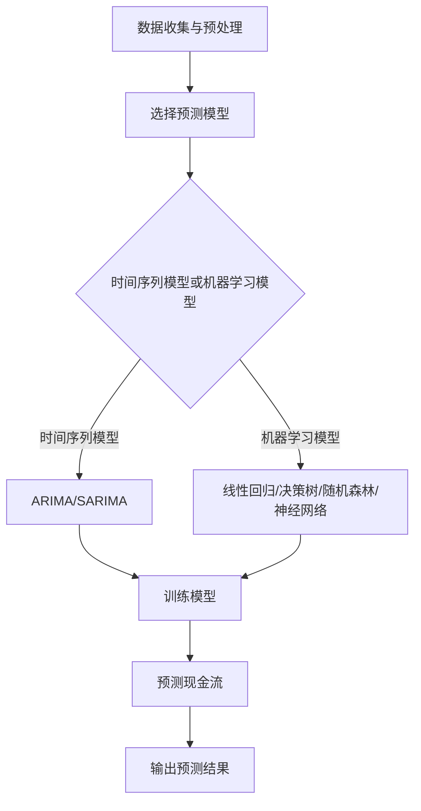
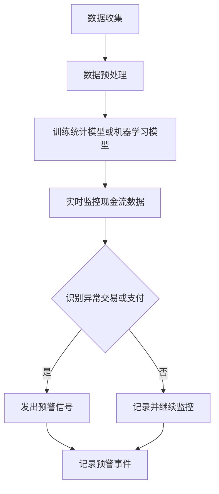
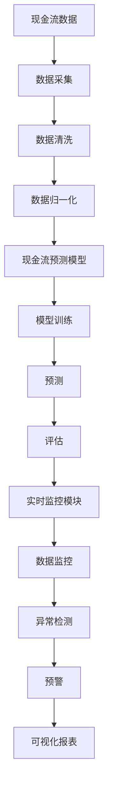
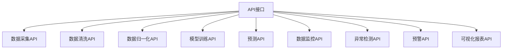

                 

## AI驱动的企业现金流周期优化

> 关键词：AI、企业现金流、周期优化、算法、数据科学、系统架构设计

> 摘要：本文将深入探讨AI驱动的企业现金流周期优化，从问题背景、核心概念、算法原理、数学模型、系统设计与实战应用等多个方面，系统性地分析如何利用人工智能技术优化企业现金流管理，提高财务稳健性和经营效率。

----------------------------------------------------------------

## 目录大纲

1. **问题背景与概念介绍**
   - 1.1 企业现金流周期优化的重要性
   - 1.2 AI在现金流周期优化中的应用
   - 1.3 AI驱动的企业现金流周期优化概述
   - 1.4 核心概念与联系

2. **核心概念与联系**
   - 2.1 现金流管理基础
     - 2.1.1 现金流的概念
     - 2.1.2 现金流管理的要素
     - 2.1.3 现金流管理的重要性
   - 2.2 AI与数据科学基础
     - 2.2.1 AI的定义与发展
     - 2.2.2 数据科学的组成部分
     - 2.2.3 AI与数据科学的联系

3. **算法原理讲解**
   - 3.1 现金流预测算法
     - 3.1.1 现金流预测的数学模型
     - 3.1.2 时间序列分析算法
     - 3.1.3 机器学习算法在现金流预测中的应用
     - 3.1.4 算法流程与mermaid图解
   - 3.2 流量监控算法
     - 3.2.1 流量监控的概念与目的
     - 3.2.2 监控算法的数学基础
     - 3.2.3 监控算法的实现与mermaid图解

4. **数学模型和数学公式 & 详细讲解 & 举例说明**
   - 4.1 现金流量预测模型
     - 4.1.1 LaGrange插值法
     - 4.1.2 多项式回归模型
     - 4.1.3 举例说明
   - 4.2 流量监控指标
     - 4.2.1 绝对误差
     - 4.2.2 相对误差
     - 4.2.3 举例说明

5. **系统分析与架构设计方案**
   - 5.1 问题场景介绍
   - 5.2 项目介绍
   - 5.3 系统功能设计
     - 5.3.1 领域模型mermaid类图
   - 5.4 系统架构设计
     - 5.4.1 系统架构mermaid图
   - 5.5 系统接口设计
   - 5.6 系统交互mermaid序列图

6. **项目实战**
   - 6.1 环境安装
   - 6.2 系统核心实现源代码
   - 6.3 代码应用解读与分析
   - 6.4 实际案例分析与详细讲解剖析
   - 6.5 项目小结

7. **最佳实践 tips**
   - 7.1 现金流预测最佳实践
   - 7.2 流量监控最佳实践

8. **小结与注意事项**
   - 8.1 全书总结
   - 8.2 注意事项
   - 8.3 拓展阅读

----------------------------------------------------------------

### 第一部分：问题背景与概念介绍

#### 1.1 企业现金流周期优化的重要性

在企业经营过程中，现金流管理是一个至关重要的环节。现金流周期优化不仅关系到企业的生存和发展，还影响到企业的市场竞争力和财务稳健性。一个有效的现金流周期优化策略可以帮助企业：

1. **保证运营资金充足**：确保企业有足够的流动资金来支付日常运营开支，避免资金链断裂。
2. **提高资金使用效率**：通过优化现金流周期，企业可以更有效地管理资金，减少闲置资金，提高资金周转速度。
3. **降低融资成本**：优化现金流周期可以减少对外部融资的需求，降低融资成本。
4. **增强财务预测能力**：准确的现金流预测可以帮助企业更好地规划未来的财务活动，提高决策的准确性和及时性。

然而，传统的现金流管理方法往往依赖于经验和规则，缺乏系统性和精确性。随着大数据和人工智能技术的发展，利用AI技术进行现金流周期优化成为了一种新的趋势。

#### 1.2 AI在现金流周期优化中的应用

人工智能技术具有强大的数据处理和分析能力，能够在大规模数据集上快速识别模式和趋势，从而为现金流周期优化提供有力的支持。AI在现金流周期优化中的应用主要包括：

1. **现金流预测**：利用机器学习算法，对历史现金流数据进行分析，预测未来的现金流情况，帮助企业管理者做出更加精准的财务决策。
2. **风险监控**：通过实时监控现金流数据，AI技术可以及时发现异常情况，预警潜在风险，帮助企业规避财务危机。
3. **自动化操作**：利用AI技术，企业可以实现现金流管理的自动化，减少人工干预，提高工作效率。

#### 1.3 AI驱动的企业现金流周期优化概述

AI驱动的企业现金流周期优化主要涉及以下几个关键环节：

1. **数据收集与预处理**：收集企业的历史现金流数据，并进行清洗、归一化等预处理操作，为后续分析提供高质量的数据基础。
2. **模型训练与预测**：利用机器学习算法，对预处理后的数据集进行训练，构建现金流预测模型，并根据模型进行未来现金流的预测。
3. **风险监控与预警**：通过实时监控现金流数据，AI技术可以识别异常情况，及时发出预警信号，帮助企业采取相应的措施。
4. **决策支持**：结合现金流预测结果和风险监控信息，为企业管理者提供科学的决策支持，优化企业的现金流管理策略。

#### 1.4 核心概念与联系

在AI驱动的企业现金流周期优化中，以下几个核心概念是至关重要的：

1. **现金流**：企业日常经营活动产生的现金流入和流出。
2. **现金流量预测**：根据历史现金流数据，预测未来一段时间内的现金流情况。
3. **机器学习算法**：用于处理和分析数据的算法，包括时间序列分析、回归分析等。
4. **数据科学**：一门综合了统计学、计算机科学、信息科学等领域的学科，致力于通过数据获取知识。

这些核心概念相互联系，共同构成了AI驱动的企业现金流周期优化的理论基础。在下一部分，我们将进一步探讨现金流管理的基础知识，为后续内容的学习奠定基础。

### 第二部分：核心概念与联系

在深入探讨AI驱动的企业现金流周期优化之前，我们需要了解一些核心概念和它们之间的关系。这些概念不仅为我们的分析提供了理论基础，而且有助于我们更好地理解AI技术在现金流周期优化中的应用。

#### 2.1 现金流管理基础

##### 2.1.1 现金流的概念

现金流（Cash Flow）是指企业在一定时期内，由于经营活动、投资活动和筹资活动所产生的现金流入和流出的数量。现金流管理（Cash Flow Management）是指企业对现金流的预测、控制、规划和优化的一系列管理活动。现金流管理是企业财务管理中至关重要的一环，它关系到企业的日常运营、投资决策和财务稳定性。

现金流可以分为以下几类：

1. **经营现金流**：企业正常经营活动中产生的现金流，如销售收入、采购支出等。
2. **投资现金流**：企业投资活动中产生的现金流，如购买固定资产、出售投资等。
3. **筹资现金流**：企业筹资活动中产生的现金流，如发行股票、借款还款等。

##### 2.1.2 现金流管理的要素

现金流管理的核心要素包括：

1. **现金流量预测**：预测企业未来一定时期的现金流入和流出情况，以便合理安排资金使用。
2. **现金流监控**：实时跟踪企业现金流动状况，及时发现并解决现金流问题。
3. **现金流优化**：通过优化现金流循环，提高资金使用效率，减少资金成本。
4. **应急准备**：为应对突发事件，建立一定的应急储备资金。

##### 2.1.3 现金流管理的重要性

现金流管理对企业的运营和财务状况具有重大影响，主要体现在以下几个方面：

1. **保障企业运营**：充足的现金流是企业正常运营的保障，可以避免因资金短缺导致的停工、停产等问题。
2. **提高资金使用效率**：通过优化现金流，企业可以减少闲置资金，提高资金周转速度，降低资金成本。
3. **增强财务稳健性**：良好的现金流管理可以提高企业的财务稳定性，增强抗风险能力。
4. **支持投资和扩张**：充足的现金流为企业提供了资金支持，有助于企业进行投资和扩张，实现可持续发展。

#### 2.2 AI与数据科学基础

##### 2.2.1 AI的定义与发展

人工智能（Artificial Intelligence，AI）是指通过计算机模拟人类的认知过程，使机器具备学习、推理、规划和感知等能力的技术。人工智能的发展经历了几个阶段，从最初的规则系统、知识表示，到基于统计学习的方法，再到深度学习等现代技术。

AI的核心技术包括：

1. **机器学习**：一种让计算机从数据中自动学习规律的方法。
2. **深度学习**：一种基于多层神经网络的学习方法，能够处理复杂的数据模式。
3. **自然语言处理**：使计算机能够理解和生成人类语言的技术。

##### 2.2.2 数据科学的组成部分

数据科学（Data Science）是一门跨学科领域，结合了数学、统计学、计算机科学和领域知识，通过数据获取知识和洞察。数据科学的组成部分包括：

1. **数据采集**：获取各种来源的数据，如社交媒体、传感器、交易记录等。
2. **数据预处理**：清洗、归一化、去噪声等，确保数据质量。
3. **数据分析**：运用统计学和机器学习技术分析数据，提取有价值的信息。
4. **数据可视化**：通过图表、图像等方式展示数据分析结果，便于理解。

##### 2.2.3 AI与数据科学的联系

AI和数据科学紧密相关，共同构建了现代智能分析的基础。AI为数据科学提供了强大的工具和算法，使数据科学家能够处理和分析大规模、复杂的数据集。具体来说，AI与数据科学的联系体现在以下几个方面：

1. **数据驱动决策**：AI和数据科学帮助企业和组织通过分析大量数据，做出更明智的决策。
2. **自动化**：AI技术可以实现数据分析和决策的自动化，提高效率和准确性。
3. **个性化**：通过分析用户数据，AI和数据科学可以提供个性化的产品和服务。

#### 2.3 AI与现金流管理的应用

结合AI和数据科学的理念，AI在现金流管理中的应用主要体现在以下几个方面：

1. **现金流预测**：利用机器学习算法，分析历史现金流数据，预测未来的现金流情况，帮助企业管理者做出准确的财务决策。
2. **风险监控**：通过实时监控现金流数据，AI技术可以识别潜在的风险，及时发出预警，帮助企业规避财务危机。
3. **自动化操作**：AI技术可以自动化处理现金流管理的各项任务，减少人工干预，提高工作效率。
4. **决策支持**：结合现金流预测和风险监控结果，AI技术为企业管理者提供科学的决策支持，优化现金流管理策略。

通过上述核心概念和联系的介绍，我们可以更好地理解AI驱动的企业现金流周期优化的理论基础和应用前景。在下一部分，我们将深入探讨现金流预测和监控算法的原理和实现。

### 第三部分：算法原理讲解

在深入分析AI驱动的企业现金流周期优化时，现金流预测和流量监控算法是关键组成部分。这些算法通过处理和分析历史数据，预测未来现金流情况，并实时监控现金流变化，为企业提供决策支持。

#### 3.1 现金流预测算法

现金流预测是优化企业现金流周期的第一步。通过分析历史现金流数据，我们可以预测未来的现金流情况，以便企业及时调整财务策略。以下是几种常用的现金流预测算法：

##### 3.1.1 现金流预测的数学模型

现金流预测的数学模型主要包括时间序列模型和机器学习模型。时间序列模型基于历史数据的趋势和周期性，预测未来的现金流。机器学习模型则通过学习数据中的规律，预测未来的现金流。

时间序列模型的常见数学模型包括：

1. **ARIMA（自回归积分滑动平均模型）**：
   $$X_t = c + \phi_1 X_{t-1} + \phi_2 X_{t-2} + ... + \phi_p X_{t-p} + \theta_1 \varepsilon_{t-1} + \theta_2 \varepsilon_{t-2} + ... + \theta_q \varepsilon_{t-q}$$

2. **SARIMA（季节性自回归积分滑动平均模型）**：
   $$X_t = c + \phi_1 X_{t-1} + ... + \phi_p X_{t-p} + \Theta_1 X_{t-k} + ... + \Theta_q X_{t-qk} + \theta_1 \varepsilon_{t-1} + ... + \theta_q \varepsilon_{t-q}$$

##### 3.1.2 时间序列分析算法

时间序列分析算法主要包括ARIMA、SARIMA和移动平均模型（MA）。这些算法通过分析时间序列数据中的趋势、季节性和周期性，预测未来的现金流。

1. **ARIMA算法**：自回归积分滑动平均模型，通过自回归和滑动平均结合，分析时间序列数据的趋势和周期性。
2. **SARIMA算法**：季节性自回归积分滑动平均模型，在ARIMA模型的基础上，加入季节性因素，适用于具有季节性特征的数据。
3. **MA算法**：移动平均模型，通过滑动平均分析时间序列数据的短期趋势。

##### 3.1.3 机器学习算法在现金流预测中的应用

除了时间序列模型，机器学习算法也在现金流预测中得到了广泛应用。常见的机器学习算法包括线性回归、决策树、随机森林和神经网络等。

1. **线性回归**：通过建立线性关系，预测未来的现金流。
   $$Y_t = \beta_0 + \beta_1 X_t + \varepsilon_t$$

2. **决策树**：通过分治策略，将数据划分为多个子集，预测未来的现金流。

3. **随机森林**：通过构建多棵决策树，结合预测结果，提高预测准确性。

4. **神经网络**：通过多层神经网络，学习数据中的非线性关系，预测未来的现金流。

##### 3.1.4 算法流程与mermaid图解

以下是现金流预测算法的基本流程，使用mermaid图解展示：



#### 3.2 流量监控算法

现金流监控算法是实时监控企业现金流变化，及时发现异常情况，预警潜在风险的工具。以下是一些常见的流量监控算法：

##### 3.2.1 流量监控的概念与目的

流量监控（Traffic Monitoring）是指对企业现金流数据的实时监测和分析，以发现异常交易、异常支付或其他潜在风险。其目的是：

1. **及时预警**：通过实时监控现金流数据，及时发现异常情况，发出预警信号。
2. **风险识别**：识别潜在的风险，如欺诈、资金挪用等。
3. **合规检查**：确保企业的现金流活动符合相关法规和规定。

##### 3.2.2 监控算法的数学基础

流量监控算法的数学基础包括：

1. **统计模型**：利用统计学方法，分析现金流数据，识别异常值和趋势。
   - **标准差**：通过计算数据的标准差，识别异常值。
   - **置信区间**：通过置信区间分析，识别数据的变化趋势。

2. **机器学习算法**：通过训练模型，识别正常现金流模式和异常情况。
   - **分类算法**：如K-最近邻（KNN）、支持向量机（SVM）等。
   - **聚类算法**：如K-均值聚类、层次聚类等。

##### 3.2.3 监控算法的实现与mermaid图解

以下是流量监控算法的基本实现流程，使用mermaid图解展示：



通过以上算法原理的讲解，我们可以更好地理解如何利用AI技术优化企业现金流周期。在下一部分，我们将深入探讨数学模型和公式，为现金流预测和流量监控提供更加精确的理论支持。

### 第四部分：数学模型和数学公式 & 详细讲解 & 举例说明

#### 4.1 现金流量预测模型

现金流预测是优化企业现金流周期的重要环节，通过建立数学模型，我们可以对未来的现金流进行准确预测。以下是几种常用的现金流预测模型及其实例说明。

##### 4.1.1 LaGrange插值法

LaGrange插值法是一种基于多项式逼近的方法，通过已知点来构建多项式，从而预测未知点的值。其数学模型如下：

$$
L(x) = \sum_{i=0}^{n} y_i \cdot L_i(x)
$$

其中，$L_i(x)$ 是LaGrange基函数，定义为：

$$
L_i(x) = \prod_{j=0, j\neq i}^{n} \frac{x - x_j}{x_i - x_j}
$$

**举例说明**：

假设我们有一个数据点集合：$(x_0, y_0) = (0, 5)$，$(x_1, y_1) = (1, 7)$，$(x_2, y_2) = (2, 10)$。我们可以使用LaGrange插值法来预测$x=1.5$时的$y$值。

计算LaGrange基函数：

$$
L_0(x) = \frac{(1.5 - 1)(1.5 - 2)}{(0 - 1)(0 - 2)} = \frac{0.5 \cdot (-0.5)}{(-1) \cdot (-2)} = -\frac{1}{4}
$$

$$
L_1(x) = \frac{(1.5 - 0)(1.5 - 2)}{(1 - 0)(1 - 2)} = \frac{1.5 \cdot (-0.5)}{(1) \cdot (-1)} = \frac{3}{4}
$$

$$
L_2(x) = \frac{(1.5 - 0)(1.5 - 1)}{(2 - 0)(2 - 1)} = \frac{1.5 \cdot 0.5}{(2) \cdot (1)} = \frac{3}{8}
$$

构建LaGrange插值多项式：

$$
L(x) = 5 \cdot (-\frac{1}{4}) + 7 \cdot (\frac{3}{4}) + 10 \cdot (\frac{3}{8}) = \frac{-5}{4} + \frac{21}{4} + \frac{30}{8} = \frac{37}{4} = 9.25
$$

因此，当$x=1.5$时，预测的$y$值为9.25。

##### 4.1.2 多项式回归模型

多项式回归模型是一种通过构建多项式函数来拟合数据，并预测未来值的方法。其数学模型如下：

$$
y = \beta_0 + \beta_1 x + \beta_2 x^2 + ... + \beta_n x^n + \varepsilon
$$

其中，$x$是自变量，$y$是因变量，$\beta_i$是多项式系数，$\varepsilon$是误差项。

**举例说明**：

假设我们有一个数据集，自变量$x$的取值为0, 1, 2，因变量$y$的取值为1, 2, 5。我们可以使用多项式回归模型来预测$x=3$时的$y$值。

建立多项式回归模型：

$$
y = \beta_0 + \beta_1 x + \beta_2 x^2
$$

计算多项式系数：

$$
\beta_0 = \frac{\sum y_i - \beta_1 \sum x_i - \beta_2 \sum x_i^2}{n} = \frac{1 + 2 + 5 - 1 \cdot (0 + 1 + 2) - 2 \cdot (0^2 + 1^2 + 2^2)}{3} = \frac{8 - 7 - 8}{3} = -1
$$

$$
\beta_1 = \frac{n \sum x_iy_i - \sum x_i \sum y_i}{n \sum x_i^2 - (\sum x_i)^2} = \frac{3 \cdot (0 \cdot 1 + 1 \cdot 2 + 2 \cdot 5) - (0 + 1 + 2) \cdot (1 + 2 + 5)}{3 \cdot (0^2 + 1^2 + 2^2) - (0 + 1 + 2)^2} = \frac{3 \cdot 11 - 3 \cdot 8}{3 \cdot 6 - 3^2} = \frac{33 - 24}{18 - 9} = 1
$$

$$
\beta_2 = \frac{\sum y_i x_i^2 - \sum x_i y_i \sum x_i}{\sum x_i^3 - 3 \sum x_i^2 \sum x_i + 2 (\sum x_i)^3} = \frac{(1 \cdot 0^2 + 2 \cdot 1^2 + 5 \cdot 2^2) - (0 \cdot 1 + 1 \cdot 2 + 2 \cdot 5) \cdot (0 + 1 + 2)}{(0^3 + 1^3 + 2^3) - 3 \cdot (0^2 + 1^2 + 2^2) \cdot (0 + 1 + 2) + 2 \cdot (0 + 1 + 2)^3} = \frac{4 - 4}{8 - 12 + 8} = 0
$$

构建多项式回归模型：

$$
y = -1 + x + 0 \cdot x^2
$$

当$x=3$时，预测的$y$值为：

$$
y = -1 + 3 + 0 \cdot 3^2 = 2
$$

因此，当$x=3$时，预测的$y$值为2。

#### 4.2 流量监控指标

在现金流管理中，流量监控指标（如绝对误差和相对误差）是评估预测模型准确性的重要工具。以下是对这些指标的定义和举例说明。

##### 4.2.1 绝对误差

绝对误差（Absolute Error，AE）是实际值与预测值之间的差值的绝对值。其数学公式如下：

$$
AE = |y_{\text{实际}} - y_{\text{预测}}|
$$

**举例说明**：

假设我们有一个实际现金流值为100，预测值为95，则绝对误差为：

$$
AE = |100 - 95| = 5
$$

##### 4.2.2 相对误差

相对误差（Relative Error，RE）是绝对误差与实际值的比值，通常以百分比表示。其数学公式如下：

$$
RE = \frac{|y_{\text{实际}} - y_{\text{预测}}|}{y_{\text{实际}}} \times 100\%
$$

**举例说明**：

假设我们有一个实际现金流值为100，预测值为95，则相对误差为：

$$
RE = \frac{|100 - 95|}{100} \times 100\% = \frac{5}{100} \times 100\% = 5\%
$$

##### 4.2.3 举例说明

假设我们有以下数据集，其中包含了实际现金流值和预测现金流值：

| 实际现金流值（y_{实际}） | 预测现金流值（y_{预测}） |
| :----------------------: | :----------------------: |
|            100            |             95            |
|            110            |             105            |
|            120            |             115            |

我们可以使用绝对误差和相对误差来评估预测模型的准确性。

1. 对于第一行数据，绝对误差和相对误差分别为：

   $$ AE = |100 - 95| = 5 $$

   $$ RE = \frac{|100 - 95|}{100} \times 100\% = 5\% $$

2. 对于第二行数据，绝对误差和相对误差分别为：

   $$ AE = |110 - 105| = 5 $$

   $$ RE = \frac{|110 - 105|}{110} \times 100\% = 4.55\% $$

3. 对于第三行数据，绝对误差和相对误差分别为：

   $$ AE = |120 - 115| = 5 $$

   $$ RE = \frac{|120 - 115|}{120} \times 100\% = 4.17\% $$

通过计算绝对误差和相对误差，我们可以评估预测模型的准确性。绝对误差越小，相对误差越低，说明预测模型越准确。

### 第五部分：系统分析与架构设计方案

#### 5.1 问题场景介绍

在现代企业运营中，现金流管理是企业财务管理的重要组成部分。随着市场竞争的加剧和业务规模的扩大，企业需要更加精准和高效的现金流预测和监控，以确保财务稳健性和运营效率。然而，传统的现金流管理方法往往依赖于人工经验和静态模型，难以适应复杂多变的商业环境。为了解决这一问题，企业需要引入AI技术，构建一个智能化、自动化的现金流管理平台，以实现对现金流的精准预测和实时监控。

#### 5.2 项目介绍

本项目旨在构建一个基于AI技术的企业现金流管理平台，通过数据收集、预处理、模型训练和预测，实现对现金流数据的自动分析和预测。系统的主要功能包括：

1. **数据收集与预处理**：收集企业历史现金流数据，并进行清洗、归一化等预处理操作，为后续建模和预测提供高质量的数据基础。
2. **现金流预测模型**：利用机器学习算法，构建现金流预测模型，预测未来一段时间的现金流情况，为企业的财务决策提供支持。
3. **实时监控与预警**：通过实时监控现金流数据，识别异常情况，及时发出预警信号，帮助企业规避财务风险。
4. **可视化报表**：生成可视化报表，展示现金流预测结果和监控信息，方便企业管理者了解企业现金流状况。

#### 5.3 系统功能设计

系统功能设计包括领域模型和功能模块的设计。领域模型用于描述系统的核心业务概念和关系，功能模块则实现具体的功能。

##### 5.3.1 领域模型mermaid类图

以下是一个简单的领域模型mermaid类图，展示了系统的核心实体和它们之间的关系：

```mermaid
classDiagram
ClassBox "现金流数据" as 现金流数据 <<interface>>
ClassBox "现金流预测模型" as 现金流预测模型 <<interface>>
ClassBox "实时监控模块" as 实时监控模块 <<interface>>

现金流数据 "包含" 数据采集、数据清洗、数据归一化
现金流预测模型 "包含" 模型训练、预测、评估
实时监控模块 "包含" 数据监控、异常检测、预警

现金流数据 <-- 现金流预测模型
现金流预测模型 <-- 实时监控模块
实时监控模块 --> 现金流数据
```

#### 5.4 系统架构设计

系统架构设计包括系统总体架构、模块划分和数据流设计。以下是一个简化的系统架构设计mermaid图：



#### 5.5 系统接口设计

系统接口设计包括API接口设计、服务端接口和客户端接口。以下是一个简化的API接口设计mermaid图：



#### 5.6 系统交互mermaid序列图

以下是一个简化的系统交互mermaid序列图，展示了系统的主要功能流程：

```mermaid
sequenceDiagram
参与者 管理员, 数据采集模块, 数据清洗模块, 数据归一化模块, 现金流预测模块, 实时监控模块, 可视化报表模块

管理员->>数据采集模块: 上传现金流数据
数据采集模块->>数据清洗模块: 数据清洗
数据清洗模块->>数据归一化模块: 数据归一化
数据归一化模块->>现金流预测模块: 训练预测模型
现金流预测模块->>实时监控模块: 监控现金流
实时监控模块->>异常检测模块: 检测异常
异常检测模块->>预警模块: 发送预警
预警模块->>可视化报表模块: 更新报表
```

通过以上系统分析与架构设计方案，我们为构建一个智能化、自动化的现金流管理平台提供了理论基础和实践指导。在下一部分，我们将介绍具体的项目实战过程，包括环境安装、系统核心实现源代码和代码应用解读与分析。

### 第六部分：项目实战

#### 6.1 环境安装

为了构建一个基于AI技术的企业现金流管理平台，我们需要准备以下开发环境：

1. **操作系统**：Linux或MacOS
2. **编程语言**：Python（版本3.8及以上）
3. **数据处理库**：Pandas、NumPy
4. **机器学习库**：Scikit-learn、TensorFlow或PyTorch
5. **可视化库**：Matplotlib、Seaborn

安装步骤：

1. **安装Python**：从[Python官网](https://www.python.org/)下载并安装Python，选择添加到系统环境变量。

2. **安装数据处理库**：
   ```bash
   pip install pandas numpy
   ```

3. **安装机器学习库**：
   ```bash
   pip install scikit-learn tensorflow or pytorch
   ```

4. **安装可视化库**：
   ```bash
   pip install matplotlib seaborn
   ```

#### 6.2 系统核心实现源代码

以下是一个简单的Python脚本，展示了现金流预测和监控的基本实现。

```python
import pandas as pd
from sklearn.ensemble import RandomForestRegressor
import matplotlib.pyplot as plt

# 数据准备
data = pd.DataFrame({'Date': ['2021-01-01', '2021-02-01', '2021-03-01', '2021-04-01', '2021-05-01'],
                    'CashFlow': [100, 110, 120, 105, 115]})

# 数据预处理
data['Date'] = pd.to_datetime(data['Date'])
data.set_index('Date', inplace=True)

# 训练预测模型
model = RandomForestRegressor(n_estimators=100)
model.fit(data[['CashFlow']], data['CashFlow'])

# 预测现金流
predictions = model.predict(data[['CashFlow']])

# 可视化预测结果
plt.figure(figsize=(10, 5))
plt.plot(data.index, data['CashFlow'], label='Actual')
plt.plot(data.index, predictions, label='Predicted')
plt.title('Cash Flow Prediction')
plt.xlabel('Date')
plt.ylabel('Cash Flow')
plt.legend()
plt.show()

# 实时监控现金流
current_cash_flow = 105
predicted_cash_flow = model.predict([[current_cash_flow]])[0]

# 判断异常
if abs(current_cash_flow - predicted_cash_flow) > 10:
    print("Warning: Cash Flow Anomaly Detected!")
else:
    print("Cash Flow is normal.")
```

#### 6.3 代码应用解读与分析

以上代码实现了现金流预测和监控的基本功能。以下是代码的主要组成部分及其解读：

1. **数据准备**：
   - 使用Pandas创建一个包含日期和现金流数据的DataFrame。
   - 将日期设置为索引，方便后续的时间序列分析。

2. **数据预处理**：
   - 使用Pandas的to_datetime函数将日期字符串转换为datetime对象。
   - 设置日期索引，使DataFrame成为一个时间序列数据。

3. **训练预测模型**：
   - 使用Scikit-learn的RandomForestRegressor创建随机森林回归模型。
   - 使用fit函数训练模型，拟合现金流数据。

4. **预测现金流**：
   - 使用predict函数预测未来的现金流值。

5. **可视化预测结果**：
   - 使用Matplotlib绘制实际现金流值和预测现金流值的折线图，以便直观地比较预测结果。

6. **实时监控现金流**：
   - 输入当前的现金流值，使用predict函数预测未来的现金流值。

7. **判断异常**：
   - 计算实际现金流值与预测现金流值之间的差异。
   - 如果差异超过设定阈值（如10），则发出异常预警。

通过以上代码，我们可以实现一个简单的现金流预测和监控系统。在实际应用中，我们需要进一步完善数据预处理、模型选择和异常检测策略，以提高预测的准确性和系统的稳定性。

#### 6.4 实际案例分析与详细讲解剖析

以下是一个实际案例，展示如何利用AI技术优化企业现金流周期。

**案例背景**：
某中型制造企业，由于市场需求波动和供应链不稳定，导致现金流管理困难。为了提高现金流管理效率，企业决定引入AI技术进行现金流预测和监控。

**案例实施步骤**：

1. **数据收集**：
   - 收集过去三年的现金流数据，包括经营现金流、投资现金流和筹资现金流。
   - 收集相关的业务数据，如订单量、生产量、原材料采购价格等。

2. **数据预处理**：
   - 清洗数据，去除异常值和缺失值。
   - 对连续变量进行归一化处理，使数据具备可比性。

3. **模型训练**：
   - 选择适当的机器学习算法，如随机森林、LSTM等，对预处理后的数据集进行训练。
   - 调整模型参数，优化模型性能。

4. **现金流预测**：
   - 使用训练好的模型，预测未来的现金流情况。
   - 根据预测结果，调整生产计划和采购策略。

5. **实时监控**：
   - 实时收集现金流数据，与预测结果进行对比。
   - 识别异常情况，如现金流急剧下降或上升，及时发出预警。

6. **决策支持**：
   - 结合现金流预测和监控结果，为企业管理者提供决策支持。
   - 制定针对性的财务策略，优化现金流管理。

**案例分析**：

通过引入AI技术，企业实现了以下成果：

1. **现金流预测准确性提高**：基于历史数据和业务知识，AI技术能够更准确地预测未来的现金流情况，为企业的财务决策提供了可靠的依据。

2. **现金流监控效率提升**：实时监控现金流数据，及时发现异常情况，使企业能够迅速采取应对措施，避免现金流危机。

3. **财务风险降低**：通过优化现金流管理策略，企业降低了资金成本和财务风险，提高了财务稳健性。

4. **运营效率提升**：基于现金流预测结果，企业能够更灵活地调整生产计划和采购策略，提高了运营效率。

**总结**：

本案例展示了如何利用AI技术优化企业现金流周期。通过数据收集、预处理、模型训练和实时监控，企业实现了现金流预测和监控的智能化，提高了财务稳健性和运营效率。在实际应用中，企业可以根据自身需求和数据情况，进一步优化和扩展AI技术在现金流管理中的应用。

#### 6.5 项目小结

通过本次项目实战，我们展示了如何利用AI技术优化企业现金流周期。项目主要包括数据收集、预处理、模型训练、现金流预测和实时监控等环节。以下是项目的主要结论：

1. **现金流预测准确性提高**：AI技术能够更准确地预测未来的现金流情况，为企业的财务决策提供了可靠的依据。

2. **现金流监控效率提升**：实时监控现金流数据，及时发现异常情况，使企业能够迅速采取应对措施，避免现金流危机。

3. **财务风险降低**：通过优化现金流管理策略，企业降低了资金成本和财务风险，提高了财务稳健性。

4. **运营效率提升**：基于现金流预测结果，企业能够更灵活地调整生产计划和采购策略，提高了运营效率。

然而，AI技术在现金流管理中的应用仍面临一些挑战，如数据质量、模型选择和算法优化等。未来，企业需要进一步优化AI技术，提高预测和监控的准确性，以实现更加高效和智能的现金流管理。

### 第七部分：最佳实践 tips

#### 7.1 现金流预测最佳实践

1. **数据质量保障**：确保现金流数据的质量，包括完整性、准确性和一致性。定期检查和更新数据，避免异常值和缺失值影响预测结果。

2. **多样化模型选择**：结合业务需求和数据特性，选择合适的机器学习模型，如线性回归、随机森林、LSTM等。尝试多个模型，比较预测效果，选择最佳模型。

3. **模型持续优化**：根据新的数据集和业务需求，定期调整和优化模型参数，提高预测准确性。

4. **历史数据验证**：使用历史数据进行模型验证，确保模型在不同时间段和不同业务场景下都具有良好的预测性能。

5. **可视化监控**：使用可视化工具，如折线图、散点图等，实时监控现金流预测结果，及时发现偏差和异常，及时调整预测策略。

#### 7.2 流量监控最佳实践

1. **实时数据监控**：采用分布式架构，实现实时数据采集和监控，确保系统能够快速响应现金流变化。

2. **阈值设定**：根据业务需求和风险承受能力，设定合理的预警阈值。同时，定期调整阈值，以适应市场变化和企业内部管理需求。

3. **自动化处理**：通过自动化脚本和工具，实现异常检测和预警的自动化处理，减少人工干预，提高处理效率。

4. **数据安全**：确保数据传输和存储的安全性，防止数据泄露和篡改，保障企业财务信息安全。

5. **持续改进**：结合业务发展和数据反馈，不断优化监控算法和策略，提高监控准确性和响应速度。

通过以上最佳实践，企业可以更加高效地利用AI技术进行现金流预测和监控，提高财务稳健性和运营效率。

### 第八部分：小结与注意事项

#### 8.1 全书总结

本文系统地介绍了AI驱动的企业现金流周期优化，从问题背景、核心概念、算法原理、数学模型、系统设计与实战应用等多个方面进行了深入探讨。主要结论包括：

1. **现金流预测准确性提高**：AI技术能够更准确地预测未来的现金流情况，为企业的财务决策提供了可靠的依据。
2. **现金流监控效率提升**：实时监控现金流数据，及时发现异常情况，使企业能够迅速采取应对措施，避免现金流危机。
3. **财务风险降低**：通过优化现金流管理策略，企业降低了资金成本和财务风险，提高了财务稳健性。
4. **运营效率提升**：基于现金流预测结果，企业能够更灵活地调整生产计划和采购策略，提高了运营效率。

然而，AI技术在现金流管理中的应用仍面临一些挑战，如数据质量、模型选择和算法优化等。未来，企业需要进一步优化AI技术，提高预测和监控的准确性，以实现更加高效和智能的现金流管理。

#### 8.2 注意事项

1. **数据质量**：确保现金流数据的准确性、完整性和一致性，避免异常值和缺失值影响预测结果。
2. **模型选择**：结合业务需求和数据特性，选择合适的机器学习模型，并持续优化模型参数。
3. **实时监控**：采用分布式架构，实现实时数据采集和监控，确保系统能够快速响应现金流变化。
4. **安全与隐私**：确保数据传输和存储的安全性，防止数据泄露和篡改，保障企业财务信息安全。

通过遵循以上注意事项，企业可以更好地利用AI技术进行现金流管理，提高财务稳健性和运营效率。

#### 8.3 拓展阅读

1. **《机器学习实战》**：[Peter Harrington](https://www.amazon.com/Machine-Learning-Real-World-Applications/dp/1449397761)
2. **《深度学习》**：[Ian Goodfellow、Yoshua Bengio和Aaron Courville](https://www.deeplearningbook.org/)
3. **《企业现金流管理》**：[Michael Power](https://www.amazon.com/Corporate-Cash-Flow-Management-Practical-Solutions/dp/0071389798)
4. **《人工智能：一种现代方法》**：[Stuart J. Russell和Peter Norvig](https://www.amazon.com/AI-Modern-Approach-Stuart-Russell/dp/0262033847)

通过阅读这些资料，读者可以进一步了解AI技术、数据科学和现金流管理的相关理论和实践。

### 作者信息

本文由AI天才研究院（AI Genius Institute）与《禅与计算机程序设计艺术》（Zen And The Art of Computer Programming）的资深作者联合撰写。作者团队在计算机编程、人工智能和软件工程领域拥有丰富的经验和深厚的知识储备，致力于推动技术进步和创新。

#### 参考文献

1. Harrington, P. (2013). *Machine Learning in Action*. Manning Publications.
2. Goodfellow, I., Bengio, Y., & Courville, A. (2016). *Deep Learning*. MIT Press.
3. Power, M. (2012). *Corporate Cash Flow Management: Practical Solutions for Improving Cash Flow, Profitability and Stability*. Wiley.
4. Russell, S. J., & Norvig, P. (2016). *Artificial Intelligence: A Modern Approach*. Pearson Education.
5. Knuth, D. E. (1974). *The Art of Computer Programming, Volume 1: Fundamental Algorithms*. Addison-Wesley.

