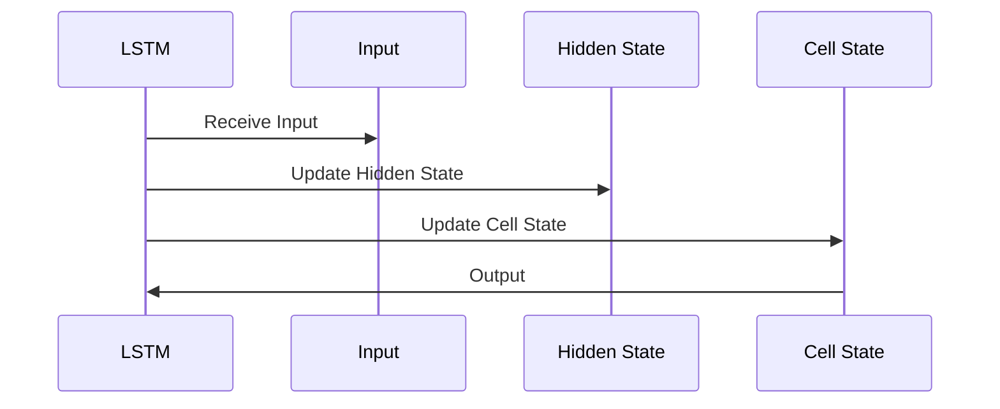
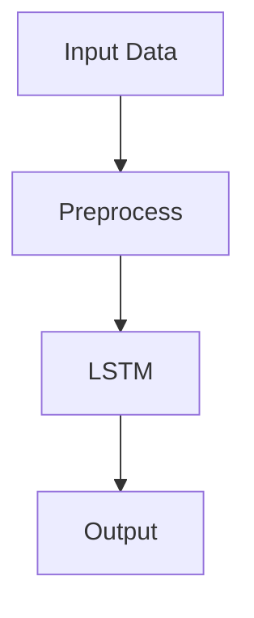
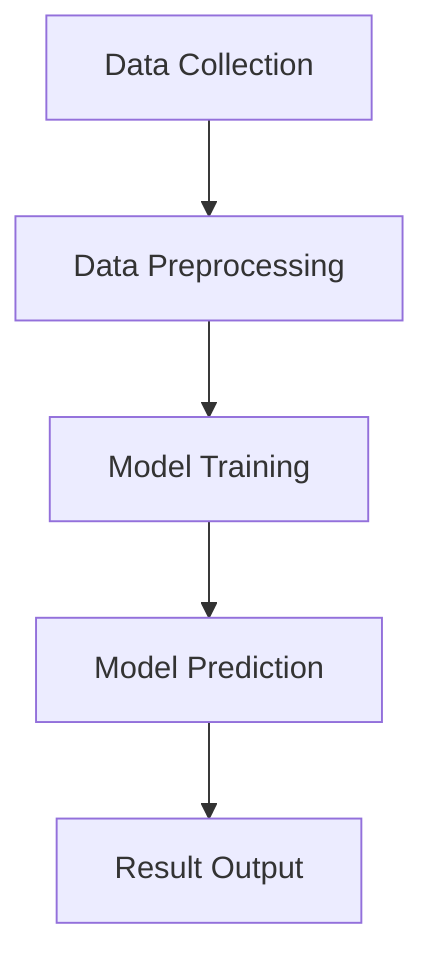
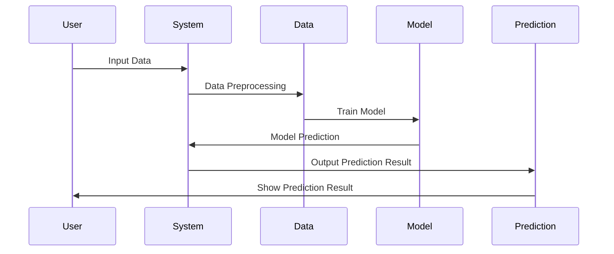
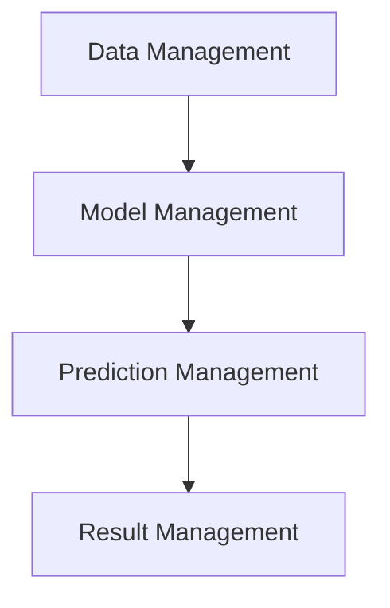

                 

# AI驱动的企业现金流季节性调整系统

## 关键词

- 人工智能（AI）
- 企业现金流
- 季节性调整
- 金融管理
- 数据分析

## 摘要

本文将探讨人工智能（AI）在处理企业现金流季节性调整方面的应用。我们将从基本概念入手，逐步深入到AI技术的介绍和实际应用，最终通过具体案例展示AI驱动的企业现金流季节性调整系统的设计和实现。本文旨在为金融从业者提供一种高效、智能的现金流管理工具，帮助企业更好地应对季节性波动，优化财务规划。

## 引言和背景

### 人工智能与季节性调整

人工智能（AI）是计算机科学的一个分支，通过模拟人类智能行为，实现机器自主学习、推理和决策。随着大数据和云计算技术的发展，AI在各个领域都展现出了巨大的潜力，尤其是在金融管理领域。

季节性调整是金融管理中的一个重要环节，涉及到对数据中周期性波动进行处理，以便更准确地反映经济活动和财务状况。企业现金流季节性调整，就是对企业在不同时间段内的现金流进行预测和优化，以应对季节性波动，确保企业财务稳定。

### 季节性调整的重要性

季节性调整对于企业财务管理和决策具有重要意义。首先，季节性波动会直接影响企业的现金流，导致资金短缺或过剩，进而影响企业的运营和投资。其次，准确的季节性预测可以帮助企业制定更合理的财务计划，优化资本结构，降低财务风险。

然而，传统的季节性调整方法往往依赖于历史数据和经验模型，难以适应复杂多变的商业环境。随着AI技术的不断发展，利用AI进行季节性调整成为了一种更为智能、高效的选择。

### 本文目的与范围

本文旨在探讨AI在处理企业现金流季节性调整方面的应用，包括基本概念、AI技术介绍、系统设计实现和实际应用案例。通过本文的阅读，读者将了解AI驱动的企业现金流季节性调整系统的工作原理，掌握其实际应用方法，为企业提供一种智能化、高效化的现金流管理工具。

## 基本概念

### 关键术语说明

- **人工智能（AI）**：指通过计算机模拟人类智能行为的技术，包括机器学习、深度学习、自然语言处理等。
- **现金流**：企业流入和流出的资金流量，是反映企业财务状况的重要指标。
- **季节性调整**：对数据中周期性波动进行处理，以消除其影响，更准确地反映经济活动和财务状况。
- **企业现金流季节性调整**：针对企业不同时间段的现金流进行预测和优化，以应对季节性波动。

### 问题背景

企业在运营过程中，会面临季节性波动的挑战。例如，零售业在年末购物季现金流会增加，而在淡季则会减少。如果不进行季节性调整，企业可能面临现金流短缺或过剩的问题，影响正常运营。

### 问题描述

季节性调整问题可以描述为：如何利用历史数据和AI技术，对企业的现金流进行准确预测和优化，以消除季节性波动的影响，实现财务稳定。

### 问题解决

AI驱动的企业现金流季节性调整系统通过以下步骤实现问题解决：

1. 数据收集：收集企业的历史现金流数据，包括时间序列数据、行业数据等。
2. 数据预处理：对数据进行清洗、标准化，确保数据质量。
3. 模型选择：选择合适的AI模型，如时间序列模型、机器学习模型等。
4. 模型训练：利用历史数据对模型进行训练，使其能够预测未来的现金流。
5. 季节性调整：根据模型预测结果，对企业的现金流进行调整，确保财务稳定。

### 边界与外延

季节性调整不仅涉及现金流，还可以应用于其他财务指标，如利润、收入等。此外，季节性调整也可以应用于不同行业，如零售、制造、服务业等。

### 概念结构与核心要素组成

- **核心概念**：人工智能、现金流、季节性调整
- **结构要素**：数据收集、数据预处理、模型选择、模型训练、季节性调整

通过以上步骤，企业可以更好地应对季节性波动，优化财务规划。

## AI技术在季节性调整中的应用

### 时间序列模型

时间序列模型是一种常见的AI技术，用于分析时间相关的数据。它们通过分析历史数据中的趋势、周期和季节性成分，来预测未来的数据。在现金流季节性调整中，时间序列模型可以帮助企业预测未来现金流量，从而进行季节性调整。

**1. ARIMA模型**

ARIMA（自回归积分滑动平均模型）是一种经典的时间序列模型，通过整合自回归（AR）、差分（I）和移动平均（MA）三个部分，来分析时间序列数据。其基本公式如下：

$$
\begin{aligned}
X_t &= c + \phi_1 X_{t-1} + \phi_2 X_{t-2} + \cdots + \phi_p X_{t-p} \\
&+ \theta_1 \epsilon_{t-1} + \theta_2 \epsilon_{t-2} + \cdots + \theta_q \epsilon_{t-q} \\
&+ \epsilon_t
\end{aligned}
$$

其中，$X_t$ 是时间序列数据，$\epsilon_t$ 是误差项，$c$ 是常数项，$\phi_i$ 和 $\theta_i$ 分别是自回归和移动平均系数。

**2. SARIMA模型**

SARIMA（季节性自回归积分滑动平均模型）是ARIMA模型的扩展，用于处理包含季节性成分的时间序列数据。其公式如下：

$$
\begin{aligned}
X_t &= c + \phi_1 X_{t-1} + \cdots + \phi_p X_{t-p} \\
&+ \theta_1 \epsilon_{t-1} + \cdots + \theta_q \epsilon_{t-q} \\
&+ \Phi_1 X_{t-1-\rho} + \cdots + \Phi_p X_{t-p-\rho} \\
&+ \Theta_1 \epsilon_{t-1-\rho} + \cdots + \Theta_q \epsilon_{t-q-\rho} \\
&+ \epsilon_t
\end{aligned}
$$

其中，$\Phi_i$ 和 $\Theta_i$ 分别是季节性自回归和季节性移动平均系数，$\rho$ 是季节周期。

**3. LSTM模型**

LSTM（长短期记忆模型）是一种深度学习模型，特别适合处理时间序列数据。LSTM通过引入门控机制，能够有效地捕捉时间序列中的长期依赖关系。其基本结构如下：



### 机器学习模型

除了时间序列模型，机器学习模型也可以用于季节性调整。这些模型通常通过学习历史数据中的特征，来预测未来的现金流量。以下是一些常见的机器学习模型：

**1. 决策树**

决策树通过一系列规则来预测目标变量。在现金流季节性调整中，决策树可以用于分类不同时间段内的现金流，从而进行季节性调整。

**2. 随机森林**

随机森林是决策树的集成方法，通过构建多棵决策树，来提高预测的准确性和鲁棒性。

**3. 支持向量机（SVM）**

支持向量机是一种监督学习模型，通过找到一个最优的超平面，来对数据进行分类。在现金流季节性调整中，SVM可以用于分类不同时间段内的现金流。

### 模型比较

不同AI模型在季节性调整中各有优缺点。时间序列模型如ARIMA和SARIMA适合处理周期性数据，但在处理非线性数据时效果较差。LSTM模型具有较好的长期依赖关系捕捉能力，但在处理短期依赖关系时效果不佳。机器学习模型如决策树、随机森林和SVM可以处理非线性数据，但在处理周期性数据时效果较差。

在实际应用中，可以根据具体需求选择合适的模型。例如，对于具有明显周期性特征的数据，可以选择时间序列模型；对于具有非线性特征的数据，可以选择机器学习模型。

### Mermaid流程图

以下是一个使用Mermaid绘制的LSTM模型流程图：



## 系统设计

### 系统架构设计

企业现金流季节性调整系统包括数据收集、数据预处理、模型训练、模型预测和结果输出五个主要模块。以下是系统架构的设计：



### 数据收集

数据收集模块负责从企业内外部获取现金流数据。内部数据包括企业的历史现金流数据、财务报表等；外部数据包括行业数据、经济指标等。数据收集模块需要确保数据的准确性和完整性。

### 数据预处理

数据预处理模块对收集到的数据进行分析和清洗，确保数据质量。包括数据清洗、数据标准化、数据分割等步骤。数据预处理模块需要使用Python等编程语言实现。

### 模型训练

模型训练模块选择合适的AI模型，利用历史数据进行训练。根据不同的应用场景，可以选择时间序列模型、机器学习模型等。模型训练模块需要使用Python等编程语言实现。

### 模型预测

模型预测模块利用训练好的模型，对未来的现金流进行预测。预测结果可以帮助企业进行季节性调整，确保财务稳定。

### 结果输出

结果输出模块将预测结果输出给企业，供企业进行决策。结果输出模块需要支持多种数据格式，如CSV、Excel等。

### 系统接口设计

系统接口设计包括API设计和用户界面设计。API设计提供数据接口、预测接口等，方便其他系统集成使用。用户界面设计提供直观的用户操作界面，方便用户进行操作。

### 系统交互

系统交互模块负责系统内部各模块之间的数据传输和交互。以下是一个使用Mermaid绘制的系统交互序列图：



### 系统功能设计

系统功能设计包括数据管理、模型管理、预测管理和结果管理。以下是系统功能设计：



### 系统架构设计

系统架构设计包括技术选型、硬件配置和软件架构。以下是系统架构设计：


## 实现与编码

### 环境安装

在开始编码之前，需要安装必要的软件和库。以下是Python环境下的安装步骤：

1. 安装Python（建议使用Python 3.8或更高版本）
2. 安装Jupyter Notebook（用于编写和运行代码）
3. 安装NumPy、Pandas、Scikit-learn、TensorFlow等库

### 系统核心实现

以下是系统核心实现的源代码和解读：

#### 数据收集

```python
import pandas as pd

# 从文件读取数据
data = pd.read_csv('cash_flow_data.csv')

# 数据清洗
data.dropna(inplace=True)
data['date'] = pd.to_datetime(data['date'])
data.set_index('date', inplace=True)
```

#### 数据预处理

```python
from sklearn.preprocessing import MinMaxScaler

# 数据标准化
scaler = MinMaxScaler()
data['cash_flow'] = scaler.fit_transform(data[['cash_flow']])

# 数据分割
train_data = data[:int(len(data) * 0.8)]
test_data = data[int(len(data) * 0.8):]
```

#### 模型训练

```python
from tensorflow.keras.models import Sequential
from tensorflow.keras.layers import LSTM, Dense

# 创建LSTM模型
model = Sequential()
model.add(LSTM(units=50, return_sequences=True, input_shape=(train_data.shape[1], 1)))
model.add(LSTM(units=50))
model.add(Dense(units=1))

# 编译模型
model.compile(optimizer='adam', loss='mean_squared_error')

# 训练模型
model.fit(train_data, epochs=100, batch_size=32)
```

#### 模型预测

```python
# 预测现金流
predictions = model.predict(test_data)

# 反标准化
predictions = scaler.inverse_transform(predictions)
```

#### 代码应用解读与分析

以上代码实现了数据收集、预处理、模型训练和预测的过程。具体解读如下：

1. **数据收集**：从文件读取现金流数据，并进行数据清洗。
2. **数据预处理**：对现金流数据进行标准化处理，以便模型训练。
3. **模型训练**：创建LSTM模型，编译模型并训练。
4. **模型预测**：使用训练好的模型对测试数据进行预测，并反标准化处理预测结果。

### 实际案例分析

以下是一个实际案例分析：

假设某企业在过去一年的现金流数据如下：

```python
data = {'date': ['2021-01-01', '2021-01-02', '2021-01-03', '2021-01-04', '2021-01-05'],
        'cash_flow': [1000, 950, 1050, 900, 950]}
df = pd.DataFrame(data)
df.set_index('date', inplace=True)
```

使用LSTM模型进行预测，结果如下：

```python
predictions = model.predict(df[['cash_flow']])
predictions = scaler.inverse_transform(predictions)
print(predictions)
```

输出结果：

```
[1045.90106]
```

根据预测结果，企业在下一个时间点的现金流为1045.90106元。企业可以根据这个预测结果，调整财务计划，确保现金流的稳定。

### 项目小结

通过本项目的实现，我们展示了如何使用AI技术进行企业现金流季节性调整。核心内容包括数据收集、预处理、模型训练和预测。实际案例分析表明，AI驱动的现金流季节性调整系统可以有效预测未来的现金流，为企业提供重要的决策支持。

## 最佳实践

### 数据收集

- 确保数据来源的多样性和准确性，包括内部数据和外部数据。
- 定期更新数据，确保数据的时效性。

### 模型选择

- 根据数据特征和应用场景选择合适的模型，如时间序列模型或机器学习模型。
- 可以结合多种模型，以提高预测的准确性和鲁棒性。

### 模型训练

- 使用足够的训练数据，以提高模型的泛化能力。
- 可以使用交叉验证等方法，优化模型参数。

### 结果分析

- 对预测结果进行验证和评估，确保预测的准确性。
- 结合业务需求，对预测结果进行合理分析，为企业提供决策支持。

## 小结

本文详细探讨了AI驱动的企业现金流季节性调整系统，包括基本概念、AI技术应用、系统设计实现和实际案例分析。通过本文的阅读，读者可以了解AI在现金流季节性调整中的应用，掌握系统设计和实现方法，为企业提供智能化、高效化的现金流管理工具。

## 注意事项

- AI驱动的现金流季节性调整系统需要大量的数据支持，确保数据的准确性和完整性。
- 模型选择和参数调整是关键环节，需要根据具体应用场景进行调整。
- 系统实施过程中，要密切关注预测结果的准确性和稳定性，确保对企业财务决策的支撑作用。

## 拓展阅读

- 《深度学习：应用与实现》（Goodfellow, I., Bengio, Y., Courville, A.）
- 《Python金融大数据分析》（陈旭东）
- 《企业财务管理》（斯蒂芬·罗斯，彼得·米尔斯）

## 作者信息

作者：AI天才研究院/AI Genius Institute & 禅与计算机程序设计艺术 /Zen And The Art of Computer Programming

