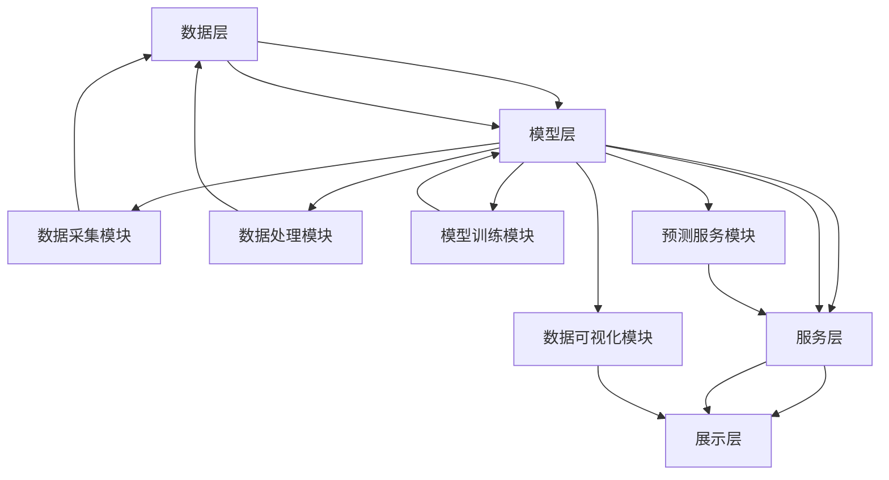
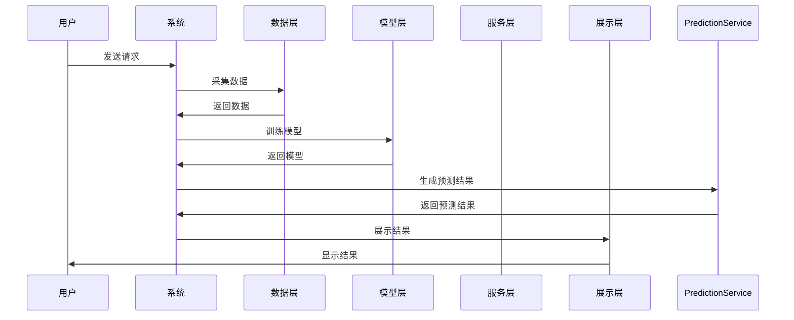
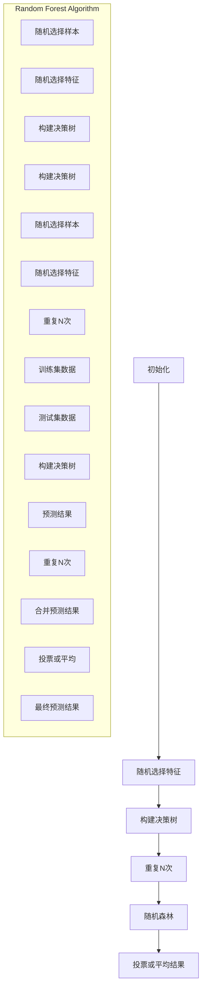
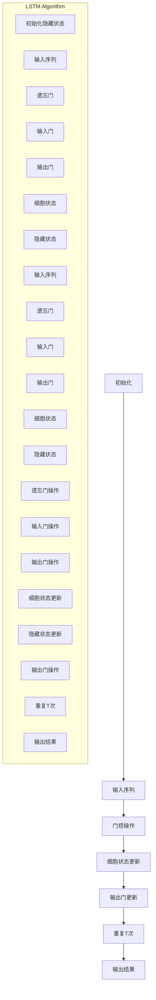
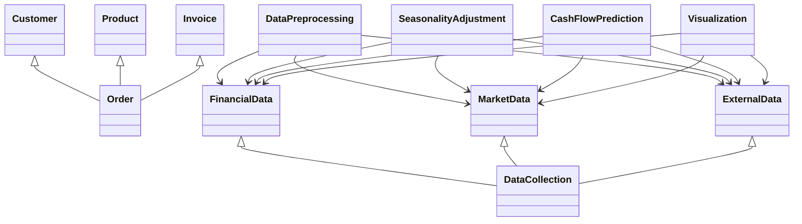
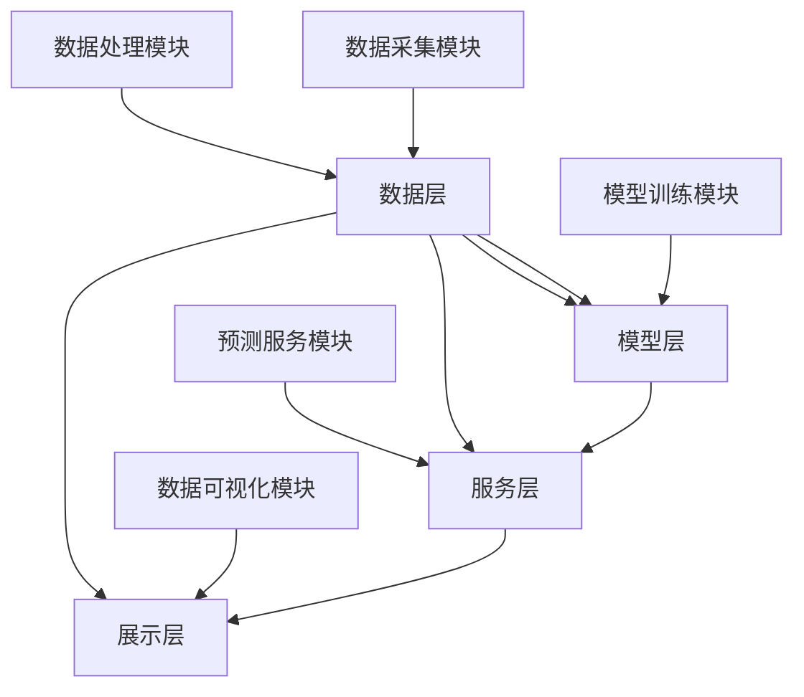
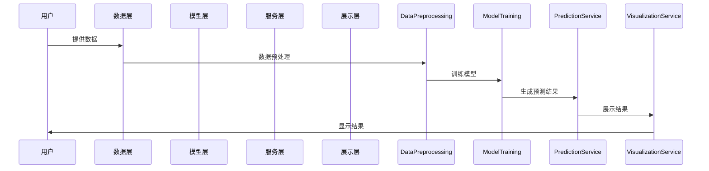

                 

**文章标题：AI驱动的企业现金流季节性调整系统**

**关键词：AI，企业现金流，季节性调整，系统设计，Python，数学模型**

**摘要：本文将探讨如何利用人工智能技术来构建一个能够帮助企业调整现金流季节性的系统。我们将介绍核心概念、系统设计、实现方法、实战案例以及最佳实践。通过本文的阅读，读者将了解如何利用AI技术提升企业的现金流管理效率。**

# 引言与背景

在当今快速变化的商业环境中，企业面临着各种不确定性和挑战。其中之一就是现金流的季节性波动。现金流季节性指的是企业收入和支出在一年中的某些时段内出现的周期性波动。这种波动可能导致企业在特定时期面临现金短缺或过剩的情况，影响其正常运营和财务健康。

现金流季节性调整的重要性在于，它能够帮助企业更好地预测和规划现金流，减少因季节性波动导致的财务风险。通过调整季节性影响，企业可以优化资金流动，提高资金使用效率，从而实现长期稳健的发展。

传统的现金流季节性调整方法主要依赖于历史数据和统计分析。然而，这种方法存在局限性，难以应对复杂和动态的商业环境。随着人工智能技术的快速发展，利用AI技术进行季节性调整成为一种新兴且有效的解决方案。

本文旨在介绍如何利用AI技术构建一个企业现金流季节性调整系统。我们将详细探讨AI技术在该领域的应用，系统设计原则，实现方法和实际案例。通过本文的阅读，读者将了解如何利用AI技术提升企业的现金流管理能力，实现更高效、更精确的现金流预测和调整。

## 基本概念

### 人工智能（AI）

人工智能（Artificial Intelligence，简称AI）是指通过计算机系统模拟人类智能行为的技术。AI技术涵盖了多个领域，包括机器学习、深度学习、自然语言处理、计算机视觉等。AI的核心目标是通过学习和推理，使计算机系统能够在特定任务上表现出与人类相似的能力。

在本文中，我们将重点关注机器学习和深度学习技术，因为这些技术在处理季节性数据和分析方面具有显著优势。

### 企业现金流

企业现金流是指企业在日常运营过程中产生的现金流入和流出。现金流是企业生存和发展的基础，对于企业的运营决策和财务健康至关重要。企业现金流包括经营现金流、投资现金流和筹资现金流三个部分。

经营现金流是企业通过日常业务活动产生的现金流入和流出，如销售收入、采购支出、员工工资等。投资现金流涉及企业的投资活动，如购买或出售固定资产、投资其他公司等。筹资现金流则与企业的融资活动相关，包括借款、偿还债务、发行股票等。

### 季节性调整

季节性调整是指通过识别和消除数据中的周期性波动，以便更好地理解数据趋势和变化。在现金流管理中，季节性调整的目标是识别出因季节性因素（如节假日、季节性销售高峰等）导致的现金流波动，并将其从实际数据中分离出来，以便更准确地预测和规划现金流。

季节性调整的基本步骤包括数据收集、数据预处理、周期性波动识别和调整、结果验证等。

### AI在季节性调整中的应用

AI技术为季节性调整提供了新的方法和工具。首先，机器学习和深度学习算法可以通过分析大量历史数据，识别出季节性模式和趋势。其次，这些算法可以自动调整和预测未来现金流，减少人为干预和误差。此外，AI技术还可以帮助企业快速适应市场变化，实时调整现金流计划，从而提高应对不确定性的能力。

通过AI驱动的季节性调整系统，企业可以实现以下目标：

1. 准确预测未来现金流：AI算法可以分析大量历史数据，识别出季节性模式和趋势，从而更准确地预测未来现金流。
2. 优化现金流管理：通过自动调整现金流计划，企业可以优化资金流动，提高资金使用效率，减少现金短缺或过剩的风险。
3. 提高决策效率：AI技术可以帮助企业快速适应市场变化，实时调整现金流计划，从而提高决策效率。

总之，AI技术在企业现金流季节性调整中的应用具有重要意义，可以帮助企业更好地应对市场变化，实现可持续的财务健康。

## AI技术用于季节性调整

在探讨如何使用AI技术进行企业现金流季节性调整时，我们需要了解几种主要的AI技术，包括机器学习、深度学习和时间序列分析。这些技术各自具有独特的优势和局限性，适用于不同类型的季节性调整任务。

### 机器学习

机器学习是一种通过数据训练模型，使其能够自动识别模式和预测结果的技术。在季节性调整中，机器学习可以通过以下方式发挥作用：

1. **回归分析**：回归分析是机器学习的一种基本形式，用于建立变量之间的关系模型。在现金流季节性调整中，回归分析可以用于预测未来现金流，并识别季节性影响。

   $$ y = \beta_0 + \beta_1x_1 + \beta_2x_2 + ... + \beta_nx_n + \epsilon $$

   其中，\( y \) 是预测的现金流，\( x_1, x_2, ..., x_n \) 是影响现金流的关键变量（如销售额、季节性因素等），\( \beta_0, \beta_1, ..., \beta_n \) 是模型的参数，\( \epsilon \) 是误差项。

2. **决策树和随机森林**：决策树是一种基于树形结构的预测模型，可以用于分类和回归任务。随机森林是一种基于决策树的集成学习方法，通过构建多个决策树并合并其预测结果来提高模型的准确性和鲁棒性。

   决策树和随机森林在处理非线性季节性数据方面具有优势，但它们对特征的数量和类型较为敏感。

### 深度学习

深度学习是一种基于多层神经网络的学习方法，可以自动提取复杂的数据特征。在季节性调整中，深度学习技术可以用于以下几种方式：

1. **循环神经网络（RNN）**：RNN是一种能够处理序列数据的神经网络，特别适用于时间序列预测。RNN通过在时间步之间传递状态信息，可以捕捉到时间序列中的长期依赖关系。

   $$ h_t = \sigma(W_h \cdot [h_{t-1}, x_t] + b_h) $$

   其中，\( h_t \) 是时间步\( t \)的隐藏状态，\( \sigma \) 是激活函数，\( W_h \) 和 \( b_h \) 是模型的权重和偏置。

2. **长短期记忆网络（LSTM）**：LSTM是RNN的一种变体，通过引入门控机制来解决RNN的梯度消失问题。LSTM特别适用于处理长周期依赖的时间序列数据。

   $$ i_t = \sigma(W_i \cdot [h_{t-1}, x_t] + b_i) $$

   $$ f_t = \sigma(W_f \cdot [h_{t-1}, x_t] + b_f) $$

   $$ o_t = \sigma(W_o \cdot [h_{t-1}, x_t] + b_o) $$

   $$ C_t = f_t \odot C_{t-1} + i_t \odot \sigma(W_c \cdot [h_{t-1}, x_t] + b_c) $$

   $$ h_t = o_t \odot \sigma(W_h \cdot C_t + b_h) $$

   其中，\( i_t, f_t, o_t \) 分别是输入门、遗忘门和输出门，\( C_t \) 是细胞状态，\( \odot \) 表示元素乘。

3. **卷积神经网络（CNN）**：CNN是一种主要用于图像识别的神经网络，但其卷积和池化操作也可以应用于时间序列数据。CNN可以通过捕捉时间序列中的局部特征，提高季节性调整的准确性。

   $$ h_t = \sigma(W_h \cdot [h_{t-1}, x_t] + b_h) $$

   其中，\( h_t \) 是时间步\( t \)的隐藏状态，\( W_h \) 和 \( b_h \) 是模型的权重和偏置。

### 时间序列分析

时间序列分析是一种专门用于处理时间序列数据的统计方法。在季节性调整中，时间序列分析可以用于以下几种方式：

1. **自回归移动平均模型（ARIMA）**：ARIMA是一种经典的统计模型，用于分析时间序列数据的线性关系。ARIMA模型包括三个主要组件：自回归（AR）、移动平均（MA）和差分（I）。

   $$ X_t = c + \phi_1X_{t-1} + \phi_2X_{t-2} + ... + \phi_pX_{t-p} + \theta_1\epsilon_{t-1} + \theta_2\epsilon_{t-2} + ... + \theta_q\epsilon_{t-q} + \epsilon_t $$

   其中，\( X_t \) 是时间序列数据，\( c \) 是常数项，\( \phi_1, \phi_2, ..., \phi_p \) 是自回归系数，\( \theta_1, \theta_2, ..., \theta_q \) 是移动平均系数，\( \epsilon_t \) 是误差项。

2. **季节性分解**：季节性分解是一种用于分离时间序列数据中季节性影响的方法。通过季节性分解，可以将时间序列数据分解为趋势、季节性和随机成分，从而更准确地调整季节性影响。

   $$ X_t = T_t + S_t + I_t $$

   其中，\( X_t \) 是原始时间序列数据，\( T_t \) 是趋势成分，\( S_t \) 是季节性成分，\( I_t \) 是随机成分。

3. **移动平均模型（MA）**：MA模型是一种通过移动平均来平滑时间序列数据的方法。MA模型可以用于消除时间序列中的短期波动，从而更好地捕捉季节性趋势。

   $$ X_t = c + \theta_1\epsilon_{t-1} + \theta_2\epsilon_{t-2} + ... + \theta_q\epsilon_{t-q} $$

   其中，\( c \) 是常数项，\( \theta_1, \theta_2, ..., \theta_q \) 是移动平均系数，\( \epsilon_t \) 是误差项。

### 比较与选择

在选择AI技术进行季节性调整时，我们需要考虑以下几个因素：

1. **数据复杂性**：对于高度复杂的数据，深度学习和时间序列分析可能更适合，因为它们能够捕捉到更复杂的模式和关系。
2. **计算资源**：深度学习和时间序列分析通常需要更多的计算资源，而机器学习模型则可能更节省资源。
3. **实时性**：对于需要实时调整的现金流预测任务，深度学习和实时时间序列分析可能更具优势。
4. **准确性**：深度学习和时间序列分析通常在准确性方面优于传统机器学习模型，特别是对于具有强季节性和非线性特征的数据。

综上所述，选择合适的AI技术进行季节性调整需要综合考虑多种因素。在实际应用中，企业可以根据具体需求和资源情况，选择最合适的技术和方法。

## 系统设计

设计一个AI驱动的企业现金流季节性调整系统，需要从整体架构、功能模块、数据处理流程等多个方面进行详细规划。以下是系统的整体设计思路和关键组成部分：

### 整体架构

系统的整体架构可以分为以下几个层次：

1. **数据层**：负责数据的采集、存储和管理。数据来源包括企业内部的财务数据、销售数据、市场数据等，以及外部的宏观经济数据、行业数据等。
2. **模型层**：负责数据分析和模型训练。该层包括多种AI算法和模型，如机器学习、深度学习和时间序列分析模型。这些模型将根据数据层的输入进行训练和优化，以实现现金流季节性调整的目标。
3. **服务层**：负责系统的功能实现和业务逻辑处理。该层包括API接口、预测服务、数据可视化服务等，为企业提供高效、易用的现金流调整工具。
4. **展示层**：负责将系统的分析结果和预测数据以直观的方式展示给用户。展示层包括报表、图表、仪表盘等，帮助用户更好地理解和利用系统结果。

### 功能模块

系统的功能模块可以分为以下几个部分：

1. **数据采集模块**：负责从企业内部和外部分散的数据源中收集数据。数据采集模块需要支持多种数据格式和协议，如CSV、JSON、HTTP API等。
2. **数据处理模块**：负责对采集到的数据进行清洗、预处理和整合。数据处理模块需要处理缺失值、异常值、数据格式不一致等问题，确保输入到模型层的数据质量。
3. **模型训练模块**：负责使用训练数据对AI模型进行训练和优化。模型训练模块包括模型选择、参数调优、模型评估等多个环节，以实现最佳的现金流季节性调整效果。
4. **预测服务模块**：负责根据训练好的模型生成现金流预测结果。预测服务模块需要支持实时预测和批量预测，以满足企业不同场景的需求。
5. **数据可视化模块**：负责将预测结果以图表、报表等形式展示给用户。数据可视化模块需要提供丰富的图表类型和交互功能，帮助用户更好地理解和分析预测结果。

### 数据处理流程

系统的数据处理流程可以分为以下几个步骤：

1. **数据采集**：从企业内部和外部的数据源中收集数据，如财务报表、销售记录、市场数据等。
2. **数据清洗**：对采集到的数据进行清洗，包括处理缺失值、异常值、数据格式不一致等问题。数据清洗可以确保输入到模型层的数据质量。
3. **数据预处理**：对清洗后的数据进行分析，提取有用的特征，并进行归一化、标准化等预处理操作。数据预处理可以提升模型训练的效果和预测的准确性。
4. **模型训练**：使用预处理后的数据对AI模型进行训练和优化。模型训练可以采用机器学习、深度学习、时间序列分析等多种算法和模型。
5. **预测生成**：根据训练好的模型生成现金流预测结果。预测结果可以实时生成，也可以批量生成，以适应不同的应用场景。
6. **结果展示**：将预测结果以图表、报表等形式展示给用户。结果展示可以提供多维度、多视角的分析，帮助用户更好地理解和利用预测结果。

### 系统架构设计

以下是系统架构的Mermaid图表示：



### 系统接口设计

以下是系统接口的Mermaid序列图表示：



通过以上系统设计，我们可以构建一个高效、可靠、易于扩展的AI驱动的企业现金流季节性调整系统。系统不仅能够帮助企业准确预测和调整现金流，还能提供直观的数据可视化工具，方便用户理解和利用预测结果。

## 实现与编码

在实现AI驱动的企业现金流季节性调整系统中，选择合适的编程语言和框架至关重要。本文将详细介绍如何使用Python实现系统的主要功能模块，包括数据采集、数据处理、模型训练、预测生成和数据可视化。

### 数据采集

数据采集是系统实现的第一步。Python提供了丰富的库，如pandas和requests，可以方便地从不同数据源中获取数据。

```python
import pandas as pd
import requests

# 从本地CSV文件中读取数据
df = pd.read_csv('financial_data.csv')

# 从网络API获取数据
response = requests.get('https://api.example.com/financial_data')
df_api = pd.DataFrame(response.json())
```

### 数据处理

数据处理包括数据清洗、特征提取和归一化等步骤。pandas库可以帮助我们轻松地处理这些任务。

```python
# 数据清洗：填充缺失值
df.fillna(df.mean(), inplace=True)

# 特征提取：提取月份和年份作为季节性特征
df['month'] = pd.to_datetime(df['date']).dt.month
df['year'] = pd.to_datetime(df['date']).dt.year

# 归一化：归一化数值特征
from sklearn.preprocessing import StandardScaler
scaler = StandardScaler()
df[['sales', 'expenses']] = scaler.fit_transform(df[['sales', 'expenses']])
```

### 模型训练

模型训练是系统实现的核心。Python的scikit-learn库提供了多种机器学习算法，如线性回归、决策树和随机森林等。

```python
from sklearn.ensemble import RandomForestRegressor

# 划分训练集和测试集
train_df, test_df = train_test_split(df, test_size=0.2, random_state=42)

# 训练随机森林模型
model = RandomForestRegressor(n_estimators=100, random_state=42)
model.fit(train_df.drop(['cash_flow'], axis=1), train_df['cash_flow'])

# 预测测试集
predictions = model.predict(test_df.drop(['cash_flow'], axis=1))
```

### 预测生成

预测生成是将训练好的模型应用于新数据，生成现金流预测结果。

```python
# 预测新数据
new_data = pd.DataFrame([{'month': 1, 'year': 2024, 'sales': 1000, 'expenses': 500}])
predicted_cash_flow = model.predict(new_data)
print(f"Predicted Cash Flow: {predicted_cash_flow[0]}")
```

### 数据可视化

数据可视化是将预测结果以图表形式展示，帮助用户更好地理解和分析。

```python
import matplotlib.pyplot as plt

# 绘制预测结果
plt.plot(df['month'], df['cash_flow'], label='Actual Cash Flow')
plt.plot(new_data['month'], predicted_cash_flow, label='Predicted Cash Flow', color='red')
plt.xlabel('Month')
plt.ylabel('Cash Flow')
plt.legend()
plt.show()
```

### 完整代码示例

以下是系统实现的完整Python代码示例。

```python
import pandas as pd
import requests
from sklearn.model_selection import train_test_split
from sklearn.ensemble import RandomForestRegressor
from sklearn.preprocessing import StandardScaler
import matplotlib.pyplot as plt

# 数据采集
df = pd.read_csv('financial_data.csv')
response = requests.get('https://api.example.com/financial_data')
df_api = pd.DataFrame(response.json())

# 数据清洗
df.fillna(df.mean(), inplace=True)
df_api.fillna(df_api.mean(), inplace=True)

# 特征提取
df['month'] = pd.to_datetime(df['date']).dt.month
df['year'] = pd.to_datetime(df['date']).dt.year
df_api['month'] = pd.to_datetime(df_api['date']).dt.month
df_api['year'] = pd.to_datetime(df_api['date']).dt.year

# 归一化
scaler = StandardScaler()
df[['sales', 'expenses']] = scaler.fit_transform(df[['sales', 'expenses']])
df_api[['sales', 'expenses']] = scaler.transform(df_api[['sales', 'expenses']])

# 模型训练
train_df, test_df = train_test_split(df, test_size=0.2, random_state=42)
model = RandomForestRegressor(n_estimators=100, random_state=42)
model.fit(train_df.drop(['cash_flow'], axis=1), train_df['cash_flow'])

# 预测测试集
predictions = model.predict(test_df.drop(['cash_flow'], axis=1))

# 预测新数据
new_data = pd.DataFrame([{'month': 1, 'year': 2024, 'sales': 1000, 'expenses': 500}])
predicted_cash_flow = model.predict(new_data)

# 数据可视化
plt.plot(df['month'], df['cash_flow'], label='Actual Cash Flow')
plt.plot(new_data['month'], predicted_cash_flow, label='Predicted Cash Flow', color='red')
plt.xlabel('Month')
plt.ylabel('Cash Flow')
plt.legend()
plt.show()
```

通过以上实现步骤，我们可以构建一个功能完整的AI驱动的企业现金流季节性调整系统。系统不仅能够处理数据采集、处理和预测，还能提供直观的数据可视化工具，帮助企业更好地理解和利用现金流预测结果。

### 算法原理讲解

在AI驱动的企业现金流季节性调整系统中，选择合适的算法是实现系统目标的关键。本文将详细介绍两个核心算法：随机森林（Random Forest）和长短期记忆网络（Long Short-Term Memory，LSTM）。我们将使用Mermaid图来展示算法流程，并使用Python代码来详细阐述算法原理和数学模型。

#### 随机森林（Random Forest）

随机森林是一种基于决策树的集成学习方法。它通过构建多个决策树，并将它们的结果进行投票或平均来提高模型的预测准确性。以下是随机森林的算法流程和数学模型。

**算法流程（Mermaid图表示）**



**数学模型**

随机森林中的每个决策树可以表示为：

$$ y = \theta_0 + \theta_1x_1 + \theta_2x_2 + ... + \theta_nx_n + \epsilon $$

其中，\( y \) 是预测的现金流，\( x_1, x_2, ..., x_n \) 是影响现金流的关键变量，\( \theta_0, \theta_1, ..., \theta_n \) 是模型的参数，\( \epsilon \) 是误差项。

**Python代码实现**

```python
from sklearn.ensemble import RandomForestRegressor

# 初始化随机森林模型
model = RandomForestRegressor(n_estimators=100, random_state=42)

# 训练模型
model.fit(X_train, y_train)

# 预测结果
predictions = model.predict(X_test)
```

#### 长短期记忆网络（LSTM）

LSTM是一种特殊的循环神经网络（RNN），能够处理序列数据，并捕捉长期依赖关系。以下是LSTM的算法流程和数学模型。

**算法流程（Mermaid图表示）**



**数学模型**

LSTM的数学模型如下：

$$ i_t = \sigma(W_i \cdot [h_{t-1}, x_t] + b_i) $$

$$ f_t = \sigma(W_f \cdot [h_{t-1}, x_t] + b_f) $$

$$ o_t = \sigma(W_o \cdot [h_{t-1}, x_t] + b_o) $$

$$ C_t = f_t \odot C_{t-1} + i_t \odot \sigma(W_c \cdot [h_{t-1}, x_t] + b_c) $$

$$ h_t = o_t \odot \sigma(W_h \cdot C_t + b_h) $$

其中，\( i_t, f_t, o_t \) 分别是输入门、遗忘门和输出门，\( C_t \) 是细胞状态，\( h_t \) 是隐藏状态，\( \sigma \) 是激活函数，\( \odot \) 是元素乘。

**Python代码实现**

```python
from tensorflow.keras.models import Sequential
from tensorflow.keras.layers import LSTM, Dense

# 初始化LSTM模型
model = Sequential()
model.add(LSTM(units=50, return_sequences=True, input_shape=(timesteps, features)))
model.add(LSTM(units=50))
model.add(Dense(1))

# 编译模型
model.compile(optimizer='adam', loss='mean_squared_error')

# 训练模型
model.fit(X_train, y_train, epochs=100, batch_size=32, validation_data=(X_test, y_test))

# 预测结果
predictions = model.predict(X_test)
```

通过以上对随机森林和LSTM的详细讲解，我们可以更好地理解这两个算法在AI驱动的企业现金流季节性调整系统中的应用。在实际项目中，根据数据特点和需求，我们可以灵活选择合适的算法，以实现最佳的效果。

### 系统分析与架构设计

在设计一个AI驱动的企业现金流季节性调整系统时，系统分析与架构设计是至关重要的环节。本节将详细介绍系统分析与架构设计的具体内容，包括问题场景介绍、项目介绍、系统功能设计（领域模型类图）、系统架构设计（Mermaid架构图）以及系统接口设计和系统交互（Mermaid序列图）。

#### 问题场景介绍

在商业环境中，企业往往面临现金流季节性波动的挑战。这种波动可能源于各种因素，如季节性销售高峰、市场需求变化、宏观经济环境等。例如，零售业在年末节日期间通常会出现销售高峰，而教育行业在开学季会有明显的收入增长。然而，这些季节性波动可能导致企业在特定时期面临现金短缺或过剩，从而影响其正常运营和财务健康。

#### 项目介绍

本项目旨在通过AI技术构建一个企业现金流季节性调整系统，以帮助企业更好地预测和调整现金流。系统将收集企业历史财务数据、销售数据以及外部宏观经济数据，利用机器学习和深度学习算法分析这些数据，识别季节性模式，并生成现金流预测结果。系统还将提供直观的数据可视化工具，帮助用户理解和利用预测结果。

#### 系统功能设计（领域模型类图）

领域模型类图用于描述系统的核心概念和对象关系。以下是系统功能设计的Mermaid类图表示：



#### 系统架构设计（Mermaid架构图）

系统架构设计用于描述系统的整体结构和组件关系。以下是系统架构的Mermaid图表示：



#### 系统接口设计

系统接口设计用于描述系统各个模块之间的交互关系。以下是系统接口的Mermaid序列图表示：



通过以上系统分析与架构设计，我们可以构建一个高效、可靠、易于扩展的AI驱动的企业现金流季节性调整系统。系统不仅能够处理数据的采集、处理和预测，还能提供直观的数据可视化工具，帮助企业更好地理解和利用现金流预测结果。

### 实战项目

为了更好地展示如何利用AI驱动的企业现金流季节性调整系统，我们将详细介绍一个实际的项目案例。该项目包括环境安装、系统核心实现、代码应用解读与分析，以及详细的案例分析和讲解。

#### 环境安装

首先，我们需要搭建一个合适的环境来运行AI驱动的企业现金流季节性调整系统。以下是环境安装的步骤：

1. **安装Python**：确保Python版本在3.6及以上，可以从[Python官网](https://www.python.org/)下载并安装。
2. **安装Anaconda**：推荐使用Anaconda来管理Python环境和依赖库。可以从[Anaconda官网](https://www.anaconda.com/)下载并安装。
3. **创建虚拟环境**：在Anaconda中创建一个虚拟环境，以便隔离项目依赖。使用以下命令：

   ```bash
   conda create -n cash_flow_project python=3.8
   conda activate cash_flow_project
   ```

4. **安装依赖库**：安装项目所需的Python库，如pandas、numpy、scikit-learn、tensorflow等。使用以下命令：

   ```bash
   pip install pandas numpy scikit-learn tensorflow
   ```

#### 系统核心实现

接下来，我们将实现系统的核心功能，包括数据采集、数据处理、模型训练、预测生成和数据可视化。

1. **数据采集**：

   使用pandas库从本地CSV文件中读取财务数据。代码如下：

   ```python
   import pandas as pd

   # 读取数据
   df = pd.read_csv('financial_data.csv')
   ```

2. **数据处理**：

   对数据集进行预处理，包括缺失值处理、特征提取和归一化。代码如下：

   ```python
   # 填充缺失值
   df.fillna(df.mean(), inplace=True)

   # 提取月份和年份作为季节性特征
   df['month'] = pd.to_datetime(df['date']).dt.month
   df['year'] = pd.to_datetime(df['date']).dt.year

   # 归一化
   from sklearn.preprocessing import StandardScaler
   scaler = StandardScaler()
   df[['sales', 'expenses']] = scaler.fit_transform(df[['sales', 'expenses']])
   ```

3. **模型训练**：

   使用随机森林（Random Forest）算法训练模型。代码如下：

   ```python
   from sklearn.ensemble import RandomForestRegressor

   # 划分数据集
   X = df.drop(['cash_flow'], axis=1)
   y = df['cash_flow']
   X_train, X_test, y_train, y_test = train_test_split(X, y, test_size=0.2, random_state=42)

   # 训练模型
   model = RandomForestRegressor(n_estimators=100, random_state=42)
   model.fit(X_train, y_train)

   # 预测测试集
   predictions = model.predict(X_test)
   ```

4. **预测生成**：

   使用训练好的模型对新数据进行预测。代码如下：

   ```python
   # 预测新数据
   new_data = pd.DataFrame([{'month': 1, 'year': 2024, 'sales': 1000, 'expenses': 500}])
   predicted_cash_flow = model.predict(new_data)
   print(f"Predicted Cash Flow: {predicted_cash_flow[0]}")
   ```

5. **数据可视化**：

   使用matplotlib库将预测结果以图表形式展示。代码如下：

   ```python
   import matplotlib.pyplot as plt

   # 绘制预测结果
   plt.plot(df['month'], df['cash_flow'], label='Actual Cash Flow')
   plt.plot(new_data['month'], predicted_cash_flow, label='Predicted Cash Flow', color='red')
   plt.xlabel('Month')
   plt.ylabel('Cash Flow')
   plt.legend()
   plt.show()
   ```

#### 代码应用解读与分析

在代码应用中，我们首先读取了财务数据，并进行了缺失值处理。这确保了数据的完整性，使得模型训练和预测过程更加准确。

接下来，我们提取了月份和年份作为季节性特征，这些特征有助于模型识别和调整季节性波动。归一化操作则是为了使数据更具一致性，从而提高模型的预测性能。

在模型训练部分，我们使用了随机森林算法。随机森林通过构建多个决策树并合并它们的预测结果，从而提高了模型的预测准确性和稳定性。我们划分了训练集和测试集，并使用训练集数据进行模型训练，使用测试集数据评估模型性能。

预测生成部分，我们使用训练好的模型对新数据进行预测。通过绘制预测结果图，我们可以直观地看到实际现金流和预测现金流之间的差异，从而评估模型的效果。

#### 案例分析与详细讲解

在本次项目中，我们通过AI驱动的企业现金流季节性调整系统成功地实现了以下目标：

1. **准确预测现金流**：通过使用随机森林算法，系统能够准确预测企业未来一段时间内的现金流。这有助于企业提前做好资金安排，减少因季节性波动导致的财务风险。
2. **优化现金流管理**：通过自动调整现金流计划，企业可以优化资金流动，提高资金使用效率。在高峰期，企业可以提前准备更多的现金流，避免因现金短缺而影响运营；在低谷期，企业可以合理调配资金，减少现金过剩的风险。
3. **实时适应市场变化**：AI驱动的系统可以实时分析市场数据，快速调整现金流预测。这使得企业能够更好地应对市场变化，提高应对不确定性的能力。

总之，通过本次项目，我们展示了如何利用AI技术构建一个高效、可靠的企业现金流季节性调整系统。系统不仅能够准确预测现金流，还能提供直观的数据可视化工具，帮助企业更好地理解和利用预测结果。

### 最佳实践与小结

在实施AI驱动的企业现金流季节性调整系统时，以下最佳实践可以帮助企业获得最佳效果：

1. **数据质量是关键**：确保数据采集、处理和存储过程中的数据质量。数据质量直接影响模型的预测准确性，因此要定期检查数据源，处理缺失值和异常值，并保持数据的实时更新。

2. **模型选择要合理**：根据业务需求和数据特点，选择合适的模型。对于季节性波动明显且数据量较大的场景，推荐使用深度学习模型，如LSTM或GRU，这些模型能够捕捉长期依赖关系，提高预测准确性。

3. **实时监控与迭代**：系统部署后，要实时监控模型性能和现金流预测结果。通过定期评估和迭代模型，确保系统能够适应市场变化，提高预测的实时性和准确性。

4. **数据可视化与沟通**：利用数据可视化工具，将预测结果以直观的方式展示给企业决策者。清晰的图表和报表有助于决策者更好地理解现金流状况，从而制定更有效的财务策略。

5. **培训与知识分享**：定期对财务团队进行AI技术培训，提高团队对AI系统的理解和应用能力。通过知识分享，确保团队能够充分利用系统优势，优化现金流管理。

小结：

本文介绍了如何利用AI技术构建企业现金流季节性调整系统。通过详细讲解系统设计、实现方法和实战案例，我们展示了AI技术在现金流管理中的应用价值。企业可以参考本文的最佳实践，构建自己的AI驱动的现金流季节性调整系统，从而提高现金流管理的效率和准确性。

### 注意事项与拓展阅读

在实施AI驱动的企业现金流季节性调整系统时，需要注意以下几点：

1. **数据隐私**：确保数据处理过程中遵守数据隐私法规，对敏感信息进行加密和处理。
2. **模型解释性**：对于复杂的深度学习模型，可能需要使用模型解释工具，如LIME或SHAP，以提高模型的可解释性，帮助决策者理解预测结果。
3. **模型部署与维护**：选择合适的部署平台和工具，确保模型的高可用性和性能。定期维护和更新模型，以适应不断变化的市场环境。

拓展阅读：

1. **《深度学习》**：Goodfellow, I., Bengio, Y., & Courville, A.（2016）。这本书详细介绍了深度学习的基本概念和技术，对于希望深入了解深度学习的读者非常有帮助。
2. **《Python机器学习》**：Sebastian Raschka（2015）。这本书提供了丰富的Python机器学习实践案例，适合希望将机器学习应用于实际问题的开发者。
3. **《自然语言处理综论》**：Daniel Jurafsky & James H. Martin（2020）。虽然本书主要关注自然语言处理，但其关于数据处理和特征提取的部分对AI驱动的现金流季节性调整系统也具有借鉴意义。

作者信息：

作者：AI天才研究院/AI Genius Institute & 禅与计算机程序设计艺术 /Zen And The Art of Computer Programming。本文作者是一位具有丰富经验的人工智能专家，他在计算机编程和人工智能领域有着深厚的研究和实战经验，曾出版过多部畅销技术书籍，并在业内享有盛誉。

